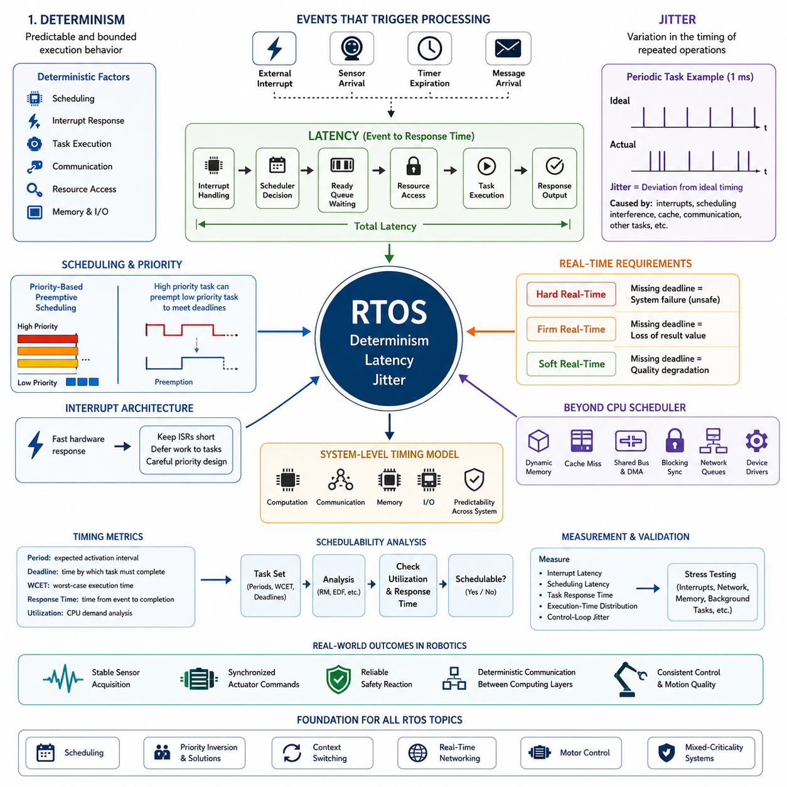
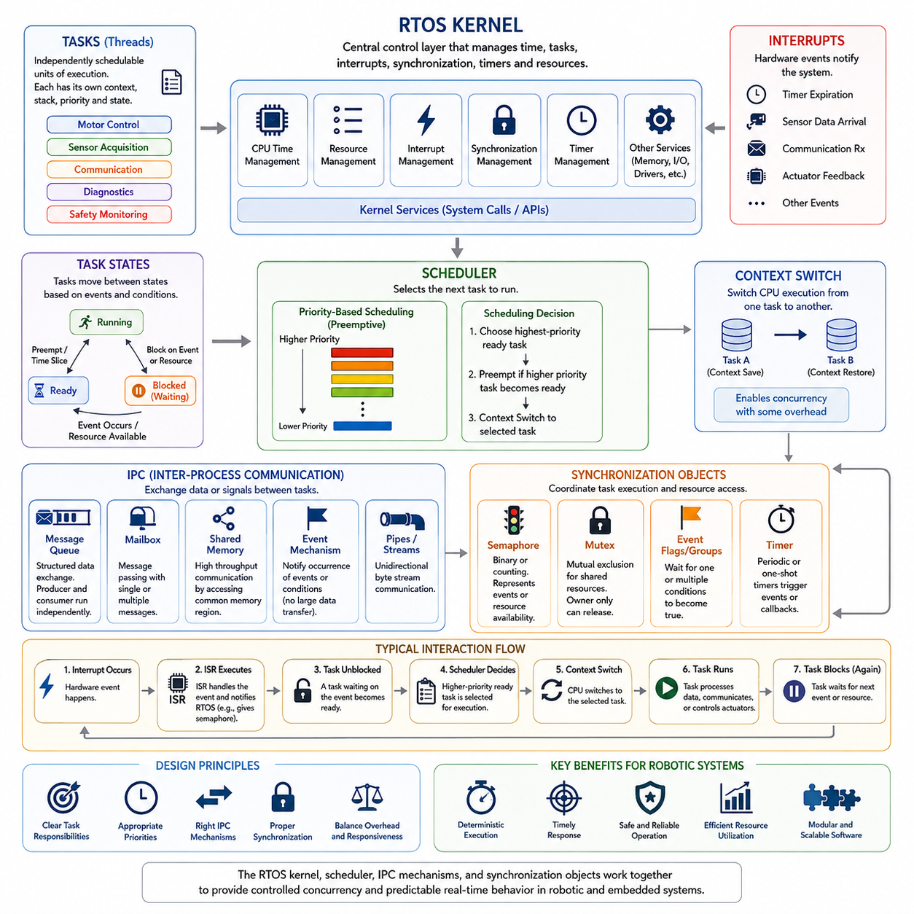
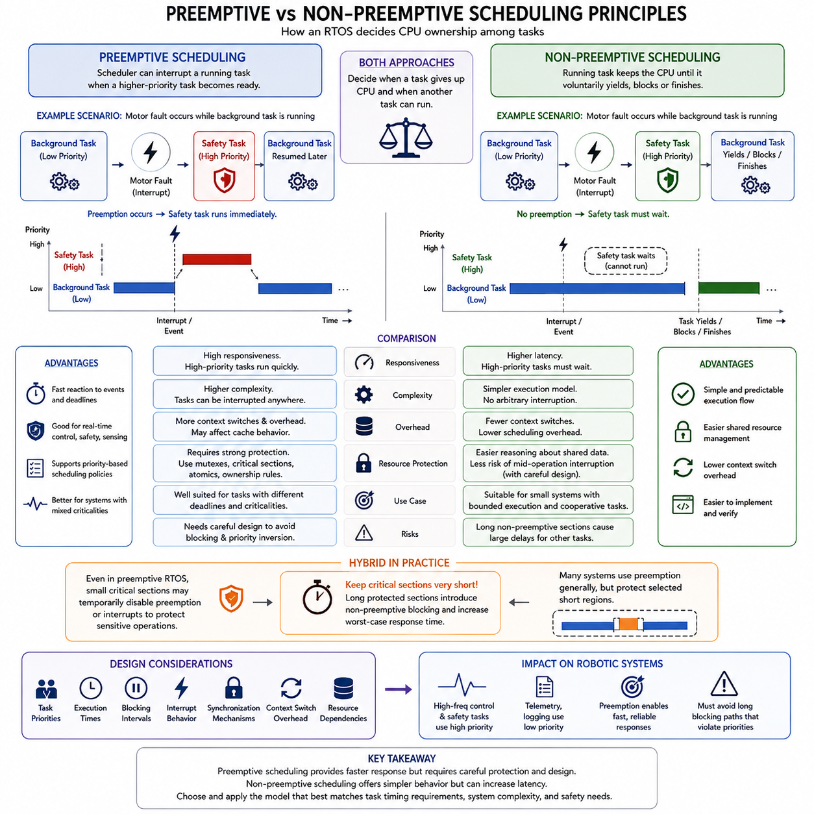
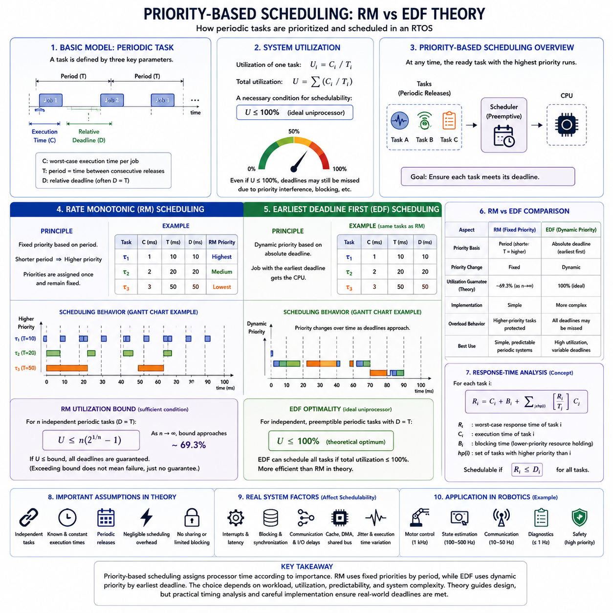
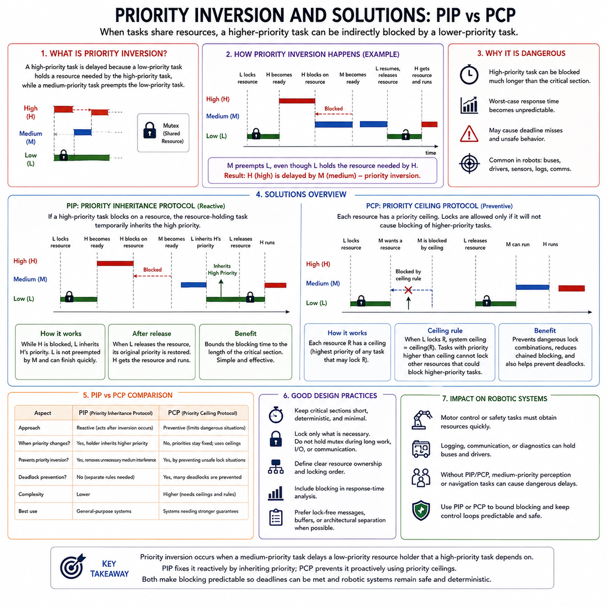
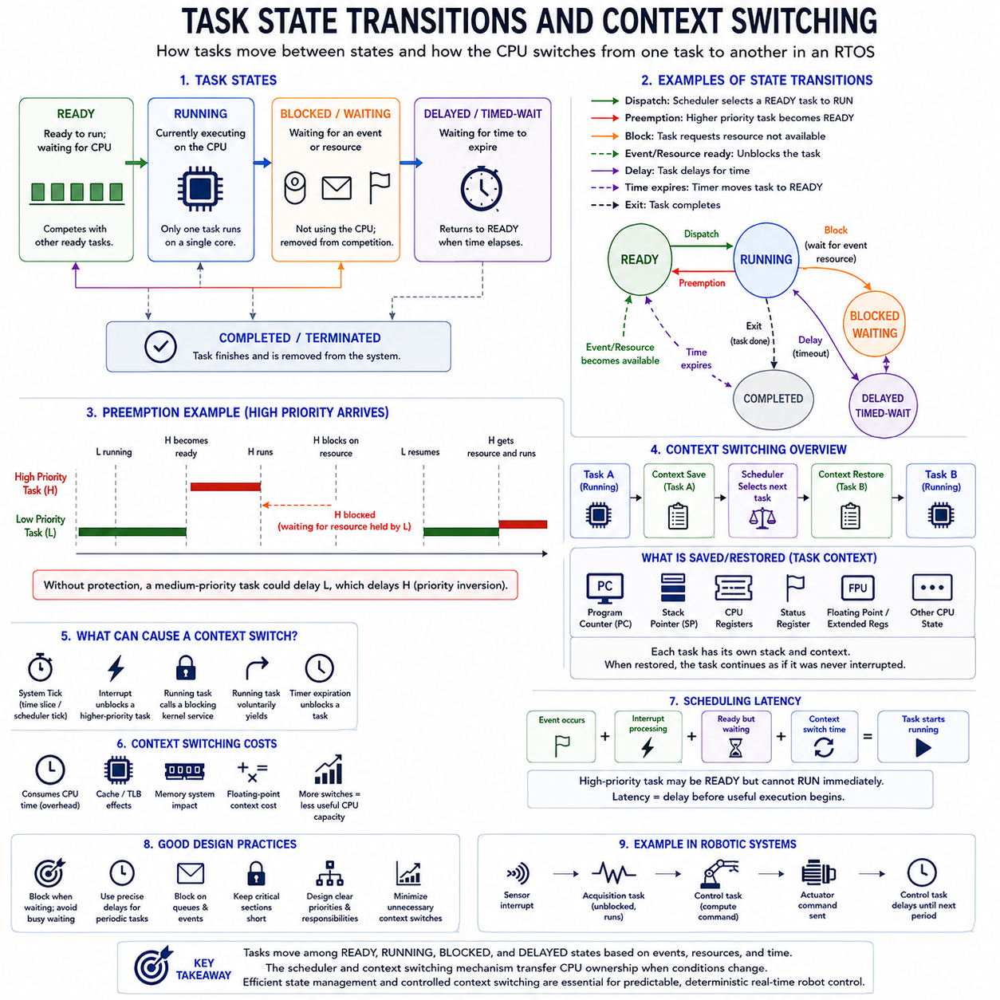
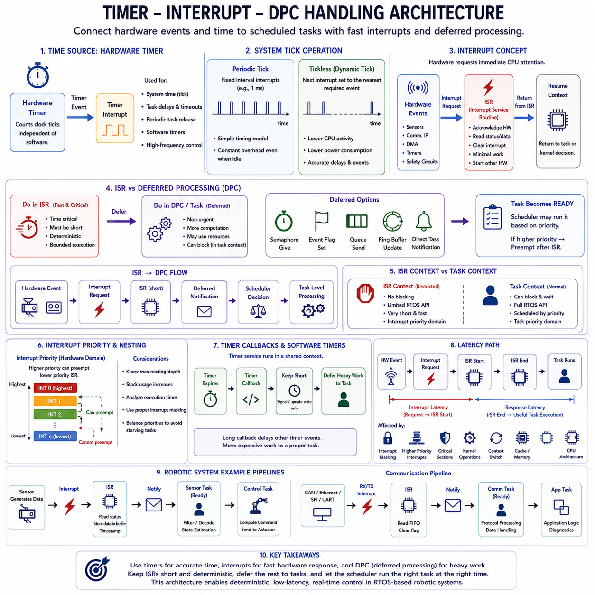
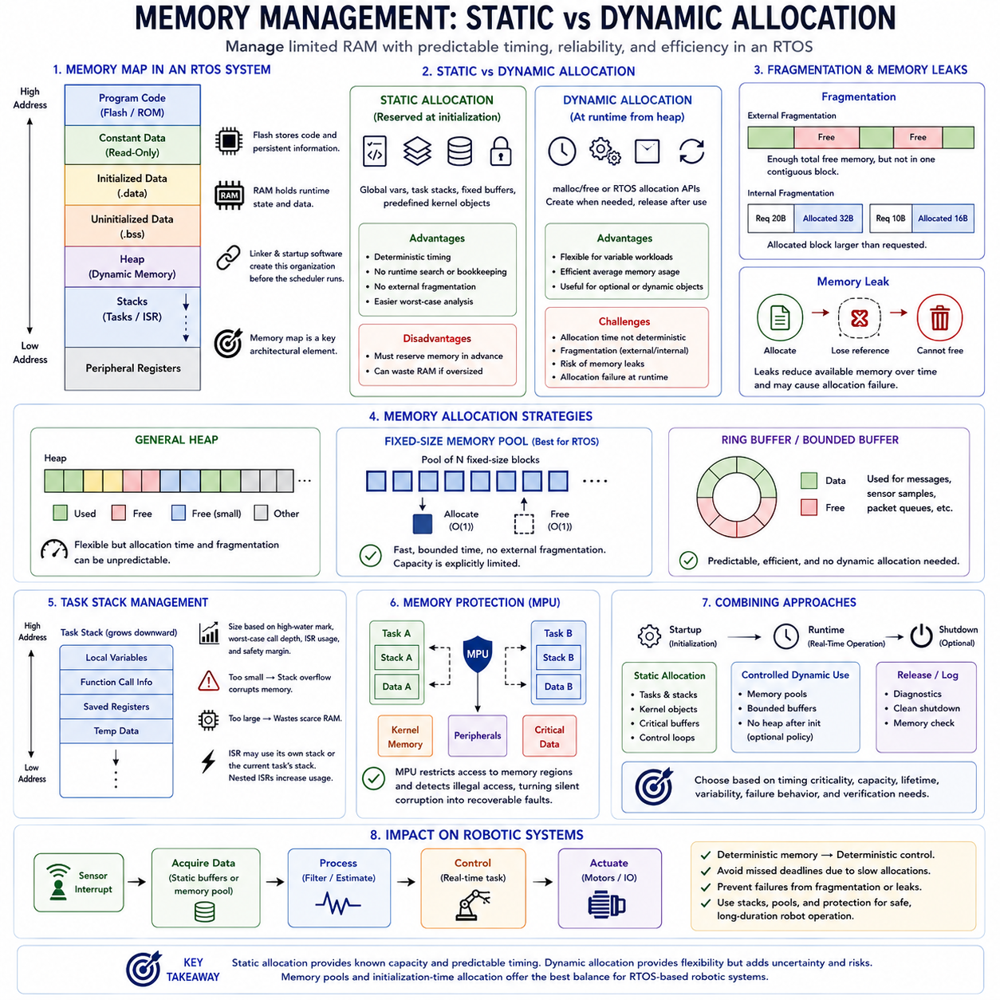
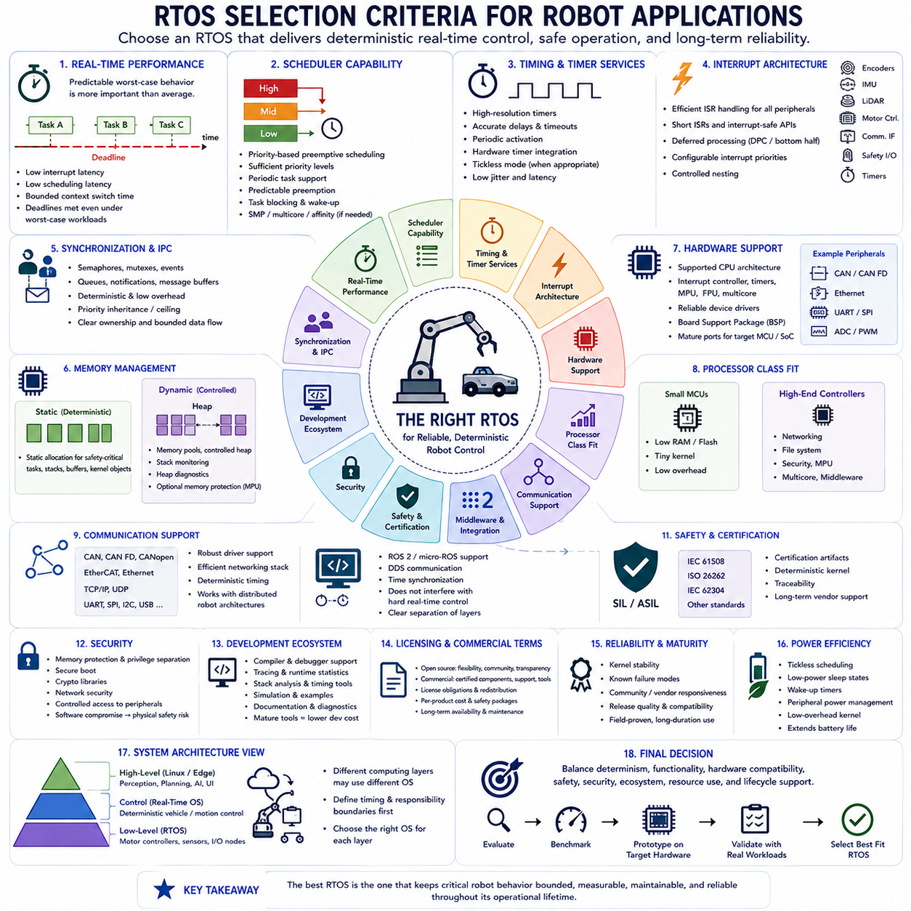
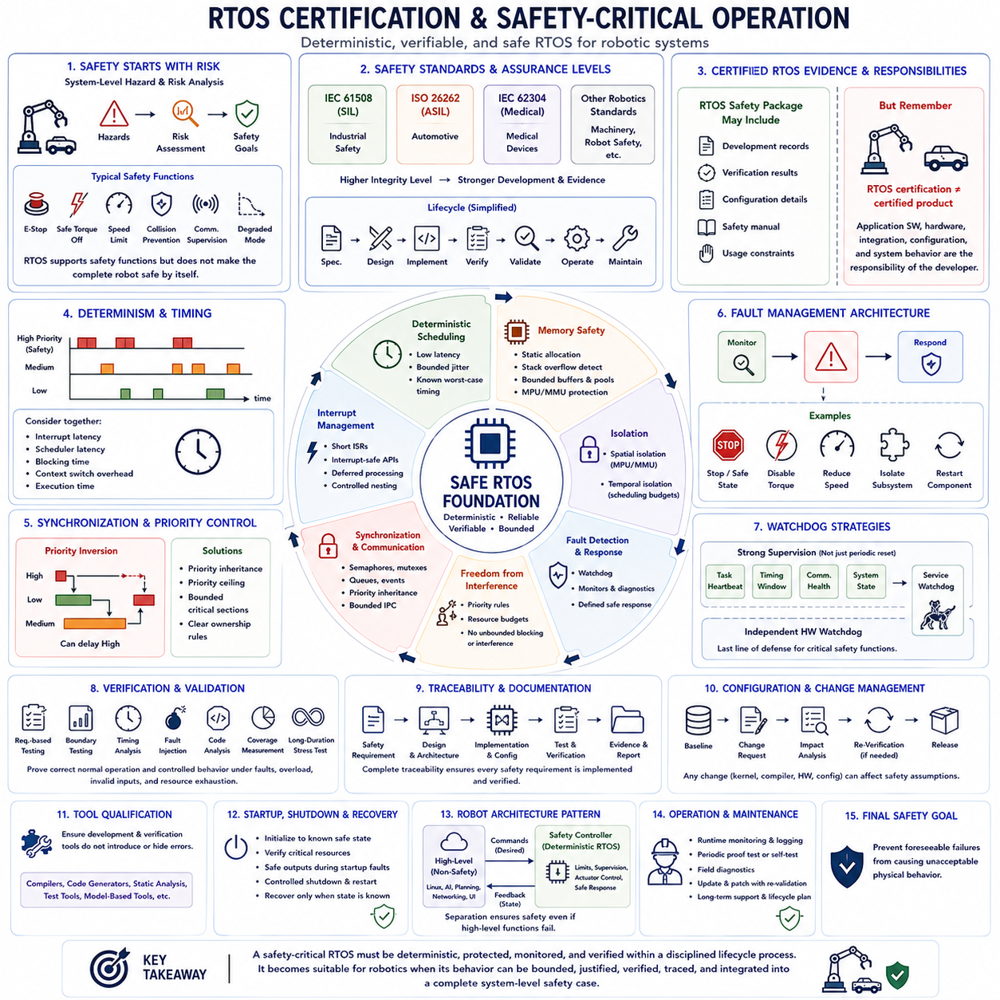

**Volume 03 Real Time Operating Systems**

# 01. RTOS Fundamentals

## 01.01 RTOS Concept: Determinism, Latency, Jitter

{width="7.268055555555556in" height="7.268055555555556in"}

A real-time operating system (RTOS) is designed to execute software activities within predictable timing constraints rather than merely achieving high average computational performance. In robotics and embedded control, correctness therefore depends on both the logical result and the time at which that result becomes available. This timing-centered behavior distinguishes an RTOS from a conventional general-purpose operating system.

The central property of an RTOS is determinism, meaning that important operations have predictable and bounded execution behavior. Determinism does not necessarily mean that every operation always takes exactly the same amount of time. Instead, designers must be able to establish meaningful worst-case limits for scheduling, interrupt response, task execution, communication, and resource access.

Deterministic behavior is particularly important in physical systems because software interacts continuously with sensors and actuators. A motor controller may need updated commands every millisecond, while an inertial sensor must be sampled at a stable interval. Missing these timing requirements can degrade control quality even when the calculations themselves are mathematically correct and eventually produce the expected values.

Latency describes the elapsed time between an event and the system response associated with that event. An external interrupt, sensor arrival, timer expiration, or communication message may initiate processing, but the corresponding task cannot always execute immediately. Interrupt handling, scheduler decisions, higher-priority tasks, resource contention, memory access, and communication delays can all contribute to total latency.

Real-time design therefore focuses strongly on worst-case latency rather than average latency. A system whose response normally requires 50 microseconds but occasionally requires 5 milliseconds may be unsuitable for a control function requiring a response within 1 millisecond. In contrast, a system consistently responding within 500 microseconds may be preferable because its timing behavior can be incorporated reliably into system-level design.

Jitter represents variation in the timing of repeated operations. If a periodic control task is intended to execute every 1 millisecond, ideal activations occur at precisely uniform intervals. Actual execution may instead occur after 0.98, 1.03, or 1.01 milliseconds because of interrupts, scheduling interference, cache effects, communication delays, or other activities. These deviations from the expected timing constitute jitter.

Latency and jitter are related but describe different characteristics. Latency concerns how long a response takes, whereas jitter concerns how much that timing changes between executions. A system can have relatively large but highly stable latency, or low average latency with substantial jitter. For feedback control, synchronized sensing, motion generation, and industrial communication, both characteristics must therefore be evaluated independently.

RTOS scheduling mechanisms are intended to control these timing properties by assigning execution priorities and determining when tasks may preempt one another. A high-priority control task can interrupt lower-priority diagnostic or communication processing when necessary. This does not eliminate latency, but it makes interference more manageable and allows critical execution paths to be analyzed against defined deadlines.

Interrupt architecture also directly influences deterministic performance. Hardware interrupts allow urgent events to receive rapid attention, but excessive interrupt processing can delay scheduled tasks and increase jitter. Effective RTOS designs therefore keep interrupt service routines short, transfer deferred work to appropriate tasks, and carefully define priorities so that fast hardware response does not unintentionally disrupt critical periodic control execution.

A useful distinction exists between hard, firm, and soft real-time requirements. In a hard real-time function, missing a deadline is considered a system failure and may create an unsafe condition. Firm real-time processing loses practical value when its deadline is missed, while soft real-time processing tolerates occasional delays with degraded quality. Robot systems commonly contain all three classes simultaneously.

For example, a robot may operate a high-frequency motor current loop under strict timing constraints while perception, logging, telemetry, and user-interface functions operate at slower and less deterministic rates. The RTOS architecture must prevent lower-criticality workloads from disturbing control functions. This separation becomes increasingly important when embedded processors combine control, networking, sensing, and intelligent computation.

Determinism must also be considered beyond the CPU scheduler. Dynamic memory allocation, cache misses, shared buses, DMA activity, blocking synchronization, network queues, and device-driver behavior can introduce variable delays. Consequently, real-time engineering requires a system-level timing model rather than simply selecting an RTOS kernel. Predictability must extend across computation, communication, memory, and I/O paths.

Timing requirements are normally expressed using periods, deadlines, response times, and worst-case execution times. A periodic task has an expected activation interval, while its deadline specifies when processing must be completed. Worst-case execution time estimates how long the task may require under demanding conditions. Schedulability analysis then determines whether all critical tasks can satisfy their timing constraints together.

Measurement is essential because theoretical timing guarantees must be validated on the target hardware. Engineers observe interrupt latency, scheduling latency, task response time, execution-time distributions, and control-loop jitter under realistic workloads. Stress conditions are especially important because rare delays caused by competing interrupts, network traffic, memory activity, or background tasks may reveal failures hidden by average performance measurements.

In robotics, the practical purpose of determinism is ultimately predictable interaction with the physical world. Stable timing enables repeatable sensor acquisition, synchronized actuator commands, reliable safety reactions, and controlled communication between computing layers. These principles establish the foundation for later RTOS topics such as scheduling, priority inversion, context switching, real-time networking, motor control, and mixed-criticality systems.

## 01.02 RTOS Core Components: Kernel, Scheduler, IPC Objects

{width="7.268055555555556in" height="7.268055555555556in"}

An RTOS is built around a small set of core components that cooperate to provide predictable execution of concurrent software activities. The kernel forms the central control layer, while the scheduler determines which task executes at each instant. Inter-process communication mechanisms and synchronization objects coordinate data exchange and shared resources between tasks. Together, these components establish the execution framework required by real-time embedded and robotic systems.

The kernel is the fundamental software layer responsible for managing processor time, tasks, interrupts, synchronization, timers, and other system resources. Application tasks normally interact with these capabilities through kernel services rather than controlling processor execution directly. By centralizing resource management, the kernel provides a controlled environment in which multiple activities can execute concurrently while maintaining predictable timing relationships.

A task, often called a thread depending on the RTOS, represents an independently schedulable sequence of execution. Each task normally has its own execution context, stack, priority, and state information maintained by the kernel. Robot software can therefore separate motor control, sensor acquisition, communication, diagnostics, and safety monitoring into different tasks while allowing the RTOS to coordinate their execution on the available processor resources.

Tasks move between states according to execution conditions and kernel events. A running task currently owns the processor, while a ready task is capable of executing but is waiting for processor access. A blocked or waiting task cannot execute until an expected event occurs, such as data arrival, semaphore release, timer expiration, or resource availability. This state-based organization allows the kernel to avoid wasting processor time on tasks that cannot make useful progress.

The scheduler is the kernel component responsible for selecting the next task to execute. In a priority-based RTOS, the scheduler normally selects the highest-priority task that is currently ready. When a higher-priority task becomes ready, a preemptive scheduler can suspend the lower-priority running task and immediately transfer processor control. This behavior enables time-critical functions to receive processor access ahead of less urgent workloads.

A context switch occurs when processor execution changes from one task to another. The RTOS must preserve the execution state of the outgoing task and restore the state of the incoming task so that both can continue correctly. Context switching enables concurrency but also introduces execution overhead. Real-time system design therefore considers both the responsiveness gained through preemption and the timing cost created by frequent task transitions.

The scheduler does not operate independently from interrupts. Hardware interrupts can signal events such as timer expiration, sensor data arrival, communication reception, or actuator feedback. An interrupt service routine may process the immediate hardware condition and then notify an RTOS task. If that notification makes a higher-priority task ready, the scheduler can initiate a context switch so that urgent processing begins as soon as the interrupt handling permits.

Inter-process communication(IPC) mechanisms allow independently executing tasks or software components to exchange information. In RTOS environments, common IPC concepts include message queues, mailboxes, shared memory, event mechanisms, and synchronization objects. The appropriate mechanism depends on data size, communication direction, timing requirements, ownership rules, and whether the communication must transfer actual data or merely signal that an event has occurred.

A message queue provides structured communication by allowing one task to place data into a kernel-managed queue and another task to retrieve it. The producer and consumer do not necessarily need to execute simultaneously, which reduces direct timing dependency between them. In a robot controller, a sensor task might place measurements into a queue while a control task retrieves them according to its own scheduling behavior and priority requirements.

Shared memory provides a different communication model in which multiple tasks access the same memory region rather than transferring data through a kernel-managed message container. This approach can reduce copying overhead and support high-throughput communication, but it creates synchronization requirements. Without controlled access, multiple tasks may read and modify shared data concurrently, producing race conditions, inconsistent states, or timing-dependent software failures.

Semaphores are synchronization objects commonly used to coordinate task execution or represent the availability of resources and events. A binary semaphore can represent a simple available-or-unavailable condition, while a counting semaphore can represent multiple occurrences or multiple equivalent resources. Tasks can block while waiting for a semaphore, allowing the scheduler to execute other ready tasks instead of consuming processor time through continuous polling.

A mutex provides controlled mutual exclusion when multiple tasks must access a shared resource that cannot safely be used concurrently. Only the task that acquires the mutex is permitted to enter the protected critical section, and other requesting tasks must wait until it is released. Unlike simple signaling mechanisms, mutex design is closely related to task ownership and priority management because poorly controlled locking can interfere with real-time scheduling behavior.

Event objects provide efficient synchronization when task execution depends on one or more system conditions rather than on the transfer of substantial data. An event may indicate that sensor initialization has completed, communication is available, a safety condition has changed, or several subsystem states are simultaneously valid. Event flags or event groups can therefore represent combinations of conditions that allow tasks to remain blocked until meaningful execution becomes possible.

RTOS timers provide time-based kernel services without requiring every application task to implement its own timing mechanism. Periodic timers can initiate recurring operations, while one-shot timers can signal an event after a specified interval. Timers are useful for communication timeouts, supervision functions, periodic maintenance, and state-machine transitions. Their callbacks and associated processing must nevertheless be designed carefully to avoid creating excessive scheduler or kernel workload.

These kernel objects interact rather than operating as isolated features. A hardware interrupt may release a semaphore, which changes a control task from blocked to ready. The scheduler may then determine that this task has higher priority than the currently running communication task and perform a context switch. The control task may read shared sensor data protected by synchronization, calculate an output, place a command in a queue, and then block again while waiting for the next event.

The effectiveness of an RTOS architecture therefore depends on how kernel services, scheduling policies, IPC mechanisms, and synchronization objects are combined. Excessive tasks increase scheduling and context-switch overhead, inappropriate queues add unnecessary latency, and poorly designed locks create blocking or priority problems. A well-structured design assigns clear responsibilities to tasks and selects communication objects according to timing, data ownership, concurrency, and resource-sharing requirements.

In robotic systems, these core RTOS components form the bridge between software concurrency and deterministic physical control. The kernel provides controlled execution, the scheduler determines when computation occurs, IPC transports information between activities, and synchronization objects preserve correct coordination. Understanding these relationships provides the foundation for preemptive scheduling, priority inversion, task-state transitions, memory management, real-time networking, and high-frequency robot control developed in the subsequent RTOS topics.

## 01.03 Preemptive vs Non-Preemptive Scheduling Principles

{width="7.268055555555556in" height="7.268055555555556in"}

Preemptive and non-preemptive scheduling define two fundamental ways an RTOS controls processor ownership among competing tasks. Both approaches determine when a running task must give up the CPU and when another task may begin execution. Their differences directly influence responsiveness, implementation complexity, context-switching behavior, resource protection, and the ability of a real-time system to satisfy deadlines under varying workloads.

In preemptive scheduling, the RTOS scheduler can interrupt a currently running task when another task with a higher scheduling priority becomes ready. The interrupted task does not need to complete its current operation voluntarily. Instead, the kernel preserves its execution context, transfers processor control to the higher-priority task, and later restores the interrupted task so that execution can continue from the point at which it was suspended.

This mechanism is particularly useful when different software activities have significantly different timing requirements. A low-priority diagnostic or logging task may be executing when an urgent motor-control, safety-monitoring, or communication task becomes ready. Preemption allows the urgent task to receive CPU time quickly rather than waiting for the lower-priority activity to complete, thereby reducing response latency for time-critical functions.

Preemptive scheduling is therefore closely associated with priority-based real-time system design. The scheduler continually considers which ready task has the strongest claim on processor time according to the configured scheduling policy. When task readiness changes because of an interrupt, timer, semaphore, message, or other kernel event, the scheduler may immediately reconsider processor ownership and initiate a context switch if a higher-priority task should execute.

The principal advantage of preemption is responsiveness. High-priority tasks can react rapidly to external events and periodic deadlines even when lower-priority software is consuming processor time. This behavior is important for robotic control loops, actuator supervision, emergency handling, and synchronized sensing. However, responsiveness does not automatically guarantee correct real-time behavior because blocking, excessive execution time, and inappropriate priority assignments can still cause deadlines to be missed.

Preemption also introduces additional complexity. Since a task can be suspended at many points during execution, shared data and resources must be protected against concurrent access. A task might be interrupted while modifying a data structure, after which another task could access that partially updated information. Mutexes, critical sections, atomic operations, and carefully designed ownership rules are therefore essential elements of reliable preemptive software architecture.

Frequent preemption can additionally increase context-switching overhead and disturb cache behavior. Saving and restoring processor registers, switching stacks, changing memory working sets, and reloading cache contents all consume execution time. Although individual context switches are usually short, excessive switching can reduce available CPU capacity and introduce timing variation. RTOS designers therefore balance rapid response against unnecessary scheduling activity.

In non-preemptive scheduling, a running task retains control of the processor until it voluntarily releases execution, blocks while waiting for an event or resource, or completes its current unit of work. A newly ready higher-priority task cannot automatically interrupt it. The higher-priority task must wait until the current task reaches a scheduling point where processor control can be returned to the kernel.

This cooperative execution model can simplify reasoning about shared resources because arbitrary task interruption does not occur during normal task execution. If software is structured carefully, some shared-data operations can be completed without another task unexpectedly running in the middle of them. The number of context switches may also be reduced, producing relatively simple execution sequences and potentially lower scheduling overhead.

The primary limitation of non-preemptive scheduling is response latency. A high-priority task may become ready but remain unable to execute because a lower-priority task still owns the processor. Its worst-case waiting time therefore depends strongly on the longest non-preemptive execution section. If one task performs a lengthy computation without yielding or blocking, all other tasks may experience substantial delays regardless of their priorities.

For this reason, non-preemptive systems require disciplined task design. Execution sections should remain bounded and sufficiently short relative to the deadlines of other activities. Long loops, blocking device operations, unpredictable calculations, or uncontrolled processing inside a cooperative task can damage system responsiveness. The simplicity of non-preemptive scheduling is therefore obtained only when application behavior itself provides suitable scheduling opportunities.

The difference between the two approaches can be understood through an urgent-event scenario. Suppose a background task is processing diagnostic information when a motor fault occurs. Under preemptive scheduling, an interrupt can make the safety task ready, after which the scheduler can suspend the background task and execute the safety function immediately. Under non-preemptive scheduling, the safety task must wait until the background task releases the processor.

Neither approach should be interpreted simply as universally superior. Preemptive scheduling generally provides stronger responsiveness and is widely suited to systems containing tasks with different criticalities and deadlines. Non-preemptive scheduling can offer simpler execution behavior when workloads are small, execution times are tightly bounded, and cooperative task structure is acceptable. Some systems also combine both principles by allowing preemption generally while protecting selected short execution regions.

Critical sections illustrate this hybrid behavior. Even in a preemptive RTOS, software may temporarily prevent certain forms of preemption while manipulating hardware registers or highly sensitive shared state. Such regions must remain extremely short because disabling scheduling or interrupts effectively introduces non-preemptive blocking. The duration of these protected sections therefore contributes directly to the worst-case response time experienced by higher-priority activities.

Scheduling design must consequently consider more than the nominal scheduling mode. Task priorities, execution times, blocking intervals, interrupt behavior, synchronization mechanisms, context-switch overhead, and resource dependencies collectively determine actual real-time performance. A preemptive kernel with poorly designed locking can perform worse than expected, while a carefully bounded cooperative design may provide adequate determinism for a relatively simple embedded application.

Robotic systems commonly favor preemptive scheduling for time-critical control because they simultaneously execute motor control, sensing, communication, diagnostics, and safety functions with different urgency levels. High-frequency control and safety tasks can receive high priorities, while telemetry or logging remains at lower priorities. The architecture must nevertheless ensure that lower-level processing cannot create long blocking paths that undermine the intended priority structure.

Understanding preemptive and non-preemptive scheduling establishes the conceptual basis for more advanced RTOS scheduling topics. Priority-based scheduling, rate-monotonic and earliest-deadline-first policies, priority inversion, mutex protocols, task-state transitions, interrupt handling, and response-time analysis all depend on how processor ownership can change. The scheduling model therefore becomes a fundamental architectural decision connecting software concurrency with predictable physical behavior in real-time robotic systems.

## 01.04 Priority-Based Scheduling: RM / EDF Theory

{width="7.268055555555556in" height="7.268055555555556in"}

Priority-based scheduling is a fundamental RTOS mechanism for deciding which ready task receives processor time. Each task is assigned a priority representing its scheduling importance, and a preemptive kernel normally executes the highest-priority ready task. The central design problem is therefore not merely assigning numerical priorities, but determining a priority policy that allows every time-critical task to satisfy its period and deadline requirements predictably.

Real-time scheduling theory commonly models a periodic task using its execution time, period, and deadline. The execution time represents the processor time required for one activation, the period defines how frequently the task is released, and the deadline specifies when that activation must finish. Scheduling analysis examines whether a collection of such tasks can share a processor while ensuring that all required deadlines are satisfied.

Processor utilization provides a basic indication of scheduling demand. For a periodic task, utilization can be understood as the fraction of processor capacity consumed by its execution time relative to its period. Total utilization is obtained by considering all scheduled tasks together. A processor may appear lightly loaded on average yet still miss deadlines if several tasks become ready simultaneously or if their priority relationships produce excessive interference.

Rate Monotonic scheduling(RM) is a fixed-priority scheduling policy designed primarily for periodic real-time tasks. Priorities are assigned according to task periods: a task with a shorter period receives a higher priority, while a task with a longer period receives a lower priority. Once assigned, these priorities normally remain fixed during operation, making RM conceptually simple and well suited to predictable periodic control workloads.

The reasoning behind RM is that frequently executing tasks usually have less time between successive activations and therefore require rapid processor access. For example, a 1 ms motor-control task would receive higher priority than a 10 ms sensor-processing task, which would in turn receive higher priority than a 100 ms diagnostic task. Whenever multiple tasks are ready, the scheduler executes the highest-priority task according to this fixed ordering.

Classical RM theory provides a sufficient utilization bound for determining whether a set of independent periodic tasks can be guaranteed schedulable under specific assumptions. As the number of tasks increases, this conservative bound approaches approximately 69.3 percent processor utilization. Exceeding the bound does not automatically mean that deadlines will be missed; it means that the simple utilization test alone can no longer guarantee schedulability.

More precise analysis can therefore use response-time analysis rather than relying only on the RM utilization bound. A task\'s worst-case response time includes its own execution time plus interference caused by higher-priority tasks that may execute while it is waiting or running. Blocking from shared resources may also need to be included. The calculated response time is then compared with the task deadline to determine whether the task remains schedulable.

Earliest Deadline First(EDF) follows a different principle. Rather than assigning priorities permanently according to task periods, EDF dynamically gives the highest scheduling priority to the ready task whose absolute deadline occurs soonest. As time progresses and new task instances are released, priority relationships may therefore change. The scheduler continually evaluates deadlines and selects the task with the most urgent completion requirement.

Consider three ready jobs whose deadlines occur in 2 ms, 5 ms, and 10 ms. EDF selects the job with the 2 ms deadline first, regardless of which task has the shortest nominal period or a predefined static priority. After that job completes or another job with an earlier deadline arrives, the scheduler reevaluates the ready set. This dynamic behavior allows processor allocation to follow actual deadline urgency.

Under the classical idealized uniprocessor model, EDF can schedule independent preemptible periodic tasks with deadlines equal to their periods whenever their total utilization does not exceed 100 percent. This gives EDF a higher theoretical processor-utilization capability than the simple sufficient RM bound. However, practical systems introduce interrupt overhead, context switches, blocking, release jitter, communication delays, and execution-time variation that reduce usable capacity.

RM and EDF therefore represent two different priority philosophies. RM derives urgency indirectly from task frequency and produces a fixed-priority structure that is straightforward to inspect and implement. EDF derives urgency directly from absolute deadlines and continuously adjusts priorities. RM generally provides simpler operational behavior, while EDF can use processor capacity more efficiently when workloads conform to its scheduling assumptions.

Predictability under overload is another important distinction. In a fixed-priority RM system, higher-priority tasks tend to remain protected when processor demand temporarily becomes excessive, while lower-priority tasks experience failures first. EDF can achieve excellent utilization under feasible workloads, but overload can cause multiple deadline failures unless additional admission control or overload-management mechanisms are introduced.

Scheduling theory also depends strongly on its assumptions. Classical RM and EDF results often assume independent tasks, known execution times, negligible scheduling overhead, predictable release patterns, and limited or absent resource blocking. Real embedded software violates some of these assumptions through mutexes, interrupts, shared buses, DMA, communication stacks, cache behavior, and variable execution paths. Theoretical analysis must therefore be combined with implementation-aware timing analysis.

Priority assignment must also consider interactions with synchronization. A high-priority task can become blocked when a lower-priority task owns a required mutex or shared resource, creating priority inversion. Consequently, a theoretically correct priority ordering does not by itself guarantee the expected response time. Priority inheritance, priority ceiling mechanisms, bounded critical sections, and careful resource ownership are needed when scheduling and synchronization interact.

Robotic systems naturally contain workloads suitable for priority-based analysis. A motor-control loop may operate at 1 kHz, state estimation at hundreds of hertz, communication at tens of hertz, and diagnostics at much lower frequencies. RM offers an intuitive mapping from these periods to fixed priorities, while EDF becomes attractive when tasks have diverse or changing deadlines and efficient processor utilization is especially important.

In practical RTOS engineering, scheduling policy selection is therefore based on more than theoretical utilization. Designers evaluate task periods, deadlines, worst-case execution times, blocking times, interrupt latency, release jitter, context-switch overhead, overload behavior, and certification requirements. Timing measurements on the target hardware are then used to verify that the assumptions made during schedulability analysis remain valid under realistic operating conditions.

Priority-based scheduling, RM, and EDF provide the theoretical bridge between task timing requirements and processor allocation. RM demonstrates how fixed priorities can transform periodic timing requirements into a predictable execution hierarchy, while EDF demonstrates how dynamic deadline information can drive efficient scheduling decisions. These principles establish the foundation for priority inversion analysis, response-time calculation, mixed-criticality scheduling, and deterministic robot control architectures developed in subsequent RTOS topics.

## 01.05 Priority Inversion and Solutions: PIP / PCP

{width="7.268055555555556in" height="7.268055555555556in"}

Priority inversion is a scheduling condition in which a high-priority task is indirectly delayed by a lower-priority task because both depend on the same shared resource. Although priority-based scheduling is intended to give urgent tasks rapid processor access, synchronization can temporarily reverse the effective execution order. Without appropriate protection, this behavior can increase worst-case response time and threaten real-time deadline guarantees.

Consider three tasks with high, medium, and low priorities. The low-priority task first acquires a mutex protecting a shared resource. Later, the high-priority task becomes ready and preempts the low-priority task, but it soon requests the same mutex and becomes blocked because the resource is still owned by the low-priority task. At this point, the high-priority task cannot proceed until the low-priority task releases the resource.

The situation becomes problematic when the medium-priority task becomes ready. Because its priority is higher than that of the low-priority task, it can preempt the low-priority task even though the low-priority task holds the resource required by the high-priority task. The medium-priority task therefore delays the low-priority resource owner, which indirectly delays the high-priority task. The intended priority ordering has effectively been inverted.

This form of blocking can become particularly dangerous when many medium-priority activities repeatedly preempt the resource-owning low-priority task. The high-priority task may then remain blocked for much longer than the duration of the critical section itself. In poorly controlled systems, the resulting blocking interval may become difficult to bound, making response-time analysis unreliable and potentially causing critical deadlines to be missed.

Priority inversion does not mean that mutexes or shared resources should be avoided entirely. Resource sharing is often unavoidable in embedded systems because tasks may need common communication interfaces, sensor buffers, device drivers, memory structures, or hardware peripherals. The engineering objective is instead to make blocking predictable and bounded while preserving the logical correctness provided by mutual exclusion.

Priority Inheritance Protocol(PIP) addresses the problem by temporarily raising the priority of a lower-priority task when it holds a resource required by a higher-priority task. In the previous example, once the high-priority task blocks on the mutex, the low-priority resource owner inherits the high priority. This allows it to continue executing without being preempted by unrelated medium-priority tasks until it releases the required resource.

After the low-priority task releases the mutex, its inherited priority is removed and its original priority is restored. The blocked high-priority task can then acquire the resource and continue execution. PIP therefore prevents medium-priority interference from unnecessarily extending the inversion interval. The lower-priority task effectively executes with increased urgency because completing its critical section is necessary for the higher-priority task to make progress.

PIP greatly improves practical behavior, but it does not eliminate every synchronization complication. A task may hold multiple resources, inheritance may propagate through chains of blocked tasks, and nested locking can create complex priority relationships. Depending on the locking structure, deadlock and repeated blocking may still be possible. Implementations must therefore correctly manage inherited priorities and restore them as resource dependencies change.

Priority Ceiling Protocol(PCP) takes a more preventive approach. Each shared resource is assigned a priority ceiling related to the highest priority of any task that may access that resource. When tasks attempt to acquire resources, the protocol uses these ceilings to restrict locking situations that could create unsafe blocking relationships. Rather than only reacting after inversion occurs, PCP constrains resource access according to known priority relationships.

The priority ceiling concept allows the system to reason about synchronization before problematic resource dependencies develop. A task entering a protected critical section may execute under rules derived from the resource ceiling, preventing certain other tasks from acquiring conflicting resources. This can reduce chained blocking and provide stronger bounds on how long a high-priority task can be delayed by lower-priority resource holders.

An important advantage of ceiling-based protocols is their relationship to deadlock prevention. Deadlock can occur when tasks acquire multiple resources in incompatible orders and wait cyclically for one another. By restricting when resources may be locked according to priority ceilings and current system conditions, PCP can prevent many circular-wait situations that ordinary mutex locking or basic priority inheritance alone does not inherently eliminate.

PIP and PCP therefore address the same fundamental problem from different directions. PIP is primarily reactive: when a high-priority task becomes blocked, the resource owner inherits the required priority so that it can finish quickly. PCP is more preventive: resource ceilings and acquisition rules constrain locking behavior before problematic interference develops. Both mechanisms seek to transform uncontrolled priority inversion into predictable bounded blocking.

The effectiveness of either protocol still depends strongly on critical-section design. A low-priority task that holds a mutex while performing lengthy computation, network communication, storage access, or another unpredictable operation can still create substantial blocking. Critical sections should therefore remain short, deterministic, and limited to operations that genuinely require mutual exclusion. Expensive processing should normally occur outside the protected region whenever possible.

Response-time analysis must include synchronization blocking when determining whether deadlines can be satisfied. The response time of a high-priority task is influenced not only by its own execution and interference from higher-priority tasks, but also by the maximum blocking caused by lower-priority tasks holding required resources. PIP or PCP makes this blocking more structured, allowing designers to establish useful worst-case bounds for schedulability analysis.

Robotic systems frequently contain shared resources capable of creating priority inversion. A low-priority logging or communication task might hold a bus interface, sensor structure, or driver lock when a high-priority motor-control or safety task requires the same resource. If medium-priority perception or navigation processing repeatedly preempts the resource owner, the resulting delay can propagate directly into physical control and safety response.

Good RTOS architecture therefore combines appropriate synchronization protocols with careful resource ownership. High-criticality control paths should minimize dependence on resources shared with long-running lower-priority software. Where sharing is unavoidable, mutexes supporting priority inheritance or ceiling mechanisms can bound interference. Lock-free communication, dedicated buffers, message passing, or architectural separation may further reduce contention in demanding control paths.

Priority inversion demonstrates why task priority alone cannot guarantee real-time performance. Scheduling and synchronization must be analyzed as one integrated timing system because resource dependencies can change the effective execution order. PIP and PCP provide systematic mechanisms for controlling these effects, establishing the foundation for bounded blocking, reliable response-time analysis, deterministic synchronization, and safe real-time robot control.

## 01.06 Task State Transitions and Context Switching

{width="7.268055555555556in" height="7.268055555555556in"}

A task in an RTOS is not continuously executing from creation to completion. Instead, it moves among defined execution states according to processor availability, scheduling decisions, synchronization events, and resource conditions. Task-state transitions allow the kernel to represent which tasks can execute, which task currently owns the CPU, and which tasks must wait, forming the operational basis of multitasking in real-time embedded systems.

The ready state indicates that a task has everything required for execution except access to the processor. A ready task is not waiting for data, a synchronization object, or a timer; it is simply competing with other ready tasks for CPU time. The scheduler evaluates these tasks according to its scheduling policy, typically selecting the highest-priority ready task in a priority-based preemptive RTOS.

The running state identifies the task currently executing instructions on a processor core. In a single-core system, only one task can normally be running at any instant, although several other tasks may remain ready. The running task continues until it is preempted, blocks while waiting for an event or resource, voluntarily yields execution, reaches a delay condition, or completes according to the task-management model.

A blocked or waiting state occurs when a task cannot make useful progress until a specific condition becomes true. A task may wait for a semaphore, mutex, message queue, event flag, communication packet, sensor update, or other resource. Instead of repeatedly polling for the condition, the RTOS removes the task from CPU competition and allows another ready task to execute, improving processor efficiency and scheduling predictability.

A delayed or timed-wait state is commonly used when execution must resume after a specified interval or at a particular periodic release point. For example, a motor-control task may execute once every millisecond and then delay until its next activation. The RTOS timer mechanism tracks the delay and returns the task to the ready state when the required time expires, supporting periodic execution without continuous busy waiting.

Task-state transitions are triggered by both task actions and external events. A running task may become blocked when it requests an unavailable resource, while a blocked task may become ready when another task releases a semaphore or places data into a queue. Similarly, a timer interrupt can move a delayed task into the ready state. Each transition changes the set of tasks that the scheduler must consider for processor execution.

Preemption creates another important transition. If a higher-priority task becomes ready while a lower-priority task is running, a preemptive scheduler can move the current task from running to ready and dispatch the higher-priority task. The lower-priority task has not completed or blocked; it remains executable but temporarily loses processor ownership because another task has a stronger scheduling priority.

A context switch is the mechanism that makes this change of processor ownership possible. When execution moves from one task to another, the RTOS must preserve enough processor state for the outgoing task to resume later as though it had never been interrupted. The kernel then restores the saved state of the incoming task and transfers execution to the instruction at which that task should continue.

The saved task context typically includes the program counter, stack pointer, processor registers, status information, and architecture-specific execution state. Depending on the processor and RTOS design, floating-point or extended registers may also need to be preserved. Each task normally has its own stack, allowing local variables, function calls, return addresses, and saved execution information to remain associated with that task.

Context switching can be initiated by several mechanisms. A periodic system tick may cause the scheduler to reconsider task execution, an interrupt may unblock a higher-priority task, a running task may call a blocking kernel service, or a task may voluntarily yield. Modern RTOS designs can also operate in tickless configurations, where scheduling activity is driven more directly by timers and actual events rather than a continuously periodic scheduler tick.

An interrupt does not necessarily imply a task context switch. The processor may enter an interrupt service routine, handle the event, and then return to the same task if no scheduling decision has changed. However, if the interrupt releases a semaphore or delivers data that makes a higher-priority task ready, the RTOS may perform a context switch when interrupt processing completes, allowing the newly ready task to execute immediately.

Context switches introduce unavoidable execution overhead because saving state, selecting a task, restoring context, and changing memory or cache working sets require processor time. Excessive task fragmentation or unnecessary synchronization can therefore reduce useful CPU capacity. Cache misses, memory-system effects, floating-point context preservation, and processor architecture can make the practical switching cost larger than the basic kernel operation itself.

The relationship between task states and context switching is therefore important for deterministic timing analysis. A high-priority task may be ready but unable to run immediately because interrupts are disabled, the kernel is inside a protected region, or another non-preemptible operation is executing. Scheduling latency describes part of this delay, while context-switch time contributes additional latency before the selected task actually begins useful processing.

Well-designed RTOS software minimizes unnecessary transitions while allowing tasks to block whenever they have no useful work. Event-driven execution is generally preferable to continuous polling because blocked tasks consume no processor time while waiting. Periodic tasks can use precise delay mechanisms, communication tasks can block on queues, and resource-dependent tasks can wait on synchronization objects, producing clearer timing relationships and lower CPU consumption.

In robotic control, task-state transitions can directly represent the flow of physical events. A sensor interrupt may move an acquisition task from blocked to ready, which can preempt a diagnostic task and process new measurements. The acquisition task may then signal a control task, which computes an actuator command and blocks until the next control period. The RTOS continuously converts hardware and software events into controlled task-state transitions.

The frequency of context switching should therefore be considered when partitioning robot software into tasks. Creating a separate task for every small function can increase scheduler activity, synchronization, memory consumption, and timing variation. Conversely, combining unrelated activities into one long-running task can increase blocking and response latency. Effective architecture selects task boundaries according to timing, priority, data flow, resource ownership, and functional responsibility.

Task states and context switching ultimately describe how an RTOS transforms concurrent software requirements into actual sequential processor execution. Ready, running, blocked, and delayed states represent execution eligibility, while the scheduler and context-switch mechanism transfer CPU ownership when conditions change. Understanding these mechanisms provides the foundation for task design, interrupt interaction, synchronization, timing analysis, and deterministic high-frequency control in real-time robotic systems.

## 01.07 Timer, Interrupt, DPC Handling Architecture

{width="7.268055555555556in" height="7.268055555555556in"}

Timer, interrupt, and deferred processing mechanisms form a critical execution architecture inside an RTOS because they connect asynchronous hardware events and time-based activities to scheduled software tasks. Their design determines how quickly the system reacts to external conditions, how long normal task execution is interrupted, and how predictable the resulting timing remains. In robotic systems, these mechanisms connect sensors, communication interfaces, control loops, and actuators to deterministic software execution.

A hardware timer provides a precise time reference independent of normal application execution. The processor or peripheral timer counts clock events and generates an interrupt when a programmed condition is reached. RTOS kernels use timers for system timing, periodic task activation, delays, timeouts, and scheduling services. Hardware timers can also directly support high-frequency control functions that require timing accuracy beyond ordinary application-level software delays.

The traditional RTOS system tick is generated by a periodic timer interrupt. At each tick, the kernel updates its internal time representation and determines whether delayed tasks, software timers, or timeout conditions have expired. A task waiting for a specified period may consequently move from the delayed state to the ready state. The scheduler can then determine whether the newly ready task should preempt the task that was executing before the timer interrupt occurred.

Periodic ticks provide a simple timing model but introduce recurring processor overhead even when little work is occurring. Tickless RTOS operation reduces this overhead by programming the next timer interrupt according to the nearest required wake-up event rather than generating interrupts continuously at a fixed frequency. This approach can reduce CPU activity and power consumption while still maintaining accurate task delays and scheduled events.

An interrupt allows hardware to request immediate processor attention without requiring software to continuously poll a device. Sensors, communication controllers, timers, DMA engines, and safety circuits can generate interrupts when meaningful events occur. The processor temporarily suspends normal execution, saves the required execution state, and transfers control to an interrupt service routine(ISR) associated with the interrupt source.

The ISR performs the immediate work necessary to acknowledge and stabilize the hardware event. It may read a device status register, capture a timestamp, retrieve a small amount of received data, clear an interrupt condition, or initiate another hardware operation. Because interrupts delay normal task execution and may prevent lower-priority interrupts from running, ISR processing should normally remain short, deterministic, and bounded.

Complex processing should generally not be performed directly inside an ISR. Parsing large communication packets, executing control algorithms, performing memory-intensive calculations, writing storage, or waiting for resources can create excessive interrupt latency and jitter. Instead, the ISR should capture the minimum information required and defer the remaining work to a software execution context that can operate under normal scheduling rules.

Deferred Procedure Call(DPC) is a general architectural concept for moving non-urgent interrupt-related processing out of the immediate interrupt context. Different operating systems use different names, such as deferred interrupt handling, bottom halves, worker tasks, or deferred callbacks. The common principle is to divide interrupt processing into a fast immediate stage and a later scheduled stage that performs more substantial computation.

In this architecture, the ISR handles the hardware-critical portion and then schedules or signals deferred processing. The deferred component may execute as a kernel mechanism or as a dedicated RTOS task, depending on the operating system. This separation reduces the time spent at interrupt level, allowing other interrupts and critical tasks to receive processor attention while preserving the information required for subsequent processing.

RTOS task notification mechanisms provide a common method for implementing deferred processing. An ISR may release a semaphore, set an event flag, send an item to a queue, update a ring buffer, or issue a direct task notification. A task waiting on that mechanism then becomes ready. If the awakened task has higher priority than the currently interrupted task, the scheduler may arrange an immediate context switch after interrupt processing completes.

The transition from interrupt context to task context is important because kernel services available inside an ISR are often restricted. Operations that can block must generally not be performed because an interrupt handler cannot wait in the same way as a normal task. RTOS implementations therefore commonly provide special interrupt-safe API functions designed to update kernel objects without violating scheduler or synchronization rules.

Interrupt priority must be coordinated with task priority, although the two represent different scheduling domains. Hardware interrupt priority determines which interrupt can interrupt another interrupt or processor activity, while task priority determines which ready software task the scheduler executes. Assigning every interrupt the highest hardware priority can therefore be counterproductive because long or frequent interrupt activity may prevent even critical RTOS tasks from receiving CPU time.

Nested interrupts allow a higher-priority interrupt to preempt a lower-priority ISR when supported by the processor and configured by the system. This can improve response to exceptionally urgent hardware events, but it increases timing-analysis complexity and stack requirements. Designers must understand the maximum nesting depth, execution time of each handler, interrupt masking rules, and cumulative interference when establishing worst-case interrupt latency.

Timer callbacks and software timers also require careful architectural treatment. Although they provide convenient time-based execution, callbacks may run within a shared timer-service context rather than as independent application tasks. A long callback can consequently delay other timer events. Good designs use timer callbacks for short signaling or state updates and transfer expensive operations to appropriately prioritized tasks.

Interrupt latency describes the delay between a hardware interrupt request and the beginning of the corresponding interrupt handler. Additional latency occurs between completion of the immediate handler and useful execution of the deferred task. Interrupt masking, higher-priority interrupts, critical sections, kernel operations, context switching, cache behavior, and processor architecture all contribute to the complete event-to-response timing path.

A robotic sensor pipeline illustrates this architecture clearly. A sensor produces new data and generates an interrupt. The ISR acknowledges the device, records timing information, and places the received data or descriptor into a buffer. It then wakes a sensor-processing task and exits quickly. The scheduler selects the appropriate task, which performs filtering, decoding, state estimation, or control-related processing outside the interrupt context.

A similar structure applies to actuator and communication systems. A CAN, CANopen, Ethernet, SPI, or UART controller may generate receive and transmit interrupts, while high-frequency timers trigger periodic control activities. Immediate hardware handling remains inside short ISRs, whereas protocol processing, command generation, diagnostics, and application logic execute in scheduled tasks. This separation creates a clean boundary between hardware urgency and software workload.

The overall timer-interrupt-deferred-processing architecture can therefore be viewed as an event pipeline: hardware or time event, interrupt request, short ISR, deferred notification, scheduler decision, and task-level processing. Keeping each stage bounded makes event-to-response latency analyzable. This architecture provides the foundation for deterministic sensor acquisition, real-time communication, periodic motor control, low-jitter scheduling, and reliable physical interaction in RTOS-based robotic systems.

## 01.08 Memory Management: Static vs Dynamic Allocation

{width="7.268055555555556in" height="7.268055555555556in"}

Memory management in an RTOS determines how limited RAM is assigned to tasks, stacks, kernel objects, communication buffers, device drivers, and application data while preserving predictable timing behavior. Unlike general-purpose systems, real-time embedded software must consider not only whether enough memory is available, but also when allocation occurs, how long it takes, whether fragmentation can develop, and whether memory behavior remains deterministic throughout long-term operation.

Embedded memory is commonly divided into regions containing program code, constant data, initialized and uninitialized global data, stacks, and optionally a heap. Flash or other nonvolatile memory normally stores executable code and persistent information, while RAM contains changing runtime state. The linker and startup software establish much of this organization before the scheduler begins, making the memory map an important architectural element of an RTOS-based system.

Static memory allocation reserves memory before or during system initialization with sizes that remain known throughout operation. Global variables, statically allocated task stacks, fixed communication buffers, and predefined kernel objects are typical examples. Because memory ownership and capacity can be established before real-time execution begins, static allocation provides highly predictable behavior and is widely used for functions with strict timing or safety requirements.

A major advantage of static allocation is deterministic timing. Runtime execution does not need to search a heap, split free blocks, or perform unpredictable allocation bookkeeping when a task requires memory. The location and size of important objects are already defined. This makes worst-case execution-time analysis easier and removes many runtime allocation failures from critical control paths, although sufficient memory must be reserved in advance.

Static allocation also avoids external heap fragmentation because memory blocks are not repeatedly created and released in arbitrary patterns. This is particularly valuable in robots and industrial controllers expected to operate continuously for long periods. However, static allocation can waste RAM when buffers or task stacks are sized for worst-case conditions that rarely occur, making accurate capacity planning important on memory-constrained microcontrollers.

Dynamic memory allocation obtains memory at runtime from a managed memory region commonly called the heap. Functions conceptually similar to malloc and free, or RTOS-specific allocation services, allow software to create objects only when they are needed and release memory afterward. Dynamic allocation therefore provides flexibility for variable workloads, optional subsystems, dynamically created messages, and applications whose memory requirements cannot be completely determined at build time.

The main challenge of dynamic allocation in real-time systems is predictability. Allocation time can depend on the allocator algorithm, current heap structure, requested block size, and previous allocation history. A request may require searching free lists, splitting blocks, or combining released regions. If these operations have variable execution times, they can introduce latency and jitter into a task that is expected to satisfy a strict deadline.

Fragmentation is another major concern. External fragmentation occurs when sufficient free memory exists overall but is divided into separated blocks that cannot satisfy a large contiguous request. Internal fragmentation occurs when an allocated block is larger than the amount actually required. Long-running systems with irregular allocation and deallocation patterns may gradually develop memory layouts that reduce effective usable capacity even when no conventional memory leak exists.

A memory leak occurs when software allocates memory but loses the ability to release or reuse it. Repeated leaks progressively reduce available heap space and can eventually cause allocation failure. Such failures are particularly dangerous in autonomous robots because they may appear only after hours or days of operation. Static analysis, ownership rules, runtime monitoring, and long-duration stress testing are therefore important when dynamic allocation is permitted.

Different allocation algorithms provide different tradeoffs between speed, memory efficiency, fragmentation, and determinism. General heap allocators emphasize flexibility, while fixed-size memory pools reserve collections of equally sized blocks that can be allocated and returned efficiently. Pool-based allocation is attractive in real-time systems because allocation operations can often be bounded and fragmentation is substantially easier to control than with arbitrary variable-size heap requests.

Memory pools are especially useful for communication messages, sensor samples, network packets, command structures, and other objects with known maximum sizes. Instead of requesting arbitrary heap memory, a task acquires a predefined block from the pool and returns it after use. Capacity is explicitly bounded, making exhaustion visible as an architectural limit rather than allowing uncontrolled memory growth during operation.

Task stacks require special attention because each RTOS task normally owns an independent stack containing function-call information, local variables, saved registers, and temporary execution state. A stack that is too small can overflow and corrupt neighboring memory, while an excessively large stack wastes scarce RAM. Stack sizing should therefore be based on measured high-water marks, worst-case call depth, interrupt behavior, and sufficient safety margin.

Interrupt handling can further increase stack requirements depending on the processor and RTOS architecture. Some systems use a dedicated interrupt stack, while others temporarily consume the currently running task\'s stack. Nested interrupts, floating-point context, large local variables, and deep function calls can significantly increase worst-case usage. Stack analysis must therefore consider complete execution paths rather than only normal application-level function calls.

Memory protection can reduce the consequences of allocation or stack errors. Processors equipped with a Memory Protection Unit(MPU) can restrict which memory regions individual tasks may access and can detect certain illegal accesses. An RTOS may use the MPU to isolate task stacks, kernel memory, peripheral regions, or safety-critical data, converting otherwise silent corruption into detectable faults that can be handled through a defined recovery strategy.

Many real-time architectures combine static and dynamic approaches rather than choosing only one. Safety-critical tasks, control loops, interrupt-related buffers, and essential kernel resources can be allocated statically during startup, while noncritical diagnostics or configuration functions may use controlled dynamic allocation. Another common strategy allows dynamic allocation only during initialization and prohibits heap operations after the system enters normal real-time operation.

The choice between static and dynamic allocation should therefore be based on timing criticality, memory capacity, object lifetime, workload variability, failure behavior, and verification requirements. Static allocation emphasizes predictability and bounded resource use, while dynamic allocation emphasizes flexibility and efficient average memory usage. Memory pools and initialization-time allocation provide intermediate approaches that retain flexibility while limiting runtime uncertainty.

In robotic RTOS architectures, deterministic memory behavior is directly related to deterministic physical behavior. A motor-control task should not miss a deadline because a heap search takes unexpectedly long, and a safety function should not fail because fragmented memory prevents an allocation. Careful stack sizing, bounded buffers, explicit ownership, memory pools, protection mechanisms, and controlled allocation policies therefore become part of the real-time control architecture itself.

Memory management is ultimately a resource and timing discipline rather than simply a mechanism for storing data. Static allocation provides known capacity and predictable timing, while dynamic allocation provides runtime adaptability at the cost of additional uncertainty and failure modes. Understanding these tradeoffs establishes the foundation for designing RTOS software that remains stable, analyzable, and deterministic across long-duration operation in embedded and robotic systems.

## 01.09 RTOS Selection Criteria for Robot Applications

{width="7.268055555555556in" height="7.268055555555556in"}

Selecting an RTOS for a robotic application is an architectural decision rather than simply choosing a software kernel. The operating system becomes part of the timing, communication, memory, safety, and hardware-control structure of the robot. A suitable RTOS must therefore be evaluated against the robot\'s control frequencies, sensor interfaces, processor architecture, communication requirements, safety objectives, software complexity, and expected product lifecycle.

Real-time performance is the primary selection criterion. The RTOS should provide predictable interrupt latency, scheduling latency, and context-switch behavior under realistic worst-case workloads. Average performance alone is insufficient because a robot may fail when an actuator command or safety response occasionally arrives too late. The important question is whether critical tasks can consistently satisfy their deadlines when communication, sensing, diagnostics, and control activities occur simultaneously.

Scheduler capability must match the robot\'s task architecture. Priority-based preemptive scheduling is commonly required because high-priority control and safety tasks must interrupt less critical processing. The RTOS should provide sufficient priority levels, predictable preemption, periodic task support, and appropriate mechanisms for task blocking and wake-up. Systems with complex workloads may additionally require processor affinity, multicore scheduling, or more advanced scheduling policies.

Timer resolution and timing services become particularly important for high-frequency robotic control. Motor-control loops, sensor sampling, trajectory execution, and communication supervision may operate from microsecond to millisecond timescales. The RTOS should provide hardware-timer integration, accurate delays, timeouts, periodic activation, and preferably tickless operation when appropriate. Timing resolution must be evaluated together with actual jitter and latency rather than considered as an isolated specification.

Interrupt architecture is another major criterion because robots interact continuously with asynchronous hardware. The RTOS must efficiently support interrupts from encoders, IMUs, LiDAR interfaces, motor controllers, communication peripherals, safety devices, and timers. Short interrupt service routines, interrupt-safe kernel APIs, deferred processing mechanisms, configurable interrupt priorities, and controlled nesting help separate immediate hardware response from more complex task-level processing.

Synchronization and inter-task communication facilities determine how safely concurrent robot software can exchange information. Semaphores, mutexes, event mechanisms, queues, notifications, and message buffers should have predictable behavior and low overhead. Priority inheritance or related mechanisms are important when shared resources can cause priority inversion. The available IPC model should support clear ownership and bounded data flow rather than encourage uncontrolled sharing between tasks.

Memory-management behavior must also match the determinism required by the application. Safety-critical control functions may require static allocation of task stacks, buffers, and kernel objects, while less critical components may benefit from controlled dynamic allocation. An RTOS that provides static allocation, memory pools, stack monitoring, heap diagnostics, and optional memory protection gives designers greater control over long-duration stability and runtime failure behavior.

Hardware support can determine whether an otherwise capable RTOS is practical. Processor architecture, interrupt controller, timers, memory protection unit, floating-point unit, multicore features, and peripheral drivers must be supported reliably. Board support packages(BSPs), device drivers, and vendor-maintained ports can significantly reduce integration risk. Mature support for the actual MCU or SoC is often more valuable than a theoretically superior kernel with limited hardware integration.

The processor class also influences RTOS selection. Small microcontrollers used for motor drives or distributed I/O nodes may require a compact kernel with very low RAM and flash consumption. More powerful robot controllers may need networking, filesystems, security, multicore execution, memory protection, and richer middleware. The selected RTOS should match the computing layer rather than forcing the same operating-system architecture onto every controller in the robot.

Communication support is especially important in distributed robotic systems. CAN, CAN FD, CANopen, EtherCAT, Ethernet, TCP/IP, UDP, UART, SPI, and other interfaces may connect sensors, motor controllers, edge devices, and external computers. The RTOS does not necessarily need to implement every protocol directly, but its driver, networking, timing, and synchronization architecture must support the required communication stack without compromising critical control timing.

Middleware and robotics-framework integration should be considered when the RTOS must interact with higher-level software. A low-level controller may communicate with Linux or an edge computer through a defined protocol, while more capable embedded platforms may integrate ROS 2 or micro-ROS components. DDS-related communication, serialization, networking, and time synchronization can become relevant, but these features should not be allowed to interfere with hard real-time control responsibilities.

Safety and functional certification requirements can strongly narrow the available choices. Robots operating near people, industrial machinery, vehicles, or safety-critical equipment may require evidence supporting standards such as IEC 61508, ISO 26262, IEC 62304, or related domain-specific processes. Certification artifacts, deterministic kernel behavior, development-process documentation, traceability, and long-term vendor support can therefore become more important than feature count.

Security must also be evaluated as robots become increasingly network connected. Memory protection, privilege separation, secure boot integration, cryptographic libraries, network security, update mechanisms, and controlled access to peripherals can reduce the attack surface. Security features are particularly important when the RTOS controls physical actuators because a software compromise can become a physical safety problem rather than remaining only an information-security issue.

Development ecosystem quality directly affects engineering cost and schedule. Compiler and debugger support, tracing tools, runtime statistics, stack analysis, timing measurement, simulation, documentation, examples, and diagnostic facilities determine how easily engineers can understand real-time behavior. A mature ecosystem can shorten debugging cycles and provide evidence for timing validation that would otherwise require substantial custom instrumentation.

Licensing and commercial conditions should be examined early rather than after implementation. Open-source RTOS platforms may provide source visibility, flexibility, and broad communities, while commercial systems may provide certified components, professional support, specialized tooling, and contractual maintenance. License obligations, redistribution conditions, safety packages, per-product costs, and long-term availability should be evaluated against the expected robot production and maintenance model.

Reliability and ecosystem maturity are particularly important for robots expected to operate for thousands of hours. Kernel stability, known failure modes, community or vendor responsiveness, release quality, backward compatibility, and update policies affect lifecycle risk. A widely deployed RTOS with extensive field experience may be preferable to a newer platform offering more features but lacking evidence of stable long-duration operation.

Power consumption can become a significant selection factor for mobile robots and battery-powered embedded nodes. Tickless scheduling, processor sleep integration, wake-up timers, peripheral power management, and low-overhead kernel operation allow the controller to reduce energy consumption when workloads are inactive. These features may be less important for continuously active high-performance controllers but can substantially extend operating time for distributed sensing and auxiliary modules.

No single RTOS is necessarily optimal for every computing layer of a robot. A compact RTOS may operate inside motor controllers and sensor nodes, another real-time platform may manage deterministic vehicle control, and Linux may run perception, planning, AI, and user applications on an edge computer. The complete robotic architecture should therefore define timing and responsibility boundaries first and then select the operating environment appropriate to each layer.

RTOS selection ultimately requires balancing determinism, functionality, hardware compatibility, safety, security, ecosystem maturity, resource consumption, and lifecycle support. Benchmark results and feature tables provide useful initial information, but the final decision should be validated using representative robot workloads on target hardware. The best RTOS is the one that allows critical physical behavior to remain bounded, measurable, maintainable, and reliable throughout the robot\'s operational lifetime.

## 01.10 RTOS Certification and Safety-Critical Operation

{width="7.268055555555556in" height="7.268055555555556in"}

Certification and safety-critical operation change the role of an RTOS from a convenient software platform into part of the system\'s safety argument. In a safety-related robot, predictable scheduling, interrupt handling, memory protection, synchronization, and fault response must be supported by evidence showing that the software behaves as intended. Certification therefore concerns not only kernel functionality but also development processes, verification, traceability, documentation, configuration control, and operational assumptions.

Safety-critical operation begins with hazard analysis and risk assessment at the complete system level. Engineers identify hazardous robot behaviors, determine their potential severity and likelihood, and define safety functions that reduce unacceptable risks. Emergency stopping, safe torque removal, speed limitation, collision prevention, communication supervision, and controlled degradation may become safety requirements. The RTOS supports these functions but cannot independently make the complete robotic system safe.

Safety integrity requirements influence how software functions are classified and developed. Standards use different terminology and assurance levels, but the underlying principle is similar: greater potential consequences require stronger development and verification evidence. The RTOS and associated software components must therefore be selected according to the safety role they perform rather than assuming that every part of the robot requires the same certification level.

IEC 61508 provides a general functional-safety framework for electrical, electronic, and programmable electronic safety-related systems. It introduces Safety Integrity Levels(SILs) and lifecycle processes covering specification, design, implementation, verification, validation, operation, and maintenance. Industrial robotic systems may use IEC 61508 directly or encounter derivative sector standards whose requirements influence RTOS selection, software architecture, and development evidence.

Other domains apply specialized standards. Automotive robotic or autonomous vehicle functions may be influenced by ISO 26262 and its Automotive Safety Integrity Level(ASIL) concept, while medical software may use IEC 62304 processes. Industrial robots can additionally be subject to machinery and robot-specific safety standards. The applicable framework depends on the product, operating environment, intended function, jurisdiction, and safety architecture, so certification requirements must be established early in system development.

A safety-oriented RTOS may be supplied with certification evidence or a safety package containing development records, verification results, configuration information, safety manuals, and documented usage constraints. Such evidence can reduce the amount of work required to justify the operating system within a certified product. However, a certified or certifiable RTOS does not automatically certify the final robot because application software, hardware, integration, configuration, and system-level behavior remain the responsibility of the product developer.

Deterministic scheduling is fundamental because safety functions frequently depend on bounded response time. A safety-monitoring task may need to detect an unsafe condition and command a safe state before a specified deadline. Interrupt latency, scheduler latency, blocking time, context-switch overhead, and execution time must therefore be considered together. Safety analysis focuses on defensible worst-case timing rather than relying only on favorable average measurements.

Priority assignment and synchronization must prevent lower-criticality activities from delaying safety-related processing beyond acceptable limits. Priority inversion, excessive critical sections, interrupt masking, uncontrolled resource sharing, and unbounded blocking can invalidate timing assumptions. Priority inheritance, priority ceiling techniques, bounded synchronization mechanisms, and carefully designed ownership rules help ensure that high-priority safety tasks retain predictable access to processor time and shared resources.

Memory behavior is equally important because corruption can alter control decisions without immediately producing an obvious failure. Static allocation is often preferred for critical objects because capacity and ownership are known before normal operation begins. Stack overflow detection, bounded buffers, memory pools, MPU-based isolation, and protection of kernel and safety data can further reduce failure propagation. Dynamic allocation, when permitted, requires clearly defined constraints and failure handling.

Spatial and temporal isolation become important when software of different criticality shares a processor. Spatial isolation prevents one component from accessing memory belonging to another, while temporal isolation limits interference with execution time. An MPU or MMU can support memory separation, while scheduling policies and execution budgets can control processor access. Mixed-criticality architectures depend on these boundaries to prevent noncritical functions from compromising essential safety behavior.

Fault detection must be combined with a defined response strategy. Watchdogs, stack monitors, memory checks, timing supervision, communication timeouts, task-health monitoring, and hardware diagnostics can identify abnormal conditions. Detection alone is insufficient; the architecture must define what happens next. Depending on the hazard, the robot may stop, disable actuator torque, reduce speed, isolate a subsystem, restart a component, or transition into a controlled degraded mode.

Watchdog architecture illustrates the difference between simple fault detection and safety engineering. A task that periodically resets a watchdog proves little if that task can continue running while other critical functions have failed. More robust designs supervise multiple execution conditions, task heartbeats, timing windows, communication health, and system state before allowing the watchdog to be serviced. Independent hardware supervision can provide another layer when software failure must not eliminate the final protection mechanism.

Freedom from interference is particularly important when diagnostic, networking, logging, user-interface, or AI functions coexist with deterministic control. Noncritical software should not consume unlimited CPU time, disable interrupts excessively, exhaust memory, or hold resources required by safety tasks. Architectural partitioning, priority rules, resource budgets, communication boundaries, and protection mechanisms help ensure that complex robot functionality cannot unexpectedly interfere with the safety-control path.

Verification for a safety-related RTOS application extends beyond normal functional testing. Requirements-based testing, boundary testing, timing analysis, fault injection, code analysis, coverage measurement, interface verification, and long-duration stress testing may all contribute evidence. The required rigor depends on the applicable standard and assurance level. Testing should demonstrate not only correct normal operation but also controlled behavior under faults, overload, invalid inputs, and resource exhaustion.

Traceability connects safety requirements to architecture, implementation, tests, and verification results. A requirement such as detecting a communication failure within a specified interval should be linked to the monitoring function, RTOS timing mechanism, task priority, timeout configuration, test procedure, and resulting evidence. This chain allows reviewers to determine whether each safety requirement has been implemented and verified rather than relying on informal confidence in the software.

Configuration management is essential because certification evidence applies to specific software versions, compiler options, processor targets, RTOS configurations, libraries, and development tools. Changing a scheduler setting, compiler, kernel version, driver, or hardware platform can affect previously established assumptions. Safety projects therefore control baselines, record changes, perform impact analysis, and determine which verification activities must be repeated before an updated configuration is released.

Tool qualification may also become relevant when development or verification tools can introduce errors or fail to detect errors on which safety evidence depends. Compilers, code generators, static-analysis tools, test tools, and model-based development environments may require documented confidence according to the applicable safety process. The objective is not to certify every engineering tool independently, but to understand how tool failures could affect the integrity of the delivered software.

Safety-critical RTOS operation also requires disciplined handling of startup, shutdown, and recovery. The system should initialize hardware and software into known states, verify critical resources before enabling hazardous motion, and maintain safe outputs during abnormal startup conditions. Shutdown and restart procedures must preserve safety assumptions. Recovery should occur only when system state is sufficiently known, rather than automatically restarting into uncontrolled physical operation.

For robotic systems, the safest architecture often separates high-level intelligence from the final safety-control authority. Linux-based perception, planning, networking, or AI may generate desired actions, while a deterministic RTOS or dedicated safety controller enforces motion limits, communication supervision, actuator constraints, and emergency responses. This layered structure prevents the correctness of every complex high-level algorithm from becoming a prerequisite for maintaining basic physical safety.

Certification and safety-critical operation therefore require a combination of deterministic RTOS behavior, architectural isolation, controlled resources, fault management, verification evidence, and disciplined lifecycle processes. The objective is not merely to prevent software crashes, but to ensure that foreseeable software and hardware failures cannot produce unacceptable physical behavior. An RTOS becomes suitable for safety-critical robotics when its behavior can be bounded, justified, verified, traced, and integrated into a complete system-level safety case.
