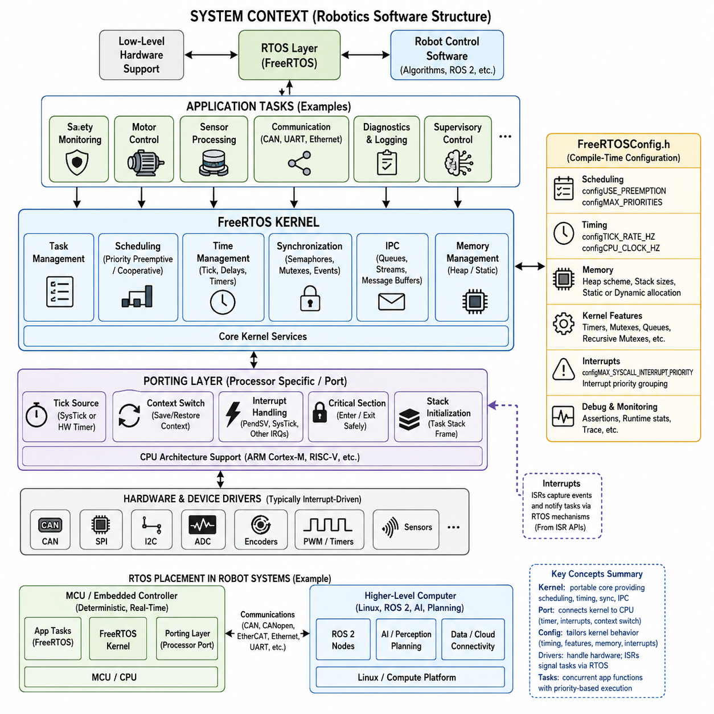
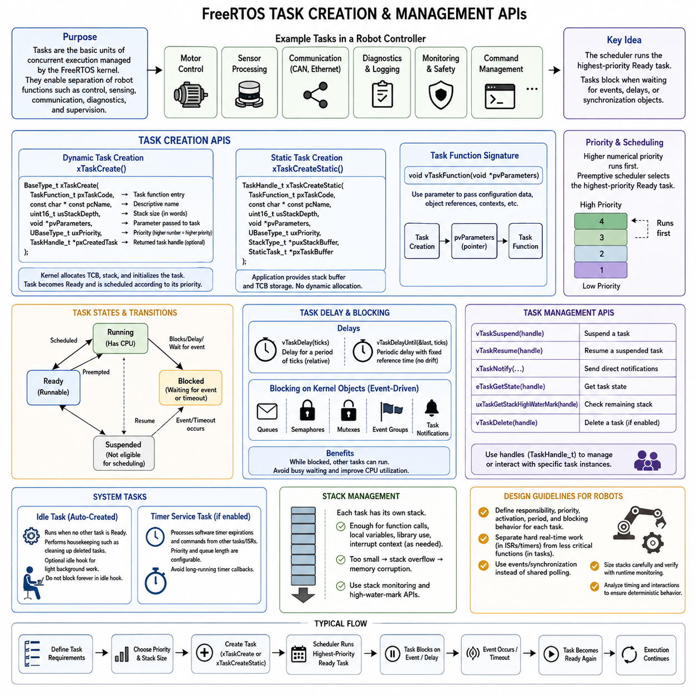
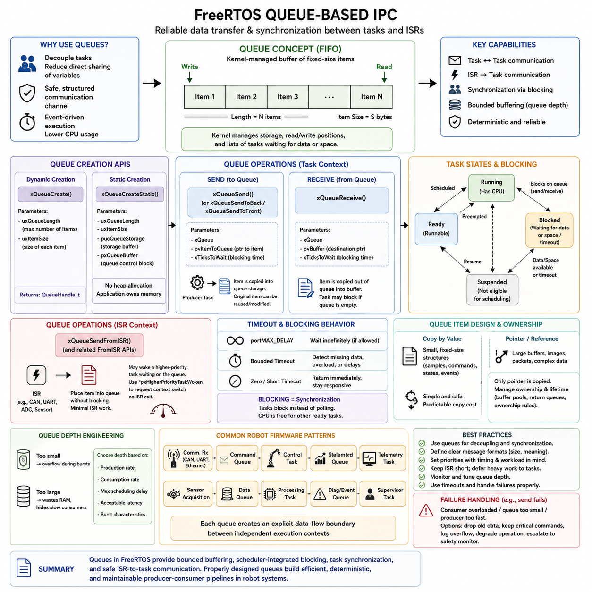
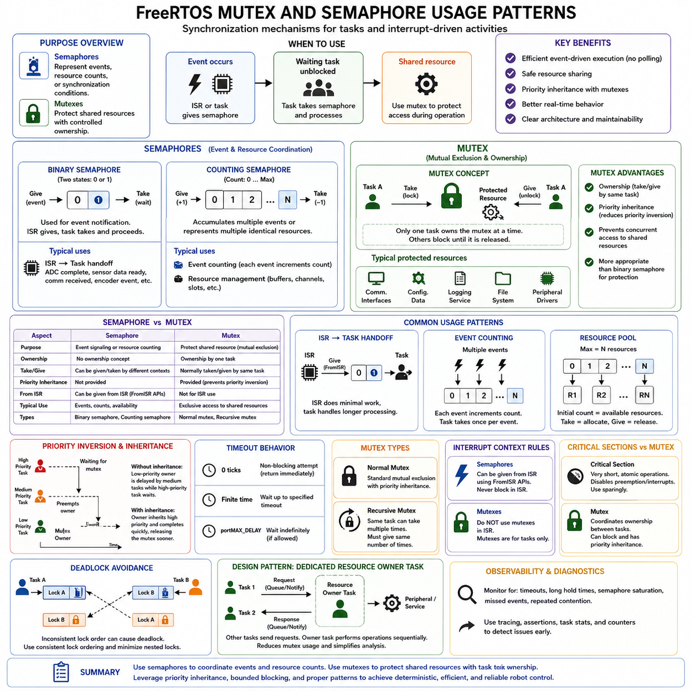
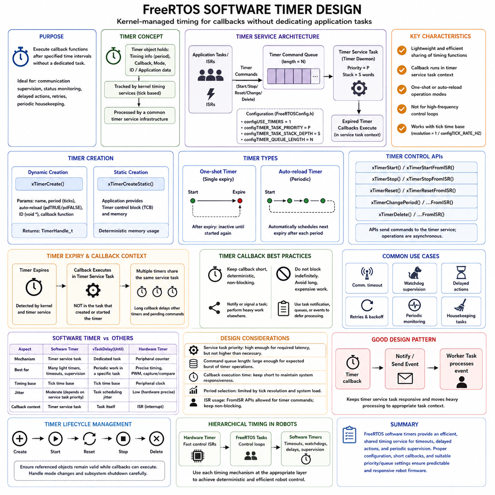
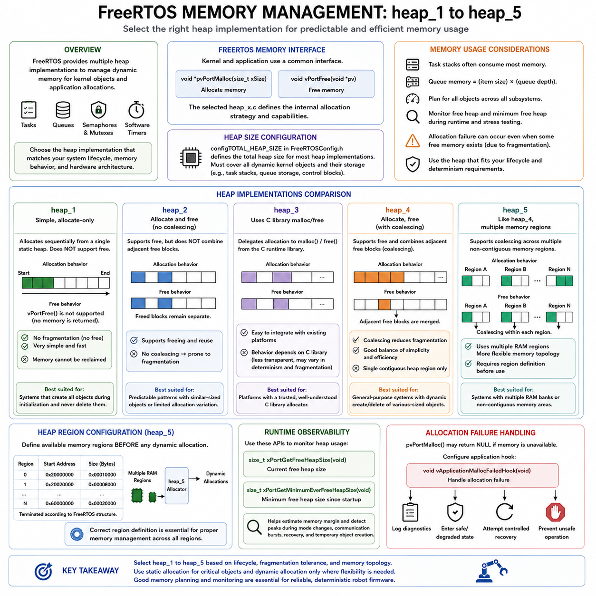
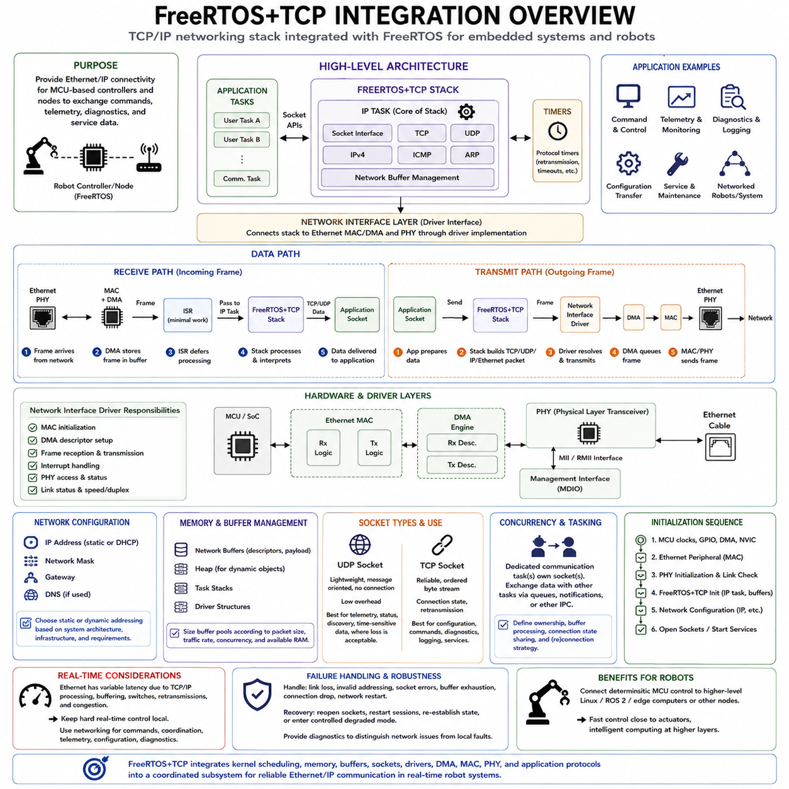
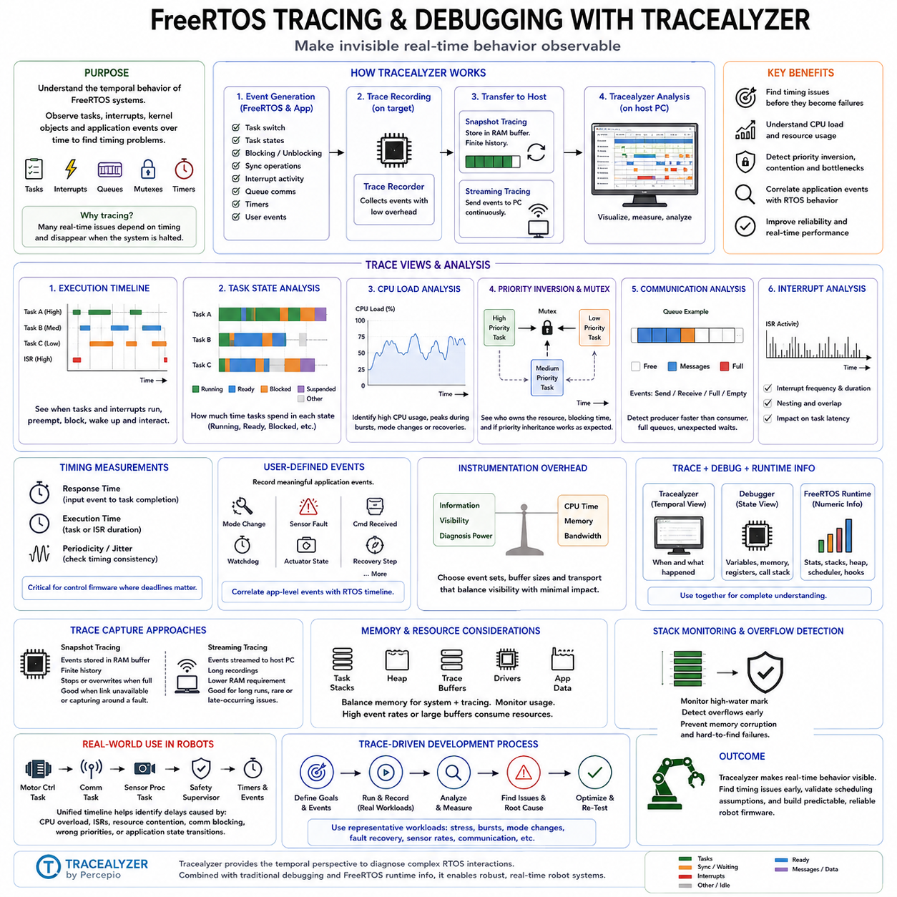
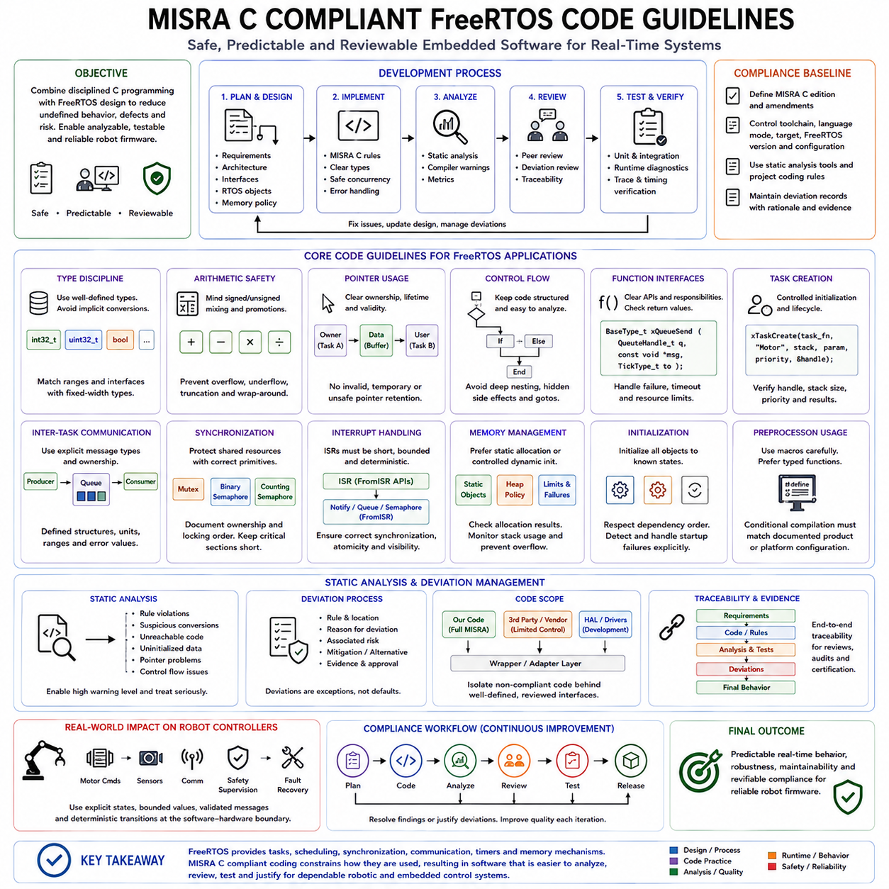
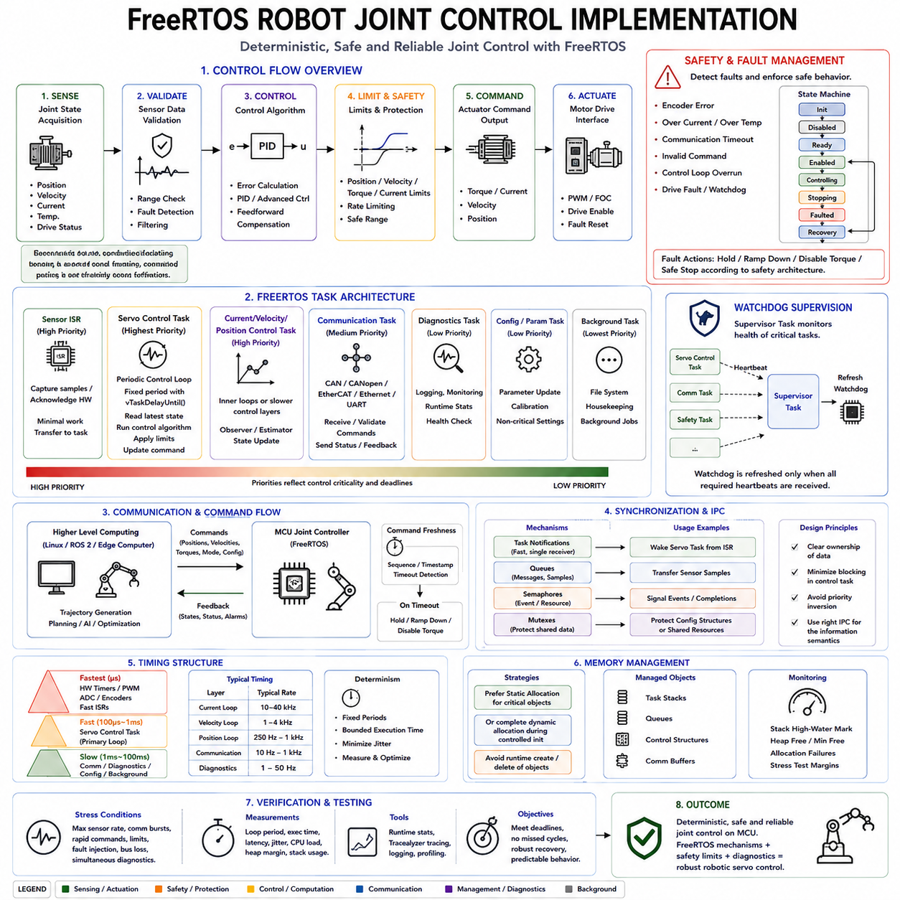

**Volume 03 Real Time Operating Systems**


# 02. FreeRTOS

##  

## 02.01 FreeRTOS Architecture Overview: Porting / Kernel Config

{width="7.268055555555556in" height="7.268055555555556in"}

FreeRTOS is a compact real-time operating system kernel designed primarily for microcontrollers and resource-constrained embedded processors. Within the robotics software structure, it belongs to the RTOS layer between low-level embedded hardware support and higher-level robot control software. Its architecture emphasizes deterministic scheduling, small memory footprint, portability, and explicit control over timing-sensitive execution.

The core architecture is organized around a small kernel that manages tasks, scheduling, timing, synchronization, and inter-task communication. Application functions are normally decomposed into independent tasks, each represented by a task control block and an associated stack. The scheduler determines which ready task executes according to priority and scheduling configuration, while blocked tasks consume no processor time until their waiting conditions are satisfied.

FreeRTOS normally uses priority-based preemptive scheduling, although cooperative scheduling can also be configured. When preemption is enabled, a higher-priority task that becomes ready can immediately replace a lower-priority running task. This behavior makes the kernel suitable for robot controllers where safety monitoring, motor feedback processing, communication handling, and supervisory functions may require clearly differentiated response priorities and bounded execution behavior.

A FreeRTOS application is constructed from the kernel source, portable processor-specific code, configuration definitions, and application software. Most kernel functionality is processor independent, while architecture-dependent operations are isolated within the portable layer. This separation allows the same task, queue, semaphore, and timer APIs to operate across different MCU families while only a relatively small portion of the kernel must be adapted to a processor architecture.

Porting FreeRTOS therefore focuses primarily on connecting the kernel to the target processor\'s interrupt, timer, stack, and context-switching mechanisms. A port must establish the scheduler tick source, initialize task stack frames, save and restore processor context, enter and exit critical sections safely, and trigger context switches when scheduling decisions require them. CPU architecture details such as register sets and interrupt behavior are consequently concentrated in the port layer.

The SysTick peripheral is frequently used as the kernel tick source on Arm Cortex-M microcontrollers, although another hardware timer may be selected when required by the platform. Each tick allows the kernel to update timing information and determine whether delayed tasks should become ready. The configured tick frequency therefore influences timing resolution, interrupt overhead, timeout granularity, and the behavior of periodic software activities implemented through RTOS timing services.

Context switching is another fundamental responsibility of the processor port. When execution changes from one task to another, the processor state of the current task must be preserved and the state of the selected task restored. Cortex-M ports can exploit architectural mechanisms such as PendSV for deferred context switching and SysTick for periodic kernel timing, allowing FreeRTOS to implement task switching with relatively low software overhead and predictable processor behavior.

FreeRTOSConfig.h acts as the central compile-time configuration interface between the kernel and a particular application. Rather than modifying kernel source code directly, developers normally select kernel behavior through configuration macros. These settings control features such as preemption, tick frequency, maximum task priorities, minimal stack size, heap usage, software timers, mutexes, recursive mutexes, queue capabilities, runtime statistics, assertions, and optional API inclusion.

Several configuration parameters directly affect real-time behavior. configUSE_PREEMPTION determines whether priority-based preemption is enabled, while configTICK_RATE_HZ establishes kernel tick frequency. configMAX_PRIORITIES defines the available priority range, and configCPU_CLOCK_HZ may describe the processor clock where required by the port. These values should be selected as part of the timing architecture rather than treated merely as software build options.

Kernel configuration also determines the memory model exposed to the application. FreeRTOS can support dynamically created kernel objects through its heap management implementations, while static allocation permits tasks, queues, semaphores, and other objects to use memory supplied by the application. In deterministic robot firmware, static allocation can be particularly useful because memory consumption is established explicitly and runtime allocation behavior can be minimized or eliminated.

Interrupt configuration requires special attention during porting because FreeRTOS distinguishes interrupts that may call kernel-aware APIs from interrupts that must remain independent of the kernel. On processors supporting interrupt priorities, configuration values establish the priority boundaries governing these interactions. Incorrect priority configuration can create subtle failures because an interrupt operating outside the permitted range must not invoke FreeRTOS functions that manipulate scheduler-managed objects or require kernel synchronization.

The kernel itself remains deliberately separate from hardware device drivers. FreeRTOS schedules execution and supplies synchronization and communication mechanisms, but peripherals such as CAN controllers, SPI devices, motor-control timers, ADCs, encoders, and sensors are normally managed by MCU-specific drivers or hardware abstraction layers. Interrupt service routines can capture hardware events and transfer information toward tasks through appropriate RTOS synchronization mechanisms.

This separation is particularly important in robotics because different timing domains coexist within one controller. Extremely fast current-control or PWM functions may remain directly interrupt driven, while slower velocity, position, communication, diagnostics, and supervisory functions execute as FreeRTOS tasks. The kernel therefore does not replace hardware-level real-time control; it provides an execution framework that coordinates concurrent activities while preserving priority relationships and predictable response paths.

A practical porting process begins by selecting a FreeRTOS port that matches the processor architecture and compiler, integrating the required kernel source files, defining FreeRTOSConfig.h, and connecting the timer and interrupt infrastructure. The developer then validates scheduler startup, task switching, delays, interrupt-to-task signaling, critical sections, stack usage, and timing behavior before integrating complex application functions. Port correctness must be established before application timing results can be trusted.

Kernel configuration should also be treated as part of the system architecture and configuration management process. Changes to tick frequency, priority count, stack sizes, interrupt priority limits, timer-task parameters, or enabled APIs can alter timing, memory consumption, and execution behavior throughout the firmware. Production robot software should therefore version and review FreeRTOSConfig.h together with the application rather than regarding it as a generic platform header.

For robot systems, FreeRTOS commonly occupies the MCU-level deterministic execution layer beneath higher-level computing environments. A motor controller, joint controller, sensor node, battery controller, or safety-oriented embedded subsystem can execute FreeRTOS while exchanging commands and state with Linux or ROS 2 computers through CAN, CANopen, EtherCAT, Ethernet, UART, or other interfaces. This placement is consistent with the broader robotics software hierarchy in which RTOS technology forms a dedicated real-time operating-system domain.

The architectural value of FreeRTOS ultimately comes from combining a small portable kernel with processor-specific porting and application-specific configuration. The kernel provides reusable scheduling and synchronization semantics, the port translates those semantics into actual processor operations, and FreeRTOSConfig.h specializes kernel behavior for the target system. Understanding these three layers is essential before progressing to task APIs, queue-based IPC, synchronization objects, timers, memory management, networking, and robot-control implementations.

FreeRTOS는 주로 마이크로컨트롤러(Microcontroller)와 자원이 제한된 임베디드 프로세서(Embedded Processor)를 위해 설계된 소형 실시간 운영체제 커널(Real-Time Operating System Kernel)이다. 로보틱스 소프트웨어 구조(Robotics Software Structure)에서 FreeRTOS는 저수준 임베디드 하드웨어 지원(Low-Level Embedded Hardware Support)과 상위 수준 로봇 제어 소프트웨어(Robot Control Software) 사이의 RTOS 계층에 위치한다. 그 아키텍처(Architecture)는 결정론적 스케줄링(Deterministic Scheduling), 작은 메모리 사용량(Small Memory Footprint), 이식성(Portability), 시간 민감형 실행(Timing-Sensitive Execution)에 대한 명시적 제어를 강조한다.

핵심 아키텍처(Core Architecture)는 태스크(Task), 스케줄링(Scheduling), 타이밍(Timing), 동기화(Synchronization), 태스크 간 통신(Inter-Task Communication)을 관리하는 소형 커널(Kernel)을 중심으로 구성된다. 애플리케이션 기능(Application Function)은 일반적으로 독립적인 태스크로 분해되며, 각 태스크는 태스크 제어 블록(Task Control Block)과 연결된 스택(Stack)으로 표현된다. 스케줄러(Scheduler)는 우선순위(Priority)와 스케줄링 설정(Scheduling Configuration)에 따라 준비 상태(Ready State)의 태스크 가운데 실행할 태스크를 결정하며, 블록 상태(Blocked State)의 태스크는 대기 조건이 충족될 때까지 프로세서 시간을 소비하지 않는다.

FreeRTOS는 일반적으로 우선순위 기반 선점형 스케줄링(Priority-Based Preemptive Scheduling)을 사용하지만 협력형 스케줄링(Cooperative Scheduling)으로 구성하는 것도 가능하다. 선점(Preemption)이 활성화된 경우 더 높은 우선순위의 태스크가 준비 상태가 되면 현재 실행 중인 낮은 우선순위 태스크를 즉시 대체할 수 있다. 이러한 동작은 안전 모니터링(Safety Monitoring), 모터 피드백 처리(Motor Feedback Processing), 통신 처리(Communication Handling), 감독 기능(Supervisory Function)이 명확히 구분된 응답 우선순위와 제한된 실행 동작을 요구하는 로봇 컨트롤러(Robot Controller)에 적합하다.

FreeRTOS 애플리케이션(Application)은 커널 소스(Kernel Source), 프로세서별 이식 코드(Processor-Specific Port Code), 구성 정의(Configuration Definition), 애플리케이션 소프트웨어(Application Software)로 구성된다. 대부분의 커널 기능은 프로세서에 독립적이며, 아키텍처 종속적인 동작은 이식 계층(Portable Layer)에 분리되어 있다. 이러한 분리를 통해 서로 다른 MCU 제품군(MCU Family)에서도 동일한 태스크, 큐(Queue), 세마포어(Semaphore), 타이머(Timer) API를 사용할 수 있으며, 프로세서 아키텍처에 맞게 조정해야 하는 커널 부분은 상대적으로 작게 유지된다.

따라서 FreeRTOS 포팅(Porting)은 주로 커널을 대상 프로세서(Target Processor)의 인터럽트(Interrupt), 타이머(Timer), 스택(Stack), 컨텍스트 스위칭(Context Switching) 메커니즘에 연결하는 작업에 집중된다. 포트(Port)는 스케줄러 틱(Scheduler Tick) 소스를 설정하고, 태스크 스택 프레임(Task Stack Frame)을 초기화하며, 프로세서 컨텍스트(Processor Context)를 저장하고 복원해야 한다. 또한 임계 구역(Critical Section)에 안전하게 진입하고 빠져나오며, 스케줄링 결정에 따라 필요한 경우 컨텍스트 스위치를 발생시켜야 한다. 따라서 레지스터 집합(Register Set)이나 인터럽트 동작과 같은 CPU 아키텍처 세부 사항은 포트 계층(Port Layer)에 집중된다.

시스템 틱(SysTick) 주변장치는 Arm Cortex-M 마이크로컨트롤러에서 커널 틱(Kernel Tick) 소스로 자주 사용되지만, 플랫폼 요구사항에 따라 다른 하드웨어 타이머(Hardware Timer)를 선택할 수도 있다. 각 틱(Tick)이 발생하면 커널은 시간 정보를 갱신하고 지연된 태스크(Delayed Task)가 준비 상태로 전환되어야 하는지를 판단할 수 있다. 따라서 설정된 틱 주파수(Tick Frequency)는 타이밍 해상도(Timing Resolution), 인터럽트 오버헤드(Interrupt Overhead), 타임아웃 정밀도(Timeout Granularity), RTOS 타이밍 서비스를 이용하여 구현되는 주기적 소프트웨어 동작에 영향을 준다.

컨텍스트 스위칭(Context Switching)은 프로세서 포트(Processor Port)가 담당하는 또 하나의 핵심 기능이다. 실행이 하나의 태스크에서 다른 태스크로 전환될 때 현재 태스크의 프로세서 상태(Processor State)를 보존하고 선택된 태스크의 상태를 복원해야 한다. Cortex-M 포트는 지연 컨텍스트 스위칭(Deferred Context Switching)을 위한 PendSV와 주기적인 커널 타이밍을 위한 SysTick 같은 아키텍처 메커니즘을 활용할 수 있으며, 이를 통해 FreeRTOS는 비교적 낮은 소프트웨어 오버헤드와 예측 가능한 프로세서 동작으로 태스크 전환을 구현할 수 있다.

FreeRTOSConfig.h는 커널과 특정 애플리케이션 사이에서 중앙 컴파일 시점 구성 인터페이스(Central Compile-Time Configuration Interface) 역할을 한다. 개발자는 일반적으로 커널 소스 코드를 직접 수정하는 대신 구성 매크로(Configuration Macro)를 통해 커널 동작을 선택한다. 이러한 설정은 선점(Preemption), 틱 주파수(Tick Frequency), 최대 태스크 우선순위(Maximum Task Priorities), 최소 스택 크기(Minimal Stack Size), 힙 사용(Heap Usage), 소프트웨어 타이머(Software Timer), 뮤텍스(Mutex), 재귀 뮤텍스(Recursive Mutex), 큐 기능(Queue Capability), 런타임 통계(Runtime Statistics), 어설션(Assertion), 선택적 API 포함 여부 등을 제어한다.

여러 구성 파라미터(Configuration Parameter)는 실시간 동작(Real-Time Behavior)에 직접적인 영향을 준다. configUSE_PREEMPTION은 우선순위 기반 선점(Priority-Based Preemption)의 활성화 여부를 결정하며, configTICK_RATE_HZ는 커널 틱 주파수(Kernel Tick Frequency)를 설정한다. configMAX_PRIORITIES는 사용 가능한 우선순위 범위(Priority Range)를 정의하고, configCPU_CLOCK_HZ는 포트에서 필요한 경우 프로세서 클럭(Processor Clock)을 나타낼 수 있다. 이러한 값은 단순한 소프트웨어 빌드 옵션(Software Build Option)이 아니라 타이밍 아키텍처(Timing Architecture)의 일부로 선택되어야 한다.

커널 구성(Kernel Configuration)은 애플리케이션에 제공되는 메모리 모델(Memory Model)도 결정한다. FreeRTOS는 자체 힙 관리 구현(Heap Management Implementation)을 이용하여 동적으로 생성되는 커널 객체(Kernel Object)를 지원할 수 있으며, 정적 할당(Static Allocation)을 사용하면 태스크, 큐, 세마포어 및 기타 객체가 애플리케이션에서 제공한 메모리를 사용할 수 있다. 결정론적 로봇 펌웨어(Deterministic Robot Firmware)에서는 메모리 사용량을 명시적으로 결정하고 런타임 할당(Runtime Allocation)을 최소화하거나 제거할 수 있기 때문에 정적 할당이 특히 유용하다.

인터럽트 구성(Interrupt Configuration)은 포팅 과정에서 특별한 주의가 필요하다. FreeRTOS는 커널 인식 API(Kernel-Aware API)를 호출할 수 있는 인터럽트와 커널로부터 독립적으로 유지되어야 하는 인터럽트를 구분하기 때문이다. 인터럽트 우선순위(Interrupt Priority)를 지원하는 프로세서에서는 구성 값이 이러한 상호작용을 제어하는 우선순위 경계(Priority Boundary)를 설정한다. 잘못된 우선순위 구성은 미묘한 장애를 발생시킬 수 있는데, 허용 범위를 벗어나 동작하는 인터럽트는 스케줄러가 관리하는 객체를 조작하거나 커널 동기화를 요구하는 FreeRTOS 함수를 호출해서는 안 되기 때문이다.

커널 자체는 의도적으로 하드웨어 디바이스 드라이버(Hardware Device Driver)와 분리되어 있다. FreeRTOS는 실행을 스케줄링하고 동기화 및 통신 메커니즘을 제공하지만, CAN 컨트롤러(CAN Controller), SPI 장치(SPI Device), 모터 제어 타이머(Motor-Control Timer), ADC, 엔코더(Encoder), 센서(Sensor)와 같은 주변장치는 일반적으로 MCU별 드라이버나 하드웨어 추상화 계층(Hardware Abstraction Layer)을 통해 관리된다. 인터럽트 서비스 루틴(Interrupt Service Routine)은 하드웨어 이벤트를 포착하고 적절한 RTOS 동기화 메커니즘을 통해 해당 정보를 태스크로 전달할 수 있다.

이러한 분리는 하나의 컨트롤러 내부에 서로 다른 타이밍 도메인(Timing Domain)이 공존하는 로보틱스 시스템에서 특히 중요하다. 매우 빠른 전류 제어(Current Control) 또는 PWM 기능은 직접적인 인터럽트 기반(Interrupt-Driven)으로 유지될 수 있는 반면, 상대적으로 느린 속도 제어(Velocity Control), 위치 제어(Position Control), 통신(Communication), 진단(Diagnostics), 감독 기능(Supervisory Function)은 FreeRTOS 태스크로 실행될 수 있다. 따라서 커널은 하드웨어 수준 실시간 제어(Hardware-Level Real-Time Control)를 대체하는 것이 아니라, 우선순위 관계와 예측 가능한 응답 경로를 유지하면서 동시 실행되는 기능을 조정하는 실행 프레임워크(Execution Framework)를 제공한다.

실제 포팅 과정(Porting Process)은 프로세서 아키텍처(Processor Architecture)와 컴파일러(Compiler)에 맞는 FreeRTOS 포트를 선택하고, 필요한 커널 소스 파일을 통합하며, FreeRTOSConfig.h를 정의하고, 타이머 및 인터럽트 인프라스트럭처(Interrupt Infrastructure)를 연결하는 것에서 시작한다. 이후 개발자는 복잡한 애플리케이션 기능을 통합하기 전에 스케줄러 시작(Scheduler Startup), 태스크 전환(Task Switching), 지연(Delay), 인터럽트에서 태스크로의 신호 전달(Interrupt-to-Task Signaling), 임계 구역, 스택 사용량(Stack Usage), 타이밍 동작을 검증한다. 애플리케이션의 타이밍 결과를 신뢰하려면 먼저 포트의 정확성(Port Correctness)이 확립되어야 한다.

커널 구성은 시스템 아키텍처(System Architecture)와 구성 관리 프로세스(Configuration Management Process)의 일부로 다루어져야 한다. 틱 주파수, 우선순위 개수, 스택 크기, 인터럽트 우선순위 제한, 타이머 태스크 파라미터(Timer-Task Parameter), 활성화된 API를 변경하면 펌웨어 전체의 타이밍, 메모리 소비량, 실행 동작이 달라질 수 있다. 따라서 양산 로봇 소프트웨어(Production Robot Software)에서는 FreeRTOSConfig.h를 단순한 범용 플랫폼 헤더(Generic Platform Header)로 취급하기보다 애플리케이션과 함께 버전 관리(Version Control)하고 검토해야 한다.

로봇 시스템에서 FreeRTOS는 일반적으로 상위 컴퓨팅 환경(Higher-Level Computing Environment) 아래에 위치하는 MCU 수준의 결정론적 실행 계층(MCU-Level Deterministic Execution Layer)을 담당한다. 모터 컨트롤러(Motor Controller), 관절 컨트롤러(Joint Controller), 센서 노드(Sensor Node), 배터리 컨트롤러(Battery Controller), 안전 지향 임베디드 서브시스템(Safety-Oriented Embedded Subsystem)은 FreeRTOS를 실행하면서 CAN, CANopen, EtherCAT, Ethernet, UART 등의 인터페이스를 통해 Linux 또는 ROS 2 컴퓨터와 명령 및 상태 정보를 교환할 수 있다. 이러한 배치는 RTOS 기술이 독립적인 실시간 운영체제 영역을 형성하는 보다 광범위한 로보틱스 소프트웨어 계층 구조와 일치한다.

FreeRTOS의 아키텍처적 가치(Architectural Value)는 궁극적으로 소형 이식형 커널(Small Portable Kernel), 프로세서별 포팅(Processor-Specific Porting), 애플리케이션별 구성(Application-Specific Configuration)을 결합하는 데서 나온다. 커널은 재사용 가능한 스케줄링 및 동기화 의미 체계(Scheduling and Synchronization Semantics)를 제공하고, 포트는 이러한 의미 체계를 실제 프로세서 동작으로 변환하며, FreeRTOSConfig.h는 대상 시스템에 맞게 커널 동작을 특화한다. 이 세 계층에 대한 이해는 이후 태스크 API(Task API), 큐 기반 프로세스 간 통신(Queue-Based IPC), 동기화 객체(Synchronization Object), 타이머, 메모리 관리(Memory Management), 네트워킹(Networking), 로봇 제어 구현(Robot-Control Implementation)으로 진행하기 위한 필수 기반이다.

##  

## 02.02 Task Creation and Management API [w/Code]

{width="7.268055555555556in" height="7.268055555555556in"}

FreeRTOS represents application concurrency through tasks, which are independently scheduled execution contexts managed by the kernel. A task is typically implemented as a C function that can execute repeatedly for the lifetime of the system, while the kernel maintains its execution state, priority, stack, and scheduling information. In robotics, tasks provide a natural structure for separating motor control, sensing, communication, diagnostics, and supervisory functions.

Each FreeRTOS task is associated with a Task Control Block, or TCB, containing information required by the scheduler to manage that task. The kernel also provides each task with its own stack for local variables, function calls, and saved processor context. Although application developers normally interact with tasks through the FreeRTOS API rather than manipulating these internal structures directly, understanding the TCB and stack relationship is important for memory sizing and debugging.

Dynamic task creation is commonly performed with xTaskCreate(), which receives a task function, descriptive name, stack depth, optional parameter pointer, priority, and optional task handle destination. When creation succeeds, FreeRTOS allocates the required task-management structures and stack using its configured memory-management mechanism. The task becomes eligible for scheduling according to its initial state and priority once the scheduler is operating.

Applications requiring explicit memory ownership can instead create tasks statically with xTaskCreateStatic(). In this approach, the application supplies the task stack and storage required for the task control structure rather than requesting them dynamically from the FreeRTOS heap. Static creation is valuable in deterministic embedded and robot controllers because memory requirements can be established before runtime and unexpected allocation failures can be avoided during normal operation.

A FreeRTOS task function normally accepts a single void pointer parameter, allowing configuration data, object references, device contexts, or application structures to be passed when the task is created. This enables one task implementation to support multiple instances without relying heavily on global variables. For example, the same motor-control task function could receive different motor channel structures when instantiated for several independent actuators.

Task priority is one of the most important parameters supplied during task creation. Higher numerical priorities normally represent more urgent execution requirements, and the scheduler selects the highest-priority task that is currently ready to run. Priority assignment should therefore reflect timing and response requirements rather than software importance alone. A short emergency-monitoring task may require higher priority than a computationally larger logging or communication task.

Task states describe whether a task can currently execute. A task in the Ready state is capable of running but may be waiting for processor access, while the Running task currently owns the processor. A Blocked task waits for an event or timeout, and a Suspended task is explicitly excluded from scheduling until resumed. Understanding these transitions is fundamental because efficient FreeRTOS applications spend substantial time blocked rather than continuously polling hardware or shared state.

vTaskDelay() allows a task to enter the Blocked state for a specified number of kernel ticks. This is useful when approximate periodic delays are sufficient, but repeated use can allow execution-time variations to influence the actual activation period. vTaskDelayUntil() is better suited to periodic activities because it schedules the next wake-up relative to a maintained reference time, helping reduce accumulated drift in cyclic control, sampling, monitoring, and communication tasks.

Tasks can also block while waiting for kernel objects such as queues, semaphores, mutexes, event groups, or task notifications. This event-driven execution model is usually preferable to busy waiting because processor time becomes available to other tasks while no useful work exists. In a robot controller, a sensor-processing task can remain blocked until new data arrives, while a communication task can sleep until a message or transmission event requires attention.

FreeRTOS provides task handles through the TaskHandle_t type so that application code can refer to specific task instances after creation. Handles are used by management APIs that suspend, resume, notify, query, or otherwise interact with tasks. Retaining a handle is particularly useful when supervisory software must control another task, although designs should avoid excessive direct task-to-task control when synchronization objects or event-driven communication provide cleaner architectural separation.

A task can be suspended with vTaskSuspend() and returned to scheduling with vTaskResume(), while appropriate ISR-specific mechanisms are required when resumption originates from an interrupt context. Suspension differs from normal blocking because a suspended task does not automatically become ready after a timeout. It is therefore useful for explicit operating-mode control, but ordinary synchronization and timing requirements are generally better represented by blocking on kernel events.

Task deletion is supported through vTaskDelete() when enabled by the kernel configuration. Deleting a task removes it from scheduling and allows kernel-managed task resources to be reclaimed according to the FreeRTOS implementation and allocation model. However, application-owned resources such as peripheral state, dynamically allocated application buffers, open interfaces, or synchronization relationships may require explicit cleanup before deletion to prevent resource leaks or inconsistent system state.

The idle task is created automatically when the scheduler starts and executes whenever no application task is ready. Besides providing a valid execution context, it performs kernel housekeeping associated with tasks that have deleted themselves. Applications may optionally configure an idle hook for lightweight background activity, but the hook must not perform operations that indefinitely block the idle task because doing so can interfere with kernel maintenance and low-priority execution behavior.

FreeRTOS also creates a timer service task when software timers are enabled. This task processes software timer expirations and associated callback functions, and its priority and queue length are determined through kernel configuration. Although it is not an ordinary application task, its scheduling characteristics interact with application workloads. Long-running timer callbacks should therefore be avoided because they can delay processing of other timer-related commands and expirations.

Stack sizing is a critical part of task management in resource-constrained controllers. Each task requires enough stack for nested function calls, local variables, library operations, interrupt-related context requirements where applicable, and temporary processing. Excessively large stacks waste scarce RAM, while insufficient stacks can corrupt memory and cause unpredictable failures. FreeRTOS stack monitoring facilities and high-water-mark APIs can help determine realistic margins during testing.

Runtime task-management APIs can also provide information useful for diagnostics and verification, including task state, priority, stack margin, and scheduler statistics when corresponding configuration options are enabled. Such information is valuable during integration because apparently functional firmware may still contain starvation, excessive CPU utilization, insufficient stack capacity, or incorrect priority relationships. Runtime observation should therefore complement static task architecture and timing analysis.

For robot firmware, a practical task architecture often separates hard timing-sensitive activities from less critical background functions. Fast hardware control may remain inside timer or peripheral interrupt mechanisms, while FreeRTOS tasks coordinate velocity or position control, sensor processing, CAN or CANopen communication, fault monitoring, diagnostics, and command management. This preserves rapid hardware response while allowing the RTOS scheduler to organize concurrent software activities predictably.

Effective task management therefore requires more than calling task-creation APIs. Developers must define task responsibilities, priorities, activation mechanisms, execution periods, blocking behavior, stack sizes, resource ownership, and termination rules as one coherent real-time architecture. FreeRTOS task APIs provide the mechanisms, while system-level timing analysis determines how those mechanisms should be used to construct deterministic and maintainable robot controllers within the broader RTOS software structure.

FreeRTOS는 애플리케이션 동시성(Application Concurrency)을 커널(Kernel)이 관리하는 독립적인 스케줄링 실행 컨텍스트(Scheduled Execution Context)인 태스크(Task)를 통해 표현한다. 태스크는 일반적으로 시스템이 동작하는 동안 반복적으로 실행될 수 있는 C 함수(C Function)로 구현되며, 커널은 각 태스크의 실행 상태(Execution State), 우선순위(Priority), 스택(Stack), 스케줄링 정보(Scheduling Information)를 관리한다. 로보틱스에서는 태스크를 이용하여 모터 제어(Motor Control), 센싱(Sensing), 통신(Communication), 진단(Diagnostics), 감독 기능(Supervisory Function)을 자연스럽게 분리할 수 있다.

각 FreeRTOS 태스크는 스케줄러(Scheduler)가 해당 태스크를 관리하는 데 필요한 정보를 포함하는 태스크 제어 블록(Task Control Block, TCB)과 연결된다. 또한 커널은 지역 변수(Local Variable), 함수 호출(Function Call), 저장된 프로세서 컨텍스트(Saved Processor Context)를 위한 독립적인 스택(Stack)을 각 태스크에 제공한다. 애플리케이션 개발자는 일반적으로 이러한 내부 구조를 직접 조작하지 않고 FreeRTOS API를 통해 태스크를 다루지만, TCB와 스택의 관계를 이해하는 것은 메모리 크기 설정(Memory Sizing)과 디버깅(Debugging)에 중요하다.

동적 태스크 생성(Dynamic Task Creation)은 일반적으로 xTaskCreate()를 사용하여 수행하며, 이 함수에는 태스크 함수(Task Function), 설명용 이름(Descriptive Name), 스택 깊이(Stack Depth), 선택적인 파라미터 포인터(Parameter Pointer), 우선순위(Priority), 선택적인 태스크 핸들(Task Handle) 저장 위치가 전달된다. 생성에 성공하면 FreeRTOS는 설정된 메모리 관리 메커니즘(Memory-Management Mechanism)을 사용하여 필요한 태스크 관리 구조와 스택을 할당한다. 스케줄러가 동작하기 시작하면 태스크는 초기 상태와 우선순위에 따라 스케줄링 대상이 된다.

명시적인 메모리 소유권(Memory Ownership)이 필요한 애플리케이션에서는 xTaskCreateStatic()을 사용하여 태스크를 정적으로 생성할 수 있다. 이 방식에서는 FreeRTOS 힙(Heap)에서 메모리를 동적으로 요청하는 대신 애플리케이션이 태스크 스택과 태스크 제어 구조에 필요한 저장 공간을 직접 제공한다. 정적 생성(Static Creation)은 런타임 이전에 메모리 요구량을 확정하고 정상 동작 중 예상하지 못한 메모리 할당 실패를 방지할 수 있기 때문에 결정론적 임베디드 시스템(Deterministic Embedded System)과 로봇 컨트롤러(Robot Controller)에서 특히 유용하다.

FreeRTOS 태스크 함수(Task Function)는 일반적으로 하나의 void 포인터 파라미터(Void Pointer Parameter)를 받아들이며, 이를 통해 태스크 생성 시 구성 데이터(Configuration Data), 객체 참조(Object Reference), 디바이스 컨텍스트(Device Context), 애플리케이션 구조체(Application Structure)를 전달할 수 있다. 따라서 전역 변수(Global Variable)에 과도하게 의존하지 않고 하나의 태스크 구현으로 여러 인스턴스(Instance)를 지원할 수 있다. 예를 들어 동일한 모터 제어 태스크 함수에 서로 다른 모터 채널 구조체를 전달하여 여러 독립적인 액추에이터(Actuator)를 제어할 수 있다.

태스크 우선순위(Task Priority)는 태스크 생성 과정에서 지정하는 가장 중요한 파라미터 가운데 하나이다. 일반적으로 높은 숫자의 우선순위는 더욱 긴급한 실행 요구사항을 나타내며, 스케줄러는 현재 준비 상태(Ready State)에 있는 태스크 중 가장 높은 우선순위의 태스크를 선택하여 실행한다. 따라서 우선순위는 단순히 소프트웨어 기능의 중요성이 아니라 타이밍(Timing)과 응답 요구사항(Response Requirement)을 기준으로 지정해야 한다. 짧은 비상 모니터링 태스크(Emergency-Monitoring Task)는 계산량이 더 많은 로깅(Logging)이나 통신 태스크보다 높은 우선순위가 필요할 수 있다.

태스크 상태(Task State)는 해당 태스크가 현재 실행될 수 있는지를 나타낸다. 준비 상태(Ready State)의 태스크는 실행할 수 있지만 프로세서 사용을 기다릴 수 있으며, 실행 상태(Running State)의 태스크는 현재 프로세서를 점유하고 있다. 블록 상태(Blocked State)의 태스크는 이벤트(Event)나 타임아웃(Timeout)을 기다리고, 정지 상태(Suspended State)의 태스크는 다시 재개될 때까지 명시적으로 스케줄링 대상에서 제외된다. 효율적인 FreeRTOS 애플리케이션에서는 하드웨어나 공유 상태를 지속적으로 폴링(Polling)하기보다 상당한 시간을 블록 상태로 보내므로 이러한 상태 전환을 이해하는 것이 중요하다.

vTaskDelay()는 지정된 수의 커널 틱(Kernel Tick) 동안 태스크를 블록 상태로 전환한다. 이 방식은 대략적인 주기 지연(Periodic Delay)이 충분한 경우 유용하지만 반복적으로 사용하면 실행 시간의 변화가 실제 활성화 주기(Activation Period)에 영향을 줄 수 있다. vTaskDelayUntil()은 유지되는 기준 시간(Reference Time)을 기준으로 다음 실행 시점을 결정하기 때문에 주기적 동작에 더 적합하며, 순환 제어(Cyclic Control), 샘플링(Sampling), 모니터링(Monitoring), 통신 태스크에서 누적 시간 드리프트(Accumulated Timing Drift)를 줄이는 데 도움이 된다.

태스크는 큐(Queue), 세마포어(Semaphore), 뮤텍스(Mutex), 이벤트 그룹(Event Group), 태스크 알림(Task Notification)과 같은 커널 객체(Kernel Object)를 기다리는 동안에도 블록 상태가 될 수 있다. 이러한 이벤트 구동 실행 모델(Event-Driven Execution Model)은 유용한 작업이 없을 때 프로세서 시간을 다른 태스크가 사용할 수 있도록 하기 때문에 바쁜 대기(Busy Waiting)보다 일반적으로 효율적이다. 로봇 컨트롤러에서는 새로운 데이터가 도착할 때까지 센서 처리 태스크가 블록될 수 있으며, 통신 태스크는 메시지나 송신 이벤트가 발생할 때까지 대기할 수 있다.

FreeRTOS는 TaskHandle_t 타입(Type)을 통해 태스크 핸들(Task Handle)을 제공하므로 애플리케이션 코드가 생성된 이후에도 특정 태스크 인스턴스를 참조할 수 있다. 핸들은 태스크를 정지(Suspend), 재개(Resume), 알림(Notify), 조회(Query)하거나 기타 방식으로 상호작용하는 관리 API에서 사용된다. 감독 소프트웨어(Supervisory Software)가 다른 태스크를 제어해야 하는 경우 핸들을 유지하는 것이 유용하지만, 동기화 객체나 이벤트 기반 통신이 더 명확한 아키텍처 분리를 제공할 수 있다면 과도한 직접적인 태스크 간 제어는 피하는 것이 바람직하다.

태스크는 vTaskSuspend()를 통해 정지할 수 있으며 vTaskResume()을 통해 다시 스케줄링 대상으로 복귀시킬 수 있다. 인터럽트 컨텍스트(Interrupt Context)에서 재개가 시작되는 경우에는 적절한 ISR 전용 메커니즘(ISR-Specific Mechanism)을 사용해야 한다. 정지(Suspension)는 일반적인 블로킹(Blocking)과 달리 타임아웃이 발생해도 자동으로 준비 상태가 되지 않는다. 따라서 명시적인 동작 모드 제어(Operating-Mode Control)에 유용하지만, 일반적인 동기화 및 타이밍 요구사항은 커널 이벤트를 기다리는 블로킹 방식으로 표현하는 것이 더 적합하다.

커널 설정(Kernel Configuration)에서 활성화된 경우 vTaskDelete()를 통해 태스크 삭제(Task Deletion)를 수행할 수 있다. 태스크를 삭제하면 해당 태스크는 스케줄링 대상에서 제거되고, 커널이 관리하는 태스크 자원은 FreeRTOS 구현과 할당 모델(Allocation Model)에 따라 회수될 수 있다. 그러나 주변장치 상태(Peripheral State), 동적으로 할당된 애플리케이션 버퍼(Application Buffer), 열린 인터페이스(Open Interface), 동기화 관계(Synchronization Relationship)와 같은 애플리케이션 소유 자원은 자원 누수(Resource Leak)나 시스템 상태 불일치가 발생하지 않도록 삭제 전에 명시적인 정리가 필요할 수 있다.

유휴 태스크(Idle Task)는 스케줄러가 시작될 때 자동으로 생성되며 실행 가능한 애플리케이션 태스크가 없을 때 동작한다. 유효한 실행 컨텍스트를 제공하는 것 외에도 스스로 삭제된 태스크와 관련된 커널 내부 정리 작업(Kernel Housekeeping)을 수행한다. 애플리케이션은 선택적으로 유휴 훅(Idle Hook)을 설정하여 가벼운 백그라운드 작업(Background Activity)을 수행할 수 있지만, 유휴 태스크의 실행을 방해할 수 있으므로 훅 내부에서 무기한 블로킹되는 작업을 수행해서는 안 된다.

소프트웨어 타이머(Software Timer)가 활성화되어 있으면 FreeRTOS는 타이머 서비스 태스크(Timer Service Task)도 생성한다. 이 태스크는 소프트웨어 타이머 만료(Timer Expiration)와 관련 콜백 함수(Callback Function)를 처리하며, 태스크의 우선순위와 큐 길이는 커널 설정을 통해 결정된다. 일반 애플리케이션 태스크는 아니지만 스케줄링 특성이 전체 애플리케이션 작업 부하와 상호작용한다. 따라서 장시간 실행되는 타이머 콜백은 다른 타이머 명령이나 만료 처리를 지연시킬 수 있으므로 피해야 한다.

스택 크기 설정(Stack Sizing)은 자원이 제한된 컨트롤러에서 중요한 태스크 관리 요소이다. 각 태스크는 중첩 함수 호출(Nested Function Call), 지역 변수, 라이브러리 연산(Library Operation), 적용되는 경우 인터럽트 관련 컨텍스트 요구사항, 임시 처리에 충분한 스택을 필요로 한다. 지나치게 큰 스택은 제한된 RAM을 낭비하지만 부족한 스택은 메모리 손상(Memory Corruption)과 예측할 수 없는 장애를 일으킬 수 있다. FreeRTOS의 스택 모니터링(Stack Monitoring) 기능과 하이워터마크 API(High-Water-Mark API)를 사용하면 테스트 과정에서 현실적인 스택 여유 공간을 결정하는 데 도움이 된다.

런타임 태스크 관리 API(Runtime Task-Management API)는 관련 구성 옵션이 활성화되어 있는 경우 태스크 상태, 우선순위, 스택 여유 공간(Stack Margin), 스케줄러 통계(Scheduler Statistics)와 같이 진단 및 검증에 유용한 정보를 제공할 수 있다. 겉으로 정상 동작하는 펌웨어에도 태스크 기아(Task Starvation), 과도한 CPU 사용률, 부족한 스택 용량, 잘못된 우선순위 관계가 존재할 수 있기 때문에 이러한 정보는 시스템 통합 과정에서 중요하다. 따라서 런타임 관찰(Runtime Observation)은 정적인 태스크 아키텍처 및 타이밍 분석과 함께 수행되어야 한다.

로봇 펌웨어(Robot Firmware)의 실용적인 태스크 아키텍처에서는 일반적으로 강한 시간 민감성을 가진 동작과 중요도가 상대적으로 낮은 백그라운드 기능을 분리한다. 빠른 하드웨어 제어(Fast Hardware Control)는 타이머 또는 주변장치 인터럽트 메커니즘에 유지할 수 있으며, FreeRTOS 태스크는 속도 또는 위치 제어, 센서 처리, CAN 또는 CANopen 통신, 고장 모니터링(Fault Monitoring), 진단, 명령 관리(Command Management)를 조정할 수 있다. 이를 통해 빠른 하드웨어 응답을 유지하면서 RTOS 스케줄러가 동시에 실행되는 소프트웨어 기능을 예측 가능하게 구성할 수 있다.

따라서 효과적인 태스크 관리(Task Management)는 단순히 태스크 생성 API를 호출하는 것 이상을 요구한다. 개발자는 태스크 책임(Task Responsibility), 우선순위, 활성화 메커니즘(Activation Mechanism), 실행 주기(Execution Period), 블로킹 동작(Blocking Behavior), 스택 크기, 자원 소유권(Resource Ownership), 종료 규칙(Termination Rule)을 하나의 일관된 실시간 아키텍처(Real-Time Architecture)로 정의해야 한다. FreeRTOS 태스크 API는 이를 구현하는 메커니즘을 제공하며, 시스템 수준 타이밍 분석(System-Level Timing Analysis)은 이러한 메커니즘을 어떻게 사용하여 결정론적이고 유지보수 가능한 로봇 컨트롤러를 구성할 것인지 결정한다.

##  

## 02.03 Queue-Based IPC Implementation [w/Code]

{width="7.268055555555556in" height="7.268055555555556in"}

FreeRTOS queues provide a structured inter-process communication mechanism for transferring data between concurrently executing tasks and between interrupt service routines and tasks. Although FreeRTOS tasks share the same address space, queues establish controlled communication channels that reduce direct dependence on shared variables. This makes them especially useful in robot firmware where sensing, control, communication, diagnostics, and supervisory functions execute independently.

A queue can be understood as a kernel-managed first-in, first-out data buffer containing a predefined number of fixed-size items. When the queue is created, the application specifies both the maximum number of items and the size of each item. FreeRTOS then manages the queue storage, read and write positions, and lists of tasks waiting for data or available space, allowing communication and task synchronization to be handled through one consistent kernel object.

Dynamic queue creation is normally performed with xQueueCreate(), which specifies the queue length and item size. If creation succeeds, the function returns a QueueHandle_t used by subsequent queue operations. Applications requiring deterministic memory ownership can instead use xQueueCreateStatic(), supplying both the queue storage area and control structure explicitly so that queue creation does not depend on runtime heap allocation.

The most common sending operation is xQueueSend(), with related APIs supporting insertion at the front or back of a queue. The sender provides the address of an item and an optional blocking time that determines how long the calling task may wait when the queue is full. FreeRTOS copies the item into queue-managed storage, meaning that the sender can normally reuse or modify its original local variable after the send operation has completed successfully.

Receiving is typically performed with xQueueReceive(). If an item is available, FreeRTOS copies it from the queue into the destination object supplied by the receiving task. When the queue is empty, the task may either return immediately or enter the Blocked state for a specified timeout. A blocked receiver consumes no processor time while waiting, allowing the scheduler to execute other ready tasks until data arrives or the timeout expires.

This blocking behavior allows queues to serve simultaneously as communication and synchronization mechanisms. A sensor task does not need to continuously check whether another component has produced new measurements. Instead, it can wait on the corresponding queue and become Ready when data is inserted. The scheduler can then execute it according to priority, producing an event-driven architecture with lower CPU consumption and clearer timing relationships than continuous polling.

Queue operations can also specify portMAX_DELAY when the configuration permits a task to wait indefinitely for an operation to become possible. Short or zero timeout values are useful when a task must remain responsive to other responsibilities, whereas bounded blocking periods allow software to detect missing data or overloaded consumers. Timeout selection should therefore reflect the real-time behavior of the subsystem rather than being chosen merely for programming convenience.

Interrupt service routines require dedicated queue APIs because ordinary task-level functions can perform operations that are inappropriate inside interrupt context. xQueueSendFromISR() and related FromISR functions allow an interrupt to place data into a queue without using task-context blocking behavior. A typical example is a CAN, UART, ADC, or sensor interrupt capturing newly available information and forwarding a compact event or data object to a processing task.

An ISR queue operation may cause a higher-priority task waiting on the queue to become Ready. FreeRTOS therefore provides a mechanism through which the ISR can determine whether a context switch should be requested when interrupt processing finishes. This enables low-latency interrupt-to-task handoff: the ISR performs only essential hardware-level work, while more expensive parsing, filtering, control calculations, or protocol processing occurs in the awakened task.

Queue item design strongly influences efficiency. Small structures containing sensor samples, commands, state changes, timestamps, or event descriptors can be copied directly through queues with predictable behavior. Large payloads are more expensive because queue operations copy the complete item. For large buffers, images, network packets, or complex data blocks, applications may instead queue pointers or references while managing the ownership and lifetime of the referenced memory carefully.

Passing pointers through a queue changes the synchronization problem because FreeRTOS copies only the pointer value rather than the underlying object. The sender must not overwrite, free, or reuse the referenced memory while the receiver still depends on it. Buffer pools, ownership-transfer conventions, or explicit return queues can provide deterministic lifetime management. Such patterns are particularly important in high-throughput sensor and communication pipelines where repeated copying would consume excessive CPU time.

Queue depth must also be engineered rather than selected arbitrarily. A queue that is too short can overflow during temporary bursts, while an excessively large queue consumes RAM and may conceal a receiver that cannot keep pace with producers. The appropriate depth depends on production rate, consumption rate, maximum scheduling delay, acceptable buffering latency, and burst characteristics. Robot communication channels should therefore be sized using timing and workload assumptions.

FreeRTOS provides mechanisms for inspecting queue conditions, such as determining the number of messages waiting or the available capacity, but applications should avoid constructing synchronization logic entirely around repeated queue-state polling. Queue state can change immediately after it is observed because other tasks or interrupts execute concurrently. Blocking send and receive operations generally provide safer synchronization semantics and allow the scheduler to coordinate execution directly.

Queues can support many common robot firmware patterns. A communication receiver can place decoded commands into a command queue, a control task can consume them, and another queue can transfer status information toward a telemetry task. Sensor acquisition functions can publish measurements to processing tasks, while fault-detection logic can forward diagnostic events to a supervisory task. Each queue creates an explicit data-flow boundary between otherwise independent execution contexts.

Priority relationships remain important because a queue does not determine which task should execute globally; it only influences whether tasks are Ready or Blocked. When a send operation wakes a high-priority consumer, preemptive scheduling may cause that consumer to execute immediately. Consequently, queue-based architecture must be designed together with task priorities, execution times, interrupt priorities, and expected message rates to achieve predictable end-to-end response latency.

Queue failure handling should be considered part of the application architecture. A failed non-blocking send may indicate that the consumer is overloaded, the queue is undersized, or data is being produced faster than the system can process it. Depending on the information type, software may discard old measurements, preserve critical commands, record an overflow diagnostic, trigger degraded operation, or escalate the condition to a safety-monitoring function.

For deterministic robot controllers, message contents and ownership rules should remain explicit. Fixed-size command and status structures are often easier to validate than loosely shared global data because the producer-consumer interface becomes visible in the software architecture. Message definitions can include sequence counters, timestamps, validity information, source identifiers, and command types when necessary, allowing receiving tasks to detect stale, missing, duplicated, or invalid information.

Queue-based IPC therefore provides more than simple data transfer. It combines bounded buffering, scheduler-integrated blocking, task synchronization, and safe interrupt-to-task communication within a single FreeRTOS abstraction. Used appropriately, queues help transform a collection of concurrent firmware functions into explicit producer-consumer pipelines, providing a strong foundation for later semaphore, mutex, timer, networking, and robot-control designs within the FreeRTOS portion of the RTOS architecture.

FreeRTOS 큐(Queue)는 동시에 실행되는 태스크(Task) 사이뿐만 아니라 인터럽트 서비스 루틴(Interrupt Service Routine, ISR)과 태스크 사이에서 데이터를 전달하기 위한 구조화된 프로세스 간 통신(Inter-Process Communication, IPC) 메커니즘을 제공한다. FreeRTOS 태스크들은 동일한 주소 공간(Address Space)을 공유하지만, 큐는 공유 변수(Shared Variable)에 대한 직접적인 의존성을 줄이는 제어된 통신 채널을 구성한다. 따라서 센싱(Sensing), 제어(Control), 통신(Communication), 진단(Diagnostics), 감독 기능(Supervisory Function)이 독립적으로 실행되는 로봇 펌웨어에서 특히 유용하다.

큐는 미리 정의된 개수의 고정 크기 항목(Fixed-Size Item)을 저장하는 커널 관리형 선입선출(First-In, First-Out, FIFO) 데이터 버퍼로 이해할 수 있다. 큐를 생성할 때 애플리케이션은 최대 항목 개수와 각 항목의 크기를 지정한다. 이후 FreeRTOS는 큐 저장 공간(Queue Storage), 읽기 및 쓰기 위치(Read/Write Position), 데이터 또는 사용 가능한 공간을 기다리는 태스크 목록을 관리하며, 이를 통해 통신과 태스크 동기화를 하나의 일관된 커널 객체(Kernel Object)로 처리할 수 있다.

동적 큐 생성(Dynamic Queue Creation)은 일반적으로 큐 길이(Queue Length)와 항목 크기(Item Size)를 지정하는 xQueueCreate()를 사용하여 수행한다. 생성에 성공하면 이후 큐 연산에서 사용하는 QueueHandle_t가 반환된다. 결정론적 메모리 소유권(Deterministic Memory Ownership)이 필요한 애플리케이션에서는 xQueueCreateStatic()을 사용할 수 있으며, 큐 저장 영역과 제어 구조(Control Structure)를 명시적으로 제공함으로써 큐 생성 과정이 런타임 힙 할당(Runtime Heap Allocation)에 의존하지 않도록 할 수 있다.

가장 일반적인 송신 연산(Send Operation)은 xQueueSend()이며, 관련 API를 통해 큐의 앞쪽 또는 뒤쪽에 데이터를 삽입할 수도 있다. 송신자는 데이터 항목의 주소와 큐가 가득 찼을 때 호출 태스크가 얼마나 오래 기다릴 것인지를 결정하는 선택적인 블로킹 시간(Blocking Time)을 제공한다. FreeRTOS는 해당 항목을 큐가 관리하는 저장 공간으로 복사하므로 송신 연산이 성공적으로 완료된 이후에는 일반적으로 송신자가 원래의 지역 변수를 다시 사용하거나 수정할 수 있다.

수신은 일반적으로 xQueueReceive()를 사용하여 수행한다. 큐에 항목이 존재하면 FreeRTOS는 해당 데이터를 큐에서 꺼내 수신 태스크가 제공한 목적지 객체(Destination Object)로 복사한다. 큐가 비어 있는 경우 태스크는 즉시 반환하거나 지정된 타임아웃(Timeout) 동안 블록 상태(Blocked State)로 진입할 수 있다. 블록된 수신 태스크는 대기하는 동안 프로세서 시간을 소비하지 않으므로 데이터가 도착하거나 타임아웃이 만료될 때까지 스케줄러가 다른 준비 상태 태스크를 실행할 수 있다.

이러한 블로킹 동작(Blocking Behavior)을 통해 큐는 통신과 동기화(Synchronization) 메커니즘의 역할을 동시에 수행할 수 있다. 센서 태스크(Sensor Task)는 다른 구성요소가 새로운 측정값을 생성했는지 지속적으로 확인할 필요가 없다. 대신 해당 큐에서 대기하다가 데이터가 삽입되면 준비 상태(Ready State)가 될 수 있다. 이후 스케줄러가 우선순위에 따라 해당 태스크를 실행함으로써 지속적인 폴링(Continuous Polling)보다 CPU 사용량이 낮고 타이밍 관계가 명확한 이벤트 구동 아키텍처(Event-Driven Architecture)를 구성할 수 있다.

큐 연산에서는 설정이 허용하는 경우 태스크가 연산이 가능해질 때까지 무기한 대기하도록 portMAX_DELAY를 지정할 수도 있다. 짧거나 0인 타임아웃 값은 태스크가 다른 책임에 지속적으로 대응해야 하는 경우 유용하며, 제한된 블로킹 시간(Bounded Blocking Period)을 사용하면 데이터 누락이나 과부하된 소비자(Overloaded Consumer)를 감지할 수 있다. 따라서 타임아웃은 단순한 프로그래밍 편의성이 아니라 해당 서브시스템의 실시간 동작(Real-Time Behavior)을 기준으로 선택해야 한다.

인터럽트 서비스 루틴(Interrupt Service Routine)은 일반적인 태스크 수준 함수가 인터럽트 컨텍스트(Interrupt Context)에 적합하지 않은 동작을 수행할 수 있기 때문에 전용 큐 API를 사용해야 한다. xQueueSendFromISR() 및 관련 FromISR 함수는 태스크 컨텍스트의 블로킹 동작을 사용하지 않고 인터럽트에서 큐로 데이터를 전달할 수 있도록 한다. 대표적으로 CAN, UART, ADC 또는 센서 인터럽트가 새롭게 사용 가능한 정보를 포착하고 간결한 이벤트 또는 데이터 객체를 처리 태스크로 전달하는 구조를 사용할 수 있다.

ISR의 큐 연산으로 인해 큐에서 대기하던 높은 우선순위 태스크(High-Priority Task)가 준비 상태가 될 수 있다. 따라서 FreeRTOS는 인터럽트 처리가 종료될 때 컨텍스트 스위치(Context Switch)를 요청해야 하는지를 ISR이 판단할 수 있는 메커니즘을 제공한다. 이를 통해 ISR은 필수적인 하드웨어 수준 작업만 수행하고, 더 많은 시간이 필요한 파싱(Parsing), 필터링(Filtering), 제어 계산(Control Calculation), 프로토콜 처리(Protocol Processing)는 깨어난 태스크에서 수행하는 저지연 인터럽트-태스크 전달(Low-Latency Interrupt-to-Task Handoff)을 구현할 수 있다.

큐 항목 설계(Queue Item Design)는 효율성에 큰 영향을 준다. 센서 샘플(Sensor Sample), 명령(Command), 상태 변화(State Change), 타임스탬프(Timestamp), 이벤트 기술자(Event Descriptor)를 포함하는 작은 구조체는 예측 가능한 동작으로 큐를 통해 직접 복사할 수 있다. 반면 큰 페이로드(Large Payload)는 큐 연산이 전체 항목을 복사하기 때문에 비용이 증가한다. 대형 버퍼, 이미지, 네트워크 패킷(Network Packet), 복잡한 데이터 블록은 포인터(Pointer)나 참조(Reference)를 큐로 전달하고 참조 대상 메모리의 소유권과 수명(Lifetime)을 별도로 관리하는 방식이 더 적합할 수 있다.

큐를 통해 포인터를 전달하면 FreeRTOS가 실제 객체가 아니라 포인터 값만 복사하므로 동기화 문제가 달라진다. 수신자가 해당 데이터를 계속 사용하는 동안 송신자는 참조된 메모리를 덮어쓰거나 해제하거나 재사용해서는 안 된다. 버퍼 풀(Buffer Pool), 소유권 이전 규칙(Ownership-Transfer Convention), 명시적인 반환 큐(Return Queue)를 이용하면 결정론적인 메모리 수명 관리를 구현할 수 있다. 이러한 패턴은 반복적인 데이터 복사가 과도한 CPU 시간을 소비할 수 있는 고처리량 센서 및 통신 파이프라인에서 특히 중요하다.

큐 깊이(Queue Depth) 역시 임의로 결정하기보다 시스템 요구사항을 기준으로 설계해야 한다. 너무 짧은 큐는 일시적인 데이터 버스트(Data Burst)가 발생할 때 오버플로(Overflow)될 수 있으며, 지나치게 큰 큐는 RAM을 소비하고 소비자가 생산자를 따라가지 못하는 문제를 숨길 수 있다. 적절한 깊이는 데이터 생성률(Production Rate), 소비율(Consumption Rate), 최대 스케줄링 지연(Maximum Scheduling Delay), 허용 가능한 버퍼링 지연(Buffering Latency), 버스트 특성에 따라 결정된다. 따라서 로봇 통신 채널의 큐 크기는 타이밍과 작업 부하를 기반으로 설정해야 한다.

FreeRTOS는 대기 중인 메시지 수나 사용 가능한 용량을 확인하는 등 큐 상태(Queue Condition)를 검사하는 메커니즘을 제공하지만, 애플리케이션은 반복적인 큐 상태 폴링을 중심으로 동기화 로직을 구성하는 것을 피해야 한다. 다른 태스크나 인터럽트가 동시에 실행될 수 있으므로 관찰 직후에도 큐 상태가 변경될 수 있다. 일반적으로 블로킹 송수신 연산(Blocking Send/Receive Operation)이 더 안전한 동기화 의미 체계(Synchronization Semantics)를 제공하며 스케줄러가 직접 실행을 조정할 수 있게 한다.

큐는 로봇 펌웨어의 다양한 일반적인 통신 패턴을 지원할 수 있다. 통신 수신부(Communication Receiver)가 디코딩된 명령을 명령 큐(Command Queue)에 저장하고 제어 태스크가 이를 소비할 수 있으며, 다른 큐를 이용하여 상태 정보를 텔레메트리 태스크(Telemetry Task)로 전달할 수 있다. 센서 획득 기능(Sensor Acquisition Function)은 측정값을 처리 태스크에 전달할 수 있고, 고장 감지 로직(Fault-Detection Logic)은 진단 이벤트를 감독 태스크로 전달할 수 있다. 각각의 큐는 독립적인 실행 컨텍스트 사이에 명시적인 데이터 흐름 경계(Data-Flow Boundary)를 형성한다.

큐 자체가 시스템 전체에서 어떤 태스크를 실행할 것인지를 결정하는 것은 아니며, 단지 태스크가 준비 상태인지 블록 상태인지에 영향을 주기 때문에 우선순위 관계(Priority Relationship)는 여전히 중요하다. 송신 연산으로 높은 우선순위의 소비자 태스크가 깨어나는 경우 선점형 스케줄링(Preemptive Scheduling)에 의해 해당 소비자가 즉시 실행될 수 있다. 따라서 예측 가능한 종단 간 응답 지연(End-to-End Response Latency)을 달성하려면 큐 기반 아키텍처를 태스크 우선순위, 실행 시간, 인터럽트 우선순위, 예상 메시지 전송률과 함께 설계해야 한다.

큐 실패 처리(Queue Failure Handling) 역시 애플리케이션 아키텍처의 일부로 고려해야 한다. 비블로킹 송신(Non-Blocking Send)이 실패한다면 소비자 태스크에 과부하가 발생했거나, 큐 크기가 부족하거나, 시스템이 처리할 수 있는 속도보다 빠르게 데이터가 생성되고 있음을 의미할 수 있다. 정보의 종류에 따라 소프트웨어는 오래된 측정값을 폐기하거나, 중요한 명령을 보존하거나, 오버플로 진단(Overflow Diagnostic)을 기록하거나, 성능 저하 운용(Degraded Operation)을 시작하거나, 해당 상태를 안전 모니터링 기능(Safety-Monitoring Function)으로 전달할 수 있다.

결정론적 로봇 컨트롤러(Deterministic Robot Controller)에서는 메시지 내용(Message Content)과 소유권 규칙(Ownership Rule)을 명확하게 유지해야 한다. 고정 크기의 명령 및 상태 구조체는 생산자-소비자 인터페이스(Producer-Consumer Interface)가 소프트웨어 아키텍처에서 명확하게 드러나기 때문에 느슨하게 공유되는 전역 데이터보다 검증하기 쉽다. 필요한 경우 메시지 정의에 시퀀스 카운터(Sequence Counter), 타임스탬프, 유효성 정보(Validity Information), 소스 식별자(Source Identifier), 명령 유형(Command Type)을 포함하여 수신 태스크가 오래되거나 누락되거나 중복되거나 잘못된 정보를 감지하도록 할 수 있다.

따라서 큐 기반 프로세스 간 통신(Queue-Based IPC)은 단순한 데이터 전달 이상의 기능을 제공한다. 하나의 FreeRTOS 추상화(Abstraction) 안에서 제한된 버퍼링(Bounded Buffering), 스케줄러와 통합된 블로킹(Scheduler-Integrated Blocking), 태스크 동기화, 안전한 인터럽트-태스크 통신(Interrupt-to-Task Communication)을 결합한다. 큐를 적절하게 사용하면 동시에 실행되는 펌웨어 기능들을 명시적인 생산자-소비자 파이프라인(Producer-Consumer Pipeline)으로 구성할 수 있으며, 이후 세마포어, 뮤텍스, 타이머, 네트워킹, 로봇 제어 설계를 위한 강력한 기반을 제공한다.

##  

## 02.04 Mutex and Semaphore Usage Patterns [w/Code]

{width="7.268055555555556in" height="7.268055555555556in"}

FreeRTOS provides semaphores and mutexes as synchronization mechanisms for coordinating concurrent tasks and interrupt-driven activities. Although both are implemented using kernel objects related to queues, their intended purposes differ. Semaphores primarily represent events, resource counts, or synchronization conditions, while mutexes protect shared resources that require controlled ownership. Choosing the correct mechanism is essential for predictable real-time robot firmware.

A binary semaphore represents a synchronization condition with two logical states: available or unavailable. One execution context can give the semaphore to signal that an event has occurred, while another task takes it before continuing. This pattern is particularly useful for event notification because the waiting task can remain Blocked without consuming CPU time until the semaphore becomes available, allowing efficient event-driven execution instead of continuous polling.

Binary semaphores are commonly used to transfer execution from an interrupt service routine to a task. A hardware interrupt can perform the minimum required device-level operation and then give a semaphore using an ISR-safe API. A higher-level task waiting on that semaphore becomes Ready and performs longer processing outside interrupt context. This pattern is suitable for ADC completion, sensor data arrival, communication reception, encoder events, and similar hardware-triggered activities.

A counting semaphore extends the binary concept by maintaining a count between zero and a configured maximum value. Giving the semaphore increments the count when capacity remains, while taking it decrements the count when a token is available. Counting semaphores can therefore represent multiple pending events or a finite number of identical resources, making them useful when individual occurrences must be accumulated rather than represented by a single available/unavailable state.

One common counting-semaphore pattern is event counting. If several interrupts or producer activities occur before a consumer task executes, each event can increment the semaphore count. The consumer then processes one unit of work for each successful take operation. Another pattern is resource management, where the initial count represents the number of available buffers, communication channels, hardware slots, or other equivalent resources that may be used concurrently.

A mutex, or mutual-exclusion object, has a different purpose. It protects a resource that should normally be accessed by only one task at a time. A task takes the mutex before entering the protected critical region and gives it after completing the operation. Other tasks attempting to acquire the same mutex can block until ownership is released, preventing concurrent modifications that could corrupt shared state or produce inconsistent peripheral transactions.

Typical mutex-protected resources include shared communication interfaces, configuration structures, logging services, file systems, and peripheral drivers that are not inherently reentrant. For example, multiple tasks may need to transmit through one shared communication driver. A mutex can serialize access so that one complete transaction finishes before another begins. The protected region should nevertheless remain short because holding a mutex prevents other dependent tasks from progressing.

The defining distinction between a mutex and a binary semaphore is ownership. A mutex is normally acquired and released by the same task and represents temporary ownership of a shared resource. A binary semaphore does not express this ownership relationship and is therefore better suited to signaling. Treating the two mechanisms as interchangeable can hide design intent and can also eliminate important scheduling behavior that FreeRTOS provides specifically for mutexes.

FreeRTOS mutexes support priority inheritance to reduce the effects of priority inversion. Priority inversion occurs when a high-priority task waits for a mutex held by a lower-priority task while intermediate-priority tasks prevent the lower-priority owner from running. With priority inheritance, the mutex owner can temporarily inherit a higher priority so that it can complete the protected operation and release the resource sooner, reducing blocking of the high-priority task.

Priority inheritance mitigates priority inversion but does not eliminate the need for careful architecture. Long critical regions, nested mutex dependencies, excessive shared-resource access, and poorly selected task priorities can still create substantial blocking latency. Real-time robot software should therefore minimize mutex holding time, understand worst-case blocking relationships, and avoid performing unpredictable or unnecessarily expensive operations while a high-contention resource remains locked.

Recursive mutexes support situations in which the same task must acquire the same logical mutex more than once before releasing it. This may occur when layered functions share a protected resource and one protected function calls another function that requires the same lock. Recursive mutexes maintain an acquisition count, requiring corresponding release operations, but they should be used deliberately because excessive recursive locking can make ownership and timing behavior difficult to analyze.

Semaphore and mutex operations commonly allow a timeout to be specified when attempting to acquire an object. A zero timeout performs an immediate non-blocking attempt, while a finite timeout allows the task to wait for a bounded interval. When appropriate configuration conditions are satisfied, an indefinite wait can also be requested. Real-time systems should choose these waiting policies according to timing requirements, failure recovery behavior, and the criticality of the protected operation.

Interrupt context imposes an important design boundary. Semaphores can be given from an ISR using appropriate FromISR APIs, enabling efficient interrupt-to-task synchronization. Mutexes, however, are ownership-oriented task synchronization objects and should not be used from interrupt service routines. An ISR does not behave like a schedulable task owner and must not block waiting for a resource. Interrupt handlers should instead perform bounded work and defer complex processing to tasks.

Critical sections and mutexes should also not be confused. A critical section typically prevents specific forms of preemption or interrupt interference for a very short sequence of operations, while a mutex coordinates ownership between tasks and may cause a waiting task to block. Critical sections are appropriate for extremely short atomic operations on kernel- or hardware-sensitive state, whereas mutexes are better suited to longer task-level access to shared software or peripheral resources.

Deadlock becomes possible when multiple mutexes are acquired in inconsistent orders. For example, one task may hold mutex A while waiting for mutex B, while another task holds B and waits for A. Neither can continue. Robot firmware should therefore define consistent lock-ordering rules, minimize nested locking, avoid unnecessary shared ownership, and consider message passing or dedicated resource-manager tasks when complex synchronization relationships begin to emerge.

A useful architectural pattern is to assign a peripheral or service to a dedicated owner task rather than allowing many tasks to lock the resource directly. Other tasks send requests through queues or notifications, and the owner performs the actual operation sequentially. This can remove many mutex dependencies and make execution flow easier to analyze, although it introduces message-transfer and scheduling latency that must be considered in timing-sensitive systems.

For robot controllers, semaphore and mutex selection should follow the meaning of the interaction. Hardware event notification naturally maps to a binary semaphore or lightweight notification mechanism, repeated event accumulation can use a counting semaphore, and exclusive task-level access to a shared resource maps to a mutex. Recursive mutexes should remain specialized tools rather than default synchronization objects, especially where deterministic timing and straightforward verification are required.

Synchronization failures should be observable during development and field operation. Unexpected acquisition timeouts, excessive mutex hold times, semaphore saturation, missed event handling, and repeated contention can indicate architectural or timing problems. Runtime tracing, assertions, task statistics, and carefully designed diagnostic counters can reveal these conditions before they become intermittent control failures that are difficult to reproduce in deployed robot systems.

Effective use of FreeRTOS synchronization therefore depends on matching each kernel primitive to a precise concurrency problem. Semaphores coordinate events and resource counts, mutexes establish task ownership and protect shared resources, priority inheritance limits specific inversion effects, and blocking allows CPU time to be used efficiently. Together with queues and task management, these mechanisms form the synchronization foundation for deterministic motor controllers, sensor nodes, communication modules, and other real-time robot subsystems.

FreeRTOS는 동시에 실행되는 태스크(Task)와 인터럽트 구동 동작(Interrupt-Driven Activity)을 조정하기 위한 동기화 메커니즘(Synchronization Mechanism)으로 세마포어(Semaphore)와 뮤텍스(Mutex)를 제공한다. 두 메커니즘 모두 큐(Queue)와 관련된 커널 객체(Kernel Object)를 기반으로 구현되지만 사용 목적은 서로 다르다. 세마포어는 주로 이벤트(Event), 자원 개수(Resource Count), 동기화 조건(Synchronization Condition)을 표현하며, 뮤텍스는 제어된 소유권(Controlled Ownership)이 필요한 공유 자원(Shared Resource)을 보호한다. 올바른 메커니즘을 선택하는 것은 예측 가능한 실시간 로봇 펌웨어(Real-Time Robot Firmware)를 구현하는 데 필수적이다.

이진 세마포어(Binary Semaphore)는 사용 가능(Available) 또는 사용 불가능(Unavailable)이라는 두 가지 논리적 상태를 가지는 동기화 조건을 나타낸다. 하나의 실행 컨텍스트(Execution Context)가 이벤트 발생을 알리기 위해 세마포어를 제공(Give)하면 다른 태스크가 이를 획득(Take)한 후 실행을 계속할 수 있다. 이 패턴은 이벤트 알림(Event Notification)에 특히 유용하며, 대기 태스크는 세마포어가 사용 가능해질 때까지 CPU 시간을 소비하지 않고 블록 상태(Blocked State)를 유지할 수 있으므로 지속적인 폴링(Continuous Polling) 대신 효율적인 이벤트 구동 실행(Event-Driven Execution)이 가능하다.

이진 세마포어는 인터럽트 서비스 루틴(Interrupt Service Routine, ISR)에서 태스크로 실행을 전달하는 데 일반적으로 사용된다. 하드웨어 인터럽트(Hardware Interrupt)는 필요한 최소한의 디바이스 수준 동작(Device-Level Operation)을 수행한 다음 ISR 안전 API(ISR-Safe API)를 사용하여 세마포어를 제공할 수 있다. 해당 세마포어를 기다리던 상위 수준 태스크는 준비 상태(Ready State)가 되어 인터럽트 컨텍스트 외부에서 더 긴 처리를 수행한다. 이 패턴은 ADC 완료, 센서 데이터 도착, 통신 수신, 엔코더 이벤트(Encoder Event)와 같은 하드웨어 트리거 동작(Hardware-Triggered Activity)에 적합하다.

카운팅 세마포어(Counting Semaphore)는 0에서 설정된 최대값 사이의 카운트(Count)를 유지함으로써 이진 세마포어의 개념을 확장한다. 여유 용량이 있을 때 세마포어를 제공하면 카운트가 증가하고, 사용 가능한 토큰(Token)이 있을 때 세마포어를 획득하면 카운트가 감소한다. 따라서 카운팅 세마포어는 여러 개의 대기 이벤트(Pending Event) 또는 제한된 수의 동일 자원(Identical Resource)을 표현할 수 있으며, 각각의 발생을 단순한 사용 가능 또는 사용 불가능 상태가 아니라 누적하여 관리해야 하는 경우 유용하다.

카운팅 세마포어의 일반적인 사용 패턴 가운데 하나는 이벤트 카운팅(Event Counting)이다. 소비자 태스크(Consumer Task)가 실행되기 전에 여러 인터럽트나 생산자 동작(Producer Activity)이 발생하면 각 이벤트가 세마포어 카운트를 증가시킬 수 있다. 이후 소비자는 성공적인 획득 연산마다 하나의 작업 단위를 처리한다. 또 다른 패턴은 자원 관리(Resource Management)로, 초기 카운트가 동시에 사용할 수 있는 버퍼(Buffer), 통신 채널(Communication Channel), 하드웨어 슬롯(Hardware Slot) 또는 기타 동등한 자원의 개수를 나타낸다.

뮤텍스(Mutex), 즉 상호 배제 객체(Mutual-Exclusion Object)는 이와 다른 목적을 가진다. 뮤텍스는 일반적으로 한 번에 하나의 태스크만 접근해야 하는 자원을 보호한다. 태스크는 보호된 임계 영역(Protected Critical Region)에 진입하기 전에 뮤텍스를 획득하고 작업을 완료한 후 반환한다. 동일한 뮤텍스를 획득하려는 다른 태스크는 소유권이 해제될 때까지 블록될 수 있으며, 이를 통해 공유 상태의 손상이나 일관되지 않은 주변장치 트랜잭션(Peripheral Transaction)을 발생시킬 수 있는 동시 수정을 방지한다.

일반적으로 뮤텍스로 보호되는 자원에는 공유 통신 인터페이스(Shared Communication Interface), 구성 구조체(Configuration Structure), 로깅 서비스(Logging Service), 파일 시스템(File System), 본질적으로 재진입 가능(Reentrant)하지 않은 주변장치 드라이버(Peripheral Driver) 등이 포함된다. 예를 들어 여러 태스크가 하나의 공유 통신 드라이버를 통해 데이터를 전송해야 할 수 있다. 뮤텍스를 사용하면 하나의 전체 트랜잭션이 완료된 후 다음 트랜잭션이 시작되도록 접근을 직렬화(Serialize)할 수 있다. 그러나 뮤텍스를 보유하는 동안 다른 관련 태스크의 진행이 제한되므로 보호 영역은 가능한 짧게 유지해야 한다.

뮤텍스와 이진 세마포어의 핵심적인 차이는 소유권(Ownership)에 있다. 뮤텍스는 일반적으로 동일한 태스크가 획득하고 반환하며 공유 자원의 일시적인 소유권을 나타낸다. 반면 이진 세마포어는 이러한 소유 관계를 표현하지 않으므로 신호 전달(Signaling)에 더 적합하다. 두 메커니즘을 서로 동일한 것으로 취급하면 설계 의도(Design Intent)가 불명확해질 수 있으며, FreeRTOS가 뮤텍스를 위해 특별히 제공하는 중요한 스케줄링 동작(Scheduling Behavior)을 활용하지 못할 수도 있다.

FreeRTOS 뮤텍스는 우선순위 역전(Priority Inversion)의 영향을 줄이기 위해 우선순위 상속(Priority Inheritance)을 지원한다. 우선순위 역전은 높은 우선순위 태스크가 낮은 우선순위 태스크가 보유한 뮤텍스를 기다리는 동안 중간 우선순위 태스크들이 낮은 우선순위의 뮤텍스 소유자가 실행되는 것을 방해할 때 발생한다. 우선순위 상속을 사용하면 뮤텍스 소유자가 일시적으로 더 높은 우선순위를 상속받아 보호된 작업을 완료하고 자원을 더 빠르게 해제함으로써 높은 우선순위 태스크의 블로킹 시간을 줄일 수 있다.

우선순위 상속은 우선순위 역전을 완화하지만 신중한 아키텍처 설계(Architecture Design)의 필요성을 제거하지는 않는다. 긴 임계 영역(Long Critical Region), 중첩된 뮤텍스 의존성(Nested Mutex Dependency), 과도한 공유 자원 접근, 부적절하게 설정된 태스크 우선순위는 여전히 상당한 블로킹 지연(Blocking Latency)을 발생시킬 수 있다. 따라서 실시간 로봇 소프트웨어에서는 뮤텍스 보유 시간을 최소화하고 최악 조건 블로킹 관계(Worst-Case Blocking Relationship)를 파악하며, 경합이 높은 자원이 잠긴 상태에서 예측하기 어렵거나 불필요하게 비용이 큰 연산을 수행하지 않아야 한다.

재귀 뮤텍스(Recursive Mutex)는 동일한 태스크가 하나의 논리적 뮤텍스를 해제하기 전에 여러 번 획득해야 하는 상황을 지원한다. 이러한 상황은 계층화된 함수(Layered Function)가 하나의 보호 자원을 공유하면서 보호된 함수가 동일한 잠금(Lock)을 필요로 하는 다른 함수를 호출할 때 발생할 수 있다. 재귀 뮤텍스는 획득 횟수(Acquisition Count)를 유지하며 이에 대응하는 횟수만큼 반환해야 한다. 그러나 과도한 재귀 잠금은 소유권과 타이밍 동작을 분석하기 어렵게 만들 수 있으므로 의도적으로 제한하여 사용해야 한다.

세마포어와 뮤텍스 연산에서는 일반적으로 객체를 획득하려고 할 때 타임아웃(Timeout)을 지정할 수 있다. 타임아웃이 0이면 즉시 비블로킹 시도(Non-Blocking Attempt)를 수행하고, 유한한 타임아웃(Finite Timeout)을 사용하면 태스크가 제한된 시간 동안 대기할 수 있다. 적절한 구성 조건이 충족되면 무기한 대기(Indefinite Wait)를 요청하는 것도 가능하다. 실시간 시스템에서는 이러한 대기 정책을 타이밍 요구사항, 장애 복구 동작(Failure Recovery Behavior), 보호되는 연산의 중요도(Criticality)에 따라 선택해야 한다.

인터럽트 컨텍스트(Interrupt Context)는 중요한 설계 경계(Design Boundary)를 형성한다. 세마포어는 적절한 FromISR API를 사용하여 ISR에서 제공할 수 있으므로 효율적인 인터럽트-태스크 동기화(Interrupt-to-Task Synchronization)가 가능하다. 그러나 뮤텍스는 소유권 중심의 태스크 동기화 객체(Ownership-Oriented Task Synchronization Object)이므로 인터럽트 서비스 루틴에서 사용해서는 안 된다. ISR은 스케줄링 가능한 태스크 소유자처럼 동작하지 않으며 자원을 기다리면서 블록되어서도 안 된다. 따라서 인터럽트 핸들러는 제한된 작업만 수행하고 복잡한 처리는 태스크로 지연 처리(Deferred Processing)해야 한다.

임계 구역(Critical Section)과 뮤텍스도 서로 혼동해서는 안 된다. 임계 구역은 일반적으로 매우 짧은 연산 구간에서 특정 형태의 선점(Preemption)이나 인터럽트 간섭(Interrupt Interference)을 방지하는 반면, 뮤텍스는 태스크 간 소유권을 조정하며 대기 태스크를 블록 상태로 만들 수 있다. 임계 구역은 커널 또는 하드웨어에 민감한 상태를 다루는 매우 짧은 원자적 연산(Atomic Operation)에 적합하며, 뮤텍스는 공유 소프트웨어나 주변장치 자원에 대한 상대적으로 긴 태스크 수준 접근(Task-Level Access)에 더 적합하다.

여러 뮤텍스를 일관되지 않은 순서로 획득하면 교착 상태(Deadlock)가 발생할 수 있다. 예를 들어 하나의 태스크가 뮤텍스 A를 보유하면서 뮤텍스 B를 기다리고, 다른 태스크가 B를 보유하면서 A를 기다리면 어느 태스크도 실행을 계속할 수 없다. 따라서 로봇 펌웨어에서는 일관된 잠금 순서 규칙(Lock-Ordering Rule)을 정의하고, 중첩 잠금(Nested Locking)을 최소화하며, 불필요한 공유 소유권을 피해야 한다. 복잡한 동기화 관계가 발생하기 시작하면 메시지 전달(Message Passing)이나 전용 자원 관리자 태스크(Dedicated Resource-Manager Task)를 고려할 수 있다.

유용한 아키텍처 패턴(Architectural Pattern) 가운데 하나는 여러 태스크가 자원을 직접 잠그도록 하는 대신 주변장치 또는 서비스를 하나의 전용 소유자 태스크(Dedicated Owner Task)에 할당하는 것이다. 다른 태스크들은 큐(Queue)나 알림(Notification)을 통해 요청을 전달하고 소유자 태스크가 실제 작업을 순차적으로 수행한다. 이 방법은 많은 뮤텍스 의존성을 제거하고 실행 흐름(Execution Flow)을 더 쉽게 분석할 수 있게 하지만, 메시지 전달 및 스케줄링 지연(Message-Transfer and Scheduling Latency)이 추가되므로 시간 민감형 시스템에서는 이를 함께 고려해야 한다.

로봇 컨트롤러(Robot Controller)에서는 상호작용의 의미에 따라 세마포어와 뮤텍스를 선택해야 한다. 하드웨어 이벤트 알림(Hardware Event Notification)은 자연스럽게 이진 세마포어나 경량 알림 메커니즘(Lightweight Notification Mechanism)에 대응하며, 반복 이벤트의 누적에는 카운팅 세마포어를 사용할 수 있다. 공유 자원에 대한 배타적인 태스크 수준 접근(Exclusive Task-Level Access)에는 뮤텍스가 적합하다. 특히 결정론적 타이밍(Deterministic Timing)과 명확한 검증이 필요한 시스템에서는 재귀 뮤텍스를 기본 동기화 객체가 아닌 특수 목적 도구로 사용하는 것이 바람직하다.

동기화 실패(Synchronization Failure)는 개발 및 현장 운용 과정에서 관찰 가능해야 한다. 예상하지 못한 획득 타임아웃(Acquisition Timeout), 과도한 뮤텍스 보유 시간(Mutex Hold Time), 세마포어 포화(Semaphore Saturation), 누락된 이벤트 처리(Missed Event Handling), 반복적인 경합(Contention)은 아키텍처 또는 타이밍 문제를 나타낼 수 있다. 런타임 추적(Runtime Tracing), 어설션(Assertion), 태스크 통계(Task Statistics), 적절하게 설계된 진단 카운터(Diagnostic Counter)를 사용하면 이러한 문제가 배치된 로봇 시스템에서 재현하기 어려운 간헐적 제어 장애로 발전하기 전에 발견할 수 있다.

따라서 FreeRTOS 동기화 메커니즘을 효과적으로 사용하려면 각각의 커널 프리미티브(Kernel Primitive)를 정확한 동시성 문제(Concurrency Problem)에 대응시켜야 한다. 세마포어는 이벤트와 자원 개수를 조정하고, 뮤텍스는 태스크 소유권을 설정하여 공유 자원을 보호하며, 우선순위 상속은 특정 우선순위 역전의 영향을 제한하고, 블로킹(Blocking)은 CPU 시간을 효율적으로 사용할 수 있게 한다. 이러한 메커니즘은 큐 및 태스크 관리(Task Management)와 함께 결정론적 모터 컨트롤러(Deterministic Motor Controller), 센서 노드(Sensor Node), 통신 모듈(Communication Module), 기타 실시간 로봇 서브시스템을 구성하는 동기화 기반(Synchronization Foundation)을 형성한다.

##  

## 02.05 Software Timer Design [w/Code]

{width="7.268055555555556in" height="7.268055555555556in"}

FreeRTOS software timers provide a kernel-managed mechanism for executing callback functions after specified time intervals without requiring a dedicated application task for every timed activity. They are useful for relatively lightweight timing functions such as communication supervision, status monitoring, delayed actions, retry control, and periodic housekeeping. Software timers complement task delays and hardware timers rather than replacing timing mechanisms required for strict low-level control.

A software timer is represented by a kernel object containing timing information, callback association, operating mode, and application-defined identification data. Unlike a hardware timer, it does not directly depend on a dedicated peripheral counter for each instance. FreeRTOS tracks timer expiration using kernel timing services and processes expired timers through a common timer service infrastructure, allowing many logical timers to coexist with relatively little application-level scheduling code.

Software timers are enabled through FreeRTOSConfig.h using the corresponding timer configuration option. When enabled, FreeRTOS creates a timer service task, sometimes called the timer daemon task, together with a command queue used to receive timer-related requests. Configuration parameters determine characteristics such as the timer service task priority, its stack depth, and the length of the timer command queue, making timer behavior part of the overall scheduling architecture.

A timer is normally created dynamically using xTimerCreate(), which defines a descriptive name, timer period, reload behavior, timer identifier, and callback function. Applications requiring explicit memory ownership can use xTimerCreateStatic() and provide the timer control storage themselves. As with tasks and queues, static creation can be attractive in deterministic robot firmware because kernel object memory requirements can be established before runtime.

FreeRTOS supports one-shot and auto-reload software timers. A one-shot timer expires once after it is started and then becomes inactive until explicitly started again. An auto-reload timer automatically schedules its next expiration after each period, making it suitable for recurring activities. The choice should represent the actual timing semantics of the function rather than using periodic timers for operations that logically require only a single delayed event.

Creating a software timer does not necessarily start it immediately. Timer operation is controlled through APIs that start, stop, reset, change the period, or delete the timer. These operations generally send commands to the timer service infrastructure rather than directly executing timer processing inside the calling task. Consequently, the command queue and timer service task scheduling behavior influence how quickly requested timer operations are actually processed.

When a timer expires, its callback function executes in the context of the timer service task rather than in the task that originally created or started the timer. This distinction is fundamental to correct timer design. Multiple software timer callbacks share the same service task execution context, meaning that one callback that runs for too long can delay the processing of other expired timers and timer commands waiting behind it.

Timer callback functions should therefore remain short, deterministic, and non-blocking. A callback can update small state variables, signal another task, send lightweight events, or initiate deferred processing, but computationally expensive algorithms or long peripheral transactions should normally execute elsewhere. Blocking indefinitely inside a timer callback is particularly dangerous because it prevents the shared timer service task from servicing other software timers.

A useful design pattern is for the timer callback to notify an application task rather than perform the complete timed operation itself. For example, expiration of a communication watchdog timer can send a task notification or event indicating that a message deadline has been missed. The responsible task then performs diagnostics, state transitions, recovery logic, or communication reinitialization within its own scheduling context, keeping the timer infrastructure responsive.

One-shot timers are well suited to delayed actions and timeout supervision. A robot controller can start a timer after transmitting a request and treat expiration as a missing-response event unless the timer is stopped or reset when the expected response arrives. Similar patterns can implement delayed state transitions, command expiration, actuator settling intervals, temporary warning periods, or retry delays without creating separate tasks that exist only to wait.

Auto-reload timers are useful for moderate-frequency periodic software activities such as health monitoring, telemetry updates, diagnostic sampling, status LED management, or maintenance counters. However, they should not automatically be selected for high-frequency control loops requiring tightly bounded jitter. Motor current control, PWM generation, precise encoder sampling, and similar hard timing functions are usually better driven directly by hardware timers and interrupt mechanisms.

The period of a software timer is expressed using the FreeRTOS tick time base, so timing resolution is related to configTICK_RATE_HZ. Requested periods must therefore be interpreted within kernel tick granularity. A software timer also experiences scheduler-related latency because expiration detection and callback execution depend on the timer service task being scheduled. Its timing behavior is consequently deterministic only within the limits imposed by tick resolution, priority, and system workload.

Timer service task priority deserves careful consideration. If its priority is too low, CPU-intensive higher-priority tasks may delay callback execution even after a timer has logically expired. If it is unnecessarily high, timer callbacks may interfere with more critical application processing. The priority should therefore reflect the latency requirements of timer-driven functions, while callbacks themselves should remain sufficiently short to prevent the service task from becoming a source of scheduling interference.

The timer command queue also has finite capacity. Starting, stopping, resetting, or changing many timers rapidly can generate multiple commands, and insufficient queue capacity can cause timer API requests to fail or wait depending on the calling context and timeout. Queue length should therefore reflect the expected number and burst characteristics of timer operations, particularly during initialization, communication recovery, mode transitions, or fault handling.

FreeRTOS provides FromISR variants for appropriate timer commands when timer control must originate from interrupt context. As with other ISR-safe APIs, these operations must remain non-blocking and may cause a higher-priority task to become ready. Nevertheless, frequent timer manipulation directly from high-rate interrupts should be evaluated carefully because it can increase timer command traffic and create unnecessary load on the timer service infrastructure.

Software timers, task delays, and hardware timers solve different timing problems. vTaskDelayUntil() is often appropriate when a dedicated task performs periodic work, because the timing and workload remain associated with that task. Software timers are attractive when many lightweight timeout or periodic events must share one timer infrastructure. Hardware timers remain preferable where precise timestamps, PWM, capture/compare functions, or low-jitter interrupt activation are required.

In robot firmware, these mechanisms are often combined hierarchically. A hardware timer may execute a fast motor-control interrupt, periodic FreeRTOS tasks may perform velocity or position control, and software timers may supervise communication timeouts, watchdog conditions, diagnostic intervals, and delayed state-machine events. Separating these timing domains prevents convenience-oriented software timers from being incorrectly used for control functions whose deadlines require hardware-level timing guarantees.

Timer lifecycle management should also be explicit. Applications must understand when each timer is created, started, reset, stopped, and deleted, and how mode changes or subsystem shutdown affect pending expirations. Timer identifiers can associate callbacks with application-specific context, but the lifetime of referenced objects must remain valid whenever the callback can execute. Poor lifecycle management can otherwise produce stale references or unexpected callbacks after state transitions.

Effective software timer design therefore depends on treating the timer service as a shared scheduling resource. Timer periods, service-task priority, command-queue capacity, callback execution time, and interactions with application tasks collectively determine observable timing behavior. Used appropriately, FreeRTOS software timers provide an efficient foundation for timeouts, delayed actions, periodic supervision, and event-driven robot firmware while hardware timers and dedicated periodic tasks remain responsible for stricter real-time control.

FreeRTOS 소프트웨어 타이머(Software Timer)는 각각의 시간 기반 동작(Timed Activity)을 위해 별도의 애플리케이션 태스크(Application Task)를 생성하지 않고도 지정된 시간 간격 이후에 콜백 함수(Callback Function)를 실행할 수 있도록 커널이 관리하는 메커니즘을 제공한다. 소프트웨어 타이머는 통신 감시(Communication Supervision), 상태 모니터링(Status Monitoring), 지연 동작(Delayed Action), 재시도 제어(Retry Control), 주기적 관리 작업(Periodic Housekeeping)과 같은 비교적 가벼운 타이밍 기능에 유용하다. 소프트웨어 타이머는 엄격한 저수준 제어에 필요한 타이밍 메커니즘을 대체하는 것이 아니라 태스크 지연(Task Delay) 및 하드웨어 타이머(Hardware Timer)를 보완한다.

소프트웨어 타이머는 타이밍 정보(Timing Information), 콜백 연결(Callback Association), 동작 모드(Operating Mode), 애플리케이션 정의 식별 데이터(Application-Defined Identification Data)를 포함하는 커널 객체(Kernel Object)로 표현된다. 하드웨어 타이머와 달리 각각의 인스턴스가 전용 주변장치 카운터(Peripheral Counter)에 직접 의존하지 않는다. FreeRTOS는 커널 타이밍 서비스(Kernel Timing Service)를 사용하여 타이머 만료를 추적하고 공통 타이머 서비스 인프라스트럭처(Timer Service Infrastructure)를 통해 만료된 타이머를 처리하므로, 비교적 적은 애플리케이션 수준 스케줄링 코드로 여러 논리적 타이머(Logical Timer)를 동시에 운용할 수 있다.

소프트웨어 타이머는 FreeRTOSConfig.h에서 해당 타이머 구성 옵션(Timer Configuration Option)을 사용하여 활성화한다. 활성화되면 FreeRTOS는 타이머 데몬 태스크(Timer Daemon Task)라고도 불리는 타이머 서비스 태스크(Timer Service Task)와 타이머 관련 요청을 수신하는 명령 큐(Command Queue)를 생성한다. 구성 파라미터(Configuration Parameter)는 타이머 서비스 태스크의 우선순위(Priority), 스택 깊이(Stack Depth), 타이머 명령 큐의 길이 등을 결정하므로 타이머 동작은 전체 스케줄링 아키텍처(Scheduling Architecture)의 일부가 된다.

타이머는 일반적으로 xTimerCreate()를 사용하여 동적으로 생성하며, 이때 설명용 이름(Descriptive Name), 타이머 주기(Timer Period), 재로드 동작(Reload Behavior), 타이머 식별자(Timer Identifier), 콜백 함수를 정의한다. 명시적인 메모리 소유권(Memory Ownership)이 필요한 애플리케이션은 xTimerCreateStatic()을 사용하고 타이머 제어 저장 공간(Timer Control Storage)을 직접 제공할 수 있다. 태스크 및 큐와 마찬가지로 정적 생성(Static Creation)은 커널 객체의 메모리 요구량을 런타임 이전에 결정할 수 있기 때문에 결정론적 로봇 펌웨어(Deterministic Robot Firmware)에 유용하다.

FreeRTOS는 원샷 소프트웨어 타이머(One-Shot Software Timer)와 자동 재로드 소프트웨어 타이머(Auto-Reload Software Timer)를 지원한다. 원샷 타이머는 시작된 후 한 번 만료되고 명시적으로 다시 시작할 때까지 비활성 상태가 된다. 자동 재로드 타이머는 각 주기가 끝날 때마다 다음 만료 시점을 자동으로 예약하므로 반복적인 동작에 적합하다. 어떤 방식을 사용할지는 실제 기능의 타이밍 의미(Timing Semantics)를 반영해야 하며, 논리적으로 한 번의 지연 이벤트만 필요한 동작에 불필요하게 주기 타이머를 사용해서는 안 된다.

소프트웨어 타이머를 생성했다고 해서 반드시 즉시 시작되는 것은 아니다. 타이머 동작은 타이머를 시작(Start), 정지(Stop), 리셋(Reset), 주기 변경(Change Period), 삭제(Delete)하는 API를 통해 제어된다. 이러한 연산은 일반적으로 호출 태스크 내부에서 직접 타이머 처리를 수행하는 것이 아니라 타이머 서비스 인프라스트럭처에 명령을 전달한다. 따라서 명령 큐와 타이머 서비스 태스크의 스케줄링 동작은 요청된 타이머 연산이 실제로 얼마나 빠르게 처리되는지에 영향을 준다.

타이머가 만료되면 콜백 함수는 해당 타이머를 처음 생성하거나 시작한 태스크가 아니라 타이머 서비스 태스크의 컨텍스트(Context)에서 실행된다. 이러한 차이는 올바른 타이머 설계에서 매우 중요하다. 여러 소프트웨어 타이머 콜백은 동일한 서비스 태스크 실행 컨텍스트(Service Task Execution Context)를 공유하므로 하나의 콜백이 지나치게 오랫동안 실행되면 다른 만료 타이머와 대기 중인 타이머 명령의 처리가 지연될 수 있다.

따라서 타이머 콜백 함수는 짧고 결정론적(Deterministic)이며 비블로킹(Non-Blocking)으로 유지해야 한다. 콜백에서는 작은 상태 변수(State Variable)를 갱신하거나 다른 태스크에 신호를 보내거나 경량 이벤트(Lightweight Event)를 전달하거나 지연 처리(Deferred Processing)를 시작할 수 있지만, 계산 비용이 높은 알고리즘이나 긴 주변장치 트랜잭션(Peripheral Transaction)은 일반적으로 다른 실행 컨텍스트에서 처리해야 한다. 특히 타이머 콜백 내부에서 무기한 블로킹하면 공유 타이머 서비스 태스크가 다른 소프트웨어 타이머를 처리하지 못하므로 매우 위험하다.

유용한 설계 패턴(Design Pattern)은 타이머 콜백이 시간 기반 작업 전체를 직접 수행하는 대신 애플리케이션 태스크에 알림(Notify)을 전달하도록 하는 것이다. 예를 들어 통신 워치독 타이머(Communication Watchdog Timer)가 만료되면 메시지 데드라인(Message Deadline)을 놓쳤음을 나타내는 태스크 알림(Task Notification)이나 이벤트를 전달할 수 있다. 이후 담당 태스크가 자신의 스케줄링 컨텍스트에서 진단(Diagnostics), 상태 전환(State Transition), 복구 로직(Recovery Logic), 통신 재초기화(Communication Reinitialization)를 수행함으로써 타이머 인프라스트럭처의 응답성을 유지할 수 있다.

원샷 타이머는 지연 동작과 타임아웃 감시(Timeout Supervision)에 적합하다. 로봇 컨트롤러는 요청을 전송한 후 타이머를 시작하고, 예상한 응답이 도착하여 타이머가 정지되거나 리셋되지 않는 경우 만료를 응답 누락(Missing Response) 이벤트로 처리할 수 있다. 이와 유사한 패턴으로 지연 상태 전환(Delayed State Transition), 명령 만료(Command Expiration), 액추에이터 안정화 시간(Actuator Settling Interval), 일시적 경고 시간(Temporary Warning Period), 재시도 지연(Retry Delay)을 구현할 수 있으며, 단순히 기다리기 위해 별도의 태스크를 생성할 필요가 없다.

자동 재로드 타이머는 상태 감시(Health Monitoring), 텔레메트리 업데이트(Telemetry Update), 진단 샘플링(Diagnostic Sampling), 상태 LED 관리(Status LED Management), 유지보수 카운터(Maintenance Counter)와 같은 중간 수준 주파수의 주기적 소프트웨어 동작에 유용하다. 그러나 엄격하게 제한된 지터(Jitter)를 요구하는 고주파 제어 루프(High-Frequency Control Loop)에 자동으로 선택해서는 안 된다. 모터 전류 제어(Motor Current Control), PWM 생성, 정밀 엔코더 샘플링(Precise Encoder Sampling)과 같은 강한 실시간 기능은 일반적으로 하드웨어 타이머와 인터럽트 메커니즘을 통해 직접 구동하는 것이 적합하다.

소프트웨어 타이머의 주기는 FreeRTOS 틱 시간 기준(Tick Time Base)을 사용하여 표현되므로 타이밍 해상도(Timing Resolution)는 configTICK_RATE_HZ와 관련된다. 따라서 요청한 주기는 커널 틱 정밀도(Kernel Tick Granularity)의 범위에서 해석되어야 한다. 또한 타이머 만료 감지와 콜백 실행은 타이머 서비스 태스크의 스케줄링에 의존하므로 소프트웨어 타이머에는 스케줄러 관련 지연(Scheduler-Related Latency)이 존재한다. 따라서 소프트웨어 타이머의 타이밍 동작은 틱 해상도, 우선순위, 시스템 작업 부하(System Workload)가 허용하는 범위 내에서 결정론적이다.

타이머 서비스 태스크의 우선순위는 신중하게 결정해야 한다. 우선순위가 너무 낮으면 CPU를 많이 사용하는 높은 우선순위 태스크들에 의해 논리적으로 타이머가 이미 만료된 이후에도 콜백 실행이 지연될 수 있다. 반대로 불필요하게 높은 우선순위를 지정하면 타이머 콜백이 더 중요한 애플리케이션 처리를 방해할 수 있다. 따라서 우선순위는 타이머 구동 기능(Timer-Driven Function)의 지연 요구사항(Latency Requirement)을 반영해야 하며, 서비스 태스크가 스케줄링 간섭(Scheduling Interference)의 원인이 되지 않도록 콜백 자체도 충분히 짧게 유지해야 한다.

타이머 명령 큐(Timer Command Queue) 역시 유한한 용량을 가진다. 많은 타이머를 빠르게 시작, 정지, 리셋하거나 주기를 변경하면 여러 명령이 발생하며, 큐 용량이 부족하면 호출 컨텍스트와 타임아웃에 따라 타이머 API 요청이 실패하거나 대기할 수 있다. 따라서 큐 길이는 예상되는 타이머 연산의 개수와 버스트 특성(Burst Characteristic)을 반영해야 하며, 특히 초기화(Initialization), 통신 복구(Communication Recovery), 모드 전환(Mode Transition), 고장 처리(Fault Handling) 과정에서 발생할 수 있는 집중적인 명령을 고려해야 한다.

FreeRTOS는 인터럽트 컨텍스트에서 타이머를 제어해야 하는 경우 적절한 타이머 명령을 위한 FromISR 변형 API(FromISR Variant API)를 제공한다. 다른 ISR 안전 API와 마찬가지로 이러한 연산은 비블로킹으로 유지되어야 하며 높은 우선순위 태스크를 준비 상태(Ready State)로 만들 수 있다. 그러나 고속 인터럽트(High-Rate Interrupt)에서 타이머를 빈번하게 직접 조작하면 타이머 명령 트래픽(Timer Command Traffic)이 증가하고 타이머 서비스 인프라스트럭처에 불필요한 부하를 발생시킬 수 있으므로 신중하게 검토해야 한다.

소프트웨어 타이머, 태스크 지연(Task Delay), 하드웨어 타이머는 서로 다른 타이밍 문제를 해결한다. 전용 태스크가 주기적 작업을 수행하는 경우에는 타이밍과 작업 부하가 해당 태스크에 연결되어 유지되므로 vTaskDelayUntil()이 적합한 경우가 많다. 소프트웨어 타이머는 많은 경량 타임아웃이나 주기적 이벤트가 하나의 타이머 인프라스트럭처를 공유해야 할 때 유용하다. 정밀 타임스탬프(Precise Timestamp), PWM, 캡처/비교 기능(Capture/Compare Function), 저지터 인터럽트 활성화(Low-Jitter Interrupt Activation)가 필요한 경우에는 하드웨어 타이머가 더 적합하다.

로봇 펌웨어에서는 이러한 메커니즘을 계층적으로 결합하는 경우가 많다. 하드웨어 타이머는 빠른 모터 제어 인터럽트(Fast Motor-Control Interrupt)를 실행하고, 주기적인 FreeRTOS 태스크는 속도 또는 위치 제어(Velocity or Position Control)를 수행하며, 소프트웨어 타이머는 통신 타임아웃(Communication Timeout), 워치독 조건(Watchdog Condition), 진단 주기(Diagnostic Interval), 지연 상태 머신 이벤트(Delayed State-Machine Event)를 감시할 수 있다. 이러한 타이밍 도메인(Timing Domain)의 분리는 편의성을 위한 소프트웨어 타이머가 하드웨어 수준 타이밍 보장(Hardware-Level Timing Guarantee)이 필요한 제어 기능에 잘못 사용되는 것을 방지한다.

타이머 수명주기 관리(Timer Lifecycle Management) 역시 명확하게 정의되어야 한다. 애플리케이션은 각각의 타이머가 언제 생성(Create), 시작, 리셋, 정지, 삭제되는지 이해해야 하며, 모드 변경이나 서브시스템 종료(Subsystem Shutdown)가 대기 중인 타이머 만료(Pending Expiration)에 어떤 영향을 주는지도 정의해야 한다. 타이머 식별자(Timer Identifier)를 이용하여 콜백을 애플리케이션별 컨텍스트와 연결할 수 있지만, 콜백이 실행될 가능성이 있는 동안에는 참조되는 객체의 수명(Object Lifetime)이 유효하게 유지되어야 한다. 그렇지 않으면 상태 전환 이후 오래된 참조(Stale Reference)나 예상하지 못한 콜백이 발생할 수 있다.

따라서 효과적인 소프트웨어 타이머 설계(Software Timer Design)를 위해서는 타이머 서비스를 공유 스케줄링 자원(Shared Scheduling Resource)으로 취급해야 한다. 타이머 주기, 서비스 태스크 우선순위, 명령 큐 용량(Command-Queue Capacity), 콜백 실행 시간(Callback Execution Time), 애플리케이션 태스크와의 상호작용이 결합되어 실제 관찰되는 타이밍 동작을 결정한다. 적절하게 사용하면 FreeRTOS 소프트웨어 타이머는 타임아웃, 지연 동작, 주기적 감시, 이벤트 구동 로봇 펌웨어(Event-Driven Robot Firmware)를 위한 효율적인 기반을 제공하며, 더욱 엄격한 실시간 제어는 하드웨어 타이머와 전용 주기 태스크(Dedicated Periodic Task)가 담당하게 된다.

##  

## 02.06 FreeRTOS Memory Management: heap 1 to 5 [w/Code]

{width="7.268055555555556in" height="7.268055555555556in"}

FreeRTOS memory management is designed to support embedded systems where RAM is limited and allocation behavior must remain understandable and controllable. Kernel objects such as tasks, queues, semaphores, mutexes, and software timers may require memory when created dynamically. Instead of prescribing one universal allocator, FreeRTOS provides several heap implementations, commonly identified as heap_1 through heap_5, allowing developers to select behavior appropriate to the target system.

Dynamic kernel allocation is performed through the FreeRTOS memory interface rather than requiring application code to depend directly on a particular allocator implementation. Functions such as pvPortMalloc() and vPortFree() form the basic allocation interface used by the kernel and may also be used by applications where appropriate. The selected heap_x.c implementation determines how these operations behave internally and what capabilities, limitations, and fragmentation characteristics apply.

The amount of memory available to most FreeRTOS heap implementations is commonly controlled through configTOTAL_HEAP_SIZE in FreeRTOSConfig.h. This memory must accommodate dynamically created kernel objects and their associated storage requirements. Task stacks can represent a significant portion of consumption, while queues require storage based on queue depth and item size. Memory planning should therefore consider the complete object architecture rather than only the number of tasks.

heap_1 provides the simplest allocation strategy. It allocates memory sequentially from a statically defined heap region but does not support freeing allocated blocks. Each allocation advances through the available memory until the heap is exhausted. Because no blocks are returned, the implementation is extremely simple and avoids external fragmentation caused by repeated allocation and deallocation, making its runtime behavior straightforward to understand.

The primary limitation of heap_1 is that vPortFree() cannot return memory for reuse. It is therefore suitable for systems in which all dynamically allocated objects are created during initialization and remain active for the entire operating lifetime. A robot controller that creates its tasks, queues, and synchronization objects once during startup and never deletes them can use this model effectively when the resulting fixed allocation pattern satisfies system requirements.

heap_2 introduces memory deallocation and allows previously allocated blocks to be reused. It maintains free memory blocks and can return released storage to the available heap. However, it does not combine adjacent free blocks into larger regions. Consequently, repeated allocation and release of differently sized objects can divide the heap into small separated areas, creating fragmentation even when the total amount of free memory appears sufficient.

Because heap_2 does not coalesce adjacent free regions, it is most appropriate when allocation and deallocation involve objects of similar sizes or follow highly predictable patterns. It is less attractive for general-purpose dynamic memory behavior where block sizes vary substantially over time. Modern FreeRTOS applications generally have better alternatives when memory must be repeatedly allocated and released, but understanding heap_2 illustrates the relationship between allocator simplicity and fragmentation.

heap_3 differs significantly because it delegates memory management to the standard C library malloc() and free() functions. FreeRTOS wraps these functions with the required scheduler or critical-section protection so they can be used within the kernel environment. The actual allocation strategy, fragmentation behavior, and heap location therefore depend primarily on the C runtime library and platform configuration rather than on a FreeRTOS-specific allocator algorithm.

Using heap_3 can be convenient when an existing platform already provides a trusted and appropriately configured C library allocator. However, its behavior may be less transparent from the perspective of deterministic embedded design. The developer must understand the underlying malloc() implementation, memory limits, thread-safety assumptions, execution-time variation, and fragmentation characteristics before relying on it in timing-sensitive robot firmware.

heap_4 is one of the most commonly useful FreeRTOS allocation implementations. Like heap_2, it supports both allocation and freeing, but it additionally combines adjacent free blocks when memory is returned. This coalescing behavior significantly improves resistance to fragmentation because neighboring free regions can become a larger reusable block. heap_4 therefore provides a practical balance between flexibility, implementation simplicity, and embedded-system memory efficiency.

The heap_4 allocator manages free blocks within a contiguous heap area and searches for suitable space when pvPortMalloc() is called. When vPortFree() returns a block, the allocator can merge it with neighboring free blocks where possible. Fragmentation is not mathematically eliminated, but coalescing makes heap_4 much more suitable than heap_2 for applications that create and delete differently sized objects during operation.

heap_5 extends the general allocation behavior of heap_4 by allowing the FreeRTOS heap to span multiple separate memory regions. This capability is valuable on processors and microcontrollers that provide several non-contiguous RAM banks or memory areas with different addresses. Instead of requiring the heap to occupy one contiguous block, the application defines a set of memory regions that FreeRTOS can manage as part of the dynamic allocation space.

Before using heap_5, the application must define the available memory regions through the appropriate initialization mechanism before dynamic allocation begins. Region definitions describe the starting address and size of each usable area and are terminated according to the required FreeRTOS structure format. Correct initialization is essential because the allocator depends on this memory map when managing blocks distributed across separate physical regions.

The choice between heap_1 through heap_5 should reflect the system\'s lifecycle and hardware architecture. heap_1 favors simple allocate-once systems, heap_2 permits freeing but has limited fragmentation management, heap_3 relies on the platform C library, heap_4 supports allocation and freeing with adjacent-block coalescing, and heap_5 extends this approach across multiple memory regions. The implementations therefore represent different memory-management policies rather than progressively numbered performance levels.

Memory fragmentation is especially important in long-running robot controllers. A system may report free memory while still being unable to satisfy a large allocation request because the available space has been divided into smaller non-contiguous blocks. Allocators that coalesce free blocks reduce this risk, but deterministic firmware should still avoid unnecessary runtime allocation and unpredictable object creation patterns where practical, particularly in safety- or timing-sensitive subsystems.

FreeRTOS provides functions that help observe heap conditions during execution. The amount of currently available heap and the minimum amount that has remained available since startup can be monitored to estimate memory margin. These measurements are valuable during stress testing because normal operation may not reveal transient peaks caused by mode changes, communication bursts, recovery operations, or temporary creation of kernel and application objects.

Allocation failure should be treated as an explicit system condition rather than assumed to be impossible. FreeRTOS can be configured to provide an application hook when pvPortMalloc() cannot satisfy a request. Production firmware can use this mechanism to record diagnostics, transition into a safe or degraded operating state, or trigger controlled recovery behavior. Continuing operation without understanding a failed kernel-object allocation can produce incomplete initialization and unpredictable subsystem behavior.

Dynamic and static allocation can also coexist within one FreeRTOS application when configuration permits. Critical tasks, queues, and synchronization objects can use static allocation so their memory is guaranteed, while less critical or lifecycle-dependent components can use dynamic allocation. This hybrid strategy can provide flexibility without making fundamental control and safety functions dependent on the availability or fragmentation state of the runtime heap.

For robot firmware, memory policy should therefore be defined as part of the real-time software architecture rather than selected only during compilation. Developers should identify which objects exist permanently, which may be created or deleted during operation, how much stack and queue storage is required, and whether multiple RAM regions must be used. Selecting heap_1 through heap_5 then becomes an architectural decision tied directly to determinism, memory topology, lifecycle behavior, and reliability.

FreeRTOS 메모리 관리(Memory Management)는 RAM이 제한적이고 메모리 할당 동작(Allocation Behavior)을 이해하고 제어할 수 있어야 하는 임베디드 시스템(Embedded System)을 지원하도록 설계되어 있다. 태스크(Task), 큐(Queue), 세마포어(Semaphore), 뮤텍스(Mutex), 소프트웨어 타이머(Software Timer)와 같은 커널 객체(Kernel Object)는 동적으로 생성될 때 메모리를 필요로 할 수 있다. FreeRTOS는 하나의 범용 할당자(Universal Allocator)를 강제하는 대신 일반적으로 heap_1부터 heap_5까지로 구분되는 여러 힙 구현(Heap Implementation)을 제공하여 개발자가 대상 시스템에 적합한 동작을 선택할 수 있도록 한다.

동적 커널 메모리 할당(Dynamic Kernel Allocation)은 애플리케이션 코드가 특정 할당자 구현에 직접 의존하지 않도록 FreeRTOS 메모리 인터페이스(Memory Interface)를 통해 수행된다. pvPortMalloc()과 vPortFree() 같은 함수는 커널에서 사용하는 기본 메모리 할당 인터페이스를 구성하며 필요한 경우 애플리케이션에서도 사용할 수 있다. 선택된 heap_x.c 구현에 따라 이러한 연산의 내부 동작과 지원 기능, 제한 사항, 메모리 단편화(Fragmentation) 특성이 결정된다.

대부분의 FreeRTOS 힙 구현에서 사용할 수 있는 메모리 양은 일반적으로 FreeRTOSConfig.h의 configTOTAL_HEAP_SIZE를 통해 제어된다. 이 메모리는 동적으로 생성되는 커널 객체와 관련 저장 공간을 수용할 수 있어야 한다. 태스크 스택(Task Stack)은 전체 메모리 소비에서 상당한 비중을 차지할 수 있으며, 큐는 큐 깊이(Queue Depth)와 항목 크기(Item Size)에 따라 저장 공간이 필요하다. 따라서 메모리 계획(Memory Planning)은 단순히 태스크 개수만 고려하는 것이 아니라 전체 객체 아키텍처(Object Architecture)를 고려해야 한다.

heap_1은 가장 단순한 메모리 할당 전략(Allocation Strategy)을 제공한다. 정적으로 정의된 힙 영역(Heap Region)에서 메모리를 순차적으로 할당하지만 이미 할당된 블록을 해제하는 기능은 지원하지 않는다. 각각의 할당이 수행될 때마다 사용 가능한 메모리 영역을 순차적으로 진행하며 힙이 모두 소진될 때까지 이러한 과정이 계속된다. 메모리 블록이 반환되지 않으므로 반복적인 할당과 해제에 따른 외부 단편화(External Fragmentation)가 발생하지 않으며 런타임 동작(Runtime Behavior)을 매우 단순하게 이해할 수 있다.

heap_1의 가장 큰 제한은 vPortFree()를 통해 메모리를 반환하여 다시 사용할 수 없다는 것이다. 따라서 동적으로 할당되는 모든 객체가 초기화(Initialization) 과정에서 생성되고 시스템의 전체 동작 수명(Operating Lifetime) 동안 유지되는 시스템에 적합하다. 시작 과정에서 태스크, 큐, 동기화 객체(Synchronization Object)를 한 번 생성한 이후 삭제하지 않는 로봇 컨트롤러(Robot Controller)는 이러한 고정 할당 패턴(Fixed Allocation Pattern)이 시스템 요구사항을 만족하는 경우 heap_1을 효과적으로 사용할 수 있다.

heap_2는 메모리 해제(Memory Deallocation)를 지원하며 이전에 할당된 블록을 다시 사용할 수 있도록 한다. 해제된 메모리 블록(Free Memory Block)을 관리하고 반환된 저장 공간을 사용 가능한 힙으로 돌려보낼 수 있다. 그러나 서로 인접한 해제 블록(Adjacent Free Block)을 하나의 더 큰 영역으로 병합하지 않는다. 따라서 서로 다른 크기의 객체를 반복적으로 할당하고 해제하면 전체 여유 메모리가 충분해 보이더라도 힙이 작은 분리 영역으로 나뉘어 단편화가 발생할 수 있다.

heap_2는 인접한 여유 영역을 병합하지 않기 때문에 비슷한 크기의 객체를 할당하고 해제하거나 매우 예측 가능한 메모리 패턴을 사용하는 경우에 가장 적합하다. 시간이 지나면서 메모리 블록 크기가 크게 달라지는 범용 동적 메모리 동작(General-Purpose Dynamic Memory Behavior)에는 상대적으로 적합하지 않다. 메모리를 반복적으로 할당하고 해제해야 하는 현대적인 FreeRTOS 애플리케이션에는 일반적으로 더 나은 대안이 있지만, heap_2를 이해하면 할당자 단순성(Allocator Simplicity)과 단편화 사이의 관계를 이해하는 데 도움이 된다.

heap_3는 표준 C 라이브러리(Standard C Library)의 malloc()과 free() 함수에 메모리 관리를 위임한다는 점에서 크게 다르다. FreeRTOS는 커널 환경에서 이러한 함수를 사용할 수 있도록 필요한 스케줄러(Scheduler) 또는 임계 구역 보호(Critical-Section Protection)를 적용하여 해당 함수들을 래핑(Wrapping)한다. 따라서 실제 메모리 할당 전략, 단편화 동작, 힙의 위치는 FreeRTOS 전용 할당 알고리즘보다 C 런타임 라이브러리(C Runtime Library)와 플랫폼 구성(Platform Configuration)에 의해 주로 결정된다.

기존 플랫폼이 신뢰할 수 있고 적절하게 구성된 C 라이브러리 할당자(C Library Allocator)를 이미 제공하는 경우 heap_3는 편리할 수 있다. 그러나 결정론적 임베디드 설계(Deterministic Embedded Design)의 관점에서는 그 동작이 상대적으로 명확하지 않을 수 있다. 시간 민감형 로봇 펌웨어(Timing-Sensitive Robot Firmware)에 사용하기 전에 개발자는 기반 malloc() 구현, 메모리 제한(Memory Limit), 스레드 안전성(Thread Safety) 가정, 실행 시간 변화(Execution-Time Variation), 단편화 특성을 충분히 이해해야 한다.

heap_4는 FreeRTOS에서 가장 실용적으로 널리 사용할 수 있는 메모리 할당 구현 가운데 하나이다. heap_2와 마찬가지로 메모리 할당과 해제를 모두 지원하지만, 메모리가 반환될 때 서로 인접한 여유 블록을 추가로 병합(Coalescing)한다. 이러한 병합 동작은 인접한 여유 영역을 더 큰 재사용 가능 블록으로 만들 수 있기 때문에 단편화에 대한 저항성을 크게 향상시킨다. 따라서 heap_4는 유연성(Flexibility), 구현 단순성, 임베디드 시스템의 메모리 효율성 사이에서 실용적인 균형을 제공한다.

heap_4 할당자는 연속된 힙 영역(Contiguous Heap Area) 내부의 여유 블록을 관리하며 pvPortMalloc()이 호출되면 적절한 공간을 검색한다. vPortFree()를 통해 블록이 반환되면 가능한 경우 인접한 여유 블록과 병합할 수 있다. 메모리 단편화가 수학적으로 완전히 제거되는 것은 아니지만 이러한 병합 기능으로 인해 heap_4는 실행 중 서로 다른 크기의 객체를 생성하고 삭제하는 애플리케이션에서 heap_2보다 훨씬 적합하다.

heap_5는 FreeRTOS 힙이 여러 개의 분리된 메모리 영역(Memory Region)에 걸쳐 존재할 수 있도록 함으로써 heap_4의 일반적인 할당 동작을 확장한다. 이러한 기능은 서로 연속되지 않은 여러 RAM 뱅크(RAM Bank) 또는 서로 다른 주소를 가지는 메모리 영역을 제공하는 프로세서와 마이크로컨트롤러(Microcontroller)에서 유용하다. 힙을 하나의 연속된 블록에 배치할 필요 없이 애플리케이션이 여러 메모리 영역을 정의하여 FreeRTOS가 하나의 동적 할당 공간(Dynamic Allocation Space)으로 관리하도록 할 수 있다.

heap_5를 사용하기 위해서는 동적 메모리 할당이 시작되기 전에 애플리케이션이 적절한 초기화 메커니즘(Initialization Mechanism)을 통해 사용 가능한 메모리 영역을 정의해야 한다. 영역 정의(Region Definition)는 각각의 사용 가능한 메모리 영역의 시작 주소(Starting Address)와 크기를 나타내며 FreeRTOS에서 요구하는 구조 형식(Structure Format)에 따라 종료된다. 할당자는 이러한 메모리 맵(Memory Map)을 기반으로 여러 물리적 영역에 분산된 블록을 관리하므로 정확한 초기화가 필수적이다.

heap_1부터 heap_5까지의 선택은 시스템 수명주기(System Lifecycle)와 하드웨어 아키텍처(Hardware Architecture)를 반영해야 한다. heap_1은 단순한 일회 할당(Allocate-Once) 시스템에 적합하고, heap_2는 메모리 해제를 지원하지만 단편화 관리 기능이 제한적이며, heap_3는 플랫폼의 C 라이브러리에 의존한다. heap_4는 인접 블록 병합 기능과 함께 할당 및 해제를 지원하고, heap_5는 이러한 방식을 여러 메모리 영역으로 확장한다. 따라서 이러한 구현들은 순차적으로 성능이 높아지는 단계가 아니라 서로 다른 메모리 관리 정책(Memory-Management Policy)을 나타낸다.

메모리 단편화는 장시간 동작하는 로봇 컨트롤러에서 특히 중요하다. 시스템에 여유 메모리가 존재한다고 보고되더라도 사용 가능한 공간이 서로 연속되지 않은 작은 블록으로 나뉘어 있으면 큰 메모리 할당 요청(Large Allocation Request)을 처리하지 못할 수 있다. 여유 블록을 병합하는 할당자는 이러한 위험을 줄여 주지만, 결정론적 펌웨어에서는 가능한 경우 불필요한 런타임 할당(Runtime Allocation)과 예측하기 어려운 객체 생성 패턴을 피해야 하며, 특히 안전 또는 시간 민감형 서브시스템(Safety- or Timing-Sensitive Subsystem)에서는 더욱 중요하다.

FreeRTOS는 실행 중 힙 상태(Heap Condition)를 관찰하는 데 도움이 되는 함수를 제공한다. 현재 사용 가능한 힙의 양과 시스템 시작 이후 유지되었던 최소 여유 힙(Minimum Free Heap)을 모니터링하여 메모리 여유량(Memory Margin)을 추정할 수 있다. 이러한 측정은 정상적인 동작만으로는 모드 변경(Mode Change), 통신 버스트(Communication Burst), 복구 동작(Recovery Operation), 커널 및 애플리케이션 객체의 일시적인 생성으로 발생하는 순간적인 메모리 사용량 증가를 발견하지 못할 수 있기 때문에 스트레스 테스트(Stress Testing) 과정에서 특히 중요하다.

메모리 할당 실패(Allocation Failure)는 발생하지 않는다고 가정하기보다 명시적인 시스템 상태(System Condition)로 처리해야 한다. FreeRTOS는 pvPortMalloc()이 요청을 처리하지 못하는 경우 애플리케이션 훅(Application Hook)을 제공하도록 구성할 수 있다. 양산 펌웨어(Production Firmware)는 이러한 메커니즘을 이용하여 진단 정보를 기록하고 안전 상태(Safe State) 또는 성능 저하 운용 상태(Degraded Operating State)로 전환하거나 제어된 복구 동작(Controlled Recovery Behavior)을 시작할 수 있다. 커널 객체 할당 실패의 원인을 파악하지 않은 상태에서 계속 동작하면 불완전한 초기화와 예측하기 어려운 서브시스템 동작이 발생할 수 있다.

FreeRTOS 구성에서 허용하는 경우 하나의 애플리케이션 안에서 동적 할당(Dynamic Allocation)과 정적 할당(Static Allocation)을 함께 사용할 수도 있다. 중요한 태스크, 큐, 동기화 객체는 메모리를 보장하기 위해 정적 할당을 사용할 수 있으며, 상대적으로 중요도가 낮거나 수명주기에 따라 생성과 삭제가 필요한 구성요소는 동적 할당을 사용할 수 있다. 이러한 하이브리드 전략(Hybrid Strategy)은 기본적인 제어 및 안전 기능을 런타임 힙의 가용성이나 단편화 상태에 의존시키지 않으면서도 유연성을 제공할 수 있다.

따라서 로봇 펌웨어의 메모리 정책(Memory Policy)은 단순히 컴파일 과정에서 선택하는 옵션이 아니라 실시간 소프트웨어 아키텍처(Real-Time Software Architecture)의 일부로 정의되어야 한다. 개발자는 어떤 객체가 영구적으로 존재하는지, 어떤 객체가 동작 중 생성되거나 삭제될 수 있는지, 필요한 스택과 큐 저장 공간이 얼마나 되는지, 여러 RAM 영역을 사용해야 하는지를 식별해야 한다. 이후 heap_1부터 heap_5 가운데 적절한 구현을 선택하는 과정은 결정론(Determinism), 메모리 토폴로지(Memory Topology), 수명주기 동작(Lifecycle Behavior), 신뢰성(Reliability)과 직접적으로 연결되는 아키텍처 결정(Architectural Decision)이 된다.

##  

## 02.07 FreeRTOS Plus TCP/IP Stack Integration [w/Code]

{width="7.268055555555556in" height="7.268055555555556in"}

FreeRTOS+TCP is a TCP/IP networking stack designed to integrate with the FreeRTOS kernel and provide network communication for embedded systems. It extends an RTOS-based controller beyond local task execution and peripheral communication by introducing Ethernet and Internet Protocol connectivity. In robot firmware, this enables MCU-level controllers and embedded nodes to exchange commands, telemetry, diagnostics, and service data with higher-level computers and networked devices.

The networking architecture separates application logic from lower-level Ethernet hardware handling. Application tasks interact with the stack through socket-oriented APIs, while FreeRTOS+TCP processes protocols such as IPv4, TCP, UDP, ARP, ICMP, and related network functions. Beneath the stack, a network interface layer connects protocol processing to the Ethernet MAC, DMA mechanisms, PHY device, and MCU-specific driver implementation.

A central component of FreeRTOS+TCP is the IP task, which manages much of the protocol-stack processing in a dedicated FreeRTOS task context. Network events generated by applications, timers, and Ethernet reception are coordinated through this execution environment. Centralizing protocol processing reduces the need for multiple application tasks to manipulate shared network-stack state directly and creates a clearer boundary between application concurrency and network protocol execution.

The Ethernet receive path commonly begins when the MAC or DMA hardware detects an incoming frame. An interrupt service routine performs only the minimum required hardware handling and defers substantial processing to a task or network interface mechanism. The received frame is then presented to the FreeRTOS+TCP stack, where Ethernet and IP information is interpreted before relevant TCP or UDP data becomes available to an application socket.

Transmission follows the reverse architectural direction. An application task prepares data and uses a socket API to request transmission. The stack creates the required transport and network protocol information, associates the packet with the destination, resolves link-layer addressing where necessary, and forwards the resulting Ethernet frame toward the network interface driver. The MAC and DMA hardware then perform the physical transmission through the Ethernet PHY.

FreeRTOS+TCP uses network buffers to hold packet data as frames move through the networking subsystem. Buffer management is therefore a major integration consideration because insufficient descriptors or packet storage can cause reception or transmission failures under burst traffic. Excessively large buffer pools consume valuable MCU RAM. The number and size of buffers should consequently be selected according to expected packet sizes, traffic rates, concurrency, and available memory.

The network interface driver forms the hardware-dependent boundary of the integration. It is responsible for connecting FreeRTOS+TCP to the target MCU Ethernet controller and normally handles MAC initialization, DMA descriptor configuration, frame reception, frame transmission, interrupt interaction, and PHY-related operations. This layer is comparable to other FreeRTOS porting boundaries because the protocol stack remains largely portable while hardware-specific behavior is isolated.

The physical layer device, or PHY, converts between the Ethernet controller\'s digital interface and signals transmitted over the physical network medium. Depending on the hardware, the MCU MAC may communicate with the PHY through interfaces such as MII or RMII, while a management interface is used to configure and inspect PHY registers. Link detection, speed negotiation, duplex configuration, and cable status therefore become part of the complete networking integration.

Network initialization requires both hardware and protocol configuration. The Ethernet peripheral, clocks, GPIO functions, DMA resources, interrupts, and PHY must be initialized correctly before reliable packet transfer can occur. FreeRTOS+TCP must also be configured with addressing and network parameters appropriate to the system, such as an IP address, network mask, gateway, and DNS information when these capabilities are required by the application.

Address configuration may be static or dynamically obtained depending on the system architecture and enabled features. Static addressing is often useful for fixed industrial or robot-control networks where device identities and routes are predetermined. Dynamic mechanisms can simplify deployment in general network environments. The choice should consider startup dependencies, infrastructure availability, recovery behavior, service discovery, and the need for predictable communication endpoints.

UDP sockets are particularly useful for lightweight robot communication where low overhead and message-oriented transfer are more important than guaranteed delivery. Sensor information, periodic status, discovery traffic, or time-sensitive telemetry may use UDP when the application can tolerate packet loss or implement its own sequence and validity checks. Because UDP does not establish a reliable stream, application-level protocol design remains responsible for handling missing or reordered information where necessary.

TCP sockets provide reliable, ordered byte-stream communication and are appropriate when data integrity and delivery are more important than minimum protocol overhead. Configuration transfer, command sessions, diagnostics, logging, or service communication can benefit from TCP. However, reliability introduces connection state, retransmission, buffering, and potentially variable latency, so TCP should not automatically be used for hard real-time control messages whose timing requirements exceed what general network transport can guarantee.

Socket operations interact directly with FreeRTOS task scheduling. A task can block while waiting for received data, available transmission conditions, or connection events rather than continuously polling the network. Appropriate timeout configuration allows the task to remain responsive to failures and other responsibilities. This scheduler-integrated blocking model is consistent with queue, semaphore, and notification patterns used elsewhere in FreeRTOS and supports event-driven network application design.

Network communication introduces concurrency and ownership considerations similar to other shared resources. Applications should define which tasks own sockets, how received buffers are processed, how connection state is shared, and how shutdown or reconnection is coordinated. Dedicated communication tasks can simplify these relationships by owning network sessions and exchanging commands or status with control tasks through queues, notifications, or other FreeRTOS IPC mechanisms.

Memory architecture becomes especially important when networking is added to a small MCU system. Task stacks, queues, heap allocations, network descriptors, packet buffers, driver structures, and application payloads all compete for RAM. Integration should therefore include worst-case memory analysis and runtime monitoring rather than simply confirming that the system boots. Communication bursts and simultaneous connections may expose memory peaks that do not appear during basic functional testing.

Real-time design must also distinguish networking latency from local control timing. Ethernet can provide high bandwidth and low average latency, but TCP/IP processing, buffering, task scheduling, switch behavior, retransmissions, and network congestion introduce timing variability. Fast motor current loops, PWM generation, and immediate safety responses should remain within deterministic local control layers, while Ethernet networking is better suited to commands, coordination, telemetry, configuration, and supervisory interaction.

In a robot architecture, FreeRTOS+TCP can therefore form the communication bridge between deterministic MCU-level control and higher-level edge computing. A FreeRTOS motor or sensor controller can maintain local hardware timing while exchanging structured data with Linux, ROS 2, an edge computer, or another embedded node through Ethernet. This separation allows fast control to remain close to the actuator while computationally intensive perception, planning, and coordination execute at higher system layers.

Robust integration requires fault handling for link loss, invalid addressing, socket failures, buffer exhaustion, connection interruption, and network restart. Communication state should be observable through diagnostics so that the application can distinguish a local controller failure from a network problem. Recovery behavior may include reopening sockets, restarting sessions, re-establishing application state, or entering a controlled degraded mode while preserving essential local control functions.

Effective FreeRTOS+TCP integration ultimately combines kernel scheduling, memory management, network buffers, socket APIs, Ethernet drivers, DMA, MAC, PHY, and application protocol design into one coordinated subsystem. The networking stack should not be treated as an isolated library added after firmware development. When designed as part of the real-time architecture, it provides a practical path from deterministic embedded control toward distributed robot systems connected through Ethernet and IP-based communication.

FreeRTOS+TCP는 FreeRTOS 커널(Kernel)과 통합되어 임베디드 시스템(Embedded System)에 네트워크 통신(Network Communication)을 제공하도록 설계된 TCP/IP 네트워킹 스택(Networking Stack)이다. RTOS 기반 컨트롤러를 로컬 태스크 실행(Local Task Execution)과 주변장치 통신(Peripheral Communication)의 범위를 넘어 이더넷(Ethernet) 및 인터넷 프로토콜(Internet Protocol) 연결로 확장한다. 로봇 펌웨어에서는 이를 통해 MCU 수준 컨트롤러와 임베디드 노드(Embedded Node)가 상위 컴퓨터 및 네트워크 장치와 명령(Command), 텔레메트리(Telemetry), 진단(Diagnostics), 서비스 데이터(Service Data)를 교환할 수 있다.

네트워킹 아키텍처(Networking Architecture)는 애플리케이션 로직(Application Logic)을 저수준 이더넷 하드웨어 처리(Low-Level Ethernet Hardware Handling)와 분리한다. 애플리케이션 태스크(Application Task)는 소켓 지향 API(Socket-Oriented API)를 통해 스택과 상호작용하며, FreeRTOS+TCP는 IPv4, TCP, UDP, ARP, ICMP 및 관련 네트워크 기능을 처리한다. 스택 아래에서는 네트워크 인터페이스 계층(Network Interface Layer)이 프로토콜 처리(Protocol Processing)를 이더넷 MAC, DMA 메커니즘, PHY 장치 및 MCU별 드라이버 구현과 연결한다.

FreeRTOS+TCP의 핵심 구성요소 가운데 하나는 전용 FreeRTOS 태스크 컨텍스트(Task Context)에서 프로토콜 스택 처리의 상당 부분을 관리하는 IP 태스크(IP Task)이다. 애플리케이션, 타이머(Timer), 이더넷 수신(Ethernet Reception)에서 발생하는 네트워크 이벤트(Network Event)는 이러한 실행 환경을 통해 조정된다. 프로토콜 처리를 중앙화하면 여러 애플리케이션 태스크가 공유 네트워크 스택 상태(Shared Network-Stack State)를 직접 조작할 필요가 줄어들며, 애플리케이션 동시성(Application Concurrency)과 네트워크 프로토콜 실행(Network Protocol Execution) 사이에 더욱 명확한 경계를 형성할 수 있다.

이더넷 수신 경로(Ethernet Receive Path)는 일반적으로 MAC 또는 DMA 하드웨어가 수신 프레임(Incoming Frame)을 감지하면서 시작된다. 인터럽트 서비스 루틴(Interrupt Service Routine, ISR)은 필요한 최소한의 하드웨어 처리만 수행하고 상당한 양의 처리는 태스크 또는 네트워크 인터페이스 메커니즘(Network Interface Mechanism)으로 지연 처리(Deferred Processing)한다. 이후 수신된 프레임은 FreeRTOS+TCP 스택으로 전달되며, 여기서 이더넷 및 IP 정보가 해석된 후 관련 TCP 또는 UDP 데이터가 애플리케이션 소켓(Application Socket)에 제공된다.

송신(Transmission)은 이와 반대 방향의 아키텍처 흐름을 따른다. 애플리케이션 태스크가 데이터를 준비하고 소켓 API를 사용하여 송신을 요청한다. 스택은 필요한 전송 계층(Transport Layer) 및 네트워크 프로토콜 정보를 생성하고, 패킷(Packet)을 목적지와 연결하며, 필요한 경우 링크 계층 주소(Link-Layer Address)를 해석한 다음 생성된 이더넷 프레임을 네트워크 인터페이스 드라이버(Network Interface Driver)로 전달한다. 이후 MAC과 DMA 하드웨어가 이더넷 PHY를 통해 실제 물리적 송신을 수행한다.

FreeRTOS+TCP는 네트워킹 서브시스템(Networking Subsystem)을 통해 프레임이 이동하는 동안 패킷 데이터를 보관하기 위해 네트워크 버퍼(Network Buffer)를 사용한다. 따라서 버퍼 관리는 중요한 통합 고려사항이다. 디스크립터(Descriptor) 또는 패킷 저장 공간이 부족하면 버스트 트래픽(Burst Traffic) 상황에서 수신 또는 송신 실패가 발생할 수 있으며, 지나치게 큰 버퍼 풀(Buffer Pool)은 귀중한 MCU RAM을 소비한다. 따라서 버퍼의 개수와 크기는 예상 패킷 크기, 트래픽 전송률(Traffic Rate), 동시성, 사용 가능한 메모리를 기준으로 결정해야 한다.

네트워크 인터페이스 드라이버는 통합 과정에서 하드웨어 종속 경계(Hardware-Dependent Boundary)를 형성한다. 이 드라이버는 FreeRTOS+TCP를 대상 MCU의 이더넷 컨트롤러(Ethernet Controller)에 연결하며 일반적으로 MAC 초기화(MAC Initialization), DMA 디스크립터 구성(DMA Descriptor Configuration), 프레임 수신 및 송신, 인터럽트 상호작용, PHY 관련 동작을 처리한다. 프로토콜 스택의 대부분은 이식 가능(Portable)한 상태로 유지되고 하드웨어별 동작이 분리된다는 점에서 이 계층은 다른 FreeRTOS 포팅 경계(Porting Boundary)와 유사하다.

물리 계층 장치(Physical Layer Device), 즉 PHY는 이더넷 컨트롤러의 디지털 인터페이스(Digital Interface)와 실제 네트워크 매체(Network Medium)를 통해 전달되는 신호 사이를 변환한다. 하드웨어에 따라 MCU MAC은 MII 또는 RMII와 같은 인터페이스를 통해 PHY와 통신할 수 있으며, PHY 레지스터를 설정하고 확인하기 위해 관리 인터페이스(Management Interface)를 사용한다. 따라서 링크 감지(Link Detection), 속도 협상(Speed Negotiation), 듀플렉스 구성(Duplex Configuration), 케이블 상태(Cable Status) 역시 전체 네트워킹 통합의 일부가 된다.

네트워크 초기화(Network Initialization)에는 하드웨어와 프로토콜 구성이 모두 필요하다. 안정적인 패킷 전송을 수행하려면 이더넷 주변장치, 클럭(Clock), GPIO 기능, DMA 자원, 인터럽트, PHY가 올바르게 초기화되어야 한다. 또한 FreeRTOS+TCP에는 시스템에 적합한 주소 및 네트워크 파라미터(Network Parameter)를 구성해야 하며, 애플리케이션에서 필요한 경우 IP 주소(IP Address), 네트워크 마스크(Network Mask), 게이트웨이(Gateway), DNS 정보 등이 포함된다.

주소 구성(Address Configuration)은 시스템 아키텍처와 활성화된 기능에 따라 정적(Static) 또는 동적(Dynamic)으로 설정할 수 있다. 정적 주소 지정(Static Addressing)은 장치의 식별자와 경로가 미리 결정된 고정형 산업 네트워크(Industrial Network) 또는 로봇 제어 네트워크에서 유용한 경우가 많다. 동적 메커니즘(Dynamic Mechanism)은 일반적인 네트워크 환경에서 배치를 단순화할 수 있다. 선택 과정에서는 시작 의존성(Startup Dependency), 인프라스트럭처 가용성(Infrastructure Availability), 복구 동작(Recovery Behavior), 서비스 탐색(Service Discovery), 예측 가능한 통신 종단점(Communication Endpoint)의 필요성을 고려해야 한다.

UDP 소켓(UDP Socket)은 낮은 오버헤드(Low Overhead)와 메시지 지향 전송(Message-Oriented Transfer)이 전달 보장보다 중요한 경량 로봇 통신에 특히 유용하다. 애플리케이션이 패킷 손실(Packet Loss)을 허용하거나 자체적인 시퀀스 및 유효성 검사(Validity Check)를 구현할 수 있다면 센서 정보, 주기적 상태 정보, 탐색 트래픽(Discovery Traffic), 시간 민감형 텔레메트리(Time-Sensitive Telemetry)에 UDP를 사용할 수 있다. UDP는 신뢰성 있는 스트림(Reliable Stream)을 구성하지 않으므로 필요한 경우 누락되거나 순서가 변경된 정보를 처리하는 책임은 애플리케이션 수준 프로토콜 설계(Application-Level Protocol Design)에 있다.

TCP 소켓(TCP Socket)은 신뢰성 있고 순서가 보장되는 바이트 스트림(Byte Stream) 통신을 제공하며 최소한의 프로토콜 오버헤드보다 데이터 무결성(Data Integrity)과 전달이 중요한 경우 적합하다. 구성 데이터 전송(Configuration Transfer), 명령 세션(Command Session), 진단, 로깅(Logging), 서비스 통신(Service Communication)은 TCP를 활용할 수 있다. 그러나 신뢰성을 제공하기 위해 연결 상태(Connection State), 재전송(Retransmission), 버퍼링(Buffering), 잠재적으로 가변적인 지연(Variable Latency)이 추가되므로 일반적인 네트워크 전송이 보장할 수 있는 범위를 넘어서는 타이밍 요구사항을 가진 하드 실시간 제어 메시지(Hard Real-Time Control Message)에 TCP를 무조건 적용해서는 안 된다.

소켓 연산(Socket Operation)은 FreeRTOS 태스크 스케줄링(Task Scheduling)과 직접적으로 상호작용한다. 태스크는 네트워크를 지속적으로 폴링하는 대신 수신 데이터, 사용 가능한 송신 조건, 연결 이벤트(Connection Event)를 기다리는 동안 블록(Block)될 수 있다. 적절한 타임아웃 설정(Timeout Configuration)을 사용하면 태스크가 장애와 다른 작업에 계속 대응할 수 있다. 이러한 스케줄러 통합 블로킹 모델(Scheduler-Integrated Blocking Model)은 FreeRTOS의 다른 부분에서 사용되는 큐, 세마포어, 알림(Notification) 패턴과 일관되며 이벤트 구동 네트워크 애플리케이션 설계(Event-Driven Network Application Design)를 지원한다.

네트워크 통신은 다른 공유 자원과 유사한 동시성(Concurrency) 및 소유권(Ownership) 문제를 발생시킨다. 애플리케이션은 어떤 태스크가 소켓을 소유하는지, 수신 버퍼를 어떻게 처리하는지, 연결 상태를 어떻게 공유하는지, 종료(Shutdown) 또는 재연결(Reconnection)을 어떻게 조정하는지를 정의해야 한다. 전용 통신 태스크(Dedicated Communication Task)가 네트워크 세션(Network Session)을 소유하고 큐, 알림 또는 기타 FreeRTOS 프로세스 간 통신(Inter-Process Communication, IPC) 메커니즘을 통해 제어 태스크와 명령 및 상태를 교환하도록 하면 이러한 관계를 단순화할 수 있다.

소형 MCU 시스템에 네트워킹 기능이 추가되면 메모리 아키텍처(Memory Architecture)가 특히 중요해진다. 태스크 스택, 큐, 힙 할당(Heap Allocation), 네트워크 디스크립터(Network Descriptor), 패킷 버퍼(Packet Buffer), 드라이버 구조체(Driver Structure), 애플리케이션 페이로드(Application Payload)가 모두 RAM을 공유한다. 따라서 시스템이 단순히 부팅되는지만 확인할 것이 아니라 최악 조건 메모리 분석(Worst-Case Memory Analysis)과 런타임 모니터링(Runtime Monitoring)을 통합 과정에 포함해야 한다. 통신 버스트와 동시 연결(Simultaneous Connection)은 기본적인 기능 테스트에서는 나타나지 않는 메모리 사용량의 순간적인 최대값을 발생시킬 수 있다.

실시간 설계(Real-Time Design)에서는 네트워크 지연(Networking Latency)과 로컬 제어 타이밍(Local Control Timing)을 명확히 구분해야 한다. 이더넷은 높은 대역폭(High Bandwidth)과 낮은 평균 지연(Average Latency)을 제공할 수 있지만 TCP/IP 처리, 버퍼링, 태스크 스케줄링, 스위치 동작(Switch Behavior), 재전송, 네트워크 혼잡(Network Congestion)은 타이밍 변동성을 발생시킨다. 빠른 모터 전류 루프(Motor Current Loop), PWM 생성, 즉각적인 안전 응답(Immediate Safety Response)은 결정론적 로컬 제어 계층(Deterministic Local Control Layer)에 유지해야 하며, 이더넷 네트워킹은 명령, 조정(Coordination), 텔레메트리, 구성(Configuration), 감독 상호작용(Supervisory Interaction)에 더 적합하다.

따라서 로봇 아키텍처(Robot Architecture)에서 FreeRTOS+TCP는 결정론적 MCU 수준 제어(Deterministic MCU-Level Control)와 상위 수준 엣지 컴퓨팅(Edge Computing)을 연결하는 통신 브리지(Communication Bridge)를 구성할 수 있다. FreeRTOS 기반 모터 또는 센서 컨트롤러는 로컬 하드웨어 타이밍을 유지하면서 이더넷을 통해 Linux, ROS 2, 엣지 컴퓨터(Edge Computer), 다른 임베디드 노드와 구조화된 데이터를 교환할 수 있다. 이러한 분리를 통해 빠른 제어는 액추에이터(Actuator) 가까이에 유지하면서 계산량이 많은 인지(Perception), 계획(Planning), 조정 기능은 상위 시스템 계층에서 실행할 수 있다.

견고한 통합(Robust Integration)을 위해서는 링크 손실(Link Loss), 잘못된 주소 설정(Invalid Addressing), 소켓 장애(Socket Failure), 버퍼 고갈(Buffer Exhaustion), 연결 중단(Connection Interruption), 네트워크 재시작(Network Restart)에 대한 장애 처리(Fault Handling)가 필요하다. 애플리케이션이 로컬 컨트롤러 장애와 네트워크 문제를 구분할 수 있도록 통신 상태를 진단 기능을 통해 관찰할 수 있어야 한다. 복구 동작에는 소켓 다시 열기(Reopening Socket), 세션 재시작(Restarting Session), 애플리케이션 상태 재설정(Re-Establishing Application State), 필수적인 로컬 제어 기능을 유지하면서 제어된 성능 저하 모드(Controlled Degraded Mode)로 전환하는 방법 등이 포함될 수 있다.

효과적인 FreeRTOS+TCP 통합은 궁극적으로 커널 스케줄링(Kernel Scheduling), 메모리 관리(Memory Management), 네트워크 버퍼, 소켓 API, 이더넷 드라이버(Ethernet Driver), DMA, MAC, PHY, 애플리케이션 프로토콜 설계(Application Protocol Design)를 하나의 조정된 서브시스템(Coordinated Subsystem)으로 결합하는 것이다. 네트워킹 스택을 펌웨어 개발 이후 단순히 추가하는 독립적인 라이브러리(Isolated Library)로 취급해서는 안 된다. 실시간 아키텍처의 일부로 설계하면 FreeRTOS+TCP는 결정론적 임베디드 제어에서 이더넷 및 IP 기반 통신으로 연결되는 분산 로봇 시스템(Distributed Robot System)으로 확장하기 위한 실용적인 경로를 제공한다.

##  

## 02.08 FreeRTOS Tracing and Debugging with Tracealyzer

{width="7.268055555555556in" height="7.268055555555556in"}

FreeRTOS tracing and debugging focuses on observing how tasks, interrupts, queues, semaphores, mutexes, timers, and other kernel objects behave over time. Conventional debugging can inspect variables and stop execution at breakpoints, but many real-time failures depend on timing and disappear when execution is halted. Tracealyzer provides event-based visualization that helps developers understand the temporal behavior of a running FreeRTOS system.

Tracealyzer operates by collecting execution events generated by the FreeRTOS kernel and application instrumentation. Events can represent task switches, task activation, blocking, synchronization operations, interrupt activity, queue communication, and user-defined events. The resulting trace forms a chronological record of system behavior, allowing developers to reconstruct what occurred before a deadline miss, communication failure, unexpected delay, or control anomaly.

A trace recorder is integrated into the target firmware to capture relevant events while the embedded system executes. Depending on the configuration and target resources, trace information can be stored temporarily in target RAM or transferred continuously to a host computer. This distinction creates two common operating approaches: snapshot tracing for bounded event histories and streaming tracing for longer observation periods and continuous analysis.

Snapshot tracing records events into a finite target-side buffer. When the buffer becomes full, recording behavior depends on the configured mode, such as stopping collection or overwriting older events. Snapshot operation is useful when communication with the development computer is unavailable or when the developer needs to capture the events surrounding a specific failure. The available trace duration depends on event frequency, recorder configuration, and allocated buffer memory.

Streaming tracing transfers trace data from the target to the host while the system is operating. This enables longer recordings without requiring enough MCU RAM to store the complete history locally. The transport mechanism depends on the development environment and hardware interface. Streaming is particularly valuable for failures that occur only after extended operation, although the communication path and recorder overhead must be considered when evaluating timing-sensitive behavior.

One of the most important Tracealyzer views is the execution timeline, which shows when tasks and interrupts execute and how execution moves between contexts. A developer can inspect task preemption, blocking intervals, wakeups, and interrupt interference in chronological order. This makes priority-based scheduling visible rather than theoretical and helps explain why a task that appears logically correct may still execute too late under a particular workload.

Task-state analysis can reveal how much time tasks spend in Running, Ready, Blocked, or other relevant states. A task that remains Ready for a long period may be prevented from running by higher-priority execution, while excessive blocking may indicate synchronization or communication delays. Observing these states over time helps distinguish CPU scheduling problems from cases where a task is simply waiting for data, a semaphore, a notification, or a timeout.

CPU load analysis provides another system-level perspective. Instead of considering only whether individual functions execute correctly, developers can examine processor utilization and identify tasks or interrupt activity consuming significant execution time. Changes in CPU load during communication bursts, sensor processing, fault recovery, or operating-mode transitions can reveal conditions where apparently sufficient processor capacity approaches saturation under realistic workloads.

Trace information is especially useful for investigating priority inversion and mutex behavior. When a high-priority task waits for a resource held by a lower-priority task, the trace can show the ownership relationship, blocking duration, and execution of competing tasks. This allows developers to determine whether priority inheritance is operating as expected and whether long critical sections or inappropriate resource-sharing architectures are increasing response latency.

Inter-task communication can also be examined through queue, semaphore, mutex, event, and notification activity. A trace may reveal that a producer generates messages faster than a consumer processes them, that a queue frequently becomes full, or that a task waits unexpectedly for synchronization. Such behavior is difficult to understand from isolated variable values because the failure often results from the sequence and timing of interactions rather than from one incorrect value.

Interrupt analysis is important because interrupt service routines can influence task latency even when task priorities are configured correctly. Trace visualization can expose interrupt frequency, duration, nesting, and the relationship between ISR execution and task activation. In robot controllers with high-rate encoder, communication, or sensor interrupts, this information helps identify situations where excessive interrupt workload reduces the CPU time available for scheduled control tasks.

Timing measurements can be derived from trace events to evaluate response time, execution duration, periodicity, and jitter. For example, developers can examine the interval between a periodic task activation and completion or measure the delay from an interrupt-generated event to the execution of the task that processes it. These measurements are directly relevant to control firmware because functional correctness alone does not guarantee that calculations or actuator commands occur within required deadlines.

User-defined trace events extend analysis beyond kernel activity. Application code can record meaningful events such as control-mode transitions, sensor faults, command reception, watchdog conditions, actuator state changes, or recovery stages. When these events appear on the same timeline as task scheduling and interrupts, developers can correlate application-level behavior with RTOS execution and determine which system activity preceded a particular robot response.

Tracing should be designed with awareness of instrumentation overhead. Recording events consumes execution time, memory, and potentially communication bandwidth, so the tracing configuration should capture sufficient information without unnecessarily disturbing the system being measured. Developers should compare traced and normal operation where timing margins are small and select event sets, buffering strategies, and streaming mechanisms appropriate to the diagnostic objective.

Tracealyzer complements rather than replaces traditional debugging tools. A source-level debugger remains useful for examining variables, memory, registers, call stacks, and specific control paths, while trace analysis explains temporal interactions across the complete system. Combining both approaches is powerful: tracing identifies where and when abnormal behavior occurs, after which conventional debugging can inspect the detailed software state responsible for that behavior.

FreeRTOS also provides runtime information that can support debugging independently of graphical tracing. Task statistics, stack high-water marks, heap information, scheduler state, and application hooks can help detect resource exhaustion or abnormal execution. When these diagnostics are correlated with Tracealyzer recordings, developers gain both numerical resource information and a chronological view of the events that produced the observed condition.

Stack problems are particularly important in embedded debugging because insufficient task stack allocation can corrupt memory and cause failures far from the original overflow. Monitoring stack usage and enabling appropriate stack-overflow detection mechanisms helps establish whether task stacks have adequate margins. Trace data can then provide contextual information about workload and execution conditions surrounding failures that appear only during specific modes or communication activity.

In robot firmware, tracing can connect multiple timing domains into one diagnostic model. A motor-control task, CAN or Ethernet communication task, sensor-processing task, safety supervisor, and software timers may all interact while interrupts occur asynchronously. A unified timeline allows engineers to determine whether a control delay originated from CPU overload, interrupt interference, resource contention, communication blocking, incorrect priority selection, or an application-level state transition.

Effective tracing therefore becomes part of real-time verification rather than only a tool used after software failure. Representative workloads, stress conditions, communication bursts, sensor rates, mode transitions, and fault-recovery scenarios can be recorded and compared against expected timing behavior. By combining FreeRTOS runtime diagnostics with Tracealyzer visualization, developers can validate scheduling assumptions and expose concurrency or latency problems before deployment.

The overall objective of FreeRTOS tracing and debugging is to make invisible real-time behavior observable. Tasks, interrupts, synchronization, communication, resource usage, and application events become a measurable sequence rather than isolated software components. Tracealyzer provides the temporal perspective needed to diagnose complex RTOS interactions, while conventional debugging and runtime monitoring provide detailed state information, together supporting predictable and reliable robot firmware.

FreeRTOS 트레이싱 및 디버깅(Tracing and Debugging)은 태스크(Task), 인터럽트(Interrupt), 큐(Queue), 세마포어(Semaphore), 뮤텍스(Mutex), 타이머(Timer), 기타 커널 객체(Kernel Object)가 시간의 흐름에 따라 어떻게 동작하는지를 관찰하는 데 중점을 둔다. 기존 디버깅(Conventional Debugging)은 변수 값을 확인하고 중단점(Breakpoint)에서 실행을 멈출 수 있지만, 많은 실시간 오류(Real-Time Failure)는 타이밍에 의존하기 때문에 실행을 중단하면 문제가 사라질 수 있다. Tracealyzer는 실행 중인 FreeRTOS 시스템의 시간적 동작(Temporal Behavior)을 이해할 수 있도록 이벤트 기반 시각화(Event-Based Visualization)를 제공한다.

Tracealyzer는 FreeRTOS 커널과 애플리케이션 계측(Application Instrumentation)에서 생성되는 실행 이벤트(Execution Event)를 수집하여 동작한다. 이벤트에는 태스크 전환(Task Switch), 태스크 활성화(Task Activation), 블로킹(Blocking), 동기화 연산(Synchronization Operation), 인터럽트 동작, 큐 통신(Queue Communication), 사용자 정의 이벤트(User-Defined Event) 등이 포함될 수 있다. 생성된 트레이스(Trace)는 시스템 동작을 시간순으로 기록하여 데드라인 미스(Deadline Miss), 통신 장애, 예상하지 못한 지연, 제어 이상(Control Anomaly)이 발생하기 전에 어떤 상황이 있었는지를 재구성할 수 있게 한다.

트레이스 레코더(Trace Recorder)는 임베디드 시스템이 실행되는 동안 관련 이벤트를 수집할 수 있도록 대상 펌웨어(Target Firmware)에 통합된다. 구성과 대상 시스템의 자원에 따라 트레이스 정보는 대상 장치의 RAM에 일시적으로 저장하거나 호스트 컴퓨터(Host Computer)로 지속적으로 전송할 수 있다. 이러한 차이에 따라 제한된 이벤트 이력(Event History)을 저장하는 스냅샷 트레이싱(Snapshot Tracing)과 장시간 관찰 및 지속적인 분석을 위한 스트리밍 트레이싱(Streaming Tracing)의 두 가지 일반적인 운용 방식으로 구분할 수 있다.

스냅샷 트레이싱(Snapshot Tracing)은 대상 장치의 유한한 버퍼(Finite Buffer)에 이벤트를 기록한다. 버퍼가 가득 차면 기록 동작은 설정된 모드에 따라 데이터 수집을 중지하거나 이전 이벤트를 새로운 이벤트로 덮어쓰는 방식으로 동작할 수 있다. 스냅샷 방식은 개발 컴퓨터와 통신할 수 없거나 특정 장애를 전후로 발생한 이벤트를 포착해야 할 때 유용하다. 확보할 수 있는 트레이스 시간(Trace Duration)은 이벤트 발생 빈도, 레코더 구성(Recorder Configuration), 할당된 버퍼 메모리에 따라 달라진다.

스트리밍 트레이싱(Streaming Tracing)은 시스템이 동작하는 동안 대상 장치에서 호스트로 트레이스 데이터를 전송한다. 따라서 전체 실행 이력을 저장할 만큼 큰 MCU RAM을 확보하지 않고도 장시간 기록이 가능하다. 전송 메커니즘(Transport Mechanism)은 개발 환경과 하드웨어 인터페이스에 따라 달라진다. 스트리밍은 장시간 동작한 이후에만 발생하는 장애를 분석하는 데 특히 유용하지만, 시간 민감형 동작을 평가할 때는 통신 경로와 레코더 오버헤드(Recorder Overhead)를 함께 고려해야 한다.

Tracealyzer에서 가장 중요한 화면 가운데 하나는 실행 타임라인(Execution Timeline)으로, 태스크와 인터럽트가 언제 실행되고 실행 컨텍스트(Execution Context)가 어떻게 전환되는지를 보여준다. 개발자는 태스크 선점(Task Preemption), 블로킹 구간(Blocking Interval), 웨이크업(Wakeup), 인터럽트 간섭(Interrupt Interference)을 시간순으로 확인할 수 있다. 이를 통해 우선순위 기반 스케줄링(Priority-Based Scheduling)을 이론이 아니라 실제 실행 형태로 확인할 수 있으며, 논리적으로 정상인 태스크가 특정 워크로드에서 왜 늦게 실행되는지를 분석할 수 있다.

태스크 상태 분석(Task-State Analysis)을 사용하면 태스크가 실행(Running), 준비(Ready), 블록(Blocked) 또는 기타 관련 상태에서 얼마나 많은 시간을 소비하는지 확인할 수 있다. 태스크가 오랫동안 준비 상태로 남아 있다면 높은 우선순위 실행에 의해 CPU를 얻지 못하는 상황일 수 있으며, 과도한 블로킹은 동기화 또는 통신 지연을 의미할 수 있다. 이러한 상태를 시간에 따라 관찰하면 CPU 스케줄링 문제와 태스크가 단순히 데이터, 세마포어, 알림(Notification), 타임아웃(Timeout)을 기다리는 상황을 구분할 수 있다.

CPU 부하 분석(CPU Load Analysis)은 또 다른 시스템 수준의 관점을 제공한다. 개별 함수가 올바르게 실행되는지만 확인하는 대신 개발자는 프로세서 사용률(Processor Utilization)을 확인하고 상당한 실행 시간을 소비하는 태스크 또는 인터럽트 활동을 식별할 수 있다. 통신 버스트(Communication Burst), 센서 처리(Sensor Processing), 장애 복구(Fault Recovery), 운용 모드 전환(Operating-Mode Transition) 중 발생하는 CPU 부하 변화를 관찰하면 일반적인 상황에서는 충분해 보였던 처리 능력이 실제 워크로드에서 포화 상태(Saturation)에 접근하는 조건을 찾을 수 있다.

트레이스 정보는 우선순위 역전(Priority Inversion)과 뮤텍스 동작(Mutex Behavior)을 조사하는 데 특히 유용하다. 높은 우선순위 태스크가 낮은 우선순위 태스크가 보유한 자원을 기다리는 경우 트레이스를 통해 자원 소유 관계(Ownership Relationship), 블로킹 지속 시간, 경쟁 태스크의 실행을 확인할 수 있다. 이를 통해 우선순위 상속(Priority Inheritance)이 예상대로 동작하는지, 긴 임계 구역(Critical Section)이나 부적절한 자원 공유 아키텍처(Resource-Sharing Architecture)가 응답 지연을 증가시키는지를 판단할 수 있다.

태스크 간 통신(Inter-Task Communication)도 큐, 세마포어, 뮤텍스, 이벤트(Event), 알림 활동을 통해 분석할 수 있다. 트레이스를 통해 생산자(Producer)가 소비자(Consumer)의 처리 속도보다 빠르게 메시지를 생성하거나, 큐가 자주 가득 차거나, 태스크가 예상하지 못한 동기화를 기다리는 상황을 발견할 수 있다. 이러한 문제는 하나의 잘못된 값이 아니라 상호작용의 순서와 타이밍에서 발생하는 경우가 많기 때문에 개별 변수 값만으로는 원인을 이해하기 어렵다.

인터럽트 분석(Interrupt Analysis)은 태스크 우선순위가 올바르게 구성되어 있더라도 인터럽트 서비스 루틴(Interrupt Service Routine, ISR)이 태스크 지연 시간(Task Latency)에 영향을 줄 수 있기 때문에 중요하다. 트레이스 시각화는 인터럽트 발생 빈도, 실행 시간(Duration), 중첩(Nesting), ISR 실행과 태스크 활성화 사이의 관계를 보여줄 수 있다. 고속 엔코더(Encoder), 통신, 센서 인터럽트를 사용하는 로봇 컨트롤러에서는 과도한 인터럽트 워크로드가 스케줄링된 제어 태스크에 사용할 수 있는 CPU 시간을 감소시키는 상황을 식별하는 데 도움이 된다.

트레이스 이벤트로부터 타이밍 측정(Timing Measurement)을 수행하여 응답 시간(Response Time), 실행 시간(Execution Duration), 주기성(Periodicity), 지터(Jitter)를 평가할 수 있다. 예를 들어 개발자는 주기 태스크(Periodic Task)의 활성화와 완료 사이의 시간을 분석하거나 인터럽트에 의해 이벤트가 생성된 시점부터 이를 처리하는 태스크가 실행될 때까지의 지연을 측정할 수 있다. 이러한 측정은 기능적으로 올바른 것만으로 계산이나 액추에이터 명령(Actuator Command)이 요구되는 데드라인 안에 수행된다고 보장할 수 없기 때문에 제어 펌웨어(Control Firmware)에서 직접적인 의미를 가진다.

사용자 정의 트레이스 이벤트(User-Defined Trace Event)를 사용하면 커널 동작을 넘어 분석 범위를 확장할 수 있다. 애플리케이션 코드는 제어 모드 전환(Control-Mode Transition), 센서 장애(Sensor Fault), 명령 수신(Command Reception), 워치독 상태(Watchdog Condition), 액추에이터 상태 변화(Actuator State Change), 복구 단계(Recovery Stage)와 같은 의미 있는 이벤트를 기록할 수 있다. 이러한 이벤트가 태스크 스케줄링과 인터럽트와 동일한 타임라인에 표시되면 애플리케이션 수준 동작과 RTOS 실행을 연관시켜 특정 로봇 반응 이전에 어떤 시스템 활동이 발생했는지를 판단할 수 있다.

트레이싱(Tracing)은 계측 오버헤드(Instrumentation Overhead)를 고려하여 설계해야 한다. 이벤트를 기록하면 실행 시간, 메모리, 경우에 따라 통신 대역폭(Communication Bandwidth)을 소비하므로 측정 대상 시스템에 불필요한 영향을 주지 않으면서 충분한 정보를 확보하도록 트레이싱 구성을 설계해야 한다. 타이밍 여유(Timing Margin)가 작은 시스템에서는 트레이싱을 활성화한 동작과 일반 동작을 비교하고 진단 목적에 적합한 이벤트 집합(Event Set), 버퍼링 전략(Buffering Strategy), 스트리밍 메커니즘을 선택해야 한다.

Tracealyzer는 기존 디버깅 도구(Traditional Debugging Tool)를 대체하는 것이 아니라 보완한다. 소스 수준 디버거(Source-Level Debugger)는 변수, 메모리, 레지스터(Register), 호출 스택(Call Stack), 특정 제어 경로(Control Path)를 조사하는 데 유용하며, 트레이스 분석(Trace Analysis)은 전체 시스템에서 발생하는 시간적 상호작용(Temporal Interaction)을 설명한다. 두 접근 방식을 결합하면 더욱 효과적이다. 트레이싱을 통해 비정상적인 동작이 언제 어디에서 발생하는지를 찾은 다음 기존 디버깅을 사용하여 해당 동작의 원인이 되는 상세 소프트웨어 상태를 조사할 수 있다.

FreeRTOS는 그래픽 트레이싱(Graphical Tracing)과 독립적으로 디버깅을 지원할 수 있는 런타임 정보(Runtime Information)도 제공한다. 태스크 통계(Task Statistics), 스택 하이워터 마크(Stack High-Water Mark), 힙 정보(Heap Information), 스케줄러 상태(Scheduler State), 애플리케이션 훅(Application Hook)은 자원 고갈(Resource Exhaustion) 또는 비정상적인 실행을 감지하는 데 도움을 줄 수 있다. 이러한 진단 정보를 Tracealyzer 기록과 연관시키면 개발자는 수치 기반의 자원 정보와 관찰된 상태를 발생시킨 이벤트의 시간순 흐름을 동시에 확인할 수 있다.

스택 문제(Stack Problem)는 부족한 태스크 스택 할당(Task Stack Allocation)이 메모리를 손상시키고 최초 오버플로(Overflow)가 발생한 위치와 전혀 다른 곳에서 장애를 일으킬 수 있기 때문에 임베디드 디버깅에서 특히 중요하다. 스택 사용량을 모니터링하고 적절한 스택 오버플로 감지(Stack-Overflow Detection) 메커니즘을 활성화하면 각 태스크가 충분한 스택 여유(Stack Margin)를 확보했는지 판단할 수 있다. 이후 트레이스 데이터는 특정 운용 모드나 통신 활동에서만 나타나는 장애 주변의 워크로드 및 실행 조건에 대한 문맥 정보(Contextual Information)를 제공할 수 있다.

로봇 펌웨어(Robot Firmware)에서 트레이싱은 여러 타이밍 영역(Timing Domain)을 하나의 진단 모델(Diagnostic Model)로 연결할 수 있다. 모터 제어 태스크(Motor-Control Task), CAN 또는 이더넷 통신 태스크(Ethernet Communication Task), 센서 처리 태스크(Sensor-Processing Task), 안전 감독기(Safety Supervisor), 소프트웨어 타이머(Software Timer)가 서로 상호작용하는 동시에 인터럽트가 비동기적으로 발생할 수 있다. 통합 타임라인(Unified Timeline)을 사용하면 제어 지연이 CPU 과부하(CPU Overload), 인터럽트 간섭, 자원 경합(Resource Contention), 통신 블로킹(Communication Blocking), 잘못된 우선순위 선택, 애플리케이션 수준 상태 전환 가운데 어디에서 발생했는지를 판단할 수 있다.

효과적인 트레이싱은 따라서 소프트웨어 장애가 발생한 이후에만 사용하는 도구가 아니라 실시간 검증(Real-Time Verification)의 일부가 된다. 대표적인 워크로드(Representative Workload), 스트레스 조건(Stress Condition), 통신 버스트, 센서 처리율(Sensor Rate), 모드 전환, 장애 복구 시나리오(Fault-Recovery Scenario)를 기록하고 예상되는 타이밍 동작과 비교할 수 있다. FreeRTOS 런타임 진단과 Tracealyzer 시각화를 결합하면 개발자는 스케줄링 가정(Scheduling Assumption)을 검증하고 실제 배포 이전에 동시성 또는 지연 문제를 발견할 수 있다.

FreeRTOS 트레이싱 및 디버깅의 전체적인 목적은 보이지 않는 실시간 동작(Real-Time Behavior)을 관찰 가능한 형태로 만드는 것이다. 태스크, 인터럽트, 동기화(Synchronization), 통신, 자원 사용(Resource Usage), 애플리케이션 이벤트는 서로 분리된 소프트웨어 구성요소가 아니라 측정 가능한 시간적 시퀀스(Temporal Sequence)로 표현된다. Tracealyzer는 복잡한 RTOS 상호작용을 진단하는 데 필요한 시간적 관점(Temporal Perspective)을 제공하며, 기존 디버깅과 런타임 모니터링은 상세한 상태 정보를 제공한다. 이들을 함께 활용함으로써 예측 가능하고 신뢰할 수 있는 로봇 펌웨어를 개발할 수 있다.

##  

## 02.09 MISRA C Compliant FreeRTOS Code Guidelines

{width="7.268055555555556in" height="7.268055555555556in"}

MISRA C compliant FreeRTOS development combines real-time operating system design with disciplined C programming practices intended to reduce undefined behavior, implementation-dependent behavior, ambiguous constructs, and common sources of software defects. The objective is not merely to make FreeRTOS applications compile successfully, but to create embedded software whose control flow, data usage, interfaces, concurrency, and failure behavior can be reviewed systematically and verified with greater confidence.

MISRA C should be treated as part of the software engineering process rather than as a formatting convention applied after implementation. Requirements, architecture, interfaces, coding rules, static analysis, reviews, testing, and deviation management should support one another. In a FreeRTOS project, this means that task structures, interrupt interfaces, shared resources, memory allocation policies, and communication mechanisms should be designed with compliance and analyzability in mind before detailed application code is written.

A compliant project should define exactly which MISRA C edition and amendment set forms the coding baseline, because the applicable rules depend on the selected standard and project context. Compiler version, language mode, target architecture, FreeRTOS version, configuration options, static-analysis tools, and project-specific coding rules should also be controlled. This establishes a reproducible compliance environment instead of allowing individual modules to be evaluated against different assumptions.

Type discipline is particularly important in embedded and real-time software. Developers should avoid relying on implicit conversions whose results may depend on integer width, signedness, promotion rules, or platform implementation. Expressions involving counters, time values, hardware registers, message fields, and arithmetic should use intentionally selected types and explicit conversions where required. Fixed-width integer types can help express interface widths when their representation matches the hardware and protocol requirements.

Signed and unsigned arithmetic requires careful treatment because comparisons or calculations can change meaning when operands are converted implicitly. Loop counters, buffer indexes, queue lengths, tick values, sensor values, and error codes should therefore use types that reflect their actual range and semantic purpose. Range assumptions should remain visible in the design, and arithmetic that may overflow, underflow, truncate, or wrap should be identified rather than accepted as an accidental property of the C implementation.

Pointer usage should be constrained and understandable. FreeRTOS APIs frequently use pointers for task parameters, queue data, callback context, buffers, and handles, but application code should preserve clear ownership and lifetime rules. Pointer conversions should not be used merely to bypass type checking, and pointers to temporary or invalid objects must never be retained by asynchronous tasks or callbacks. Interface structures are often preferable to loosely interpreted generic memory when several fields must cross task boundaries.

Control flow should remain structured and easy to analyze. Deeply nested conditions, hidden side effects, complicated expressions, uncontrolled jumps, and code whose behavior depends on evaluation order make verification difficult. Task functions commonly contain long-running loops, but each loop should have a clear purpose and understandable blocking behavior. Conditions controlling safety actions, communication states, actuator commands, and fault recovery should be explicit enough for reviewers and analysis tools to determine the intended execution paths.

Function interfaces should clearly communicate responsibilities and data flow. Parameters should have well-defined types, return values should be checked where failure is possible, and functions should avoid unnecessary global-state dependencies. FreeRTOS API calls such as task, queue, semaphore, timer, and memory operations can report failure or timeout conditions, and ignoring these results may hide resource exhaustion or synchronization failures that later appear as unrelated system behavior.

Task creation should follow controlled initialization patterns. Task entry functions must use the required FreeRTOS function signature, while task parameters should reference objects whose lifetime remains valid for as long as the task may access them. Task priorities, stack sizes, handles, and creation results should be intentionally defined and verified. Dynamically creating and deleting tasks during unrestricted runtime operation can complicate both memory behavior and safety analysis, so lifecycle policies should be established at the architectural level.

Inter-task communication should use explicit message definitions with clear ownership and validity rules. Queues are particularly useful because they can transfer defined data structures between execution contexts without exposing uncontrolled shared state. Message structures should avoid uninitialized padding or fields becoming meaningful protocol data, and producers and consumers should agree on units, ranges, enumerations, and error values. This makes communication behavior easier to review and test.

Shared resources require equally disciplined synchronization. A mutex should protect a clearly identified resource, and its ownership and locking order should be documented to reduce deadlock risk. Binary and counting semaphores should represent synchronization or resource-counting semantics rather than being used interchangeably without justification. Critical sections should remain short and should not become a convenient replacement for a well-designed concurrency architecture, particularly when interrupt latency is safety relevant.

Interrupt service routines require stricter constraints because they execute asynchronously and can directly affect system latency. ISR code should remain short, bounded, and limited to operations appropriate for interrupt context. FreeRTOS APIs intended for ISR use, normally identified by the FromISR form, must be used instead of task-context APIs where required. Data shared between interrupts and tasks must be designed with correct synchronization, atomicity, visibility, and ownership assumptions rather than relying only on volatile declarations.

Memory management policy should also be defined explicitly. Safety-oriented systems often benefit from static allocation or from completing dynamic allocation during controlled initialization so that runtime behavior does not depend on unpredictable allocation patterns. When dynamic allocation is permitted, allocation failures, heap limits, fragmentation characteristics, and object lifetimes must be addressed. Stack usage should also be measured because stack overflow can corrupt unrelated memory and defeat otherwise disciplined coding practices.

Initialization deserves special attention because uninitialized variables, structures, buffers, handles, and state values can create nondeterministic behavior. Objects should be placed into known states before use, and initialization order should respect dependencies between hardware drivers, FreeRTOS kernel objects, communication services, and application tasks. Startup failures should be detected and handled explicitly rather than allowing partially initialized subsystems to enter normal robot operation.

Preprocessor usage should be controlled because extensive macro logic can obscure types, evaluation behavior, and control flow. FreeRTOS itself uses configuration macros extensively, but application-level macros should not unnecessarily reproduce function-like behavior when typed functions provide clearer semantics. Conditional compilation should correspond to documented product or platform configurations, and every supported configuration should be analyzed and tested rather than assuming that inactive branches are harmless.

Static analysis is a central element of MISRA-oriented development. A qualified or appropriately selected analysis tool can identify rule violations, suspicious conversions, unreachable code, uninitialized data, pointer problems, control-flow issues, and other defects that ordinary compilation may not report. Compiler warnings should also be enabled at a suitably strict level and treated systematically. Passing compilation without warnings is useful, but it is not equivalent to demonstrating MISRA compliance.

Not every MISRA rule can necessarily be applied identically to every component, especially when third-party software, hardware access, compiler extensions, or RTOS interfaces impose constraints. Where a permitted deviation is necessary, it should be deliberate, documented, reviewed, and supported by a technical rationale. A deviation record should explain the affected rule, location, reason, associated risk, and evidence showing that the alternative implementation remains acceptably safe and controlled.

FreeRTOS kernel code, hardware abstraction layers, vendor drivers, middleware, and application code should also be distinguished in the compliance strategy. A project should define which software is developed under its own MISRA process, which components are externally supplied, and how externally supplied code is evaluated or isolated. Wrappers can provide controlled interfaces around non-compliant or implementation-specific components so that such behavior does not spread unnecessarily through the application architecture.

For robot controllers, these practices are especially valuable at the boundary between software and physical action. Motor commands, actuator enable states, sensor validity, communication timeouts, safety supervision, and fault recovery should use explicit states, bounded values, validated messages, and deterministic transitions. MISRA-oriented code discipline therefore complements FreeRTOS scheduling and synchronization by reducing ambiguity inside the software that ultimately controls physical hardware.

A practical compliance workflow combines coding standards, automated static analysis, compiler diagnostics, peer review, unit and integration testing, runtime diagnostics, and trace-based timing verification. Findings should be resolved or formally justified rather than merely counted. The resulting evidence provides traceability between coding requirements, identified violations, approved deviations, tests, and final software behavior, making compliance an engineering activity rather than a one-time tool report.

MISRA C compliant FreeRTOS development ultimately aims to make real-time firmware predictable not only in timing but also in language behavior and software structure. FreeRTOS provides tasks, scheduling, synchronization, communication, timers, and memory mechanisms, while disciplined MISRA-oriented coding constrains how application software uses those mechanisms. Together they support firmware that is easier to analyze, review, test, maintain, and justify for dependable robotic and embedded control systems.

MISRA C 준수 FreeRTOS 개발(MISRA C Compliant FreeRTOS Development)은 실시간 운영체제(Real-Time Operating System) 설계와 엄격한 C 프로그래밍 관행(Disciplined C Programming Practice)을 결합하여 정의되지 않은 동작(Undefined Behavior), 구현 종속 동작(Implementation-Dependent Behavior), 모호한 구문(Ambiguous Construct), 일반적인 소프트웨어 결함 원인을 줄이는 것을 목적으로 한다. 목표는 단순히 FreeRTOS 애플리케이션이 성공적으로 컴파일되도록 하는 것이 아니라 제어 흐름(Control Flow), 데이터 사용(Data Usage), 인터페이스(Interface), 동시성(Concurrency), 장애 동작(Failure Behavior)을 체계적으로 검토하고 높은 신뢰도로 검증할 수 있는 임베디드 소프트웨어를 만드는 것이다.

MISRA C는 구현이 완료된 이후 적용하는 단순한 형식 규칙(Formatting Convention)이 아니라 소프트웨어 엔지니어링 프로세스(Software Engineering Process)의 일부로 다루어야 한다. 요구사항(Requirements), 아키텍처(Architecture), 인터페이스, 코딩 규칙(Coding Rules), 정적 분석(Static Analysis), 검토(Review), 테스트(Testing), 편차 관리(Deviation Management)가 서로 연계되어야 한다. FreeRTOS 프로젝트에서는 세부 애플리케이션 코드를 작성하기 전에 태스크 구조(Task Structure), 인터럽트 인터페이스(Interrupt Interface), 공유 자원(Shared Resource), 메모리 할당 정책(Memory Allocation Policy), 통신 메커니즘(Communication Mechanism)을 준수성(Compliance)과 분석 가능성(Analyzability)을 고려하여 설계해야 한다.

준수 프로젝트(Compliant Project)는 어떤 MISRA C 버전(Edition)과 개정 세트(Amendment Set)를 코딩 기준선(Coding Baseline)으로 사용할 것인지 명확하게 정의해야 한다. 적용되는 규칙은 선택된 표준과 프로젝트 환경에 따라 달라질 수 있기 때문이다. 컴파일러 버전(Compiler Version), 언어 모드(Language Mode), 대상 아키텍처(Target Architecture), FreeRTOS 버전, 구성 옵션(Configuration Option), 정적 분석 도구(Static-Analysis Tool), 프로젝트별 코딩 규칙도 함께 관리해야 한다. 이를 통해 각 모듈이 서로 다른 가정에 따라 평가되는 것을 방지하고 재현 가능한 준수 환경(Reproducible Compliance Environment)을 구축할 수 있다.

타입 규율(Type Discipline)은 임베디드 및 실시간 소프트웨어에서 특히 중요하다. 개발자는 정수 폭(Integer Width), 부호성(Signedness), 승격 규칙(Promotion Rule), 플랫폼 구현에 따라 결과가 달라질 수 있는 암시적 변환(Implicit Conversion)에 의존하지 않아야 한다. 카운터(Counter), 시간 값(Time Value), 하드웨어 레지스터(Hardware Register), 메시지 필드(Message Field), 산술 연산에 사용되는 표현식은 의도적으로 선택된 타입을 사용하고 필요한 경우 명시적 변환(Explicit Conversion)을 적용해야 한다. 고정 폭 정수 타입(Fixed-Width Integer Type)은 표현 방식이 하드웨어 및 프로토콜 요구사항과 일치할 때 인터페이스의 데이터 폭을 명확하게 표현하는 데 도움이 된다.

부호 있는 산술 연산(Signed Arithmetic)과 부호 없는 산술 연산(Unsigned Arithmetic)은 피연산자가 암시적으로 변환될 때 비교 또는 계산의 의미가 달라질 수 있으므로 주의해서 다루어야 한다. 따라서 루프 카운터(Loop Counter), 버퍼 인덱스(Buffer Index), 큐 길이(Queue Length), 틱 값(Tick Value), 센서 값(Sensor Value), 오류 코드(Error Code)는 실제 범위와 의미적 목적(Semantic Purpose)을 반영하는 타입을 사용해야 한다. 값의 범위에 대한 가정은 설계에서 명확하게 유지해야 하며 오버플로(Overflow), 언더플로(Underflow), 절삭(Truncation), 랩어라운드(Wraparound)가 발생할 수 있는 산술 연산을 C 구현의 우연한 특성으로 받아들이지 말고 명시적으로 식별해야 한다.

포인터 사용(Pointer Usage)은 제한적이고 이해하기 쉬워야 한다. FreeRTOS API는 태스크 파라미터(Task Parameter), 큐 데이터(Queue Data), 콜백 컨텍스트(Callback Context), 버퍼(Buffer), 핸들(Handle)을 위해 포인터를 자주 사용하지만 애플리케이션 코드는 명확한 소유권(Ownership)과 수명주기 규칙(Lifetime Rule)을 유지해야 한다. 단순히 타입 검사를 우회하기 위해 포인터 변환(Pointer Conversion)을 사용해서는 안 되며, 비동기 태스크(Asynchronous Task)나 콜백이 임시 객체 또는 유효하지 않은 객체를 가리키는 포인터를 보존해서도 안 된다. 여러 필드를 태스크 경계(Task Boundary) 사이에서 전달해야 하는 경우 느슨하게 해석되는 범용 메모리보다 명확한 인터페이스 구조체(Interface Structure)를 사용하는 것이 바람직하다.

제어 흐름(Control Flow)은 구조적이고 분석하기 쉬운 형태로 유지해야 한다. 지나치게 깊게 중첩된 조건문, 숨겨진 부작용(Hidden Side Effect), 복잡한 표현식, 제어되지 않는 점프(Uncontrolled Jump), 평가 순서(Evaluation Order)에 따라 동작이 달라지는 코드는 검증을 어렵게 만든다. 태스크 함수(Task Function)는 일반적으로 장시간 실행되는 루프를 포함하지만 각 루프에는 명확한 목적과 이해 가능한 블로킹 동작(Blocking Behavior)이 있어야 한다. 안전 동작(Safety Action), 통신 상태(Communication State), 액추에이터 명령(Actuator Command), 장애 복구(Fault Recovery)를 제어하는 조건은 검토자와 분석 도구가 의도된 실행 경로(Execution Path)를 판단할 수 있을 정도로 명시적이어야 한다.

함수 인터페이스(Function Interface)는 책임과 데이터 흐름(Data Flow)을 명확하게 전달해야 한다. 파라미터는 명확하게 정의된 타입을 사용하고 실패 가능성이 있는 경우 반환값(Return Value)을 확인해야 하며 함수가 불필요하게 전역 상태(Global State)에 의존하는 것을 피해야 한다. 태스크, 큐, 세마포어, 타이머, 메모리 연산과 관련된 FreeRTOS API 호출은 실패 또는 타임아웃 조건(Timeout Condition)을 반환할 수 있으며, 이러한 결과를 무시하면 자원 고갈(Resource Exhaustion)이나 동기화 실패(Synchronization Failure)가 숨겨져 이후 관련이 없어 보이는 시스템 이상 동작으로 나타날 수 있다.

태스크 생성(Task Creation)은 제어된 초기화 패턴(Controlled Initialization Pattern)을 따라야 한다. 태스크 진입 함수(Task Entry Function)는 FreeRTOS에서 요구하는 함수 시그니처(Function Signature)를 사용해야 하며 태스크 파라미터는 해당 태스크가 접근하는 동안 계속 유효한 객체를 참조해야 한다. 태스크 우선순위(Task Priority), 스택 크기(Stack Size), 핸들, 생성 결과(Creation Result)는 의도적으로 정의하고 검증해야 한다. 제한 없이 런타임 중 태스크를 동적으로 생성하고 삭제하면 메모리 동작과 안전 분석(Safety Analysis)이 복잡해질 수 있으므로 수명주기 정책(Lifecycle Policy)을 아키텍처 수준에서 정의해야 한다.

태스크 간 통신(Inter-Task Communication)은 명확한 소유권과 유효성 규칙(Validity Rule)을 가진 명시적인 메시지 정의(Message Definition)를 사용해야 한다. 큐는 제어되지 않은 공유 상태(Shared State)를 노출하지 않으면서 정의된 데이터 구조를 실행 컨텍스트(Execution Context) 사이에서 전달할 수 있기 때문에 특히 유용하다. 메시지 구조체(Message Structure)에서는 초기화되지 않은 패딩(Padding)이나 필드가 의미 있는 프로토콜 데이터가 되는 것을 방지해야 하며, 생산자(Producer)와 소비자(Consumer)는 단위(Unit), 범위(Range), 열거형(Enumeration), 오류 값(Error Value)에 대해 동일한 정의를 사용해야 한다. 이를 통해 통신 동작을 더욱 쉽게 검토하고 테스트할 수 있다.

공유 자원(Shared Resource)에도 동일하게 엄격한 동기화(Synchronization)가 필요하다. 뮤텍스(Mutex)는 명확하게 식별된 자원을 보호해야 하며 교착 상태(Deadlock) 위험을 줄이기 위해 소유권과 잠금 순서(Locking Order)를 문서화해야 한다. 바이너리 세마포어(Binary Semaphore)와 카운팅 세마포어(Counting Semaphore)는 명확한 근거 없이 서로 대체하여 사용하기보다 각각 동기화 또는 자원 개수 관리(Resource Counting)의 의미를 나타내야 한다. 특히 인터럽트 지연(Interrupt Latency)이 안전과 관련된 경우 임계 구역(Critical Section)은 짧게 유지해야 하며 잘 설계된 동시성 아키텍처(Concurrency Architecture)를 대신하는 편리한 수단으로 사용해서는 안 된다.

인터럽트 서비스 루틴(Interrupt Service Routine, ISR)은 비동기적으로 실행되고 시스템 지연에 직접적인 영향을 줄 수 있기 때문에 더욱 엄격한 제약이 필요하다. ISR 코드는 짧고 실행 시간이 제한적(Bounded)이어야 하며 인터럽트 컨텍스트(Interrupt Context)에 적합한 연산만 수행해야 한다. 필요한 경우 일반적으로 FromISR 형태로 구분되는 ISR용 FreeRTOS API를 태스크 컨텍스트 API 대신 사용해야 한다. 인터럽트와 태스크 사이에서 공유되는 데이터는 단순히 volatile 선언에 의존하는 것이 아니라 올바른 동기화, 원자성(Atomicity), 가시성(Visibility), 소유권 가정을 기반으로 설계해야 한다.

메모리 관리 정책(Memory Management Policy) 역시 명확하게 정의해야 한다. 안전 지향 시스템(Safety-Oriented System)은 정적 할당(Static Allocation)을 사용하거나 제어된 초기화 과정에서 동적 할당(Dynamic Allocation)을 완료함으로써 런타임 동작이 예측하기 어려운 메모리 할당 패턴에 의존하지 않도록 하는 것이 유리할 수 있다. 동적 할당이 허용되는 경우 할당 실패(Allocation Failure), 힙 제한(Heap Limit), 단편화 특성(Fragmentation Characteristic), 객체 수명(Object Lifetime)을 고려해야 한다. 스택 오버플로(Stack Overflow)는 다른 메모리를 손상시키고 엄격한 코딩 관행의 효과를 무력화할 수 있으므로 스택 사용량(Stack Usage) 역시 측정해야 한다.

초기화(Initialization)는 초기화되지 않은 변수, 구조체, 버퍼, 핸들, 상태 값이 비결정적 동작(Nondeterministic Behavior)을 발생시킬 수 있기 때문에 특별히 주의해야 한다. 객체는 사용 전에 알려진 상태(Known State)로 설정되어야 하며 초기화 순서(Initialization Order)는 하드웨어 드라이버(Hardware Driver), FreeRTOS 커널 객체, 통신 서비스(Communication Service), 애플리케이션 태스크 사이의 의존성을 반영해야 한다. 시작 과정에서 발생하는 실패(Startup Failure)는 명시적으로 감지하고 처리해야 하며 부분적으로만 초기화된 서브시스템(Partially Initialized Subsystem)이 정상 로봇 운용으로 진입하도록 허용해서는 안 된다.

전처리기(Preprocessor)의 과도한 사용은 타입, 평가 동작(Evaluation Behavior), 제어 흐름을 불명확하게 만들 수 있으므로 관리해야 한다. FreeRTOS 자체는 구성 매크로(Configuration Macro)를 광범위하게 사용하지만 애플리케이션 수준의 매크로는 타입이 지정된 함수(Typed Function)가 더 명확한 의미를 제공할 수 있는 경우 불필요하게 함수와 유사한 동작을 구현해서는 안 된다. 조건부 컴파일(Conditional Compilation)은 문서화된 제품 또는 플랫폼 구성과 연결되어야 하며 비활성 코드 분기(Inactive Branch)가 문제가 없다고 가정하지 말고 지원되는 모든 구성을 분석하고 테스트해야 한다.

정적 분석(Static Analysis)은 MISRA 지향 개발(MISRA-Oriented Development)의 핵심 요소이다. 적절하게 선정되거나 필요한 경우 자격이 검증된 분석 도구(Analysis Tool)는 일반적인 컴파일 과정에서 보고되지 않을 수 있는 규칙 위반(Rule Violation), 의심스러운 변환(Suspicious Conversion), 도달 불가능 코드(Unreachable Code), 초기화되지 않은 데이터(Uninitialized Data), 포인터 문제, 제어 흐름 문제 및 기타 결함을 식별할 수 있다. 컴파일러 경고(Compiler Warning) 역시 충분히 엄격한 수준으로 활성화하고 체계적으로 처리해야 한다. 경고 없이 컴파일되는 것은 유용한 품질 기준이지만 MISRA 준수 자체를 입증하는 것과 동일하지는 않다.

특히 서드파티 소프트웨어(Third-Party Software), 하드웨어 접근(Hardware Access), 컴파일러 확장(Compiler Extension), RTOS 인터페이스가 특정 제약을 요구하는 경우 모든 MISRA 규칙을 모든 구성요소에 동일하게 적용할 수 있는 것은 아니다. 허용되는 편차(Deviation)가 필요한 경우 의도적으로 결정하고 문서화하며 검토하고 기술적 근거(Technical Rationale)를 제공해야 한다. 편차 기록(Deviation Record)에는 해당 규칙, 코드 위치, 편차 이유, 관련 위험(Associated Risk), 대체 구현이 충분히 안전하고 제어 가능하다는 것을 보여주는 근거(Evidence)가 포함되어야 한다.

FreeRTOS 커널 코드(Kernel Code), 하드웨어 추상화 계층(Hardware Abstraction Layer), 벤더 드라이버(Vendor Driver), 미들웨어(Middleware), 애플리케이션 코드는 준수 전략(Compliance Strategy)에서도 구분해야 한다. 프로젝트는 자체 MISRA 프로세스에 따라 개발되는 소프트웨어와 외부에서 공급되는 구성요소(Externally Supplied Component)를 구분하고 외부 코드가 어떻게 평가 또는 격리되는지를 정의해야 한다. 래퍼(Wrapper)를 사용하면 비준수 또는 구현 종속 구성요소(Implementation-Specific Component) 주변에 제어된 인터페이스를 제공하여 이러한 동작이 애플리케이션 아키텍처 전체로 불필요하게 확산되는 것을 방지할 수 있다.

로봇 컨트롤러(Robot Controller)에서는 이러한 관행이 소프트웨어와 물리적 동작(Physical Action)의 경계에서 특히 중요하다. 모터 명령(Motor Command), 액추에이터 활성화 상태(Actuator Enable State), 센서 유효성(Sensor Validity), 통신 타임아웃(Communication Timeout), 안전 감독(Safety Supervision), 장애 복구는 명시적인 상태(Explicit State), 제한된 값(Bounded Value), 검증된 메시지(Validated Message), 결정론적 상태 전이(Deterministic Transition)를 사용해야 한다. 따라서 MISRA 지향 코드 규율은 실제 물리 하드웨어를 제어하는 소프트웨어 내부의 모호성을 줄임으로써 FreeRTOS 스케줄링 및 동기화 메커니즘을 보완한다.

실용적인 준수 워크플로(Compliance Workflow)는 코딩 표준(Coding Standard), 자동 정적 분석(Automated Static Analysis), 컴파일러 진단(Compiler Diagnostics), 동료 검토(Peer Review), 단위 및 통합 테스트(Unit and Integration Testing), 런타임 진단(Runtime Diagnostics), 트레이스 기반 타이밍 검증(Trace-Based Timing Verification)을 결합한다. 발견된 문제는 단순히 개수를 집계하는 것이 아니라 해결하거나 공식적인 근거를 통해 정당화해야 한다. 이렇게 생성된 증거는 코딩 요구사항, 발견된 위반 사항, 승인된 편차, 테스트, 최종 소프트웨어 동작 사이의 추적성(Traceability)을 제공하여 준수를 일회성 도구 보고서가 아닌 지속적인 엔지니어링 활동으로 만든다.

MISRA C 준수 FreeRTOS 개발의 궁극적인 목표는 실시간 펌웨어(Real-Time Firmware)를 타이밍 측면뿐만 아니라 프로그래밍 언어 동작(Language Behavior)과 소프트웨어 구조(Software Structure)의 측면에서도 예측 가능하게 만드는 것이다. FreeRTOS는 태스크, 스케줄링(Scheduling), 동기화, 통신, 타이머, 메모리 메커니즘을 제공하며 엄격한 MISRA 지향 코딩은 애플리케이션 소프트웨어가 이러한 메커니즘을 사용하는 방식을 제한하고 명확하게 한다. 두 접근 방식을 결합하면 분석, 검토, 테스트, 유지보수(Maintenance), 기술적 정당화가 더욱 용이한 신뢰성 높은 로봇 및 임베디드 제어 시스템(Dependable Robotic and Embedded Control System)을 구축할 수 있다.

##  

## 02.10 FreeRTOS Robot Joint Control Implementation [w/Code]

{width="7.268055555555556in" height="7.268055555555556in"}

A FreeRTOS robot joint controller combines deterministic scheduling, sensor acquisition, control computation, actuator command generation, communication, and safety supervision within an MCU-level real-time architecture. The joint controller represents a practical integration of the FreeRTOS mechanisms introduced throughout this chapter, including tasks, queues, synchronization objects, timers, memory management, diagnostics, and interrupt handling.

The basic control path begins with joint-state acquisition and ends with an actuator command. Encoder position, velocity, current, temperature, and drive-status information are acquired from local peripherals or a motor drive. The controller validates this feedback, compares the measured state with the commanded joint reference, executes the control algorithm, applies safety limits, and produces torque, current, velocity, or position commands for the actuator interface.

Joint control should be divided into timing domains according to required determinism. Very fast electrical functions such as PWM generation, ADC triggering, current sampling, and portions of field-oriented control may execute from hardware timers and interrupt service routines. FreeRTOS tasks can then execute slower current supervision, velocity control, position control, communication, diagnostics, and state management without forcing every function into the same scheduling mechanism.

A periodic joint-control task can implement the primary servo loop when its required frequency is compatible with RTOS scheduling. The task should execute at a fixed period, acquire the latest validated joint state, calculate the control error, execute PID or another controller, apply limits, and update the command output. vTaskDelayUntil() is preferable to accumulating relative delays because it maintains periodic execution relative to a defined timing reference.

Priority assignment should reflect control criticality rather than software complexity. Safety and time-critical control tasks normally require higher priorities than diagnostics, logging, configuration, or background communication. However, assigning every important function a high priority defeats the scheduling hierarchy. Execution time, activation rate, blocking behavior, and resource dependencies should be analyzed together so that the servo task can meet its deadline under worst-case system workload.

Sensor acquisition may be interrupt-driven when hardware produces data asynchronously or at high frequency. An ISR should perform minimal work, capture or acknowledge the hardware event, and transfer processing to an appropriate task using a queue, task notification, semaphore, or DMA completion mechanism. This keeps interrupt latency bounded while allowing filtering, validation, state estimation, and control calculations to execute in normal task context.

Task notifications are particularly efficient when an interrupt or another task only needs to wake one control task or communicate a small event value. Queues are more appropriate when complete samples, commands, or structured status messages must be transferred. The communication mechanism should therefore match the information semantics instead of using one FreeRTOS primitive for every interaction. Clear ownership also prevents uncontrolled sharing of sensor and command buffers.

The control algorithm commonly operates on a reference state and measured feedback. A position controller may calculate an error from desired and measured position, while velocity and torque terms can provide additional feedback or feedforward compensation. Regardless of the mathematical controller, the implementation must define units, numeric ranges, saturation behavior, update frequency, and invalid-input handling so that software behavior remains predictable near physical limits.

Actuator commands should never be sent directly from an unconstrained controller output. Position, velocity, acceleration, torque, current, and command-rate limits can be applied before values reach the motor drive. Saturation and rate limiting protect both the mechanism and power electronics, while software limits can enforce permissible joint ranges. Hardware protection remains necessary because software supervision alone cannot provide complete protection against every electrical or computational failure.

A joint controller also requires an explicit state machine. Typical operating states can represent initialization, disabled, ready, enabled, controlling, stopping, faulted, and recovery conditions. Transitions should occur only when defined conditions are satisfied, such as valid sensor feedback, successful drive initialization, communication availability, safety permission, or fault clearance. This prevents actuator behavior from depending on loosely related flags distributed across multiple tasks.

Communication tasks connect the local joint controller to higher-level robot computing. CAN, CANopen, EtherCAT, Ethernet, UART, or another field interface may deliver target positions, velocities, torques, mode commands, synchronization information, and configuration data. The communication task should validate incoming messages and update a controlled command interface rather than allowing network or bus processing to manipulate actuator outputs directly.

Command freshness is important because a mathematically valid command can become unsafe when communication stops. Each command can therefore carry timing or sequence information, while a timeout mechanism detects stale references. A FreeRTOS software timer, periodic supervisory task, or timestamp comparison can identify communication loss. The controller can then hold, ramp down, disable torque, or enter another predefined safe behavior according to the robot\'s safety architecture.

Shared data between communication, control, diagnostic, and safety tasks must have explicit synchronization rules. A mutex may protect configuration structures that are accessed infrequently, while high-rate control data may be better handled using queues, notifications, double buffering, or carefully designed atomic exchanges. The servo loop should avoid waiting unpredictably for low-priority tasks because resource contention can convert otherwise correct control software into a timing failure.

Memory behavior should remain deterministic throughout normal joint operation. Critical tasks, queues, control structures, and communication buffers can be statically allocated, or all required dynamic allocation can be completed during controlled initialization. Runtime creation and deletion of objects should be minimized when it provides no architectural benefit. Stack high-water marks and heap margins should be measured under maximum communication, diagnostic, and fault-handling workloads.

Fault supervision operates in parallel with normal control. Encoder errors, excessive current, overtemperature, communication timeout, invalid command values, control-loop overruns, drive faults, and watchdog conditions should be converted into explicit fault states. Fault handling should distinguish conditions that allow controlled degradation from those requiring immediate actuator shutdown, while the low-level hardware protection path remains capable of disabling dangerous outputs independently of ordinary task execution.

A watchdog mechanism can supervise whether essential tasks continue to execute correctly. Rather than allowing every task to refresh a hardware watchdog independently, a supervisory design can require critical tasks to report health within defined intervals. The supervisor refreshes the hardware watchdog only when the required conditions are satisfied. This prevents a partially failed system from appearing healthy merely because one surviving task continues to execute.

Timing diagnostics are essential because joint-control correctness depends on when calculations execute as well as on their mathematical result. Runtime statistics and tracing can measure control-task execution time, activation period, response latency, interrupt interference, and jitter. Tracealyzer or similar instrumentation can correlate communication events, ISR activity, task scheduling, synchronization, and fault transitions to determine why a servo deadline was occasionally missed.

The complete joint controller can therefore be viewed as a hierarchy rather than a single control task. Hardware timers, ADCs, PWM units, encoder interfaces, and fast ISRs form the lowest timing layer. FreeRTOS schedules servo, communication, safety, and diagnostic tasks above this hardware layer, while queues, notifications, semaphores, and timers coordinate their interaction. Higher-level trajectory generation or robot planning supplies references without directly controlling low-level electrical timing.

This separation is particularly important when an MCU controller communicates with Linux, ROS 2, or an edge computer. Higher-level computing can perform trajectory generation, perception, planning, optimization, or AI inference at lower and potentially variable update rates, while the FreeRTOS controller maintains the faster local joint-control cycle. Loss or delay of the upper-level connection should therefore not immediately destroy the deterministic timing behavior required at the actuator.

Verification should test the controller under conditions more demanding than nominal motion. Maximum sensor rates, communication bursts, simultaneous diagnostics, rapid command changes, limit conditions, injected sensor faults, bus interruptions, task overruns, and recovery sequences should be exercised while timing and resource usage are measured. The objective is to verify not only correct motion but also predictable behavior when computation, communication, and physical conditions become unfavorable.

A FreeRTOS robot joint-control implementation ultimately demonstrates how RTOS mechanisms become a physical control system. Deterministic scheduling provides timing, interrupts connect hardware events, IPC transfers state and commands, synchronization protects shared resources, timers supervise timeouts, memory policies maintain resource stability, and diagnostics expose execution behavior. Combined with explicit safety limits and state management, these mechanisms form a dependable MCU-level foundation for robotic servo control.

FreeRTOS 로봇 관절 컨트롤러(Robot Joint Controller)는 결정론적 스케줄링(Deterministic Scheduling), 센서 데이터 획득(Sensor Acquisition), 제어 연산(Control Computation), 액추에이터 명령 생성(Actuator Command Generation), 통신(Communication), 안전 감독(Safety Supervision)을 MCU 수준의 실시간 아키텍처(Real-Time Architecture) 내부에서 결합한다. 관절 컨트롤러는 태스크(Task), 큐(Queue), 동기화 객체(Synchronization Object), 타이머(Timer), 메모리 관리(Memory Management), 진단(Diagnostics), 인터럽트 처리(Interrupt Handling)를 포함하여 이 장에서 설명한 FreeRTOS 메커니즘을 실제로 통합하는 대표적인 구현이다.

기본적인 제어 경로(Control Path)는 관절 상태 획득(Joint-State Acquisition)에서 시작하여 액추에이터 명령으로 끝난다. 엔코더 위치(Encoder Position), 속도(Velocity), 전류(Current), 온도(Temperature), 드라이브 상태(Drive Status) 정보는 로컬 주변장치(Local Peripheral) 또는 모터 드라이브(Motor Drive)로부터 획득된다. 컨트롤러는 이러한 피드백을 검증하고 측정된 상태와 명령된 관절 기준값(Joint Reference)을 비교한 후 제어 알고리즘(Control Algorithm)을 실행하고 안전 제한(Safety Limit)을 적용하여 액추에이터 인터페이스에 토크(Torque), 전류, 속도 또는 위치 명령을 생성한다.

관절 제어(Joint Control)는 요구되는 결정론(Determinism)에 따라 여러 타이밍 영역(Timing Domain)으로 구분해야 한다. PWM 생성, ADC 트리거링(ADC Triggering), 전류 샘플링(Current Sampling), 필드 지향 제어(Field-Oriented Control)의 일부와 같은 매우 빠른 전기적 기능은 하드웨어 타이머(Hardware Timer)와 인터럽트 서비스 루틴(Interrupt Service Routine, ISR)에서 실행할 수 있다. FreeRTOS 태스크는 상대적으로 느린 전류 감독(Current Supervision), 속도 제어, 위치 제어, 통신, 진단, 상태 관리(State Management)를 실행함으로써 모든 기능을 하나의 스케줄링 메커니즘에 강제로 포함시키지 않도록 한다.

요구되는 주파수가 RTOS 스케줄링과 호환되는 경우 주기적 관절 제어 태스크(Periodic Joint-Control Task)가 주요 서보 루프(Servo Loop)를 구현할 수 있다. 태스크는 고정된 주기로 실행되면서 최신의 검증된 관절 상태를 획득하고 제어 오차(Control Error)를 계산하며 PID 또는 다른 제어기를 실행하고 제한을 적용한 후 명령 출력을 갱신해야 한다. vTaskDelayUntil()은 정의된 타이밍 기준(Timing Reference)에 대해 주기적 실행을 유지하므로 상대적인 지연이 누적될 수 있는 방식보다 적합하다.

우선순위 할당(Priority Assignment)은 소프트웨어의 복잡도가 아니라 제어 중요도(Control Criticality)를 반영해야 한다. 안전 및 시간 임계 제어 태스크(Time-Critical Control Task)는 일반적으로 진단, 로깅(Logging), 구성(Configuration), 백그라운드 통신(Background Communication)보다 높은 우선순위가 필요하다. 그러나 모든 중요한 기능에 높은 우선순위를 부여하면 스케줄링 계층(Scheduling Hierarchy)의 의미가 사라진다. 최악 조건의 시스템 워크로드에서도 서보 태스크가 데드라인(Deadline)을 만족하도록 실행 시간, 활성화 주기, 블로킹 동작(Blocking Behavior), 자원 의존성(Resource Dependency)을 함께 분석해야 한다.

하드웨어가 비동기적으로 또는 높은 주파수로 데이터를 생성하는 경우 센서 데이터 획득은 인터럽트 구동 방식(Interrupt-Driven)으로 수행할 수 있다. ISR은 최소한의 작업만 수행하여 하드웨어 이벤트를 캡처하거나 확인한 후 큐, 태스크 알림(Task Notification), 세마포어(Semaphore), DMA 완료 메커니즘(DMA Completion Mechanism)을 사용하여 적절한 태스크로 처리를 전달해야 한다. 이를 통해 인터럽트 지연(Interrupt Latency)을 제한하면서 필터링(Filtering), 검증(Validation), 상태 추정(State Estimation), 제어 계산을 일반적인 태스크 컨텍스트(Task Context)에서 실행할 수 있다.

태스크 알림(Task Notification)은 인터럽트 또는 다른 태스크가 하나의 제어 태스크를 깨우거나 작은 이벤트 값을 전달하기만 하면 되는 경우 특히 효율적이다. 완전한 샘플, 명령 또는 구조화된 상태 메시지(Structured Status Message)를 전달해야 하는 경우에는 큐가 더욱 적합하다. 따라서 모든 상호작용에 하나의 FreeRTOS 프리미티브(Primitive)를 사용하는 대신 정보의 의미적 특성(Information Semantics)에 적합한 통신 메커니즘을 선택해야 한다. 명확한 소유권(Ownership)을 정의하면 센서 및 명령 버퍼의 제어되지 않은 공유도 방지할 수 있다.

제어 알고리즘은 일반적으로 기준 상태(Reference State)와 측정 피드백(Measured Feedback)을 사용하여 동작한다. 위치 제어기(Position Controller)는 목표 위치와 측정 위치 사이의 오차를 계산할 수 있으며 속도 및 토크 항(Torque Term)은 추가적인 피드백 또는 피드포워드 보상(Feedforward Compensation)을 제공할 수 있다. 어떤 수학적 제어기를 사용하더라도 소프트웨어가 물리적 한계 근처에서도 예측 가능하게 동작하도록 단위(Unit), 수치 범위(Numeric Range), 포화 동작(Saturation Behavior), 갱신 주파수(Update Frequency), 유효하지 않은 입력 처리(Invalid-Input Handling)를 정의해야 한다.

액추에이터 명령은 제한되지 않은 제어기 출력(Unconstrained Controller Output)으로부터 직접 전송해서는 안 된다. 위치, 속도, 가속도(Acceleration), 토크, 전류, 명령 변화율(Command-Rate)에 대한 제한을 모터 드라이브에 값이 전달되기 전에 적용할 수 있다. 포화 제한(Saturation)과 변화율 제한(Rate Limiting)은 기계 장치와 전력 전자장치(Power Electronics)를 모두 보호하며 소프트웨어 제한(Software Limit)을 통해 허용되는 관절 범위도 강제할 수 있다. 그러나 소프트웨어 감독만으로 모든 전기적 또는 계산적 장애를 완전히 보호할 수 없으므로 하드웨어 보호(Hardware Protection)는 여전히 필요하다.

관절 컨트롤러에는 명시적인 상태 머신(State Machine)도 필요하다. 일반적인 운용 상태(Operating State)는 초기화(Initialization), 비활성화(Disabled), 준비(Ready), 활성화(Enabled), 제어 중(Controlling), 정지(Stopping), 장애(Faulted), 복구(Recovery) 상태 등으로 구성할 수 있다. 상태 전이(State Transition)는 유효한 센서 피드백, 성공적인 드라이브 초기화, 통신 가용성(Communication Availability), 안전 허가(Safety Permission), 장애 해제(Fault Clearance)와 같이 정의된 조건이 충족되는 경우에만 발생해야 한다. 이를 통해 액추에이터 동작이 여러 태스크에 분산된 느슨한 플래그(Flag)에 의존하는 것을 방지할 수 있다.

통신 태스크(Communication Task)는 로컬 관절 컨트롤러와 상위 수준 로봇 컴퓨팅(Higher-Level Robot Computing)을 연결한다. CAN, CANopen, EtherCAT, Ethernet, UART 또는 다른 필드 인터페이스(Field Interface)를 통해 목표 위치, 속도, 토크, 모드 명령(Mode Command), 동기화 정보(Synchronization Information), 구성 데이터를 전달할 수 있다. 통신 태스크는 네트워크 또는 버스 처리 과정에서 액추에이터 출력을 직접 변경하도록 허용하는 대신 수신 메시지를 검증한 후 제어된 명령 인터페이스(Controlled Command Interface)를 갱신해야 한다.

명령 최신성(Command Freshness)은 수학적으로 유효한 명령도 통신이 중단되면 위험해질 수 있기 때문에 중요하다. 따라서 각각의 명령에 타이밍 또는 시퀀스 정보(Sequence Information)를 포함하고 타임아웃 메커니즘(Timeout Mechanism)을 통해 오래된 기준값(Stale Reference)을 감지할 수 있다. FreeRTOS 소프트웨어 타이머(Software Timer), 주기적 감독 태스크(Periodic Supervisory Task), 타임스탬프 비교(Timestamp Comparison)를 이용하여 통신 손실을 확인할 수 있다. 이후 로봇의 안전 아키텍처에 따라 현재 상태 유지(Hold), 점진적 감속(Ramp Down), 토크 비활성화(Disable Torque) 또는 사전에 정의된 다른 안전 동작으로 전환할 수 있다.

통신, 제어, 진단, 안전 태스크 사이에서 공유되는 데이터에는 명확한 동기화 규칙(Synchronization Rule)이 필요하다. 뮤텍스(Mutex)는 접근 빈도가 낮은 구성 구조체(Configuration Structure)를 보호하는 데 사용할 수 있으며, 고주파 제어 데이터(High-Rate Control Data)는 큐, 알림, 더블 버퍼링(Double Buffering), 신중하게 설계된 원자적 교환(Atomic Exchange)을 사용하는 것이 더 적합할 수 있다. 서보 루프는 낮은 우선순위 태스크를 예측할 수 없는 시간 동안 기다리지 않아야 한다. 자원 경합(Resource Contention)은 정상적으로 설계된 제어 소프트웨어도 타이밍 장애(Timing Failure)로 만들 수 있기 때문이다.

메모리 동작(Memory Behavior)은 정상적인 관절 운용 동안 결정론적으로 유지되어야 한다. 중요한 태스크, 큐, 제어 구조체(Control Structure), 통신 버퍼(Communication Buffer)는 정적으로 할당(Static Allocation)하거나 필요한 모든 동적 할당(Dynamic Allocation)을 제어된 초기화 과정에서 완료할 수 있다. 아키텍처적으로 특별한 이점이 없다면 런타임 중 객체의 생성과 삭제를 최소화해야 한다. 최대 통신 부하, 진단, 장애 처리 워크로드에서 스택 하이워터 마크(Stack High-Water Mark)와 힙 여유(Heap Margin)를 측정해야 한다.

장애 감독(Fault Supervision)은 정상적인 제어와 병렬로 동작한다. 엔코더 오류(Encoder Error), 과전류(Overcurrent), 과열(Overtemperature), 통신 타임아웃, 유효하지 않은 명령 값, 제어 루프 오버런(Control-Loop Overrun), 드라이브 장애(Drive Fault), 워치독 상태(Watchdog Condition)는 명시적인 장애 상태(Fault State)로 변환해야 한다. 장애 처리는 제어된 성능 저하(Controlled Degradation)가 가능한 조건과 즉각적인 액추에이터 정지(Actuator Shutdown)가 필요한 조건을 구분해야 하며, 저수준 하드웨어 보호 경로(Low-Level Hardware Protection Path)는 일반적인 태스크 실행과 독립적으로 위험한 출력을 비활성화할 수 있어야 한다.

워치독 메커니즘(Watchdog Mechanism)은 필수 태스크가 정상적으로 계속 실행되는지를 감독할 수 있다. 모든 태스크가 하드웨어 워치독(Hardware Watchdog)을 독립적으로 갱신하도록 하는 대신 중요한 태스크가 정의된 시간 간격 내에 자신의 정상 상태(Health)를 보고하도록 구성할 수 있다. 감독기(Supervisor)는 필요한 모든 조건이 만족되는 경우에만 하드웨어 워치독을 갱신한다. 이를 통해 일부 시스템 기능이 실패했는데도 하나의 정상적인 태스크가 계속 실행된다는 이유만으로 전체 시스템이 정상 상태로 판단되는 것을 방지할 수 있다.

관절 제어의 정확성은 계산 결과뿐만 아니라 계산이 언제 실행되는지에도 의존하므로 타이밍 진단(Timing Diagnostics)이 필수적이다. 런타임 통계(Runtime Statistics)와 트레이싱(Tracing)을 이용하여 제어 태스크의 실행 시간(Execution Time), 활성화 주기(Activation Period), 응답 지연(Response Latency), 인터럽트 간섭(Interrupt Interference), 지터(Jitter)를 측정할 수 있다. Tracealyzer 또는 유사한 계측 도구(Instrumentation Tool)는 통신 이벤트, ISR 동작, 태스크 스케줄링, 동기화, 장애 상태 전이를 서로 연관시켜 서보 데드라인이 간헐적으로 누락되는 원인을 분석하는 데 활용할 수 있다.

따라서 전체 관절 컨트롤러는 하나의 제어 태스크가 아니라 계층 구조(Hierarchy)로 이해할 수 있다. 하드웨어 타이머, ADC, PWM 장치, 엔코더 인터페이스, 고속 ISR이 가장 낮은 타이밍 계층(Timing Layer)을 구성한다. 이 하드웨어 계층 위에서 FreeRTOS가 서보, 통신, 안전, 진단 태스크를 스케줄링하며 큐, 알림, 세마포어, 타이머가 이들의 상호작용을 조정한다. 상위 수준 궤적 생성(Trajectory Generation) 또는 로봇 계획(Robot Planning)은 저수준 전기적 타이밍을 직접 제어하지 않고 기준값을 제공한다.

이러한 분리는 MCU 컨트롤러가 Linux, ROS 2 또는 엣지 컴퓨터(Edge Computer)와 통신할 때 특히 중요하다. 상위 수준 컴퓨팅은 상대적으로 낮고 가변적인 갱신 주기(Update Rate)로 궤적 생성, 인지(Perception), 계획(Planning), 최적화(Optimization), AI 추론(AI Inference)을 수행할 수 있으며 FreeRTOS 컨트롤러는 더 빠른 로컬 관절 제어 주기(Local Joint-Control Cycle)를 유지한다. 따라서 상위 수준 연결의 손실이나 지연이 발생하더라도 액추에이터 수준에서 요구되는 결정론적 타이밍 동작이 즉시 무너져서는 안 된다.

검증(Verification)은 정상적인 움직임보다 더 가혹한 조건에서 컨트롤러를 시험해야 한다. 최대 센서 처리율(Maximum Sensor Rate), 통신 버스트(Communication Burst), 동시 진단(Simultaneous Diagnostics), 급격한 명령 변화, 제한 조건(Limit Condition), 주입된 센서 장애(Injected Sensor Fault), 버스 통신 중단(Bus Interruption), 태스크 오버런(Task Overrun), 복구 시퀀스(Recovery Sequence)를 실행하면서 타이밍과 자원 사용량(Resource Usage)을 측정해야 한다. 목표는 정상적인 동작만 확인하는 것이 아니라 계산, 통신, 물리적 조건이 불리해지는 상황에서도 시스템이 예측 가능하게 동작하는지를 검증하는 것이다.

FreeRTOS 로봇 관절 제어 구현(Robot Joint-Control Implementation)은 궁극적으로 RTOS 메커니즘이 어떻게 실제 물리 제어 시스템(Physical Control System)으로 연결되는지를 보여준다. 결정론적 스케줄링은 타이밍을 제공하고, 인터럽트는 하드웨어 이벤트를 연결하며, 프로세스 간 통신(Inter-Process Communication, IPC)은 상태와 명령을 전달하고, 동기화는 공유 자원을 보호하며, 타이머는 타임아웃을 감독하고, 메모리 정책은 자원의 안정성을 유지하며, 진단 기능은 실행 동작을 관찰할 수 있게 한다. 이러한 메커니즘을 명시적인 안전 제한과 상태 관리와 결합함으로써 신뢰성 높은 로봇 서보 제어(Robotic Servo Control)를 위한 MCU 수준의 기반을 구성할 수 있다.
