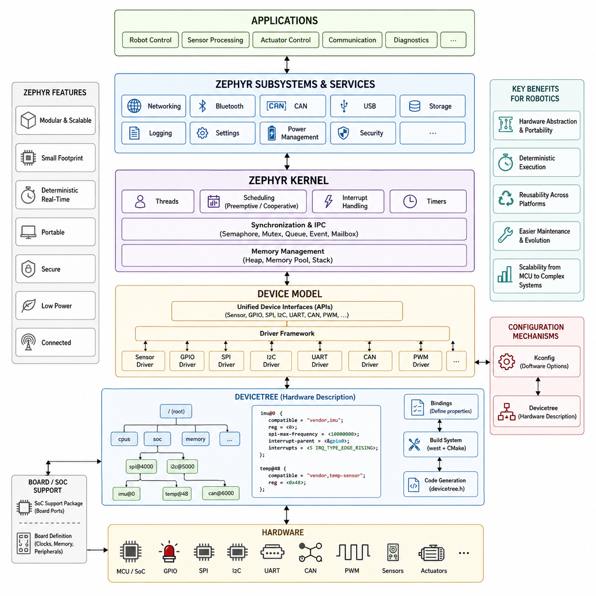
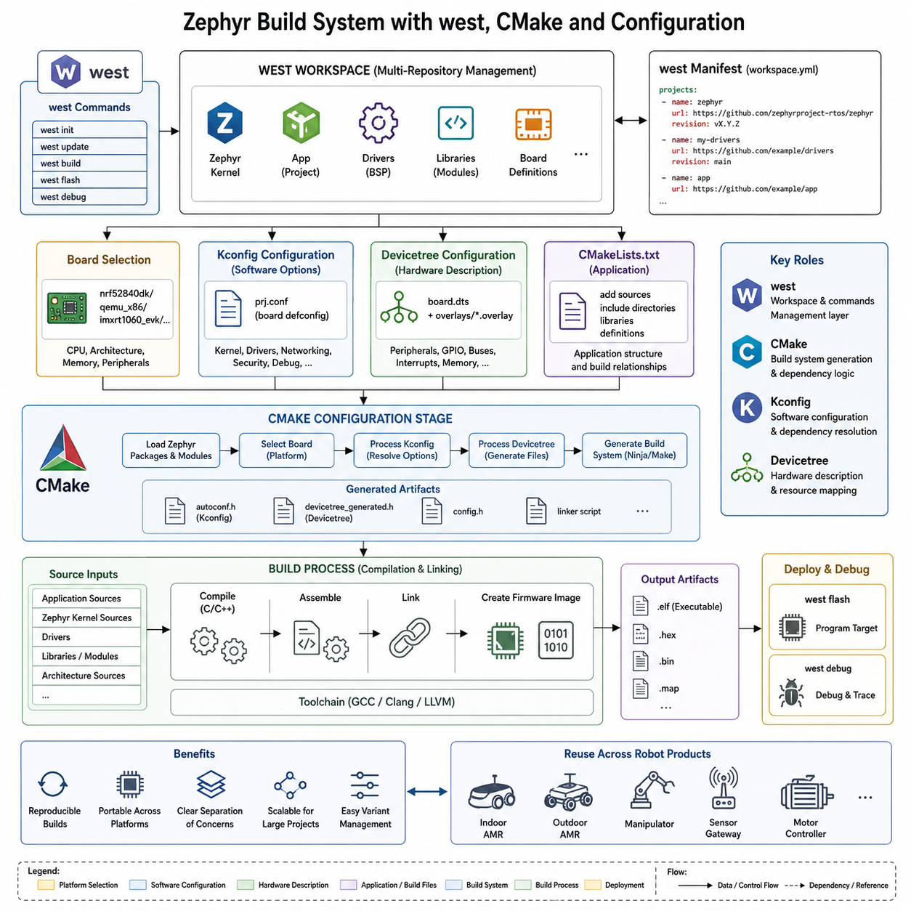
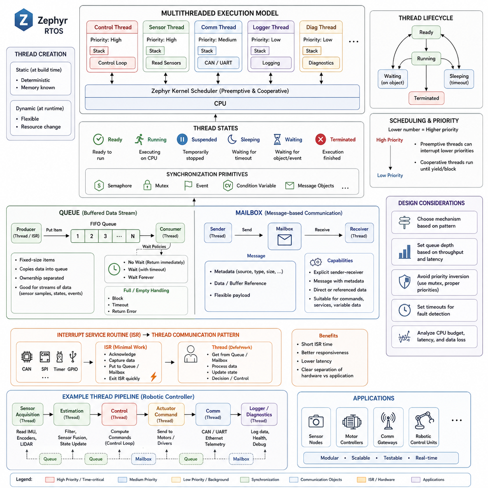
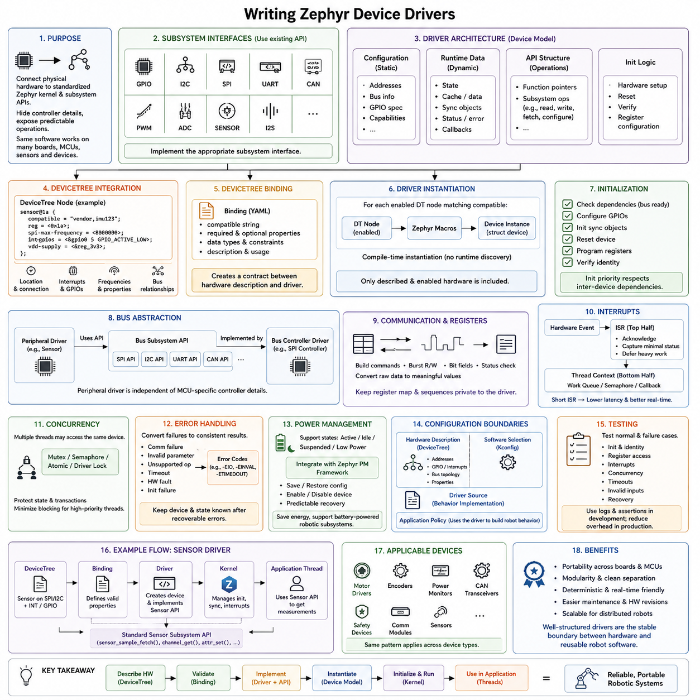
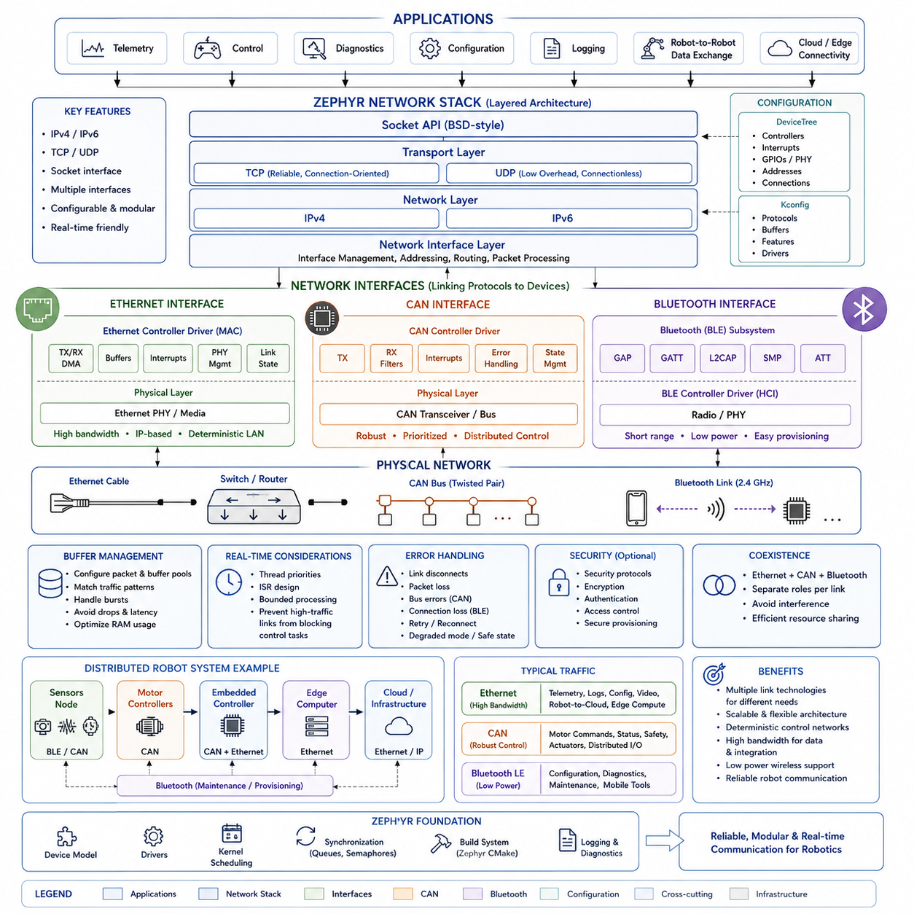
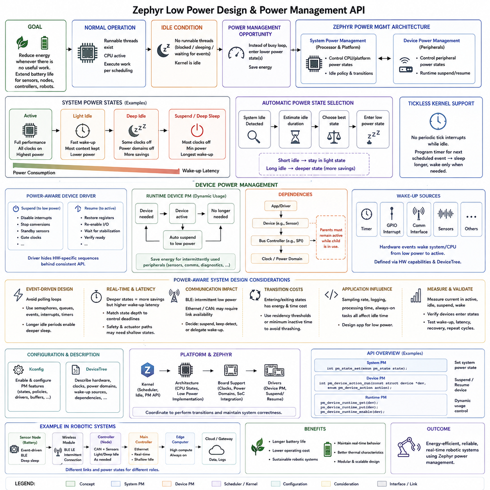
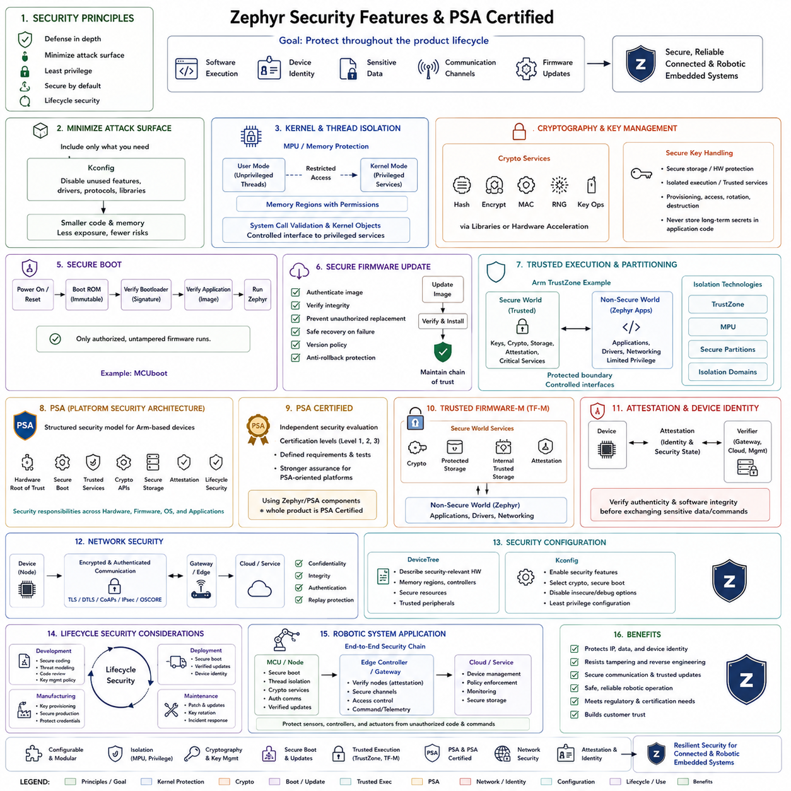
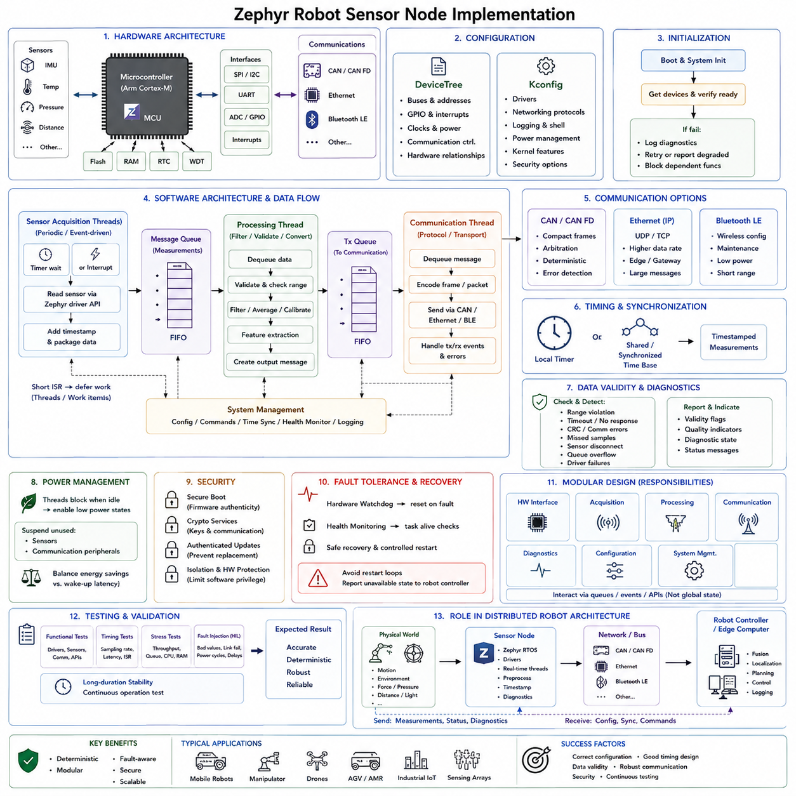
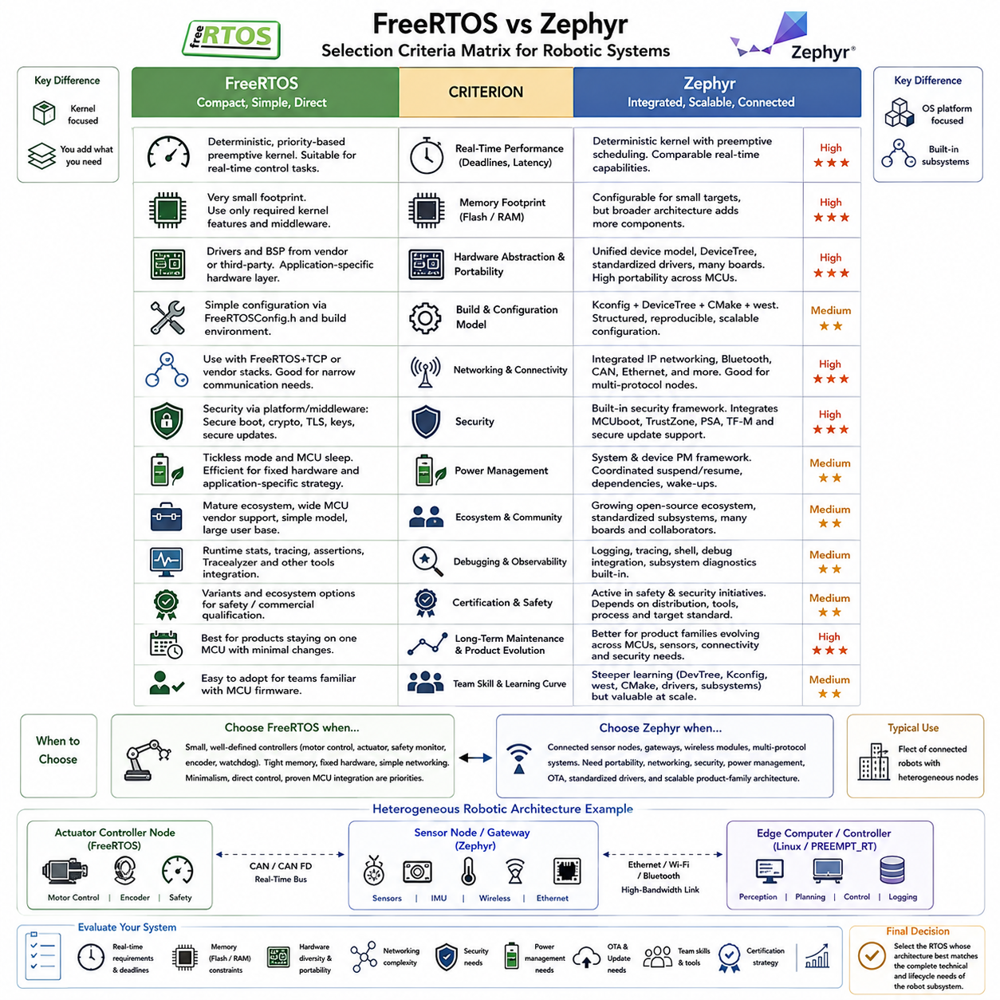
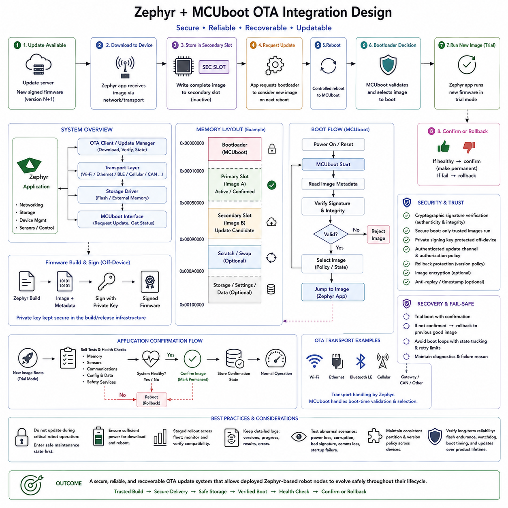

**Volume 03 Real Time Operating Systems**

# 03. Zephyr

## 03.01 Zephyr RTOS Architecture: Kernel, Driver Model, DevTree

{width="7.268055555555556in" height="7.268055555555556in"}

Zephyr는 리소스 제약이 있는 임베디드 장치(Embedded Device)를 위한 모듈형 실시간 운영체제(Real-Time Operating System)로 설계되었으며, 동시에 복잡한 연결형 로보틱스 플랫폼(Connected Robotics Platform)을 지원할 수 있는 아키텍처(Architecture)를 제공한다. 전체 구조는 커널 서비스(Kernel Service), 하드웨어 추상화(Hardware Abstraction), 장치 드라이버(Device Driver), 네트워킹(Networking), 미들웨어(Middleware), 애플리케이션(Application) 구성요소를 분리한다. 이러한 모듈형 구성은 대상 시스템에 필요한 기능만 선택적으로 구성할 수 있게 하여 메모리 사용량을 줄이는 동시에 소형 센서 컨트롤러부터 복잡한 로봇 서브시스템까지 확장성을 제공한다.

Zephyr의 중심에는 스레드 스케줄링(Thread Scheduling), 인터럽트 처리(Interrupt Processing), 동기화(Synchronization), 타이밍(Timing), 메모리 관련 서비스를 담당하는 소형 실시간 커널(Real-Time Kernel)이 위치한다. 스레드(Thread)는 우선순위(Priority)와 스케줄링 정책(Scheduling Policy)에 따라 실행되므로 시간 임계 제어 작업(Time-Critical Control Activity)이 중요도가 낮은 백그라운드 처리를 선점(Preemption)할 수 있다. 세마포어(Semaphore), 뮤텍스(Mutex), 메시지 큐(Message Queue), 이벤트(Event), 타이머(Timer)와 같은 커널 객체(Kernel Object)는 애플리케이션이 저수준 동기화 메커니즘을 직접 구현하지 않고도 동시 실행되는 소프트웨어 구성요소를 체계적으로 조정할 수 있게 한다.

Zephyr는 협력형 스레드(Cooperative Thread)와 선점형 스레드(Preemptive Thread)를 모두 지원하므로 개발자는 타이밍 요구사항(Timing Requirement)에 따라 실행 방식을 선택할 수 있다. 선점형 스케줄링(Preemptive Scheduling)은 제한된 시간 내에 응답해야 하는 제어(Control), 통신(Communication), 센서 처리(Sensor Processing)에 적합하며, 협력형 실행(Cooperative Execution)은 세밀하게 제어되는 처리 순서를 단순화할 수 있다. 인터럽트 서비스 루틴(Interrupt Service Routine)은 긴급한 하드웨어 이벤트를 처리하고, 지연 처리(Deferred Processing)를 통해 긴 작업을 스레드 문맥(Thread Context)으로 이동시켜 인터럽트 지연시간(Interrupt Latency)의 예측성과 시스템 응답성을 유지한다.

Zephyr의 주요 아키텍처적 특징 가운데 하나는 통합 장치 모델(Unified Device Model)이다. 하드웨어 주변장치(Hardware Peripheral)는 애플리케이션 소프트웨어와 상위 서브시스템에 표준화된 인터페이스(Standardized Interface)를 제공하는 장치(Device)로 표현된다. 드라이버(Driver)는 GPIO 컨트롤러, UART 인터페이스, SPI 및 I2C 버스, CAN 컨트롤러, 센서, PWM 모듈, Ethernet 장치와 같은 물리적 하드웨어를 이러한 인터페이스에 연결한다. 따라서 애플리케이션은 MCU별 레지스터 정의에 직접 의존하는 대신 일관된 API를 통해 하드웨어를 사용할 수 있으며, 프로세서 계열과 보드 설계 간의 이식성(Portability)이 향상된다.

드라이버 아키텍처(Driver Architecture)는 공통 서브시스템 API(Common Subsystem API)가 하위 하드웨어 구현과 상당 부분 독립되도록 계층화되어 있다. 예를 들어 센서 애플리케이션은 Zephyr의 센서 인터페이스(Sensor Interface)를 사용할 수 있으며 실제 장치 드라이버는 SPI 또는 I2C를 통해 센서와 통신한다. 마찬가지로 네트워크 애플리케이션은 네트워킹 API를 통해 동작하고 Ethernet, Wi-Fi 또는 기타 통신 하드웨어는 하위 계층에서 처리된다. 이러한 분리는 제품 세대에 따라 센서, 액추에이터(Actuator), 통신 하드웨어가 변경될 수 있는 로보틱스 시스템에서 특히 유용하다.

Zephyr의 디바이스 트리(DeviceTree) 메커니즘은 소프트웨어 드라이버와 실제 하드웨어 리소스를 연결하는 구조적 설명을 제공한다. 보드별 주소, 인터럽트 번호, GPIO 할당, 버스 연결 관계, 주변장치 설정을 애플리케이션 소스 코드에 직접 포함하는 대신 이러한 속성을 선언적 방식(Declarative Method)으로 표현한다. 따라서 디바이스 트리는 특정 보드를 위한 펌웨어를 빌드할 때 운영체제에 어떤 장치가 존재하고, 어디에 연결되어 있으며, 어떤 리소스가 필요한지를 알려주는 하드웨어 설명 계층(Hardware Description Layer)의 역할을 한다.

디바이스 트리(DeviceTree) 설명은 프로세서, 버스(Bus), 컨트롤러(Controller), 메모리 영역(Memory Region), 주변장치(Peripheral), 센서 및 기타 하드웨어 구성요소를 나타내는 노드(Node)의 계층구조로 구성된다. 노드에는 레지스터 주소, 인터럽트 라인, 클록 소스(Clock Source), 통신 주파수, GPIO 핀, 호환성 식별자(Compatibility Identifier)와 같은 정보를 설명하는 속성(Property)이 포함된다. 부모-자식 관계(Parent-Child Relationship)를 사용하여 SPI 컨트롤러에 연결된 IMU 또는 I2C 버스에 연결된 환경 센서처럼 물리적 토폴로지(Physical Topology)를 표현할 수 있으므로 하드웨어 구성을 구조화된 시스템 모델로 이해할 수 있다.

호환 속성(Compatible Property)은 디바이스 트리(DeviceTree)와 Zephyr 드라이버 모델(Driver Model)을 연결하는 중요한 역할을 한다. 이 속성은 노드와 연관된 하드웨어 유형을 식별하고 빌드 시스템(Build System)이 해당 하드웨어 설명을 적절한 드라이버 구현 및 바인딩 정의(Binding Definition)와 연결할 수 있도록 한다. 디바이스 트리 바인딩(DeviceTree Binding)은 특정 하드웨어 클래스가 요구하는 속성과 의미적 구조를 정의한다. 노드(Node), 호환 식별자(Compatible Identifier), 바인딩(Binding), 드라이버(Driver)는 함께 물리적 하드웨어 구성에서 소프트웨어가 사용할 수 있는 장치 인스턴스(Device Instance)까지 체계적인 연결 경로를 형성한다.

Zephyr는 디바이스 트리(DeviceTree)와 Kconfig를 서로 경쟁하는 설정 메커니즘으로 취급하지 않고 상호 보완적으로 결합한다. 디바이스 트리는 주로 하드웨어의 존재 여부와 연결 관계를 설명하는 반면 Kconfig는 어떤 소프트웨어 기능과 구현 옵션을 활성화할지를 제어한다. 예를 들어 보드는 디바이스 트리를 통해 CAN 컨트롤러나 SPI 주변장치를 선언할 수 있으며, Kconfig는 관련 드라이버 서브시스템과 소프트웨어 기능을 컴파일할 것인지를 결정한다. 이러한 구분은 하드웨어 토폴로지(Hardware Topology)와 소프트웨어 정책(Software Policy) 사이의 명확한 경계를 유지하는 데 도움이 된다.

빌드 과정(Build Process)은 디바이스 트리(DeviceTree) 정보를 드라이버와 애플리케이션이 효율적으로 참조할 수 있는 컴파일 시간 정의(Compile-Time Definition)로 변환한다. 이러한 방식은 소형 임베디드 대상 시스템에서 무거운 동적 하드웨어 검색 메커니즘(Dynamic Hardware Discovery Mechanism)을 사용할 필요성을 줄여준다. 대부분의 구성이 컴파일 과정에서 결정되므로 Zephyr는 정교한 운영체제 추상화의 장점을 유지하면서도 제한된 RAM과 플래시 메모리를 가진 마이크로컨트롤러(Microcontroller)에 적합한 소형 펌웨어를 생성할 수 있다. 잘못된 하드웨어 설명 역시 런타임 오류로 나타나기 전에 개발 과정에서 조기에 발견할 수 있다.

보드(Board) 및 시스템 온 칩(System-on-Chip, SoC) 지원 계층은 범용 Zephyr 아키텍처를 특정 하드웨어 플랫폼에 연결한다. SoC 정의는 프로세서 수준의 기능과 내장 주변장치를 설명하며, 보드 정의(Board Definition)는 클록, 메모리, 통신 인터페이스, LED, 커넥터, 활성화된 주변장치와 같은 구체적인 하드웨어 구성을 설명한다. 애플리케이션별 오버레이(Application-Specific Overlay)는 기본 보드 정의를 다시 작성하지 않고도 기존 디바이스 트리를 수정하거나 확장할 수 있으므로 하나의 펌웨어 아키텍처로 여러 로봇 컨트롤러 변형을 비교적 적은 설정 변경만으로 지원할 수 있다.

로보틱스(Robotics) 관점에서 이러한 아키텍처는 재사용 가능한 소프트웨어 동작과 빠르게 변경되는 하드웨어 구성을 효과적으로 분리한다. 센서 노드 애플리케이션(Sensor Node Application)은 동일한 스레드 구조, 통신 로직, 진단(Diagnostics), 센서 처리 파이프라인을 유지하면서 디바이스 트리 오버레이(DeviceTree Overlay)를 통해 서로 다른 센서, 버스, 인터럽트 핀 또는 보드 리비전(Board Revision)을 선택할 수 있다. 드라이버 API는 애플리케이션 로직을 장치별 구현 세부사항으로부터 격리하며, 커널 스케줄링은 주기적 샘플링, 액추에이터 감시, 통신 및 고장 모니터링에 필요한 결정론적 실행 기반(Deterministic Execution Foundation)을 제공한다.

Zephyr의 서브시스템 아키텍처(Subsystem Architecture)는 기본적인 커널과 드라이버 서비스를 넘어 네트워킹(Networking), 저장장치(Storage), 로깅(Logging), 전력 관리(Power Management), 보안(Security), Bluetooth, CAN, USB 및 기타 임베디드 기능까지 확장된다. 이러한 서브시스템은 공통 장치 모델과 설정 인프라(Configuration Infrastructure)를 재사용하므로 애플리케이션에 저수준 구현 세부사항을 노출하지 않고도 하드웨어 리소스를 더 큰 소프트웨어 스택에 통합할 수 있다. 결과적으로 커널 서비스는 실행을 담당하고, 드라이버는 하드웨어 접근을 제공하며, 서브시스템은 재사용 가능한 기능적 역량을 제공하는 구조가 형성된다.

이러한 구성은 하나의 로봇 내부에 여러 개의 분산 임베디드 컨트롤러(Distributed Embedded Controller)가 존재할 때 특히 유용하다. 모터 컨트롤러(Motor Controller), 배터리 관리 인터페이스(Battery-Management Interface), 안전 노드(Safety Node), 센서 게이트웨이(Sensor Gateway), 통신 모듈은 서로 다른 MCU 계열을 사용할 수 있지만 공통 Zephyr 소프트웨어 아키텍처를 따를 수 있다. 디바이스 트리는 각 컨트롤러의 하드웨어 토폴로지를 표현하고, 드라이버는 주변장치 접근 방식을 표준화하며, 커널 서비스는 결정론적 실행을 관리하고, 통신 서브시스템은 CAN, Ethernet, Bluetooth 또는 기타 네트워크를 통해 컨트롤러를 전체 로봇 플랫폼과 연결한다.

따라서 전체 아키텍처 흐름은 물리적 하드웨어(Physical Hardware)에서 애플리케이션 동작(Application Behavior)으로 진행되는 계층적 과정으로 이해할 수 있다. 디바이스 트리(DeviceTree)는 하드웨어 리소스와 토폴로지를 설명하고, 바인딩(Binding)은 이러한 설명이 어떻게 해석되는지를 정의하며, 드라이버(Driver)는 범용 서브시스템 동작을 하드웨어별 트랜잭션으로 변환한다. 커널 메커니즘(Kernel Mechanism)은 스케줄링과 동기화를 제공하고, 상위 서비스는 네트워킹, 저장장치, 보안 및 통신 기능을 제공한다. 결과적으로 애플리케이션은 프로세서별 하드웨어 세부사항보다 로봇 기능 자체에 더욱 집중할 수 있다.

실제 로봇 개발에서 이 아키텍처의 가장 큰 장점은 통제된 이식성(Controlled Portability)이다. 임베디드 시스템에서는 여전히 인터럽트, DMA, 타이밍, 메모리, 버스 및 전기적 인터페이스를 세밀하게 관리해야 하므로 하드웨어 차이가 완전히 숨겨지는 것은 아니다. 대신 Zephyr는 이러한 차이를 명확하게 정의된 아키텍처 위치에 배치한다. 따라서 마이크로컨트롤러, 센서, 통신 인터페이스 또는 보드 리비전이 변경되더라도 수정해야 하는 애플리케이션 소프트웨어의 범위를 제한하면서 기존의 실시간 동작(Real-Time Behavior)을 유지할 수 있다.

따라서 Zephyr의 커널(Kernel), 드라이버 모델(Driver Model), 디바이스 트리(DeviceTree)는 서로 독립적인 기능이 아니라 하나의 임베디드 소프트웨어 아키텍처를 구성하는 상호 보완적 요소로 이해해야 한다. 커널은 소프트웨어가 언제 실행되는지를 관리하고, 드라이버 프레임워크(Driver Framework)는 소프트웨어가 장치에 어떻게 접근하는지를 정의하며, 디바이스 트리는 어떤 하드웨어가 존재하고 어떻게 연결되어 있는지를 지정한다. 이 세 요소가 결합되어 재사용 가능한 로봇 펌웨어, 분산 센서 및 액추에이터 노드, 통신 게이트웨이, 그리고 여러 하드웨어 세대에 걸쳐 발전해야 하는 임베디드 컨트롤러를 위한 설정 가능한 기반을 형성한다.

## 03.02 Zephyr Build System: west / CMake Configuration [w/Code]

{width="7.268055555555556in" height="7.268055555555556in"}

Zephyr는 west, CMake, Kconfig, 디바이스 트리(DeviceTree), 그리고 기반 컴파일러 툴체인(Compiler Toolchain)을 하나의 통합된 워크플로(Workflow)로 결합하는 고도로 구조화된 빌드 시스템(Build System)을 사용한다. 이러한 아키텍처를 통해 동일한 애플리케이션 소스(Application Source)를 플랫폼별 빌드 스크립트를 직접 다시 작성하지 않고도 다양한 마이크로컨트롤러(Microcontroller)와 개발 보드(Development Board)에 맞게 구성할 수 있다. 빌드 과정은 펌웨어가 대상 장치에 프로그래밍되기 전에 소프트웨어 옵션, 하드웨어 설명, 의존성, 생성 헤더, 라이브러리 및 최종 실행 이미지를 결정한다.

CMake는 Zephyr 내부에서 주요 빌드 구성 엔진(Build Configuration Engine)의 역할을 수행한다. 일반적으로 애플리케이션은 프로젝트와 애플리케이션 소스 파일을 정의하는 CMakeLists.txt 파일을 제공하며, Zephyr는 전체 펌웨어 이미지(Firmware Image)를 구성하는 데 필요한 더 큰 규모의 CMake 모듈 집합을 제공한다. 개발자는 모든 컴파일러 옵션, 포함 디렉터리(Include Directory), 라이브러리 및 하드웨어 의존성을 직접 지정하는 대신 Zephyr의 빌드 인프라(Build Infrastructure)를 이용하여 선택된 보드와 설정으로부터 이러한 항목을 결정한다.

환경 변수(Environment Variable) ZEPHYR_BASE는 Zephyr 소스 트리(Source Tree)의 위치를 식별하며 빌드 인프라를 위한 중요한 기준점을 제공한다. CMake가 애플리케이션을 구성할 때 Zephyr의 패키지 정의와 빌드 로직을 불러오고, 선택된 대상 보드(Target Board)를 식별하며, 설정 정보를 처리하고 내부 빌드 그래프(Build Graph)를 생성한다. 따라서 애플리케이션 코드는 커널, 드라이버, 라이브러리, 아키텍처 지원 및 활성화된 서브시스템을 포함하는 더 큰 펌웨어 빌드의 하나의 구성요소가 된다.

일반적인 빌드는 대상 하드웨어 플랫폼(Target Hardware Platform)을 나타내는 보드를 선택하는 것에서 시작한다. 보드 선택은 프로세서 계열, CPU 아키텍처, 메모리 배치(Memory Layout), 지원 주변장치 및 기본 하드웨어 설정과 같은 중요한 아키텍처 정보를 결정한다. 이후 Zephyr는 이러한 보드 정의(Board Definition)를 애플리케이션별 설정과 결합하여 하나의 애플리케이션을 소스 수준 구현의 대부분을 유지하면서 서로 다른 지원 플랫폼에 맞게 다시 빌드할 수 있도록 한다.

Kconfig는 이 과정에서 소프트웨어 설정(Software Configuration) 영역을 담당한다. 설정 심볼(Configuration Symbol)은 커널 기능, 드라이버, 통신 프로토콜, 디버깅 기능, 네트워킹 구성요소, 보안 메커니즘 및 기타 기능을 포함할 것인지 결정한다. 애플리케이션은 일반적으로 prj.conf 파일을 통해 요구사항을 표현하며, 보드 기본값(Board Default)과 서브시스템 의존성도 추가적인 설정 정보를 제공한다. 그 결과 컴파일 전체에서 사용되는 최종 설정 옵션 집합이 결정된다.

Kconfig 의존성(Dependency)은 임베디드 소프트웨어 기능이 서로 독립적으로 동작하는 경우가 드물기 때문에 특히 중요하다. 네트워크 프로토콜을 활성화하면 네트워크 버퍼, 네트워크 인터페이스, 특정 드라이버 및 동기화 기능이 함께 필요할 수 있다. Zephyr의 설정 시스템은 각각의 설정을 독립적인 컴파일러 플래그(Compiler Flag)로 처리하는 대신 이러한 옵션 사이의 의존성과 관계를 평가한다. 이를 통해 일관되지 않은 설정을 줄이고 완전한 임베디드 소프트웨어 시스템에서 어떤 기능들이 함께 존재해야 하는지를 개발자가 이해할 수 있도록 한다.

디바이스 트리(DeviceTree)는 Kconfig를 보완하는 하드웨어 설정(Hardware Configuration) 영역을 제공한다. Kconfig가 일반적으로 어떤 소프트웨어 기능을 활성화해야 하는지를 결정한다면, 디바이스 트리는 어떤 하드웨어 리소스가 존재하며 서로 어떻게 연결되어 있는지를 설명한다. 설정 과정에서 선택된 보드의 디바이스 트리 설명은 애플리케이션 오버레이(Application Overlay)와 결합되어 애플리케이션 소스 코드를 변경하지 않고도 주변장치 상태, GPIO 할당, 통신 버스, 센서 연결, 메모리 영역 또는 기타 하드웨어 특성을 변경할 수 있다.

빌드 시스템은 디바이스 트리(DeviceTree) 소스와 바인딩(Binding) 정보를 처리하여 드라이버와 애플리케이션이 사용할 수 있는 컴파일 시간 하드웨어 설명(Compile-Time Hardware Description)을 생성한다. 따라서 드라이버는 하드코딩된 상수(Hard-Coded Constant)를 사용하는 대신 생성된 정의를 통해 주소, 인터럽트, GPIO 명세, 버스 관계 및 기타 하드웨어 파라미터를 얻을 수 있다. 이러한 방식은 빌드 시스템을 Zephyr의 장치 모델(Device Model)과 긴밀하게 연결하며 하드웨어 설정 오류를 개발 과정의 초기 단계에서 발견할 수 있도록 한다.

west는 이러한 빌드 아키텍처를 둘러싸는 상위 수준의 워크스페이스 및 명령줄 관리 계층(Workspace and Command-Line Management Layer)을 제공한다. west는 Zephyr 커널뿐만 아니라 여러 저장소(Repository), 모듈(Module), 벤더 라이브러리(Vendor Library), 보드 지원 패키지(Board Support Package), 애플리케이션 구성요소로 이루어진 Zephyr 프로젝트를 관리하도록 설계되었다. 펌웨어 개발을 하나의 독립된 저장소로 취급하는 대신 west는 특정 임베디드 플랫폼에 필요한 모든 소프트웨어 구성요소가 포함된 통합 워크스페이스를 유지하기 위한 메커니즘을 제공한다.

west 매니페스트(West Manifest)는 다중 저장소 워크스페이스(Multi-Repository Workspace) 관리의 중심 요소이다. 매니페스트는 프로젝트, 저장소 위치, 리비전(Revision), 그리고 관련 워크스페이스 정보를 정의하여 개발자가 일관된 소스 구성요소 집합을 재현할 수 있도록 한다. 이는 로보틱스 펌웨어가 Zephyr 자체뿐만 아니라 사용자 정의 장치 드라이버, 통신 라이브러리, 보드 정의, 공유 제어 소프트웨어 및 별도의 저장소에서 관리되는 벤더별 모듈에 의존할 때 더욱 중요해진다.

west는 일반적인 개발 작업을 위한 편리한 인터페이스도 제공한다. west build와 같은 명령은 하위의 Zephyr 및 CMake 빌드 과정을 호출하며, west flash는 보드별 프로그래밍 도구와 통합되고 west debug는 빌드 결과를 지원되는 디버깅 인프라(Debugging Infrastructure)와 연결할 수 있다. 따라서 west가 CMake나 컴파일러를 대체하는 것은 아니며, 여러 하위 도구를 조정하고 그 위에서 일관된 명령 인터페이스(Command Interface)를 제공하는 역할을 수행한다.

west build가 실행되면 CMake가 먼저 설정 단계(Configuration Stage)를 수행하고 선택된 환경에 적합한 빌드 시스템을 생성한다. Kconfig는 소프트웨어 설정을 결정하고, 디바이스 트리 처리는 하드웨어 설명을 결정하며, 이후 컴파일에 필요한 생성 파일(Generated File)이 만들어진다. 그 다음 빌드 백엔드(Build Backend)는 애플리케이션 코드와 필요한 Zephyr 커널 구성요소, 드라이버, 라이브러리 및 아키텍처별 소스를 함께 컴파일하고 최종적으로 하나의 펌웨어 이미지로 링크(Link)한다.

Zephyr는 일반적으로 생성된 빌드 산출물(Build Artifact)을 애플리케이션 소스 코드와 분리하여 저장하는 소스 외부 빌드(Out-of-Tree Build)를 지원한다. 이러한 분리는 소스 디렉터리를 깔끔하게 유지하고 동일한 애플리케이션의 서로 다른 설정을 동시에 유지할 수 있도록 한다. 개발자는 서로 다른 보드, 디버깅 설정, 릴리스 설정 또는 하드웨어 리비전을 위한 독립적인 빌드 디렉터리를 유지할 수 있으며, 이를 통해 대상 플랫폼을 비교하고 지속적 통합 및 배포 파이프라인(Continuous Integration and Deployment Pipeline)에서 펌웨어 생성을 자동화하기 쉬워진다.

설정 변경(Configuration Change)은 빌드 파이프라인(Build Pipeline)에서 각 파일이 담당하는 위치를 기준으로 이해해야 한다. prj.conf를 수정하면 주로 Kconfig를 통해 소프트웨어 기능이 변경되고, 디바이스 트리 오버레이(DeviceTree Overlay)를 수정하면 대상 하드웨어 설명이 변경된다. CMakeLists.txt를 변경하면 일반적으로 애플리케이션 소스 구성이나 빌드 관계가 변경되며, west 매니페스트를 변경하면 워크스페이스에서 사용할 수 있는 저장소 또는 모듈이 변경된다. 이러한 책임을 분리하여 유지하면 설정 파일 간의 결합도가 지나치게 높아지고 유지보수가 어려워지는 것을 방지할 수 있다.

로보틱스 시스템(Robotics System)에서는 하드웨어와 소프트웨어가 서로 다른 속도로 발전하는 경우가 많기 때문에 이러한 분리가 특히 유용하다. 센서 노드(Sensor Node)는 애플리케이션 로직을 유지하면서 하나의 MCU 보드에서 다른 MCU 보드로 변경될 수 있으며, 로봇 컨트롤러는 전체 펌웨어를 다시 설계하지 않고도 IMU, CAN 인터페이스, 엔코더(Encoder), 통신 모듈 등을 교체할 수 있다. 보드 정의와 디바이스 트리 오버레이는 하드웨어 변경을 담당하고, Kconfig와 애플리케이션 설정은 필요한 소프트웨어 기능을 제어한다.

동일한 아키텍처는 제품 변형(Product Variant)을 효율적으로 지원한다. 실내 자율이동로봇(Indoor AMR), 실외 자율이동로봇(Outdoor AMR), 매니퓰레이터(Manipulator), 센서 게이트웨이(Sensor Gateway), 분산 모터 컨트롤러(Distributed Motor Controller)는 상당한 양의 펌웨어 구성요소를 공유하면서도 서로 다른 통신 인터페이스, 센서, 메모리 설정 또는 진단 기능을 요구할 수 있다. 개별 보드 정의, 설정 프래그먼트(Configuration Fragment), 오버레이 및 빌드 디렉터리를 사용하면 공통 코드베이스(Common Codebase)에서 이러한 변형을 생성하면서 각 대상의 최종 펌웨어를 명시적으로 제어할 수 있다.

따라서 잘 설계된 Zephyr 프로젝트에서는 west, CMake, Kconfig, 디바이스 트리(DeviceTree)를 서로 대체 가능한 설정 도구가 아니라 상호 보완적인 계층으로 이해해야 한다. west는 워크스페이스와 개발 명령을 관리하고, CMake는 빌드 그래프와 컴파일 과정을 구성하며, Kconfig는 소프트웨어 기능을 결정하고, 디바이스 트리는 하드웨어 토폴로지(Hardware Topology)를 설명한다. 이들이 결합되어 선택된 임베디드 플랫폼에 필요한 커널 서비스, 드라이버, 서브시스템 및 애플리케이션 구성요소만 포함하는 대상별 펌웨어 이미지(Target-Specific Firmware Image)를 생성한다.

확장 가능한 로봇 펌웨어 개발(Scalable Robot Firmware Development)의 관점에서 이러한 빌드 아키텍처는 이식성(Portability)뿐만 아니라 재현성(Reproducibility)도 제공한다. 정의된 west 워크스페이스는 소스 버전을 확립하고, 설정 파일은 소프트웨어 동작을 정의하며, 디바이스 트리는 하드웨어 구조를 표현하고, CMake는 이들을 결정론적인 빌드 산출물(Deterministic Build Artifact)로 컴파일하는 과정을 조정한다. 이러한 메커니즘을 통해 공통 소프트웨어 아키텍처, 자동화된 빌드, 추적 가능한 설정 및 반복 가능한 펌웨어 배포를 유지하면서 여러 임베디드 컨트롤러와 하드웨어 세대를 체계적으로 관리할 수 있다.

## 03.03 Zephyr Threads, Queues, Mailboxes [w/Code]

{width="7.268055555555556in" height="7.268055555555556in"}

Zephyr는 멀티스레드 실행 모델(Multithreaded Execution Model)을 제공하여 임베디드 애플리케이션(Embedded Application)의 복잡한 동작을 명시적인 우선순위(Priority), 스택 크기(Stack Size), 스케줄링 특성(Scheduling Property)을 가진 독립적인 스레드(Thread)로 분리할 수 있도록 한다. 각 스레드는 커널(Kernel)이 관리하는 스케줄링 가능한 실행 컨텍스트(Schedulable Execution Context)를 나타내며, 시간 임계 제어(Time-Critical Control), 센서 획득(Sensor Acquisition), 통신(Communication), 진단(Diagnostics), 백그라운드 처리(Background Processing)를 분리할 수 있다. 이러한 구조는 여러 작업이 동시에 진행되면서도 예측 가능한 타이밍을 유지해야 하는 로보틱스 시스템(Robotics System)에 특히 유용하다.

Zephyr 스레드(Thread)는 자체 스택(Stack)과 실행 상태(Execution State)를 가지며 커널이 관리하는 스케줄링 정보(Scheduling Information)도 함께 포함한다. 스레드는 시스템 요구사항과 설정에 따라 컴파일 시점(Compile Time)에 정적으로 생성하거나 실행 시간(Runtime)에 동적으로 생성할 수 있다. 정적 생성(Static Creation)은 실행 전에 메모리 요구량을 결정할 수 있기 때문에 결정론적 임베디드 시스템(Deterministic Embedded System)에 적합하며, 동적 생성(Dynamic Creation)은 애플리케이션 동작에 따라 처리 리소스를 실행 중 변경해야 하는 경우 유연성을 제공한다.

스레드 우선순위(Thread Priority)는 여러 스레드가 동시에 실행 가능한 상태일 때 어떤 스레드가 프로세서 시간을 할당받는지를 결정한다. Zephyr는 협력형(Cooperative) 우선순위와 선점형(Preemptive) 우선순위 범위를 구분하여 하나의 애플리케이션에서 서로 다른 스케줄링 동작을 구성할 수 있도록 한다. 높은 우선순위의 선점형 스레드는 실행 가능 상태가 되면 낮은 우선순위의 실행을 중단시킬 수 있으며, 협력형 스레드는 스스로 양보(Yield)하거나 차단(Block)되거나 다른 방식으로 실행권을 넘길 때까지 계속 실행된다.

스레드 생명주기(Thread Lifecycle)는 커널 스케줄링 상태(Kernel Scheduling State)와 밀접하게 연관되어 있다. 스레드는 실행 준비(Ready), 실행 중(Running), 보류(Suspended), 수면(Sleeping), 커널 객체 대기(Waiting), 종료(Terminated) 등의 상태가 될 수 있다. 일정 시간 동안 수면하거나 통신 객체를 기다리는 등의 작업은 해당 스레드를 CPU 실행 경쟁에서 일시적으로 제거한다. 타임아웃(Timeout)이 만료되거나 필요한 이벤트가 발생하면 커널은 해당 스레드를 다시 우선순위에 따라 스케줄링 가능한 상태로 만든다.

여러 실행 컨텍스트(Execution Context)가 하드웨어, 데이터 구조 또는 통신 리소스를 공유할 때는 스레드 동기화(Thread Synchronization)가 필수적이다. Zephyr는 세마포어(Semaphore), 뮤텍스(Mutex), 이벤트(Event), 조건 변수(Condition Variable), 메시지 지향 객체(Message-Oriented Object)와 같은 커널 메커니즘을 제공하여 이러한 작업을 조정한다. 스레드는 데이터를 계속 폴링(Polling)하는 대신 동기화 객체를 기다리면서 차단될 수 있으며, 그동안 프로세서는 다른 유용한 작업을 수행하여 응답성과 전력 효율(Power Efficiency)을 향상시킬 수 있다.

큐(Queue)는 스레드 사이 또는 인터럽트와 스레드 컨텍스트 사이에서 고정 크기 데이터 항목(Fixed-Size Data Item)을 전달하기 위한 간단하고 직관적인 메커니즘이다. 생산자(Producer)는 항목을 큐에 넣고 소비자(Consumer)는 처리할 수 있을 때 해당 항목을 가져온다. 큐는 전달된 데이터 항목의 복사본을 저장하기 때문에 생산자와 소비자 사이의 소유권(Ownership)이 명확하게 분리되며, 변경 가능한 애플리케이션 구조를 직접 공유하는 방식보다 동시성 관리(Concurrency Management)를 단순화할 수 있다.

Zephyr 메시지 큐(Message Queue)는 주기적인 센서 샘플(Sensor Sample), 명령 구조(Command Structure), 상태 업데이트(State Update), 이벤트 기록(Event Record)과 같은 비교적 작은 고정 형식 메시지(Fixed-Format Message)를 처리하는 데 특히 적합하다. 예를 들어 센서 획득 스레드는 주기적으로 IMU를 읽어 측정 구조체(Measurement Structure)를 큐에 넣을 수 있다. 처리 스레드는 이러한 측정값을 독립적으로 가져와 필터링(Filtering)이나 추정(Estimation)을 수행하고 결과 상태 정보를 전달할 수 있으므로 두 스레드가 정확히 같은 시간에 실행될 필요가 없다.

큐 연산(Queue Operation)은 실시간 요구사항(Real-Time Requirement)에 따라 서로 다른 대기 정책(Waiting Policy)을 사용할 수 있다. 스레드는 데이터를 무기한 기다리거나, 지정된 타임아웃 동안 기다리거나, 큐가 비어 있거나 가득 찬 경우 즉시 반환하도록 설정할 수 있다. 이러한 선택지를 통해 통신 동작을 타이밍 제약조건(Timing Constraint)에 맞출 수 있다. 제어 작업(Control Task)은 무기한 차단을 피할 수 있으며, 백그라운드 로깅 작업은 새로운 정보가 들어올 때까지 기다려 불필요한 프로세서 사용을 줄일 수 있다.

큐 용량(Queue Capacity)은 메모리 소비와 생산자 및 소비자의 일시적인 처리 속도 차이를 얼마나 흡수할 수 있는지 사이의 절충관계(Tradeoff)를 나타내므로 신중하게 결정해야 한다. 생산자가 소비자보다 빠르게 데이터를 생성하면 결국 큐가 가득 차게 된다. 큐 용량을 늘리면 짧은 버스트(Burst)는 흡수할 수 있지만 지속적인 처리량 불일치(Throughput Mismatch)를 해결할 수는 없다. 따라서 실시간 설계에서는 생산 속도, 처리 지연시간(Latency), 큐 깊이(Queue Depth), 허용 가능한 데이터 손실(Data Loss)을 함께 분석해야 한다.

메일박스(Mailbox)는 스레드 사이에서 정보를 전달하기 위한 보다 유연한 메시지 지향 통신 메커니즘(Message-Oriented Communication Mechanism)을 제공한다. 단순한 고정 항목 큐와 달리 메일박스 통신은 전달되는 정보를 설명하는 메타데이터(Metadata)를 포함한 메시지(Message)를 기반으로 한다. 이를 통해 송신 스레드(Sender Thread)와 수신 스레드(Receiver Thread)가 구조화된 메시지를 교환하는 동안 커널이 통신 관계를 조정한다. 따라서 메일박스는 기본적인 버퍼형 큐보다 명시적인 송신자-수신자 상호작용(Sender-Receiver Interaction)이 필요한 경우 유용하다.

메일박스 메시지(Mailbox Message)는 전달되는 데이터뿐만 아니라 통신 작업과 관련된 정보도 설명할 수 있다. 애플리케이션 설계에 따라 데이터는 직접 전달되거나 메시지가 참조하는 메모리를 통해 전달될 수 있다. 이러한 방식은 크기가 크거나 가변적인 통신 페이로드(Variable Communication Payload)에 더 높은 유연성을 제공하지만, 수신 스레드가 필요한 작업을 완료할 때까지 참조된 메모리가 유효한 상태로 유지되도록 버퍼 소유권(Buffer Ownership)과 수명(Lifetime)을 신중하게 관리해야 한다.

따라서 큐(Queue)와 메일박스(Mailbox)의 차이는 단순한 문법적 차이가 아니라 아키텍처적 차이(Architectural Difference)이다. 큐는 생산자와 소비자가 비교적 독립적으로 동작하는 고정 크기의 동종 항목(Homogeneous Item) 버퍼 스트림(Buffer Stream)을 자연스럽게 표현한다. 반면 메일박스는 메타데이터, 주소 지정(Addressing), 보다 유연한 전송 의미론(Transfer Semantics)이 필요한 스레드 간 명시적인 메시지 교환을 표현하는 데 적합하다. 올바른 메커니즘을 선택하면 불필요한 복사(Copy)를 줄이고 소유권 규칙을 단순화하며 통신 동작을 더욱 쉽게 이해할 수 있다.

많은 임베디드 데이터 흐름이 하드웨어 인터럽트(Hardware Interrupt)에서 시작되므로 스레드 통신을 설계할 때 인터럽트 서비스 루틴(Interrupt Service Routine, ISR)도 고려해야 한다. ISR은 CAN 프레임 수신, SPI 전송 완료 감지, 타이머 이벤트 처리 또는 GPIO 상태 변화에 대응할 수 있다. 인터럽트 컨텍스트에서 많은 계산을 수행하는 대신 ISR은 적절한 커널 객체를 통해 최소한의 정보만 전달하고, 스케줄링 가능한 스레드가 더 많은 계산이 필요한 처리를 수행하도록 구성할 수 있다.

이러한 패턴은 즉각적인 하드웨어 응답(Immediate Hardware Response)과 애플리케이션 수준 계산(Application-Level Computation)을 분리한다. 예를 들어 인터럽트가 센서 샘플이 준비되었음을 알리면 전용 획득 스레드(Acquisition Thread)가 실제 처리를 수행하고 결과 데이터를 큐에 저장할 수 있다. 다른 스레드는 이 데이터를 소비하여 추정(Estimation)이나 제어(Control)에 사용할 수 있다. 이러한 파이프라인(Pipeline)은 인터럽트 실행 시간을 줄이고 하드웨어 상호작용, 데이터 처리, 제어 결정 및 통신 사이에 명확한 경계를 형성한다.

타임아웃 동작(Timeout Behavior)은 Zephyr 스레드 간 통신에서 또 하나의 중요한 요소이다. 커널 API는 일반적으로 작업이 즉시 반환할 것인지, 제한된 시간 동안 기다릴 것인지, 또는 무기한 차단될 것인지를 지정할 수 있도록 한다. 제한된 타임아웃(Finite Timeout)은 예상된 정보를 수신하지 못하는 상황 자체를 고장 조건(Fault Condition)으로 판단할 수 있기 때문에 로봇 컨트롤러에서 중요하다. 따라서 제어 스레드는 영구적으로 차단되는 대신 센서 업데이트 누락이나 통신 장애를 감지할 수 있다.

서로 다른 중요도 수준(Criticality Level)에서 동작하는 스레드들을 통신으로 연결할 때는 신중한 우선순위 할당(Priority Assignment)이 필요하다. 높은 우선순위의 제어 스레드는 해당 의존성이 의도적으로 설계되고 제한되지 않는 한 느린 백그라운드 작업에 간접적으로 의존해서는 안 된다. 따라서 큐 길이(Queue Length), 처리 예산(Processing Budget), 타임아웃 값, 동기화 관계를 스케줄링 우선순위와 함께 고려해야 하며, 그렇지 않으면 통신 아키텍처가 실시간 보장(Real-Time Guarantee)을 약화시킬 수 있다.

로봇 임베디드 컨트롤러(Robot Embedded Controller)에서 스레드(Thread), 큐(Queue), 메일박스(Mailbox)는 함께 구조화된 처리 파이프라인(Structured Processing Pipeline)을 형성할 수 있다. 개별 스레드는 센서 획득, 상태 추정(State Estimation), 액추에이터 명령(Actuator Command), CAN 통신, 안전 감시(Safety Supervision), 진단 및 로깅을 담당할 수 있다. 큐는 주기적인 처리 단계 사이에서 버퍼형 데이터 흐름을 제공하고, 메일박스는 보다 명시적인 명령 또는 서비스 교환을 지원하며, 커널 스케줄링은 시스템 우선순위에 따라 각 단계가 언제 실행될지를 결정한다.

이러한 아키텍처는 각 스레드가 명확하게 정의된 하나의 책임에 집중하고 통신은 명시적인 커널 관리 인터페이스(Kernel-Managed Interface)를 통해 이루어지므로 모듈성(Modularity)을 향상시킨다. 또한 생산자와 소비자를 제어된 메시지를 이용하여 독립적으로 평가할 수 있으므로 테스트 가능성(Testability)도 높아진다. Zephyr의 드라이버 모델(Driver Model), 디바이스 트리(DeviceTree) 설정, 빌드 시스템(Build System)과 결합하면 이러한 동시성 메커니즘(Concurrency Mechanism)은 확장 가능한 센서 노드, 모터 컨트롤러, 통신 게이트웨이 및 분산 로봇 제어 장치(Distributed Robotic Control Unit)를 구축하기 위한 실용적인 기반을 제공한다.

## 03.04 Writing Zephyr Device Drivers [w/Code]

{width="7.268055555555556in" height="7.268055555555556in"}

Zephyr 장치 드라이버(Device Driver)는 물리적 주변장치(Physical Peripheral)를 표준화된 커널 및 서브시스템 API(Kernel and Subsystem API)에 연결하는 하드웨어 대응 계층(Hardware-Facing Layer)을 구성한다. 애플리케이션 코드가 레지스터(Register)에 직접 접근하도록 하는 대신 Zephyr는 장치 객체(Device Object)와 서브시스템 인터페이스(Subsystem Interface)를 통해 하드웨어를 표현한다. 적절하게 설계된 드라이버는 컨트롤러별 세부사항을 숨기면서 애플리케이션에 예측 가능한 동작을 제공하므로 동일한 소프트웨어 아키텍처를 서로 다른 보드, 마이크로컨트롤러, 센서, 통신 장치 및 로봇 컨트롤러 변형에서 사용할 수 있다.

Zephyr 드라이버를 작성하는 과정은 일반적으로 해당 하드웨어가 어떤 서브시스템(Subsystem)에 속하는지를 식별하는 것에서 시작한다. GPIO, I2C, SPI, UART, CAN, PWM, ADC, 센서(Sensor) 및 기타 장치 클래스(Device Class)는 이미 공통 API와 동작 요구사항을 정의하고 있다. 새로운 드라이버는 가능한 경우 애플리케이션별 추상화(Application-Specific Abstraction)를 새로 만드는 대신 적절한 서브시스템 인터페이스를 구현해야 한다. 이를 통해 기존 Zephyr 애플리케이션과의 호환성을 유지하고 상위 소프트웨어가 동일한 인터페이스를 통해 서로 다른 하드웨어 구현을 사용할 수 있다.

Zephyr 장치 모델(Device Model)은 각 드라이버 인스턴스(Driver Instance)를 설정 데이터(Configuration Data), 런타임 데이터(Runtime Data), API 구조체(API Structure), 초기화 로직(Initialization Logic)을 중심으로 구성한다. 설정 데이터는 일반적으로 주변장치 주소, 버스 관계, GPIO 명세, 하드웨어 기능처럼 시스템 실행 중 변경되지 않는 정보를 포함한다. 런타임 데이터는 캐시된 측정값, 동기화 객체, 전송 상태, 오류 정보 및 장치 동작 중 필요한 콜백 참조(Callback Reference)와 같은 변경 가능한 상태를 저장한다.

드라이버 API 구조체(Driver API Structure)는 해당 Zephyr 서브시스템에서 정의한 동작을 구현하는 함수 포인터(Function Pointer)를 포함한다. 센서 드라이버는 샘플 가져오기, 채널 읽기, 속성 설정 또는 트리거 등록 기능을 제공할 수 있으며, 통신 드라이버는 해당 프로토콜에 적합한 동작을 구현한다. 애플리케이션은 표준화된 서브시스템 API를 호출하고, 이 API는 요청을 선택된 드라이버의 구현으로 전달한다. 이러한 아키텍처는 애플리케이션 동작을 특정 하드웨어 장치의 내부 구현으로부터 분리한다.

디바이스 트리(DeviceTree)는 물리적 장치가 어디에 존재하고 어떻게 연결되어 있는지를 설명하기 때문에 드라이버 통합(Driver Integration)의 핵심 구성요소이다. 디바이스 트리 노드(DeviceTree Node)는 드라이버에 필요한 호환 식별자(Compatible Identifier), 버스 주소, 인터럽트 라인, GPIO 핀, 동작 주파수 및 기타 하드웨어 속성을 지정할 수 있다. 드라이버는 보드별 상수를 소스 코드에 직접 포함하는 대신 컴파일 시간 디바이스 트리 매크로(Compile-Time DeviceTree Macro)를 통해 이러한 값을 가져오므로 하나의 드라이버 구현으로 여러 보드 구성을 지원할 수 있다.

디바이스 트리 바인딩(DeviceTree Binding)은 특정 장치를 나타내는 노드가 가져야 하는 구조를 정의한다. 바인딩은 호환 문자열(Compatible String)을 필수 및 선택 속성과 연결하고 해당 속성을 어떻게 해석해야 하는지를 정의한다. 사용자 정의 센서(Custom Sensor)나 컨트롤러가 추가될 때 적절한 바인딩을 사용하면 빌드 시스템이 하드웨어 설명의 유효성을 검증할 수 있다. 이를 통해 디바이스 트리의 하드웨어 표현과 장치를 초기화하고 동작시키는 소스 코드 사이에 공식적인 계약(Formal Contract)이 형성된다.

드라이버 인스턴스화(Driver Instantiation)는 디바이스 트리 노드를 Zephyr 장치 객체(Device Object)와 연결한다. Zephyr 매크로는 호환되는 드라이버와 일치하는 활성화된 각 하드웨어 노드에 대해 설정 구조체와 장치 인스턴스를 생성할 수 있다. 이러한 컴파일 시간 방식(Compile-Time Approach)은 대규모 런타임 검색 프레임워크(Runtime Discovery Framework)를 필요로 하지 않기 때문에 리소스가 제한된 임베디드 시스템에서 중요하다. 선택된 대상에 대해 기술되고 활성화된 하드웨어만 최종 펌웨어 구성에 포함되도록 할 수 있다.

초기화(Initialization)는 애플리케이션이 장치를 사용하기 전에 필요한 하드웨어 상태를 설정한다. 드라이버는 하위 버스 컨트롤러가 준비되었는지 확인하고, GPIO 라인을 설정하고, 동기화 객체를 초기화하고, 주변장치를 리셋하고, 레지스터를 설정하며, 장치 식별 정보를 확인할 수 있다. 초기화 우선순위(Initialization Priority)는 장치 간 의존성도 고려해야 한다. 예를 들어 SPI를 통해 연결된 센서는 통신에 필요한 SPI 컨트롤러가 사용 가능한 상태가 되기 전에 완전히 초기화될 수 없다.

버스 기반 드라이버(Bus-Based Driver)는 버스 컨트롤러 레지스터를 직접 제어하는 대신 Zephyr에서 제공하는 기존 버스 API를 사용해야 한다. SPI 센서 드라이버는 SPI 서브시스템을 통해 통신하고 I2C 주변장치는 I2C API를 사용한다. 디바이스 트리는 주변장치와 상위 버스 사이의 관계를 모두 설명할 수 있다. 이러한 계층형 설계(Layered Design)는 하위 SPI 또는 I2C 컨트롤러 드라이버가 프로세서별 하드웨어 차이를 흡수하므로 주변장치 드라이버가 특정 MCU에 종속되는 정도를 줄인다.

레지스터 수준 통신(Register-Level Communication)은 여전히 많은 드라이버 내부에서 중요한 책임을 담당한다. 구현 과정에서는 명령 바이트(Command Byte)를 구성하고, 버스트 읽기 및 쓰기(Burst Read and Write)를 수행하고, 레지스터 비트 필드(Register Bit Field)를 조작하고, 상태 값을 검증하며, 원시 장치 표현(Raw Device Representation)을 의미 있는 소프트웨어 값으로 변환해야 할 수 있다. 이러한 저수준 동작은 일반적으로 드라이버 내부에 비공개로 유지하여 애플리케이션 코드가 특정 하드웨어 리비전의 레지스터 맵이나 통신 순서에 의존하지 않도록 해야 한다.

인터럽트 기반 장치(Interrupt-Driven Device)는 인터럽트 서비스 루틴(Interrupt Service Routine, ISR)과 일반적인 스레드 컨텍스트(Thread Context) 처리를 신중하게 분리해야 한다. ISR은 일반적으로 하드웨어 이벤트를 확인하고 최소한의 상태 정보만 획득하며, 가능한 경우 비용이 큰 처리는 지연 처리(Deferred Processing)해야 한다. 세마포어(Semaphore), 작업 큐(Work Queue), 콜백(Callback) 또는 기타 적절한 커널 메커니즘을 이용하여 처리를 스레드 컨텍스트로 전달할 수 있다. 인터럽트 실행 시간을 짧게 유지하면 다른 인터럽트의 지연시간을 줄이고 임베디드 컨트롤러 전체의 예측 가능한 실시간 동작을 유지하는 데 도움이 된다.

여러 스레드가 동일한 장치에 접근할 수 있는 경우에는 동시성(Concurrency)도 고려해야 한다. 드라이버는 내부 상태와 하드웨어 트랜잭션(Hardware Transaction)을 보호하기 위해 뮤텍스(Mutex), 세마포어(Semaphore), 원자적 연산(Atomic Operation) 또는 서브시스템별 잠금 메커니즘(Locking Mechanism)을 필요로 할 수 있다. 특히 높은 우선순위의 제어 스레드가 해당 장치에 의존하는 경우 동기화 전략은 차단 시간을 최소화해야 한다. 따라서 드라이버 수준의 잠금은 경쟁 상태(Race Condition)가 발생한 이후 추가하는 것이 아니라 애플리케이션의 스케줄링 및 타이밍 요구사항과 함께 설계해야 한다.

오류 처리(Error Handling)는 드라이버의 외부 계약(External Contract)을 구성하는 중요한 부분이다. 통신 실패, 잘못된 파라미터, 지원되지 않는 동작, 장치 타임아웃(Device Timeout), 하드웨어 고장 및 초기화 실패는 애플리케이션이 해석할 수 있는 일관된 오류 결과로 변환되어야 한다. 견고한 드라이버는 가능한 경우 복구 가능한 오류 이후에도 장치와 내부 상태를 알려진 상태(Known State)로 유지해야 한다. 이를 통해 로보틱스 애플리케이션은 이러한 결과를 진단(Diagnostics), 성능 저하 운용 전략(Degraded-Operation Strategy), 안전 감시(Safety Supervision) 메커니즘에 통합할 수 있다.

전력 관리(Power Management)는 임베디드 장치가 활성(Active), 유휴(Idle), 일시 중지(Suspended), 저전력(Low-Power) 상태 사이를 전환하는 경우가 많기 때문에 추가적인 드라이버 동작을 요구할 수 있다. 전력 관리형 드라이버(Power-Aware Driver)는 주변장치 상태를 Zephyr의 전력 관리 프레임워크(Power-Management Framework)와 조정하고 필요한 경우 설정을 보존하거나 복원해야 한다. 특히 센서 노드와 배터리 기반 로봇 서브시스템은 사용하지 않는 하드웨어를 비활성화하면서 장치가 다시 필요할 때 예측 가능하게 복구할 수 있는 드라이버를 통해 큰 이점을 얻을 수 있다.

드라이버 설정(Driver Configuration)은 애플리케이션 정책(Application Policy)과 분리된 상태로 유지해야 한다. 하드웨어 주소, GPIO 연결, 인터럽트 할당 및 버스 토폴로지(Bus Topology)는 주로 디바이스 트리(DeviceTree)에 속하며, 소프트웨어 기능 선택은 Kconfig에 속한다. 드라이버 소스는 장치 동작(Device Behavior)을 구현하고 애플리케이션은 해당 동작이 로봇 기능에 어떻게 기여할지를 결정한다. 이러한 경계를 유지하면 제어 또는 애플리케이션 로직을 수정하지 않고 설정 변경만으로 많은 하드웨어 리비전(Hardware Revision)에 대응할 수 있다.

테스트(Testing)는 정상적인 동작뿐만 아니라 하드웨어 고장 조건(Hardware Failure Condition)도 포함해야 한다. 드라이버 개발은 완전한 로봇 애플리케이션에 통합하기 전에 API 수준 테스트와 제어된 통신 시퀀스(Controlled Communication Sequence)부터 시작할 수 있다. 개발자는 초기화, 레지스터 접근, 인터럽트 동작, 동시성, 타임아웃 처리, 잘못된 입력 및 통신 실패로부터의 복구를 검증해야 한다. 로깅(Logging)과 어설션(Assertion)은 개발 중 추가적인 가시성을 제공할 수 있으며, 제품용 설정에서는 필요에 따라 진단 오버헤드(Diagnostic Overhead)를 줄일 수 있다.

로보틱스 센서 드라이버(Robotics Sensor Driver)는 전체 아키텍처 경로를 잘 보여주는 예이다. 디바이스 트리는 SPI 또는 I2C에 연결된 센서와 인터럽트 및 GPIO 리소스를 설명한다. 바인딩(Binding)은 유효한 하드웨어 속성을 정의하고, 드라이버는 장치 인스턴스를 생성하여 센서 서브시스템 API(Sensor Subsystem API)를 구현하며, 커널은 동기화와 인터럽트 처리를 관리한다. 이후 애플리케이션 스레드는 센서의 레지스터 프로토콜이나 물리적 버스 구현을 알 필요 없이 표준화된 센서 인터페이스를 통해 측정값을 요청할 수 있다.

동일한 패턴은 모터 제어 인터페이스(Motor-Control Interface), 엔코더(Encoder), 전력 모니터(Power Monitor), CAN 트랜시버(CAN Transceiver), 안전 장치(Safety Device), 통신 모듈(Communication Module)에도 확장될 수 있다. 잘 구조화된 드라이버는 변화하는 하드웨어와 재사용 가능한 로봇 소프트웨어 사이에 안정적인 경계(Stable Boundary)를 형성한다. 디바이스 트리(DeviceTree), Kconfig, Zephyr 장치 모델(Device Model), 빌드 인프라(Build Infrastructure)와 결합된 사용자 정의 드라이버 개발(Custom Driver Development)은 분산 로봇 임베디드 시스템 전반에서 이식성(Portability), 모듈성(Modularity), 결정론적 실행(Deterministic Execution), 유지보수성(Maintainability)을 보존하면서 새로운 하드웨어를 통합하기 위한 체계적인 방법을 제공한다.

## 03.05 Zephyr Network Stack: Bluetooth, CAN, Ethernet [w/Code]

{width="7.268055555555556in" height="7.268055555555556in"}

Zephyr는 여러 물리적 인터페이스(Physical Interface)를 통해 통신하면서도 일관된 소프트웨어 모델(Software Model)을 유지해야 하는 임베디드 및 실시간 시스템(Embedded and Real-Time System)을 위해 통합 네트워킹 아키텍처(Integrated Networking Architecture)를 제공한다. 통신 기능에는 IP 네트워크 스택(IP Networking Stack), 블루투스(Bluetooth), CAN, 이더넷(Ethernet) 서브시스템이 포함되며 하나의 펌웨어 안에서 함께 동작할 수 있다. 이를 통해 센서 노드, 모터 컨트롤러, 게이트웨이 및 분산 로봇 컨트롤러가 대역폭, 통신 거리, 지연시간 및 신뢰성 요구사항에 적합한 인터페이스를 통해 정보를 교환할 수 있다.

Zephyr 네트워크 스택(Network Stack)은 애플리케이션이 전송 및 네트워크 프로토콜(Transport and Network Protocol) 상위에서 동작하고 네트워크 인터페이스(Network Interface)가 이러한 프로토콜을 물리적 통신 하드웨어와 연결하는 계층형 아키텍처(Layered Architecture)를 따른다. 이러한 분리는 애플리케이션이 특정 네트워크 컨트롤러에 의존하는 정도를 줄인다. 소켓 기반 애플리케이션(Socket-Oriented Application)은 익숙한 네트워킹 추상화(Networking Abstraction)를 사용하여 통신하고, 하위 계층은 패킷 처리, 인터페이스 설정, 주소 지정, 프로토콜 실행 및 선택된 네트워크 장치를 통한 전송을 담당한다.

Zephyr는 IPv4 및 IPv6 네트워킹과 함께 TCP와 UDP 같은 일반적으로 필요한 전송 프로토콜(Transport Protocol)을 지원한다. TCP는 순서가 보장된 전달과 재전송이 중요한 경우 신뢰성 있는 연결 지향 통신(Connection-Oriented Communication)을 제공하며, UDP는 패킷 손실을 허용하거나 애플리케이션에서 직접 관리할 수 있는 경우 더 낮은 프로토콜 오버헤드(Protocol Overhead)를 제공한다. 따라서 임베디드 설계자는 텔레메트리, 명령, 진단, 설정 또는 로봇-컨트롤러 데이터 교환의 타이밍과 신뢰성 요구사항에 따라 통신 방식을 선택할 수 있다.

소켓 인터페이스(Socket Interface)는 애플리케이션과 하위 네트워크 스택 사이에서 중요한 추상화 계층(Abstraction Layer)을 제공한다. 애플리케이션은 이더넷 프레임이나 네트워크 컨트롤러 레지스터를 직접 제어하지 않고도 소켓을 생성하고, 주소를 바인딩(Binding)하고, 통신 종단점(Communication Endpoint)을 설정하며, 데이터를 송수신할 수 있다. 이러한 모델은 임베디드 네트워킹을 일반적인 Linux 및 POSIX 방식 네트워크 프로그래밍과 개념적으로 유사하게 만들어 MCU 기반 컨트롤러와 고성능 엣지 컴퓨팅 플랫폼(Edge-Computing Platform) 사이에서 통신 소프트웨어를 이전하기 쉽게 한다.

네트워크 인터페이스(Network Interface)는 프로토콜 처리와 실제 통신 장치 사이의 연결을 나타낸다. 인터페이스는 이더넷 컨트롤러 또는 지원되는 다른 네트워킹 기술에 대응할 수 있으며, 관련 드라이버는 하드웨어별 송수신을 처리한다. 디바이스 트리(DeviceTree)는 물리적 컨트롤러, 인터럽트, 메모리 리소스, PHY 관계 및 보드 연결을 설명하고, Kconfig는 어떤 네트워킹 기능, 프로토콜, 버퍼 및 드라이버를 펌웨어에 포함할 것인지를 결정한다.

이더넷(Ethernet)은 높은 대역폭(High Bandwidth), 결정론적인 로컬 연결(Deterministic Local Connectivity), 또는 엣지 컴퓨터 및 산업용 네트워크와의 통합이 필요한 로봇 컨트롤러에서 특히 중요하다. Zephyr의 이더넷 서브시스템은 범용 네트워크 처리와 이더넷 컨트롤러 드라이버를 분리하여 애플리케이션이 특정 MAC 구현에 의존하지 않도록 한다. 이더넷은 임베디드 컨트롤러, 로봇 컴퓨터, 게이트웨이 및 외부 인프라 사이에서 IP 기반 텔레메트리, 진단, 설정, 명령 트래픽 및 기타 데이터를 전달할 수 있다.

이더넷 컨트롤러 드라이버(Ethernet Controller Driver)는 프레임(Frame)을 송수신하는 데 필요한 하드웨어 대응 작업을 관리한다. 플랫폼에 따라 DMA 디스크립터(DMA Descriptor), 패킷 버퍼(Packet Buffer), 인터럽트, PHY 설정, 링크 상태 모니터링(Link-State Monitoring), 체크섬 지원(Checksum Assistance)과 같은 하드웨어 기능을 처리할 수 있다. 네트워크 스택은 인터페이스를 통해 패킷을 수신하여 상위 프로토콜 처리 계층으로 전달하며, 애플리케이션에서 송신되는 데이터는 반대 경로를 따라 이더넷 하드웨어로 전달된다.

버퍼 관리(Buffer Management)는 임베디드 네트워킹이 제한된 RAM 환경에서 동작하면서 동시에 순간적으로 많은 패킷을 수신할 수 있기 때문에 매우 중요하다. 따라서 Zephyr에서는 예상되는 트래픽에 따라 네트워크 패킷과 버퍼 리소스를 신중하게 설정해야 한다. 지나치게 많은 버퍼를 할당하면 제한된 메모리가 낭비되고, 용량이 부족하면 패킷 손실이나 지연시간 증가가 발생할 수 있다. 로봇 통신 설계에서는 버퍼를 독립적으로 조정하기보다 패킷 크기, 메시지 주기, 버스트 동작(Burst Behavior), 처리 시간 및 사용 가능한 메모리를 함께 고려해야 한다.

블루투스(Bluetooth)는 단거리 통신, 프로비저닝(Provisioning), 설정, 센싱 또는 주변장치 상호작용이 필요한 임베디드 장치를 위한 무선 연결(Wireless Connectivity)을 제공한다. Zephyr는 애플리케이션이 프로토콜 스택을 직접 구현하도록 요구하는 대신 블루투스 기능을 통합된 서브시스템으로 제공한다. 이를 통해 임베디드 애플리케이션은 블루투스 서비스와 연결 기능을 사용하면서 컨트롤러별 무선 동작은 하위 인터페이스와 하드웨어 지원 계층을 통해 분리할 수 있다.

저전력 블루투스(Bluetooth Low Energy, BLE)는 저전력 센서 노드, 유지보수 인터페이스(Maintenance Interface), 초기 설정 도구(Commissioning Tool), 모바일 장치 연결에 특히 유용하다. 로봇 서브시스템은 유선 연결 없이 설정이나 진단 정보를 제공할 수 있으며, 배터리 기반 장치는 에너지 절약을 위해 간헐적으로 통신할 수 있다. 특히 엄격한 지연시간이나 대규모 연속 데이터 스트림이 요구되는 경우 블루투스 통신은 모든 제어 링크를 대체하기보다 고대역폭 로봇 네트워크를 보완하는 용도로 사용하는 것이 일반적이다.

CAN은 견고한 분산 임베디드 제어(Robust Distributed Embedded Control)에 최적화된 다른 형태의 통신 모델을 제공한다. 호스트 중심의 IP 주소 지정 방식과 달리 전통적인 CAN 통신(Classical CAN Communication)은 우선순위와 메시지 의미를 나타내는 메시지 식별자(Message Identifier)를 기반으로 한다. Zephyr의 CAN 서브시스템은 컨트롤러 설정, 프레임 송신, 선택된 식별자의 수신 및 컨트롤러 상태 처리를 위한 표준화된 API를 제공하므로 애플리케이션 소프트웨어가 MCU에 내장된 특정 CAN 주변장치에 대한 의존성을 줄일 수 있다.

CAN 중재(CAN Arbitration)는 우선순위가 높은 식별자를 가진 프레임이 경쟁 중인 전송을 손상시키지 않고 버스 사용권을 획득하기 때문에 버스 접근 수준에서 결정론적 우선순위 동작(Deterministic Priority Behavior)을 제공한다. 이러한 특성으로 CAN은 모터 컨트롤러, 배터리 시스템, 안전 관련 상태 정보, 액추에이터 명령 및 분산 임베디드 노드에 유용하다. 그러나 전체 실시간 성능은 버스 부하, 메시지 주기, 식별자 할당, 프레임 길이, 소프트웨어 스케줄링 및 오류 조건에도 영향을 받으므로 시스템 수준의 타이밍 분석(System-Level Timing Analysis)이 필요하다.

CAN 수신은 필터(Filter)를 사용하여 컨트롤러가 특정 애플리케이션 기능과 관련된 프레임만 처리하도록 구성할 수 있다. 수신된 프레임은 콜백(Callback)을 발생시키거나 큐(Queue) 또는 기타 커널 메커니즘을 통해 스레드 수준 처리(Thread-Level Processing)로 전달할 수 있다. 특히 CAN 트래픽이 모터 제어나 센서 획득과 함께 동작하는 경우 인터럽트 컨텍스트 처리를 짧게 유지하는 것이 중요하다. 따라서 통신 아키텍처는 즉각적인 프레임 수신과 상대적으로 비용이 큰 디코딩, 상태 관리 및 애플리케이션 로직을 분리해야 한다.

블루투스(Bluetooth), CAN, 이더넷(Ethernet)은 로봇 통신 아키텍처(Robotic Communication Architecture)에서 서로 다른 역할을 담당한다. CAN은 임베디드 장치를 연결하는 소형의 견고한 제어 네트워크에 적합하고, 이더넷은 더 높은 대역폭과 IP 기반 컴퓨팅 인프라와의 통합을 제공하며, 블루투스는 편리한 단거리 무선 연결과 저전력 주변장치 통신을 제공한다. Zephyr에서는 이러한 기술을 동시에 사용할 수 있으므로 하나의 프로토콜로 모든 목적을 처리하는 대신 각각의 물리적·기능적 요구사항에 적합한 통신 링크를 배정할 수 있다.

따라서 분산 로봇(Distributed Robot)은 로컬 MCU와 모터 컨트롤러 사이에는 CAN을 사용하고, 임베디드 컨트롤러와 엣지 컴퓨터(Edge Computer) 사이에는 이더넷을 사용하며, 서비스 또는 초기 설정 접근에는 블루투스를 사용할 수 있다. 애플리케이션 아키텍처는 통신별 처리를 정의된 인터페이스 뒤에 배치하고 큐, 스레드, 콜백 및 동기화 메커니즘을 이용하여 네트워킹 작업과 제어 및 센싱 작업을 연결할 수 있다. 이를 통해 통신 프로토콜이 핵심 로봇 제어 로직(Robot-Control Logic)과 지나치게 강하게 결합되는 것을 방지할 수 있다.

실시간 통신(Real-Time Communication)을 구현하려면 프로토콜 선택뿐만 아니라 스레드 우선순위(Thread Priority)와 처리 경로(Processing Path)도 고려해야 한다. 네트워크 수신 스레드, 드라이버 인터럽트, 애플리케이션 처리 및 제어 스레드는 CPU 리소스를 공유하며 경쟁한다. 대량의 이더넷 트래픽이 안전 또는 액추에이터 제어 작업을 지연시켜서는 안 되며, CAN 처리는 제어 메시지와 관련된 데드라인(Deadline)을 만족해야 한다. 따라서 우선순위 할당, 버퍼 크기, 인터럽트 설계 및 제한된 처리 시간(Bounded Processing)이 네트워킹 아키텍처의 중요한 요소가 된다.

오류 처리(Error Handling) 역시 여러 통신 계층에 걸쳐 고려해야 한다. 이더넷 링크가 끊어질 수 있고, CAN 컨트롤러에서 버스 오류 또는 상태 전환이 발생할 수 있으며, 블루투스 연결이 손실될 수 있고, 사용 가능한 리소스 부족으로 패킷 전송에 실패할 수도 있다. 애플리케이션은 일시적인 통신 실패와 지속적인 고장을 구분하고 적절한 복구 동작(Recovery Behavior)을 정의해야 한다. 로봇 시스템은 통신의 중요도에 따라 재연결, 재시도, 성능 저하 운용(Degraded Operation), 진단 보고 또는 안전 상태(Safe State) 진입을 수행할 수 있다.

궁극적으로 Zephyr의 네트워킹 아키텍처(Networking Architecture)는 이기종 로봇 통신(Heterogeneous Robot Communication)을 위한 공통 임베디드 기반을 제공한다. 네트워크 스택은 IP 연결성을 제공하고, 이더넷은 고대역폭 로컬 인프라를 연결하며, CAN은 견고한 분산 제어를 지원하고, 블루투스는 유연한 무선 상호작용을 가능하게 한다. 이러한 서브시스템을 디바이스 트리(DeviceTree) 하드웨어 설명, 표준화된 드라이버, 커널 스케줄링 및 설정 가능한 빌드 옵션과 결합하면 센서 노드, 컨트롤러, 게이트웨이 및 분산 로봇 플랫폼 전반에서 모듈형 애플리케이션 소프트웨어를 유지하면서 통신 인터페이스를 지속적으로 발전시킬 수 있다.

## 03.06 Zephyr Low-Power Design: Power Management API [w/Code]

{width="7.268055555555556in" height="7.268055555555556in"}

Zephyr의 저전력 설계(Low-Power Design)는 프로세서 또는 주변장치(Peripheral Device)가 실제 작업을 수행할 필요가 없는 시간 동안 에너지 소비를 줄이는 것을 기본 원칙으로 한다. CPU를 지속적으로 활성 상태로 유지하는 대신 운영체제는 유휴 구간(Idle Period)을 인식하고 시스템을 더 낮은 전력 상태(Lower-Power State)로 전환할 수 있다. 이러한 동작은 제한된 에너지로 장시간 동작해야 하는 배터리 기반 센서, 무선 노드(Wireless Node), 휴대형 컨트롤러 및 로봇 서브시스템에서 특히 중요하다.

기본 원리는 전력 소비가 실제 연산 요구량(Computational Demand)에 따라 변화하도록 만드는 것이다. 실행 가능한 스레드(Runnable Thread)가 존재하면 프로세서는 커널 스케줄링 규칙(Kernel Scheduling Rule)에 따라 애플리케이션 작업을 수행할 수 있는 활성 상태를 유지한다. 관련 스레드가 모두 차단(Blocked), 수면(Sleeping), 또는 이벤트 대기 상태가 되면 커널은 유휴 상태(Idle Condition)에 도달한다. Zephyr는 이 기회를 이용하여 비어 있는 소프트웨어 루프를 반복 실행하면서 에너지를 낭비하는 대신 프로세서 활동을 줄일 수 있다.

Zephyr의 전력 관리 아키텍처(Power-Management Architecture)는 시스템 수준 전력 상태(System-Level Power State)와 개별 장치 전력 상태(Device Power State)를 분리한다. 시스템 전력 관리(System Power Management)는 프로세서와 전체 플랫폼의 동작 상태를 제어하고, 장치 전력 관리(Device Power Management)는 센서, 통신 컨트롤러, ADC, SPI 장치 및 기타 하드웨어 블록을 제어한다. 이러한 분리를 통해 모든 구성요소를 동시에 저전력 상태로 전환하지 않고 필요한 부분만 선택적으로 전력 소비를 줄일 수 있다.

시스템 전력 상태(System Power State)는 일반적으로 활동 수준과 에너지 소비가 단계적으로 감소하는 여러 상태를 나타낸다. 가벼운 유휴 상태(Light Idle State)는 대부분의 프로세서 컨텍스트를 유지하면서 매우 빠른 웨이크업(Wake-Up)을 제공할 수 있으며, 더 깊은 상태(Deeper State)는 클록(Clock), 전력 도메인(Power Domain) 또는 추가 하드웨어 리소스를 비활성화할 수 있다. 깊은 전력 상태일수록 일반적으로 더 많은 에너지를 절약하지만 진입 및 복귀 오버헤드가 증가하므로 에너지 절감과 웨이크업 지연시간(Wake-Up Latency) 및 실시간 응답 요구사항 사이의 균형이 필요하다.

Zephyr는 시스템이 유휴 상태가 되었을 때 자동 전력 상태 선택(Automatic Power-State Selection)을 수행할 수 있다. 전력 관리 정책(Power-Management Policy)은 프로세서가 얼마나 오랫동안 비활성 상태를 유지할 것으로 예상되는지를 평가하고 특정 저전력 상태로 진입하는 것이 유리한지를 결정한다. 다음 예약 이벤트가 매우 가까운 시점에 발생한다면 깊은 전력 상태에 진입하고 복귀하는 데 필요한 에너지와 시간 비용이 절감 효과보다 클 수 있다. 반대로 긴 유휴 구간은 더 깊은 수준의 전력 절감을 적용할 기회를 제공한다.

이러한 관계 때문에 타이머 동작(Timer Behavior)은 저전력 운용에서 중요한 역할을 한다. 불필요하게 프로세서를 깨우는 주기적 작업(Periodic Task)은 시스템이 효율적인 수면 상태(Sleep State)에 오래 머무르는 것을 방해할 수 있다. 따라서 이벤트 기반 처리(Event-Driven Processing)를 사용할 수 있는 경우 애플리케이션은 고주파 폴링(High-Frequency Polling)을 피해야 한다. 스레드는 세마포어(Semaphore), 큐(Queue), 이벤트(Event), 인터럽트(Interrupt), 타이머를 기다리면서 차단될 수 있으며, 이를 통해 스케줄러는 전력 관리 서브시스템이 활용할 수 있는 더 긴 유휴 구간을 확보할 수 있다.

틱리스 커널 동작(Tickless Kernel Operation)은 프로세서가 유휴 상태일 때 불필요한 주기적 타이머 인터럽트(Periodic Timer Interrupt)를 방지하여 저전력 설계를 추가로 지원한다. 운영체제의 모든 틱(Tick)마다 프로세서를 깨우는 대신 커널은 다음으로 의미 있는 예약 이벤트가 발생하는 시점에 맞추어 타이머를 설정할 수 있다. 따라서 CPU는 더 긴 연속 시간 동안 수면 상태를 유지할 수 있다. 이러한 방식은 짧은 처리 작업 사이에 비교적 긴 비활성 구간이 존재하는 센서 노드와 컨트롤러에서 특히 효과적이다.

장치 전력 관리(Device Power Management)는 CPU를 넘어 주변장치까지 에너지 절감 범위를 확장한다. 애플리케이션이 실제로 장치를 사용하지 않더라도 클록, 아날로그 회로(Analog Circuit), 무선 장치(Radio), 외부 센서가 계속 활성화되어 있으면 주변장치가 상당한 전력을 소비할 수 있다. Zephyr의 장치 전력 관리 메커니즘은 지원되는 드라이버와 애플리케이션이 동작 상태와 저전력 상태 사이의 전환을 조정할 수 있도록 하여 사용하지 않는 하드웨어 리소스를 적절한 시점에 일시 중지(Suspend)할 수 있게 한다.

전력 인식 장치 드라이버(Power-Aware Device Driver)는 해당 하드웨어가 지원하는 상태 전환(State Transition)을 이해해야 한다. 장치를 일시 중지하려면 인터럽트를 비활성화하고, 변환 작업을 중지하며, 외부 센서를 대기 상태(Standby)로 전환하거나 주변장치 클록을 차단해야 할 수 있다. 다시 활성화할 때는 레지스터 복원, 통신 재활성화, 하드웨어 안정화 대기 및 준비 상태 확인이 필요할 수 있다. 드라이버는 이러한 하드웨어별 처리 순서를 일관된 장치 관리 인터페이스(Device-Management Interface) 뒤에 숨겨야 한다.

런타임 장치 전력 관리(Runtime Device Power Management)는 정상적인 시스템 동작 중 주변장치 사용량이 동적으로 변화하는 경우 유용하다. 펌웨어의 전체 실행 기간 동안 장치를 계속 활성화하는 대신 소프트웨어는 필요할 때 장치를 요청하고 사용이 끝나면 다시 저전력 상태로 전환할 수 있다. 이러한 모델은 환경 센서(Environmental Sensor), 보조 통신 인터페이스, 진단 하드웨어 및 지속적으로 동작하지 않고 간헐적으로 사용되는 주변장치에 특히 유용하다.

전력을 관리할 때는 장치 사이의 의존성(Device Dependency)을 고려해야 한다. SPI 컨트롤러 또는 관련 클록 도메인이 이미 일시 중지된 경우 SPI를 통해 연결된 센서는 통신할 수 없다. 마찬가지로 네트워크 장치는 PHY, 버스 컨트롤러 또는 다른 지원 리소스에 의존할 수 있다. 따라서 전력 관리 설계에서는 종속 장치가 필요한 동안 상위 리소스(Parent Resource)를 사용할 수 있도록 전체 의존성 체인(Dependency Chain)을 고려해야 한다.

웨이크업 소스(Wake-Up Source)는 저전력 상태에서 시스템을 다시 활성 실행 상태로 복귀시킬 수 있는 이벤트를 결정한다. 하드웨어 플랫폼에 따라 타이머, GPIO 인터럽트, 통신 인터페이스, 센서 또는 기타 외부 이벤트가 웨이크업을 발생시킬 수 있다. 디바이스 트리(DeviceTree)와 플랫폼 설정(Platform Configuration)은 관련 하드웨어 기능을 설명하는 데 사용될 수 있다. 선택된 저전력 상태는 애플리케이션이 예상하는 웨이크업 이벤트를 감지하는 데 필요한 리소스를 유지해야 한다.

웨이크업 지연시간(Wake-Up Latency)은 실시간 로봇 시스템(Real-Time Robotic System)에서 특히 중요하다. 깊은 수면 상태(Deep Sleep State)의 프로세서는 상당한 에너지를 절약할 수 있지만 안전 관련 입력이나 시간 임계 액추에이터 명령(Time-Critical Actuator Command)에 대응하기에는 복귀 시간이 너무 길 수 있다. 따라서 저전력 정책은 제어 데드라인(Control Deadline)과 독립적으로 설계할 수 없다. 중요한 제어 루프는 얕은 유휴 상태(Shallow Idle State)를 요구할 수 있으며, 모니터링 또는 대기 모드에서는 빠른 응답이 일시적으로 필요하지 않을 때 더 깊은 시스템 일시 중지를 허용할 수 있다.

통신 인터페이스(Communication Interface) 역시 전력 동작에 영향을 준다. 저전력 블루투스(Bluetooth Low Energy)는 간헐적인 저에너지 통신을 지원할 수 있지만, 이더넷(Ethernet)이나 지속적으로 활성화된 CAN 네트워크는 서로 다른 가용성 요구사항을 가질 수 있다. 로봇 컨트롤러는 통신 인터페이스를 일시 중지할 수 있는지, 트래픽을 감지할 수 있는 상태를 유지해야 하는지, 또는 다른 장치가 웨이크업을 담당하는지를 결정해야 한다. 따라서 통신 가용성(Communication Availability)과 에너지 절감은 함께 설계되어야 한다.

전력 관리(Power Management)는 애플리케이션 아키텍처(Application Architecture)와 직접적으로 상호작용한다. 폴링 루프(Polling Loop), 불필요한 주기적 로깅(Periodic Logging), 과도한 센서 샘플링 및 항상 활성화된 통신 작업은 시스템이 수면 상태로 진입할 수 있는 기회를 감소시킨다. 이벤트 기반 스레드(Event-Driven Thread), 제한된 처리(Bounded Processing), 적응형 샘플링(Adaptive Sampling), 계획된 주변장치 활성화는 더 긴 유휴 구간을 만들어 낸다. 따라서 효과적인 저전력 설계는 단순히 커널 설정 옵션을 활성화하는 것이 아니라 애플리케이션 수준에서부터 시작해야 한다.

에너지 최적화(Energy Optimization)는 전력 상태를 반복적으로 전환하는 데 필요한 비용도 고려해야 한다. 장치를 매우 짧은 주기로 일시 중지하고 다시 활성화하면 짧은 시간 동안 장치를 활성 상태로 유지하는 것보다 더 많은 에너지를 소비할 수 있으며, 지연시간을 증가시키거나 일부 시스템에서는 하드웨어 수명에 영향을 줄 수도 있다. 따라서 실용적인 정책에서는 체류 시간 임계값(Residency Threshold) 또는 최소 비활성 시간(Minimum Inactive Period)을 이용하여 낮은 전력 상태로 전환하는 것이 실제 시스템 수준에서 이점을 제공하는지를 결정할 수 있다.

Kconfig는 관련 Zephyr 전력 관리 기능을 활성화하고 설정하는 데 사용되며, 디바이스 트리(DeviceTree)는 플랫폼과 장치 드라이버가 필요로 하는 하드웨어 특성과 관계를 설명한다. 이후 커널(Kernel), 아키텍처별 구현(Architecture-Specific Implementation), 보드 지원(Board Support), 드라이버가 협력하여 실제 상태 전환을 수행한다. 이러한 역할 분리는 소프트웨어 정책(Software Policy), 하드웨어 설명(Hardware Description), 장치 구현(Device Implementation)을 명확하게 분리하는 Zephyr의 전반적인 설계 원칙을 유지한다.

저전력 펌웨어(Low-Power Firmware)를 테스트하려면 단순한 기능적 정확성(Functional Correctness)을 검증하는 것만으로는 충분하지 않다. 개발자는 활성, 유휴, 일시 중지 및 웨이크업 전환 과정에서 실제 전류 소비(Current Consumption)를 측정하고 예상한 장치들이 의도한 전력 상태에 실제로 진입하는지 확인해야 한다. 웨이크업 소스, 지연시간, 타이머 정확도, 통신 복구 및 반복적인 일시 중지-복귀(Suspend-Resume) 사이클도 검증해야 한다. 소프트웨어 상태만으로는 물리적인 전력 소비가 실제로 감소했음을 보장할 수 없으므로 실제 하드웨어를 이용한 측정이 필수적이다.

로봇 임베디드 시스템(Robotic Embedded System)에서 Zephyr 전력 관리(Power Management)는 애플리케이션의 비활성 상태에서 실제 하드웨어 에너지 절감까지 이어지는 조정된 경로를 제공한다. 스레드는 유휴 기회(Idle Opportunity)를 만들고, 커널은 적절한 시스템 상태를 선택하며, 장치 드라이버는 사용하지 않는 주변장치를 일시 중지하고, 하드웨어 웨이크업 소스는 필요할 때 실행을 다시 활성화한다. 이러한 메커니즘을 이벤트 기반 소프트웨어, 신중하게 선택된 타이밍 정책 및 실제 측정된 전력 동작과 결합하면 결정론적 실시간 동작(Deterministic Real-Time Operation)을 유지하면서 에너지 효율적인 센서 노드, 무선 모듈, 대기형 컨트롤러 및 분산 로봇 장치를 구현할 수 있다.

## 03.07 Zephyr Security Features: PSA Certified

{width="7.268055555555556in" height="7.268055555555556in"}

Zephyr 보안(Security)은 임베디드 시스템(Embedded System)이 제품 수명주기(Product Lifecycle) 전반에 걸쳐 소프트웨어 실행, 장치 신원(Device Identity), 민감 데이터(Sensitive Data), 통신 채널(Communication Channel), 펌웨어 업데이트(Firmware Update)를 보호해야 한다는 원칙을 기반으로 한다. Zephyr는 보안을 하나의 단일 기능으로 취급하지 않고 커널 격리(Kernel Isolation), 암호화 서비스(Cryptographic Service), 보안 부팅(Secure Boot), 하드웨어 보안 기능, 네트워킹 보호 및 표준화된 보안 프레임워크를 결합하여 연결형 임베디드 및 로봇 장치 내부에 다중 방어 계층(Multiple Defensive Layers)을 구축한다.

보안 아키텍처(Security Architecture)는 신뢰 컴퓨팅 기반(Trusted Computing Base)을 최소화하고 불필요한 소프트웨어 노출을 줄이는 것에서 시작한다. Zephyr의 설정 가능한 설계(Configurable Design)를 통해 애플리케이션은 대상 시스템에 필요한 커널 서비스, 드라이버, 프로토콜 및 라이브러리만 포함할 수 있다. 사용하지 않는 구성요소를 제거하면 메모리 소비를 줄이는 동시에 잠재적인 공격 표면(Attack Surface)도 감소한다. 따라서 Kconfig는 실제 배포 제품에 필요하지 않은 기능을 비활성화할 수 있도록 함으로써 간접적으로 보안에 기여한다.

커널 수준 보호(Kernel-Level Protection)는 애플리케이션 실행을 권한이 부여된 시스템 리소스(Privileged System Resource)와 분리하는 데 도움을 준다. 지원되는 프로세서 아키텍처에서 Zephyr는 메모리 보호 장치(Memory Protection Unit, MPU)를 사용하여 정의된 접근 권한을 가진 메모리 영역을 설정할 수 있다. 사용자 모드 스레드(User-Mode Thread)는 제한된 권한으로 실행되고 커널 서비스는 보호된다. 손상되거나 결함이 있는 애플리케이션 코드가 승인되지 않은 접근을 시도하더라도 하드웨어로 강제되는 메모리 경계가 커널 메모리 또는 관련 없는 시스템 구성요소를 손상시키는 능력을 제한할 수 있다.

스레드 격리(Thread Isolation)는 Zephyr 커널 객체(Kernel Object) 및 시스템 호출 검증(System-Call Validation)과 결합하여 비특권 소프트웨어(Unprivileged Software)와 신뢰할 수 있는 커널 서비스 사이의 제어된 상호작용을 구축할 수 있다. 애플리케이션은 보호된 리소스를 직접 조작하는 대신 정의된 인터페이스를 통해 권한이 필요한 작업을 요청한다. 이러한 아키텍처는 각 소프트웨어 구성요소가 의도된 기능에 필요한 접근 권한만 갖도록 하는 최소 권한 원칙(Principle of Least Privilege)을 지원하여 프로그래밍 오류나 악의적 동작의 영향을 줄인다.

암호화(Cryptography)는 또 하나의 주요 보안 계층(Security Layer)을 제공한다. Zephyr는 암호화 라이브러리(Cryptographic Library)와 하드웨어 가속(Hardware Acceleration) 기능을 통합하여 해싱(Hashing), 암호화(Encryption), 인증(Authentication), 난수 생성(Random-Number Generation), 키 관련 기능(Key-Related Function) 등의 연산을 지원할 수 있다. 애플리케이션은 이러한 기능을 이용하여 저장된 정보와 통신 트래픽을 보호할 수 있다. 하드웨어 암호화 엔진(Hardware Cryptographic Engine)은 성능을 향상시키고 CPU 부하를 줄이는 동시에 민감한 연산을 일반적인 애플리케이션 처리로부터 격리하는 데 도움을 줄 수 있다.

안전한 키 관리(Secure Key Handling)는 비밀 키(Secret Key)를 쉽게 추출하거나 변경할 수 있다면 암호화 알고리즘의 보호 효과가 제한되기 때문에 특히 중요하다. 대상 하드웨어에 따라 키는 보안 저장소(Secure Storage), 전용 보안 하드웨어, 격리된 실행 환경(Isolated Execution Environment) 또는 플랫폼별 신뢰 서비스(Trusted Service)를 통해 보호될 수 있다. 견고한 설계에서는 장기간 사용하는 비밀 정보를 일반 애플리케이션 코드에 직접 포함하는 것을 피하고 키 프로비저닝(Key Provisioning), 접근, 교체(Rotation), 폐기(Destruction)를 위한 통제된 인터페이스를 구축한다.

보안 부팅(Secure Boot)은 시스템 실행이 시작되는 시점부터 신뢰(Trust)를 확립한다. 메모리에 존재하는 임의의 펌웨어 이미지를 실행하는 대신 보안 부팅 과정은 소프트웨어에 제어권을 전달하기 전에 해당 소프트웨어가 승인되었으며 변경되지 않았는지를 검증한다. Zephyr 배포 환경에서는 MCUboot와 같은 부트로더(Bootloader) 기술을 사용할 수 있으며, 암호화 서명(Cryptographic Signature)과 이미지 검증(Image Validation)을 통해 인증된 펌웨어 시작 및 안전한 펌웨어 업데이트 워크플로를 지원할 수 있다.

펌웨어 업데이트 보안(Firmware Update Security)은 초기 부팅 이후에도 신뢰 체인(Chain of Trust)을 확장한다. 연결된 장치는 수년간 운용되는 동안 소프트웨어 업데이트를 받을 수 있기 때문에 업데이트 메커니즘 자체가 중요한 공격 표면이 된다. 업데이트 시스템은 펌웨어 이미지를 인증하고 무결성(Integrity)을 검증하며 승인되지 않은 교체를 방지하고 설치 중단 상황에서도 안전하게 복구할 수 있어야 한다. 또한 공격자가 알려진 취약점이 존재하는 이전 이미지를 다시 설치하지 못하도록 버전 정책(Version Policy)과 롤백 방지(Anti-Rollback) 기능이 필요할 수 있다.

파티셔닝(Partitioning)과 신뢰 실행 기술(Trusted Execution Technology)은 지원되는 하드웨어에서 더욱 강력한 격리를 제공한다. 예를 들어 Arm TrustZone 기반 시스템은 보안 실행 환경(Secure Execution Environment)과 비보안 실행 환경(Non-Secure Execution Environment)을 분리하여 민감한 서비스가 일반 애플리케이션 영역 외부에서 동작하도록 할 수 있다. 보안 펌웨어는 암호화 키, 신뢰 저장소, 증명(Attestation) 및 기타 중요 작업을 관리하고 비보안 Zephyr 애플리케이션은 보호된 리소스에 직접 접근하는 대신 통제된 인터페이스를 통해 이러한 기능을 사용한다.

플랫폼 보안 아키텍처(Platform Security Architecture, PSA)는 Arm 기반 연결 장치를 위한 구조화된 보안 모델(Security Model)을 제공한다. PSA는 하드웨어 신뢰점(Hardware Root of Trust), 보안 부팅, 신뢰 서비스, 암호화 인터페이스, 저장장치, 증명 및 수명주기 보안(Lifecycle Security)에 대한 개념을 정의한다. PSA의 목적은 단순히 암호화 기능을 추가하는 것이 아니라 하드웨어, 펌웨어, 운영체제 서비스 및 애플리케이션 소프트웨어 전반에 보안 책임이 분산되는 일관된 아키텍처를 구축하는 것이다.

PSA Certified는 이러한 아키텍처 모델을 독립적인 보안 평가 프레임워크(Independent Security Evaluation Framework)로 보완한다. 인증 수준(Certification Level)은 정의된 보안 요구사항과 평가 활동에 따라 점진적으로 높은 수준의 보증(Assurance)을 제공한다. PSA 지향 하드웨어(PSA-Oriented Hardware)에서 Zephyr를 사용하는 제품의 경우 이러한 인증 프레임워크는 개발자가 기반 플랫폼의 보안 역량을 체계적으로 평가하는 데 도움을 줄 수 있다. 그러나 Zephyr 또는 PSA 호환 구성요소를 사용한다고 해서 완성된 최종 제품 전체가 자동으로 PSA Certified 인증을 받는 것은 아니다.

신뢰 펌웨어-M(Trusted Firmware-M, TF-M)은 일반적으로 PSA 지향 마이크로컨트롤러 보안 아키텍처와 연관되어 사용된다. TF-M은 지원되는 Arm 플랫폼을 위한 보안 영역 서비스(Secure-World Service)를 제공하며 Zephyr와 같은 비보안 소프트웨어와 함께 동작할 수 있다. 제공되는 서비스에는 암호화, 보호 저장소(Protected Storage), 내부 신뢰 저장소(Internal Trusted Storage), 초기 증명(Initial Attestation) 등이 포함될 수 있다. 이러한 구성은 보안에 민감한 기능을 더 작은 신뢰 환경에 집중시키고 일반 임베디드 애플리케이션은 제한된 권한으로 실행되는 경계를 형성한다.

증명(Attestation)은 장치가 자신의 신원과 보안 상태(Security State)에 대한 증거를 다른 신뢰할 수 있는 주체에게 제공할 수 있도록 한다. 분산 사물인터넷(Distributed IoT) 또는 로봇 시스템에서 게이트웨이 또는 관리 플랫폼은 민감한 명령이나 데이터를 허용하기 전에 컨트롤러가 정품이며 예상된 소프트웨어를 실행하고 있다는 보증이 필요할 수 있다. 증명 메커니즘은 특히 물리적으로 접근 가능한 환경에 다수의 임베디드 노드가 배치되는 경우 장치 인증(Device Authentication)과 플릿 신뢰(Fleet Trust)를 구축하는 데 기여할 수 있다.

네트워크 보안(Network Security)은 장치가 연결된 이후 이동하는 정보를 보호해야 한다. 활성화된 프로토콜 스택과 애플리케이션 요구사항에 따라 적절한 보안 프로토콜 및 암호화 라이브러리를 이용하여 암호화되고 인증된 통신(Encrypted and Authenticated Communication)을 구축할 수 있다. 전송 보호(Transport Protection)는 임베디드 노드, 게이트웨이, 엣지 컴퓨터(Edge Computer), 원격 서비스 사이에서 데이터가 이동할 때 명령, 텔레메트리, 설정 정보 및 자격 증명(Credential)이 승인되지 않은 주체에게 노출되거나 변경되는 것을 방지하는 데 도움을 준다.

디바이스 트리(DeviceTree)와 Kconfig 역시 보안 아키텍처에 영향을 준다. 디바이스 트리는 메모리 영역, 컨트롤러 및 플랫폼 장치와 같은 보안 관련 하드웨어 리소스를 설명하고, Kconfig는 어떤 소프트웨어 보안 기능을 펌웨어에 포함할 것인지를 결정한다. 불필요한 디버깅 인터페이스(Debugging Interface), 안전하지 않은 프로토콜 또는 과도한 권한을 활성화하면 잘 설계된 보안 아키텍처도 약화될 수 있으므로 이러한 설정 메커니즘을 신중하게 관리해야 한다.

디버그 및 개발 인터페이스(Debug and Development Interface)는 프로토타입(Prototype)에서 양산(Production) 단계로 전환할 때 특별한 주의가 필요하다. 개발 과정에서 유용한 인터페이스라도 배포된 하드웨어에서 제한 없이 남아 있다면 메모리, 펌웨어 또는 프로세서 상태에 강력한 접근 경로를 제공할 수 있다. 따라서 양산 보안(Production Security)에서는 디버그 접근, 부팅 설정, 펌웨어 서명 키(Firmware Signing Key), 제조 자격 증명(Manufacturing Credential), 복구 메커니즘에 대한 명확한 정책이 필요하다. 보안은 정상적인 런타임 실행뿐만 아니라 제조 및 유지보수 과정까지 포함해야 한다.

로봇 시스템(Robotic System)은 임베디드 보안 실패가 물리적 결과(Physical Consequence)로 이어질 수 있다는 추가적인 특성을 가진다. 침해된 센서 노드는 잘못된 측정값을 제공할 수 있으며 공격받은 모터 컨트롤러나 통신 게이트웨이는 액추에이터 동작에 영향을 줄 수 있다. 따라서 보안 메커니즘은 기능 안전(Functional Safety) 및 고장 관리 아키텍처(Fault-Management Architecture)와 함께 동작해야 한다. 인증, 격리, 보안 업데이트, 통신 보호 및 신뢰 실행은 승인되지 않은 소프트웨어나 명령이 실제 로봇 동작으로 전파될 가능성을 줄인다.

분산 로봇(Distributed Robot)은 이러한 메커니즘을 여러 계층에 걸쳐 적용할 수 있다. 마이크로컨트롤러는 인증된 펌웨어(Authenticated Firmware)를 부팅하고, 비특권 애플리케이션 스레드를 격리하며, 보호된 암호화 서비스를 사용하고, 네트워크 통신을 인증하며, 검증된 소프트웨어 업데이트만 허용할 수 있다. 이후 엣지 컨트롤러(Edge Controller)는 명령이나 텔레메트리를 교환하기 전에 임베디드 노드와 신뢰 관계(Trust Relationship)를 구축할 수 있다. 이를 통해 하드웨어 신원과 펌웨어 무결성에서 통신 및 시스템 수준 운용까지 이어지는 보안 체인(Security Chain)을 형성할 수 있다.

궁극적으로 Zephyr 보안(Security)은 서로 독립적인 옵션들의 집합이 아니라 수명주기 아키텍처(Lifecycle Architecture)로 이해해야 한다. 보안 부팅(Secure Boot)은 초기 신뢰점(Root of Trust)을 확립하고, 격리(Isolation)는 소프트웨어 권한을 제한하며, 암호화(Cryptography)는 데이터와 신원을 보호하고, 보안 통신(Secure Communication)은 인터페이스를 보호하며, 인증된 업데이트(Authenticated Update)는 배포 이후에도 신뢰를 유지한다. 이러한 메커니즘을 적절한 경우 PSA 지향 하드웨어와 인증 절차(Certification Practice)에 결합하면 견고한 연결형 센서, 컨트롤러, 게이트웨이 및 분산 로봇 시스템을 위한 구조화된 보안 기반을 제공할 수 있다.

## 03.08 Zephyr Robot Sensor Node Implementation [w/Code]

{width="7.268055555555556in" height="7.268055555555556in"}

Zephyr는 결정론적 실시간 스케줄링(Deterministic Real-Time Scheduling), 표준화된 장치 드라이버(Device Driver), 통신 스택(Communication Stack), 전력 관리(Power Management), 임베디드 보안(Embedded Security)을 소형 실시간 운영체제(RTOS) 안에서 결합하기 때문에 분산 로봇 센서 노드(Distributed Robot Sensor Node)를 구현하기 위한 실용적인 기반을 제공한다. 센서 노드는 대규모 범용 운영체제 없이도 물리적 측정값을 획득하고, 로컬에서 전처리하며, 장치 상태를 모니터링하고, 관측 데이터에 타임스탬프(Timestamp)를 부여하여 구조화된 정보를 상위 로봇 컨트롤러로 전송할 수 있다.

일반적인 로봇 센서 노드(Robot Sensor Node)는 SPI, I2C, UART, GPIO 또는 ADC와 같은 인터페이스를 통해 센서에 연결된 마이크로컨트롤러(Microcontroller)로 구성된다. 동일한 컨트롤러는 CAN, Ethernet, Bluetooth 또는 기타 지원 인터페이스를 통해 로봇과 통신할 수 있다. Zephyr는 장치 모델(Device Model)과 디바이스 트리(DeviceTree)를 통해 이러한 하드웨어 리소스를 구성하여 보드별 연결 정보를 대부분의 애플리케이션 로직(Application Logic)과 분리하고, 펌웨어를 다른 하드웨어 플랫폼으로 보다 쉽게 이식할 수 있도록 한다.

디바이스 트리(DeviceTree)는 버스(Bus), 센서 주소, 인터럽트 라인(Interrupt Line), GPIO 할당, 통신 컨트롤러 및 기타 하드웨어 관계를 포함하여 노드의 물리적 구성을 설명한다. 드라이버는 애플리케이션 코드 전체에 보드별 상수를 직접 삽입하는 대신 이러한 설명으로부터 하드웨어 설정을 가져온다. Kconfig는 센서 노드 펌웨어에 필요한 드라이버, 네트워킹 프로토콜(Networking Protocol), 로깅(Logging), 전력 관리 및 커널 기능을 선택함으로써 디바이스 트리를 보완한다.

초기화(Initialization) 과정에서 애플리케이션은 필요한 장치에 대한 참조(Reference)를 얻고 정상 동작을 시작하기 전에 각 장치가 준비 상태인지 확인한다. 초기화에 실패한 센서는 잘못된 측정값이 로봇의 인지(Perception) 또는 제어(Control)로 전달될 수 있으므로 아무런 처리 없이 센서 획득 루프(Acquisition Loop)에 진입해서는 안 된다. 대신 노드는 진단 정보를 기록하고, 성능 저하 상태(Degraded Status)를 보고하며, 필요한 경우 초기화를 재시도하거나 필수 하드웨어가 사용 가능해질 때까지 종속 기능의 시작을 차단할 수 있다.

센서 획득(Sensor Acquisition)은 일반적으로 하나의 연속적인 폴링 루프(Polling Loop)가 아니라 타이밍 및 이벤트 요구사항(Timing and Event Requirements)을 중심으로 구성해야 한다. 주기적 센서는 정의된 간격에 따라 깨어나는 스레드(Thread)를 통해 샘플링할 수 있으며, 이벤트 기반 장치는 새로운 데이터가 준비되었음을 알리기 위해 인터럽트(Interrupt)를 사용할 수 있다. 인터럽트 서비스 루틴(Interrupt Service Routine, ISR)은 짧게 유지하고 처리 작업을 스레드, 큐(Queue), 작업 항목(Work Item) 또는 기타 지연 실행 메커니즘(Deferred Execution Mechanism)으로 전달하여 인터럽트 지연시간(Interrupt Latency)을 제어해야 한다.

주기적으로 동작하는 관성(Inertial), 온도, 거리 또는 환경 센서(Environmental Sensor)의 경우 획득 스레드는 다음 샘플링 시점까지 대기한 후 Zephyr 센서 또는 드라이버 인터페이스를 통해 장치를 읽고 그 결과를 내부 메시지(Internal Message)로 패키징할 수 있다. 샘플링 주파수(Sampling Frequency)는 관측 대상의 물리적 동역학(Physical Dynamics)을 반영해야 한다. 고속 모션 센서(High-Rate Motion Sensor)는 빈번한 데이터 획득이 필요하지만 온도나 배터리 측정은 훨씬 낮은 주파수로 동작하여 처리 및 통신 리소스 소비를 줄일 수 있다.

큐(Queue)는 데이터 획득과 후속 처리 사이에 유용한 경계(Boundary)를 제공한다. 센서 스레드는 이후의 모든 동작을 직접 제어하지 않고 측정값을 메시지 큐(Message Queue)에 저장할 수 있다. 다른 스레드는 메시지를 꺼내 필터링(Filtering)이나 검증(Validation)을 수행하고 통신 프레임(Communication Frame)을 준비할 수 있다. 이러한 생산자-소비자 아키텍처(Producer-Consumer Architecture)는 하드웨어 타이밍과 네트워크 타이밍 사이의 결합도를 낮추고 일시적인 통신 지연이 즉시 센서 획득을 방해하는 것을 방지한다.

여러 센서가 하나의 공통 로봇 상태(Robot State)를 구성하는 경우 동기화(Synchronization)가 중요해진다. 상위 소프트웨어가 관측값이 언제 획득되었는지를 판단할 수 있도록 측정값에는 시간 정보(Timing Information)가 포함되어야 한다. 시스템 아키텍처에 따라 타임스탬프는 로컬 하드웨어 타이머(Local Hardware Timer) 또는 다른 노드와 공유되는 동기화 시간 기준(Synchronized Time Base)에서 생성될 수 있다. 정확한 타이밍은 분산 컨트롤러 사이에서 IMU, 휠 엔코더(Wheel Encoder), LiDAR, 카메라 또는 액추에이터 정보를 결합할 때 특히 중요하다.

로컬 전처리(Local Preprocessing)는 리소스가 제한된 노드에서 전송해야 하는 데이터 양을 줄일 수 있다. 모든 원시 샘플(Raw Sample)을 전달하는 대신 펌웨어는 보정(Calibration), 단위 변환(Unit Conversion), 범위 검사(Range Checking), 평균화(Averaging), 필터링, 이벤트 감지(Event Detection) 또는 간단한 특징 추출(Feature Extraction)을 수행할 수 있다. 처리량은 MCU 리소스와 실시간 데드라인(Real-Time Deadline)에 적합한 수준으로 유지해야 한다. 상위 수준 진단에서 원본 측정값이 필요한 경우 안전 관련 원시 정보(Safety-Relevant Raw Information)를 보존하거나 전송해야 할 수도 있다.

통신 스레드(Communication Thread)는 내부 센서 정보를 로봇의 다른 구성요소에서 요구하는 프로토콜로 변환한다. CAN 기반 노드는 측정값을 소형 CAN 또는 CAN FD 프레임으로 인코딩할 수 있으며, Ethernet 연결 노드는 UDP, TCP 또는 애플리케이션별 메시징(Application-Specific Messaging)을 사용할 수 있다. Bluetooth는 무선 설정 또는 유지보수 기능을 제공할 수 있다. 센서 획득과 통신을 분리하면 외부 전송 방식(External Transport)이 변경되더라도 동일한 센싱 로직(Sensing Logic)을 재사용할 수 있다.

CAN은 중재(Arbitration), 메시지 식별자(Message Identifier), 오류 검출(Error Detection), 결정론적 버스 접근 특성(Deterministic Bus Access Characteristics)이 컨트롤러 중심 통신에 적합하기 때문에 분산 저수준 로봇 노드(Distributed Low-Level Robot Node)에 특히 유용하다. Zephyr CAN API와 드라이버를 이용하면 펌웨어가 컨트롤러를 설정하고, 수신 필터(Receive Filter)를 설치하며, 프레임을 전송하고, 버스 이벤트(Bus Event)를 처리할 수 있다. 따라서 로봇 센서 노드는 측정값과 진단 상태를 송신하면서 중앙 컨트롤러로부터 설정, 동기화 또는 제어 관련 메시지를 수신할 수 있다.

센서 데이터의 양이 저수준 필드버스(Fieldbus)가 효율적으로 전송할 수 있는 범위를 넘어서는 경우 Ethernet이 적합해진다. Ethernet 컨트롤러가 장착된 노드는 Zephyr 네트워크 스택(Network Stack)을 사용하여 엣지 컴퓨터(Edge Computer) 또는 게이트웨이(Gateway)와 더 큰 메시지를 교환할 수 있다. 그러나 네트워크 혼잡(Network Congestion)이나 수신기 연결 해제가 시간 임계 센서 획득(Time-Critical Sensor Acquisition)을 차단하지 않도록 버퍼링(Buffering)과 전송 속도를 제어해야 한다. 가능한 경우 통신 장애는 기본 측정 경로(Primary Measurement Path)와 분리되어야 한다.

견고한 노드(Robust Node)는 데이터 유효성(Data Validity)과 하드웨어 상태를 지속적으로 평가한다. 범위 위반(Range Violation), 통신 타임아웃(Communication Timeout), CRC 오류, 누락된 샘플(Missed Sample), 센서 연결 해제, 큐 오버플로(Queue Overflow), 내부 드라이버 오류는 명시적인 진단 상태(Diagnostic State)로 변환되어야 한다. 측정값에는 유효성 플래그(Validity Flag) 또는 품질 지표(Quality Indicator)를 포함하여 하위 소프트웨어가 모든 숫자 값을 정상 데이터로 해석하는 대신 신뢰할 수 있는 관측값과 성능이 저하된 데이터를 구분할 수 있도록 해야 한다.

워치독(Watchdog)과 장애 복구 메커니즘(Fault-Recovery Mechanism)은 센서 노드가 무인 상태로 동작할 때 복원력(Resilience)을 향상시킨다. 중요한 펌웨어 실행이 응답하지 않는 경우 하드웨어 워치독(Hardware Watchdog)이 MCU를 리셋할 수 있으며, 소프트웨어 상태 모니터링(Software Health Monitoring)은 획득 및 통신 작업이 예상된 시간 간격 안에서 계속 실행되는지를 확인할 수 있다. 반복적인 장애가 제어되지 않은 재시작 루프(Restart Loop)를 발생시키거나 로봇 컨트롤러가 사용 불가능한 센서를 정상 장치로 판단하지 않도록 복구 과정을 신중하게 설계해야 한다.

전력 관리(Power Management)는 배터리 기반 또는 간헐적으로 활성화되는 로봇 노드에서 유용하다. 작업이 필요하지 않을 때 스레드는 차단 상태로 전환되어 Zephyr가 유휴 구간(Idle Period)을 전력 관리 서브시스템에 제공할 수 있도록 해야 한다. 운용 요구사항이 허용하는 경우 센서와 통신 주변장치(Communication Peripheral)를 일시 중지(Suspend)할 수 있다. 그러나 고속 제어(High-Rate Control), 충돌 감지(Collision Detection) 또는 안전 모니터링(Safety Monitoring)에 참여하는 노드는 지속적인 응답성을 유지해야 할 수 있으므로 최대 에너지 절감보다 결정론적 웨이크업 지연시간(Deterministic Wake-Up Latency)이 더 중요할 수 있다.

센서 노드가 원격 설정(Remote Configuration), 네트워크 통신 또는 펌웨어 업데이트를 지원할수록 보안(Security)의 중요성이 증가한다. 보안 부팅(Secure Boot)은 펌웨어의 진위성(Firmware Authenticity)을 확립하고, 암호화 서비스(Cryptographic Service)는 자격 증명과 통신을 보호하며, 인증된 업데이트(Authenticated Update)는 승인되지 않은 펌웨어 교체를 방지할 수 있다. 지원되는 플랫폼에서는 사용자 모드 격리(User-Mode Isolation)와 하드웨어 보호 메커니즘을 통해 소프트웨어 권한을 추가로 제한하여 하나의 침해된 구성요소가 전체 노드를 제어할 가능성을 줄일 수 있다.

실용적인 Zephyr 구현은 펌웨어를 하드웨어 인터페이스(Hardware Interface), 획득(Acquisition), 처리(Processing), 통신(Communication), 진단(Diagnostics), 설정(Configuration), 시스템 관리(System Management)의 책임 영역으로 분리함으로써 이점을 얻을 수 있다. 이러한 기능들은 제한 없이 전역 상태(Global State)를 공유하는 대신 정의된 큐, 이벤트 또는 API를 통해 통신할 수 있다. 이러한 모듈성(Modularity)은 테스트 용이성(Testability)을 높이고 전체 애플리케이션을 다시 설계하지 않고도 센서, 통신 인터페이스 또는 처리 알고리즘을 교체하기 쉽게 만든다.

테스트(Testing)는 개별 드라이버에서 시작하여 통합 타이밍 동작(Integrated Timing Behavior)으로 확장해야 한다. 개발자는 센서 정확도, 샘플링 간격, 인터럽트 지연시간, 큐 동작, 통신 처리량(Communication Throughput), 장애 처리, CPU 사용률, 메모리 소비 및 장시간 안정성(Long-Duration Stability)을 검증해야 한다. 하드웨어 인 더 루프 테스트(Hardware-in-the-Loop Testing)는 비정상적인 센서 값, 통신 장애, 지연된 응답 및 전력 상태 전환을 주입하여 실제 로봇 운용 조건에서도 노드가 예측 가능한 동작을 유지하는지 검증할 수 있다.

분산 로봇 아키텍처(Distributed Robot Architecture)에서 Zephyr 센서 노드(Sensor Node)는 물리적 센싱(Physical Sensing)과 상위 수준 지능(Higher-Level Intelligence)을 연결하는 가교 역할을 한다. 센서는 물리 현상을 획득하고, Zephyr 드라이버는 하드웨어를 소프트웨어에 노출하며, 실시간 스레드는 관측값을 획득하고 전처리하고, 큐는 처리 단계를 분리하며, 통신 인터페이스는 타임스탬프가 포함된 데이터와 진단 정보를 로봇 컨트롤러 또는 엣지 컴퓨터로 전달한다. 이러한 계층형 구현(Layered Implementation)을 통해 결정론적이고 모듈화되어 있으며 전력 및 장애 상태를 인식하고 확장 가능한 로봇 시스템에 통합할 수 있는 센서 노드를 구현할 수 있다.

## 03.09 FreeRTOS vs Zephyr: Selection Criteria Matrix

{width="7.268055555555556in" height="7.268055555555556in"}

FreeRTOS와 Zephyr 중 하나를 선택할 때는 단순히 커널 속도(Kernel Speed)를 비교하기보다 임베디드 제품(Embedded Product)의 아키텍처와 수명주기(Lifecycle)에서 출발해야 한다. 두 운영체제 모두 로봇 시스템에 적합한 결정론적 MCU 수준 실행(Deterministic MCU-Level Execution)을 제공할 수 있지만 서로 다른 개발 철학을 가진다. FreeRTOS는 소형 커널(Compact Kernel)과 직접적인 애플리케이션 통합을 강조하는 반면, Zephyr는 커널 서비스, 드라이버, 설정, 네트워킹, 보안, 전력 관리 및 개발 도구를 통합한 보다 광범위한 운영체제 프레임워크(Operating-System Framework)를 제공한다.

FreeRTOS는 필요한 소프트웨어 아키텍처가 작고, 명확하게 범위가 한정되어 있으며, 결정론적 작업(Deterministic Task)을 중심으로 구성되는 경우 특히 적합하다. 모터 컨트롤러(Motor Controller), 액추에이터 인터페이스(Actuator Interface), 안전 모니터(Safety Monitor), 전용 센서 프로세서(Dedicated Sensor Processor)는 대규모 플랫폼 프레임워크 없이 스케줄링, 큐(Queue), 세마포어(Semaphore), 타이머 및 인터럽트 통합이 필요할 수 있다. 이러한 시스템에서는 FreeRTOS의 작은 개념적 범위(Conceptual Footprint)를 통해 펌웨어 동작을 비교적 쉽게 이해하고 설정하며 검증하고 유지보수할 수 있다.

Zephyr는 MCU가 전용 컨트롤러(Dedicated Controller)에서 연결형 임베디드 컴퓨팅 노드(Connected Embedded Computing Node)로 발전할수록 더욱 매력적인 선택이 된다. Zephyr의 커널 주변에는 장치, 네트워킹, 저장장치, 전력 관리, 보안, 로깅 및 시스템 설정을 위한 표준화된 서브시스템(Standardized Subsystem)이 제공된다. 이러한 통합 아키텍처는 제품에서 여러 통신 기술, 다양한 센서, 보안 업데이트 또는 재사용 가능한 보드 지원(Board Support)이 필요한 경우 엔지니어링 팀이 독립적으로 구축해야 하는 플랫폼 인프라(Platform Infrastructure)의 양을 줄여준다.

실시간 동작(Real-Time Behavior)만으로는 일반적으로 결정적인 차이를 만들기 어렵다. 두 시스템 모두 올바르게 설정하면 우선순위 기반 선점형 실행(Priority-Based Preemptive Execution)과 결정론적 임베디드 설계를 지원할 수 있기 때문이다. 중요한 기준은 선택한 하드웨어에서 애플리케이션의 데드라인(Deadline), 인터럽트 지연시간(Interrupt Latency), 스케줄링 동작 및 최악 실행시간 요구사항(Worst-Case Execution Requirement)을 입증할 수 있는지 여부이다. 따라서 RTOS 선택은 어떤 커널이 더 빠르다는 일반적인 가정보다 실제 측정된 최악 조건의 동작을 기반으로 해야 한다.

메모리 풋프린트(Memory Footprint)는 리소스가 매우 제한된 설계에서 FreeRTOS에 유리하게 작용할 수 있다. 애플리케이션이 비교적 적은 수의 커널 기능을 사용하고 필요한 미들웨어(Middleware)만 추가할 수 있기 때문이다. 이는 Flash와 SRAM이 제한된 저비용 MCU에서 유용하다. Zephyr 역시 제한된 타깃(Target)에 맞도록 설정할 수 있지만 보다 광범위한 아키텍처로 인해 추가적인 설정과 서브시스템 고려가 필요하다. 실제 비교에서는 명목상의 커널 크기만 독립적으로 비교하기보다 대표적인 애플리케이션 빌드(Application Build)를 사용해야 한다.

하드웨어 추상화(Hardware Abstraction)는 두 시스템 사이의 중요한 아키텍처 차이를 나타낸다. FreeRTOS는 주로 커널 기능을 제공하며 하드웨어 드라이버와 보드 지원은 일반적으로 MCU 공급업체, 미들웨어 패키지 또는 애플리케이션별 계층에서 제공된다. Zephyr는 통합 장치 모델(Unified Device Model), 디바이스 트리(DeviceTree) 기반 하드웨어 설명, 표준화된 드라이버 API 및 광범위한 보드 정의를 제공한다. 따라서 동일한 펌웨어 아키텍처가 여러 MCU 제품군, 보드, 센서 및 통신 컨트롤러를 지원해야 하는 경우 Zephyr가 더 높은 이식성(Portability)을 제공할 수 있다.

빌드 및 설정 모델(Build and Configuration Model) 역시 상당히 다르다. FreeRTOS 애플리케이션은 비교적 직접적인 구조를 유지할 수 있으며 커널 동작은 일반적으로 FreeRTOSConfig.h와 주변 프로젝트 빌드 환경을 통해 제어된다. Zephyr는 Kconfig, DeviceTree, CMake 및 west를 상호 연계된 개발 워크플로(Development Workflow)의 구성요소로 사용한다. 이는 초기 학습에 더 많은 투자가 필요하지만 프로젝트가 여러 보드와 소프트웨어 모듈로 확장될수록 구조화된 의존성 관리(Dependency Management)와 재현 가능한 설정(Reproducible Configuration)을 제공한다.

네트워킹 요구사항(Networking Requirement)은 선택에 큰 영향을 줄 수 있다. FreeRTOS는 FreeRTOS+TCP 및 공급업체 미들웨어와 같은 네트워킹 솔루션과 결합할 수 있으므로 제품에 명확하고 비교적 제한적인 통신 스택이 필요한 경우 적합하다. Zephyr는 IP 네트워킹뿐만 아니라 Bluetooth, CAN, Ethernet과 같은 기술을 포함하는 보다 폭넓은 네트워킹 기능을 통합한다. 따라서 여러 통신 인터페이스를 지원하는 센서 게이트웨이(Sensor Gateway) 또는 연결형 로봇 노드(Connected Robot Node)는 Zephyr의 통합 네트워킹 환경(Unified Networking Environment)에서 이점을 얻을 수 있다.

보안(Security)은 장치가 원격으로 접근 가능해질수록 더욱 중요한 선택 기준이 된다. FreeRTOS 시스템은 적절한 플랫폼 및 미들웨어 구성요소를 결합하여 보안 부팅(Secure Boot), 암호화(Cryptography), TLS, 보호된 키(Protected Key), 보안 펌웨어 업데이트를 구현할 수 있다. Zephyr는 이러한 기능을 보다 광범위한 보안 중심 아키텍처(Security-Oriented Architecture) 안에서 제공하며, 지원되는 플랫폼에서는 MCUboot, Arm TrustZone, PSA 지향 서비스(PSA-Oriented Service), Trusted Firmware-M과 같은 기술과 통합할 수 있다.

전력 관리(Power Management)는 노드의 실제 동작 프로파일(Operating Profile)에 따라 평가해야 한다. FreeRTOS 애플리케이션은 특히 하드웨어 플랫폼이 고정되어 있고 전력 전략이 애플리케이션별로 정의되는 경우 틱리스 동작(Tickless Operation)과 MCU별 수면 메커니즘(Sleep Mechanism)을 통해 효율적인 저전력 동작을 구현할 수 있다. Zephyr는 보다 구조화된 시스템 및 장치 전력 관리 프레임워크를 제공하므로 여러 주변장치에 대한 일시 중지(Suspend), 재개(Resume), 의존성(Dependency), 웨이크업(Wake-Up)을 조정해야 하는 설계를 단순화할 수 있다.

따라서 개발 생태계(Development Ecosystem)는 주요 선택 요소가 된다. FreeRTOS는 폭넓은 MCU 공급업체 지원, 광범위한 상용 사용 경험, 비교적 단순한 커널 모델 및 축적된 임베디드 개발 경험이라는 장점을 가진다. Zephyr는 표준화된 서브시스템과 보드 지원을 갖춘 점점 더 포괄적인 개방형 임베디드 플랫폼(Open Embedded Platform)을 제공한다. 적절한 선택은 조직이 선택된 구성요소로 둘러싸인 소형 커널을 선호하는지, 또는 공통 인프라를 갖춘 통합 RTOS 플랫폼을 선호하는지에 따라 달라진다.

디버깅(Debugging)과 관찰 가능성(Observability) 요구사항 역시 고려해야 한다. FreeRTOS는 런타임 통계(Runtime Statistics), 트레이싱(Tracing), 어설션(Assertion), 상용 또는 공급업체 디버깅 환경과의 통합을 지원하며 Tracealyzer와 같은 도구를 통해 상세한 시각화를 제공할 수 있다. Zephyr는 프레임워크 내부에서 로깅, 트레이싱, 셸(Shell), 디버깅 통합 및 서브시스템 진단 기능을 제공한다. 복잡한 연결형 노드는 이러한 통합된 관찰 기능에서 이점을 얻을 수 있는 반면 소형 컨트롤러에는 경량 계측(Lightweight Instrumentation)만으로 충분할 수 있다.

인증(Certification)과 안전 요구사항(Safety Requirement)은 RTOS의 이름만으로 평가할 수 없다. 안전 관련 제품은 정확한 커널 배포판(Kernel Distribution), 검증된 구성요소, 개발 프로세스, 툴체인(Toolchain), 증빙 자료(Evidence), 목표 인증 표준을 함께 고려해야 한다. FreeRTOS에는 안전 및 상용 인증 시나리오를 목표로 하는 변형과 생태계 제품이 존재하며 Zephyr 역시 안전과 보안 관련 활동에 참여하고 있다. 따라서 인증 전략은 업스트림 프로젝트(Upstream Project)의 명칭으로 판단하기보다 구체적인 제품 설정을 기준으로 평가해야 한다.

장기 유지보수(Long-Term Maintenance)는 선택 기준을 크게 변화시킨다. 수년 동안 하나의 MCU를 유지하는 단순 컨트롤러는 제한된 아키텍처를 통해 불필요한 의존성과 마이그레이션(Migration) 작업을 최소화할 수 있으므로 FreeRTOS의 이점을 얻을 수 있다. 반면 프로세서, 센서, 네트워크 인터페이스 및 보안 요구사항이 지속적으로 변화할 것으로 예상되는 제품군(Product Family)은 Zephyr의 표준화된 하드웨어 설명과 서브시스템 API에서 더 큰 이점을 얻을 수 있다. 따라서 예상되는 제품 로드맵(Product Roadmap)이 초기 RTOS 결정에 영향을 주어야 한다.

팀 역량(Team Capability)도 동일하게 중요하다. 기존 MCU 펌웨어 개발 경험이 있는 엔지니어는 FreeRTOS의 태스크(Task), 큐, 세마포어, 타이머 및 설정 모델을 비교적 빠르게 이해할 수 있다. Zephyr는 DeviceTree, Kconfig, west, CMake 통합, 장치 바인딩(Device Binding), 서브시스템 설정과 같은 추가적인 추상화를 도입한다. 이러한 복잡성은 초기 개발 속도를 늦출 수 있지만 팀이 여러 제품과 하드웨어 변형에 걸쳐 재사용 가능한 펌웨어를 관리하게 되면 초기 투자가 장점으로 전환될 수 있다.

저수준 로봇 제어(Low-Level Robotic Control)의 경우 MCU가 모터 전류 제어(Motor Current Control), 관절 서보 관리(Joint Servo Management), 엔코더 처리(Encoder Processing), 워치독 감시(Watchdog Supervision), 결정론적 액추에이터 통신과 같이 명확하게 제한된 책임을 갖는다면 FreeRTOS는 여전히 강력한 선택이다. 애플리케이션은 작고 정적으로 구성되며 알려진 하드웨어와 밀접하게 결합된 상태를 유지할 수 있다. 이러한 경우 보다 광범위한 운영체제 프레임워크를 도입하더라도 추가적인 통합 및 설정 복잡성에 비해 얻을 수 있는 이점이 제한적일 수 있다.

Zephyr는 하나의 제어 루프를 넘어서는 역할을 수행하는 지능형 센서 노드(Intelligent Sensor Node), 무선 모듈(Wireless Module), 게이트웨이 및 분산 컨트롤러(Distributed Controller)에 특히 적합하다. 여러 센서, CAN 통신, Ethernet 또는 Bluetooth 연결, 진단, 저전력 운용, 보안 및 OTA 펌웨어 관리(OTA Firmware Management)를 결합하는 노드는 Zephyr의 통합 서브시스템을 재사용할 수 있다. 또한 결과적으로 생성된 아키텍처는 플랫폼별 애플리케이션 코드를 줄이면서 서로 다른 로봇 장치로 구성된 플릿(Fleet) 전체에 복제할 수 있다.

따라서 선택 기준 매트릭스(Selection Criteria Matrix)는 실시간 요구사항, 메모리 제약, 하드웨어 다양성, 네트워킹 복잡성, 보안, 전력 관리, OTA 요구사항, 이식성, 개발 도구, 인증 전략, 팀 경험 및 장기적인 제품 발전과 같은 기준을 비교해야 한다. 이러한 기준에는 실제 로봇 서브시스템(Robot Subsystem)에 따라 서로 다른 가중치(Weight)를 부여해야 한다. 무선 센서 노드에 필수적인 기능이 전용 모터 제어 MCU에서는 거의 가치가 없을 수도 있다.

로봇의 모든 마이크로컨트롤러(Microcontroller)를 반드시 하나의 RTOS로 표준화할 필요는 없다. FreeRTOS는 작고 역할이 명확하게 제한된 액추에이터 컨트롤러에 적용하고, Zephyr는 연결형 센서 및 통신 노드에 적용할 수 있다. 단, 인터페이스, 타이밍 계약(Timing Contract), 진단, 보안 정책 및 업데이트 절차가 일관되게 정의되어야 한다. 이러한 이기종 접근 방식(Heterogeneous Approach)은 하나의 소프트웨어 아키텍처를 모든 임베디드 컨트롤러에 강제하는 대신 각 서브시스템의 요구사항에 따라 적합한 RTOS를 배치할 수 있도록 한다.

따라서 최종 결정은 FreeRTOS가 항상 더 단순하거나 Zephyr가 항상 더 뛰어난 기능을 제공한다는 의미가 아니다. 최소화(Minimalism), 직접 제어(Direct Control), 성숙한 MCU 통합 및 명확하게 제한된 결정론적 펌웨어가 요구사항의 중심이라면 FreeRTOS가 유리한 경우가 많다. 반대로 하드웨어 이식성, 통합 연결성(Integrated Connectivity), 보안, 전력 관리, 표준화된 드라이버, OTA 기능 및 제품군 확장성(Product-Family Scalability)이 중요해질수록 Zephyr의 장점이 커진다. 올바른 선택은 해당 로봇 서브시스템의 전체 기술적 요구사항과 수명주기 요구사항에 가장 잘 부합하는 아키텍처를 가진 RTOS를 선택하는 것이다.

## 03.10 Zephyr MCUboot OTA Integration Design [w/Code]

{width="7.268055555555556in" height="7.268055555555556in"}

Zephyr와 MCUboot는 임베디드 및 로봇 장치를 위한 안전한 무선 펌웨어 업데이트(Over-the-Air Firmware Update, OTA) 아키텍처를 구축하도록 통합할 수 있다. Zephyr는 애플리케이션, 네트워킹, 저장장치 및 장치 관리(Device Management) 환경을 제공하고, MCUboot는 펌웨어를 실행하기 전에 검증하는 신뢰 부팅 프로세스(Trusted Boot Process)를 구축한다. 두 기술을 결합하면 배포된 노드가 새로운 소프트웨어 이미지를 수신하고 안전하게 저장하며, 진위성과 무결성을 검증하고, 제어된 재부팅을 통해 활성화하며, 업데이트 실패 시 복구할 수 있다.

MCUboot는 프로세서 리셋(Processor Reset)과 Zephyr 애플리케이션 사이에 위치하는 부트로더(Bootloader)로 동작한다. 전원이 켜지거나 리셋된 후 실행은 애플리케이션 이미지로 직접 진입하지 않고 부팅 환경(Boot Environment)에서 시작된다. 부트로더는 펌웨어 메타데이터(Firmware Metadata)를 검사하여 어떤 이미지를 실행할 것인지 결정한다. 암호학적 검증(Cryptographic Verification)을 통해 승인된 개발 또는 릴리스 프로세스에서 생성된 펌웨어만 장치에서 실행될 수 있도록 보장할 수 있다.

일반적인 MCUboot 설계에서는 비휘발성 메모리(Nonvolatile Memory)를 부트로더와 펌웨어 이미지 영역으로 분할한다. 기본 슬롯(Primary Slot)에는 현재 실행 가능한 애플리케이션이 저장되고, 보조 슬롯(Secondary Slot)에는 업데이트 후보 이미지(Candidate Update Image)를 저장할 수 있다. 업데이트 전략과 하드웨어 플랫폼에 따라 설정, 스크래치 작업(Scratch Operation), 복구 정보 또는 애플리케이션 데이터를 위한 추가 저장 공간을 확보할 수 있다. 정확한 파티션 레이아웃(Partition Layout)은 사용 가능한 Flash 용량과 업데이트 요구사항에 따라 설계해야 한다.

Zephyr 애플리케이션은 일반적으로 기본 이미지 슬롯(Primary Image Slot)에서 실행되면서 센서, 통신 또는 제어 기능을 계속 수행한다. 업데이트가 제공되면 실행 중인 펌웨어는 적절한 전송 메커니즘(Transport Mechanism)을 통해 후보 이미지를 수신하고 지정된 업데이트 영역에 기록한다. 다운로드(Download)와 활성화(Activation)를 분리하면 장치는 현재 동작 중인 이미지를 즉시 교체하지 않고도 새로운 펌웨어를 수신할 수 있다.

OTA 전송(OTA Transport)은 논리적으로 MCUboot 자체와 독립되어 있다. 펌웨어는 Ethernet, Wi-Fi, Bluetooth, 셀룰러 통신(Cellular Communication), 게이트웨이(Gateway) 또는 시스템 아키텍처가 지원하는 다른 제품별 채널을 통해 전달될 수 있다. Zephyr의 네트워킹 및 관리 구성요소가 전송을 처리하는 동안 MCUboot는 부팅 시점의 이미지 선택과 검증에 집중한다. 이러한 분리를 통해 동일한 신뢰 부팅 메커니즘을 여러 로봇 제품의 서로 다른 통신 기술에 적용할 수 있다.

펌웨어 이미지는 통제된 빌드 및 서명 프로세스(Build and Signing Process)를 통해 생성되어야 한다. Zephyr 애플리케이션을 컴파일(Compile)하고 링크(Link)한 후 MCUboot 이미지 도구(Image Tooling)를 이용하여 이미지 메타데이터와 암호학적 서명(Cryptographic Signature)을 추가할 수 있다. 개인 서명 키(Private Signing Key)는 개발 또는 릴리스 인프라 내부에서 안전하게 보호되어야 하며, 배포된 장치에는 서명을 검증하는 데 필요한 정보가 포함된다. 서명 키가 침해되면 전체 업데이트 시스템의 신뢰 모델(Trust Model)이 무너질 수 있다.

이미지 검증(Image Validation)은 진위성(Authenticity)과 무결성(Integrity)을 모두 보호한다. 진위성은 펌웨어가 승인된 서명자(Authorized Signer)로부터 생성되었음을 확인하고, 무결성은 서명 이후 이미지가 변경되지 않았음을 확인한다. 따라서 해싱(Hashing)과 디지털 서명(Digital Signature)은 업데이트 신뢰 체인(Update Chain)의 핵심 요소이다. 부트로더는 출처나 내용의 신뢰성을 확인할 수 없는 손상되거나 불완전하거나 승인되지 않은 이미지를 실행하지 않고 거부해야 한다.

버전 관리(Version Management)는 설계에 또 하나의 보호 계층을 추가한다. 펌웨어 메타데이터는 소프트웨어 버전을 식별하여 장치, 업데이트 서비스 및 유지보수 도구가 현재 설치된 이미지와 대기 중인 이미지를 파악할 수 있도록 한다. 보안에 민감한 제품에서는 공격자가 알려진 취약점이 존재하는 이전 펌웨어 버전을 의도적으로 재설치하지 못하도록 롤백 방지(Rollback Protection)가 필요할 수 있다. 따라서 버전 정책(Version Policy)은 제품의 릴리스 및 복구 전략과 함께 조정되어야 한다.

다운로드 과정(Download Process)은 통신 중단을 견딜 수 있어야 한다. 로봇은 대용량 이미지를 수신하는 동안 무선 연결, 전원 또는 네트워크 접근을 잃을 수 있다. 따라서 전체 이미지 수신이 완료되고 필요한 검사가 성공하기 전까지 펌웨어는 비활성 상태로 유지되어야 한다. 부분 다운로드(Partial Download)가 정상 동작이 확인된 실행 펌웨어(Known-Good Executable Firmware)를 덮어써서는 안 된다. 재개 가능한 전송(Resumable Transfer)이나 청크 기반 검증(Chunk-Based Validation)을 적용하면 불안정하거나 비용이 높은 통신 채널에서 신뢰성을 더욱 향상시킬 수 있다.

완전한 후보 이미지가 저장되면 실행 중인 Zephyr 애플리케이션은 다음 부팅에서 해당 이미지를 검토하도록 부트로더에 요청할 수 있다. 이후 장치는 제어된 재부팅(Controlled Reboot)을 수행하고 MCUboot가 대기 중인 이미지를 평가할 수 있도록 한다. 설정된 업그레이드 모드(Upgrade Mode)에 따라 부트로더는 대상 플랫폼의 기능과 메모리 구성에 맞추어 이미지 슬롯을 교환(Swap), 덮어쓰기(Overwrite), 직접 선택(Direct Selection)하거나 다른 방식으로 관리할 수 있다.

시험 부팅 메커니즘(Trial Boot Mechanism)은 암호학적으로 유효한 펌웨어에도 기능적 결함이 존재할 수 있기 때문에 중요하다. 새롭게 설치된 이미지는 센서를 초기화하지 못하거나, 로봇 네트워크와 통신하지 못하거나, 타이밍 요구사항을 충족하지 못하거나, 애플리케이션 시작을 완료하지 못할 수 있다. 따라서 업데이트 아키텍처는 애플리케이션이 정상 동작한다는 것을 입증하고 명시적으로 이미지를 확인(Confirm)하기 전까지 새로운 펌웨어를 임시 상태(Provisional State)로 취급할 수 있다.

이미지 확인(Image Confirmation)은 설치와 영구 승인(Permanent Acceptance) 사이의 중요한 경계를 형성한다. 새로운 Zephyr 펌웨어가 부팅된 후 메모리, 센서, 통신 인터페이스, 설정 데이터 및 안전 관련 서비스와 같은 주요 서브시스템에 대해 자체 시험(Self-Test)을 수행할 수 있다. 필요한 상태 기준(Health Criteria)이 충족된 이후에만 애플리케이션이 해당 이미지를 확인된 상태(Confirmed State)로 표시해야 한다. 이를 통해 단순한 부팅 성공을 검증된 운용 승인(Verified Operational Acceptance)으로 전환할 수 있다.

후보 펌웨어가 확인되기 전에 실패하는 경우 선택된 MCUboot 업데이트 전략이 롤백을 지원한다면 시스템은 이전에 정상 동작이 확인된 이미지(Known-Good Image)로 복귀할 수 있다. 이러한 동작은 결함이 있는 업데이트로 인해 무인 장치가 영구적으로 비활성화되는 것을 방지한다. 또한 복구 로직(Recovery Logic)은 명확한 업데이트 상태와 진단 정보를 유지하여 로봇 컨트롤러 또는 유지보수 시스템이 업그레이드 실패 원인을 파악할 수 있도록 하고 무한 재부팅 루프(Endless Reboot Loop)를 방지해야 한다.

Zephyr의 Flash 및 파티션 설정(Partition Configuration)은 MCUboot가 예상하는 구성과 일치해야 한다. 디바이스 트리(DeviceTree)와 빌드 설정(Build Configuration)은 메모리 영역, Flash 장치, 이미지 슬롯 및 관련 플랫폼 리소스를 정의한다. 파티션 크기나 오프셋(Offset)이 잘못되면 애플리케이션 자체가 정상이어도 이미지 손상이나 부팅 실패가 발생할 수 있다. 따라서 부트로더 프로젝트와 애플리케이션 프로젝트는 플랫폼 설정의 일부로 신중하게 관리되는 공통 메모리 맵(Memory Map)을 공유해야 한다.

보안(Security)은 부팅 시점의 서명 검증(Signature Verification)을 넘어 확장되어야 한다. OTA 서비스는 업데이트 요청을 인증하고, 관리 자격 증명(Management Credential)을 보호하며, 필요한 경우 보안 통신(Secure Communication)을 사용해야 한다. 권한 부여 정책(Authorization Policy)은 어떤 서버, 게이트웨이, 기술자 또는 플릿 관리 구성요소(Fleet-Management Component)가 업데이트를 시작할 수 있는지를 결정해야 한다. 유효하게 서명된 이미지라고 해서 모든 네트워크 참여자가 임의의 운용 시점에 설치를 시작할 권한을 갖는 것은 아니다.

로봇 시스템(Robotic System)에서는 업데이트 과정이 물리적 운용(Physical Operation)과도 조정되어야 한다. 일반적으로 이동 로봇이 주행 중이거나, 매니퓰레이터(Manipulator)가 하중을 운반하고 있거나, 안전 임계 컨트롤러(Safety-Critical Controller)가 활성 임무를 수행하는 동안에는 펌웨어를 활성화해서는 안 된다. 상위 로봇 컨트롤러는 노드를 안전한 유지보수 상태(Safe Maintenance State)로 전환하고, 충분한 배터리 전력과 통신 가용성을 확인하며, 업데이트와 재부팅을 수행한 후 노드가 유효한 운용 상태로 복귀했는지를 확인할 수 있다.

분산 로봇(Distributed Robot)은 다수의 MCU 기반 노드를 포함할 수 있으므로 플릿 수준 업데이트 오케스트레이션(Fleet-Level Update Orchestration)이 중요해진다. 센서 노드, 액추에이터 컨트롤러, 게이트웨이 및 통신 모듈은 서로 의존적인 펌웨어 버전을 사용할 수 있다. 따라서 업데이트에는 호환성 규칙(Compatibility Rule), 단계적 배포(Staged Deployment), 의존성 검사(Dependency Checking), 제어된 순차 업데이트(Controlled Sequencing)가 필요할 수 있다. 먼저 소수의 장치를 업데이트하면 동일한 펌웨어를 전체 로봇 플릿에 배포하기 전에 예상하지 못한 동작을 발견할 기회를 확보할 수 있다.

진단(Diagnostics)과 관찰 가능성(Observability)은 OTA 과정의 모든 단계에 포함되어야 한다. 유용한 정보에는 현재 실행 중인 펌웨어 버전, 후보 버전, 다운로드 진행률, 이미지 검증 결과, 부팅 상태, 확인 상태(Confirmation Status), 롤백 원인 및 실패 횟수가 포함된다. 이러한 기록을 통해 로컬 서비스 도구나 원격 관리 시스템은 네트워크 전송 문제를 서명 실패, 부트로더 오류, 애플리케이션 충돌(Application Crash), 업데이트 이후 상태 검사 실패(Post-Update Health-Check Failure)와 구분할 수 있다.

테스트(Testing)는 성공적인 설치뿐만 아니라 비정상 업데이트 시나리오(Abnormal Update Scenario)도 포함해야 한다. 엔지니어는 다운로드 중 전원을 차단하고, 후보 이미지를 손상시키며, 잘못된 서명을 제공하고, 저장 공간 부족을 시뮬레이션하고, 통신 손실을 발생시키며, 애플리케이션 시작 실패를 유도하여 롤백 동작을 검증해야 한다. 실제 하드웨어에서 반복적인 업데이트 사이클을 시험하여 Flash 동작, 부팅 타이밍, 파티션 정확성, 워치독(Watchdog) 연동 및 장기 신뢰성(Long-Term Reliability)도 확인해야 한다.

잘 설계된 Zephyr와 MCUboot의 OTA 아키텍처는 단순한 원격 파일 전송 메커니즘(Remote File-Transfer Mechanism)이 아니라 완전한 신뢰 및 복구 루프(Trust and Recovery Loop)를 형성한다. 펌웨어는 빌드되고 서명된 후 안전하게 전달되며, 활성 이미지와 분리된 영역에 저장되고, 검증된 후 부트로더를 통해 활성화되며, 시작 이후 시험을 거쳐 최종적으로 확인되거나 롤백된다. 이러한 제어된 순서를 통해 분산 로봇 노드는 배포 이후에도 지속적으로 발전하면서 펌웨어 진위성, 운용 가용성(Operational Availability), 복구 가능성(Recoverability) 및 수명주기 보안(Lifecycle Security)을 유지할 수 있다.
