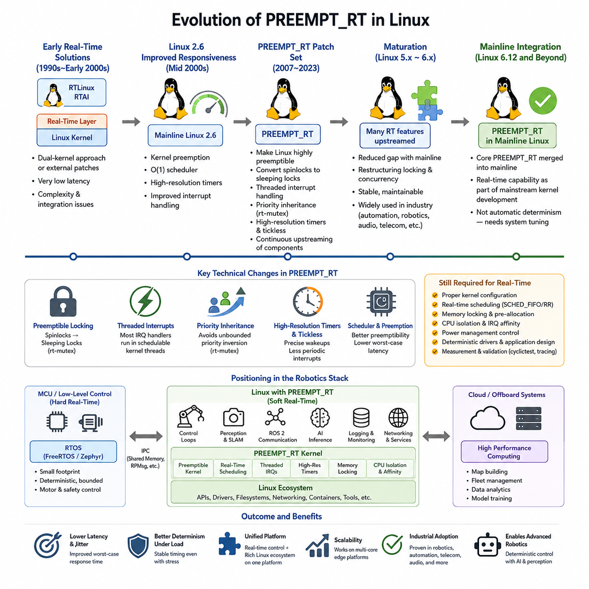
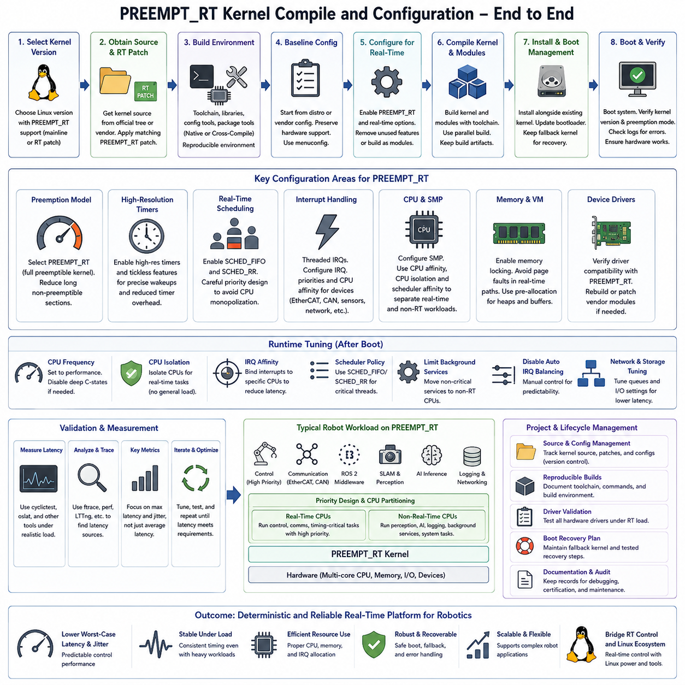
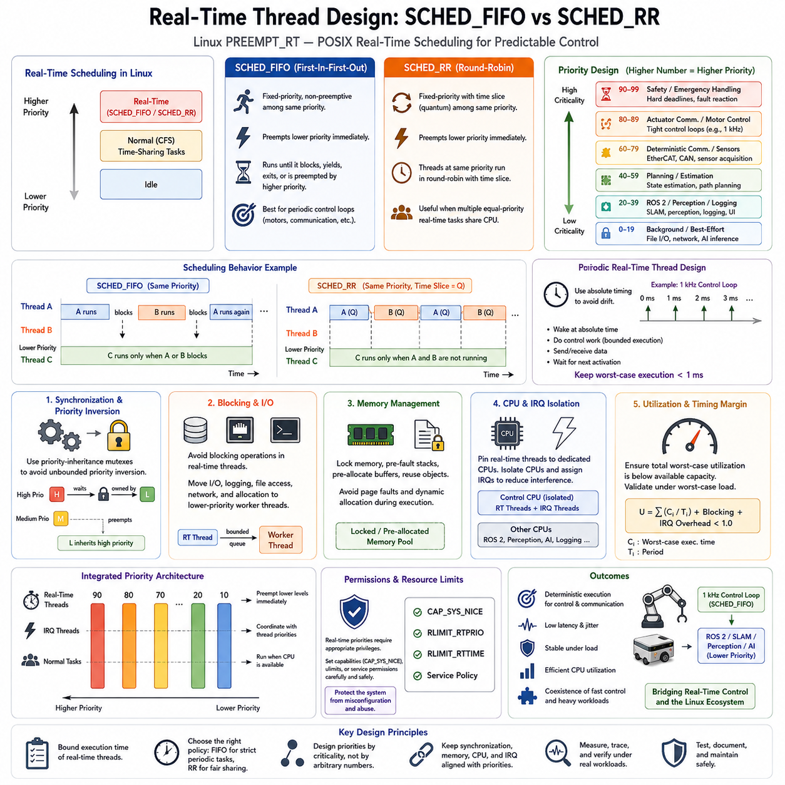
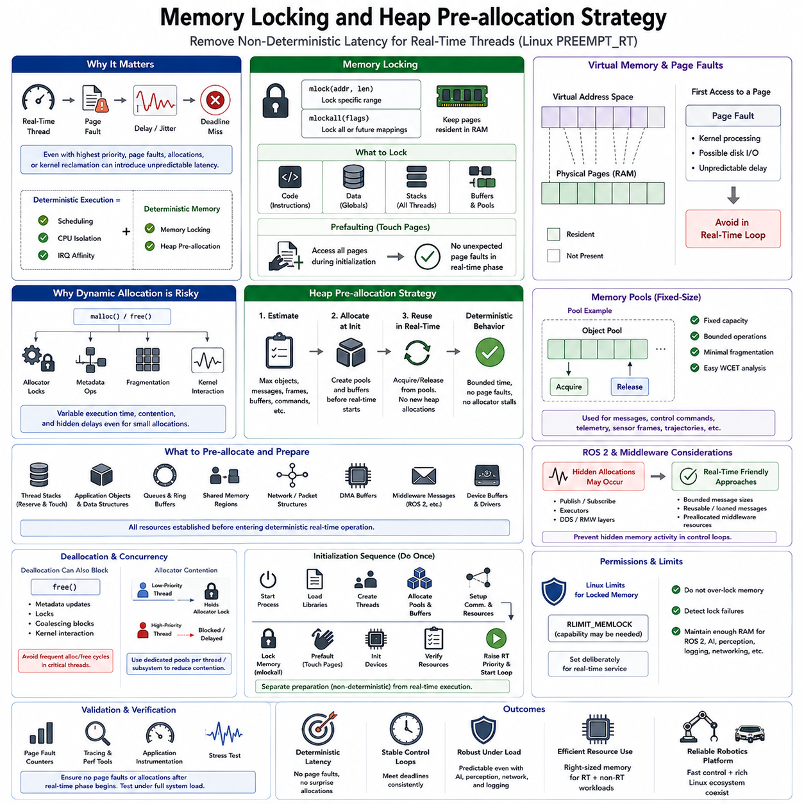
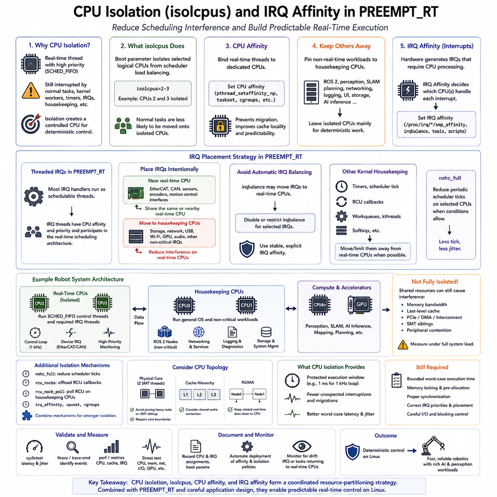
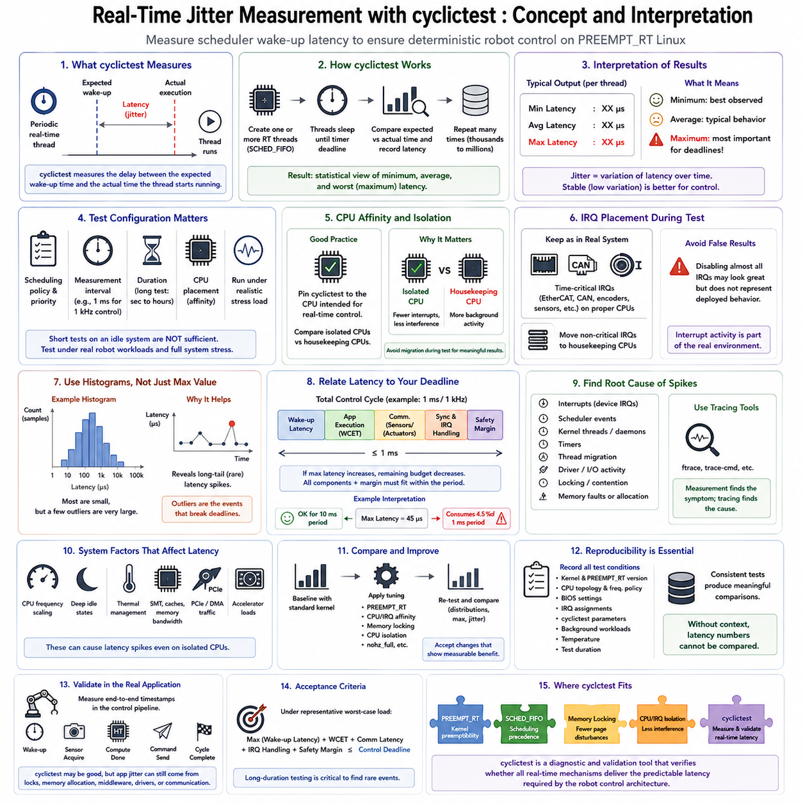
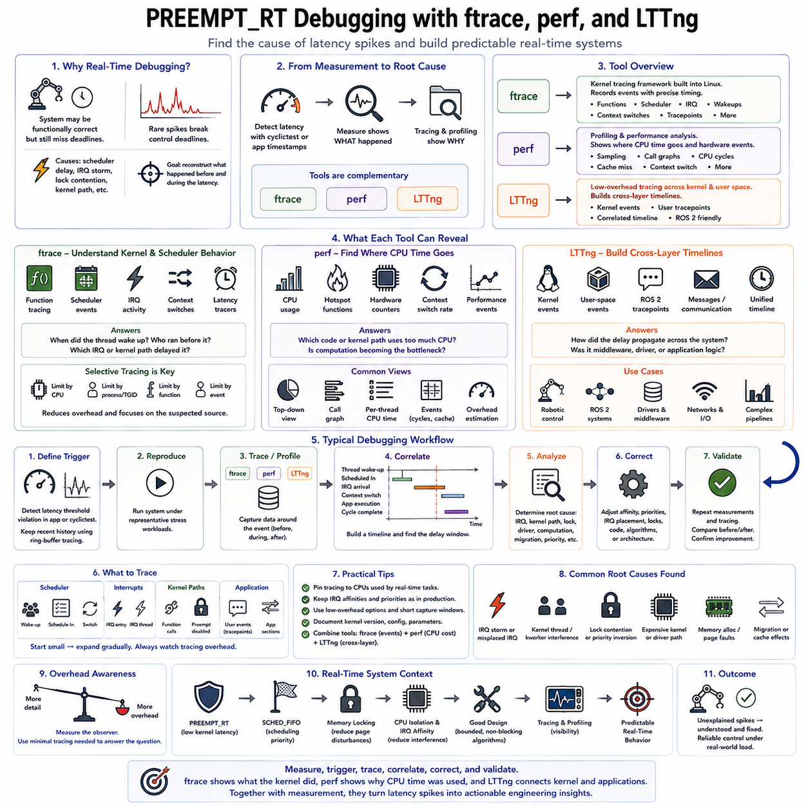
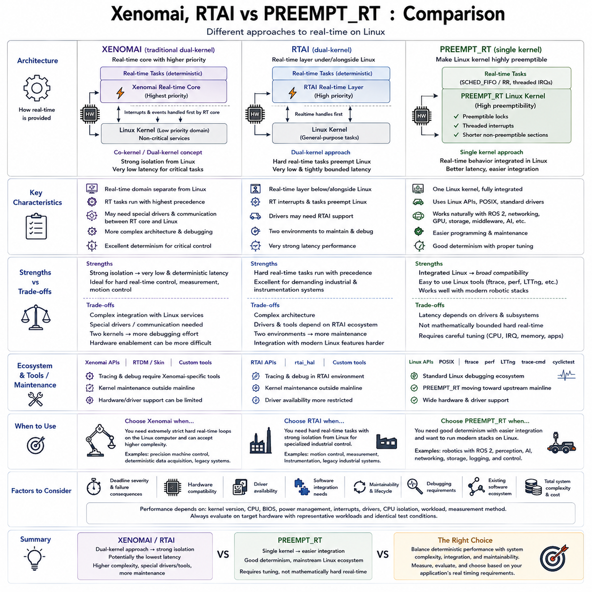
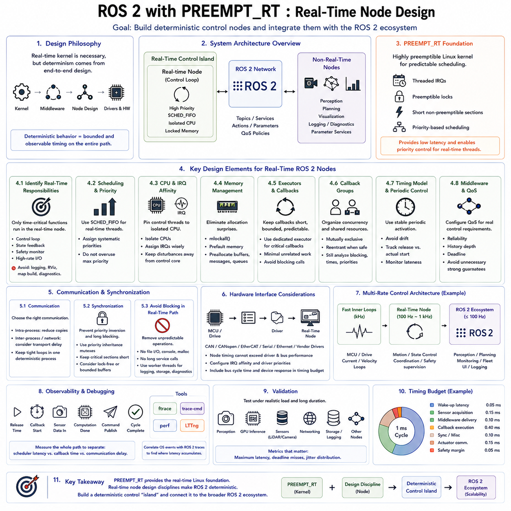
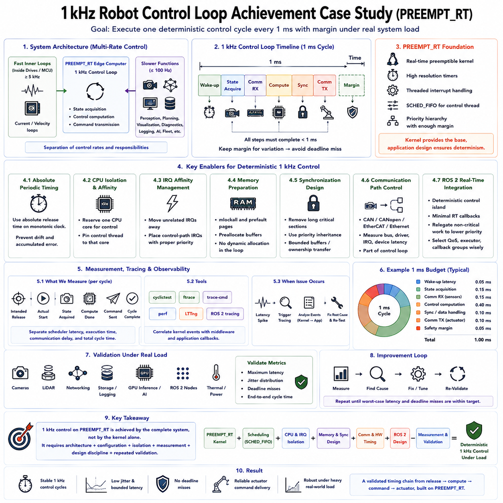

**Volume 03 Real Time Operating Systems**


# 04. RT Linux / PREEMPT RT

##  

## 04.01 Linux RT Patch History: PREEMPT RT Evolution

{width="7.268055555555556in" height="7.268055555555556in"}

The PREEMPT_RT project emerged from the long-standing effort to make general-purpose Linux suitable for applications that require bounded and predictable response times. Traditional Linux was designed primarily for throughput, fairness, and broad hardware support rather than strict timing guarantees. Early real-time users therefore relied on external patches, dual-kernel approaches, or specialized operating systems when deterministic behavior was required.

During the 1990s and early 2000s, several projects attempted to overcome Linux latency limitations. RTLinux and RTAI introduced a small real-time execution layer beneath the normal Linux kernel, allowing critical tasks to run independently of Linux scheduling. These approaches achieved very low latency, but they created a conceptual separation between the real-time environment and ordinary Linux applications, increasing development and integration complexity.

The Linux 2.6 kernel represented an important transition toward improved native responsiveness. Kernel preemption, the O(1) scheduler, high-resolution timers, improved interrupt handling, and other infrastructure gradually reduced scheduling latency. The PREEMPT_RT effort extended this direction by attempting to transform Linux itself into a highly preemptible operating system rather than placing a separate real-time kernel underneath it.

A fundamental objective of PREEMPT_RT was to remove long sections of kernel execution during which high-priority tasks could not run. Many traditional spinlocks were therefore converted into sleeping locks based on real-time mutex mechanisms. This transformation allowed higher-priority threads to preempt kernel activities that would previously have blocked execution, substantially improving worst-case scheduling latency under system load.

Threaded interrupt handling became another central element of the PREEMPT_RT architecture. Conventional Linux executes much interrupt processing in interrupt context, where normal task scheduling cannot occur. PREEMPT_RT moves most interrupt handlers into schedulable kernel threads. Administrators can consequently assign priorities and CPU affinities to interrupt processing and coordinate device activity with application-level real-time threads.

Priority inheritance became increasingly important as more kernel synchronization mechanisms became preemptible. Without it, a low-priority task holding a required lock could indirectly block a high-priority task while medium-priority work continued executing. Real-time mutexes introduced priority inheritance behavior that temporarily raises the effective priority of the lock owner, reducing unbounded priority inversion within critical kernel paths.

High-resolution timers and dynamic tick mechanisms also contributed to the evolution of real-time Linux. Earlier kernels were strongly influenced by periodic timer ticks, limiting timer precision and introducing unnecessary scheduling activity. High-resolution timers enabled much finer wake-up timing, while tickless operation reduced periodic interruptions. Together, these mechanisms improved the ability to execute periodic control tasks with lower timing variation.

For many years PREEMPT_RT remained a maintained patch set rather than a completely integrated Linux configuration. Developers continuously moved individual mechanisms upstream, including mutex infrastructure, high-resolution timing, interrupt threading support, locking changes, and scheduler improvements. This incremental strategy reduced the difference between the standard kernel and the real-time patch while allowing each subsystem change to undergo broader Linux community review.

The gradual upstreaming process was technically difficult because kernel synchronization assumptions existed throughout device drivers, networking, memory management, filesystems, and architecture-specific code. A change that improved preemptibility could expose race conditions or invalid locking behavior that had remained hidden in conventional kernels. Consequently, PREEMPT_RT evolution involved not only scheduler optimization but extensive restructuring of Linux concurrency mechanisms.

By the Linux 5.x and 6.x generations, the gap between mainline Linux and PREEMPT_RT had become substantially smaller. Many technologies originally required by the real-time patch had already entered the upstream kernel, and remaining changes increasingly concentrated on specialized locking and execution paths. This maturation made real-time Linux easier to maintain and increasingly practical for industrial automation, robotics, audio, telecommunications, and embedded control.

A major historical milestone arrived when the remaining core PREEMPT_RT functionality was accepted into mainline Linux for the Linux 6.12 development cycle. This represented the culmination of more than two decades of engineering and upstream integration. Real-time capability was no longer best understood as an externally maintained transformation of Linux, but as functionality incorporated into the mainstream kernel development process.

Mainline integration does not mean that every Linux installation automatically behaves as a deterministic real-time system. Appropriate kernel configuration, real-time scheduling policies, memory locking, CPU isolation, interrupt affinity, power-management control, driver selection, and application architecture remain essential. PREEMPT_RT improves the kernel\'s preemption characteristics, but complete system determinism depends on the behavior of the entire hardware and software stack.

For robotics, this evolution is particularly important because modern robots combine workloads with very different computational characteristics. Control loops may require sub-millisecond or millisecond-level timing, while perception, SLAM, ROS 2 communication, logging, networking, and AI inference benefit from the rich Linux ecosystem. PREEMPT_RT allows many of these workloads to coexist on a common Linux platform while providing stronger scheduling control for time-critical threads.

The resulting architecture occupies an important position between small MCU-oriented RTOS platforms and conventional general-purpose Linux. FreeRTOS or Zephyr may remain preferable for tightly bounded low-level motor and safety control, whereas PREEMPT_RT provides Linux APIs, networking, filesystems, device support, containers, ROS 2, and accelerator integration together with significantly improved real-time behavior. This makes it especially attractive for robot edge computers.

In a practical robot architecture, PREEMPT_RT should therefore be viewed as an enabling foundation rather than a complete real-time solution. Developers must characterize worst-case latency with tools such as cyclictest, analyze scheduling and interrupt behavior, eliminate page faults from critical paths, control CPU contention, and validate timing under realistic stress. These engineering practices convert kernel-level preemptibility into measurable application-level determinism.

The historical progression from external real-time layers, through the PREEMPT_RT patch series, to extensive upstream integration illustrates a broader change in Linux engineering. Real-time capability gradually evolved from a specialized modification into a mainstream kernel concern. This evolution enables modern robotic systems to combine deterministic control requirements with the scalability and software ecosystem of Linux on increasingly powerful multicore edge platforms.

PREEMPT_RT 프로젝트는 범용 리눅스(Linux)를 제한되고 예측 가능한 응답 시간이 요구되는 응용 분야에 적합하게 만들기 위한 오랜 노력에서 시작되었다. 전통적인 리눅스는 엄격한 타이밍 보장(Strict Timing Guarantee)보다는 처리량(Throughput), 공정성(Fairness), 광범위한 하드웨어 지원을 중심으로 설계되었다. 따라서 초기 실시간 사용자는 결정론적 동작(Deterministic Behavior)이 필요한 경우 외부 패치(External Patch), 듀얼 커널(Dual-Kernel) 방식 또는 특수 운영체제(Specialized Operating System)에 의존해야 했다.

1990년대부터 2000년대 초반까지 여러 프로젝트가 리눅스의 지연시간(Latency) 한계를 극복하려고 시도하였다. RTLinux와 RTAI는 일반 리눅스 커널 아래에 작은 실시간 실행 계층(Real-Time Execution Layer)을 배치하여 중요한 작업이 리눅스 스케줄링(Linux Scheduling)과 독립적으로 실행될 수 있도록 하였다. 이러한 방식은 매우 낮은 지연시간을 달성했지만, 실시간 환경과 일반 리눅스 응용 프로그램이 개념적으로 분리되면서 개발 및 통합 복잡성이 증가하였다.

Linux 2.6 커널은 향상된 네이티브 응답성(Native Responsiveness)을 향한 중요한 전환점이었다. 커널 선점(Kernel Preemption), O(1) 스케줄러(O(1) Scheduler), 고해상도 타이머(High-Resolution Timer), 개선된 인터럽트 처리(Interrupt Handling) 등의 기반 기술이 스케줄링 지연시간(Scheduling Latency)을 점진적으로 감소시켰다. PREEMPT_RT는 별도의 실시간 커널을 리눅스 아래에 배치하는 대신 리눅스 자체를 고도로 선점 가능한 운영체제로 변화시키는 방향으로 이러한 발전을 확장하였다.

PREEMPT_RT의 핵심 목표는 높은 우선순위 작업(High-Priority Task)이 실행될 수 없는 긴 커널 실행 구간을 제거하는 것이었다. 이에 따라 많은 기존 스핀락(Spinlock)이 실시간 뮤텍스(Real-Time Mutex) 메커니즘에 기반한 슬리핑 락(Sleeping Lock)으로 변환되었다. 이러한 변화는 높은 우선순위 스레드가 이전에는 실행을 차단했던 커널 작업을 선점할 수 있도록 하여 시스템 부하 상황에서 최악 조건 스케줄링 지연시간(Worst-Case Scheduling Latency)을 크게 개선하였다.

스레드형 인터럽트 처리(Threaded Interrupt Handling)는 PREEMPT_RT 아키텍처의 또 다른 핵심 요소가 되었다. 기존 리눅스는 상당한 인터럽트 처리를 인터럽트 컨텍스트(Interrupt Context)에서 수행하기 때문에 일반적인 태스크 스케줄링이 제한된다. PREEMPT_RT는 대부분의 인터럽트 핸들러(Interrupt Handler)를 스케줄링 가능한 커널 스레드(Kernel Thread)로 이동시킨다. 이에 따라 관리자는 인터럽트 처리에 우선순위와 CPU 어피니티(CPU Affinity)를 지정하고 장치 동작을 응용 수준의 실시간 스레드와 조정할 수 있다.

더 많은 커널 동기화 메커니즘(Kernel Synchronization Mechanism)이 선점 가능해지면서 우선순위 상속(Priority Inheritance)의 중요성도 증가하였다. 이것이 없으면 필요한 락(Lock)을 보유한 낮은 우선순위 작업 때문에 높은 우선순위 작업이 간접적으로 차단되는 동안 중간 우선순위 작업이 계속 실행될 수 있다. 실시간 뮤텍스(Real-Time Mutex)는 락 소유자의 유효 우선순위를 일시적으로 높이는 우선순위 상속 동작을 도입하여 중요한 커널 경로에서 발생하는 무제한 우선순위 역전(Unbounded Priority Inversion)을 감소시켰다.

고해상도 타이머(High-Resolution Timer)와 동적 틱(Dynamic Tick) 메커니즘 역시 실시간 리눅스(Real-Time Linux)의 발전에 기여하였다. 초기 커널은 주기적인 타이머 틱(Periodic Timer Tick)의 영향을 크게 받아 타이머 정밀도가 제한되고 불필요한 스케줄링 작업이 발생하였다. 고해상도 타이머는 훨씬 정밀한 웨이크업 타이밍(Wake-Up Timing)을 가능하게 했으며, 틱리스 동작(Tickless Operation)은 주기적인 인터럽트를 감소시켰다. 이 두 기술은 낮은 타이밍 변동(Timing Variation)으로 주기적 제어 작업을 실행하는 능력을 향상시켰다.

오랜 기간 PREEMPT_RT는 완전히 통합된 리눅스 설정이라기보다 별도로 유지되는 패치 세트(Patch Set)의 형태로 존재하였다. 개발자들은 뮤텍스 인프라(Mutex Infrastructure), 고해상도 타이밍(High-Resolution Timing), 인터럽트 스레딩(Interrupt Threading), 락 구조 변경, 스케줄러 개선 등의 개별 메커니즘을 지속적으로 업스트림(Upstream)에 통합하였다. 이러한 점진적인 전략은 표준 커널과 실시간 패치 사이의 차이를 줄이는 동시에 각 서브시스템 변경 사항이 더 광범위한 리눅스 커뮤니티의 검토를 받을 수 있도록 하였다.

점진적인 업스트리밍(Upstreaming) 과정은 기술적으로 매우 어려웠는데, 커널 동기화에 대한 기존 가정이 장치 드라이버(Device Driver), 네트워킹(Networking), 메모리 관리(Memory Management), 파일시스템(Filesystem), 아키텍처별 코드(Architecture-Specific Code) 전반에 존재했기 때문이다. 선점 가능성을 향상시키는 변경은 기존 커널에서 드러나지 않았던 경쟁 상태(Race Condition)나 잘못된 락 동작을 노출할 수 있었다. 따라서 PREEMPT_RT의 발전은 단순한 스케줄러 최적화를 넘어 리눅스 동시성 메커니즘(Concurrency Mechanism)의 광범위한 재구성을 포함하였다.

Linux 5.x와 6.x 세대에 이르면서 메인라인 리눅스(Mainline Linux)와 PREEMPT_RT 사이의 차이는 상당히 감소하였다. 실시간 패치에 필요했던 많은 기술이 이미 업스트림 커널에 통합되었으며, 남아 있는 변경 사항은 점차 특수한 락 및 실행 경로에 집중되었다. 이러한 성숙 과정은 실시간 리눅스를 더욱 쉽게 유지할 수 있도록 하였으며 산업 자동화(Industrial Automation), 로보틱스(Robotics), 오디오(Audio), 통신(Telecommunications), 임베디드 제어(Embedded Control) 분야에서 더욱 실용적인 플랫폼으로 발전시켰다.

남아 있던 핵심 PREEMPT_RT 기능이 Linux 6.12 개발 주기에 메인라인 리눅스에 수용되면서 중요한 역사적 이정표가 마련되었다. 이는 20년 이상 지속된 엔지니어링과 업스트림 통합 작업의 결실을 의미한다. 이제 실시간 기능(Real-Time Capability)은 외부에서 유지되는 리눅스 변형으로 이해하기보다 메인스트림 커널(Mainstream Kernel) 개발 과정에 통합된 기능으로 이해할 수 있게 되었다.

메인라인 통합(Mainline Integration)이 모든 리눅스 설치 환경에서 자동으로 결정론적 실시간 시스템(Deterministic Real-Time System)이 구현된다는 것을 의미하지는 않는다. 적절한 커널 설정(Kernel Configuration), 실시간 스케줄링 정책(Real-Time Scheduling Policy), 메모리 잠금(Memory Locking), CPU 격리(CPU Isolation), 인터럽트 어피니티(Interrupt Affinity), 전력 관리 제어(Power Management Control), 드라이버 선택 및 응용 프로그램 아키텍처가 여전히 중요하다. PREEMPT_RT는 커널의 선점 특성을 향상시키지만 전체 시스템의 결정론은 하드웨어와 소프트웨어 스택 전체의 동작에 의해 결정된다.

로보틱스(Robotics)에서는 이러한 발전이 특히 중요하다. 현대 로봇은 서로 매우 다른 계산 특성을 가진 워크로드(Workload)를 결합하기 때문이다. 제어 루프(Control Loop)는 서브밀리초(Sub-Millisecond) 또는 밀리초 수준의 타이밍을 요구할 수 있는 반면, 인지(Perception), SLAM, ROS 2 통신, 로깅(Logging), 네트워킹(Networking), AI 추론(AI Inference)은 풍부한 리눅스 생태계의 장점을 활용한다. PREEMPT_RT는 이러한 워크로드를 공통 리눅스 플랫폼에서 함께 실행하면서 시간 임계 스레드(Time-Critical Thread)에 보다 강력한 스케줄링 제어를 제공한다.

그 결과 PREEMPT_RT 아키텍처는 소형 MCU 중심 RTOS 플랫폼과 기존 범용 리눅스 사이에서 중요한 위치를 차지한다. 엄격하게 제한된 저수준 모터 및 안전 제어에는 FreeRTOS 또는 Zephyr가 더 적합할 수 있지만, PREEMPT_RT는 향상된 실시간 동작과 함께 리눅스 API, 네트워킹, 파일시스템, 장치 지원, 컨테이너(Container), ROS 2 및 가속기(Accelerator) 통합을 제공한다. 이러한 특성은 특히 로봇 엣지 컴퓨터(Robot Edge Computer)에 적합하다.

실제 로봇 아키텍처에서 PREEMPT_RT는 완전한 실시간 솔루션이라기보다 이를 가능하게 하는 기반 기술(Enabling Foundation)로 이해해야 한다. 개발자는 cyclictest와 같은 도구를 사용하여 최악 조건 지연시간(Worst-Case Latency)을 측정하고, 스케줄링 및 인터럽트 동작을 분석하며, 중요 실행 경로에서 페이지 폴트(Page Fault)를 제거하고, CPU 경합(CPU Contention)을 제어하며, 실제 부하 조건에서 타이밍을 검증해야 한다. 이러한 엔지니어링 과정은 커널 수준의 선점 가능성을 측정 가능한 응용 수준 결정론(Application-Level Determinism)으로 전환한다.

외부 실시간 계층(External Real-Time Layer)에서 PREEMPT_RT 패치 시리즈를 거쳐 광범위한 업스트림 통합으로 이어진 역사적 발전 과정은 리눅스 엔지니어링의 보다 큰 변화를 보여준다. 실시간 기능은 점차 특수한 커널 수정에서 메인스트림 커널의 핵심 관심 영역으로 발전하였다. 이러한 진화는 현대 로봇 시스템이 결정론적 제어 요구사항과 리눅스의 확장성 및 소프트웨어 생태계를 결합하여 점점 강력해지는 멀티코어 엣지 플랫폼(Multicore Edge Platform)에서 실행될 수 있도록 한다.

##  

## 04.02 PREEMPT RT Kernel Compile and Configuration [w/Code]

{width="7.268055555555556in" height="7.268055555555556in"}

Compiling a PREEMPT_RT kernel begins with selecting a Linux kernel version that provides the required real-time capabilities and matches the target platform. Modern kernels increasingly integrate PREEMPT_RT functionality directly into mainline Linux, while older versions may require a corresponding RT patch set. Version compatibility among the kernel source, RT patch, architecture, compiler, and device drivers must be verified before configuration begins.

The kernel source is normally obtained from the official Linux kernel tree or from a distribution or hardware vendor that maintains an appropriate real-time branch. When an external PREEMPT_RT patch is required, its version should closely match the selected kernel release. Applying mismatched patches can produce rejected hunks, compilation failures, or subtle runtime problems because synchronization and interrupt-handling code changes significantly between kernel versions.

A practical build environment requires the compiler toolchain, development libraries, configuration utilities, and packaging tools appropriate for the target architecture. Native compilation is straightforward when the build host and robot computer use the same processor architecture, while cross-compilation is commonly used for ARM-based embedded platforms. The build environment should remain reproducible so that deployed kernels can later be rebuilt, audited, and validated.

Kernel configuration usually starts from an existing distribution or vendor configuration rather than from an empty configuration. This preserves essential platform support for storage controllers, networking devices, GPU interfaces, USB devices, CAN interfaces, and other robot hardware. The configuration can then be modified using tools such as menuconfig, allowing real-time functionality to be enabled while unnecessary components are removed or converted into modules when appropriate.

The central configuration decision is the kernel preemption model. A PREEMPT_RT-enabled build selects the real-time preemption option so that kernel execution becomes highly preemptible. This affects locking behavior, interrupt execution, and scheduling responsiveness throughout the system. The objective is not simply to make the average execution time faster, but to reduce long non-preemptible intervals that produce unpredictable worst-case latency.

High-resolution timer support is another important configuration element because periodic robot control tasks often require wake-up intervals much finer than traditional kernel timer ticks. High-resolution timers provide precise timing events for real-time threads and complement PREEMPT_RT scheduling behavior. Tickless kernel features can further reduce unnecessary periodic timer activity, particularly on CPUs reserved for deterministic control workloads.

Real-time scheduling support must also be available for applications using policies such as SCHED_FIFO and SCHED_RR. PREEMPT_RT improves kernel responsiveness, while these scheduling classes determine how high-priority application threads compete for CPU execution. Priority assignment must therefore be designed carefully because an incorrectly configured high-priority thread can monopolize a processor and prevent important system services or lower-priority tasks from running.

Interrupt configuration has a major influence on the effectiveness of the compiled real-time kernel. PREEMPT_RT converts most interrupt handling into schedulable threaded interrupt contexts, making IRQ priorities and processor placement manageable. Robot systems can use this capability to place motor communication, EtherCAT, CAN, sensor acquisition, or timing-related interrupts on selected CPUs while separating them from computationally intensive perception and AI workloads.

CPU architecture and symmetric multiprocessing options must be configured consistently with the target robot computer. Multicore systems provide opportunities to separate real-time control from general workloads, but kernel configuration alone does not establish this separation. Runtime mechanisms such as CPU affinity, IRQ affinity, CPU isolation, and scheduler affinity are normally combined with the compiled kernel to create dedicated execution resources for critical control threads.

Memory-related configuration also influences deterministic operation. Virtual memory is a fundamental Linux capability, but page faults and unpredictable allocation paths can introduce latency into critical loops. The kernel must support memory-locking mechanisms that allow real-time applications to keep important pages resident in physical memory. Applications can then combine memory locking with heap pre-allocation and controlled memory access to reduce timing disturbances after initialization.

Device-driver compatibility must be evaluated carefully because a real-time kernel cannot provide deterministic behavior when a driver contains long non-preemptible sections or generates excessive interrupt activity. Drivers for network interfaces, CAN adapters, storage devices, GPU systems, and specialized robot hardware should be tested under PREEMPT_RT. Vendor-specific kernel modules may require rebuilding whenever the kernel version or configuration changes.

After configuration, the kernel and required modules are compiled using the selected toolchain. Parallel compilation can significantly reduce build time on multicore development systems, but build success alone does not demonstrate real-time suitability. The generated kernel image, modules, configuration file, and related metadata should be retained together so that the exact software configuration deployed on a robot can be reproduced during debugging or certification activities.

Installation normally places the new kernel, modules, and boot-related files alongside the existing kernel rather than immediately replacing the known working configuration. Maintaining a fallback kernel is important because an incorrect configuration can prevent storage, networking, graphics, or other essential hardware from operating. The bootloader should therefore provide a method for selecting either the PREEMPT_RT kernel or a previously validated standard kernel.

After rebooting, the running kernel version and preemption mode should be verified before real-time testing begins. Kernel logs should also be inspected for driver failures, interrupt problems, firmware errors, or unexpected warnings. At this stage, the objective is first to confirm functional stability. Real-time tuning should only proceed after the system reliably boots and all hardware required by the robot operates correctly.

Runtime tuning transforms the compiled PREEMPT_RT kernel into a practical real-time platform. CPU frequency scaling, deep power-saving states, automatic IRQ balancing, background services, and uncontrolled kernel activity can increase latency variation. Depending on system requirements, selected CPUs may be isolated, interrupts explicitly assigned, performance-oriented CPU policies applied, and unnecessary services restricted to non-real-time processor cores.

Real-time performance must finally be measured under realistic system load rather than inferred from configuration settings. Tools such as cyclictest can characterize scheduling latency while CPU, memory, storage, networking, and application workloads stress the system. Tracing tools can then identify latency sources when unexpected peaks occur. Maximum observed latency and jitter are generally more significant than average latency for deterministic control applications.

For robotics, the resulting kernel configuration should reflect the actual workload architecture. A PREEMPT_RT edge computer may execute high-priority control and communication threads together with ROS 2, SLAM, perception, networking, logging, and AI inference. CPU partitioning and priority design can protect control execution while allowing computationally intensive workloads to use remaining resources, creating a practical bridge between real-time control and general Linux computing.

Kernel compilation and configuration should therefore be treated as part of a complete real-time engineering process rather than as a one-time software installation task. Source and configuration management, reproducible builds, driver validation, boot recovery, scheduling design, CPU and IRQ tuning, memory preparation, and latency measurement must operate together. Only after these elements are validated can PREEMPT_RT provide the predictable execution behavior required by demanding robotic control systems.

PREEMPT_RT 커널 컴파일(Compilation)은 필요한 실시간 기능(Real-Time Capability)을 제공하면서 대상 플랫폼(Target Platform)에 적합한 리눅스 커널(Linux Kernel) 버전을 선택하는 것에서 시작한다. 최신 커널은 PREEMPT_RT 기능을 점차 메인라인 리눅스(Mainline Linux)에 직접 통합하고 있지만, 이전 버전에서는 해당 버전에 대응하는 RT 패치 세트(RT Patch Set)가 필요할 수 있다. 설정을 시작하기 전에 커널 소스, RT 패치, 프로세서 아키텍처, 컴파일러 및 장치 드라이버(Device Driver) 사이의 버전 호환성을 확인해야 한다.

커널 소스(Kernel Source)는 일반적으로 공식 리눅스 커널 트리(Linux Kernel Tree) 또는 적절한 실시간 브랜치(Real-Time Branch)를 유지하는 배포판이나 하드웨어 공급업체로부터 확보한다. 외부 PREEMPT_RT 패치가 필요한 경우에는 선택한 커널 릴리스와 최대한 정확하게 일치하는 버전을 사용해야 한다. 일치하지 않는 패치를 적용하면 동기화 및 인터럽트 처리 코드가 커널 버전마다 크게 달라지기 때문에 패치 적용 실패, 컴파일 오류 또는 발견하기 어려운 런타임 문제(Runtime Problem)가 발생할 수 있다.

실제 빌드 환경(Build Environment)에는 대상 아키텍처에 적합한 컴파일러 툴체인(Compiler Toolchain), 개발 라이브러리, 설정 유틸리티 및 패키징 도구가 필요하다. 빌드 호스트와 로봇 컴퓨터가 동일한 프로세서 아키텍처를 사용하는 경우 네이티브 컴파일(Native Compilation)이 간단하지만, ARM 기반 임베디드 플랫폼에서는 크로스 컴파일(Cross-Compilation)이 일반적으로 사용된다. 배포된 커널을 이후에 다시 빌드하고 감사하며 검증할 수 있도록 빌드 환경은 재현 가능(Reproducible)하게 유지해야 한다.

커널 설정(Kernel Configuration)은 일반적으로 완전히 비어 있는 설정에서 시작하기보다 기존 배포판 또는 하드웨어 공급업체의 설정을 기반으로 시작한다. 이를 통해 스토리지 컨트롤러, 네트워크 장치, GPU 인터페이스, USB 장치, CAN 인터페이스 및 기타 로봇 하드웨어에 필요한 플랫폼 지원을 유지할 수 있다. 이후 menuconfig와 같은 도구를 사용하여 설정을 수정하고 실시간 기능을 활성화하면서 불필요한 구성요소는 제거하거나 필요에 따라 커널 모듈(Kernel Module)로 변경할 수 있다.

가장 핵심적인 설정 결정은 커널 선점 모델(Kernel Preemption Model)이다. PREEMPT_RT가 활성화된 빌드에서는 실시간 선점(Real-Time Preemption) 옵션을 선택하여 커널 실행을 높은 수준으로 선점 가능하게 만든다. 이는 시스템 전체의 락 동작(Locking Behavior), 인터럽트 실행 및 스케줄링 응답성에 영향을 미친다. 목표는 단순히 평균 실행시간을 단축하는 것이 아니라 예측하기 어려운 최악 조건 지연시간(Worst-Case Latency)을 발생시키는 긴 비선점 구간(Non-Preemptible Interval)을 줄이는 것이다.

고해상도 타이머(High-Resolution Timer) 지원 역시 중요한 설정 요소이다. 주기적인 로봇 제어 작업은 기존 커널 타이머 틱(Kernel Timer Tick)보다 훨씬 정밀한 웨이크업 간격(Wake-Up Interval)을 요구하는 경우가 많기 때문이다. 고해상도 타이머는 실시간 스레드에 정밀한 타이밍 이벤트를 제공하며 PREEMPT_RT 스케줄링 동작을 보완한다. 틱리스 커널(Tickless Kernel) 기능은 특히 결정론적 제어 워크로드에 할당된 CPU에서 불필요한 주기적 타이머 동작을 추가로 감소시킬 수 있다.

SCHED_FIFO 및 SCHED_RR과 같은 정책을 사용하는 응용 프로그램을 위해 실시간 스케줄링(Real-Time Scheduling) 지원도 제공되어야 한다. PREEMPT_RT는 커널의 응답성을 개선하지만, 이러한 스케줄링 클래스(Scheduling Class)는 높은 우선순위 응용 스레드가 CPU 실행 자원을 어떻게 경쟁하는지를 결정한다. 따라서 우선순위를 잘못 설정한 높은 우선순위 스레드가 프로세서를 독점하여 중요한 시스템 서비스나 낮은 우선순위 작업의 실행을 방해하지 않도록 우선순위 설계가 신중하게 이루어져야 한다.

인터럽트 설정(Interrupt Configuration)은 컴파일된 실시간 커널의 효과에 큰 영향을 미친다. PREEMPT_RT는 대부분의 인터럽트 처리를 스케줄링 가능한 스레드형 인터럽트 컨텍스트(Threaded Interrupt Context)로 변환하여 IRQ 우선순위와 프로세서 배치를 관리할 수 있게 한다. 로봇 시스템에서는 이 기능을 활용하여 모터 통신, EtherCAT, CAN, 센서 데이터 수집 또는 타이밍 관련 인터럽트를 특정 CPU에 배치하고 계산량이 많은 인지(Perception) 및 AI 워크로드와 분리할 수 있다.

CPU 아키텍처 및 대칭형 멀티프로세싱(Symmetric Multiprocessing, SMP) 옵션은 대상 로봇 컴퓨터와 일관되게 설정되어야 한다. 멀티코어 시스템(Multicore System)은 실시간 제어를 일반 워크로드와 분리할 수 있는 기회를 제공하지만 커널 설정만으로 이러한 분리가 이루어지는 것은 아니다. CPU 어피니티(CPU Affinity), IRQ 어피니티(IRQ Affinity), CPU 격리(CPU Isolation), 스케줄러 어피니티(Scheduler Affinity)와 같은 런타임 메커니즘을 컴파일된 커널과 함께 사용하여 중요한 제어 스레드에 전용 실행 자원을 제공한다.

메모리 관련 설정도 결정론적 동작(Deterministic Operation)에 영향을 미친다. 가상 메모리(Virtual Memory)는 리눅스의 기본 기능이지만 페이지 폴트(Page Fault)와 예측하기 어려운 메모리 할당 경로는 중요한 제어 루프에 지연시간을 발생시킬 수 있다. 커널은 실시간 응용 프로그램이 중요한 페이지를 물리 메모리에 유지할 수 있도록 메모리 잠금(Memory Locking) 메커니즘을 지원해야 한다. 응용 프로그램은 이를 힙 사전 할당(Heap Pre-Allocation) 및 제어된 메모리 접근과 결합하여 초기화 이후의 타이밍 변동을 줄일 수 있다.

장치 드라이버 호환성(Device Driver Compatibility)은 신중하게 평가해야 한다. 장시간의 비선점 구간을 포함하거나 과도한 인터럽트 활동을 발생시키는 드라이버가 존재한다면 실시간 커널만으로 결정론적 동작을 제공할 수 없기 때문이다. 네트워크 인터페이스, CAN 어댑터, 스토리지 장치, GPU 시스템 및 특수 로봇 하드웨어를 위한 드라이버는 PREEMPT_RT 환경에서 시험해야 한다. 커널 버전이나 설정이 변경되면 공급업체 전용 커널 모듈(Vendor-Specific Kernel Module)을 다시 빌드해야 할 수도 있다.

설정이 완료되면 선택한 툴체인(Toolchain)을 사용하여 커널과 필요한 모듈을 컴파일한다. 멀티코어 개발 시스템에서는 병렬 컴파일(Parallel Compilation)을 통해 빌드 시간을 크게 줄일 수 있지만 빌드 성공 자체가 실시간 적합성(Real-Time Suitability)을 의미하지는 않는다. 생성된 커널 이미지, 모듈, 설정 파일 및 관련 메타데이터를 함께 보관하여 로봇에 배포된 정확한 소프트웨어 구성을 디버깅이나 인증 과정에서 재현할 수 있도록 해야 한다.

설치 과정에서는 일반적으로 새로운 커널, 모듈 및 부팅 관련 파일을 기존의 정상 동작 커널을 즉시 교체하지 않고 함께 설치한다. 잘못된 설정으로 인해 스토리지, 네트워크, 그래픽 또는 기타 필수 하드웨어가 작동하지 않을 수 있으므로 대체 커널(Fallback Kernel)을 유지하는 것이 중요하다. 따라서 부트로더(Bootloader)는 PREEMPT_RT 커널 또는 이전에 검증된 표준 커널 중 하나를 선택하여 부팅할 수 있는 방법을 제공해야 한다.

재부팅 후에는 실시간 시험을 시작하기 전에 현재 실행 중인 커널 버전과 선점 모드(Preemption Mode)를 확인해야 한다. 또한 커널 로그(Kernel Log)를 검사하여 드라이버 오류, 인터럽트 문제, 펌웨어 오류 또는 예상하지 못한 경고가 존재하는지 확인해야 한다. 이 단계에서는 우선 기능적 안정성(Functional Stability)을 확인하는 것이 목적이다. 시스템이 안정적으로 부팅되고 로봇에 필요한 모든 하드웨어가 정상적으로 동작하는 것이 확인된 이후에 실시간 튜닝(Real-Time Tuning)을 진행해야 한다.

런타임 튜닝(Runtime Tuning)은 컴파일된 PREEMPT_RT 커널을 실제 실시간 플랫폼으로 전환하는 과정이다. CPU 주파수 스케일링(CPU Frequency Scaling), 깊은 절전 상태(Deep Power-Saving State), 자동 IRQ 밸런싱(Automatic IRQ Balancing), 백그라운드 서비스 및 통제되지 않은 커널 활동은 지연시간 변동을 증가시킬 수 있다. 시스템 요구사항에 따라 특정 CPU를 격리하고 인터럽트를 명시적으로 할당하며 성능 중심 CPU 정책을 적용하고 불필요한 서비스를 비실시간 프로세서 코어로 제한할 수 있다.

실시간 성능(Real-Time Performance)은 설정값만으로 판단해서는 안 되며 실제 시스템 부하에서 측정해야 한다. cyclictest와 같은 도구를 사용하면 CPU, 메모리, 스토리지, 네트워크 및 응용 워크로드가 시스템에 부하를 가하는 동안 스케줄링 지연시간을 측정할 수 있다. 예상하지 못한 지연시간 피크가 발생하면 추적 도구(Tracing Tool)를 사용하여 원인을 분석할 수 있다. 결정론적 제어 응용에서는 일반적으로 평균 지연시간보다 최대 관측 지연시간(Maximum Observed Latency)과 지터(Jitter)가 더욱 중요하다.

로보틱스(Robotics)에서 최종 커널 설정은 실제 워크로드 아키텍처(Workload Architecture)를 반영해야 한다. PREEMPT_RT 엣지 컴퓨터(Edge Computer)는 높은 우선순위의 제어 및 통신 스레드와 함께 ROS 2, SLAM, 인지, 네트워킹, 로깅 및 AI 추론(AI Inference)을 실행할 수 있다. CPU 파티셔닝(CPU Partitioning)과 우선순위 설계를 통해 제어 작업의 실행을 보호하면서 계산 집약적인 워크로드가 나머지 자원을 활용하도록 구성하면 실시간 제어와 범용 리눅스 컴퓨팅을 연결하는 실용적인 플랫폼을 구축할 수 있다.

따라서 커널 컴파일 및 설정(Kernel Compilation and Configuration)은 일회성 소프트웨어 설치 작업이 아니라 완전한 실시간 엔지니어링 프로세스(Real-Time Engineering Process)의 일부로 다루어야 한다. 소스 및 설정 관리, 재현 가능한 빌드(Reproducible Build), 드라이버 검증, 부팅 복구, 스케줄링 설계, CPU 및 IRQ 튜닝, 메모리 준비, 지연시간 측정이 함께 수행되어야 한다. 이러한 요소가 모두 검증된 이후에야 PREEMPT_RT는 높은 수준의 로봇 제어 시스템에서 요구되는 예측 가능한 실행 동작(Predictable Execution Behavior)을 제공할 수 있다.

##  

## 04.03 Real-Time Thread Design: SCHED.FIFO / SCHED.RR [w/Code]

{width="7.268055555555556in" height="7.268055555555556in"}

Real-time thread design in Linux is based on assigning execution priorities and scheduling policies that allow timing-critical work to preempt less important activity. Under PREEMPT_RT, application threads can use POSIX real-time scheduling classes such as SCHED_FIFO and SCHED_RR. These policies operate above normal time-sharing tasks and are therefore fundamental mechanisms for implementing predictable robot control, communication, and acquisition loops.

SCHED_FIFO implements fixed-priority first-in-first-out scheduling. When a runnable SCHED_FIFO thread has a higher priority than the currently executing thread, it immediately becomes eligible to preempt that thread. Unlike conventional Linux scheduling, a running SCHED_FIFO thread does not receive a normal time slice. It can continue executing until it blocks, voluntarily yields the processor, terminates, or is preempted by a higher-priority real-time thread.

This behavior makes SCHED_FIFO particularly suitable for periodic control loops that must execute with minimum scheduling interference. A motor-control or EtherCAT communication thread can wake at a predefined period, perform bounded computation, transmit or receive data, and then block until its next activation. If execution time is carefully controlled, the thread receives highly predictable processor access while leaving sufficient CPU capacity for other system activities.

The absence of automatic time slicing also makes SCHED_FIFO potentially dangerous when incorrectly designed. A high-priority thread containing an infinite loop, excessive computation, blocking error, or missing sleep operation can monopolize a CPU. Lower-priority threads may then experience severe starvation. Real-time applications must therefore ensure that every high-priority execution path has bounded computation and predictable blocking or synchronization behavior.

SCHED_RR extends the fixed-priority real-time model with round-robin time slicing among runnable threads at the same priority. A SCHED_RR thread can still preempt lower-priority threads immediately, but when multiple threads share its priority, each receives CPU execution for a defined quantum before another equal-priority thread can run. This prevents one equal-priority thread from continuously occupying the processor.

The practical distinction between SCHED_FIFO and SCHED_RR therefore appears mainly when multiple runnable threads have identical priorities. SCHED_FIFO preserves execution until the running thread blocks, yields, or is preempted by a higher priority, whereas SCHED_RR periodically rotates execution among equal-priority threads. For tightly controlled periodic tasks, SCHED_FIFO is often preferred, while SCHED_RR can be useful when several equivalent real-time activities must share processor time.

Priority design is more important than simply selecting a scheduling policy. Linux real-time priorities form an ordered range in which higher numerical real-time priorities represent stronger scheduling precedence. Designers should map priorities to timing criticality rather than assigning high values indiscriminately. Emergency handling, hard control deadlines, deterministic communication, sensor acquisition, planning, logging, and background processing should receive priorities according to their actual timing constraints.

A typical robot may assign its highest application-level priorities to safety-related monitoring or tightly constrained actuator communication, followed by motor or motion-control loops. Deterministic network processing and time-sensitive sensor acquisition can occupy intermediate real-time priorities. ROS 2 processing, perception, logging, user interfaces, and AI inference may operate at lower priorities or under conventional scheduling when their deadlines are less restrictive.

Periodic real-time threads should be designed around absolute timing rather than repeated relative delays whenever possible. If a control thread simply sleeps for its desired period after completing each iteration, execution time becomes added to the sleep interval and timing drift accumulates. An absolute wake-up schedule references successive predetermined activation times, preventing normal execution-time variation from continuously shifting the control-loop phase.

For example, a 1 kHz control thread has a nominal period of one millisecond. Within that interval it may read feedback, update state, calculate a control command, exchange actuator data, and then wait for the next absolute activation time. The complete worst-case execution path must remain safely below the available period. Average execution time alone is insufficient because occasional overruns can violate control deadlines and destabilize timing behavior.

Thread synchronization must also preserve priority relationships. A high-priority control thread can be indirectly delayed when it waits for a mutex owned by a lower-priority thread. If unrelated medium-priority work then preempts the lock owner, priority inversion occurs. Priority-inheritance mutexes allow the lower-priority owner to temporarily inherit the waiting thread\'s priority, helping it release the shared resource quickly and bounding the inversion interval.

Blocking operations require equally careful consideration. File access, uncontrolled network communication, memory allocation, console output, and some device operations can introduce unpredictable delays. Critical threads should avoid such operations during periodic execution whenever possible. Logging and noncritical I/O can instead be transferred through bounded queues or preallocated buffers to lower-priority worker threads that perform potentially nondeterministic processing outside the control path.

Memory behavior must be designed together with scheduling. A correctly prioritized SCHED_FIFO thread can still experience large latency if it triggers a page fault or performs unpredictable dynamic allocation. Real-time processes commonly lock required memory into RAM, prefault stack regions, allocate buffers during initialization, and reuse fixed memory structures. These practices remove sources of timing uncertainty that scheduling policy alone cannot control.

Multicore processors provide another level of real-time isolation. CPU affinity can bind critical threads to selected processor cores, while CPU isolation and IRQ affinity can reduce interference from ordinary applications and unrelated hardware interrupts. A control CPU may execute only selected SCHED_FIFO threads and required device IRQ threads, while other cores handle perception, SLAM, ROS 2 services, networking, storage, and AI inference.

Interrupt threads must be considered part of the priority architecture under PREEMPT_RT. Because many hardware interrupts execute as schedulable threads, an application can be delayed if IRQ priorities are poorly coordinated with control-thread priorities. Conversely, assigning an application priority above an interrupt required to deliver its input data can produce unexpected behavior. Thread and IRQ priorities should therefore be designed as one integrated scheduling hierarchy.

CPU utilization must remain below a level that provides sufficient timing margin. Even when every task is individually bounded, several real-time threads can become runnable simultaneously and create contention. Worst-case execution time, activation period, blocking duration, interrupt workload, and scheduling interference should therefore be considered together. Real-time engineering focuses on whether every critical deadline can be satisfied under worst-case operating conditions.

Permissions and resource limits are also required when applications request real-time scheduling. Linux normally restricts the ability of ordinary processes to assign high real-time priorities because incorrectly configured threads can interfere with system operation. Deployment environments must deliberately configure appropriate capabilities, user limits, or service permissions while avoiding unnecessarily broad privileges for robot applications.

SCHED_FIFO and SCHED_RR should consequently be treated as components of a complete thread architecture rather than performance switches. Deterministic behavior results from bounded execution, correct priority ordering, predictable synchronization, controlled memory usage, CPU and IRQ placement, and careful handling of blocking operations. PREEMPT_RT provides the kernel foundation, while application design determines whether that foundation becomes a reliable real-time system.

For modern robotics, this architecture enables fast control and slower computational workloads to coexist on the same Linux computer. A 1 kHz actuator or communication loop can execute with SCHED_FIFO on an isolated CPU while ROS 2, SLAM, perception, planning, logging, and AI inference execute on other cores at lower priorities. Properly engineered scheduling therefore connects deterministic physical control with the broader Linux and robotics software ecosystem.

리눅스(Linux)의 실시간 스레드 설계(Real-Time Thread Design)는 시간 임계 작업(Timing-Critical Work)이 중요도가 낮은 작업을 선점할 수 있도록 실행 우선순위(Execution Priority)와 스케줄링 정책(Scheduling Policy)을 할당하는 것을 기반으로 한다. PREEMPT_RT 환경에서 응용 프로그램 스레드는 SCHED_FIFO와 SCHED_RR 같은 POSIX 실시간 스케줄링 클래스(Real-Time Scheduling Class)를 사용할 수 있다. 이러한 정책은 일반 시분할 작업(Time-Sharing Task)보다 높은 우선순위에서 동작하며 예측 가능한 로봇 제어, 통신 및 데이터 수집 루프를 구현하는 핵심 메커니즘이다.

SCHED_FIFO는 고정 우선순위 선입선출 스케줄링(Fixed-Priority First-In-First-Out Scheduling)을 구현한다. 실행 가능한 SCHED_FIFO 스레드의 우선순위가 현재 실행 중인 스레드보다 높으면 즉시 해당 스레드를 선점할 수 있다. 일반적인 리눅스 스케줄링과 달리 실행 중인 SCHED_FIFO 스레드에는 일반적인 타임 슬라이스(Time Slice)가 적용되지 않는다. 따라서 스레드는 블록(Block)되거나 자발적으로 프로세서를 양보하거나 종료되거나 더 높은 우선순위의 실시간 스레드에 의해 선점될 때까지 계속 실행할 수 있다.

이러한 특성으로 인해 SCHED_FIFO는 스케줄링 간섭(Scheduling Interference)을 최소화해야 하는 주기적 제어 루프(Periodic Control Loop)에 특히 적합하다. 모터 제어 또는 EtherCAT 통신 스레드는 미리 정의된 주기에 따라 깨어나 제한된 계산을 수행하고 데이터를 송수신한 후 다음 활성화 시점까지 블록될 수 있다. 실행시간을 신중하게 제어하면 해당 스레드는 매우 예측 가능한 프로세서 접근성을 확보하면서 다른 시스템 작업에도 충분한 CPU 자원을 남겨둘 수 있다.

자동 타임 슬라이싱(Automatic Time Slicing)이 없다는 특성은 SCHED_FIFO가 잘못 설계되었을 때 위험할 수 있다는 의미이기도 하다. 무한 루프, 과도한 계산, 블로킹 오류 또는 슬립(Sleep) 동작 누락이 포함된 높은 우선순위 스레드는 하나의 CPU를 독점할 수 있다. 이 경우 낮은 우선순위 스레드에 심각한 기아 상태(Starvation)가 발생할 수 있다. 따라서 실시간 응용 프로그램에서는 모든 높은 우선순위 실행 경로가 제한된 계산시간과 예측 가능한 블로킹 또는 동기화 동작을 갖도록 설계해야 한다.

SCHED_RR은 동일한 우선순위에서 실행 가능한 스레드 사이에 라운드 로빈 타임 슬라이싱(Round-Robin Time Slicing)을 추가하여 고정 우선순위 실시간 모델을 확장한다. SCHED_RR 스레드는 여전히 낮은 우선순위 스레드를 즉시 선점할 수 있지만, 동일한 우선순위를 가진 여러 스레드가 존재하면 각 스레드는 정의된 실행 퀀텀(Execution Quantum) 동안 CPU를 사용한 후 다른 동일 우선순위 스레드가 실행될 수 있다. 이를 통해 하나의 동일 우선순위 스레드가 프로세서를 지속적으로 점유하는 것을 방지한다.

따라서 SCHED_FIFO와 SCHED_RR의 실질적인 차이는 주로 동일한 우선순위를 가진 여러 개의 실행 가능한 스레드가 존재할 때 나타난다. SCHED_FIFO는 실행 중인 스레드가 블록되거나 프로세서를 양보하거나 더 높은 우선순위 작업에 의해 선점될 때까지 실행을 유지하지만, SCHED_RR은 동일한 우선순위 스레드 사이에서 주기적으로 실행을 전환한다. 엄격하게 제어되는 주기적 작업에는 SCHED_FIFO가 자주 사용되며, 여러 동등한 실시간 작업이 프로세서 시간을 공유해야 하는 경우에는 SCHED_RR이 유용할 수 있다.

단순히 스케줄링 정책을 선택하는 것보다 우선순위 설계(Priority Design)가 더욱 중요하다. 리눅스 실시간 우선순위는 높은 숫자의 실시간 우선순위가 더 강한 스케줄링 우선권을 갖는 순서 구조를 형성한다. 설계자는 무조건 높은 값을 할당하기보다 시간 임계성(Timing Criticality)에 따라 우선순위를 배치해야 한다. 비상 처리, 엄격한 제어 데드라인, 결정론적 통신, 센서 데이터 수집, 계획, 로깅 및 백그라운드 처리는 실제 타이밍 제약조건에 따라 적절한 우선순위를 가져야 한다.

일반적인 로봇에서는 안전 관련 모니터링(Safety-Related Monitoring)이나 엄격한 액추에이터 통신(Actuator Communication)에 가장 높은 응용 수준 우선순위를 부여하고, 그다음으로 모터 또는 모션 제어 루프(Motion-Control Loop)를 배치할 수 있다. 결정론적 네트워크 처리와 시간 민감 센서 데이터 수집에는 중간 수준의 실시간 우선순위를 사용할 수 있다. ROS 2 처리, 인지(Perception), 로깅, 사용자 인터페이스 및 AI 추론(AI Inference)은 데드라인 제약이 상대적으로 낮다면 더 낮은 우선순위 또는 일반 스케줄링으로 실행할 수 있다.

주기적 실시간 스레드는 가능한 경우 반복적인 상대 지연(Relative Delay)보다 절대 시간(Absolute Timing)을 기준으로 설계해야 한다. 제어 스레드가 각 반복 작업을 완료한 후 단순히 원하는 주기만큼 슬립하면 실행시간 자체가 슬립 간격에 추가되면서 타이밍 드리프트(Timing Drift)가 누적된다. 절대 웨이크업 스케줄(Absolute Wake-Up Schedule)은 연속적으로 미리 결정된 활성화 시점을 기준으로 동작하므로 일반적인 실행시간 변화가 제어 루프의 위상을 지속적으로 이동시키는 것을 방지한다.

예를 들어 1 kHz 제어 스레드(Control Thread)는 명목상 1밀리초의 주기를 가진다. 이 시간 동안 피드백을 읽고 상태를 갱신하며 제어 명령을 계산하고 액추에이터 데이터를 교환한 후 다음 절대 활성화 시점까지 대기할 수 있다. 전체 최악 조건 실행 경로(Worst-Case Execution Path)는 사용 가능한 주기보다 충분히 짧게 유지되어야 한다. 평균 실행시간만으로는 충분하지 않으며 간헐적으로 발생하는 오버런(Overrun)이 제어 데드라인을 위반하고 타이밍 동작을 불안정하게 만들 수 있기 때문이다.

스레드 동기화(Thread Synchronization) 역시 우선순위 관계를 유지하도록 설계해야 한다. 높은 우선순위 제어 스레드가 낮은 우선순위 스레드가 소유한 뮤텍스(Mutex)를 기다리면 간접적인 지연이 발생할 수 있다. 이때 관련 없는 중간 우선순위 작업이 락 소유자를 선점하면 우선순위 역전(Priority Inversion)이 발생한다. 우선순위 상속 뮤텍스(Priority-Inheritance Mutex)는 낮은 우선순위의 락 소유자가 대기 중인 스레드의 우선순위를 일시적으로 상속하도록 하여 공유 자원을 빠르게 해제하고 우선순위 역전 시간을 제한하는 데 도움을 준다.

블로킹 연산(Blocking Operation)도 동일하게 신중하게 다루어야 한다. 파일 접근, 통제되지 않은 네트워크 통신, 메모리 할당, 콘솔 출력 및 일부 장치 연산은 예측하기 어려운 지연을 발생시킬 수 있다. 중요한 스레드는 가능한 경우 주기적 실행 중에 이러한 연산을 피해야 한다. 로깅 및 비임계 입출력(Noncritical I/O)은 제한된 큐(Bounded Queue) 또는 사전 할당된 버퍼(Preallocated Buffer)를 통해 낮은 우선순위 워커 스레드(Worker Thread)로 전달하여 잠재적으로 비결정론적인 처리를 제어 경로 밖에서 수행하도록 할 수 있다.

메모리 동작(Memory Behavior)은 스케줄링과 함께 설계되어야 한다. 올바른 우선순위가 설정된 SCHED_FIFO 스레드라도 페이지 폴트(Page Fault)를 발생시키거나 예측하기 어려운 동적 메모리 할당(Dynamic Memory Allocation)을 수행하면 큰 지연시간이 발생할 수 있다. 실시간 프로세스는 일반적으로 필요한 메모리를 RAM에 잠그고 스택 영역을 사전에 페이지 매핑하며 초기화 과정에서 버퍼를 할당하고 고정된 메모리 구조를 재사용한다. 이러한 방법은 스케줄링 정책만으로 제거할 수 없는 타이밍 불확실성을 줄여준다.

멀티코어 프로세서(Multicore Processor)는 한 단계 더 높은 수준의 실시간 격리(Real-Time Isolation)를 제공한다. CPU 어피니티(CPU Affinity)를 사용하여 중요한 스레드를 특정 프로세서 코어에 바인딩할 수 있으며 CPU 격리(CPU Isolation)와 IRQ 어피니티(IRQ Affinity)를 통해 일반 응용 프로그램과 관련 없는 하드웨어 인터럽트의 간섭을 줄일 수 있다. 제어 CPU에는 선택된 SCHED_FIFO 스레드와 필요한 장치 IRQ 스레드만 실행하고 다른 코어에서는 인지, SLAM, ROS 2 서비스, 네트워킹, 스토리지 및 AI 추론을 처리할 수 있다.

PREEMPT_RT 환경에서는 인터럽트 스레드(Interrupt Thread) 역시 우선순위 아키텍처(Priority Architecture)의 일부로 고려해야 한다. 많은 하드웨어 인터럽트가 스케줄링 가능한 스레드 형태로 실행되므로 IRQ 우선순위가 제어 스레드의 우선순위와 적절하게 조정되지 않으면 응용 프로그램 실행이 지연될 수 있다. 반대로 응용 프로그램의 우선순위를 입력 데이터를 전달하는 데 필요한 인터럽트보다 높게 설정하면 예상하지 못한 동작이 발생할 수 있다. 따라서 스레드와 IRQ 우선순위는 하나의 통합된 스케줄링 계층(Integrated Scheduling Hierarchy)으로 설계해야 한다.

CPU 사용률(CPU Utilization)은 충분한 타이밍 여유(Timing Margin)를 확보할 수 있는 수준 이하로 유지해야 한다. 각각의 작업이 개별적으로 제한된 실행시간을 갖더라도 여러 실시간 스레드가 동시에 실행 가능 상태가 되면 자원 경합(Contention)이 발생할 수 있다. 따라서 최악 조건 실행시간(Worst-Case Execution Time), 활성화 주기, 블로킹 시간, 인터럽트 워크로드 및 스케줄링 간섭을 함께 고려해야 한다. 실시간 엔지니어링의 핵심은 최악의 운영 조건에서도 모든 중요 데드라인을 만족할 수 있는지를 확인하는 것이다.

응용 프로그램이 실시간 스케줄링을 요청하려면 권한(Permission)과 자원 제한(Resource Limit)도 적절하게 설정되어야 한다. 리눅스는 잘못 설정된 실시간 스레드가 전체 시스템 동작을 방해할 수 있기 때문에 일반 프로세스가 높은 실시간 우선순위를 설정하는 기능을 제한한다. 배포 환경에서는 적절한 기능 권한(Capability), 사용자 제한 또는 서비스 권한을 의도적으로 설정하면서 로봇 응용 프로그램에 불필요하게 광범위한 권한을 제공하지 않도록 해야 한다.

따라서 SCHED_FIFO와 SCHED_RR은 단순한 성능 향상 스위치가 아니라 완전한 스레드 아키텍처(Thread Architecture)의 구성요소로 이해해야 한다. 결정론적 동작은 제한된 실행시간, 올바른 우선순위 순서, 예측 가능한 동기화, 통제된 메모리 사용, CPU 및 IRQ 배치, 블로킹 연산의 신중한 처리에서 만들어진다. PREEMPT_RT는 이러한 동작을 위한 커널 기반을 제공하지만, 그 기반을 신뢰할 수 있는 실시간 시스템으로 만드는 것은 응용 프로그램의 설계이다.

현대 로보틱스(Robotics)에서 이러한 아키텍처는 빠른 제어 작업과 상대적으로 느린 계산 워크로드가 동일한 리눅스 컴퓨터에서 공존할 수 있도록 한다. 1 kHz 액추에이터 또는 통신 루프를 격리된 CPU에서 SCHED_FIFO로 실행하는 동안 ROS 2, SLAM, 인지, 계획, 로깅 및 AI 추론을 다른 코어에서 더 낮은 우선순위로 실행할 수 있다. 적절하게 설계된 스케줄링은 결정론적 물리 제어(Deterministic Physical Control)와 광범위한 리눅스 및 로보틱스 소프트웨어 생태계를 연결한다.

##  

## 04.04 Memory Locking and Heap Pre-allocation Strategy [w/Code]

{width="7.268055555555556in" height="7.268055555555556in"}

Real-time memory management is essential because deterministic scheduling alone cannot guarantee predictable execution when memory access introduces page faults, allocation delays, or kernel reclamation activity. A PREEMPT_RT thread may have the highest scheduling priority and still miss its deadline if required memory is not resident in physical RAM. Memory locking and heap pre-allocation therefore remove major sources of nondeterministic latency from critical execution paths.

Linux applications normally operate with virtual memory, where allocated address ranges are mapped to physical pages when they are actually accessed. This demand-paging mechanism is efficient for general-purpose workloads, but the first access to a page can trigger a page fault requiring kernel processing. Major faults may even involve storage access. Such unpredictable delays are unacceptable inside tightly bounded control loops that must repeatedly meet sub-millisecond or millisecond deadlines.

Memory locking prevents selected virtual memory pages from being paged out or otherwise becoming unavailable when a real-time thread requires them. POSIX interfaces such as mlock() can lock specific address ranges, while mlockall() can lock the process address space according to selected flags. Real-time applications commonly lock both existing mappings and future mappings so that important code, data, stacks, and buffers remain resident throughout deterministic operation.

Calling mlockall() alone does not guarantee that every required page has already been physically instantiated. Stack pages, dynamically allocated regions, and other mappings may still produce minor page faults when first touched. Real-time initialization should therefore actively access required memory before entering the critical operating state. Prefaulting forces page mappings to be established while unpredictable latency is still acceptable rather than during the control loop.

Thread stacks require particular attention because Linux can expand stack usage as functions call deeper levels or local variables consume additional space. A real-time thread that suddenly accesses previously untouched stack pages may generate faults at an undesirable moment. Applications can reserve sufficient stack capacity and deliberately touch stack memory during initialization, ensuring that the expected working region is physically backed before deterministic execution begins.

Dynamic heap allocation is another significant source of timing uncertainty. General-purpose allocators such as malloc() and free() optimize memory efficiency and average performance rather than strict worst-case latency. Allocation may involve allocator locks, metadata manipulation, page acquisition, fragmentation handling, or kernel interaction. Concurrent threads can also contend for allocator structures, causing execution time to vary significantly even when allocation sizes appear small.

Heap pre-allocation addresses this problem by obtaining required memory before real-time processing starts. The application estimates the maximum number and size of objects, messages, sensor frames, control structures, and communication buffers required during operation. These resources are allocated during initialization and then reused repeatedly. Once the real-time phase begins, critical threads avoid ordinary dynamic allocation and operate primarily on previously prepared memory.

Memory pools provide a structured implementation of this strategy. A fixed-size pool can contain preconstructed objects or blocks that are acquired and returned through bounded operations. Because the pool capacity is predetermined, runtime behavior becomes easier to analyze and fragmentation can be minimized. Pools are especially useful for robot messages, control commands, telemetry packets, sensor metadata, trajectory elements, and other objects with known maximum concurrency.

Fixed-size allocation is generally easier to make deterministic than variable-size allocation. When objects have predictable dimensions, a pool can maintain free elements through an indexed array, bitmap, ring, or bounded free list. Allocation then becomes selection of an available element rather than searching or extending a fragmented heap. The design must nevertheless define behavior for pool exhaustion instead of silently falling back to an unpredictable general-purpose allocator.

Pre-allocation should include communication structures as well as application objects. Queues, ring buffers, shared-memory regions, DMA buffers, network packet structures, and middleware message storage can all influence real-time execution. In a robotic control path, memory required for sensor input, state estimation, actuator commands, and inter-thread communication should ideally be established before the system transitions from initialization into deterministic operation.

ROS 2 and other middleware environments require special consideration because seemingly simple publish or subscribe operations may internally allocate memory. Real-time designs can use bounded message sizes, reusable message instances, preallocated middleware resources, loaned-message mechanisms, or carefully selected executors and communication paths. The objective is to prevent hidden allocation activity from appearing inside a control loop whose timing was otherwise designed to be deterministic.

Deallocation can also introduce nondeterministic behavior and should not automatically be considered safer than allocation. free() may modify allocator metadata, acquire internal locks, merge blocks, or eventually interact with memory-management mechanisms. Critical threads should therefore avoid frequent allocation-deallocation cycles. Reusing persistent buffers and returning objects to deterministic pools usually produces more stable timing behavior than repeatedly creating and destroying memory.

Multithreaded systems add allocator contention to the problem. A high-priority control thread may be delayed by a lower-priority thread that holds an allocator lock, producing a form of indirect blocking. Separating real-time memory resources from general-purpose application heaps reduces this dependency. Dedicated per-thread or per-function pools can further limit contention and make ownership relationships easier to analyze during worst-case latency evaluation.

Memory locking must be applied carefully because locked pages consume physical RAM that the operating system cannot freely reclaim. Locking excessive amounts of memory can reduce resources available to ROS 2, perception, SLAM, AI inference, logging, networking, and other applications. A robot edge computer should therefore reserve sufficient memory for deterministic workloads while maintaining enough capacity for the broader Linux system to operate reliably under maximum expected load.

Operating-system permissions and resource limits also affect memory locking. Linux restricts how much memory an ordinary process can lock, so deployment configuration may require appropriate RLIMIT_MEMLOCK settings or capabilities. These permissions should be deliberately assigned to the real-time service rather than broadly granted. Startup procedures should detect failed locking operations because continuing silently without the intended memory guarantees can invalidate real-time assumptions.

A robust initialization sequence separates preparation from deterministic execution. The process starts, loads libraries, creates threads, allocates pools and buffers, establishes communication resources, locks memory, prefaults stacks and working regions, initializes devices, and verifies resource availability. Only after these potentially nondeterministic operations are completed does the system raise real-time priorities and enter its periodic control state.

For a 1 kHz robot control loop, this separation is especially important because each iteration has only one millisecond available. Sensor and actuator buffers, state vectors, control matrices, communication objects, and diagnostic records needed by the loop can be allocated and touched during startup. Runtime execution then reads and updates these persistent structures without requesting new heap memory, significantly reducing latency variation caused by the virtual-memory subsystem.

Memory behavior must ultimately be validated rather than assumed. Page-fault counters, tracing facilities, performance tools, and application instrumentation can confirm whether faults or allocations occur after the real-time phase begins. Stress testing should combine memory pressure with CPU, network, storage, perception, and AI workloads. Unexpected latency peaks can then be correlated with memory events and eliminated through further pre-allocation or architectural separation.

Memory locking and heap pre-allocation therefore complement PREEMPT_RT scheduling, CPU isolation, IRQ affinity, and priority design. Scheduling determines when a real-time thread may execute, while deterministic memory design ensures that the thread does not unexpectedly wait for memory-management activity after it starts. Together, these mechanisms transform a fast Linux application into a more predictable real-time execution environment suitable for demanding robotic control.

실시간 메모리 관리(Real-Time Memory Management)는 매우 중요하다. 결정론적 스케줄링(Deterministic Scheduling)만으로는 메모리 접근 과정에서 페이지 폴트(Page Fault), 메모리 할당 지연 또는 커널 메모리 회수(Kernel Reclamation) 동작이 발생할 경우 예측 가능한 실행을 보장할 수 없기 때문이다. PREEMPT_RT 스레드가 가장 높은 스케줄링 우선순위를 가지고 있더라도 필요한 메모리가 물리 RAM에 상주하지 않으면 데드라인을 놓칠 수 있다. 따라서 메모리 잠금(Memory Locking)과 힙 사전 할당(Heap Pre-Allocation)은 중요한 실행 경로에서 비결정론적 지연의 주요 원인을 제거한다.

리눅스(Linux) 응용 프로그램은 일반적으로 가상 메모리(Virtual Memory)를 사용하며, 할당된 주소 영역은 실제로 접근할 때 물리 페이지(Physical Page)에 매핑된다. 이러한 요구 페이징(Demand Paging) 메커니즘은 범용 워크로드에는 효율적이지만 페이지에 처음 접근할 때 페이지 폴트가 발생하여 커널 처리가 필요할 수 있다. 메이저 페이지 폴트(Major Page Fault)는 스토리지 접근까지 발생시킬 수 있다. 이러한 예측 불가능한 지연은 서브밀리초 또는 밀리초 단위의 데드라인을 반복적으로 만족해야 하는 엄격한 제어 루프에서는 허용하기 어렵다.

메모리 잠금(Memory Locking)은 선택된 가상 메모리 페이지가 스왑되거나 실시간 스레드가 필요로 하는 순간 사용할 수 없는 상태가 되는 것을 방지한다. mlock()과 같은 POSIX 인터페이스는 특정 주소 범위를 잠글 수 있으며, mlockall()은 선택된 플래그에 따라 프로세스 주소 공간(Process Address Space)을 잠글 수 있다. 실시간 응용 프로그램은 중요한 코드, 데이터, 스택 및 버퍼가 결정론적 동작 동안 메모리에 계속 상주하도록 기존 매핑과 향후 생성되는 매핑을 함께 잠그는 방식을 사용할 수 있다.

mlockall()을 호출하는 것만으로 필요한 모든 페이지가 이미 물리적으로 준비되었다고 보장할 수는 없다. 스택 페이지, 동적으로 할당된 영역 및 기타 메모리 매핑은 처음 접근할 때 여전히 마이너 페이지 폴트(Minor Page Fault)를 발생시킬 수 있다. 따라서 실시간 초기화 과정에서는 임계 동작 상태(Critical Operating State)에 진입하기 전에 필요한 메모리에 실제로 접근해야 한다. 사전 페이지 폴트 처리(Prefaulting)는 예측 불가능한 지연이 허용되는 초기화 단계에서 페이지 매핑을 미리 구성하도록 한다.

스레드 스택(Thread Stack)은 특히 주의해야 한다. 함수 호출 깊이가 증가하거나 지역 변수가 추가적인 공간을 사용하면서 리눅스의 스택 사용량이 증가할 수 있기 때문이다. 실시간 스레드가 이전에 접근하지 않았던 스택 페이지에 갑자기 접근하면 바람직하지 않은 순간에 페이지 폴트가 발생할 수 있다. 응용 프로그램은 충분한 스택 용량을 확보하고 초기화 과정에서 의도적으로 스택 메모리에 접근하여 결정론적 실행이 시작되기 전에 예상되는 작업 영역이 물리 메모리에 준비되도록 할 수 있다.

동적 힙 할당(Dynamic Heap Allocation)은 타이밍 불확실성의 또 다른 중요한 원인이다. malloc()과 free() 같은 범용 할당기(General-Purpose Allocator)는 엄격한 최악 조건 지연시간보다는 메모리 효율과 평균 성능을 최적화한다. 메모리 할당 과정에서는 할당기 락(Allocator Lock), 메타데이터 조작, 페이지 확보, 단편화 처리 또는 커널 상호작용이 발생할 수 있다. 여러 스레드가 할당기 내부 구조를 동시에 사용하면 작은 메모리를 할당하는 경우에도 실행시간이 크게 변할 수 있다.

힙 사전 할당(Heap Pre-Allocation)은 실시간 처리가 시작되기 전에 필요한 메모리를 확보하여 이러한 문제를 해결한다. 응용 프로그램은 동작 중 필요한 객체, 메시지, 센서 프레임, 제어 구조 및 통신 버퍼의 최대 개수와 크기를 예상하여 초기화 단계에서 자원을 할당한 후 반복적으로 재사용한다. 실시간 단계가 시작되면 중요 스레드는 일반적인 동적 메모리 할당을 피하고 이미 준비된 메모리를 중심으로 동작한다.

메모리 풀(Memory Pool)은 이러한 전략을 구조적으로 구현할 수 있는 방법이다. 고정 크기 풀(Fixed-Size Pool)은 미리 생성된 객체나 메모리 블록을 포함하고 제한된 연산을 통해 이를 획득하고 반환하도록 구성할 수 있다. 풀의 용량이 사전에 결정되어 있으므로 런타임 동작을 분석하기 쉬우며 메모리 단편화(Fragmentation)를 최소화할 수 있다. 이러한 풀은 로봇 메시지, 제어 명령, 텔레메트리 패킷, 센서 메타데이터, 궤적 요소 등 최대 동시 사용량을 예측할 수 있는 객체에 특히 유용하다.

고정 크기 할당(Fixed-Size Allocation)은 일반적으로 가변 크기 할당(Variable-Size Allocation)보다 결정론적으로 구성하기 쉽다. 객체의 크기를 예측할 수 있다면 메모리 풀은 인덱스 배열, 비트맵(Bitmap), 링(Ring) 또는 제한된 프리 리스트(Bounded Free List)를 이용하여 사용 가능한 요소를 관리할 수 있다. 그러면 할당은 단편화된 힙을 검색하거나 확장하는 과정이 아니라 사용 가능한 요소를 선택하는 작업이 된다. 다만 풀이 고갈되었을 때 예측 불가능한 범용 할당기로 자동 전환하지 않고 명확하게 정의된 동작을 수행하도록 설계해야 한다.

사전 할당은 응용 프로그램 객체뿐 아니라 통신 구조(Communication Structure)에도 적용해야 한다. 큐(Queue), 링 버퍼(Ring Buffer), 공유 메모리 영역(Shared-Memory Region), DMA 버퍼, 네트워크 패킷 구조 및 미들웨어 메시지 저장 공간도 모두 실시간 실행에 영향을 미칠 수 있다. 로봇 제어 경로에서 센서 입력, 상태 추정, 액추에이터 명령 및 스레드 간 통신에 필요한 메모리는 시스템이 초기화 단계에서 결정론적 동작 단계로 전환하기 전에 미리 구성하는 것이 바람직하다.

ROS 2와 기타 미들웨어(Middleware) 환경에서는 단순해 보이는 발행(Publish) 또는 구독(Subscribe) 연산 내부에서도 메모리 할당이 발생할 수 있으므로 특별한 고려가 필요하다. 실시간 설계에서는 제한된 메시지 크기, 재사용 가능한 메시지 인스턴스, 사전 할당된 미들웨어 자원, 대여 메시지(Loaned Message) 메커니즘 또는 신중하게 선택된 실행기(Executor)와 통신 경로를 사용할 수 있다. 목적은 결정론적으로 설계된 제어 루프 내부에서 숨겨진 메모리 할당이 발생하는 것을 방지하는 것이다.

메모리 해제(Deallocation) 역시 비결정론적 동작을 발생시킬 수 있으므로 할당보다 안전하다고 자동으로 간주해서는 안 된다. free()는 할당기 메타데이터를 변경하거나 내부 락을 획득하고 메모리 블록을 병합하거나 최종적으로 메모리 관리 메커니즘과 상호작용할 수 있다. 따라서 중요 스레드는 빈번한 할당과 해제 사이클을 피해야 한다. 지속적으로 사용하는 버퍼를 재활용하고 객체를 결정론적 메모리 풀로 반환하는 방식이 메모리를 반복적으로 생성하고 제거하는 것보다 안정적인 타이밍 동작을 제공한다.

멀티스레드 시스템(Multithreaded System)에서는 할당기 경합(Allocator Contention)이 추가적인 문제가 된다. 높은 우선순위 제어 스레드가 할당기 락을 보유한 낮은 우선순위 스레드 때문에 지연되면 간접적인 블로킹이 발생할 수 있다. 실시간 메모리 자원을 범용 응용 프로그램 힙과 분리하면 이러한 의존성을 줄일 수 있다. 스레드별 또는 기능별 전용 메모리 풀(Dedicated Memory Pool)을 사용하면 경합을 더욱 제한하고 최악 조건 지연시간 분석 과정에서 메모리 소유 관계도 명확하게 만들 수 있다.

메모리 잠금은 잠긴 페이지가 운영체제에 의해 자유롭게 회수될 수 없는 물리 RAM을 사용하기 때문에 신중하게 적용해야 한다. 과도한 메모리를 잠그면 ROS 2, 인지(Perception), SLAM, AI 추론(AI Inference), 로깅, 네트워킹 및 기타 응용 프로그램이 사용할 수 있는 자원이 감소한다. 따라서 로봇 엣지 컴퓨터(Robot Edge Computer)는 결정론적 워크로드에 충분한 메모리를 예약하면서도 최대 예상 부하에서 전체 리눅스 시스템이 안정적으로 동작할 수 있는 충분한 용량을 유지해야 한다.

운영체제 권한(Operating-System Permission)과 자원 제한(Resource Limit)도 메모리 잠금에 영향을 미친다. 리눅스는 일반 프로세스가 잠글 수 있는 메모리 양을 제한하므로 배포 설정에서 적절한 RLIMIT_MEMLOCK 값이나 기능 권한(Capability)이 필요할 수 있다. 이러한 권한은 광범위하게 제공하기보다 실시간 서비스에 의도적으로 할당해야 한다. 또한 메모리 잠금 실패 상태에서 그대로 실행하면 실시간 동작에 대한 가정이 무효화될 수 있으므로 시작 과정에서 잠금 실패를 반드시 감지해야 한다.

견고한 초기화 시퀀스(Initialization Sequence)는 준비 단계와 결정론적 실행 단계를 분리한다. 프로세스가 시작되면 라이브러리를 로드하고, 스레드를 생성하며, 메모리 풀과 버퍼를 할당하고, 통신 자원을 구성하며, 메모리를 잠근다. 이어서 스택과 작업 메모리 영역을 사전 접근하고 장치를 초기화하며 자원 가용성을 검증한다. 이러한 잠재적인 비결정론적 작업이 완료된 이후에 실시간 우선순위를 높이고 주기적인 제어 상태로 진입한다.

1 kHz 로봇 제어 루프(Robot Control Loop)에서는 각 반복 주기에 사용할 수 있는 시간이 1밀리초에 불과하므로 이러한 분리가 특히 중요하다. 센서 및 액추에이터 버퍼, 상태 벡터, 제어 행렬, 통신 객체 및 진단 기록 등 제어 루프에서 필요한 메모리를 시작 단계에서 할당하고 미리 접근할 수 있다. 이후 런타임 실행에서는 새로운 힙 메모리를 요청하지 않고 이러한 지속적인 메모리 구조를 읽고 갱신하여 가상 메모리 서브시스템으로 인한 지연시간 변동을 크게 줄일 수 있다.

메모리 동작은 가정하는 것이 아니라 최종적으로 검증해야 한다. 페이지 폴트 카운터(Page-Fault Counter), 추적 기능(Tracing Facility), 성능 분석 도구 및 응용 프로그램 계측(Application Instrumentation)을 사용하여 실시간 단계가 시작된 이후 페이지 폴트나 메모리 할당이 발생하는지 확인할 수 있다. 스트레스 시험에서는 메모리 압력과 CPU, 네트워크, 스토리지, 인지 및 AI 워크로드를 함께 적용해야 한다. 이후 예상하지 못한 지연시간 피크를 메모리 이벤트와 연관시켜 추가적인 사전 할당이나 아키텍처 분리를 통해 제거할 수 있다.

따라서 메모리 잠금(Memory Locking)과 힙 사전 할당(Heap Pre-Allocation)은 PREEMPT_RT 스케줄링, CPU 격리(CPU Isolation), IRQ 어피니티(IRQ Affinity), 우선순위 설계(Priority Design)를 보완한다. 스케줄링은 실시간 스레드가 언제 실행될 수 있는지를 결정하고, 결정론적 메모리 설계(Deterministic Memory Design)는 스레드 실행이 시작된 이후 예상하지 못한 메모리 관리 작업을 기다리지 않도록 한다. 이러한 메커니즘을 함께 적용하면 빠른 리눅스 응용 프로그램을 높은 요구 수준의 로봇 제어에 적합한 더욱 예측 가능한 실시간 실행 환경으로 발전시킬 수 있다.

##  

## 04.05 CPU Isolation: isolcpus and IRQ Affinity [w/Code]

{width="7.268055555555556in" height="7.268055555555556in"}

CPU isolation is a fundamental technique for reducing scheduling interference in PREEMPT_RT systems. Even when a real-time thread uses SCHED_FIFO with a high priority, Linux may execute ordinary tasks, kernel workers, timers, interrupts, or housekeeping activity on the same processor. Isolating selected CPU cores creates a more controlled execution environment in which timing-critical robot workloads experience fewer unpredictable interruptions.

Modern multicore processors make this strategy practical because different classes of workloads can be assigned to different cores. A robot computer may dedicate one or more CPUs to deterministic control while other CPUs execute ROS 2, perception, SLAM, planning, networking, logging, and AI inference. The objective is not necessarily to maximize processor utilization, but to reserve predictable computational capacity for tasks with strict deadlines.

The isolcpus kernel boot parameter has historically been used to remove selected logical CPUs from normal scheduler load balancing. When a CPU is isolated, ordinary tasks are less likely to be automatically migrated onto it by the scheduler. A real-time application can then explicitly bind its critical threads to that CPU using CPU affinity, creating a processor environment with substantially less interference from general-purpose workloads.

CPU isolation should not be interpreted as complete physical separation. The isolcpus mechanism primarily influences scheduler behavior and does not automatically remove interrupts, kernel threads, timers, workqueues, or every form of operating-system housekeeping. A supposedly isolated CPU can therefore still experience latency spikes unless other sources of interference are separately controlled. Effective real-time isolation requires several mechanisms to operate together.

CPU affinity determines which processors a particular process or thread may execute on. Real-time control threads can be pinned to dedicated CPUs so that the scheduler cannot migrate them among arbitrary cores. Preventing migration improves cache locality and makes execution behavior easier to analyze. Affinity is commonly configured through Linux APIs, command-line utilities, service configuration, or application-level thread initialization.

Normal application tasks should simultaneously be kept away from the real-time CPUs. If only the control thread is pinned but other workloads remain free to execute everywhere, background processes may still compete for processor resources. A complementary affinity policy can place ROS 2 services, logging, graphical interfaces, storage operations, and AI workloads on housekeeping CPUs, leaving selected cores primarily available for deterministic processing.

Hardware interrupts are another major source of interference. Network adapters, CAN interfaces, storage controllers, USB devices, GPUs, sensors, and other hardware generate IRQs that require CPU processing. If these interrupts execute on a real-time CPU without deliberate planning, they can interrupt control execution and increase jitter. IRQ affinity therefore determines which CPUs are allowed to service particular hardware interrupt sources.

PREEMPT_RT makes IRQ placement especially important because most interrupt handlers are transformed into schedulable threaded interrupts. These IRQ threads can be assigned CPU affinities and priorities, allowing hardware processing to participate in the overall real-time scheduling architecture. A control-related interrupt may intentionally share a real-time CPU with its application thread, while unrelated storage or network interrupts can be moved to housekeeping CPUs.

The relationship between a real-time application and its required IRQs must be analyzed rather than applying a rule that all interrupts should leave isolated CPUs. An EtherCAT, CAN, or sensor interface providing time-critical data may need its interrupt processing close to the associated control thread. Moving that IRQ elsewhere can introduce cross-core communication and scheduling delays. Isolation should therefore reflect data flow and deadline requirements.

Automatic IRQ balancing can conflict with deterministic IRQ placement. Linux systems often use irqbalance to distribute interrupts dynamically across processors for throughput and load distribution. This behavior is useful for general computing but may move interrupts onto CPUs reserved for real-time work. Real-time deployments commonly restrict or disable automatic balancing for selected IRQs and explicitly establish stable processor assignments.

Kernel housekeeping activity must also be considered. Timer callbacks, scheduler functions, read-copy-update processing, workqueues, and other kernel operations can generate disturbances even when normal tasks and device IRQs are controlled. Additional boot and runtime mechanisms may therefore be used to move appropriate housekeeping activity away from dedicated real-time CPUs, depending on the kernel version and required level of isolation.

The nohz_full mechanism can reduce periodic scheduler ticks on selected CPUs when conditions allow. Removing unnecessary ticks reduces repeated interruptions of long-running real-time threads and can improve jitter characteristics. However, full tickless operation has constraints and does not eliminate every timer or kernel event. It should be combined with workload design and measurement rather than assumed to provide deterministic behavior automatically.

RCU callback processing can similarly generate kernel activity that interferes with isolated CPUs. Real-time configurations may offload suitable RCU callbacks to housekeeping processors so that CPUs dedicated to control perform fewer unrelated kernel operations. As with other tuning mechanisms, the exact configuration depends on kernel capabilities, platform architecture, and application requirements and must be validated under realistic load.

Processor topology influences the effectiveness of isolation. Logical CPUs may share physical cores, caches, memory controllers, or simultaneous multithreading resources. Assigning a real-time task to one hardware thread while a computationally intensive task executes on its sibling can still create resource contention. CPU selection should therefore consider physical core boundaries, shared cache topology, NUMA organization, and simultaneous multithreading behavior.

Shared hardware resources cannot be completely controlled through scheduler affinity. Memory bandwidth, last-level cache, PCIe traffic, DMA, and interconnect activity from perception or AI accelerators can affect control workloads even when CPU cores are separated. A powerful AI inference task may therefore increase latency indirectly without ever executing on the real-time CPU. System-level stress testing is necessary to reveal these interference paths.

A practical robot architecture can divide CPUs into real-time and housekeeping groups. Real-time CPUs execute selected SCHED_FIFO control threads and the IRQ threads directly required by those control paths. Housekeeping CPUs handle normal Linux processes, ROS 2 noncritical nodes, networking services, storage, diagnostics, logging, and system management. Compute-intensive perception and AI processing can be assigned to additional CPU cores and GPU resources.

For a 1 kHz control loop, CPU isolation provides a protected one-millisecond execution window rather than additional computation time. The control thread must still have bounded worst-case execution time, preallocated memory, appropriate synchronization, and correctly prioritized device interrupts. Isolation reduces external interference, but it cannot compensate for an application that occasionally performs excessive computation or unpredictable blocking operations.

CPU isolation should be validated by measurement rather than configuration inspection alone. cyclictest and application-specific timing instrumentation can measure latency and jitter while stress workloads exercise CPUs, memory, networking, storage, and accelerators. Tracing facilities can identify unexpected IRQs, migrations, kernel threads, or scheduling events occurring on isolated CPUs and guide further tuning.

The final configuration should be documented as part of the robot software platform because CPU numbering, IRQ assignments, kernel command-line parameters, and hardware topology may change between computers. Automated deployment should reproduce affinity and isolation policies consistently. Monitoring should also detect configuration drift that could silently return interrupts or background workloads to processors intended for deterministic control.

CPU isolation, isolcpus, CPU affinity, and IRQ affinity therefore form a coordinated resource-partitioning strategy rather than independent performance options. Combined with PREEMPT_RT, real-time scheduling, memory locking, heap pre-allocation, and bounded application design, they reduce scheduling interference and improve worst-case latency. This enables Linux robot computers to support deterministic control while simultaneously running the rich perception, communication, and AI workloads required by modern Physical AI systems.

CPU 격리(CPU Isolation)는 PREEMPT_RT 시스템에서 스케줄링 간섭(Scheduling Interference)을 줄이기 위한 핵심 기법이다. 실시간 스레드가 높은 우선순위의 SCHED_FIFO를 사용하더라도 리눅스(Linux)는 동일한 프로세서에서 일반 작업, 커널 워커(Kernel Worker), 타이머, 인터럽트 또는 하우스키핑 작업(Housekeeping Activity)을 실행할 수 있다. 특정 CPU 코어를 격리하면 시간 임계 로봇 워크로드가 예측하기 어려운 인터럽트의 영향을 덜 받는 제어된 실행 환경을 구성할 수 있다.

현대의 멀티코어 프로세서(Multicore Processor)는 서로 다른 종류의 워크로드를 서로 다른 코어에 할당할 수 있기 때문에 이러한 전략을 실용적으로 구현할 수 있다. 로봇 컴퓨터는 하나 이상의 CPU를 결정론적 제어(Deterministic Control)에 전용으로 사용하고 나머지 CPU에서는 ROS 2, 인지(Perception), SLAM, 계획(Planning), 네트워킹, 로깅 및 AI 추론(AI Inference)을 실행할 수 있다. 목적은 반드시 프로세서 사용률을 극대화하는 것이 아니라 엄격한 데드라인을 가진 작업에 예측 가능한 계산 용량을 확보하는 것이다.

isolcpus 커널 부팅 매개변수(Kernel Boot Parameter)는 전통적으로 선택된 논리 CPU(Logical CPU)를 일반적인 스케줄러 부하 분산(Scheduler Load Balancing)에서 제외하기 위해 사용되어 왔다. CPU가 격리되면 일반 작업이 스케줄러에 의해 해당 CPU로 자동 이동될 가능성이 줄어든다. 이후 실시간 응용 프로그램은 CPU 어피니티(CPU Affinity)를 이용해 중요한 스레드를 해당 CPU에 명시적으로 바인딩함으로써 범용 워크로드의 간섭이 크게 감소된 프로세서 환경을 구성할 수 있다.

CPU 격리를 완전한 물리적 분리(Physical Separation)로 이해해서는 안 된다. isolcpus 메커니즘은 주로 스케줄러 동작에 영향을 미치며 인터럽트, 커널 스레드, 타이머, 워크큐(Workqueue) 또는 모든 형태의 운영체제 하우스키핑 작업을 자동으로 제거하지는 않는다. 따라서 격리된 것으로 설정된 CPU에서도 다른 간섭 원인을 별도로 제어하지 않으면 지연시간 피크(Latency Spike)가 발생할 수 있다. 효과적인 실시간 격리를 위해서는 여러 메커니즘이 함께 동작해야 한다.

CPU 어피니티(CPU Affinity)는 특정 프로세스 또는 스레드가 어떤 프로세서에서 실행될 수 있는지를 결정한다. 실시간 제어 스레드를 전용 CPU에 고정하여 스케줄러가 임의의 코어 사이에서 스레드를 이동시키지 못하도록 할 수 있다. 이러한 마이그레이션(Migration)을 방지하면 캐시 지역성(Cache Locality)이 향상되고 실행 동작을 분석하기 쉬워진다. 어피니티는 일반적으로 리눅스 API, 명령줄 유틸리티, 서비스 설정 또는 응용 프로그램 수준의 스레드 초기화를 통해 설정할 수 있다.

동시에 일반 응용 프로그램 작업도 실시간 CPU에서 제외해야 한다. 제어 스레드만 특정 CPU에 고정하고 다른 워크로드가 모든 CPU에서 자유롭게 실행되도록 두면 백그라운드 프로세스가 여전히 프로세서 자원을 놓고 경쟁할 수 있다. 상호 보완적인 어피니티 정책을 사용하여 ROS 2 서비스, 로깅, 그래픽 인터페이스, 스토리지 작업 및 AI 워크로드를 하우스키핑 CPU(Housekeeping CPU)에 배치하고 선택된 코어를 결정론적 처리에 주로 사용할 수 있다.

하드웨어 인터럽트(Hardware Interrupt)는 또 다른 주요 간섭 원인이다. 네트워크 어댑터, CAN 인터페이스, 스토리지 컨트롤러, USB 장치, GPU, 센서 및 기타 하드웨어는 CPU 처리가 필요한 IRQ를 발생시킨다. 이러한 인터럽트가 별도의 설계 없이 실시간 CPU에서 실행되면 제어 작업을 중단하고 지터(Jitter)를 증가시킬 수 있다. 따라서 IRQ 어피니티(IRQ Affinity)는 특정 하드웨어 인터럽트 소스를 어떤 CPU에서 처리할 수 있는지를 결정한다.

PREEMPT_RT에서는 대부분의 인터럽트 핸들러(Interrupt Handler)가 스케줄링 가능한 스레드형 인터럽트(Threaded Interrupt)로 변환되기 때문에 IRQ 배치가 특히 중요하다. 이러한 IRQ 스레드에는 CPU 어피니티와 우선순위를 할당할 수 있으므로 하드웨어 처리를 전체 실시간 스케줄링 아키텍처(Real-Time Scheduling Architecture)에 포함할 수 있다. 제어와 직접 관련된 인터럽트는 의도적으로 실시간 CPU를 응용 스레드와 공유하도록 하고, 관련 없는 스토리지 또는 네트워크 인터럽트는 하우스키핑 CPU로 이동시킬 수 있다.

실시간 응용 프로그램과 필요한 IRQ 사이의 관계를 분석해야 하며 모든 인터럽트를 격리된 CPU에서 제거해야 한다는 단순한 규칙을 적용해서는 안 된다. 시간 임계 데이터를 제공하는 EtherCAT, CAN 또는 센서 인터페이스는 관련 제어 스레드와 가까운 위치에서 인터럽트 처리를 수행해야 할 수 있다. 해당 IRQ를 다른 CPU로 이동하면 코어 간 통신(Cross-Core Communication)과 스케줄링 지연이 추가될 수 있다. 따라서 격리 전략은 데이터 흐름(Data Flow)과 데드라인 요구사항을 반영해야 한다.

자동 IRQ 밸런싱(Automatic IRQ Balancing)은 결정론적인 IRQ 배치와 충돌할 수 있다. 리눅스 시스템에서는 일반적으로 irqbalance를 사용하여 처리량과 부하 분산을 위해 인터럽트를 프로세서 사이에 동적으로 분산한다. 이러한 동작은 범용 컴퓨팅에는 유용하지만 실시간 작업을 위해 예약된 CPU로 인터럽트를 이동시킬 수 있다. 실시간 배포 환경에서는 선택된 IRQ에 대해 자동 밸런싱을 제한하거나 비활성화하고 안정적인 프로세서 할당을 명시적으로 구성하는 방법을 사용할 수 있다.

커널 하우스키핑 작업(Kernel Housekeeping Activity)도 고려해야 한다. 타이머 콜백(Timer Callback), 스케줄러 기능, 읽기-복사-갱신(Read-Copy-Update, RCU) 처리, 워크큐 및 기타 커널 작업은 일반 작업과 장치 IRQ를 제어한 이후에도 간섭을 발생시킬 수 있다. 따라서 커널 버전과 필요한 격리 수준에 따라 적절한 하우스키핑 작업을 전용 실시간 CPU에서 다른 CPU로 이동시키기 위한 추가적인 부팅 및 런타임 메커니즘을 사용할 수 있다.

nohz_full 메커니즘은 조건이 허용되는 경우 선택된 CPU에서 주기적인 스케줄러 틱(Periodic Scheduler Tick)을 감소시킬 수 있다. 불필요한 틱을 제거하면 장시간 실행되는 실시간 스레드에 대한 반복적인 인터럽트를 줄이고 지터 특성을 개선할 수 있다. 그러나 완전한 틱리스 동작(Full Tickless Operation)에는 여러 제약조건이 있으며 모든 타이머 또는 커널 이벤트를 제거하는 것은 아니다. 따라서 자동으로 결정론적 동작을 제공한다고 가정하기보다 워크로드 설계 및 측정과 함께 적용해야 한다.

RCU 콜백(RCU Callback) 처리 역시 격리된 CPU에 간섭을 일으키는 커널 작업을 생성할 수 있다. 실시간 설정에서는 적절한 RCU 콜백을 하우스키핑 프로세서로 오프로딩(Offloading)하여 제어 전용 CPU가 관련 없는 커널 작업을 적게 수행하도록 구성할 수 있다. 다른 튜닝 메커니즘과 마찬가지로 정확한 설정은 커널 기능, 플랫폼 아키텍처 및 응용 프로그램 요구사항에 따라 달라지며 실제 부하 조건에서 검증해야 한다.

프로세서 토폴로지(Processor Topology)는 격리 효과에 영향을 미친다. 논리 CPU는 물리 코어, 캐시, 메모리 컨트롤러 또는 동시 멀티스레딩(Simultaneous Multithreading) 자원을 공유할 수 있다. 실시간 작업을 하나의 하드웨어 스레드에 할당하더라도 같은 물리 코어의 형제 스레드(Sibling Thread)에서 계산 집약적인 작업이 실행되면 자원 경합(Resource Contention)이 발생할 수 있다. 따라서 CPU 선택에서는 물리 코어 경계, 공유 캐시 토폴로지, NUMA 구조 및 동시 멀티스레딩 특성을 고려해야 한다.

공유 하드웨어 자원(Shared Hardware Resource)은 스케줄러 어피니티만으로 완전히 제어할 수 없다. 메모리 대역폭, 최종 단계 캐시(Last-Level Cache), PCIe 트래픽, DMA 및 인터커넥트(Interconnect) 활동은 CPU 코어가 분리되어 있어도 인지 또는 AI 가속기 워크로드를 통해 제어 작업에 영향을 줄 수 있다. 따라서 강력한 AI 추론 작업은 실시간 CPU에서 직접 실행되지 않더라도 간접적으로 지연시간을 증가시킬 수 있다. 이러한 간섭 경로를 발견하려면 시스템 수준의 스트레스 시험(System-Level Stress Testing)이 필요하다.

실제 로봇 아키텍처에서는 CPU를 실시간 그룹(Real-Time Group)과 하우스키핑 그룹(Housekeeping Group)으로 구분할 수 있다. 실시간 CPU에서는 선택된 SCHED_FIFO 제어 스레드와 해당 제어 경로에 직접 필요한 IRQ 스레드를 실행한다. 하우스키핑 CPU에서는 일반 리눅스 프로세스, 비임계 ROS 2 노드, 네트워킹 서비스, 스토리지, 진단, 로깅 및 시스템 관리를 처리한다. 계산 집약적인 인지 및 AI 처리는 추가적인 CPU 코어와 GPU 자원에 할당할 수 있다.

1 kHz 제어 루프(Control Loop)에서 CPU 격리는 추가적인 계산시간을 제공하는 것이 아니라 보호된 1밀리초 실행 구간(Execution Window)을 제공한다. 제어 스레드는 여전히 제한된 최악 조건 실행시간(Worst-Case Execution Time), 사전 할당된 메모리, 적절한 동기화 및 올바르게 우선순위가 지정된 장치 인터럽트를 갖추어야 한다. CPU 격리는 외부 간섭을 감소시키지만 응용 프로그램 자체가 간헐적으로 과도한 계산이나 예측하기 어려운 블로킹 연산을 수행하는 문제까지 보완할 수는 없다.

CPU 격리는 설정 내용만 확인하는 것이 아니라 측정을 통해 검증해야 한다. cyclictest와 응용 프로그램별 타이밍 계측(Application-Specific Timing Instrumentation)을 사용하여 CPU, 메모리, 네트워킹, 스토리지 및 가속기에 스트레스 워크로드를 적용하면서 지연시간과 지터를 측정할 수 있다. 추적 기능(Tracing Facility)을 사용하면 격리된 CPU에서 예상하지 못한 IRQ, 스레드 마이그레이션, 커널 스레드 또는 스케줄링 이벤트를 식별하여 추가적인 튜닝 방향을 결정할 수 있다.

최종 설정은 로봇 소프트웨어 플랫폼의 일부로 문서화해야 한다. 컴퓨터가 변경되면 CPU 번호, IRQ 할당, 커널 명령줄 매개변수(Kernel Command-Line Parameter) 및 하드웨어 토폴로지가 달라질 수 있기 때문이다. 자동화된 배포(Automated Deployment)는 어피니티 및 격리 정책을 일관되게 재현해야 한다. 또한 모니터링을 통해 설정 드리프트(Configuration Drift)를 감지하여 인터럽트나 백그라운드 워크로드가 결정론적 제어용 프로세서로 다시 이동하는 상황을 방지해야 한다.

따라서 CPU 격리(CPU Isolation), isolcpus, CPU 어피니티(CPU Affinity), IRQ 어피니티(IRQ Affinity)는 서로 독립적인 성능 옵션이 아니라 조정된 자원 파티셔닝 전략(Coordinated Resource-Partitioning Strategy)을 구성한다. PREEMPT_RT, 실시간 스케줄링, 메모리 잠금(Memory Locking), 힙 사전 할당(Heap Pre-Allocation), 제한된 응용 프로그램 설계와 결합하면 스케줄링 간섭을 줄이고 최악 조건 지연시간을 개선할 수 있다. 이를 통해 리눅스 기반 로봇 컴퓨터는 결정론적 제어를 수행하면서 동시에 현대 피지컬 AI(Physical AI) 시스템에 필요한 풍부한 인지, 통신 및 AI 워크로드를 실행할 수 있다.

##  

## 04.06 Real-Time Jitter Measurement: cyclictest Interpretation [w/Code]

{width="7.268055555555556in" height="7.268055555555556in"}

Real-time jitter measurement determines how consistently a system can wake and execute a time-critical thread relative to its intended schedule. In robotics, average execution speed is less important than knowing whether occasional latency peaks can violate control deadlines. cyclictest is widely used with PREEMPT_RT Linux because it measures scheduler wake-up latency repeatedly and exposes minimum, average, and worst observed timing behavior.

cyclictest operates by creating one or more real-time threads that sleep until predetermined timer deadlines. When a thread becomes runnable, the tool compares the expected wake-up time with the actual time at which the thread executes. The difference represents scheduling latency. Repeating this measurement thousands or millions of times creates a statistical view of how reliably the operating system responds to periodic real-time events.

The measurement should not be interpreted as the complete execution time of a robot control loop. cyclictest primarily measures the delay between a requested wake-up instant and actual thread execution. Application computation, sensor communication, actuator transmission, synchronization, middleware processing, and device response introduce additional delays. The result therefore characterizes an important part of real-time behavior rather than the complete end-to-end control latency.

Typical cyclictest output includes minimum latency, average latency, and maximum latency for each measurement thread. Minimum latency shows the best observed scheduling response, while average latency describes typical behavior during the test. Maximum latency is usually the most important value for deterministic engineering because a single large scheduling delay can cause a periodic control task to miss its deadline even when the average latency appears excellent.

Jitter describes variation in timing rather than simply the absolute latency value. A system that repeatedly wakes with nearly identical latency has low jitter, while one that usually responds quickly but occasionally produces large spikes has poor temporal consistency. For robot control, stable timing can be more valuable than slightly lower average latency because controllers, communication cycles, and state estimators often assume relatively regular sampling and actuation intervals.

A useful cyclictest experiment should specify scheduling policy, priority, measurement interval, duration, and CPU placement deliberately. The test thread can use a real-time policy with a priority representative of the intended application. Its interval should reflect the target control period when practical. A 1 kHz control architecture, for example, has a nominal one-millisecond period, making microsecond-scale scheduling disturbances directly relevant to the available timing budget.

Short tests performed on an idle computer are insufficient for evaluating worst-case behavior. Real robots simultaneously execute perception, ROS 2 communication, networking, storage, logging, sensor drivers, and AI inference. cyclictest should therefore run for extended periods while representative stress workloads exercise CPU cores, memory, network interfaces, storage devices, and accelerators. The objective is to discover rare latency spikes that appear only under contention.

CPU affinity strongly affects measurement interpretation. If cyclictest moves among processors, results combine the behavior of several CPU cores and include migration effects. Pinning a measurement thread to the CPU intended for real-time control produces a more meaningful characterization. When CPU isolation is used, tests should compare isolated and housekeeping processors to verify whether the isolation strategy actually reduces maximum latency and jitter.

IRQ placement should also be preserved during testing because interrupt activity is part of the real operating environment. A result obtained after disabling nearly every device may look excellent but may not represent the deployed robot. Time-critical EtherCAT, CAN, encoder, or sensor IRQs should be configured as intended, while unrelated interrupts can be assigned to housekeeping CPUs according to the final architecture.

Histograms provide more information than a single maximum value. A latency histogram shows how frequently wake-up delays fall into different ranges and makes long-tail behavior visible. Most samples may cluster around a small latency while a tiny number occur far outside the normal distribution. These rare outliers are exactly the events that deterministic system design must investigate rather than hiding them inside an average value.

Maximum latency must be interpreted relative to the application deadline. A measured peak of several tens of microseconds may be insignificant for a 10 ms control period but consume a meaningful fraction of a 1 ms period. Scheduling latency is also only one component of the total budget. Worst-case application execution, synchronization, communication, IRQ handling, and safety margin must all fit inside the available period.

For example, a one-millisecond control cycle cannot safely allocate the entire millisecond to application computation. Part of the period must accommodate wake-up latency, sensor and actuator communication, blocking or synchronization effects, and engineering margin. If cyclictest reveals occasional large peaks, the remaining execution budget shrinks accordingly. Real-time design therefore converts measured latency into a timing-budget decision rather than treating it as an isolated benchmark score.

Unexpected latency spikes should trigger root-cause analysis. Linux tracing mechanisms can reveal whether the delay corresponds to an interrupt, scheduler event, kernel thread, timer, migration, driver activity, or other execution path. Tools such as ftrace and trace-cmd can complement cyclictest by showing what occurred around a latency event. Measurement identifies the symptom, while tracing helps locate the subsystem responsible for it.

Power-management behavior can produce significant variation in latency. CPU frequency scaling, deep idle states, thermal management, and transitions between power states may increase wake-up delay. Real-time systems frequently evaluate performance-oriented processor settings and restrict deep sleep states when necessary. However, these changes increase power consumption and thermal load, so the final configuration should balance timing requirements against platform constraints.

Simultaneous multithreading, shared caches, memory bandwidth, DMA traffic, and accelerator workloads can also influence results even when the real-time CPU is isolated. A perception pipeline or GPU workload may generate heavy memory and PCIe activity without executing directly on the control core. cyclictest under combined system stress is therefore valuable for detecting interference that cannot be predicted from CPU scheduling configuration alone.

A baseline comparison is useful during system development. Measurements can first be collected using the standard Linux configuration and then repeated after enabling PREEMPT_RT, CPU affinity, IRQ affinity, memory preparation, CPU isolation, nohz_full, or other tuning mechanisms. Comparing the distributions and maximum values shows which changes actually improve timing behavior and prevents configuration complexity from being accepted without measurable benefit.

Test reproducibility is equally important. Kernel version, PREEMPT_RT configuration, processor topology, CPU frequency policy, BIOS settings, IRQ assignments, cyclictest parameters, background workloads, temperature, and test duration should be recorded. Two latency numbers obtained under different conditions cannot be meaningfully compared without this context. Real-time validation should therefore produce a repeatable test profile rather than a single screenshot of favorable results.

Production validation should extend beyond cyclictest to the actual application. The robot control software can timestamp wake-up, sensor acquisition, computation completion, command transmission, and cycle completion. These measurements reveal whether kernel-level latency improvements translate into predictable end-to-end behavior. A system can perform well in cyclictest yet still suffer application jitter caused by locks, memory allocation, middleware, drivers, or communication.

The final acceptance criterion should consequently be based on worst-case timing requirements rather than an arbitrary target latency. The measured maximum scheduling delay, application worst-case execution time, communication latency, and required safety margin must remain below the control deadline under representative worst-case load. Long-duration testing is particularly important because rare events may not appear during short laboratory measurements.

cyclictest should therefore be understood as a diagnostic and validation instrument within a larger real-time engineering process. PREEMPT_RT provides kernel preemptibility, SCHED_FIFO establishes scheduling precedence, memory locking reduces page-related disturbances, and CPU and IRQ isolation reduce interference. cyclictest then measures whether these mechanisms collectively produce the predictable latency required by the robotic control architecture.

실시간 지터 측정(Real-Time Jitter Measurement)은 시스템이 의도된 스케줄에 맞추어 시간 임계 스레드(Time-Critical Thread)를 얼마나 일관되게 깨우고 실행할 수 있는지를 확인하는 과정이다. 로보틱스(Robotics)에서는 평균 실행 속도보다 간헐적인 지연시간 피크(Latency Peak)가 제어 데드라인을 위반할 가능성이 있는지를 파악하는 것이 더 중요하다. cyclictest는 스케줄러 웨이크업 지연시간(Scheduler Wake-Up Latency)을 반복적으로 측정하여 최소, 평균 및 최악의 타이밍 동작을 확인할 수 있기 때문에 PREEMPT_RT 리눅스에서 널리 사용된다.

cyclictest는 미리 결정된 타이머 데드라인(Timer Deadline)까지 대기하는 하나 이상의 실시간 스레드(Real-Time Thread)를 생성하여 동작한다. 스레드가 실행 가능한 상태가 되면 도구는 예상된 웨이크업 시간과 스레드가 실제로 실행되기 시작한 시간을 비교한다. 이 차이가 스케줄링 지연시간(Scheduling Latency)을 나타낸다. 이러한 측정을 수천 번 또는 수백만 번 반복하면 운영체제가 주기적인 실시간 이벤트에 얼마나 안정적으로 응답하는지를 통계적으로 파악할 수 있다.

이 측정값을 로봇 제어 루프(Control Loop)의 전체 실행시간으로 해석해서는 안 된다. cyclictest는 주로 요청된 웨이크업 시점과 실제 스레드 실행 사이의 지연을 측정한다. 응용 프로그램 계산, 센서 통신, 액추에이터 전송, 동기화, 미들웨어 처리 및 장치 응답에서는 추가적인 지연이 발생한다. 따라서 결과는 전체 종단간 제어 지연시간(End-to-End Control Latency)이 아니라 실시간 동작을 구성하는 중요한 한 부분을 특성화한다.

일반적인 cyclictest 출력에는 각 측정 스레드의 최소 지연시간(Minimum Latency), 평균 지연시간(Average Latency), 최대 지연시간(Maximum Latency)이 포함된다. 최소 지연시간은 관측된 가장 좋은 스케줄링 응답을 나타내며 평균 지연시간은 시험 중의 일반적인 동작을 보여준다. 결정론적 엔지니어링(Deterministic Engineering)에서는 일반적으로 최대 지연시간이 가장 중요하다. 평균 지연시간이 매우 우수하더라도 단 한 번의 큰 스케줄링 지연으로 주기적 제어 작업이 데드라인을 놓칠 수 있기 때문이다.

지터(Jitter)는 단순한 절대 지연시간 값이 아니라 타이밍의 변동을 의미한다. 거의 동일한 지연시간으로 반복적으로 깨어나는 시스템은 낮은 지터를 가지며, 대부분 빠르게 응답하지만 간헐적으로 큰 지연시간 피크가 발생하는 시스템은 시간적 일관성(Temporal Consistency)이 낮다. 로봇 제어에서는 제어기, 통신 주기 및 상태 추정기(State Estimator)가 비교적 일정한 샘플링 및 액추에이션 간격을 가정하는 경우가 많으므로 약간 낮은 평균 지연시간보다 안정적인 타이밍이 더 중요할 수 있다.

유용한 cyclictest 시험에서는 스케줄링 정책(Scheduling Policy), 우선순위, 측정 간격, 시험 지속시간 및 CPU 배치를 의도적으로 설정해야 한다. 시험 스레드는 실제 응용 프로그램을 대표하는 우선순위의 실시간 정책을 사용할 수 있다. 가능하면 측정 간격 역시 목표 제어 주기를 반영해야 한다. 예를 들어 1 kHz 제어 아키텍처는 명목상 1밀리초의 주기를 가지므로 마이크로초 단위의 스케줄링 변동도 사용 가능한 타이밍 예산(Timing Budget)에 직접적인 영향을 줄 수 있다.

유휴 상태의 컴퓨터에서 수행하는 짧은 시험만으로는 최악 조건 동작(Worst-Case Behavior)을 평가하기에 충분하지 않다. 실제 로봇에서는 인지(Perception), ROS 2 통신, 네트워킹, 스토리지, 로깅, 센서 드라이버 및 AI 추론(AI Inference)이 동시에 실행된다. 따라서 cyclictest는 CPU 코어, 메모리, 네트워크 인터페이스, 스토리지 장치 및 가속기에 실제와 유사한 스트레스 워크로드(Stress Workload)를 적용하면서 장시간 실행해야 한다. 목적은 자원 경합 상황에서만 드물게 나타나는 지연시간 피크를 발견하는 것이다.

CPU 어피니티(CPU Affinity)는 측정 결과의 해석에 큰 영향을 미친다. cyclictest가 여러 프로세서 사이를 이동하면 결과에는 여러 CPU 코어의 동작과 스레드 마이그레이션(Migration)의 영향이 함께 포함된다. 측정 스레드를 실제 실시간 제어에 사용할 CPU에 고정하면 더욱 의미 있는 특성을 확인할 수 있다. CPU 격리(CPU Isolation)를 사용하는 경우 격리 CPU와 하우스키핑 CPU(Housekeeping CPU)의 결과를 비교하여 격리 전략이 실제로 최대 지연시간과 지터를 감소시키는지 검증해야 한다.

인터럽트 배치(IRQ Placement) 역시 시험 중 실제 운영 설정을 유지해야 한다. 거의 모든 장치를 비활성화한 상태에서 얻은 결과는 매우 우수해 보일 수 있지만 실제 배포된 로봇의 동작을 나타내지 못할 수 있다. 시간 임계 EtherCAT, CAN, 엔코더 또는 센서 IRQ는 최종 시스템에서 사용할 방식으로 설정하고, 관련 없는 인터럽트는 최종 아키텍처에 따라 하우스키핑 CPU에 할당한 상태에서 시험하는 것이 바람직하다.

히스토그램(Histogram)은 하나의 최대값보다 더 많은 정보를 제공한다. 지연시간 히스토그램(Latency Histogram)은 웨이크업 지연이 서로 다른 범위에서 얼마나 자주 발생하는지를 보여주며 롱테일 동작(Long-Tail Behavior)을 확인할 수 있도록 한다. 대부분의 샘플이 작은 지연시간 범위에 집중되더라도 매우 적은 수의 샘플이 정상 분포에서 크게 벗어날 수 있다. 이러한 희귀 이상치(Rare Outlier)는 평균값에 숨겨서는 안 되며 결정론적 시스템 설계에서 반드시 분석해야 하는 이벤트이다.

최대 지연시간(Maximum Latency)은 응용 프로그램 데드라인과 비교하여 해석해야 한다. 수십 마이크로초 수준의 피크는 10 ms 제어 주기에서는 큰 문제가 아닐 수 있지만 1 ms 주기에서는 의미 있는 비율의 타이밍 예산을 소비할 수 있다. 또한 스케줄링 지연시간은 전체 예산을 구성하는 하나의 요소에 불과하다. 최악 조건 응용 프로그램 실행시간, 동기화, 통신, IRQ 처리 및 안전 여유(Safety Margin)가 모두 사용 가능한 주기 안에 포함되어야 한다.

예를 들어 1밀리초 제어 사이클에서는 전체 1밀리초를 응용 프로그램 계산에 사용할 수 없다. 주기의 일부는 웨이크업 지연시간, 센서 및 액추에이터 통신, 블로킹 또는 동기화 영향, 그리고 엔지니어링 여유(Engineering Margin)에 할당해야 한다. cyclictest에서 간헐적으로 큰 지연시간 피크가 관측된다면 실제 응용 프로그램이 사용할 수 있는 실행 예산은 그만큼 줄어든다. 따라서 실시간 설계에서는 측정된 지연시간을 단순한 벤치마크 점수가 아니라 타이밍 예산 결정에 반영해야 한다.

예상하지 못한 지연시간 피크가 발생하면 근본 원인 분석(Root-Cause Analysis)을 수행해야 한다. 리눅스 추적 메커니즘(Linux Tracing Mechanism)을 사용하면 지연이 인터럽트, 스케줄러 이벤트, 커널 스레드, 타이머, 마이그레이션, 드라이버 활동 또는 기타 실행 경로와 연관되어 있는지를 확인할 수 있다. ftrace와 trace-cmd 같은 도구는 cyclictest를 보완하여 지연 이벤트 주변에서 어떤 동작이 발생했는지를 보여줄 수 있다. 측정이 증상을 발견한다면 추적은 원인이 되는 서브시스템을 찾는 데 도움을 준다.

전력 관리(Power Management) 동작도 지연시간의 상당한 변동을 발생시킬 수 있다. CPU 주파수 스케일링(CPU Frequency Scaling), 깊은 유휴 상태(Deep Idle State), 열 관리(Thermal Management), 전력 상태 사이의 전환은 웨이크업 지연시간을 증가시킬 수 있다. 실시간 시스템에서는 필요에 따라 성능 중심의 프로세서 설정을 평가하고 깊은 절전 상태를 제한할 수 있다. 그러나 이러한 변경은 전력 소비와 열 부하를 증가시키므로 최종 설정에서는 타이밍 요구사항과 플랫폼 제약조건 사이의 균형을 고려해야 한다.

동시 멀티스레딩(Simultaneous Multithreading), 공유 캐시, 메모리 대역폭, DMA 트래픽 및 가속기 워크로드도 실시간 CPU가 격리되어 있더라도 결과에 영향을 줄 수 있다. 인지 파이프라인이나 GPU 워크로드는 제어 코어에서 직접 실행되지 않더라도 많은 메모리 및 PCIe 활동을 발생시킬 수 있다. 따라서 전체 시스템 스트레스 상태에서 cyclictest를 수행하면 CPU 스케줄링 설정만으로 예측하기 어려운 간섭을 발견하는 데 도움이 된다.

시스템 개발 과정에서는 기준선 비교(Baseline Comparison)가 유용하다. 먼저 표준 리눅스 설정에서 측정값을 수집하고 PREEMPT_RT, CPU 어피니티, IRQ 어피니티, 메모리 준비, CPU 격리, nohz_full 또는 기타 튜닝 메커니즘을 적용한 후 동일한 시험을 반복할 수 있다. 지연시간 분포와 최대값을 비교하면 어떤 변경이 실제 타이밍 동작을 개선하는지 확인할 수 있으며, 측정 가능한 효과 없이 설정 복잡성만 증가하는 것을 방지할 수 있다.

시험 재현성(Test Reproducibility) 역시 중요하다. 커널 버전, PREEMPT_RT 설정, 프로세서 토폴로지, CPU 주파수 정책, BIOS 설정, IRQ 할당, cyclictest 매개변수, 백그라운드 워크로드, 온도 및 시험 지속시간을 기록해야 한다. 서로 다른 조건에서 얻어진 두 개의 지연시간 값은 이러한 맥락 없이 의미 있게 비교하기 어렵다. 따라서 실시간 검증은 단순히 좋은 결과를 보여주는 하나의 스크린샷이 아니라 반복해서 재현할 수 있는 시험 프로파일(Test Profile)을 생성해야 한다.

제품 수준의 검증(Production Validation)은 cyclictest를 넘어 실제 응용 프로그램까지 확장되어야 한다. 로봇 제어 소프트웨어에서 웨이크업, 센서 데이터 수집, 계산 완료, 명령 전송 및 사이클 완료 시점을 타임스탬프(Timestamp)로 기록할 수 있다. 이러한 측정을 통해 커널 수준의 지연시간 개선이 실제 종단간 동작의 예측 가능성으로 이어지는지를 확인할 수 있다. cyclictest 결과가 우수하더라도 락, 메모리 할당, 미들웨어, 드라이버 또는 통신으로 인해 응용 프로그램 지터가 발생할 수 있다.

따라서 최종 승인 기준(Acceptance Criterion)은 임의로 정한 목표 지연시간이 아니라 최악 조건 타이밍 요구사항(Worst-Case Timing Requirement)을 기반으로 해야 한다. 측정된 최대 스케줄링 지연시간, 응용 프로그램 최악 조건 실행시간, 통신 지연시간 및 필요한 안전 여유를 모두 합한 값이 실제와 유사한 최악 조건 부하에서도 제어 데드라인보다 작아야 한다. 특히 드물게 발생하는 이벤트는 짧은 실험에서는 나타나지 않을 수 있으므로 장시간 시험(Long-Duration Testing)이 중요하다.

따라서 cyclictest는 독립적인 성능 점수 도구가 아니라 더 큰 실시간 엔지니어링 프로세스(Real-Time Engineering Process)의 진단 및 검증 도구로 이해해야 한다. PREEMPT_RT는 커널 선점성(Kernel Preemptibility)을 제공하고, SCHED_FIFO는 스케줄링 우선권을 설정하며, 메모리 잠금(Memory Locking)은 페이지 관련 간섭을 줄이고, CPU 및 IRQ 격리는 실행 간섭을 감소시킨다. cyclictest는 이러한 메커니즘이 함께 작동하여 로봇 제어 아키텍처가 요구하는 예측 가능한 지연시간을 실제로 제공하는지를 측정하고 검증하는 역할을 한다.

##  

## 04.07 PREEMPT RT Debugging: ftrace, perf, LTTng [w/Code]

{width="7.268055555555556in" height="7.268055555555556in"}

Debugging PREEMPT_RT systems requires a different mindset from conventional functional debugging because the software may produce correct results while occasionally violating timing requirements. A control loop that normally completes within its deadline can still fail because of a rare scheduler delay, interrupt storm, lock contention, or kernel execution path. Real-time debugging therefore focuses on reconstructing what happened immediately before and during abnormal latency.

The debugging process normally begins after latency measurement identifies an unexpected event. cyclictest or application-level timing instrumentation can reveal that a deadline or latency threshold was exceeded, but these measurements rarely explain the cause. Tracing and profiling tools such as ftrace, perf, and LTTng provide complementary views of kernel execution, CPU consumption, scheduling activity, interrupts, and application behavior.

ftrace is a tracing framework integrated directly into the Linux kernel and is particularly valuable for PREEMPT_RT analysis. It can record function execution, scheduler events, interrupts, wake-ups, context switches, and other tracepoints with relatively detailed timing information. Because the tracer operates close to the kernel, it can expose execution paths that are difficult to observe from normal application logs or user-space monitoring tools.

Function tracing allows developers to inspect which kernel functions execute around a latency event. However, tracing every function can generate enormous amounts of data and may itself influence system timing. Real-time debugging therefore benefits from selective tracing. Developers can restrict tracing to relevant CPUs, functions, processes, or event categories so that the captured information remains focused on the suspected source of interference.

Scheduler tracing is especially useful when investigating delayed real-time threads. Events related to thread wake-up, scheduling, migration, and context switching can reveal when a SCHED_FIFO task became runnable and when it actually received CPU time. The interval between these events can then be correlated with another thread, kernel activity, or interrupt processing that occupied the processor during the unexpected delay.

PREEMPT_RT makes interrupt tracing particularly important because most interrupt handlers execute as schedulable IRQ threads. A control thread can therefore interact with hardware processing through the same priority hierarchy used by other real-time threads. Traces can reveal whether an IRQ arrived at an unexpected frequency, executed on the wrong CPU, consumed excessive time, or had a priority relationship that delayed the application control thread.

Specialized latency tracers can help identify sections of execution that prevent timely scheduling. Depending on kernel configuration and version, tracing facilities can investigate interrupt-disabled regions, preemption-disabled regions, or wake-up latency. These measurements help distinguish a scheduling problem from a kernel path that temporarily prevents normal preemption, narrowing the investigation toward synchronization, driver, or architecture-specific behavior.

trace-cmd provides a convenient user-space interface for configuring, recording, and analyzing kernel tracing information associated with ftrace. Instead of manipulating tracing control files manually, developers can select events and CPUs, start a recording session, reproduce the latency problem, and inspect the resulting trace. This workflow is useful when creating repeatable diagnostic procedures for robot platforms.

perf provides a different but complementary perspective. Rather than primarily reconstructing detailed event sequences, perf is commonly used to analyze where CPU time is consumed, which functions execute frequently, and how hardware or software performance events behave. Sampling profiles can identify unexpectedly expensive application functions, kernel paths, driver routines, cache behavior, context switching, and other performance characteristics.

A real-time task may meet its scheduling requirements but still exceed its deadline because its own computation becomes too expensive. In this case, scheduler tracing alone may not reveal the primary problem. perf can show that a control algorithm, middleware component, serialization routine, or system call consumes significantly more CPU time than expected. Profiling therefore separates scheduling latency from excessive execution time inside the workload itself.

Hardware performance counters accessible through perf can also expose resource contention. Cache misses, CPU cycles, instructions, branch behavior, and related events may reveal why execution time changes under system load. For example, an isolated control thread can still experience longer computation when perception or AI workloads compete for shared cache or memory bandwidth, even though no competing task executes directly on its CPU.

LTTng, the Linux Trace Toolkit Next Generation, is designed for efficient tracing across both kernel and user space. It is useful when debugging complex robotic systems where a latency event crosses multiple software layers. A trace can include kernel scheduling and interrupts together with instrumented application events, allowing developers to follow activity through control software, middleware, communication, and operating-system execution.

This cross-layer capability is valuable for ROS 2 and distributed robotic software. A delayed actuator command may originate from scheduling interference, but it may also result from middleware processing, message handling, synchronization, or application logic. User-space tracepoints combined with kernel events can establish a common timeline and show where the delay accumulated instead of attributing every timing failure to PREEMPT_RT itself.

Tracing introduces overhead, so measurement methodology must consider observer effects. Recording too many events, enabling broad function tracing, or continuously writing large traces to storage can change the timing characteristics being investigated. A practical strategy starts with low-overhead measurements and progressively enables more detailed tracing around suspicious components. The diagnostic configuration itself should be documented together with the resulting latency data.

CPU affinity should remain consistent during debugging. If a real-time thread is intended to run on an isolated CPU, traces and profiles should preserve that deployment configuration. Relevant IRQ affinities should also remain realistic. Moving workloads merely to simplify tracing can eliminate the very interference being investigated and produce a technically clean trace that does not represent actual robot operation.

A useful investigation begins by establishing a precise trigger condition. The system can detect when control-cycle latency exceeds a defined threshold and preserve trace data surrounding that event. Ring-buffer tracing is particularly valuable because recent events can remain in memory until an anomaly occurs. The captured window then contains activity immediately before the spike, which is often more informative than tracing continuously for many hours.

The analysis should correlate multiple timing dimensions rather than search for a single suspicious function. Developers may compare thread wake-up time, actual scheduling time, IRQ arrival, context switches, lock acquisition, application execution, and control-cycle completion. This timeline helps determine whether the delay originated before the application started running, while it was executing, or while it was waiting for another subsystem.

Root causes discovered through tracing commonly lead to architectural corrections rather than isolated code fixes. An IRQ may need different affinity, a kernel worker may need to leave the real-time CPU, a mutex may require redesign, dynamic allocation may need removal, or a computational workload may require relocation. Profiling may similarly indicate that an algorithm must be bounded, simplified, divided across threads, or moved away from the deterministic control path.

After each correction, the system should return to measurement rather than assuming that the identified change solved the problem. cyclictest, application timestamps, stress workloads, and tracing can be repeated under the same conditions. Comparing before-and-after latency distributions provides evidence that the modification reduced the maximum delay without introducing another interference mechanism elsewhere in the system.

For robotic PREEMPT_RT platforms, ftrace, perf, and LTTng therefore serve different but complementary roles. ftrace reconstructs detailed kernel and scheduler behavior, perf identifies computational and hardware performance characteristics, and LTTng builds broader kernel-to-application timelines. Used together with latency measurement, they transform an unexplained timing spike into an observable sequence of events that can be systematically analyzed.

Real-time debugging is consequently an iterative engineering cycle of measure, trigger, trace, correlate, correct, and validate. PREEMPT_RT reduces kernel latency, but deterministic behavior still depends on drivers, interrupts, priorities, synchronization, memory, CPU topology, middleware, and application code. Effective tracing makes these interactions visible and allows a Linux robotic system to progress from apparently fast execution toward demonstrably predictable real-time behavior.

PREEMPT_RT 시스템의 디버깅(Debugging)은 일반적인 기능 디버깅(Functional Debugging)과는 다른 관점이 필요하다. 소프트웨어가 올바른 결과를 생성하더라도 간헐적으로 타이밍 요구사항(Timing Requirement)을 위반할 수 있기 때문이다. 일반적으로 데드라인 내에 완료되는 제어 루프도 드문 스케줄러 지연, 인터럽트 폭주(Interrupt Storm), 락 경합(Lock Contention) 또는 커널 실행 경로 때문에 실패할 수 있다. 따라서 실시간 디버깅은 비정상적인 지연이 발생하기 직전과 발생 중에 어떤 일이 있었는지를 재구성하는 데 초점을 둔다.

디버깅 과정은 일반적으로 지연시간 측정(Latency Measurement)을 통해 예상하지 못한 이벤트가 발견된 이후 시작된다. cyclictest 또는 응용 프로그램 수준의 타이밍 계측(Application-Level Timing Instrumentation)은 데드라인이나 지연시간 임계값이 초과되었다는 사실을 보여줄 수 있지만, 이러한 측정만으로는 원인을 설명하기 어렵다. ftrace, perf, LTTng와 같은 추적 및 프로파일링 도구는 커널 실행, CPU 사용, 스케줄링 활동, 인터럽트 및 응용 프로그램 동작을 서로 보완적인 관점에서 제공한다.

ftrace는 리눅스 커널(Linux Kernel)에 직접 통합된 추적 프레임워크(Tracing Framework)이며 PREEMPT_RT 분석에 특히 유용하다. 함수 실행, 스케줄러 이벤트, 인터럽트, 웨이크업(Wake-Up), 컨텍스트 스위치(Context Switch) 및 기타 트레이스포인트(Tracepoint)를 비교적 상세한 타이밍 정보와 함께 기록할 수 있다. 트레이서(Tracer)가 커널과 가까운 위치에서 동작하기 때문에 일반적인 응용 프로그램 로그나 사용자 공간 모니터링 도구로 관찰하기 어려운 실행 경로를 확인할 수 있다.

함수 추적(Function Tracing)을 사용하면 지연 이벤트 주변에서 어떤 커널 함수가 실행되었는지를 조사할 수 있다. 그러나 모든 함수를 추적하면 매우 많은 데이터가 생성될 수 있으며 추적 작업 자체가 시스템 타이밍에 영향을 줄 수도 있다. 따라서 실시간 디버깅에서는 선택적 추적(Selective Tracing)이 유리하다. 관련 CPU, 함수, 프로세스 또는 이벤트 범주로 추적 범위를 제한하여 캡처된 정보를 의심되는 간섭 원인에 집중할 수 있다.

스케줄러 추적(Scheduler Tracing)은 지연된 실시간 스레드를 조사할 때 특히 유용하다. 스레드 웨이크업, 스케줄링, 마이그레이션(Migration), 컨텍스트 스위치와 관련된 이벤트를 통해 SCHED_FIFO 작업이 언제 실행 가능 상태가 되었고 실제로 언제 CPU 실행시간을 얻었는지를 확인할 수 있다. 두 시점 사이의 간격을 분석하면 예상하지 못한 지연 동안 프로세서를 점유했던 다른 스레드, 커널 작업 또는 인터럽트 처리와 연관시킬 수 있다.

PREEMPT_RT에서는 대부분의 인터럽트 핸들러(Interrupt Handler)가 스케줄링 가능한 IRQ 스레드(IRQ Thread)로 실행되기 때문에 인터럽트 추적(Interrupt Tracing)이 특히 중요하다. 따라서 제어 스레드는 다른 실시간 스레드에 적용되는 것과 동일한 우선순위 계층을 통해 하드웨어 처리와 상호작용한다. 추적을 통해 IRQ가 예상하지 못한 빈도로 발생했는지, 잘못된 CPU에서 실행되었는지, 과도한 시간을 소비했는지 또는 우선순위 관계 때문에 응용 제어 스레드를 지연시켰는지를 확인할 수 있다.

특수 지연시간 트레이서(Specialized Latency Tracer)는 적시에 스케줄링되는 것을 방해하는 실행 구간을 식별하는 데 도움을 줄 수 있다. 커널 설정 및 버전에 따라 인터럽트 비활성화 구간(Interrupt-Disabled Region), 선점 비활성화 구간(Preemption-Disabled Region) 또는 웨이크업 지연시간을 조사할 수 있는 추적 기능을 사용할 수 있다. 이러한 측정은 스케줄링 문제와 정상적인 선점을 일시적으로 방해하는 커널 경로를 구분하여 동기화, 드라이버 또는 아키텍처별 동작으로 조사 범위를 좁히는 데 도움을 준다.

trace-cmd는 ftrace와 연계된 커널 추적 정보를 설정하고 기록하며 분석할 수 있는 편리한 사용자 공간 인터페이스(User-Space Interface)를 제공한다. 개발자는 추적 제어 파일을 직접 조작하는 대신 이벤트와 CPU를 선택하고 기록 세션을 시작한 후 지연시간 문제를 재현하여 결과 트레이스를 분석할 수 있다. 이러한 작업 흐름은 로봇 플랫폼에서 반복 가능한 진단 절차(Repeatable Diagnostic Procedure)를 구축할 때 유용하다.

perf는 ftrace와는 다르지만 상호 보완적인 관점을 제공한다. perf는 주로 세부적인 이벤트 순서를 재구성하기보다 CPU 시간이 어디에서 소비되는지, 어떤 함수가 빈번하게 실행되는지, 하드웨어 또는 소프트웨어 성능 이벤트가 어떻게 동작하는지를 분석하는 데 사용된다. 샘플링 프로파일(Sampling Profile)을 통해 예상보다 비용이 큰 응용 함수, 커널 경로, 드라이버 루틴, 캐시 동작, 컨텍스트 스위치 및 기타 성능 특성을 식별할 수 있다.

실시간 작업이 스케줄링 요구사항을 만족하더라도 자체 계산량이 지나치게 증가하면 데드라인을 초과할 수 있다. 이러한 경우 스케줄러 추적만으로는 주요 문제를 발견하기 어려울 수 있다. perf를 사용하면 제어 알고리즘, 미들웨어 구성요소, 직렬화 루틴(Serialization Routine) 또는 시스템 콜(System Call)이 예상보다 훨씬 많은 CPU 시간을 소비하는지를 확인할 수 있다. 따라서 프로파일링(Profiling)은 스케줄링 지연과 워크로드 자체의 과도한 실행시간을 구분하는 데 도움을 준다.

perf를 통해 접근할 수 있는 하드웨어 성능 카운터(Hardware Performance Counter)는 자원 경합(Resource Contention)을 분석하는 데에도 사용할 수 있다. 캐시 미스(Cache Miss), CPU 사이클, 명령어, 분기 동작 등의 이벤트를 통해 시스템 부하에 따라 실행시간이 변화하는 이유를 확인할 수 있다. 예를 들어 격리된 제어 스레드라도 인지 또는 AI 워크로드가 공유 캐시나 메모리 대역폭을 놓고 경쟁하면 동일한 CPU에서 경쟁 작업이 실행되지 않더라도 계산시간이 증가할 수 있다.

LTTng(Linux Trace Toolkit Next Generation)는 커널 공간과 사용자 공간 모두에서 효율적인 추적을 수행하도록 설계되었다. 지연 이벤트가 여러 소프트웨어 계층을 통과하는 복잡한 로봇 시스템을 디버깅할 때 유용하다. 하나의 트레이스에 커널 스케줄링과 인터럽트뿐만 아니라 계측된 응용 프로그램 이벤트를 함께 포함할 수 있으므로 제어 소프트웨어, 미들웨어, 통신 및 운영체제 실행을 연결하여 전체 활동을 추적할 수 있다.

이러한 계층 간 추적(Cross-Layer Tracing) 기능은 ROS 2 및 분산 로봇 소프트웨어에서 특히 유용하다. 액추에이터 명령이 지연되는 원인은 스케줄링 간섭일 수도 있지만 미들웨어 처리, 메시지 처리, 동기화 또는 응용 프로그램 로직일 수도 있다. 사용자 공간 트레이스포인트(User-Space Tracepoint)를 커널 이벤트와 결합하면 공통 타임라인(Common Timeline)을 구성하여 모든 타이밍 실패를 PREEMPT_RT 자체의 문제로 판단하는 대신 실제 지연이 어느 부분에서 누적되었는지를 확인할 수 있다.

추적 작업은 오버헤드(Overhead)를 발생시키므로 측정 방법에서는 관찰자 효과(Observer Effect)를 고려해야 한다. 지나치게 많은 이벤트를 기록하거나 광범위한 함수 추적을 활성화하거나 대규모 트레이스를 지속적으로 스토리지에 기록하면 조사 대상 시스템의 타이밍 특성 자체가 변할 수 있다. 실용적인 전략은 낮은 오버헤드의 측정으로 시작한 후 의심되는 구성요소 주변에서 점진적으로 더 상세한 추적을 활성화하는 것이다. 진단 설정 자체도 측정된 지연시간 데이터와 함께 문서화해야 한다.

디버깅 과정에서도 CPU 어피니티(CPU Affinity)를 일관되게 유지해야 한다. 실시간 스레드가 격리된 CPU에서 실행되도록 설계되었다면 추적과 프로파일링에서도 실제 배포 설정을 그대로 유지해야 한다. 관련 IRQ 어피니티(IRQ Affinity) 역시 실제 시스템과 동일하게 유지해야 한다. 단순히 추적을 편리하게 만들기 위해 워크로드를 이동시키면 조사하려던 간섭 자체가 사라져 실제 로봇 동작을 나타내지 않는 깨끗한 트레이스만 얻을 수 있다.

효과적인 조사 과정은 명확한 트리거 조건(Trigger Condition)을 설정하는 것에서 시작한다. 시스템은 제어 사이클 지연시간이 정의된 임계값을 초과하는 순간을 감지하고 해당 이벤트 주변의 트레이스 데이터를 보존할 수 있다. 링 버퍼 추적(Ring-Buffer Tracing)은 이상 현상이 발생할 때까지 최근 이벤트를 메모리에 유지할 수 있기 때문에 특히 유용하다. 이렇게 캡처된 구간에는 지연시간 피크 직전에 발생한 활동이 포함되며, 이는 수 시간 동안 모든 동작을 지속적으로 추적하는 것보다 유용한 경우가 많다.

분석에서는 하나의 의심스러운 함수만 찾기보다 여러 타이밍 요소를 서로 연관시켜야 한다. 개발자는 스레드 웨이크업 시간, 실제 스케줄링 시간, IRQ 발생, 컨텍스트 스위치, 락 획득(Lock Acquisition), 응용 프로그램 실행 및 제어 사이클 완료 시간을 비교할 수 있다. 이러한 타임라인을 통해 지연이 응용 프로그램 실행 이전에 발생했는지, 실행 중에 발생했는지 또는 다른 서브시스템을 기다리는 과정에서 발생했는지를 판단할 수 있다.

추적을 통해 발견된 근본 원인(Root Cause)은 단순한 코드 수정이 아니라 아키텍처 수정으로 이어지는 경우가 많다. IRQ 어피니티를 변경하거나, 커널 워커를 실시간 CPU에서 이동시키거나, 뮤텍스(Mutex)를 재설계하거나, 동적 메모리 할당을 제거해야 할 수 있다. 또한 계산 워크로드를 다른 위치로 이동해야 할 수도 있다. 프로파일링 결과에 따라 알고리즘을 제한하거나 단순화하고 여러 스레드로 분리하거나 결정론적 제어 경로에서 제거해야 할 수도 있다.

각각의 수정 이후에는 문제가 해결되었다고 가정하지 말고 다시 측정 단계로 돌아가야 한다. 동일한 조건에서 cyclictest, 응용 프로그램 타임스탬프, 스트레스 워크로드 및 추적을 반복할 수 있다. 수정 전과 수정 후의 지연시간 분포(Latency Distribution)를 비교하면 변경 사항이 최대 지연시간을 실제로 감소시켰는지, 그리고 시스템의 다른 부분에 새로운 간섭 메커니즘을 발생시키지는 않았는지를 확인할 수 있다.

따라서 로봇 PREEMPT_RT 플랫폼에서 ftrace, perf, LTTng는 서로 다르지만 상호 보완적인 역할을 수행한다. ftrace는 상세한 커널 및 스케줄러 동작을 재구성하고, perf는 계산 및 하드웨어 성능 특성을 식별하며, LTTng는 커널에서 응용 프로그램까지 이어지는 보다 광범위한 타임라인을 구성한다. 이러한 도구를 지연시간 측정과 함께 사용하면 원인을 알 수 없었던 타이밍 피크를 관찰 가능한 이벤트의 연속으로 변환하여 체계적으로 분석할 수 있다.

결과적으로 실시간 디버깅(Real-Time Debugging)은 측정(Measure), 트리거(Trigger), 추적(Trace), 상관 분석(Correlate), 수정(Correct), 검증(Validate)을 반복하는 엔지니어링 사이클이다. PREEMPT_RT는 커널 지연시간을 줄이지만 결정론적 동작은 여전히 드라이버, 인터럽트, 우선순위, 동기화, 메모리, CPU 토폴로지, 미들웨어 및 응용 프로그램 코드에 의해 결정된다. 효과적인 추적은 이러한 상호작용을 가시화하여 리눅스 로봇 시스템을 단순히 빠르게 실행되는 수준에서 검증 가능한 예측적 실시간 동작(Demonstrably Predictable Real-Time Behavior)을 제공하는 수준으로 발전시킨다.

##  

## 04.08 Xenomai / RTAI vs PREEMPT RT Comparison

{width="7.268055555555556in" height="7.268055555555556in"}

Xenomai, RTAI, and PREEMPT_RT represent different architectural approaches to providing real-time behavior on Linux systems. All three attempt to reduce timing uncertainty and support deterministic execution, but they differ significantly in how deeply they modify the Linux execution model. Understanding these differences is important when selecting a platform for robotics, industrial automation, motion control, and other systems with strict timing requirements.

PREEMPT_RT transforms the standard Linux kernel into a highly preemptible operating environment rather than placing a separate real-time system underneath Linux. Many kernel locks are converted into preemptible synchronization mechanisms, interrupt handlers are largely threaded, and long non-preemptible regions are reduced. Real-time applications therefore continue to use familiar Linux APIs while benefiting from substantially improved scheduling latency and determinism.

This integrated architecture is one of PREEMPT_RT\'s strongest advantages. Applications can use POSIX threads, SCHED_FIFO, SCHED_RR, memory locking, CPU affinity, and standard Linux device interfaces without crossing between fundamentally different execution domains. ROS 2, networking, storage, graphics, middleware, and AI software can coexist naturally with real-time control threads, making PREEMPT_RT attractive for modern robotic edge computers.

Xenomai historically takes a different approach by providing a real-time execution environment closely coupled with Linux. Traditional Xenomai architectures use a dual-kernel or co-kernel concept in which a real-time core handles timing-critical activities with higher precedence, while the normal Linux kernel executes as a lower-priority domain. This separation can provide strong deterministic behavior even when ordinary Linux experiences significant workload variation.

In a dual-kernel architecture, hardware interrupts and real-time events can first be handled by the real-time layer before Linux receives processing opportunities. Critical tasks can therefore avoid many sources of latency originating from the general-purpose kernel. The tradeoff is architectural complexity because applications, drivers, and communication mechanisms must respect the boundary between the real-time environment and conventional Linux services.

Modern Xenomai development has also included approaches that work more closely with the native Linux real-time model rather than relying exclusively on the traditional dual-kernel structure. Consequently, the term Xenomai can refer to different generations and architectures. When evaluating Xenomai for a project, engineers must identify the specific version, kernel integration method, supported APIs, and hardware requirements rather than treating it as one fixed implementation.

RTAI, the Real-Time Application Interface, is another Linux real-time framework historically associated with a dual-kernel approach. Similar to traditional Xenomai, it places a real-time layer beneath or alongside the ordinary Linux kernel so that critical tasks can execute with precedence over normal Linux activity. This architecture was particularly attractive for demanding control and measurement systems requiring very low and tightly bounded latency.

The fundamental advantage of Xenomai and RTAI-style dual-kernel designs is isolation from ordinary Linux scheduling behavior. A hard real-time task can operate within a dedicated real-time domain while Linux handles noncritical services. Under carefully controlled hardware and software configurations, this approach can provide extremely strong latency characteristics for specialized industrial control, instrumentation, and motion-control applications.

However, stronger separation introduces integration costs. Calling ordinary Linux services directly from a hard real-time context may require transitions between execution domains or special communication mechanisms. Device drivers may need real-time-specific support, and debugging can involve interactions between two execution environments. Software architecture must therefore clearly distinguish deterministic operations from services that belong to the normal Linux domain.

PREEMPT_RT generally offers a simpler programming and maintenance model because there is essentially one Linux kernel environment. Existing Linux applications can often be adapted by assigning real-time scheduling policies, locking memory, preallocating resources, controlling CPU and IRQ affinity, and removing nondeterministic operations from critical paths. This reduces the architectural distance between prototype software and the deployed real-time application.

Kernel maintenance is another major consideration. PREEMPT_RT has progressively moved into the upstream Linux ecosystem, greatly improving its long-term integration with mainstream kernel development. This direction reduces dependence on large external patch sets and makes support by distributions and hardware vendors increasingly practical. For products expected to follow contemporary Linux platforms, this integration can significantly simplify lifecycle management.

Dual-kernel systems may require more specialized kernel combinations, patches, pipelines, or driver adaptations. Hardware enablement can therefore require additional engineering when new processors, network devices, GPUs, or vendor-specific drivers are introduced. This matters in robotics because edge computers often combine real-time control with rapidly evolving GPU, networking, camera, accelerator, and middleware technologies that strongly depend on mainstream Linux compatibility.

Driver compatibility is especially important when the same computer performs both deterministic control and high-level perception. PREEMPT_RT can generally retain the conventional Linux driver ecosystem, although individual drivers must still be evaluated for latency behavior. A dual-kernel environment may provide stronger isolation for dedicated hardware paths but can require specialized real-time drivers or carefully designed communication between real-time and Linux-managed devices.

The meaning of hard real-time must also be considered carefully. PREEMPT_RT can provide excellent deterministic performance, but it does not automatically convert every Linux subsystem, driver, and application into a mathematically bounded hard real-time component. Xenomai or RTAI may be preferable when extremely strict latency guarantees justify a more specialized architecture. The decision should therefore be based on measured deadlines and failure consequences rather than terminology alone.

For many robotic systems, control requirements span several timing domains. Low-level motor controllers may already execute current, velocity, or position loops at several kilohertz on dedicated MCUs or drives. The Linux edge computer may instead coordinate motion, communication, state estimation, safety supervision, and higher-level control at hundreds of hertz or around 1 kHz. In such architectures, PREEMPT_RT often provides a practical balance between determinism and software integration.

Xenomai or RTAI becomes more compelling when the Linux computer itself must execute exceptionally strict hard real-time loops and the consequences of deadline violations justify additional engineering complexity. Examples can include specialized machine control, precision measurement, deterministic data acquisition, or legacy industrial systems built around these frameworks. Their value therefore depends strongly on the application\'s timing envelope and existing software ecosystem.

Performance comparisons should not rely on a single published latency number. Kernel version, processor architecture, BIOS configuration, power management, device interrupts, drivers, CPU isolation, workload, and measurement methodology can change results substantially. PREEMPT_RT, Xenomai, and RTAI should therefore be evaluated on the target hardware using representative workloads and identical deadline-oriented test conditions whenever a platform decision depends on latency.

The debugging ecosystem also differs. PREEMPT_RT benefits directly from standard Linux tools such as ftrace, perf, trace-cmd, cyclictest, and LTTng, allowing kernel and application behavior to be analyzed within a largely unified environment. Dual-kernel architectures may require additional framework-specific tracing and debugging knowledge because timing-critical execution can occur outside the normal Linux scheduling domain.

From a system-engineering perspective, the choice can be viewed as a tradeoff between integration and isolation. PREEMPT_RT moves Linux itself toward deterministic execution, preserving broad compatibility and simplifying application integration. Traditional Xenomai and RTAI architectures isolate hard real-time execution from ordinary Linux more aggressively, potentially achieving stronger timing separation at the cost of greater architectural and maintenance complexity.

For modern Physical AI and robotic edge systems combining ROS 2, SLAM, perception, networking, GPU inference, logging, and deterministic control, PREEMPT_RT is often the natural starting point. If measurement demonstrates that its worst-case latency cannot satisfy the required deadline even after careful CPU, IRQ, memory, and application tuning, a more strongly isolated real-time architecture can then be evaluated based on the actual unresolved timing requirement.

The correct platform is therefore not determined by which technology produces the smallest benchmark value in isolation. It depends on deadline severity, hardware compatibility, driver availability, software integration, maintainability, debugging requirements, and product lifecycle. PREEMPT_RT emphasizes mainstream Linux integration, while Xenomai and RTAI historically emphasize stronger real-time separation. Selecting among them requires balancing deterministic performance against the complexity of the complete deployed system.

Xenomai, RTAI, PREEMPT_RT는 리눅스 시스템에서 실시간 동작(Real-Time Behavior)을 제공하기 위한 서로 다른 아키텍처적 접근 방식을 나타낸다. 세 기술 모두 타이밍 불확실성(Timing Uncertainty)을 줄이고 결정론적 실행(Deterministic Execution)을 지원하는 것을 목표로 하지만, 리눅스 실행 모델(Linux Execution Model)을 변경하는 방식과 범위에서 상당한 차이가 있다. 이러한 차이를 이해하는 것은 로보틱스, 산업 자동화, 모션 제어 및 엄격한 타이밍 요구사항을 가진 시스템의 플랫폼을 선택할 때 중요하다.

PREEMPT_RT는 리눅스 아래에 별도의 실시간 시스템을 배치하는 대신 표준 리눅스 커널(Standard Linux Kernel) 자체를 높은 수준으로 선점 가능한 운영 환경으로 변환한다. 많은 커널 락(Kernel Lock)이 선점 가능한 동기화 메커니즘으로 변경되고, 인터럽트 핸들러는 대부분 스레드화되며, 긴 비선점 구간(Non-Preemptible Region)이 감소한다. 따라서 실시간 응용 프로그램은 익숙한 리눅스 API를 계속 사용하면서 크게 개선된 스케줄링 지연시간과 결정성을 활용할 수 있다.

이러한 통합 아키텍처(Integrated Architecture)는 PREEMPT_RT의 가장 강력한 장점 중 하나이다. 응용 프로그램은 근본적으로 서로 다른 실행 도메인 사이를 이동하지 않고 POSIX 스레드, SCHED_FIFO, SCHED_RR, 메모리 잠금(Memory Locking), CPU 어피니티(CPU Affinity), 표준 리눅스 장치 인터페이스를 사용할 수 있다. ROS 2, 네트워킹, 스토리지, 그래픽, 미들웨어 및 AI 소프트웨어도 실시간 제어 스레드와 자연스럽게 공존할 수 있어 PREEMPT_RT는 현대적인 로봇 엣지 컴퓨터(Robotic Edge Computer)에 적합하다.

Xenomai는 전통적으로 리눅스와 긴밀하게 결합된 별도의 실시간 실행 환경(Real-Time Execution Environment)을 제공하는 방식으로 접근한다. 전통적인 Xenomai 아키텍처는 실시간 코어가 시간 임계 작업을 더 높은 우선권으로 처리하고 일반 리눅스 커널은 낮은 우선순위 도메인으로 실행되는 듀얼 커널(Dual-Kernel) 또는 코커널(Co-Kernel) 개념을 사용한다. 이러한 분리는 일반 리눅스의 워크로드가 크게 변동하더라도 강력한 결정론적 동작을 제공할 수 있다.

듀얼 커널 아키텍처(Dual-Kernel Architecture)에서는 리눅스가 처리 기회를 얻기 전에 하드웨어 인터럽트와 실시간 이벤트를 실시간 계층에서 먼저 처리할 수 있다. 따라서 임계 작업은 범용 커널(General-Purpose Kernel)에서 발생하는 여러 지연 원인을 피할 수 있다. 반면 응용 프로그램, 드라이버 및 통신 메커니즘이 실시간 환경과 일반 리눅스 서비스 사이의 경계를 준수해야 하므로 아키텍처 복잡성(Architectural Complexity)이 증가한다.

현대적인 Xenomai 개발에는 전통적인 듀얼 커널 구조에만 의존하지 않고 네이티브 리눅스 실시간 모델(Native Linux Real-Time Model)과 더욱 밀접하게 동작하는 접근 방식도 포함되어 있다. 따라서 Xenomai라는 용어는 서로 다른 세대와 아키텍처를 의미할 수 있다. 프로젝트에서 Xenomai를 평가할 때는 하나의 고정된 구현으로 간주하기보다 구체적인 버전, 커널 통합 방식, 지원 API 및 하드웨어 요구사항을 확인해야 한다.

RTAI(Real-Time Application Interface)는 역사적으로 듀얼 커널 접근 방식과 연관되어 발전한 또 다른 리눅스 실시간 프레임워크(Linux Real-Time Framework)이다. 전통적인 Xenomai와 유사하게 일반 리눅스 커널 아래 또는 그와 병행하여 실시간 계층을 배치함으로써 임계 작업이 일반적인 리눅스 활동보다 우선하여 실행될 수 있도록 한다. 이러한 아키텍처는 매우 낮고 엄격하게 제한된 지연시간을 요구하는 고성능 제어 및 측정 시스템에서 특히 매력적인 방식이었다.

Xenomai와 RTAI 형태의 듀얼 커널 설계가 갖는 근본적인 장점은 일반적인 리눅스 스케줄링 동작으로부터의 격리(Isolation)이다. 하드 실시간 작업(Hard Real-Time Task)은 전용 실시간 도메인에서 실행되고 리눅스는 비임계 서비스를 처리할 수 있다. 하드웨어와 소프트웨어 구성을 신중하게 제어하면 이러한 방식은 특수 산업 제어, 계측(Instrumentation), 모션 제어 응용 프로그램에서 매우 강력한 지연시간 특성을 제공할 수 있다.

그러나 더 강력한 분리는 통합 비용(Integration Cost)을 증가시킨다. 하드 실시간 컨텍스트에서 일반적인 리눅스 서비스를 직접 호출하려면 실행 도메인 사이의 전환이나 특수한 통신 메커니즘이 필요할 수 있다. 장치 드라이버 역시 실시간 전용 지원이 필요할 수 있으며 디버깅 과정에서는 두 실행 환경 사이의 상호작용을 다루어야 한다. 따라서 소프트웨어 아키텍처는 결정론적 작업과 일반 리눅스 도메인에 속하는 서비스를 명확하게 구분해야 한다.

PREEMPT_RT는 기본적으로 하나의 리눅스 커널 환경을 사용하기 때문에 일반적으로 더 단순한 프로그래밍 및 유지보수 모델(Programming and Maintenance Model)을 제공한다. 기존 리눅스 응용 프로그램도 실시간 스케줄링 정책을 지정하고, 메모리를 잠그고, 자원을 사전 할당하고, CPU 및 IRQ 어피니티를 제어하며, 임계 경로에서 비결정론적 작업을 제거하는 방식으로 실시간 환경에 맞게 적용할 수 있다. 이는 프로토타입 소프트웨어와 실제 배포되는 실시간 응용 프로그램 사이의 아키텍처적 차이를 줄여준다.

커널 유지보수(Kernel Maintenance) 역시 중요한 고려사항이다. PREEMPT_RT는 점진적으로 업스트림 리눅스 생태계(Upstream Linux Ecosystem)에 통합되어 왔으며 이를 통해 메인스트림 커널 개발과의 장기적인 통합성이 크게 향상되었다. 이러한 방향은 대규모 외부 패치 세트에 대한 의존성을 줄이고 배포판 및 하드웨어 공급업체의 지원을 더욱 현실적으로 만든다. 최신 리눅스 플랫폼을 지속적으로 따라가야 하는 제품에서는 이러한 통합이 수명주기 관리(Lifecycle Management)를 크게 단순화할 수 있다.

듀얼 커널 시스템은 보다 특수한 커널 조합, 패치, 개발 파이프라인 또는 드라이버 적용을 요구할 수 있다. 따라서 새로운 프로세서, 네트워크 장치, GPU 또는 공급업체 전용 드라이버가 도입되면 하드웨어 활성화(Hardware Enablement)에 추가적인 엔지니어링이 필요할 수 있다. 로봇 엣지 컴퓨터는 실시간 제어와 함께 빠르게 발전하는 GPU, 네트워킹, 카메라, 가속기 및 미들웨어 기술을 결합하며 이들 기술이 메인스트림 리눅스 호환성에 크게 의존하므로 이는 중요한 고려사항이다.

동일한 컴퓨터에서 결정론적 제어와 고수준 인지(High-Level Perception)를 함께 수행한다면 드라이버 호환성(Driver Compatibility)이 특히 중요하다. PREEMPT_RT는 일반적으로 기존 리눅스 드라이버 생태계를 유지할 수 있지만 개별 드라이버의 지연시간 동작은 여전히 평가해야 한다. 듀얼 커널 환경은 전용 하드웨어 경로에 대해 더 강력한 격리를 제공할 수 있지만 실시간 전용 드라이버나 실시간 영역과 리눅스 관리 장치 사이의 신중하게 설계된 통신이 필요할 수 있다.

하드 실시간(Hard Real-Time)의 의미 역시 신중하게 고려해야 한다. PREEMPT_RT는 우수한 결정론적 성능을 제공할 수 있지만 모든 리눅스 서브시스템, 드라이버 및 응용 프로그램을 수학적으로 제한된 하드 실시간 구성요소로 자동 변환하는 것은 아니다. 매우 엄격한 지연시간 보장이 더욱 특수한 아키텍처를 정당화한다면 Xenomai 또는 RTAI가 더 적합할 수 있다. 따라서 기술 선택은 용어 자체가 아니라 측정된 데드라인과 실패 결과(Failure Consequence)를 기반으로 이루어져야 한다.

많은 로봇 시스템에서 제어 요구사항은 여러 타이밍 도메인(Timing Domain)에 걸쳐 존재한다. 저수준 모터 컨트롤러는 이미 전용 MCU 또는 드라이브에서 수 kHz 수준으로 전류, 속도 또는 위치 제어 루프를 실행할 수 있다. 반면 리눅스 엣지 컴퓨터는 수백 Hz 또는 약 1 kHz 수준에서 모션 조정, 통신, 상태 추정(State Estimation), 안전 감독 및 고수준 제어를 수행할 수 있다. 이러한 아키텍처에서는 PREEMPT_RT가 결정성과 소프트웨어 통합 사이에서 실용적인 균형을 제공하는 경우가 많다.

Xenomai 또는 RTAI는 리눅스 컴퓨터 자체에서 매우 엄격한 하드 실시간 루프를 실행해야 하고 데드라인 위반의 결과가 추가적인 엔지니어링 복잡성을 감수할 만큼 중요한 경우 더욱 매력적이다. 특수 기계 제어, 정밀 측정, 결정론적 데이터 수집 또는 이러한 프레임워크를 기반으로 구축된 레거시 산업 시스템(Legacy Industrial System)이 그 예가 될 수 있다. 따라서 이들의 가치는 응용 프로그램의 타이밍 범위와 기존 소프트웨어 생태계에 크게 의존한다.

성능 비교(Performance Comparison)는 하나의 공개된 지연시간 수치에 의존해서는 안 된다. 커널 버전, 프로세서 아키텍처, BIOS 설정, 전력 관리, 장치 인터럽트, 드라이버, CPU 격리, 워크로드 및 측정 방법론에 따라 결과가 크게 달라질 수 있다. 따라서 플랫폼 결정이 지연시간에 의존한다면 PREEMPT_RT, Xenomai, RTAI를 목표 하드웨어(Target Hardware)에서 실제와 유사한 워크로드와 동일한 데드라인 중심 시험 조건으로 평가해야 한다.

디버깅 생태계(Debugging Ecosystem)에서도 차이가 존재한다. PREEMPT_RT는 ftrace, perf, trace-cmd, cyclictest, LTTng와 같은 표준 리눅스 도구를 직접 활용할 수 있어 대부분 통합된 환경에서 커널과 응용 프로그램의 동작을 분석할 수 있다. 듀얼 커널 아키텍처에서는 시간 임계 실행이 일반적인 리눅스 스케줄링 도메인 밖에서 이루어질 수 있으므로 추가적인 프레임워크 전용 추적 및 디버깅 지식이 필요할 수 있다.

시스템 엔지니어링(System Engineering)의 관점에서 이러한 선택은 통합(Integration)과 격리(Isolation) 사이의 트레이드오프(Tradeoff)로 이해할 수 있다. PREEMPT_RT는 리눅스 자체를 결정론적 실행 환경으로 발전시켜 광범위한 호환성을 유지하면서 응용 프로그램 통합을 단순화한다. 반면 전통적인 Xenomai 및 RTAI 아키텍처는 하드 실시간 실행을 일반 리눅스로부터 더욱 강하게 격리하여 더 높은 타이밍 분리(Timing Separation)를 제공할 수 있지만 아키텍처 및 유지보수 복잡성이 증가한다.

ROS 2, SLAM, 인지, 네트워킹, GPU 추론, 로깅 및 결정론적 제어를 결합하는 현대적인 피지컬 AI(Physical AI) 및 로봇 엣지 시스템에서는 PREEMPT_RT가 자연스러운 출발점이 되는 경우가 많다. 세심한 CPU, IRQ, 메모리 및 응용 프로그램 튜닝 이후에도 측정을 통해 PREEMPT_RT의 최악 조건 지연시간이 요구되는 데드라인을 충족하지 못한다는 것이 확인된다면, 실제로 해결되지 않은 타이밍 요구사항을 기준으로 더 강하게 격리된 실시간 아키텍처를 평가할 수 있다.

따라서 올바른 플랫폼은 어떤 기술이 독립적인 벤치마크에서 가장 작은 수치를 기록하는가만으로 결정되지 않는다. 데드라인의 엄격성, 하드웨어 호환성, 드라이버 가용성, 소프트웨어 통합성, 유지보수성, 디버깅 요구사항 및 제품 수명주기를 함께 고려해야 한다. PREEMPT_RT는 메인스트림 리눅스 통합(Mainstream Linux Integration)을 강조하는 반면 Xenomai와 RTAI는 역사적으로 더 강력한 실시간 분리(Real-Time Separation)를 강조해 왔다. 따라서 이들 기술의 선택은 결정론적 성능과 전체 배포 시스템의 복잡성 사이에서 균형을 찾는 과정이어야 한다.

##  

## 04.09 ROS2 with PREEMPT RT: Real-Time Node Design [w/Code]

{width="7.268055555555556in" height="7.268055555555556in"}

ROS 2 can operate on PREEMPT_RT Linux as part of a real-time robotic architecture, but installing a real-time kernel alone does not make every ROS 2 node deterministic. Predictable behavior depends on the complete execution path, including thread scheduling, executors, callbacks, memory allocation, middleware, communication, device drivers, and application design. A real-time node must therefore be engineered so that critical operations have bounded and observable timing behavior.

The first design decision is to identify which ROS 2 functions actually require real-time execution. A motor command loop, state-feedback controller, safety monitor, or high-rate hardware interface may have strict deadlines, while visualization, logging, diagnostics, map processing, and parameter services usually do not. Separating these responsibilities prevents noncritical ROS 2 activity from competing directly with the deterministic control path.

PREEMPT_RT provides the kernel foundation by reducing non-preemptible execution and allowing most interrupt processing to participate in priority-based scheduling. Critical ROS 2 threads can then use policies such as SCHED_FIFO and receive higher priority than ordinary Linux tasks. Priority selection must remain systematic because assigning maximum priority indiscriminately can starve middleware, device processing, or lower-priority tasks required for correct system operation.

CPU affinity complements priority scheduling by controlling where real-time threads execute. A control node or its critical executor thread can be pinned to an isolated CPU while perception, logging, user interfaces, and general ROS 2 workloads remain on housekeeping CPUs. Relevant device IRQs can be assigned deliberately so that unrelated interrupts do not disturb the control core while necessary hardware events remain available with appropriate priority.

Memory behavior must also be controlled. Page faults and unpredictable dynamic allocation can introduce latency even when scheduling is correctly configured. Real-time ROS 2 processes can lock memory with mechanisms such as mlockall and prefault required memory before entering the critical phase. Buffers, messages, queues, state vectors, and control data should be allocated during initialization whenever possible rather than repeatedly created inside periodic callbacks.

ROS 2 executors strongly influence callback timing because they determine when subscriptions, timers, services, and other executable entities are dispatched. A general-purpose executor may be suitable for noncritical nodes but can introduce interference when many callbacks share the same execution context. Real-time designs should minimize the number of unrelated callbacks participating in the critical executor and make callback execution paths short, bounded, and predictable.

Callback groups provide an additional mechanism for organizing execution. Mutually exclusive groups can prevent selected callbacks from running concurrently, while reentrant groups permit parallel execution where it is safe. These mechanisms improve concurrency control but do not automatically guarantee real-time behavior. The designer must still analyze blocking relationships, shared resources, execution times, and the priorities of threads responsible for executing each callback.

Periodic control should preferably use a timing model that avoids accumulated drift. A 1 kHz controller has a nominal period of one millisecond, so repeated relative delays can gradually shift execution away from the intended timeline. The control architecture should distinguish the intended release time from the actual callback execution time and monitor lateness explicitly. Stable periodic activation is more important than simply executing callbacks as quickly as possible.

The ROS 2 middleware layer introduces another timing dimension. DDS communication may involve serialization, queues, discovery mechanisms, network transport, internal threads, and resource management. Quality of Service settings such as reliability, history depth, durability, and deadline behavior influence communication characteristics. Real-time design therefore requires QoS policies to match the actual control requirement rather than selecting stronger communication guarantees without considering their timing cost.

Intra-process communication can reduce data movement when publishers and subscribers operate within the same process, but architectural decisions should be based on measured behavior rather than assumptions. Inter-process and network communication introduce additional scheduling and transport effects. For a highly critical control loop, designers may keep tightly coupled operations within a compact deterministic process while exposing slower state and supervisory information through normal ROS 2 interfaces.

Synchronization deserves particular attention because mutex contention can destroy otherwise good scheduler latency. A high-priority control callback waiting for a resource held by a lower-priority thread can experience priority inversion. PREEMPT_RT and appropriate synchronization primitives can provide priority-inheritance mechanisms, but critical sections should still remain short. Shared data can often be redesigned using bounded buffers, ownership transfer, or carefully controlled lock-free patterns.

Blocking operations should generally be removed from the real-time callback path. File access, console output, unbounded network operations, parameter updates, memory allocation, and slow service calls can introduce unpredictable delays. Instead, the control thread can exchange bounded data with lower-priority worker threads responsible for logging, storage, diagnostics, or noncritical communication. This creates a clear boundary between deterministic and best-effort processing.

Hardware interfaces form another important boundary. Sensor acquisition and actuator commands may depend on CAN, CANopen, EtherCAT, serial communication, Ethernet, or vendor-specific drivers. The real-time characteristics of the ROS 2 node cannot exceed those of its underlying driver and communication path. IRQ affinity, driver execution time, buffering, bus cycle timing, and device response should therefore be included in the end-to-end timing analysis.

A practical robotic architecture often uses multiple control rates. Dedicated motor controllers may execute current or velocity loops at several kilohertz, while the PREEMPT_RT computer runs a coordinated motion or state-control loop at hundreds of hertz or approximately 1 kHz. ROS 2 can then provide communication with perception, planning, monitoring, and fleet functions at slower rates. This multi-rate structure keeps the hardest electrical control deadlines away from complex Linux software.

ROS 2 composition can be useful for reducing communication overhead, but combining many components into one process also increases the consequences of interference or failure. Real-time components should therefore be grouped according to timing and fault-containment requirements rather than purely for deployment convenience. A compact control process and separate noncritical processes often provide a clearer architecture than placing every robotic function inside one large executor.

Observability must be designed into the node from the beginning. Useful timestamps include intended release time, actual wake-up or callback start, sensor-data availability, computation completion, command publication, and cycle completion. These measurements distinguish scheduler latency from callback execution time and communication delay. Without such instrumentation, a missed deadline may incorrectly be attributed to PREEMPT_RT when the actual cause lies inside ROS 2 or application logic.

Tracing tools can correlate these application measurements with operating-system behavior. ftrace and trace-cmd can expose scheduling, IRQ, migration, and kernel events, while perf can identify expensive computation or hardware-resource contention. ROS 2 tracing and LTTng-based instrumentation can extend the timeline through callbacks and middleware activity. Together, these tools help locate where latency accumulates across the kernel-to-application path.

Validation should be performed under representative system load rather than on an idle development computer. Perception pipelines, GPU inference, cameras, LiDAR, networking, storage, logging, and other ROS 2 nodes should operate while control latency is measured. Long-duration testing is necessary because rare disturbances may appear only after millions of cycles. Maximum latency and deadline misses are more significant than favorable average execution times.

The timing budget should cover the entire control cycle. Scheduler wake-up latency, sensor acquisition, middleware delivery, callback execution, synchronization, actuator communication, and safety margin must collectively remain within the required deadline. For a one-millisecond cycle, excellent cyclictest results alone are insufficient if ROS 2 processing or communication consumes the remaining budget. End-to-end measurements must therefore determine whether the architecture actually satisfies its control requirement.

A robust ROS 2 real-time node is consequently built by combining PREEMPT_RT with application-level discipline. SCHED_FIFO establishes scheduling precedence, CPU and IRQ affinity reduce interference, memory locking and preallocation reduce allocation-related disturbances, bounded callbacks control execution time, and carefully designed ROS 2 communication limits middleware uncertainty. Each mechanism addresses a different source of nondeterminism rather than acting as an independent solution.

The final objective is not to make every ROS 2 node real-time. It is to create a clearly defined deterministic control island inside a larger robotic software system. PREEMPT_RT provides the real-time Linux foundation, while ROS 2 connects that control island to perception, planning, diagnostics, AI, and distributed services. This separation allows modern robotic systems to combine strict control timing with the flexibility and scalability of the broader ROS 2 ecosystem.

ROS 2는 PREEMPT_RT 리눅스에서 실시간 로봇 아키텍처(Real-Time Robotic Architecture)의 일부로 동작할 수 있지만, 실시간 커널을 설치하는 것만으로 모든 ROS 2 노드(Node)가 결정론적(Deterministic)이 되는 것은 아니다. 예측 가능한 동작은 스레드 스케줄링(Thread Scheduling), 실행기(Executor), 콜백(Callback), 메모리 할당, 미들웨어(Middleware), 통신, 장치 드라이버 및 응용 프로그램 설계를 포함하는 전체 실행 경로에 의해 결정된다. 따라서 실시간 노드는 임계 작업이 제한되고 관찰 가능한 타이밍 동작을 갖도록 설계해야 한다.

첫 번째 설계 결정은 실제로 어떤 ROS 2 기능이 실시간 실행(Real-Time Execution)을 필요로 하는지를 식별하는 것이다. 모터 명령 루프, 상태 피드백 제어기(State-Feedback Controller), 안전 모니터 또는 고속 하드웨어 인터페이스에는 엄격한 데드라인이 필요할 수 있지만, 시각화, 로깅, 진단, 지도 처리 및 파라미터 서비스는 일반적으로 그렇지 않다. 이러한 역할을 분리하면 비임계 ROS 2 작업이 결정론적 제어 경로와 직접 경쟁하는 것을 방지할 수 있다.

PREEMPT_RT는 비선점 실행(Non-Preemptible Execution)을 줄이고 대부분의 인터럽트 처리가 우선순위 기반 스케줄링(Priority-Based Scheduling)에 참여할 수 있도록 하여 커널 기반을 제공한다. 임계 ROS 2 스레드는 SCHED_FIFO와 같은 정책을 사용하여 일반 리눅스 작업보다 높은 우선순위를 받을 수 있다. 그러나 모든 스레드에 무분별하게 최대 우선순위를 부여하면 정상적인 시스템 동작에 필요한 미들웨어, 장치 처리 또는 낮은 우선순위 작업이 기아 상태(Starvation)에 빠질 수 있으므로 우선순위는 체계적으로 설계해야 한다.

CPU 어피니티(CPU Affinity)는 실시간 스레드가 실행될 위치를 제어함으로써 우선순위 스케줄링을 보완한다. 제어 노드 또는 해당 노드의 임계 실행기 스레드를 격리 CPU(Isolated CPU)에 고정하고 인지, 로깅, 사용자 인터페이스 및 일반적인 ROS 2 워크로드는 하우스키핑 CPU(Housekeeping CPU)에 배치할 수 있다. 관련 장치 IRQ도 의도적으로 배치하여 불필요한 인터럽트가 제어 코어를 방해하지 않도록 하면서 필요한 하드웨어 이벤트는 적절한 우선순위로 처리되도록 해야 한다.

메모리 동작(Memory Behavior) 역시 제어되어야 한다. 스케줄링이 올바르게 구성되어 있더라도 페이지 폴트(Page Fault)와 예측하기 어려운 동적 메모리 할당(Dynamic Memory Allocation)은 지연시간을 발생시킬 수 있다. 실시간 ROS 2 프로세스는 mlockall과 같은 메커니즘으로 메모리를 잠그고 임계 단계에 진입하기 전에 필요한 메모리를 미리 접근하여 준비할 수 있다. 버퍼, 메시지, 큐, 상태 벡터 및 제어 데이터는 가능하면 주기적 콜백 내부에서 반복적으로 생성하지 않고 초기화 단계에서 미리 할당해야 한다.

ROS 2 실행기(ROS 2 Executor)는 구독(Subscription), 타이머, 서비스 및 기타 실행 가능한 엔티티가 언제 디스패치되는지를 결정하기 때문에 콜백 타이밍에 큰 영향을 미친다. 범용 실행기는 비임계 노드에는 적합하지만 많은 콜백이 동일한 실행 컨텍스트를 공유하면 간섭을 발생시킬 수 있다. 실시간 설계에서는 임계 실행기에 참여하는 관련 없는 콜백의 수를 최소화하고 콜백 실행 경로를 짧고 제한되며 예측 가능하도록 구성해야 한다.

콜백 그룹(Callback Group)은 실행을 구성하기 위한 추가적인 메커니즘을 제공한다. 상호 배타적 그룹(Mutually Exclusive Group)은 선택된 콜백이 동시에 실행되는 것을 방지하고 재진입 그룹(Reentrant Group)은 안전한 경우 병렬 실행을 허용한다. 이러한 메커니즘은 동시성 제어(Concurrency Control)를 개선하지만 자동으로 실시간 동작을 보장하지는 않는다. 설계자는 여전히 블로킹 관계, 공유 자원, 실행시간 및 각 콜백을 실행하는 스레드의 우선순위를 분석해야 한다.

주기적 제어(Periodic Control)는 누적 드리프트(Accumulated Drift)를 방지하는 타이밍 모델을 사용하는 것이 바람직하다. 1 kHz 제어기는 명목상 1밀리초의 주기를 가지므로 반복적인 상대 지연(Relative Delay)이 누적되면 실행 시점이 의도한 타임라인에서 점차 벗어날 수 있다. 제어 아키텍처에서는 의도된 릴리스 시간(Intended Release Time)과 실제 콜백 실행시간을 구분하고 지연 정도를 명시적으로 모니터링해야 한다. 단순히 콜백을 가능한 빠르게 실행하는 것보다 안정적인 주기적 활성화(Periodic Activation)가 더 중요하다.

ROS 2 미들웨어 계층(Middleware Layer)은 또 다른 타이밍 요소를 추가한다. DDS 통신에는 직렬화(Serialization), 큐, 디스커버리 메커니즘(Discovery Mechanism), 네트워크 전송, 내부 스레드 및 자원 관리가 포함될 수 있다. 신뢰성(Reliability), 히스토리 깊이(History Depth), 내구성(Durability), 데드라인 동작과 같은 서비스 품질(Quality of Service, QoS) 설정은 통신 특성에 영향을 준다. 따라서 실시간 설계에서는 강력한 통신 보장을 무조건 선택하기보다 실제 제어 요구사항에 맞도록 QoS 정책을 구성해야 한다.

프로세스 내부 통신(Intra-Process Communication)은 퍼블리셔(Publisher)와 서브스크라이버(Subscriber)가 동일한 프로세스에서 동작할 때 데이터 이동을 줄일 수 있지만, 아키텍처 결정은 가정이 아니라 측정된 동작을 기반으로 해야 한다. 프로세스 간 통신(Inter-Process Communication)과 네트워크 통신은 추가적인 스케줄링 및 전송 영향을 발생시킨다. 매우 임계적인 제어 루프에서는 긴밀하게 결합된 작업을 하나의 간결한 결정론적 프로세스에 유지하면서 느린 상태 정보와 감독 정보는 일반적인 ROS 2 인터페이스를 통해 외부에 제공할 수 있다.

동기화(Synchronization)는 뮤텍스 경합(Mutex Contention)이 우수한 스케줄러 지연시간 특성을 무너뜨릴 수 있으므로 특별한 주의가 필요하다. 높은 우선순위의 제어 콜백이 낮은 우선순위 스레드가 보유한 자원을 기다리면 우선순위 역전(Priority Inversion)이 발생할 수 있다. PREEMPT_RT와 적절한 동기화 프리미티브(Synchronization Primitive)는 우선순위 상속(Priority Inheritance)을 제공할 수 있지만 임계 구간(Critical Section)은 여전히 짧게 유지해야 한다. 공유 데이터는 제한된 버퍼, 소유권 전달(Ownership Transfer) 또는 신중하게 제어된 락프리 패턴(Lock-Free Pattern)을 이용해 재설계할 수도 있다.

블로킹 작업(Blocking Operation)은 일반적으로 실시간 콜백 경로에서 제거해야 한다. 파일 접근, 콘솔 출력, 제한되지 않은 네트워크 작업, 파라미터 업데이트, 메모리 할당 및 느린 서비스 호출은 예측하기 어려운 지연을 발생시킬 수 있다. 대신 제어 스레드는 제한된 데이터를 낮은 우선순위의 워커 스레드(Worker Thread)와 교환하고, 해당 워커 스레드가 로깅, 스토리지, 진단 또는 비임계 통신을 담당하도록 구성할 수 있다. 이를 통해 결정론적 처리와 최선형 처리(Best-Effort Processing) 사이에 명확한 경계를 만들 수 있다.

하드웨어 인터페이스(Hardware Interface)는 또 하나의 중요한 경계를 형성한다. 센서 데이터 수집과 액추에이터 명령은 CAN, CANopen, EtherCAT, 시리얼 통신, 이더넷 또는 공급업체 전용 드라이버에 의존할 수 있다. ROS 2 노드의 실시간 특성은 하위 드라이버와 통신 경로의 실시간 특성을 넘어설 수 없다. 따라서 IRQ 어피니티, 드라이버 실행시간, 버퍼링, 버스 주기 타이밍 및 장치 응답을 종단간 타이밍 분석(End-to-End Timing Analysis)에 포함해야 한다.

실용적인 로봇 아키텍처는 여러 제어 주기(Multiple Control Rates)를 사용하는 경우가 많다. 전용 모터 컨트롤러는 수 kHz에서 전류 또는 속도 제어 루프를 실행하고, PREEMPT_RT 컴퓨터는 수백 Hz 또는 약 1 kHz에서 통합 모션 제어나 상태 제어 루프를 실행할 수 있다. ROS 2는 더 느린 주기로 인지, 계획, 모니터링 및 플릿 기능과 통신할 수 있다. 이러한 다중 주기 구조(Multi-Rate Structure)는 가장 엄격한 전기적 제어 데드라인을 복잡한 리눅스 소프트웨어로부터 분리한다.

ROS 2 컴포지션(ROS 2 Composition)은 통신 오버헤드를 줄이는 데 유용할 수 있지만 많은 컴포넌트를 하나의 프로세스로 결합하면 간섭이나 장애의 영향 범위도 증가한다. 따라서 실시간 컴포넌트는 단순한 배포 편의성이 아니라 타이밍 및 장애 격리(Fault Containment) 요구사항에 따라 그룹화해야 한다. 모든 로봇 기능을 하나의 대형 실행기에 배치하는 것보다 간결한 제어 프로세스와 별도의 비임계 프로세스를 구성하는 것이 더욱 명확한 아키텍처를 제공하는 경우가 많다.

관찰 가능성(Observability)은 노드 설계 초기부터 포함되어야 한다. 유용한 타임스탬프에는 의도된 릴리스 시간, 실제 웨이크업 또는 콜백 시작 시점, 센서 데이터 가용 시점, 계산 완료 시점, 명령 퍼블리시(Command Publication) 시점 및 사이클 완료 시점이 포함된다. 이러한 측정은 스케줄러 지연시간과 콜백 실행시간 및 통신 지연을 구분한다. 이러한 계측이 없다면 실제 원인이 ROS 2 또는 응용 프로그램 로직에 있음에도 데드라인 미스를 PREEMPT_RT의 문제로 잘못 판단할 수 있다.

추적 도구(Tracing Tool)를 사용하면 이러한 응용 프로그램 측정값과 운영체제 동작을 연관시킬 수 있다. ftrace와 trace-cmd는 스케줄링, IRQ, 마이그레이션 및 커널 이벤트를 보여주며, perf는 비용이 큰 계산이나 하드웨어 자원 경합을 식별할 수 있다. ROS 2 추적 및 LTTng 기반 계측은 콜백과 미들웨어 활동까지 타임라인을 확장할 수 있다. 이러한 도구를 함께 사용하면 커널에서 응용 프로그램까지 이어지는 경로에서 지연시간이 어디에서 누적되는지를 파악할 수 있다.

검증(Validation)은 유휴 상태의 개발 컴퓨터가 아니라 실제 시스템을 대표하는 부하에서 수행해야 한다. 제어 지연시간을 측정하는 동안 인지 파이프라인, GPU 추론, 카메라, LiDAR, 네트워킹, 스토리지, 로깅 및 다른 ROS 2 노드가 함께 동작해야 한다. 드물게 발생하는 간섭은 수백만 번의 사이클 이후에만 나타날 수도 있으므로 장시간 시험(Long-Duration Testing)이 필요하다. 좋은 평균 실행시간보다 최대 지연시간(Maximum Latency)과 데드라인 미스(Deadline Miss)가 더 중요한 평가 지표이다.

타이밍 예산(Timing Budget)은 전체 제어 사이클을 포함해야 한다. 스케줄러 웨이크업 지연시간, 센서 데이터 수집, 미들웨어 전달, 콜백 실행, 동기화, 액추에이터 통신 및 안전 여유(Safety Margin)가 모두 요구되는 데드라인 안에 포함되어야 한다. 1밀리초 제어 사이클에서는 cyclictest 결과가 매우 우수하더라도 ROS 2 처리나 통신이 나머지 예산을 모두 소비한다면 충분하지 않다. 따라서 종단간 측정(End-to-End Measurement)을 통해 실제 아키텍처가 제어 요구사항을 충족하는지를 판단해야 한다.

견고한 ROS 2 실시간 노드(Real-Time Node)는 결과적으로 PREEMPT_RT와 응용 프로그램 수준의 설계 규율(Application-Level Discipline)을 결합하여 구축된다. SCHED_FIFO는 스케줄링 우선권을 설정하고, CPU 및 IRQ 어피니티는 간섭을 줄이며, 메모리 잠금과 사전 할당(Preallocation)은 메모리 관련 변동을 줄인다. 제한된 콜백(Bounded Callback)은 실행시간을 제어하고 신중하게 설계된 ROS 2 통신은 미들웨어의 불확실성을 제한한다. 각각의 메커니즘은 독립적인 해결책이 아니라 서로 다른 비결정성 원인을 담당한다.

최종 목표는 모든 ROS 2 노드를 실시간으로 만드는 것이 아니다. 더 큰 로봇 소프트웨어 시스템 내부에 명확하게 정의된 결정론적 제어 영역(Deterministic Control Island)을 구축하는 것이다. PREEMPT_RT는 실시간 리눅스 기반을 제공하고 ROS 2는 이 제어 영역을 인지, 계획, 진단, AI 및 분산 서비스와 연결한다. 이러한 분리를 통해 현대적인 로봇 시스템은 엄격한 제어 타이밍과 더 넓은 ROS 2 생태계가 제공하는 유연성 및 확장성을 함께 확보할 수 있다.

##  

## 04.10 1kHz Robot Control Loop Achievement Case Study

{width="7.268055555555556in" height="7.268055555555556in"}

Achieving a 1 kHz robot control loop on PREEMPT_RT Linux means completing one deterministic control cycle every millisecond while maintaining sufficient margin for occasional timing variation. The engineering objective is not simply to observe an average frequency near 1 kHz, but to ensure that wake-up latency, computation, communication, synchronization, and actuator command delivery consistently remain inside the one-millisecond deadline under representative system load.

The case-study architecture separates control responsibilities according to their required timing rates. Fast current and inner velocity loops remain inside dedicated motor drives or MCUs, where several-kilohertz execution can be guaranteed independently of Linux. The PREEMPT_RT edge computer executes the coordinated robot control loop at 1 kHz, while perception, planning, visualization, diagnostics, and AI workloads operate at slower rates on separate execution resources.

The first implementation establishes a functional 1 kHz loop without assuming that it is real-time. A control thread reads the latest state, calculates the control command, transmits the result, and waits for the next absolute release time. Initial measurements commonly reveal acceptable average timing but occasional large latency spikes. These outliers demonstrate why average loop frequency alone cannot establish deterministic operation.

PREEMPT_RT provides the kernel foundation for reducing these disturbances. The kernel is configured for real-time preemption, high-resolution timers, and threaded interrupt handling. The control thread uses SCHED_FIFO so that it can preempt ordinary Linux workloads according to a defined priority hierarchy. Priority is selected high enough to protect the control deadline while preserving execution opportunities for essential IRQ and system threads.

Absolute periodic timing is used instead of repeatedly sleeping for one millisecond relative to the previous iteration. Each cycle calculates or advances the next intended release point on a monotonic clock and waits until that absolute instant. If one cycle starts slightly late, the following release remains aligned with the original timeline. This prevents timing error from accumulating into long-term control-loop drift.

CPU isolation provides the next major improvement. One physical CPU core is reserved primarily for deterministic control, while general ROS 2 nodes, logging, networking services, visualization, storage operations, and background Linux tasks remain on housekeeping CPUs. The control thread is explicitly pinned to its assigned core so that scheduler migration does not introduce additional cache disturbances or unpredictable execution delays.

IRQ affinity is coordinated with CPU isolation rather than configured independently. Unrelated storage, graphics, network, USB, and background device interrupts are moved away from the control CPU. Interrupts required by the control communication path are assigned according to their timing relationship with the control thread. Their priorities are selected so that hardware data can arrive promptly without allowing unnecessary interrupt activity to dominate the one-millisecond cycle.

Memory preparation eliminates another class of unpredictable latency. The process locks required memory with mlockall, prefaults relevant pages and stack regions, and allocates control buffers before entering real-time operation. Dynamic allocation, object construction, container resizing, and deallocation are avoided inside the periodic loop. Fixed-size state and command structures keep memory behavior stable across millions of control iterations.

Synchronization is then examined because a high-priority thread can still miss its deadline while waiting for shared data. Long mutex-protected regions are removed from the control path, and priority-inheritance synchronization is used where locking cannot be eliminated. Sensor and supervisory data can be transferred through bounded buffers or carefully designed ownership mechanisms so that lower-priority processing cannot hold the real-time thread indefinitely.

The communication path is treated as part of the control loop rather than an external service. CAN, CANopen, EtherCAT, Ethernet, or another robot interface contributes bus scheduling, driver execution, buffering, IRQ processing, and device response time. A 1 kHz software timer is meaningless if actuator communication requires unpredictable multi-millisecond delays. Communication timing is therefore measured together with application execution.

ROS 2 integration follows the principle of creating a deterministic control island. The critical controller and hardware interface are kept compact, with only necessary callbacks participating in the real-time execution path. Logging, parameter management, diagnostics, visualization, and other noncritical callbacks are moved to lower-priority contexts. QoS, executor organization, and callback groups are selected according to measured timing requirements rather than general convenience.

A practical one-millisecond budget can be divided among several activities instead of assigning the entire period to controller computation. Wake-up latency consumes part of the budget, followed by state acquisition, communication processing, control computation, synchronization, and command transmission. An explicit safety margin remains unused during normal execution so that small variations do not immediately become deadline violations.

For example, the controller may be engineered so that normal computation occupies only a fraction of the available millisecond. The exact allocation depends on hardware and communication architecture, so fixed universal numbers should not be assumed. What matters is that measured worst-case contributions remain below their assigned limits and that their combined worst-case behavior leaves sufficient margin before the next release deadline.

cyclictest is used before and during integration to characterize the underlying scheduler wake-up latency. Tests are performed on the intended real-time CPU with representative priorities, CPU affinity, IRQ configuration, and stress workloads. Long-duration measurements are more valuable than short idle tests because rare latency spikes may appear only when networking, storage, sensors, GPU inference, or other subsystems create contention.

Application instrumentation then measures what cyclictest cannot observe. Each cycle records the intended release time, actual execution start, state acquisition, computation completion, command transmission, and final cycle completion. These timestamps separate scheduler latency from execution and communication delays. The resulting distribution shows whether the complete robot control path, rather than only the kernel scheduler, satisfies the 1 kHz requirement.

When an abnormal cycle is detected, tracing is triggered around the event. ftrace and trace-cmd can reveal scheduler transitions, IRQ execution, kernel threads, migrations, and driver activity. perf can identify unexpectedly expensive computation or shared-resource contention, while LTTng and ROS 2 tracing can connect kernel events with middleware and callback execution. The objective is to convert a rare timing spike into a reconstructable sequence of events.

Suppose tracing reveals that a network IRQ occasionally executes on the control CPU and delays the SCHED_FIFO controller. The corrective action is not to increase control-thread priority blindly, but to determine whether that interrupt belongs on the control core and adjust affinity and priority accordingly. If the spike instead comes from memory allocation, a mutex, driver path, or expensive callback, the corresponding source of nondeterminism is redesigned.

Validation is repeated after every significant change using the same workload and measurement conditions. Improvements are judged by maximum latency, jitter distribution, deadline misses, and end-to-end cycle completion rather than average CPU utilization alone. A tuning change that improves cyclictest but worsens actuator communication is not a successful optimization because the final engineering target is the complete robot control deadline.

Stress validation runs the 1 kHz controller while realistic background workloads remain active. Cameras and LiDAR produce data, ROS 2 nodes exchange messages, network traffic is generated, storage and logging operate, and GPU perception or AI inference executes concurrently. Thermal and power-management behavior should also be represented because a configuration that works only on a cold, idle development system does not demonstrate production-level determinism.

Long-duration testing is essential because a 1 kHz loop executes 3.6 million cycles per hour. A disturbance occurring only once every million cycles can therefore become operationally relevant within a robot deployment. Validation should examine not only whether most cycles complete quickly, but whether rare tail events remain inside the deadline or are handled by a defined safety strategy when an exceptional overrun occurs.

The achieved architecture is therefore a multi-layer result rather than a single PREEMPT_RT configuration. The kernel provides preemptibility, SCHED_FIFO establishes scheduling precedence, CPU and IRQ isolation reduce interference, memory preparation removes page and allocation disturbances, bounded synchronization controls blocking, and communication design preserves predictable hardware interaction. Application architecture must maintain these properties through the complete control path.

A successful 1 kHz case study consequently demonstrates more than a timer repeatedly firing every millisecond. It demonstrates a measured and validated timing chain from periodic release through state acquisition and computation to actuator command delivery under realistic load. PREEMPT_RT makes this architecture practical on Linux, but deterministic performance emerges only when kernel configuration, hardware communication, ROS 2 design, resource isolation, measurement, and repeated validation are engineered as one system.

PREEMPT_RT 리눅스에서 1 kHz 로봇 제어 루프(Robot Control Loop)를 달성한다는 것은 간헐적인 타이밍 변동을 수용할 충분한 여유를 유지하면서 매 1밀리초마다 하나의 결정론적 제어 사이클(Deterministic Control Cycle)을 완료하는 것을 의미한다. 엔지니어링 목표는 단순히 평균 주파수가 1 kHz에 근접하는 것이 아니라 웨이크업 지연시간(Wake-Up Latency), 계산, 통신, 동기화 및 액추에이터 명령 전달이 실제 시스템 부하에서도 지속적으로 1밀리초 데드라인 안에 유지되도록 하는 것이다.

이 사례 연구 아키텍처(Case-Study Architecture)는 요구되는 타이밍 주기에 따라 제어 역할을 분리한다. 빠른 전류 제어 및 내부 속도 제어 루프는 전용 모터 드라이브 또는 MCU 내부에 유지하여 리눅스와 독립적으로 수 kHz의 실행을 보장한다. PREEMPT_RT 엣지 컴퓨터는 1 kHz에서 통합 로봇 제어 루프를 실행하고, 인지, 계획, 시각화, 진단 및 AI 워크로드는 별도의 실행 자원에서 더 낮은 주기로 동작한다.

첫 번째 구현에서는 1 kHz 루프가 실시간이라고 가정하지 않고 기능적으로 동작하는 1 kHz 루프를 구축한다. 제어 스레드는 최신 상태를 읽고, 제어 명령을 계산하고, 결과를 전송한 다음 다음 절대 릴리스 시간(Absolute Release Time)까지 대기한다. 초기 측정에서는 일반적으로 평균 타이밍은 만족스럽지만 간헐적으로 큰 지연시간 피크(Latency Spike)가 나타날 수 있다. 이러한 이상치(Outlier)는 평균 루프 주파수만으로 결정론적 동작을 입증할 수 없는 이유를 보여준다.

PREEMPT_RT는 이러한 변동을 줄이기 위한 커널 기반(Kernel Foundation)을 제공한다. 커널은 실시간 선점(Real-Time Preemption), 고해상도 타이머(High-Resolution Timer), 스레드형 인터럽트 처리(Threaded Interrupt Handling)를 사용하도록 구성한다. 제어 스레드는 SCHED_FIFO를 사용하여 정의된 우선순위 계층에 따라 일반 리눅스 워크로드를 선점할 수 있다. 우선순위는 제어 데드라인을 보호할 만큼 높게 설정하되 필수 IRQ 및 시스템 스레드가 실행될 기회는 유지해야 한다.

이전 반복에서 1밀리초를 상대적으로 대기하는 방식 대신 절대 주기 타이밍(Absolute Periodic Timing)을 사용한다. 각 사이클은 단조 시계(Monotonic Clock)를 기준으로 다음 목표 릴리스 시점을 계산하거나 갱신한 뒤 해당 절대 시점까지 대기한다. 한 사이클이 약간 늦게 시작하더라도 다음 릴리스는 원래의 타임라인에 맞추어 유지된다. 이를 통해 타이밍 오차가 누적되어 장기적인 제어 루프 드리프트(Control-Loop Drift)로 발전하는 것을 방지한다.

CPU 격리(CPU Isolation)는 다음으로 중요한 개선을 제공한다. 하나의 물리적 CPU 코어를 결정론적 제어에 주로 사용하도록 예약하고 일반 ROS 2 노드, 로깅, 네트워크 서비스, 시각화, 스토리지 작업 및 백그라운드 리눅스 작업은 하우스키핑 CPU(Housekeeping CPU)에 유지한다. 제어 스레드는 지정된 코어에 명시적으로 고정하여 스케줄러 마이그레이션(Scheduler Migration)으로 인한 추가적인 캐시 변동과 예측하기 어려운 실행 지연을 방지한다.

IRQ 어피니티(IRQ Affinity)는 CPU 격리와 독립적으로 설정하지 않고 서로 연계하여 구성한다. 관련 없는 스토리지, 그래픽, 네트워크, USB 및 백그라운드 장치 인터럽트는 제어 CPU에서 제거한다. 제어 통신 경로에 필요한 인터럽트는 제어 스레드와의 타이밍 관계에 따라 배치한다. 하드웨어 데이터가 신속하게 도착하면서도 불필요한 인터럽트 활동이 1밀리초 사이클을 과도하게 점유하지 않도록 우선순위를 설정한다.

메모리 준비(Memory Preparation)는 또 다른 종류의 예측하기 어려운 지연시간을 제거한다. 프로세스는 mlockall을 사용하여 필요한 메모리를 잠그고 관련 페이지와 스택 영역을 사전 접근(Prefault)하며, 실시간 동작에 진입하기 전에 제어 버퍼를 할당한다. 주기적 루프 내부에서는 동적 할당, 객체 생성, 컨테이너 크기 변경 및 메모리 해제를 피한다. 고정 크기의 상태 및 명령 구조를 사용하여 수백만 번의 제어 반복에서도 메모리 동작을 안정적으로 유지한다.

높은 우선순위의 스레드라도 공유 데이터를 기다리는 동안 데드라인을 놓칠 수 있으므로 동기화(Synchronization)도 분석해야 한다. 긴 뮤텍스 보호 구간(Mutex-Protected Region)은 제어 경로에서 제거하고, 락을 제거할 수 없는 경우에는 우선순위 상속(Priority Inheritance)을 지원하는 동기화 방식을 사용한다. 센서 및 감독 데이터는 제한된 버퍼(Bounded Buffer) 또는 신중하게 설계된 소유권 메커니즘을 통해 전달하여 낮은 우선순위 작업이 실시간 스레드를 무기한 대기시키지 않도록 한다.

통신 경로(Communication Path)는 외부 서비스가 아니라 제어 루프의 일부로 취급한다. CAN, CANopen, EtherCAT, Ethernet 또는 다른 로봇 인터페이스에는 버스 스케줄링, 드라이버 실행, 버퍼링, IRQ 처리 및 장치 응답시간이 포함된다. 액추에이터 통신에서 예측하기 어려운 수 밀리초의 지연이 발생한다면 1 kHz 소프트웨어 타이머 자체는 의미가 없다. 따라서 통신 타이밍은 응용 프로그램 실행시간과 함께 측정해야 한다.

ROS 2 통합은 결정론적 제어 영역(Deterministic Control Island)을 구축한다는 원칙을 따른다. 임계 제어기와 하드웨어 인터페이스는 간결하게 유지하고 필요한 콜백만 실시간 실행 경로에 참여시킨다. 로깅, 파라미터 관리, 진단, 시각화 및 기타 비임계 콜백은 낮은 우선순위의 실행 컨텍스트로 이동한다. 서비스 품질(Quality of Service, QoS), 실행기(Executor) 구성 및 콜백 그룹(Callback Group)은 일반적인 편의성보다 측정된 타이밍 요구사항에 따라 선택한다.

실용적인 1밀리초 타이밍 예산(Timing Budget)은 전체 주기를 제어기 계산에 할당하는 대신 여러 작업으로 나누어 구성할 수 있다. 웨이크업 지연시간이 예산의 일부를 소비하고, 이어서 상태 획득, 통신 처리, 제어 계산, 동기화 및 명령 전송이 각각 일정 부분을 사용한다. 정상 실행에서는 명시적인 안전 여유(Safety Margin)를 사용하지 않고 남겨두어 작은 타이밍 변동이 즉시 데드라인 위반으로 이어지지 않도록 해야 한다.

예를 들어 제어기는 일반적인 계산이 사용 가능한 1밀리초 중 일부만 차지하도록 설계할 수 있다. 정확한 할당량은 하드웨어와 통신 아키텍처에 따라 달라지므로 모든 시스템에 적용할 수 있는 고정된 수치를 가정해서는 안 된다. 중요한 것은 측정된 최악 조건 기여시간(Worst-Case Contribution)이 각각 할당된 한계보다 작고, 이들을 결합한 최악 조건에서도 다음 릴리스 데드라인 이전에 충분한 여유가 남아 있어야 한다는 것이다.

cyclictest는 통합 이전과 통합 과정에서 기본적인 스케줄러 웨이크업 지연시간(Scheduler Wake-Up Latency)을 특성화하는 데 사용한다. 시험은 실제 사용할 실시간 CPU에서 대표적인 우선순위, CPU 어피니티, IRQ 구성 및 스트레스 워크로드를 적용한 상태로 수행한다. 네트워킹, 스토리지, 센서, GPU 추론 또는 다른 서브시스템이 자원 경합을 발생시킬 때만 드문 지연시간 피크가 나타날 수 있으므로 짧은 유휴 시험보다 장시간 측정이 더 중요하다.

이후 응용 프로그램 계측(Application Instrumentation)을 사용하여 cyclictest로 관찰할 수 없는 부분을 측정한다. 각 사이클에서 목표 릴리스 시간, 실제 실행 시작 시점, 상태 획득 시점, 계산 완료 시점, 명령 전송 시점 및 최종 사이클 완료 시점을 기록한다. 이러한 타임스탬프는 스케줄러 지연시간과 실행 및 통신 지연을 분리한다. 결과 분포를 통해 커널 스케줄러뿐만 아니라 전체 로봇 제어 경로가 실제로 1 kHz 요구사항을 만족하는지를 확인할 수 있다.

비정상적인 사이클이 감지되면 해당 이벤트 주변에서 추적(Tracing)을 수행한다. ftrace와 trace-cmd는 스케줄러 전환, IRQ 실행, 커널 스레드, 마이그레이션 및 드라이버 활동을 보여줄 수 있다. perf는 예상보다 비용이 큰 계산 또는 공유 자원 경합을 식별하고, LTTng 및 ROS 2 추적은 커널 이벤트를 미들웨어 및 콜백 실행과 연결할 수 있다. 목표는 드물게 발생하는 타이밍 피크를 재구성 가능한 이벤트 시퀀스(Event Sequence)로 변환하는 것이다.

예를 들어 추적 결과 네트워크 IRQ가 간헐적으로 제어 CPU에서 실행되어 SCHED_FIFO 제어기를 지연시키는 것이 확인되었다고 가정할 수 있다. 해결 방법은 무조건 제어 스레드의 우선순위를 높이는 것이 아니라 해당 인터럽트가 실제로 제어 코어에 배치되어야 하는지를 판단하고 어피니티와 우선순위를 적절하게 조정하는 것이다. 지연시간 피크가 메모리 할당, 뮤텍스, 드라이버 경로 또는 비용이 큰 콜백에서 발생한다면 해당 비결정성 원인을 직접 재설계해야 한다.

중요한 변경을 수행한 이후에는 동일한 워크로드와 측정 조건을 사용하여 검증(Validation)을 반복한다. 개선 여부는 평균 CPU 사용률만이 아니라 최대 지연시간(Maximum Latency), 지터 분포(Jitter Distribution), 데드라인 미스(Deadline Miss) 및 종단간 사이클 완료시간을 기준으로 평가한다. cyclictest 결과를 개선했지만 액추에이터 통신 성능을 악화시킨 튜닝은 최종 엔지니어링 목표인 전체 로봇 제어 데드라인을 개선하지 못했으므로 성공적인 최적화라고 할 수 없다.

스트레스 검증(Stress Validation)에서는 실제와 유사한 백그라운드 워크로드를 유지하면서 1 kHz 제어기를 실행한다. 카메라와 LiDAR가 데이터를 생성하고, ROS 2 노드가 메시지를 교환하며, 네트워크 트래픽이 발생하고, 스토리지와 로깅이 동작하며, GPU 기반 인지 또는 AI 추론이 동시에 실행된다. 열 및 전력 관리(Thermal and Power Management) 동작 역시 고려해야 한다. 차갑고 유휴 상태인 개발 시스템에서만 동작하는 구성은 제품 수준의 결정성을 입증하지 못하기 때문이다.

1 kHz 루프는 한 시간 동안 360만 번의 사이클을 실행하므로 장시간 시험(Long-Duration Testing)이 필수적이다. 백만 번의 사이클 중 한 번만 발생하는 간섭도 실제 로봇 배포 환경에서는 운영상 중요한 문제가 될 수 있다. 따라서 대부분의 사이클이 빠르게 완료되는지만 확인할 것이 아니라 드문 롱테일 이벤트(Long-Tail Event)가 데드라인 안에 유지되는지, 또는 예외적인 오버런(Overrun)이 발생할 경우 정의된 안전 전략으로 처리되는지를 검증해야 한다.

따라서 달성된 아키텍처는 하나의 PREEMPT_RT 설정이 아니라 여러 계층이 결합된 결과이다. 커널은 선점성(Preemptibility)을 제공하고, SCHED_FIFO는 스케줄링 우선권을 설정하며, CPU 및 IRQ 격리는 간섭을 감소시킨다. 메모리 준비는 페이지 및 할당 관련 변동을 제거하고, 제한된 동기화(Bounded Synchronization)는 블로킹을 제어하며, 통신 설계는 예측 가능한 하드웨어 상호작용을 유지한다. 응용 프로그램 아키텍처는 전체 제어 경로에서 이러한 특성을 지속적으로 보존해야 한다.

성공적인 1 kHz 사례 연구는 결과적으로 단순히 타이머가 매 1밀리초마다 반복적으로 동작하는 것 이상의 의미를 가진다. 이는 주기적 릴리스(Periodic Release)에서 상태 획득과 계산을 거쳐 액추에이터 명령 전달까지 이어지는 전체 타이밍 체인이 실제 부하에서 측정되고 검증되었음을 의미한다. PREEMPT_RT는 이러한 아키텍처를 리눅스에서 실용적으로 구현할 수 있도록 하지만, 결정론적 성능(Deterministic Performance)은 커널 설정, 하드웨어 통신, ROS 2 설계, 자원 격리, 측정 및 반복 검증이 하나의 시스템으로 통합되어 설계될 때 비로소 달성된다.
