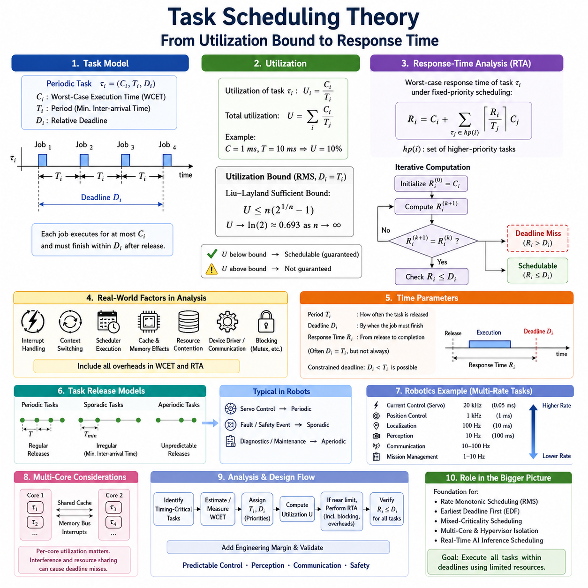
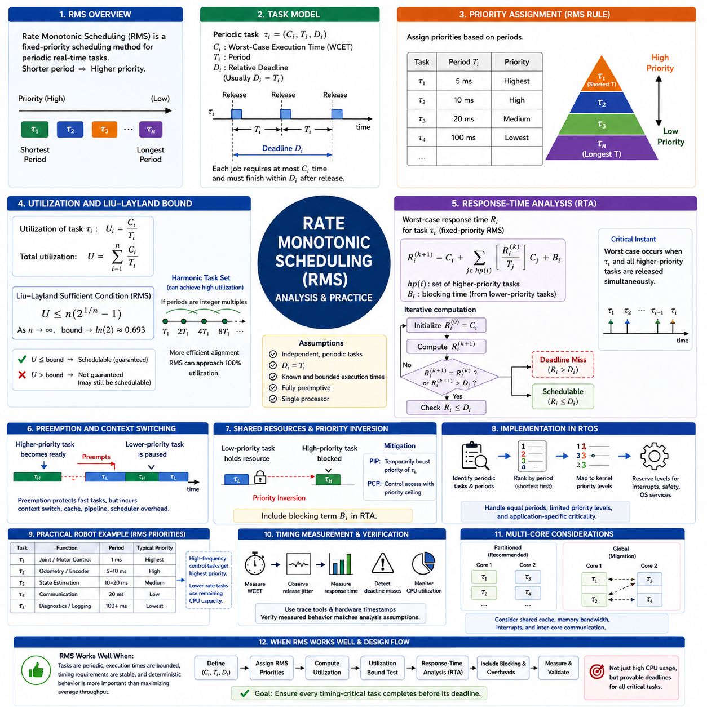
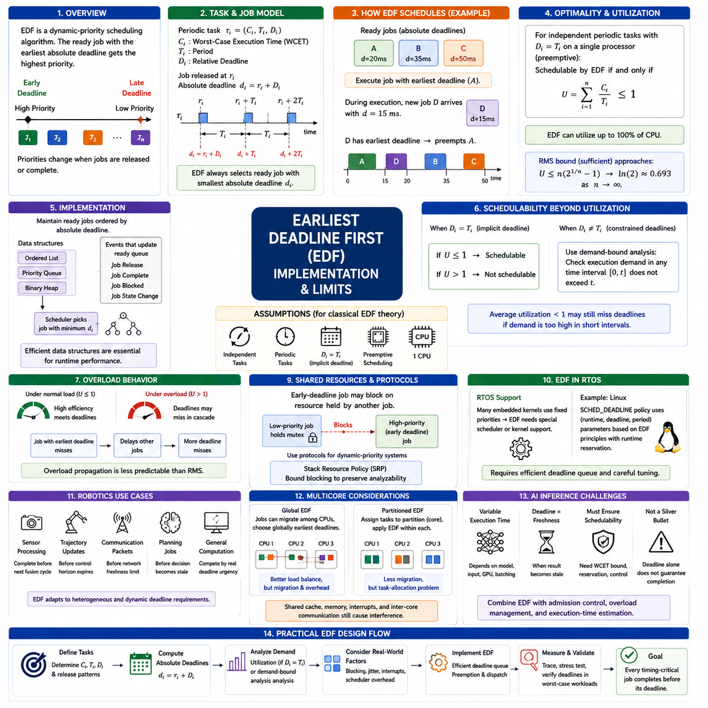
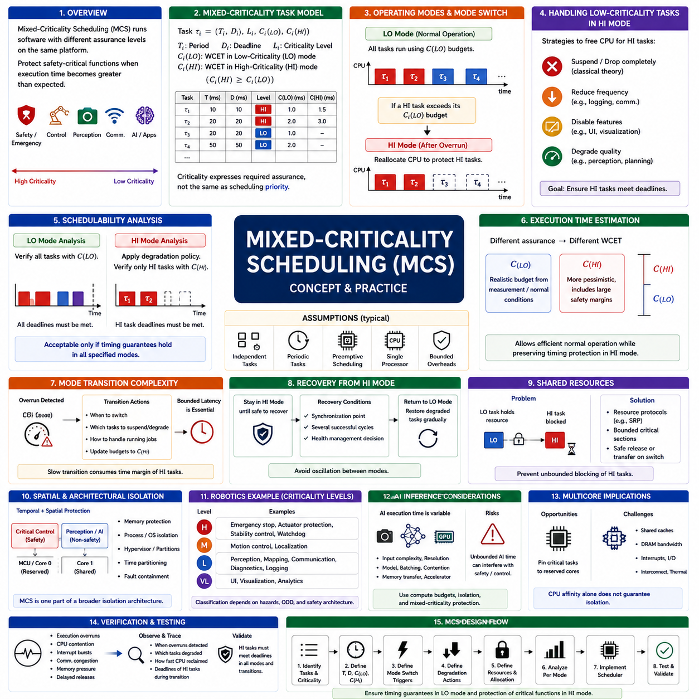
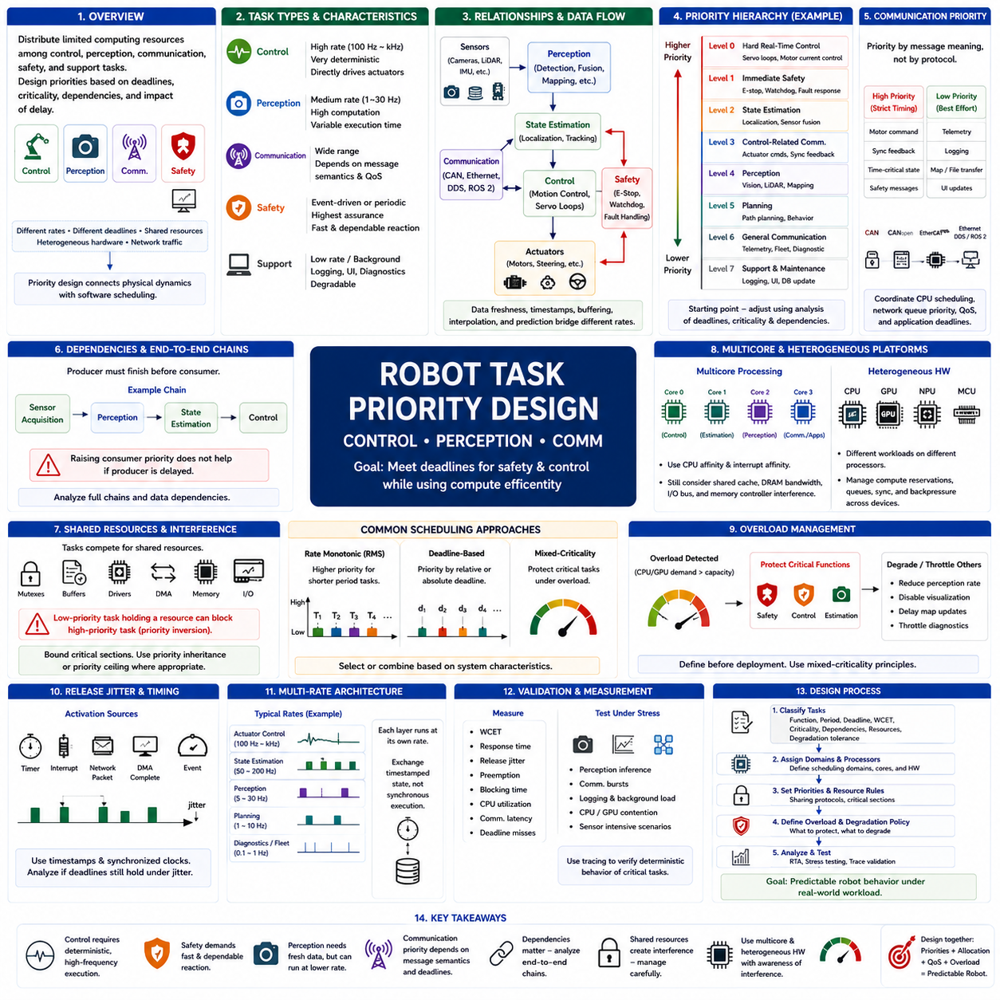
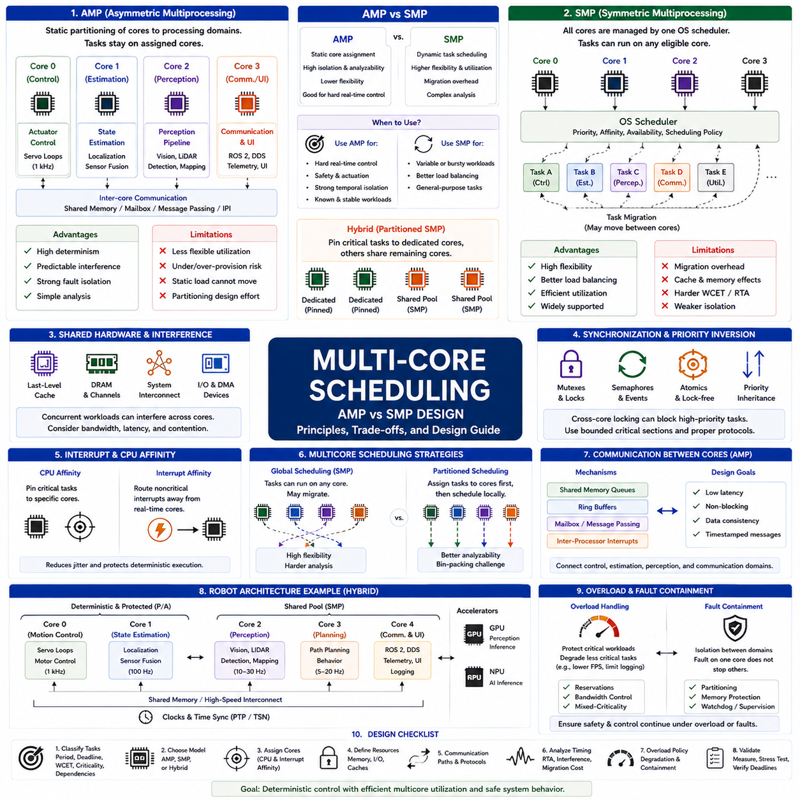
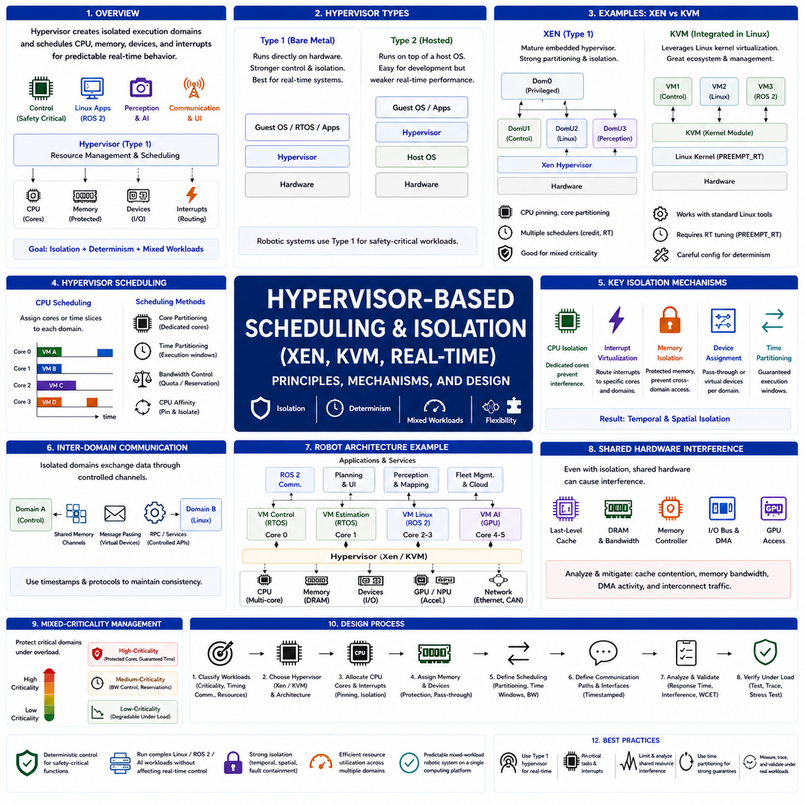
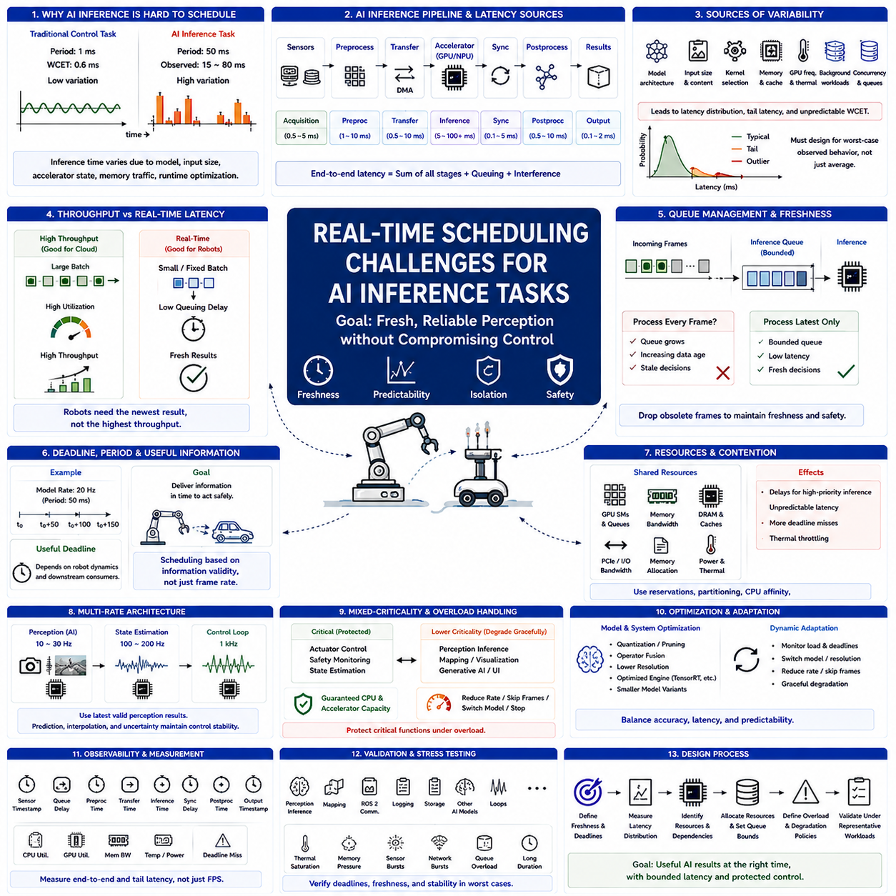
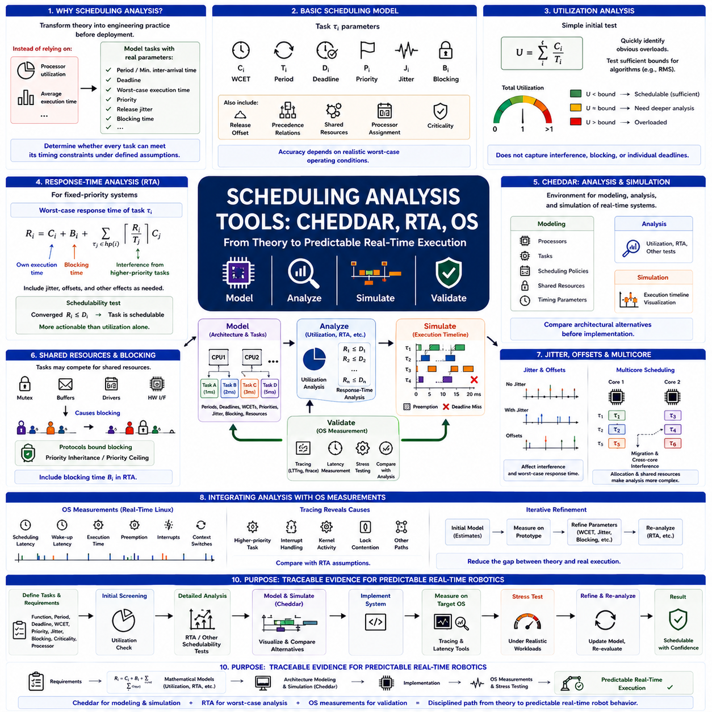
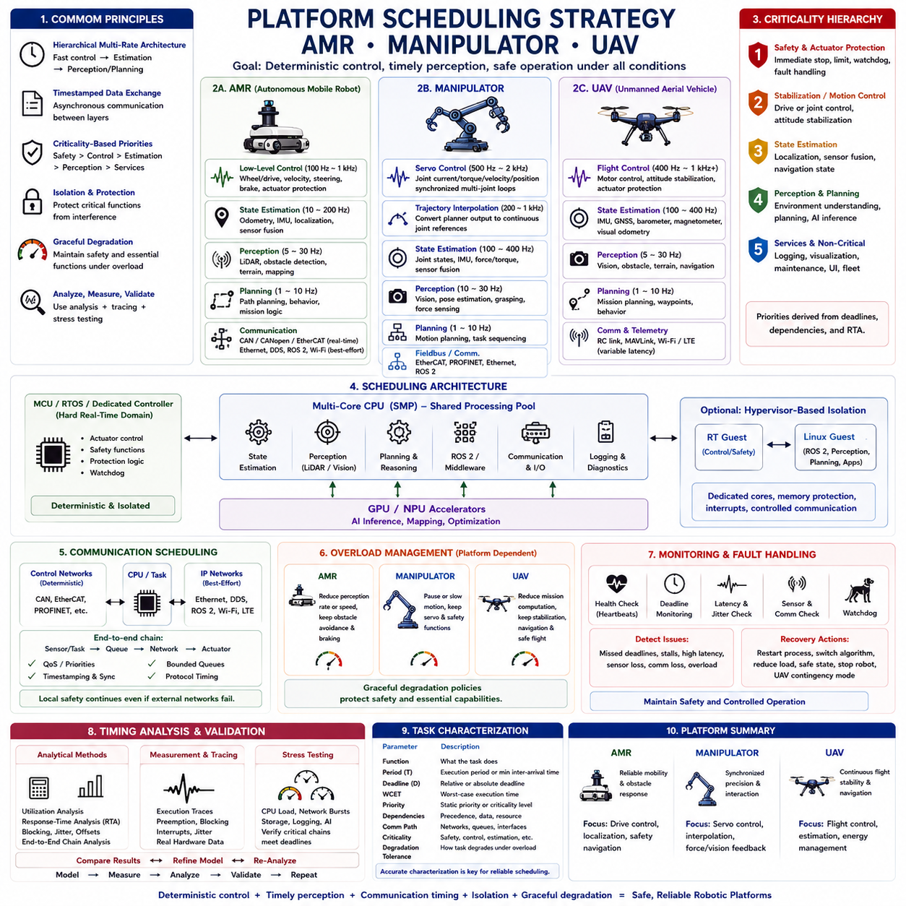

**Volume 03 Real Time Operating Systems**

# 05. Task Scheduling

## 05.01 Task Scheduling Theory: Utilization Bound / Response Time

{width="7.268055555555556in" height="7.268055555555556in"}

작업 스케줄링 이론(Task Scheduling Theory)은 실시간 작업(real-time task) 집합이 프로세서(processor)에서 실행되면서 모든 시간 제약(timing constraint)을 만족할 수 있는지를 판단하기 위한 수학적 기반을 제공한다. 실시간 운영체제(Real-Time Operating System, RTOS)에서는 올바른 계산 결과를 생성하는 것뿐만 아니라 요구된 마감시간(deadline) 이전에 결과를 생성하는 것이 정확성(correctness)의 중요한 조건이다.

주기적 실시간 작업(periodic real-time task)은 일반적으로 τᵢ = (Cᵢ, Tᵢ, Dᵢ) 형태로 모델링된다. 여기서 Cᵢ는 최악 실행 시간(Worst-Case Execution Time, WCET), Tᵢ는 주기(period) 또는 최소 도착 간격(minimum inter-arrival time), Dᵢ는 상대 마감시간(relative deadline)을 의미한다. 작업이 활성화될 때마다 하나의 작업 인스턴스(job)가 생성되며, 최대 Cᵢ의 프로세서 시간을 사용하여 해제(release) 이후 Dᵢ 이내에 실행을 완료해야 한다.

프로세서 이용률(processor utilization)은 작업 집합이 얼마나 많은 연산 자원을 요구하는지를 나타낸다. 주기적 작업 τᵢ의 이용률은 Uᵢ = Cᵢ/Tᵢ이며, 전체 이용률(total utilization)은 U = Σ(Cᵢ/Tᵢ)로 표현된다. 예를 들어 10 ms마다 1 ms를 실행하는 작업은 단일 프로세서 용량의 10%를 사용한다. 이용률은 실행 가능성을 판단하는 중요한 초기 지표이지만, 100%보다 낮다는 사실만으로 모든 스케줄링 알고리즘(scheduling algorithm)에서 스케줄 가능성(schedulability)이 보장되는 것은 아니다.

독립적인 주기적 작업(independent periodic task)을 대상으로 하고 마감시간이 주기와 동일하다고 가정하는 고정 우선순위 비율 단조 스케줄링(Rate Monotonic Scheduling, RMS)에서는 고전적인 리우-레이랜드(Liu-Layland) 충분 이용률 경계(sufficient utilization bound)를 U ≤ n(2\^(1/n) − 1)로 정의한다. 작업 수 n이 증가하면 이 경계는 ln(2), 즉 약 0.693에 수렴한다. 작업 집합이 이 경계 이하이면 해당 이론의 가정하에서 스케줄 가능성이 보장되지만, 경계를 초과한다고 해서 반드시 마감시간을 위반하는 것은 아니다.

충분조건(sufficient condition)과 필요조건(necessary condition)의 차이는 스케줄링 분석(scheduling analysis)에서 매우 중요하다. 이용률 경계 검사(utilization-bound test)는 계산 비용이 작고 시스템의 안전한 스케줄 가능성을 빠르게 확인할 수 있다는 장점이 있다. 그러나 복잡한 작업 간 상호작용을 하나의 이용률 값으로 단순화하기 때문에 보수적인 결과를 제공할 수 있다. 따라서 충분 이용률 검사를 통과하지 못했다고 해서 즉시 시스템을 사용할 수 없다고 판단해서는 안 되며, 더욱 정밀한 분석이 필요하다.

보다 정확하거나 엄밀한 스케줄 가능성 분석에는 응답시간 분석(Response-Time Analysis, RTA)을 사용할 수 있다. 고정 우선순위 작업(fixed-priority task) τᵢ의 최악 응답시간(worst-case response time)은 자신의 실행 시간과 모든 상위 우선순위 작업(higher-priority task)에 의한 간섭(interference)을 함께 고려하여 계산한다. 일반적인 반복식은 Rᵢ = Cᵢ + Σ⌈Rᵢ/Tⱼ⌉Cⱼ로 표현되며, 합산은 τᵢ보다 높은 우선순위를 가진 모든 작업 τⱼ에 대해 수행된다. 천장 함수(ceiling function)는 응답 구간 동안 각 상위 우선순위 작업이 몇 번 실행될 수 있는지를 계산한다.

응답시간 분석(Response-Time Analysis)은 일반적으로 반복 계산(iterative calculation)을 통해 수행된다. 먼저 Rᵢ⁽⁰⁾ = Cᵢ와 같은 초기 추정값(initial estimate)에서 시작하고, 이후 상위 우선순위 작업의 간섭을 추가하여 다음 응답시간을 계산한다. 연속된 두 값이 같아져 수렴(convergence)하거나 계산된 응답시간이 마감시간을 초과할 때까지 반복한다. 모든 작업에서 수렴된 값이 Rᵢ ≤ Dᵢ를 만족한다면 해당 고정 우선순위 작업 집합은 주어진 모델의 가정하에서 스케줄 가능하다고 판단할 수 있다.

실제 시스템에서는 이론적인 모델에 추가적인 실행 비용(execution overhead)을 포함해야 한다. 인터럽트 처리(interrupt handling), 문맥 전환(context switching), 스케줄러 실행(scheduler execution), 캐시 효과(cache effect), 메모리 경합(memory contention), 장치 드라이버(device driver) 동작, 통신 처리(communication processing) 등은 명목상의 응용 프로그램 실행 시간에 포함되지 않더라도 프로세서 시간을 소비한다. 또한 뮤텍스(mutex)나 기타 공유 자원(shared resource)에 의한 블로킹(blocking)은 높은 우선순위 작업의 실행을 지연시킬 수 있으므로 실제 응답시간 계산에 반영해야 한다.

따라서 최악 실행 시간(Worst-Case Execution Time, WCET)은 스케줄링 분석에서 가장 중요한 입력값 가운데 하나이다. 평균 실행 시간(average execution time)은 하드 실시간 보장(hard real-time guarantee)에 적합하지 않다. 작업이 간헐적으로 더 긴 실행 경로(control path)를 사용하거나 불리한 캐시 상태(cache behavior)를 만나거나 복잡한 입력 데이터를 처리할 수 있기 때문이다. WCET는 목표 하드웨어와 소프트웨어 구성에서 방어 가능한 상한(upper bound)을 나타내야 하며, 안전 필수 시스템(safety-critical system)에서는 보다 체계적인 시간 분석과 설계 여유(engineering margin)가 요구될 수 있다.

마감시간(deadline), 주기(period), 응답시간(response time)은 서로 다른 시간 특성을 나타낸다. 주기는 주기적 작업이 얼마나 자주 해제되는지를 결정하고, 마감시간은 해제된 작업 인스턴스가 언제까지 완료되어야 하는지를 정의하며, 응답시간은 작업 해제부터 실제 완료까지의 시간 간격을 의미한다. 작업에서 Dᵢ = Tᵢ가 사용되는 경우가 많지만 이는 보편적인 규칙이 아니라 하나의 가정이다. 제어(control), 통신(communication), 센서 처리(sensor processing) 작업에서는 주기보다 짧은 제한 마감시간(constrained deadline)을 사용할 수 있다.

스케줄링 분석에서는 실행 요구량(execution demand)과 작업 해제 특성(release behavior)도 구분해야 한다. 주기적 작업(periodic task)은 일정한 간격으로 발생하며, 산발적 작업(sporadic task)은 정의된 최소 도착 간격을 유지하면서 불규칙하게 발생한다. 비주기적 작업(aperiodic task)은 발생 시점을 더욱 예측하기 어려울 수 있다. 실제 로봇 소프트웨어에서는 서보 루프(servo loop)는 주기적이고, 오류나 안전 이벤트(fault or safety event)는 산발적이며, 진단 및 유지보수 작업(diagnostic and maintenance operation)은 비주기적으로 동작할 수 있다.

스케줄링 모델(scheduling model)은 로봇공학(robotics)에서 특히 중요하다. 서로 다른 소프트웨어 기능들이 매우 다른 주기로 실행되기 때문이다. 모터 전류 제어(motor-current regulation)는 위치 제어(position control)보다 훨씬 빠르게 실행될 수 있으며, 위치추정(localization), 인지(perception), 통신(communication), 진단(diagnostics), 임무 관리(mission management)는 각각 서로 다른 시간 척도(timescale)에서 동작한다. 모든 작업을 동일한 CPU 부하로 취급하면 이러한 시간적 요구사항을 정확하게 표현하기 어렵다.

따라서 로봇 제어기(robot controller)는 먼저 각각의 시간 결정적 작업(timing-critical task)을 식별하고, 최악 실행 시간(WCET)을 측정하거나 추정한 다음, 주기와 마감시간을 정의하고 전체 이용률을 계산하는 방식으로 설계할 수 있다. 단순한 이용률 경계 검사(utilization-bound test)를 사용하면 명확하게 안전한 구성을 빠르게 선별할 수 있다. 프로세서 한계에 가까운 작업 집합은 간섭, 블로킹, 운영체제 오버헤드(operating-system overhead), 적절한 설계 여유까지 포함하여 응답시간 분석을 수행해야 한다.

멀티코어 프로세서(multicore processor)는 전체 CPU 이용률만으로 스케줄 가능성을 판단하기 어렵게 만든다. 작업이 특정 코어(core)에 고정되거나 여러 코어 사이에서 이동할 수 있으며, 공유 캐시(shared cache), 메모리 버스(memory bus), 인터럽트(interrupt), 커널 스레드(kernel thread)와 경쟁할 수 있기 때문이다. 따라서 전체 CPU 이용률이 낮더라도 특정 코어가 과부하되거나 공유 자원 간섭이 발생하면 마감시간 위반이 발생할 수 있다. 이에 따라 코어별 작업 할당(per-core task allocation)과 간섭 분석(interference analysis)이 필요하다.

스케줄링 이론(Task Scheduling Theory)은 이후 다루게 되는 비율 단조 스케줄링(Rate Monotonic Scheduling, RMS), 최조기 마감시간 우선(Earliest Deadline First, EDF), 혼합 중요도 스케줄링(mixed-criticality scheduling), 멀티코어 스케줄링(multicore scheduling), 하이퍼바이저 격리(hypervisor isolation), 인공지능 추론 작업(AI inference task)의 실시간 스케줄링을 이해하기 위한 개념적 기반도 제공한다. 이러한 방식은 우선순위 할당과 자원 관리 방법에서는 차이가 있지만, 계산 요구량을 명시적으로 정의된 시간 제약 내에서 처리할 수 있는지를 판단한다는 동일한 문제를 다룬다.

따라서 로봇 실시간 시스템(robotic real-time system)에서 이용률 분석(utilization analysis)과 응답시간 분석(response-time analysis)은 서로 경쟁하는 방법이 아니라 상호 보완적인 도구로 이해해야 한다. 이용률은 프로세서 요구량을 간결하게 표현하여 빠른 스케줄 가능성 검사를 가능하게 하고, 응답시간 분석은 최악 조건의 간섭 아래에서 개별 작업의 시간 동작을 분석한다. 두 방법을 함께 적용하면 스케줄링을 경험적인 성능 조정에서 벗어나 예측 가능한 제어, 인지, 통신 및 안전 동작을 지원하는 분석 가능한 공학적 설계 영역으로 발전시킬 수 있다.

## 05.02 Rate Monotonic Scheduling: Analysis and Practice

{width="7.268055555555556in" height="7.268055555555556in"}

비율 단조 스케줄링(Rate Monotonic Scheduling, RMS)은 주로 주기적 실시간 작업(periodic real-time task)을 대상으로 설계된 고정 우선순위 스케줄링(fixed-priority scheduling) 방식이다. 작업의 주기(period)가 짧을수록 높은 우선순위(priority)를 부여하고, 주기가 길수록 낮은 우선순위를 부여한다. 우선순위가 시간 요구사항(timing requirement)에 따라 정적으로 결정되므로 RMS는 예측 가능한 스케줄링 모델을 제공하며, 특히 실시간 운영체제(Real-Time Operating System, RTOS)의 결정론적 제어 작업(deterministic control workload)에 적합하다.

RMS의 이론적 중요성은 고전적 가정(classical assumption)하에서 고정 우선순위 스케줄링 알고리즘(fixed-priority scheduling algorithm) 중 최적성(optimality)을 가진다는 점에 있다. 작업들은 독립적(independent)이고 주기적(periodic)이며, 마감시간(deadline)은 주기와 동일하고 실행 시간(execution time)은 알려진 유한한 값으로 제한된다. 또한 단일 프로세서(single processor)에서 완전 선점형(fully preemptive) 방식으로 스케줄링된다고 가정한다. 이러한 조건에서 어떤 고정 우선순위 할당으로 스케줄 가능한 작업 집합이라면 비율 단조 우선순위(Rate Monotonic priority)로도 스케줄할 수 있다.

주기적 작업(periodic task)은 τᵢ = (Cᵢ, Tᵢ, Dᵢ)로 표현할 수 있으며, 여기서 Cᵢ는 최악 실행 시간(Worst-Case Execution Time, WCET), Tᵢ는 주기(period), Dᵢ는 상대 마감시간(relative deadline)을 의미한다. RMS는 각 작업의 Tᵢ를 비교하여 더 짧은 주기를 가진 작업에 더 높은 우선순위를 할당한다. 예를 들어 주기가 5 ms, 10 ms, 20 ms, 100 ms인 작업들이 있다면 우선순위는 주기가 짧은 순서로 결정된다. 따라서 서보 제어(servo control)나 모터 제어(motor control)와 같은 고주파 기능이 자연스럽게 높은 우선순위를 갖는다.

RMS의 기본적인 스케줄 가능성 검사(schedulability test)는 프로세서 이용률(processor utilization)을 기반으로 한다. n개의 주기적 작업에 대한 전체 이용률은 U = Σ(Cᵢ/Tᵢ)로 계산된다. 고전적인 리우-레이랜드 모델(Liu-Layland model)에서 RMS의 충분 스케줄 가능 조건(sufficient schedulability condition)은 U ≤ n(2\^(1/n) − 1)이다. 작업 수 n이 증가하면 이 경계(bound)는 ln(2), 즉 약 0.693에 수렴한다. 이용률이 이 경계 이하이면 RMS 모델의 가정하에서 모든 작업이 마감시간을 만족하는 것이 보장된다.

이용률 경계(utilization bound)는 충분조건(sufficient condition)이지만 필요조건(necessary condition)은 아니다. 리우-레이랜드 경계를 초과하는 작업 집합도 여전히 완전히 스케줄 가능할 수 있는데, 이는 해당 경계가 의도적으로 보수적인 보장(conservative guarantee)을 제공하기 때문이다. 조화 작업 집합(harmonic task set)이 대표적인 예이다. 작업 주기들이 짧은 주기의 정수배(integer multiple) 관계를 가지면 작업 해제가 효율적으로 정렬되어 RMS가 100%에 가까운 프로세서 이용률에서도 스케줄 가능할 수 있다. 따라서 단순 이용률 검사 실패만으로 설계를 즉시 배제해서는 안 된다.

응답시간 분석(Response-Time Analysis, RTA)은 RMS 작업 집합을 보다 정확하게 평가하는 방법을 제공한다. 각 작업 τᵢ의 최악 응답시간(worst-case response time)은 자신의 실행 시간과 모든 상위 우선순위 작업(higher-priority task)으로부터 발생하는 간섭(interference)을 포함한다. 반복 관계식은 Rᵢ\^(k+1) = Cᵢ + Σ⌈Rᵢ\^k/Tⱼ⌉Cⱼ로 표현할 수 있으며, 합산은 RMS 우선순위가 더 높은 모든 작업에 대해 수행된다. 반복(iteration)은 응답시간이 수렴(convergence)하거나 작업의 마감시간을 초과할 때까지 계속된다.

임계 시점(critical instant) 개념은 RMS 응답시간 분석에서 특정한 최악 해제 패턴(worst-case release pattern)에 집중할 수 있는 이유를 설명한다. 독립적인 고정 우선순위 주기 작업 집합에서 특정 작업은 일반적으로 자신과 모든 상위 우선순위 작업이 동시에 해제될 때 가장 큰 간섭을 경험한다. 이러한 동기화 해제(synchronous release)는 프로세서 실행에 대한 초기 경쟁을 최대화한다. 이 조건을 분석하면 모든 가능한 작업 간 상대 위상(relative phase)을 완전히 시뮬레이션하지 않고도 최악의 시간 동작을 평가할 수 있다.

선점(preemption)은 RMS 동작의 핵심이다. 상위 우선순위 작업이 준비 상태(ready)가 되면 현재 실행 중인 하위 우선순위 작업을 중단시키고 즉시 프로세서 자원을 사용할 수 있다. 하위 우선순위 작업은 상위 우선순위 작업이 모두 처리된 이후 다시 실행된다. 이러한 동작은 빠른 제어 루프(control loop)를 느린 백그라운드 작업(background task)으로부터 보호하지만, 선점이 발생할 때마다 문맥 전환(context switching), 캐시(cache), 파이프라인(pipeline), 스케줄러(scheduler) 오버헤드가 추가될 수 있다.

공유 자원(shared resource)은 또 다른 복잡성을 발생시킨다. 하위 우선순위 작업이 뮤텍스(mutex)나 다른 독점 자원(exclusive resource)을 점유하고 있으면 상위 우선순위 작업이 블로킹(blocking)될 수 있다. 이는 상위 우선순위 작업이 다른 상위 우선순위 작업에 의해서만 지연된다는 단순한 가정을 위반하고 우선순위 역전(priority inversion)을 발생시킬 수 있다. 따라서 실제 응답시간 분석에서는 블로킹 항(blocking term) Bᵢ를 포함하여 Rᵢ = Cᵢ + Bᵢ + Σ⌈Rᵢ/Tⱼ⌉Cⱼ와 같은 형태로 분석할 수 있다.

우선순위 상속 프로토콜(Priority Inheritance Protocol, PIP)과 우선순위 천장 프로토콜(Priority Ceiling Protocol, PCP)은 자원과 관련된 블로킹을 제한하여 RMS의 동작을 더욱 예측 가능하게 만든다. PIP는 상위 우선순위 작업을 블로킹하는 하위 우선순위 작업의 우선순위를 일시적으로 높이며, PCP는 공유 자원 접근에 더욱 강력한 규칙을 적용한다. 이러한 방법들은 자원 경합(resource contention)을 제거하지는 않지만 제어되지 않는 우선순위 역전을 분석 가능한 블로킹 동작으로 변환하여 스케줄 가능성 분석에 반영할 수 있게 한다.

실시간 운영체제(RTOS)에서 RMS를 구현하려면 이론적인 우선순위를 커널(kernel)의 이산적인 우선순위 레벨(discrete priority level)에 매핑해야 한다. 설계자는 먼저 주기적 작업을 식별하고 각 작업의 주기를 결정한 다음 가장 짧은 주기에서 가장 긴 주기 순으로 우선순위를 정한다. 이후 인터럽트(interrupt), 안전 기능(safety function), 운영체제 서비스(operating-system service)에 필요한 수준을 고려하면서 커널 우선순위를 할당한다. 동일한 주기를 가진 작업이나 사용 가능한 우선순위 레벨보다 많은 작업이 존재하는 경우에는 추가적인 설계 판단이 필요하다.

실제 로봇 제어기(robot controller)는 RMS가 유용한 이유를 잘 보여준다. 빠른 관절 또는 구동 제어 루프(joint or drive-control loop)는 1 ms마다 실행되고, 오도메트리(odometry)는 5\~10 ms, 상태 추정(state estimation)은 10\~20 ms, 통신 처리(communication processing)는 20 ms, 진단 작업(diagnostic task)은 100 ms 이상의 주기로 실행될 수 있다. RMS는 가장 빠른 결정론적 제어 루프에 자연스럽게 가장 높은 작업 우선순위를 부여하며, 느린 모니터링 및 통신 기능은 고주파 실시간 작업이 사용하고 남은 프로세서 용량에서 실행된다.

그러나 시스템 아키텍처(system architecture)를 고려하지 않고 주파수만으로 우선순위를 결정해서는 안 된다. 비상 정지 경로(emergency-stop path), 감시 타이머(watchdog), 고장 감시기(fault monitor), 하드웨어 보호 기능(hardware protection function)은 명목상의 실행 주기보다 높은 실제 중요도(practical criticality)를 가질 수 있다. 이러한 기능은 인터럽트, 전용 안전 프로세서(dedicated safety processor), 별도의 우선순위 영역(priority domain), 또는 명시적으로 예약된 고우선순위 작업을 통해 구현되는 경우가 많다. 따라서 RMS는 모든 소프트웨어 기능에 대한 보편적 규칙이 아니라 명확하게 정의된 스케줄링 영역(scheduling domain) 안에서 적용해야 한다.

RMS 이론을 실제 구현으로 전환할 때는 시간 측정(timing measurement)이 필수적이다. 최악 실행 시간(WCET)은 실제 입력 조건, 메모리 동작(memory behavior), 인터럽트 간섭(interrupt interference), 통신 활동(communication activity), 운영체제 오버헤드를 포함해야 한다. 엔지니어는 대표적인 최악 조건 부하에서 실행 시간, 해제 지터(release jitter), 응답시간, 마감시간 위반(deadline miss), 문맥 전환 횟수, CPU 이용률을 관찰해야 한다. 이후 추적 도구(trace tool)와 하드웨어 타임스탬프(hardware timestamp)를 이용하여 측정된 동작이 스케줄 가능성 분석에서 사용한 가정과 일치하는지 검증할 수 있다.

멀티코어 플랫폼(multicore platform)에서는 고전적인 RMS 이론이 주로 단일 프로세서(uniprocessor) 스케줄링 모델을 대상으로 하기 때문에 추가적인 고려가 필요하다. 작업을 여러 코어에 분할(partition)할 수도 있고, 전역 스케줄링(global scheduling)을 사용하여 프로세서 사이에서 작업 이동(migration)을 허용할 수도 있다. 로봇 시스템에서는 고주파 제어 작업을 전용 코어에 고정(pin)하고 인지(perception), 통신, 비필수 처리(noncritical processing)를 다른 코어에서 수행하는 분할 방식이 유용할 수 있다. 그러나 공유 캐시, 메모리 대역폭, 인터럽트, 코어 간 통신(inter-core communication)은 여전히 시간 간섭을 발생시킬 수 있다.

RMS는 작업 부하(workload)가 주기적이고 실행 시간이 제한되며 시간 요구사항이 안정적이고 평균 프로세서 처리량(average processor throughput)의 극대화보다 결정론적 동작(deterministic behavior)이 중요한 경우에 특히 효과적이다. 이러한 특성은 모터 제어, 액추에이터 조정(actuator coordination), 센서 획득(sensor acquisition), 상태 추정, 임베디드 로봇 제어(embedded robot control)에서 자주 나타난다. 불규칙한 이벤트, 동적으로 변화하는 연산량, 대규모 인공지능 추론 작업(AI inference job)이 지배적인 시스템에서는 고전적인 RMS만 사용하기보다 보완적인 스케줄링 방법이 필요할 수 있다.

따라서 체계적인 RMS 설계 과정은 시간 요구사항을 실제 구현과 직접 연결한다. 엔지니어는 각 주기적 작업에 대해 Cᵢ, Tᵢ, Dᵢ를 정의하고, 주기에 따라 우선순위를 할당한 다음 프로세서 이용률을 계산하고 이용률 경계 검사(utilization-bound test)를 수행한다. 필요한 경우 응답시간 분석을 추가하고 블로킹과 구현 오버헤드를 반영한 뒤 실제 부하에서 측정을 수행한다. 최종 목표는 단순히 높은 CPU 이용률을 달성하는 것이 아니라 모든 시간 결정적 작업(timing-critical task)이 요구된 마감시간 이전에 완료된다는 것을 입증하는 것이다.

## 05.03 Earliest Deadline First: Implementation and Limits

{width="7.268055555555556in" height="7.268055555555556in"}

최조기 마감시간 우선(Earliest Deadline First, EDF)은 준비 상태(ready)에 있는 작업(task) 또는 작업 인스턴스(job) 가운데 절대 마감시간(absolute deadline)이 가장 빠른 작업에 가장 높은 실행 우선순위(execution priority)를 부여하는 동적 우선순위 스케줄링(dynamic-priority scheduling) 알고리즘이다. 작업 주기에서 우선순위가 정적으로 결정되는 비율 단조 스케줄링(Rate Monotonic Scheduling, RMS)과 달리 EDF의 우선순위는 작업이 해제되거나 완료될 때마다 변경될 수 있다. 따라서 EDF는 현재의 마감시간 긴급성(deadline urgency)을 직접 반영한다.

주기적 작업(periodic task)은 τᵢ = (Cᵢ, Tᵢ, Dᵢ)로 표현할 수 있으며, 여기서 Cᵢ는 최악 실행 시간(Worst-Case Execution Time, WCET), Tᵢ는 주기(period), Dᵢ는 상대 마감시간(relative deadline)을 의미한다. 작업 인스턴스가 시간 rᵢ에 해제되면 절대 마감시간은 dᵢ = rᵢ + Dᵢ가 된다. EDF는 준비된 모든 작업 인스턴스의 절대 마감시간을 비교하여 가장 작은 dᵢ를 가진 작업을 선택한다. 따라서 우선순위는 작업 자체에 영구적으로 부여되는 것이 아니라 개별 작업 인스턴스에 따라 결정된다.

EDF의 핵심적인 이론적 장점은 고전적인 가정하에서 단일 프로세서(single processor)의 선점형 스케줄링(preemptive scheduling)에 대해 최적성(optimality)을 갖는다는 것이다. 마감시간이 주기와 동일한 독립적인 주기적 작업에서 전체 프로세서 이용률(processor utilization)이 U = Σ(Cᵢ/Tᵢ) ≤ 1을 만족하면 EDF로 스케줄할 수 있다. 이는 EDF가 이론적으로 프로세서 용량의 100%까지 활용할 수 있음을 의미하며, RMS의 단순 충분 이용률 경계(sufficient utilization bound)가 작업 수 증가에 따라 약 69.3%에 수렴하는 것과 차이가 있다.

EDF 스케줄링은 간단한 시간선(timeline)을 통해 이해할 수 있다. 예를 들어 절대 마감시간이 각각 20 ms, 35 ms, 50 ms인 세 개의 작업 인스턴스가 준비되어 있다면 20 ms의 마감시간을 가진 작업이 먼저 실행된다. 이 작업을 실행하는 동안 마감시간이 15 ms인 새로운 작업이 해제되면 새 작업이 가장 긴급해지므로 현재 작업을 선점(preempt)할 수 있다. 새 작업이 완료된 이후 스케줄러는 다시 준비된 작업 가운데 가장 빠른 마감시간을 가진 작업을 선택한다.

따라서 EDF를 구현하려면 절대 마감시간을 기준으로 정렬된 준비 자료구조(ready structure)가 필요하다. 간단한 실시간 운영체제(RTOS) 구현에서는 준비된 작업 인스턴스를 정렬 리스트(ordered list), 우선순위 큐(priority queue), 이진 힙(binary heap) 등에 유지할 수 있다. 작업이 새롭게 해제되거나 블로킹(blocking)되거나 완료되거나 상태가 변경될 때마다 스케줄러는 이 자료구조를 갱신하고 가장 빠른 마감시간을 찾는다. EDF는 고정된 작업 우선순위 표 대신 런타임(runtime)에 동적인 우선순위 결정을 수행하므로 효율적인 자료구조가 중요하다.

EDF의 디스패치 절차(dispatch procedure)는 개념적으로 단순하다. 작업 인스턴스가 준비 상태가 되면 절대 마감시간을 계산하여 마감시간 순으로 정렬된 준비 큐(ready queue)에 삽입한다. 스케줄러는 이 값을 현재 실행 중인 작업의 마감시간과 비교한다. 새로운 작업의 마감시간이 더 빠르면 선점이 발생하고, 그렇지 않으면 현재 작업이 계속 실행된다. 작업이 완료되거나 블로킹되면 준비 큐에서 제거되고, 남아 있는 작업 가운데 마감시간이 가장 빠른 작업이 실행된다.

Dᵢ = Tᵢ인 암시적 마감시간 주기 모델(implicit-deadline periodic model)에서는 프로세서 이용률이 특히 간결한 스케줄 가능성 검사(schedulability test)를 제공한다. 고전적인 가정하에서 U ≤ 1이면 EDF가 작업 집합을 스케줄할 수 있으며, U \> 1이면 프로세서 자체에 필요한 실행 용량이 부족하다. 이러한 이용률 특성은 이론적인 스케줄 가능 영역(schedulability region)이 RMS의 단순 이용률 경계 검사보다 크기 때문에 높은 프로세서 효율이 필요한 시스템에서 EDF를 매력적으로 만든다.

그러나 모든 EDF 작업 모델에서 이용률만으로 충분한 것은 아니다. 상대 마감시간이 주기와 다르고 특히 Dᵢ \< Tᵢ인 경우에는 관련된 시간 구간에서 프로세서 요구량(processor demand)을 분석해야 한다. 요구량 기반 스케줄 가능성 분석(demand-based schedulability analysis)은 특정 시간 구간 안에 존재하는 마감시간 이전에 얼마나 많은 실행이 요구되는지를 평가한다. 평균 프로세서 이용률이 100% 이하이더라도 짧은 구간에 프로세서가 처리할 수 있는 양보다 많은 마감시간 제약 연산이 집중될 수 있기 때문에 이러한 구분이 중요하다.

EDF는 과부하 동작(overload behavior)에서도 RMS와 차이를 보인다. 정상적인 스케줄 가능 조건에서는 동적인 마감시간 우선순위를 통해 프로세서 용량을 효율적으로 사용할 수 있다. 그러나 실행 요구량이 예상치 못하게 가용 용량을 초과하면 여러 작업의 마감시간 위반(deadline miss)이 상대적으로 예측하기 어려운 형태로 발생할 수 있다. 일시적인 실행 시간 초과(execution-time overrun)가 가장 빠른 마감시간 작업을 지연시키고, 다시 이후 작업을 연쇄적으로 지연시킬 수 있다. 따라서 안전 필수 시스템(safety-critical system)에서는 이러한 과부하 전파(overload propagation)를 명시적으로 처리해야 한다.

런타임 오버헤드(runtime overhead)는 또 다른 실질적인 제한 요소이다. EDF에서는 마감시간 추적(deadline tracking), 정렬된 준비 큐 관리, 작업의 마감시간 순서 변화에 따른 스케줄링 결정이 필요하다. 각각의 선점은 문맥 전환(context switching), 캐시(cache), 파이프라인(pipeline), 스케줄러 비용을 발생시킬 수 있다. 현대 프로세서에서는 이러한 비용을 충분히 관리할 수 있지만 고주파 임베디드 제어 시스템(high-frequency embedded control system)에서는 이를 최악 시간 분석에 포함해야 한다. 따라서 이론적인 U ≤ 1을 실제 시스템이 항상 정확히 CPU 이용률 100%로 동작해야 한다는 의미로 해석해서는 안 된다.

해제 지터(release jitter)와 인터럽트 간섭(interrupt interference)은 이상적인 EDF 모델을 더욱 복잡하게 만든다. 센서 인터럽트(sensor interrupt), 통신 이벤트(communication event), 직접 메모리 접근 완료(DMA completion), 커널 서비스(kernel service), 하드웨어 종속 지연은 소프트웨어 작업의 실제 해제 시점을 변화시킬 수 있다. 작업이 늦게 도착하거나 집중적으로 발생하면 마감시간까지 남아 있는 시간이 감소한다. 따라서 실제 EDF 분석에서는 명목상의 Cᵢ, Tᵢ, Dᵢ뿐만 아니라 해제 지터, 스케줄러 지연(scheduler latency), 인터럽트 실행 및 기타 시간 간섭 요인도 고려해야 한다.

공유 자원(shared resource)은 추가적인 스케줄링 문제를 발생시킨다. 빠른 마감시간을 가진 작업이 다른 작업이 점유하고 있는 뮤텍스(mutex), 통신 버퍼(communication buffer), 장치 인터페이스(device interface) 또는 기타 독점 자원(exclusive resource) 때문에 블로킹될 수 있다. 동적 우선순위만으로 이러한 블로킹을 제거할 수 없으며 우선순위 역전(priority inversion)과 상호작용할 수도 있다. 스택 자원 정책(Stack Resource Policy, SRP)과 같은 동적 우선순위 스케줄링용 자원 접근 프로토콜은 블로킹 시간을 제한하여 EDF 작업의 분석 가능성(analyzability)을 유지하는 데 도움을 준다.

EDF 구현은 실시간 운영체제(RTOS)의 기능에도 크게 의존한다. 많은 임베디드 커널(embedded kernel)은 기본적으로 고정된 숫자 우선순위 레벨을 중심으로 설계되어 있기 때문에 RMS와 유사한 스케줄링은 비교적 쉽게 구현되지만 EDF에는 추가적인 스케줄링 로직 또는 커널 수정이 필요할 수 있다. 마감시간 중심 정책(deadline-oriented policy)을 지원하는 시스템에서는 보다 직접적인 구현이 가능하다. 예를 들어 리눅스(Linux)의 데드라인 스케줄링(deadline scheduling)은 실행 시간(runtime), 마감시간(deadline), 주기(period) 매개변수를 기반으로 EDF 관련 원리를 실행 시간 예약(execution-time reservation)과 결합하는 방식을 보여준다.

로봇공학(robotics)에서 EDF는 작업들이 서로 다른 마감시간 또는 동적으로 의미 있는 마감시간을 갖는 경우 유용할 수 있다. 센서 처리(sensor processing)는 다음 센서 융합 주기(fusion cycle) 이전에 완료되어야 하고, 궤적 갱신(trajectory update)은 제어 지평(control horizon)이 만료되기 전에 완료되어야 하며, 통신 패킷은 네트워크 최신성 한계(network freshness limit) 이전에 처리되어야 한다. EDF는 단순히 명목상의 실행 주기에 따라 우선순위를 할당하는 대신 실제 마감시간의 긴급성에 따라 작업을 경쟁시킬 수 있다.

그러나 매우 빠르고 결정론적인 제어 루프(deterministic control loop)는 고정 우선순위(fixed priority), 전용 코어(dedicated core), 인터럽트 또는 하드웨어 수준 실행을 이용하는 것이 분석하기 쉬운 경우가 많다. 엄격한 지터 요구사항을 가진 1 kHz 서보 작업(servo task)은 동적으로 변화하는 우선순위보다 안정적인 프로세서 배치(processor placement)와 예측 가능한 간섭 특성이 더 중요할 수 있다. 따라서 실제 로봇 아키텍처에서는 모든 작업에 하나의 정책을 강제하기보다 고정 우선순위 제어 스케줄링과 상위 수준 연산을 위한 EDF 형태의 스케줄링을 결합할 수 있다.

멀티코어 프로세서(multicore processor)는 EDF를 더욱 복잡하게 만든다. 전역 EDF(Global EDF)는 작업 인스턴스가 프로세서 사이를 이동하도록 허용하고 전체 시스템에서 가장 긴급한 마감시간을 선택하여 부하 분산(load balancing)을 향상시킬 수 있지만 작업 이동(migration)과 공유 자원 오버헤드를 발생시킨다. 분할 EDF(Partitioned EDF)는 작업을 특정 코어에 할당하고 각 코어에서 독립적으로 EDF를 적용하여 작업 이동을 줄이지만 작업 할당 문제(task-allocation problem)가 발생한다. 공유 캐시, 메모리 대역폭, 인터럽트 친화도(interrupt affinity), 코어 간 통신도 중요한 고려사항이다.

EDF는 인공지능 추론 작업(AI inference workload)에서 특히 어려운 문제가 될 수 있다. 실행 시간이 모델 아키텍처(model architecture), 입력 특성(input characteristic), GPU 경합(contention), 배치 처리(batching), 가속기 스케줄링(accelerator scheduling)에 따라 크게 변할 수 있기 때문이다. 마감시간은 인지 또는 추론 결과가 언제 오래된 정보(stale information)가 되는지를 표현할 수 있지만, 실행 요구량이 제한되고 하위 연산 자원이 스케줄 가능한 경우에만 EDF가 완료를 보장할 수 있다. 따라서 마감시간 설정이 WCET 추정, 실행 예약, 승인 제어(admission control), 과부하 관리(overload management)를 대체할 수는 없다.

실제 EDF 설계 과정에서는 실행 시간, 작업 해제 패턴(release pattern), 주기, 상대 마감시간을 정의한 다음 해제된 각 작업 인스턴스에 대해 절대 마감시간을 계산한다. 이후 마감시간 모델에 적합한 스케줄 가능성 검사를 사용하여 프로세서 요구량을 분석하고, 블로킹, 지터, 인터럽트, 스케줄링 오버헤드를 시간 예산(timing budget)에 포함한다. 마지막으로 추적(tracing)과 최악 조건 작업 부하 시험(worst-case workload testing)을 통해 실제 마감시간 동작이 이론적인 가정과 일치하는지 검증한다.

따라서 EDF는 강력한 스케줄링 이론인 동시에 여러 공학적 절충(engineering tradeoff)을 포함하는 방식으로 이해해야 한다. 동적 우선순위는 높은 프로세서 이용률과 직접적인 마감시간 중심 실행을 제공할 수 있지만 런타임 복잡성, 과부하 민감성, 공유 자원 문제, 구현 오버헤드를 증가시킨다. 실시간 로봇 시스템에서 중요한 것은 EDF의 이론적 이용률 한계가 높다는 이유만으로 이를 선택하는 것이 아니라, 실제 작업 부하에서 마감시간 중심의 유연성이 예측 가능성(predictability)과 자원 효율(resource efficiency)을 실질적으로 향상시키는지를 판단하는 것이다.

## 05.04 Mixed Criticality Scheduling

{width="7.268055555555556in" height="7.268055555555556in"}

혼합 중요도 스케줄링(Mixed-Criticality Scheduling, MCS)은 서로 다른 보증 수준(assurance level), 안전 요구사항(safety requirement), 시간 요구사항(timing requirement)을 가진 소프트웨어 기능들이 동일한 컴퓨팅 플랫폼(computing platform)을 공유하는 시스템을 대상으로 한다. 모든 작업을 동일한 중요도로 취급하는 대신 스케줄러(scheduler)가 중요도 수준(criticality level)을 구분하고, 프로세서 요구량이 예상보다 증가하는 상황에서도 안전 필수 기능(safety-critical function)의 실행을 보호한다. 이는 제어, 안전, 인지, 통신, 인공지능 작업이 공존하는 로봇 시스템에서 특히 중요하다.

혼합 중요도 작업(mixed-criticality task)은 주기(period) Tᵢ와 마감시간(deadline) Dᵢ 같은 일반적인 시간 매개변수와 함께 중요도 수준(criticality level) Lᵢ 및 여러 개의 최악 실행 시간(Worst-Case Execution Time, WCET) 추정값으로 표현할 수 있다. 단순화된 이중 중요도 모델(dual-criticality model)에서는 정상 동작을 위한 Cᵢ(LO)와 보다 보수적인 고보증 조건을 위한 Cᵢ(HI)를 정의할 수 있다. 고중요도 작업(high-criticality task)은 일반적으로 Cᵢ(HI) ≥ Cᵢ(LO)를 만족하며, 이는 더 강력한 시간 보증을 제공하기 위해 더 큰 실행 예산(execution budget)을 확보한다는 의미이다.

중요도(criticality)는 일반적인 스케줄링 우선순위(scheduling priority)와 혼동해서는 안 된다. 우선순위는 특정 시점에 준비된 작업 가운데 어떤 작업을 먼저 실행할지를 결정하지만, 중요도는 시스템 자원이 부족해졌을 때 어떤 수준의 보증 또는 보호가 필요한지를 나타낸다. 고주파 통신 작업은 상대적으로 높은 실행 우선순위를 가질 수 있지만 낮은 주기로 실행되는 비상 기능보다 안전 중요도가 낮을 수 있다. 따라서 혼합 중요도 스케줄링은 기존의 우선순위 순서와는 별개의 설계 차원을 추가한다.

MCS의 기본 메커니즘은 동작 모드 관리(operating-mode management)이다. 일반적으로 저중요도 모드(low-criticality mode) 또는 LO 모드(LO mode)라고 부르는 정상 동작 상태에서는 고중요도 작업과 저중요도 작업이 모두 정상 실행 예산을 사용하여 동작할 수 있다. 고중요도 작업이 가정된 LO 모드 실행 예산을 초과하면 시스템은 고중요도 모드(high-criticality mode), 즉 HI 모드(HI mode)로 전환할 수 있다. 이후 스케줄러는 중요한 기능이 마감시간을 만족하는 데 충분한 자원을 유지할 수 있도록 프로세서 용량을 재할당한다.

따라서 모드 전환(mode switching)은 단순히 프로세서가 실패했다는 의미가 아니라 실행 시간 불확실성(execution-time uncertainty)에 대한 제어된 대응이다. 고중요도 작업이 Cᵢ(LO)를 초과하여 실행되면 스케줄러는 낙관적인 시간 가정이 더 이상 유효하지 않을 가능성이 있다고 판단한다. 이후 보다 보수적인 Cᵢ(HI) 예산을 활성화하고 경쟁하는 작업 부하(workload)를 감소시킨다. 이 메커니즘은 실제 실행 요구량이 정상 동작에서 사용한 가정과 달라지는 상황에서도 필수 기능을 시간적으로 보호한다.

HI 모드로 전환한 이후 저중요도 작업(low-criticality task)은 여러 방법으로 처리할 수 있다. 고전적인 이론 모델에서는 저중요도 작업을 완전히 중단하거나 제거하여 고중요도 작업을 위한 프로세서 용량을 확보할 수 있다. 실제 시스템에서는 보다 완화된 성능 저하 전략(degradation strategy)을 사용하는 경우가 많다. 로깅(logging) 주기를 줄이고, 시각화(visualization)를 비활성화하며, 통신 갱신 속도를 낮추거나 비필수 인지 및 계획 기능을 낮은 품질로 동작시키면서 안전 및 제어 기능을 보호할 수 있다.

스케줄 가능성 분석(schedulability analysis)은 전체 평균 CPU 이용률만 평가하는 것이 아니라 각각의 동작 모드를 고려해야 한다. LO 모드에서는 정상 실행 예산을 사용하여 전체 작업 부하가 시간 요구사항을 만족할 수 있는지를 검증해야 한다. HI 모드에서는 정의된 성능 저하 정책을 적용한 이후 더 큰 보수적 실행 예산을 사용하는 고중요도 작업이 계속 스케줄 가능한지를 검증해야 한다. 시스템은 지정된 모든 동작 조건에서 필요한 시간 보장(timing guarantee)을 유지할 수 있어야 한다.

실행 시간 추정(execution-time estimation)은 MCS에서 특히 중요하다. MCS는 서로 다른 보증 수준에서 서로 다른 WCET 가정을 사용할 수 있음을 명시적으로 인정하기 때문이다. Cᵢ(LO)는 측정이나 정상 동작 조건으로부터 얻은 현실적인 실행 예산을 나타낼 수 있으며, Cᵢ(HI)는 더 큰 안전 여유와 보다 비관적인 시간 동작을 포함할 수 있다. 이러한 구분을 통해 모든 작업 부하에 항상 가장 보수적인 가정을 강제하지 않으면서 정상 상태의 컴퓨팅 자원을 효율적으로 사용할 수 있다.

모드 전환 자체도 시간적 복잡성(timing complexity)을 발생시킨다. 실행 시간 초과(overrun)가 감지되었을 때 고중요도 작업이 이미 실행 중일 수 있으며, 저중요도 작업이 프로세서 시간을 사용하거나 공유 자원을 점유하고 있을 수도 있다. 스케줄러는 언제 전환이 발생하고, 어떤 작업을 중단하거나 성능 저하시키며, 기존 작업 인스턴스를 어떻게 처리하고, 실행 예산을 어떻게 변경할지를 명확하게 정의해야 한다. 전환 지연시간(transition latency)이 지나치게 길면 중요 작업을 보호하기 위해 확보한 시간 여유를 소모할 수 있으므로 반드시 제한되어야 한다.

HI 모드에서 정상 동작으로 복귀하는 과정 역시 중요한 공학적 문제이다. 하나의 작업이 완료된 직후 즉시 복구하면 실행 요구량이 불안정한 상황에서 두 모드 사이의 반복적인 진동(oscillation)이 발생할 수 있다. 실제 시스템에서는 동기화 지점(synchronization point), 일정 횟수의 정상 실행 주기, 또는 명시적인 상태 관리 결정(health-management decision)을 기다린 후 성능이 저하된 작업을 복원할 수 있다. 따라서 복구 정책(recovery policy)은 단순한 구현 세부사항이 아니라 시스템 수준 스케줄링 설계의 일부가 된다.

공유 자원(shared resource)은 혼합 중요도 시스템에서 특별한 주의가 필요하다. 모드 전환이 발생했을 때 저중요도 작업이 뮤텍스(mutex), 통신 버퍼(communication buffer), 장치 드라이버(device driver), 공유 하드웨어 자원을 점유하고 있다면 고중요도 작업이 지연될 수 있다. 자원을 해제하거나 안전하게 이전하지 않은 상태에서 저중요도 작업을 중단하면 심각한 블로킹(blocking)이 발생할 수 있다. 따라서 자원 접근 프로토콜(resource-access protocol)과 제한된 임계 구역(bounded critical section)을 혼합 중요도 스케줄링 정책과 함께 설계해야 한다.

공간적 격리(spatial isolation)는 시간적 스케줄링(temporal scheduling)을 보완할 수 있다. 안전 필수 제어 소프트웨어는 전용 마이크로컨트롤러(MCU) 또는 CPU 코어에서 실행하고, 인지 및 인공지능 작업은 별도의 프로세서나 가속기(accelerator)에서 실행할 수 있다. 메모리 보호(memory protection), 프로세스 격리(process isolation), 하이퍼바이저(hypervisor), 시간 분할(time partitioning)을 사용하면 낮은 보증 수준의 소프트웨어가 중요 기능을 방해하는 것을 추가로 방지할 수 있다. 따라서 MCS는 시간적·공간적·고장 격리 메커니즘을 결합하는 전체 아키텍처의 한 구성요소로 사용되는 경우가 많다.

로봇 시스템(robotic system)은 혼합 중요도의 자연스러운 적용 사례이다. 비상 정지(emergency stopping), 액추에이터 보호(actuator protection), 안정성 제어(stability control), 감시 타이머(watchdog)는 가장 강력한 보증이 필요할 수 있다. 모션 제어(motion control)와 위치추정(localization)은 또 다른 중요도 수준을 가질 수 있으며, 인지(perception), 매핑(mapping), 통신, 진단(diagnostics), 로깅, 사용자 인터페이스(user interface)는 서로 다른 수준의 성능 저하를 허용할 수 있다. 정확한 분류는 계산 복잡도가 아니라 로봇의 위험 요소, 운용 설계 영역(Operational Design Domain, ODD), 안전 아키텍처에 따라 결정되어야 한다.

인공지능 추론(AI inference)은 기존의 주기적 제어 소프트웨어보다 실행 시간이 더 가변적일 수 있기 때문에 혼합 중요도 설계를 더욱 중요하게 만든다. 카메라 해상도, 장면 복잡도(scene complexity), 신경망 아키텍처(neural-network architecture), 배치 처리(batching), GPU 경합(contention), 메모리 전송(memory transfer)은 추론 지연시간에 영향을 줄 수 있다. 인공지능 작업이 제동(braking), 액추에이터 제어, 감시 타이머 처리 또는 다른 안전 관련 기능을 방해할 정도로 무제한의 연산 시간을 소비해서는 안 된다. 따라서 연산 예산(compute budget)과 격리 메커니즘이 필수적이다.

멀티코어 시스템(multicore system)은 MCS에 기회와 과제를 동시에 제공한다. 중요 작업을 예약된 코어(reserved core)에 고정하고 중요도가 낮은 기능을 나머지 프로세서에서 실행하면 직접적인 스케줄링 간섭을 감소시킬 수 있다. 그러나 코어들은 최종 단계 캐시(last-level cache), DRAM 대역폭, 인터럽트 컨트롤러(interrupt controller), 인터커넥트(interconnect), 열적 한계(thermal limit), 입출력 장치를 공유할 수 있다. 따라서 CPU 친화도(CPU affinity)만으로 완전한 격리가 보장되는 것은 아니며 공유 하드웨어에 의한 간섭도 최악 시간 보장에 포함해야 한다.

하이퍼바이저 기반 아키텍처(hypervisor-based architecture)는 서로 다른 보증 요구사항을 가진 소프트웨어를 가상 머신(virtual machine)이나 파티션(partition)으로 분리하여 혼합 중요도 스케줄링을 확장할 수 있다. 안전 파티션(safety partition)은 보장된 프로세서 시간 구간을 할당받고, 리눅스(Linux), ROS 2, 인지 또는 인공지능 애플리케이션은 상대적으로 낮은 중요도의 파티션에서 실행될 수 있다. 시간 분할은 각 영역이 실행되는 시점을 제한하고 메모리 및 장치 격리는 의도하지 않은 간섭을 줄일 수 있다.

혼합 중요도 스케줄링은 고장 감지(fault detection) 및 시스템 상태 관리(system health management)와도 연계되어야 한다. 실행 예산 초과는 비정상적인 입력, 소프트웨어 성능 저하, 자원 경합, 하드웨어 스로틀링(hardware throttling) 또는 발생 중인 고장으로 인해 나타날 수 있다. 스케줄러는 즉각적인 시간 보호를 제공할 수 있지만 다른 서브시스템(subsystem)은 원인을 진단하고 성능이 저하된 상태의 동작이 계속 허용 가능한지를 판단해야 한다. 따라서 스케줄링 모드는 로봇의 전체 운용 상태와 안전 대응의 일부가 된다.

검증(verification)에서는 정상 실행만 시험해서는 안 된다. 엔지니어는 의도적으로 실행 시간 초과, CPU 경합, 인터럽트 집중 발생(interrupt burst), 통신 혼잡(communication congestion), 메모리 압박(memory pressure), 작업 해제 지연을 발생시키면서 모드 전환과 마감시간 동작을 관찰해야 한다. 추적(tracing)을 통해 실행 초과가 언제 감지되고 어떤 작업이 성능 저하되며 얼마나 빠르게 프로세서 용량이 회수되는지 확인하고, 전환 과정과 성능 저하 상태에서도 고중요도 작업이 계속 마감시간을 만족하는지를 검증해야 한다.

실제 MCS 설계는 시간 결정적 기능(timing-critical function)을 식별하고 정당한 중요도 수준을 할당하며 주기와 마감시간을 정의한 다음, 각각의 관련 보증 모드에 대한 실행 예산을 설정하는 과정에서 시작한다. 이후 아키텍처는 모드 전환 조건(mode-switch trigger), 성능 저하 동작, 자원 접근 규칙, 프로세서 할당(processor allocation), 복구 조건을 정의한다. 스케줄 가능성 분석과 최악 조건 시험은 정상 상태의 CPU 이용률만 검증하는 것이 아니라 각각의 안정 상태 모드와 모드 전환 과정까지 포함해야 한다.

궁극적으로 혼합 중요도 스케줄링(Mixed-Criticality Scheduling)은 요청된 모든 연산을 동시에 실행할 수 없는 상황에서 실시간 로봇 시스템이 무엇을 우선적으로 보존해야 하는지를 체계적으로 결정하는 방법을 제공한다. 제어되지 않은 과부하가 어떤 작업의 마감시간을 실패하게 만들지 결정하도록 방치하는 대신, 아키텍처가 의도적으로 중요도가 낮은 작업을 중단하거나 성능 저하시켜 필수 기능을 보호한다. 따라서 MCS의 목적은 단순한 효율적 CPU 스케줄링이 아니라 변화하는 연산 요구량에서도 안전과 제어 기능을 예측 가능하게 보존하는 것이다.

## 05.05 Robot Task Priority Design: Control, Perception, Comm [w/Code]

{width="7.268055555555556in" height="7.268055555555556in"}

로봇 작업 우선순위 설계(robot task priority design)는 제한된 컴퓨팅 자원(computing resource)을 제어(control), 인지(perception), 통신(communication), 안전(safety), 지원 기능(supporting function) 사이에 어떻게 분배하면서 필요한 시간적 동작(timing behavior)을 보장할 것인지를 결정한다. 순수한 이론적 스케줄링 문제와 달리 로봇 소프트웨어는 주기적 제어 루프(periodic control loop), 이벤트 기반 처리(event-driven processing), 가변적인 인지 작업 부하(perception workload), 네트워크 트래픽(network traffic)을 함께 처리한다. 따라서 우선순위 설계에는 마감시간(deadline), 실행 주기, 중요도(criticality), 의존성(dependency), 실행 지연의 결과를 함께 반영해야 한다.

제어 작업(control task)은 출력이 액추에이터(actuator)와 물리적 움직임에 직접 영향을 주기 때문에 일반적으로 매우 결정론적인 실행(deterministic execution)이 필요하다. 모터 전류 제어(motor-current control), 관절 서보 루프(joint servo loop), 조향 제어(steering control), 속도 제어(velocity regulation), 안정화(stabilization)는 수백 Hz에서 수 kHz까지 동작할 수 있다. 과도한 지연시간(latency)이나 지터(jitter)는 제어 품질을 저하시키거나 시스템을 불안정하게 만들 수 있으므로 이러한 기능은 일반적으로 실행 시간이 제한된 고우선순위 실시간 스케줄링 영역(real-time scheduling domain)에 배치된다.

안전 기능(safety function)은 스케줄링 우선순위(scheduling priority)와 안전 중요도(safety criticality)가 동일한 개념이 아니므로 별도로 고려해야 한다. 비상 정지 처리(emergency-stop processing), 감시 타이머 감독(watchdog supervision), 액추에이터 보호(actuator protection), 충돌 대응 로직(collision-response logic), 고장 처리(fault handling)는 서보 제어보다 낮은 빈도로 실행되더라도 이벤트 발생 시 매우 짧고 신뢰할 수 있는 반응 시간이 필요할 수 있다. 요구되는 안전 아키텍처에 따라 고우선순위 작업, 인터럽트(interrupt), 전용 안전 프로세서(dedicated safety processor), 격리된 실행 영역(isolated execution domain)을 사용할 수 있다.

인지 작업 부하(perception workload)는 저수준 제어(low-level control)와 근본적으로 다른 시간 특성을 가진다. 카메라 처리(camera processing), 라이다 처리(LiDAR processing), 객체 탐지(object detection), 의미론적 분할(semantic segmentation), 지형 분석(terrain analysis), 센서 융합(sensor fusion)은 일반적으로 훨씬 많은 연산을 요구하고 입력에 따라 실행 시간이 달라질 수 있다. 유용한 갱신 속도는 수 Hz에서 수십 Hz 범위일 수 있다. 인지 기능 역시 적시에 실행되어야 하지만 인지 연산이 결정론적인 액추에이터 제어 루프를 지연시키도록 허용하면 물리 시스템에서 허용하기 어려운 동작이 발생할 수 있다.

따라서 인지와 제어의 관계는 두 기능을 동일한 속도로 실행하도록 강제하기보다 데이터 최신성(data freshness)을 기준으로 설계해야 한다. 카메라는 초당 30 또는 60 프레임(frame)을 생성할 수 있지만 모션 제어기(motion controller)는 수백 또는 수천 Hz로 실행될 수 있다. 제어기는 인지 정보가 갱신되는 사이에도 가장 최근에 검증된 상태 추정값(state estimate)을 이용하여 계속 동작할 수 있다. 타임스탬프(timestamping), 버퍼링(buffering), 보간(interpolation), 예측(prediction), 상태 추정(state estimation)은 일대일 실행을 요구하지 않으면서 서로 다른 시간 영역(temporal domain)을 연결한다.

통신 작업(communication task)은 또 다른 시간 영역을 형성한다. CAN, CANopen, EtherCAT, Ethernet, DDS, ROS 2 메시징(messaging) 등의 통신 메커니즘은 컴퓨팅 노드 사이에서 명령(command), 측정값(measurement), 상태 정보(state information), 진단 데이터(diagnostic data)를 전달한다. 이들의 스케줄링 요구사항은 메시지의 목적에 따라 달라진다. 모터 명령이나 동기화된 피드백 메시지는 엄격한 시간 특성이 필요할 수 있지만 텔레메트리(telemetry), 로깅(logging), 지도 전송(map transfer), 사용자 인터페이스 데이터는 훨씬 큰 지연과 지터를 허용할 수 있다.

따라서 통신 우선순위(communication priority)는 통신 프로토콜 자체가 아니라 전송되는 정보의 의미(semantics)에 따라 설계해야 한다. CAN을 통해 전달되는 제어 피드백은 동일한 버스의 진단 트래픽보다 높은 스케줄링 우선순위를 가질 수 있다. 마찬가지로 시간에 민감한 액추에이터 명령을 포함하는 이더넷 패킷은 대용량 인지 데이터 전송과 근본적으로 다르다. 따라서 CPU 스케줄링, 네트워크 큐 우선순위(network queue priority), 프로토콜 서비스 품질(Quality of Service, QoS), 애플리케이션 수준 마감시간(application-level deadline)을 독립적으로 설계하지 않고 상호 조정해야 한다.

실용적인 우선순위 계층(priority hierarchy)은 일반적으로 하드 실시간 제어(hard real-time control)와 즉각적인 안전 처리를 가장 높은 보호 수준에 배치하고, 그다음으로 시간에 민감한 상태 추정(state estimation)과 제어 관련 통신을 배치할 수 있다. 인지와 계획(planning)은 각각의 마감시간과 성능 저하 허용도(degradation tolerance)에 따라 중간 수준에 배치되며, 텔레메트리, 시각화, 로깅, 데이터베이스 갱신(database update), 유지보수 기능은 일반적으로 낮은 우선순위에서 실행된다. 이러한 계층은 모든 로봇에 적용되는 절대적인 순서가 아니라 설계를 시작하기 위한 기준이다.

작업 의존성(task dependency)은 단순해 보이는 우선순위 할당을 변화시킬 수 있다. 고우선순위 제어 작업이 낮은 우선순위의 상태 추정 작업에서 생성되는 정보에 의존하거나, 인지 파이프라인(perception pipeline)이 통신 스레드(communication thread)를 통해 전달되는 센서 데이터를 기다릴 수 있다. 생산자 작업(producer task)이 충분히 빠르게 실행되지 못하면 소비자 작업(consumer task)의 우선순위를 높이는 것만으로 시스템 지연시간을 개선할 수 없다. 따라서 개별 스레드를 독립적으로 최적화하기보다 데이터 의존성을 포함하는 종단 간 실행 체인(end-to-end execution chain)을 분석해야 한다.

비율 단조 스케줄링(Rate Monotonic Scheduling, RMS)은 로봇 작업 부하가 안정적인 주기 작업으로 구성될 때 유용한 기준을 제공한다. 짧은 주기의 서보 및 데이터 획득 작업(acquisition task)은 자연스럽게 느린 모니터링 기능보다 높은 우선순위를 갖는다. 그러나 주기만으로 안전 중요도, 종단 간 마감시간(end-to-end deadline), 자원 의존성(resource dependency), 가변적인 연산 요구량을 표현할 수는 없다. 따라서 실제 로봇 스케줄링은 주기 기반 우선순위 할당에서 시작한 뒤 응답시간(response time), 중요도, 의존성 분석을 통해 우선순위 계층을 조정할 수 있다.

마감시간 중심 스케줄링(deadline-oriented scheduling)은 긴급성이 고정된 실행 빈도보다 데이터 유효성(data validity)에 직접적으로 의존하는 인지, 계획, 통신 작업에 유용할 수 있다. 궤적 갱신(trajectory update)은 현재 궤적이 부적합해지기 전에 완료되어야 하며, 인지 정보는 시간이 지남에 따라 가치가 감소한다. 이러한 작업은 상대 마감시간(relative deadline) 또는 절대 마감시간(absolute deadline)을 통해 해석할 수 있으므로 연산 빈도와 결과가 실제로 제공되어야 하는 시점을 구분할 수 있다.

공유 자원(shared resource)은 우선순위 간섭(priority interference)의 주요 원인이다. 제어, 인지, 통신 스레드는 뮤텍스(mutex), 메모리 버퍼(memory buffer), 장치 드라이버(device driver), 직접 메모리 접근 채널(DMA channel), 공유 메모리(shared memory), 하드웨어 인터페이스를 놓고 경쟁할 수 있다. 낮은 우선순위의 로깅 또는 통신 작업이 필요한 자원을 점유하면 높은 우선순위의 제어 기능을 블로킹하여 우선순위 역전(priority inversion)을 발생시킬 수 있다. 따라서 임계 구역(critical section)을 제한하고 필요한 경우 우선순위 상속(priority inheritance)이나 우선순위 천장(priority ceiling)을 사용해야 한다.

멀티코어 프로세서(multicore processor)를 사용하면 스케줄링 영역을 논리적뿐만 아니라 물리적으로도 분리할 수 있다. 전용 코어(dedicated core)에서 고주파 제어 루프를 실행하고 다른 코어에서 인지, 계획, 통신, 시스템 서비스를 처리할 수 있다. CPU 친화도(CPU affinity)와 인터럽트 친화도(interrupt affinity)를 사용하면 불필요한 작업 이동과 스케줄링 간섭을 줄일 수 있다. 그러나 공유 캐시(shared cache), DRAM 대역폭, 입출력 버스(I/O bus), 메모리 컨트롤러(memory controller)는 여전히 코어 간 간섭을 발생시킬 수 있으므로 코어 분리만으로 완전한 시간적 격리를 제공할 수는 없다.

이기종 로봇 컴퓨터(heterogeneous robot computer)는 CPU, GPU, NPU, 마이크로컨트롤러(microcontroller)가 서로 다른 작업 부하를 처리하므로 또 다른 계층을 추가한다. GPU는 인지 추론(perception inference)을 수행하고 실시간 CPU는 상태 추정을 실행하며 MCU는 모터 제어 루프를 폐루프 방식으로 수행할 수 있다. 따라서 우선순위 설계는 하나의 운영체제 스케줄러를 넘어 확장되어야 한다. 프로세서 간 연산 예약(compute reservation), 큐 관리(queue management), 동기화(synchronization), 통신 지연, 역압(backpressure)이 실제 종단 간 시간 동작을 결정한다.

과부하 동작(overload behavior)은 실제 운용 중에 발견하는 것이 아니라 배포 전에 정의해야 한다. CPU 또는 가속기의 연산 요구량이 가용 용량을 초과하면 시스템은 안전과 제어 기능을 유지하면서 중요도가 낮은 기능을 의도적으로 성능 저하시켜야 한다. 인지 프레임 속도(perception frame rate)를 낮추고 시각화를 비활성화하며 지도 갱신을 연기하고 진단 트래픽을 제한할 수 있다. 혼합 중요도 원칙(mixed-criticality principle)은 요청된 모든 연산을 동시에 수행할 수 없는 상황에서 어떤 로봇 기능을 보호할 것인지를 체계적으로 결정하는 방법을 제공한다.

해제 지터(release jitter) 역시 고려해야 한다. 로봇 작업은 타이머(timer), 인터럽트, 네트워크 패킷, 직접 메모리 접근 완료(DMA completion), 상위 소프트웨어 이벤트(upstream software event)에 의해 활성화되는 경우가 많기 때문이다. 실행 시간이 제한되어 있더라도 불규칙한 활성화는 간섭 패턴을 변화시키고 종단 간 지연시간을 증가시킬 수 있다. 타임스탬프 기반 센서 획득(timestamped sensor acquisition)과 동기화된 클록(synchronized clock)은 측정 시점과 처리 시점을 구분하도록 하며, 스케줄링 분석을 통해 지연된 작업 해제에서도 하위 제어 및 인지 마감시간을 만족할 수 있는지를 판단한다.

따라서 유용한 로봇 스케줄링 아키텍처(robot scheduling architecture)는 여러 실행 주기(multiple rate)를 기반으로 동작한다. 빠른 액추에이터 루프는 결정론적인 높은 주파수로 실행하고, 상태 추정은 중간 속도로, 인지와 계획은 더 낮은 속도로, 플릿(fleet) 또는 진단 통신은 또 다른 주기로 실행할 수 있다. 이러한 계층은 모든 기능이 동기적으로 실행된다고 가정하는 대신 타임스탬프가 포함된 상태(timestamped state)를 교환한다. 이러한 다중 주기 아키텍처(multi-rate architecture)는 센싱, 추론, 네트워킹, 액추에이터 제어가 서로 다른 시간 요구사항을 가진다는 물리적 현실을 반영한다.

우선순위 설계는 최종적으로 측정을 통해 검증해야 한다. 엔지니어는 현실적인 프로세서, 네트워크, 센서 부하를 발생시키면서 최악 실행 시간(WCET), 응답시간, 해제 지터, 선점(preemption), 블로킹 시간(blocking duration), CPU 이용률, 통신 지연시간, 마감시간 위반(deadline miss)을 관찰해야 한다. 추적 데이터(trace data)를 통해 인지 추론, 통신 집중 발생(communication burst), 로깅 및 기타 백그라운드 작업이 동시에 실행될 때에도 고우선순위 제어가 결정론적으로 유지되는지를 확인해야 한다.

체계적인 설계 과정은 모든 작업을 기능, 주기, 마감시간, 최악 실행 시간(WCET), 중요도, 의존성, 자원 사용(resource usage), 성능 저하 허용도에 따라 분류하는 것에서 시작한다. 이후 작업을 적절한 스케줄링 영역과 프로세서에 할당하고 우선순위를 설정하며 공유 자원 동작을 분석하고 과부하 정책을 정의한다. 응답시간 분석(Response-Time Analysis, RTA)과 스트레스 시험(stress testing)을 통해 배포 전에 결과 아키텍처를 검증한다. 목표는 모든 중요한 작업에 단순히 높은 우선순위를 부여하는 것이 아니라 일관된 시간적 계층(coherent temporal hierarchy)을 구축하는 것이다.

효과적인 로봇 작업 우선순위 설계는 결국 물리 동역학(physical dynamics)과 소프트웨어 스케줄링(software scheduling)을 연결한다. 제어에는 결정론적인 실행이 필요하고, 인지는 충분히 최신의 환경 정보가 필요하며, 통신은 시간에 민감한 데이터를 유효 시간 구간(validity window) 내에 전달해야 하고, 비필수 서비스(noncritical service)는 이러한 기능을 방해해서는 안 된다. 우선순위, 프로세서 할당, 통신 서비스 품질(QoS), 과부하 관리를 함께 설계하면 이기종 작업 부하가 동시에 실행되는 상황에서도 로봇의 동작을 예측 가능하게 유지할 수 있다.

## 05.06 Multi-Core Scheduling: AMP vs SMP Design

{width="7.268055555555556in" height="7.268055555555556in"}

비대칭 멀티프로세싱(Asymmetric Multiprocessing, AMP)과 대칭 멀티프로세싱(Symmetric Multiprocessing, SMP)은 여러 프로세서 코어(processor core)에 실시간 작업 부하(real-time workload)를 구성하는 근본적으로 다른 두 가지 접근 방식을 제공한다. AMP는 코어를 미리 정의된 소프트웨어 영역(software domain)이나 작업에 할당하는 반면, SMP는 공통 운영체제 스케줄러(operating system scheduler)가 실행 가능한 작업을 사용 가능한 코어에 분배한다. 이러한 설계 선택은 결정성(determinism), 부하 분산(load balancing), 고장 격리(fault isolation), 자원 공유(resource sharing), 실시간 스케줄링 분석의 복잡성에 직접적인 영향을 준다.

AMP 아키텍처에서는 각각의 프로세서 코어 또는 코어 그룹에 특정한 실행 책임(execution responsibility)을 할당한다. 하나의 코어는 액추에이터 제어(actuator control)를 실행하고, 다른 코어는 상태 추정(state estimation)을 처리하며, 나머지 코어는 인지(perception) 또는 통신(communication) 작업을 실행할 수 있다. 일반적으로 작업은 동적으로 이동하지 않고 할당된 처리 영역(processing domain) 내부에서 실행된다. 이러한 정적 할당(static allocation)은 각 코어에서 경쟁하는 작업 집합을 시스템 설계 단계에서 명확하게 정의할 수 있으므로 간섭 분석을 단순화한다.

AMP는 프로세서 친화도(processor affinity)를 통해 예측 가능한 실행 환경을 만들 수 있기 때문에 하드 실시간 제어(hard real-time control)에 특히 적합하다. 전용 코어(dedicated core)는 인지, 로깅(logging), 사용자 인터페이스(user interface) 스레드와 직접 경쟁하지 않고 고주파 서보 루프(servo loop)를 실행할 수 있다. 인터럽트(interrupt) 역시 특정 코어로 전달하여 스케줄링 방해를 추가로 줄일 수 있다. 결과적으로 이러한 아키텍처는 공유 메모리(shared memory) 또는 프로세서 간 통신(interprocessor communication)을 통해 연결된 여러 개의 독립적인 단일 프로세서 시스템과 유사한 형태가 된다.

AMP의 주요 한계는 프로세서 이용률(processor utilization)의 유연성이 감소한다는 점이다. 전용 제어 코어는 낮은 부하로 동작하는 반면 다른 코어는 인지 또는 계획(planning) 작업으로 과부하될 수 있다. 작업 부하가 정적으로 분할되어 있기 때문에 사용되지 않는 처리 용량을 과부하된 다른 코어로 자동 이전할 수 없다. 따라서 작업 할당(task allocation)이 중요한 설계 문제가 되며, 과도한 자원 예약과 특정 코어의 국부적인 과부하(localized overload)를 모두 방지할 수 있도록 실행 요구량을 신중하게 추정해야 한다.

SMP는 여러 프로세서 코어를 하나의 운영체제 스케줄러가 관리하는 공유 실행 자원(shared execution resource)으로 제공함으로써 AMP와 반대되는 접근 방식을 취한다. 실행 가능한 작업은 우선순위(priority), 친화도(affinity), 프로세서 가용성(processor availability), 스케줄링 정책에 따라 서로 다른 코어에 배치될 수 있다. 유휴 코어가 사용 가능한 작업을 실행할 수 있으므로 부하 분산이 향상된다. 범용 운영체제와 많은 현대적인 실시간 운영체제(RTOS)는 멀티코어 프로세서를 유연하게 활용하기 위해 SMP를 사용한다.

작업 이동(task migration)은 SMP를 정의하는 핵심 특성 가운데 하나이다. 코어 1(Core 1)에서 실행되던 작업이 스케줄러의 판단에 따라 이후 코어 2(Core 2)에서 다시 실행될 수 있다. 작업 이동은 프로세서 이용률과 응답성을 향상시킬 수 있지만 시간적 비용도 발생시킨다. 작업과 관련된 캐시(cache) 내용이 새로운 코어에 존재하지 않을 수 있고 변환 구조(translation structure)를 다시 적재해야 하며 공유 메모리 트래픽(shared-memory traffic)이 증가할 수 있다. 이러한 효과는 최악 실행 시간(WCET)과 응답시간 분석(response-time analysis)을 복잡하게 만든다.

따라서 AMP와 SMP의 선택을 단순히 정적 스케줄링(static scheduling)과 동적 스케줄링(dynamic scheduling)의 차이로만 이해해서는 안 된다. AMP는 격리(isolation)와 분석 가능성(analyzability)에 유리한 반면 SMP는 유연성과 전체적인 자원 효율(aggregate resource efficiency)에 유리하다. 엄격한 액추에이터 시간 요구사항을 가진 로봇은 AMP 형태의 코어 분할(core partitioning)을 활용할 수 있으며, 연산량 변화가 큰 인지 및 계획 작업은 SMP 스케줄링의 장점을 활용할 수 있다. 따라서 실제 아키텍처에서는 어느 한 방식만 사용하기보다 두 모델의 특성을 결합하는 경우가 많다.

CPU 친화도(CPU affinity)는 AMP와 SMP 사이를 연결하는 중요한 방법을 제공한다. SMP 운영체제에서도 특정 실시간 작업을 지정된 코어에 고정(pin)하여 불필요한 작업 이동을 방지할 수 있다. 다른 작업은 나머지 프로세서 사이에서 자유롭게 이동하도록 할 수 있다. 이를 통해 결정론적인 제어 작업에는 전용 실행 자원을 제공하고 범용 작업에는 동적인 부하 분산을 유지하는 분할형 SMP 아키텍처(partitioned SMP architecture)를 구성할 수 있다. 이러한 하이브리드 설계(hybrid design)는 고성능 로봇 컴퓨터에서 유용하게 활용될 수 있다.

인터럽트 친화도(interrupt affinity) 역시 중요하다. 특정 작업을 하나의 CPU 코어에 격리하더라도 관련 없는 장치 인터럽트(device interrupt)가 계속 해당 코어에서 실행되면 결정론적인 동작이 보장되지 않는다. 네트워크 인터페이스(network interface), 저장장치(storage device), 카메라, 통신 컨트롤러(communication controller), 기타 주변장치는 상당한 인터럽트 활동을 발생시킬 수 있다. 중요하지 않은 인터럽트를 실시간 코어에서 다른 코어로 이동시키면 실행 지터(execution jitter)를 줄일 수 있으며, 남아 있는 타이머 인터럽트와 필수 하드웨어 이벤트는 간섭 요소로 분석해야 한다.

멀티코어 스케줄링(multicore scheduling)은 소프트웨어 작업이 완벽하게 분할되어 있더라도 공유 하드웨어 간섭(shared-hardware interference)을 발생시킨다. 프로세서 코어는 최종 단계 캐시(last-level cache), DRAM 채널, 메모리 컨트롤러(memory controller), 시스템 인터커넥트(system interconnect), 입출력 자원(I/O resource)을 공유할 수 있다. 따라서 대규모 메모리 전송을 수행하는 인지 작업이 다른 코어에서 실행되는 제어 작업의 메모리 접근 지연시간을 증가시킬 수 있다. 시간적 격리(temporal isolation)를 확보하려면 CPU 코어 할당뿐만 아니라 이러한 공유 자원도 함께 고려해야 한다.

캐시 동작(cache behavior)은 AMP와 SMP를 비교할 때 특히 중요하다. AMP에서는 작업이 동일한 코어에서 반복적으로 실행되기 때문에 명령어와 데이터 작업 집합(working set)이 비교적 안정적으로 캐시에 유지되어 캐시 지역성(cache locality)이 향상될 수 있다. SMP의 작업 이동은 지역성을 감소시키고 캐시 관련 선점 및 이동 지연을 발생시킬 수 있다. 그러나 코어에 고정된 작업도 공유 캐시 계층(shared cache level)을 통해 서로 간섭할 수 있으므로 높은 수준의 실시간 시스템에서는 캐시 분할(cache partitioning), 메모리 배치(memory placement), 작업 부하 분리(workload separation)가 필요할 수 있다.

여러 코어에서 작업이 동시에 실행되면 동기화(synchronization)도 더욱 복잡해진다. 뮤텍스(mutex), 스핀록(spinlock), 세마포어(semaphore), 원자적 연산(atomic operation), 잠금 없는 자료구조(lock-free data structure)를 사용하여 공유 상태를 보호할 수 있지만 각각의 메커니즘은 시간적 영향을 발생시킨다. 한 코어의 고우선순위 작업이 다른 코어에서 공유 잠금(shared lock)을 점유하고 있는 저우선순위 작업을 기다릴 수 있다. 따라서 멀티코어 우선순위 역전(multicore priority inversion)과 잠금 경합(lock contention)을 제한하기 위해 임계 구역(critical section)을 제한하고 적절한 동기화 프로토콜을 사용해야 한다.

프로세서 간 통신(interprocessor communication)은 서로 분리되어 할당된 처리 영역이 명령과 상태 정보를 교환해야 하기 때문에 AMP의 핵심 요소이다. 공유 메모리 큐(shared-memory queue), 링 버퍼(ring buffer), 메일박스(mailbox), 메시지 전달(message passing), 프로세서 간 인터럽트(interprocessor interrupt)를 이용하여 이러한 영역을 연결할 수 있다. 통신 인터페이스는 데이터 일관성(data consistency)을 유지하면서 블로킹을 최소화하고 제한된 지연시간을 제공해야 한다. 특히 로봇에서는 제어, 상태 추정, 인지, 통신이 서로 다른 주기로 실행되므로 타임스탬프 메시지(timestamped message)가 유용하다.

SMP 시스템에서는 전역 스케줄링(global scheduling)과 분할 스케줄링(partitioned scheduling) 전략도 고려해야 한다. 전역 스케줄링은 작업이 사용 가능한 모든 프로세서에서 실행되고 코어 사이를 이동할 수 있도록 하여 유연한 부하 분산을 제공한다. 분할 스케줄링은 먼저 작업을 특정 프로세서에 할당한 다음 각각의 프로세서에서 독립적으로 스케줄링한다. 분할 방식은 분석 가능성을 높이지만 빈 패킹(bin-packing)과 유사한 작업 할당 문제가 발생하며, 전역 방식은 정적 할당 제약을 줄이는 대신 작업 이동과 간섭 분석의 복잡성을 증가시킨다.

로봇 컴퓨팅 아키텍처(robot computing architecture)는 기능적 분할(functional partitioning)을 자연스럽게 지원한다. 실시간 코어는 모션 제어(motion control)를 실행하고, 다른 코어는 위치추정(localization)과 상태 추정을 처리하며, 여러 코어로 구성된 그룹은 ROS 2 통신, 계획 및 시스템 서비스를 실행할 수 있다. GPU 또는 NPU 가속기는 신경망 추론(neural-network inference)을 별도로 수행할 수 있다. 이러한 이기종 구성(heterogeneous arrangement)은 멀티코어 스케줄링을 CPU 코어 이상으로 확장하며 큐, 동기화, 가속기 접근, 종단 간 마감시간(end-to-end deadline)을 명시적으로 관리해야 한다.

인지 작업 부하(perception workload)는 센서 입력, 알고리즘, 처리 파이프라인에 따라 연산 요구량이 변하기 때문에 유연한 멀티코어 할당의 장점을 활용할 수 있다. 카메라 디코딩(camera decoding), 포인트 클라우드 처리(point-cloud processing), 객체 탐지 준비(object-detection preparation), 매핑(mapping), 계획은 여러 코어를 통한 병렬 실행(parallel execution)을 활용할 수 있다. 반면 고주파 제어 작업은 안정적인 코어 배치의 장점을 얻는 경우가 많다. 따라서 결정론적 기능은 고정 배치하고 연산 중심 작업은 공유 코어에서 처리하는 방식이 예측 가능성과 효율 사이의 실용적인 균형을 제공한다.

통신 처리(communication processing) 역시 코어 설계에 영향을 준다. 액추에이터 제어와 관련된 CAN 또는 EtherCAT 처리는 실시간 제어 영역에 가깝게 배치할 수 있으며, Ethernet, DDS, ROS 2, 텔레메트리(telemetry), 플릿 통신(fleet communication)은 범용 코어에서 실행할 수 있다. 높은 패킷 속도는 상당한 CPU 시간을 소비할 수 있으므로 네트워크 인터럽트와 프로토콜 처리를 신중하게 할당해야 한다. 따라서 통신 아키텍처와 CPU 스케줄링은 하나의 통합된 시간 시스템(timing system)으로 설계해야 한다.

과부하 격리(overload containment)는 AMP와 SMP에서 서로 다르게 나타난다. AMP에서는 하나의 파티션에서 발생한 과도한 연산이 다른 파티션에 전용으로 할당된 CPU 시간을 직접 소비하지 못하도록 제한할 수 있어 자연스러운 시간적 격리를 제공한다. SMP에서는 친화도, 대역폭 제어(bandwidth control), 자원 예약(reservation), 스케줄링 정책으로 제한하지 않으면 과부하된 작업이 여러 프로세서를 점유할 수 있다. 로봇에서는 제어되지 않는 인지 또는 인공지능 작업 부하가 안전 및 액추에이터 제어를 위해 예약된 처리 용량을 소비하도록 허용해서는 안 된다.

고장 격리(fault containment) 역시 분할된 아키텍처에 유리할 수 있다. 한 코어의 소프트웨어 구성요소가 응답하지 않더라도 다른 코어에서 독립적으로 스케줄링되는 제어 기능은 계속 실행될 수 있다. 그러나 공유 메모리 손상(shared-memory corruption), 커널 고장(kernel failure), 열적 스로틀링(thermal throttling), 공통 하드웨어 자원은 여전히 고장을 전파할 수 있다. 따라서 강력한 격리를 위해서는 멀티코어 작업 할당뿐만 아니라 메모리 보호, 별도의 운영체제 인스턴스, 하이퍼바이저(hypervisor), 또는 물리적으로 분리된 프로세서가 필요할 수 있다.

멀티코어 스케줄링 검증(validation)에서는 평균 CPU 이용률 이상의 측정이 필요하다. 엔지니어는 코어별 이용률(per-core utilization), 작업 이동, 응답시간, 실행 지터, 인터럽트 분포(interrupt distribution), 잠금 경합, 캐시 동작, 메모리 대역폭, 마감시간 위반(deadline miss)을 관찰해야 한다. 스트레스 시험에서는 인지, 네트워킹, 저장장치, 로깅, 인공지능 추론을 동시에 실행하면서 결정론적인 제어 실행을 검증해야 한다. 전체 CPU 이용률이 낮더라도 하나의 중요 코어나 공유 자원이 과부하되면 시스템은 실패할 수 있다.

실제 AMP/SMP 설계 과정은 작업을 시간 중요도(timing criticality), 실행 변동성(execution variability), 통신 의존성(communication dependency), 자원 요구량(resource demand)에 따라 분류하는 것에서 시작한다. 매우 결정론적인 작업은 보호된 코어에 할당하고 유연한 작업 부하는 SMP 풀(pool)을 공유하도록 구성할 수 있다. 이후 CPU 및 인터럽트 친화도, 동기화, 메모리 동작, 통신 경로, 과부하 정책을 정의한다. 응답시간 분석과 멀티코어 스트레스 시험을 통해 최종 아키텍처가 요구되는 마감시간을 만족하는지 검증한다.

따라서 가장 효과적인 로봇 멀티코어 아키텍처는 순수한 AMP 또는 순수한 SMP보다는 두 방식을 결합한 하이브리드 구조(hybrid architecture)인 경우가 많다. AMP 형태의 분할은 안전과 제어에 결정론적인 실행을 제공하고, SMP는 인지, 계획, 통신 및 지원 소프트웨어에 효율적인 부하 분산을 제공한다. 코어 격리(core isolation), 제어된 친화도, 제한된 동기화, 공유 자원 관리, 이기종 가속(heterogeneous acceleration)을 함께 적용하면 물리적 제어에 필요한 시간 예측 가능성을 유지하면서 멀티코어 성능을 활용할 수 있다.

## 05.07 Hypervisor-Based Scheduling Isolation: Xen, KVM, RT

{width="7.268055555555556in" height="7.268055555555556in"}

하이퍼바이저 기반 스케줄링(hypervisor-based scheduling)은 프로세서 시간, 메모리, 장치, 인터럽트가 서로 격리된 소프트웨어 영역에 어떻게 분배되는지를 제어하는 가상화 계층(virtualization layer)을 도입함으로써 실시간 스케줄링(real-time scheduling)을 단일 운영체제의 범위를 넘어 확장한다. 모든 애플리케이션이 하나의 스케줄러에서 경쟁하도록 하는 대신, 하이퍼바이저(hypervisor)는 독립적으로 관리되는 작업 부하를 가진 여러 실행 환경을 생성한다. 이러한 접근 방식은 안전 중요 제어(safety-critical control), Linux 애플리케이션, ROS 2, 인지(perception), AI 작업 부하가 결정론적 동작(deterministic behavior)을 손상시키지 않고 공존해야 하는 로봇 시스템에서 점점 중요해지고 있다.

하이퍼바이저는 게스트 운영체제(guest operating system) 아래에서 동작하며 프로세서 시간, 메모리, 장치와 같은 하드웨어 자원을 할당하는 첫 번째 소프트웨어 계층이 된다. Linux, 실시간 운영체제(RTOS), 특수 제어 소프트웨어와 같은 게스트 시스템은 하드웨어를 직접 제어하는 대신 격리된 가상 머신(virtual machine) 또는 파티션(partition) 내부에서 실행된다. 따라서 하이퍼바이저는 각 게스트가 어떤 프로세서 코어에서 실행되는지, 언제 실행되는지, 인터럽트가 어떻게 전달되는지, 각 소프트웨어 영역이 어떤 장치에 접근할 수 있는지를 결정한다.

가상화(virtualization)를 단순히 클라우드 컴퓨팅(cloud computing)을 위한 기술로만 이해해서는 안 된다. 임베디드 및 로봇 플랫폼에서 가상화의 주요 목적은 서버 통합(server consolidation)보다 결정론적 격리(deterministic isolation)에 있는 경우가 많다. 안전 중요 제어 소프트웨어는 동일한 물리 프로세서를 공유하면서도 인지 및 사용자 인터페이스 애플리케이션과 독립적으로 실행될 수 있다. 이러한 아키텍처 분리(architectural separation)는 의도하지 않은 간섭을 줄이고 예측할 수 없는 실행 지연을 허용할 수 없는 기능에 더욱 강력한 시간 보장을 제공한다.

하이퍼바이저는 일반적으로 타입 1(Type 1)과 타입 2(Type 2)로 분류된다. 타입 1 하이퍼바이저(Type 1 hypervisor)는 하드웨어에서 직접 실행되며 일반적으로 프로세서 스케줄링, 인터럽트, 메모리 격리를 더욱 강력하게 제어할 수 있다. 타입 2 하이퍼바이저(Type 2 hypervisor)는 다른 운영체제 위에서 실행되므로 개발 환경에서는 편리하지만 호스트 운영체제(host operating system)가 스케줄링 경로에 포함되기 때문에 높은 수준의 실시간 성능을 요구하는 배포 환경에는 상대적으로 적합하지 않다.

Xen은 임베디드 가상화(embedded virtualization)에서 자주 논의되는 성숙한 타입 1 하이퍼바이저 아키텍처(Type 1 hypervisor architecture)를 대표한다. Xen은 시스템 책임을 특권 영역(privileged domain)과 게스트 영역(guest domain)으로 분리하여 서로 독립적인 운영체제가 동시에 실행되면서도 영역 간 통신을 제어할 수 있도록 한다. 서로 다른 프로세서 코어를 각각의 게스트에 할당할 수 있으므로 Linux 애플리케이션과 격리된 실시간 작업 부하를 결합하는 시스템에서 활용할 수 있다.

Xen 스케줄링(Xen scheduling)은 작업 부하의 특성에 따라 서로 다른 스케줄링 정책을 사용할 수 있다. 범용 작업 부하는 공정성(fairness)을 우선할 수 있지만 실시간 구성에서는 예측 가능한 실행 구간(execution window)과 제한된 간섭(bounded interference)을 중요하게 다룬다. CPU 고정(CPU pinning)을 사용하면 게스트 영역을 전용 코어에서 실행하여 작업 이동(task migration)으로 인한 시간 변동을 줄일 수 있다. 이러한 기능은 결정론적 제어 기능을 위해 프로세서 자원을 예약하는 로봇 아키텍처에 적합하다.

커널 기반 가상 머신(Kernel-based Virtual Machine, KVM)은 가상화를 Linux 커널에 직접 통합하는 다른 아키텍처 접근 방식을 사용한다. 완전히 별도의 하이퍼바이저 계층을 도입하는 대신 KVM은 Linux를 하이퍼바이저로 동작하게 하면서 Linux의 스케줄링 및 가상화 인프라를 활용한다. 이러한 설계는 Linux 소프트웨어 생태계와 높은 호환성을 제공하며 표준 Linux 관리 도구를 통해 가상화를 사용할 수 있도록 한다.

실시간 KVM(real-time KVM) 구성에서는 결정론적 동작을 향상시키기 위해 KVM과 PREEMPT_RT Linux를 결합하는 경우가 많다. PREEMPT_RT는 커널 지연시간(kernel latency)을 줄이며, CPU 격리(CPU isolation), 인터럽트 친화도(interrupt affinity), 전용 프로세서 할당(dedicated processor assignment)은 가상 머신 실행을 보호하는 데 도움을 준다. KVM은 성숙한 Linux 인프라의 장점을 활용하지만 예측 가능한 시간 동작을 달성하려면 기본 스케줄링 설정에 의존하기보다 신중한 시스템 구성이 필요하다.

CPU 격리(CPU isolation)는 가장 중요한 하이퍼바이저 스케줄링 기법 중 하나이다. 안전 중요 가상 머신(safety-critical virtual machine)에 전용 프로세서 코어를 제공하면 일반적인 Linux 애플리케이션이 해당 실행 자원을 놓고 경쟁하는 것을 방지할 수 있다. 프로세서 친화도(processor affinity)와 스케줄러 설정을 통해 제어 관련 실행이 예약된 하드웨어 내부에 유지되도록 한다. 이는 가상화 기반 관리와 격리 기능을 유지하면서 비대칭 멀티프로세싱(Asymmetric Multiprocessing, AMP) 형태의 분할을 구현하는 것과 유사하다.

시간 분할(time partitioning)은 단순히 프로세서 소유권을 분리하는 것에서 더 나아가 실행 시간 구간을 할당함으로써 격리를 확장한다. 각각의 가상 머신은 스케줄링 계획에 따라 미리 정의된 프로세서 시간을 제공받아 하나의 영역이 무제한으로 연산 자원을 소비하는 것을 방지한다. 하나의 게스트에서 과도한 작업 부하나 소프트웨어 오동작이 발생하더라도 다른 게스트에 예약된 실행 시간 구간은 보호된다. 따라서 시간 분할은 공간적 분리(spatial separation)뿐만 아니라 시간적 격리(temporal isolation)를 제공한다.

인터럽트 가상화(interrupt virtualization)는 또 다른 중요한 스케줄링 고려사항이다. 센서, 통신 장치, 저장 시스템, 타이머 등에서 발생하는 물리적 인터럽트는 게스트 운영체제에 전달되기 전에 하이퍼바이저를 통과해야 한다. 부적절한 인터럽트 배치는 추가적인 지연시간이나 지터(jitter)를 발생시킬 수 있다. 따라서 실시간 구성에서는 인터럽트를 특정 코어에 전용으로 할당하고 중요 영역과 비중요 영역 사이의 불필요한 인터럽트 공유를 최소화하는 경우가 많다.

메모리 격리(memory isolation)는 예측 가능한 동작을 위한 또 다른 기반을 제공한다. 각각의 게스트에는 보호된 메모리 영역(protected memory region)이 할당되어 다른 소프트웨어 영역이 이를 실수로 변경하는 것을 방지한다. 그러나 메모리 대역폭(memory bandwidth), 공유 캐시(shared cache), DRAM 컨트롤러, 시스템 인터커넥트(system interconnect)는 여전히 성능 간섭(performance interference)을 발생시킬 수 있다. 따라서 하이퍼바이저 스케줄링에서는 메모리 보호만으로 시간적 독립성(temporal independence)이 보장된다고 가정하지 않고 공유 하드웨어의 동작까지 고려해야 한다.

장치 할당(device assignment)은 스케줄링의 예측 가능성에 큰 영향을 준다. 하이퍼바이저는 공유 인터페이스를 통해 장치를 가상화하거나 하드웨어 지원 메커니즘을 이용하여 물리 장치를 특정 게스트에 직접 할당할 수 있다. 직접 할당(direct assignment)은 산업용 통신 컨트롤러와 같은 중요 주변장치의 가상화 오버헤드와 시간적 불확실성을 줄이며, 공유 가상 장치(shared virtual device)는 중요도가 낮은 작업에 더 높은 유연성을 제공한다. 따라서 장치 할당 전략은 시간 요구사항과 자원 공유 목표를 함께 고려하여 결정해야 한다.

격리된 가상 머신이 완전히 독립적으로 동작하는 경우는 드물기 때문에 영역 간 통신(inter-domain communication)은 필수적이다. 제어 소프트웨어, 인지 소프트웨어, 계획 모듈, 모니터링 서비스는 격리 보장을 유지하면서 명령과 상태 정보를 교환해야 한다. 공유 메모리 채널(shared-memory channel), 가상 통신 장치(virtual communication device), 메시지 전달(message passing), 제어된 인터페이스를 사용하면 아키텍처 경계를 제거하지 않고도 영역 간 협력이 가능하다. 타임스탬프 기반 통신(timestamped communication)은 독립적으로 스케줄링되는 영역 사이의 일관성을 유지하는 데 도움을 준다.

가상화된 시스템에서도 스케줄링 간섭(scheduling interference)은 여전히 존재한다. 공유 프로세서 캐시, 메모리 버스(memory bus), 직접 메모리 접근(DMA) 활동, GPU 접근, 동시 주변장치 트래픽은 서로 격리된 게스트의 실행 시간에도 영향을 줄 수 있다. 따라서 하이퍼바이저 스케줄링은 가상 머신 경계에만 의존해서는 안 된다. 최악 시간 보장(worst-case timing guarantee)을 확립하려면 가상 스케줄링 정책과 함께 하드웨어 경합(hardware contention)을 분석해야 한다.

로봇 아키텍처는 하이퍼바이저 분할(hypervisor partitioning)의 장점을 자연스럽게 활용할 수 있다. 실시간 게스트(real-time guest)는 액추에이터 제어, 안전 모니터링, 상태 추정을 실행하고 Linux 게스트는 ROS 2 통신, 인지 파이프라인, 계획, 사용자 인터페이스, 플릿 관리(fleet management) 소프트웨어를 처리할 수 있다. GPU 자원은 AI 추론(AI inference)을 별도로 지원하며 영역 사이의 통신은 명시적으로 관리할 수 있다. 이러한 구성은 물리적으로 별도의 컴퓨터를 사용하지 않고도 결정론적 제어와 연산 변동성이 높은 소프트웨어를 분리한다.

혼합 중요도 시스템(mixed-criticality system)은 하이퍼바이저와 중요도 인식 스케줄링(criticality-aware scheduling)을 함께 사용하는 경우가 많다. 높은 중요도의 게스트에는 보호된 프로세서 자원을 제공하고 낮은 중요도의 게스트는 높은 연산 부하가 발생할 때 제어된 성능 저하(controlled degradation)를 허용할 수 있다. 제어되지 않은 과부하가 모든 애플리케이션에 동일하게 영향을 주도록 하는 대신 가상화를 통해 필수 기능의 실행 보장을 유지한다. 따라서 하이퍼바이저 스케줄링은 혼합 중요도 설계를 대체하는 것이 아니라 이를 보완한다.

멀티코어 프로세서(multicore processor)는 하이퍼바이저 스케줄링 기능을 더욱 강화한다. 전용 코어는 실시간 게스트를 실행하고 공유 코어는 Linux와 애플리케이션 작업 부하를 처리할 수 있다. CPU 친화도, 인터럽트 친화도, 제어된 작업 이동(controlled migration)을 통해 시간 변동을 줄일 수 있지만 공유 캐시와 메모리 자원은 여전히 분석해야 한다. 목표는 단순한 소프트웨어의 논리적 분리가 아니라 하드웨어 특성을 고려한 예측 가능한 시간 동작의 실행 영역을 구성하는 것이다.

가상화가 도입되면 실시간 스케줄링 분석(real-time scheduling analysis)도 달라진다. 엔지니어는 게스트 실행 시간, 하이퍼바이저 스케줄링 지연시간(hypervisor scheduling latency), 가상 인터럽트 전달(virtual interrupt delivery), 장치 가상화 오버헤드(device virtualization overhead), 공유 자원 간섭, 게스트 간 통신 지연을 함께 고려해야 한다. 가상화로 인해 최악 응답시간(worst-case response time)에 영향을 주는 추가적인 스케줄링 계층이 도입되므로 애플리케이션 실행 시간만 측정하는 것으로는 충분하지 않다.

따라서 검증(validation)에서는 가상화와 실시간 동작을 동시에 스트레스하는 작업 부하 조합이 필요하다. 제어 루프, 인지 추론, 네트워크 트래픽, 저장장치 활동, ROS 2 통신, AI 작업 부하를 동시에 실행하면서 인터럽트 지연시간(interrupt latency), 응답시간, 실행 지터, 가상 머신 스케줄링 동작, 마감시간 준수(deadline compliance)를 측정해야 한다. 추적 도구(trace tool)를 통해 비중요 게스트가 높은 연산 부하를 발생시키는 상황에서도 중요 게스트가 시간 요구사항을 계속 만족하는지 확인해야 한다.

실용적인 하이퍼바이저 기반 스케줄링 설계는 작업 부하를 시간 중요도(timing criticality), 통신 요구사항, 자원 사용량에 따라 분류하는 것에서 시작한다. 중요 기능에는 전용 프로세서 자원, 신중하게 할당된 인터럽트, 보호된 메모리, 제한된 통신 경로(bounded communication path)를 제공하고 유연한 작업 부하는 적절한 스케줄링 정책을 사용하는 공유 영역에 배치한다. 이후 CPU 격리, 시간 분할, 장치 할당, 멀티코어 간섭 분석을 하나의 아키텍처로 통합하고 실제 운용 조건을 대표하는 환경에서 실시간 검증을 수행한다.

궁극적으로 하이퍼바이저 기반 스케줄링은 결정론적 제어와 복잡한 소프트웨어 생태계를 하나의 컴퓨팅 플랫폼에서 결합하기 위한 체계적인 방법을 제공한다. Xen은 전용 하이퍼바이저 아키텍처를 통해 강력한 분할을 강조하는 반면, KVM은 적절한 실시간 구성을 통해 Linux 생태계를 활용한다. 프로세서 격리, 인터럽트 관리, 메모리 보호, 장치 할당, 시간적 스케줄링(temporal scheduling)을 함께 설계하면 가상화는 단순히 여러 운영체제를 실행하기 위한 기술을 넘어 예측 가능한 혼합 작업 부하 로봇 시스템을 구축하기 위한 실용적인 도구가 된다.

## 05.08 Real-Time Scheduling Challenges for AI Inference Tasks

{width="7.268055555555556in" height="7.268055555555556in"}

AI 추론(AI inference)을 위한 실시간 스케줄링(real-time scheduling)은 추론 실행 시간이 모델 아키텍처(model architecture), 입력 크기, 가속기 상태(accelerator state), 메모리 트래픽(memory traffic), 런타임 최적화(runtime optimization)에 따라 크게 변동될 수 있기 때문에 기존의 주기적 제어 작업(periodic control task)을 스케줄링하는 것과 근본적으로 다르다. 모터 제어 작업은 측정 가능한 최악 실행 시간(Worst-Case Execution Time, WCET)을 가질 수 있지만 신경망 파이프라인(neural-network pipeline)은 훨씬 큰 시간 변동성을 나타낼 수 있다. 따라서 결정론적인 마감시간 보장(deterministic deadline guarantee)이 더욱 어려워진다.

로봇공학에서 AI 추론은 일반적으로 객체 탐지(object detection), 의미론적 분할(semantic segmentation), 깊이 추정(depth estimation), 지형 분류(terrain classification), 위치추정 지원(localization support), 언어 처리(language processing), 학습 기반 계획(learned planning)에 사용된다. 이러한 작업 부하는 일반적으로 액추에이터 제어보다 낮은 주기로 실행되지만 훨씬 많은 연산 자원을 소비한다. 따라서 스케줄링의 핵심 문제는 단순히 최대 처리량(throughput)을 달성하는 것이 아니라 안전 중요 작업과 제어 작업을 방해하지 않으면서 충분히 최신의 결과를 생성하는 것이다.

평균 추론 지연시간(average inference latency)만으로는 실시간 시스템을 설계하기에 충분하지 않다. 일반적으로 20 ms에 완료되지만 때때로 60 ms가 필요한 모델의 마감시간이 33 ms라면 이를 안전하게 20 ms 작업으로 간주할 수 없다. 엔지니어는 지연시간 분포(latency distribution), 꼬리 지연시간(tail latency), 관측된 최악 실행 시간(worst observed execution time), 그리고 가능하다면 근거를 갖춘 최악 실행 시간(WCET)을 고려해야 한다. 특히 인지 결과가 물리적 움직임에 직접 영향을 미치는 경우 드물게 발생하는 추론 지연도 중요해질 수 있다.

실행시간 변동성(execution-time variability)은 여러 계층에서 발생한다. 신경망은 서로 다른 연산자(operator), 텐서 차원(tensor dimension), 조건부 경로(conditional path), 전처리 단계(preprocessing stage), 메모리 전송, 후처리 연산(postprocessing operation)을 포함한다. 런타임 라이브러리(runtime library)는 서로 다른 커널(kernel)을 선택할 수 있으며 캐시(cache)와 메모리 할당(memory allocation)도 실행 동작을 변화시킬 수 있다. GPU 주파수 조절, 열적 스로틀링(thermal throttling), 동시 실행 커널(concurrent kernel), 백그라운드 작업 부하는 단순한 모델 수준의 시간 추정에서는 나타나지 않는 추가적인 변동성을 발생시킨다.

가속기 스케줄링(accelerator scheduling)은 CPU 스케줄링을 넘어서는 문제를 발생시킨다. CPU 실시간 스케줄러는 스레드 우선순위를 제어할 수 있지만 높은 우선순위의 CPU 스레드가 GPU 작업을 시작한다고 해서 GPU 내부에서도 자동으로 동일한 우선순위를 받는 것은 아니다. 여러 추론 프로세스가 스트리밍 멀티프로세서(streaming multiprocessor), 메모리 대역폭, 실행 큐(execution queue), 가속기 메모리를 놓고 경쟁할 수 있다. 따라서 종단 간 스케줄링(end-to-end scheduling)은 GPU를 즉각적으로 동작하는 보조 프로세서로 간주하지 않고 CPU 실행과 가속기 서비스를 함께 고려해야 한다.

데이터 전송(data transfer)은 또 다른 중요한 지연시간의 원인이다. 카메라 이미지, LiDAR 텐서, 특징 맵(feature map), 신경망 매개변수는 센서, 시스템 메모리, CPU 캐시, 가속기 메모리 사이에서 이동할 수 있다. 직접 메모리 접근(Direct Memory Access, DMA)은 CPU 개입을 줄일 수 있지만 여전히 메모리와 인터커넥트 대역폭(interconnect bandwidth)을 소비한다. 따라서 추론 응답시간에는 신경망 실행뿐만 아니라 데이터 획득, 전처리, 전송, 가속기 실행, 동기화, 후처리, 결과 전달이 모두 포함된다.

배치 처리(batching)는 처리량과 실시간 지연시간 사이의 충돌을 보여준다. 여러 입력을 함께 처리하면 가속기 이용률과 전체 처리량을 증가시킬 수 있으며 이는 클라우드 작업 부하에서는 바람직하다. 그러나 로봇은 가장 최신의 센서 결과를 즉시 필요로 할 수 있다. 더 큰 배치를 구성하기 위해 기다리면 큐 대기 지연(queueing delay)과 데이터 노후화(data age)가 증가한다. 따라서 실시간 추론은 최대 가속기 효율이 감소하더라도 작은 배치 또는 고정된 배치를 선호하는 경우가 많다.

큐 관리(queue management) 역시 중요하다. 과부하된 추론 파이프라인에서는 오래된 센서 데이터가 계속 누적될 수 있기 때문이다. 대기 중인 모든 카메라 프레임을 순서대로 처리하면 추론 기능 자체는 정상적으로 동작하더라도 시스템은 점점 오래된 관측값을 기반으로 동작하게 된다. 많은 로봇 애플리케이션에서는 모든 입력을 보존하는 것보다 오래된 프레임을 버리고 가장 최신의 관측값을 처리하는 것이 더 안전하다. 따라서 큐 깊이(queue depth)는 데이터 최신성 요구사항(data freshness requirement)에 따라 명시적으로 제한해야 한다.

마감시간(deadline)과 프레임 속도(frame rate)를 동일한 개념으로 취급해서는 안 된다. 20 Hz로 실행되는 인지 모델은 명목상 50 ms의 주기를 가지지만 실제 유효 마감시간은 로봇의 동역학(robot dynamics)과 하위 소비자(downstream consumer)에 따라 더 짧거나 길 수 있다. 제어기는 예상 충돌 경계(predicted collision boundary)에 도달하기 전에 갱신된 장애물 정보를 필요로 할 수 있다. 따라서 스케줄링 요구사항은 프레임 속도만이 아니라 정보 유효성(information validity)과 물리 시스템 응답을 기준으로 도출해야 한다.

다중 주기 아키텍처(multi-rate architecture)는 AI 추론을 결정론적 제어(deterministic control)와 분리하는 데 도움을 준다. 인지 모델은 10\~30 Hz로 동작하고 상태 추정(state estimation)은 100\~200 Hz, 모터 제어는 1 kHz로 동작할 수 있다. 빠른 계층은 새로운 추론 결과를 기다리는 동안 가장 최근에 검증된 상태를 계속 사용한다. 타임스탬프(timestamping), 예측(prediction), 보간(interpolation), 불확실성 추정(uncertainty estimation)을 사용하면 제어 루프가 모든 신경망 실행을 기다리지 않고도 비동기 AI 출력을 제어에 활용할 수 있다.

우선순위 할당(priority assignment)만으로는 AI의 시간 요구사항을 보장할 수 없다. CPU 스케줄러 외부에서도 자원 경합(resource contention)이 발생할 수 있기 때문이다. 높은 우선순위의 추론 프로세스도 다른 애플리케이션이 실행한 GPU 커널, 공유 DRAM 대역폭, PCIe 트래픽, 메모리 할당, 열 관리(thermal management) 때문에 지연될 수 있다. 따라서 더욱 강력한 시간적 격리를 위해 자원 예약(resource reservation), 가속기 분할(accelerator partitioning), 대역폭 관리, 전용 실행 컨텍스트(dedicated execution context), 작업 부하 승인 제어(workload admission control)가 필요할 수 있다.

CPU 친화도(CPU affinity)와 가속기 격리(accelerator isolation)는 간섭을 줄일 수 있다. 중요 전처리 및 결과 처리 스레드는 특정 CPU 코어에 고정하고 백그라운드 서비스는 다른 코어에서 실행할 수 있다. 하드웨어가 지원하는 경우 가속기 자원도 특정 작업 부하에 분할하거나 전용으로 할당할 수 있다. 이러한 격리는 하나의 컴퓨터에서 인지, 매핑(mapping), 시각화, 로깅, 시뮬레이션, 통신 및 여러 신경망 모델을 동시에 실행하는 경우 특히 유용하다.

모델 아키텍처는 스케줄 가능성(schedulability)에 큰 영향을 준다. 더 큰 신경망은 인지 정확도를 향상시킬 수 있지만 실행시간, 메모리 소비량, 시간 변동성도 증가시킨다. 따라서 실시간 배포에서는 정확도와 지연시간 및 예측 가능성 사이의 균형이 필요하다. 양자화(quantization), 가지치기(pruning), 연산자 융합(operator fusion), 입력 해상도 감소, 최적화된 추론 엔진(optimized inference engine), 소형 모델 변형(smaller model variant)을 통해 연산 요구량을 줄일 수 있지만 최적화 효과는 이론적 연산량만이 아니라 종단 간 시간 성능으로 평가해야 한다.

동적 모델 적응(dynamic model adaptation)은 마감시간을 유지하기 위한 또 다른 전략이다. 로봇은 정상 상태에서는 높은 정확도의 모델을 실행하다가 연산 부하가 증가하면 더 작은 모델, 낮은 이미지 해상도, 감소된 프레임 속도, 단순화된 인지 파이프라인으로 전환할 수 있다. 이러한 점진적 성능 저하(graceful degradation)는 제어되지 않은 마감시간 위반보다 바람직하다. 과부하 상태에서도 안전과 제어 기능을 보호할 수 있도록 성능 저하 정책(degradation policy)을 사전에 정의해야 한다.

승인 제어(admission control)는 과도한 AI 작업 부하가 시스템에 진입하는 것을 방지한다. 새로운 모델이나 추론 스트림을 실행하기 전에 런타임 시스템은 충분한 CPU, GPU, 메모리, 대역폭 용량이 남아 있는지를 판단할 수 있다. 이러한 개념은 전통적인 실시간 스케줄링의 프로세서 이용률 분석(processor utilization analysis)과 유사하지만 AI 자원은 다차원적이며 실행시간의 예측 가능성이 낮다. 목표는 자원 포화(resource saturation)가 연쇄적인 지연을 발생시키기 전에 작업을 거부하거나 연기하는 것이다.

혼합 중요도 스케줄링(mixed-criticality scheduling)은 AI 추론이 물리적 제어와 하드웨어를 공유하는 경우 특히 중요하다. 안전 모니터링(safety monitoring), 액추에이터 제어, 필수 상태 추정에는 인지 또는 생성형 AI(generative AI) 작업 부하가 증가하더라도 보호된 실행 용량을 유지해야 한다. 낮은 중요도의 추론 작업은 실행 빈도를 낮추거나 프레임을 건너뛰고 모델을 변경하거나 일시적으로 중단할 수 있다. 따라서 AI 스케줄링에는 항상 충분한 자원이 존재한다고 가정하는 대신 명시적인 과부하 동작(overload behavior)을 포함해야 한다.

멀티코어 CPU와 이기종 프로세서 아키텍처(heterogeneous processor architecture)는 구조적인 격리를 제공할 수 있다. 전용 CPU 코어에서는 실시간 제어를 실행하고 SMP 풀(pool)은 전처리, ROS 2 통신, 계획을 처리하며 GPU 또는 NPU는 신경망 추론을 담당하도록 구성할 수 있다. 이러한 구조는 직접적인 자원 경쟁을 감소시키지만 공유 캐시, DRAM, 입출력, 열적 간섭(thermal interference)을 완전히 제거하지는 못한다. 따라서 하드웨어 토폴로지(hardware topology)를 스케줄링 분석에 포함해야 한다.

하이퍼바이저 기반 격리(hypervisor-based isolation)는 AI와 제어 소프트웨어가 동일한 고성능 컴퓨터에서 실행될 때 분리를 더욱 강화할 수 있다. 실시간 게스트(real-time guest)는 전용 CPU 코어와 통신 장치를 할당받고 Linux 게스트는 AI 추론과 범용 애플리케이션을 관리할 수 있다. 그러나 공유 가속기와 메모리 대역폭은 여전히 간섭 경로가 될 수 있다. 따라서 가상화(virtualization)를 완전한 시간 보장으로 간주하지 않고 자원 분할(resource partitioning)과 함께 사용해야 한다.

열 및 전력 동작(thermal and power behavior)은 지속적인 AI 추론에서 독특한 문제를 발생시킨다. GPU가 초기에는 마감시간을 만족하더라도 장시간 높은 이용률이나 온도 상승이 지속되면 클록 주파수를 낮출 수 있다. 전력 관리 정책(power-management policy)도 프로세서 주파수를 변화시킬 수 있다. 따라서 실시간 검증에서는 유휴 상태의 차가운 시스템에서 짧은 추론 벤치마크만 측정하지 않고 장시간 작업 부하와 최악의 운용 조건을 포함해야 한다.

관측 가능성(observability)은 추론 스케줄링 문제를 진단하는 데 필수적이다. 유용한 측정 항목에는 센서 타임스탬프, 큐 대기 지연, 전처리 시간, 가속기 제출 시간(accelerator submission time), 커널 실행, 동기화 지연, 후처리, 출력 타임스탬프, CPU 이용률, 가속기 이용률, 메모리 대역폭, 마감시간 위반(deadline miss)이 포함된다. 초당 프레임 수(FPS)만 측정하면 로봇 동작에 직접적인 영향을 주는 심각한 꼬리 지연시간이나 오래된 데이터 문제를 발견하지 못할 수 있다.

스트레스 시험(stress testing)은 실제 환경과 유사한 동시 작업 부하를 재현해야 한다. 인지 추론은 매핑, ROS 2 트래픽, 저장장치 활동, 네트워크 버스트(network burst), 시각화, 로깅, 다른 AI 모델과 동시에 실행되어야 하며 그동안 중요 제어의 시간 특성을 모니터링해야 한다. 또한 열 포화(thermal saturation), 메모리 압박(memory pressure), 센서 데이터 집중 발생(sensor burst), 의도적으로 과부하된 추론 큐를 시험해야 한다. 목표는 격리된 모델 하나가 빠르게 실행되는 것을 증명하는 것이 아니라 전체 플랫폼이 예측 가능한 상태를 유지하는지를 확인하는 것이다.

실용적인 실시간 AI 스케줄링 과정은 각 추론 기능에 필요한 데이터 최신성과 종단 간 마감시간(end-to-end deadline)을 정의하는 것에서 시작한다. 이후 엔지니어는 실행시간 분포를 측정하고 CPU, 가속기, 메모리, 통신 의존성을 식별하며 제한된 큐(bounded queue)를 구성하고 자원을 할당하며 과부하 정책을 정의한다. 그다음 대표적인 작업 부하에서 스트레스 시험을 수행하고 실행 변동성과 플랫폼 간섭에 충분한 여유 시간(margin)을 확보하여 시간 분석을 검증한다.

궁극적으로 실시간 AI 추론 스케줄링은 최대 연산 처리량을 추구하는 방식에서 필요한 정보를 정확한 시간에 제공하는 방식으로 관점을 전환해야 한다. 결정론적 제어는 실행시간이 변동하는 AI에 무조건적으로 의존해서는 안 되며, AI 파이프라인은 제한된 지연시간(bounded latency), 데이터 최신성, 격리, 점진적 성능 저하를 중심으로 설계해야 한다. CPU 스케줄링, 가속기 할당, 큐 관리, 모델 최적화, 혼합 중요도 보호를 함께 조정하면 강력한 AI 모델을 활용하면서도 로봇의 물리적 동작을 예측 가능한 상태로 유지할 수 있다.

## 05.09 Scheduling Analysis Tools: Cheddar / RTA-OS

{width="7.268055555555556in" height="7.268055555555556in"}

스케줄링 분석 도구(scheduling analysis tool)는 실시간 스케줄링 이론(real-time scheduling theory)을 실제 배포 전에 적용할 수 있는 공학적 프로세스로 전환한다. 프로세서 이용률(processor utilization)이나 평균 실행시간에만 의존하는 대신 엔지니어는 주기(period), 마감시간(deadline), 최악 실행 시간(Worst-Case Execution Time, WCET), 우선순위(priority), 해제 지터(release jitter), 블로킹 시간(blocking time) 등의 매개변수를 사용하여 작업을 모델링한다. 이후 분석 도구는 정의된 스케줄링 가정에서 모든 작업이 시간 제약을 만족할 수 있는지를 판단한다.

기본적인 스케줄링 모델은 각 작업 τᵢ를 실행시간 Cᵢ, 주기 또는 최소 도착 간격(minimum inter-arrival time) Tᵢ, 상대 마감시간(relative deadline) Dᵢ를 사용하여 표현한다. 실제 모델에는 우선순위 Pᵢ, 해제 오프셋(release offset), 지터 Jᵢ, 블로킹 Bᵢ, 선행 관계(precedence relationship), 공유 자원(shared resource), 프로세서 할당(processor assignment)이 추가될 수 있다. 스케줄링 분석의 정확성은 이러한 매개변수가 명목상 측정값이 아니라 현실적인 최악 운용 조건을 얼마나 정확하게 나타내는지에 크게 의존한다.

프로세서 이용률은 가장 간단한 초기 분석 방법을 제공한다. 주기 작업(periodic task)의 전체 이용률은 U=Σ(Cᵢ/Tᵢ)로 표현할 수 있다. 이용률 분석은 명백하게 과부하된 구성을 빠르게 식별하고 비율 단조 스케줄링(Rate Monotonic Scheduling, RMS)과 같은 스케줄링 알고리즘의 충분조건 경계(sufficient bound)를 검사할 수 있다. 그러나 이용률만으로는 간섭(interference), 블로킹, 작업 해제 패턴(release pattern), 개별 마감시간을 표현할 수 없으므로 실제 로봇 시스템에는 더욱 상세한 분석이 필요하다.

응답시간 분석(Response-Time Analysis, RTA)은 고정 우선순위 시스템(fixed-priority system)에 더욱 강력한 분석 방법을 제공한다. 작업 τᵢ의 최악 응답시간(worst-case response time)은 자신의 실행시간과 높은 우선순위 작업의 간섭을 더하여 반복적으로 계산할 수 있다. 일반적인 식은 Rᵢ=Cᵢ+Bᵢ+Σ⌈Rᵢ/Tⱼ⌉Cⱼ이며 지터와 기타 영향을 포함하도록 확장할 수 있다. 반복 계산을 통해 수렴된 응답시간이 해당 작업의 마감시간보다 크지 않으면 그 작업은 스케줄 가능(schedulable)한 것으로 판단한다.

RTA는 프로세서 이용률을 하나의 집계된 값으로 처리하지 않고 각각의 작업을 개별적으로 평가하기 때문에 특히 유용하다. 프로세서의 전체 이용률이 중간 수준이더라도 낮은 우선순위 작업은 반복적인 선점(preemption) 때문에 마감시간을 위반할 수 있다. 반대로 보수적인 이용률 경계를 초과하는 시스템도 실제로는 스케줄 가능할 수 있다. 따라서 응답시간 분석 결과는 우선순위 및 시간 설계에 더욱 직접적으로 활용할 수 있는 정보를 제공한다.

Cheddar는 실시간 스케줄링 연구를 위해 설계된 분석 및 시뮬레이션 환경(analysis and simulation environment)이다. 엔지니어는 Cheddar를 사용하여 프로세서, 작업, 스케줄링 정책, 공유 자원, 시간 매개변수를 포함하는 소프트웨어 아키텍처를 기술할 수 있다. 이후 모델링된 아키텍처를 스케줄 가능성 분석(schedulability analysis)과 스케줄링 시뮬레이션(scheduling simulation)을 통해 평가할 수 있다. 이를 통해 구현 전에 이론적인 스케줄링 개념과 구체적인 시스템 구성을 연결할 수 있다.

Cheddar 모델은 실행시간, 마감시간, 우선순위, 프로세서 할당과 함께 주기적 작업과 기타 작업 활성화 패턴(task activation pattern)을 표현할 수 있다. 프로세서에는 스케줄링 정책을 연결하여 서로 다른 아키텍처 대안을 분석할 수 있다. 엔지니어는 작업 주기, 우선순위, 실행 예산(execution budget), 프로세서 매핑(processor mapping)을 변경하고 이러한 변화가 스케줄 가능성에 어떤 영향을 주는지 관찰할 수 있으므로 초기 설계 탐색(design exploration)에 유용하다.

스케줄링 시뮬레이션은 작업 실행을 시간적 관점에서 보여줌으로써 분석적 검사(analytical test)를 보완한다. 타임라인(timeline)을 통해 작업 해제(task release), 실행 구간, 선점, 완료, 프로세서 유휴 시간(idle processor time), 마감시간 위반(deadline violation)을 표시할 수 있다. 이러한 시각화는 특정 구성이 실패하는 원인을 이해하는 데 도움을 준다. 단순히 스케줄 가능 또는 불가능이라는 결과만 얻는 것이 아니라 과도한 응답시간을 발생시키는 간섭 패턴을 직접 확인할 수 있다.

시뮬레이션(simulation)과 분석적 증명(analytical proof)을 혼동해서는 안 된다. 시뮬레이션은 선택된 해제 시나리오와 시뮬레이션 시간 구간에서의 동작을 보여주는 반면, 스케줄 가능성 분석은 수학적인 작업 모델을 기반으로 보장을 확립하려고 한다. 타임라인에서 마감시간 위반이 발견되지 않았다고 해서 미래의 모든 스케줄이 안전하다는 것이 증명되는 것은 아니다. 따라서 하드 실시간 시스템에서는 이용률 검사와 RTA 같은 분석적 방법을 시뮬레이션과 함께 사용하는 것이 중요하다.

공유 자원 분석(shared-resource analysis)은 실제 스케줄링 분석에서 또 다른 중요한 요소이다. 작업은 뮤텍스(mutex), 통신 버퍼(communication buffer), 장치 드라이버(device driver), 하드웨어 인터페이스를 놓고 경쟁할 수 있으며 단순한 독립 작업 모델에는 존재하지 않는 블로킹을 발생시킨다. 우선순위 상속(priority inheritance)이나 우선순위 천장(priority ceiling) 프로토콜은 이러한 간섭 일부를 제한할 수 있다. 이에 따라 발생하는 블로킹 항(blocking term)은 스케줄 가능성 평가에서 무시하지 않고 응답시간 계산에 포함해야 한다.

해제 지터와 오프셋(offset)은 분석 결과를 크게 변화시킬 수 있다. 센서 인터럽트(sensor interrupt), 네트워크 도착(network arrival), 직접 메모리 접근 완료(DMA completion), 상위 처리 과정(upstream processing) 때문에 작업이 이상적인 주기 모델보다 늦거나 불규칙하게 준비 상태가 될 수 있다. 오프셋은 작업 해제를 서로 분리하여 간섭을 감소시키기도 하지만 지터는 최악 응답시간을 증가시킬 수 있다. 분석 도구를 사용하면 단순한 이용률 계산보다 이러한 시간적 관계를 더욱 명시적으로 표현할 수 있다.

멀티코어 스케줄링(multicore scheduling)에서는 작업을 프로세서에 할당해야 하므로 추가적인 정보가 필요하다. 분할 스케줄링(partitioned scheduling)에서는 작업을 할당한 후 각 코어를 개별적으로 분석할 수 있지만 효과적인 할당을 찾는 과정은 빈 패킹 문제(bin-packing problem)와 유사하다. 전역 스케줄링(global scheduling)에서는 작업 이동(task migration)과 코어 간 간섭(cross-core interference)이 분석을 복잡하게 만든다. 공유 캐시, 메모리 대역폭, 잠금(lock), 인터럽트는 이론적인 프로세서 중심 모델이 완전히 표현하지 못하는 영향을 발생시킬 수 있다.

따라서 RTA 기반 분석 도구는 하드웨어 동작을 완전하게 표현하는 도구라기보다 더 큰 시간 검증 워크플로(timing-verification workflow)의 일부로 이해하는 것이 적절하다. 수학적 분석은 정의된 모델이 스케줄 가능한지를 판단하고, 실제 측정은 실행시간과 간섭에 대한 가정이 실제 플랫폼에서도 유효한지를 확인한다. 잘못된 WCET 또는 블로킹 추정값을 사용하면 수학적으로 정확한 분석도 실제 배포 시스템에서는 의미를 잃을 수 있으므로 두 가지 접근 방식이 모두 필요하다.

운영체제 측정(operating-system measurement)은 스케줄링 분석의 실증적 측면(empirical side)을 제공한다. 실시간 Linux 시스템에서 엔지니어는 추적 및 지연시간 분석 기능을 이용하여 스케줄링 지연시간(scheduling latency), 기상 지연시간(wake-up latency), 작업 실행, 선점, 인터럽트 활동, 문맥 교환(context switch)을 측정할 수 있다. PREEMPT_RT 구성은 유휴 시스템에서만 평가하지 않고 현실적인 CPU, 네트워크, 저장장치, 메모리 부하에서 평가해야 한다.

추적 도구(tracing tool)는 관측된 시간적 실패와 그 원인을 연결하는 데 도움을 준다. 제어 작업에서 예상하지 못한 지연시간이 발생하면 추적 데이터를 통해 높은 우선순위 작업, 인터럽트 처리, 커널 활동(kernel activity), 잠금 경합(lock contention), 또는 다른 실행 경로 때문에 지연되었는지를 확인할 수 있다. 이러한 증거를 RTA에서 사용한 가정과 비교할 수 있다. 이론적인 간섭 항(interference term)이 실제 대상 플랫폼에서 관측되는 이벤트와 대응될 때 스케줄링 분석의 신뢰성이 크게 향상된다.

따라서 구현 과정에서 실제 측정값을 확보함에 따라 스케줄링 모델도 지속적으로 발전해야 한다. 초기 개발에서는 추정된 WCET와 가정된 작업 주기로 시작할 수 있다. 이후 프로토타입 측정을 통해 실행시간, 지터, 블로킹, 인터럽트 비용(interrupt cost)을 정교하게 조정한다. 갱신된 매개변수를 다시 분석 모델에 입력하여 스케줄 가능성을 재평가한다. 이러한 반복적인 모델링-측정-분석(model-measure-analyze) 과정은 이론적인 아키텍처와 실제 실행 사이의 차이를 점진적으로 줄인다.

로봇 스케줄링 분석에서는 특히 다중 주기 실행(multi-rate execution)을 표현하는 것이 중요하다. 1 kHz 액추에이터 제어 루프, 100\~200 Hz 상태 추정기(state estimator), 10\~30 Hz 인지 작업, 통신 스레드, 계획 기능, 낮은 주기의 진단 작업은 서로 다른 간섭 패턴을 만든다. 분석 도구를 사용하면 느린 작업 부하가 빠른 제어 작업을 방해하는지, 여러 주기적 및 이벤트 기반 활동이 동시에 발생하더라도 우선순위 할당이 유효하게 유지되는지를 판단할 수 있다.

AI 추론(AI inference)은 기존 제어 소프트웨어보다 실행시간 분포가 훨씬 비결정적일 수 있으므로 추가적인 주의가 필요하다. 평균 GPU 추론 시간을 단순히 실시간 작업 모델의 Cᵢ 값으로 입력해서는 안 된다. 꼬리 지연시간(tail latency), 전처리(preprocessing), 메모리 전송, 동기화, 큐 대기(queueing), 가속기 경합(accelerator contention)을 측정해야 한다. 이후 보수적인 실행 예산(conservative execution budget)이나 작업 부하 예약(workload reservation)을 스케줄링 분석에 포함할 수 있다.

스케줄링 도구는 설계 공간 탐색(design-space exploration)에도 유용하다. 엔지니어는 RMS와 마감시간 중심 정책(deadline-oriented policy)을 비교하고 작업 우선순위를 변경하거나 작업 부하를 다른 코어로 이동시키며 하나의 프로세서를 제어 전용으로 예약하거나 비중요 기능의 실행 주기를 낮출 수 있다. 실제 배포 시스템을 수정하기 전에 각각의 대안을 평가할 수 있으므로 분석은 단순한 검증 메커니즘을 넘어 시스템 아키텍처를 체계적으로 선택하는 방법이 된다.

유용한 작업 흐름(workflow)은 기능, 주기, 마감시간, WCET, 우선순위, 지터, 블로킹, 중요도(criticality), 프로세서 할당을 포함하는 작업 테이블(task table)을 구성하는 것에서 시작한다. 이용률 검사를 통해 초기 평가를 수행한 다음 RTA 또는 다른 스케줄 가능성 분석 방법을 적용한다. Cheddar 또는 유사한 스케줄링 환경을 이용하여 실행을 시각화하고 대안을 비교할 수 있다. 이후 최종 아키텍처를 구현하고 운영체제 추적 및 지연시간 분석 도구를 사용하여 실제 동작을 측정한다.

스트레스 시험(stress testing)은 검증 루프(verification loop)를 완성한다. CPU 집약적인 백그라운드 작업, 네트워크 버스트(network burst), 저장장치 활동, 인터럽트, 메모리 압박(memory pressure), 인지 처리, AI 추론을 동시에 실행하면서 중요 작업을 모니터링해야 한다. 측정된 최악 시간 동작을 분석 모델의 가정 및 요구 마감시간과 비교한다. 불일치가 발견되면 모델을 갱신하거나 우선순위를 변경하고 간섭을 줄이며 프로세서를 재할당하거나 시간적 여유(timing margin)를 증가시켜야 한다.

따라서 스케줄링 분석 도구의 핵심 목적은 하나의 스케줄 가능성 결과만을 생성하는 것이 아니라 요구사항, 수학적 모델, 실제 구현, 측정된 시간 동작을 연결하는 추적 가능한 근거(traceable evidence)를 구축하는 것이다. Cheddar는 아키텍처 수준 모델링 및 시뮬레이션을 지원하고, 응답시간 분석(RTA)은 작업의 최악 응답시간을 평가하며, 운영체제 측정은 실제 하드웨어에서 분석 가정을 검증한다. 이러한 기법을 함께 사용하면 스케줄링 이론에서 예측 가능한 실시간 로봇 실행으로 이어지는 체계적인 검증 경로를 구축할 수 있다.

## 05.10 Platform Scheduling Strategy: AMR, Manipulator, UAV

{width="7.268055555555556in" height="7.268055555555556in"}

플랫폼 스케줄링 전략(platform scheduling strategy)은 제어 대상 로봇의 물리 동역학(physical dynamics), 센싱 아키텍처(sensing architecture), 연산 작업 부하(computational workload), 고장 발생 결과(failure consequence)를 반영해야 한다. 자율이동로봇(Autonomous Mobile Robot, AMR), 매니퓰레이터(manipulator), 무인항공기(Unmanned Aerial Vehicle, UAV)는 모두 실시간 실행(real-time execution)을 필요로 하지만 주요 시간 제약(dominant timing constraint)은 서로 다르다. 따라서 유용한 아키텍처는 공통적인 스케줄링 원칙에서 시작한 후 각 플랫폼에 맞게 우선순위, 실행 주기, 격리(isolation), 과부하 동작(overload behavior)을 조정해야 한다.

세 플랫폼 모두 계층적 다중 주기 아키텍처(hierarchical multi-rate architecture)를 활용할 수 있다. 빠른 저수준 제어(low-level control)는 액추에이터 가까이에서 동작하고, 중간 주기의 상태 추정(estimation)은 센서 측정값을 사용 가능한 상태 정보로 변환하며, 더 느린 인지(perception)와 계획(planning) 계층은 환경을 해석하고 미래 동작을 생성한다. 통신, 진단, 로깅, 사용자 인터페이스는 추가적인 시간 영역(timing domain)을 구성한다. 이러한 계층은 하나의 공통 주파수에서 동기적으로 실행되기보다 타임스탬프 상태(timestamped state)를 교환해야 한다.

AMR은 일반적으로 휠 또는 구동 제어(drive control)를 가장 결정론적인 계층에 배치한다. 모터 전류, 속도, 조향, 제동, 액추에이터 보호 루프는 구동계(drive train)에 따라 수백 Hz에서 약 1 kHz까지 실행될 수 있다. 이러한 기능은 일반적으로 MCU, 실시간 운영체제(RTOS), 또는 보호된 실시간 CPU 영역에서 실행하여 스케줄링 지터(scheduling jitter)를 엄격하게 제한하고 연산량이 가변적인 인지 작업이 물리적 제어를 직접 방해하지 못하도록 해야 한다.

AMR의 상태 추정(state estimation)은 일반적으로 액추에이터 제어보다 느리지만 고수준 인지 및 계획보다는 빠르게 실행된다. 휠 오도메트리(wheel odometry), 관성측정장치(IMU) 처리, 위치추정(localization), 센서 융합(sensor fusion)은 수십에서 수백 Hz로 실행될 수 있다. LiDAR 처리, 장애물 탐지(obstacle detection), 지형 이해(terrain understanding), 매핑(mapping), 경로 계획(path planning)은 더 낮고 가변적인 주기로 동작할 수 있다. 인지 연산량이 일시적으로 증가하더라도 스케줄러는 제어와 위치추정을 보호해야 한다.

AMR 통신은 여러 시간 등급(timing class)에 걸쳐 구성된다. CAN, CANopen, EtherCAT 또는 유사한 네트워크는 비교적 엄격한 시간 요구사항을 가진 액추에이터 명령과 피드백을 전달할 수 있으며, Ethernet, DDS, ROS 2는 인지, 내비게이션, 진단, 애플리케이션 데이터를 전송할 수 있다. Wi-Fi 또는 셀룰러 네트워크를 사용하는 플릿 통신(fleet communication)은 훨씬 약한 시간 보장을 가진다. 따라서 외부 통신이 지연되거나 사용할 수 없더라도 로컬 모션 안전(local motion safety)은 독립적으로 계속 동작해야 한다.

매니퓰레이터 스케줄링(manipulator scheduling)은 정밀하게 조정된 움직임(precise coordinated motion)이 핵심이다. 관절 전류, 토크, 속도, 위치 루프는 시간 변동이 궤적 정확도와 기계적 안정성에 직접 영향을 줄 수 있으므로 낮은 지터가 필요하다. 여러 관절 역시 시간적으로 동기화된 상태를 유지해야 한다. 따라서 매니퓰레이터는 엄격하게 동기화된 서보 작업(servo task), 결정론적 필드버스 통신(deterministic fieldbus communication), 궤적 생성과 보간(interpolation), 액추에이터 명령 사이의 제한된 실행 경로(bounded execution path)를 활용하는 것이 유리하다.

궤적 보간(trajectory interpolation)은 매니퓰레이터에서 중요한 중간 스케줄링 계층을 형성한다. 고수준 계획기는 비교적 느린 주기로 모션 구간(motion segment)을 생성할 수 있지만 서보 시스템은 훨씬 높은 결정론적 주기로 새로운 관절 기준값(joint reference)을 필요로 한다. 보간은 이러한 비동기 계획 출력을 연속적인 기준 궤적(reference trajectory)으로 변환한다. 이러한 분리는 가변적인 계획 또는 AI 실행시간이 관절 제어 루프에 직접 유입되는 것을 방지하고 추론과 물리적 움직임 사이에 완충 계층을 제공한다.

매니퓰레이터의 인지 요구사항(perception requirement)은 애플리케이션에 따라 크게 달라진다. 비전 기반 파지(vision-guided grasping), 자세 추정(pose estimation), 힘 센싱(force sensing), 충돌 탐지(collision detection), 비주얼 서보잉(visual servoing)은 서로 다른 주기를 가진 추가적인 피드백 루프를 형성한다. 힘 또는 촉각 피드백(tactile feedback)은 비교적 빠른 처리가 필요할 수 있지만 객체 탐지는 더 느린 갱신을 허용할 수 있다. 따라서 모든 인지를 하나의 스케줄링 범주로 분류하기보다 물리적 피드백 경로와 요구 반응시간에 따라 우선순위를 할당해야 한다.

UAV 스케줄링은 마감시간 위반이 빠르게 위험한 비행 동역학을 발생시킬 수 있으므로 비행 안정성(flight stability)을 특히 중요하게 다룬다. 모터 제어, 자세 안정화(attitude stabilization), 관성 처리(inertial processing)는 높은 결정성을 요구하며 전용 비행 제어 하드웨어(dedicated flight-control hardware)에서 실행되는 경우가 많다. 이러한 기능은 내비게이션, 인지, 통신, AI 작업 부하가 실패하더라도 계속 동작해야 한다. 따라서 스케줄링 아키텍처는 제어된 비행을 유지하는 데 필요한 최소 기능을 강력하게 보호해야 한다.

UAV 상태 추정은 일반적으로 관성측정장치(IMU), 위성항법시스템(GNSS), 기압계(barometer), 자기계(magnetometer), 비주얼 오도메트리(visual odometry) 등의 센서를 결합한다. IMU 관련 처리는 수백 Hz 이상으로 실행될 수 있지만 전역 내비게이션과 비전 갱신은 더 느린 주기로 발생한다. 상태 추정기는 가장 빠른 루프가 느린 센서를 기다리지 않으면서 비동기 측정값을 결합해야 한다. 따라서 타임스탬프(timestamping)와 시간 동기화(time synchronization)는 센서 융합뿐만 아니라 UAV 스케줄링에서도 핵심 요소이다.

UAV의 인지 및 AI 추론(AI inference)은 탑재 컴퓨팅 자원이 중량, 전력, 열 용량(thermal capacity)에 의해 제한되기 때문에 추가적인 제약을 발생시킨다. 객체 탐지, 지형 분석, 비전 기반 내비게이션(visual navigation), 학습 기반 계획(learned planning)은 상당한 GPU 또는 NPU 자원을 사용할 수 있다. 따라서 스케줄링은 추론 지연시간뿐만 아니라 지속적인 전력 및 열 동작도 고려해야 한다. AI 작업 부하는 비행 제어 연산이나 가용 에너지에 영향을 주기 전에 점진적으로 성능 저하(graceful degradation)가 이루어져야 한다.

차이점에도 불구하고 AMR, 매니퓰레이터, UAV는 공통적인 중요도 계층(criticality hierarchy)을 가진다. 즉각적인 안전 기능과 액추에이터 보호에는 가장 강력한 보장이 필요하며, 그다음으로 안정화 또는 모션 제어와 필수 상태 추정이 위치한다. 인지와 계획은 일반적으로 그보다 낮은 결정성 수준에 배치되며, 플릿 서비스, 시각화, 로깅, 유지보수 기능은 성능을 낮추거나 중단할 수 있다. 그러나 실제 우선순위는 단순한 기능 분류가 아니라 마감시간, 의존성, 응답시간 분석(Response-Time Analysis, RTA)을 통해 결정해야 한다.

멀티코어 스케줄링(multicore scheduling)은 이러한 계층 구조를 더욱 강화할 수 있다. 전용 코어는 실시간 제어와 상태 추정을 실행하고 대칭 멀티프로세싱 풀(SMP pool)은 인지, 계획, ROS 2, 통신, 시스템 서비스를 처리할 수 있다. CPU 친화도(CPU affinity)와 인터럽트 친화도(interrupt affinity)는 불필요한 간섭을 줄인다. GPU와 NPU 가속기는 신경망 추론을 독립적으로 처리할 수 있지만 공유 메모리 대역폭, 캐시, 입출력, 열 자원은 여전히 영역 간 간섭(cross-domain interference)의 원인이 될 수 있다.

비대칭 멀티프로세싱(Asymmetric Multiprocessing, AMP) 형태의 분할은 결정론적 제어를 복잡한 소프트웨어로부터 보호해야 할 때 특히 유용하다. AMR은 구동 제어를 격리하고, 매니퓰레이터는 서보 실행을 위한 프로세서를 예약하며, UAV는 비행 제어 기능을 보호할 수 있다. 반면 SMP는 연산 요구량이 동적으로 변하는 작업 부하에 유용하다. 따라서 보호된 코어와 공유 처리 풀을 결합한 하이브리드 아키텍처(hybrid architecture)는 세 플랫폼 모두에 적용할 수 있는 실용적인 스케줄링 전략을 제공한다.

하이퍼바이저 기반 격리(hypervisor-based isolation)는 고성능 컴퓨터에서 이러한 전략을 더욱 확장할 수 있다. 실시간 게스트(real-time guest)는 제어 또는 안전 관련 소프트웨어를 실행하고 Linux 게스트는 ROS 2, 인지, 계획, AI 추론, 사용자 애플리케이션을 실행할 수 있다. 전용 코어, 메모리 보호(memory protection), 인터럽트 할당, 제어된 통신 경로(controlled communication path)는 격리를 향상시킨다. 그러나 공유 GPU와 메모리 자원은 여전히 분석해야 하므로 가상화(virtualization) 자체만으로 시간적 독립성(temporal independence)이 보장되는 것은 아니다.

통신 스케줄링(communication scheduling)은 프로세서 스케줄링과 통합되어야 한다. 제어 작업이 제시간에 완료되더라도 해당 명령이 네트워크 큐에서 예측할 수 없는 시간 동안 기다린다면 충분하지 않다. AMR은 구동 네트워크 마감시간, 매니퓰레이터는 동기화된 산업용 Ethernet, UAV는 엄격한 시간 특성을 가진 센서 및 액추에이터 인터페이스에 의존할 수 있다. 따라서 CPU 우선순위, 네트워크 서비스 품질(QoS), 메시지 큐, 타임스탬프, 프로토콜 시간 특성을 하나의 종단 간 실행 체인(end-to-end execution chain)으로 분석해야 한다.

과부하 관리(overload management)는 플랫폼별로 명확하게 정의해야 한다. AMR은 장애물 회피와 제동 기능을 유지하면서 인지 주기 또는 이동 속도를 낮출 수 있다. 매니퓰레이터는 서보와 안전 기능을 유지하면서 움직임을 일시 정지하거나 속도를 낮출 수 있다. UAV는 안정화, 내비게이션, 안전 비행 기능을 유지하면서 임무 수준의 연산을 감소시킬 수 있다. 점진적 성능 저하는 전체 연산 능력을 사용할 수 없을 때에도 어떤 물리적 동작이 안전하게 유지될 수 있는지를 기준으로 설계해야 한다.

감시 타이머(watchdog)와 상태 모니터링(health monitoring)은 소프트웨어 고장에 대한 스케줄링 수준의 방어 기능을 제공한다. 중요 작업은 주기적으로 실행 상태를 보고하고 감독 기능(supervisor)은 마감시간 위반, 통신 정지, 과도한 추론 지연시간, 센서 사용 불가 상태를 감지할 수 있다. 복구 동작에는 프로세스 재시작, 알고리즘 전환, 작업 부하 감소, 안전 상태(safe state) 진입, AMR 또는 매니퓰레이터 정지, UAV의 적절한 비상 대응 모드(contingency mode) 실행 등이 포함될 수 있다.

시간 분석(timing analysis)은 개별 작업이 아니라 전체 기능 체인(functional chain)을 평가해야 한다. AMR에서는 LiDAR 데이터 획득에서 장애물 탐지와 궤적 수정(trajectory modification)을 거쳐 제동까지 이어지는 경로가 중요한 체인이 될 수 있다. 매니퓰레이터에서는 힘 센싱에서 제어 계산을 거쳐 관절 토크 출력까지 이어질 수 있다. UAV에서는 IMU 데이터 획득, 상태 추정, 안정화, 모터 명령 생성이 중요한 체인을 형성한다. 실제 물리적 응답은 종단 간 지연시간(end-to-end latency)에 의해 결정된다.

스케줄링 매개변수(scheduling parameter)는 분석적 방법과 실제 측정을 함께 사용하여 검증해야 한다. 이용률 분석(utilization analysis)과 응답시간 분석(RTA)은 모델링된 주기 작업 부하를 검증할 수 있으며, 실행 추적(execution trace)을 통해 실제 선점(preemption), 블로킹(blocking), 인터럽트 활동, 지터를 확인할 수 있다. 스트레스 시험(stress testing)에서는 인지, 통신, 저장장치, 로깅, AI 작업 부하를 동시에 활성화하면서 중요 제어 체인이 계속 마감시간을 만족하는지 검증해야 한다.

플랫폼 검증(platform validation)은 실제 물리적 운용 조건도 재현해야 한다. AMR은 높은 센서 부하, 내비게이션 변경, 통신 버스트(communication burst)가 발생하는 상황에서 시험해야 한다. 매니퓰레이터는 다관절 협조 운동(coordinated multi-joint motion), 인지 갱신, 힘 상호작용(force interaction)이 동시에 발생하는 상황에서 평가해야 한다. UAV 시험에서는 고주파 센서 활동, 내비게이션 처리, 통신, 지속적인 추론, 열 부하(thermal loading)를 고려해야 한다. 스케줄링 여유(scheduling margin)는 이러한 현실적인 최악 조건의 조합을 반영해야 한다.

실용적인 플랫폼 전략은 작업을 물리적 기능, 주기, 마감시간, 최악 실행 시간(WCET), 중요도, 의존성, 통신 경로, 성능 저하 허용도(degradation tolerance)에 따라 분류하는 것에서 시작한다. 이후 작업을 MCU, CPU 코어, GPU, NPU, 통신 인터페이스에 매핑한다. 우선순위, 친화도, 자원 예약(resource reservation), 과부하 정책을 정의한 다음 분석적 검증과 스트레스 시험을 통해 최종 아키텍처를 확인한다.

핵심 원칙은 스케줄링 아키텍처가 물리적 책임(physical responsibility)을 따라야 한다는 것이다. AMR은 신뢰할 수 있는 이동성과 장애물 대응을 우선하고, 매니퓰레이터는 동기화된 정밀 제어와 제어된 상호작용(controlled interaction)을 우선하며, UAV는 지속적인 비행 안정성과 내비게이션을 우선한다. 다중 주기 제어, 중요도 인식 우선순위(criticality-aware priority), 프로세서 격리, 통신 시간 관리, 점진적 성능 저하를 결합하면 각 플랫폼은 예측 가능한 물리적 동작을 유지하면서 고급 인지 및 AI 기능을 활용할 수 있다.
