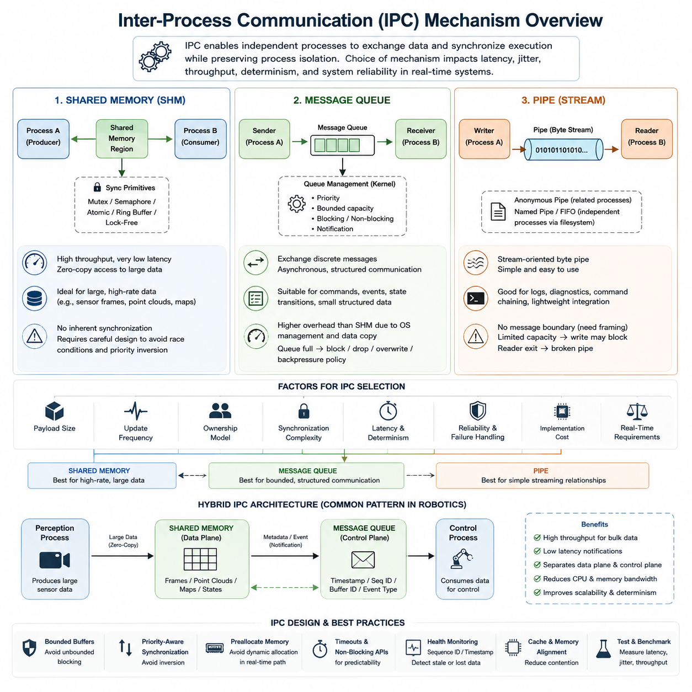
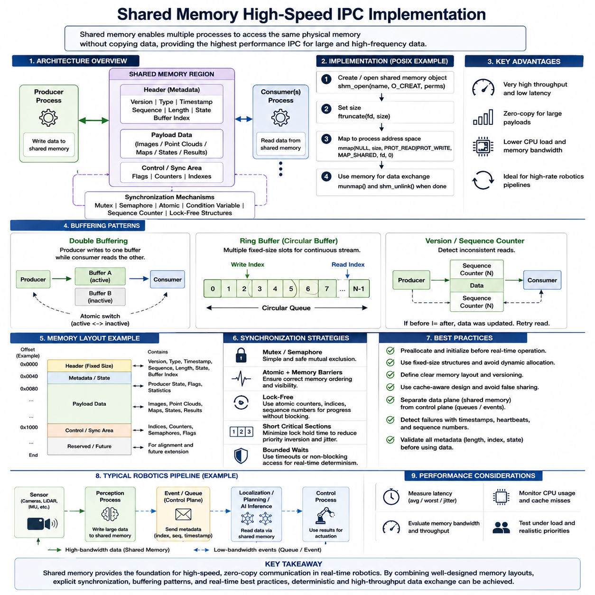
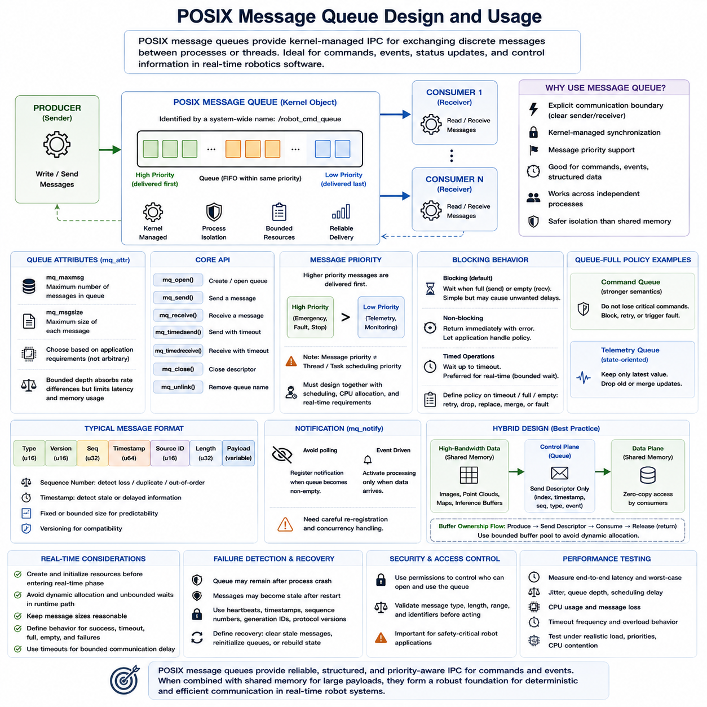
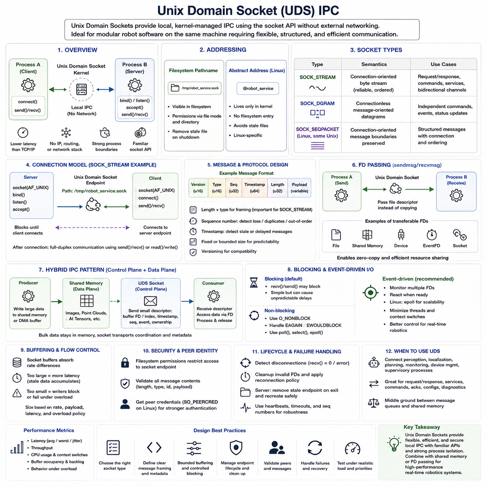
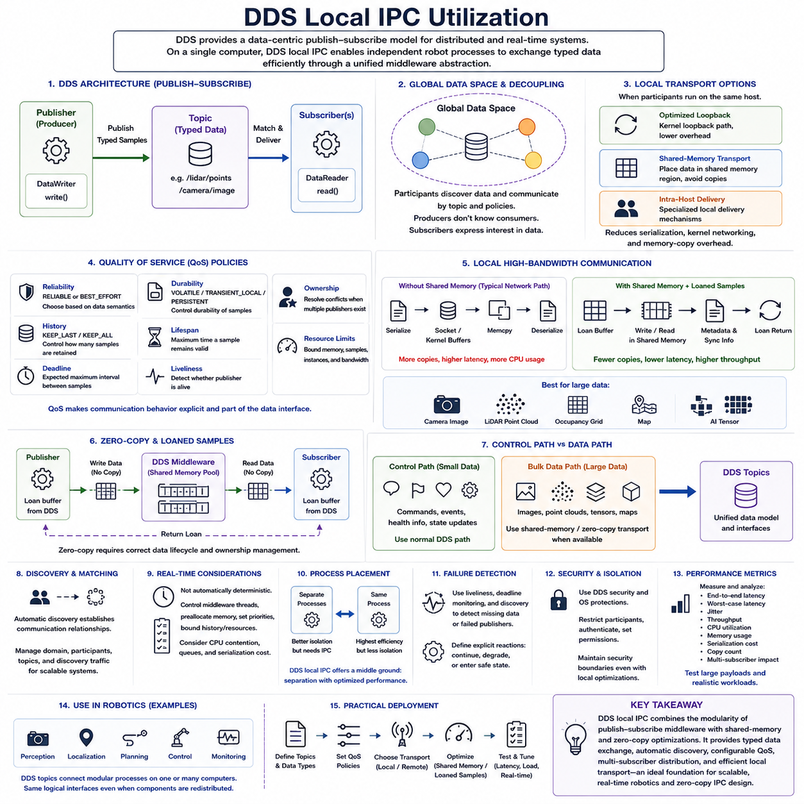
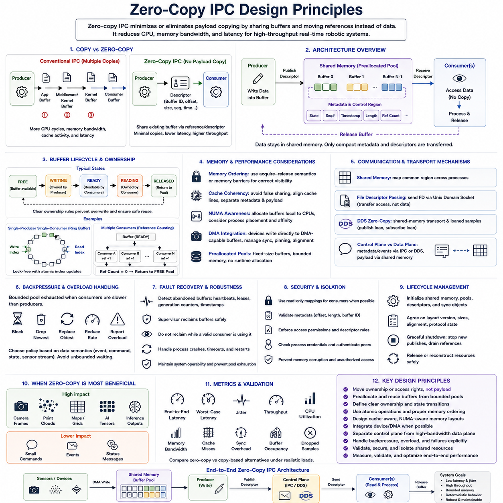
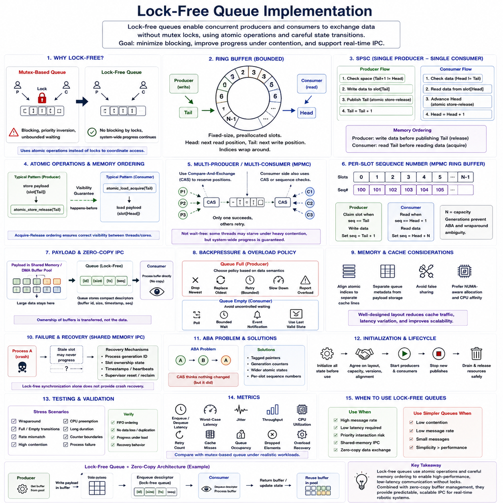
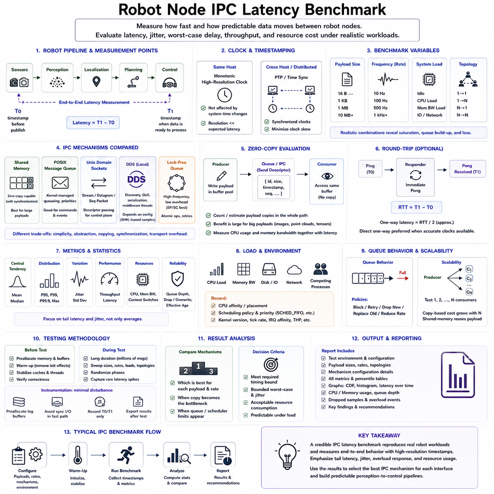
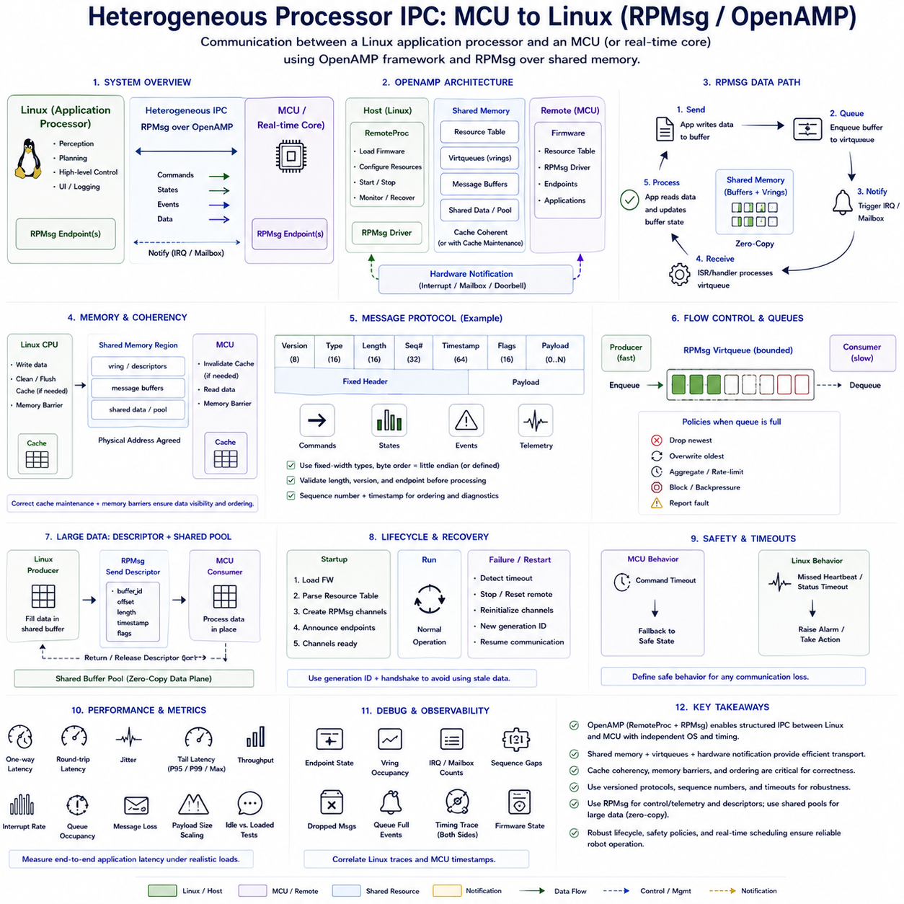
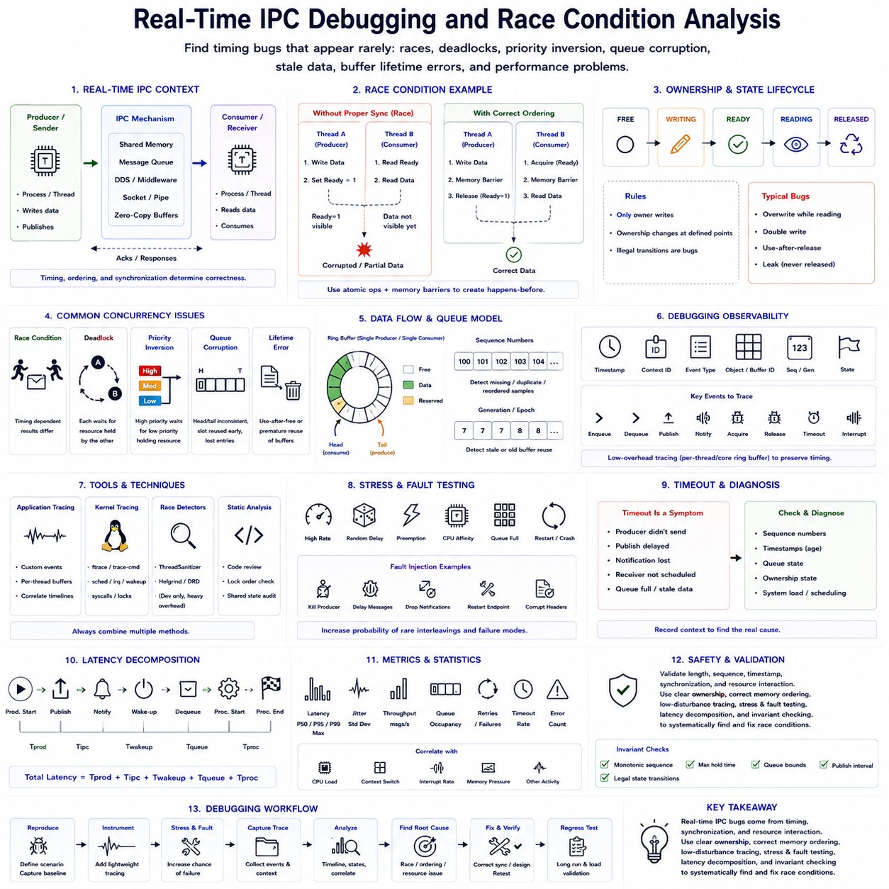

**Volume 03 Real Time Operating Systems**

# 06. Inter-Process Communication

## 06.01 IPC Mechanism Classification: SHM, MsgQueue, Pipe

{width="7.268055555555556in" height="7.268055555555556in"}

Inter-process communication (IPC) provides the mechanisms by which independent processes exchange data and coordinate execution while preserving process isolation. In a real-time operating environment, IPC is not merely a software convenience; it directly influences latency, jitter, memory consumption, scheduling behavior, and system determinism. Shared memory, message queues, and pipes represent three fundamental IPC models with different performance and synchronization characteristics.

Shared memory (SHM) establishes a memory region that multiple processes map into their own address spaces. Once the mapping has been created, processes can access the same physical data without repeatedly transferring it through the kernel. This makes shared memory particularly suitable for large or frequently updated datasets such as camera frames, LiDAR point clouds, localization states, occupancy maps, and high-rate robot telemetry.

The primary advantage of shared memory is its potential for extremely high throughput and low communication latency. Instead of copying a large buffer from one process to another, a producer can write directly into a shared region and allow consumers to access the resulting data. With carefully designed buffers and zero-copy techniques, this approach can substantially reduce CPU utilization and memory bandwidth compared with conventional message-oriented communication.

Shared memory does not inherently provide synchronization. If one process reads a data structure while another process modifies it, inconsistent states, race conditions, or corrupted data may result. Mutexes, semaphores, atomic operations, sequence counters, ring buffers, or lock-free algorithms are therefore commonly combined with shared memory. Real-time designs must ensure that these synchronization mechanisms do not introduce unbounded blocking or priority inversion.

Message queues provide a fundamentally different abstraction. Instead of exposing common memory directly, processes exchange discrete messages through an operating-system-managed queue. A sender places a message into the queue, while a receiver retrieves it independently. This preserves a clear ownership boundary between processes and naturally supports asynchronous producer-consumer relationships, making message queues easier to reason about than unrestricted shared memory.

POSIX message queues and similar RTOS mechanisms can support priorities, bounded queue depths, blocking or non-blocking operations, and notification mechanisms. These characteristics are useful when commands, events, state transitions, alarms, or relatively small structured data must be exchanged predictably. A robot controller, for example, may use queues to transfer motion commands, fault events, operating-mode requests, or supervisory control messages between processes.

Message queues normally incur more overhead than direct shared-memory access because the operating system manages queue metadata, scheduling interactions, and often data copies. Queue capacity also becomes an important architectural parameter. When producers generate messages faster than consumers process them, the queue can become full, forcing the system to block, discard data, overwrite information, or apply an explicitly designed backpressure policy.

Pipes provide a stream-oriented IPC mechanism in which data written at one endpoint becomes available for reading at another. Traditional anonymous pipes are commonly used between related processes, especially parent and child processes, while named pipes or FIFOs allow independently created processes to communicate through a filesystem-visible endpoint. Their simple byte-stream abstraction makes pipes useful for command chaining, logging, diagnostics, and lightweight process integration.

Unlike message queues, a pipe normally does not preserve application-level message boundaries. If several logical records are written into a byte stream, the receiving process must understand how those records are framed. Applications may therefore use fixed-length structures, delimiters, length headers, or serialization formats. Pipe capacity is also finite, so write operations can block when consumers fail to drain the stream sufficiently quickly.

The distinction among shared memory, message queues, and pipes can therefore be understood through their fundamental communication models. Shared memory exposes common data, message queues exchange discrete objects, and pipes transport sequential streams. Shared memory emphasizes throughput, message queues emphasize structured asynchronous communication, and pipes emphasize simplicity. None is universally superior because the appropriate mechanism depends on the timing and data characteristics of the application.

Data size and update frequency strongly influence IPC selection. High-bandwidth sensor information generally favors shared memory because repeated copying of multi-megabyte frames or point clouds can consume substantial memory bandwidth. Small control messages and events are often better represented by message queues. Sequential textual or binary streams, diagnostic output, subprocess communication, and simple producer-consumer flows can often be implemented efficiently with pipes.

Real-time requirements add another selection dimension. Average latency alone is insufficient because a mechanism that is usually fast but occasionally blocks for an unpredictable duration can violate a hard deadline. Designers must examine worst-case execution paths, synchronization contention, queue-full behavior, scheduler wakeups, memory allocation, page faults, and kernel transitions. Predictable bounded behavior is often more important than achieving the smallest possible average IPC latency.

Blocking semantics are especially important when IPC interacts with priority-based scheduling. A high-priority control process should not unexpectedly wait behind a low-priority producer holding a synchronization primitive. Similarly, a full message queue or pipe can indirectly suspend a critical task. Real-time systems therefore commonly combine bounded buffers, carefully selected timeout policies, priority-aware synchronization, preallocated memory, and non-blocking communication patterns.

Robot software frequently benefits from combining multiple IPC mechanisms rather than enforcing one mechanism throughout the system. A perception process may place large sensor results into shared memory while sending a small queue message containing a timestamp, sequence number, and buffer identifier. A control process can then receive the notification and access the corresponding shared data without transferring the complete payload through the queue.

This hybrid architecture separates the data plane from the control plane. Shared memory becomes the high-throughput data path, while queues or similar event mechanisms provide synchronization and notification. The approach is particularly valuable for robotics systems containing cameras, LiDAR, AI inference pipelines, localization, planning, and control processes because large payloads can remain in memory while compact metadata moves between computational stages.

Process isolation must nevertheless remain an architectural consideration. Shared memory improves performance partly by relaxing memory separation for selected regions, so incorrect pointers, buffer ownership errors, or synchronization defects can propagate between participating processes. Message queues and pipes generally provide stronger communication boundaries because processes exchange data through kernel-mediated interfaces rather than directly modifying common application memory.

IPC architecture must also account for failure behavior. If a producer crashes while updating shared memory, consumers require a method for identifying incomplete or stale data. If a message-queue consumer stops responding, messages may accumulate until capacity is exhausted. If the reader of a pipe disappears, the writer must detect the broken communication path. Sequence numbers, timestamps, health monitoring, timeouts, and explicit recovery policies are therefore important components of robust IPC.

In multi-core robot computers, IPC performance is additionally influenced by cache behavior and memory locality. Shared-memory communication can suffer from cache-line contention and coherency traffic when several cores repeatedly modify the same region. Proper buffer ownership, alignment, double buffering, ring-buffer organization, and separation of frequently modified metadata can reduce these effects while improving both throughput and timing predictability.

The IPC mechanism should ultimately be selected according to payload size, communication frequency, ownership model, synchronization complexity, latency requirements, determinism, reliability, and implementation cost. Shared memory is generally strongest for high-rate bulk data, message queues for bounded structured communication, and pipes for straightforward streaming relationships. These mechanisms form the foundation for the more specialized IPC designs developed later in the chapter.

## 06.02 Shared Memory High-Speed IPC Implementation [w/Code]

{width="7.268055555555556in" height="7.268055555555556in"}

Shared memory is one of the highest-performance inter-process communication mechanisms because multiple processes can access the same physical memory region without repeatedly copying payload data through kernel-managed communication channels. In robotics and real-time systems, this property is particularly valuable when large sensor frames, point clouds, maps, state vectors, or inference results must move between software components at high frequency.

A typical shared-memory architecture contains a producer process, a shared memory region, and one or more consumer processes. The producer creates or opens a shared-memory object, defines its required size, and maps it into its virtual address space. Consumers independently open the same object and map the corresponding region, allowing different virtual addresses to reference the same underlying physical memory pages.

On POSIX-based systems, shared memory can be implemented with facilities such as shm_open() and mmap(). The shared-memory object is normally created with an identifier, resized to the required capacity, and mapped with appropriate read and write permissions. After mapping, processes communicate by manipulating memory rather than issuing a kernel communication operation for every payload transfer, significantly reducing communication overhead.

The performance advantage becomes especially important for large payloads. If a camera produces multi-megabyte images at tens of frames per second, conventional IPC may repeatedly copy those frames between process buffers. Shared memory allows the producer to place the frame directly into a predefined buffer while consumers access the same stored representation, reducing CPU load, memory traffic, and end-to-end processing latency.

However, shared memory provides data accessibility rather than communication coordination. The operating system does not automatically guarantee that a consumer reads a complete frame or that two processes avoid modifying the same structure simultaneously. Synchronization must therefore be designed explicitly using mutexes, semaphores, condition variables, atomic variables, sequence counters, or specialized lock-free structures according to the timing requirements of the system.

A simple producer-consumer design may use a synchronization flag indicating whether a buffer contains valid data. The producer writes the payload first and then publishes its availability, while the consumer waits for or observes the publication before reading. Correct memory ordering is essential because modern CPUs and compilers may reorder operations unless suitable atomic operations, memory barriers, or synchronization primitives establish the required visibility guarantees.

Double buffering improves concurrency by providing two data areas rather than forcing the producer and consumer to operate on one buffer. While the consumer processes the current buffer, the producer can fill the alternate buffer. After writing is complete, the active buffer reference is switched atomically. This pattern is widely applicable to image processing, localization outputs, trajectory information, and other periodic robotics workloads.

Ring buffers extend this idea by maintaining multiple fixed-size slots organized as a circular data structure. Producer and consumer indices identify where data should be written and read, enabling continuous streams to be handled without repeated memory allocation. Ring buffers are particularly effective for telemetry, sensor packets, control-state histories, and high-frequency measurements where predictable memory usage and sustained throughput are important.

Real-time implementations should normally allocate and initialize shared-memory resources before entering the critical execution phase. Creating mappings, resizing objects, dynamically allocating buffers, or triggering page faults inside a periodic control loop can introduce unpredictable latency. Memory locking, pre-touching pages, fixed-size structures, and preallocated buffers can help ensure that memory-related operating-system activity does not disturb deadline-sensitive execution.

Synchronization strategy has a major influence on determinism. A conventional mutex can provide simple and safe mutual exclusion, but a high-priority task may block when another process holds the lock. Priority inversion and unbounded waiting become important concerns in real-time systems. Short critical sections, priority-aware synchronization, bounded waits, non-blocking access, or carefully designed lock-free algorithms can reduce these risks.

Lock-free shared-memory communication commonly relies on atomic counters, ownership states, sequence numbers, or producer-consumer indices instead of mutex ownership. The objective is not simply to eliminate locks but to guarantee progress while minimizing unpredictable blocking. Such designs require careful treatment of memory ordering, wraparound conditions, stale data, concurrent access, and cache coherency, making correctness verification essential.

Sequence counters provide a useful method for detecting inconsistent reads. A producer can update a sequence value before and after modifying shared data, while a consumer verifies that the sequence remained valid throughout its read operation. If the value indicates that an update occurred concurrently, the consumer retries or discards the sample. This approach is useful when readers must remain lightweight and occasional retries are acceptable.

Shared-memory layouts should be explicitly defined rather than treated as arbitrary collections of pointers. A structured header can contain a version identifier, payload type, timestamp, sequence number, valid length, producer state, and buffer index. The payload then occupies a predetermined region. This organization improves interoperability, debugging, validation, and compatibility when independently developed robot processes exchange data through the same memory object.

Raw pointers should generally not be stored as portable references inside shared memory because each process may map the region at a different virtual address. Offsets from the beginning of the shared region, fixed-layout structures, indices, or explicitly defined descriptors are safer representations. The layout must also consider structure padding, alignment, data types, architecture differences, and version compatibility between participating processes.

Cache behavior becomes increasingly important on multi-core processors. When producer and consumer cores repeatedly modify variables located within the same cache line, false sharing can generate unnecessary cache-coherency traffic and increase latency variation. Aligning frequently modified counters, separating producer and consumer metadata, and assigning clear ownership of cache lines can substantially improve both throughput and timing stability.

A high-speed robotics pipeline can separate large payload transport from event notification. For example, a perception process may place a camera frame or point cloud into shared memory and then send only a small notification containing the buffer index, timestamp, and sequence number through a message queue or event mechanism. The receiving process obtains the metadata and accesses the large payload without another full data copy.

This separation forms a practical data-plane and control-plane architecture. Shared memory serves as the data plane for high-bandwidth information, while message queues, semaphores, event descriptors, or similar mechanisms provide the control plane for synchronization and notification. Such hybrid IPC designs are suitable for perception, localization, mapping, planning, AI inference, and control pipelines running on a common robot computer.

Failure handling must be incorporated into the shared-memory protocol. A producer can terminate while a buffer is being updated, leaving consumers with incomplete information. Timestamps, sequence numbers, validity states, heartbeats, and ownership metadata can allow consumers to detect stale or abandoned data. Recovery procedures should define whether buffers are discarded, reinitialized, reused, or reconstructed when a participating process restarts.

Resource lifecycle management is equally important. Processes must define which component creates the shared-memory object, which components attach to it, how initialization is coordinated, and when the object is removed. Version mismatches or stale objects remaining after abnormal termination can otherwise cause subtle failures. Explicit initialization signatures and protocol versions help participating processes confirm that the mapped structure is compatible.

Security and protection requirements should not be ignored merely because communication occurs locally. Shared-memory permissions should restrict access to authorized processes, and consumers should validate lengths, indices, states, and metadata before using shared contents. A corrupted or compromised process with write access can affect every participant sharing the region, making access control and defensive validation important in safety-sensitive robot software.

Performance evaluation should measure more than peak throughput. Useful metrics include producer-to-consumer latency, worst-case latency, jitter, CPU utilization, memory bandwidth, cache misses, synchronization contention, dropped samples, and behavior under overload. Measurements should be performed with realistic payload sizes and process priorities because small synthetic transfers may not expose the memory and scheduling effects encountered in operational robotics workloads.

A robust high-speed shared-memory IPC implementation therefore combines mapped common memory with deterministic buffer ownership, explicit synchronization, fixed memory layouts, preallocation, cache-aware organization, failure detection, and bounded timing behavior. When these principles are applied correctly, shared memory provides an efficient foundation for high-bandwidth communication between tightly coupled real-time robotics processes and prepares the architecture for zero-copy and lock-free IPC techniques developed later in the chapter.

## 06.03 POSIX Message Queue Design and Usage [w/Code]

{width="7.268055555555556in" height="7.268055555555556in"}

POSIX message queues provide a kernel-managed inter-process communication mechanism for exchanging discrete messages between processes or threads. Unlike shared memory, where participants directly access a common memory region, message queues establish an explicit communication boundary between senders and receivers. This model is well suited to commands, events, status updates, and structured control information in real-time robotics software.

A POSIX message queue is identified by a system-wide queue name and exists independently of the virtual address spaces of communicating processes. A producer opens the queue and sends messages, while one or more consumers open the same queue and retrieve them. Because communication occurs through a kernel object, processes do not need shared pointers or identical memory mappings, simplifying ownership and isolation between software components.

The fundamental POSIX interface revolves around operations such as mq_open(), mq_send(), mq_receive(), mq_close(), and mq_unlink(). mq_open() creates or accesses a named queue, while queue attributes define characteristics such as the maximum number of stored messages and maximum message size. Once communication is complete, processes close their descriptors, and mq_unlink() removes the queue name when the communication resource is no longer required.

Queue attributes should be determined from application requirements rather than selected arbitrarily. The maximum message size should accommodate the largest expected command or data structure without encouraging unnecessarily large transfers. Queue depth must absorb temporary differences between producer and consumer rates while remaining bounded. Excessively deep queues consume memory and may allow obsolete commands to accumulate, increasing effective control latency.

Each POSIX message can carry an associated priority value. When multiple messages are pending, higher-priority messages can be delivered before lower-priority messages, while messages with equal priority follow queue ordering rules. This capability can be useful in robot systems where emergency events, fault notifications, stop commands, or safety-related state changes should be processed before ordinary telemetry or supervisory requests.

Message priority must nevertheless be distinguished from operating-system task priority. Assigning a high priority to a queue message does not automatically raise the scheduling priority of the receiving process. A safety-critical message may therefore remain unprocessed if the receiver cannot obtain CPU time promptly. Queue priority, thread scheduling policy, CPU allocation, and end-to-end response-time requirements must be designed together.

POSIX message queues support both blocking and non-blocking operation. In blocking mode, a sender may wait when the queue is full, while a receiver may wait when no messages are available. This behavior simplifies producer-consumer synchronization but can introduce undesirable delays into real-time tasks. Non-blocking operation allows the application to detect these conditions immediately and execute an explicit overload or retry policy.

Timed operations provide an intermediate approach. Functions such as mq_timedsend() and mq_timedreceive() allow a process to wait only until a specified timeout rather than indefinitely. In real-time software, bounded waiting is generally preferable to uncontrolled blocking because the maximum communication delay becomes part of the system timing model. Timeout handling must define whether data is retried, discarded, replaced, or treated as a fault.

Queue-full behavior is one of the most important design decisions. If a producer generates information faster than the consumer can process it, simply waiting indefinitely can propagate blocking into upstream real-time tasks. Depending on the semantics, the system may reject new messages, discard older information, merge updates, reduce the producer rate, or trigger a fault. The correct policy depends on whether every message or only the newest state matters.

For example, command queues usually require stronger delivery semantics than telemetry queues. Losing a motion-mode transition or actuator command may be unacceptable, whereas retaining hundreds of obsolete localization or diagnostic updates may provide little value. State-oriented communication can sometimes favor a latest-value model, while event-oriented communication may require every occurrence to be preserved and processed in sequence.

Message structures should remain explicit, fixed, and versioned. A typical message may contain a message type, protocol version, sequence number, timestamp, source identifier, payload length, and payload. Fixed-size or bounded structures improve predictability because memory requirements and copy costs can be estimated before execution. Dynamic allocation and variable-length serialization inside critical communication paths can introduce additional timing uncertainty.

Sequence numbers and timestamps strengthen queue-based protocols by allowing receivers to identify missing, duplicated, delayed, or stale information. A consumer can compare the current sequence number with the previous value and verify that the message age remains within an acceptable interval. This is particularly useful in distributed robot software where receiving a syntactically valid message does not necessarily mean that the information is still operationally useful.

Notification mechanisms can reduce the need for continuous polling. POSIX provides mq_notify(), which allows a process to request notification when a previously empty queue receives a message. Event-driven designs can therefore activate processing when data becomes available instead of repeatedly checking the queue. Careful re-registration and concurrency handling are required because notification behavior must remain consistent when messages arrive rapidly.

Although message queues simplify synchronization, they introduce kernel transitions and data-copy overhead compared with direct shared-memory access. For small commands and events this cost is usually acceptable and can be outweighed by clearer ownership and isolation. For multi-megabyte images, point clouds, or tensors, repeatedly copying the entire payload through a message queue can become inefficient and consume significant CPU time and memory bandwidth.

Robotics architectures therefore frequently combine POSIX message queues with shared memory. Large camera frames, LiDAR scans, maps, or AI inference buffers can remain in shared memory, while the queue carries compact descriptors containing a buffer index, timestamp, sequence number, payload type, or completion event. The message queue then operates as the control plane while shared memory provides the high-bandwidth data plane.

This hybrid pattern also improves buffer ownership management. A producer can write into an available shared-memory slot and send a descriptor indicating that the slot is ready. A consumer receives the descriptor, processes the corresponding payload, and subsequently returns or releases the buffer through another message or ownership state. With bounded buffer pools, the complete communication path can operate without dynamic memory allocation.

Real-time implementation should consider queue creation and initialization separately from time-critical operation. Queue objects, message buffers, process priorities, and memory resources should preferably be prepared before periodic control begins. Runtime paths should avoid unnecessary allocation, unbounded waits, excessive message sizes, and unpredictable error recovery. Every queue operation should have defined behavior for success, timeout, full, empty, and process failure conditions.

Failure detection must extend beyond individual API return values. A queue can remain present even when a producer or consumer has terminated, and accumulated messages may become obsolete after process restart. Heartbeats, timestamps, generation identifiers, protocol versions, and startup handshakes can help determine whether communication peers and queued information remain valid. Recovery procedures should explicitly define how stale queues and messages are cleared.

Permissions and access control are also part of queue design. Because POSIX queues are named operating-system resources, creation modes and process credentials determine which processes can open and manipulate them. Robot software should grant only the required read or write access and validate incoming message types, lengths, ranges, and identifiers before acting on them, particularly when queue contents can influence motion or safety behavior.

Performance testing should evaluate end-to-end behavior rather than isolated mq_send() execution time. Relevant measurements include send-to-receive latency, worst-case latency, jitter, queue occupancy, scheduling delay, CPU utilization, message loss, timeout frequency, and behavior during overload. Tests should reproduce realistic producer rates, consumer priorities, message sizes, CPU contention, and system load to reveal timing problems hidden by simple benchmarks.

A well-designed POSIX message queue architecture therefore combines bounded queues, clearly defined message formats, appropriate message priorities, controlled blocking behavior, timeout policies, lifecycle management, and failure detection. It is particularly effective for structured command and event communication, while shared memory remains preferable for high-bandwidth payload transport. Together, these mechanisms provide a practical foundation for deterministic IPC in real-time robot systems.

## 06.04 Unix Domain Socket IPC [w/Code]

{width="7.268055555555556in" height="7.268055555555556in"}

Unix Domain Sockets (UDS) provide a local inter-process communication mechanism that uses the familiar socket programming model without transmitting data through an external network. Processes running on the same operating system can establish bidirectional communication through kernel-managed endpoints. This makes UDS useful for modular robot software requiring structured, flexible communication among independently managed processes.

Unlike TCP/IP sockets, Unix Domain Sockets do not require IP addresses, network interfaces, routing, or physical network transmission. Communication remains inside the local kernel, avoiding much of the protocol processing associated with network communication. Applications can therefore retain socket-style APIs while obtaining lower overhead and latency for communication between processes located on the same robot computer.

A Unix Domain Socket is created with the socket() interface using the AF_UNIX or AF_LOCAL address family. Depending on the required communication semantics, applications can select SOCK_STREAM, SOCK_DGRAM, or, where supported, SOCK_SEQPACKET. The resulting file descriptor can then be used with standard socket operations, allowing developers familiar with conventional network programming to apply similar design patterns to local IPC.

SOCK_STREAM provides a reliable connection-oriented byte stream comparable in programming style to TCP. A server creates a socket, associates it with a local endpoint using bind(), waits for connections using listen(), and accepts clients through accept(). A client connects to the endpoint using connect(). Once connected, both processes can exchange data using send(), recv(), read(), write(), or related system calls.

Because SOCK_STREAM represents a byte stream, application message boundaries are not automatically preserved. A single send() operation does not necessarily correspond to a single recv() operation. Structured protocols therefore require framing mechanisms such as fixed-size records, delimiters, or a header containing the payload length and message type. Robust receivers must handle partial reads, combined messages, disconnections, and interrupted system calls correctly.

SOCK_DGRAM provides message-oriented communication in which individual datagram boundaries are preserved. This simplifies applications that exchange independent commands, status information, or small events because the receiver obtains discrete packets rather than an arbitrary byte stream. Datagram communication does not require the same persistent connection model as stream sockets, although reliability and buffering semantics must still be considered carefully.

SOCK_SEQPACKET combines useful properties of stream and datagram communication where the platform supports it. It provides connection-oriented communication while preserving message boundaries and maintaining message ordering. This can be attractive for robotics IPC because structured messages can remain discrete while communication retains a persistent peer relationship, reducing the framing complexity associated with conventional stream sockets.

Unix Domain Socket endpoints are commonly represented by filesystem pathnames. A server binds its socket to a path, and clients use that path to locate the service. The pathname therefore becomes part of the local service interface. The server must manage creation and removal carefully because a stale socket file remaining after abnormal termination can prevent subsequent instances from binding to the same endpoint.

Linux also supports abstract Unix Domain Socket addresses that exist within the kernel rather than as ordinary filesystem entries. These avoid stale pathname files and automatic filesystem cleanup concerns, although they are Linux-specific and therefore less portable than pathname-based sockets. The endpoint addressing method should consequently be selected according to portability, lifecycle, access-control, and deployment requirements.

Filesystem-based sockets provide a useful security property because ordinary filesystem permissions can restrict which users or processes can access the endpoint. Directory ownership and permission settings can therefore become part of the IPC security model. Applications should nevertheless validate all incoming message lengths, types, identifiers, and payload contents rather than assuming that local communication is inherently trustworthy.

Unix Domain Sockets can also support transfer of operating-system resources between processes. On Unix-like systems, ancillary data mechanisms associated with sendmsg() and recvmsg() can transfer file descriptors through a socket. Instead of copying an underlying resource, one process can grant another process access to an already opened file, shared-memory object, device, or other descriptor-based resource.

File-descriptor passing enables powerful zero-copy-oriented architectures. For example, a producer can allocate or obtain a large buffer and pass a descriptor representing that resource to another process while sending only small control metadata through the socket. The consumer can then access the underlying buffer without requiring the complete payload to be serialized and copied through the UDS communication channel.

This capability makes Unix Domain Sockets useful as a control-plane mechanism for shared-memory or DMA-oriented data pipelines. Large camera images, LiDAR point clouds, AI tensors, or other high-bandwidth data can remain in dedicated buffers, while the socket transports descriptors, timestamps, sequence numbers, ownership transitions, and processing events. The architecture separates bulk data movement from coordination traffic.

Blocking behavior must be considered carefully in real-time applications. A blocking recv() can suspend a process until data arrives, while send() may eventually block if socket buffers become full. Although blocking APIs are convenient, uncontrolled waiting can violate timing requirements. Non-blocking mode, bounded timeouts, poll(), select(), or epoll-based event processing can provide more explicit control over communication timing.

Event-driven operation becomes particularly valuable when one process manages multiple local connections. Instead of dedicating a thread to every socket, an application can monitor many file descriptors and react only when communication becomes ready. On Linux, epoll is commonly used for scalable event notification. However, real-time designs must still account for scheduling delays, callback workload, queue buildup, and worst-case processing time.

Socket buffer capacity influences both throughput and latency. Large buffers can absorb temporary producer-consumer rate differences, but excessive buffering can allow old information to accumulate and increase effective latency. Small buffers reduce backlog but may cause writers to block or fail sooner during overload. Buffer sizing should therefore reflect message rate, payload size, acceptable latency, and overload policy rather than maximizing capacity blindly.

Communication protocols should include explicit metadata such as protocol version, message type, sequence number, timestamp, payload length, and source or destination identifier where appropriate. These fields allow processes to detect incompatible versions, malformed data, missing messages, stale information, and unexpected communication states. Fixed or bounded message formats are particularly useful when deterministic timing is important.

Connection lifecycle management is another major design consideration. A server may terminate, restart, or become temporarily unavailable while clients continue running. Clients should detect broken connections, close invalid descriptors, and apply a defined reconnection policy. Servers should handle disconnected clients without leaking resources and should clean or recreate endpoints safely during restart and abnormal recovery.

Peer identity can also be important when local processes control sensitive robot functions. Unix Domain Socket facilities can provide information about credentials associated with communicating peers on supported systems. Combined with filesystem permissions and application-level authorization, this enables stronger verification of which process is issuing commands than relying solely on an endpoint pathname or message content.

In a robotics computer, UDS can connect perception, localization, planning, monitoring, device-management, and supervisory processes that require more flexible communication than a simple queue. Its bidirectional connection model is especially useful for request-response protocols, service interfaces, command channels, acknowledgments, configuration exchange, diagnostics, and process management within a single Linux-based platform.

For very large continuous payloads, direct shared memory can still provide better efficiency because transmitting data through a socket normally involves kernel buffering and copying. Conversely, shared memory requires more explicit synchronization and ownership management. Unix Domain Sockets occupy a useful middle ground by providing strong process boundaries, flexible communication semantics, familiar APIs, and relatively efficient local transport.

Performance evaluation should measure send-to-receive latency, worst-case latency, jitter, throughput, CPU utilization, context switches, socket-buffer occupancy, message backlog, and behavior under overload. Tests should also include realistic process priorities and CPU contention. Average latency measured under an idle system may provide little information about whether the IPC path can satisfy deadlines during actual robot operation.

A robust Unix Domain Socket IPC design therefore combines appropriate socket semantics, explicit message framing, bounded buffering, controlled blocking, endpoint lifecycle management, peer validation, failure recovery, and realistic latency testing. When combined with shared memory or descriptor passing for large data, UDS can form an efficient local control plane connecting modular real-time and robotics processes while preserving clear process isolation.

## 06.05 DDS Local IPC Utilization

{width="7.268055555555556in" height="7.268055555555556in"}

Data Distribution Service (DDS) provides a data-centric publish-subscribe communication model designed for distributed and real-time systems. Although DDS is commonly associated with communication across networks, the same abstraction can be used efficiently between processes running on a single computer. In robotics platforms, DDS local IPC enables independently developed perception, localization, planning, control, and monitoring components to exchange typed data through a unified middleware model.

The fundamental DDS architecture consists of publishers, subscribers, topics, data writers, and data readers. A producer publishes typed samples through a DataWriter associated with a Topic, while consumers receive matching samples through DataReaders. Applications communicate according to the data model rather than directly addressing another process, which reduces coupling and allows components to be added, removed, or reorganized without redesigning every communication path.

DDS uses a Global Data Space concept in which participants discover available data and exchange information according to topic definitions and communication policies. From the application perspective, a publisher does not need to know exactly which process consumes its samples. Similarly, a subscriber expresses interest in particular data. This decoupling is useful for modular robot software in which multiple processes may consume the same sensor, state, or diagnostic information.

When DDS participants execute on the same host, middleware implementations can use local transport mechanisms instead of treating every sample as ordinary network traffic. The exact mechanism depends on the DDS implementation and configuration. Local communication may use optimized loopback paths, shared-memory transport, or specialized intra-host delivery mechanisms, reducing serialization, kernel networking, and memory-copy overhead compared with conventional network transmission.

Shared-memory transport is particularly important for high-bandwidth local DDS communication. Instead of serializing a large sample and repeatedly moving it through socket and kernel buffers, the middleware can place data in a memory region accessible to communicating participants. Metadata and synchronization information coordinate access to the sample, allowing DDS to preserve its publish-subscribe semantics while approaching the performance characteristics of direct shared-memory IPC.

This approach is attractive for robotics workloads containing camera images, LiDAR point clouds, occupancy grids, maps, and AI inference results. Such data can be substantially larger than ordinary command messages, and multiple subscribers may require the same sample. An optimized DDS local path can reduce repeated payload copies while still allowing the middleware to manage discovery, topic matching, delivery policy, and subscriber relationships.

DDS Quality of Service (QoS) policies distinguish DDS local IPC from simpler communication mechanisms. Reliability, durability, history, deadline, lifespan, liveliness, ownership, and resource limits can be configured according to application requirements. Communication behavior is therefore part of the data interface rather than being implemented independently by every producer and consumer, providing a systematic way to express real-time and reliability requirements.

Reliability determines whether communication emphasizes guaranteed delivery or lower-overhead best-effort behavior. Critical state transitions or commands may require reliable delivery, whereas high-rate sensor streams may tolerate occasional sample loss when the newest data is more important than retransmitting an obsolete sample. Selecting reliability according to data semantics prevents unnecessary communication work and reduces the risk of old information accumulating in real-time pipelines.

History and resource-limit policies determine how many samples are retained and how much middleware memory may be consumed. KEEP_LAST with a small history depth is often appropriate for continuously updated robot states because consumers generally need recent information rather than a long backlog. Excessive history can increase memory usage and effective latency, while insufficient buffering may cause samples to be overwritten before slower consumers process them.

The deadline policy expresses the expected maximum interval between successive samples, while liveliness can indicate whether a publisher remains operational. These concepts are valuable for robot supervision because communication middleware can help detect missing periodic updates or failed data producers. A controller or monitoring process can therefore react when localization, perception, sensor, or planning information stops arriving within its expected timing constraints.

DDS discovery automatically establishes communication relationships between compatible participants. This reduces the need to manually create separate socket connections or queue endpoints for every process pair. However, discovery itself introduces configuration and runtime considerations. Large systems must control participant counts, topic organization, discovery traffic, initialization timing, and domain configuration to prevent unnecessary communication and startup complexity.

Local IPC performance also depends on serialization. Strongly typed DDS data is commonly represented through defined interfaces, and middleware may serialize samples for transport. For small messages, serialization overhead may be insignificant, but for large high-frequency data it can become important. Shared-memory and loaned-sample mechanisms can reduce copying and, depending on the implementation, avoid portions of the conventional serialization path.

Loaned samples allow applications to operate on middleware-managed buffers rather than allocating and copying their own temporary payloads. A publisher can obtain a buffer, populate it, and return it to the middleware for publication. A subscriber can similarly access received data through managed memory. When combined with compatible shared-memory transport, this concept supports zero-copy-oriented communication while maintaining DDS-level data semantics.

Zero-copy DDS requires stricter data-lifecycle discipline than ordinary copied communication. A buffer cannot be freely modified while another participant may still be reading it, and ownership transitions must be managed correctly. Middleware implementations therefore coordinate buffer pools, sample states, references, and release operations. Applications must follow the implementation\'s loan and return rules to prevent corruption, resource exhaustion, or unpredictable behavior.

DDS local communication should therefore distinguish between a control path and a bulk-data path. Small commands, events, health information, and state updates can use conventional DDS delivery with relatively little concern about copying. Large images, point clouds, or tensors can use shared-memory or zero-copy-capable transport when supported. Both paths remain represented through DDS topics, preserving a consistent application-level communication architecture.

This unified abstraction is especially useful in ROS 2 systems because DDS commonly provides the underlying middleware communication layer. Robot nodes can use topic-based communication while the selected ROS 2 middleware implementation determines how local and remote transport is performed. A system can therefore retain similar logical interfaces even when nodes are redistributed between processes, CPUs, or computers, although actual transport behavior and performance may change.

Local DDS communication is not automatically deterministic simply because processes execute on the same computer. Middleware threads, memory allocation, discovery activity, synchronization, serialization, scheduler priorities, CPU contention, and queue buildup can all introduce latency variation. Real-time deployments must configure middleware resources, preallocate memory where possible, control thread priorities, and bound communication histories and resource usage.

Process placement must also be considered. Separating robot functions into different processes improves fault isolation and modular deployment but requires IPC between those processes. Combining components within one process may enable even more efficient intra-process communication but reduces some isolation benefits. DDS local IPC provides an intermediate architecture in which processes remain separated while middleware optimizations reduce the cost of crossing process boundaries.

Failure behavior benefits from DDS concepts such as liveliness, deadline monitoring, and participant discovery. When a publishing process disappears, subscribers can detect communication changes rather than relying exclusively on application-specific heartbeat protocols. Nevertheless, safety-critical software should define explicit reactions to missing or stale data because middleware detection alone does not determine whether the robot should continue operation, degrade functionality, or enter a safe state.

Security and isolation remain relevant for local DDS deployments. Processes sharing a computer should not automatically be considered equally trusted, particularly when communication can affect robot motion. DDS security mechanisms and operating-system protections can restrict participation, authentication, permissions, and data access. Local transport optimizations must preserve the intended security boundary rather than bypassing authorization for performance.

Performance evaluation should compare the actual transport configurations used by the target DDS implementation. Measurements should include end-to-end latency, worst-case latency, jitter, throughput, CPU utilization, memory consumption, serialization cost, copy count, and behavior with multiple subscribers. Large payload tests are especially important because the advantage of shared-memory or zero-copy transport becomes more visible as sample size and publication frequency increase.

A practical robot architecture can therefore use DDS as the common communication abstraction while selecting transport according to data characteristics. Low-bandwidth commands and events can follow conventional middleware paths, while high-bandwidth local data can exploit shared-memory and loaned-sample capabilities. Remote subscribers can continue using network transport, allowing the logical topic interface to remain stable even when deployment topology changes.

DDS local IPC ultimately combines the modularity of publish-subscribe middleware with optimization techniques traditionally associated with high-speed shared memory. Its main value is not simply replacing sockets or queues, but providing typed data exchange, automatic discovery, configurable QoS, multi-subscriber distribution, and optimized local transport within one communication framework. This makes DDS an important IPC foundation for scalable real-time robotics and prepares the architecture for dedicated zero-copy IPC design.

## 06.06 Zero-Copy IPC Design Principles [w/Code]

{width="7.268055555555556in" height="7.268055555555556in"}

Zero-copy IPC is a communication design approach that minimizes or eliminates payload copying between producers, communication middleware, kernel buffers, and consumers. Instead of repeatedly duplicating large data objects, processes exchange references, descriptors, or ownership information that identifies an existing buffer. This approach is especially valuable in real-time robotics where cameras, LiDAR, AI tensors, maps, and sensor streams can generate large volumes of data at high frequency.

Conventional IPC frequently introduces multiple copy operations along the communication path. A producer may create data in an application buffer, copy it into a middleware or kernel buffer, and then cause another copy into the consumer address space. Each copy consumes CPU cycles and memory bandwidth, increases cache activity, and adds latency. For large high-rate payloads, memory movement itself can become a major performance bottleneck even when computation is relatively efficient.

The fundamental zero-copy principle is therefore to move ownership or access rights instead of moving the payload. A producer obtains a buffer from a predefined memory pool, writes the data into that buffer, and publishes a descriptor identifying the completed sample. The consumer receives the descriptor and accesses the same underlying memory. When processing is finished, the buffer is released and returned to the pool for controlled reuse.

Shared memory provides a natural foundation for zero-copy communication between processes on the same computer. Multiple processes can map a common memory region while maintaining separate virtual address spaces. Large payloads remain in shared physical memory, while compact metadata such as buffer identifiers, offsets, sequence numbers, timestamps, lengths, and state flags coordinates access. This separates expensive data movement from lightweight communication control.

A robust zero-copy architecture normally uses preallocated buffer pools rather than allocating memory dynamically for every sample. The pool contains a bounded number of fixed-size or predefined buffers that circulate among producers and consumers. Preallocation reduces allocation overhead, memory fragmentation, and runtime unpredictability. It also establishes an explicit upper bound on memory consumption, which is important for deterministic real-time behavior.

Buffer ownership is one of the most important zero-copy design concepts. At any moment, the architecture should clearly define which component may modify a buffer and which components may only read it. A common lifecycle consists of FREE, WRITING, READY, READING, and RELEASED states. Ownership transitions must occur through controlled synchronization so that a producer never overwrites data that a consumer is still processing.

Single-producer single-consumer communication can often use relatively simple ownership rules. The producer advances a write index while the consumer independently advances a read index through a ring buffer. Atomic index updates and suitable memory-ordering guarantees can provide lock-free communication without conventional mutexes. The design becomes more complex when multiple producers or multiple consumers concurrently access the same buffer pool.

Multi-consumer zero-copy distribution requires a method for determining when a shared sample can safely be reused. Reference counting is one possible technique: each active consumer contributes to a reference count, and the buffer returns to the free pool only after all references have been released. Other designs use subscriber masks, ownership tokens, epochs, or middleware-managed loans. The mechanism must prevent premature reuse while avoiding buffers becoming permanently unavailable.

Memory ordering is critical because zero-copy communication exposes data written by one CPU core directly to another. The producer must complete payload writes before publishing the buffer as ready, and the consumer must observe the ready state before reading the payload. Atomic operations with appropriate acquire-release semantics, memory barriers, or synchronization primitives are required to establish this ordering reliably on modern multi-core processors.

Cache coherency can significantly affect zero-copy performance. Eliminating memcpy() does not eliminate memory-system traffic because cache lines may still move between processor cores. False sharing occurs when frequently modified metadata from different processes occupies the same cache line, causing unnecessary coherency transactions. Cache-line alignment, separation of producer and consumer counters, and stable ownership of payload regions can reduce this effect.

NUMA architecture introduces another consideration on larger multi-socket computers. Accessing memory attached to a remote NUMA node can have higher latency and lower effective bandwidth than accessing local memory. Buffer pools should therefore be allocated with awareness of CPU affinity, process placement, device locality, and expected data flow. Zero-copy design should optimize where memory resides, not merely whether explicit copies occur.

DMA-capable devices extend zero-copy principles beyond CPU-to-CPU communication. Cameras, network interfaces, accelerators, and other devices may place data directly into DMA-accessible buffers. If those buffers can subsequently be shared with processing components or accelerators, additional CPU copies may be avoided. However, device synchronization, cache visibility, memory pinning, alignment, and buffer ownership become part of the end-to-end communication protocol.

File-descriptor passing can provide a practical mechanism for transferring access to existing resources without copying their contents. A process may create a shared-memory or device-backed buffer and send its descriptor to another process through a Unix Domain Socket. The socket transports only control information, while the large payload remains in its original storage. This naturally separates the control plane from the high-bandwidth data plane.

DDS and similar middleware can implement zero-copy-oriented communication through shared-memory transport and loaned samples. Instead of constructing an application buffer and asking the middleware to copy it, a publisher can obtain a middleware-managed sample, write directly into it, and publish the loan. Subscribers access compatible managed buffers and release them afterward. This preserves higher-level publish-subscribe semantics while reducing unnecessary data movement.

Zero-copy does not automatically mean zero serialization. If communicating components use incompatible representations, remote transport, variable data layouts, or middleware protocols requiring serialization, some transformation may still be necessary. The most effective zero-copy designs therefore use compatible fixed or bounded data representations. Local and remote communication paths may legitimately use different transport strategies while exposing the same logical interface.

Backpressure becomes explicit when a bounded zero-copy buffer pool is exhausted. If consumers process samples more slowly than producers generate them, eventually no free buffer remains. The architecture must define whether the producer waits, drops the newest sample, replaces an older sample, reduces its rate, or reports an overload condition. The correct choice depends on whether the communication represents events, commands, continuous state, or sensor streams.

Real-time systems should avoid unbounded waiting when buffers are unavailable. A high-priority producer blocked indefinitely by a slow consumer can violate deadlines and propagate timing failures through the processing pipeline. Bounded waits, non-blocking acquisition, latest-sample policies, carefully sized pools, and explicit overload handling provide more predictable behavior. Buffer-pool capacity should be derived from production rate, consumption latency, and tolerated backlog.

Failure recovery must account for buffers whose ownership was held by a process that terminates unexpectedly. Without recovery logic, these buffers may remain permanently marked as busy and gradually exhaust the pool. Generation counters, leases, heartbeats, ownership identifiers, timestamps, and supervisor-controlled reclamation can help detect abandoned resources. Recovery must ensure that a buffer is not reclaimed while a valid consumer is still using it.

Zero-copy architectures also require careful lifecycle management during startup and shutdown. Shared-memory regions, buffer pools, descriptors, and synchronization objects should be initialized before real-time processing begins. Participants must agree on layout versions, buffer sizes, alignment, and protocol state. Shutdown procedures should prevent new publications, allow outstanding references to complete where appropriate, and then release or reconstruct shared resources safely.

Security and process isolation remain important because zero-copy intentionally allows multiple components to access common underlying resources. Read-only mappings should be used when consumers do not require modification rights, and metadata must be validated before offsets or lengths are trusted. Access permissions, descriptor transfer rules, buffer boundaries, and process credentials should prevent an incorrect or compromised component from corrupting unrelated memory.

Performance validation should compare zero-copy communication against realistic copy-based alternatives rather than assuming that eliminating memcpy() always improves the system. Measurements should include end-to-end latency, worst-case latency, jitter, throughput, CPU utilization, memory bandwidth, cache misses, synchronization overhead, buffer occupancy, and dropped samples. Small payloads may gain little because synchronization and bookkeeping costs can dominate.

The greatest benefits normally appear when payloads are large, communication rates are high, or the same data must be consumed by multiple processing stages. Camera frames, point clouds, occupancy maps, feature tensors, and inference outputs are therefore strong candidates. Small commands and occasional events may remain better suited to message queues, DDS messages, or Unix Domain Sockets because simpler ownership and copying can outweigh the complexity of zero-copy management.

A practical robotics IPC architecture consequently combines mechanisms according to data semantics. Shared memory or DMA-capable buffer pools form the high-bandwidth data plane, while message queues, Unix Domain Sockets, DDS metadata, event descriptors, or atomic state transitions form the control plane. The objective is not to eliminate every copy at any cost, but to remove unnecessary payload movement while preserving bounded timing, ownership correctness, fault isolation, and maintainability.

Zero-copy IPC should ultimately be treated as an end-to-end memory and ownership architecture rather than a single API optimization. Preallocated buffers, explicit ownership transitions, atomic synchronization, cache-aware layouts, bounded backpressure, failure recovery, and transport-aware data representation must work together. When these principles are correctly integrated, zero-copy IPC can substantially reduce CPU and memory overhead while providing the predictable high-bandwidth communication required by real-time robotic systems.

## 06.07 Lock-Free Queue Implementation [w/Code]

{width="7.268055555555556in" height="7.268055555555556in"}

Lock-free queues provide a communication structure in which concurrent producers and consumers exchange data without relying on conventional mutex-based mutual exclusion. Instead of allowing a thread or process to hold a lock that can block other participants, the queue coordinates access through atomic operations and carefully defined state transitions. This makes lock-free queues attractive for high-frequency IPC and real-time robotics pipelines where unpredictable blocking must be minimized.

The primary motivation for lock-free design is not simply higher average throughput, but improved progress behavior under contention. A mutex-protected queue can delay a high-priority task when another participant owns the lock, potentially introducing priority inversion or unbounded waiting. A lock-free algorithm ensures that system-wide progress continues even when individual participants are delayed, preempted, or temporarily unable to complete their operations.

A common implementation begins with a bounded ring buffer consisting of a fixed number of preallocated slots. Producers place elements into successive positions while consumers remove them in the same logical order. Head and tail indices identify the current read and write positions, and the indices wrap around when they reach the end of the buffer. This fixed structure eliminates dynamic allocation from the critical communication path and provides predictable memory consumption.

The simplest and most efficient case is the single-producer single-consumer queue. Because only one producer modifies the write position and only one consumer modifies the read position, ownership of the indices is naturally separated. The producer checks whether space is available, writes an element, and publishes the updated write index. The consumer observes that index, reads the element, and advances its own read index after processing.

Atomic variables are required to make these state transitions visible safely between execution contexts. The producer must ensure that payload writes become visible before the new write index announces that data is ready. Likewise, the consumer must observe the published index before accessing the corresponding payload. Acquire-release memory ordering can establish these relationships without imposing stronger synchronization than necessary on every memory operation.

Memory ordering is particularly important because source-code order does not necessarily equal execution visibility on modern processors. Compilers may reorder instructions, and CPUs may perform memory operations in ways that become observable differently across cores. A queue can therefore appear logically correct while still containing subtle concurrency defects. Atomic operations and explicit memory-order semantics define the required happens-before relationships between producer and consumer activity.

Queue-full and queue-empty detection must also be designed carefully. In a bounded ring buffer, the producer must distinguish an available slot from one that has not yet been consumed, while the consumer must distinguish valid data from an unwritten slot. Head-tail distance, reserved slots, generation counters, or per-slot sequence values can encode these conditions without requiring a shared mutex.

Using monotonically increasing logical counters can simplify wraparound handling. Physical buffer positions are calculated by mapping a logical sequence number onto the ring capacity, while the larger logical counter indicates the generation of the slot. This prevents ambiguity between a newly wrapped position and an older instance of the same physical slot. Counter width should be chosen so that practical overflow cannot create incorrect state interpretation.

Multi-producer or multi-consumer queues are substantially more difficult because several participants may attempt to claim the same position simultaneously. Atomic compare-and-exchange operations can be used to reserve queue positions without locks. A participant reads the current state, calculates the desired transition, and commits it only if the state has not changed. If another participant wins the race, the operation retries using the newly observed state.

Compare-and-exchange loops must be designed so that retries remain bounded in practical real-time workloads. Although a lock-free algorithm guarantees global progress, it does not necessarily guarantee that every individual thread completes within a fixed time. One participant can repeatedly lose contention and experience starvation. Consequently, lock-free should not automatically be interpreted as wait-free or as proof of deterministic worst-case execution time.

Per-slot sequence numbers are commonly used in bounded multi-producer multi-consumer queues. Each slot contains metadata indicating whether it belongs to the expected producer or consumer generation. A producer claims a slot only when its sequence state indicates availability, writes the payload, and updates the sequence to publish completion. The consumer performs the complementary operation before returning the slot to a reusable generation.

False sharing can severely reduce the performance of an otherwise efficient lock-free queue. If producer and consumer indices occupy the same cache line, independent updates from different CPU cores repeatedly invalidate each other\'s cached data. Aligning frequently modified atomic variables to separate cache lines and isolating queue metadata from payload storage can reduce coherence traffic, latency variation, and unnecessary inter-core communication.

Payload design is equally important. Copying a large camera frame, point cloud, or AI tensor into each queue slot can defeat much of the performance benefit obtained from lock-free synchronization. High-bandwidth systems commonly place compact descriptors in the queue while keeping large payloads in shared-memory or DMA-capable buffer pools. The queue then transfers ownership information rather than the bulk data itself.

This combination naturally supports zero-copy IPC. A producer acquires a buffer from a preallocated pool, writes the payload, and enqueues a descriptor containing the buffer identifier, size, timestamp, and sequence information. The consumer dequeues the descriptor and processes the existing buffer directly. After processing, ownership is returned through another queue, reference mechanism, or buffer-state transition without copying the original payload.

Backpressure becomes visible when the producer reaches a full bounded queue. A real-time implementation should define this condition explicitly rather than falling back to indefinite waiting. Depending on the data semantics, the producer may reject the newest item, replace an obsolete sample, retry for a bounded interval, reduce its production rate, or report an overload condition. Continuous sensor streams and safety-critical events may require very different policies.

Similarly, an empty queue should not force uncontrolled waiting in a time-critical consumer. The consumer may poll at a controlled point in its cycle, use a bounded wait mechanism, combine the queue with an event notification primitive, or continue with a previously validated state. The queue algorithm and scheduling architecture should therefore be designed together rather than assuming that lock-free access alone guarantees real-time behavior.

Lock-free structures also introduce memory reclamation challenges when dynamically allocated nodes are used. A consumer cannot immediately free a removed node if another participant may still hold a reference to it. Hazard pointers, epoch-based reclamation, reference counting, or similar techniques can solve this problem, but they add complexity. For real-time robotics, bounded preallocated ring buffers often avoid this issue entirely and provide simpler timing analysis.

The ABA problem is another concern in compare-and-exchange-based algorithms. A shared value may change from state A to another state and later return to A, causing a participant to incorrectly assume that nothing changed. Tagged pointers, generation counters, wider atomic state values, or sequence-numbered slots can distinguish different logical generations and prevent stale observations from being accepted as current state.

Failure behavior differs between thread-local and inter-process lock-free queues. When a process terminates while owning or updating a shared-memory slot, another process may encounter a state that will never progress normally. Shared-memory IPC therefore requires additional recovery information such as process generation identifiers, ownership states, timestamps, or supervisor-controlled reset procedures. Lock-free synchronization alone does not provide crash recovery.

Initialization must establish a completely consistent queue state before concurrent operation begins. Queue capacity, slot sequence values, head and tail counters, memory alignment, protocol versions, and shared-memory layout must be initialized before producers and consumers become active. Runtime reinitialization should be avoided unless all participants are coordinated, because resetting counters while another process accesses the queue can corrupt ownership semantics.

Instrumentation should be designed without destroying the characteristics being measured. Excessive logging, shared statistics counters, or tracing inside enqueue and dequeue operations can introduce contention and cache traffic that does not exist in the production path. Lightweight per-core counters or deferred tracing are preferable. Diagnostic mechanisms should preserve the queue\'s timing behavior while still exposing failures and overload conditions.

Testing must extend beyond verifying FIFO ordering under light load. Stress tests should exercise queue wraparound, full and empty transitions, producer-consumer rate mismatch, CPU preemption, high contention, long execution periods, counter boundaries, and process failure. Concurrency defects may appear only after millions of operations, making repeated randomized and long-duration tests important before deployment.

Performance evaluation should measure enqueue and dequeue latency, worst-case latency, jitter, throughput, retry counts, cache misses, CPU utilization, queue occupancy, dropped elements, and overload recovery. Comparisons with mutex-based queues are useful because lock-free algorithms are not universally faster. Under low contention or small message rates, a simple synchronized queue may provide adequate performance with substantially lower implementation complexity.

A practical real-time robotics design therefore uses lock-free queues selectively where communication frequency, latency sensitivity, or priority interaction justifies the additional complexity. Single-producer single-consumer ring buffers should be preferred when the architecture permits them because their ownership rules are simpler. More complex multi-producer or multi-consumer structures should be introduced only when the communication topology genuinely requires concurrent access.

Lock-free queue implementation ultimately depends on the coordinated design of atomic operations, memory ordering, bounded storage, cache-aware layout, ownership transitions, overload policies, and failure recovery. Combined with shared-memory buffer pools, a lock-free queue can form a lightweight control path for zero-copy data exchange. Correctly implemented, it reduces blocking and synchronization overhead while supporting predictable high-frequency communication between real-time robotic processes.

## 06.08 Robot Node IPC Latency Benchmark

{width="7.268055555555556in" height="7.268055555555556in"}

Robot node IPC latency benchmarking evaluates how quickly and predictably data moves between software components that participate in a robotic processing pipeline. Average latency alone is insufficient because real-time behavior depends strongly on latency distribution, jitter, and worst-case delay. A useful benchmark therefore measures both communication speed and timing consistency while reproducing realistic message sizes, publication rates, processor loads, and scheduling conditions.

The benchmark should begin by defining precise communication boundaries. A typical path may connect sensor acquisition, perception, localization, planning, and control nodes running as separate processes. Measuring only the time spent inside an IPC API can hide scheduling and wake-up delays. End-to-end measurement should therefore timestamp data immediately before publication and again when the receiving node can actually process the delivered sample.

Clock selection directly affects measurement accuracy. Processes executing on the same Linux system should use a monotonic high-resolution clock so that measurements are not affected by wall-clock adjustments. Timestamp resolution must be significantly finer than the expected IPC latency. For cross-processor or distributed measurements, synchronized clocks such as PTP may be required, while same-host measurements can often avoid synchronization error by sharing the same monotonic clock source.

Payload size is one of the most important benchmark variables because different IPC mechanisms respond differently as messages become larger. Small command or state messages may contain only tens or hundreds of bytes, whereas images, point clouds, maps, and AI tensors may occupy megabytes. Tests should therefore sweep representative payload sizes rather than reporting a single number, revealing when copying, serialization, memory bandwidth, or cache effects begin to dominate latency.

Communication frequency must also represent actual robot workloads. A localization state may be published at tens or hundreds of hertz, camera frames around tens of frames per second, and low-level control information at hundreds of hertz or higher. Running each IPC mechanism at several rates helps identify saturation points. Increasing frequency may expose queue buildup, scheduler interference, cache contention, memory pressure, and packet or sample loss that remain invisible during isolated tests.

A baseline benchmark can compare POSIX shared memory, POSIX message queues, Unix Domain Sockets, DDS local communication, and lock-free shared-memory queues. These mechanisms represent different tradeoffs between simplicity, abstraction, synchronization, copying, and transport overhead. The purpose is not to declare one mechanism universally superior, but to determine which communication pattern best matches each robot node interface and payload characteristic.

Shared memory should normally demonstrate strong performance for large payloads because processes can access a common memory region without transferring the complete data through kernel communication buffers. However, synchronization remains necessary, and its cost must be included. A realistic shared-memory benchmark therefore measures the complete operation including buffer acquisition, publication signaling, consumer synchronization, payload access, and buffer release rather than timing memory access alone.

POSIX message queues provide a useful reference for discrete command and event communication. Their kernel-managed queueing, message boundaries, priorities, and blocking semantics simplify many control interfaces but introduce system-call and copying overhead. Benchmarks should examine small and medium messages, queue depth, blocking versus non-blocking behavior, and the effect of producer-consumer rate mismatch. Large payload tests help demonstrate where message-oriented copying becomes inefficient.

Unix Domain Sockets provide another important local IPC baseline. Stream, datagram, or sequenced-packet semantics can support structured process communication while avoiding the complete network stack used by remote TCP/IP communication. Measurements should include socket buffer configuration, message framing, system-call cost, and wake-up behavior. Descriptor passing can additionally be evaluated when sockets serve as a control plane for shared-memory or device-backed payload buffers.

DDS local IPC benchmarking should distinguish conventional middleware transport from optimized shared-memory or zero-copy-capable configurations. DDS introduces discovery, serialization, QoS handling, queues, middleware threads, and delivery policies that can influence timing. Tests should therefore document the middleware implementation and configuration precisely. Reliability, history depth, shared-memory transport, loaned samples, and subscriber count can significantly change measured latency and CPU utilization.

Lock-free queues are particularly relevant for high-frequency communication between tightly coupled real-time processes. A single-producer single-consumer ring buffer can minimize synchronization overhead and avoid mutex blocking, while more complex multi-producer or multi-consumer queues may introduce atomic retries and cache contention. Benchmarking should measure not only successful enqueue and dequeue operations but also retry counts, full-queue behavior, and timing under CPU contention.

Zero-copy configurations should be evaluated separately from ordinary copy-based communication. The benchmark should count or estimate payload copies across the complete path and determine whether the consumer accesses the producer\'s original buffer or another representation. Benefits may be small for tiny messages but become substantial for large images or point clouds. CPU utilization and memory bandwidth should therefore be measured together with latency to expose the real system-level advantage.

One-way latency is useful for evaluating robot data pipelines, but round-trip latency can simplify measurement when clock synchronization is uncertain. In a ping-pong test, one process sends a message and another immediately returns it, allowing round-trip time to be measured using one clock. Dividing the result by two provides only an approximation of one-way latency because forward and reverse paths may differ, so direct one-way measurements remain preferable when accurate timestamps are available.

Benchmark statistics should include more than arithmetic mean values. Median latency indicates typical behavior, while percentiles such as P95, P99, P99.9, and maximum latency reveal increasingly rare timing excursions. Standard deviation can describe general dispersion, but real-time engineering is often more concerned with the tail of the distribution. A mechanism with slightly higher average latency but tightly bounded tails may be preferable to one with a lower mean and occasional extreme delays.

Jitter represents variation in communication timing and is especially important for periodic control and sensor pipelines. It can be measured as variation in IPC latency or variation in the arrival interval between successive messages. Excessive jitter can disturb downstream estimation and control even when average latency appears acceptable. Histograms and percentile distributions are therefore more informative than a single latency number when evaluating real-time communication quality.

System load must be controlled and varied intentionally. An idle-system benchmark provides a useful lower bound but does not represent a deployed robot performing perception, AI inference, logging, networking, and control simultaneously. Additional tests should introduce CPU load, memory-bandwidth pressure, storage activity, and competing processes. Comparing idle and loaded results reveals how strongly each IPC mechanism depends on scheduler behavior and shared hardware resources.

CPU affinity and scheduling policy should be recorded because they can dramatically alter results. Producer and consumer processes may execute on the same core, neighboring cores sharing cache, or separate cores with different memory locality. Real-time scheduling policies and priorities can reduce scheduling delay but may also interfere with other tasks if configured incorrectly. Benchmark reports should therefore document CPU placement, scheduler policy, priority, and relevant kernel configuration.

Warm-up periods are necessary because initial samples may include page faults, memory allocation, cache population, dynamic linking, middleware discovery, or thread startup. These initialization effects should normally be separated from steady-state measurements unless startup latency itself is being evaluated. Preallocating buffers and running sufficient warm-up iterations before collecting statistics produces results that better represent sustained real-time operation.

Long-duration testing is required to expose rare latency spikes. A benchmark containing only hundreds of messages may report excellent maximum latency simply because uncommon scheduler interruptions or resource conflicts never occurred. Millions of communication operations or extended runtime tests provide a better view of tail behavior. The duration should be long enough to encounter realistic background activity, queue transitions, memory effects, and periodic operating-system tasks.

Queue occupancy and message loss should be measured alongside latency. A system can appear to maintain low latency by silently dropping samples whenever consumers fall behind. Conversely, retaining every sample may create a growing backlog that makes delivered information increasingly stale. Benchmarking must therefore report queue depth, dropped or overwritten samples, producer blocking, consumer lag, and effective data age to distinguish genuine real-time performance from hidden overload behavior.

Multiple subscribers can change the result significantly, particularly for middleware-based communication. A camera or LiDAR producer may feed perception, recording, visualization, and diagnostic processes simultaneously. Copy-based delivery can multiply memory traffic as subscriber count increases, whereas shared-memory or reference-based designs may reuse the same payload. Tests with one, two, and several consumers reveal scalability characteristics that single-consumer benchmarks cannot show.

Measurement instrumentation must add minimal disturbance. Printing timestamps for every message, performing synchronous file writes, or updating heavily contended global counters can alter the latency being measured. Results should instead be recorded into preallocated memory and exported after the test whenever possible. Instrumentation overhead should itself be measured or estimated so that microsecond-level results are not dominated by the benchmarking mechanism.

The final comparison should combine latency with system resource cost. Useful metrics include median and tail latency, jitter, throughput, CPU utilization, memory bandwidth, context switches, copy count, queue occupancy, and sample loss. For robotics, the best IPC mechanism is the one that satisfies the required timing bound while consuming acceptable resources and maintaining predictable behavior under the expected production workload, rather than simply producing the smallest average latency.

A practical robot may therefore use several IPC mechanisms simultaneously. Small commands and events can use message-oriented communication, structured node interfaces can use DDS or Unix Domain Sockets, and high-bandwidth sensor data can use shared-memory or zero-copy buffer pools. Lock-free queues can carry descriptors between time-critical processes. Benchmark results provide the quantitative evidence needed to assign these mechanisms to specific interfaces instead of selecting them by assumption.

Robot node IPC latency benchmarking ultimately connects communication design with real-time system engineering. A credible benchmark reproduces realistic payloads, rates, node topology, scheduling, CPU placement, middleware configuration, and system load while measuring complete end-to-end behavior. By emphasizing tail latency, jitter, overload response, resource consumption, and repeatability, the benchmark can identify IPC architectures capable of supporting predictable perception-to-control pipelines in real robotic systems.

## 06.09 Heterogeneous Processor IPC: MCU to Linux / RPMsg / OpenAMP [w/Code]

{width="7.268055555555556in" height="7.268055555555556in"}

Heterogeneous processor IPC connects computing domains with fundamentally different execution models, timing requirements, and operating environments. A typical robotics platform may combine a Linux application processor with one or more microcontroller cores responsible for motor control, safety I/O, sensor acquisition, or deterministic fieldbus handling. RPMsg and OpenAMP provide a structured communication framework that allows these processors to exchange commands, states, events, and data while preserving their independent software environments.

The architectural boundary is different from ordinary IPC between Linux processes. A Linux CPU and an MCU may execute different operating systems, use different memory maps, and have separate interrupt controllers, caches, and scheduling models. Linux may run complex perception or planning software, while the MCU executes bare-metal firmware or an RTOS with strict deadlines. Communication must therefore coordinate not only software endpoints but also shared hardware resources and processor-specific memory behavior.

OpenAMP is an open framework for communication and lifecycle management in asymmetric multiprocessing systems. It provides abstractions that allow independently executing processors to communicate without requiring both sides to run the same operating system. Two important components are RemoteProc, which supports remote processor lifecycle management, and RPMsg, which provides message-oriented communication between processor domains using shared memory and notification mechanisms.

RemoteProc addresses how a host processor manages a remote processor such as an MCU or real-time core. Depending on the platform, the host can load firmware, configure required resources, start the remote processor, monitor its state, and stop or recover it. A resource table embedded in the remote firmware can describe communication resources such as shared-memory regions and virtio devices, allowing the host and remote firmware to establish a compatible runtime configuration.

RPMsg provides logical communication channels between endpoints running on different processors. Applications exchange discrete messages rather than directly manipulating arbitrary remote memory. Each endpoint is identified through addressing information, and channels can represent functions such as motor commands, encoder feedback, diagnostics, safety events, or configuration. This message abstraction simplifies heterogeneous communication while retaining shared memory as the efficient underlying transport.

The RPMsg data path commonly relies on virtio and virtqueue structures located in shared memory. A sender places message data into buffers associated with a virtqueue and updates queue metadata describing the available buffer. The receiving processor is then notified that work is available. After processing the message, buffer state is updated so that storage can be reused. This separates bulk memory exchange from lightweight processor-to-processor notification.

Shared memory is therefore central to RPMsg performance. Both processors require access to a memory region whose physical location and layout are agreed during system configuration. The memory may contain vrings, message buffers, resource structures, and application-specific shared data. Correct placement is platform dependent because some memory regions may be visible only to particular processors or may require special attributes for coherent and deterministic access.

Processor notification is typically implemented through an inter-processor interrupt, mailbox, or hardware signaling mechanism. Shared memory alone cannot efficiently indicate when new data becomes available, so the sender updates the communication structure and then triggers a notification. The receiver\'s interrupt or mailbox handler identifies pending communication and schedules the appropriate processing. Notification latency therefore contributes directly to end-to-end MCU-to-Linux IPC timing.

Cache coherency is a critical issue when processors share memory. Some heterogeneous SoCs provide hardware-coherent memory between selected processors, while others require explicit cache maintenance. A producer may write data that remains in its cache and is therefore invisible to the remote processor until the cache is cleaned or flushed. Similarly, a consumer may need to invalidate stale cache lines before reading updated shared data. Incorrect handling can produce failures that resemble random protocol corruption.

Memory barriers are also required to preserve ordering between payload writes, queue metadata updates, and processor notifications. The sender must ensure that message contents and descriptors are globally visible before notifying the receiver. Otherwise, the remote processor may observe an interrupt before the corresponding data becomes visible. The receiver must similarly establish ordering before consuming shared structures. Correct barrier placement is therefore part of the IPC protocol rather than a low-level implementation detail.

RPMsg is well suited to control and state information because messages have explicit boundaries and relatively simple ownership. Linux may send velocity targets, operating modes, trajectory segments, or configuration commands to an MCU, while the MCU returns encoder states, actuator status, temperatures, fault information, and timing data. Keeping messages bounded and semantically clear simplifies validation and prevents the communication layer from becoming tightly coupled to internal firmware structures.

Large sensor streams or AI payloads require additional consideration. Repeatedly transferring large objects through ordinary RPMsg buffers can consume memory bandwidth and increase latency. A more scalable architecture can place large data in a dedicated shared-memory buffer pool and use RPMsg to transfer descriptors, offsets, buffer identifiers, lengths, and ownership information. RPMsg then becomes the control plane while shared memory provides the high-bandwidth data plane.

This descriptor-based design can support zero-copy-oriented heterogeneous communication when hardware permits both processors to access the same underlying buffer. The producer fills a shared buffer and sends only a compact descriptor through RPMsg. The consumer processes the existing payload and later returns ownership or release information. Cache maintenance, DMA synchronization, and ownership rules remain necessary, so eliminating explicit memcpy() does not eliminate synchronization requirements.

Message protocols should be explicitly versioned rather than exposing compiler-dependent C structures without definition. A robust message header can contain a protocol version, message type, payload length, sequence number, timestamp, and status or flags. Fixed-width integer types and clearly defined byte ordering improve portability. Bounds checking is essential because malformed length or offset information crossing processor boundaries can corrupt shared memory or destabilize real-time firmware.

Sequence numbers and timestamps are useful for both correctness and diagnostics. A sequence number allows the receiver to detect missing, duplicated, reordered, or restarted message streams. Timestamps allow engineers to measure command age and communication latency and can help identify stale state information. When Linux and MCU clocks differ, timestamp interpretation requires a defined synchronization or clock-correlation strategy rather than assuming that raw counter values are directly comparable.

Flow control must account for the different processing rates of Linux and MCU domains. A high-rate MCU may generate telemetry faster than Linux consumes it, while Linux may occasionally stall because of scheduling or system load. Bounded queues can therefore become full. The protocol must define whether data is dropped, overwritten, aggregated, rate-limited, or treated as a fault. Continuous state updates usually require different policies from safety events or configuration transactions.

Real-time behavior depends on more than RPMsg transport latency. On the MCU side, interrupt priority, RTOS task priority, critical sections, and control-loop scheduling influence response time. On Linux, kernel scheduling, interrupt handling, worker threads, CPU affinity, system load, and PREEMPT_RT configuration may contribute additional variation. Benchmarking should therefore measure complete application-to-application latency rather than only the shared-memory queue operation.

A robotics architecture should avoid making a fast motor-control loop depend directly on Linux response timing. The MCU should normally retain local responsibility for deterministic actuator control, watchdogs, immediate safety reactions, and time-critical sensor handling. Linux can provide higher-level targets or trajectories at a slower rate. RPMsg/OpenAMP then connects the deterministic device-control domain with the more computationally capable Linux decision and coordination domain.

Failure handling is particularly important because either processor may restart independently. Linux may reboot while the MCU continues controlling hardware, or the MCU may reset because of a watchdog or firmware fault. Communication state must therefore include initialization handshakes, generation identifiers, channel readiness, timeout handling, and recovery procedures. Old descriptors or commands from a previous processor generation must not be accepted as valid after reconnection.

Safety-related communication should distinguish ordinary data loss from loss of authority or supervision. An MCU receiving motion targets should define command timeouts and transition to a predefined safe behavior when valid updates stop arriving. Linux should similarly detect missing MCU heartbeat or status information. RPMsg provides communication transport, but application-level safety semantics must define what the robot does when communication becomes delayed, inconsistent, or unavailable.

Security and isolation remain relevant even when both processors are physically integrated into one SoC. Shared-memory addresses, buffer lengths, message types, and endpoint identifiers should be validated before use. The remote processor should receive access only to memory and devices required for its function. Resource configuration, firmware authenticity, and host-side permissions become especially important when MCU firmware can influence actuators or safety-critical hardware.

Debugging heterogeneous IPC requires visibility into both processor domains. Useful information includes RPMsg endpoint state, vring occupancy, interrupt counts, dropped messages, sequence gaps, queue-full events, firmware state, and timing traces. Correlating Linux traces with MCU timestamps can reveal whether delays originate in message publication, notification delivery, remote scheduling, application processing, or the response path rather than attributing every problem to RPMsg itself.

Performance evaluation should measure one-way and round-trip latency, jitter, tail latency, throughput, CPU utilization, interrupt rate, queue occupancy, message loss, and payload-size scaling. Tests should include idle and loaded Linux conditions as well as realistic MCU control activity. Small control messages and descriptor-based large-data transfers should be evaluated separately because they exercise different bottlenecks in the heterogeneous communication architecture.

A practical MCU-to-Linux design therefore combines RPMsg messaging, OpenAMP lifecycle support, shared memory, hardware notifications, and carefully defined application protocols. Small commands and telemetry can travel directly as RPMsg messages, while large payloads can remain in shared buffer pools and be referenced through descriptors. This layered approach keeps communication understandable while allowing high-bandwidth paths to avoid unnecessary copies.

Heterogeneous processor IPC ultimately establishes a controlled boundary between deterministic embedded control and feature-rich Linux computation. RPMsg and OpenAMP provide the transport and management foundation, but reliable robotics operation additionally depends on memory ordering, cache coherency, bounded queues, protocol versioning, timeout behavior, crash recovery, and real-time scheduling. Properly integrated, they allow MCU and Linux domains to cooperate without sacrificing the timing independence required by low-level robot control.

## 06.10 Real-Time IPC Debugging and Race Condition Analysis

{width="7.268055555555556in" height="7.268055555555556in"}

Real-time IPC debugging focuses on failures that emerge from timing, concurrency, synchronization, and resource interaction rather than from simple functional errors. A communication path may operate correctly for millions of transactions and fail only when two operations overlap in a rare sequence. Debugging must therefore examine not only message contents but also execution order, ownership transitions, scheduling delays, queue states, and memory visibility between participating processes or threads.

A race condition occurs when system behavior depends on the relative timing of concurrent operations that access shared state without sufficient synchronization. Two executions using identical inputs may consequently produce different results. In IPC systems, races commonly involve shared-memory buffers, queue indices, status flags, reference counters, initialization state, or resource ownership. The defect may disappear when logging or a debugger changes execution timing, making diagnosis particularly difficult.

The first debugging principle is to define ownership explicitly. Every shared object should have clear rules describing who may write it, who may read it, and when ownership changes. Ambiguous ownership allows one process to overwrite a buffer while another still reads it or allows multiple producers to modify the same metadata simultaneously. Representing states such as FREE, WRITING, READY, READING, and RELEASED makes illegal transitions easier to detect.

Shared-memory races often originate from incorrect publication ordering. A producer may write a payload and then set a ready flag, while a consumer waits for the flag before reading the payload. Without correct atomic operations and memory ordering, another CPU can observe the ready state before all payload writes become visible. The resulting corrupted or partially updated sample may appear extremely rarely even though the source-code sequence seems correct.

Acquire-release semantics and memory barriers establish the required ordering between data and synchronization variables. A producer normally completes its writes before performing a release operation that publishes availability. The consumer performs a corresponding acquire operation before reading the data. Debugging should verify these happens-before relationships rather than assuming that volatile variables, ordinary loads and stores, or source-code ordering provide cross-core synchronization.

Queue corruption is another common symptom of concurrency errors. Head and tail indices may become inconsistent, slots may be reused prematurely, or multiple producers may claim the same entry. Sequence numbers and generation counters help reveal these conditions. Recording the logical queue position, slot generation, producer identifier, consumer identifier, and state transition can reconstruct how an invalid queue state developed without logging the complete payload.

Deadlock differs from a race because participating tasks stop making progress while waiting for resources or conditions that can never be satisfied. Circular lock dependencies are a classic cause, but IPC deadlocks can also involve full queues, blocked senders, unavailable buffers, or mutually dependent acknowledgements. Debugging should construct a wait-for relationship showing which task owns each resource and which condition every blocked participant expects.

Priority inversion is especially important in real-time IPC. A high-priority control task may wait for a lock or resource held by a low-priority communication task while medium-priority work prevents the low-priority task from running. The resulting delay can violate a deadline even though no deadlock occurs. Mutex protocols such as priority inheritance can reduce this risk, while lock-free or ownership-based designs may eliminate particular blocking relationships.

Lock-free IPC removes conventional mutex blocking but introduces different failure modes. Incorrect compare-and-exchange loops, memory ordering, ABA effects, stale sequence values, and unsafe memory reclamation can create subtle corruption. Lock-free does not mean synchronization-free. Debugging should track atomic state transitions and retry behavior while checking whether each slot or object progresses through its intended ownership lifecycle without being reused prematurely.

Buffer lifetime errors are particularly dangerous in zero-copy communication. A producer or buffer pool may reclaim storage while a consumer still holds a reference, creating a use-after-release condition. Conversely, a consumer that never releases ownership can gradually exhaust the pool. Reference counts, subscriber masks, generation identifiers, loan states, and buffer timestamps provide evidence for identifying premature reuse and leaked ownership.

Race analysis should also distinguish stale data from corrupted data. A perfectly valid sample may arrive too late to be useful because a queue accumulated backlog or a consumer was descheduled. Sequence numbers reveal missing or repeated samples, while timestamps reveal their age. Combining both allows engineers to determine whether an incorrect robot response originated from memory corruption, message loss, reordering, or processing data that was valid but obsolete.

Instrumentation must preserve timing characteristics as much as possible. Printing every event to a console, writing synchronous log files, or protecting diagnostic counters with heavily contended locks can alter thread scheduling and hide the original race. This phenomenon is often called a Heisenbug. Lightweight tracing should therefore store compact events in preallocated per-thread or per-core buffers and perform formatting or persistent logging after the critical interval.

A useful trace event contains a timestamp, execution-context identifier, event type, object or buffer identifier, sequence number, and relevant state. These compact records can describe enqueue, dequeue, buffer acquisition, publication, release, timeout, interrupt, wake-up, and ownership transitions. When events from multiple execution contexts are merged chronologically, the trace becomes a timeline that exposes unexpected ordering and unusually long scheduling gaps.

Kernel-level tracing is valuable when application logs cannot explain latency or blocking. Linux tracing facilities can reveal scheduling transitions, interrupts, wake-ups, system calls, and synchronization activity. Correlating these events with application timestamps helps determine whether an IPC delay occurred inside the communication mechanism or because the receiving process was not scheduled promptly. Real-time debugging therefore often crosses application and operating-system boundaries.

ThreadSanitizer and similar dynamic race detectors can identify unsynchronized memory accesses in suitable test environments. They are useful during development but introduce substantial instrumentation overhead and alter timing, so their results should not be interpreted as production latency measurements. They may also be unsuitable for some shared-memory IPC, custom atomics, device memory, or real-time configurations, requiring complementary analysis and stress testing.

Static analysis and code review remain important because many synchronization defects can be detected before execution. Reviews should identify every shared variable, determine its synchronization mechanism, verify atomicity requirements, and examine object lifetime. Lock acquisition order, callback interactions, signal handling, and error paths deserve particular attention because uncommon recovery paths frequently violate assumptions maintained by the normal communication path.

Stress testing intentionally increases the probability of problematic interleavings. Tests can vary producer and consumer rates, insert randomized delays, repeatedly preempt tasks, change CPU affinity, create queue-full conditions, and execute millions of operations. Running processes on separate cores often exposes memory-ordering and cache-related defects more effectively than running them sequentially or on a lightly loaded single core.

Fault injection extends testing beyond ordinary contention. A process can be terminated while holding a buffer, a message can be intentionally delayed, a queue can be forced to capacity, or a communication endpoint can restart unexpectedly. These experiments verify whether generation counters, timeouts, recovery handshakes, and ownership reclamation operate correctly. Real-time IPC must remain diagnosable when components fail, not only when communication follows the normal path.

Timeout analysis is essential because a timeout is usually a symptom rather than the root cause. A receiver may time out because the producer never generated data, publication was delayed, notification was lost, the receiver was not scheduled, or the queue contained stale samples. Debugging should preserve enough state to distinguish these cases. Treating every timeout as a generic communication failure can conceal scheduling or application defects.

Latency tracing should decompose an end-to-end communication path into meaningful stages. Useful timestamps include producer start, publication, notification, receiver wake-up, dequeue, processing start, and processing completion. The differences between these points separate production delay, IPC transport time, scheduler wake-up latency, queue residence time, and consumer execution time. This decomposition prevents optimization of the wrong subsystem.

Statistical analysis helps identify intermittent timing failures that are difficult to reproduce individually. Median, P95, P99, P99.9, maximum latency, queue occupancy, retry counts, context switches, and timeout frequency should be correlated with system load. Rare latency spikes should be inspected together with CPU scheduling, interrupts, memory pressure, and background activity to determine whether they share a common execution condition.

Reproducibility improves when the debugging environment records configuration as well as traces. CPU affinity, scheduler policy, task priorities, kernel version, PREEMPT_RT configuration, IPC buffer sizes, queue depths, middleware parameters, and application versions can all change behavior. A timing failure that cannot be associated with its runtime configuration may become impossible to reproduce after software or system settings change.

Safety-critical IPC requires defensive validation even after concurrency bugs appear resolved. Consumers should verify message length, sequence progression, timestamps, state validity, and buffer generation before acting on received data. Commands that become stale should not remain valid indefinitely. Communication failures should trigger predefined degraded or safe behavior rather than allowing corrupted, duplicated, or obsolete information to propagate directly into actuator control.

The most effective debugging strategy combines design-time invariants with runtime evidence. Queue bounds, legal ownership transitions, monotonic sequence numbers, maximum buffer-hold times, and expected publication intervals can be expressed as invariants and checked during testing. When one fails, a compact trace captured immediately around the violation provides much stronger evidence than searching through large unstructured logs after a robot behaves incorrectly.

Real-time IPC debugging ultimately requires treating concurrency, scheduling, memory visibility, and data lifetime as one integrated problem. Race conditions rarely belong to a single line of code; they emerge from interactions among processes, CPU cores, queues, buffers, interrupts, and timing policies. Explicit ownership, correct atomic ordering, low-disturbance tracing, stress and fault testing, latency decomposition, and invariant checking together provide a systematic method for finding failures that ordinary functional debugging cannot expose.
