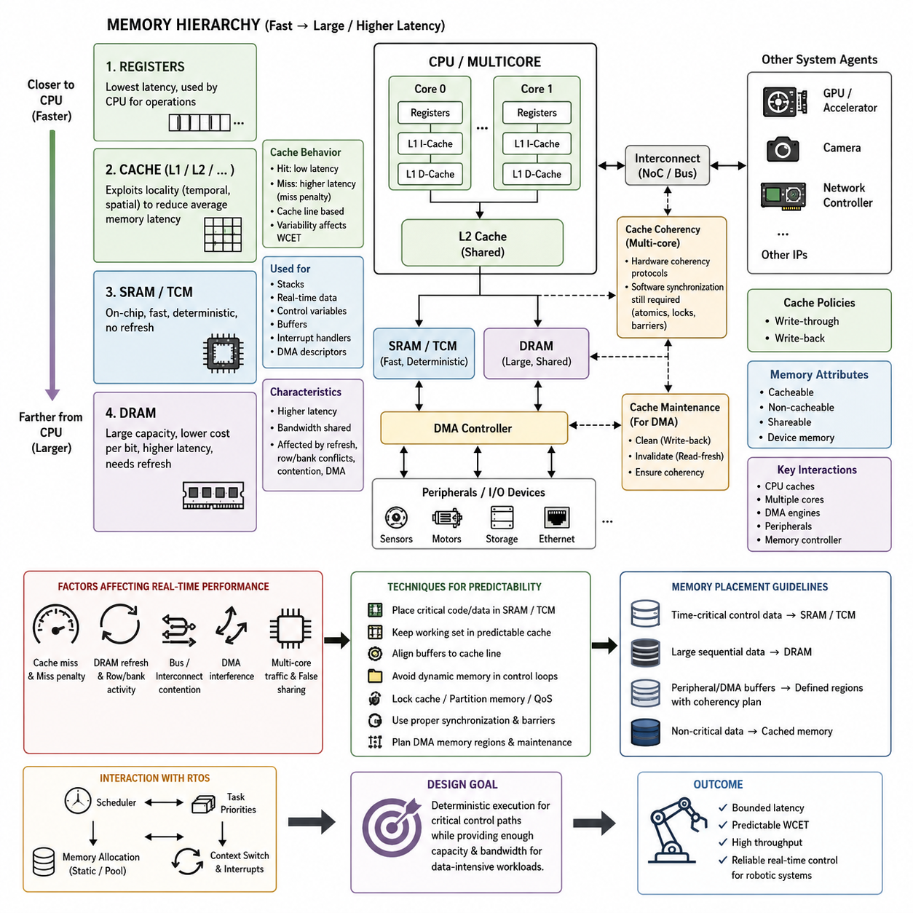
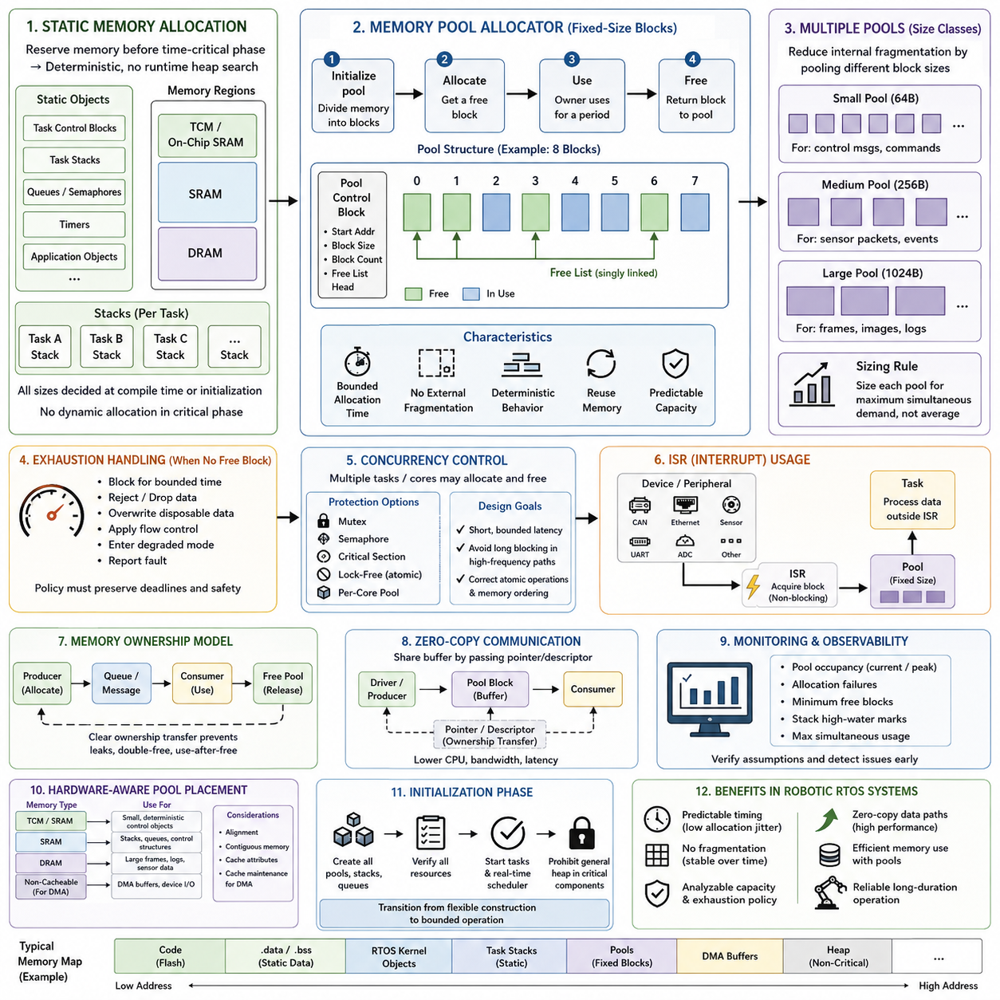
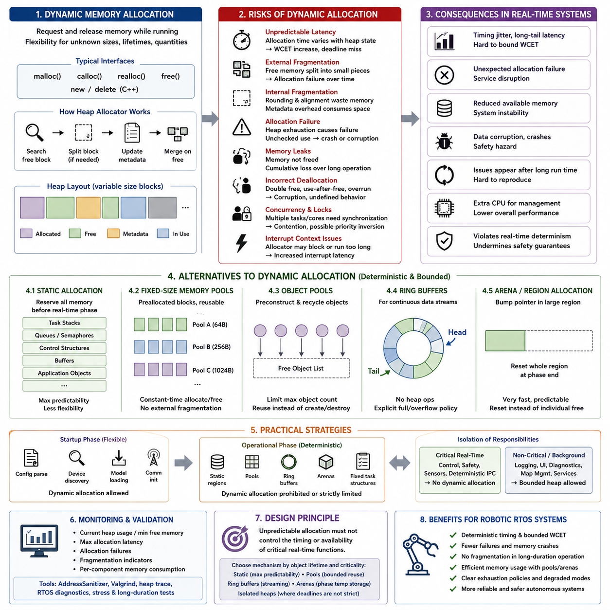
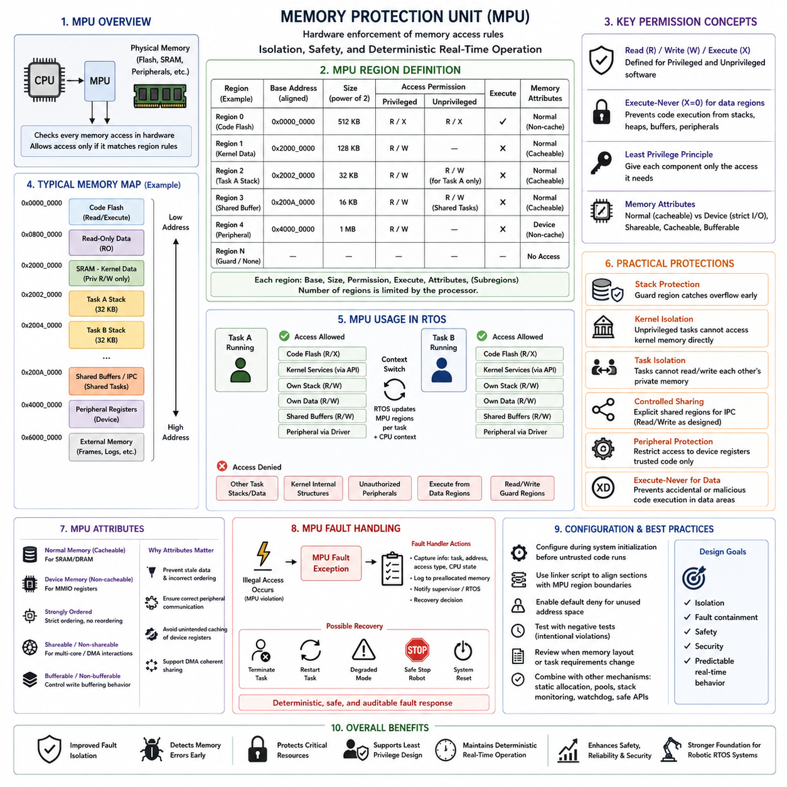
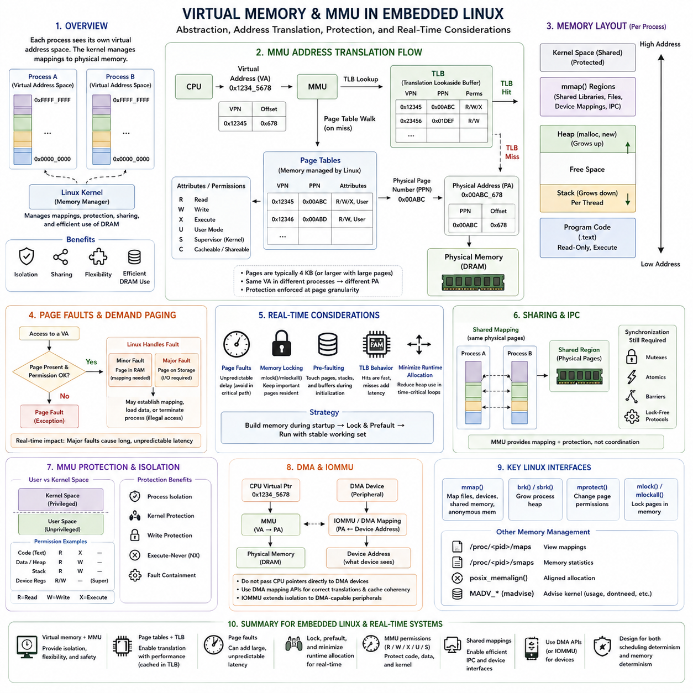
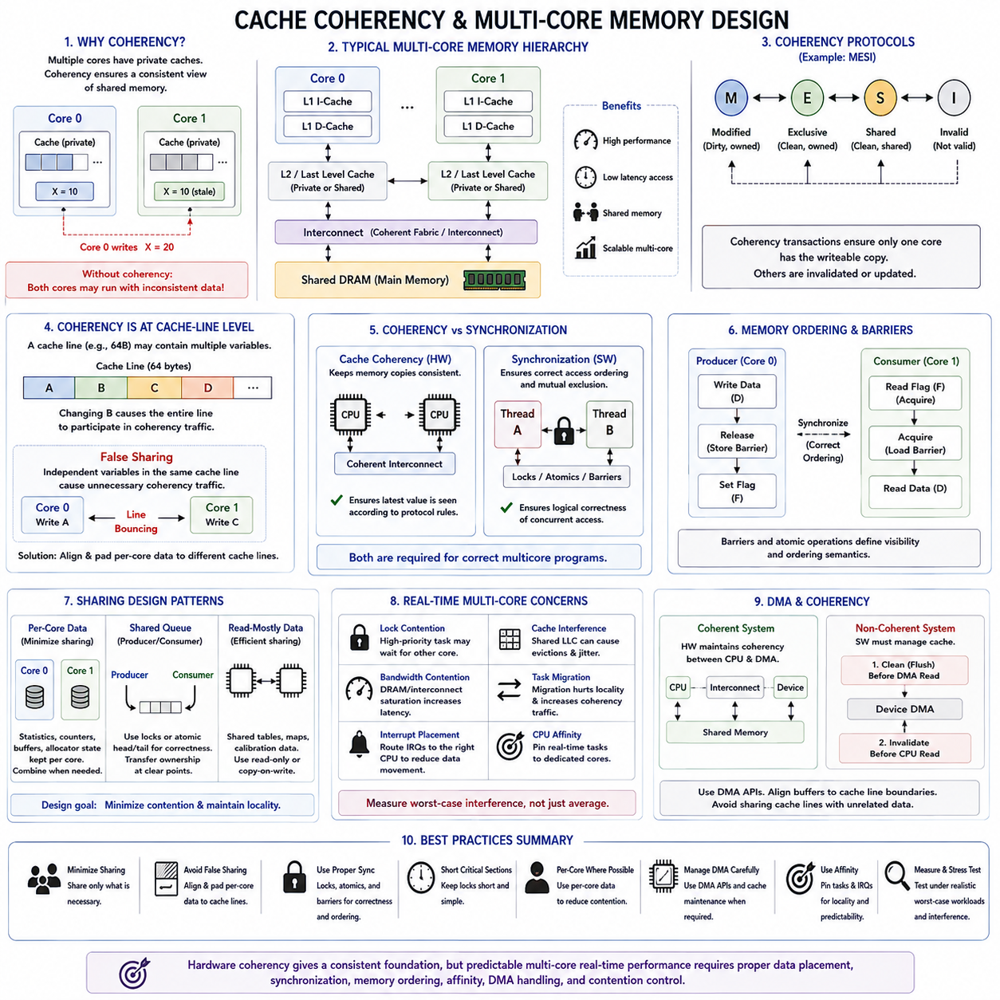
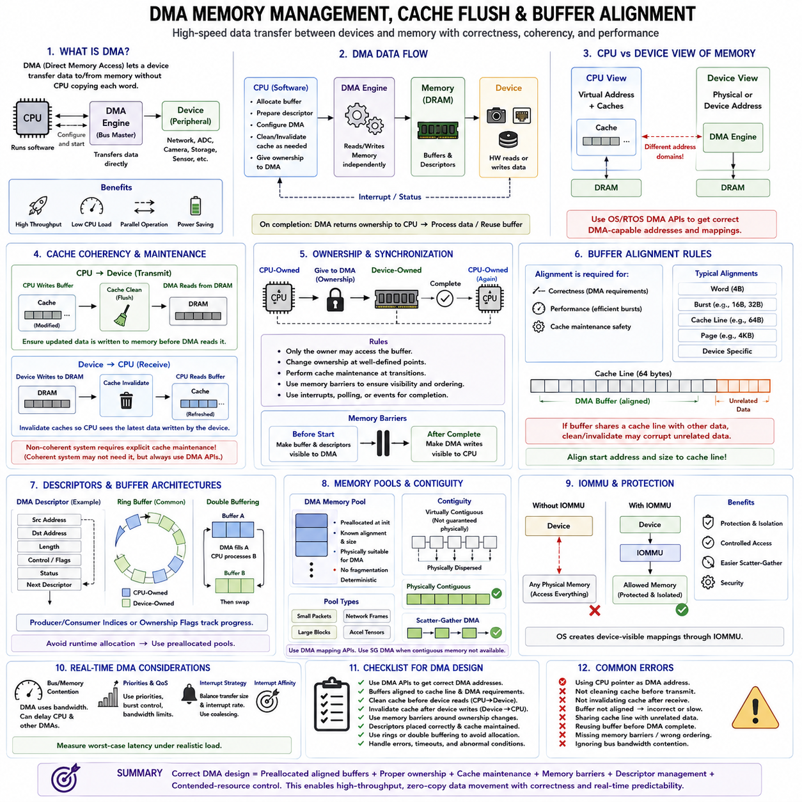
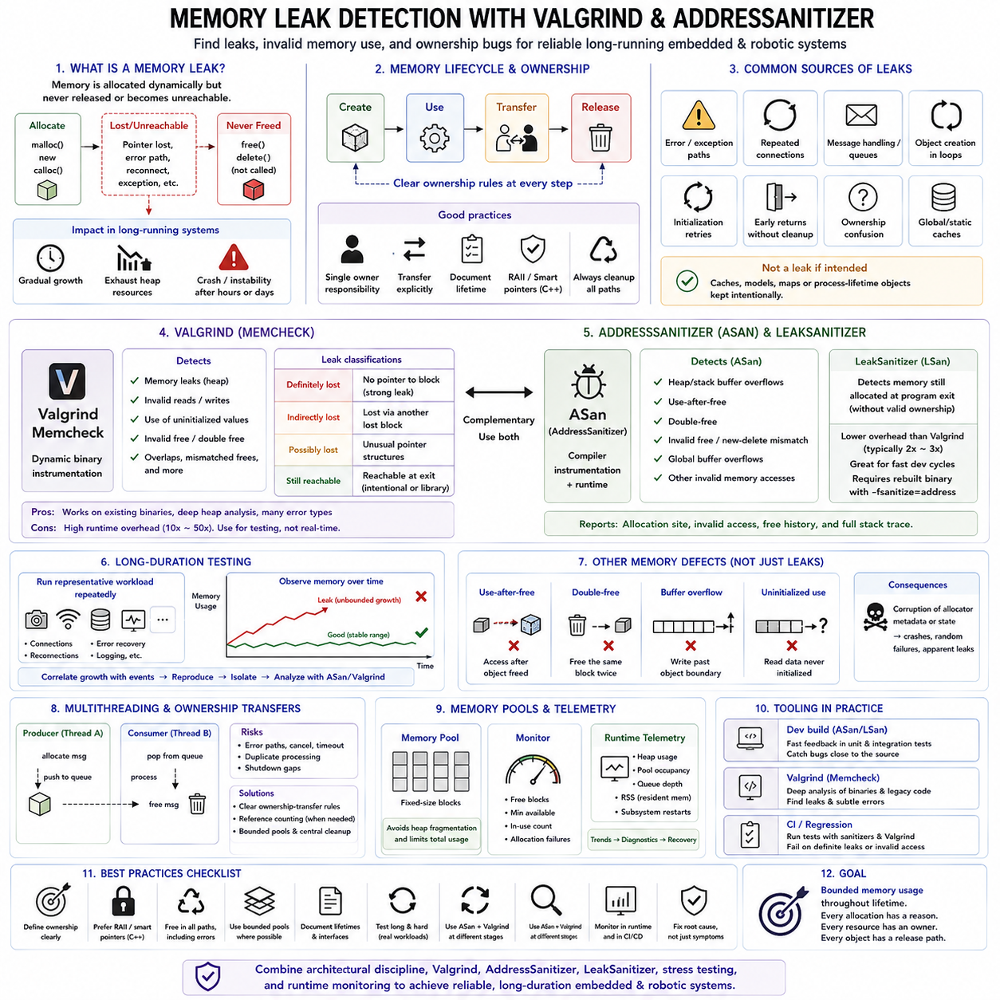
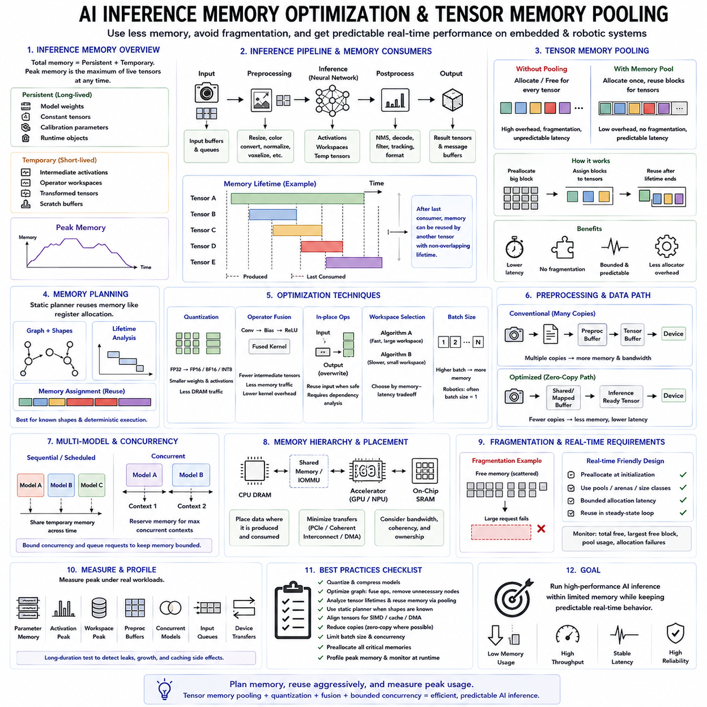
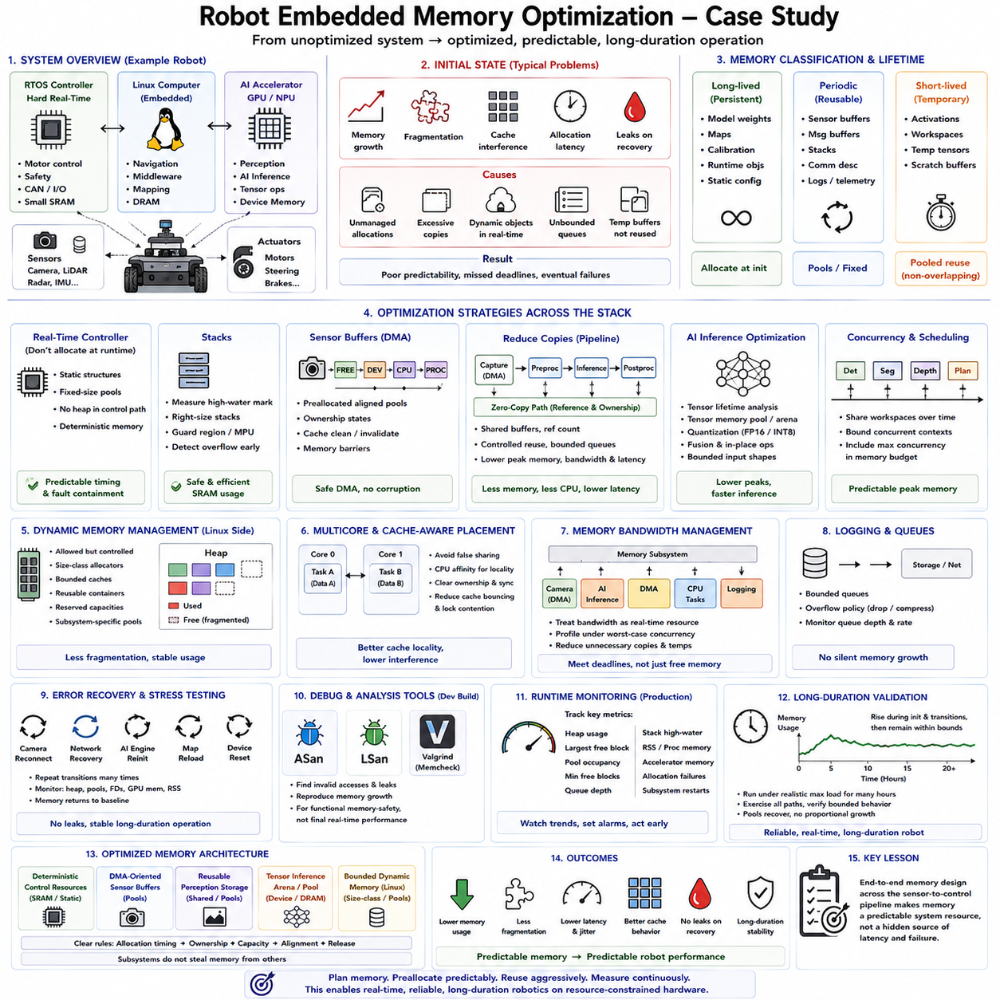

**Volume 03 Real Time Operating Systems**


# 07. Memory Management

##  

## 07.01 Embedded Memory Hierarchy: Cache, SRAM, DRAM

{width="7.268055555555556in" height="7.268055555555556in"}

In an embedded real-time system, memory is not a single uniform resource but a hierarchy of storage technologies with different latency, capacity, bandwidth, power, and predictability characteristics. Registers sit closest to the processor, followed by one or more cache levels, tightly coupled or on-chip SRAM, and larger external DRAM. The hierarchy exists because the fastest memory technologies are expensive in silicon area and power, while high-capacity memory is generally slower.

Processor registers provide the lowest-latency storage and directly support arithmetic, address calculation, control flow, and temporary values used by executing instructions. Their capacity is extremely limited, so compilers continuously move data between registers and the surrounding memory hierarchy. Register allocation therefore influences execution efficiency, but embedded software usually manages registers indirectly through compiler optimization except for low-level context switching, interrupt handling, and device access.

Cache memory reduces the effective latency gap between a fast processor core and slower main memory. Frequently or recently accessed instructions and data are retained in small, high-speed cache structures so that subsequent accesses can be served without reaching SRAM or DRAM. Modern embedded processors may contain separate instruction and data L1 caches and a larger unified L2 cache, while higher-performance SoCs can include additional shared cache levels between multiple CPU cores and external memory.

Caches exploit temporal locality and spatial locality. Temporal locality means that recently accessed information is likely to be accessed again, while spatial locality means that nearby addresses are likely to be referenced within a short period. Rather than transferring only the requested byte or word, a cache normally operates on cache lines containing contiguous memory. This greatly improves average performance for sequential code, arrays, buffers, and structured data, but it can also introduce timing variability.

A cache hit allows the processor to obtain data with relatively low latency, whereas a cache miss requires retrieval from a lower memory level. The resulting miss penalty can include cache-line replacement, memory-controller arbitration, bus transactions, and DRAM access. For general computing this variability is usually acceptable because average throughput dominates. In hard real-time systems, however, the difference between cache-hit and cache-miss execution paths directly affects worst-case execution time and scheduling analysis.

SRAM provides deterministic, high-speed storage without the refresh operations required by DRAM. Microcontrollers commonly integrate SRAM on the same chip as the CPU and use it for stacks, task control structures, communication buffers, variables, and real-time working data. Some processors also provide tightly coupled memory, or TCM, which bypasses normal cache behavior and offers predictable processor access. Such memory is particularly valuable for interrupt handlers and time-critical control algorithms.

Because embedded SRAM capacity is limited, memory placement becomes an architectural decision rather than merely a linker detail. Critical task stacks, DMA descriptors, control-state variables, and high-frequency buffers can be deliberately placed in specific SRAM banks or TCM regions. Less time-sensitive information may remain in cached memory. Linker scripts and memory sections therefore become important mechanisms for translating real-time memory requirements into the physical organization of the target processor.

DRAM provides much greater capacity at a lower cost per bit and is therefore widely used in embedded Linux systems, edge computers, robotics processors, and AI-capable SoCs. Unlike SRAM, DRAM stores information in cells that require periodic refresh and complex row and bank operations. Memory controllers hide much of this complexity, but access latency still depends on refresh activity, row-buffer state, bank conflicts, request ordering, and competition among processors and hardware accelerators.

A modern robotic computing platform may contain CPUs, GPUs, neural accelerators, camera interfaces, network controllers, and DMA engines that all compete for shared DRAM bandwidth. Consequently, a CPU task can experience memory delays even when its own execution behavior has not changed. Large perception tensors, image streams, point clouds, and AI inference workloads can generate substantial memory traffic. Real-time architecture must therefore consider memory bandwidth and contention together with CPU scheduling and task priority.

DMA illustrates why the memory hierarchy must be understood as a system rather than only from the CPU perspective. A DMA controller can transfer sensor or communication data directly between a peripheral and memory without repeatedly involving the processor. However, when a CPU cache contains another copy of the same memory region, software or hardware must maintain coherency. Incorrect cache invalidation or write-back handling can cause the CPU or peripheral to observe stale data even though the physical transfer completed correctly.

Cache policies determine how modifications propagate through the hierarchy. Write-through caching sends updates toward lower memory immediately, simplifying some consistency behavior at the cost of additional traffic. Write-back caching retains modified data in the cache until eviction or an explicit maintenance operation, improving bandwidth efficiency but increasing coherency complexity. Cacheable, non-cacheable, shareable, and device-memory attributes must therefore match how each memory region is actually used by CPUs and peripherals.

Multicore processors introduce another dimension because several cores may cache copies of the same memory location. Hardware cache-coherency protocols can maintain a consistent shared-memory view, but synchronization still requires correct software semantics. Atomic operations, memory barriers, locks, and ordering rules remain necessary when tasks exchange data concurrently. Cache-line placement also matters because unrelated variables modified by different cores can produce false sharing and unnecessary coherency traffic.

Memory hierarchy design has a direct relationship with determinism. Average memory latency alone is insufficient for real-time analysis because deadlines depend on the longest credible access path. Cache misses, DRAM refresh, bus contention, page activity, DMA interference, and multicore traffic can collectively create latency tails much larger than typical measurements. Designers therefore distinguish throughput optimization from worst-case latency control and identify which execution paths must remain predictable under maximum system load.

Several techniques can reduce this uncertainty. Time-critical code and data can reside in SRAM or TCM, working sets can be sized to fit predictable cache regions, buffers can be aligned to cache-line boundaries, and unnecessary dynamic memory traffic can be removed from control loops. Some processors support cache locking, memory partitioning, or quality-of-service mechanisms that reserve cache capacity or memory bandwidth. These mechanisms trade resource flexibility for stronger temporal isolation.

The appropriate hierarchy also depends on the task. A high-frequency motor-control loop may require only a small amount of SRAM and benefit more from deterministic access than from large cache capacity. Navigation and SLAM require larger maps and sensor buffers, making DRAM unavoidable. Vision and AI inference often depend heavily on cache reuse and external memory bandwidth. A robotic platform therefore normally combines multiple memory technologies rather than attempting to optimize every workload with one memory type.

Memory optimization should consequently begin with access behavior rather than capacity alone. Engineers should identify the working set, access frequency, locality, sharing pattern, DMA interaction, and deadline sensitivity of each major data structure. Frequently accessed deterministic state belongs near the processor, large sequential datasets can exploit caches and DRAM bandwidth, and peripheral buffers require explicit coherency planning. This approach connects software data organization directly to physical memory behavior.

Within an RTOS, these hardware properties interact with task scheduling and memory allocation. A high-priority task may be scheduled immediately yet still execute slowly because its instructions or data are absent from cache or because shared memory is congested. Conversely, carefully placed code and preallocated working memory can make execution considerably more repeatable. Real-time performance must therefore be analyzed as the combined behavior of scheduler, processor, cache, interconnect, memory controller, and physical memory.

For robotic systems, the practical objective is not simply to maximize memory speed but to construct a hierarchy in which critical control paths remain bounded while data-intensive workloads retain sufficient capacity and throughput. Cache provides speed through locality, SRAM provides fast and relatively deterministic working storage, and DRAM provides scalable capacity. Understanding how these layers interact establishes the foundation for static allocation, memory pools, MPU and MMU protection, cache coherency, DMA management, and AI inference memory optimization addressed later in the memory-management architecture.

임베디드 실시간 시스템(Embedded Real-Time System)에서 메모리(Memory)는 하나의 균일한 자원이 아니라 지연시간(Latency), 용량(Capacity), 대역폭(Bandwidth), 전력(Power), 예측 가능성(Predictability)이 서로 다른 여러 저장 기술로 구성된 계층 구조(Hierarchy)이다. 레지스터(Register)는 프로세서(Processor)에 가장 가깝고, 그다음에 하나 이상의 캐시(Cache) 계층, 밀결합 메모리(Tightly Coupled Memory) 또는 온칩 SRAM(On-Chip SRAM), 그리고 대용량 외부 DRAM(External DRAM)이 배치된다. 이러한 계층 구조는 가장 빠른 메모리 기술일수록 실리콘 면적과 전력 비용이 크고, 대용량 메모리는 일반적으로 더 느리기 때문에 필요하다.

프로세서 레지스터(Processor Register)는 가장 낮은 지연시간(Latency)을 제공하며 실행 중인 명령어(Instruction)의 산술 연산, 주소 계산, 제어 흐름(Control Flow), 임시 값 저장을 직접 지원한다. 그러나 용량이 극히 제한적이므로 컴파일러(Compiler)는 레지스터와 주변 메모리 계층 사이에서 데이터를 지속적으로 이동시킨다. 따라서 레지스터 할당(Register Allocation)은 실행 효율에 영향을 주지만, 임베디드 소프트웨어(Embedded Software)는 문맥 전환(Context Switching), 인터럽트 처리(Interrupt Handling), 장치 접근(Device Access) 같은 저수준 작업을 제외하면 일반적으로 컴파일러 최적화(Compiler Optimization)를 통해 간접적으로 관리한다.

캐시 메모리(Cache Memory)는 빠른 프로세서 코어(Processor Core)와 상대적으로 느린 주 메모리(Main Memory) 사이의 실질적인 지연시간 차이를 줄인다. 자주 사용되거나 최근 접근된 명령어와 데이터는 작고 빠른 캐시 구조에 유지되어 이후 접근 시 SRAM이나 DRAM까지 접근하지 않고 처리할 수 있다. 현대 임베디드 프로세서(Embedded Processor)는 명령어와 데이터를 위한 별도의 L1 캐시(L1 Cache)와 더 큰 통합 L2 캐시(Unified L2 Cache)를 포함할 수 있으며, 고성능 SoC(System-on-Chip)는 여러 CPU 코어와 외부 메모리 사이에 추가적인 공유 캐시(Shared Cache)를 제공하기도 한다.

캐시(Cache)는 시간 지역성(Temporal Locality)과 공간 지역성(Spatial Locality)을 활용한다. 시간 지역성은 최근 접근한 정보가 다시 사용될 가능성이 높다는 의미이며, 공간 지역성은 특정 주소 주변의 데이터가 가까운 시간 안에 접근될 가능성이 높다는 의미이다. 캐시는 일반적으로 요청된 바이트(Byte)나 워드(Word) 하나만 전송하지 않고 연속된 메모리 영역을 포함하는 캐시 라인(Cache Line) 단위로 동작한다. 이는 순차 코드, 배열(Array), 버퍼(Buffer), 구조화된 데이터의 평균 성능을 크게 향상시키지만 실행시간의 변동성을 발생시킬 수도 있다.

캐시 적중(Cache Hit)이 발생하면 프로세서는 비교적 낮은 지연시간으로 데이터를 얻지만, 캐시 미스(Cache Miss)가 발생하면 더 낮은 메모리 계층에서 데이터를 가져와야 한다. 이에 따른 미스 페널티(Miss Penalty)에는 캐시 라인 교체(Cache-Line Replacement), 메모리 컨트롤러 중재(Memory-Controller Arbitration), 버스 트랜잭션(Bus Transaction), DRAM 접근 등이 포함될 수 있다. 일반 컴퓨팅에서는 평균 처리량(Throughput)이 중요하므로 이러한 변동성이 대부분 허용되지만, 하드 실시간 시스템(Hard Real-Time System)에서는 캐시 적중과 캐시 미스 경로의 차이가 최악 실행시간(Worst-Case Execution Time)과 스케줄링 분석(Scheduling Analysis)에 직접적인 영향을 준다.

SRAM(Static Random-Access Memory)은 DRAM에서 필요한 리프레시(Refresh) 동작 없이 결정적이고 빠른 저장 공간을 제공한다. 마이크로컨트롤러(Microcontroller)는 일반적으로 CPU와 동일한 칩에 SRAM을 통합하고 스택(Stack), 태스크 제어 구조(Task Control Structure), 통신 버퍼(Communication Buffer), 변수, 실시간 작업 데이터를 저장하는 데 사용한다. 일부 프로세서는 일반적인 캐시 동작을 우회하면서 예측 가능한 프로세서 접근을 제공하는 밀결합 메모리(Tightly Coupled Memory, TCM)를 제공하며, 이는 인터럽트 핸들러(Interrupt Handler)와 시간 임계 제어 알고리즘(Time-Critical Control Algorithm)에 특히 유용하다.

임베디드 SRAM(Embedded SRAM)의 용량은 제한적이기 때문에 메모리 배치(Memory Placement)는 단순한 링커(Linker) 설정이 아니라 아키텍처 설계 결정이 된다. 중요 태스크 스택(Task Stack), DMA 기술자(DMA Descriptor), 제어 상태 변수(Control-State Variable), 고주파 버퍼(High-Frequency Buffer)를 특정 SRAM 뱅크(SRAM Bank) 또는 TCM 영역에 의도적으로 배치할 수 있다. 시간 민감도가 낮은 정보는 캐시가 적용되는 메모리에 둘 수 있으며, 링커 스크립트(Linker Script)와 메모리 섹션(Memory Section)은 실시간 메모리 요구사항을 대상 프로세서의 물리적 구조로 변환하는 중요한 수단이 된다.

DRAM(Dynamic Random-Access Memory)은 비트당 낮은 비용으로 훨씬 큰 용량을 제공하므로 임베디드 리눅스(Embedded Linux), 엣지 컴퓨터(Edge Computer), 로봇 프로세서(Robotics Processor), AI 지원 SoC에서 널리 사용된다. SRAM과 달리 DRAM은 주기적인 리프레시와 복잡한 행(Row) 및 뱅크(Bank) 동작이 필요한 셀에 정보를 저장한다. 메모리 컨트롤러(Memory Controller)가 이러한 복잡성을 대부분 감추지만, 접근 지연시간은 리프레시 동작, 행 버퍼 상태(Row-Buffer State), 뱅크 충돌(Bank Conflict), 요청 순서, 프로세서와 하드웨어 가속기(Hardware Accelerator) 사이의 경쟁에 영향을 받는다.

현대 로봇 컴퓨팅 플랫폼(Robotic Computing Platform)에서는 CPU, GPU, 신경망 가속기(Neural Accelerator), 카메라 인터페이스(Camera Interface), 네트워크 컨트롤러(Network Controller), DMA 엔진(DMA Engine)이 동일한 DRAM 대역폭을 놓고 경쟁할 수 있다. 따라서 CPU 태스크 자체의 실행 동작이 변하지 않더라도 메모리 지연이 발생할 수 있다. 대규모 인지 텐서(Perception Tensor), 이미지 스트림(Image Stream), 포인트 클라우드(Point Cloud), AI 추론(AI Inference)은 상당한 메모리 트래픽을 생성하므로 실시간 아키텍처는 CPU 스케줄링과 태스크 우선순위뿐 아니라 메모리 대역폭과 경합(Contention)까지 함께 고려해야 한다.

DMA(Direct Memory Access)는 메모리 계층을 CPU 관점만이 아니라 전체 시스템 관점에서 이해해야 하는 이유를 보여준다. DMA 컨트롤러(DMA Controller)는 프로세서의 반복적인 개입 없이 주변장치(Peripheral)와 메모리 사이에서 센서 또는 통신 데이터를 직접 전송할 수 있다. 그러나 CPU 캐시에 동일한 메모리 영역의 다른 복사본이 존재한다면 소프트웨어 또는 하드웨어가 일관성(Coherency)을 유지해야 한다. 캐시 무효화(Cache Invalidation) 또는 라이트백(Write-Back) 처리가 잘못되면 물리적 데이터 전송이 정상적으로 완료되었더라도 CPU나 주변장치가 오래된 데이터(Stale Data)를 읽을 수 있다.

캐시 정책(Cache Policy)은 데이터 변경 사항이 메모리 계층을 통해 어떻게 전달되는지를 결정한다. 라이트스루 캐시(Write-Through Cache)는 변경 내용을 즉시 하위 메모리 방향으로 전달하여 일부 일관성 처리를 단순화하지만 추가적인 메모리 트래픽을 발생시킨다. 라이트백 캐시(Write-Back Cache)는 수정된 데이터를 축출(Eviction) 또는 명시적인 유지보수 동작까지 캐시에 보관하여 대역폭 효율을 향상시키지만 일관성 관리의 복잡성을 증가시킨다. 따라서 캐시 가능(Cacheable), 비캐시(Non-Cacheable), 공유 가능(Shareable), 장치 메모리(Device Memory) 속성은 CPU와 주변장치가 각 메모리 영역을 실제로 사용하는 방식과 일치해야 한다.

멀티코어 프로세서(Multicore Processor)는 여러 코어가 동일한 메모리 위치의 복사본을 각자의 캐시에 저장할 수 있기 때문에 또 다른 차원의 문제를 발생시킨다. 하드웨어 캐시 일관성 프로토콜(Cache-Coherency Protocol)은 일관된 공유 메모리(Shared Memory) 관점을 유지할 수 있지만, 동기화(Synchronization)를 위해서는 여전히 올바른 소프트웨어 의미론이 필요하다. 태스크가 데이터를 동시에 교환할 때 원자적 연산(Atomic Operation), 메모리 배리어(Memory Barrier), 잠금(Lock), 순서 규칙(Ordering Rule)이 필요하며, 서로 관계없는 변수들이 동일한 캐시 라인에 배치되면 거짓 공유(False Sharing)와 불필요한 일관성 트래픽이 발생할 수 있다.

메모리 계층 설계(Memory Hierarchy Design)는 결정성(Determinism)과 직접적으로 연결된다. 실시간 분석에서는 평균 메모리 지연시간만으로 충분하지 않으며, 데드라인(Deadline)은 실제로 발생 가능한 가장 긴 접근 경로의 영향을 받는다. 캐시 미스, DRAM 리프레시, 버스 경합(Bus Contention), 페이지 동작(Page Activity), DMA 간섭(DMA Interference), 멀티코어 트래픽이 결합되면 일반적인 측정값보다 훨씬 큰 지연시간 꼬리(Latency Tail)가 발생할 수 있다. 따라서 설계자는 처리량 최적화(Throughput Optimization)와 최악 지연시간 제어(Worst-Case Latency Control)를 구분하고 최대 시스템 부하에서도 예측 가능성을 유지해야 하는 실행 경로를 식별해야 한다.

이러한 불확실성을 줄이기 위해 여러 기법을 적용할 수 있다. 시간 임계 코드(Time-Critical Code)와 데이터는 SRAM 또는 TCM에 배치하고, 작업 집합(Working Set)은 예측 가능한 캐시 영역에 들어가도록 구성하며, 버퍼는 캐시 라인 경계(Cache-Line Boundary)에 맞추어 정렬할 수 있다. 또한 제어 루프(Control Loop)에서 불필요한 동적 메모리 트래픽을 제거할 수 있다. 일부 프로세서는 캐시 잠금(Cache Locking), 메모리 파티셔닝(Memory Partitioning), 서비스 품질(Quality of Service, QoS) 메커니즘을 지원하여 캐시 용량이나 메모리 대역폭을 예약할 수 있으며, 이는 자원 활용의 유연성을 일부 희생하는 대신 더 강력한 시간적 격리(Temporal Isolation)를 제공한다.

적절한 메모리 계층은 수행되는 태스크의 특성에 따라서도 달라진다. 고주파 모터 제어 루프(High-Frequency Motor-Control Loop)는 적은 SRAM만 필요할 수 있으며 대용량 캐시보다 결정적인 접근 특성이 더 중요하다. 내비게이션(Navigation)과 SLAM은 대규모 지도와 센서 버퍼를 필요로 하므로 DRAM 사용을 피하기 어렵다. 비전(Vision)과 AI 추론은 캐시 재사용(Cache Reuse)과 외부 메모리 대역폭에 크게 의존한다. 따라서 로봇 플랫폼은 모든 워크로드를 하나의 메모리 유형으로 최적화하기보다 여러 메모리 기술을 조합하여 사용하는 것이 일반적이다.

따라서 메모리 최적화(Memory Optimization)는 단순한 용량보다 접근 동작(Access Behavior)의 분석에서 시작해야 한다. 엔지니어는 주요 데이터 구조별로 작업 집합, 접근 빈도(Access Frequency), 지역성(Locality), 공유 패턴(Sharing Pattern), DMA 상호작용, 데드라인 민감도(Deadline Sensitivity)를 파악해야 한다. 자주 접근되는 결정적 상태 데이터는 프로세서 가까이에 배치하고, 대규모 순차 데이터셋은 캐시와 DRAM 대역폭을 활용하며, 주변장치 버퍼는 명시적인 일관성 관리 계획을 적용해야 한다. 이러한 접근은 소프트웨어 데이터 구성을 물리적인 메모리 동작과 직접 연결한다.

RTOS(Real-Time Operating System)에서는 이러한 하드웨어 특성이 태스크 스케줄링(Task Scheduling) 및 메모리 할당(Memory Allocation)과 상호작용한다. 높은 우선순위의 태스크가 즉시 스케줄링되더라도 해당 명령어나 데이터가 캐시에 없거나 공유 메모리가 혼잡하다면 실행 속도가 느려질 수 있다. 반대로 코드와 사전 할당된 작업 메모리(Preallocated Working Memory)를 신중하게 배치하면 실행을 훨씬 더 반복 가능하고 예측 가능하게 만들 수 있다. 따라서 실시간 성능은 스케줄러(Scheduler), 프로세서, 캐시, 인터커넥트(Interconnect), 메모리 컨트롤러, 물리 메모리가 결합된 전체 동작으로 분석해야 한다.

로봇 시스템(Robotic System)에서 실질적인 목표는 단순히 메모리 속도를 최대화하는 것이 아니라, 데이터 집약적 워크로드(Data-Intensive Workload)에 충분한 용량과 처리량을 제공하면서 중요 제어 경로(Critical Control Path)의 실행시간을 제한된 범위 안에서 유지할 수 있는 계층 구조를 구축하는 것이다. 캐시는 지역성(Locality)을 통해 속도를 제공하고, SRAM은 빠르고 상대적으로 결정적인 작업 저장 공간을 제공하며, DRAM은 확장 가능한 대용량 저장 공간을 제공한다. 이러한 계층 간 상호작용의 이해는 이후 다루게 될 정적 할당(Static Allocation), 메모리 풀(Memory Pool), MPU/MMU 보호(Memory Protection), 캐시 일관성(Cache Coherency), DMA 관리(DMA Management), AI 추론 메모리 최적화(AI Inference Memory Optimization)의 기반이 된다.

##  

## 07.02 Static Memory Allocation: Pool Allocator [w/Code]

{width="7.268055555555556in" height="7.268055555555556in"}

Static memory allocation is a memory-management strategy in which required storage is reserved before the time-critical execution phase begins. In embedded and real-time systems, this usually means that task stacks, control structures, communication buffers, queues, and application objects are assigned fixed memory locations or preallocated regions. The primary advantage is predictability: allocation does not depend on searching a fragmented heap while a real-time task is running.

Unlike general-purpose applications, an RTOS-based controller often cannot tolerate unpredictable allocation latency or allocation failure during operation. Dynamic allocators such as malloc() may search free lists, split blocks, merge adjacent regions, or update allocator metadata. The execution time of these operations can vary with heap state. Static allocation removes much of this uncertainty by determining memory ownership and capacity during compilation, initialization, or a controlled startup phase.

Static objects can be placed in global or static storage regions whose addresses and sizes are determined by the linker. RTOS kernels may also allow applications to provide memory explicitly for task control blocks, stacks, queues, semaphores, timers, and other kernel objects. This approach gives the application direct control over how much memory exists and where it resides, while eliminating dependence on a general-purpose runtime heap for critical kernel resources.

Stack allocation is another important part of deterministic memory design. Each real-time task normally receives a predefined stack sized for its expected call depth, local variables, interrupt interaction, and library usage. If stack sizes are selected conservatively and verified through high-water-mark measurement or runtime monitoring, the system can operate without requesting additional stack memory. Stack overflow detection remains essential because fixed allocation converts uncontrolled growth into a clearly defined capacity boundary.

The main limitation of purely static allocation is reduced flexibility. Memory must often be reserved for worst-case demand even when the typical workload uses only a fraction of that capacity. If ten communication channels might simultaneously require large buffers, reserving ten permanent buffers guarantees availability but may waste SRAM during normal operation. Embedded systems therefore frequently combine fixed allocation with memory pools to preserve determinism while allowing controlled reuse of storage.

A memory pool is a preallocated region divided into reusable blocks. Instead of requesting arbitrary-sized memory from a general heap, tasks acquire a block from the pool, use it for a bounded period, and return it when processing is complete. Because the memory already exists, runtime allocation becomes a resource-management operation rather than a request to expand or reorganize the heap. This makes pool behavior easier to analyze and constrain for real-time execution.

The simplest pool uses fixed-size blocks. During initialization, a contiguous memory region is divided into equally sized elements and linked into a free list. Allocation removes one available element, while deallocation returns it to the list. Both operations can often be implemented with constant or tightly bounded execution time. Fixed-size pools also eliminate external fragmentation because every free block can satisfy any request belonging to that particular pool.

Internal fragmentation can still occur when an object is significantly smaller than the block assigned to it. For example, storing a 100-byte message in a 256-byte block wastes the unused portion until the block is released. A common solution is to maintain several pools for different size classes, such as small control messages, medium sensor packets, and large communication frames. Requests are directed to the smallest suitable pool while maintaining predictable allocation behavior.

Pool sizing should be derived from maximum simultaneous resource demand rather than average usage. A communication pipeline, for example, may require blocks for data being received, queued, processed, transmitted, and temporarily retained by another task at the same time. The designer must therefore analyze object lifetime and concurrency. If a pool contains too few blocks, deterministic allocation time remains meaningless because the system can still exhaust the resource when demand reaches its legitimate peak.

Exhaustion behavior must be explicitly defined. A safety-critical or real-time system should not assume that pool allocation will always succeed merely because memory was preallocated. Depending on the application, exhaustion may cause the requesting task to block for a bounded interval, reject incoming data, overwrite an explicitly disposable sample, trigger flow control, enter a degraded mode, or report a fault. The selected policy must preserve system deadlines and safety requirements.

Memory pools also simplify fragmentation management. General heaps can develop external fragmentation when free memory becomes separated into regions that are individually too small for a requested object despite sufficient total free capacity. Fixed-block pools cannot experience this form of fragmentation. Their memory topology remains stable over long operating periods, which is particularly valuable for robots, industrial controllers, and autonomous systems expected to operate continuously without rebooting.

Concurrency introduces additional requirements because several tasks, interrupt handlers, or processor cores may attempt to acquire and release blocks simultaneously. A pool can be protected with a mutex, semaphore, critical section, or other synchronization primitive, but the synchronization mechanism itself contributes latency and possible contention. For high-frequency paths, lock-free free lists or per-core pools may reduce interference, although they require careful atomic operations and memory-ordering semantics.

Interrupt service routines require especially careful pool design. An interrupt should generally avoid an allocator that can block, wait for a mutex, or perform an unbounded search. A dedicated fixed-size pool can instead provide immediately available buffers for incoming sensor, CAN, Ethernet, or other device data. The interrupt handler obtains a block, records or references the data, and transfers ownership to a task that performs the more expensive processing outside interrupt context.

Memory ownership is therefore as important as allocation itself. Every block should have a clearly defined owner and a clear transition between producer, queue, consumer, and free-pool states. Ambiguous ownership can produce double-free errors, use-after-free faults, memory corruption, or permanent pool leakage. In message-based RTOS architectures, ownership transfer can be designed as part of the communication protocol so that the receiving task becomes responsible for eventually returning the block.

Pools can also support zero-copy communication. Instead of copying a large sensor frame from a driver buffer into a queue and then into an application buffer, the system can allocate one pool block and exchange a pointer or descriptor between components. This reduces CPU utilization, memory bandwidth, and latency. However, the performance advantage depends on strict lifetime management because a buffer cannot be reused until every component that legitimately references it has finished.

Hardware characteristics should influence pool placement. Small deterministic control objects can reside in on-chip SRAM or tightly coupled memory, while larger frame pools may reside in external DRAM. DMA buffers may require alignment, contiguous regions, specific cache attributes, or explicit cache maintenance. A pool allocator can encode these constraints into separate pools so that requesting a particular pool implicitly selects memory with the correct physical and architectural properties.

Initialization is normally the preferred time to construct pools, queues, stacks, and other memory resources. Startup code can verify that every required region was created successfully before actuators are enabled or real-time scheduling begins. After initialization, the system can prohibit general heap allocation in critical components. This creates a clear transition from a flexible construction phase to a bounded operational phase in which memory consumption is intentionally constrained.

Monitoring remains useful even when allocation is deterministic. Pool occupancy, allocation failures, minimum free-block count, stack high-water marks, and maximum simultaneous usage provide evidence that design assumptions remain valid under field workloads. These metrics can reveal underestimated concurrency, abnormal message retention, or slow consumers before they become failures. Real-time memory management therefore combines predetermined capacity with runtime observability rather than treating static allocation as sufficient by itself.

For robotic RTOS architectures, static allocation and pool allocators provide a practical compromise between absolute fixed memory assignment and unrestricted dynamic allocation. Critical tasks retain predetermined stacks and control data, while reusable pools support bounded variability in sensor, network, and IPC workloads. The resulting design reduces fragmentation and allocation jitter, makes memory exhaustion analyzable, supports zero-copy data paths, and creates a stronger foundation for deterministic long-duration operation.

정적 메모리 할당(Static Memory Allocation)은 시간 임계 실행 단계(Time-Critical Execution Phase)가 시작되기 전에 필요한 저장 공간을 미리 예약하는 메모리 관리(Memory Management) 전략이다. 임베디드 및 실시간 시스템(Embedded and Real-Time System)에서는 일반적으로 태스크 스택(Task Stack), 제어 구조(Control Structure), 통신 버퍼(Communication Buffer), 큐(Queue), 애플리케이션 객체(Application Object)에 고정된 메모리 위치 또는 사전 할당 영역(Preallocated Region)을 지정한다. 주요 장점은 예측 가능성(Predictability)으로, 실시간 태스크가 실행되는 동안 단편화된 힙(Fragmented Heap)을 검색하여 메모리를 할당할 필요가 없다.

범용 애플리케이션(General-Purpose Application)과 달리 RTOS 기반 제어기(RTOS-Based Controller)는 동작 중 발생하는 예측 불가능한 메모리 할당 지연(Allocation Latency)이나 할당 실패(Allocation Failure)를 허용하기 어려운 경우가 많다. malloc()과 같은 동적 할당기(Dynamic Allocator)는 사용 가능한 목록(Free List)을 검색하고, 블록을 분할하거나 인접 영역을 병합하며, 할당기 메타데이터(Allocator Metadata)를 갱신할 수 있다. 이러한 동작의 실행시간은 힙 상태에 따라 달라질 수 있다. 정적 할당은 컴파일, 초기화 또는 통제된 시작 단계에서 메모리 소유권과 용량을 결정함으로써 이러한 불확실성을 크게 제거한다.

정적 객체(Static Object)는 주소와 크기가 링커(Linker)에 의해 결정되는 전역 또는 정적 저장 영역(Global or Static Storage Region)에 배치할 수 있다. RTOS 커널(RTOS Kernel)은 애플리케이션이 태스크 제어 블록(Task Control Block), 스택(Stack), 큐(Queue), 세마포어(Semaphore), 타이머(Timer) 및 기타 커널 객체(Kernel Object)를 위한 메모리를 명시적으로 제공하도록 지원할 수도 있다. 이러한 방식은 중요 커널 자원에 대해 범용 런타임 힙(General-Purpose Runtime Heap)에 의존하지 않으면서 애플리케이션이 메모리 크기와 위치를 직접 제어할 수 있도록 한다.

스택 할당(Stack Allocation) 역시 결정적 메모리 설계(Deterministic Memory Design)의 중요한 부분이다. 각각의 실시간 태스크(Real-Time Task)는 일반적으로 예상 호출 깊이(Call Depth), 지역 변수(Local Variable), 인터럽트 상호작용(Interrupt Interaction), 라이브러리 사용량을 고려하여 미리 정의된 스택을 할당받는다. 스택 크기를 보수적으로 결정하고 하이워터 마크 측정(High-Water-Mark Measurement)이나 런타임 모니터링(Runtime Monitoring)을 통해 검증하면 시스템은 추가적인 스택 메모리를 요청하지 않고 동작할 수 있다. 고정 할당은 제어되지 않는 증가를 명확한 용량 한계로 변환하므로 스택 오버플로 검출(Stack Overflow Detection)은 여전히 중요하다.

완전한 정적 할당(Pure Static Allocation)의 주요 한계는 유연성이 감소한다는 것이다. 일반적인 워크로드에서 실제로 사용하는 용량이 일부에 불과하더라도 최악 조건의 요구량(Worst-Case Demand)을 기준으로 메모리를 예약해야 하는 경우가 많다. 예를 들어 10개의 통신 채널이 동시에 대용량 버퍼를 요구할 가능성이 있다면 10개의 영구 버퍼를 예약하여 가용성을 보장할 수 있지만 정상 동작에서는 SRAM을 낭비할 수 있다. 따라서 임베디드 시스템은 결정성을 유지하면서 저장 공간을 통제된 방식으로 재사용하기 위해 고정 할당과 메모리 풀(Memory Pool)을 함께 사용하는 경우가 많다.

메모리 풀(Memory Pool)은 재사용 가능한 블록(Block)으로 분할된 사전 할당 메모리 영역(Preallocated Memory Region)이다. 태스크는 범용 힙에서 임의 크기의 메모리를 요청하는 대신 풀에서 블록을 획득하여 제한된 기간 동안 사용한 후 처리가 완료되면 반환한다. 메모리가 이미 존재하므로 런타임 할당(Runtime Allocation)은 힙을 확장하거나 재구성하는 요청이 아니라 자원 관리(Resource Management) 동작이 된다. 따라서 풀의 동작을 실시간 실행 관점에서 보다 쉽게 분석하고 제한할 수 있다.

가장 단순한 풀은 고정 크기 블록(Fixed-Size Block)을 사용한다. 초기화 과정에서 연속된 메모리 영역(Contiguous Memory Region)을 동일한 크기의 요소로 나누고 이를 사용 가능 목록(Free List)으로 연결한다. 할당 시 사용 가능한 요소 하나를 제거하고, 해제 시 다시 목록으로 반환한다. 두 동작 모두 일정하거나 엄격하게 제한된 실행시간(Bounded Execution Time)으로 구현할 수 있다. 또한 모든 사용 가능한 블록이 해당 풀의 요청을 처리할 수 있으므로 고정 크기 풀에서는 외부 단편화(External Fragmentation)가 발생하지 않는다.

그러나 객체가 할당된 블록보다 상당히 작다면 내부 단편화(Internal Fragmentation)가 발생할 수 있다. 예를 들어 100바이트(Byte) 메시지를 256바이트 블록에 저장하면 블록이 반환될 때까지 사용되지 않는 영역이 낭비된다. 일반적인 해결책은 소형 제어 메시지(Small Control Message), 중간 크기 센서 패킷(Medium Sensor Packet), 대형 통신 프레임(Large Communication Frame)처럼 서로 다른 크기 등급(Size Class)을 위한 여러 개의 풀을 유지하는 것이다. 요청은 예측 가능한 할당 동작을 유지하면서 해당 객체를 수용할 수 있는 가장 작은 풀로 전달된다.

풀 크기(Pool Sizing)는 평균 사용량이 아니라 동시에 발생할 수 있는 최대 자원 요구량(Maximum Simultaneous Resource Demand)을 기준으로 결정해야 한다. 예를 들어 통신 파이프라인(Communication Pipeline)은 수신 중인 데이터, 큐에서 대기 중인 데이터, 처리 중인 데이터, 송신 중인 데이터, 다른 태스크가 임시로 보유한 데이터를 위한 블록을 동시에 필요로 할 수 있다. 따라서 설계자는 객체 수명(Object Lifetime)과 동시성(Concurrency)을 분석해야 한다. 풀에 포함된 블록 수가 부족하면 정상적인 최대 요구량에서 자원이 고갈될 수 있으므로 결정적인 할당시간 자체가 의미를 잃게 된다.

자원 고갈 동작(Exhaustion Behavior)은 명시적으로 정의해야 한다. 안전 필수 또는 실시간 시스템(Safety-Critical or Real-Time System)은 메모리가 사전 할당되었다는 이유만으로 풀 할당이 항상 성공한다고 가정해서는 안 된다. 애플리케이션에 따라 자원 고갈 시 요청 태스크를 제한된 시간 동안 블로킹(Block)하거나, 수신 데이터를 거부하거나, 명시적으로 폐기 가능한 샘플을 덮어쓰거나, 흐름 제어(Flow Control)를 실행하거나, 성능 저하 모드(Degraded Mode)로 진입하거나, 오류(Fault)를 보고할 수 있다. 선택한 정책은 시스템의 데드라인과 안전 요구사항을 유지해야 한다.

메모리 풀은 단편화 관리(Fragmentation Management)도 단순화한다. 범용 힙(General Heap)은 전체 사용 가능 메모리가 충분하더라도 요청된 객체를 수용하기에는 각각 너무 작은 영역으로 메모리가 분리되는 외부 단편화를 발생시킬 수 있다. 고정 블록 풀(Fixed-Block Pool)은 이러한 형태의 단편화를 경험하지 않는다. 메모리 구조가 장시간 안정적으로 유지되므로 재부팅 없이 지속적으로 동작해야 하는 로봇(Robot), 산업용 제어기(Industrial Controller), 자율 시스템(Autonomous System)에 특히 유용하다.

여러 태스크, 인터럽트 핸들러(Interrupt Handler), 프로세서 코어(Processor Core)가 동시에 블록을 획득하고 반환할 수 있으므로 동시성은 추가적인 요구사항을 발생시킨다. 풀은 뮤텍스(Mutex), 세마포어(Semaphore), 임계 구역(Critical Section) 또는 다른 동기화 프리미티브(Synchronization Primitive)로 보호할 수 있지만 동기화 메커니즘 자체도 지연시간과 경합(Contention)을 발생시킨다. 고주파 실행 경로에서는 잠금 없는 사용 가능 목록(Lock-Free Free List)이나 코어별 풀(Per-Core Pool)이 간섭을 줄일 수 있지만, 이를 위해서는 원자적 연산(Atomic Operation)과 메모리 순서 의미론(Memory-Ordering Semantics)을 신중하게 설계해야 한다.

인터럽트 서비스 루틴(Interrupt Service Routine, ISR)은 특히 신중한 풀 설계를 필요로 한다. 인터럽트에서는 일반적으로 블로킹하거나 뮤텍스를 기다리거나 제한되지 않은 검색을 수행하는 할당기를 사용하지 않아야 한다. 대신 전용 고정 크기 풀(Dedicated Fixed-Size Pool)을 사용하여 센서, CAN, 이더넷(Ethernet) 또는 기타 장치에서 수신되는 데이터를 위한 버퍼를 즉시 제공할 수 있다. 인터럽트 핸들러는 블록을 획득하여 데이터를 기록하거나 참조하고, 소유권을 태스크로 전달하여 더 많은 연산이 필요한 처리를 인터럽트 문맥(Interrupt Context) 밖에서 수행하도록 한다.

따라서 메모리 소유권(Memory Ownership)은 할당 자체만큼 중요하다. 모든 블록에는 명확하게 정의된 소유자가 있어야 하며 생산자(Producer), 큐(Queue), 소비자(Consumer), 사용 가능 풀(Free Pool) 사이의 상태 전환이 명확해야 한다. 불명확한 소유권은 이중 해제(Double-Free), 해제 후 사용(Use-After-Free), 메모리 손상(Memory Corruption), 영구적인 풀 누수(Pool Leakage)를 발생시킬 수 있다. 메시지 기반 RTOS 아키텍처(Message-Based RTOS Architecture)에서는 소유권 이전(Ownership Transfer)을 통신 프로토콜의 일부로 설계하여 수신 태스크가 최종적으로 블록을 반환하도록 책임을 부여할 수 있다.

메모리 풀은 제로 카피 통신(Zero-Copy Communication)도 지원할 수 있다. 대용량 센서 프레임을 드라이버 버퍼(Driver Buffer)에서 큐로 복사한 다음 다시 애플리케이션 버퍼로 복사하는 대신, 시스템은 하나의 풀 블록을 할당하고 구성요소 사이에서 포인터(Pointer) 또는 기술자(Descriptor)를 교환할 수 있다. 이는 CPU 사용률, 메모리 대역폭, 지연시간을 감소시킨다. 그러나 해당 버퍼를 정당하게 참조하는 모든 구성요소의 사용이 끝날 때까지 재사용할 수 없으므로 엄격한 수명 관리(Lifetime Management)가 필요하다.

하드웨어 특성(Hardware Characteristics)도 풀의 배치에 영향을 주어야 한다. 작고 결정적인 제어 객체(Control Object)는 온칩 SRAM(On-Chip SRAM)이나 밀결합 메모리(Tightly Coupled Memory, TCM)에 배치할 수 있으며, 대형 프레임 풀(Frame Pool)은 외부 DRAM(External DRAM)에 배치할 수 있다. DMA 버퍼(DMA Buffer)는 정렬(Alignment), 연속 메모리 영역, 특정 캐시 속성(Cache Attribute), 명시적인 캐시 유지보수(Cache Maintenance)를 요구할 수 있다. 풀 할당기는 이러한 제약을 별도의 풀에 반영하여 특정 풀을 요청하는 것만으로 올바른 물리적·아키텍처적 특성을 가진 메모리를 선택하도록 설계할 수 있다.

초기화(Initialization)는 일반적으로 풀, 큐, 스택 및 기타 메모리 자원을 구성하기에 가장 적합한 시점이다. 시작 코드(Startup Code)는 액추에이터(Actuator)가 활성화되거나 실시간 스케줄링(Real-Time Scheduling)이 시작되기 전에 필요한 모든 영역이 정상적으로 생성되었는지 확인할 수 있다. 초기화 이후에는 중요 구성요소에서 범용 힙 할당(General Heap Allocation)을 금지할 수도 있다. 이를 통해 유연한 구성 단계(Construction Phase)에서 메모리 소비가 의도적으로 제한되는 경계가 명확한 운영 단계(Bounded Operational Phase)로 전환할 수 있다.

메모리 할당이 결정적이더라도 모니터링(Monitoring)은 여전히 중요하다. 풀 점유율(Pool Occupancy), 할당 실패(Allocation Failure), 최소 여유 블록 수(Minimum Free-Block Count), 스택 하이워터 마크(Stack High-Water Mark), 최대 동시 사용량(Maximum Simultaneous Usage)은 설계 가정이 실제 현장 워크로드에서도 유효한지를 보여주는 근거가 된다. 이러한 지표를 통해 과소평가된 동시성, 비정상적인 메시지 보유(Message Retention), 느린 소비자(Slow Consumer)를 실제 장애로 발전하기 전에 발견할 수 있다. 따라서 실시간 메모리 관리는 사전 결정된 용량과 런타임 관찰 가능성(Runtime Observability)을 결합해야 한다.

로봇 RTOS 아키텍처(Robotic RTOS Architecture)에서 정적 할당과 풀 할당기(Pool Allocator)는 완전히 고정된 메모리 할당과 제한 없는 동적 할당(Unrestricted Dynamic Allocation) 사이에서 실용적인 절충안을 제공한다. 중요 태스크는 미리 결정된 스택과 제어 데이터를 유지하고, 재사용 가능한 풀은 센서, 네트워크, 프로세스 간 통신(Inter-Process Communication, IPC) 워크로드의 제한된 변동성을 지원한다. 이러한 설계는 단편화와 할당 지터(Allocation Jitter)를 줄이고 메모리 고갈을 분석 가능하게 하며, 제로 카피 데이터 경로(Zero-Copy Data Path)를 지원하여 결정적인 장시간 동작(Deterministic Long-Duration Operation)을 위한 더욱 견고한 기반을 제공한다.

##  

## 07.03 Dynamic Memory Allocation: Risks and Alternatives [w/Code]

{width="7.268055555555556in" height="7.268055555555556in"}

Dynamic memory allocation allows software to request and release memory while a system is running, typically through mechanisms such as malloc(), calloc(), realloc(), new, and corresponding deallocation operations. This flexibility is valuable when object sizes, lifetimes, or quantities cannot be fully predicted during initialization. In real-time embedded systems, however, the convenience of runtime allocation introduces timing, reliability, and safety risks that must be evaluated explicitly.

A general-purpose heap allocator manages a region of memory containing allocated and free blocks of different sizes. When a request arrives, the allocator may search metadata structures for a suitable free region, split a larger block, update bookkeeping information, and later merge adjacent blocks during deallocation. The amount of work therefore depends on the current heap state, making allocation latency difficult to bound compared with static allocation or fixed-size memory pools.

This variability directly conflicts with real-time determinism. A high-priority control task may call an allocator at a moment when the heap is heavily fragmented or when another task is modifying allocator metadata. Even if typical allocation takes only microseconds, an occasional long path can increase worst-case execution time and cause deadline violations. Average allocator performance is therefore insufficient when analyzing hard or safety-critical real-time workloads.

External fragmentation is one of the most significant long-term risks. As differently sized objects are repeatedly allocated and released, free memory can become divided into many small noncontiguous regions. The total amount of available memory may appear sufficient while no individual region is large enough to satisfy a particular request. A robot that operates continuously for days or months can therefore encounter allocation failure even without a conventional memory leak.

Internal fragmentation creates a different form of inefficiency. Allocators commonly round requested sizes to alignment boundaries or predefined size classes, causing allocated blocks to contain unused space. Metadata associated with each block also consumes memory. These overheads may be insignificant on a workstation but become important in microcontrollers and embedded processors with limited SRAM, where a relatively small amount of wasted memory can reduce the capacity available to critical tasks.

Allocation failure is especially dangerous when software assumes that a requested block will always be available. A failed allocation followed by unchecked pointer use can lead to crashes, corrupted state, or undefined behavior. Even correctly handled failures can disrupt control or communication pipelines if the application has no defined degraded mode. Real-time software should therefore treat memory exhaustion as an expected resource condition with an explicit response rather than as an impossible event.

Memory leaks represent another major runtime risk. A leak occurs when allocated memory is no longer useful but is never returned to the allocator. Small leaks may remain invisible during short laboratory tests yet gradually consume the heap during long-duration deployment. Repeated message processing, exceptional error paths, connection handling, and dynamically created objects are common sources. Long-lived robotic systems must therefore consider cumulative memory behavior over operational time rather than only peak usage during short tests.

Incorrect deallocation can be even more destructive than leakage. Double-free errors may corrupt allocator metadata, while use-after-free errors allow software to access memory that has already been reassigned to another object. Buffer overruns can damage neighboring blocks or allocator control structures. These failures are often difficult to reproduce because their visible effects depend on allocation order, timing, task interleaving, and the subsequent reuse of corrupted memory.

Concurrency further complicates dynamic allocation. Multiple RTOS tasks or processor cores may request memory simultaneously, requiring the allocator to protect shared heap structures with locks, critical sections, or atomic mechanisms. A high-priority task can consequently wait while a lower-priority task operates inside the allocator. This introduces contention and may contribute to priority inversion unless the allocator and synchronization strategy are specifically designed for real-time behavior.

Interrupt context imposes stronger restrictions. An interrupt service routine should generally avoid conventional dynamic allocation because the allocator may lock, block, or execute for an unpredictable duration. An ISR that waits for memory-management synchronization can increase interrupt latency and interfere with other time-critical activities. Preallocated buffers, dedicated fixed-size pools, ring buffers, or lock-free structures are therefore usually preferable for interrupt-driven sensor and communication paths.

Dynamic allocation can also interact poorly with caches, DMA, and hardware memory requirements. A returned heap block may satisfy software capacity requirements but fail to provide the alignment, physical continuity, cache attributes, or memory region expected by a peripheral or accelerator. DMA buffers often require more explicit control. Dedicated DMA pools or statically defined regions can encode these constraints and prevent general heap behavior from becoming part of the device data path.

The simplest alternative is complete static allocation. All task stacks, queues, control structures, buffers, and application objects required during operation are reserved before real-time execution begins. This provides highly predictable memory availability and eliminates runtime heap fragmentation. Its disadvantage is reduced flexibility because memory must usually be dimensioned for worst-case demand, potentially leaving substantial capacity unused during normal operation.

Fixed-size memory pools provide a more flexible deterministic alternative. A known region is divided into reusable blocks that can be acquired and returned with constant or tightly bounded operations. Because all blocks within a pool have the same size, external fragmentation is eliminated. Multiple pools with different block sizes can support control messages, sensor packets, network frames, and larger data objects while reducing the internal waste associated with using one universal block size.

Object pools extend this principle by preconstructing a fixed number of frequently used objects and recycling them rather than repeatedly creating and destroying them. This approach is useful for messages, descriptors, state objects, transactions, and communication structures whose maximum simultaneous population can be estimated. Initialization cost is moved outside the critical execution phase, and runtime behavior becomes primarily an ownership and lifecycle-management problem rather than unrestricted memory allocation.

Ring buffers are particularly effective for continuous data streams. A fixed region is organized as a circular sequence of slots, with producer and consumer indices controlling access. Sensor samples, telemetry, logs, and communication frames can move through the system without heap operations. When the buffer becomes full, the design can apply an explicit policy such as rejecting new data, overwriting the oldest disposable sample, or applying backpressure to the producer.

Arena or region allocation provides another compromise when many temporary objects share a common lifetime. A large memory region is reserved in advance, and individual allocations advance a pointer through that region with minimal bookkeeping. Instead of freeing objects independently, the entire arena is reset when the processing phase finishes. This technique can make allocation extremely fast and predictable, although it is suitable only when object lifetimes can be organized around clear processing phases.

A practical embedded architecture may also permit dynamic allocation during startup while prohibiting it after the system enters operational mode. Configuration parsing, device discovery, model loading, and communication initialization can use flexible allocation before hard deadlines become active. Once resources have been validated, the application transitions into a steady state using static buffers, pools, arenas, and fixed task structures. This separates construction-time flexibility from runtime determinism.

If runtime dynamic allocation cannot be eliminated, its use should be isolated from critical control paths. Non-real-time logging, user interfaces, diagnostics, map management, or background services may use a bounded heap while motor control, safety monitoring, sensor acquisition, and deterministic IPC rely on preallocated resources. Separate heaps or memory domains can further prevent noncritical workloads from exhausting memory reserved for higher-criticality functions.

Instrumentation is essential for validating any remaining dynamic behavior. Systems can monitor current heap usage, minimum free memory, maximum allocation latency, allocation failures, fragmentation indicators, and per-component consumption. Stress testing should reproduce long operating periods and unusual allocation sequences rather than merely verifying normal startup. Tools such as AddressSanitizer, Valgrind, heap tracing, and RTOS-specific diagnostics can help identify leaks, invalid accesses, and ownership defects during development.

The fundamental design principle is therefore not that dynamic allocation is universally forbidden, but that unpredictable allocation should not control the timing or availability of critical real-time functions. Static allocation provides maximum predictability, pools provide bounded reuse, ring buffers support streaming, arenas support phase-oriented temporary storage, and carefully isolated heaps retain flexibility where deadlines are less strict. Selecting among these mechanisms according to object lifetime and criticality produces a more robust memory architecture.

For robotic RTOS systems, this separation is especially important because control loops, sensor pipelines, networking, and AI workloads may coexist on the same platform. Critical paths should retain guaranteed memory and bounded execution behavior, while variable workloads are contained within explicitly managed resources. By replacing unrestricted heap dependence with static regions, pools, ring buffers, arenas, monitoring, and defined exhaustion policies, the system becomes more deterministic, diagnosable, and reliable during long-duration autonomous operation.

동적 메모리 할당(Dynamic Memory Allocation)은 시스템이 실행되는 동안 소프트웨어가 메모리를 요청하고 해제할 수 있도록 하는 방식으로, 일반적으로 malloc(), calloc(), realloc(), new 및 이에 대응하는 메모리 해제 연산을 통해 수행된다. 이러한 유연성은 객체(Object)의 크기, 수명(Lifetime), 개수를 초기화 단계에서 완전히 예측할 수 없을 때 유용하다. 그러나 실시간 임베디드 시스템(Real-Time Embedded System)에서는 런타임 할당(Runtime Allocation)의 편리함이 시간적 예측성, 신뢰성(Reliability), 안전성(Safety)에 위험을 발생시킬 수 있으므로 이를 명확하게 평가해야 한다.

범용 힙 할당기(General-Purpose Heap Allocator)는 서로 다른 크기의 할당 블록과 사용 가능 블록을 포함하는 메모리 영역을 관리한다. 요청이 발생하면 할당기는 적합한 사용 가능 영역을 찾기 위해 메타데이터 구조(Metadata Structure)를 검색하고, 더 큰 블록을 분할하며, 관리 정보를 갱신하고, 이후 메모리가 해제될 때 인접 블록을 병합할 수 있다. 따라서 필요한 작업량은 현재 힙 상태(Heap State)에 따라 달라지며, 정적 할당(Static Allocation)이나 고정 크기 메모리 풀(Fixed-Size Memory Pool)에 비해 할당 지연시간을 제한하기 어렵다.

이러한 변동성은 실시간 결정성(Real-Time Determinism)과 직접적으로 충돌한다. 높은 우선순위의 제어 태스크(Control Task)가 힙이 심하게 단편화되었거나 다른 태스크가 할당기 메타데이터를 변경하는 순간 메모리를 요청할 수 있다. 일반적인 할당 시간이 수 마이크로초에 불과하더라도 간헐적으로 발생하는 긴 실행 경로가 최악 실행시간(Worst-Case Execution Time, WCET)을 증가시켜 데드라인 위반(Deadline Violation)을 발생시킬 수 있다. 따라서 하드 실시간 또는 안전 필수 워크로드(Hard or Safety-Critical Real-Time Workload)를 분석할 때 평균 할당 성능만으로는 충분하지 않다.

외부 단편화(External Fragmentation)는 가장 중요한 장기적 위험 중 하나이다. 서로 다른 크기의 객체가 반복적으로 할당되고 해제되면서 사용 가능한 메모리가 여러 개의 작은 비연속 영역(Noncontiguous Region)으로 나누어질 수 있다. 전체 사용 가능 메모리의 양은 충분해 보이지만 특정 요청을 만족시킬 만큼 큰 개별 연속 영역이 존재하지 않을 수 있다. 따라서 수일 또는 수개월 동안 지속적으로 동작하는 로봇은 일반적인 메모리 누수(Memory Leak)가 발생하지 않더라도 메모리 할당 실패를 경험할 수 있다.

내부 단편화(Internal Fragmentation)는 다른 형태의 비효율성을 발생시킨다. 할당기는 일반적으로 요청된 크기를 정렬 경계(Alignment Boundary) 또는 미리 정의된 크기 등급(Size Class)에 맞추기 때문에 할당된 블록 내부에 사용되지 않는 공간이 생길 수 있다. 각 블록에 연결되는 메타데이터도 메모리를 소비한다. 이러한 오버헤드는 워크스테이션에서는 중요하지 않을 수 있지만 SRAM 용량이 제한된 마이크로컨트롤러와 임베디드 프로세서에서는 작은 메모리 낭비도 중요 태스크가 사용할 수 있는 용량을 감소시킬 수 있다.

소프트웨어가 요청된 메모리 블록을 항상 얻을 수 있다고 가정할 경우 할당 실패(Allocation Failure)는 특히 위험하다. 실패한 할당 이후 포인터(Pointer)를 검사하지 않고 사용하면 충돌(Crash), 상태 손상(Corrupted State), 정의되지 않은 동작(Undefined Behavior)이 발생할 수 있다. 할당 실패를 정상적으로 처리하더라도 애플리케이션에 정의된 성능 저하 모드(Degraded Mode)가 없다면 제어 또는 통신 파이프라인이 중단될 수 있다. 따라서 실시간 소프트웨어는 메모리 고갈(Memory Exhaustion)을 발생할 수 없는 사건이 아니라 명시적인 대응 정책을 가진 예상 가능한 자원 상태로 처리해야 한다.

메모리 누수(Memory Leak)는 또 다른 중요한 런타임 위험이다. 할당된 메모리가 더 이상 필요하지 않지만 할당기로 반환되지 않을 때 누수가 발생한다. 작은 누수는 짧은 실험실 테스트에서는 발견되지 않을 수 있지만 장기간 운용하면 점진적으로 힙을 소비한다. 반복적인 메시지 처리, 예외적인 오류 경로(Exceptional Error Path), 연결 관리(Connection Handling), 동적으로 생성되는 객체가 일반적인 원인이 된다. 따라서 장시간 동작하는 로봇 시스템은 짧은 테스트에서의 최대 사용량뿐 아니라 전체 운용 시간에 따른 누적 메모리 동작도 고려해야 한다.

잘못된 메모리 해제(Incorrect Deallocation)는 메모리 누수보다 더 파괴적인 결과를 발생시킬 수 있다. 이중 해제(Double-Free)는 할당기 메타데이터를 손상시킬 수 있으며, 해제 후 사용(Use-After-Free)은 이미 다른 객체에 재할당된 메모리에 소프트웨어가 접근하도록 만든다. 버퍼 오버런(Buffer Overrun)은 인접 블록이나 할당기 제어 구조를 손상시킬 수 있다. 이러한 오류의 가시적인 결과는 메모리 할당 순서, 실행 타이밍, 태스크 인터리빙(Task Interleaving), 손상된 메모리의 이후 재사용 방식에 따라 달라지므로 재현하기 어려운 경우가 많다.

동시성(Concurrency)은 동적 할당을 더욱 복잡하게 만든다. 여러 RTOS 태스크 또는 프로세서 코어가 동시에 메모리를 요청할 수 있으므로 할당기는 공유 힙 구조를 잠금(Lock), 임계 구역(Critical Section), 원자적 메커니즘(Atomic Mechanism) 등으로 보호해야 한다. 결과적으로 높은 우선순위 태스크가 낮은 우선순위 태스크의 할당기 작업이 완료될 때까지 기다릴 수 있다. 이는 경합(Contention)을 발생시키며 할당기와 동기화 전략이 실시간 동작에 맞게 설계되지 않았다면 우선순위 역전(Priority Inversion)의 원인이 될 수도 있다.

인터럽트 문맥(Interrupt Context)은 더욱 강한 제약을 요구한다. 인터럽트 서비스 루틴(Interrupt Service Routine, ISR)은 할당기가 잠금을 사용하거나 블로킹(Block)하거나 예측할 수 없는 시간 동안 실행될 수 있기 때문에 일반적인 동적 메모리 할당을 피해야 한다. ISR이 메모리 관리 동기화를 기다리면 인터럽트 지연시간(Interrupt Latency)이 증가하고 다른 시간 임계 작업을 방해할 수 있다. 따라서 인터럽트 기반 센서 및 통신 경로에서는 사전 할당 버퍼(Preallocated Buffer), 전용 고정 크기 풀(Dedicated Fixed-Size Pool), 링 버퍼(Ring Buffer), 잠금 없는 구조(Lock-Free Structure)가 일반적으로 더 적합하다.

동적 할당은 캐시(Cache), DMA(Direct Memory Access), 하드웨어 메모리 요구사항과도 좋지 않은 상호작용을 일으킬 수 있다. 힙에서 반환된 블록이 소프트웨어가 요구하는 용량은 만족하더라도 주변장치(Peripheral)나 가속기(Accelerator)가 요구하는 정렬(Alignment), 물리적 연속성(Physical Continuity), 캐시 속성(Cache Attribute), 특정 메모리 영역 조건을 만족하지 못할 수 있다. DMA 버퍼는 일반적으로 더욱 명시적인 제어가 필요하며, 전용 DMA 풀(Dedicated DMA Pool)이나 정적으로 정의된 영역을 사용하면 이러한 제약을 구조적으로 반영하여 범용 힙 동작이 장치 데이터 경로에 영향을 미치는 것을 방지할 수 있다.

가장 단순한 대안은 완전한 정적 할당(Complete Static Allocation)이다. 동작 중 필요한 모든 태스크 스택(Task Stack), 큐(Queue), 제어 구조(Control Structure), 버퍼(Buffer), 애플리케이션 객체를 실시간 실행이 시작되기 전에 예약한다. 이를 통해 메모리 가용성을 높은 수준으로 예측할 수 있으며 런타임 힙 단편화를 제거할 수 있다. 단점은 유연성이 감소한다는 것으로, 일반적으로 최악 조건의 요구량(Worst-Case Demand)을 기준으로 메모리를 구성해야 하므로 정상 동작에서는 상당한 용량이 사용되지 않은 상태로 남을 수 있다.

고정 크기 메모리 풀(Fixed-Size Memory Pool)은 보다 유연하면서도 결정적인 대안을 제공한다. 알려진 메모리 영역을 재사용 가능한 블록으로 분할하여 일정하거나 엄격하게 제한된 연산으로 획득하고 반환할 수 있다. 하나의 풀 안에 있는 모든 블록의 크기가 동일하므로 외부 단편화가 제거된다. 서로 다른 블록 크기를 가진 여러 개의 풀을 사용하면 제어 메시지(Control Message), 센서 패킷(Sensor Packet), 네트워크 프레임(Network Frame), 대형 데이터 객체를 지원하면서 하나의 범용 블록 크기를 사용할 때 발생하는 내부 메모리 낭비를 줄일 수 있다.

객체 풀(Object Pool)은 자주 사용되는 객체를 일정 개수만큼 미리 생성한 후 반복적으로 생성하고 파괴하는 대신 재사용함으로써 이러한 원리를 확장한다. 이 방식은 최대 동시 개수를 추정할 수 있는 메시지(Message), 기술자(Descriptor), 상태 객체(State Object), 트랜잭션(Transaction), 통신 구조에 유용하다. 초기화 비용은 시간 임계 실행 단계 밖으로 이동하고, 런타임 동작은 제한 없는 메모리 할당 문제가 아니라 주로 소유권(Ownership)과 수명주기 관리(Lifecycle Management)의 문제가 된다.

링 버퍼(Ring Buffer)는 연속적인 데이터 스트림(Continuous Data Stream)에 특히 효과적이다. 고정된 메모리 영역을 원형 슬롯(Circular Slot)의 연속 구조로 구성하고 생산자(Producer)와 소비자(Consumer) 인덱스로 접근을 제어한다. 센서 샘플, 텔레메트리(Telemetry), 로그(Log), 통신 프레임을 힙 연산 없이 시스템 내부에서 이동시킬 수 있다. 버퍼가 가득 차면 새로운 데이터를 거부하거나, 가장 오래된 폐기 가능한 샘플을 덮어쓰거나, 생산자에게 백프레셔(Backpressure)를 적용하는 것과 같은 명시적인 정책을 사용할 수 있다.

아레나 또는 영역 할당(Arena or Region Allocation)은 많은 임시 객체가 공통된 수명주기를 가질 때 사용할 수 있는 또 다른 절충안이다. 큰 메모리 영역을 미리 예약하고 개별 할당이 발생할 때 최소한의 관리 작업으로 해당 영역의 포인터를 순차적으로 이동시킨다. 각각의 객체를 개별적으로 해제하는 대신 처리 단계가 종료될 때 전체 아레나(Arena)를 한 번에 초기화한다. 이 방식은 할당을 매우 빠르고 예측 가능하게 만들 수 있지만 객체 수명주기를 명확한 처리 단계(Processing Phase)에 맞추어 구성할 수 있을 때 적합하다.

실용적인 임베디드 아키텍처(Embedded Architecture)는 시작 단계에서는 동적 할당을 허용하고 시스템이 운영 모드(Operational Mode)에 진입한 이후에는 이를 금지하는 방법을 사용할 수도 있다. 설정 해석(Configuration Parsing), 장치 탐색(Device Discovery), 모델 로딩(Model Loading), 통신 초기화(Communication Initialization)는 하드 데드라인이 활성화되기 전에 유연한 할당을 사용할 수 있다. 자원이 검증되면 애플리케이션은 정적 버퍼, 메모리 풀, 아레나, 고정 태스크 구조를 사용하는 정상 상태(Steady State)로 전환한다. 이를 통해 구성 단계의 유연성과 런타임 결정성을 분리할 수 있다.

런타임 동적 할당을 완전히 제거할 수 없다면 중요 제어 경로(Critical Control Path)로부터 격리해야 한다. 비실시간 로깅(Non-Real-Time Logging), 사용자 인터페이스(User Interface), 진단(Diagnostics), 지도 관리(Map Management), 백그라운드 서비스(Background Service)는 제한된 힙(Bounded Heap)을 사용할 수 있지만, 모터 제어, 안전 모니터링(Safety Monitoring), 센서 획득(Sensor Acquisition), 결정적 프로세스 간 통신(Deterministic IPC)은 사전 할당된 자원에 의존하도록 구성할 수 있다. 별도의 힙이나 메모리 도메인(Memory Domain)을 사용하면 비중요 워크로드가 높은 중요도의 기능을 위해 예약된 메모리를 고갈시키는 것도 방지할 수 있다.

남아 있는 동적 메모리 동작을 검증하기 위해서는 계측(Instrumentation)이 필수적이다. 시스템은 현재 힙 사용량(Current Heap Usage), 최소 여유 메모리(Minimum Free Memory), 최대 할당 지연시간(Maximum Allocation Latency), 할당 실패, 단편화 지표(Fragmentation Indicator), 구성요소별 메모리 소비량을 모니터링할 수 있다. 스트레스 테스트(Stress Testing)는 정상적인 시작 과정만 검증하는 것이 아니라 장기간 운용과 비정상적인 할당 순서를 재현해야 한다. AddressSanitizer, Valgrind, 힙 추적(Heap Tracing), RTOS 전용 진단 도구는 개발 과정에서 메모리 누수, 잘못된 접근, 소유권 결함을 식별하는 데 도움이 된다.

따라서 기본적인 설계 원칙은 동적 할당을 무조건 금지하는 것이 아니라 예측 불가능한 메모리 할당이 중요한 실시간 기능의 실행시간이나 가용성을 결정하지 못하도록 하는 것이다. 정적 할당은 최대 수준의 예측성을 제공하고, 메모리 풀은 제한된 재사용(Bounded Reuse)을 제공하며, 링 버퍼는 스트리밍(Streaming)을 지원하고, 아레나는 단계 중심의 임시 저장 공간을 지원한다. 데드라인 요구가 덜 엄격한 영역에서는 신중하게 격리된 힙을 통해 유연성을 유지할 수 있으며, 객체 수명과 중요도(Criticality)에 따라 이러한 방식을 선택하면 더욱 견고한 메모리 아키텍처를 구성할 수 있다.

로봇 RTOS 시스템(Robotic RTOS System)에서는 제어 루프(Control Loop), 센서 파이프라인(Sensor Pipeline), 네트워킹(Networking), AI 워크로드(AI Workload)가 동일한 플랫폼에서 공존할 수 있으므로 이러한 분리가 특히 중요하다. 중요 실행 경로에는 보장된 메모리와 제한된 실행 동작을 제공하고, 가변적인 워크로드는 명시적으로 관리되는 자원 내부에 제한해야 한다. 제한 없는 힙 의존성을 정적 영역(Static Region), 메모리 풀, 링 버퍼, 아레나, 모니터링, 정의된 자원 고갈 정책(Exhaustion Policy)으로 대체함으로써 장시간 자율 운용(Long-Duration Autonomous Operation)에서도 시스템의 결정성, 진단 가능성(Diagnosability), 신뢰성을 향상시킬 수 있다.

##  

## 07.04 Memory Protection Unit (MPU) Configuration [w/Code]

{width="7.268055555555556in" height="7.268055555555556in"}

A Memory Protection Unit (MPU) is a hardware mechanism that controls how software accesses physical memory regions without providing the full virtual-memory translation of a Memory Management Unit. It is widely used in microcontrollers and real-time embedded processors where deterministic execution, low overhead, and fault containment are more important than large virtual address spaces. The MPU allows firmware or an RTOS to define regions and enforce access permissions directly in hardware.

An MPU divides the processor address space into a limited number of configurable regions. Each region normally contains a base address, size, access permissions, execution attributes, and memory-type properties. Depending on the processor architecture, additional controls may define cacheability, shareability, or subregions. Once configured and enabled, every relevant processor memory access is checked against these rules before the operation is allowed to complete.

Region configuration must reflect the physical memory map of the embedded platform. Flash memory may contain executable program code, SRAM may contain task stacks and application data, peripheral address ranges may expose memory-mapped device registers, and external memory may contain large buffers. Rather than treating the entire address space uniformly, the MPU assigns different permissions and attributes according to the intended purpose of each region.

Access permissions commonly distinguish privileged and unprivileged software and control whether a region can be read, written, or executed. Kernel code may require privileged read and execute access, while application data normally requires read and write access but no instruction execution. Peripheral registers may be writable only by trusted drivers. These distinctions implement the principle of least privilege by giving each software component only the memory capabilities necessary for its function.

Execute-never protection is particularly important because data regions should generally not contain executable instructions. Marking stacks, heaps, communication buffers, and peripheral regions as non-executable prevents the processor from treating their contents as code. Conversely, program regions can often be configured as read-only and executable. Separating writable data from executable code reduces accidental control-flow corruption and provides an important defense against several classes of software faults.

An RTOS can use the MPU to isolate tasks from one another. Each task may receive access to its own stack, private data, and explicitly shared communication regions while being denied access to memory owned by other tasks or the kernel. During a context switch, the RTOS can update task-specific MPU regions together with CPU register state. The newly scheduled task therefore executes inside a hardware-enforced memory boundary corresponding to its assigned resources.

Task stack protection is one of the most practical MPU applications. A stack region can be surrounded by an inaccessible guard region or configured so that accesses outside the permitted range generate a fault. If excessive recursion, large local variables, or corrupted stack pointers cause an overflow, the invalid access can be detected near its origin instead of silently overwriting another task, kernel object, or control variable.

Kernel isolation provides another protection boundary. RTOS kernel memory, scheduler structures, interrupt tables, and critical system configuration can be made inaccessible to ordinary unprivileged tasks. Applications interact with protected kernel services through controlled system calls or RTOS APIs rather than directly modifying internal structures. A defective application task can therefore fail without automatically gaining the ability to corrupt the scheduler or other system-wide resources.

Shared memory requires deliberate configuration because isolation and communication must coexist. Two tasks exchanging data through a shared buffer need permission to access the same MPU region, while unrelated tasks should remain excluded. Access may be read-write for both participants or asymmetric, such as writable by a producer and read-only by a consumer. This transforms memory sharing from an implicit property of a common address space into an explicitly defined interface.

Peripheral protection follows the same principle. Memory-mapped I/O registers for motors, CAN controllers, timers, GPIO, watchdogs, or safety devices should not necessarily be accessible by every application task. Driver or supervisory software can receive privileged access while ordinary tasks communicate through controlled interfaces. Preventing arbitrary register writes reduces the probability that a software defect directly changes actuator behavior or disables safety-related hardware.

Memory attributes must be configured as carefully as access permissions. Normal SRAM or DRAM can use attributes appropriate for ordinary cached memory, while device registers require device-memory semantics that prevent inappropriate caching or reordering. Shared buffers used with DMA may require specific cache and shareability behavior. Incorrect attributes can produce stale data, unexpected ordering, or peripheral communication failures even when read and write permissions themselves are correct.

MPU region alignment and size restrictions influence the software memory layout. Many architectures require region base addresses and sizes to satisfy specific alignment rules, and the number of simultaneously active regions is limited. Linker scripts therefore become closely connected to MPU design. Code, kernel data, task stacks, shared buffers, DMA areas, and peripheral ranges should be arranged so that important protection boundaries can be represented efficiently with the available hardware regions.

Region overlap can sometimes be used to create more precise protection. A large SRAM region might provide general read-write access while a smaller overlapping region applies stronger permissions to a sensitive area. The effective behavior depends on the priority and matching rules defined by the processor architecture. Such techniques can conserve MPU regions, but overly complex overlap schemes make verification difficult and should be used only when their behavior is clearly understood.

MPU configuration should normally occur during controlled initialization before untrusted or application-level tasks begin executing. Firmware first establishes the basic memory map, defines privileged kernel and device regions, configures default access behavior, and enables fault handling. The RTOS can then install task-specific regions as tasks are created or scheduled. Protection should become active before the system begins normal autonomous operation rather than being added after critical services are already running.

When an illegal access occurs, the processor raises a memory-protection fault instead of silently completing the transaction. The fault handler should capture useful diagnostic information such as the offending task, processor state, fault address, access type, and relevant system status. Depending on system criticality, recovery may terminate or restart a task, transition the robot into a degraded mode, command a safe stop, or reset the processor under controlled conditions.

Fault handling must itself be deterministic and trustworthy. A protection violation should not lead to complex memory allocation, uncontrolled logging, or lengthy recovery inside a high-priority exception context. Essential diagnostic information can be stored in preallocated memory and processed later by a supervisory task. Safety-related systems should define beforehand which MPU violations are recoverable and which indicate corruption severe enough to require immediate transition to a safe state.

The MPU also supports debugging and software integration by converting otherwise silent memory corruption into observable faults. Incorrect pointers, stack overflow, unauthorized peripheral access, accidental writes to read-only configuration, and execution from data regions can be detected close to the point of failure. This reduces the distance between the original defect and its visible consequence, making root-cause analysis considerably easier than debugging memory corruption discovered much later.

Protection design should be validated with intentional negative tests rather than only normal functional testing. A task can deliberately attempt to read another task\'s private memory, write protected kernel data, execute instructions from a non-executable region, or access an unauthorized peripheral. Successful rejection demonstrates that the configured boundaries actually enforce the intended architecture. Region configuration should also be reviewed whenever linker layouts or task memory requirements change.

An MPU does not eliminate the need for correct software. A task can still corrupt data inside a region that it legitimately owns, misuse an authorized peripheral, or produce logically incorrect output. MPU protection instead limits the propagation of faults by establishing hardware-enforced boundaries. It should therefore complement static allocation, memory pools, stack monitoring, safe APIs, privilege separation, watchdogs, and other defensive mechanisms rather than being treated as a complete safety solution.

For robotic RTOS platforms, MPU configuration creates a practical containment layer between control, communication, sensing, application, and kernel resources. Critical motor and safety interfaces can remain privileged, task stacks can be isolated, shared IPC buffers can be explicitly authorized, and accidental execution from writable memory can be prevented. Combined with deterministic memory allocation, this produces a memory architecture that improves fault isolation, diagnosability, security, and predictable real-time operation.

메모리 보호 장치(Memory Protection Unit, MPU)는 메모리 관리 장치(Memory Management Unit, MMU)가 제공하는 완전한 가상 메모리 변환(Virtual-Memory Translation)을 사용하지 않고 소프트웨어가 물리 메모리 영역(Physical Memory Region)에 접근하는 방식을 제어하는 하드웨어 메커니즘이다. 결정적 실행(Deterministic Execution), 낮은 오버헤드(Low Overhead), 오류 격리(Fault Containment)가 대규모 가상 주소 공간보다 중요한 마이크로컨트롤러와 실시간 임베디드 프로세서에서 널리 사용된다. MPU를 사용하면 펌웨어(Firmware) 또는 RTOS가 메모리 영역을 정의하고 접근 권한을 하드웨어 수준에서 직접 강제할 수 있다.

MPU는 프로세서 주소 공간(Processor Address Space)을 제한된 개수의 설정 가능한 영역(Configurable Region)으로 나눈다. 각 영역에는 일반적으로 기준 주소(Base Address), 크기(Size), 접근 권한(Access Permission), 실행 속성(Execution Attribute), 메모리 유형 속성(Memory-Type Property)이 포함된다. 프로세서 아키텍처에 따라 캐시 가능성(Cacheability), 공유 가능성(Shareability), 하위 영역(Subregion)을 추가로 정의할 수 있다. MPU가 설정되고 활성화되면 관련된 모든 프로세서 메모리 접근은 실제 동작이 허용되기 전에 이러한 규칙을 기준으로 검사된다.

영역 설정(Region Configuration)은 임베디드 플랫폼의 물리 메모리 맵(Physical Memory Map)을 반영해야 한다. 플래시 메모리(Flash Memory)에는 실행 가능한 프로그램 코드가 저장되고, SRAM에는 태스크 스택(Task Stack)과 애플리케이션 데이터가 저장되며, 주변장치 주소 영역(Peripheral Address Range)은 메모리 매핑 장치 레지스터(Memory-Mapped Device Register)를 제공할 수 있다. 외부 메모리(External Memory)에는 대용량 버퍼가 저장될 수 있다. MPU는 전체 주소 공간을 동일하게 취급하는 대신 각 영역의 목적에 따라 서로 다른 권한과 속성을 할당한다.

접근 권한(Access Permission)은 일반적으로 특권 소프트웨어(Privileged Software)와 비특권 소프트웨어(Unprivileged Software)를 구분하고 각 영역에서 읽기(Read), 쓰기(Write), 실행(Execute)이 가능한지를 제어한다. 커널 코드(Kernel Code)는 특권 읽기 및 실행 권한을 필요로 할 수 있지만 애플리케이션 데이터는 일반적으로 읽기와 쓰기는 허용하되 명령어 실행은 허용하지 않는다. 주변장치 레지스터는 신뢰할 수 있는 드라이버(Trusted Driver)만 쓰도록 제한할 수 있다. 이러한 구분은 각 소프트웨어 구성요소에 기능 수행에 필요한 메모리 권한만 부여하는 최소 권한 원칙(Principle of Least Privilege)을 구현한다.

실행 금지 보호(Execute-Never Protection)는 데이터 영역에서 일반적으로 명령어가 실행되어서는 안 되기 때문에 특히 중요하다. 스택(Stack), 힙(Heap), 통신 버퍼(Communication Buffer), 주변장치 영역을 실행 불가(Non-Executable)로 설정하면 프로세서가 해당 영역의 내용을 코드로 처리하는 것을 방지할 수 있다. 반대로 프로그램 영역은 읽기 전용(Read-Only) 및 실행 가능(Executable)으로 설정할 수 있다. 쓰기 가능한 데이터와 실행 가능한 코드를 분리하면 우발적인 제어 흐름 손상(Control-Flow Corruption)을 줄이고 여러 종류의 소프트웨어 오류에 대한 중요한 방어 수단을 제공한다.

RTOS는 MPU를 이용하여 태스크(Task)를 서로 격리할 수 있다. 각 태스크는 자신의 스택, 전용 데이터(Private Data), 명시적으로 공유되는 통신 영역에만 접근할 수 있으며 다른 태스크나 커널이 소유한 메모리에는 접근하지 못하도록 구성할 수 있다. 문맥 전환(Context Switch)이 발생하면 RTOS는 CPU 레지스터 상태와 함께 태스크별 MPU 영역을 갱신할 수 있다. 따라서 새롭게 스케줄링된 태스크는 자신에게 할당된 자원에 대응하는 하드웨어 기반 메모리 경계 내부에서 실행된다.

태스크 스택 보호(Task Stack Protection)는 MPU의 가장 실용적인 활용 방법 중 하나이다. 스택 영역 주변에 접근할 수 없는 보호 영역(Guard Region)을 설정하거나 허용된 범위를 벗어난 접근이 오류를 발생시키도록 구성할 수 있다. 과도한 재귀 호출(Recursion), 큰 지역 변수(Local Variable), 손상된 스택 포인터(Stack Pointer)로 인해 스택 오버플로(Stack Overflow)가 발생하면 다른 태스크, 커널 객체 또는 제어 변수를 조용히 덮어쓰기 전에 잘못된 접근을 발생 지점 가까이에서 검출할 수 있다.

커널 격리(Kernel Isolation)는 또 다른 보호 경계를 제공한다. RTOS 커널 메모리, 스케줄러 구조(Scheduler Structure), 인터럽트 테이블(Interrupt Table), 중요 시스템 설정은 일반 비특권 태스크가 접근하지 못하도록 구성할 수 있다. 애플리케이션은 내부 구조를 직접 수정하는 대신 통제된 시스템 호출(System Call) 또는 RTOS API를 통해 보호된 커널 서비스와 상호작용한다. 따라서 결함이 있는 애플리케이션 태스크가 실패하더라도 스케줄러나 다른 시스템 전체 자원을 자동으로 손상시키는 것을 방지할 수 있다.

공유 메모리(Shared Memory)는 격리와 통신이 동시에 이루어져야 하므로 의도적인 설정이 필요하다. 공유 버퍼(Shared Buffer)를 통해 데이터를 교환하는 두 태스크에는 동일한 MPU 영역에 대한 접근 권한을 부여해야 하지만 관계없는 태스크의 접근은 차단해야 한다. 두 참여자 모두 읽기-쓰기(Read-Write) 권한을 가질 수도 있고 생산자(Producer)는 쓰기 가능, 소비자(Consumer)는 읽기 전용으로 구성하는 비대칭 접근(Asymmetric Access)을 적용할 수도 있다. 이를 통해 메모리 공유를 공통 주소 공간의 암묵적인 특성이 아니라 명시적으로 정의된 인터페이스로 전환할 수 있다.

주변장치 보호(Peripheral Protection)에도 동일한 원칙이 적용된다. 모터, CAN 컨트롤러, 타이머(Timer), GPIO, 워치독(Watchdog), 안전 장치(Safety Device)를 위한 메모리 매핑 입출력 레지스터(Memory-Mapped I/O Register)를 모든 애플리케이션 태스크가 접근할 필요는 없다. 드라이버 또는 감독 소프트웨어(Supervisory Software)에만 특권 접근을 허용하고 일반 태스크는 통제된 인터페이스를 통해 통신하도록 구성할 수 있다. 임의적인 레지스터 쓰기를 방지하면 소프트웨어 결함이 액추에이터 동작을 직접 변경하거나 안전 관련 하드웨어를 비활성화할 가능성을 줄일 수 있다.

메모리 속성(Memory Attribute)은 접근 권한만큼 신중하게 설정해야 한다. 일반적인 SRAM 또는 DRAM에는 보통의 캐시 메모리에 적합한 속성을 사용할 수 있지만 장치 레지스터(Device Register)에는 부적절한 캐싱(Caching)이나 재정렬(Reordering)을 방지하는 장치 메모리 의미론(Device-Memory Semantics)이 필요하다. DMA와 함께 사용하는 공유 버퍼는 특정한 캐시 및 공유 속성을 요구할 수 있다. 읽기와 쓰기 권한이 올바르더라도 속성이 잘못 설정되면 오래된 데이터(Stale Data), 예상하지 못한 순서 변경, 주변장치 통신 장애가 발생할 수 있다.

MPU 영역의 정렬(Alignment) 및 크기 제한은 소프트웨어 메모리 배치(Memory Layout)에 영향을 준다. 많은 아키텍처에서 영역의 기준 주소와 크기는 특정 정렬 규칙을 만족해야 하며 동시에 활성화할 수 있는 영역의 수도 제한되어 있다. 따라서 링커 스크립트(Linker Script)는 MPU 설계와 밀접하게 연결된다. 코드, 커널 데이터, 태스크 스택, 공유 버퍼, DMA 영역, 주변장치 주소 범위를 사용 가능한 하드웨어 영역으로 중요한 보호 경계를 효율적으로 표현할 수 있도록 배치해야 한다.

영역 중첩(Region Overlap)은 경우에 따라 보다 정밀한 보호를 구현하는 데 사용할 수 있다. 예를 들어 큰 SRAM 영역에는 일반적인 읽기-쓰기 권한을 제공하면서 그 내부의 작은 민감 영역에는 더 강한 권한을 적용하는 중첩 영역을 설정할 수 있다. 실제 적용되는 동작은 프로세서 아키텍처에서 정의한 영역 우선순위(Region Priority)와 일치 규칙(Matching Rule)에 따라 달라진다. 이러한 기법은 MPU 영역을 절약할 수 있지만 지나치게 복잡한 중첩 구조는 검증을 어렵게 하므로 동작을 명확하게 이해한 경우에만 사용해야 한다.

MPU 설정은 일반적으로 신뢰되지 않는 코드나 애플리케이션 수준 태스크가 실행되기 전의 통제된 초기화 단계(Controlled Initialization Phase)에서 수행해야 한다. 펌웨어는 먼저 기본 메모리 맵을 구성하고 특권 커널 및 장치 영역을 정의하며 기본 접근 동작과 오류 처리(Fault Handling)를 설정한다. 이후 RTOS는 태스크가 생성되거나 스케줄링될 때 태스크별 영역을 설치할 수 있다. 보호 기능은 중요 서비스가 이미 실행된 이후 추가되는 것이 아니라 시스템이 정상적인 자율 운용을 시작하기 전에 활성화되어야 한다.

허용되지 않은 메모리 접근이 발생하면 프로세서는 해당 트랜잭션을 조용히 완료하는 대신 메모리 보호 오류(Memory-Protection Fault)를 발생시킨다. 오류 처리기(Fault Handler)는 문제가 발생한 태스크, 프로세서 상태, 오류 주소(Fault Address), 접근 유형, 관련 시스템 상태와 같은 유용한 진단 정보를 기록해야 한다. 시스템 중요도에 따라 복구 과정에서 태스크를 종료하거나 재시작하고, 로봇을 성능 저하 모드로 전환하거나, 안전 정지(Safe Stop)를 명령하거나, 통제된 조건에서 프로세서를 재설정할 수 있다.

오류 처리 자체도 결정적이고 신뢰할 수 있어야 한다. 보호 위반(Protection Violation)이 발생했을 때 높은 우선순위의 예외 문맥(Exception Context) 내부에서 복잡한 메모리 할당, 통제되지 않은 로깅(Logging), 장시간의 복구 절차를 수행해서는 안 된다. 필수적인 진단 정보는 사전 할당 메모리(Preallocated Memory)에 저장하고 이후 감독 태스크(Supervisory Task)가 처리하도록 할 수 있다. 안전 관련 시스템에서는 복구 가능한 MPU 위반과 즉각적인 안전 상태(Safe State) 전환이 필요한 심각한 손상을 사전에 구분하여 정의해야 한다.

MPU는 일반적으로 조용히 진행될 수 있는 메모리 손상을 관찰 가능한 오류로 변환함으로써 디버깅(Debugging)과 소프트웨어 통합(Software Integration)에도 도움을 준다. 잘못된 포인터(Incorrect Pointer), 스택 오버플로, 허가되지 않은 주변장치 접근, 읽기 전용 설정에 대한 우발적인 쓰기, 데이터 영역에서의 명령어 실행 등을 오류 발생 지점 가까이에서 검출할 수 있다. 이는 최초 결함과 가시적인 결과 사이의 거리를 줄여 훨씬 나중에 발견되는 메모리 손상을 분석하는 것보다 근본 원인 분석(Root-Cause Analysis)을 크게 단순화한다.

보호 설계(Protection Design)는 정상적인 기능 테스트뿐 아니라 의도적인 부정 테스트(Negative Test)를 통해 검증해야 한다. 태스크가 의도적으로 다른 태스크의 전용 메모리를 읽거나, 보호된 커널 데이터를 쓰거나, 실행 불가능한 영역에서 명령어를 실행하거나, 권한이 없는 주변장치에 접근하도록 시험할 수 있다. 이러한 접근이 성공적으로 차단되면 설정된 경계가 의도한 아키텍처를 실제로 강제한다는 것을 확인할 수 있다. 링커 레이아웃(Linker Layout)이나 태스크 메모리 요구사항이 변경될 때마다 영역 설정도 함께 검토해야 한다.

MPU가 올바른 소프트웨어의 필요성을 제거하는 것은 아니다. 태스크는 합법적으로 소유한 영역 내부의 데이터를 여전히 손상시킬 수 있고, 권한이 부여된 주변장치를 잘못 사용할 수도 있으며, 논리적으로 잘못된 출력을 생성할 수도 있다. MPU 보호의 목적은 하드웨어로 강제되는 경계를 설정하여 오류가 다른 영역으로 확산되는 것을 제한하는 것이다. 따라서 MPU는 정적 할당(Static Allocation), 메모리 풀(Memory Pool), 스택 모니터링(Stack Monitoring), 안전 API(Safe API), 권한 분리(Privilege Separation), 워치독 등 다른 방어 메커니즘을 보완해야 하며 완전한 안전 솔루션으로 간주해서는 안 된다.

로봇 RTOS 플랫폼(Robotic RTOS Platform)에서 MPU 설정은 제어(Control), 통신(Communication), 센싱(Sensing), 애플리케이션(Application), 커널 자원 사이에 실용적인 오류 격리 계층(Containment Layer)을 형성한다. 중요 모터 및 안전 인터페이스는 특권 영역으로 유지하고, 태스크 스택을 서로 격리하며, 공유 IPC 버퍼에 명시적인 접근 권한을 부여하고, 쓰기 가능한 메모리에서 우발적으로 코드가 실행되는 것을 방지할 수 있다. 이러한 MPU 보호를 결정적 메모리 할당(Deterministic Memory Allocation)과 결합하면 오류 격리(Fault Isolation), 진단 가능성(Diagnosability), 보안(Security), 예측 가능한 실시간 동작(Predictable Real-Time Operation)을 향상시키는 메모리 아키텍처를 구축할 수 있다.

##  

## 07.05 Virtual Memory and MMU: Embedded Linux Perspective

{width="7.268055555555556in" height="7.268055555555556in"}

Virtual memory is a memory-management abstraction that allows software to operate in a virtual address space rather than directly using physical memory addresses. In Embedded Linux, each user process normally receives its own virtual address space, while the kernel manages mappings between virtual pages and physical memory. This abstraction enables process isolation, flexible memory placement, controlled sharing, and efficient use of DRAM while hiding much of the physical memory organization from applications.

The Memory Management Unit, or MMU, is the processor hardware responsible for translating virtual addresses generated by the CPU into physical addresses used by memory and devices. Unlike an MPU, which primarily checks permissions over physical address regions, an MMU performs address translation using page tables. Modern ARM and x86 processors used in embedded Linux platforms normally integrate an MMU because full Linux memory management depends heavily on virtual addressing and page-based protection.

When a process accesses memory, the CPU produces a virtual address containing information that identifies a virtual page and an offset within that page. The MMU translates the virtual page through page-table structures maintained by the operating system and combines the resulting physical page location with the offset. This mechanism allows identical virtual addresses in different processes to refer to completely different physical memory locations without creating conflicts.

Page tables contain the mapping information required for translation. Each page-table entry normally identifies a physical memory page together with attributes describing whether the page is readable, writable, executable, cacheable, shared, or accessible from user mode. Linux configures and modifies these structures as processes are created, memory is allocated, files are mapped, and permissions change. Page tables therefore form both an address-translation mechanism and an important protection boundary.

Performing a complete page-table walk for every memory access would introduce excessive overhead, so processors use a Translation Lookaside Buffer, or TLB. The TLB caches recently used virtual-to-physical address translations and their permission information. A TLB hit allows translation to proceed quickly, whereas a TLB miss requires hardware or software to walk the relevant page-table hierarchy before the translation can be cached and execution can continue.

The TLB introduces another source of timing variability that matters in real-time Linux. Execution time may differ depending on whether required translations are already present in the TLB, just as cache behavior affects data-access latency. Context switches can also influence translation state because different processes use different address spaces. Modern processors use mechanisms such as address-space identifiers to reduce unnecessary TLB invalidation, but translation behavior must still be considered when analyzing latency-sensitive workloads.

Virtual memory provides strong process isolation because one user process normally cannot directly address another process\'s private memory. If software attempts to access an unmapped page or violates page permissions, the processor raises a memory-management exception. Linux handles the resulting fault according to its cause. Valid demand-related faults may cause a mapping to be established, while illegal accesses can result in signals and termination of the offending process.

Page faults are particularly important from a real-time perspective. A minor page fault may require kernel processing to establish or update a mapping even when the underlying data is already available in memory. A major page fault may require data to be obtained from storage, producing dramatically longer and less predictable latency. Hard or strict real-time threads should therefore avoid execution paths where page faults can unexpectedly occur after time-critical processing has begun.

Linux commonly uses demand paging so that physical memory does not need to be assigned immediately for every virtual region. Pages can be established when they are actually accessed, improving memory efficiency for general workloads. This behavior is advantageous for desktop and server computing but can be undesirable in deterministic control paths. Embedded real-time applications frequently touch or prefault required pages during initialization so that the relevant mappings and physical memory are established before deadlines become active.

Memory locking provides an important mechanism for real-time Linux applications. Interfaces such as mlock() and mlockall() can prevent selected process pages from being paged out or otherwise becoming unavailable through normal virtual-memory management. A real-time application can lock its current and future mappings, allocate required buffers and stacks, and touch the pages before entering its critical loop. This reduces the probability of unexpected memory-management latency during operation.

Stack behavior also requires attention because virtual address space may be reserved without every stack page being physically established in advance. If a real-time thread grows its stack into an untouched page while executing a deadline-critical operation, a page fault can occur. Applications can therefore preallocate sufficient stack space and deliberately access it during initialization. This follows the broader real-time principle of moving uncertain resource acquisition out of the operational control phase.

Heap allocation in Linux is also built on virtual-memory mechanisms. User-space allocators manage application-level blocks while obtaining larger regions from the kernel through mechanisms such as brk() or mmap(). Consequently, a successful malloc() call does not necessarily mean that every corresponding physical page has already been accessed and prepared. Real-time applications must distinguish between reserving virtual address space and ensuring that the required physical memory is actually resident and ready.

Memory-mapped files provide another major use of virtual memory. The mmap() interface can map files, shared-memory objects, device regions, or anonymous memory directly into a process address space. Processes can then access mapped data through normal load and store instructions rather than explicit read and write calls. This mechanism is widely used for shared-memory IPC, high-performance data exchange, device interfaces, and large datasets in robotics and embedded Linux systems.

Shared mappings allow multiple processes to reference the same physical pages through their own virtual address spaces. This enables efficient shared-memory IPC because large images, point clouds, sensor frames, or control data do not need to be repeatedly copied between processes. Synchronization is still required because the MMU provides mapping and protection but does not automatically coordinate concurrent software access. Mutexes, atomics, memory barriers, or lock-free protocols remain necessary.

The MMU also separates user space from kernel space. Kernel code and critical operating-system structures are mapped with permissions that ordinary user processes cannot access directly. System calls provide controlled transitions into privileged kernel services. If an application contains an invalid pointer or writes beyond an intended buffer, page-level protection can often prevent the fault from directly modifying kernel memory, providing substantially stronger isolation than a single unrestricted physical address space.

Memory permissions support write protection and execute-never behavior in addition to process isolation. Program code can be mapped as readable and executable but not writable, while stacks and ordinary data can be mapped as readable and writable but non-executable. This separation supports both reliability and security by reducing opportunities for corrupted data to become executable instructions. Linux and the processor cooperate to enforce these page-level attributes through the MMU.

Large pages can reduce translation overhead for large contiguous memory workloads. Mapping a large region with fewer, larger pages reduces the number of page-table entries and can improve effective TLB coverage. This can benefit large robotic maps, image-processing buffers, and AI workloads, although large-page allocation introduces its own memory-management considerations. The appropriate page size therefore represents a tradeoff among translation efficiency, memory flexibility, fragmentation, and deployment requirements.

DMA introduces an important distinction between CPU virtual addresses and addresses visible to hardware devices. A CPU pointer cannot automatically be given to every DMA-capable device because the device may operate in a different address domain. Linux device drivers use DMA mapping APIs to establish appropriate device-visible mappings, maintain cache coherency where required, and satisfy platform constraints. Systems with an IOMMU can extend address translation and isolation concepts to DMA-capable peripherals.

Embedded Linux real-time design therefore requires coordination among the scheduler, MMU, page tables, TLB, caches, allocator, and physical memory. Assigning a thread SCHED_FIFO or another real-time policy does not by itself guarantee deterministic execution if the thread can encounter page faults, allocate memory unpredictably, or compete heavily for memory bandwidth. Scheduling determinism and memory determinism must be engineered together rather than treated as independent concerns.

A common strategy is to perform flexible memory construction during startup and establish a stable memory working set before real-time operation begins. Required code paths are exercised, buffers and stacks are allocated, relevant pages are touched, important mappings are locked, and dynamic allocation is minimized inside critical loops. The operational phase can then rely primarily on resident memory and pre-established mappings while Linux continues to provide process isolation and virtual-address protection.

For robotic Embedded Linux systems, virtual memory and the MMU provide capabilities that are difficult to obtain with simple physical-memory protection alone. They isolate processes, support controlled sharing, simplify large-memory applications, protect kernel resources, and enable sophisticated IPC and device mappings. Real-time performance depends on controlling the variability these mechanisms can introduce, particularly page faults, TLB activity, allocation, and memory contention, while retaining the flexibility and protection advantages of Linux virtual memory.

가상 메모리(Virtual Memory)는 소프트웨어가 물리 메모리 주소(Physical Memory Address)를 직접 사용하는 대신 가상 주소 공간(Virtual Address Space)에서 동작할 수 있도록 하는 메모리 관리 추상화(Memory-Management Abstraction)이다. 임베디드 리눅스(Embedded Linux)에서 각 사용자 프로세스(User Process)는 일반적으로 독립적인 가상 주소 공간을 가지며, 커널(Kernel)은 가상 페이지(Virtual Page)와 물리 메모리 사이의 매핑(Mapping)을 관리한다. 이를 통해 프로세스 격리(Process Isolation), 유연한 메모리 배치, 통제된 공유, 효율적인 DRAM 사용이 가능하며 애플리케이션으로부터 물리 메모리 구조의 상당 부분을 숨길 수 있다.

메모리 관리 장치(Memory Management Unit, MMU)는 CPU가 생성한 가상 주소를 실제 메모리와 장치가 사용하는 물리 주소(Physical Address)로 변환하는 프로세서 하드웨어이다. 물리 주소 영역에 대한 접근 권한을 주로 검사하는 메모리 보호 장치(Memory Protection Unit, MPU)와 달리 MMU는 페이지 테이블(Page Table)을 사용하여 주소 변환(Address Translation)을 수행한다. 임베디드 리눅스 플랫폼에서 사용되는 현대적인 ARM 및 x86 프로세서는 일반적으로 MMU를 통합하며, 완전한 리눅스 메모리 관리는 가상 주소 지정(Virtual Addressing)과 페이지 기반 보호(Page-Based Protection)에 크게 의존한다.

프로세스가 메모리에 접근하면 CPU는 가상 페이지를 식별하는 정보와 해당 페이지 내부의 오프셋(Offset)을 포함하는 가상 주소를 생성한다. MMU는 운영체제가 관리하는 페이지 테이블 구조를 통해 가상 페이지를 변환하고, 변환된 물리 페이지 위치와 오프셋을 결합한다. 이 메커니즘을 통해 서로 다른 프로세스에서 동일한 가상 주소를 사용하더라도 충돌 없이 완전히 다른 물리 메모리 위치를 참조하도록 구성할 수 있다.

페이지 테이블(Page Table)은 주소 변환에 필요한 매핑 정보를 포함한다. 각 페이지 테이블 엔트리(Page-Table Entry)는 일반적으로 물리 메모리 페이지와 함께 해당 페이지가 읽기 가능(Read), 쓰기 가능(Write), 실행 가능(Execute), 캐시 가능(Cacheable), 공유 가능(Shared), 사용자 모드(User Mode)에서 접근 가능한지 등을 나타내는 속성을 포함한다. 리눅스는 프로세스 생성, 메모리 할당, 파일 매핑, 접근 권한 변경에 따라 이러한 구조를 구성하고 수정한다. 따라서 페이지 테이블은 주소 변환 메커니즘인 동시에 중요한 보호 경계(Protection Boundary)를 형성한다.

모든 메모리 접근마다 전체 페이지 테이블 탐색(Page-Table Walk)을 수행하면 과도한 오버헤드가 발생하므로 프로세서는 변환 색인 버퍼(Translation Lookaside Buffer, TLB)를 사용한다. TLB는 최근 사용한 가상 주소와 물리 주소 사이의 변환 정보와 접근 권한을 캐싱한다. TLB 적중(TLB Hit)이 발생하면 주소 변환을 빠르게 수행할 수 있지만, TLB 미스(TLB Miss)가 발생하면 하드웨어 또는 소프트웨어가 관련 페이지 테이블 계층을 탐색한 후 변환 결과를 캐싱해야 실행을 계속할 수 있다.

TLB는 캐시 동작이 데이터 접근 지연시간에 영향을 주는 것과 마찬가지로 실시간 리눅스(Real-Time Linux)에서 또 다른 실행시간 변동 원인이 된다. 필요한 주소 변환 정보가 TLB에 존재하는지에 따라 실행시간이 달라질 수 있으며, 서로 다른 프로세스는 서로 다른 주소 공간을 사용하므로 문맥 전환(Context Switch)도 변환 상태에 영향을 줄 수 있다. 현대 프로세서는 주소 공간 식별자(Address-Space Identifier)와 같은 메커니즘을 사용하여 불필요한 TLB 무효화(TLB Invalidation)를 줄이지만, 지연시간에 민감한 워크로드를 분석할 때는 여전히 주소 변환 동작을 고려해야 한다.

가상 메모리는 하나의 사용자 프로세스가 일반적으로 다른 프로세스의 전용 메모리를 직접 주소 지정할 수 없도록 하여 강력한 프로세스 격리를 제공한다. 소프트웨어가 매핑되지 않은 페이지(Unmapped Page)에 접근하거나 페이지 접근 권한을 위반하면 프로세서는 메모리 관리 예외(Memory-Management Exception)를 발생시킨다. 리눅스는 오류 원인에 따라 이를 처리한다. 정상적인 요구에 의해 발생한 페이지 오류는 새로운 매핑을 구성할 수 있지만, 잘못된 접근은 시그널(Signal)을 발생시키고 문제가 있는 프로세스를 종료시킬 수 있다.

페이지 폴트(Page Fault)는 실시간 관점에서 특히 중요하다. 마이너 페이지 폴트(Minor Page Fault)는 필요한 데이터가 이미 메모리에 존재하더라도 매핑을 설정하거나 갱신하기 위한 커널 처리가 필요할 수 있다. 메이저 페이지 폴트(Major Page Fault)는 저장장치(Storage)에서 데이터를 가져와야 할 수 있으므로 훨씬 길고 예측하기 어려운 지연시간을 발생시킨다. 따라서 하드 실시간 또는 엄격한 실시간 스레드(Real-Time Thread)는 시간 임계 처리가 시작된 이후 예상하지 못한 페이지 폴트가 발생할 수 있는 실행 경로를 피해야 한다.

리눅스는 일반적으로 요구 페이징(Demand Paging)을 사용하므로 모든 가상 메모리 영역에 물리 메모리를 즉시 할당할 필요가 없다. 실제 페이지에 접근할 때 물리 메모리와 매핑을 구성할 수 있기 때문에 일반적인 워크로드에서 메모리 효율성을 높일 수 있다. 이러한 동작은 데스크톱과 서버 컴퓨팅에는 유리하지만 결정적인 제어 경로(Deterministic Control Path)에는 적합하지 않을 수 있다. 따라서 임베디드 실시간 애플리케이션은 데드라인이 활성화되기 전에 필요한 페이지를 초기화 단계에서 미리 접근하거나 프리폴트(Prefault)하여 관련 매핑과 물리 메모리를 준비하는 경우가 많다.

메모리 잠금(Memory Locking)은 실시간 리눅스 애플리케이션에서 중요한 메커니즘을 제공한다. mlock() 및 mlockall()과 같은 인터페이스를 사용하면 선택된 프로세스 페이지가 일반적인 가상 메모리 관리 과정에서 페이지 아웃(Page Out)되거나 사용할 수 없는 상태가 되는 것을 방지할 수 있다. 실시간 애플리케이션은 현재 및 향후 매핑을 잠그고 필요한 버퍼와 스택을 할당한 다음 중요 제어 루프에 진입하기 전에 페이지를 실제로 접근할 수 있다. 이를 통해 운용 중 예상하지 못한 메모리 관리 지연이 발생할 가능성을 줄일 수 있다.

스택(Stack)의 동작에도 주의가 필요하다. 가상 주소 공간은 예약되어 있더라도 모든 스택 페이지에 물리 메모리가 미리 구성되어 있지 않을 수 있다. 실시간 스레드가 데드라인이 중요한 작업을 수행하는 동안 이전에 접근하지 않았던 페이지까지 스택을 확장하면 페이지 폴트가 발생할 수 있다. 따라서 애플리케이션은 충분한 스택 공간을 사전 할당하고 초기화 단계에서 의도적으로 해당 영역에 접근할 수 있다. 이는 불확실한 자원 획득(Resource Acquisition)을 실제 제어 운용 단계 밖으로 이동시키는 실시간 설계 원칙을 따른다.

리눅스의 힙 할당(Heap Allocation) 역시 가상 메모리 메커니즘을 기반으로 한다. 사용자 공간 할당기(User-Space Allocator)는 애플리케이션 수준의 메모리 블록을 관리하면서 brk() 또는 mmap()과 같은 메커니즘을 통해 커널로부터 더 큰 메모리 영역을 확보한다. 따라서 malloc() 호출이 성공했다고 해서 해당 메모리에 대응하는 모든 물리 페이지가 이미 접근되고 준비되었다는 것을 의미하지는 않는다. 실시간 애플리케이션에서는 가상 주소 공간을 예약하는 것과 실제 필요한 물리 메모리가 상주(Resident)하며 즉시 사용할 수 있는 상태인 것을 구분해야 한다.

메모리 매핑 파일(Memory-Mapped File)은 가상 메모리의 또 다른 중요한 활용 방식이다. mmap() 인터페이스는 파일, 공유 메모리 객체(Shared-Memory Object), 장치 영역(Device Region), 익명 메모리(Anonymous Memory)를 프로세스 주소 공간에 직접 매핑할 수 있다. 이후 프로세스는 명시적인 read 및 write 호출 대신 일반적인 로드 및 저장 명령(Load and Store Instruction)을 통해 매핑된 데이터에 접근할 수 있다. 이러한 메커니즘은 공유 메모리 IPC(Shared-Memory IPC), 고성능 데이터 교환, 장치 인터페이스, 로봇 및 임베디드 리눅스 시스템의 대규모 데이터셋 처리에 널리 사용된다.

공유 매핑(Shared Mapping)을 사용하면 여러 프로세스가 각자의 가상 주소 공간을 통해 동일한 물리 페이지를 참조할 수 있다. 이를 통해 대용량 이미지(Image), 포인트 클라우드(Point Cloud), 센서 프레임(Sensor Frame), 제어 데이터를 프로세스 사이에서 반복적으로 복사하지 않고 효율적인 공유 메모리 IPC를 구현할 수 있다. 그러나 MMU는 매핑과 보호 기능을 제공할 뿐 동시 소프트웨어 접근을 자동으로 조정하지 않으므로 동기화(Synchronization)는 여전히 필요하다. 뮤텍스(Mutex), 원자적 연산(Atomic Operation), 메모리 배리어(Memory Barrier), 잠금 없는 프로토콜(Lock-Free Protocol) 등을 별도로 적용해야 한다.

MMU는 사용자 공간(User Space)과 커널 공간(Kernel Space)도 분리한다. 커널 코드와 중요한 운영체제 구조는 일반적인 사용자 프로세스가 직접 접근할 수 없는 권한으로 매핑된다. 시스템 호출(System Call)은 특권 커널 서비스로 진입하기 위한 통제된 전환 경로를 제공한다. 애플리케이션에 잘못된 포인터가 존재하거나 의도한 버퍼 범위를 벗어나 쓰기가 발생하더라도 페이지 수준 보호(Page-Level Protection)를 통해 오류가 커널 메모리를 직접 손상시키는 것을 방지할 수 있으며, 이는 하나의 제한 없는 물리 주소 공간보다 훨씬 강력한 격리를 제공한다.

메모리 접근 권한은 프로세스 격리뿐 아니라 쓰기 보호(Write Protection)와 실행 금지(Execute-Never) 동작도 지원한다. 프로그램 코드는 읽기와 실행은 가능하지만 쓰기는 불가능하도록 매핑할 수 있으며, 스택과 일반 데이터는 읽기와 쓰기는 가능하지만 실행은 불가능하도록 구성할 수 있다. 이러한 분리는 손상된 데이터가 실행 가능한 명령어가 될 가능성을 줄여 신뢰성과 보안을 동시에 향상시킨다. 리눅스와 프로세서는 MMU를 통해 이러한 페이지 수준 속성을 함께 강제한다.

대형 페이지(Large Page)는 대규모 연속 메모리 워크로드에서 주소 변환 오버헤드를 줄일 수 있다. 더 적은 수의 큰 페이지를 이용하여 대규모 영역을 매핑하면 페이지 테이블 엔트리 수를 줄이고 실질적인 TLB 커버리지(TLB Coverage)를 향상시킬 수 있다. 이는 대형 로봇 지도, 이미지 처리 버퍼, AI 워크로드에 유리할 수 있지만 대형 페이지 할당 자체도 별도의 메모리 관리 고려사항을 발생시킨다. 따라서 적절한 페이지 크기는 주소 변환 효율, 메모리 유연성, 단편화(Fragmentation), 배포 요구사항 사이의 절충 관계로 결정해야 한다.

DMA(Direct Memory Access)는 CPU 가상 주소와 하드웨어 장치가 볼 수 있는 주소 사이의 중요한 차이를 만든다. CPU 포인터를 모든 DMA 지원 장치에 그대로 전달할 수 있는 것은 아니며, 장치가 CPU와 다른 주소 영역(Address Domain)을 사용할 수 있기 때문이다. 리눅스 장치 드라이버는 DMA 매핑 API(DMA Mapping API)를 사용하여 장치가 접근할 수 있는 적절한 매핑을 구성하고, 필요한 경우 캐시 일관성(Cache Coherency)을 유지하며 플랫폼 제약을 만족시킨다. IOMMU(Input-Output Memory Management Unit)를 갖춘 시스템에서는 주소 변환과 격리 개념을 DMA 지원 주변장치까지 확장할 수 있다.

따라서 임베디드 리눅스 실시간 설계(Embedded Linux Real-Time Design)는 스케줄러(Scheduler), MMU, 페이지 테이블, TLB, 캐시(Cache), 할당기(Allocator), 물리 메모리의 동작을 함께 조정해야 한다. 스레드에 SCHED_FIFO 또는 다른 실시간 정책을 지정하는 것만으로는 해당 스레드가 페이지 폴트를 경험하거나, 예측 불가능한 메모리 할당을 수행하거나, 심각한 메모리 대역폭 경쟁을 겪을 경우 결정적인 실행을 보장할 수 없다. 따라서 스케줄링 결정성(Scheduling Determinism)과 메모리 결정성(Memory Determinism)은 독립적인 문제가 아니라 함께 설계해야 하는 요소이다.

일반적인 전략은 시작 단계(Startup Phase)에서 유연한 메모리 구성을 수행한 후 실시간 운용이 시작되기 전에 안정적인 메모리 작업 집합(Memory Working Set)을 구축하는 것이다. 필요한 코드 경로를 미리 실행하고, 버퍼와 스택을 할당하며, 관련 페이지를 실제로 접근하고, 중요한 매핑을 잠근 뒤 중요 루프 내부의 동적 할당을 최소화한다. 이후 운영 단계(Operational Phase)는 주로 상주 메모리(Resident Memory)와 사전에 구성된 매핑에 의존하면서 리눅스의 프로세스 격리와 가상 주소 보호 기능을 유지할 수 있다.

로봇 임베디드 리눅스 시스템(Robotic Embedded Linux System)에서 가상 메모리와 MMU는 단순한 물리 메모리 보호만으로는 구현하기 어려운 기능을 제공한다. 프로세스를 격리하고, 통제된 공유를 지원하며, 대용량 메모리 애플리케이션을 단순화하고, 커널 자원을 보호하며, 정교한 IPC 및 장치 매핑을 가능하게 한다. 실시간 성능을 확보하려면 이러한 기능이 제공하는 유연성과 보호의 장점을 유지하면서 페이지 폴트, TLB 동작, 메모리 할당, 메모리 경합(Memory Contention)으로 인해 발생할 수 있는 변동성을 통제해야 한다.

##  

## 07.06 Cache Coherency and Multi-Core Memory Design

{width="7.268055555555556in" height="7.268055555555556in"}

Cache coherency is the mechanism that ensures multiple processor cores observe a consistent view of shared memory even when each core maintains private cache copies of the same data. In a multicore embedded system, Core 0 may modify a variable in its local cache while Core 1 still holds an older copy. Without a coherency mechanism, both processors could execute correctly from their individual perspectives while operating on mutually inconsistent system state.

Modern multicore processors typically contain private L1 instruction and data caches, while larger L2 or last-level caches may be private or shared depending on the architecture. External DRAM is normally shared by all cores and other bus masters. This hierarchy improves performance because most memory operations are served close to the CPU, but it creates multiple temporary copies of data whose consistency must be coordinated whenever memory is shared.

Cache coherency protocols track the state of cache lines and coordinate ownership among processor cores. Protocol families such as MESI represent lines using states conceptually corresponding to Modified, Exclusive, Shared, and Invalid. When one core intends to modify a line that another core has cached, coherency transactions invalidate or update competing copies so that stale versions are not subsequently treated as valid shared data.

Coherency operates at cache-line granularity rather than at the level of individual application variables. A cache line may contain several unrelated variables, and changing one variable can cause the entire line to participate in coherency traffic. This characteristic explains why software data layout affects multicore performance. Variables that are independently modified by different cores should not automatically be placed together merely because their logical data sizes are small.

False sharing occurs when independent variables used by different cores occupy the same cache line. Although the threads do not logically share those variables, repeated writes force ownership of the cache line to move between cores. The resulting cache-line bouncing can substantially increase latency and interconnect traffic. Alignment and padding can separate frequently modified per-core data and reduce this unnecessary coherency activity.

Hardware coherency does not eliminate the need for software synchronization. A coherent cache system ensures that memory copies follow architectural consistency rules, but it does not determine whether two tasks are logically allowed to update the same data simultaneously. Mutexes, spinlocks, atomic operations, semaphores, and lock-free algorithms are still required to coordinate concurrent access and preserve application-level invariants.

Memory ordering is closely related but distinct from cache coherency. Modern processors may execute or expose memory operations in an order different from the simple instruction sequence when doing so improves performance. A producer may write data and then update a ready flag, while a consumer checks that flag before reading the data. Without appropriate ordering semantics, the consumer must not assume that observing the flag automatically guarantees visibility of every preceding memory operation.

Memory barriers and atomic operations provide mechanisms for establishing the required ordering. Acquire operations prevent relevant later accesses from moving before synchronization, while release operations ensure preceding accesses become appropriately ordered before publication. Full barriers impose stronger constraints when necessary. Correct multicore programming therefore requires both coherent data propagation and explicitly defined ordering between synchronization and shared-memory operations.

Locks can introduce significant latency in real-time multicore systems. If a high-priority task requires a lock currently held by another core, its execution becomes dependent on work occurring elsewhere in the processor. Long critical sections, nested locks, and heavy contention can therefore increase worst-case response time. Shared data structures should be designed to minimize lock duration and frequency rather than assuming hardware coherency makes synchronization inexpensive.

Per-core data is one effective technique for reducing shared-memory contention. Statistics, temporary buffers, allocator state, queues, and frequently updated counters can sometimes be maintained separately for each CPU and combined only when necessary. This reduces cache-line migration and lock contention while improving locality. The design trades immediate global consistency for lower interference, which is often appropriate for telemetry and noncritical aggregate information.

Shared queues require more deliberate design because producer and consumer cores intentionally exchange data. A queue may use locks for simplicity or atomic head and tail indices for a bounded lock-free implementation. Data ownership should transfer at a clearly defined synchronization point. Once the producer publishes an element, the consumer must observe fully initialized contents, and the producer must not reuse the storage until ownership has legitimately returned.

CPU affinity can improve predictability by keeping selected real-time tasks on designated cores. When a task repeatedly migrates between processors, its working set may need to be re-established in another core\'s private caches, increasing cache misses and coherency activity. Pinning a control task to one CPU can preserve locality and simplify timing analysis, although affinity alone does not isolate the task from shared-cache, interconnect, or DRAM interference.

Cache coherency also interacts with interrupt placement. If a device interrupt is handled on one core while the associated processing task runs on another, descriptors and buffers may repeatedly cross cache boundaries. Routing interrupts and their primary processing tasks to the same or nearby CPU can reduce data movement. Conversely, deliberate separation may be useful when balancing workload, so interrupt affinity should be treated as part of the multicore memory architecture.

DMA introduces another coherency domain because peripherals can access memory without executing CPU cache operations. In a hardware-coherent system, the interconnect may maintain consistency between DMA transactions and CPU caches automatically. In non-coherent systems, software must explicitly clean modified cache lines before device reads and invalidate appropriate lines before the CPU consumes device-written data. Failure to follow this protocol can produce stale or corrupted buffers.

Cache-line alignment is particularly important for DMA buffers. If a DMA buffer shares a cache line with unrelated CPU data, cleaning or invalidating the line for DMA can unintentionally affect neighboring information. Buffers should therefore satisfy the alignment and size requirements of the processor and device architecture. Dedicated DMA pools can make these requirements systematic rather than relying on every driver or application component to reproduce them correctly.

Shared last-level caches create additional interference even when tasks do not communicate. Two cores executing unrelated workloads can compete for the same cache capacity and replacement resources. A large AI, vision, or networking workload may evict cache lines used by a real-time control task. Consequently, logical software isolation does not automatically provide temporal isolation when cores continue to share cache, memory controllers, interconnects, and DRAM bandwidth.

Some processors provide cache partitioning, way allocation, memory bandwidth control, or quality-of-service mechanisms to reduce this interference. Critical cores can receive reserved cache capacity or higher-priority access to selected memory resources. These mechanisms can improve temporal isolation, but they reduce the amount of hardware available for flexible sharing. Their effectiveness should be measured under realistic worst-case concurrent workloads rather than inferred from isolated benchmarks.

NUMA-like effects may also appear in larger embedded and edge platforms where memory access cost depends on the processor, cluster, accelerator, or memory controller involved. Even when the software sees one address space, accessing local memory may be faster than reaching memory associated with another processing domain. Task placement and memory placement should therefore be considered together when optimizing high-bandwidth robotics and AI pipelines.

Linux and RTOS multicore environments provide different abstractions, but the underlying hardware problems remain similar. Linux offers CPU affinity, scheduler domains, atomic primitives, synchronization APIs, and architecture-specific memory barriers, while SMP-capable RTOS kernels provide corresponding mechanisms with lower-level control. In both cases, correct design requires understanding which data is private, which is shared, who modifies it, and how ownership changes.

Real-time analysis must extend beyond average cache performance. A control task can have stable instruction execution yet suffer latency because another core repeatedly invalidates shared lines, occupies a common cache, holds a required lock, or saturates DRAM. Stress testing should therefore execute realistic competing workloads while measuring response-time tails, cache misses, lock contention, memory bandwidth, migrations, and other multicore interference effects.

A practical robotic architecture often separates high-frequency control state from large shared perception data. Control variables and task-local working sets can remain close to dedicated CPU cores, while images, point clouds, maps, and AI tensors use shared memory designed for high bandwidth. Explicit queues or ownership-transfer interfaces connect these domains, reducing uncontrolled sharing and making synchronization points visible in the system architecture.

The central multicore memory-design principle is to minimize unnecessary sharing while making necessary sharing explicit. Hardware cache coherency provides a consistent foundation, but predictable operation additionally requires suitable data placement, synchronization, memory ordering, CPU and interrupt affinity, DMA handling, and contention control. Together these techniques allow multicore embedded systems to exploit parallel processing without allowing shared-memory behavior to undermine real-time determinism.

캐시 일관성(Cache Coherency)은 여러 프로세서 코어(Processor Core)가 동일한 데이터의 복사본을 각자의 캐시(Cache)에 유지하는 경우에도 공유 메모리(Shared Memory)에 대해 일관된 관점을 갖도록 보장하는 메커니즘이다. 멀티코어 임베디드 시스템(Multicore Embedded System)에서 코어 0(Core 0)이 자신의 로컬 캐시(Local Cache)에 있는 변수를 수정하는 동안 코어 1(Core 1)은 동일한 변수의 이전 복사본을 보유할 수 있다. 일관성 메커니즘이 없다면 두 프로세서는 각자의 관점에서는 올바르게 실행되면서도 서로 일치하지 않는 시스템 상태를 기반으로 동작할 수 있다.

현대 멀티코어 프로세서(Multicore Processor)는 일반적으로 각 코어에 전용 L1 명령어 캐시(Instruction Cache)와 데이터 캐시(Data Cache)를 가지며, 더 큰 L2 캐시 또는 최종 단계 캐시(Last-Level Cache)는 아키텍처에 따라 전용 또는 공유 형태로 구성될 수 있다. 외부 DRAM(External DRAM)은 일반적으로 모든 코어와 다른 버스 마스터(Bus Master)가 공유한다. 이러한 계층 구조는 대부분의 메모리 연산을 CPU 가까이에서 처리하여 성능을 향상시키지만, 공유되는 데이터에 여러 개의 임시 복사본이 생성되므로 이들의 일관성을 조정해야 한다.

캐시 일관성 프로토콜(Cache Coherency Protocol)은 캐시 라인(Cache Line)의 상태를 추적하고 프로세서 코어 사이의 소유권(Ownership)을 조정한다. MESI와 같은 프로토콜 계열은 개념적으로 수정(Modified), 독점(Exclusive), 공유(Shared), 무효(Invalid) 상태를 사용하여 캐시 라인을 표현한다. 한 코어가 다른 코어에도 캐시되어 있는 라인을 수정하려 할 경우, 일관성 트랜잭션(Coherency Transaction)은 경쟁하는 복사본을 무효화하거나 갱신하여 오래된 데이터가 유효한 공유 데이터로 사용되지 않도록 한다.

캐시 일관성은 개별 애플리케이션 변수(Application Variable)가 아니라 캐시 라인 단위(Cache-Line Granularity)로 동작한다. 하나의 캐시 라인에는 서로 관계없는 여러 변수가 포함될 수 있으며, 그중 하나의 변수를 변경하는 것만으로도 전체 캐시 라인이 일관성 트래픽(Coherency Traffic)에 참여할 수 있다. 이러한 특성 때문에 소프트웨어 데이터 배치(Data Layout)는 멀티코어 성능에 영향을 준다. 서로 다른 코어가 독립적으로 수정하는 변수는 논리적인 데이터 크기가 작다는 이유만으로 동일한 캐시 라인에 배치해서는 안 된다.

거짓 공유(False Sharing)는 서로 독립적인 변수들이 서로 다른 코어에서 사용되지만 동일한 캐시 라인에 위치할 때 발생한다. 스레드(Thread)들이 논리적으로 해당 변수들을 공유하지 않더라도 반복적인 쓰기 작업으로 인해 캐시 라인의 소유권이 코어 사이에서 계속 이동하게 된다. 이러한 캐시 라인 바운싱(Cache-Line Bouncing)은 지연시간과 인터커넥트 트래픽(Interconnect Traffic)을 크게 증가시킬 수 있다. 정렬(Alignment)과 패딩(Padding)을 사용하여 자주 수정되는 코어별 데이터(Per-Core Data)를 분리하면 불필요한 일관성 동작을 줄일 수 있다.

하드웨어 캐시 일관성(Hardware Cache Coherency)이 소프트웨어 동기화(Software Synchronization)의 필요성을 제거하는 것은 아니다. 일관된 캐시 시스템은 메모리 복사본이 아키텍처의 일관성 규칙을 따르도록 보장하지만, 두 태스크가 논리적으로 동일한 데이터를 동시에 갱신해도 되는지를 결정하지 않는다. 따라서 동시 접근을 조정하고 애플리케이션 수준의 불변 조건(Application-Level Invariant)을 유지하려면 뮤텍스(Mutex), 스핀락(Spinlock), 원자적 연산(Atomic Operation), 세마포어(Semaphore), 잠금 없는 알고리즘(Lock-Free Algorithm)이 여전히 필요하다.

메모리 순서화(Memory Ordering)는 캐시 일관성과 밀접하게 관련되어 있지만 서로 다른 개념이다. 현대 프로세서는 성능을 향상시킬 수 있다면 단순한 명령어 순서와 다른 순서로 메모리 연산을 실행하거나 외부에 보이도록 할 수 있다. 생산자(Producer)가 데이터를 기록한 후 준비 플래그(Ready Flag)를 갱신하고 소비자(Consumer)가 해당 플래그를 확인한 후 데이터를 읽는 상황을 생각할 수 있다. 적절한 순서 의미론(Ordering Semantics)이 없다면 소비자가 플래그를 관찰했다는 사실만으로 이전의 모든 메모리 연산이 보인다고 가정해서는 안 된다.

메모리 배리어(Memory Barrier)와 원자적 연산은 필요한 순서를 설정하기 위한 메커니즘을 제공한다. 획득 연산(Acquire Operation)은 관련된 이후 접근이 동기화 지점 이전으로 이동하지 못하도록 하고, 해제 연산(Release Operation)은 이전의 접근이 데이터를 공개하기 전에 적절한 순서로 완료되도록 보장한다. 필요한 경우 전체 배리어(Full Barrier)를 사용하여 더욱 강한 제약을 적용할 수 있다. 따라서 올바른 멀티코어 프로그래밍은 일관된 데이터 전파와 동기화 및 공유 메모리 연산 사이에 명시적으로 정의된 순서를 모두 필요로 한다.

잠금(Lock)은 실시간 멀티코어 시스템에서 상당한 지연시간을 발생시킬 수 있다. 높은 우선순위의 태스크가 다른 코어에서 현재 보유하고 있는 잠금을 필요로 한다면 해당 태스크의 실행은 프로세서의 다른 위치에서 수행되는 작업에 의존하게 된다. 긴 임계 구역(Critical Section), 중첩 잠금(Nested Lock), 높은 경합(Contention)은 최악 응답시간(Worst-Case Response Time)을 증가시킬 수 있다. 따라서 하드웨어 일관성으로 인해 동기화 비용이 낮다고 가정하기보다 공유 데이터 구조를 설계할 때 잠금의 지속시간과 사용 빈도를 최소화해야 한다.

코어별 데이터(Per-Core Data)는 공유 메모리 경합을 줄이는 효과적인 기법 중 하나이다. 통계 정보, 임시 버퍼(Temporary Buffer), 할당기 상태(Allocator State), 큐(Queue), 자주 갱신되는 카운터(Counter)는 경우에 따라 CPU별로 독립적으로 유지한 후 필요한 시점에만 통합할 수 있다. 이를 통해 캐시 라인 이동과 잠금 경합을 줄이면서 지역성(Locality)을 향상시킬 수 있다. 이러한 설계는 즉각적인 전역 일관성(Global Consistency)을 일부 포기하는 대신 간섭을 줄이며, 텔레메트리(Telemetry)와 중요도가 낮은 집계 정보에 적합한 경우가 많다.

공유 큐(Shared Queue)는 생산자와 소비자 코어가 의도적으로 데이터를 교환하기 때문에 더욱 신중한 설계가 필요하다. 큐는 단순성을 위해 잠금을 사용할 수도 있고 원자적인 헤드 및 테일 인덱스(Head and Tail Index)를 사용하는 제한된 잠금 없는 구현(Bounded Lock-Free Implementation)을 사용할 수도 있다. 데이터 소유권은 명확하게 정의된 동기화 지점에서 이전되어야 한다. 생산자가 요소를 공개한 이후에는 소비자가 완전히 초기화된 내용을 확인할 수 있어야 하며, 소유권이 정상적으로 반환되기 전까지 생산자는 해당 저장 공간을 재사용해서는 안 된다.

CPU 친화도(CPU Affinity)는 선택된 실시간 태스크를 지정된 코어에서 유지함으로써 예측 가능성을 향상시킬 수 있다. 태스크가 프로세서 사이를 반복적으로 이동하면 작업 집합(Working Set)을 다른 코어의 전용 캐시에 다시 구성해야 할 수 있으며, 이에 따라 캐시 미스(Cache Miss)와 일관성 동작이 증가한다. 제어 태스크를 하나의 CPU에 고정(Pinning)하면 지역성을 유지하고 타이밍 분석을 단순화할 수 있지만, CPU 친화도만으로 공유 캐시, 인터커넥트 또는 DRAM 간섭까지 격리할 수 있는 것은 아니다.

캐시 일관성은 인터럽트 배치(Interrupt Placement)와도 상호작용한다. 장치 인터럽트(Device Interrupt)는 한 코어에서 처리하면서 관련 처리 태스크는 다른 코어에서 실행하면 기술자(Descriptor)와 버퍼가 반복적으로 캐시 경계를 이동할 수 있다. 인터럽트와 주요 처리 태스크를 동일하거나 가까운 CPU에서 실행하도록 라우팅하면 데이터 이동을 줄일 수 있다. 반대로 워크로드 균형(Workload Balancing)을 위해 의도적으로 분리하는 것이 유리한 경우도 있으므로 인터럽트 친화도(Interrupt Affinity)를 멀티코어 메모리 아키텍처의 일부로 다루어야 한다.

DMA(Direct Memory Access)는 주변장치가 CPU 캐시 연산을 실행하지 않고 메모리에 접근할 수 있기 때문에 또 다른 일관성 영역(Coherency Domain)을 만든다. 하드웨어 일관성 시스템에서는 인터커넥트가 DMA 트랜잭션과 CPU 캐시 사이의 일관성을 자동으로 유지할 수 있다. 비일관성 시스템(Non-Coherent System)에서는 장치가 데이터를 읽기 전에 소프트웨어가 수정된 캐시 라인을 명시적으로 클린(Clean)하고, 장치가 기록한 데이터를 CPU가 사용하기 전에 해당 라인을 무효화(Invalidate)해야 한다. 이 절차를 따르지 않으면 오래되거나 손상된 버퍼 데이터가 사용될 수 있다.

캐시 라인 정렬(Cache-Line Alignment)은 DMA 버퍼에서 특히 중요하다. DMA 버퍼가 관계없는 CPU 데이터와 동일한 캐시 라인을 공유하면 DMA를 위해 해당 라인을 클린하거나 무효화하는 과정에서 주변 데이터에 의도하지 않은 영향을 줄 수 있다. 따라서 버퍼는 프로세서 및 장치 아키텍처가 요구하는 정렬과 크기 조건을 만족해야 한다. 전용 DMA 풀(Dedicated DMA Pool)을 사용하면 각 드라이버나 애플리케이션 구성요소가 이러한 요구사항을 개별적으로 처리하는 대신 시스템 차원에서 일관되게 적용할 수 있다.

공유 최종 단계 캐시(Shared Last-Level Cache)는 태스크가 서로 직접 통신하지 않더라도 추가적인 간섭을 발생시킨다. 서로 관계없는 워크로드를 실행하는 두 코어가 동일한 캐시 용량과 교체 자원(Replacement Resource)을 놓고 경쟁할 수 있다. 대규모 AI, 비전(Vision), 네트워킹(Networking) 워크로드는 실시간 제어 태스크가 사용하는 캐시 라인을 축출(Evict)할 수 있다. 따라서 코어들이 캐시, 메모리 컨트롤러, 인터커넥트, DRAM 대역폭을 계속 공유한다면 논리적인 소프트웨어 격리만으로 시간적 격리(Temporal Isolation)를 보장할 수 없다.

일부 프로세서는 이러한 간섭을 줄이기 위해 캐시 파티셔닝(Cache Partitioning), 웨이 할당(Way Allocation), 메모리 대역폭 제어(Memory Bandwidth Control), 서비스 품질(Quality of Service, QoS) 메커니즘을 제공한다. 중요 코어에 일정한 캐시 용량을 예약하거나 특정 메모리 자원에 더 높은 우선순위 접근을 제공할 수 있다. 이러한 메커니즘은 시간적 격리를 향상시킬 수 있지만 유연하게 공유할 수 있는 하드웨어 자원의 양을 감소시킨다. 따라서 격리된 벤치마크가 아니라 현실적인 최악 동시 워크로드(Worst-Case Concurrent Workload)에서 효과를 측정해야 한다.

NUMA 유사 효과(NUMA-Like Effect)는 메모리 접근 비용이 프로세서, 클러스터(Cluster), 가속기(Accelerator), 메모리 컨트롤러에 따라 달라지는 대형 임베디드 및 엣지 플랫폼(Edge Platform)에서도 나타날 수 있다. 소프트웨어가 하나의 주소 공간을 보더라도 로컬 메모리(Local Memory)에 접근하는 것이 다른 처리 영역과 연결된 메모리에 접근하는 것보다 빠를 수 있다. 따라서 고대역폭 로봇 및 AI 파이프라인을 최적화할 때 태스크 배치(Task Placement)와 메모리 배치(Memory Placement)를 함께 고려해야 한다.

리눅스와 RTOS 멀티코어 환경은 서로 다른 추상화(Abstraction)를 제공하지만 근본적인 하드웨어 문제는 유사하다. 리눅스는 CPU 친화도, 스케줄러 도메인(Scheduler Domain), 원자적 프리미티브(Atomic Primitive), 동기화 API, 아키텍처별 메모리 배리어를 제공하며, SMP 지원 RTOS 커널(SMP-Capable RTOS Kernel)도 보다 저수준의 제어와 함께 이에 대응하는 메커니즘을 제공한다. 두 환경 모두 어떤 데이터가 전용인지, 어떤 데이터가 공유되는지, 누가 이를 수정하는지, 소유권이 어떻게 변경되는지를 이해해야 올바르게 설계할 수 있다.

실시간 분석(Real-Time Analysis)은 평균 캐시 성능을 넘어 확장되어야 한다. 제어 태스크의 명령어 실행 자체는 안정적이더라도 다른 코어가 공유 캐시 라인을 반복적으로 무효화하거나 공통 캐시를 점유하거나, 필요한 잠금을 보유하거나, DRAM 대역폭을 포화시키면 지연시간이 증가할 수 있다. 따라서 스트레스 테스트(Stress Testing)는 현실적인 경쟁 워크로드를 동시에 실행하면서 응답시간 꼬리(Response-Time Tail), 캐시 미스, 잠금 경합, 메모리 대역폭, 태스크 마이그레이션(Task Migration), 기타 멀티코어 간섭 효과를 측정해야 한다.

실용적인 로봇 아키텍처(Robotic Architecture)는 고주파 제어 상태(High-Frequency Control State)를 대규모 공유 인지 데이터(Shared Perception Data)와 분리하는 경우가 많다. 제어 변수와 태스크 로컬 작업 집합(Task-Local Working Set)은 전용 CPU 코어 가까이에 유지하고, 이미지, 포인트 클라우드(Point Cloud), 지도(Map), AI 텐서(AI Tensor)는 높은 대역폭을 위해 설계된 공유 메모리를 사용할 수 있다. 명시적인 큐 또는 소유권 이전 인터페이스(Ownership-Transfer Interface)를 통해 이들 영역을 연결하면 통제되지 않은 공유를 줄이고 동기화 지점을 시스템 아키텍처에서 명확하게 표현할 수 있다.

멀티코어 메모리 설계(Multicore Memory Design)의 핵심 원칙은 불필요한 공유를 최소화하면서 필요한 공유를 명시적으로 만드는 것이다. 하드웨어 캐시 일관성은 일관된 동작을 위한 기반을 제공하지만 예측 가능한 시스템 동작을 위해서는 적절한 데이터 배치, 동기화, 메모리 순서화, CPU 및 인터럽트 친화도, DMA 처리, 경합 제어가 추가적으로 필요하다. 이러한 기법을 함께 적용하면 멀티코어 임베디드 시스템이 공유 메모리 동작으로 인해 실시간 결정성(Real-Time Determinism)을 훼손하지 않으면서 병렬 처리(Parallel Processing)의 장점을 활용할 수 있다.

##  

## 07.07 DMA Memory Management: Cache Flush / Buffer Alignment [w/Code]

{width="7.268055555555556in" height="7.268055555555556in"}

Direct Memory Access (DMA) allows peripherals and hardware accelerators to transfer data between devices and memory without requiring the CPU to execute an instruction for every transferred word. In embedded systems, DMA is essential for high-rate interfaces such as Ethernet, CAN, ADC, cameras, storage, and sensor streams. It reduces CPU load and supports parallel operation, but introduces memory-management requirements involving ownership, coherency, alignment, and synchronization.

A typical DMA transaction involves a device, a DMA engine or bus-master interface, system memory, and software running on the CPU. Software prepares a memory buffer and descriptor, configures the transfer, and gives ownership to the hardware. The DMA engine then reads or writes memory independently of normal CPU execution. When the operation completes, an interrupt or status mechanism returns control and buffer ownership to software for subsequent processing.

DMA creates an important distinction between the CPU\'s view of memory and the device\'s view. The CPU may access data through caches and virtual addresses, while a peripheral accesses memory through physical or device-visible addresses. A pointer that is valid for CPU software is therefore not automatically a valid DMA address. RTOS platforms and Embedded Linux drivers must use architecture-specific DMA mechanisms to establish the correct mapping between these address domains.

Cache coherency becomes critical when CPU caches contain copies of memory used by DMA. Suppose the CPU modifies a transmit buffer but the updated cache line remains only in a write-back cache. If a non-coherent DMA device reads DRAM directly, it may obtain the older memory contents. Conversely, if DMA writes new receive data into DRAM while the CPU retains an older cached copy, subsequent CPU reads may observe stale data instead of the newly received information.

Cache cleaning, often informally called cache flushing, resolves the first situation by ensuring modified cache data is written toward memory before a DMA device reads it. For a CPU-to-device transfer, software finishes constructing the buffer and then performs the required cache maintenance before transferring ownership to DMA. Memory ordering must also guarantee that descriptor and data updates become visible before the hardware is instructed to begin the transaction.

Cache invalidation addresses the opposite direction. When a device writes data into memory, cached copies of the affected region may no longer represent the current contents. Before the CPU consumes the completed DMA buffer on a non-coherent platform, appropriate cache lines must be invalidated so subsequent loads obtain the device-written data. The exact sequence depends on processor architecture, cache policy, DMA direction, and the operating-system or driver API.

Bidirectional DMA buffers require particular care because both CPU and device may modify the same region at different stages. Ownership transitions must define when the CPU is allowed to access the buffer and when the device controls it. Cache maintenance should occur at these transitions rather than being applied arbitrarily. A clear ownership protocol prevents simultaneous unsynchronized access and makes coherency requirements easier to reason about and verify.

Hardware-coherent platforms can reduce explicit cache-maintenance requirements. A coherent interconnect may snoop CPU caches or otherwise ensure that DMA transactions observe consistent memory contents. However, software should not assume coherency merely because the CPU cores themselves are cache coherent. CPU-to-CPU coherency and device-to-CPU coherency are distinct architectural properties, and the supported DMA API should remain the authoritative interface for driver code.

Buffer alignment is another fundamental DMA design requirement. DMA engines may require addresses to be aligned to word, burst, cache-line, page, or device-specific boundaries. Proper alignment also improves transfer efficiency because hardware can perform full-width bus transactions without splitting accesses across boundaries. For high-bandwidth interfaces, alignment can influence not only correctness but also memory-bus utilization and sustained transfer performance.

Cache-line alignment deserves special attention on non-coherent systems. If a DMA buffer occupies only part of a cache line while unrelated CPU data occupies the remainder, cleaning or invalidating that line affects both objects. This creates the possibility of unexpected data loss or coherency errors. Aligning DMA buffers to cache-line boundaries and sizing them appropriately prevents unrelated software objects from sharing cache lines subject to DMA maintenance operations.

DMA descriptors also require controlled memory placement. A descriptor may contain source and destination addresses, transfer lengths, ownership flags, status fields, and links to subsequent descriptors. Both software and hardware can access these structures, so descriptor alignment, visibility, ordering, and cache behavior must satisfy the DMA controller specification. Descriptor rings are commonly used for continuous Ethernet, storage, sensor, and communication traffic.

Ring-buffer architectures work particularly well with DMA because a fixed collection of buffers and descriptors can circulate between hardware and software without runtime heap allocation. Hardware fills or consumes one buffer while software processes another. Producer and consumer indices track progress, and ownership flags identify which side may access each element. This supports sustained streaming while maintaining bounded memory usage and avoiding fragmentation.

Double buffering is a simpler version of the same principle. While DMA fills buffer A, the CPU processes buffer B; after completion, their roles are exchanged. This overlaps computation and data transfer and can improve throughput significantly. Triple buffering or deeper queues may absorb larger timing variations, but additional buffers increase memory consumption and latency. Buffer depth should therefore reflect expected producer-consumer timing rather than being increased without analysis.

Zero-copy processing can further reduce CPU overhead and memory bandwidth. Instead of copying DMA data into separate application buffers, software can transfer ownership of the DMA buffer directly to the next processing stage. A camera frame, network packet, or sensor block may move through driver, processing, and communication components using descriptors or references. The major challenge becomes controlling lifetime so the DMA engine cannot reuse the buffer prematurely.

Memory pools are useful for enforcing DMA-specific constraints. A dedicated DMA pool can provide buffers with known alignment, size, physical placement, and cache properties. Because the buffers are created during initialization, real-time tasks avoid unpredictable heap allocation. Separate pools can be defined for small control packets, network frames, large sensor blocks, or accelerator tensors, allowing memory organization to reflect both hardware constraints and workload characteristics.

Physical continuity may be required by some DMA engines, particularly when scatter-gather support is unavailable or limited. Virtual memory can make a CPU buffer appear contiguous even though its physical pages are distributed across memory. Drivers must therefore use suitable allocation and mapping facilities rather than assuming a virtually contiguous application buffer is physically contiguous. Scatter-gather DMA can instead describe multiple physical segments as one logical transfer.

An IOMMU can provide address translation and protection for DMA-capable devices. Rather than exposing arbitrary physical memory directly, the operating system creates device-visible mappings that restrict which pages a peripheral may access. This improves isolation and can simplify scatter-gather behavior by presenting a more convenient device address space. The translation itself introduces architectural complexity, so mappings should normally be established through the operating system\'s DMA interfaces.

Real-time DMA design must also account for bus and memory contention. DMA reduces CPU instruction overhead but does not eliminate competition for shared interconnect and DRAM bandwidth. A high-rate camera, GPU, network controller, or storage device can consume enough bandwidth to delay CPU memory accesses or other DMA channels. Transfer priorities, burst lengths, bandwidth limits, and quality-of-service mechanisms may therefore affect worst-case control latency.

Interrupt behavior is part of the DMA data path as well. Generating an interrupt for every small transfer can produce excessive CPU overhead, while excessive interrupt coalescing can increase data-delivery latency. Real-time systems must select transfer sizes and notification policies that balance throughput against response time. Interrupt affinity can also place DMA completion handling near the CPU that will process the data, reducing unnecessary cache-line movement between cores.

Memory barriers are required when ownership or control information is shared with DMA hardware. Software must ensure that buffer contents and descriptor fields are globally visible before setting a hardware ownership flag or writing a device doorbell register. Likewise, completion status must be observed with the ordering required by the architecture before software consumes returned data. Cache maintenance and memory ordering solve related but different problems and should not be confused.

Robust DMA software should explicitly model buffer states such as free, CPU-owned, device-owned, completed, and processing. Illegal transitions can then be detected rather than producing silent corruption. Timeout handling is also necessary because a device may fail to return ownership due to hardware faults, driver errors, or communication problems. Diagnostics should record transfer failures, descriptor exhaustion, alignment violations, overruns, underruns, and abnormal completion latency.

For robotic embedded systems, DMA memory management connects high-rate sensing and communication directly with real-time memory architecture. Correct designs combine preallocated aligned buffers, explicit ownership transfer, architecture-approved DMA mapping, cache clean and invalidate operations where required, memory barriers, and bounded queues. These mechanisms enable high-throughput zero-copy data movement while preventing stale data, corruption, fragmentation, and unpredictable allocation from entering critical control paths.

직접 메모리 접근(Direct Memory Access, DMA)은 CPU가 전송되는 모든 워드(Word)에 대해 명령어를 실행하지 않고도 주변장치(Peripheral)와 하드웨어 가속기(Hardware Accelerator)가 장치와 메모리 사이에서 데이터를 전송할 수 있도록 한다. 임베디드 시스템(Embedded System)에서 DMA는 이더넷(Ethernet), CAN, ADC, 카메라(Camera), 저장장치(Storage), 센서 스트림(Sensor Stream)과 같은 고속 인터페이스에 필수적이다. DMA는 CPU 부하를 줄이고 병렬 동작을 지원하지만 소유권(Ownership), 일관성(Coherency), 정렬(Alignment), 동기화(Synchronization)와 관련된 메모리 관리 요구사항을 발생시킨다.

일반적인 DMA 트랜잭션(DMA Transaction)은 장치(Device), DMA 엔진(DMA Engine) 또는 버스 마스터 인터페이스(Bus-Master Interface), 시스템 메모리(System Memory), CPU에서 실행되는 소프트웨어로 구성된다. 소프트웨어는 메모리 버퍼와 기술자(Descriptor)를 준비하고 전송을 설정한 다음 소유권을 하드웨어에 넘긴다. 이후 DMA 엔진은 일반적인 CPU 실행과 독립적으로 메모리를 읽거나 쓴다. 작업이 완료되면 인터럽트(Interrupt) 또는 상태 메커니즘(Status Mechanism)을 통해 제어와 버퍼 소유권이 소프트웨어로 반환되어 후속 처리를 수행한다.

DMA는 CPU가 바라보는 메모리와 장치가 바라보는 메모리 사이에 중요한 차이를 만든다. CPU는 캐시(Cache)와 가상 주소(Virtual Address)를 통해 데이터에 접근할 수 있지만 주변장치는 물리 주소(Physical Address) 또는 장치에서 볼 수 있는 주소(Device-Visible Address)를 통해 메모리에 접근한다. 따라서 CPU 소프트웨어에서 유효한 포인터(Pointer)가 자동으로 유효한 DMA 주소가 되는 것은 아니다. RTOS 플랫폼과 임베디드 리눅스(Embedded Linux) 드라이버는 이러한 주소 영역 사이에서 올바른 매핑(Mapping)을 구성하기 위해 아키텍처별 DMA 메커니즘을 사용해야 한다.

CPU 캐시에 DMA가 사용하는 메모리의 복사본이 존재하면 캐시 일관성(Cache Coherency)이 중요해진다. CPU가 송신 버퍼(Transmit Buffer)를 수정했지만 갱신된 캐시 라인(Cache Line)이 라이트백 캐시(Write-Back Cache)에만 남아 있다고 가정할 수 있다. 비일관성 DMA 장치(Non-Coherent DMA Device)가 DRAM을 직접 읽으면 이전 내용을 가져올 수 있다. 반대로 DMA가 새로운 수신 데이터를 DRAM에 기록했지만 CPU가 오래된 캐시 복사본을 유지하면 이후 CPU 읽기에서 새로 수신된 정보가 아니라 오래된 데이터(Stale Data)를 읽을 수 있다.

일반적으로 캐시 플러시(Cache Flushing)라고도 표현되는 캐시 클린(Cache Cleaning)은 첫 번째 상황을 해결하기 위해 수정된 캐시 데이터가 DMA 장치에서 읽히기 전에 메모리 방향으로 기록되도록 보장한다. CPU에서 장치로 전송(CPU-to-Device Transfer)할 경우 소프트웨어는 먼저 버퍼 구성을 완료한 후 DMA에 소유권을 넘기기 전에 필요한 캐시 유지보수(Cache Maintenance)를 수행한다. 또한 하드웨어에 트랜잭션 시작을 지시하기 전에 기술자와 데이터의 갱신 내용이 보이도록 메모리 순서화(Memory Ordering)를 보장해야 한다.

캐시 무효화(Cache Invalidation)는 반대 방향의 문제를 해결한다. 장치가 메모리에 데이터를 기록하면 해당 영역에 존재하던 캐시 복사본은 더 이상 현재 내용을 나타내지 않을 수 있다. 비일관성 플랫폼에서 CPU가 완료된 DMA 버퍼를 사용하기 전에 관련 캐시 라인을 적절하게 무효화하여 이후 로드(Load)가 장치에서 기록한 데이터를 가져오도록 해야 한다. 정확한 처리 순서는 프로세서 아키텍처, 캐시 정책(Cache Policy), DMA 방향(DMA Direction), 운영체제 또는 드라이버 API에 따라 달라진다.

양방향 DMA 버퍼(Bidirectional DMA Buffer)는 CPU와 장치가 서로 다른 단계에서 동일한 영역을 수정할 수 있기 때문에 특별한 주의가 필요하다. 소유권 전환(Ownership Transition)은 CPU가 언제 버퍼에 접근할 수 있고 언제 장치가 이를 제어하는지를 명확하게 정의해야 한다. 캐시 유지보수는 임의의 시점이 아니라 이러한 소유권 전환 시점에서 수행해야 한다. 명확한 소유권 프로토콜(Ownership Protocol)은 동기화되지 않은 동시 접근을 방지하고 일관성 요구사항을 보다 쉽게 분석하고 검증할 수 있도록 한다.

하드웨어 일관성 플랫폼(Hardware-Coherent Platform)은 명시적인 캐시 유지보수 요구사항을 줄일 수 있다. 일관성 인터커넥트(Coherent Interconnect)는 CPU 캐시를 스누핑(Snooping)하거나 다른 방법을 사용하여 DMA 트랜잭션이 일관된 메모리 내용을 볼 수 있도록 보장할 수 있다. 그러나 CPU 코어들이 서로 캐시 일관성을 유지한다는 이유만으로 장치까지 일관성이 유지된다고 가정해서는 안 된다. CPU 간 일관성(CPU-to-CPU Coherency)과 장치-CPU 일관성(Device-to-CPU Coherency)은 서로 다른 아키텍처 속성이며, 드라이버 코드에서는 지원되는 DMA API를 기준 인터페이스로 사용해야 한다.

버퍼 정렬(Buffer Alignment)은 DMA 설계의 또 다른 기본 요구사항이다. DMA 엔진은 주소가 워드(Word), 버스트(Burst), 캐시 라인, 페이지(Page), 또는 장치별 경계(Device-Specific Boundary)에 정렬되도록 요구할 수 있다. 적절한 정렬은 하드웨어가 경계를 가로질러 접근을 분할하지 않고 전체 폭의 버스 트랜잭션(Full-Width Bus Transaction)을 수행할 수 있기 때문에 전송 효율도 향상시킨다. 고대역폭 인터페이스에서는 정렬이 정확성뿐 아니라 메모리 버스 활용률과 지속적인 전송 성능에도 영향을 줄 수 있다.

캐시 라인 정렬(Cache-Line Alignment)은 비일관성 시스템에서 특히 중요하다. DMA 버퍼가 캐시 라인의 일부만 차지하고 나머지 영역에 관계없는 CPU 데이터가 존재하면 해당 라인을 클린하거나 무효화하는 과정이 두 객체 모두에 영향을 준다. 이로 인해 예상하지 못한 데이터 손실이나 일관성 오류가 발생할 수 있다. DMA 버퍼를 캐시 라인 경계에 맞게 정렬하고 적절한 크기로 구성하면 DMA 유지보수 연산의 대상이 되는 캐시 라인을 관계없는 소프트웨어 객체가 공유하는 것을 방지할 수 있다.

DMA 기술자(DMA Descriptor) 역시 통제된 메모리 배치가 필요하다. 기술자는 소스 및 목적지 주소(Source and Destination Address), 전송 길이(Transfer Length), 소유권 플래그(Ownership Flag), 상태 필드(Status Field), 다음 기술자에 대한 링크 등을 포함할 수 있다. 소프트웨어와 하드웨어가 모두 이러한 구조에 접근할 수 있으므로 기술자의 정렬, 가시성(Visibility), 순서화(Ordering), 캐시 동작은 DMA 컨트롤러 사양을 만족해야 한다. 기술자 링(Descriptor Ring)은 연속적인 이더넷, 저장장치, 센서 및 통신 트래픽에서 일반적으로 사용된다.

링 버퍼 아키텍처(Ring-Buffer Architecture)는 고정된 버퍼와 기술자 집합을 런타임 힙 할당 없이 하드웨어와 소프트웨어 사이에서 순환시킬 수 있기 때문에 DMA와 특히 잘 결합된다. 하드웨어가 하나의 버퍼를 채우거나 소비하는 동안 소프트웨어는 다른 버퍼를 처리할 수 있다. 생산자 및 소비자 인덱스(Producer and Consumer Index)는 진행 상태를 추적하고, 소유권 플래그는 각 요소에 어느 쪽이 접근할 수 있는지를 나타낸다. 이를 통해 제한된 메모리 사용량을 유지하고 단편화(Fragmentation)를 방지하면서 지속적인 스트리밍(Streaming)을 지원할 수 있다.

이중 버퍼링(Double Buffering)은 동일한 원리를 보다 단순하게 구현한 방식이다. DMA가 버퍼 A(Buffer A)를 채우는 동안 CPU는 버퍼 B(Buffer B)를 처리하고, 완료된 이후에는 두 버퍼의 역할을 교환한다. 이를 통해 연산과 데이터 전송을 중첩하여 처리량(Throughput)을 크게 향상시킬 수 있다. 삼중 버퍼링(Triple Buffering)이나 더 깊은 큐(Queue)는 더 큰 타이밍 변동을 흡수할 수 있지만 추가적인 버퍼는 메모리 사용량과 지연시간을 증가시킨다. 따라서 버퍼 깊이는 분석 없이 증가시키기보다 예상되는 생산자-소비자 타이밍에 맞게 결정해야 한다.

제로 카피 처리(Zero-Copy Processing)는 CPU 오버헤드와 메모리 대역폭 사용을 더욱 줄일 수 있다. DMA 데이터를 별도의 애플리케이션 버퍼로 복사하는 대신 소프트웨어가 DMA 버퍼의 소유권을 다음 처리 단계에 직접 전달할 수 있다. 카메라 프레임, 네트워크 패킷, 센서 데이터 블록은 기술자 또는 참조(Reference)를 사용하여 드라이버, 처리, 통신 구성요소 사이를 이동할 수 있다. 가장 중요한 문제는 DMA 엔진이 버퍼를 너무 일찍 재사용하지 않도록 수명주기(Lifetime)를 통제하는 것이다.

메모리 풀(Memory Pool)은 DMA에 특화된 제약을 강제하는 데 유용하다. 전용 DMA 풀(Dedicated DMA Pool)은 정해진 정렬, 크기, 물리적 배치(Physical Placement), 캐시 속성(Cache Property)을 가진 버퍼를 제공할 수 있다. 버퍼가 초기화 단계에서 생성되므로 실시간 태스크는 예측 불가능한 힙 할당을 피할 수 있다. 소형 제어 패킷, 네트워크 프레임, 대형 센서 블록, 가속기 텐서(Accelerator Tensor)를 위한 별도의 풀을 구성하여 하드웨어 제약과 워크로드 특성을 모두 반영할 수 있다.

일부 DMA 엔진에서는 특히 분산-수집(Scatter-Gather) 기능을 지원하지 않거나 제한적으로 지원할 경우 물리적 연속성(Physical Contiguity)이 필요할 수 있다. 가상 메모리(Virtual Memory)는 CPU 버퍼가 연속적으로 보이도록 만들 수 있지만 실제 물리 페이지는 메모리의 서로 다른 위치에 분산될 수 있다. 따라서 드라이버는 가상적으로 연속된 애플리케이션 버퍼가 물리적으로도 연속되어 있다고 가정해서는 안 되며 적절한 할당 및 매핑 기능을 사용해야 한다. 분산-수집 DMA(Scatter-Gather DMA)는 여러 물리적 세그먼트를 하나의 논리적 전송으로 표현할 수 있다.

입출력 메모리 관리 장치(Input-Output Memory Management Unit, IOMMU)는 DMA 지원 장치를 위한 주소 변환(Address Translation)과 보호 기능을 제공할 수 있다. 운영체제는 임의의 물리 메모리를 장치에 직접 노출하는 대신 주변장치가 접근할 수 있는 페이지를 제한하는 장치 가시 매핑(Device-Visible Mapping)을 생성한다. 이는 격리(Isolation)를 향상시키고 보다 편리한 장치 주소 공간을 제공하여 분산-수집 동작을 단순화할 수 있다. 주소 변환 자체는 아키텍처 복잡성을 증가시키므로 일반적으로 운영체제의 DMA 인터페이스를 통해 매핑을 설정해야 한다.

실시간 DMA 설계(Real-Time DMA Design)는 버스 및 메모리 경합(Bus and Memory Contention)도 고려해야 한다. DMA는 CPU 명령어 실행 오버헤드를 줄이지만 공유 인터커넥트와 DRAM 대역폭에 대한 경쟁을 제거하지는 않는다. 고속 카메라, GPU, 네트워크 컨트롤러 또는 저장장치가 많은 대역폭을 사용하면 CPU 메모리 접근이나 다른 DMA 채널이 지연될 수 있다. 따라서 전송 우선순위(Transfer Priority), 버스트 길이(Burst Length), 대역폭 제한, 서비스 품질(Quality of Service, QoS) 메커니즘이 최악 조건의 제어 지연시간에 영향을 줄 수 있다.

인터럽트 동작(Interrupt Behavior)도 DMA 데이터 경로의 일부이다. 작은 전송마다 인터럽트를 생성하면 과도한 CPU 오버헤드가 발생할 수 있으며, 지나친 인터럽트 병합(Interrupt Coalescing)은 데이터 전달 지연시간을 증가시킬 수 있다. 실시간 시스템은 처리량과 응답시간 사이의 균형을 고려하여 전송 크기와 알림 정책(Notification Policy)을 선택해야 한다. 인터럽트 친화도(Interrupt Affinity)를 이용하여 DMA 완료 처리를 실제 데이터를 처리할 CPU 가까이에 배치하면 코어 사이의 불필요한 캐시 라인 이동을 줄일 수 있다.

소유권 또는 제어 정보가 DMA 하드웨어와 공유될 때는 메모리 배리어(Memory Barrier)가 필요하다. 소프트웨어는 하드웨어 소유권 플래그를 설정하거나 장치 도어벨 레지스터(Device Doorbell Register)에 쓰기 전에 버퍼 내용과 기술자 필드가 전역적으로 보이도록 보장해야 한다. 마찬가지로 소프트웨어가 반환된 데이터를 사용하기 전에 아키텍처가 요구하는 순서에 따라 완료 상태를 확인해야 한다. 캐시 유지보수와 메모리 순서화는 서로 관련되어 있지만 서로 다른 문제를 해결하므로 혼동해서는 안 된다.

견고한 DMA 소프트웨어는 버퍼 상태(Buffer State)를 사용 가능(Free), CPU 소유(CPU-Owned), 장치 소유(Device-Owned), 완료(Completed), 처리 중(Processing)과 같이 명시적으로 모델링해야 한다. 이를 통해 잘못된 상태 전환을 조용한 데이터 손상으로 이어지기 전에 검출할 수 있다. 하드웨어 오류, 드라이버 오류, 통신 문제로 인해 장치가 소유권을 반환하지 않을 수 있으므로 타임아웃 처리(Timeout Handling)도 필요하다. 진단 기능은 전송 실패, 기술자 고갈(Descriptor Exhaustion), 정렬 위반, 오버런(Overrun), 언더런(Underrun), 비정상적인 완료 지연시간을 기록해야 한다.

로봇 임베디드 시스템(Robotic Embedded System)에서 DMA 메모리 관리(DMA Memory Management)는 고속 센싱과 통신을 실시간 메모리 아키텍처(Real-Time Memory Architecture)에 직접 연결한다. 올바른 설계는 사전 할당되고 정렬된 버퍼(Preallocated Aligned Buffer), 명시적인 소유권 이전, 아키텍처가 승인한 DMA 매핑, 필요한 경우의 캐시 클린 및 무효화 연산, 메모리 배리어, 제한된 큐(Bounded Queue)를 결합한다. 이러한 메커니즘은 높은 처리량의 제로 카피 데이터 이동을 가능하게 하면서 오래된 데이터, 메모리 손상, 단편화, 예측 불가능한 메모리 할당이 중요 제어 경로(Critical Control Path)에 유입되는 것을 방지한다.

##  

## 07.08 Memory Leak Detection: Valgrind / AddressSanitizer

{width="7.268055555555556in" height="7.268055555555556in"}

Memory leaks occur when dynamically allocated memory is no longer needed by the application but remains allocated because the program has lost the ability or responsibility to release it. In embedded and robotic systems, even a small repeated leak can gradually consume available heap memory during long-duration operation. The system may initially behave normally and fail only after hours, days, or weeks, making memory-leak detection an important part of reliability validation.

A typical leak begins with memory obtained through malloc(), calloc(), realloc(), new, or a framework-specific allocation function. If the corresponding free(), delete, or resource-release operation is never executed, the allocated block remains unavailable for reuse. Leaks frequently appear in exceptional paths, repeated message handling, communication reconnection, object creation, initialization retries, and error recovery where normal cleanup logic is bypassed.

Memory leaks should be distinguished from high but legitimate memory consumption. A process may intentionally retain caches, buffers, models, maps, or other objects throughout its lifetime. The important question is whether memory ownership and lifetime match the intended architecture. A steadily increasing resident memory footprint during a repeated workload is suspicious, but identifying the responsible allocation usually requires dedicated instrumentation rather than simple observation of total memory usage.

Leak detection begins with clear ownership rules. Every dynamically allocated object should have an identifiable owner responsible for releasing it, transferring it, or intentionally retaining it. In C, this responsibility must often be expressed through conventions and cleanup paths. In C++, RAII, smart pointers, containers, and deterministic destructors can encode ownership more directly and reduce the number of manual allocation and deallocation pairs that developers must track.

Valgrind is a dynamic analysis framework widely used on Linux systems for detecting memory-management defects in native applications. Its Memcheck tool executes a program under instrumentation and observes memory accesses and allocation behavior. It can identify leaked heap blocks, invalid reads and writes, use of uninitialized values, incorrect deallocation, and several other errors that may otherwise remain hidden during ordinary functional testing.

Memcheck classifies leaked memory according to whether references to allocated blocks remain reachable. Definitely lost memory represents allocations for which no usable pointer remains and is normally the strongest indication of a true leak. Indirectly lost memory is reachable only through another lost block. Possibly lost and still reachable categories require interpretation because they can represent unusual pointer structures, retained libraries, caches, or intentional process-lifetime allocations.

Valgrind\'s major advantage is that it can analyze many existing Linux binaries with relatively limited source-code modification. This makes it useful for integration testing, legacy C or C++ applications, middleware, communication services, and robotic processes. Its major disadvantage is execution overhead. Instrumented programs can run substantially slower than native execution, so Valgrind is generally a development and test tool rather than something used inside timing-critical production control loops.

AddressSanitizer, commonly abbreviated ASan, uses a different approach. The compiler inserts instrumentation into the program during compilation, and a runtime library tracks the validity of memory accesses. ASan is particularly effective at detecting heap and stack buffer overflows, use-after-free, double-free conditions, and other invalid memory operations. LeakSanitizer can additionally detect memory that remains allocated when the program terminates.

ASan typically provides much lower runtime overhead than heavyweight binary instrumentation, making it practical for frequent development testing and many automated test suites. A program must normally be rebuilt with sanitizer support, and debug information should be retained to produce meaningful stack traces. When an invalid access occurs, the sanitizer can report the allocation site, failing access, deallocation history, and call stack, greatly reducing the distance between memory corruption and root-cause analysis.

Valgrind and ASan therefore complement rather than completely replace one another. ASan is well suited to rapid compile-test-debug cycles because failures are detected close to the offending instruction with relatively manageable overhead. Valgrind is valuable when inspecting existing Linux executables, performing detailed heap analysis, or checking software that has not been built with sanitizers. Mature projects often use both tools at different stages of validation.

LeakSanitizer, often integrated with AddressSanitizer, focuses specifically on allocations that remain live at process termination without valid ownership paths. It records allocation metadata and examines reachable memory to identify unreachable blocks. This is useful for command-line tests and finite integration scenarios where the process exits naturally. Long-running daemons and robotic services require additional strategies because waiting for process termination may not reveal operational growth patterns conveniently.

Long-duration testing is therefore essential for embedded Linux applications. A representative workload should repeatedly exercise sensor connections, network sessions, message queues, configuration changes, logging, error recovery, and other paths that create or destroy resources. Memory usage can be sampled over time while the workload repeats. Stable systems should eventually reach a bounded operating range rather than showing persistent growth proportional to the number of processed cycles or events.

Memory growth should be correlated with workload events. If memory increases whenever a camera is restarted, a network client reconnects, a map is reloaded, or an AI pipeline is reinitialized, the repeated operation provides a useful reproduction path. Developers can then isolate that subsystem and run it under ASan or Valgrind. Reproducibility is extremely valuable because many memory leaks originate in uncommon cleanup paths that normal steady-state testing rarely exercises.

Not every memory defect is a leak. Use-after-free occurs when software continues using a block after its ownership has ended, while double-free attempts to release the same allocation more than once. Buffer overflow writes beyond the valid object boundary, and uninitialized-memory use consumes data that has never received a defined value. These faults can corrupt allocator metadata or application state and may later appear as unexplained allocation failures, crashes, or apparent leaks.

Multithreaded programs make diagnosis more difficult because ownership can move between tasks. A producer may allocate a message, place it into a queue, and expect a consumer to release it. Error paths, queue cancellation, shutdown, timeout, or duplicate processing can break that contract. Explicit ownership-transfer rules, reference counting where appropriate, bounded pools, and centralized cleanup responsibilities can make both prevention and debugging substantially easier.

Memory pools reduce exposure to conventional heap leaks because the total number of blocks is bounded, but they can still experience logical resource leaks. A task that obtains a pool block and never returns it gradually exhausts the pool even though no malloc() leak exists. Monitoring free-block counts, minimum available capacity, outstanding ownership, and allocation failures is therefore valuable for both dynamic heaps and deterministic pool-based embedded architectures.

Production systems usually cannot run continuously under Valgrind or ASan because of performance, memory, and timing overhead. Instead, lightweight runtime telemetry can track heap usage, allocator failures, pool occupancy, queue depth, process resident memory, and subsystem restart counts. Unexpected trends can trigger diagnostics or controlled recovery. Development builds then reproduce the condition with stronger instrumentation to identify the exact allocation or invalid access responsible.

Sanitizer builds should be separated from performance and real-time qualification builds. Instrumentation changes instruction timing, memory layout, stack usage, and cache behavior, so latency measurements collected under ASan or Valgrind do not represent final production timing. Functional memory-safety testing and worst-case real-time validation therefore serve different purposes. The former finds defects, while the latter measures the behavior of the optimized deployment configuration.

Automated testing can make memory analysis part of continuous integration. Unit tests and integration tests can be compiled with sanitizers, while selected executable scenarios can run under Valgrind and fail when definite leaks or invalid accesses are reported. Regression testing is especially important because memory defects can return when ownership rules, exception handling, message structures, or third-party libraries change during development.

Tool reports should be treated as diagnostic evidence rather than merely error counts. Stack traces should be traced back to the allocation, ownership transfer, and expected release path. Suppressions may be appropriate for verified third-party or process-lifetime allocations, but broad suppression can hide genuine regressions. The objective is to understand why memory remains allocated or becomes invalid and then correct the lifecycle architecture responsible for the defect.

A robust robotic memory strategy combines prevention, detection, and containment. Critical real-time paths minimize dynamic allocation through static buffers and memory pools, while flexible Linux services use disciplined ownership and bounded allocation. ASan detects memory corruption early during development, Valgrind provides detailed dynamic analysis, long-duration tests expose gradual resource growth, and runtime telemetry identifies abnormal trends that appear only under realistic operation.

The final goal is not simply to achieve a leak-free report at program termination but to demonstrate bounded memory behavior throughout the intended operating lifetime. Every persistent allocation should have a reason, every temporary allocation should have a defined release path, and every shared object should have clear ownership. Combining architectural discipline with Valgrind, AddressSanitizer, LeakSanitizer, stress testing, and runtime monitoring creates a stronger foundation for reliable long-duration embedded and robotic software.

메모리 누수(Memory Leak)는 동적으로 할당된 메모리가 애플리케이션에서 더 이상 필요하지 않지만 프로그램이 이를 해제할 능력이나 책임을 잃어버려 계속 할당된 상태로 남아 있을 때 발생한다. 임베디드 및 로봇 시스템(Embedded and Robotic System)에서는 작은 크기의 반복적인 누수라도 장시간 동작하면서 사용 가능한 힙 메모리(Heap Memory)를 점진적으로 소모할 수 있다. 시스템은 처음에는 정상적으로 동작하다가 몇 시간, 며칠 또는 몇 주 후에야 장애가 발생할 수 있으므로 메모리 누수 검출(Memory-Leak Detection)은 신뢰성 검증(Reliability Validation)의 중요한 부분이다.

일반적인 메모리 누수는 malloc(), calloc(), realloc(), new 또는 프레임워크별 할당 함수(Framework-Specific Allocation Function)를 통해 메모리를 확보하는 것에서 시작된다. 이에 대응하는 free(), delete 또는 자원 해제(Resource Release) 연산이 실행되지 않으면 할당된 블록은 재사용할 수 없는 상태로 남는다. 누수는 정상적인 정리 로직(Cleanup Logic)이 우회되는 예외 경로(Exception Path), 반복적인 메시지 처리, 통신 재연결, 객체 생성, 초기화 재시도, 오류 복구 과정에서 자주 발생한다.

메모리 누수는 높지만 정상적인 메모리 사용량과 구분해야 한다. 프로세스(Process)는 캐시(Cache), 버퍼(Buffer), 모델(Model), 지도(Map) 또는 기타 객체를 전체 실행 수명 동안 의도적으로 유지할 수 있다. 중요한 것은 메모리 소유권(Memory Ownership)과 수명주기(Lifetime)가 의도된 아키텍처와 일치하는지 여부이다. 반복적인 워크로드에서 상주 메모리 사용량(Resident Memory Footprint)이 지속적으로 증가한다면 의심할 수 있지만, 원인이 되는 할당을 식별하려면 단순한 전체 메모리 사용량 관찰보다 전용 계측(Instrumentation)이 필요하다.

누수 검출(Leak Detection)은 명확한 소유권 규칙(Ownership Rule)에서 시작된다. 동적으로 할당된 모든 객체에는 이를 해제하거나, 다른 구성요소로 이전하거나, 의도적으로 유지할 책임을 가진 명확한 소유자가 있어야 한다. C에서는 이러한 책임을 코딩 규칙과 정리 경로를 통해 표현해야 하는 경우가 많다. C++에서는 RAII(Resource Acquisition Is Initialization), 스마트 포인터(Smart Pointer), 컨테이너(Container), 결정적 소멸자(Deterministic Destructor)를 사용하여 소유권을 보다 직접적으로 표현하고 개발자가 추적해야 하는 수동 할당 및 해제 쌍의 수를 줄일 수 있다.

Valgrind는 네이티브 애플리케이션(Native Application)의 메모리 관리 결함을 검출하기 위해 리눅스 시스템에서 널리 사용되는 동적 분석 프레임워크(Dynamic Analysis Framework)이다. Valgrind의 Memcheck 도구는 프로그램을 계측 환경에서 실행하면서 메모리 접근과 할당 동작을 관찰한다. 이를 통해 누수된 힙 블록(Leaked Heap Block), 잘못된 읽기와 쓰기(Invalid Read and Write), 초기화되지 않은 값(Uninitialized Value)의 사용, 잘못된 메모리 해제(Incorrect Deallocation) 및 일반적인 기능 테스트에서는 발견하기 어려운 여러 오류를 검출할 수 있다.

Memcheck는 할당된 블록에 대한 참조가 여전히 접근 가능한지에 따라 누수 메모리를 분류한다. 확실히 손실됨(Definitely Lost)은 사용 가능한 포인터가 더 이상 존재하지 않는 할당을 의미하며 일반적으로 실제 누수를 나타내는 가장 강력한 증거이다. 간접적으로 손실됨(Indirectly Lost)은 다른 손실된 블록을 통해서만 접근할 수 있는 메모리를 의미한다. 손실 가능성 있음(Possibly Lost)과 여전히 접근 가능(Still Reachable)은 특수한 포인터 구조, 유지되는 라이브러리, 캐시 또는 프로세스 수명 전체에 걸친 의도적인 할당을 나타낼 수도 있으므로 추가적인 해석이 필요하다.

Valgrind의 주요 장점은 비교적 적은 소스 코드 수정만으로 기존 리눅스 바이너리(Linux Binary)를 분석할 수 있다는 점이다. 따라서 통합 테스트(Integration Testing), 레거시 C/C++ 애플리케이션, 미들웨어(Middleware), 통신 서비스, 로봇 프로세스를 분석하는 데 유용하다. 주요 단점은 실행 오버헤드(Execution Overhead)이다. 계측된 프로그램은 네이티브 실행보다 상당히 느려질 수 있으므로 Valgrind는 일반적으로 타이밍이 중요한 실제 운영 제어 루프보다 개발 및 테스트 도구로 사용된다.

주소 검사기(AddressSanitizer, ASan)는 다른 접근 방식을 사용한다. 컴파일러(Compiler)가 컴파일 과정에서 프로그램에 계측 코드를 삽입하고 런타임 라이브러리(Runtime Library)가 메모리 접근의 유효성을 추적한다. ASan은 특히 힙 및 스택 버퍼 오버플로(Heap and Stack Buffer Overflow), 해제 후 사용(Use-After-Free), 이중 해제(Double-Free) 및 기타 잘못된 메모리 연산을 검출하는 데 효과적이다. 누수 검사기(LeakSanitizer)는 프로그램 종료 시점에 여전히 할당되어 있는 메모리를 추가적으로 검출할 수 있다.

ASan은 일반적으로 무거운 바이너리 계측(Binary Instrumentation) 방식보다 훨씬 낮은 런타임 오버헤드를 제공하므로 반복적인 개발 테스트와 많은 자동화 테스트 스위트(Automated Test Suite)에 실용적으로 적용할 수 있다. 프로그램은 일반적으로 새니타이저(Sanitizer) 지원 옵션으로 다시 빌드해야 하며 의미 있는 스택 추적(Stack Trace)을 생성하려면 디버그 정보(Debug Information)를 유지해야 한다. 잘못된 접근이 발생하면 할당 위치, 오류가 발생한 접근, 해제 이력, 호출 스택(Call Stack)을 보고할 수 있어 메모리 손상과 근본 원인 분석(Root-Cause Analysis) 사이의 거리를 크게 줄일 수 있다.

따라서 Valgrind와 ASan은 서로를 완전히 대체하기보다 상호 보완한다. ASan은 비교적 관리 가능한 오버헤드로 문제가 발생한 명령어 가까이에서 오류를 검출하므로 빠른 컴파일-테스트-디버그(Compile-Test-Debug) 주기에 적합하다. Valgrind는 기존 리눅스 실행 파일을 검사하거나 상세한 힙 분석(Heap Analysis)을 수행하거나 새니타이저를 적용하여 빌드하지 않은 소프트웨어를 검사할 때 유용하다. 성숙한 프로젝트에서는 검증 단계에 따라 두 도구를 함께 사용하는 경우가 많다.

주소 검사기와 통합되어 사용되는 경우가 많은 누수 검사기(LeakSanitizer)는 프로세스 종료 시 유효한 소유권 경로 없이 남아 있는 할당을 집중적으로 검사한다. 할당 메타데이터(Allocation Metadata)를 기록하고 접근 가능한 메모리를 조사하여 접근할 수 없는 블록을 식별한다. 이는 프로세스가 자연스럽게 종료되는 명령줄 테스트(Command-Line Test)와 유한한 통합 시나리오에 유용하다. 장시간 실행되는 데몬(Daemon)과 로봇 서비스에서는 프로세스 종료까지 기다리는 방식만으로 실제 운용 중의 메모리 증가 패턴을 편리하게 확인하기 어려우므로 추가적인 전략이 필요하다.

따라서 임베디드 리눅스 애플리케이션에서는 장시간 테스트(Long-Duration Testing)가 필수적이다. 대표적인 워크로드는 센서 연결, 네트워크 세션(Network Session), 메시지 큐(Message Queue), 구성 변경, 로깅(Logging), 오류 복구 및 자원을 생성하거나 제거하는 기타 경로를 반복적으로 실행해야 한다. 워크로드가 반복되는 동안 메모리 사용량을 시간에 따라 샘플링할 수 있다. 안정적인 시스템은 처리된 주기나 이벤트 수에 비례하여 지속적으로 증가하기보다 일정한 운용 범위(Bounded Operating Range)에 도달해야 한다.

메모리 증가는 워크로드 이벤트(Workload Event)와 연관시켜 분석해야 한다. 카메라가 재시작되거나 네트워크 클라이언트가 재연결되거나 지도가 다시 로드되거나 AI 파이프라인(AI Pipeline)이 재초기화될 때마다 메모리가 증가한다면 해당 반복 동작은 유용한 재현 경로(Reproduction Path)를 제공한다. 개발자는 해당 서브시스템(Subsystem)을 분리한 후 ASan 또는 Valgrind 환경에서 실행할 수 있다. 많은 메모리 누수가 정상 상태 테스트에서는 거의 실행되지 않는 비정상 정리 경로에서 발생하기 때문에 재현 가능성(Reproducibility)은 매우 중요하다.

모든 메모리 결함이 누수인 것은 아니다. 해제 후 사용(Use-After-Free)은 소유권이 종료된 이후에도 소프트웨어가 해당 블록을 계속 사용하는 것이며, 이중 해제(Double-Free)는 동일한 할당을 두 번 이상 해제하려는 것이다. 버퍼 오버플로(Buffer Overflow)는 유효한 객체 경계를 넘어 데이터를 기록하며, 초기화되지 않은 메모리 사용(Uninitialized-Memory Use)은 정의된 값을 받지 않은 데이터를 사용하는 것이다. 이러한 결함은 할당기 메타데이터(Allocator Metadata)나 애플리케이션 상태를 손상시켜 이후 설명하기 어려운 할당 실패, 충돌 또는 누수처럼 보이는 문제를 발생시킬 수 있다.

멀티스레드 프로그램(Multithreaded Program)은 태스크 사이에서 소유권이 이동할 수 있기 때문에 진단이 더욱 어렵다. 생산자(Producer)가 메시지를 할당하여 큐에 넣은 후 소비자(Consumer)가 이를 해제할 것으로 기대할 수 있다. 오류 경로, 큐 취소, 종료, 타임아웃(Timeout), 중복 처리는 이러한 계약을 깨뜨릴 수 있다. 명시적인 소유권 이전 규칙(Ownership-Transfer Rule), 필요한 경우의 참조 카운팅(Reference Counting), 제한된 메모리 풀(Bounded Memory Pool), 중앙화된 정리 책임(Centralized Cleanup Responsibility)을 사용하면 예방과 디버깅을 모두 훨씬 쉽게 할 수 있다.

메모리 풀(Memory Pool)은 전체 블록 수가 제한되어 있기 때문에 일반적인 힙 누수에 대한 노출을 줄이지만 논리적인 자원 누수(Logical Resource Leak)는 여전히 발생할 수 있다. 태스크가 풀 블록을 획득한 후 반환하지 않으면 malloc() 누수가 존재하지 않더라도 풀이 점진적으로 고갈된다. 따라서 사용 가능한 블록 수(Free-Block Count), 최소 가용 용량(Minimum Available Capacity), 미반환 소유권(Outstanding Ownership), 할당 실패를 모니터링하는 것은 동적 힙과 결정적 풀 기반 임베디드 아키텍처 모두에서 중요하다.

운영 시스템(Production System)은 성능, 메모리, 타이밍 오버헤드 때문에 일반적으로 Valgrind나 ASan 환경에서 지속적으로 실행할 수 없다. 대신 경량 런타임 텔레메트리(Lightweight Runtime Telemetry)를 사용하여 힙 사용량, 할당기 실패, 메모리 풀 점유율(Pool Occupancy), 큐 깊이(Queue Depth), 프로세스 상주 메모리(Process Resident Memory), 서브시스템 재시작 횟수를 추적할 수 있다. 예상하지 못한 추세가 나타나면 진단 또는 제어된 복구(Controlled Recovery)를 실행하고, 개발 빌드에서 더 강력한 계측을 사용하여 정확한 원인을 재현할 수 있다.

새니타이저 빌드(Sanitizer Build)는 성능 및 실시간 검증 빌드(Real-Time Qualification Build)와 분리해야 한다. 계측은 명령어 타이밍, 메모리 배치, 스택 사용량, 캐시 동작을 변경하므로 ASan 또는 Valgrind 환경에서 측정한 지연시간은 최종 운영 구성의 실제 타이밍을 나타내지 않는다. 따라서 기능적 메모리 안전성 테스트(Functional Memory-Safety Testing)와 최악 조건 실시간 검증(Worst-Case Real-Time Validation)은 서로 다른 목적을 가진다. 전자는 결함을 발견하고 후자는 최적화된 배포 구성의 동작을 측정한다.

자동화 테스트(Automated Testing)를 이용하면 메모리 분석을 지속적 통합(Continuous Integration, CI)의 일부로 만들 수 있다. 단위 테스트(Unit Test)와 통합 테스트는 새니타이저를 활성화하여 컴파일할 수 있으며, 선택된 실행 시나리오는 Valgrind 환경에서 실행하여 확실한 누수 또는 잘못된 메모리 접근이 보고되면 테스트를 실패시킬 수 있다. 소유권 규칙, 예외 처리, 메시지 구조 또는 서드파티 라이브러리(Third-Party Library)가 개발 과정에서 변경될 때 메모리 결함이 다시 발생할 수 있으므로 회귀 테스트(Regression Testing)가 특히 중요하다.

도구 보고서는 단순한 오류 개수가 아니라 진단 증거(Diagnostic Evidence)로 다루어야 한다. 스택 추적은 메모리 할당, 소유권 이전, 예상되는 해제 경로까지 추적하여 분석해야 한다. 검증된 서드파티 또는 프로세스 수명 전체에 유지되는 할당에는 억제 규칙(Suppression)이 적절할 수 있지만 광범위한 억제는 실제 회귀 문제를 숨길 수 있다. 목표는 메모리가 왜 계속 할당되어 있거나 왜 유효하지 않은 상태가 되었는지를 이해하고 결함의 원인이 되는 수명주기 아키텍처(Lifecycle Architecture)를 수정하는 것이다.

견고한 로봇 메모리 전략(Robotic Memory Strategy)은 예방(Prevention), 검출(Detection), 억제 및 격리(Containment)를 결합한다. 중요한 실시간 경로에서는 정적 버퍼(Static Buffer)와 메모리 풀을 통해 동적 할당을 최소화하고, 유연한 리눅스 서비스에서는 엄격한 소유권 관리와 제한된 할당(Bounded Allocation)을 사용한다. ASan은 개발 중 메모리 손상을 조기에 검출하고, Valgrind는 상세한 동적 분석을 제공하며, 장시간 테스트는 점진적인 자원 증가를 발견하고, 런타임 텔레메트리는 실제 운용 환경에서만 나타나는 비정상적인 추세를 식별한다.

최종 목표는 단순히 프로그램 종료 시 메모리 누수 없음(Leak-Free) 보고서를 얻는 것이 아니라 의도된 전체 운용 수명 동안 제한된 메모리 동작(Bounded Memory Behavior)을 입증하는 것이다. 지속적으로 유지되는 모든 할당에는 명확한 이유가 있어야 하고, 모든 임시 할당에는 정의된 해제 경로가 있어야 하며, 모든 공유 객체에는 명확한 소유권이 존재해야 한다. 아키텍처적 규율과 Valgrind, 주소 검사기(AddressSanitizer), 누수 검사기(LeakSanitizer), 스트레스 테스트(Stress Testing), 런타임 모니터링(Runtime Monitoring)을 결합하면 장시간 안정적으로 동작하는 임베디드 및 로봇 소프트웨어를 위한 더욱 강력한 기반을 구축할 수 있다.

##  

## 07.09 AI Inference Memory Optimization: Tensor Memory Pooling

{width="7.268055555555556in" height="7.268055555555556in"}

AI inference memory optimization is the process of reducing and controlling the memory required to execute trained neural networks under fixed hardware limits. In embedded and robotic systems, inference often competes with perception, localization, planning, communication, and control for the same DRAM or accelerator memory. Efficient deployment therefore requires managing not only model parameters but also activations, temporary workspaces, input buffers, outputs, and runtime metadata.

The memory footprint of an inference pipeline can be divided conceptually into persistent and temporary regions. Persistent memory includes model weights, constant tensors, calibration parameters, and long-lived runtime objects. Temporary memory contains intermediate activations, operator workspaces, transformed tensors, and scratch buffers created while executing the graph. Peak memory is determined by the maximum combination of these objects that remains live at any point during inference.

Tensor lifetime analysis is fundamental to memory optimization. An intermediate tensor only needs storage from the moment its producing operator finishes until its final consumer completes. After that point, the underlying memory can be reused by another tensor whose lifetime does not overlap. In a large neural network, many intermediate tensors exist sequentially rather than simultaneously, creating substantial opportunities for memory reuse without changing the mathematical behavior of the model.

Tensor memory pooling applies this observation by allocating a bounded memory region and repeatedly assigning portions of it to temporary tensors. Instead of requesting heap or device memory for every operator execution, the inference runtime obtains blocks from a preallocated pool. When a tensor reaches the end of its lifetime, its block becomes available for another compatible tensor. This reduces allocator overhead, fragmentation, and unpredictable runtime allocation behavior.

A static memory planner can optimize reuse before inference begins when the computational graph and tensor shapes are known. The planner calculates tensor sizes and lifetimes, identifies non-overlapping intervals, and assigns them to shared storage locations. The result resembles register allocation in a compiler: tensors that are never simultaneously live can occupy the same physical memory. Static planning is particularly attractive for deterministic embedded inference workloads.

Dynamic tensor shapes complicate this approach because required memory can change with image dimensions, sequence length, batch size, point-cloud density, or other runtime inputs. A practical system may define maximum supported shapes and reserve memory for those bounds, or maintain several pools for common size classes. Fully dynamic allocation offers flexibility but can increase fragmentation and latency variation, making bounded-shape execution preferable for many real-time robotic pipelines.

Memory alignment remains important for tensor pools. CPUs, GPUs, NPUs, and vector engines frequently require or benefit from aligned addresses for SIMD instructions, cache-line access, DMA, and accelerator transfers. A tensor allocator should therefore round offsets and sizes according to backend requirements rather than packing tensors at arbitrary byte boundaries. Slight padding overhead can provide significantly better compatibility and predictable transfer performance.

Model parameters are another major memory consumer. Quantization reduces parameter storage by representing weights and sometimes activations with lower-precision formats such as FP16, BF16, INT8, or lower-bit representations where supported. Moving from FP32 to FP16 approximately halves raw weight storage, while INT8 can reduce it further. Actual savings depend on operator support, scale metadata, alignment, kernel implementation, and whether temporary higher-precision buffers are required.

Quantization can also reduce activation memory and memory bandwidth, which may be as important as reducing model size. Many inference workloads are limited by moving tensors between memory and compute units rather than arithmetic throughput alone. Smaller tensor representations allow more data to remain in caches and reduce DRAM traffic. However, precision reduction must be validated against application-level accuracy, robustness, and safety requirements rather than selected only for memory savings.

Operator fusion reduces intermediate tensor materialization. Separate convolution, bias, activation, normalization, or elementwise operations may otherwise write an intermediate tensor to memory and immediately read it again. A fused kernel performs multiple logical operations within one execution stage, retaining intermediate values in registers or local accelerator storage where possible. This decreases temporary memory, memory traffic, kernel-launch overhead, and often inference latency.

In-place operations can provide another form of reuse when an operator\'s output can safely overwrite its input. Activation functions and selected elementwise operations are common candidates. In-place execution must be based on graph dependency analysis because another operator may still require the original input. Incorrect reuse can silently corrupt inference results, so memory planners must distinguish tensors that are dead from tensors that merely appear temporarily unused.

Workspace memory is often overlooked when estimating inference requirements. High-performance convolution, attention, matrix multiplication, sorting, and transformation kernels may request substantial temporary workspace to achieve higher speed. Two implementations of the same operator can therefore have very different memory-latency tradeoffs. Embedded deployments should select algorithms using both execution time and peak workspace constraints instead of assuming the fastest isolated kernel is always the best system-level choice.

Batch size strongly influences activation memory. Server inference often increases batch size to improve throughput, but robotic inference commonly prioritizes latency and bounded memory over aggregate throughput. Batch size one is therefore common for camera frames, LiDAR processing, control-related networks, and online perception. When batching is useful, its memory effect should be analyzed because activations and intermediate buffers may scale directly with the number of samples processed together.

Zero-copy data paths can reduce memory duplication between sensing and inference. A conventional pipeline may capture an image into one buffer, copy it into preprocessing memory, create another tensor, and then transfer it to accelerator memory. Shared buffers, mapped memory, DMA-capable allocations, or backend-specific import mechanisms can remove some copies. The optimization must preserve ownership, synchronization, alignment, and cache-coherency requirements across devices.

Preprocessing should also be included in memory planning rather than treated as an external stage. Image resizing, color conversion, normalization, voxelization, point-cloud filtering, and tensor layout conversion can create large temporary buffers before the neural network even starts. Fusing preprocessing operations, reusing staging buffers, and writing directly into inference-ready tensor layouts can significantly reduce peak memory and unnecessary memory bandwidth.

Multi-model robotic systems require system-level pooling because several networks may execute concurrently or sequentially. Object detection, segmentation, depth estimation, localization, language models, and planning networks can each reserve large independent workspaces. If their execution schedules are known, temporary memory can sometimes be shared across models. Scheduling inference and memory together can therefore reduce peak usage more effectively than optimizing each network independently.

Concurrency creates the opposite problem when models or inference requests overlap. A memory pool sized for one execution may be insufficient when two contexts simultaneously require temporary tensors. The system must explicitly define the maximum number of concurrent inference contexts and reserve memory accordingly. Unbounded asynchronous requests can convert an otherwise efficient allocator into an unpredictable memory-growth mechanism, so queues and concurrency limits are important.

CPU and accelerator memory should be treated as separate but connected resources. A discrete GPU may have dedicated device memory, while integrated GPUs and NPUs may share physical DRAM with the CPU. Unified memory can simplify programming but does not eliminate bandwidth, migration, cache, or ownership costs. Memory placement should reflect where tensors are produced and consumed, minimizing unnecessary transfers across PCIe, coherent interconnects, or shared memory fabrics.

Fragmentation can still occur even when total free memory appears sufficient. Repeatedly allocating tensors of different sizes may leave free regions that cannot satisfy a large contiguous request. Size-class pools, slab-like allocators, fixed execution arenas, and static planners reduce this risk. Monitoring the largest free block in addition to total free memory can reveal fragmentation that simple memory-usage statistics would otherwise hide.

Real-time inference requires bounded allocation latency as well as bounded capacity. Allocating accelerator memory during every control cycle can introduce synchronization and unpredictable delays inside the runtime or driver. A stronger architecture allocates model weights, execution contexts, tensor arenas, DMA buffers, and major workspaces during initialization. The steady-state inference loop then reuses these resources without relying on general-purpose allocation in timing-critical paths.

Memory optimization must be measured at peak operating conditions rather than only after model loading. Profiling should capture parameter memory, activation peaks, workspace peaks, preprocessing buffers, concurrent models, input queues, and device-transfer staging areas. Long-duration tests should also verify that repeated inference does not gradually increase reserved or active memory because of allocator caching, graph recompilation, dynamic shapes, or leaked runtime objects.

For robotic AI systems, the most effective strategy combines model compression with deterministic runtime memory architecture. Quantization reduces persistent and activation storage, graph optimization removes unnecessary intermediates, tensor lifetime analysis enables reuse, and preallocated memory pools prevent fragmentation and allocation jitter. Zero-copy paths and coordinated multi-model scheduling further reduce duplication while maintaining predictable resource boundaries.

The central principle is to treat memory as a planned execution resource rather than a passive container for tensors. Every weight, activation, workspace, input, and temporary buffer should have a known size, lifetime, location, and owner. When tensor pooling, static planning, alignment, quantization, operator fusion, bounded concurrency, and profiling are integrated into deployment design, high-performance AI inference can operate within constrained embedded memory while preserving predictable real-time behavior.

AI 추론 메모리 최적화(AI Inference Memory Optimization)는 제한된 하드웨어 자원에서 학습된 신경망(Neural Network)을 실행하는 데 필요한 메모리를 줄이고 제어하는 과정이다. 임베디드 및 로봇 시스템(Embedded and Robotic System)에서 추론은 인지(Perception), 위치추정(Localization), 계획(Planning), 통신(Communication), 제어(Control)와 동일한 DRAM 또는 가속기 메모리(Accelerator Memory)를 공유하는 경우가 많다. 따라서 효율적인 배포를 위해서는 모델 파라미터뿐 아니라 활성값(Activation), 임시 작업공간(Temporary Workspace), 입력 버퍼, 출력, 런타임 메타데이터(Runtime Metadata)까지 관리해야 한다.

추론 파이프라인(Inference Pipeline)의 메모리 사용량은 개념적으로 영구 영역(Persistent Region)과 임시 영역(Temporary Region)으로 구분할 수 있다. 영구 메모리에는 모델 가중치(Model Weight), 상수 텐서(Constant Tensor), 보정 파라미터(Calibration Parameter), 장기간 유지되는 런타임 객체가 포함된다. 임시 메모리에는 계산 그래프 실행 중 생성되는 중간 활성값(Intermediate Activation), 연산자 작업공간(Operator Workspace), 변환된 텐서, 스크래치 버퍼(Scratch Buffer)가 포함된다. 최대 메모리(Peak Memory)는 추론 과정의 특정 시점에서 동시에 살아 있는 이러한 객체들의 최대 조합에 의해 결정된다.

텐서 수명 분석(Tensor Lifetime Analysis)은 메모리 최적화의 기본이다. 중간 텐서(Intermediate Tensor)는 이를 생성하는 연산자가 완료된 시점부터 마지막 소비자(Consumer)가 처리를 완료할 때까지만 저장 공간을 필요로 한다. 그 이후에는 해당 메모리를 수명이 겹치지 않는 다른 텐서가 재사용할 수 있다. 대규모 신경망에서는 많은 중간 텐서가 동시에 존재하기보다 순차적으로 존재하기 때문에 모델의 수학적 동작을 변경하지 않고도 상당한 메모리 재사용(Memory Reuse)이 가능하다.

텐서 메모리 풀링(Tensor Memory Pooling)은 이러한 특성을 활용하여 제한된 메모리 영역(Bounded Memory Region)을 할당하고 그 일부를 임시 텐서에 반복적으로 배정한다. 각 연산자 실행마다 힙 또는 장치 메모리를 새롭게 요청하는 대신 추론 런타임(Inference Runtime)이 사전 할당된 풀(Preallocated Pool)에서 블록을 가져온다. 텐서의 수명이 종료되면 해당 블록은 호환 가능한 다른 텐서가 사용할 수 있게 된다. 이를 통해 할당기 오버헤드(Allocator Overhead), 단편화(Fragmentation), 예측하기 어려운 런타임 할당 동작을 줄일 수 있다.

계산 그래프(Computational Graph)와 텐서 형상(Tensor Shape)을 사전에 알 수 있다면 정적 메모리 플래너(Static Memory Planner)가 추론 시작 전에 메모리 재사용을 최적화할 수 있다. 플래너는 텐서 크기와 수명을 계산하고 서로 겹치지 않는 수명 구간을 찾아 동일한 저장 위치를 배정한다. 이는 컴파일러의 레지스터 할당(Register Allocation)과 유사하며 동시에 살아 있지 않은 텐서들이 동일한 물리 메모리를 사용할 수 있도록 한다. 정적 계획은 결정적 임베디드 추론(Deterministic Embedded Inference) 워크로드에 특히 적합하다.

동적 텐서 형상(Dynamic Tensor Shape)은 이미지 크기, 시퀀스 길이(Sequence Length), 배치 크기(Batch Size), 포인트 클라우드 밀도(Point-Cloud Density), 기타 런타임 입력에 따라 필요한 메모리가 달라질 수 있기 때문에 이러한 접근을 복잡하게 만든다. 실용적인 시스템은 지원 가능한 최대 형상을 정의하여 해당 상한에 맞게 메모리를 예약하거나 일반적인 크기 등급(Size Class)에 따라 여러 개의 풀을 유지할 수 있다. 완전한 동적 할당은 유연성을 제공하지만 단편화와 지연시간 변동을 증가시킬 수 있으므로 많은 실시간 로봇 파이프라인에서는 제한된 형상(Bounded-Shape) 실행이 더 적합하다.

메모리 정렬(Memory Alignment)은 텐서 풀에서도 중요하다. CPU, GPU, NPU, 벡터 엔진(Vector Engine)은 SIMD 명령어, 캐시 라인 접근, DMA, 가속기 전송을 위해 정렬된 주소를 요구하거나 이를 사용할 때 더 높은 성능을 제공하는 경우가 많다. 따라서 텐서 할당기(Tensor Allocator)는 텐서를 임의의 바이트 경계에 밀집시키기보다 백엔드 요구사항에 따라 오프셋(Offset)과 크기를 정렬해야 한다. 약간의 패딩(Padding) 오버헤드를 허용하면 호환성과 예측 가능한 전송 성능을 크게 향상시킬 수 있다.

모델 파라미터(Model Parameter)도 주요 메모리 소비 요소이다. 양자화(Quantization)는 가중치와 경우에 따라 활성값을 FP16, BF16, INT8 또는 지원되는 더 낮은 비트 표현으로 변환하여 파라미터 저장 공간을 줄인다. FP32에서 FP16으로 변경하면 원시 가중치 저장량을 대략 절반으로 줄일 수 있으며 INT8을 사용하면 더욱 감소시킬 수 있다. 실제 절감량은 연산자 지원, 스케일 메타데이터(Scale Metadata), 정렬, 커널 구현(Kernel Implementation), 임시 고정밀 버퍼의 필요 여부에 따라 달라진다.

양자화는 활성값 메모리(Activation Memory)와 메모리 대역폭(Memory Bandwidth)도 줄일 수 있으며, 이는 모델 크기 감소만큼 중요할 수 있다. 많은 추론 워크로드는 연산 처리량 자체보다 메모리와 연산 장치 사이에서 텐서를 이동하는 비용에 의해 제한된다. 더 작은 텐서 표현을 사용하면 더 많은 데이터를 캐시에 유지하고 DRAM 트래픽을 줄일 수 있다. 그러나 정밀도 감소(Precision Reduction)는 단순한 메모리 절감만을 기준으로 선택해서는 안 되며 애플리케이션 수준의 정확도, 강건성(Robustness), 안전 요구사항에 대해 검증해야 한다.

연산자 융합(Operator Fusion)은 중간 텐서의 구체화(Intermediate Tensor Materialization)를 줄인다. 개별적인 합성곱(Convolution), 바이어스(Bias), 활성화(Activation), 정규화(Normalization), 요소별 연산(Elementwise Operation)은 중간 텐서를 메모리에 기록한 직후 다시 읽어야 할 수 있다. 융합 커널(Fused Kernel)은 여러 논리 연산을 하나의 실행 단계에서 수행하여 가능한 경우 중간값을 레지스터(Register)나 가속기의 로컬 저장공간에 유지한다. 이를 통해 임시 메모리, 메모리 트래픽, 커널 실행 오버헤드를 줄이고 일반적으로 추론 지연시간도 감소시킨다.

제자리 연산(In-Place Operation)은 연산자의 출력이 입력을 안전하게 덮어쓸 수 있는 경우 또 다른 형태의 메모리 재사용을 제공한다. 활성화 함수와 일부 요소별 연산이 대표적인 후보이다. 다른 연산자가 원래 입력을 계속 필요로 할 수 있으므로 제자리 실행은 계산 그래프 의존성 분석(Graph Dependency Analysis)에 기반해야 한다. 잘못된 메모리 재사용은 추론 결과를 조용히 손상시킬 수 있으므로 메모리 플래너는 수명이 완전히 종료된 텐서와 일시적으로 사용되지 않는 것처럼 보이는 텐서를 구분해야 한다.

작업공간 메모리(Workspace Memory)는 추론 메모리 요구량을 계산할 때 간과되는 경우가 많다. 고성능 합성곱, 어텐션(Attention), 행렬 곱셈(Matrix Multiplication), 정렬(Sorting), 변환(Transformation) 커널은 높은 성능을 얻기 위해 상당한 임시 작업공간을 요구할 수 있다. 따라서 동일한 연산자의 두 가지 구현도 서로 다른 메모리-지연시간 절충(Memory-Latency Tradeoff)을 가질 수 있다. 임베디드 배포에서는 가장 빠른 개별 커널이 항상 시스템 전체에서 최선이라고 가정하지 말고 실행시간과 최대 작업공간 제약을 함께 고려하여 알고리즘을 선택해야 한다.

배치 크기(Batch Size)는 활성값 메모리에 큰 영향을 준다. 서버 추론(Server Inference)은 처리량을 높이기 위해 배치 크기를 증가시키는 경우가 많지만 로봇 추론(Robotic Inference)은 일반적으로 전체 처리량보다 지연시간과 제한된 메모리를 우선한다. 따라서 카메라 프레임, LiDAR 처리, 제어 관련 네트워크, 온라인 인지에서는 배치 크기 1(Batch Size One)이 일반적이다. 배치 처리가 필요한 경우 활성값과 중간 버퍼가 동시에 처리되는 샘플 수에 따라 직접 증가할 수 있으므로 메모리 영향을 분석해야 한다.

제로 카피 데이터 경로(Zero-Copy Data Path)는 센싱과 추론 사이에서 발생하는 메모리 복제를 줄일 수 있다. 일반적인 파이프라인은 이미지를 하나의 버퍼에 캡처한 후 전처리 메모리로 복사하고, 다시 텐서를 생성한 다음 가속기 메모리로 전송할 수 있다. 공유 버퍼(Shared Buffer), 매핑된 메모리(Mapped Memory), DMA 가능 할당(DMA-Capable Allocation), 백엔드별 가져오기 메커니즘(Backend-Specific Import Mechanism)을 사용하면 일부 복사를 제거할 수 있다. 이러한 최적화 과정에서도 장치 사이의 소유권, 동기화, 정렬, 캐시 일관성(Cache Coherency) 요구사항을 유지해야 한다.

전처리(Preprocessing)도 외부 단계로 취급하지 말고 메모리 계획에 포함해야 한다. 이미지 크기 조정(Resizing), 색상 변환(Color Conversion), 정규화, 복셀화(Voxelization), 포인트 클라우드 필터링(Point-Cloud Filtering), 텐서 레이아웃 변환(Tensor Layout Conversion)은 신경망 실행이 시작되기 전부터 대규모 임시 버퍼를 생성할 수 있다. 전처리 연산을 융합하고 스테이징 버퍼(Staging Buffer)를 재사용하며 추론에 바로 사용할 수 있는 텐서 레이아웃으로 직접 기록하면 최대 메모리와 불필요한 메모리 대역폭 사용을 크게 줄일 수 있다.

다중 모델 로봇 시스템(Multi-Model Robotic System)은 여러 네트워크가 동시에 또는 순차적으로 실행될 수 있으므로 시스템 수준의 메모리 풀링(System-Level Memory Pooling)이 필요하다. 객체 검출(Object Detection), 세그멘테이션(Segmentation), 깊이 추정(Depth Estimation), 위치추정, 언어 모델(Language Model), 계획 네트워크(Planning Network)가 각각 독립적으로 대규모 작업공간을 예약할 수 있다. 실행 스케줄을 알고 있다면 모델 사이에서 임시 메모리를 공유할 수 있으므로 추론 스케줄링과 메모리 계획을 함께 수행하는 것이 각 네트워크를 독립적으로 최적화하는 것보다 최대 사용량을 효과적으로 줄일 수 있다.

모델 또는 추론 요청이 중첩되면 동시성(Concurrency)은 반대의 문제를 만든다. 하나의 실행을 기준으로 크기를 결정한 메모리 풀은 두 개의 실행 컨텍스트(Execution Context)가 동시에 임시 텐서를 필요로 할 경우 충분하지 않을 수 있다. 시스템은 동시에 실행할 수 있는 최대 추론 컨텍스트 수를 명시적으로 정의하고 이에 맞게 메모리를 예약해야 한다. 제한되지 않은 비동기 요청(Unbounded Asynchronous Request)은 효율적인 할당기를 예측 불가능한 메모리 증가 메커니즘으로 바꿀 수 있으므로 큐와 동시성 제한(Concurrency Limit)이 중요하다.

CPU 메모리와 가속기 메모리는 서로 분리되어 있지만 연결된 자원으로 다루어야 한다. 외장 GPU(Discrete GPU)는 전용 장치 메모리를 사용할 수 있지만 통합 GPU(Integrated GPU)와 NPU는 CPU와 물리적인 DRAM을 공유할 수 있다. 통합 메모리(Unified Memory)는 프로그래밍을 단순화하지만 대역폭, 메모리 이동(Migration), 캐시, 소유권 비용을 제거하지는 않는다. 텐서가 생성되고 소비되는 위치를 고려하여 메모리를 배치하고 PCIe, 일관성 인터커넥트(Coherent Interconnect), 공유 메모리 패브릭(Shared Memory Fabric)을 통한 불필요한 전송을 최소화해야 한다.

전체 사용 가능한 메모리가 충분해 보이는 경우에도 단편화(Fragmentation)는 발생할 수 있다. 서로 다른 크기의 텐서를 반복적으로 할당하면 큰 연속 요청을 만족시키지 못하는 작은 빈 영역들이 남을 수 있다. 크기 등급 풀(Size-Class Pool), 슬랩형 할당기(Slab-Like Allocator), 고정 실행 아레나(Fixed Execution Arena), 정적 메모리 플래너를 사용하면 이러한 위험을 줄일 수 있다. 전체 가용 메모리뿐 아니라 가장 큰 가용 블록(Largest Free Block)을 함께 모니터링하면 단순한 메모리 사용 통계에서 발견하지 못하는 단편화를 확인할 수 있다.

실시간 추론(Real-Time Inference)은 제한된 메모리 용량뿐 아니라 제한된 할당 지연시간(Bounded Allocation Latency)도 요구한다. 모든 제어 주기마다 가속기 메모리를 할당하면 런타임이나 드라이버 내부에서 동기화 및 예측하기 어려운 지연이 발생할 수 있다. 보다 강력한 아키텍처는 초기화 단계에서 모델 가중치, 실행 컨텍스트, 텐서 아레나(Tensor Arena), DMA 버퍼, 주요 작업공간을 할당한다. 이후 정상 상태 추론 루프(Steady-State Inference Loop)는 시간에 민감한 경로에서 범용 메모리 할당에 의존하지 않고 이러한 자원을 반복적으로 재사용한다.

메모리 최적화는 모델 로딩 직후만이 아니라 최대 운용 조건(Peak Operating Condition)에서 측정해야 한다. 프로파일링(Profiling)은 파라미터 메모리, 활성값 최대 사용량, 작업공간 최대 사용량, 전처리 버퍼, 동시 실행 모델, 입력 큐, 장치 전송용 스테이징 영역(Device-Transfer Staging Area)을 포함해야 한다. 장시간 테스트(Long-Duration Test)를 통해 반복 추론 과정에서 할당기 캐싱(Allocator Caching), 그래프 재컴파일(Graph Recompilation), 동적 형상, 런타임 객체 누수로 인해 예약되거나 활성화된 메모리가 점진적으로 증가하지 않는지도 검증해야 한다.

로봇 AI 시스템에서 가장 효과적인 전략은 모델 압축(Model Compression)과 결정적 런타임 메모리 아키텍처(Deterministic Runtime Memory Architecture)를 결합하는 것이다. 양자화는 영구 저장공간과 활성값 저장공간을 줄이고, 그래프 최적화(Graph Optimization)는 불필요한 중간 데이터를 제거하며, 텐서 수명 분석은 메모리 재사용을 가능하게 하고, 사전 할당 메모리 풀은 단편화와 할당 지터(Allocation Jitter)를 방지한다. 제로 카피 경로와 조정된 다중 모델 스케줄링(Multi-Model Scheduling)을 추가하면 예측 가능한 자원 경계를 유지하면서 메모리 복제를 더욱 줄일 수 있다.

핵심 원칙은 메모리를 단순히 텐서를 저장하는 수동적인 공간이 아니라 계획된 실행 자원(Planned Execution Resource)으로 취급하는 것이다. 모든 가중치, 활성값, 작업공간, 입력, 임시 버퍼에는 알려진 크기, 수명, 위치, 소유자가 존재해야 한다. 텐서 풀링, 정적 계획, 정렬, 양자화, 연산자 융합, 제한된 동시성, 프로파일링을 배포 설계에 통합하면 고성능 AI 추론이 제한된 임베디드 메모리 환경에서도 예측 가능한 실시간 동작(Real-Time Behavior)을 유지하면서 실행될 수 있다.

##  

## 07.10 Robot Embedded Memory Optimization Case Study

{width="7.268055555555556in" height="7.268055555555556in"}

A robot embedded memory optimization case study should begin with the complete runtime memory path rather than with individual allocation functions. A representative mobile robot may contain an RTOS-based motor controller, an embedded Linux computer for navigation, and a GPU or NPU for perception and AI inference. Each layer has different timing requirements, memory capacities, cache behavior, and failure consequences, so optimization must be performed as a coordinated system architecture.

The initial implementation often evolves organically. Sensor drivers allocate buffers independently, middleware creates message copies, perception modules reserve temporary workspaces, and control software uses dynamic objects for convenience. The system may operate correctly during short demonstrations but exhibit increasing memory consumption, fragmentation, cache interference, or allocation latency during extended operation. These symptoms indicate that memory has become an unmanaged shared resource rather than a planned execution resource.

The first optimization step is to classify memory according to function and lifetime. Control state, task stacks, communication descriptors, sensor buffers, maps, AI model parameters, tensor activations, logging queues, and diagnostic data should not be treated identically. Long-lived objects can be allocated during initialization, periodic data can use fixed buffers or pools, and short-lived computational data can share bounded workspaces when their lifetimes do not overlap.

The hard real-time controller should minimize dynamic allocation after startup. Motor commands, encoder samples, safety states, control-loop variables, CAN or CANopen frames, and task communication objects can normally be represented using statically allocated structures or fixed-size memory pools. This removes heap-allocation jitter from the control path and makes the maximum memory requirement calculable before deployment, improving both timing predictability and fault containment.

Task stacks should be sized from measurement rather than arbitrary margins. Excessively large stacks waste scarce SRAM, while undersized stacks can corrupt adjacent memory and create difficult intermittent failures. Stack high-water marks collected under worst-case control, communication, diagnostics, and error-handling workloads provide evidence for selecting safe sizes. Guard regions or MPU protection can additionally detect stack overflow before corruption propagates into critical control data.

Sensor acquisition requires a different strategy because cameras, LiDAR, radar, and network interfaces move large amounts of data through DMA. Dedicated aligned DMA buffer pools can be created during initialization, with explicit ownership states such as free, device-owned, CPU-owned, and processing. Cache clean or invalidate operations are applied where required by the hardware architecture, and memory barriers ensure that descriptors and buffer contents become visible at correct ownership transitions.

Copy reduction can produce substantial savings in the perception pipeline. A camera frame should not be repeatedly copied from capture memory to middleware, preprocessing, inference input, and postprocessing buffers when compatible shared-memory or zero-copy mechanisms are available. Buffer references and ownership transfer can allow the same physical storage to progress through several stages, reducing peak memory, DRAM bandwidth, CPU utilization, and end-to-end perception latency.

Zero-copy operation must nevertheless remain controlled. A buffer cannot be returned to the camera or DMA engine while inference or another consumer still references it. Reference counting, explicit state transitions, bounded queues, or pipeline-specific ownership rules can prevent premature reuse. The objective is not simply to eliminate copies, but to establish a deterministic buffer lifecycle in which every component knows when it may read, modify, transfer, or release memory.

The AI inference subsystem is optimized around tensor lifetime rather than conventional object lifetime. Model weights and persistent runtime structures are loaded once, while intermediate activations and operator workspaces use a preallocated tensor arena or memory pool. Tensors whose lifetimes do not overlap can reuse the same storage. Quantization, operator fusion, in-place operations, and bounded input shapes further reduce model memory, temporary storage, and memory bandwidth requirements.

Inference concurrency must also be controlled. Running detection, segmentation, depth estimation, and planning networks simultaneously may create a peak memory requirement far larger than the sum expected from sequential profiling. When application latency permits, models can be scheduled so that large temporary workspaces are shared over time. When concurrency is required, the maximum number of simultaneous execution contexts should be explicitly bounded and included in memory-capacity analysis.

The navigation computer may still require dynamic memory because maps, planning structures, middleware messages, and variable-length data cannot always be represented efficiently with fixed buffers. Dynamic allocation is therefore not prohibited, but separated from hard real-time paths and monitored. Size-class allocators, bounded caches, reusable containers, reserved capacities, and subsystem-specific pools can reduce fragmentation and prevent frequent general-purpose heap operations during steady-state execution.

Multicore memory placement becomes important when perception, planning, networking, and control-related processes execute on different CPU cores. Frequently modified per-core data should be separated to avoid false sharing, while critical tasks can use CPU affinity to preserve cache locality. Large shared data structures should have clearly defined synchronization and ownership rules. This reduces cache-line bouncing, lock contention, and unpredictable interference between high-bandwidth and latency-sensitive workloads.

Memory bandwidth must be treated as a finite real-time resource. A system can have sufficient free DRAM and still miss deadlines because cameras, AI inference, DMA, logging, and CPU tasks simultaneously saturate the memory subsystem. Profiling should therefore measure bandwidth and latency under concurrent worst-case workloads. Reducing unnecessary copies and intermediate tensors often improves timing more effectively than merely increasing total memory capacity.

Logging and diagnostics are common sources of hidden memory growth. An overloaded logging thread may accumulate messages faster than storage or network output can consume them. Diagnostic histories, image snapshots, failed communication packets, and telemetry queues can produce similar behavior. All such queues should have explicit capacity limits and overflow policies so that a secondary monitoring function cannot gradually consume memory required by navigation or control.

Error recovery must be included in the memory case study because leaks frequently occur outside normal execution. Repeated camera reconnection, network recovery, AI engine reinitialization, map reload, or device reset can leave buffers, threads, descriptors, or runtime objects behind. Stress tests should repeatedly trigger these transitions while monitoring heap usage, pool occupancy, file descriptors, GPU memory, and process resident memory to verify that resources return to a stable baseline.

Development builds can use AddressSanitizer and LeakSanitizer to identify invalid memory access and leaked allocations, while Linux processes can additionally be examined with Valgrind. These tools are especially useful after reproducing memory growth through a repeated subsystem operation. Because instrumentation changes execution timing and memory layout, sanitizer results should be used for functional memory-safety analysis rather than as evidence of final real-time performance.

Production monitoring should use lightweight metrics instead of heavyweight instrumentation. Useful measurements include heap utilization, largest free block, memory-pool occupancy, minimum free blocks, queue depth, stack high-water marks, process resident memory, accelerator memory, allocation failures, and subsystem restart counts. Trends are often more informative than individual values because a slow monotonic increase can reveal a leak or resource-retention problem long before an allocation fails.

A useful validation scenario runs the complete robot under realistic maximum load for many hours while repeatedly exercising perception, navigation, communication, control, logging, and recovery paths. Memory should rise during initialization and workload transitions but eventually remain within defined bounds. Temporary peaks should return toward expected baselines, pools should recover released blocks, and repeated operational cycles should not produce proportional growth in CPU or accelerator memory.

The optimized architecture therefore separates memory into deterministic control resources, DMA-oriented sensor buffers, reusable perception storage, tensor inference arenas, and bounded dynamic memory for flexible Linux services. Each region has explicit allocation timing, ownership, capacity, alignment, and release rules. This separation prevents one subsystem from silently consuming resources required by another and makes memory behavior easier to measure, reason about, and certify.

The practical result is more than reduced memory consumption. Preallocation removes allocation jitter, pooling reduces fragmentation, zero-copy paths reduce bandwidth, tensor reuse lowers AI peaks, cache-aware placement reduces multicore interference, and bounded queues prevent uncontrolled growth. Together these techniques improve response-time stability and allow the robot to operate closer to the real limits of its embedded hardware without sacrificing reliability.

The central lesson of the case study is that robot memory optimization should be designed across the entire sensor-to-control pipeline. Memory capacity, lifetime, ownership, alignment, cache behavior, bandwidth, concurrency, and failure recovery are interconnected. When these properties are explicitly planned and validated under worst-case operation, embedded memory becomes a predictable system resource capable of supporting long-duration real-time robotics rather than a hidden source of latency and failure.

로봇 임베디드 메모리 최적화 사례 연구(Robot Embedded Memory Optimization Case Study)는 개별적인 메모리 할당 함수보다 전체 런타임 메모리 경로(Runtime Memory Path)에서 시작해야 한다. 대표적인 이동 로봇(Mobile Robot)은 RTOS 기반 모터 컨트롤러(Motor Controller), 내비게이션을 위한 임베디드 리눅스 컴퓨터(Embedded Linux Computer), 인지 및 AI 추론을 위한 GPU 또는 NPU를 포함할 수 있다. 각 계층은 서로 다른 타이밍 요구사항, 메모리 용량, 캐시 동작, 장애 영향을 가지므로 최적화는 통합된 시스템 아키텍처(System Architecture) 관점에서 수행해야 한다.

초기 구현은 대체로 점진적으로 발전한다. 센서 드라이버(Sensor Driver)는 독립적으로 버퍼를 할당하고, 미들웨어(Middleware)는 메시지 복사본을 생성하며, 인지 모듈(Perception Module)은 임시 작업공간(Temporary Workspace)을 예약하고, 제어 소프트웨어는 편의성을 위해 동적 객체(Dynamic Object)를 사용할 수 있다. 시스템은 짧은 시연에서는 정상적으로 동작하지만 장시간 운용하면 메모리 사용량 증가, 단편화(Fragmentation), 캐시 간섭(Cache Interference), 할당 지연시간(Allocation Latency)이 나타날 수 있다. 이는 메모리가 계획된 실행 자원이 아니라 관리되지 않는 공유 자원이 되었음을 의미한다.

첫 번째 최적화 단계는 메모리를 기능과 수명주기(Lifetime)에 따라 분류하는 것이다. 제어 상태(Control State), 태스크 스택(Task Stack), 통신 기술자(Communication Descriptor), 센서 버퍼, 지도(Map), AI 모델 파라미터(Model Parameter), 텐서 활성값(Tensor Activation), 로깅 큐(Logging Queue), 진단 데이터(Diagnostic Data)를 동일하게 처리해서는 안 된다. 장기 객체는 초기화 과정에서 할당하고, 주기적인 데이터는 고정 버퍼 또는 메모리 풀(Memory Pool)을 사용하며, 단기 계산 데이터는 수명이 겹치지 않을 경우 제한된 작업공간(Bounded Workspace)을 공유할 수 있다.

하드 실시간 컨트롤러(Hard Real-Time Controller)는 시작 이후의 동적 메모리 할당(Dynamic Memory Allocation)을 최소화해야 한다. 모터 명령, 엔코더 샘플(Encoder Sample), 안전 상태(Safety State), 제어 루프 변수, CAN 또는 CANopen 프레임, 태스크 통신 객체는 일반적으로 정적으로 할당된 구조체(Statically Allocated Structure) 또는 고정 크기 메모리 풀(Fixed-Size Memory Pool)로 표현할 수 있다. 이를 통해 제어 경로에서 힙 할당 지터(Heap-Allocation Jitter)를 제거하고 배포 전에 최대 메모리 요구량을 계산할 수 있어 타이밍 예측 가능성과 장애 격리(Fault Containment)를 향상시킨다.

태스크 스택(Task Stack)은 임의의 여유 공간이 아니라 측정 결과를 기반으로 크기를 결정해야 한다. 지나치게 큰 스택은 제한된 SRAM을 낭비하고, 너무 작은 스택은 인접 메모리를 손상시켜 재현하기 어려운 간헐적 장애를 발생시킬 수 있다. 최악 조건의 제어, 통신, 진단, 오류 처리 워크로드에서 측정한 스택 최고 사용량(Stack High-Water Mark)은 안전한 크기를 선택하는 근거가 된다. 보호 영역(Guard Region) 또는 메모리 보호 장치(Memory Protection Unit, MPU)를 추가하면 손상이 중요 제어 데이터로 확산되기 전에 스택 오버플로(Stack Overflow)를 검출할 수 있다.

센서 획득(Sensor Acquisition)은 카메라, LiDAR, 레이더(Radar), 네트워크 인터페이스(Network Interface)가 DMA를 통해 대량의 데이터를 이동시키기 때문에 다른 전략이 필요하다. 초기화 과정에서 전용 정렬 DMA 버퍼 풀(Dedicated Aligned DMA Buffer Pool)을 생성하고, 사용 가능(Free), 장치 소유(Device-Owned), CPU 소유(CPU-Owned), 처리 중(Processing)과 같은 명시적인 소유권 상태를 정의할 수 있다. 하드웨어 아키텍처에서 필요한 경우 캐시 클린(Cache Clean) 또는 캐시 무효화(Cache Invalidate)를 적용하고, 메모리 배리어(Memory Barrier)를 통해 기술자와 버퍼 내용이 올바른 소유권 전환 시점에 보이도록 보장한다.

복사 감소(Copy Reduction)는 인지 파이프라인(Perception Pipeline)에서 상당한 메모리 절감 효과를 제공할 수 있다. 호환 가능한 공유 메모리(Shared Memory) 또는 제로 카피(Zero-Copy) 메커니즘을 사용할 수 있다면 카메라 프레임을 캡처 메모리에서 미들웨어, 전처리, 추론 입력, 후처리 버퍼로 반복적으로 복사해서는 안 된다. 버퍼 참조(Buffer Reference)와 소유권 이전(Ownership Transfer)을 이용하면 동일한 물리 저장공간이 여러 처리 단계를 통과할 수 있어 최대 메모리 사용량, DRAM 대역폭, CPU 사용률, 종단간 인지 지연시간(End-to-End Perception Latency)을 줄일 수 있다.

그러나 제로 카피 동작 역시 통제되어야 한다. 추론 또는 다른 소비자(Consumer)가 버퍼를 계속 참조하는 동안 해당 버퍼를 카메라나 DMA 엔진으로 반환해서는 안 된다. 참조 카운팅(Reference Counting), 명시적인 상태 전환(State Transition), 제한된 큐(Bounded Queue), 파이프라인별 소유권 규칙을 사용하면 조기 재사용(Premature Reuse)을 방지할 수 있다. 목표는 단순히 복사를 제거하는 것이 아니라 모든 구성요소가 메모리를 언제 읽고, 수정하고, 이전하고, 해제할 수 있는지를 알고 있는 결정적 버퍼 수명주기(Deterministic Buffer Lifecycle)를 구축하는 것이다.

AI 추론 서브시스템(AI Inference Subsystem)은 일반적인 객체 수명보다 텐서 수명(Tensor Lifetime)을 중심으로 최적화된다. 모델 가중치(Model Weight)와 영구적인 런타임 구조는 한 번 로드하고, 중간 활성값(Intermediate Activation)과 연산자 작업공간(Operator Workspace)은 사전 할당된 텐서 아레나(Tensor Arena) 또는 메모리 풀을 사용한다. 수명이 서로 겹치지 않는 텐서는 동일한 저장공간을 재사용할 수 있다. 양자화(Quantization), 연산자 융합(Operator Fusion), 제자리 연산(In-Place Operation), 제한된 입력 형상(Bounded Input Shape)을 적용하면 모델 메모리, 임시 저장공간, 메모리 대역폭 요구량을 추가로 줄일 수 있다.

추론 동시성(Inference Concurrency)도 제어해야 한다. 객체 검출(Object Detection), 세그멘테이션(Segmentation), 깊이 추정(Depth Estimation), 계획 네트워크(Planning Network)를 동시에 실행하면 순차 프로파일링(Sequential Profiling)에서 예상한 것보다 훨씬 큰 최대 메모리가 필요할 수 있다. 애플리케이션 지연시간이 허용한다면 대규모 임시 작업공간을 시간적으로 공유하도록 모델 실행을 스케줄링할 수 있다. 동시 실행이 필요한 경우에는 최대 동시 실행 컨텍스트(Concurrent Execution Context) 수를 명시적으로 제한하고 메모리 용량 분석에 포함해야 한다.

내비게이션 컴퓨터(Navigation Computer)는 지도, 계획 구조(Planning Structure), 미들웨어 메시지, 가변 길이 데이터(Variable-Length Data)를 항상 고정 버퍼로 효율적으로 표현할 수 없기 때문에 동적 메모리가 필요할 수 있다. 따라서 동적 할당 자체를 금지하는 것이 아니라 하드 실시간 경로와 분리하고 모니터링해야 한다. 크기 등급 할당기(Size-Class Allocator), 제한된 캐시(Bounded Cache), 재사용 가능한 컨테이너(Reusable Container), 예약 용량(Reserved Capacity), 서브시스템별 메모리 풀을 사용하면 단편화를 줄이고 정상 상태 실행 중 범용 힙 연산을 감소시킬 수 있다.

멀티코어 메모리 배치(Multicore Memory Placement)는 인지, 계획, 네트워킹, 제어 관련 프로세스가 서로 다른 CPU 코어에서 실행될 때 중요해진다. 자주 수정되는 코어별 데이터(Per-Core Data)는 거짓 공유(False Sharing)를 방지하도록 분리하고, 중요 태스크는 CPU 친화도(CPU Affinity)를 사용하여 캐시 지역성(Cache Locality)을 유지할 수 있다. 대규모 공유 데이터 구조(Shared Data Structure)에는 명확한 동기화 및 소유권 규칙을 적용해야 한다. 이를 통해 캐시 라인 바운싱(Cache-Line Bouncing), 잠금 경합(Lock Contention), 고대역폭 워크로드와 지연시간 민감 워크로드 사이의 예측하기 어려운 간섭을 줄일 수 있다.

메모리 대역폭(Memory Bandwidth)은 제한된 실시간 자원(Finite Real-Time Resource)으로 취급해야 한다. 시스템에 충분한 DRAM 여유 공간이 있더라도 카메라, AI 추론, DMA, 로깅, CPU 태스크가 동시에 메모리 서브시스템을 포화시키면 데드라인(Deadline)을 놓칠 수 있다. 따라서 프로파일링은 동시 최악 조건 워크로드(Concurrent Worst-Case Workload)에서 대역폭과 지연시간을 측정해야 한다. 불필요한 복사와 중간 텐서를 줄이는 것이 단순히 전체 메모리 용량을 증가시키는 것보다 타이밍을 효과적으로 개선하는 경우가 많다.

로깅(Logging)과 진단(Diagnostics)은 숨겨진 메모리 증가의 일반적인 원인이다. 과부하된 로깅 스레드(Logging Thread)는 저장장치 또는 네트워크 출력이 소비하는 속도보다 빠르게 메시지를 축적할 수 있다. 진단 이력, 이미지 스냅샷(Image Snapshot), 실패한 통신 패킷, 텔레메트리 큐(Telemetry Queue)에서도 유사한 문제가 발생할 수 있다. 이러한 모든 큐에는 명시적인 용량 제한(Capacity Limit)과 오버플로 정책(Overflow Policy)을 적용하여 보조적인 모니터링 기능이 내비게이션이나 제어에 필요한 메모리를 점진적으로 소비하지 못하도록 해야 한다.

메모리 누수는 정상 실행보다 비정상 경로에서 자주 발생하기 때문에 오류 복구(Error Recovery)도 메모리 사례 연구에 포함해야 한다. 반복적인 카메라 재연결, 네트워크 복구, AI 엔진 재초기화, 지도 재로딩, 장치 재설정 과정에서 버퍼, 스레드, 기술자, 런타임 객체가 남을 수 있다. 스트레스 테스트(Stress Test)는 이러한 전환을 반복적으로 발생시키면서 힙 사용량, 메모리 풀 점유율(Pool Occupancy), 파일 기술자(File Descriptor), GPU 메모리, 프로세스 상주 메모리(Process Resident Memory)를 모니터링하여 자원이 안정적인 기준 상태로 복귀하는지 검증해야 한다.

개발 빌드(Development Build)에서는 주소 검사기(AddressSanitizer)와 누수 검사기(LeakSanitizer)를 사용하여 잘못된 메모리 접근과 누수된 할당을 식별할 수 있으며, 리눅스 프로세스는 Valgrind를 사용하여 추가적으로 분석할 수 있다. 이러한 도구는 반복적인 서브시스템 동작을 통해 메모리 증가 현상을 재현한 이후 특히 유용하다. 계측(Instrumentation)은 실행 타이밍과 메모리 배치를 변경하므로 새니타이저 결과는 최종 실시간 성능의 증거가 아니라 기능적 메모리 안전성 분석(Functional Memory-Safety Analysis)에 사용해야 한다.

운영 환경 모니터링(Production Monitoring)에서는 무거운 계측 도구 대신 경량 메트릭(Lightweight Metric)을 사용해야 한다. 유용한 측정 항목에는 힙 사용률, 가장 큰 가용 블록(Largest Free Block), 메모리 풀 점유율, 최소 가용 블록 수(Minimum Free Blocks), 큐 깊이(Queue Depth), 스택 최고 사용량, 프로세스 상주 메모리, 가속기 메모리(Accelerator Memory), 할당 실패, 서브시스템 재시작 횟수가 포함된다. 개별 값보다 추세(Trend)가 더 유용한 경우가 많으며, 느리지만 지속적인 증가는 실제 할당 실패가 발생하기 훨씬 전에 메모리 누수나 자원 유지 문제를 나타낼 수 있다.

효과적인 검증 시나리오(Validation Scenario)는 실제 최대 부하 조건에서 전체 로봇을 여러 시간 동안 실행하면서 인지, 내비게이션, 통신, 제어, 로깅, 복구 경로를 반복적으로 동작시키는 것이다. 메모리는 초기화와 워크로드 전환 과정에서 증가할 수 있지만 결국 정의된 범위 내에서 유지되어야 한다. 일시적인 최대 사용량은 예상된 기준 상태로 다시 감소해야 하고, 메모리 풀은 해제된 블록을 회수해야 하며, 반복적인 운용 주기가 CPU 또는 가속기 메모리의 비례적인 증가를 발생시켜서는 안 된다.

최적화된 아키텍처는 메모리를 결정적 제어 자원(Deterministic Control Resource), DMA 중심 센서 버퍼(DMA-Oriented Sensor Buffer), 재사용 가능한 인지 저장공간(Reusable Perception Storage), 텐서 추론 아레나(Tensor Inference Arena), 유연한 리눅스 서비스를 위한 제한된 동적 메모리(Bounded Dynamic Memory)로 분리한다. 각 영역에는 명시적인 할당 시점, 소유권, 용량, 정렬, 해제 규칙이 존재한다. 이러한 분리는 하나의 서브시스템이 다른 서브시스템에 필요한 자원을 조용히 소비하는 것을 방지하고 메모리 동작을 더욱 쉽게 측정하고 분석하며 검증할 수 있도록 한다.

실질적인 결과는 단순한 메모리 사용량 감소를 넘어선다. 사전 할당(Preallocation)은 할당 지터를 제거하고, 풀링(Pooling)은 단편화를 감소시키며, 제로 카피 경로는 대역폭 사용량을 줄이고, 텐서 재사용(Tensor Reuse)은 AI 최대 메모리 사용량을 낮추며, 캐시 인식 배치(Cache-Aware Placement)는 멀티코어 간섭을 줄이고, 제한된 큐는 통제되지 않은 메모리 증가를 방지한다. 이러한 기법을 결합하면 응답시간 안정성(Response-Time Stability)이 향상되고 신뢰성을 희생하지 않으면서 로봇을 임베디드 하드웨어의 실제 한계에 더욱 가깝게 운용할 수 있다.

이 사례 연구의 핵심 교훈은 로봇 메모리 최적화를 전체 센서-제어 파이프라인(Sensor-to-Control Pipeline)에 걸쳐 설계해야 한다는 것이다. 메모리 용량, 수명주기, 소유권, 정렬, 캐시 동작, 대역폭, 동시성, 장애 복구는 서로 연결되어 있다. 이러한 특성을 명시적으로 계획하고 최악 조건 운용(Worst-Case Operation)에서 검증하면 임베디드 메모리는 지연과 장애를 발생시키는 숨겨진 원인이 아니라 장시간 실시간 로봇 시스템(Long-Duration Real-Time Robotic System)을 지원하는 예측 가능한 시스템 자원(Predictable System Resource)이 될 수 있다.
