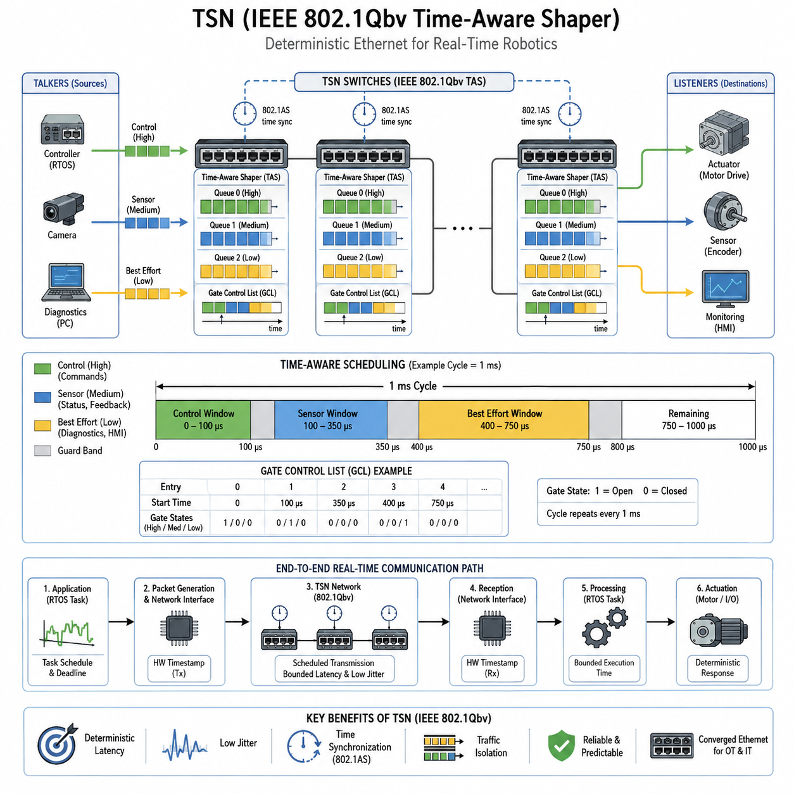
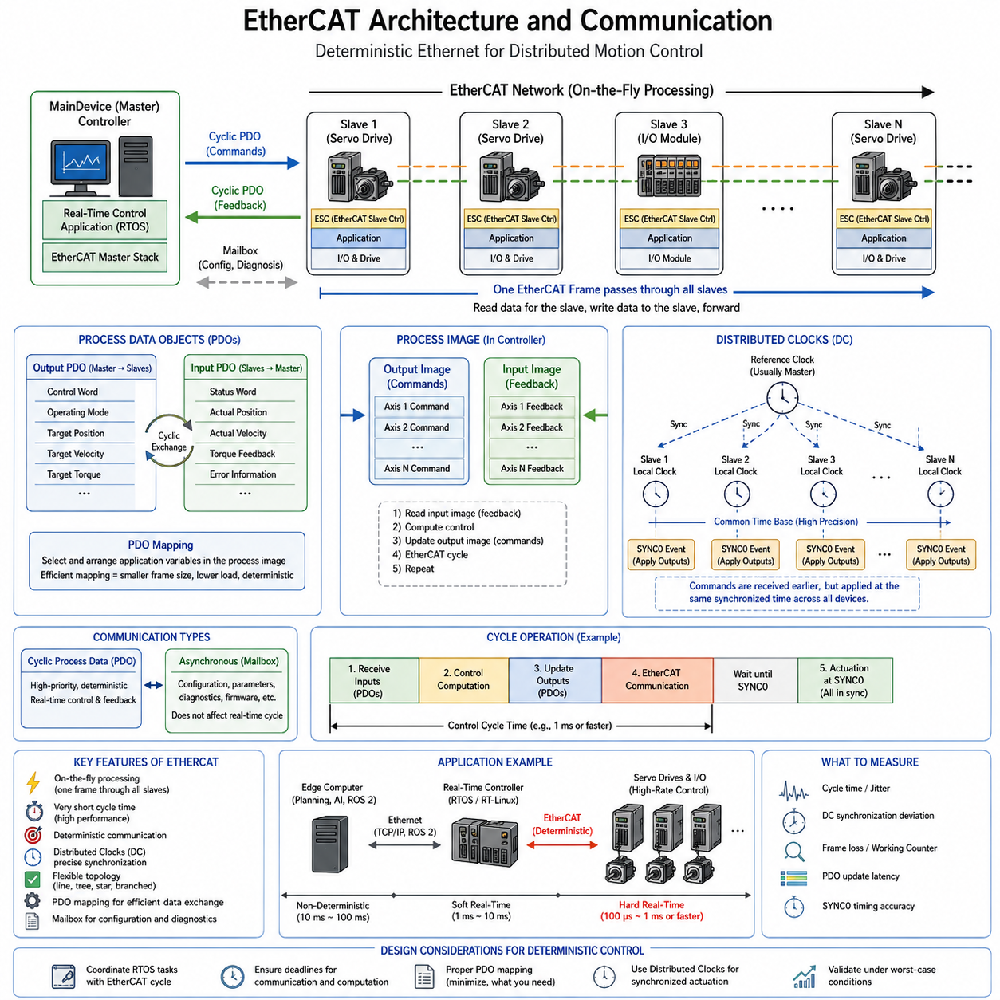
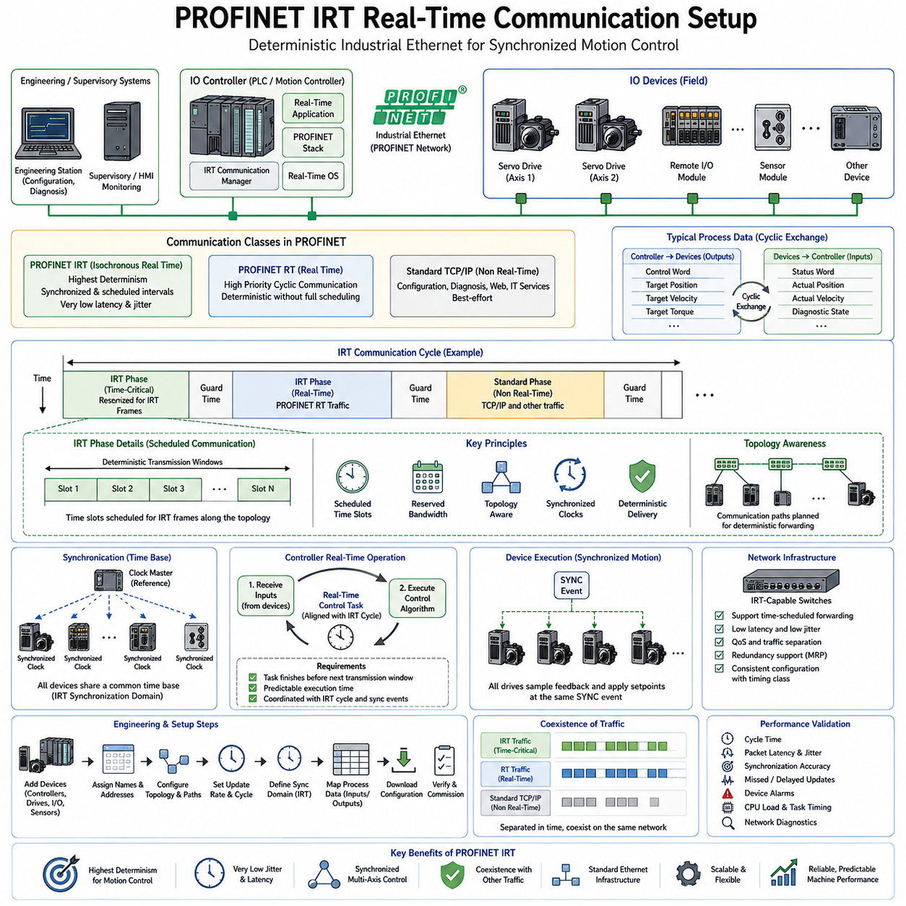
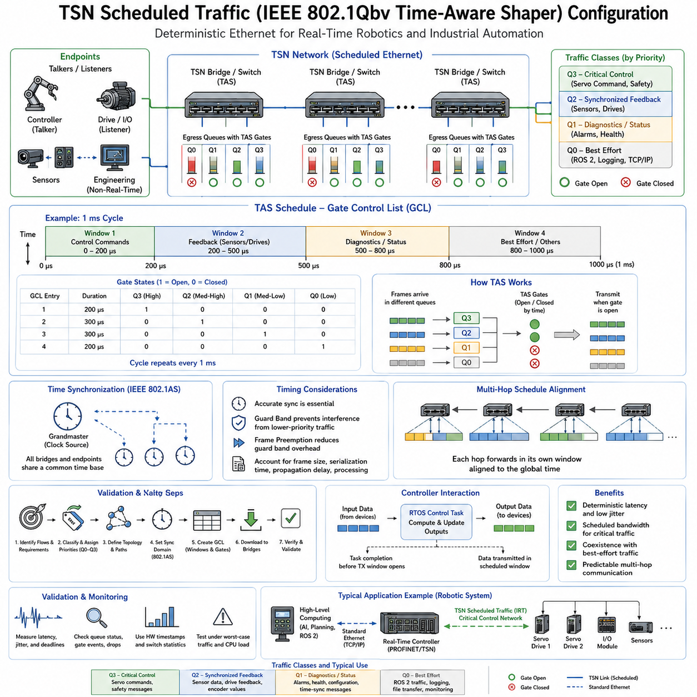
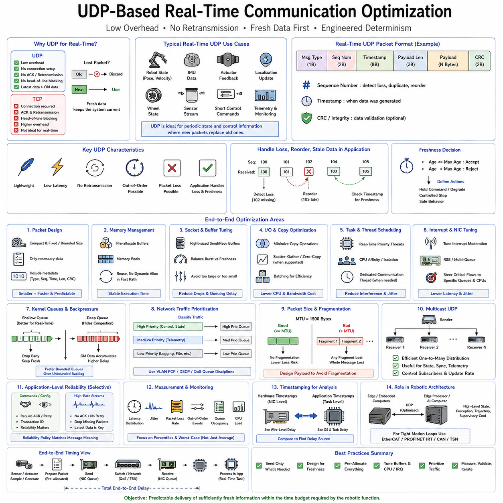
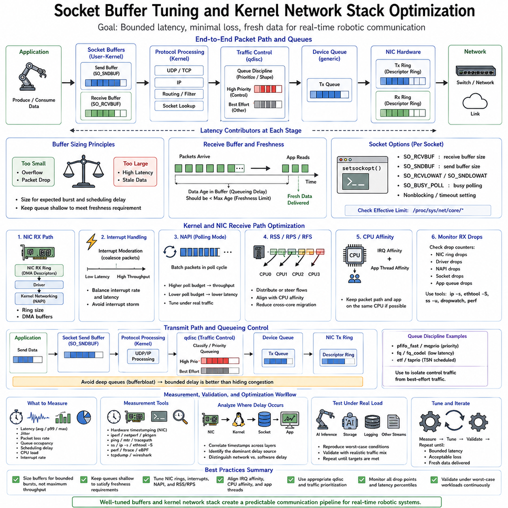
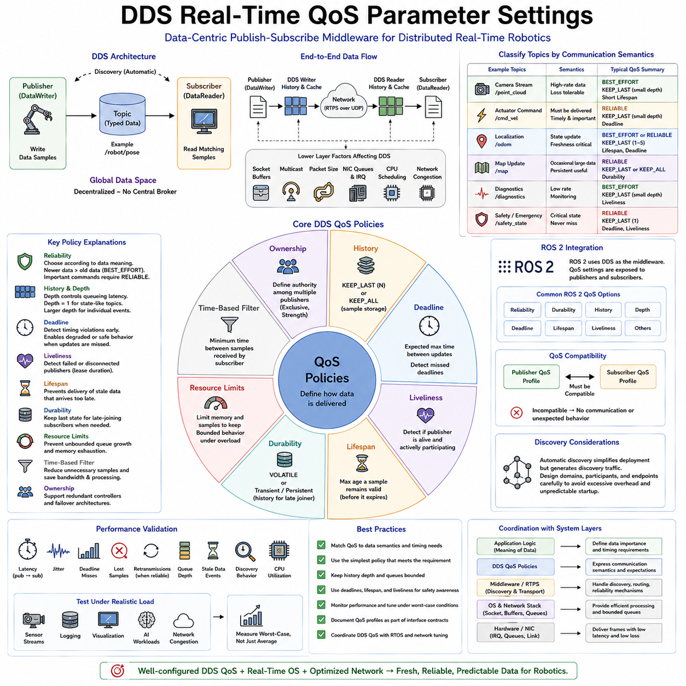
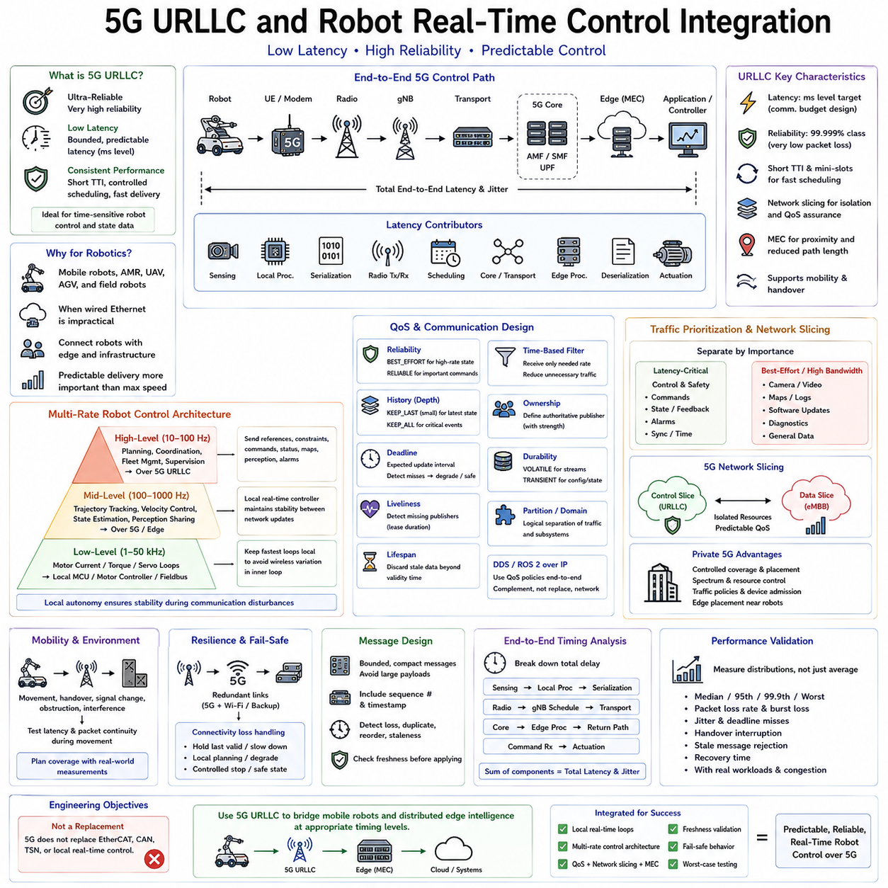
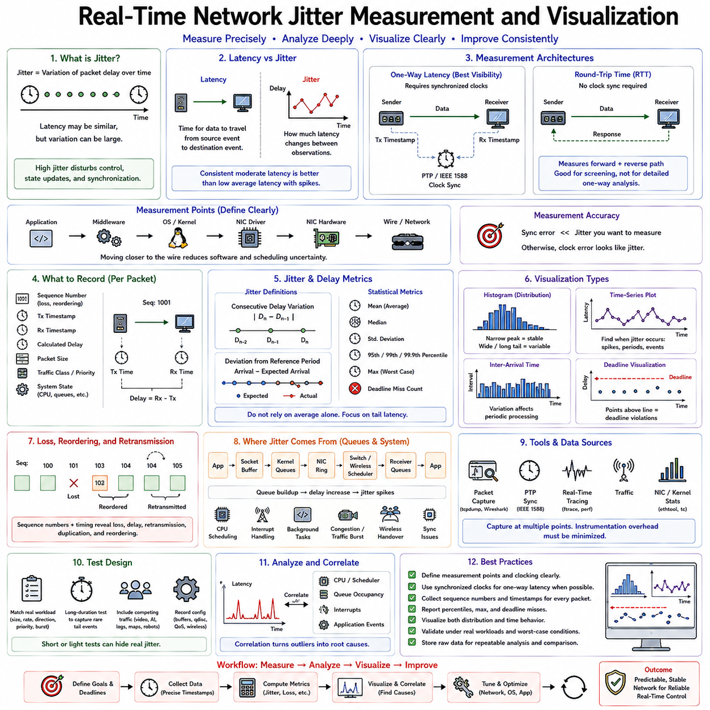
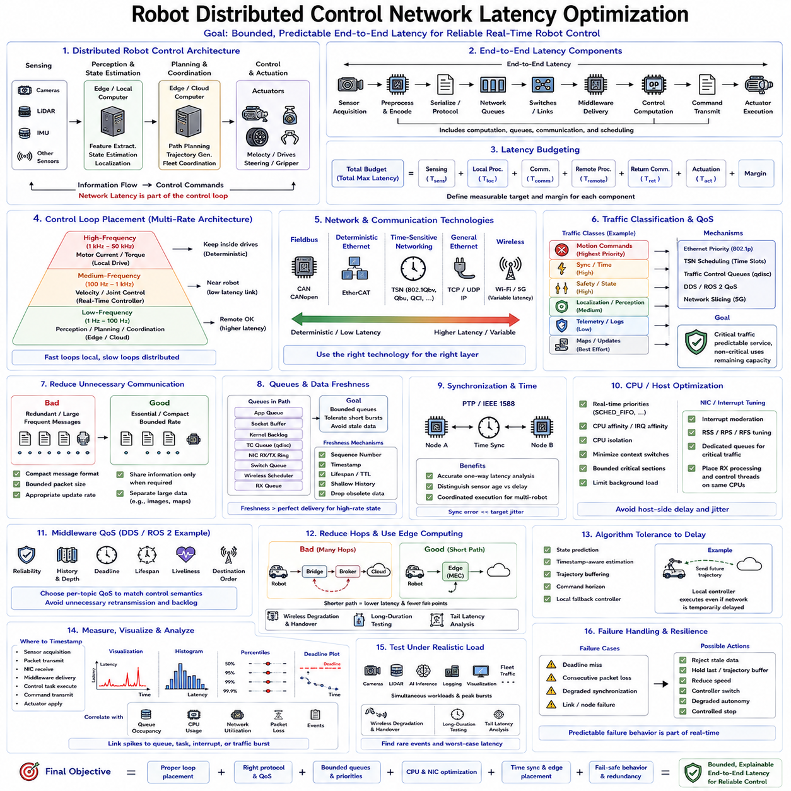

**Volume 03 Real Time Operating Systems**

# 08. Real-Time Networking

## 08.01 Real-Time Ethernet Standards: TSN / IEEE 802.1Qbv

{width="7.268055555555556in" height="7.268055555555556in"}

실시간 이더넷(Real-Time Ethernet)은 기존의 최선형 통신(Best-Effort Communication) 기술인 이더넷(Ethernet)을 제한된 지연시간(Bounded Latency), 낮은 지터(Low Jitter), 동기화된 동작(Synchronized Operation), 예측 가능한 전송(Predictable Delivery)을 지원하는 네트워크 인프라로 확장한다. 이러한 특성은 모터 컨트롤러(Motor Controller), 센서(Sensor), 안전 장치(Safety Device), 엣지 컴퓨터(Edge Computer), 실시간 운영체제(RTOS)가 평균적인 네트워크 성능이 아니라 정확한 시간 제약에 따라 데이터를 교환해야 하는 분산 로봇 시스템(Distributed Robotic System)에 필수적이다.

시간 민감형 네트워킹(Time-Sensitive Networking, TSN)은 표준 이더넷(Standard Ethernet)에서 결정론적 통신(Deterministic Communication)을 제공하도록 설계된 IEEE 802.1 기술군이다. TSN은 별도의 산업용 네트워크를 정의하는 대신 시간 동기화(Time Synchronization), 트래픽 스케줄링(Traffic Scheduling), 대역폭 예약(Bandwidth Reservation), 이중화(Redundancy), 트래픽 셰이핑(Traffic Shaping) 메커니즘을 추가한다. 이를 통해 중요한 제어 트래픽과 일반 이더넷 트래픽이 서로 다른 시간 보장을 받으면서 동일한 물리 네트워크에 공존할 수 있다.

TSN의 핵심 요구사항은 참여하는 장치들이 충분히 일관된 네트워크 시간(Network Time)을 공유하는 것이다. IEEE 802.1AS는 이더넷 브리지(Ethernet Bridge)와 엔드포인트(Endpoint)에 동기화된 시간을 배포하기 위한 일반화 정밀 시간 프로토콜(gPTP) 메커니즘을 제공한다. 컨트롤러, 스위치, 센서, 액추에이터가 공통 시간 기준(Common Time Reference)을 공유하면 패킷 도착 순서와 기존 큐 중재(Queue Arbitration)에만 의존하지 않고 정해진 스케줄에 따라 전송 이벤트를 조정할 수 있다.

IEEE 802.1Qbv는 결정론적 이더넷 통신(Deterministic Ethernet Communication)의 가장 중요한 메커니즘 중 하나인 시간 인식 셰이퍼(Time-Aware Shaper, TAS)를 도입한다. 각 이더넷 출력 포트에는 서로 다른 우선순위와 연결된 트래픽 큐(Traffic Queue)가 존재한다. Qbv는 링크가 사용 가능할 때마다 큐의 데이터를 전송하는 대신 미리 정의된 시간 스케줄에 따라 전송 게이트(Transmission Gate)를 제어하여 특정 트래픽 클래스만 지정된 시간 구간에서 전송되도록 한다.

전송 스케줄(Transmission Schedule)은 일반적으로 게이트 제어 목록(Gate Control List, GCL)을 통해 표현된다. 각각의 GCL 항목은 정의된 시간 간격 동안 어떤 트래픽 게이트가 열리거나 닫히는지를 지정하며, 이러한 항목들은 설정된 주기 시간(Cycle Time)에 따라 반복된다. 따라서 제어 네트워크는 고우선순위 서보 명령(Servo Command)을 위한 시간 구간, 센서 정보를 위한 구간, 진단 또는 최선형 트래픽(Best-Effort Traffic)을 위한 추가 구간을 배정하여 예측 가능한 반복 통신 패턴을 구성할 수 있다.

예를 들어 로봇 컨트롤러(Robot Controller)가 1 ms 제어 주기(Control Cycle)로 동작한다고 가정할 수 있다. 스케줄링된 이더넷 네트워크는 각 주기의 초기 구간을 중앙 컨트롤러에서 관절 또는 구동 컨트롤러로 전달되는 동기화된 명령 프레임(Command Frame)에 예약할 수 있다. 이어지는 시간 구간에는 액추에이터 상태와 피드백 정보를 전송하고, 남은 대역폭은 모니터링 및 비임계 통신에 사용할 수 있다. 결과적으로 네트워크 동작 자체가 로봇 제어 소프트웨어의 시간 구조와 정렬된다.

이러한 스케줄 기반 방식은 일반적인 우선순위 기반 이더넷(Priority-Based Ethernet)과 근본적으로 다르다. 우선순위 메커니즘은 중요한 패킷을 낮은 우선순위 패킷보다 먼저 전송하도록 할 수 있지만, 이미 전송을 시작한 낮은 우선순위 프레임이 일시적으로 링크를 점유하는 상황까지 항상 방지할 수 있는 것은 아니다. TSN 스케줄링은 중요한 통신 구간이 시작되기 전에 간섭 트래픽을 제한할 수 있는 제어된 전송 시간 구간을 제공하여 패킷 전달의 불확실성을 크게 줄인다.

보호 구간(Guard Band)은 낮은 우선순위 이더넷 프레임이 시간 임계 구간(Time-Critical Interval)과 겹치는 것을 방지하기 위해 스케줄된 전송 구간 이전에 설정할 수 있다. 일반적으로 이더넷 프레임은 일단 전송을 시작하면 단순히 중단할 수 없으므로, 네트워크는 스케줄된 게이트가 열리기 전에 충분한 시간을 확보해야 한다. 프레임 선점(Frame Preemption) 메커니즘을 사용하면 적절한 낮은 우선순위 트래픽을 일시 중단하고 높은 우선순위 트래픽 전송 이후 다시 시작하여 이러한 차단 시간을 더욱 줄일 수 있다.

결정론적 통신은 단일 스위치(Switch)의 동작만으로 달성되지 않는다. 종단 간 통신 경로(End-to-End Communication Path)에 존재하는 모든 브리지는 호환 가능한 시간 동기화, 스케줄링, 큐 설정, 전달 동작을 유지해야 한다. 따라서 설계자는 송신 태스크(Transmitting Task)에서 네트워크 인터페이스, 스위치, 물리 링크, 수신 인터페이스, 인터럽트 처리(Interrupt Processing), 최종 목적지 태스크까지 이어지는 전체 경로를 분석해야 한다. 네트워크의 결정성만으로는 애플리케이션 수준의 실시간 동작을 보장할 수 없다.

TSN은 여러 종류의 트래픽 클래스(Traffic Class)가 하나의 이더넷 인프라를 공유해야 하는 환경에서 특히 유용하다. 하드 실시간(Hard Real-Time) 또는 엄격하게 제한된 제어 메시지는 스케줄된 시간 구간을 사용할 수 있으며, 카메라 메타데이터(Camera Metadata), 진단 정보, 설정 메시지, ROS 2 통신, 로깅(Logging), 유지보수 트래픽은 다른 큐 또는 남은 대역폭을 사용할 수 있다. 이러한 통합은 별도의 네트워크 배선을 줄이면서 서로 다른 임계도를 가진 통신 흐름 사이의 논리적·시간적 격리(Logical and Temporal Isolation)를 유지할 수 있게 한다.

로보틱스(Robotics)에서는 실시간 운영체제 스케줄러(RTOS Scheduler)와 TSN 스케줄러(TSN Scheduler)의 관계가 특히 중요하다. 정확한 네트워크 시간에 전송되도록 예약된 패킷은 해당 게이트가 열리기 전에 관련 실시간 태스크에 의해 먼저 생성되어야 한다. 태스크에서 과도한 스케줄링 지연(Scheduling Latency)이나 실행시간 변동(Execution-Time Variation)이 발생하면 패킷이 할당된 전송 구간을 놓칠 수 있다. 따라서 네트워크 스케줄링은 태스크 주기, 데드라인(Deadline), 기상 시간(Wake-Up Time), 최악 실행시간(Worst-Case Execution Time)과 함께 조정되어야 한다.

수신 측에도 동일한 의존성이 존재한다. 예측 가능한 이더넷 패킷 도착이 인터럽트 경합(Interrupt Contention), 드라이버 실행, 메모리 할당, 프로토콜 처리, 낮은 우선순위 애플리케이션 스레드 때문에 지연된다면 예측 가능한 액추에이터 응답으로 자동 연결되지 않는다. 따라서 고품질 실시간 설계에서는 통신 지연을 독립적인 네트워크 지연으로만 보지 않고 태스크 실행, 프로토콜 처리, 큐잉(Queuing), 전송, 스위칭, 수신, 최종 제어 활성화를 포함하는 종단 간 지연 예산(End-to-End Latency Budget)으로 다룬다.

하드웨어 타임스탬핑(Hardware Timestamping)은 이러한 시간 보장을 검증할 때 중요하다. 소프트웨어 타임스탬프(Software Timestamp)는 스케줄링과 네트워크 스택(Network Stack) 실행에서 발생하는 예측하기 어려운 지연을 포함할 수 있지만, 이더넷 MAC 또는 PHY에 가까운 위치에서 획득한 타임스탬프는 실제 프레임 송수신 시간을 더욱 정확하게 나타낸다. 여러 제어 주기에 걸친 측정을 통해 최악 지연시간(Worst-Case Latency), 지터, 동기화 오차, 전송 구간 누락, 비정상적인 큐 동작을 실제 네트워크 부하 조건에서 확인할 수 있다.

TSN은 이 장의 실시간 네트워킹(Real-Time Networking) 구조에서 별도로 다루어지는 이더캣(EtherCAT) 및 프로피넷 IRT(PROFINET IRT)와 같은 특화된 실시간 이더넷 기술과도 구분해야 한다. TSN은 결정론적 네트워킹 기반이 될 수 있는 표준화된 이더넷 메커니즘을 제공하는 반면, 개별 산업용 프로토콜은 자체적인 통신 모델, 장치 통합 방식, 제어 의미론(Control Semantics), 구현 요구사항을 정의한다.

분산 로봇(Distributed Robot)에서는 연산 기능이 MCU 기반 컨트롤러, 임베디드 리눅스(Embedded Linux) 컴퓨터, 엣지 AI 프로세서(Edge AI Processor), 스마트 센서(Smart Sensor), 네트워크 액추에이터(Networked Actuator)로 분리되기 때문에 TSN의 가치가 더욱 커진다. 상위 수준의 인지(Perception)와 AI 추론은 수십 밀리초 단위로 동작하고, 내비게이션과 모션 제어(Motion Control)는 더 짧은 주기로 수행되며, 서보 루프(Servo Loop)는 밀리초 또는 서브밀리초(Sub-Millisecond) 수준에서 실행될 수 있다. 스케줄된 네트워킹은 이러한 서로 다른 시간 영역을 분리하면서도 조정된 데이터 교환을 유지하는 방법을 제공한다.

따라서 실제적인 실시간 네트워크 아키텍처(Real-Time Network Architecture)는 동기화된 클록(Synchronized Clock), 결정론적 태스크 스케줄링(Deterministic Task Scheduling), 제한된 실행시간(Bounded Execution Time), 스케줄된 이더넷 전송(Scheduled Ethernet Transmission), 적절한 큐 격리(Queue Isolation), 하드웨어 타임스탬핑, 지속적인 지연시간 모니터링(Latency Monitoring)을 결합한다. IEEE 802.1Qbv는 단순한 스위치 설정 기능이 아니라 연산과 통신 스케줄을 함께 설계하여 분산된 로봇 구성요소 전체에서 데드라인을 유지하는 종단 간 실시간 아키텍처의 일부로 이해해야 한다.

궁극적인 엔지니어링 목표는 모든 이더넷 패킷을 동일하게 빠르게 만드는 것이 아니라 중요한 정보의 전달을 예측 가능하게 만드는 것이다. TSN은 이더넷 대역폭의 특정 부분을 명시적으로 스케줄된 통신 자원(Scheduled Communication Resource)으로 변환하면서 일반적인 트래픽도 함께 공존할 수 있도록 함으로써 이를 실현한다. 로봇 시스템에서 이러한 구조는 유연하고 높은 대역폭을 제공하는 이더넷 네트워킹과 분산 센싱, 제어, 협조된 액추에이션(Coordinated Actuation)에 요구되는 결정론적 시간 규율(Deterministic Timing Discipline)을 연결하는 기반을 제공한다.

## 08.02 EtherCAT Protocol: Distributed Clocks / PDO Design [w/Code]

{width="7.268055555555556in" height="7.268055555555556in"}

EtherCAT은 고성능 자동화 및 분산 모션 제어 시스템을 위해 설계된 확정적(deterministic) 산업용 이더넷 기술입니다. 개별 장치가 별도의 프레임을 수신, 처리, 재전송하는 기존 이더넷 통신과 달리, EtherCAT은 프레임이 각 슬레이브 장치를 통과하는 동안 데이터를 직관적으로 처리(on-the-fly)합니다. 이러한 메커니즘은 통신 오버헤드를 최소화하고 협동 로봇 제어를 위한 매우 짧고 예측 가능한 주기 시간을 가능하게 합니다.

EtherCAT 네트워크는 일반적으로 전통적으로 마스터라 불리는 하나의 MainDevice와, 이더넷 기반 물리적 토폴로지를 통해 연결된 여러 SubDevice 또는 슬레이브로 구성됩니다. MainDevice는 통신 타이밍을 제어하고 EtherCAT 프레임을 시작하며, 슬레이브 컨트롤러는 프레임이 네트워크를 통과함에 따라 지정된 데이터를 직접 처리합니다. 따라서 모든 필드 장치 사이에 기존의 이더넷 스위칭 동작을 요구하지 않고도 라인, 트리, 스타 및 분기 구조를 구축할 수 있습니다.

EtherCAT의 근본적인 효율성은 하나의 이더넷 프레임을 여러 장치에 걸쳐 처리하는 데서 나옵니다. MainDevice는 모든 액추에이터나 센서에 대해 독립적인 요청과 응답을 전송하는 대신, 여러 노드의 프로세스 데이터를 하나 또는 여러 개의 EtherCAT 데이터그램에 배치합니다. 각 EtherCAT 슬레이브 컨트롤러는 논리적 위치에 지정된 데이터를 읽고, 최소한의 전달 지연으로 통과하는 프레임에 반환 데이터를 삽입합니다.

이 처리 모델은 동기화된 많은 축을 포함하는 로봇 시스템에 특히 효과적입니다. 매니퓰레이터, 휴머노이드, 이동식 플랫폼 또는 자동화된 기계에는 매 제어 주기마다 위치, 속도, 토크, 상태 및 진단 정보를 필요로 하는 수많은 서보 드라이브가 포함될 수 있습니다. EtherCAT은 이러한 분산된 교환을 확정적 주기 통신으로 통합하여, 컨트롤러가 많은 물리적 장치를 하나의 협동 실시간 I/O 시스템으로 다룰 수 있게 합니다.

EtherCAT 통신에는 주기적 프로세스 데이터와 비동기식 구성 또는 진단 통신이 포함됩니다. 주기적 데이터는 컨트롤러와 필드 장치 간의 반복적인 실시간 교환에 최적화되어 있는 반면, 시간에 덜 민감한 정보는 별도로 전송될 수 있습니다. 서보 명령과 피드백은 엄격한 마감 시한을 준수해야 하는 반면, 구성 매개변수, 장치 식별 및 상세 진단은 통상적으로 상당한 수준으로 더 긴 응답 시간을 허용하므로 이러한 구분이 중요합니다.

프로세스 데이터 개체(Process Data Objects, PDO)는 주기적인 실시간 애플리케이션 데이터를 위한 주요 메커니즘을 제공합니다. 출력 PDO는 컨트롤러에서 슬레이브 장치로 명령을 전달하고, 입력 PDO는 측정된 상태와 피드백을 반환합니다. 서보 드라이브에서 매핑된 데이터에는 상태 워드, 실제 위치, 실제 속도, 토크 피드백 및 오류 정보와 함께 제어 워드, 작동 모드, 목표 위치, 목표 속도 또는 목표 토크가 포함될 수 있습니다.

PDO 매핑은 각 주기적 교환에 정확히 어떤 애플리케이션 변수가 참여하고 프로세스 이미지 내에 어떻게 배치되는지 결정합니다. 불필요한 변수는 프레임 크기와 통신 부하를 증가시키므로 효율적인 매핑이 중요합니다. 따라서 실시간 설계는 해당 제어 속도에 필요한 정보만 포함해야 하며, 더 느린 진단 및 구성 매개변수는 모든 고주파 제어 주기를 차지하기보다 적절한 비동기 메커니즘을 통해 처리되어야 합니다.

컨트롤러는 일반적으로 전체 네트워크의 주기적 입력 및 출력 데이터를 나타내는 프로세스 이미지를 유지합니다. 전송 전에 실시간 제어 태스크는 출력 영역의 명령 값을 업데이트합니다. 그런 다음 EtherCAT 통신은 이러한 값을 해당 장치에 분배하고 입력 영역으로 피드백을 수집합니다. 다음 제어 반복은 이 동기화된 피드백을 읽고 새로운 명령을 계산한 후 통신-제어 시퀀스를 반복합니다.

여러 액추에이터가 거의 동일한 물리적 시점에 명령을 실행해야 할 때 동기화는 매우 중요해집니다. 전파 지연, 발진기 차이, 로컬 실행 타이밍으로 인해 개별 장치가 약간씩 다른 시간에 작동할 수 있으므로 통신만으로는 이를 보장할 수 없습니다. 분산 시계(Distributed Clocks, DC)로 흔히 줄여 부르는 EtherCAT 기술은 네트워크 전체의 타이밍 메커니즘을 제공하여 로컬 장치 시계를 매우 높은 정밀도로 맞추고 분산 노드 간의 협동 실행을 가능하게 합니다.

분산 시계는 호환되는 EtherCAT 슬레이브 컨트롤러에 구현된 하드웨어 시계를 사용합니다. 하나의 적절한 시계가 기준(reference)으로 선택되고, 전파 지연과 시계 편차(offset)를 보상할 수 있도록 장치 간의 타이밍 관계가 결정됩니다. 슬레이브 시계는 기준 시간을 기준으로 지속적으로 조정되어, 각 프로세서에서 독립적으로 실행되는 소프트웨어 태스크만으로 수행되는 동기화보다 훨씬 더 정밀한 공유 시간 기반을 생성합니다.

동기화된 시계 시스템을 통해 장치는 아주 정확하게 제어된 시간에 SYNC0 및 SYNC1과 같은 로컬 이벤트를 생성할 수 있습니다. 따라서 서보 드라이브는 EtherCAT 통신 단계 동안 명령 데이터를 수신하지만 정해진 동기화 이벤트에 해당 데이터를 적용할 수 있습니다. 그러면 여러 드라이브가 단순히 개별 이더넷 프레임이 도착하는 때에 반응하는 대신, 동일한 분산 시간 기준에 따라 제어 기능을 업데이트합니다.

통신 시간과 실행 시간의 이러한 분리는 확정적인 다축 제어에 매우 근본적인 요소입니다. MainDevice는 필요한 작동 시점 이전에 PDO 데이터를 전송할 수 있으며, 분산 시계는 관련 제어 동작이 실제로 일어나는 때를 정의합니다. 따라서 통신이 할당된 마감 시한 내에 완료되고 동기화 정확도가 시스템 요구사항 이내로 유지되는 한, 프레임 도착의 미세한 변동을 물리적 제어 이벤트와 격리할 수 있습니다.

전형적인 주기적 EtherCAT 컨트롤러는 RTOS 태스크 일정과 EtherCAT 통신 주기를 조율합니다. 주기가 시작될 때, 센서와 서보 드라이브로부터 동기화된 입력 PDO를 가져옵니다. 제어 알고리즘은 새로운 위치, 속도 또는 토크 명령을 계산하고, 출력 프로세스 이미지를 업데이트하며, 다음 동기화 이벤트 전에 해당 EtherCAT 전송을 시작하거나 완료합니다. 이 패턴은 고정된 제어 주파수에서 반복됩니다.

주기 시간 선택은 액추에이터 동역학, 컨트롤러 연산 시간, 네트워크 크기, 프레임 길이, 장치 처리 지연 및 요구되는 동기화 정확도에 따라 달라집니다. 고성능 모션 시스템은 서브 밀리초 주기로 작동할 수 있는 반면, 요구사항이 낮은 로봇 서브시스템은 더 긴 주기를 사용할 수 있습니다. 중요한 엔지니어링 요구사항은 단순히 가장 짧은 주기를 달성하는 것이 아니라, 최악의 동작 조건에서도 통신과 연산이 마감 시한 전에 일관되게 완료됨을 증명하는 것입니다.

EtherCAT은 또한 주기적 프로세스 데이터 경로에 속하지 않는 통신을 위해 사설함(mailbox) 기반 프로토콜을 지원합니다. 이러한 메커니즘은 구성, 매개변수 액세스, 진단, 펌웨어 관련 정보 및 상위 레벨 프로토콜 서비스를 전달할 수 있습니다. 메일박스 트래픽을 임계 PDO 교환과 분리하면 네트워크 아키텍처가 확정적 주기 동작을 보존하는 동시에 실제 산업 시스템에 필요한 유연한 장치 관리 및 시운전 기능을 제공할 수 있습니다.

많은 모션 제어 애플리케이션에서 EtherCAT은 CoE(CANopen over EtherCAT)라 불리는 표준화된 드라이브 프로파일과 결합됩니다. 이를 통해 익숙한 개체 사전(object dictionary) 개념과 표준화된 드라이브 매개변수가 EtherCAT 전송 메커니즘 위에서 작동할 수 있습니다. 결과적으로 서보 시스템은 구조화된 제어 및 상태 개체를 노출할 수 있고, EtherCAT은 긴밀하게 동기화된 모션에 필요한 고속 확정적 통신과 분산 시계를 제공합니다.

RTOS와 EtherCAT 스택은 독립된 구성요소가 아닌 하나의 타이밍 시스템으로 설계되어야 합니다. 확정적 네트워크는 너무 늦게 깨어나거나, 과도한 선점(preemption)을 겪거나, 예측 불가능하게 메모리를 할당하거나, PDO 업데이트 마감 시한을 놓치는 제어 태스크를 보상할 수 없습니다. 따라서 실시간 구현체는 태스크 우선순위, CPU 선호도(affinity), 인터럽트 처리, DMA 동작, 메모리 동작, EtherCAT 주기 타이밍 및 분산 시계 동기화를 다 함께 조율합니다.

성능 검증은 이더넷 처리량만 측정하기보다 전체 제어 루프 동작을 측정해야 합니다. 중요한 관찰 대상으로는 EtherCAT 주기 시간, 최악의 통신 지연 시간, 주기 지터, 분산 시계 편차, 누락된 프레임, 워킹 카운터(Working Counter) 이상, 지연된 PDO 업데이트, 동기화 이벤트 타이밍 등이 있습니다. 하드웨어 타임스탬프, 오실로스코프 측정, 드라이브 트레이스, RTOS 트레이싱 및 컨트롤러 진단을 결합하여 타이밍 오류가 소프트웨어, 네트워크, 장치 실행 중 어디에서 시작되었는지 식별할 수 있습니다.

분산 로봇의 경우, EtherCAT은 상위 레벨 컴퓨팅 시스템 하위에 위치하는 확정적 하위 제어 네트워크를 형성할 수 있습니다. 엣지 컴퓨터는 인지, 계획, AI 추론 또는 ROS 2 기능을 상대적으로 더 느린 속도로 실행할 수 있는 반면, RTOS 또는 실시간 리눅스 컨트롤러는 훨씬 더 높은 주파수로 모터 드라이브 및 I/O 모듈과 주기적 PDO를 교환합니다. 이는 연산 지능과 확정적인 물리적 작동 사이에 명확한 시간적 경계를 형성합니다.

결과적인 아키텍처는 효율적인 직관적(on-the-fly) 프레임 처리, 주기적 PDO 교환, 정밀한 분산 시계, 동기화된 실행 이벤트, 확정적 RTOS 스케줄링을 결합합니다. 따라서 EtherCAT은 단순히 빠른 이더넷 프로토콜이 아니라 분산 실시간 제어 아키텍처로 이해되어야 합니다. 로봇 공학에서 EtherCAT이 갖는 핵심 가치는 연결된 많은 액추에이터와 센서를 시간적으로 동기화된 하나의 제어 시스템으로 조율하는 능력에 있습니다.

## 08.03 PROFINET IRT Real-Time Communication Setup

{width="7.268055555555556in" height="7.268055555555556in"}

PROFINET은 표준화된 이더넷(Ethernet) 인프라를 통해 컨트롤러(Controller), 분산 입출력(Distributed I/O), 드라이브(Drive), 센서(Sensor), 자동화 장비(Automation Equipment)를 연결하도록 설계된 산업용 이더넷(Industrial Ethernet) 통신 시스템이다. 일반적인 TCP/IP 통신에서 결정론적 실시간 제어(Deterministic Real-Time Control)에 이르는 다양한 통신을 지원한다. 이 구조에서 PROFINET IRT(Isochronous Real Time)는 긴밀하게 동기화된 모션 제어(Motion Control)와 분산 제어(Distributed Control) 애플리케이션을 위해 가장 높은 수준의 시간 결정성(Timing Determinism)을 제공한다.

PROFINET 통신은 일반적으로 IO 컨트롤러(IO Controller), IO 장치(IO Device), 엔지니어링 또는 감독 시스템(Engineering or Supervisory System)을 중심으로 구성된다. IO 컨트롤러는 주기적 프로세스 통신(Cyclic Process Communication)을 관리하고 주요 제어 애플리케이션을 실행하며, IO 장치는 원격 입출력 모듈(Remote I/O Module), 서보 드라이브(Servo Drive), 센서 및 기타 필드 장비를 의미한다. 엔지니어링 스테이션(Engineering Station)은 장치 관계, 네트워크 파라미터, 업데이트 주기, 동기화 도메인(Synchronization Domain), 애플리케이션별 프로세스 데이터 구조를 설정한다.

모든 이더넷 메시지가 동일한 시간 특성을 요구하는 것은 아니기 때문에 PROFINET은 서로 다른 통신 클래스(Communication Class)를 제공한다. 표준 TCP/IP 통신은 설정, 진단, 웹 서비스 및 기타 비임계 데이터를 처리할 수 있다. PROFINET 실시간(Real Time, RT)은 완전히 스케줄된 이더넷 동작 없이 주기적 자동화 트래픽의 우선순위를 높이며, IRT는 엄격하게 제한된 지연시간(Bounded Latency)과 매우 낮은 지터(Jitter)가 필요한 애플리케이션을 위해 동기화되고 예약된 통신 구간을 도입한다.

IRT의 핵심 원리는 네트워크 트래픽의 시간적 분리(Temporal Separation)이다. 모든 이더넷 프레임이 지속적으로 전송 기회를 놓고 경쟁하도록 하는 대신 통신 주기(Communication Cycle)를 제어된 시간 구간으로 나눈다. 높은 결정성을 요구하는 IRT 프레임은 예약된 구간에서 전송되며, 일반적인 실시간 트래픽과 최선형 이더넷 트래픽(Best-Effort Ethernet Traffic)은 주기의 다른 부분을 사용할 수 있다. 이를 통해 중요한 제어 정보에 예측 가능한 네트워크 접근 시간을 제공한다.

따라서 IRT 주기(IRT Cycle)는 참여하는 장치와 스위치 전체에서 조정되는 반복적인 통신 스케줄(Communication Schedule)로 이해할 수 있다. 각 주기에서 예약된 구간은 미리 결정된 통신 계획에 따라 시간 임계 프로세스 데이터(Time-Critical Process Data)를 전송한다. 추가 구간은 덜 중요한 PROFINET 트래픽과 일반 이더넷 통신에 대역폭을 제공한다. 이러한 주기가 지속적으로 반복되면서 분산 제어와 동기화된 액추에이터 동작을 위한 안정적인 시간 프레임워크(Temporal Framework)가 형성된다.

네트워크 장치들이 이러한 스케줄된 통신 구간의 시작과 종료 시점을 동일하게 인식해야 하므로 정밀한 클록 동기화(Clock Synchronization)가 필요하다. PROFINET IRT는 참여하는 컨트롤러, 스위치, 필드 장치의 로컬 클록(Local Clock)이 긴밀하게 정렬된 동기화 타이밍 도메인(Synchronized Timing Domain)을 구성한다. 이러한 공통 시간 기준(Common Time Base)을 통해 프레임 전달과 애플리케이션 이벤트를 제어되지 않은 패킷 도착 시점이 아니라 알려진 네트워크 시간에 맞추어 조정할 수 있다.

동기화 메커니즘(Synchronization Mechanism)은 일반적으로 클록 마스터(Clock Master)를 설정하고 실시간 네트워크를 통해 시간 정보를 배포한다. 각각의 동기화 장치는 시간 차이를 보정하여 로컬 클록을 통신 도메인과 정렬된 상태로 유지한다. 정확한 동기화는 여러 서보 드라이브가 거의 동일한 물리적 시점에 피드백을 샘플링하거나 새로운 설정값(Setpoint)을 적용해야 하는 모션 제어 애플리케이션에서 특히 중요하다.

IRT 통신은 결정론적 스케줄링(Deterministic Scheduling)을 위해 프레임이 네트워크를 통해 이동하는 경로를 알아야 하므로 토폴로지 정보(Topology Information)에도 의존한다. 엔지니어링 도구(Engineering Tool)는 통신 경로를 식별하고 중요한 프레임이 언제 전송되고 전달되어야 하는지를 계산한다. 따라서 스위치 동작, 전파 지연(Propagation Delay), 장치 위치, 스케줄된 전송 기회를 설정 과정에서 고려할 수 있으며 프레임 전달을 동적인 이더넷 중재(Ethernet Arbitration)에만 맡기지 않는다.

일반적인 설정 과정은 PROFINET 장치를 정의하고 IO 컨트롤러와 장치 사이의 논리적 관계를 할당하는 것에서 시작한다. 장치 이름, 네트워크 주소, 모듈 구조, 프로세스 데이터 매핑(Process-Data Mapping), 업데이트 주기(Update Period), 동기화 파라미터를 엔지니어링 환경에서 설정한다. 이후 IRT에 참여하는 장치를 적절한 동기화 도메인과 통신 스케줄에 연결하여 실시간 데이터 교환이 조정된 타이밍 모델(Timing Model)을 따르도록 한다.

컨트롤러와 IO 장치 사이에서 교환되는 프로세스 데이터(Process Data)는 일반적으로 제어 애플리케이션에 필요한 간결한 주기적 정보를 포함한다. 서보 드라이브의 경우 제어 워드(Control Word), 목표 위치(Target Position), 목표 속도(Target Velocity), 목표 토크(Target Torque), 상태 워드(Status Word), 실제 위치(Actual Position), 실제 속도(Actual Velocity), 진단 상태(Diagnostic State) 등이 포함될 수 있다. 원격 I/O 장치도 같은 방식으로 디지털 및 아날로그 값을 교환한다. 효율적인 매핑은 통신 부하를 줄이고 고주파 제어 주기가 필수 제어 변수에 집중하도록 한다.

컨트롤러의 실시간 태스크 스케줄(Real-Time Task Schedule)은 PROFINET 업데이트 주기(Update Cycle)와 조정되어야 한다. 입력 데이터는 제어 알고리즘이 피드백을 처리하고 다음 명령을 계산하여 해당 네트워크 전송 데드라인(Transmission Deadline) 이전에 출력 데이터를 갱신할 수 있을 만큼 충분히 일찍 준비되어야 한다. 제어 태스크의 실행이 너무 늦게 시작되거나 실행시간 변동이 지나치게 크다면 결정론적 네트워크 전송만으로 유효한 제어 데이터가 액추에이터에 제시간에 도착하는 것을 보장할 수 없다.

동기화된 모션(Synchronized Motion)은 네트워크 통신과 장치 수준 애플리케이션 실행 사이의 조정도 요구한다. 서보 드라이브는 IRT를 통해 주기적인 설정값을 수신하고 공유된 시간 기준에 따라 제어 기능을 실행할 수 있다. 따라서 여러 축(Axis)이 엄격하게 제어된 시간 관계를 유지하면서 피드백을 샘플링하고 설정값을 갱신하며 모션 관련 동작을 시작할 수 있다. 이러한 특성으로 IRT는 협조 제어 기계(Coordinated Machine), 로봇 메커니즘(Robotic Mechanism), 다축 자동화 시스템(Multi-Axis Automation System)에 적합하다.

네트워크 스위치(Network Switch)는 IRT 아키텍처에서 핵심 구성요소이다. 일반적인 이더넷 스위치는 주로 주소 테이블, 큐(Queue), 우선순위 메커니즘에 따라 트래픽을 전달하지만, IRT 지원 네트워크 인프라는 결정론적 통신 동작에 참여한다. 따라서 엔지니어링 설계에서는 중요한 통신 경로에 존재하는 장치와 네트워크 구성요소가 필요한 PROFINET 실시간 기능을 지원하고 목표 타이밍 클래스(Timing Class)에 맞게 일관되게 설정되어 있는지를 확인해야 한다.

IRT가 네트워크의 모든 트래픽을 하드 실시간(Hard Real-Time) 트래픽으로 만드는 것은 아니다. 중요한 아키텍처상의 장점 중 하나는 결정론적 제어 통신과 중요도가 낮은 이더넷 서비스가 공존할 수 있다는 것이다. 진단, 엔지니어링 접근, 감독 통신(Supervisory Communication), 일반 TCP/IP 데이터는 계속 사용할 수 있으며 예약된 네트워크 자원이 시간 임계 프로세스 트래픽을 보호한다. 그러나 설계자는 비임계 통신이 필요한 데드라인을 방해하지 않도록 대역폭과 트래픽 패턴을 제어해야 한다.

따라서 PROFINET RT와 IRT의 차이는 단순한 네트워크 속도보다 결정성(Determinism)과 동기화 요구사항(Synchronization Requirement)의 차이로 이해하는 것이 적절하다. RT는 밀리초 수준의 주기적 통신으로 충분한 많은 공장 자동화(Factory Automation) 및 분산 I/O 애플리케이션에 적합하다. 반면 IRT는 협조 모션(Coordinated Motion), 짧은 사이클 타임(Cycle Time), 제한된 지연시간, 매우 낮은 통신 지터가 안정적이고 반복 가능한 물리적 동작을 위해 필요한 보다 까다로운 애플리케이션을 대상으로 한다.

PROFINET IRT를 실시간 운영체제(RTOS) 또는 실시간 리눅스(Real-Time Linux) 컨트롤러와 통합할 때에는 네트워크 설정과 CPU 스케줄링(CPU Scheduling)을 함께 고려해야 한다. 실시간 스레드(Real-Time Thread), 인터럽트 처리(Interrupt Handling), 네트워크 드라이버(Network Driver), DMA 동작, 메모리 동작, 애플리케이션 실행은 모두 종단 간 타이밍 경로(End-to-End Timing Path)에 영향을 준다. CPU 과부하 또는 잘못된 소프트웨어 우선순위 설정은 이더넷 네트워크 자체가 결정론적 전송 구간을 제공하더라도 지연을 발생시킬 수 있다.

유용한 타이밍 모델(Timing Model)은 센서 획득(Sensor Acquisition)에서 실제 액추에이션(Physical Actuation)까지의 전체 경로를 따라간다. 센서 데이터가 샘플링되고 장치 통신 인터페이스로 전달된 후 적절한 IRT 구간에서 전송된다. 컨트롤러가 이를 수신하여 제어 태스크에서 처리하고 새로운 출력 명령을 계산한 다음 후속 스케줄 구간에서 전송하며, 마지막으로 액추에이터가 명령을 적용한다. 이러한 모든 단계가 전체 제어 루프 지연 예산(Control-Loop Latency Budget)의 일부를 소비한다.

따라서 시운전(Commissioning)은 기본적인 이더넷 연결 여부를 확인하는 것만으로 충분하지 않다. 엔지니어는 장치 검색(Device Discovery), 컨트롤러-장치 관계, 토폴로지, 동기화 상태, 업데이트 시간, 프로세스 데이터 매핑, 통신 알람(Communication Alarm), 주기적 동작을 검증해야 한다. 기능적 통신이 설정된 이후에는 진단 및 다른 동시 트래픽이 활성화된 실제적인 네트워크와 CPU 부하 조건에서도 타이밍 요구사항이 유지되는지 시험해야 한다.

성능 검증(Performance Validation)은 평균 처리량(Average Throughput)이 아니라 최악 조건의 동작(Worst-Case Behavior)에 초점을 맞추어야 한다. 주요 관찰 대상에는 사이클 타임, 패킷 지연시간(Packet Latency), 통신 지터, 동기화 정확도(Synchronization Accuracy), 누락되거나 지연된 업데이트, 장치 알람, 제어 태스크 타이밍이 포함된다. 네트워크 진단, 컨트롤러 트레이스(Controller Trace), 하드웨어 측정, 드라이브 트레이스(Drive Trace), RTOS 프로파일링(Profiling)을 연계하면 비정상적인 타이밍의 원인이 애플리케이션, 운영체제, 네트워크 또는 필드 장치 중 어디에서 발생하는지 식별할 수 있다.

분산 로봇 아키텍처(Distributed Robotic Architecture)에서 PROFINET IRT는 실시간 컨트롤러와 서보 드라이브, 분산 I/O, 동기화된 필드 장비를 연결하는 결정론적 계층(Deterministic Layer)을 제공할 수 있다. 동시에 상위 엣지 컴퓨터(Edge Computer)는 상대적으로 느린 주기로 인지(Perception), 계획(Planning), AI 추론(AI Inference), ROS 2, 시각화(Visualization), 플릿 통신(Fleet Communication)을 실행할 수 있다. 이러한 분리는 가변적인 AI 연산 부하가 안전에 중요한 고주파 물리 제어의 타이밍을 직접 결정하지 않도록 한다.

궁극적으로 PROFINET IRT는 단순히 더 빠른 형태의 이더넷이 아니라 종단 간 결정론적 제어 아키텍처(End-to-End Deterministic Control Architecture)의 일부로 이해해야 한다. 그 효과는 동기화된 클록(Synchronized Clock), 스케줄된 통신(Scheduled Communication), 토폴로지 인식 설정(Topology-Aware Configuration), 주기적 프로세스 데이터, 결정론적 컨트롤러 실행, 동기화된 장치 동작을 결합하는 데서 나온다. 이러한 메커니즘을 통해 분산 자동화 및 로봇 구성요소는 서로 조정되고 예측 가능한 실시간 스케줄(Real-Time Schedule)에 따라 동작할 수 있다.

## 08.04 TSN Scheduled Traffic (TAS) Configuration [w/Code]

{width="7.268055555555556in" height="7.268055555555556in"}

시간 민감형 네트워킹 스케줄 트래픽(Time-Sensitive Networking Scheduled Traffic)은 선택된 트래픽 클래스(Traffic Class)가 정확히 언제 전송될 수 있는지를 제어하여 결정론적 이더넷 통신(Deterministic Ethernet Communication)을 제공한다. IEEE 802.1Qbv는 이더넷 송신 큐(Egress Queue)에 시간 제어 게이트(Time-Controlled Gate)를 도입하는 시간 인식 셰이퍼(Time-Aware Shaper, TAS)를 정의한다. TAS는 패킷 우선순위에만 의존하지 않고 반복적인 전송 시간 구간을 생성하여 시간 임계 로봇 및 산업용 트래픽에 네트워크 접근 시간을 예약한다.

TAS를 지원하는 이더넷 포트(Ethernet Port)는 서로 다른 서비스 클래스(Class of Service)를 나타내는 여러 개의 트래픽 큐(Traffic Queue)를 가진다. 각 큐에는 열림(Open) 또는 닫힘(Closed) 상태를 가질 수 있는 전송 게이트(Transmission Gate)가 연결된다. 열린 큐에서 대기하는 프레임은 설정된 스케줄링 규칙에 따라 전송될 수 있지만 닫힌 큐의 프레임은 버퍼에 유지된다. 이러한 게이트 상태를 시간에 따라 조정함으로써 일반적인 공유 이더넷 대역폭을 스케줄된 통신 자원(Scheduled Communication Resource)으로 변환한다.

이러한 게이트의 동작은 게이트 제어 목록(Gate Control List, GCL)에 의해 정의된다. 각 GCL 항목은 게이트 상태 패턴(Gate-State Pattern)과 해당 패턴이 유지되는 시간을 지정한다. 마지막 항목의 실행이 완료되면 일반적으로 설정된 사이클 타임(Cycle Time)에 따라 스케줄이 반복된다. 따라서 GCL은 통신 주기의 각 구간에서 어떤 트래픽 클래스가 이더넷 링크를 사용할 수 있는지를 정의하는 시간적 프로그램(Temporal Program) 역할을 한다.

실제적인 설정은 통신 흐름(Communication Flow)과 각각의 타이밍 요구사항(Timing Requirement)을 식별하는 것에서 시작한다. 서보 명령(Servo Command), 안전 메시지(Safety Message), 동기화된 센서 피드백, 내비게이션 정보, 진단 정보, 최선형 트래픽(Best-Effort Traffic)을 동일하게 처리해서는 안 된다. 설계자는 각 흐름의 주기, 데드라인(Deadline), 최대 프레임 크기, 허용 가능한 지터(Jitter), 임계도(Criticality), 필요한 대역폭을 기준으로 분류한 후 적절한 이더넷 우선순위와 TAS 큐를 할당한다.

예를 들어 1 ms 통신 주기(Communication Cycle)로 동작하는 로봇 네트워크에서는 각 주기의 첫 번째 구간을 높은 우선순위의 제어 명령에 예약할 수 있다. 두 번째 구간에서는 동기화된 센서 및 액추에이터 피드백을 전송하고, 이후 구간에서는 진단 정보, ROS 2 메시지, 로깅(Logging) 또는 기타 비임계 트래픽을 허용할 수 있다. 정확한 시간 할당은 프레임 크기, 링크 속도, 토폴로지(Topology), 전파 지연(Propagation Delay), 처리시간, 애플리케이션의 종단 간 데드라인에 따라 결정된다.

TAS 설정은 참여하는 모든 브리지(Bridge)가 스케줄을 일관되게 해석해야 하므로 동기화된 네트워크 시간 기준(Synchronized Network Time Base)에 의존한다. IEEE 802.1AS 시간 동기화(Time Synchronization)는 컨트롤러, 스위치, 엔드포인트(Endpoint)의 클록을 정렬하기 위해 TSN과 함께 일반적으로 사용된다. 이후 GCL은 공유된 시간 기준을 바탕으로 실행된다. 충분한 클록 동기화가 없다면 동일하게 설정된 게이트 스케줄이라도 실제 물리적 시간에서는 서로 다르게 열려 종단 간 결정론적 동작을 훼손할 수 있다.

여러 타이밍 파라미터(Timing Parameter)가 실제 동작 스케줄을 정의한다. 기준 시간(Base Time)은 설정된 스케줄이 네트워크 시간에 대해 언제 활성화되는지를 나타내며, 사이클 타임은 GCL 패턴이 반복되기까지의 전체 시간을 정의한다. 개별 GCL 항목은 각각의 시간 간격과 게이트 상태를 지정한다. 올바른 설정을 위해서는 이러한 값들이 목표 통신 주기 내에서 일관된 하나의 스케줄을 구성하고 관련된 모든 네트워크 포트에서 서로 정렬되어야 한다.

스케줄된 고우선순위 구간 앞에 낮은 우선순위 트래픽이 존재하는 경우 보호 구간(Guard Band)이 필요한 경우가 많다. 중요한 전송 구간이 시작되기 직전에 큰 최선형 이더넷 프레임이 전송을 시작하면 해당 프레임이 중요한 구간이 시작된 이후까지 링크를 점유할 수 있다. 낮은 우선순위 게이트를 충분히 일찍 닫으면 이러한 간섭을 방지할 수 있다. 필요한 보호 시간은 주로 간섭 가능한 최대 프레임 크기와 물리적 링크의 전송 속도에 의해 결정된다.

프레임 선점(Frame Preemption)은 큰 보호 구간으로 인해 발생하는 대역폭 손실을 줄일 수 있다. 전체 낮은 우선순위 프레임의 전송이 완료될 때까지 기다리는 대신 지원되는 이더넷 메커니즘을 사용하여 적절한 트래픽을 선점 가능 클래스(Preemptable Class)와 익스프레스 클래스(Express Class)로 구분할 수 있다. 중요한 익스프레스 트래픽은 선점 가능한 낮은 우선순위 전송을 중단하고 링크를 더 빠르게 사용할 수 있다. 따라서 높은 링크 활용률과 엄격하게 제한된 지연시간이 동시에 필요한 경우 TAS와 프레임 선점을 상호 보완적으로 사용할 수 있다.

스케줄은 모든 패킷을 순간적인 이벤트로 간주하지 않고 실제 프레임 전송 시간(Frame Transmission Duration)을 고려해야 한다. 프레임은 크기와 링크 속도에 의해 결정되는 유한한 직렬화 시간(Serialization Time) 동안 물리적 링크를 점유한다. 추가적인 프로토콜 오버헤드, 전파 지연, 브리지 전달 동작(Bridge Forwarding Behavior), 구현별 타이밍 마진(Timing Margin)도 고려해야 한다. 그렇지 않으면 명목상 충분해 보이는 전송 구간이 최악 조건에서 실제로는 부족해질 수 있다.

다중 홉 네트워크(Multi-Hop Network)에서는 중요한 프레임이 목적지에 도달하기 전에 여러 개의 스케줄된 스위치를 통과할 수 있으므로 TAS 설정이 더욱 복잡해진다. 모든 스위치에서 동일한 시간에 동일한 게이트를 여는 것만으로는 충분하지 않을 수 있다. 프레임이 각 하위 포트의 전송 기회가 시작되기 전에 해당 포트에 도착해야 하기 때문이다. 따라서 종단 간 스케줄 설계는 전체 경로의 전달 순서, 전파 지연, 큐 체류시간(Queue Residence Time), 동기화 오차를 고려한다.

유용한 설계 방식은 스케줄된 트래픽을 네트워크를 통과하는 파이프라인(Pipeline)으로 다루는 것이다. 컨트롤러가 할당된 소스 전송 구간에서 제어 프레임을 방출하면 첫 번째 브리지가 호환되는 슬롯에서 이를 전달하고, 이후의 브리지들은 예상 도착시간에 맞추어 연속적인 전송 기회를 제공한다. 적절하게 구성된 스케줄은 불필요한 큐 대기시간을 방지하고 종단 간 통신 지연시간에 대해 계산 가능한 상한을 제공한다.

실시간 운영체제 애플리케이션 스케줄(RTOS Application Schedule)은 이러한 네트워크 파이프라인과 조정되어야 한다. 스케줄된 트래픽을 생성하는 제어 태스크(Control Task)는 해당 TAS 게이트가 열리기 전에 연산을 완료해야 한다. 패킷이 전송 구간이 닫힌 이후 준비되면 다음 통신 주기까지 기다려야 할 수 있으며, 이는 일반적인 네트워크 지터보다 훨씬 큰 지연을 발생시킬 수 있다. 따라서 태스크 릴리스 시간(Task Release Time)과 네트워크 전송 시간을 함께 설계해야 한다.

수신 타이밍(Reception Timing)도 동일한 수준의 주의가 필요하다. 센서 또는 제어 프레임이 예측 가능한 시간에 도착하면 수신 애플리케이션 역시 불필요한 소프트웨어 지연 없이 데이터를 처리할 수 있도록 스케줄되어야 한다. 인터럽트 처리(Interrupt Processing), 네트워크 드라이버 실행, DMA 완료, 프로토콜 스택(Protocol Stack) 동작, 스레드 우선순위, 메모리 경합(Memory Contention)은 모두 애플리케이션 수준의 지연을 증가시킬 수 있다. TAS의 이더넷 계층 보장이 상위 소프트웨어의 결정론적 실행까지 자동으로 보장하는 것은 아니다.

큐 할당(Queue Assignment) 역시 중요한 설정 항목이다. IEEE 802.1Q 우선순위 정보는 프레임을 트래픽 클래스로 분류하고 이를 송신 큐에 매핑하는 데 사용할 수 있다. 설계자는 중요한 트래픽이 전체 네트워크 경로에서 의도된 스케줄 큐에 배치되는지 확인해야 한다. 잘못된 우선순위 매핑(Priority Mapping), VLAN 설정 또는 브리지 정책(Bridge Policy)은 결정론적 트래픽 흐름을 스케줄되지 않은 큐에 배치하여 시스템 설계 단계에서 설정한 타이밍 가정을 무효화할 수 있다.

설정 과정에서는 높은 우선순위의 게이트를 계속 열어 두기보다는 비임계 트래픽을 위한 대역폭도 유지해야 한다. 결정론적 큐가 링크를 독점하면 엔지니어링 접근, 진단, 소프트웨어 업데이트, 모니터링 및 기타 서비스가 허용하기 어려운 수준으로 차단될 수 있다. 효과적인 TAS 설계는 중요한 통신 흐름에 필요한 대역폭만 예약하고 모든 실시간 데드라인을 유지하면서 낮은 우선순위 트래픽을 위한 통신 기회를 의도적으로 제공한다.

스케줄 검증(Schedule Validation)은 정상적인 동작뿐만 아니라 최악 조건의 트래픽(Worst-Case Traffic)을 대상으로 해야 한다. 최대 예상 프레임 전송률, 동시 센서 동작, 진단 트래픽, 대용량 최선형 데이터 전송, CPU 부하 및 경합을 유발할 수 있는 다른 조건을 시험해야 한다. 엔지니어는 모든 스케줄 프레임이 올바른 큐에 진입하고, 게이트가 열리기 전에 준비되며, 할당된 슬롯 내에서 각 브리지를 통과하고, 데드라인 이전에 목적지에 도달하는지를 확인해야 한다.

하드웨어 타임스탬핑(Hardware Timestamping)은 TAS 성능을 측정하는 효과적인 방법을 제공한다. 이더넷 MAC에 가까운 위치에서 획득한 송수신 타임스탬프를 예상 스케줄과 비교하여 실제 패킷 방출 시간(Release Time), 지연시간, 지터, 동기화 오차를 측정할 수 있다. 또한 스위치 통계와 큐 카운터(Queue Counter)를 사용하면 애플리케이션 수준의 측정만으로는 확인하기 어려운 지연 프레임, 비정상적인 큐 점유, 게이트 위반 또는 패킷 손실을 식별할 수 있다.

분산 로봇 아키텍처(Distributed Robotic Architecture)에서 TAS는 완전히 독립적인 물리 네트워크를 구축하지 않고도 서로 다른 통신 시간 영역을 분리할 수 있다. 고주파 모터 또는 액추에이터 명령은 엄격하게 제어된 시간 구간을 사용하고, 동기화된 센서 트래픽은 별도의 스케줄 클래스를 사용하며, 엣지 컴퓨팅(Edge Computing) 또는 ROS 2 트래픽은 남은 대역폭을 사용할 수 있다. 따라서 하나의 네트워크에서 서로 다른 시간 요구사항을 지원하면서 이기종 컴퓨팅 구성요소 사이의 표준 이더넷 연결성을 유지할 수 있다.

따라서 전체 설정은 애플리케이션 주기(Application Period), RTOS 스케줄링, 트래픽 분류, 큐 매핑, 클록 동기화, GCL 항목, 보호 구간, 브리지 스케줄, 엔드포인트 처리를 하나의 타이밍 모델로 연결해야 한다. IEEE 802.1Qbv는 독립적인 스위치 기능이 아니라 종단 간 실시간 아키텍처(End-to-End Real-Time Architecture)의 일부로 다룰 때 가장 효과적이다. 적절한 TAS 설정은 이더넷 전송 기회를 예측 가능한 자원으로 변환하여 연산시간과 함께 체계적으로 시간 예산을 할당할 수 있게 한다.

궁극적인 엔지니어링 목표는 단순히 반복되는 게이트 테이블(Gate Table)을 설정하는 것이 아니라 중요한 정보가 전체 분산 시스템을 알려진 시간적 경계(Temporal Boundary) 내에서 이동하도록 보장하는 것이다. 동기화된 클록, 올바른 트래픽 분류, 세밀하게 계산된 GCL 스케줄, 결정론적 소프트웨어 실행, 최악 조건 검증이 결합되면 TSN 스케줄 트래픽(TSN Scheduled Traffic)은 긴밀하게 조정된 로봇 센싱과 제어에 필요한 예측 가능한 통신 기반을 제공할 수 있다.

## 08.05 UDP-Based Real-Time Communication Optimization [w/Code]

{width="7.268055555555556in" height="7.268055555555556in"}

UDP는 프로토콜 오버헤드(Protocol Overhead)가 작고 필수적인 연결 설정(Connection Establishment), 확인 응답(Acknowledgment), 재전송(Retransmission), 순서 보장(In-Order Delivery)을 요구하지 않기 때문에 실시간 로봇 통신(Real-Time Robotic Communication)에 널리 사용된다. TCP와 달리 UDP는 이후 데이터를 전달하기 전에 손실된 모든 패킷을 복구하려 하지 않는다. 이러한 특성은 오래된 메시지를 복구하는 것보다 최신 센서 또는 제어 정보를 빠르게 전달하는 것이 중요한 환경에서 유용하다.

재전송 기능이 없다고 해서 UDP가 본질적으로 결정론적(Deterministic)인 것은 아니다. 패킷은 여전히 애플리케이션 스케줄링 지연(Application Scheduling Delay), 커널 처리(Kernel Processing), 큐잉(Queueing), 인터럽트 지연(Interrupt Latency), 스위치 경합(Switch Contention), 패킷 손실(Packet Loss), 순서 변경(Reordering)의 영향을 받을 수 있다. 따라서 실시간 UDP 설계는 단순히 UDP를 전송 프로토콜로 선택하는 것이 아니라 전체 통신 경로를 제어하는 데 초점을 맞추며, 예측 가능성은 애플리케이션, 운영체제, 네트워크 인터페이스, 물리 네트워크 전체에서 설계되어야 한다.

UDP는 새로운 패킷이 이전 패킷을 대체할 수 있는 주기적 상태 정보(Periodic State Information)에 특히 적합하다. 로봇 자세(Robot Pose), 속도(Velocity), 휠 상태(Wheel State), IMU 측정값, 액추에이터 피드백(Actuator Feedback), 위치추정 업데이트(Localization Update), 짧은 제어 명령 등이 대표적인 예이다. 1 kHz 제어 스트림에서 하나의 패킷이 손실되었을 때 재전송을 기다리는 것보다 다음의 최신 샘플을 처리하는 것이 더 유용할 수 있다. 따라서 애플리케이션은 손실, 중복, 순서 변경, 오래된 데이터(Stale Data)를 어떻게 처리할 것인지 명시적으로 정의해야 한다.

간결한 패킷 형식(Compact Packet Format)은 직렬화 시간(Serialization Time), 메모리 복사(Memory Copy), 캐시 부담(Cache Pressure), 처리 오버헤드를 줄인다. 실시간 메시지는 수신 태스크에 필요한 정보만 포함하고 필요에 따라 메시지 유형(Message Type), 시퀀스 번호(Sequence Number), 타임스탬프(Timestamp), 페이로드 길이(Payload Length), 무결성 정보(Integrity Information)와 같은 필수 메타데이터를 포함해야 한다. 고정 크기 또는 제한된 크기의 메시지는 메모리 소비와 처리시간을 더욱 쉽게 예측할 수 있다는 점에서 특히 유용하다.

시퀀스 번호는 전송 계층(Transport Layer)의 재전송을 추가하지 않고도 수신기가 누락되거나 중복되거나 순서가 변경된 데이터그램(Datagram)을 식별할 수 있게 한다. 타임스탬프는 데이터가 언제 수신되었는지가 아니라 언제 생성되었는지를 나타낸다. 이 두 정보를 함께 사용하면 제어 애플리케이션이 오래된 정보를 거부하고, 통신 지연을 추정하며, 패킷 누락을 감지하고, 최신 상태 정보가 현재 제어 주기에서 사용할 수 있을 만큼 유효한지를 판단할 수 있다.

실시간 UDP 애플리케이션은 고주파 통신 경로에서 불필요한 동적 메모리 할당(Dynamic Memory Allocation)을 피해야 한다. 버퍼(Buffer)는 초기화 과정에서 미리 할당하고 동작 중 반복적으로 재사용할 수 있다. 고정 메모리 풀(Fixed Memory Pool), 사전 할당된 패킷 구조(Preallocated Packet Structure), 제한된 큐(Bounded Queue)는 예측하기 어려운 메모리 할당 지연과 단편화(Fragmentation)를 감소시킨다. 목표는 시스템이 장시간 동작한 이후에도 패킷 생성과 수신 처리 비용이 안정적으로 유지되도록 하는 것이다.

복사 동작(Copy Operation) 역시 최소화해야 한다. 애플리케이션 버퍼, 커널 버퍼, 드라이버 메모리 사이에서 발생하는 추가적인 데이터 전송은 CPU 시간과 메모리 대역폭을 소비하기 때문이다. 운영체제와 네트워크 인터페이스가 지원하는 경우 분산-수집 입출력(Scatter-Gather I/O), 메모리 재사용(Memory Reuse), 배칭(Batching), 적절한 제로 카피(Zero-Copy) 메커니즘을 통해 오버헤드를 줄일 수 있다. 그러나 최적화 과정에서도 명확한 버퍼 소유권(Buffer Ownership)을 유지하여 동시 실행 태스크 사이에서 경쟁 상태(Race Condition)가 발생하지 않도록 해야 한다.

소켓 설정(Socket Configuration)은 실시간 부하 조건에서 통신 동작에 큰 영향을 준다. 송신 및 수신 버퍼 크기는 과도한 큐잉 지연을 만들지 않으면서 예상되는 짧은 버스트(Burst)를 흡수할 수 있을 만큼 충분해야 한다. 지나치게 큰 버퍼는 오래된 패킷을 계속 축적하여 혼잡을 숨길 수 있으며, 너무 작은 버퍼는 패킷 손실을 증가시킨다. 적절한 설정은 일시적인 버스트에 대한 허용 능력과 수신 데이터가 애플리케이션에 충분히 최신 상태로 유지되어야 한다는 요구 사이에서 균형을 맞춘다.

블로킹 동작(Blocking Behavior)은 태스크 아키텍처(Task Architecture)에 따라 선택해야 한다. 전용 통신 스레드(Dedicated Communication Thread)는 데이터를 기다리는 동안 효율적으로 블로킹할 수 있지만, 주기적인 실시간 제어 태스크는 무기한 정지를 방지하기 위해 논블로킹 동작(Nonblocking Operation) 또는 제어된 폴링(Controlled Polling)을 사용할 수 있다. 타임아웃(Timeout)은 제한된 값으로 설정하고 애플리케이션 데드라인과 연계해야 한다. 하드 타이밍 경로(Hard Timing Path)의 네트워크 동작이 제어 주기의 가용 시간 예산을 넘어 예측 불가능하게 블로킹되어서는 안 된다.

리눅스 기반 실시간 시스템(Linux-Based Real-Time System)은 세밀한 스레드 스케줄링(Thread Scheduling)과 CPU 배치를 통해 UDP 동작을 개선할 수 있다. 필요한 경우 통신 스레드에 실시간 스케줄링 정책(Real-Time Scheduling Policy)을 적용할 수 있으며, CPU 어피니티(CPU Affinity)를 사용하여 중요 처리를 관련 없는 작업 부하로부터 격리할 수 있다. 네트워크 인터럽트와 수신 처리 역시 특정 CPU에 의도적으로 할당할 수 있다. 목표는 패킷 처리, 제어 연산, AI 작업 부하, 로깅, 일반 운영체제 작업 사이의 간섭을 줄이는 것이다.

인터럽트 처리(Interrupt Handling)는 패킷 지연시간과 지터에 큰 영향을 준다. 네트워크 인터페이스는 하드웨어 이벤트를 생성하고, 애플리케이션이 데이터그램을 수신하기 전에 드라이버 및 커널 처리가 수행된다. 높은 트래픽 속도에서는 인터럽트 조절(Interrupt Moderation)을 통해 여러 이벤트를 묶어 CPU 오버헤드를 줄일 수 있지만, 과도한 조절은 지연시간을 증가시킨다. 따라서 실시간 최적화에서는 인터럽트 빈도, CPU 사용률, 처리량(Throughput), 최악 패킷 전달시간 사이의 균형을 맞추어야 한다.

네트워크 인터페이스 카드(Network Interface Card, NIC)의 큐와 수신 측 스케일링(Receive Side Scaling, RSS)은 패킷 처리를 여러 CPU 코어에 분산할 수 있어 높은 처리량이 필요한 시스템에서 유용하다. 그러나 제어되지 않은 분산은 캐시 이동(Cache Migration)과 스케줄링 변동을 발생시킬 수 있다. 중요한 UDP 흐름은 특정 수신 큐와 CPU로 패킷을 유도하여 네트워크 처리가 실시간 애플리케이션 스레드 가까이에서 수행되도록 하고 불필요한 코어 간 이동(Cross-Core Movement)을 방지하는 것이 유리할 수 있다.

커널 소켓 버퍼(Kernel Socket Buffer)와 네트워크 큐(Network Queue)는 전체 지연 경로의 일부로 고려해야 한다. 큐 용량을 증가시키는 것이 반드시 실시간 성능을 향상시키는 것은 아니며, 깊은 큐는 패킷의 체류시간(Residence Time)을 증가시킬 수 있다. 실시간 시스템에서는 제어되지 않은 백로그(Backlog) 증가보다 제한된 큐와 명시적인 패킷 폐기를 선호하는 경우가 많다. 새로운 상태 정보가 이전 상태를 대체하는 경우 오래된 패킷을 폐기하는 것이 모든 버퍼링된 데이터그램을 결국 전달하는 것보다 시간적 정확성(Temporal Correctness)을 더 잘 유지할 수 있다.

트래픽 우선순위화(Traffic Prioritization)는 공유 이더넷 네트워크에서 UDP 성능을 추가로 개선할 수 있다. VLAN 우선순위 코드 포인트(Priority Code Point), 차등 서비스 표시(Differentiated Services Marking), 운영체제 큐 규율(Queue Discipline)을 사용하여 중요한 데이터그램을 로깅, 파일 전송, 시각화 및 기타 트래픽과 분리할 수 있다. 우선순위 메커니즘은 경합을 줄이지만 엄격한 결정성과 동일한 개념은 아니다. 더 강한 시간 보장이 필요하다면 UDP 트래픽을 스케줄된 전송 자원을 제공하는 TSN 네트워크 위에서 사용할 수 있다.

패킷 크기(Packet Size)는 실제 네트워크의 최대 전송 단위(Maximum Transmission Unit, MTU)와 호환되도록 유지해야 한다. IP 단편화(IP Fragmentation)는 추가적인 처리 비용을 발생시키며, 하나의 프래그먼트(Fragment)가 손실되었을 때 전체 논리 메시지가 손실될 가능성을 높인다. 따라서 실시간 프로토콜은 가능한 경우 단편화를 피하도록 페이로드 크기를 설계해야 한다. 큰 센서 데이터가 필요한 경우 명시적인 식별자와 타이밍 정책을 갖는 제한된 애플리케이션 수준 프래그먼트로 분할할 수 있다.

멀티캐스트 UDP(Multicast UDP)는 송신자가 각 목적지마다 별도의 데이터를 전송하지 않고도 동일한 상태 정보를 여러 수신자에게 효율적으로 배포할 수 있다. 이는 로봇 상태, 동기화 정보, 텔레메트리(Telemetry), 공유된 인지 결과(Perception Result)에 유용하다. 그러나 불필요한 구독자, 스위치 플러딩(Switch Flooding), 과도한 업데이트 속도가 네트워크 대역폭을 소비하고 더 중요한 통신의 경합을 증가시킬 수 있으므로 멀티캐스트 트래픽을 신중하게 제어해야 한다.

애플리케이션 수준 신뢰성(Application-Level Reliability)은 TCP의 기능을 그대로 재현하는 대신 선택적으로 적용해야 한다. 중요한 설정 명령은 확인 응답, 재시도(Retry), 트랜잭션 식별자(Transaction Identifier)가 필요할 수 있지만, 고주파 센서 스트림은 손실된 패킷을 단순히 폐기할 수 있다. 일부 명령은 확인 응답을 기다리는 대신 중복 전송(Redundant Transmission), 유효기간(Validity Period), 시퀀스 검사를 사용할 수 있다. 신뢰성 정책은 각 메시지가 가지는 시간적 의미와 안전 중요도(Safety Importance)를 반영해야 한다.

송신자와 수신자는 데이터 신선도 제약(Freshness Constraint)도 정의해야 한다. 패킷이 성공적으로 도착하더라도 타임스탬프가 최대 허용 데이터 연령(Maximum Acceptable Age)을 초과했다면 더 이상 유용하지 않을 수 있다. 따라서 실시간 통신에서는 전송 유효성(Transport Validity)뿐만 아니라 시간적 유효성(Temporal Validity)도 필요하다. 필요한 업데이트가 허용된 시간 내에 수신되지 않으면 제어 소프트웨어는 신선도 타이머(Freshness Timer)를 이용하여 성능 저하 모드, 명령 유지, 제어된 정지(Controlled Stop) 또는 사전에 정의된 안전 동작으로 전환할 수 있다.

평균 UDP 지연시간은 제어 시스템을 불안정하게 만들 수 있는 드문 지연을 숨길 수 있으므로 측정(Measurement)이 필수적이다. 엔지니어는 패킷 지연시간 분포(Packet Latency Distribution), 지터, 패킷 손실률(Packet-Loss Rate), 순서 변경 이벤트, 소켓 큐 점유율, 스케줄링 지연, 인터럽트 타이밍, CPU 부하를 수집해야 한다. 실시간 데드라인을 만족할 수 있는지를 판단할 때 평균값보다 백분위수(Percentile)와 관측된 최대 지연시간이 더 중요한 경우가 많다.

하드웨어 타임스탬핑(Hardware Timestamping)은 실제 네트워크 지연과 소프트웨어 스케줄링 지연을 분리할 수 있게 한다. 네트워크 인터페이스에 가까운 위치에서 획득한 송신 및 수신 타임스탬프는 유선 네트워크 수준의 동작(Wire-Level Behavior)을 보다 명확하게 보여주며, 애플리케이션 타임스탬프(Application Timestamp)는 추가적인 운영체제 및 태스크 지연을 보여준다. 이러한 측정값을 비교하면 지터가 물리 네트워크, 네트워크 드라이버, 커널 스택 또는 실시간 애플리케이션 중 어디에서 발생하는지를 판단할 수 있다.

로봇 아키텍처(Robotic Architecture)에서 최적화된 UDP는 낮은 지연시간과 유연한 이더넷 통신이 필요하지만 특수 필드버스(Fieldbus) 수준의 결정성이 필요하지 않은 임베디드 컴퓨터와 엣지 프로세서(Edge Processor) 사이에 적합한 경우가 많다. 상위 수준의 상태 정보, 인지 결과, 궤적(Trajectory), 감독 명령(Supervisory Command)은 UDP를 사용할 수 있으며, 모터 전류 제어나 긴밀하게 동기화된 서보 루프는 시스템 요구사항에 따라 EtherCAT, PROFINET IRT, CAN 기반 제어 또는 TSN에 유지할 수 있다.

따라서 견고한 아키텍처는 UDP를 종단 간 타이밍 설계(End-to-End Timing Design)의 하나의 계층으로 다룬다. 패킷 구조, 타임스탬프, 시퀀스 번호, 메모리 할당, 소켓 버퍼, 스레드 우선순위, CPU 어피니티, 인터럽트 라우팅(Interrupt Routing), 큐 규율, 이더넷 우선순위, 애플리케이션 안전 동작을 함께 설계해야 한다. 목표는 모든 패킷의 전달을 보장하는 것이 아니라 로봇 기능에 요구되는 시간 예산 내에서 충분히 최신의 정보가 예측 가능하게 전달되도록 하는 것이다.

## 08.06 Socket Buffer Tuning and Kernel Network Stack Optimization [w/Code]

{width="7.268055555555556in" height="7.268055555555556in"}

소켓 버퍼 튜닝(Socket Buffer Tuning)은 패킷이 애플리케이션에 도달하기 전에 여러 개의 큐(Queue)를 통과하기 때문에 실시간 네트워크 최적화(Real-Time Network Optimization)의 중요한 부분이다. 패킷은 네트워크 인터페이스 카드(Network Interface Card, NIC), 커널 수신 경로(Kernel Receive Path), 프로토콜 처리 큐, 소켓 버퍼(Socket Buffer), 그리고 최종적으로 애플리케이션에서 대기할 수 있다. 각각의 버퍼링 단계는 일시적인 트래픽 버스트(Traffic Burst)를 흡수하지만, 과도한 버퍼링은 지연시간을 증가시키고 오래된 데이터(Stale Data)가 축적되도록 만들 수 있다.

리눅스 소켓 통신(Linux Socket Communication)은 일반적으로 애플리케이션과 네트워크 스택(Network Stack) 사이에서 커널이 관리하는 송신 및 수신 버퍼를 사용한다. 수신 버퍼(Receive Buffer)는 애플리케이션이 데이터를 처리할 때까지 들어오는 데이터를 임시 저장하고, 송신 버퍼(Send Buffer)는 프로토콜 및 장치 처리를 기다리는 출력 데이터를 저장한다. 따라서 버퍼 용량은 패킷 손실, 버스트 허용 능력, 메모리 사용량, 처리량(Throughput), 큐잉 지연(Queueing Delay)에 영향을 주므로 실시간 통신에서 중요한 설정 요소가 된다.

대용량 소켓 버퍼(Large Socket Buffer)는 트래픽 버스트를 흡수하고 처리량을 유지하는 데 도움이 되므로 대용량 데이터 전송(Bulk Data Transfer)에서는 유리한 경우가 많다. 그러나 실시간 시스템의 목표는 다르다. 큰 수신 버퍼는 모든 패킷을 보존하면서 제어 애플리케이션에 전달되는 데이터의 연령(Data Age)을 증가시킬 수 있다. 로봇 상태 및 센서 스트림에서는 오래된 패킷을 늦게 수신하는 것보다 해당 패킷을 폐기하고 최신 샘플을 즉시 처리하는 것이 더 유용할 수 있다.

지나치게 작은 버퍼는 반대의 문제를 발생시킨다. 스케줄링 지연(Scheduling Delay), 인터럽트 처리(Interrupt Processing), 일시적인 CPU 경합(CPU Contention)으로 인해 짧은 트래픽 버스트가 발생하면 애플리케이션이 데이터를 읽을 기회를 얻기 전에 소켓 큐가 넘칠 수 있다. 따라서 적절한 버퍼 크기는 예상되는 단기적인 변동을 수용하면서도 제어되지 않는 백로그(Backlog)를 방지할 수 있어야 한다. 버퍼 튜닝은 패킷 전송률, 패킷 크기, 애플리케이션 주기, 최대 허용 데이터 연령을 기반으로 수행해야 한다.

애플리케이션은 SO_RCVBUF와 SO_SNDBUF 같은 소켓 옵션(Socket Option)을 통해 소켓 버퍼 크기를 설정할 수 있다. 운영체제는 이러한 버퍼가 얼마나 커질 수 있는지를 제한하는 시스템 수준의 한계값(System-Level Limit)도 관리한다. 따라서 실시간 튜닝에서는 애플리케이션의 요청값과 커널 제한을 모두 이해해야 한다. 실제 커널 설정을 확인하지 않고 소켓 옵션만 증가시키면 의도한 용량을 얻지 못할 수 있으며, 지나치게 큰 전역 제한값(Global Limit)은 불필요한 메모리 소비를 유발할 수 있다.

버퍼 크기는 임의로 선택하기보다 통신 작업 부하(Communication Workload)를 기반으로 결정해야 한다. 스트림이 알려진 주기로 패킷을 생성하고 각 패킷의 크기가 제한되어 있다면 예상되는 최대 스케줄링 지연 동안 도착할 데이터 양을 대략적으로 계산할 수 있다. 추가적인 여유 용량은 짧은 버스트를 흡수할 수 있지만, 버퍼링된 정보가 제어 기능의 데이터 신선도 요구사항(Freshness Requirement)을 초과하지 않도록 큐를 충분히 얕게 유지해야 한다.

수신 처리(Receive Processing)는 소켓 버퍼에 도달하기 이전부터 시작된다. 네트워크 인터페이스 카드(NIC)는 들어오는 프레임을 하드웨어 수신 큐(Hardware Receive Queue)에 배치하며, 일반적으로 DMA 버퍼를 사용하는 디스크립터 링(Descriptor Ring)을 이용한다. 이후 드라이버가 완료된 디스크립터를 처리하고 패킷을 커널 네트워킹 서브시스템(Kernel Networking Subsystem)으로 전달한다. 따라서 링 크기, 인터럽트 동작, CPU 스케줄링, 패킷 처리 속도는 애플리케이션 수준의 소켓 큐에 도달하기 전부터 지연시간에 영향을 줄 수 있다.

큰 NIC 수신 링(Receive Ring)은 트래픽 버스트가 발생할 때 패킷 손실을 줄일 수 있지만 추가적인 큐잉 공간도 생성한다. 지속적인 과부하 상태에서는 커널이 패킷을 처리하기 전에 패킷이 하드웨어 큐에서 대기할 수 있다. 따라서 실시간 최적화에서는 하드웨어와 소프트웨어 수준 모두에 동일한 원칙을 적용해야 한다. 즉, 제한된 변동을 흡수할 만큼 충분한 버퍼링을 제공하되 혼잡이 숨겨진 지연시간(Hidden Latency)으로 변환될 정도로 많은 버퍼를 제공해서는 안 된다.

리눅스는 일반적으로 인터럽트 기반 처리와 폴링 기반 패킷 처리 사이의 균형을 맞추기 위해 NAPI(New API)를 사용한다. 낮은 트래픽 속도에서는 인터럽트를 통해 패킷에 빠르게 대응하고, 부하가 증가하면 NAPI가 폴링(Polling)을 통해 여러 패킷을 효율적으로 처리한다. 이는 처리량을 향상시키고 인터럽트 폭주(Interrupt Storm)를 방지하지만, 한 번의 처리 주기에서 수행되는 작업량은 중요한 통신 흐름의 지연시간에 영향을 줄 수 있다. 따라서 실시간 시스템에서는 실제적인 트래픽 조건에서 NAPI의 동작을 평가해야 한다.

인터럽트 조절(Interrupt Moderation)도 중요한 파라미터이다. NIC는 여러 패킷을 함께 처리하기 위해 인터럽트를 짧은 시간 지연시킬 수 있으며, 이를 통해 CPU 오버헤드를 줄이고 처리량을 향상시킬 수 있다. 그러나 지연시간에 민감한 제어 트래픽에서는 과도한 인터럽트 병합(Interrupt Coalescing)이 추가적인 지연과 지터(Jitter)를 발생시킬 수 있다. 반대로 모든 인터럽트 조절을 비활성화하는 것도 CPU에 과도한 인터럽트를 발생시킬 수 있으므로 항상 최적이라고 할 수 없다. 설정에서는 인터럽트 비용과 요구되는 최악 지연시간 사이의 균형을 맞추어야 한다.

수신 측 스케일링(Receive Side Scaling, RSS)은 들어오는 네트워크 흐름을 여러 하드웨어 큐와 CPU 코어에 분산한다. 이는 특히 높은 네트워크 처리량을 다루는 멀티코어 시스템에서 확장성(Scalability)을 향상시킨다. 그러나 실시간 애플리케이션에서는 최대 분산보다 예측 가능한 CPU 배치가 더 중요할 수 있다. 중요한 통신 흐름을 특정 수신 큐와 CPU로 유도하면 캐시 이동(Cache Migration), 스케줄러 간섭(Scheduler Interference), 코어 간 패킷 처리(Cross-Core Packet Processing)를 감소시킬 수 있다.

수신 패킷 스티어링(Receive Packet Steering, RPS)과 수신 흐름 스티어링(Receive Flow Steering, RFS)은 네트워크 처리가 실행되는 위치를 제어하기 위한 추가적인 소프트웨어 메커니즘을 제공한다. 이러한 기능은 하드웨어 RSS 기능이 제한된 경우 부하 분산을 향상시킬 수 있지만, CPU 사이에서 불필요한 이동이 발생하면 타이밍 변동이 증가할 수 있다. 따라서 실시간 설계에서는 가능한 경우 패킷 처리, 인터럽트 어피니티(Interrupt Affinity), 애플리케이션 스레드 어피니티(Application Thread Affinity)를 정렬하여 중요한 데이터가 안정적인 CPU 실행 경로를 따르도록 해야 한다.

송신 경로(Transmit Path)에도 유사한 큐잉 단계가 존재한다. 애플리케이션 데이터는 소켓 송신 버퍼에 들어간 후 프로토콜 처리 및 트래픽 제어(Traffic Control) 메커니즘을 통과하고, 네트워크 장치 큐(Network-Device Queue)를 거쳐 최종적으로 NIC 송신 링(Transmit Ring)에 배치된다. 어느 단계에서든 혼잡이 발생하면 지연시간이 증가할 수 있다. 따라서 애플리케이션 내부에서 소비된 시간만 측정해서는 실제 통신 타이밍의 전체 모습을 파악할 수 없다.

일반적으로 큐디스크(qdisc)라고 하는 리눅스 큐 규율(Linux Queue Discipline)은 패킷이 네트워크 인터페이스를 통해 전송되기 전에 어떻게 대기하는지를 제어한다. 범용 설정은 경쟁하는 여러 통신 흐름 사이에서 처리량과 공정성(Fairness)의 균형을 맞추도록 설계되지만, 실시간 애플리케이션에서는 명시적인 우선순위화(Prioritization) 또는 제한된 큐가 필요할 수 있다. 트래픽 제어 메커니즘은 제어 패킷을 로깅, 시각화, 파일 전송 및 기타 트래픽과 분리하여 비임계 통신이 과도한 지연을 발생시키지 않도록 할 수 있다.

송신 경로 전체에서 큐 깊이(Queue Depth)를 제어해야 한다. 깊게 버퍼링된 네트워크 인터페이스는 물리적 링크에 혼잡이 발생하더라도 계속 패킷을 받아들일 수 있으며, 이 경우 애플리케이션에서는 전송이 성공한 것처럼 보이지만 실제 프레임은 상당한 시간 동안 큐에 남아 있을 수 있다. 이러한 현상은 버퍼블로트(Bufferbloat)의 원인이 된다. 실시간 시스템에서는 점점 오래된 패킷을 축적하여 처리량을 유지하는 것보다 과부하를 조기에 감지하고 지연시간을 제한하는 방식을 일반적으로 선호한다.

비지 폴링(Busy Polling)은 특수한 저지연 애플리케이션에서 스레드가 인터럽트 기반의 기상(Wake-Up)에만 의존하지 않고 수신 패킷을 능동적으로 확인하도록 하여 기상 지연을 줄일 수 있다. 이를 통해 지연시간의 일관성을 향상시킬 수 있지만 CPU 사용률과 전력 소비가 증가한다. 따라서 중요한 통신 스레드에 선택적으로 적용하고 로봇 시스템의 나머지 연산 요구사항과 비교하여 평가해야 한다.

네트워킹 경로 내부의 메모리 할당(Memory Allocation)도 예측 가능성에 영향을 줄 수 있다. 커널은 패킷 버퍼와 디스크립터를 관리해야 하며, 애플리케이션 역시 자체 메시지 구조를 할당할 수 있다. 실시간 소프트웨어는 가능한 경우 재사용 가능한 애플리케이션 버퍼를 미리 할당하고 고주파 루프에서 불필요한 메모리 할당을 피해야 한다. 실시간 리눅스 환경에서는 메모리 잠금(Memory Locking)과 세밀한 자원 할당을 통해 페이지 폴트(Page Fault) 및 기타 예측하기 어려운 지연을 추가로 줄일 수 있다.

CPU 격리(CPU Isolation)는 네트워크 스택 튜닝을 보완할 수 있다. 실시간 통신 태스크를 격리된 CPU에서 실행하고 관련 없는 작업 부하는 다른 CPU로 이동시킬 수 있다. 네트워크 IRQ 어피니티(IRQ Affinity)와 패킷 처리 작업 역시 이러한 구조에 맞추어 조정해야 한다. 애플리케이션 스레드만 격리하고 네트워크 인터럽트가 다른 CPU에서 예측 불가능하게 실행되도록 하면 코어 간 통신, 캐시 영향, 스케줄링 변동이 여전히 발생할 수 있다.

프로토콜 처리(Protocol Processing) 자체도 지연시간에 영향을 준다. UDP는 일반적으로 TCP보다 적은 전송 계층 상태와 처리 비용을 요구하지만, 두 프로토콜 모두 IP 라우팅, 필터링, 소켓 검색(Socket Lookup), 큐잉, 장치 드라이버 계층을 통과한다. 방화벽 규칙(Firewall Rule), 패킷 필터링, 가상 네트워크 장치(Virtual Network Device), 컨테이너(Container), 브리지, 네트워크 네임스페이스(Network Namespace)는 추가적인 처리 단계를 만들 수 있다. 실시간 배포에서는 필요한 보안과 격리를 유지하면서 중요한 통신 경로에서 불필요한 계층을 제거해야 한다.

버퍼와 큐를 튜닝할 때 커널 통계(Kernel Statistics)를 모니터링하는 것이 필수적이다. 패킷 손실은 NIC 링, 드라이버 처리, 커널 백로그 큐(Kernel Backlog Queue), 소켓 수신 버퍼 또는 애플리케이션 수준 큐에서 발생할 수 있다. 애플리케이션에서 관측되는 패킷 손실 수치만으로는 혼잡이 어디에서 발생했는지 알 수 없다. 인터페이스 통계, 소켓 통계, 큐 카운터(Queue Counter), 커널 트레이싱(Kernel Tracing), 드라이버 정보를 연계하여 손실 또는 지연을 발생시키는 정확한 단계를 식별해야 한다.

지연시간 측정(Latency Measurement)은 네트워크 지연과 커널 및 애플리케이션 지연을 구분해야 한다. NIC에 가까운 위치에서 획득한 하드웨어 타임스탬프(Hardware Timestamp)는 실제 송수신 타이밍을 추정할 수 있으며, 커널 및 애플리케이션 타임스탬프는 추가적인 처리 지연을 보여준다. RTOS 또는 리눅스 트레이싱(Linux Tracing)을 이용하여 패킷 도착 시점과 인터럽트 처리, 스케줄러 동작, 소켓 기상(Socket Wake-Up), 애플리케이션 실행을 연계하면 관측된 지터에 대한 종단 간 설명을 구성할 수 있다.

최적화는 항상 최악 조건의 동시 작업 부하(Worst-Case Concurrent Workload)에서 검증해야 한다. 유휴 상태에서 정상적으로 동작하는 설정도 AI 추론(AI Inference), 스토리지 접근(Storage Access), 시각화, 로깅 또는 추가 센서 스트림이 CPU와 메모리 대역폭을 소비하면 실패할 수 있다. 시험에서는 실제적인 패킷 전송률과 백그라운드 트래픽을 재현하면서 최대 지연시간, 높은 백분위 지연시간(High-Percentile Latency), 패킷 손실, 큐 점유율, CPU 부하, 스케줄링 지연을 기록해야 한다.

로봇 시스템에서 소켓 및 커널 튜닝(Socket and Kernel Tuning)의 목표는 최대 네트워크 처리량이 아니라 제한된 통신 지연시간(Bounded Communication Delay)을 확보하는 것이다. NIC 링, 인터럽트 조절, 커널 큐, 소켓 버퍼, CPU 어피니티, 애플리케이션 스케줄링, 트래픽 제어를 하나의 통합된 파이프라인(Coordinated Pipeline)으로 설정해야 한다. 각각의 큐를 의도적으로 제한하고 처리 자원을 적절하게 정렬하면 리눅스 네트워킹은 실시간 로봇 통신을 위해 훨씬 더 예측 가능한 동작을 제공할 수 있다.

## 08.07 DDS Real-Time QoS Parameter Settings [w/Code]

{width="7.268055555555556in" height="7.268055555555556in"}

데이터 분산 서비스(Data Distribution Service, DDS)는 분산 실시간 시스템(Distributed Real-Time System)과 로보틱스(Robotics)에서 널리 사용되는 데이터 중심 발행-구독(Data-Centric Publish-Subscribe) 통신 표준이다. 애플리케이션이 명시적인 점대점 연결(Point-to-Point Connection)을 직접 관리하도록 요구하는 대신, DDS는 타입이 정의된 데이터 토픽(Typed Data Topic)을 중심으로 통신을 구성한다. 발행자(Publisher)는 토픽에 데이터 샘플을 기록하고 구독자(Subscriber)는 일치하는 샘플을 수신하며, 미들웨어(Middleware)는 설정된 서비스 품질(Quality of Service, QoS) 정책에 따라 검색, 전달, 필터링, 신뢰성 및 타이밍 동작을 관리한다.

DDS 통신은 분산된 참여자(Participant)가 데이터 라이터(DataWriter)와 데이터 리더(DataReader)를 통해 정보를 교환하는 글로벌 데이터 공간(Global Data Space)을 중심으로 구성된다. DataWriter는 토픽(Topic)에 연결된 샘플을 발행하고 호환되는 DataReader는 해당 토픽을 구독한다. 참여자들은 중앙 브로커(Centralized Broker) 없이 동적으로 서로를 검색할 수 있다. 이러한 분산형 아키텍처(Decentralized Architecture)는 여러 컨트롤러, 센서, 엣지 컴퓨터(Edge Computer), 소프트웨어 구성요소가 독립적으로 시작하거나 종료될 수 있는 로봇 시스템에 적합하다.

서비스 품질(Quality of Service, QoS)은 서로 다른 로봇 데이터 스트림이 근본적으로 다른 통신 요구사항을 가지기 때문에 DDS의 핵심 요소이다. 고속 카메라 스트림, 액추에이터 명령, 위치추정 결과(Localization Estimate), 지도 업데이트(Map Update), 진단 메시지, 비상 상태(Emergency State)가 반드시 동일한 전달 정책을 사용할 필요는 없다. DDS QoS는 모든 토픽에 하나의 공통 네트워크 동작을 강제하는 대신 각각의 데이터 흐름별로 통신 의미론(Communication Semantics)을 설정할 수 있도록 한다.

신뢰성 QoS(Reliability QoS) 정책은 통신이 최선형(BEST_EFFORT) 또는 신뢰형(RELIABLE) 의미론으로 동작할지를 결정한다. BEST_EFFORT는 복구 오버헤드를 최소화하고 일부 샘플의 손실을 허용하므로 새로운 데이터가 오래된 데이터를 빠르게 대체하는 고주파 정보에 적합하다. RELIABLE 통신은 확인 응답(Acknowledgment)과 재전송(Retransmission) 등의 프로토콜 메커니즘을 통해 데이터 전달을 보장하려고 하므로 중요한 명령이나 상태 전환(State Transition)의 손실을 허용할 수 없는 경우에 유용하다.

신뢰성은 RELIABLE이 항상 우수하다고 가정하기보다 데이터의 의미에 따라 선택해야 한다. 오래된 센서 샘플을 재전송하면 이미 새로운 측정값이 존재하는 상황에서도 지연시간과 네트워크 부하가 증가할 수 있다. 반대로 설정 명령이나 중요한 상태 변화에는 신뢰성 있는 전달이 필요할 수 있다. 따라서 실시간 DDS 설계에서는 각 토픽에 대해 정보 신선도(Information Freshness), 전달 보장(Delivery Assurance), 대역폭 소비, 데드라인 요구사항 사이의 균형을 맞추어야 한다.

히스토리 QoS(History QoS) 정책은 통신 과정에서 얼마나 많은 데이터 샘플을 유지할지를 결정한다. KEEP_LAST는 설정된 수의 최신 샘플만 저장하고 KEEP_ALL은 자원 제한(Resource Limit)의 범위에서 관련된 모든 샘플을 보존하려 한다. 실시간 로봇 상태 스트림은 최신 샘플의 가치가 가장 높기 때문에 일반적으로 작은 깊이(Depth)를 가진 KEEP_LAST를 사용한다. 큰 히스토리는 메모리 사용량을 증가시키고 소비자의 처리 속도가 느려질 경우 오래된 정보가 축적되도록 만들 수 있다.

히스토리 깊이(History Depth)는 큐잉 지연(Queueing Latency)과 밀접한 관계가 있다. 구독자가 데이터를 처리하는 속도보다 발행자가 데이터를 생성하는 속도가 빠르면 깊은 큐는 많은 샘플을 보존할 수 있지만 결국 시간적으로 오래된 정보를 전달하게 된다. 상태형 토픽(State-Like Topic)에서는 최신 값만 중요한 경우 깊이 1이 유용하며, 각각의 이벤트를 개별적으로 처리해야 하는 경우에는 더 큰 깊이가 적합할 수 있다. 따라서 큐 깊이는 단순한 편의성이 아니라 애플리케이션 의미론(Application Semantics)에 따라 결정해야 한다.

데드라인 QoS(Deadline QoS) 정책은 연속적인 데이터 업데이트 사이에서 예상되는 최대 시간 간격을 표현한다. 발행자가 액추에이터 피드백을 매 밀리초마다 생성하거나 위치추정 정보를 정의된 주기마다 생성해야 하는 경우 DDS는 예상된 업데이트 데드라인이 지켜지지 않았음을 감지할 수 있다. 데드라인 모니터링(Deadline Monitoring)이 통신 장애를 자동으로 복구하는 것은 아니지만, 애플리케이션이 타이밍 위반을 감지하고 성능 저하 모드 또는 안전 동작을 시작할 수 있도록 미들웨어 수준의 가시성을 제공한다.

활성 상태 QoS(Liveliness QoS)는 데이터를 발행하는 엔티티가 여전히 정상적으로 동작하고 시스템에 적극적으로 참여하고 있는지를 다룬다. DDS는 설정된 정책과 임대 기간(Lease Duration)에 따라 활성 상태를 모니터링할 수 있으며, 이를 통해 구독자는 예상된 발행자가 사라지거나 활동 상태를 더 이상 알리지 않는 상황을 감지할 수 있다. 분산 로보틱스에서는 이를 통해 상위 기능의 동작에 필요한 컨트롤러, 인지 프로세스, 센서 게이트웨이(Sensor Gateway) 또는 기타 구성요소의 장애를 식별할 수 있다.

수명 QoS(Lifespan QoS) 정책은 데이터 샘플이 전달에 유효한 상태로 유지되는 시간을 제한한다. 설정된 수명이 만료되면 미들웨어는 해당 샘플을 오래된 데이터로 취급할 수 있다. 이는 성공적인 데이터 전달 자체가 데이터의 유용성을 보장하지 않는 실시간 상태 정보에서 특히 중요하다. 지연된 속도 명령, 장애물 관측 정보 또는 로봇 자세(Robot Pose)는 시간적 유효성(Temporal Validity)이 만료되면 위험하거나 의미가 없어질 수 있다.

내구성 QoS(Durability QoS)는 이전에 발행된 정보를 나중에 참여한 구독자도 사용할 수 있어야 하는지를 결정한다. 휘발성(VOLATILE) 통신에서는 일반적으로 참여자들이 활성 상태로 연결된 동안 생성된 샘플만 제공되며, 보다 지속적인 내구성 모드에서는 선택된 과거 상태를 유지할 수 있다. 동적 설정 정보 또는 시스템 상태 정보는 내구성을 활용할 수 있지만, 고주파 센서 스트림은 일반적으로 새롭게 참여한 구독자에게 오래된 샘플을 전달할 필요가 없다.

자원 제한 QoS(Resource Limits QoS)는 DDS가 통신을 위해 유지할 수 있는 메모리 크기와 샘플 수를 제한한다. 이러한 제한은 무제한적인 큐 증가가 메모리 압박(Memory Pressure)과 예측하기 어려운 실행 동작을 발생시킬 수 있기 때문에 실시간 시스템에서 특히 중요하다. 자원 제한은 히스토리 설정, 예상 발행 주기, 구독자의 처리 속도, 최대 버스트 조건과 함께 조정하여 과부하 상황에서도 미들웨어 동작이 제한된 범위 내에서 유지되도록 해야 한다.

시간 기반 필터 QoS(Time-Based Filter QoS)는 구독자가 수신해야 하는 샘플 사이의 최소 시간 간격을 지정할 수 있도록 한다. 센서는 높은 주파수로 데이터를 발행할 수 있지만 시각화 또는 감독 구성요소(Supervisory Component)는 그중 일부 업데이트만 필요할 수 있다. 통신 계층 가까이에서 불필요한 샘플을 필터링하면 처리량과 대역폭 소비를 줄일 수 있다. 이를 통해 느린 소비자가 분산 로봇 시스템에 불필요한 부하를 발생시키는 것을 방지할 수 있다.

소유권 QoS(Ownership QoS)는 여러 라이터가 동일한 정보를 제공하는 경우 특정 데이터 인스턴스(Data Instance)에 대해 어떤 발행자가 책임을 가질 것인지를 정의할 수 있다. 배타적 소유권(Exclusive Ownership)에서는 발행자 강도(Publisher Strength)를 사용하여 현재 어떤 라이터가 데이터를 제어할지를 결정할 수 있다. 이 메커니즘은 이중화 컨트롤러(Redundant Controller) 또는 장애조치(Failover) 아키텍처를 지원할 수 있지만, 장애 발생 시 권한이 어떻게 전환되고 충돌하는 명령을 어떻게 방지할지는 시스템 수준의 안전 로직에서 별도로 정의해야 한다.

파티션(Partition)과 토픽 구성은 통신 도메인 사이의 논리적 분리(Logical Separation)를 제공한다. 대규모 로봇 시스템에는 모션 제어, 인지(Perception), 위치추정(Localization), 진단, 안전, 플릿 관리(Fleet Management) 데이터가 포함될 수 있으며 이들이 모두 무분별하게 상호작용해서는 안 된다. 신중하게 설계된 토픽 이름, 네임스페이스(Namespace), 도메인, 파티션 정책은 의도하지 않은 결합을 줄이고 각 기능 서브시스템의 타이밍 및 신뢰성 요구사항에 따라 QoS 프로파일을 할당하기 쉽게 만든다.

DDS 구현은 일반적으로 참여자 사이의 통신을 위해 실시간 발행-구독 상호운용성 프로토콜(Real-Time Publish-Subscribe, RTPS)을 사용한다. RTPS는 검색과 데이터 교환을 처리하며 전송 계층으로 UDP를 사용하는 경우가 많다. 따라서 DDS를 사용한다고 해서 하위 네트워크 고려사항이 사라지는 것은 아니다. 소켓 버퍼, 멀티캐스트(Multicast) 동작, 패킷 크기, 네트워크 우선순위, NIC 큐, CPU 스케줄링, 물리적 이더넷 혼잡은 여전히 DDS 애플리케이션에서 관측되는 지연시간과 지터에 영향을 줄 수 있다.

많은 DDS 참여자가 존재하는 경우 검색 트래픽(Discovery Traffic)에 특별한 주의가 필요하다. 자동 검색(Automatic Discovery)은 분산 시스템의 배포를 단순화하지만 많은 참여자와 엔드포인트가 존재하거나 프로세스가 빈번하게 변경되면 추가적인 멀티캐스트 및 메타데이터 트래픽을 발생시킬 수 있다. 실제 운영 시스템에서는 검색 오버헤드가 중요한 주기적 통신과 불필요하게 경쟁하거나 예측하기 어려운 시작 동작을 만들지 않도록 도메인 경계와 참여자 구조를 신중하게 설계해야 한다.

실시간 구현에서는 DDS 스레드 스케줄링(Thread Scheduling)도 고려해야 한다. 미들웨어 수신 스레드, 이벤트 처리 스레드, 애플리케이션 콜백(Application Callback), 제어 태스크, 운영체제 네트워크 처리는 서로 다른 우선순위에서 실행될 수 있다. 올바르게 설정된 Deadline 또는 Reliability 정책도 낮은 우선순위 스케줄링 결정으로 인해 구독자 콜백이 지연되는 문제를 해결할 수는 없다. 따라서 DDS QoS와 RTOS 또는 실시간 리눅스(Real-Time Linux)의 스케줄링을 함께 설계해야 한다.

유용한 로봇 QoS 아키텍처는 토픽을 통신 의미론에 따라 분류한다. 고주파 센서 또는 상태 스트림은 일반적으로 BEST_EFFORT, KEEP_LAST, 작은 큐 깊이, 짧은 유효기간을 사용하는 것이 적합하다. 중요한 명령이나 개별 상태 전환은 제한된 히스토리와 함께 RELIABLE 전달을 사용할 수 있다. 설정 및 지속적인 시스템 상태에는 내구성을 적용할 수 있으며, 안전 모니터링에서는 Deadline, Liveliness, 애플리케이션 수준 워치독(Watchdog)을 결합하여 누락된 업데이트 또는 장애가 발생한 구성요소를 감지할 수 있다.

ROS 2는 DDS 구현을 주요 미들웨어 기반으로 사용하므로 DDS QoS는 로봇 소프트웨어 통합과 직접적으로 관련된다. ROS 2는 신뢰성, 내구성, 히스토리, 깊이, 데드라인, 수명, 활성 상태와 같은 QoS 개념을 애플리케이션 개발자에게 제공한다. 발행자와 구독자는 서로 호환되는 QoS 설정을 사용해야 하며, 그렇지 않을 경우 엔드포인트 사이에 통신이 이루어지지 않거나 개발자가 일반적인 소켓 기반 메시징에서 예상했던 것과 다른 동작이 나타날 수 있다.

따라서 시스템 통합 과정에서는 QoS 호환성(QoS Compatibility)을 명시적으로 검증해야 한다. 특정 신뢰성 또는 내구성 요구사항으로 설정된 발행자가 구독자가 요청하는 정책을 충족하지 못할 수 있다. 엔지니어는 QoS 프로파일을 소프트웨어 구성요소 사이의 인터페이스 계약(Interface Contract)의 일부로 다루어야 하며, 미들웨어 설정을 문서화되지 않은 구현 세부사항으로 남겨두는 대신 토픽 타입, 업데이트 주기, 데드라인, 데이터 소유권, 장애 동작과 함께 문서화해야 한다.

성능 검증(Performance Validation)은 실제적인 부하 조건에서 종단 간 동작(End-to-End Behavior)을 측정해야 한다. 중요한 측정 항목에는 발행에서 구독까지의 지연시간(Publication-to-Subscription Latency), 지터, 데드라인 누락(Deadline Miss), 손실된 샘플, 재전송, 큐 깊이, 오래된 데이터 이벤트, 검색 동작, CPU 사용률, 메모리 소비가 포함된다. QoS 설정을 유휴 시스템이 아니라 최악 운용 조건에서 검증하기 위해 동시 센서 스트림, 로깅, 시각화, AI 작업 부하, 네트워크 혼잡을 포함한 시험을 수행해야 한다.

궁극적으로 DDS QoS는 분산 로봇 정보가 가지는 시간적 의미와 전달 의미론(Delivery Semantics)을 표현하기 위한 메커니즘으로 이해해야 한다. 신뢰성(Reliability), 히스토리(History), 데드라인(Deadline), 활성 상태(Liveliness), 수명(Lifespan), 내구성(Durability), 자원 제한(Resource Limits), 필터링(Filtering), 소유권(Ownership)은 각각 통신 동작의 서로 다른 측면을 제어한다. 이러한 정책을 애플리케이션 데이터의 의미에 맞게 설정하고 RTOS 스케줄링 및 네트워크 설정과 함께 조정하면 DDS는 복잡한 실시간 로봇 시스템을 위한 유연하고 예측 가능한 통신 기반을 제공할 수 있다.

## 08.08 5G URLLC and Robot Real-Time Control Integration

{width="7.268055555555556in" height="7.268055555555556in"}

5G 초고신뢰·저지연 통신(Ultra-Reliable Low-Latency Communication, URLLC)은 제한된 지연시간(Bounded Latency)과 매우 높은 통신 신뢰성을 동시에 요구하는 무선 애플리케이션을 위해 설계되었다. 로보틱스(Robotics)에서는 유선 이더넷(Wired Ethernet)을 사용하기 어려운 환경에서 이동 로봇, 엣지 컴퓨터(Edge Computer), 컨트롤러, 인프라 사이를 연결하는 통신 수단을 제공한다. URLLC의 가치는 단순히 높은 무선 전송속도에 있는 것이 아니라 시간에 민감한 제어 및 상태 정보를 예측 가능하게 전달하는 데 있다.

기존 모바일 광대역(Mobile Broadband)은 주로 전체 처리량과 사용자 수용 능력을 최적화하는 반면, URLLC는 짧은 전송 간격, 제어된 스케줄링, 신뢰성, 신속한 패킷 전달을 강조한다. 로봇 제어 트래픽은 일반적으로 명령, 상태 추정값, 궤적(Trajectory), 경보 또는 동기화 정보를 포함하는 비교적 작은 패킷으로 구성된다. 이러한 작업에서는 최대 데이터 처리량보다 예측 가능한 지연시간과 패킷 가용성이 더 중요할 수 있다.

5G에 연결된 로봇은 일반적으로 사용자 장비(User Equipment, UE) 인터페이스를 통해 무선 접속망(Radio Access Network)과 통신하고 이후 애플리케이션 또는 엣지 컴퓨팅 서비스로 연결된다. 전체 제어 경로에는 로봇 프로세서, 모뎀, 무선 인터페이스, 기지국, 전송망(Transport Network), 5G 코어 기능, 엣지 서버, 애플리케이션 소프트웨어가 포함될 수 있다. 각 단계가 지연시간과 지터(Jitter)에 영향을 주므로 무선 구간의 지연시간만으로 전체 실시간 제어 성능을 표현할 수 없다.

다중 접속 엣지 컴퓨팅(Multi-access Edge Computing, MEC)은 연산을 무선 접속망에 더 가까운 위치에 배치하기 때문에 로봇 제어에 5G를 사용할 때 중요하다. 모든 제어 관련 패킷을 멀리 떨어진 클라우드로 전송하면 전파 지연(Propagation Delay)이 증가하고 추가적인 네트워크 변동성이 발생한다. 인지, 협업 제어, 궤적 생성 또는 감독 제어(Supervisory Control) 서비스를 가까운 엣지 플랫폼에 배치하면 통신 경로를 크게 단축하고 시간적 예측 가능성을 향상시킬 수 있다.

실제 로봇 아키텍처에서는 타이밍 요구사항에 따라 제어 루프(Control Loop)를 분리해야 한다. 고주파 모터 전류, 토크 및 서보 루프는 일반적으로 로봇 내부의 MCU, 모터 컨트롤러, RTOS 또는 결정론적 필드 네트워크(Deterministic Field Network)에 유지한다. 상대적으로 느린 내비게이션, 궤적 보정, 협업 조정, 인지 정보 공유 또는 감독 명령은 5G 네트워크를 통해 전달할 수 있다. 이러한 계층 구조는 무선 통신의 변동성이 가장 빠른 물리적 제어 루프를 직접 불안정하게 만드는 것을 방지한다.

예를 들어 이동 로봇은 모터 드라이브 내부에서 수십 킬로헤르츠의 휠 전류 제어를 실행하고, 로컬 실시간 컨트롤러에서 수백 헤르츠 이상의 속도 제어를 수행하며, 엣지 컴퓨터에서는 수십 헤르츠 수준의 모션 계획(Motion Planning)을 실행할 수 있다. 이때 5G 연결은 모든 내부 액추에이터 업데이트에 직접 참여하지 않고 궤적, 위치추정 보정(Localization Correction), 플릿 조정(Fleet Coordination), 원격 감독 명령 등을 전달할 수 있다.

이러한 다중 주기 아키텍처(Multi-Rate Architecture)는 실시간 제어라는 표현이 모든 연산을 동일한 주기로 원격에서 수행해야 한다는 의미가 아니기 때문에 매우 중요하다. 로컬 컨트롤러는 네트워크 업데이트 사이에서도 시스템 안정성을 유지할 수 있으며, 상위 시스템은 주기적으로 참조값(Reference)이나 제약조건을 제공할 수 있다. 따라서 로봇은 모든 액추에이터 명령을 원격 서버에 지속적으로 의존하지 않고 짧은 통신 장애가 발생하더라도 물리적 제어 가능성을 유지할 수 있다.

URLLC 신뢰성도 애플리케이션 요구사항의 관점에서 해석해야 한다. 무선 채널은 간섭(Interference), 페이딩(Fading), 이동성, 핸드오버(Handover), 장애물, 네트워크 부하의 영향을 받는다. 매우 높은 신뢰성을 가진 통신이라도 가능한 모든 패킷 지연이나 손실을 완전히 제거할 수는 없다. 따라서 로봇 소프트웨어에서는 네트워크가 항상 이상적인 타이밍 값을 만족한다고 가정하기보다 허용 가능한 지연시간, 패킷 손실 확률, 연속 손실 한계 및 복구 동작을 정의해야 한다.

시퀀스 번호(Sequence Number)와 타임스탬프(Timestamp)는 누락되거나 중복되거나 순서가 변경되거나 오래된 제어 메시지를 탐지하는 데 유용하다. 성공적으로 전달된 패킷이라도 명령 유효시간(Command Validity Interval)이 지난 후 도착하면 사용할 수 없을 수 있다. 수신 측에서는 데이터를 적용하기 전에 메시지 무결성과 시간적 신선도(Temporal Freshness)를 모두 평가해야 한다. 지연된 궤적 보정이나 속도 명령은 네트워크가 결국 성공적으로 전달했다는 이유만으로 자동 실행해서는 안 된다.

애플리케이션 프로토콜(Application Protocol)은 제한되고 간결한 메시지를 중심으로 설계해야 한다. 고주파 제어 정보에서는 불필요한 페이로드 크기, 직렬화 복잡성(Serialization Complexity), 동적 메모리 할당, 과도한 프로토콜 처리를 피해야 한다. 모든 손실 메시지를 재전송하는 것보다 데이터 신선도가 중요한 경우 UDP 또는 적절한 실시간 미들웨어를 사용할 수 있으며, 일부 설정 작업이나 트랜잭션 작업에는 더 강력한 신뢰성 메커니즘이 필요할 수 있다.

DDS와 ROS 2는 IP 네트워크 위에서 동작하면서 5G를 사용하는 분산 로봇 시스템에 유용한 통신 의미론(Communication Semantics)을 제공할 수 있다. 신뢰성(Reliability), 데드라인(Deadline), 히스토리(History), 수명(Lifespan), 활성 상태(Liveliness)와 같은 DDS QoS 정책을 통해 샘플 손실 허용 여부, 데이터 유효기간, 예상 데이터 주기, 발행자의 활성 상태를 표현할 수 있다. 이러한 미들웨어 정책은 네트워크 기능을 보완하지만 하위 계층의 지연시간 엔지니어링을 대체하지는 않는다.

제어 정보가 카메라 스트림, 지도, 로그, 소프트웨어 업데이트 및 기타 고대역폭 트래픽과 하나의 5G 연결을 공유한다면 트래픽 우선순위화(Traffic Prioritization)가 필수적이다. 통신 아키텍처에서는 지연시간에 민감한 제어 및 안전 관련 메시지를 대역폭 중심의 인지 또는 유지보수 데이터와 구분해야 한다. 적절한 QoS 처리를 통해 대용량 비임계 데이터 전송이 작지만 시간적으로 중요한 패킷에 필요한 자원을 소비하는 것을 방지할 수 있다.

5G 네트워크 슬라이싱(Network Slicing)은 서로 다른 성능 요구사항을 가진 서비스에 논리적으로 분리된 네트워크 자원을 제공할 수 있다. 로봇 시스템에서는 제어 통신을 텔레메트리(Telemetry), 비디오, 유지보수 또는 일반 기업 네트워크 트래픽과 개념적으로 분리할 수 있다. 그러나 네트워크 슬라이스를 자동적으로 하드 실시간 보장(Hard Real-Time Guarantee)으로 해석해서는 안 된다. 실제 효과는 무선, 전송망, 코어, 스케줄링 및 운영 자원이 어떻게 구성되는지에 따라 달라진다.

사설 5G 네트워크(Private 5G Network)는 공장, 물류창고, 항만, 캠퍼스, 광산 및 대규모 로봇 시설에서 특히 중요하다. 공용 이동통신망보다 네트워크 배치와 자원 정책을 직접적으로 제어할 수 있기 때문이다. 커버리지, 기지국 배치, 주파수 전략, 이동성 동작, 장치 접속 제어(Device Admission), 트래픽 정책, 엣지 컴퓨팅 배치를 일반 소비자 트래픽이 아니라 실제 로봇 작업 부하에 맞추어 설계할 수 있다.

이동성(Mobility)은 고정형 유선 네트워크에서는 존재하지 않는 추가적인 타이밍 문제를 발생시킨다. 자율이동로봇(Autonomous Mobile Robot, AMR), 실외 로봇 또는 무인항공기(Unmanned Aerial Vehicle, UAV)는 무선 커버리지 영역 사이를 이동하고 신호 조건의 변화를 경험하거나 셀 사이에서 핸드오버를 수행할 수 있다. 따라서 제어 아키텍처에서는 로봇이 기지국 가까이에 정지해 있을 때뿐만 아니라 실제 이동 중의 지연시간과 패킷 연속성을 평가해야 하며, 핸드오버 동작도 최악 조건 통신 시험에 포함해야 한다.

커버리지 계획(Coverage Planning)에서는 물리적 환경도 고려해야 한다. 금속 구조물, 기계, 벽, 차량, 컨테이너, 사람, 실외 지형은 무선 전파 특성을 변화시킬 수 있다. 초기 시연에서는 정상적으로 동작하던 시스템도 장비가 추가되거나 교통 패턴이 변경된 이후에는 다른 특성을 나타낼 수 있다. 따라서 실시간 로봇 시스템 배포에서는 이론적인 커버리지 예측에만 의존하지 않고 실제 운영 조건을 대표하는 환경에서 무선 측정을 수행해야 한다.

무선 연결에 의존하는 로봇에서는 이중화(Redundancy)를 통해 시스템 회복탄력성(Resilience)을 높일 수 있다. 시스템의 중요도에 따라 로봇은 5G와 Wi-Fi, 또 다른 셀룰러 연결 또는 로컬 자율 동작(Local Autonomous Operation)을 결합할 수 있다. 이중 통신 자체가 결정론적 동작을 자동으로 제공하지는 않지만 단일 무선 경로의 장애가 상위 기능을 즉시 중단시키는 것을 방지할 수 있다. 통신 경로 전환 로직 역시 제한된 시간 내에 동작하도록 설계하고 철저히 검증해야 한다.

연결 손실(Loss of Connectivity)은 발생할 수 없는 예외 상황이 아니라 정상적인 설계 조건으로 취급해야 한다. 업데이트가 늦어지거나 신뢰할 수 없게 되거나 완전히 중단되었을 때 로봇이 어떻게 동작할지를 정의해야 한다. 기능에 따라 마지막으로 유효했던 궤적을 일시적으로 계속 사용하거나 속도를 낮추고, 로컬 경로 계획으로 전환하거나 성능 저하 운용 모드(Degraded Operating Mode)에 진입하고, 제어 정지 또는 사전에 정의된 안전 상태(Safe State)로 전환할 수 있다.

종단 간 타이밍 분석(End-to-End Timing Analysis)에서는 제어 경로를 명확한 지연시간 구성요소로 분리해야 한다. 센서 획득, 로컬 전처리, 애플리케이션 스케줄링, 프로토콜 직렬화, 모뎀 처리, 무선 전송, 기지국 스케줄링, 전송 네트워크, 엣지 처리, 반환 전송, 명령 수신, 액추에이터 실행의 모든 단계에서 시간이 소비된다. 이러한 전체 지연시간과 그 변동이 원격 또는 분산 제어 기능을 실제로 사용할 수 있는지를 결정한다.

시간 동기화(Time Synchronization)는 여러 분산 컴퓨팅 노드에서 측정값과 명령이 생성되는 경우 중요하다. 동기화된 클록(Clock)을 사용하면 센서 정보가 언제 생성되었는지, 연산에 얼마나 많은 시간이 소비되었는지, 통신 과정에서 얼마나 많은 시간이 사용되었는지를 파악할 수 있다. 일관된 시간 기준이 없으면 네트워크 지연과 연산 지연을 분리하거나 종단 간 지터의 실제 원인을 식별하기 어려워진다.

따라서 성능 검증(Performance Validation)에서는 평균 지연시간만이 아니라 지연시간 분포(Latency Distribution)를 측정해야 한다. 중요한 지표에는 중앙값 및 높은 백분위 지연시간(High-Percentile Delay), 관측된 최악 지연시간, 패킷 손실률, 연속 패킷 손실, 지터, 핸드오버 중단시간, 애플리케이션 데드라인 누락, 오래된 메시지 거부(Stale-Message Rejection), 복구시간이 포함된다. 시험에는 동시 비디오 트래픽, AI 작업 부하, 네트워크 혼잡, 로봇 이동, 열화된 무선 조건도 포함해야 한다.

분산 로봇 시스템에서 5G URLLC는 계층형 실시간 아키텍처(Hierarchical Real-Time Architecture)의 일부로 통합할 때 가장 효과적이다. 결정론적 로컬 컨트롤러(Deterministic Local Controller)가 빠른 물리적 제어 루프를 유지하고, 엣지 프로세서는 인지 및 계획을 수행하며, 5G는 이동형 구성요소 사이의 협업을 위한 저지연 연결을 제공한다. 이러한 구조를 통해 로봇의 기본적인 안정성을 모든 원격 패킷에 의존시키지 않으면서 무선 통신을 전체 제어 시스템으로 확장할 수 있다.

따라서 엔지니어링의 목표는 EtherCAT, CAN, 시간 민감형 네트워킹(Time-Sensitive Networking, TSN) 또는 로컬 실시간 제어(Local Real-Time Control)를 5G로 대체하는 것이 아니다. 대신 5G URLLC는 무선 통신에 적합한 타이밍 계층에서 이동 로봇과 분산 엣지 지능(Distributed Edge Intelligence)을 연결할 수 있다. 로컬 자율성, 다중 주기 제어, QoS, 엣지 컴퓨팅, 데이터 신선도 검증, 페일세이프 동작(Fail-Safe Behavior), 최악 조건 시험을 함께 설계하면 5G는 고도화된 로봇 시스템을 위한 실용적인 실시간 통신 계층이 될 수 있다.

## 08.09 Real-Time Network Jitter Measurement and Visualization

{width="7.268055555555556in" height="7.268055555555556in"}

네트워크 지터(Network Jitter)는 시간에 따른 패킷 지연시간의 변동이며, 분산 실시간 시스템(Distributed Real-Time System)에서 통신의 예측 가능성을 나타내는 가장 중요한 지표 중 하나이다. 두 패킷의 평균 지연시간이 비슷하더라도 실제 타이밍 변동은 크게 다를 수 있다. 로봇 제어에서는 이러한 변동이 주기적인 데이터 교환을 방해하고 상태 업데이트를 지연시키며 컨트롤러, 추정기(Estimator), 동기화된 센서에 필요한 시간적 일관성을 저하시킬 수 있다.

지연시간(Latency)과 지터(Jitter)는 서로 관련되어 있지만 서로 다른 값으로 다루어야 한다. 지연시간은 정의된 송신 이벤트에서 목적지 이벤트까지 정보가 이동하는 데 필요한 시간을 의미하며, 지터는 관측할 때마다 이러한 지연시간이 얼마나 변화하는지를 나타낸다. 평균 지연시간이 낮지만 간헐적으로 큰 지연 스파이크(Delay Spike)가 발생하는 네트워크보다 일정한 중간 수준의 지연시간을 유지하는 네트워크가 결정론적 제어(Deterministic Control)에 더 적합할 수 있다.

실시간 네트워크 측정(Real-Time Network Measurement)에서는 먼저 정확한 관측 지점(Observation Point)을 정의해야 한다. 애플리케이션 간 지연시간(Application-to-Application Latency)은 소프트웨어 처리와 스케줄링을 포함하지만, 커널 또는 하드웨어 타임스탬프(Hardware Timestamp)는 네트워크 인터페이스에 더 가까운 위치에서 통신을 측정할 수 있다. 측정 경계를 명확하게 정의하지 않으면 서로 다른 도구에서 얻은 결과를 신뢰성 있게 비교할 수 없으므로 각 타임스탬프가 생성되는 위치와 그 사이의 처리 단계를 문서화해야 한다.

왕복시간(Round-Trip Time, RTT)은 동기화된 클록을 사용할 수 없을 때 편리한 측정 방법이다. 송신자가 패킷을 전송하고 수신자가 응답을 반환하면 송신자는 하나의 로컬 클록(Local Clock)을 사용하여 경과 시간을 측정한다. 이를 통해 클록 오프셋(Clock Offset) 오류를 피할 수 있지만 순방향과 역방향 경로가 하나의 값으로 결합된다. 따라서 비대칭 라우팅, 스케줄링 또는 큐잉은 숨겨질 수 있어 왕복 측정은 초기 분석에는 유용하지만 상세한 단방향 분석에는 충분하지 않다.

단방향 지연시간(One-Way Latency)은 방향별 통신 동작을 보다 정확하게 분석할 수 있지만 송신 시스템과 수신 시스템 사이에 동기화된 클록이 필요하다. 일반적으로 IEEE 1588을 기반으로 구현되는 정밀 시간 프로토콜(Precision Time Protocol, PTP)은 네트워크와 하드웨어가 적절한 타임스탬프 기능을 지원하는 경우 공통 시간 기준을 제공할 수 있다. 동기화 오차는 조사하려는 지터보다 충분히 작아야 하며, 그렇지 않으면 클록의 불확실성을 네트워크 변동으로 잘못 해석할 수 있다.

소프트웨어 타임스탬프(Software Timestamp)는 비교적 쉽게 얻을 수 있지만 시스템 호출(System Call), 스케줄러 지연, 프로토콜 처리, 애플리케이션 실행으로 인한 불확실성을 포함한다. 커널 타임스탬프(Kernel Timestamp)는 관측 지점을 패킷 처리에 더 가깝게 이동시키며, 타임스탬프 기능을 지원하는 NIC에서 생성되는 하드웨어 타임스탬프는 물리적 인터페이스에 가까운 송수신 시점을 측정할 수 있다. 이러한 계층별 타임스탬프를 비교하면 네트워크 지연과 운영체제 및 애플리케이션 지연을 구분하는 데 도움이 된다.

유용한 측정 기록(Measurement Record)은 하나의 지연시간 값보다 많은 정보를 포함해야 한다. 각 샘플에는 시퀀스 번호(Sequence Number), 송신 타임스탬프, 수신 타임스탬프, 계산된 지연시간, 패킷 크기, 트래픽 클래스(Traffic Class), 가능하다면 관련 시스템 상태가 포함되어야 한다. 시퀀스 번호를 통해 패킷 손실과 순서 변경을 확인할 수 있고 타임스탬프를 통해 타이밍 변동을 분석할 수 있다. 추가적인 CPU, 큐 또는 스케줄러 정보는 이후 특정 이상치(Outlier)가 발생한 원인을 설명하는 데 사용할 수 있다.

지터는 엔지니어링 목적에 따라 여러 방식으로 표현할 수 있다. 연속 지연시간 변동(Consecutive Delay Variation)은 인접한 지연시간 샘플 사이의 차이를 측정하며, 기준 주기로부터의 편차는 예상 타이밍에 비해 패킷 도착 시점이 얼마나 이동하는지를 보여준다. 표준편차(Standard Deviation)와 같은 통계적 분산은 일반적인 변동성을 요약할 수 있지만, 드물게 발생하는 큰 지연 스파이크가 시스템 위험을 지배할 수 있으므로 실시간 분석에서는 하나의 통계적 정의에만 의존해서는 안 된다.

평균 지연시간(Average Latency)만 사용하는 것은 특히 위험할 수 있다. 통신 경로가 매우 우수한 평균값을 보여주더라도 정상적인 지연시간보다 몇 배 큰 지연이 간헐적으로 발생할 수 있다. 이러한 드문 이벤트는 평균값에는 거의 영향을 주지 않으면서 제어 데드라인(Control Deadline)을 초과하게 만들 수 있다. 따라서 측정 결과에는 중앙값(Median), 95번째, 99번째, 99.9번째 백분위수와 같은 높은 백분위 값(High-Percentile Value), 관측된 최대 지연시간, 데드라인 누락 횟수를 함께 포함해야 한다.

히스토그램(Histogram)은 지연시간 분포(Latency Distribution)를 시각화하는 효과적인 방법이다. 좁은 피크는 비교적 일정한 통신을 의미하고 넓은 분포는 상당한 타이밍 변동이 존재함을 나타낸다. 여러 개의 피크가 나타나는 경우 인터럽트 조절(Interrupt Moderation), 스케줄러 간섭, 재전송, 네트워크 혼잡과 같은 서로 다른 동작 모드가 존재할 수 있다. 특히 긴 꼬리(Long Tail)는 평균값으로는 확인하기 어려운 드물지만 심각한 지연 이벤트가 존재한다는 것을 나타내므로 중요하다.

시계열 그래프(Time-Series Plot)는 지터가 언제 발생하는지를 보여줌으로써 히스토그램을 보완한다. 시간에 따른 지연시간을 표시하면 주기적인 스파이크, 시작 과정의 영향, 혼잡 구간, CPU 작업 부하 간섭, 핸드오버(Handover), 동기화 이상을 확인할 수 있다. 네트워크 지연시간을 CPU 사용률, 스케줄러 활동, 큐 점유율(Queue Occupancy), 애플리케이션 이벤트와 함께 표시하면 집계된 통계만으로는 찾기 어려운 상관관계를 확인할 수 있다.

도착 간격(Inter-Arrival Time)은 주기적인 로봇 트래픽을 분석하는 또 다른 중요한 측정값이다. 센서 또는 컨트롤러가 매 1밀리초마다 데이터를 전송하도록 설계되었다면 수신 측에서는 연속적인 패킷 도착 사이의 간격을 측정할 수 있다. 이 간격의 변동은 이후의 주기적 처리에 직접적인 영향을 준다. 도착 간격 분석을 통해 패킷 집중(Packet Bunching), 스케줄링 불규칙성, 전송 지연, 여러 패킷이 큐에서 대기한 후 동시에 도착하는 상황을 확인할 수 있다.

데드라인 기반 시각화(Deadline-Based Visualization)는 네트워크 동작을 제어 요구사항과 직접 연결한다. 지연시간을 단순한 숫자로 표시하는 대신 그래프에 최대 허용 통신 데드라인(Maximum Acceptable Communication Deadline)을 함께 표시할 수 있다. 이 임계값을 초과하는 샘플은 데드라인 위반으로 판단된다. 동일한 2 ms의 지연이라도 어떤 로봇 기능에는 문제가 없지만 통신 예산이 1 ms에 불과한 다른 기능에는 허용할 수 없으므로 이러한 표현은 특히 유용하다.

패킷 손실(Packet Loss)과 지터는 함께 분석해야 한다. 심각한 혼잡을 경험하는 패킷이 늦게 전달되는 대신 폐기되면 네트워크가 낮은 지연시간을 가지는 것처럼 보일 수 있다. 반대로 신뢰성 프로토콜(Reliable Protocol)은 재전송을 통해 손실된 패킷을 복구하면서 큰 지연 스파이크를 발생시킬 수 있다. 시퀀스 번호 분석과 타이밍 측정을 결합하면 패킷 손실, 지연된 전달, 재전송 영향, 중복(Duplication), 순서 변경(Reordering)을 구분할 수 있다.

큐 점유율(Queue Occupancy)은 관측된 지터의 직접적인 원인이 되는 경우가 많다. 패킷은 NIC 디스크립터 링(Descriptor Ring), 커널 백로그 큐(Kernel Backlog Queue), 소켓 버퍼(Socket Buffer), 트래픽 제어 큐, 스위치, 무선 스케줄러 또는 애플리케이션 큐에서 대기할 수 있다. 패킷 지연시간을 측정하면서 이러한 큐를 함께 모니터링하면 지연이 어디에서 축적되기 시작하는지 파악할 수 있다. 큐의 증가 이후 지연 스파이크가 발생한다면 혼잡 또는 일시적인 처리 자원 부족(Processing Starvation)을 강하게 의심할 수 있다.

물리적 네트워크가 안정적인 경우에도 운영체제 스케줄링(Operating-System Scheduling)이 네트워크 지터를 발생시킬 수 있다. 패킷이 NIC에 정확한 시간에 도착했더라도 인터럽트, 커널 스레드, 미들웨어 스레드 또는 애플리케이션 태스크가 실행될 때까지 대기할 수 있다. 실시간 리눅스 트레이싱(Real-Time Linux Tracing) 도구를 사용하면 패킷 이벤트를 컨텍스트 스위치(Context Switch), 인터럽트 처리, 선점(Preemption), 스케줄링 지연과 연계하여 실제 네트워크 변동과 호스트 처리 변동을 구분할 수 있다.

패킷 캡처(Packet Capture) 도구는 또 다른 관측 계층을 제공한다. 서로 다른 지점에서 트래픽을 캡처하면 전송 타이밍, 패킷 순서, 프로토콜 동작, 재전송, 트래픽 간 상호작용을 확인할 수 있다. 그러나 특히 높은 데이터 전송률에서는 패킷 캡처 자체가 CPU 및 스토리지 오버헤드를 발생시킬 수 있다. 따라서 측정 시스템은 계측(Instrumentation)이 측정 대상의 타이밍 동작을 크게 변화시키지 않도록 설계해야 한다.

제어된 트래픽 생성(Controlled Traffic Generation)은 재현 가능한 기준선(Baseline)을 설정하는 데 유용하다. 시험 스트림은 실제 로봇 작업 부하의 패킷 크기, 주파수, 방향, 우선순위, 버스트 특성을 가능한 한 유사하게 재현해야 한다. 저속의 합성 패킷만 사용하는 측정은 카메라 스트림, 로깅, 지도 전송, AI 처리 또는 여러 로봇이 네트워크와 컴퓨팅 자원을 경쟁할 때 발생하는 지터를 과소평가할 수 있다.

시각화(Visualization)는 서로 다른 설정 사이의 비교를 지원해야 한다. 소켓 버퍼, 큐디스크(qdisc) 설정, 인터럽트 조절, CPU 어피니티(CPU Affinity), TSN 스케줄링, DDS QoS 또는 무선 파라미터를 변경하기 전과 후의 지연시간 분포를 비교하면 설정 변경의 효과를 확인할 수 있다. 시각적 스케일 차이로 인해 개선된 것처럼 보이지 않도록 동일한 축과 통계 지표를 사용해야 하며, 각 측정 데이터셋과 함께 설정 메타데이터(Configuration Metadata)도 저장해야 한다.

장시간 시험(Long-Duration Testing)은 짧은 실험에서는 나타나지 않는 드문 타이밍 장애를 발견하기 위해 필요하다. 시스템이 수천 개의 패킷 동안 정상적으로 동작한 이후에도 스케줄러 이상, 백그라운드 태스크, 링크 이벤트 또는 큐 버스트로 인해 심각한 이상치가 발생할 수 있다. 따라서 실시간 검증에서는 실제 운용 조건을 대표하는 환경에서 정상적인 동작과 낮은 확률로 발생하는 꼬리 영역 이벤트(Tail Event)를 모두 특성화할 수 있을 만큼 충분한 샘플을 수집해야 한다.

측정 오버헤드(Measurement Overhead) 자체도 평가해야 한다. 빈번한 로깅, 콘솔 출력, 파일 쓰기, 시각화 업데이트 또는 고해상도 트레이싱은 실시간 작업 부하에 간섭하여 인위적인 지터를 발생시킬 수 있다. 더 적절한 구조는 실험 중에 압축된 타임스탬프 데이터를 사전 할당된 메모리(Preallocated Memory) 또는 효율적인 버퍼에 기록하고, 가능한 경우 비용이 큰 통계 분석과 시각화는 실험이 종료된 이후 수행하는 것이다.

로봇 네트워크에서 최종적인 목표는 단순히 보기 좋은 지연시간 그래프를 만드는 것이 아니라 통신 타이밍을 실제 시스템 동작과 연결하는 것이다. 지터 측정 결과는 제어 주기(Control Period), 센서 업데이트 간격, 추정기 데드라인(Estimator Deadline), 동기화 요구사항, 안전 한계(Safety Limit)를 기준으로 해석해야 한다. 따라서 동일하게 측정된 네트워크라도 지도 데이터 전송에는 적합하지만 강하게 결합된 모션 제어(Tightly Coupled Motion Control)에는 적합하지 않을 수 있다.

완전한 실시간 네트워크 분석(Real-Time Network Analysis)은 동기화된 타임스탬프, 패킷 시퀀스 추적, 지연시간 분포, 도착 간격 측정, 큐 통계, 운영체제 트레이싱, 작업 부하 정보를 결합한다. 이후 시각화는 이상치를 가능한 원인과 연결하는 진단 도구(Diagnostic Tool)가 된다. 평균값만이 아니라 최악 조건 동작(Worst-Case Behavior)과 꼬리 지연시간(Tail Latency)에 집중함으로써 엔지니어는 분산 로봇 시스템에서 네트워크 지터의 원인을 체계적으로 식별하고 감소시킬 수 있다.

## 08.10 Robot Distributed Control Network Latency Optimization

{width="7.268055555555556in" height="7.268055555555556in"}

분산 로봇 제어(Distributed Robot Control)는 센싱(Sensing), 추정(Estimation), 계획(Planning), 협업 제어(Coordination), 액추에이션(Actuation)을 통신 네트워크로 연결된 여러 컴퓨팅 노드에 분산한다. 이러한 아키텍처는 확장성을 높이고 특화된 컨트롤러, 엣지 컴퓨터(Edge Computer), 센서 및 로봇이 협력할 수 있도록 하지만 네트워크 지연이 제어 경로의 일부가 된다. 따라서 지연시간 최적화(Latency Optimization)는 통신, 연산, 스케줄링 및 제어 동작을 하나의 통합된 실시간 시스템으로 고려해야 한다.

종단 간 지연시간(End-to-End Latency)은 정보가 생성되는 시점부터 그 정보의 효과가 의도된 소비자 또는 액추에이터에 도달할 때까지의 시간을 의미한다. 센서 샘플은 액추에이터에 도달하기 전에 데이터 획득, 전처리, 직렬화(Serialization), 프로토콜 처리, 네트워크 큐, 스위치, 미들웨어(Middleware), 애플리케이션 스케줄링, 제어 연산, 명령 전송을 거칠 수 있다. 따라서 물리적 링크만 최적화하면 주요 소프트웨어 및 큐잉 지연(Queueing Delay)이 해결되지 않은 상태로 남을 수 있다.

유용한 첫 단계는 각각의 분산 제어 기능에 대해 지연시간 예산(Latency Budget)을 정의하는 것이다. 전체 허용 지연시간을 센싱, 로컬 처리, 통신, 원격 연산, 반환 전송, 액추에이션으로 나눌 수 있다. 각 구성요소에는 측정 가능한 타이밍 목표와 여유시간(Margin)을 설정해야 한다. 이러한 분해는 단순한 "저지연(Low Latency)" 요구사항을 독립적으로 측정하고 최적화할 수 있는 구체적인 엔지니어링 제약조건으로 변환한다.

분산 제어에서는 모든 제어 루프(Control Loop)를 네트워크를 통해 구성하기보다 계층형 다중 주기 아키텍처(Hierarchical Multi-Rate Architecture)를 사용해야 한다. 모터 전류 및 토크 루프는 일반적으로 로컬 드라이브 내부에 유지하고, 속도 또는 조인트 제어는 가까운 실시간 컨트롤러에서 실행한다. 인지, 계획, 플릿 조정(Fleet Coordination), 감독 기능은 더 느린 주기로 엣지 컴퓨터에서 실행할 수 있다. 가장 빠른 루프를 로컬에 유지하면 네트워크 지터와 패킷 손실에 대한 민감도를 줄일 수 있다.

제어 루프의 배치(Control-Loop Placement)는 필요한 업데이트 주파수, 허용 가능한 지연시간, 장애 발생의 영향, 연산 요구량에 따라 결정해야 한다. 결정론적인 서브밀리초 응답이 필요한 기능은 MCU, FPGA 또는 로컬 RTOS 노드에 배치하는 것이 적합할 수 있으며, 수십 밀리초의 시간 예산을 가진 궤적 계획(Trajectory Planning)은 원격에서 실행할 수 있다. 네트워크를 로컬 메모리의 투명한 확장처럼 취급하기보다 각 동역학 특성에 적합한 타이밍 경계에서 제어 계층을 연결해야 한다.

서로 다른 네트워크 기술은 이러한 계층 구조의 서로 다른 영역을 담당할 수 있다. CAN 또는 CANopen은 임베디드 컨트롤러와 액추에이터를 연결할 수 있고, EtherCAT은 결정론적인 고주파 기계 제어를 제공할 수 있으며, 시간 민감형 네트워킹(Time-Sensitive Networking, TSN)은 시간에 민감한 이더넷 트래픽을 조정할 수 있다. 일반 이더넷은 상위 수준 데이터를 전달할 수 있다. Wi-Fi 또는 5G와 같은 무선 기술은 물리적 케이블 연결이 불가능한 이동 플랫폼까지 통신을 확장할 수 있지만 타이밍 변동성을 명시적으로 고려해야 한다.

지연시간 최적화는 불필요한 통신을 줄이는 것에서 시작한다. 분산 애플리케이션은 중복된 상태 정보를 반복적으로 전송하기보다 제어에 실제로 필요한 정보를 전송해야 한다. 간결한 메시지 형식, 제한된 패킷 크기, 효율적인 직렬화, 적절한 업데이트 주기는 네트워크 부하와 처리 오버헤드를 감소시킨다. 대용량 이미지 또는 포인트 클라우드(Point Cloud)는 대역폭과 트래픽 격리가 의도적으로 설계되지 않았다면 작은 제어 메시지와 직접 경쟁해서는 안 된다.

트래픽 분류(Traffic Classification)는 통신을 타이밍 중요도에 따라 분리한다. 모션 명령, 동기화 데이터, 안전 상태, 위치추정 업데이트, 센서 스트림, 로그, 지도, 소프트웨어 전송은 서로 다른 데드라인을 가진다. 중요 트래픽에는 예측 가능한 서비스를 제공하고 최선형 데이터(Best-Effort Data)는 남은 용량을 사용하도록 해야 한다. 이더넷 우선순위 메커니즘, TSN 스케줄링, 트래픽 제어 큐, DDS QoS, 네트워크 슬라이싱(Network Slicing)을 서로 다른 계층에서 이러한 분리를 구현하는 데 사용할 수 있다.

큐잉(Queueing)은 물리적인 전송시간보다 지연시간 변동의 더 큰 원인이 되는 경우가 많다. 패킷은 애플리케이션 큐, 소켓 버퍼(Socket Buffer), 커널 백로그(Kernel Backlog), 트래픽 제어 큐, NIC 디스크립터 링(Descriptor Ring), 스위치, 무선 스케줄러, 수신 큐에서 대기할 수 있다. 버퍼 크기를 증가시키면 패킷 손실은 줄어들 수 있지만 숨겨진 긴 지연시간을 만들 수 있다. 따라서 실시간 최적화에서는 오래된 제어 정보가 축적되지 않으면서 짧은 버스트를 허용할 수 있도록 의도적으로 제한된 큐(Bounded Queue)를 사용한다.

고주파 상태 스트림에서는 완벽한 전달보다 데이터 신선도(Data Freshness)가 더 중요한 경우가 많다. 위치, 속도 또는 센서 정보가 지속적으로 갱신된다면 오래된 샘플을 재전송하는 것보다 최신 상태를 즉시 전달하는 것이 더 가치가 있을 수 있다. 시퀀스 번호(Sequence Number), 타임스탬프(Timestamp), 수명 제한(Lifespan Limit), 얕은 히스토리(Shallow History)를 사용하면 수신자가 오래된 정보를 거부할 수 있다. 각각의 이벤트가 반드시 보존되어야 하는 중요한 개별 명령에는 더 높은 신뢰성을 적용할 수 있다.

시간 동기화(Time Synchronization)는 상세한 단방향 지연시간 분석(One-Way Latency Analysis)의 기반을 제공한다. 정밀 시간 프로토콜(Precision Time Protocol, PTP) 또는 적절한 다른 동기화 메커니즘을 사용하면 분산된 노드가 공통 시간 기준으로 타임스탬프를 비교할 수 있다. 이를 통해 센서 데이터의 연령, 통신 지연, 처리 지연, 액추에이터 명령의 연령을 구분할 수 있다. 정확한 동기화는 여러 로봇 또는 컨트롤러가 공유된 시간축에 따라 동작해야 하는 경우에도 협조된 실행(Coordinated Execution)을 지원한다.

CPU 스케줄링(CPU Scheduling)은 네트워크 스케줄링과 함께 최적화해야 한다. 패킷이 컴퓨터에 빠르게 전달되더라도 해당 애플리케이션 스레드가 실행되지 못하면 과도한 지연시간이 발생한다. 실시간 우선순위, CPU 어피니티(CPU Affinity), IRQ 어피니티(IRQ Affinity), CPU 격리(CPU Isolation), 제한된 임계 구역(Bounded Critical Section), 제어된 백그라운드 작업 부하는 호스트 측 지연을 줄일 수 있다. 가능한 경우 네트워크 수신 처리와 데이터를 소비하는 제어 태스크가 예측 가능한 실행 경로를 따르도록 해야 한다.

인터럽트와 NIC 설정은 지연시간에 상당한 영향을 줄 수 있다. 인터럽트 조절(Interrupt Moderation)은 여러 패킷을 묶어 처리함으로써 CPU 오버헤드를 감소시키지만 시간에 민감한 트래픽을 지연시킬 수 있다. 수신 측 스케일링(Receive Side Scaling, RSS)은 네트워크 처리를 여러 CPU 코어로 분산하지만 캐시 이동(Cache Migration)과 코어 간 통신을 발생시킬 수 있다. 중요 통신 흐름에서는 NIC 큐, 인터럽트, 네트워크 처리, 애플리케이션 스레드를 조정된 CPU 자원에 배치하는 것이 전체 처리량을 극대화하는 것보다 일관성을 향상시킬 수 있다.

미들웨어 설정(Middleware Configuration)도 분산 제어 타이밍에 영향을 준다. DDS 또는 ROS 2 통신에서는 전체 로봇에 하나의 기본 프로파일을 사용하는 대신 각 토픽(Topic)에 적합한 QoS 설정을 사용해야 한다. 신뢰성(Reliability), 히스토리(History), 깊이(Depth), 데드라인(Deadline), 수명(Lifespan), 활성 상태(Liveliness)는 메시지의 유지, 복구, 모니터링, 만료 방식을 결정한다. 호환되지 않거나 지나치게 보수적인 QoS 설정은 제어 요구사항과 충돌하는 재전송, 큐잉, 메모리 사용 또는 통신 동작을 발생시킬 수 있다.

분산 아키텍처에서는 불필요한 처리 홉(Processing Hop)을 최소화해야 한다. 제어 메시지를 여러 브리지(Bridge), 컨테이너(Container), 브로커(Broker), 게이트웨이(Gateway), 클라우드 서비스를 통해 전달하면 지연시간과 장애 발생 가능성이 모두 증가한다. 중요 경로는 짧고 이해하기 쉽게 유지해야 한다. 엣지 컴퓨팅(Edge Computing)을 이용하면 인지, 계획, 협업 기능을 로봇에 더 가까운 위치에 배치하여 전송 거리를 줄이면서 로컬 임베디드 프로세서의 성능이 부족한 경우에도 중앙화된 연산 능력을 활용할 수 있다.

제어 알고리즘(Control Algorithm) 역시 지연시간이 0인 네트워크를 가정하기보다 제한된 통신 지연(Bounded Communication Delay)을 허용하도록 설계해야 한다. 상태 예측(State Prediction), 타임스탬프 인식 추정(Timestamp-Aware Estimation), 궤적 버퍼링(Trajectory Buffering), 명령 시간 범위(Command Horizon), 로컬 폴백 컨트롤러(Local Fallback Controller)를 이용하면 원격 업데이트 사이에서도 유용한 동작을 유지할 수 있다. 일부 애플리케이션에서는 순간적인 명령 하나만 전송하는 것보다 짧은 미래 궤적을 전송하는 것이 일시적인 네트워크 변동 중에도 로컬 컨트롤러가 계속 실행할 수 있어 더 강인하다.

패킷 손실, 지연시간, 지터는 함께 고려해야 한다. 신뢰성 프로토콜(Reliable Protocol)은 손실된 정보를 복구할 수 있지만 재전송으로 인해 지연시간이 증가할 수 있으며, 최선형 프로토콜(Best-Effort Protocol)은 간헐적인 손실을 허용하는 대신 데이터 신선도를 유지할 수 있다. 올바른 동작 방식은 메시지가 지속적으로 갱신되는 상태 정보인지, 고유한 이벤트인지, 설정 트랜잭션(Configuration Transaction)인지 또는 안전 필수 명령(Safety-Critical Command)인지에 따라 달라진다. 따라서 통신 의미론은 제어 의미론(Control Semantics)을 따라야 한다.

이중화(Redundancy)는 분산 로봇 네트워크의 가용성을 향상시킬 수 있다. 중요 시스템에서는 다중 이더넷 경로, 이중화 스위치, 이중 컨트롤러, 대체 무선 링크 또는 로컬 자율 폴백(Local Autonomous Fallback)을 제공할 수 있다. 그러나 이중화된 경로는 동기화, 패킷 순서, 장애조치(Failover)의 복잡성을 증가시킬 수 있으므로 신중하게 설계해야 한다. 이중화 하드웨어가 자동으로 지속적인 실시간 동작을 보장한다고 가정하지 말고 복구시간과 전환 동작을 실제로 측정해야 한다.

네트워크 혼잡(Network Congestion)은 시스템 수준의 자원 문제로 다루어야 한다. 카메라 스트림, LiDAR 데이터, AI 추론 결과, 로깅, 원격 시각화, 소프트웨어 업데이트 및 여러 로봇의 데이터가 동일한 링크와 CPU 자원을 두고 경쟁할 수 있다. 용량 계획(Capacity Planning)에서는 평균 대역폭뿐만 아니라 최대 트래픽과 버스트 트래픽도 고려해야 한다. 비임계 통신이 예상 최대 운용 부하에 접근하더라도 중요한 제어 트래픽은 설정된 지연시간 예산을 유지해야 한다.

측정(Measurement)은 단순한 핑(Ping)이나 링크 수준 지연시간뿐만 아니라 전체 제어 체인을 대상으로 해야 한다. 유용한 타임스탬프에는 센서 획득, 패킷 송신, NIC 수신, 미들웨어 전달, 제어 태스크 실행, 명령 송신, 액추에이터 적용 시점이 포함된다. 하드웨어 타임스탬프, 네트워크 패킷 캡처, 커널 트레이싱(Kernel Tracing), 애플리케이션 계측(Application Instrumentation), 동기화된 클록을 결합하면 지연시간 예산을 어떤 구성요소가 소비하는지 식별할 수 있다.

시각화(Visualization)는 타이밍 측정 결과를 실제 엔지니어링 의사결정으로 변환하는 데 도움이 된다. 시계열 그래프(Time-Series Plot)는 일시적인 스파이크를 보여주고, 히스토그램(Histogram)은 지연시간 분포를 나타내며, 백분위 통계(Percentile Statistics)는 꼬리 영역의 동작을 특성화하고, 데드라인 그래프는 직접적인 제어 위반을 보여준다. 큐 점유율, CPU 스케줄링, 네트워크 사용률, 패킷 손실을 이러한 타이밍 결과와 연계해야 한다. 지연 스파이크를 특정 큐, 태스크, 인터럽트 또는 트래픽 버스트와 연결할 수 있을 때 실제 개선으로 이어질 수 있다.

최악 조건 시험(Worst-Case Testing)은 분산 시스템이 낮은 부하에서는 안정적으로 보이는 경우가 많기 때문에 필수적이다. 검증에서는 센싱, AI 추론, 스토리지 작업, 로깅, 시각화, 플릿 트래픽, 네트워크 혼잡이 동시에 발생하는 상황을 재현해야 한다. 이동 시스템에서는 무선 통신 열화와 핸드오버도 추가로 시험해야 한다. 짧은 벤치마크에서는 전혀 나타나지 않을 수 있는 드문 스케줄링 이벤트와 꼬리 지연시간(Tail Latency) 장애를 발견하기 위해 장시간 시험도 필요하다.

장애 처리(Failure Handling)는 지연시간 설계의 일부가 되어야 한다. 각각의 분산 제어 인터페이스에서는 데드라인이 누락되거나 패킷이 연속적으로 손실되거나 동기화 성능이 저하되거나 통신이 완전히 중단되었을 때 어떤 동작을 수행할지를 정의해야 한다. 기능에 따라 수신자는 오래된 데이터를 거부하고, 제한된 궤적을 유지하며, 속도를 낮추고, 컨트롤러를 전환하거나, 성능 저하 자율 운용(Degraded Autonomy)으로 진입하거나, 제어된 정지(Controlled Stop)를 수행할 수 있다. 예측 가능한 장애 동작 역시 실시간 성능의 일부이다.

최종적인 최적화 목표는 가능한 가장 작은 평균 네트워크 지연시간이 아니라 제한되고 설명 가능한 종단 간 제어 지연시간(Bounded and Explainable End-to-End Control Latency)을 확보하는 것이다. 제어 루프 배치, 프로토콜 선택, QoS, 큐 깊이, 트래픽 우선순위, CPU 스케줄링, 시간 동기화, 엣지 배치, 페일세이프 동작(Fail-Safe Behavior)을 함께 설계해야 한다. 각 계층에 정의된 타이밍 예산과 측정 가능한 책임을 부여하면 실제적인 연산 및 네트워크 부하에서도 분산 로봇 제어의 예측 가능성을 유지할 수 있다.
