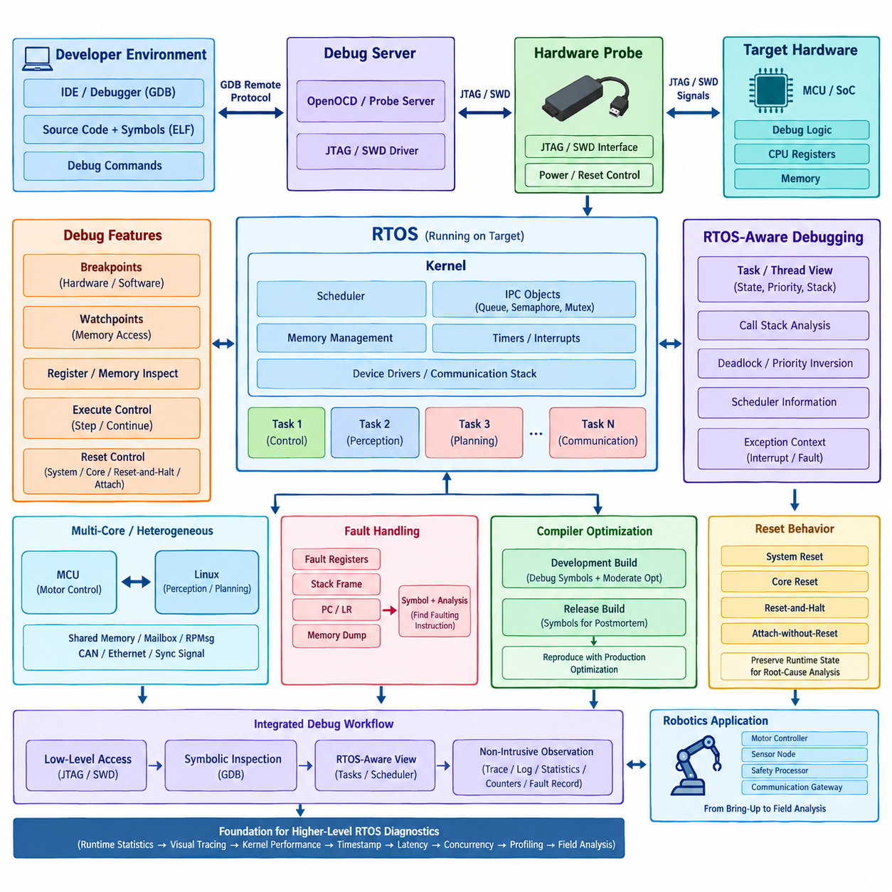
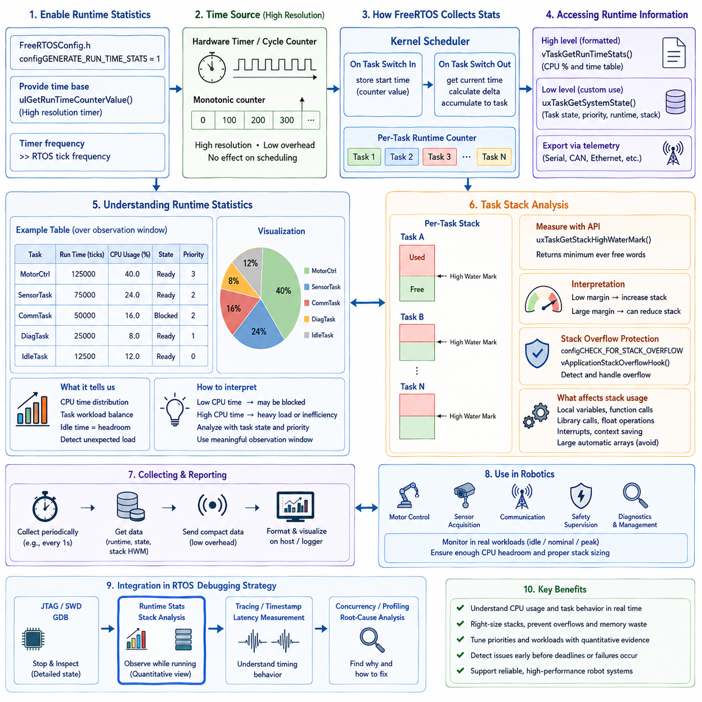
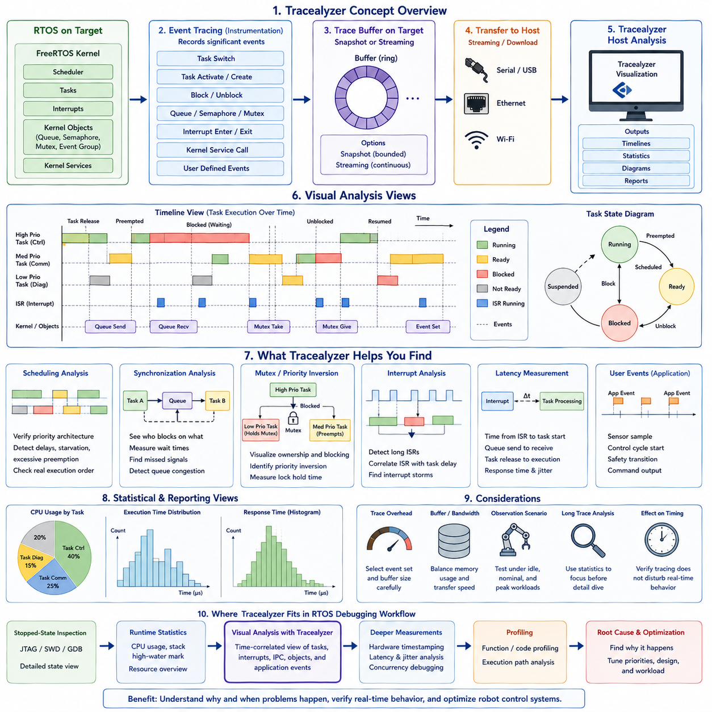
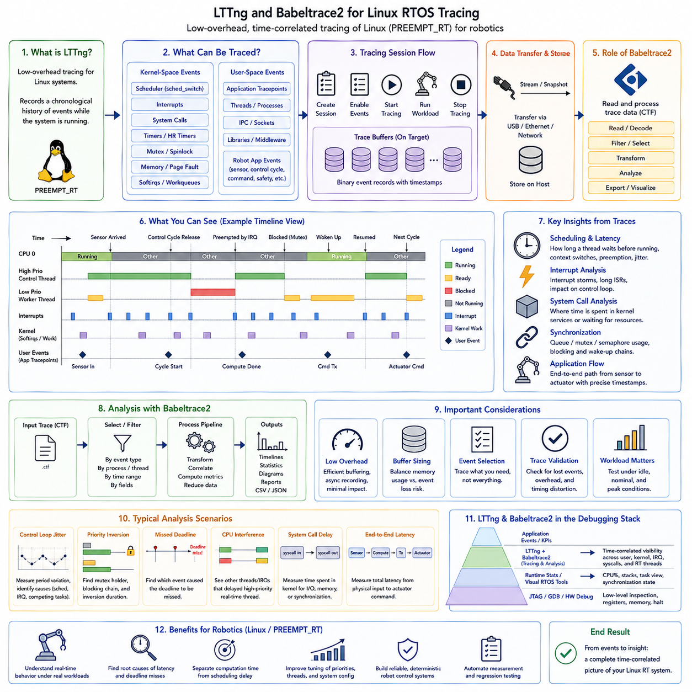
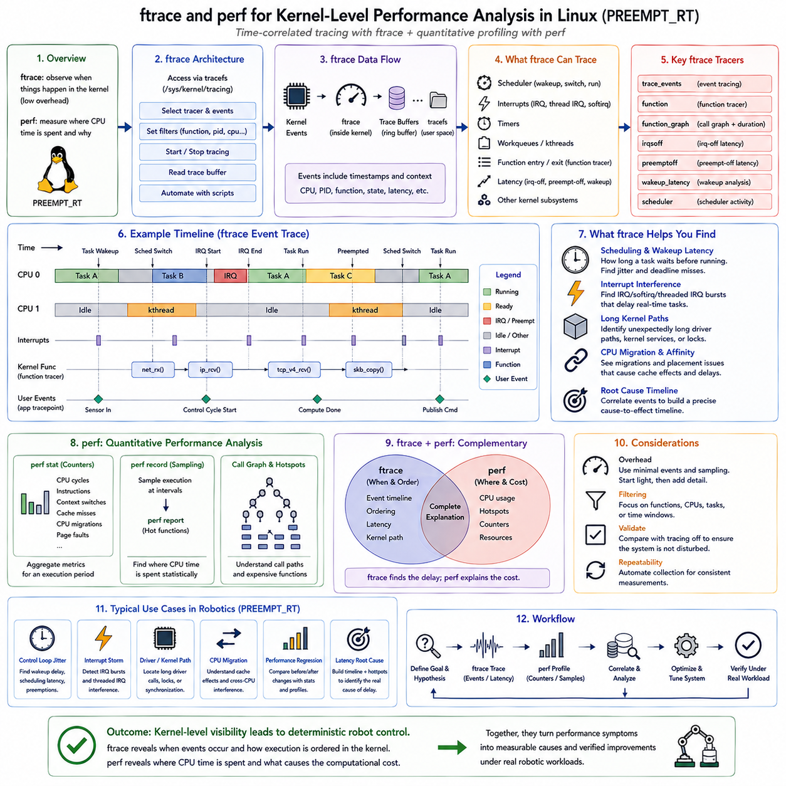
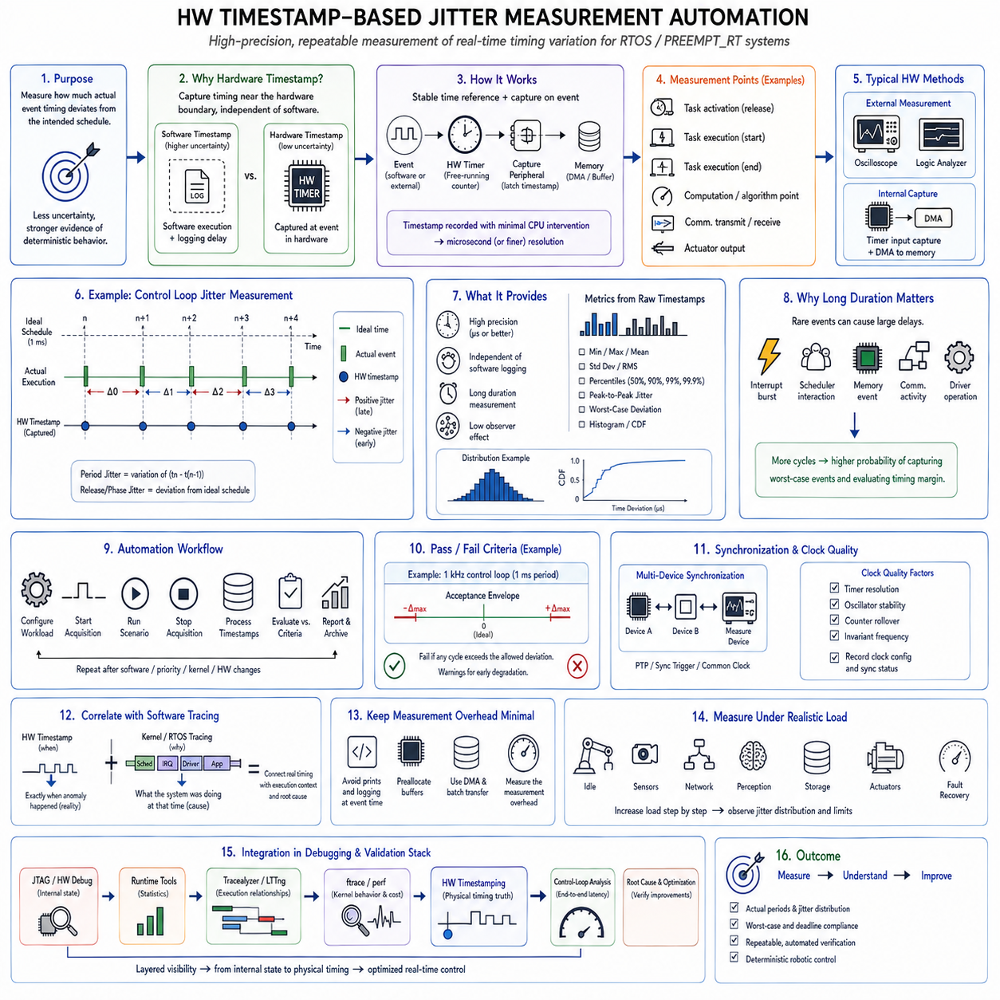
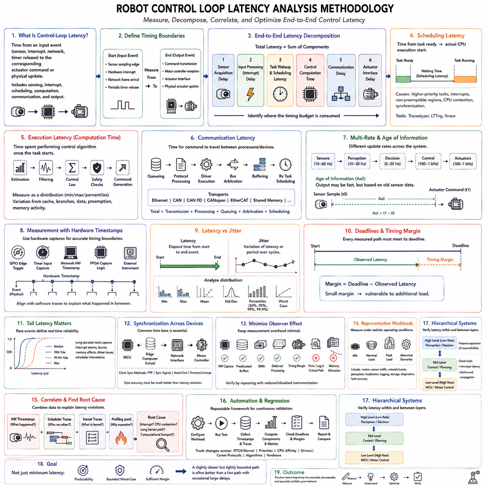
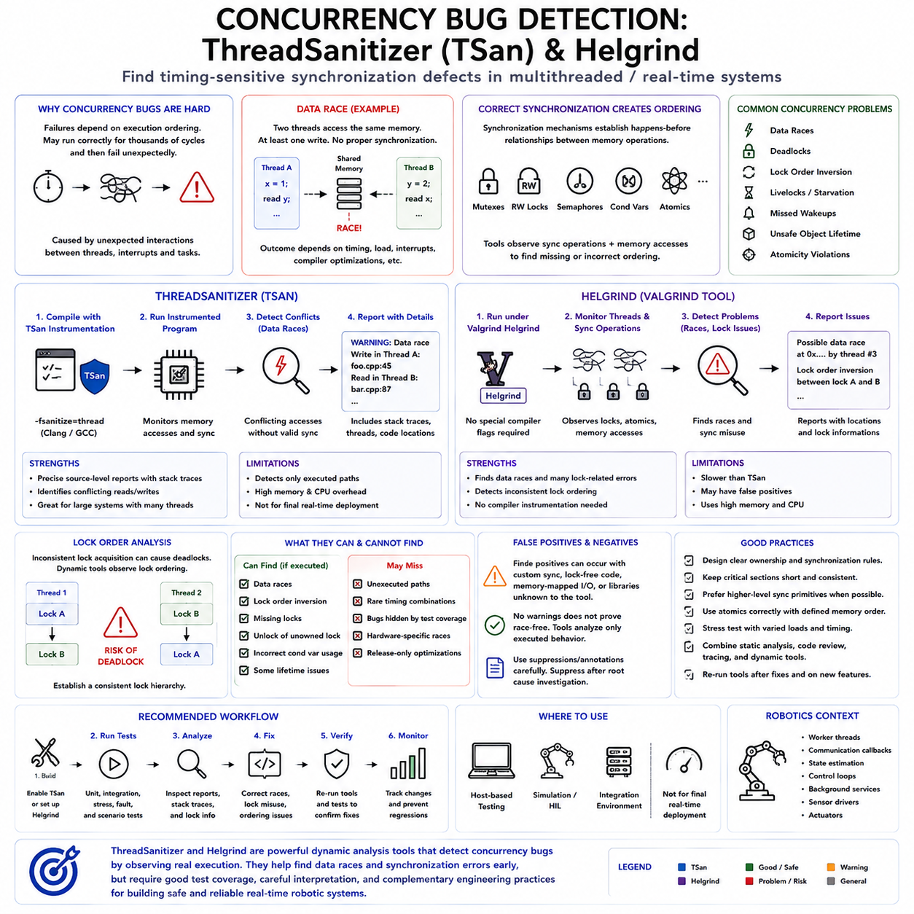
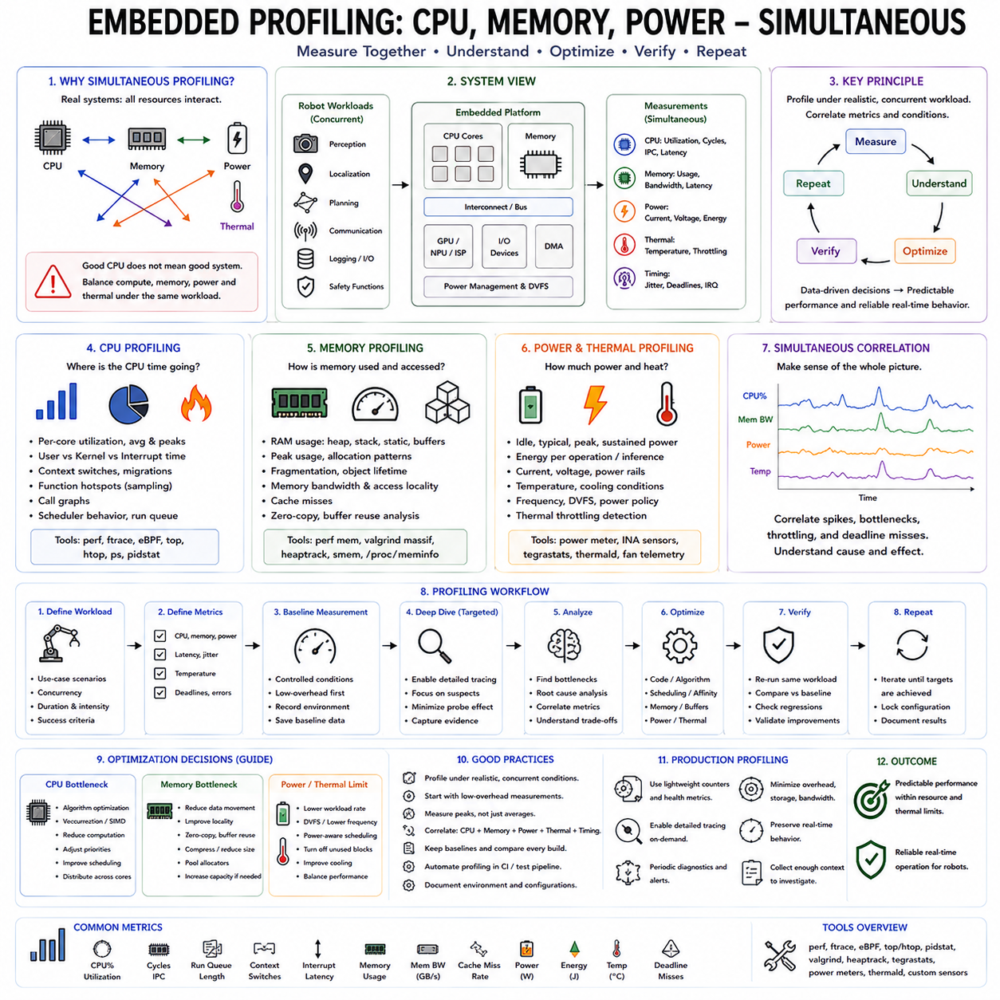
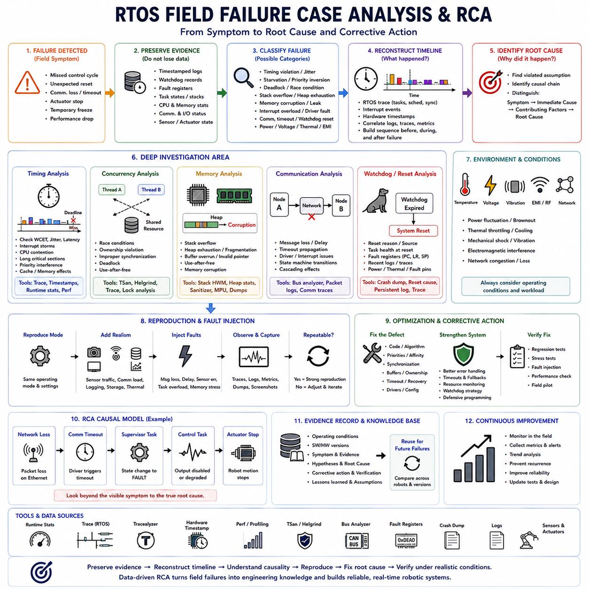

**Volume 03 Real Time Operating Systems**

# 09. RTOS Debugging and Tracing

## 09.01 RTOS Debug Environment: JTAG, SWD, GDB Remote

{width="7.268055555555556in" height="7.268055555555556in"}

An RTOS debug environment must expose software execution without destroying the timing behavior being investigated. JTAG, SWD, and remote GDB form a layered debugging architecture in which a host debugger communicates through a hardware probe or debug server to the target processor. This arrangement provides controlled access to CPU registers, memory, breakpoints, watchpoints, and firmware state while the RTOS executes on the embedded target.

JTAG, or Joint Test Action Group debugging, provides a standardized hardware interface that can access processor debug logic through dedicated signals. In an RTOS system, a JTAG probe can halt the processor, inspect registers, read or modify memory, program flash, and control instruction execution. Because the connection operates below the application software layer, it remains useful even when the scheduler, communication stack, device drivers, or application tasks have failed.

SWD, or Serial Wire Debug, provides similar processor-level debugging capabilities using fewer physical signals and is widely used with ARM Cortex-M microcontrollers. SWD normally requires only clock and bidirectional data signals in addition to reset and reference connections. This reduced pin requirement makes it especially suitable for compact robot controllers, sensor nodes, motor controllers, and other embedded systems where connector size and available MCU pins are constrained.

A typical hardware debug path consists of the development workstation, debugger software, debug server, hardware probe, and target MCU. Commercial or open-source probes translate commands from the host into JTAG or SWD transactions. The probe can access architectural debug resources implemented inside the processor, allowing developers to examine execution even before the RTOS scheduler starts. This capability is particularly valuable for boot failures and initialization faults.

GDB provides the software-level interface through which developers control this debugging process. An ELF image containing debugging symbols allows GDB to associate machine addresses with source files, functions, variables, and data structures. Developers can set breakpoints, execute instructions step by step, inspect call stacks, examine memory, and modify variables. For RTOS debugging, the usefulness of GDB increases when the debug server understands kernel-specific thread and task structures.

Remote debugging separates GDB from the physical target through the GDB Remote Serial Protocol. GDB running on a workstation communicates with a GDB server such as OpenOCD or another probe-specific server, while that server controls the hardware debug interface. This separation allows the debugger front end, target access mechanism, and hardware probe to evolve independently and enables command-line tools, IDEs, automated test systems, and remote development environments to share similar workflows.

RTOS-aware debugging extends ordinary processor debugging by reconstructing scheduler information from kernel data structures. Instead of seeing only the currently executing stack, the debugger can present multiple tasks or threads, their states, priorities, stack pointers, and execution contexts. Developers can therefore investigate blocked tasks, unexpected suspensions, priority interactions, deadlocks, stack corruption, or scheduling behavior that would otherwise be difficult to infer from a single halted CPU context.

Breakpoints are powerful but must be used carefully in real-time systems. A conventional breakpoint halts processor execution, which also stops scheduling, interrupt processing, communication deadlines, watchdog servicing, and control-loop timing. The observed system therefore stops behaving like the original real-time system. Breakpoints are excellent for initialization defects and deterministic functional errors, but they may hide or alter race conditions, deadline violations, and timing-dependent failures.

Hardware breakpoints are implemented using processor debug resources and can stop execution without modifying executable code in flash. Their number is normally limited by the processor architecture. Watchpoints similarly monitor selected memory accesses and can halt execution when a variable or address is read or written. They are especially useful for locating unexpected memory modification, corrupted RTOS objects, invalid peripheral accesses, and variables changed by an unknown task or interrupt handler.

Debugging interrupt-driven RTOS software requires understanding the relationship between task context and exception context. A failure observed inside a task may actually originate from an interrupt service routine that modified shared state, exceeded its expected execution time, or violated synchronization rules. Examining exception registers, interrupt nesting, saved stack frames, and pending interrupt state helps distinguish scheduler problems from hardware-event handling problems and reveals the actual execution path preceding a fault.

Fault handlers should preserve diagnostic information before reset or recovery destroys the evidence. On Cortex-M systems, register state, stack pointers, fault status registers, program counter, link register, and relevant memory locations can be captured when HardFault or related exceptions occur. Combined with symbol information, these values can reconstruct the instruction and function responsible for a crash even when interactive debugging was not connected when the failure happened.

Multi-core and heterogeneous robot controllers make debugging more complex because stopping one processor can change the behavior of another. An MCU may execute deterministic motor control while a Linux processor performs perception, networking, or planning. Debugging must therefore identify which processor owns each resource and communication channel. Shared memory, mailbox interfaces, RPMsg, CAN, Ethernet, and synchronization signals often become important evidence when failures cross processor boundaries.

Reset behavior must also be controlled deliberately. Debug probes may support system reset, core reset, reset-and-halt, or attachment to an already running target. Each mode reveals different classes of problems. Reset-and-halt is useful for boot initialization, while attach-without-reset is essential when examining a system that has entered an abnormal state after operating for some time. Automatically resetting a failed robot controller can erase precisely the runtime state needed for root-cause analysis.

Compiler optimization strongly influences debugger visibility. Highly optimized firmware may reorder instructions, eliminate variables, inline functions, and reuse registers, causing source-level stepping to appear inconsistent. Development builds therefore often retain debugging symbols and use moderate optimization, while release builds preserve enough symbols for postmortem analysis. Critical timing defects should eventually be reproduced using production-equivalent optimization because optimization itself can expose or suppress concurrency and timing problems.

A practical RTOS debug workflow combines intrusive debugging with non-intrusive observation rather than relying on a single technique. JTAG or SWD provides low-level access, GDB provides symbolic inspection, and RTOS-aware extensions expose scheduler state. Trace facilities, timestamped logging, runtime statistics, hardware counters, and fault records complement these tools when halting the processor would invalidate timing behavior. This distinction becomes increasingly important as debugging moves from functional correctness toward real-time performance analysis.

For robotics, the debugging architecture should be designed into the controller rather than added only after failures appear. Accessible debug connectors, controlled reset circuitry, symbol retention, persistent fault records, test points, and documented probe configurations significantly reduce diagnosis time. Motor controllers, sensor nodes, safety processors, and communication gateways can then use a consistent workflow from board bring-up through integration testing and field failure analysis.

The Chapter_09 structure places this hardware and debugger environment before runtime statistics, visual tracing, kernel-level performance analysis, hardware timestamp measurement, latency analysis, concurrency detection, profiling, and field root-cause analysis. This makes JTAG, SWD, and remote GDB the foundational inspection layer upon which progressively less intrusive and more timing-oriented RTOS diagnostic methods can be built.

## 09.02 FreeRTOS Runtime Stats and Task Stack Analysis [w/Code]

{width="7.268055555555556in" height="7.268055555555556in"}

FreeRTOS runtime statistics provide a quantitative view of how processor time is distributed among tasks during actual execution. Instead of examining only task states at a breakpoint, runtime statistics accumulate execution time over an observation interval. This makes them useful for understanding scheduler behavior, CPU utilization, workload balance, unexpected task activity, and whether real-time control tasks receive the processing time expected by the system design.

FreeRTOS supports runtime measurement through configuration options such as \`configGENERATE_RUN_TIME_STATS\`, together with a timing source that operates at a sufficiently higher frequency than the RTOS tick. The timer acts as an execution-time counter while the kernel associates accumulated counter values with individual tasks. A high-resolution hardware timer is generally preferable because scheduler ticks alone may be too coarse to distinguish short control, communication, and interrupt-related workloads accurately.

Runtime statistics depend on a monotonic counter whose behavior is predictable throughout the measurement period. The counter should have enough resolution to distinguish relevant task execution intervals while avoiding excessive overflow complexity. Because the timer exists for measurement rather than scheduling, its implementation should introduce minimal interference. Hardware counters, peripheral timers, or processor cycle counters can therefore provide more representative measurements than software-based timing mechanisms.

Once runtime statistics are enabled, FreeRTOS can expose accumulated execution information for individual tasks. Functions such as \`vTaskGetRunTimeStats()\` can format task runtime values and relative processor usage, while \`uxTaskGetSystemState()\` provides lower-level task status information suitable for custom monitoring software. The latter approach is particularly useful when robotics firmware must export statistics through telemetry rather than generating formatted diagnostic text directly on the controller.

CPU utilization should be interpreted over a meaningful observation window rather than from a single instantaneous sample. A motor-control task may execute frequently but consume very little time per activation, whereas a communication or diagnostic task may execute less often but occupy the CPU for longer bursts. Runtime statistics reveal this distinction and help determine whether processing demand corresponds to the intended task periods, priorities, and computational responsibilities.

The FreeRTOS idle task provides a useful reference for estimating processor headroom. When no application task is ready to execute, the scheduler runs the idle task, so its accumulated runtime indicates approximately how much processor capacity remains unused. A decreasing idle percentage can indicate growing computational load. However, idle time alone does not prove schedulability because a system may still experience local deadline violations despite apparently sufficient average CPU capacity.

Runtime statistics are particularly valuable when combined with task state information. A task consuming unexpectedly little CPU time may be blocked on a queue, semaphore, mutex, notification, or external event rather than suffering from insufficient processing capacity. Conversely, excessive execution time may indicate an unintended loop, excessive polling, inefficient computation, unexpectedly frequent wakeups, or a priority configuration that allows one task to dominate processor execution.

Task stack analysis addresses a different but equally important RTOS resource: per-task stack memory. Each FreeRTOS task requires a stack for local variables, function calls, saved processor context, and temporary execution state. Allocating too little stack can corrupt memory and produce unpredictable failures, while allocating excessively large stacks wastes scarce SRAM. Reliable embedded design therefore requires evidence-based stack sizing rather than arbitrary fixed margins.

FreeRTOS provides stack high-water-mark mechanisms for estimating the minimum unused stack space observed during execution. APIs such as \`uxTaskGetStackHighWaterMark()\` or related variants allow developers to determine how close a task has approached its allocated stack limit. A small remaining margin indicates that the task may require additional stack, while a consistently large margin can reveal an opportunity to reduce memory allocation after representative testing.

The high-water mark must be interpreted carefully because it represents observed historical usage rather than a guarantee of future maximum demand. A task may consume additional stack only during rare error handling, deeply nested function calls, unusual communication paths, or exceptional operating conditions. Stack sizing tests should therefore include startup, nominal operation, peak computational load, communication faults, recovery sequences, diagnostics, and other paths likely to produce maximum call depth.

Stack consumption is influenced by more than obvious local variables. Nested function calls, library routines, floating-point operations, compiler-generated temporary storage, interrupt interactions, and architecture-specific context saving can increase memory requirements. Large automatic arrays or structures are particularly dangerous in embedded tasks because they can consume substantial stack space immediately. Moving large persistent buffers to static storage or controlled memory pools can make stack requirements more predictable.

FreeRTOS stack overflow checking can provide another layer of protection when options such as \`configCHECK_FOR_STACK_OVERFLOW\` are enabled. Depending on the selected checking method and port implementation, the kernel can inspect stack boundaries or known patterns and invoke \`vApplicationStackOverflowHook()\` when corruption is detected. This mechanism is valuable for development and fault containment, but it should complement rather than replace systematic high-water-mark measurement.

Runtime statistics and stack measurements become substantially more useful when collected together. A diagnostic snapshot can associate each task with its state, priority, runtime consumption, stack allocation, remaining stack margin, and scheduling role. This creates a compact operational profile of the RTOS. Developers can identify tasks that simultaneously consume excessive CPU time and approach stack limits, as well as tasks that reserve large amounts of memory while rarely executing.

Periodic diagnostic collection must itself respect real-time constraints. Formatting long text tables, traversing every task control block, transmitting statistics over a slow serial interface, or acquiring scheduler information too frequently can disturb the system being measured. Production-oriented monitoring should therefore collect compact numeric data at controlled intervals and transfer formatting or visualization responsibilities to an external host, logger, or supervisory computer whenever practical.

For robot controllers, runtime statistics can expose changes that are difficult to observe during short laboratory tests. Increasing communication workload, additional sensor processing, fault-recovery activity, or newly integrated control functions may gradually reduce CPU headroom. Recording task utilization during representative motion scenarios allows engineers to compare idle, nominal, and peak-load conditions and determine whether sufficient execution margin remains before deploying updated firmware.

Stack analysis is similarly important because robotic systems often contain many concurrent tasks for motor control, sensor acquisition, communication, diagnostics, safety supervision, and system management. Even modest over-allocation multiplied across many tasks can consume significant SRAM. Conversely, reducing stack allocations without measurement can create failures that appear only during rare operating paths. High-water-mark evidence provides a practical basis for balancing memory efficiency and reliability.

Runtime and stack information should ultimately become part of a broader RTOS debugging strategy rather than remaining isolated development measurements. JTAG, SWD, and GDB provide detailed inspection when execution can be halted, while runtime statistics and stack monitoring provide information during continuing operation. Later tracing, hardware timestamping, latency measurement, concurrency analysis, and profiling can then explain why suspicious CPU or stack behavior occurs and how it affects real-time performance.

Within the Chapter_09 debugging structure, FreeRTOS runtime statistics and task stack analysis therefore form the first systematic runtime-observation layer after the fundamental JTAG, SWD, and remote GDB environment. They transform debugging from inspecting individual failures into continuously characterizing task resource behavior, establishing quantitative evidence that can guide scheduler tuning, stack sizing, performance optimization, and increasingly advanced RTOS tracing and root-cause analysis.

## 09.03 Visual RTOS Analysis with Tracealyzer [w/Code]

{width="7.268055555555556in" height="7.268055555555556in"}

Tracealyzer provides a visual approach to RTOS analysis by converting low-level execution events into timelines, task views, interaction diagrams, and statistical summaries. Instead of stopping the processor and examining one execution state, developers can observe how tasks, interrupts, synchronization objects, and kernel services interact over time. This makes tracing particularly valuable for timing-dependent problems that may disappear when conventional breakpoints halt the target.

The fundamental idea behind Tracealyzer is event tracing. Instrumentation integrated with the RTOS records significant events such as task switches, task activation, blocking, synchronization operations, interrupt activity, and kernel service calls. Each event receives timing and contextual information and becomes part of an execution trace. The resulting trace represents the temporal history of the system rather than merely its state at one debugging instant.

For FreeRTOS, trace instrumentation can observe scheduler operations and kernel objects while maintaining relationships between events and individual tasks. When the scheduler changes the running task, the trace records which task stopped executing and which task became active. Similar records can describe queues, semaphores, mutexes, event groups, and other RTOS mechanisms, allowing developers to reconstruct why particular scheduling transitions occurred.

Trace data may be captured using snapshot or streaming approaches. Snapshot tracing stores events in a bounded target-side buffer and preserves a recent execution window for later analysis. Streaming tracing continuously transfers events to a host or external storage, allowing substantially longer observations. The appropriate method depends on available RAM, communication bandwidth, required observation duration, and the acceptable instrumentation overhead for the embedded system.

A timeline view transforms recorded scheduler events into an intuitive representation of task execution. Developers can see when each task runs, becomes preempted, blocks, or resumes. Interrupt service routines can be displayed alongside tasks, making it possible to determine whether interrupt activity delayed critical control software. Patterns that are difficult to understand from text logs often become immediately visible as repeated gaps, bursts, long execution intervals, or unexpected preemptions.

Task scheduling analysis is especially useful for verifying whether implemented behavior matches the intended priority architecture. A high-priority motor-control task should normally execute promptly when released, while lower-priority diagnostics or communication tasks should use remaining processor capacity. Trace visualization can expose delayed activation, excessive preemption, starvation, unusual execution bursts, or priority configurations that produce behavior inconsistent with the original real-time design.

Synchronization behavior becomes much easier to understand when RTOS objects are included in the trace. A task waiting for a semaphore or queue may appear inactive for a long period, but the trace can connect its blocked state to the relevant kernel object. Developers can then examine when another task or interrupt produces the event required to release it. This relationship is essential for diagnosing missed notifications, queue congestion, synchronization delays, and incorrectly ordered interactions.

Mutex analysis can reveal priority inversion and lock contention that ordinary CPU utilization measurements cannot explain. A high-priority task may become blocked because a lower-priority task owns a required mutex. The resulting delay can then interact with other runnable tasks and create complex scheduling behavior. A visual trace allows the ownership, blocking interval, task priorities, and eventual release to be examined as a connected temporal sequence.

Interrupt behavior is another major component of real-time tracing. Excessively long interrupt service routines, interrupt storms, or poorly configured interrupt priorities can introduce substantial latency even when application tasks appear correctly designed. By correlating interrupt execution with task scheduling, developers can determine whether a delayed control cycle originated in the scheduler, an application task, a driver, or repeated hardware interrupt activity.

Tracealyzer can complement FreeRTOS runtime statistics by explaining the temporal structure hidden behind accumulated CPU percentages. Two tasks may consume similar total processor time while behaving very differently: one may execute predictably in short periodic intervals, while another produces irregular computational bursts. Runtime statistics identify how much CPU time was consumed, whereas tracing reveals when that consumption occurred and how it affected other tasks.

Latency measurements can also be derived from meaningful event relationships. Developers may examine the time between an interrupt and the activation of the corresponding processing task, between a queue send and queue receive, or between task release and actual execution. Such measurements help distinguish execution time from response time and scheduling delay, which is critical when evaluating whether a control or communication path satisfies a real-time deadline.

User-defined events can extend tracing beyond kernel activity into application semantics. Firmware may record events such as sensor acquisition, control-cycle start, trajectory update, CAN message arrival, safety transition, or actuator command generation. When these events are displayed together with scheduler and interrupt activity, developers can connect application-level robot behavior directly to the underlying RTOS execution sequence.

Trace instrumentation introduces overhead, so trace configuration must be treated as part of the measurement design. Recording every possible event can consume buffer space, processor time, and communication bandwidth. Developers should select an appropriate trace scope, event set, buffer size, and streaming mechanism. Measurements intended to characterize tight real-time deadlines should also evaluate whether tracing itself changes the timing being measured.

Long traces require systematic analysis rather than manual inspection of every event. Statistical views can summarize task execution time, response characteristics, activation patterns, and other behavioral properties across the recorded interval. Developers can first identify abnormal tasks or time regions statistically and then navigate into the detailed timeline around those regions, combining quantitative screening with event-by-event root-cause investigation.

In robotics, visual tracing is particularly effective because control, sensing, communication, and safety functions operate concurrently at different rates. A motor loop may execute at a high deterministic frequency while sensor processing and network communication occur at slower rates. A unified timeline makes these multi-rate interactions visible and helps determine whether lower-criticality workloads occasionally interfere with control execution or consume unexpected processing intervals.

Trace analysis should therefore be performed under representative workloads rather than only while the robot is idle. Acceleration, turning, dense sensor traffic, communication bursts, fault handling, and recovery procedures may create execution patterns absent during simple laboratory operation. Comparing traces from idle, nominal, and peak-load scenarios helps reveal whether timing margins remain stable as the controller approaches realistic operating conditions.

Tracealyzer fits naturally between basic runtime observation and deeper performance analysis within an RTOS debugging workflow. JTAG, SWD, and GDB provide detailed stopped-state inspection, while FreeRTOS runtime statistics quantify CPU and stack resource usage during execution. Visual tracing adds the missing temporal dimension by showing the ordering and relationships among scheduler, interrupt, IPC, synchronization, and application events.

The resulting workflow moves progressively from identifying that a problem exists to understanding exactly when and why it occurs. Runtime statistics may reveal an overloaded task, while Tracealyzer can show whether the cause is excessive execution, repeated activation, synchronization blocking, interrupt interference, or priority interaction. Hardware timestamp measurements and lower-level profiling can subsequently provide greater precision when the trace identifies the critical execution path requiring investigation.

Within Chapter_09_RTOS_Debugging_and_Tracing, visual RTOS analysis with Tracealyzer therefore represents a transition from resource-oriented monitoring toward time-correlated behavioral diagnosis. It creates a system-level execution picture that connects tasks, interrupts, kernel objects, and application events, providing the foundation for later kernel tracing, hardware timestamp jitter measurement, control-loop latency analysis, concurrency debugging, profiling, and field root-cause analysis.

## 09.04 LTTng and Babeltrace2: Linux RTOS Tracing [w/Code]

{width="7.268055555555556in" height="7.268055555555556in"}

LTTng, or Linux Trace Toolkit next generation, provides low-overhead tracing for Linux systems where timing relationships between real-time threads, interrupts, system calls, kernel scheduling, and application events must be observed without repeatedly stopping execution. In PREEMPT_RT and Linux-based robot controllers, it creates a chronological record of system activity that can expose latency sources invisible to ordinary logs or breakpoint-based debugging.

Unlike conventional debugging, tracing focuses on recording events while the system continues operating. LTTng instruments selected kernel and user-space activities and stores timestamped event records in trace buffers. Each record identifies what happened and when it occurred, while additional fields provide contextual information. The resulting event stream allows developers to reconstruct execution behavior across threads, processes, interrupts, and operating-system services.

LTTng is commonly divided into kernel-space and user-space tracing. Kernel tracing observes operating-system activity such as scheduler transitions, system calls, interrupts, and other kernel tracepoints. User-space tracing records events generated by applications or libraries. Combining both layers is especially useful in robotics because an application-level control delay may originate from scheduling, a device driver, network processing, memory activity, or another kernel-level operation.

A tracing session defines what should be recorded and where the resulting data should be stored. Developers create a session, enable selected event classes, start tracing, reproduce the workload, stop tracing, and then analyze the collected trace. Selective event configuration is important because recording unnecessary activity increases trace volume and analysis complexity. A focused trace usually provides clearer evidence while minimizing instrumentation and storage overhead.

Kernel scheduler events are among the most valuable sources for real-time analysis. Scheduler tracepoints can reveal when threads become runnable, when context switches occur, which thread is selected, and how long a real-time thread waits before receiving CPU time. This information allows engineers to separate actual computation time from scheduling delay and investigate whether high-priority control threads execute according to their intended periods and priorities.

Interrupt and interrupt-thread behavior is equally important in PREEMPT_RT systems. Hardware events can delay application execution directly or indirectly through interrupt processing and kernel work. Tracing interrupt activity together with scheduler events makes it possible to determine whether an unexpected control-loop delay corresponds to an interrupt burst, lengthy processing path, competing real-time thread, or another source of execution interference.

System-call tracing provides visibility into interactions between applications and the Linux kernel. Calls involving synchronization, timers, networking, file operations, and memory management may introduce delays that are difficult to identify from application code alone. By correlating system-call entry and exit events with scheduler activity, developers can determine whether a suspicious delay occurred inside application computation, while waiting for a kernel service, or while the thread was descheduled.

User-space tracepoints add application meaning to low-level Linux events. A robot application can generate trace events for sensor reception, control-cycle activation, localization updates, trajectory generation, command transmission, or safety transitions. When these events share a common timeline with kernel traces, engineers can follow a processing chain from physical input through software execution to actuator command generation and identify where latency accumulates.

Trace timestamps are fundamental because meaningful real-time diagnosis depends on event ordering and interval measurement. A sequence such as sensor arrival, thread wakeup, scheduler dispatch, control computation, communication transmission, and actuator command can be represented as timestamped events. Differences between these timestamps provide response-time and latency measurements and help locate variability that contributes to control-loop jitter.

LTTng uses buffering to reduce interference with the traced system. Events are written efficiently to trace buffers and later consumed or stored rather than being converted immediately into human-readable text. This is important because synchronous logging through a terminal, serial port, or file system can significantly disturb real-time execution. Binary event recording separates fast data capture from slower formatting and analysis operations.

Buffer configuration nevertheless requires engineering tradeoffs. Insufficient buffering can result in lost events during high activity, while excessive buffer allocation consumes memory needed by the application. Trace duration and enabled event density also influence storage requirements. Real-time experiments should therefore verify event loss, trace overhead, and available memory so that the measurement system does not significantly alter the behavior being investigated.

Babeltrace2 complements LTTng by reading and processing the trace data after or during collection. LTTng commonly produces traces using the Common Trace Format, while Babeltrace2 provides a framework for consuming, transforming, filtering, and presenting those event streams. This separates trace acquisition from trace interpretation and allows the same recorded execution history to support command-line inspection, automated processing, or higher-level analysis workflows.

Babeltrace2 is particularly useful when a large trace must be reduced to events relevant to a specific problem. Instead of manually examining every event, developers can focus on selected event types, timestamps, processes, or contextual fields and construct processing pipelines for repeated analysis. This approach is valuable when the same latency measurement or scheduler investigation must be performed across many experimental runs or software revisions.

A practical analysis may correlate user-space control events with kernel scheduling information. Suppose a periodic robot-control thread occasionally starts late. An application tracepoint identifies the expected control activity, scheduler events reveal when the thread became runnable and actually executed, and interrupt or kernel events describe competing activity during the delay. The combined timeline transforms an observed deadline anomaly into a sequence of measurable causes.

This capability is especially important for multi-rate robotic workloads. High-frequency control threads may coexist with localization, perception, networking, logging, ROS 2 communication, and system-management processes on the same Linux platform. Average CPU utilization may appear acceptable while occasional interference still produces unacceptable latency. Event tracing exposes these short temporal interactions that disappear when performance is reduced to long-term averages.

Tracing should therefore be performed under representative system loads. Network bursts, sensor traffic, storage operations, intensive perception workloads, and fault-recovery procedures can alter scheduler and kernel behavior. Comparing traces from idle, nominal, and peak operating conditions helps determine whether latency distributions remain bounded and whether the real-time control path retains sufficient timing margin when the complete robotic software stack is active.

LTTng and Babeltrace2 occupy a different debugging layer from JTAG, GDB, and FreeRTOS-oriented tools. Hardware debugging provides detailed stopped-state inspection, while runtime statistics summarize resource consumption and visual RTOS tools expose task interactions. Linux tracing extends the analysis across processes, kernel scheduling, interrupts, system calls, and user applications without requiring the operating system to stop during the measurement.

The collected trace can also serve as input to automated latency and jitter analysis. Scripts or processing pipelines can calculate intervals between selected events, identify worst-case samples, build distributions, and compare results across software versions. This converts tracing from an interactive debugging technique into a repeatable performance-validation mechanism, which is valuable when real-time behavior must be verified continuously during system integration.

For robot platforms using PREEMPT_RT, this combined approach provides a bridge between application-level symptoms and operating-system-level causes. A delayed actuator command can be traced backward through communication, application execution, scheduler dispatch, interrupt activity, and kernel services. Rather than treating Linux as an opaque execution platform, engineers obtain a time-correlated representation of how the operating system participates in the real-time control path.

Within Chapter_09_RTOS_Debugging_and_Tracing, LTTng and Babeltrace2 therefore extend visual RTOS analysis toward comprehensive Linux execution tracing. They establish the event and timestamp infrastructure required for subsequent kernel performance investigation, hardware timestamp measurement, control-loop latency analysis, concurrency debugging, profiling, and field root-cause analysis, forming an important diagnostic layer for PREEMPT_RT and Linux-based robotic systems.

## 09.05 ftrace and perf: Kernel-Level Performance Analysis [w/Code]

{width="7.268055555555556in" height="7.268055555555556in"}

ftrace is a tracing framework built directly into the Linux kernel for observing execution behavior with relatively low overhead. In PREEMPT_RT robot controllers, it can reveal scheduler activity, interrupt behavior, function execution, wakeup latency, and other kernel events that influence deterministic control. Because tracing occurs inside the kernel, ftrace can expose timing relationships that application logs cannot observe.

The ftrace infrastructure is primarily accessed through the Linux tracing filesystem, commonly mounted through tracefs. Developers can select tracers, enable specific trace events, apply filters, start or stop recording, and retrieve trace buffers through this interface. This architecture makes ftrace useful both interactively and through automated scripts that repeatedly collect identical measurements during performance validation.

One of the simplest operating modes is event tracing, where selected kernel tracepoints are recorded with timestamps and contextual information. Scheduler events, interrupts, timers, work queues, and other kernel subsystems can be selectively observed. Rather than recording every possible activity, engineers can restrict tracing to events relevant to a suspected timing problem, reducing both runtime overhead and the amount of trace data requiring analysis.

Scheduler tracing is particularly important for real-time Linux. Events such as thread wakeup and context switching can reconstruct when a control thread became runnable, when it actually received CPU time, which task previously occupied the processor, and when execution was preempted. The interval between wakeup and execution represents scheduling latency and provides direct evidence when a periodic control task begins later than expected.

The function tracer extends analysis from scheduler events into kernel execution paths. Function tracing can record kernel function entry and reveal which functions execute during a suspicious time interval. Function-graph tracing adds call relationships and execution durations, making nested kernel activity easier to understand. These mechanisms can identify unexpectedly long driver paths, kernel services, or synchronization operations that contribute to real-time latency.

Function tracing can generate large amounts of data, so filtering is essential. Developers can focus on selected functions, modules, processes, CPUs, or events rather than tracing the complete kernel. This is especially important for high-frequency robotic control systems because excessive instrumentation can influence the timing being measured. A narrow hypothesis-driven trace is generally more useful than an unrestricted trace of the entire operating system.

ftrace also provides specialized latency-oriented mechanisms useful for real-time kernel analysis. Depending on kernel configuration, tracers can help investigate interrupt-disabled sections, preemption-disabled regions, scheduling latency, and wakeup behavior. These measurements help identify kernel execution regions that prevent a high-priority real-time thread from running even though the application itself may require only a short computation time.

Interrupt analysis provides another important diagnostic path. A periodic control thread may experience jitter because hardware interrupts, threaded interrupts, softirqs, or deferred kernel work occupy the processor around its expected release time. By correlating these activities with scheduler events, developers can determine whether the disturbance originates from application competition, device-driver activity, networking, storage, or another kernel subsystem.

While ftrace emphasizes execution chronology, perf provides a complementary performance-analysis framework centered on counters, sampling, and profiling. The Linux perf subsystem can use hardware performance monitoring units and software events to measure CPU cycles, instructions, cache behavior, context switches, page faults, and other execution characteristics. This provides a quantitative view of where processor resources are consumed and why computation may become expensive.

The \`perf stat\` workflow is useful when aggregate performance characteristics are required. Instead of reconstructing every event in chronological order, it summarizes selected counters over an execution interval. Measurements such as cycles, instructions, context switches, cache-related events, or CPU migrations can reveal whether a workload changed significantly after a software modification, even when the functional behavior appears identical.

Sampling with \`perf record\` provides another level of analysis by periodically identifying where execution occurs. The collected samples can later be examined to determine which functions or code paths consumed significant processor time. Unlike exhaustive function tracing, statistical sampling can remain practical for longer workloads because it does not need to record every function invocation, although the selected sampling frequency still affects overhead and resolution.

Call-graph information can extend perf profiling from individual functions to execution paths. A computational hotspot may not be meaningful without understanding which caller caused it to execute repeatedly. Call graphs reveal relationships among functions and help distinguish an intrinsically expensive routine from a routine that becomes expensive because another component invokes it too frequently. This is valuable for optimizing complex Linux robotic software stacks.

Hardware performance counters provide information that timing traces alone cannot explain. A perception or control workload may require more execution time because of cache misses, memory-access behavior, branch effects, or increased instruction count. perf can correlate these architectural characteristics with software hotspots, helping engineers distinguish scheduling interference from inefficient computation or unfavorable processor behavior.

CPU affinity and migration should also be considered when analyzing real-time threads. A thread that migrates between processor cores may experience different cache states and compete with different workloads. ftrace can expose scheduling and migration behavior, while perf can quantify associated computational effects. Together they support analysis of CPU isolation, IRQ affinity, and thread placement strategies used in PREEMPT_RT systems.

The relationship between ftrace and perf is therefore complementary rather than competitive. ftrace primarily answers questions about when events occurred, how execution was ordered, and what kernel path caused a delay. perf primarily answers where processor time was spent and which hardware or software characteristics contributed to the computational cost. Combining temporal tracing with statistical profiling produces a more complete explanation of performance problems.

For example, ftrace may show that a robot control thread occasionally executes several hundred microseconds later than expected because another kernel path occupies its CPU. perf can then profile the relevant workload to determine whether that path consumes time because of intensive computation, excessive invocation frequency, cache behavior, or another resource effect. The investigation moves from identifying the delay to explaining its computational cause.

Measurement overhead must always be considered. Detailed function tracing, high-frequency sampling, extensive call graphs, and large event sets can perturb the system. Engineers should begin with lightweight measurements, narrow the suspicious execution region, and progressively enable more detailed instrumentation. Results should be compared with tracing disabled to verify that the diagnostic configuration has not materially changed the real-time behavior.

Robotic systems benefit from this layered approach because their Linux processors commonly execute control, perception, localization, networking, middleware, logging, and diagnostics concurrently. Average CPU utilization alone cannot reveal short interference events or expensive kernel paths. ftrace exposes their temporal relationships, while perf identifies computational hotspots and processor-level behavior, providing evidence for priority, affinity, driver, and workload optimization.

The tools are particularly valuable when evaluating PREEMPT_RT configuration. CPU isolation, IRQ affinity, real-time priorities, memory locking, and thread placement are intended to protect critical execution paths from interference. Before-and-after measurements with ftrace and perf can determine whether these changes actually reduce wakeup delays, context switching, migration, computational contention, and other sources of real-time variability.

Within Chapter_09_RTOS_Debugging_and_Tracing, ftrace and perf deepen the Linux tracing introduced by LTTng and Babeltrace2. LTTng provides broad time-correlated event collection across kernel and user space, while ftrace enables focused investigation of kernel execution and latency. perf adds counter-based and sampling-based profiling, creating a progression from system-level observation toward detailed performance diagnosis.

Together these mechanisms establish the kernel-level evidence required for subsequent hardware timestamp jitter measurement and robot control-loop latency analysis. They help determine whether timing failures originate from scheduling, interrupts, kernel execution, CPU placement, or computational hotspots, turning an observed real-time anomaly into a measurable execution path that can be optimized and later verified under representative robotic workloads.

## 09.06 HW Timestamp-Based Jitter Measurement Automation [w/Code]

{width="7.268055555555556in" height="7.268055555555556in"}

Hardware timestamp-based jitter measurement provides a high-precision method for determining how much the actual timing of a real-time event deviates from its intended schedule. Instead of relying only on software clocks, logs, or scheduler timestamps, the measurement captures event timing close to the hardware boundary. This reduces uncertainty introduced by software execution and provides stronger evidence about the deterministic behavior of an RTOS or PREEMPT_RT control system.

Jitter describes variation in the timing of repeated events rather than simply their average delay. If a robot control loop is designed to execute every 1 ms, the important question is not only whether its average period is approximately 1 ms, but how far individual cycles deviate from that target. Hardware timestamping makes these deviations measurable at microsecond or potentially finer resolution, depending on the timer, capture peripheral, and measurement architecture.

A hardware timer provides a stable time reference that operates independently of most application software activity. Modern MCUs, SoCs, network controllers, and measurement devices often contain free-running counters or capture units capable of recording timestamps when specific hardware events occur. Because the timestamp can be captured without waiting for a software logging routine, measurement uncertainty is substantially reduced compared with calling a software time function after an event has already occurred.

GPIO toggling is one of the simplest techniques for exposing software timing to external measurement hardware. A control task can toggle an output pin at its entry, exit, or another important execution point. An oscilloscope, logic analyzer, timer capture channel, or FPGA can then measure the physical transition. The resulting timestamps provide an independent representation of control-loop period, execution duration, response delay, and cycle-to-cycle timing variation.

Internal hardware capture can provide similar measurements without external laboratory equipment. A timer input-capture peripheral may latch its counter value when a GPIO edge or synchronization signal occurs. DMA can transfer captured values into memory with minimal processor intervention. This architecture enables long-duration jitter measurements while reducing the observer effect, making it suitable for automated regression tests and embedded performance monitoring.

The measurement point must be selected according to the timing property being investigated. Timestamping task activation measures release behavior, while timestamping actual task execution reveals scheduling effects. Additional timestamps around computation, communication transmission, or actuator output can separate scheduling latency from execution time and I/O delay. Multiple measurement points therefore transform a single jitter number into a timing decomposition of the complete control path.

For a periodic event, each measured timestamp can be compared with either the previous event or an ideal reference schedule. Period jitter is obtained from variations in consecutive timestamp intervals, while release or phase jitter measures deviation from expected absolute activation times. These definitions should not be mixed because they describe different timing characteristics. Automated tools should therefore record explicitly which event and reference are used for each reported metric.

A useful measurement system preserves the raw timestamp sequence rather than storing only averages. From the complete dataset, software can calculate minimum, maximum, mean, standard deviation, percentiles, peak-to-peak jitter, and worst-case deviation. Histograms and cumulative distributions can reveal whether timing variation forms a narrow stable distribution or contains rare long-tail events that may threaten a real-time deadline despite acceptable average performance.

Worst-case observations are particularly important in robotics because occasional timing excursions can matter more than average performance. A controller may execute correctly for millions of cycles and then experience a large delay caused by an interrupt burst, scheduler interaction, memory event, communication activity, or driver operation. Long-duration automated measurement increases the probability of capturing such rare events and provides evidence for evaluating timing margins under realistic operation.

Automation converts hardware timestamping from a laboratory experiment into a repeatable verification process. A test program can configure the workload, start timestamp acquisition, execute a defined scenario, stop collection, process the samples, and automatically compare results against acceptance criteria. The same procedure can then be repeated after kernel, firmware, driver, compiler, priority, or hardware configuration changes, enabling objective performance regression detection.

Pass and fail criteria should reflect system requirements rather than arbitrary statistical thresholds. A 1 kHz control loop, for example, may define a nominal 1 ms period together with an allowable deviation and deadline. Automated analysis can determine whether every observed cycle remains inside the permitted timing envelope. Additional warning thresholds can detect gradual degradation before the system reaches an actual real-time failure condition.

Synchronization becomes important when timestamps originate from multiple devices or processors. An MCU, edge computer, network interface, and external measurement device may each maintain a separate clock. Comparing their timestamps directly requires a shared time base or clock synchronization mechanism. Hardware-assisted synchronization, PTP, synchronized trigger signals, or common reference clocks can reduce clock offset and drift when end-to-end timing crosses device boundaries.

Clock quality also affects measurement accuracy. Timer resolution defines the smallest observable interval, while oscillator stability influences long-duration measurements. Counter rollover must be handled correctly, and frequency changes caused by power management can invalidate assumptions if the timestamp source is not invariant. A trustworthy automation framework therefore records timer frequency, clock source, resolution, rollover behavior, and synchronization state together with the measured samples.

Hardware timestamping becomes especially powerful when correlated with software tracing. A physical GPIO transition may reveal exactly when a deadline anomaly occurred, while ftrace, LTTng, or RTOS tracing can explain what the processor was doing around that instant. Matching the hardware timestamp with scheduler, interrupt, driver, and application events connects externally verified timing behavior to an internal software execution sequence.

This correlation helps separate measurement from explanation. Hardware timestamps answer whether the real physical timing requirement was satisfied, while software traces identify the mechanism responsible for success or failure. For example, an external capture may detect an unusually late actuator command, and kernel tracing may show that the control thread was delayed by an interrupt, CPU migration, competing thread, or lengthy kernel execution path immediately before the measured event.

Measurement overhead should remain extremely small at the critical observation point. Printing timestamps, formatting strings, allocating memory, or transmitting every sample synchronously can create additional jitter. Hardware capture, direct register operations, preallocated buffers, DMA, and deferred data processing are preferable. The measurement mechanism should also be characterized independently so that its own latency and variability are not mistaken for system jitter.

Representative workload selection is essential for meaningful results. Jitter should be measured not only while the controller is idle but during realistic sensor traffic, network communication, perception workloads, storage activity, actuator operation, and fault recovery. Tests can progressively increase system load and compare the resulting distributions, revealing when deterministic timing begins to degrade and which operating conditions consume the available timing margin.

For robotic platforms, automated timestamp tests can be incorporated into hardware-in-the-loop and system-integration environments. A motion controller, MCU, PREEMPT_RT edge computer, or communication gateway can expose defined timing signals while test equipment records them automatically. Software can archive the resulting metrics with firmware and system versions, creating a historical record of real-time performance throughout development.

Within Chapter_09_RTOS_Debugging_and_Tracing, hardware timestamp-based jitter measurement follows software tracing and kernel-level performance analysis because it provides an independent timing reference close to the physical system boundary. JTAG and runtime tools reveal internal state, Tracealyzer and LTTng expose execution relationships, and ftrace and perf identify kernel behavior and computational cost. Hardware timestamping then verifies whether these internal mechanisms ultimately satisfy the required physical timing.

The resulting automated workflow establishes a bridge from debugging to quantitative real-time validation. Instead of stating that a robot controller appears responsive, engineers can measure actual event periods, jitter distributions, worst-case deviations, and deadline compliance under defined workloads. These measurements provide the foundation for subsequent control-loop latency analysis, concurrency investigation, profiling, and field root-cause analysis while supporting repeatable verification of deterministic robotic control.

## 09.07 Robot Control Loop Latency Analysis Methodology

{width="7.268055555555556in" height="7.268055555555556in"}

Robot control-loop latency analysis determines how long information takes to travel from a physical or logical input event to the corresponding actuator command. Unlike CPU utilization or task execution time alone, end-to-end latency includes sensing, interrupt handling, scheduling, computation, communication, and output stages. The methodology must therefore analyze the complete causal path rather than treating the control task as an isolated software function.

A useful starting point is to define explicit timing boundaries for the control loop. The beginning may be a sensor sampling edge, hardware interrupt, network-frame arrival, or periodic timer release, while the endpoint may be command transmission, motor-controller reception, or physical actuator update. Without precise boundaries, measurements from different tools may represent different latency components and cannot be compared reliably.

The end-to-end control latency can be decomposed conceptually into sensor acquisition delay, interrupt or input-processing delay, task wakeup and scheduling latency, control computation time, communication delay, and actuator-interface delay. This decomposition is important because an excessive total latency does not identify its cause. Measuring intermediate timestamps allows each component to be quantified and reveals where the available timing budget is being consumed.

Scheduling latency is the interval between a control task becoming ready and actually receiving CPU execution. In an RTOS or PREEMPT_RT system, this interval may vary because of higher-priority work, interrupts, non-preemptible regions, CPU contention, or synchronization. Scheduler traces from Tracealyzer, LTTng, or ftrace can expose this interval and distinguish delayed dispatch from excessive control-algorithm execution time.

Execution latency represents the time required to perform the control computation once the task begins running. It may include state estimation, filtering, trajectory processing, feedback calculations, safety checks, and command generation. Execution time should be measured as a distribution rather than a single average because cache behavior, conditional branches, data-dependent computation, preemption, and memory activity can create substantial cycle-to-cycle variation.

Communication latency becomes significant when control processing spans multiple processors or devices. A command may travel from an edge computer through Ethernet, CAN, CAN FD, CANopen, EtherCAT, shared memory, or another transport before reaching a lower-level controller. Transmission time alone is insufficient; queueing, protocol processing, driver execution, bus arbitration, buffering, and receiving-task scheduling can all contribute to the actual communication delay.

Multi-rate architectures require particular attention because sensing, perception, planning, control, and actuator loops may operate at different frequencies. A camera may provide data at tens of frames per second while an edge-level decision process runs more slowly and a motor controller executes at hundreds of hertz or kilohertz. Latency analysis must therefore distinguish update rate from response latency and determine which data sample actually influences each actuator command.

Age of information is another useful concept for multi-rate robot systems. A control output may be generated quickly after a task begins but still depend on sensor information that is already old because of acquisition, buffering, perception, or communication delays. Measuring only computation time would miss this effect. Tracking timestamps associated with the originating sensor data allows engineers to estimate the effective information age at the actuator command.

Hardware timestamps provide the strongest reference for critical timing boundaries because they reduce uncertainty introduced by software instrumentation. GPIO transitions, timer capture units, network hardware timestamps, FPGA capture logic, or synchronized external instruments can record important events near the physical interface. Software traces can then be aligned with these measurements to explain what occurred internally between externally verified timing points.

A complete analysis should separate latency from jitter. Latency describes the elapsed time between defined start and end events, while jitter describes the variation of that latency or of periodic event timing across repeated cycles. A control loop may have an acceptable average latency but occasionally produce extreme values. Consequently, minimum, maximum, mean, percentiles, distributions, and worst-case observations are more informative than a single average number.

Deadline analysis adds the system requirement to the measured latency. If an actuator command must be produced within a defined interval after an input event, every measured path can be evaluated against that deadline. The remaining difference between the deadline and observed latency represents timing margin. A system with a small positive margin may technically pass while remaining vulnerable to additional sensor, communication, diagnostic, or computational load.

Tail latency deserves special attention because rare delays often determine real-time reliability. The 99th, 99.9th, or higher percentile may expose behavior hidden by average values, although safety-critical requirements may demand direct worst-case reasoning rather than percentile acceptance alone. Long-duration measurements increase the opportunity to capture interrupt storms, communication bursts, memory effects, driver anomalies, or scheduler interactions that occur only occasionally.

Cross-device measurements require a common understanding of time. When timestamps originate from an MCU, Linux edge computer, network interface, and motor controller, clock offset and drift can appear as false latency. PTP, hardware synchronization signals, shared clocks, or carefully characterized timestamp exchanges can establish a common time base. Synchronization accuracy should always be significantly better than the latency variation being evaluated.

The observer effect must also be controlled. Printing logs, writing files synchronously, allocating memory, or transmitting diagnostic messages inside the critical path can increase the very latency being measured. Low-overhead tracepoints, hardware capture, preallocated buffers, DMA, and deferred processing are preferable. Measurements should be repeated with instrumentation reduced or disabled to estimate whether the diagnostic mechanism materially alters system timing.

Representative workload testing is essential because latency measured on an idle processor rarely represents deployed behavior. Robot motion, sensor traffic, network bursts, localization, perception, logging, storage activity, diagnostics, and fault recovery can compete for processing and communication resources. Measurements should therefore cover idle, nominal, peak-load, and abnormal scenarios so that the latency envelope reflects realistic system operation.

Root-cause analysis becomes possible when hardware timestamps, scheduler traces, kernel traces, and profiling data are correlated on the same event sequence. A late actuator command may first appear as an end-to-end latency violation. ftrace or LTTng can then reveal delayed task dispatch or interrupt interference, while perf can determine whether an interfering workload contains computational hotspots. Each tool answers a different part of the same timing question.

Automation makes this methodology repeatable across firmware and system revisions. A test framework can execute predefined robot workloads, collect synchronized timestamps and traces, calculate latency components, generate distributions, detect deadline violations, and compare results with a validated baseline. Changes in RTOS configuration, PREEMPT_RT kernels, priorities, CPU affinity, drivers, communication protocols, or control algorithms can then be evaluated using consistent evidence.

For hierarchical robotic systems, latency budgets should be assigned according to functional responsibility rather than forcing every layer to operate at the same rate. High-level perception and decision functions may execute relatively slowly, while lower-level MCU or motor-controller loops maintain much faster deterministic actuator control. The analysis should verify both the latency within each layer and the end-to-end propagation between layers, preserving the intended separation of responsibilities.

The final objective is not simply to minimize every measured interval. Predictability, bounded worst-case behavior, and sufficient timing margin are usually more important than achieving the smallest possible average latency. A slightly slower but tightly bounded control path can be preferable to one with a lower mean and occasional large excursions. Optimization should therefore target the components that threaten deadlines or introduce unacceptable variability.

Within Chapter_09_RTOS_Debugging_and_Tracing, robot control-loop latency analysis integrates the preceding debugging and measurement techniques into an end-to-end methodology. Runtime statistics characterize resource usage, Tracealyzer and LTTng reveal temporal relationships, ftrace and perf expose kernel behavior and computational cost, and hardware timestamping establishes physical timing evidence. Together they transform control-loop timing into measurable, decomposable, and repeatably verifiable system behavior.

## 09.08 Concurrency Bug Detection: ThreadSanitizer / Helgrind

{width="7.268055555555556in" height="7.268055555555556in"}

Concurrency bugs are among the most difficult failures to diagnose in real-time and multithreaded software because their occurrence depends on execution ordering rather than only on program logic. A system may operate correctly for thousands of cycles and then fail when two threads access shared state in an unexpected sequence. ThreadSanitizer and Helgrind provide dynamic analysis techniques for detecting these timing-sensitive synchronization defects.

A data race occurs when multiple execution contexts access the same memory location concurrently, at least one access modifies the data, and the accesses are not properly synchronized. The resulting behavior may depend on scheduler timing, processor load, interrupt activity, or compiler optimization. Such defects can produce corrupted state, inconsistent sensor data, incorrect commands, or failures that disappear when conventional debugging changes execution timing.

Correct synchronization establishes ordering relationships between concurrent memory operations. Mutexes, reader-writer locks, semaphores, condition variables, atomic operations, and other synchronization mechanisms can coordinate access to shared resources. Dynamic concurrency analysis observes these operations together with memory accesses and attempts to identify situations where the required ordering relationship is missing or inconsistent with the program\'s actual execution.

ThreadSanitizer, commonly abbreviated TSan, is a compiler-assisted runtime detector designed primarily to identify data races in multithreaded programs. Code is compiled with sanitizer instrumentation so that relevant memory accesses and synchronization operations can be monitored during execution. When conflicting accesses are observed without a valid synchronization relationship, ThreadSanitizer reports the suspected race together with information about the participating threads and code locations.

The strength of ThreadSanitizer is its ability to connect a race report to actual source-level execution. Instead of merely indicating that memory corruption occurred, it can identify conflicting reads and writes and provide stack traces showing how each access was reached. This substantially reduces the search space when a large robotics application contains many worker threads, communication callbacks, state estimators, controllers, and background services sharing complex data structures.

ThreadSanitizer relies on runtime observation, so it can detect only behavior exercised during the test. A concurrency defect hidden in an unexecuted error path or rare scheduling combination may remain undetected. Test coverage therefore matters greatly. Stress tests should repeatedly exercise initialization, normal operation, shutdown, communication loss, reconnection, fault recovery, mode transitions, and other conditions likely to change thread interaction patterns.

Instrumentation introduces substantial overhead compared with normal execution. ThreadSanitizer increases memory consumption and execution time because it tracks memory accesses and synchronization state. For this reason, sanitizer builds are usually used in development, host-based testing, simulation, or integration environments rather than as the final real-time deployment configuration. Timing results obtained from an instrumented build should not be treated as representative real-time performance measurements.

Helgrind provides concurrency analysis through Valgrind and focuses on detecting synchronization errors and data races in multithreaded programs. Because it operates within the Valgrind dynamic instrumentation environment, an application can often be analyzed without the same compiler instrumentation workflow used by ThreadSanitizer. Helgrind observes thread behavior, memory accesses, and synchronization operations to identify potentially unsafe interactions between execution contexts.

Helgrind can be particularly useful for investigating incorrect locking behavior. Beyond conflicting memory accesses, concurrency analysis may reveal inconsistent lock ordering, misuse of synchronization primitives, or operations performed without the expected mutex protection. These defects can indicate architectural problems even before they produce visible corruption, making the tool useful for validating assumptions about ownership and synchronization discipline.

Lock-order analysis is important because inconsistent acquisition sequences can create deadlock risks. If one thread acquires mutex A and then mutex B while another path acquires B before A, the two threads may eventually wait indefinitely for each other. Dynamic analysis can expose observed ordering relationships and warn about potentially dangerous patterns, allowing developers to establish a consistent lock hierarchy before rare scheduling conditions trigger a system freeze.

Not every concurrency problem is a simple data race. Deadlocks, livelocks, starvation, missed wakeups, incorrect condition-variable usage, unsafe object lifetime, and atomicity violations can produce similar symptoms. ThreadSanitizer and Helgrind provide valuable evidence, but their reports should be combined with architectural understanding, scheduler traces, synchronization-object analysis, and application semantics rather than treated as complete proofs of concurrent correctness.

False positives and difficult reports may occur when software uses custom synchronization mechanisms, lock-free structures, memory-mapped hardware, unusual atomics, or libraries that the analysis tool cannot interpret completely. Conversely, the absence of warnings does not prove that the program is race-free because dynamic tools analyze only executed paths. Suppression files and carefully scoped annotations may be required, but suppressing a warning should follow technical investigation rather than simply removing unwanted reports.

Robotics software is particularly exposed to concurrency defects because multiple execution contexts continuously exchange state. Sensor acquisition may update measurements while localization reads them, planning may replace trajectories while control consumes them, and communication threads may modify commands or configuration simultaneously. Without explicit ownership rules, apparently simple shared structures can become sources of nondeterministic behavior under realistic processor and communication loads.

A robust architecture reduces these risks before dynamic analysis begins. Shared mutable state should be minimized, ownership should be explicit, synchronization boundaries should be documented, and message passing or immutable snapshots should be preferred where practical. Real-time control paths should avoid unnecessary lock contention, while data exchanged between high-rate and low-rate components should use mechanisms whose consistency and blocking behavior are clearly understood.

Concurrency testing should deliberately increase scheduling diversity. Repeating scenarios with different processor loads, thread affinities, message rates, delays, and communication patterns can expose interleavings that ordinary functional testing rarely reaches. Simulation and host-side tests are especially useful because sanitizer overhead is acceptable there, allowing long stress runs that would be unsuitable for measuring actual real-time latency on production hardware.

When a sanitizer reports a race, the objective is not simply to place a mutex around the reported variable. The conflicting accesses should first be traced back to the intended ownership and communication model. Adding locks without architectural analysis can create excessive blocking, priority inversion, or deadlock. The correct repair may instead involve transferring ownership, copying data, introducing atomic operations, restructuring communication, or separating real-time and non-real-time state.

Concurrency analysis should also be connected with RTOS and Linux tracing. ThreadSanitizer or Helgrind can identify a suspicious shared-memory relationship, while Tracealyzer, LTTng, or ftrace can show how the relevant threads were scheduled and synchronized during system execution. This combination links memory correctness with temporal behavior and is useful when a race also produces control-loop latency, unexpected blocking, or priority-related effects.

Performance analysis remains a separate concern. A program can be free from detected data races while still suffering from excessive lock contention or synchronization delays. Scheduler tracing and profiling can reveal whether technically correct locking causes high-priority control threads to wait too long. Concurrency correctness and real-time determinism must therefore be validated together, especially when synchronization lies directly in a robot\'s control path.

An effective verification workflow uses ThreadSanitizer and Helgrind before final timing qualification. Sanitizer-enabled builds exercise functional and stress scenarios to detect races and synchronization defects. After identified problems are corrected, the software is rebuilt without heavy instrumentation and evaluated using hardware timestamps, ftrace, LTTng, perf, or RTOS tracing to verify that the corrected synchronization architecture also satisfies latency and jitter requirements.

Automation can integrate concurrency analysis into continuous testing. Selected unit tests, integration tests, simulation scenarios, and communication stress tests can run under ThreadSanitizer or Helgrind, with detected warnings treated as regression evidence. Reports can be archived with software versions so newly introduced races are identified close to the code change that caused them rather than appearing later as intermittent field failures.

Within Chapter_09_RTOS_Debugging_and_Tracing, ThreadSanitizer and Helgrind extend the debugging methodology from timing and performance problems into concurrent correctness. Earlier runtime statistics, tracing, profiling, hardware timestamping, and control-loop latency analysis explain when the system executes and whether deadlines are satisfied. Concurrency analysis adds evidence about whether simultaneously executing software components interact with shared state safely.

Together these techniques support a broader root-cause methodology for robotic systems. A failure that initially appears as random state corruption, an occasional control anomaly, or unexplained blocking can be examined from memory access, synchronization, scheduling, and timing perspectives. ThreadSanitizer and Helgrind therefore provide an important bridge between software correctness and deterministic real-time behavior before the debugging process advances toward profiling automation and field-level root-cause analysis.

## 09.09 Embedded Profiling: CPU, Memory, Power Simultaneous

{width="7.268055555555556in" height="7.268055555555556in"}

Embedded profiling for CPU, memory, and power should be treated as a simultaneous system-level measurement problem rather than as three independent optimization activities. A real-time robot can show acceptable CPU utilization while suffering from memory pressure, thermal throttling, or increased power consumption. Conversely, reducing CPU time may increase memory traffic or accelerator activity. Profiling therefore needs to correlate compute, memory, timing, power, thermal state, workload intensity, and execution duration under the same operating conditions.

CPU profiling identifies where processor time is actually being consumed and whether the system has sufficient execution capacity for its workload. Measurements should distinguish application execution from kernel activity, interrupt handling, scheduling overhead, and driver or I/O processing. Average CPU utilization alone is insufficient because short latency spikes may be hidden inside an apparently acceptable average. Per-core utilization, CPU affinity, migration, scheduler behavior, and interrupt placement are therefore important when evaluating multicore embedded systems.

Function-level profiling helps locate computational hotspots inside applications and services. Sampling-based approaches can identify frequently executing functions without requiring every instruction to be instrumented, while call-graph analysis can reveal how expensive execution paths are reached. In an embedded robot, hotspots may appear in perception preprocessing, sensor fusion, localization, planning, communication, logging, or device drivers. The objective is to identify the actual source of CPU consumption before selecting an optimization technique.

Hardware performance counters provide a deeper view of CPU efficiency. Measurements such as cycles, instructions, cache references, cache misses, branch behavior, stalled cycles, and instructions-per-cycle can indicate whether a workload is compute-bound or memory-bound. This distinction matters because simply increasing processor frequency or optimizing arithmetic may have little effect when execution is limited by memory access. Hardware-counter evidence therefore helps connect observed CPU load with the underlying execution mechanism.

Memory profiling must consider both capacity and access behavior. Persistent program data, task stacks, queues, model parameters, buffers, caches, and temporary allocations contribute to memory consumption, while memory bandwidth and access locality influence execution speed. Peak memory usage is particularly important because average consumption can hide short-lived allocation peaks. A system that has sufficient average free memory may still fail or degrade when simultaneous workloads temporarily require additional storage.

Runtime memory pressure should be evaluated together with allocation behavior and object lifetime. Repeated dynamic allocation and release can introduce fragmentation, while excessive buffering can improve throughput at the cost of memory capacity and latency. Zero-copy techniques and buffer reuse can reduce unnecessary movement and allocation, but they may increase architectural complexity. The correct solution therefore depends on the measured relationship among memory capacity, bandwidth, latency, and software ownership.

Power profiling adds another dimension because embedded robots operate within constrained energy and thermal envelopes. Measurements should distinguish idle, typical, peak, and sustained power rather than relying on a single instantaneous value. Energy per operation or inference can also be more informative than instantaneous power when evaluating mission-level efficiency. A workload that briefly consumes high power may be acceptable if its duration is short, while sustained high consumption can create thermal limitations and reduce long-term performance.

Thermal behavior must be correlated with CPU and memory activity because temperature can change processor frequency and therefore alter measured performance. Frequency scaling, thermal throttling, cooling conditions, power policy, workload intensity, and sustained execution duration should be recorded together with profiling data. Otherwise, a performance reduction observed during a long test may be incorrectly attributed to software changes when the actual cause is thermal state or power-management behavior.

Simultaneous profiling means that CPU, memory, power, and thermal measurements should be collected under the same representative workload whenever practical. Running a CPU benchmark separately from a memory benchmark and then evaluating power under an idle system does not describe the behavior of a real robot. Perception, localization, planning, communication, logging, device I/O, and safety functions often execute concurrently, so profiling should reproduce these interactions rather than evaluating each subsystem in isolation.

The profiling workflow should begin by defining the workload and the metrics that matter to the physical system. Measurements can include CPU utilization, execution time, latency, jitter, context switches, interrupt response, memory usage, memory bandwidth, power, temperature, frequency, and deadline misses. The system should then be measured under controlled baseline conditions before optimization. This creates an evidence-based reference against which later changes can be compared.

Low-overhead measurement should normally be performed first because instrumentation can itself change system behavior. Detailed tracing can then be enabled selectively around suspicious execution paths or timing intervals. The probe effect is particularly important in real-time systems because additional tracing may alter scheduling, cache behavior, memory traffic, or power consumption. After collecting detailed evidence, the same workload should be reproduced with reduced or disabled instrumentation to confirm that the observed performance characteristics remain representative.

Multicore systems require profiling at both system and per-core levels. A low average CPU utilization across four cores can conceal one overloaded core while other cores remain lightly utilized. CPU affinity, task migration, interrupt placement, and scheduler decisions can therefore influence both throughput and latency. A robot perception pipeline may benefit from distributing work across cores, while a control-related workload may require carefully controlled affinity to reduce migration and scheduling variability.

Profiling results should lead to measurable optimization decisions rather than general assumptions. If CPU computation is the bottleneck, algorithmic optimization, kernel optimization, scheduling changes, or workload reduction may help. If memory traffic dominates, buffer reuse, improved locality, zero-copy paths, or reduced data movement may be more effective. If power or thermal behavior limits sustained performance, adaptive rates, lower workload intensity, power-aware scheduling, or improved cooling may be required.

The optimization process should remain iterative. Developers identify a measured bottleneck, change the relevant code, priority, affinity, memory path, configuration, or workload, and then re-measure the same scenario. An optimization is considered successful only when the target metric improves without creating unacceptable regressions in latency, memory, power, thermal behavior, or reliability. This prevents local optimization from degrading another part of the robot\'s overall performance envelope.

Regression testing is especially important because embedded optimization frequently involves trade-offs. Increasing buffers may improve throughput while increasing memory consumption and latency. Reducing CPU usage may increase memory usage, and aggressive parallelism may increase synchronization overhead or power consumption. Approved baseline measurements should therefore be retained and compared against new builds, with changes in execution time, resource usage, startup behavior, latency, and other defined thresholds treated as regression evidence.

Production profiling should use lighter mechanisms than development-time instrumentation. Continuous operation may use lightweight counters, targeted diagnostics, periodic health measurements, and on-demand tools such as perf or ftrace where appropriate. Detailed traces should be enabled only when needed because storage, bandwidth, CPU overhead, and thermal impact must remain controlled. Production diagnostics should preserve normal robot operation while providing enough context to investigate performance degradation.

The resulting profiling data should be correlated with application logs, runtime metrics, hardware counters, tracing information, and workload conditions. A CPU hotspot without workload context may be misleading, just as a power spike without thermal or scheduling information may be difficult to interpret. Recording software version, workload intensity, temperature, frequency, power policy, and test duration allows measurements to be reproduced and compared meaningfully across builds and operating conditions.

For robotic systems, the ultimate objective is not simply maximum CPU utilization or minimum memory consumption. The objective is predictable throughput and latency while maintaining sufficient memory margin, acceptable power consumption, controlled thermal behavior, and reliable real-time operation. Profiling therefore provides the evidence needed to balance competing resources and determine whether optimization improves the complete system rather than only one isolated metric.

A complete embedded profiling methodology consequently follows a continuous loop of measure, understand, optimize, verify, and repeat. CPU profiling explains computational hotspots and scheduling behavior; memory profiling exposes capacity, bandwidth, and allocation constraints; power and thermal profiling reveal sustained operating limits. When these measurements are performed simultaneously under realistic concurrent robot workloads, performance engineering becomes data-driven and can support predictable real-time behavior rather than optimization based on assumptions.

## 09.10 Field RTOS Failure Case Analysis and RCA

{width="7.268055555555556in" height="7.268055555555556in"}

Field RTOS failure analysis begins with the recognition that failures observed in deployed robots are rarely caused by a single isolated software defect. A field symptom such as a missed control cycle, unexpected reset, communication loss, actuator stop, sensor timeout, or temporary freeze may result from interactions among scheduling, interrupts, memory, synchronization, drivers, power conditions, and workload. Root Cause Analysis (RCA) therefore reconstructs the complete sequence of events rather than treating the first visible error as the actual cause.

The first step is to preserve the original failure evidence before attempting a software modification or system reset that could destroy useful information. Timestamped logs, watchdog records, fault registers, task states, stack information, communication status, CPU and memory statistics, and relevant sensor or actuator states should be captured whenever possible. The objective is to establish what the system knew immediately before, during, and after the failure. Without preserved evidence, field debugging easily becomes speculation based on incomplete observations.

Failure classification helps narrow the investigation while maintaining a system-level perspective. RTOS failures can appear as timing violations, task starvation, priority inversion, deadlock, race conditions, stack overflow, heap exhaustion, memory corruption, interrupt overload, driver malfunction, communication timeout, watchdog reset, or unexpected state-machine transitions. Physical conditions such as voltage variation, temperature, vibration, electromagnetic interference, and network disturbances may also trigger software-visible symptoms. The investigation should therefore consider both software and operating conditions.

Timing failures are particularly important in real-time robotics because a system can produce mathematically correct results at the wrong time. A periodic control task may occasionally miss its deadline because of interrupt storms, CPU contention, long critical sections, priority interference, cache or memory effects, driver execution, or unexpected communication processing. Average execution time is not sufficient to explain such failures. Tail latency, jitter, worst-case response time, and the timing margin remaining before the deadline should be examined.

Trace and timestamp evidence can reconstruct the temporal sequence surrounding a failure. RTOS traces can show which task was executing, which task was ready or blocked, when an interrupt occurred, and when synchronization events happened. Hardware timestamps can establish externally observable timing with less dependence on software instrumentation. By correlating these sources, engineers can distinguish whether a delayed control response originated from a scheduling problem, an interrupt event, a synchronization delay, or an expensive computation.

Concurrency failures require a different but complementary perspective. A race condition may produce corrupted state only under a particular ordering of task and interrupt execution, making the failure appear random. ThreadSanitizer or Helgrind can identify suspicious concurrent memory accesses during controlled testing, while RTOS tracing can reveal the scheduling sequence that made the defect observable. The correct RCA should identify the violated ownership or synchronization model rather than simply adding a mutex to the variable reported by a diagnostic tool.

Memory-related failures should be investigated across both capacity and integrity. Stack overflow, heap exhaustion, fragmentation, invalid pointers, buffer overruns, use-after-free behavior, and memory corruption can produce symptoms far away from the original defect. Runtime stack high-water marks, heap statistics, memory protection mechanisms, sanitizers, fault records, and debugger inspection can provide complementary evidence. A field failure should not automatically be classified as a memory shortage merely because it occurred under high workload.

Communication failures can also propagate into RTOS behavior. A lost CAN, Ethernet, or other network message may cause a timeout, which wakes a supervisory task, changes a state machine, disables an actuator, or increases diagnostic traffic. The visible actuator response may therefore occur several layers after the original communication event. RCA should follow the complete propagation chain from physical or network event through driver, interrupt, RTOS task, communication state, control logic, and final physical action.

Watchdog resets require particular care because the watchdog normally identifies that something failed without explaining why it failed. The reset reason, task health information, fault registers, program counter, link register, stack frame, persistent logs, and recent trace information should be preserved when the platform allows it. The investigation should determine whether the watchdog was triggered by deadlock, starvation, excessive execution time, interrupt lockup, memory corruption, driver failure, power instability, or another condition rather than treating the watchdog reset itself as the root cause.

Optimization settings can change the manifestation of an RTOS failure. Compiler optimization may alter timing, instruction ordering, register allocation, memory layout, and the visibility of variables during debugging. A failure that disappears in a debug build is therefore not necessarily fixed. Field RCA should reproduce the failure under production-like optimization and configuration whenever practical. Debug symbols should be retained separately so that a production fault address can still be mapped to the corresponding source location and execution path.

Field reproduction should gradually increase realism rather than immediately modifying the system in an attempt to make the failure disappear. Engineers can first reproduce the reported operating mode, then add representative sensor traffic, communication load, logging, storage activity, thermal conditions, and abnormal events. Fault injection can deliberately introduce message loss, delayed responses, sensor errors, task overload, or other controlled disturbances. Reproduction becomes stronger when the same symptom appears under a repeatable set of measurable conditions.

RCA should distinguish symptom, immediate cause, contributing factor, and root cause. For example, an actuator stopping is a symptom, a control task entering a fault state may be the immediate cause, a communication timeout may be a contributing condition, and an architectural assumption that allowed stale commands to reach the controller may represent the deeper root cause. This distinction prevents teams from stopping at the first software condition that explains the observed behavior and encourages correction of the mechanism that allowed the failure to occur.

Corrective action should address both the identified defect and the conditions that allowed it to remain undetected. A software fix may involve changing task priorities, synchronization, buffer ownership, timeout handling, state transitions, memory allocation, driver behavior, or error recovery. However, the corrective action should also introduce appropriate regression tests, diagnostic evidence, monitoring, and stress scenarios. A failure is not fully resolved when the symptom disappears from one test; the causal mechanism must be challenged under conditions that could reproduce it again.

Field evidence should become part of the continuous development and verification process. Each significant failure can contribute a structured record containing operating conditions, software and hardware versions, observed symptoms, evidence, causal hypotheses, confirmed root cause, corrective action, verification results, and remaining assumptions. Repeated failures can then be compared across robot units and software versions. This transforms field debugging from isolated incident handling into an accumulating engineering knowledge base.

For a robot system, RCA should ultimately connect low-level RTOS behavior with physical consequences. A scheduler delay can become a control-loop deadline violation; a race condition can become an invalid actuator command; memory corruption can become an unexpected reset; and a communication timeout can become a controlled stop. The investigation therefore needs to cross task, interrupt, IPC, memory, driver, communication, control, and safety boundaries rather than assigning responsibility to a single software module.

The complete field analysis process can be understood as an evidence-driven loop: detect the failure, preserve evidence, reconstruct the timeline, classify the failure, identify causal relationships, reproduce the conditions, confirm the root cause, implement correction, and verify the result under representative workloads. Runtime statistics, Tracealyzer-style tracing, hardware timestamping, concurrency analysis, profiling, fault records, and field logs each answer different parts of the same question. Together they provide the foundation for reliable RTOS behavior in deployed robotic systems.
