**Volume 03 Real Time Operating Systems**

# 10. Mixed Criticality Systems

## 10.01 Mixed Criticality System Concepts: ASIL D and QM Coexistence

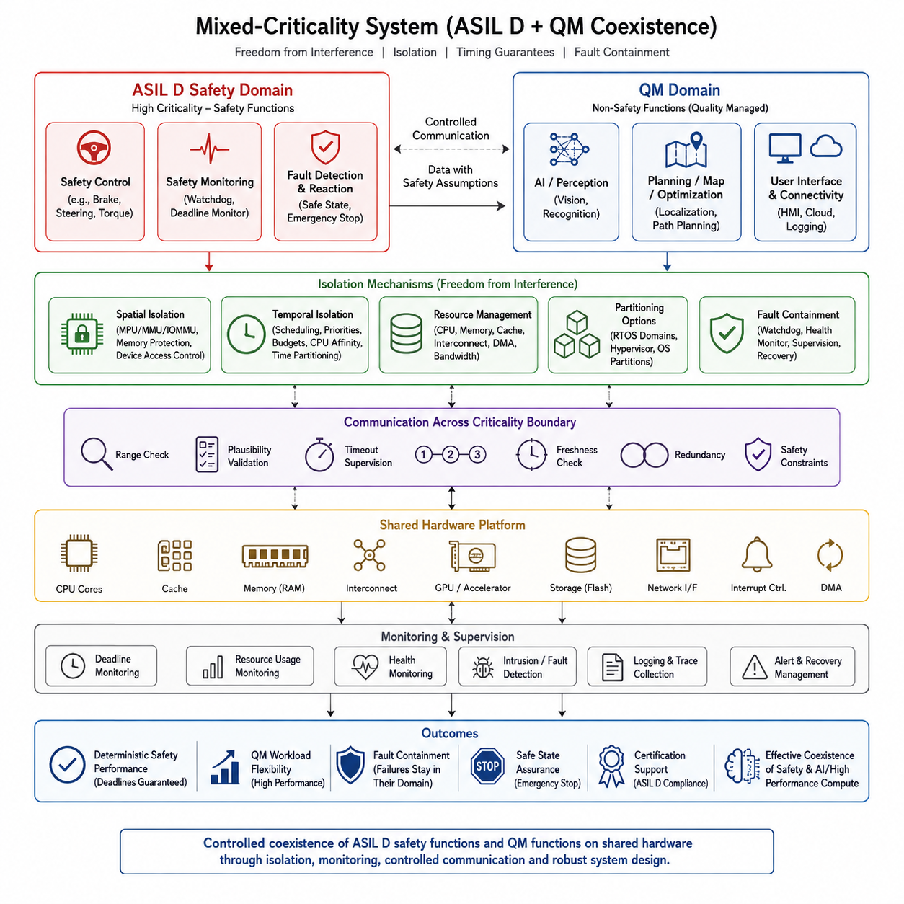{width="7.268055555555556in" height="7.268055555555556in"}

혼합 중요도 시스템(Mixed-Criticality System)은 서로 다른 보증 요구사항(assurance requirements)을 가진 소프트웨어가 동일한 컴퓨팅 하드웨어를 공유하면서도, 가장 높은 중요도를 가진 기능에 필요한 타이밍(timing), 격리(isolation), 결함 격리(fault containment)를 보장하도록 설계된 시스템이다. 첨부된 구조에서 이 주제는 Chapter 10의 출발점이며, 이후 다루는 하이퍼바이저(hypervisor), 시간 분할(time partitioning), 인증(certification), 안전 컴퓨팅(safety compute), AI 컴퓨팅(AI compute), 검증(verification)의 개념적 기반을 형성한다.

대표적인 자동차 또는 로봇 플랫폼에는 ASIL D 기능과 품질 관리(Quality Management, QM) 기능이 함께 존재할 수 있다. ASIL D는 ISO 26262에서 정의하는 가장 높은 자동차 안전 무결성 수준(Automotive Safety Integrity Level)이며, 고장이 심각한 위험 상황을 초래할 수 있는 기능과 관련된다. QM 소프트웨어는 ASIL 요구사항이 할당되지 않으며, 안전 분석(safety analysis)을 통해 추가적인 기능 안전(functional safety) 조치가 필요하지 않음이 입증되면 일반적인 품질 프로세스에 따라 개발할 수 있다.

공존(coexistence)은 ASIL D와 QM 소프트웨어를 아무런 제약 없이 단순히 함께 실행한다는 의미가 아니다. 핵심적인 아키텍처 요구사항은 간섭으로부터의 자유(freedom from interference)이다. QM 애플리케이션에서 발생한 고장, 과부하, 메모리 손상, 타이밍 이상 또는 통제되지 않은 자원 소비가 ASIL D 기능의 안전성을 입증하는 데 사용된 가정을 무효화해서는 안 된다. 따라서 공유 플랫폼은 안전 동작에 영향을 줄 수 있는 자원 주위에 명확한 경계를 설정해야 한다.

공간적 격리(spatial isolation)는 메모리와 장치 자원을 보호한다. 메모리 보호 장치(MPU), 메모리 관리 장치(MMU), 입출력 메모리 관리 장치(IOMMU), 운영체제 보호 메커니즘 또는 하이퍼바이저(hypervisor)를 사용하면 QM 구성요소가 ASIL D 파티션(partition)이 소유한 메모리를 읽거나 덮어쓰는 것을 방지할 수 있다. 또한 제한되지 않은 직접 메모리 접근(DMA)은 일반적인 CPU 메모리 보호를 우회할 수 있으므로 주변장치 접근 역시 엄격하게 통제해야 한다. 따라서 격리 대상에는 메모리 영역, DMA 버퍼, 인터럽트 소스, 통신 엔드포인트 및 하드웨어 소유권이 포함된다.

시간적 격리(temporal isolation)는 메모리 접근이 아니라 실행 시간 때문에 발생하는 간섭을 다룬다. 계산량이 많은 QM 태스크(task)가 CPU 처리 능력을 무제한으로 소비하여 ASIL D 제어 태스크가 데드라인(deadline)을 놓치도록 해서는 안 된다. 우선순위 스케줄링(priority scheduling), CPU 친화도(CPU affinity), 실행 예산(execution budget), 순환 스케줄링(cyclic scheduling), 정적 시간 파티션(static time partition)을 이용하여 예측 가능한 처리 시간을 확보할 수 있다. 최악 실행 시간(WCET)과 응답 시간 분석(response-time analysis)은 중요도 영역 사이에 남아 있는 모든 공유 자원으로부터의 간섭을 고려해야 한다.

혼합 중요도 스케줄링(mixed-criticality scheduling)은 태스크마다 보증 수준과 실행 가정이 서로 다를 수 있다는 점을 고려하여 기존 실시간 스케줄링(real-time scheduling)을 확장한다. 정상 동작에서는 프로세서가 중요 태스크와 비중요 태스크를 함께 효율적으로 실행할 수 있다. 그러나 실행 요구량이 미리 정의된 가정을 초과하거나 시스템이 성능 저하 상태(degraded condition)에 진입하면, 스케줄링 정책은 낮은 중요도의 워크로드를 축소, 일시 정지 또는 제거함으로써 높은 중요도의 태스크와 필수 안전 기능을 보호할 수 있다.

CPU 파티셔닝(CPU partitioning)만으로는 완전한 격리가 보장되지 않기 때문에 자원 공유(resource sharing)는 특히 중요하다. 캐시(cache), 메모리 컨트롤러(memory controller), DRAM 대역폭, 인터커넥트(interconnect), GPU, 저장장치, 네트워크 인터페이스 및 인터럽트 컨트롤러가 간접적인 간섭을 발생시킬 수 있다. QM AI 워크로드는 별도의 CPU 코어에서 실행되더라도 대량의 메모리 및 가속기 트래픽을 발생시킬 수 있다. 따라서 혼합 중요도 아키텍처는 공유 하드웨어 경로를 분석하고 그 간섭을 제한하거나 감시하는 메커니즘을 필요로 한다.

중요도 경계를 통과하는 통신(communication)은 의도적으로 제한되어야 한다. ASIL D 구성요소가 QM 인지(perception) 또는 경로 계획(planning) 기능에서 생성된 정보를 사용하는 것은 가능하지만, 해당 정보가 자동으로 ASIL D 수준의 무결성(integrity)을 획득하는 것은 아니다. 안전 영역(safety domain)은 낮은 보증 수준의 정보를 안전 가정에 따라 처리해야 하며, 실제 동작에 사용하기 전에 범위 검사(range checking), 타당성 검증(plausibility validation), 타임아웃 감시(timeout supervision), 순서 감시(sequence monitoring), 최신성 검사(freshness checking), 중복성(redundancy), 독립적인 안전 제약(safety constraint) 등을 적용해야 한다.

이러한 구분은 자율주행 차량과 지능형 로봇에서 특히 중요하다. 고성능 AI 컴퓨터는 인지(perception), 의미론적 추론(semantic reasoning), 궤적 생성(trajectory generation), 학습 기반 정책 추론(learned policy inference)을 수행할 수 있으며, 상대적으로 작은 안전 컨트롤러(safety controller)는 속도, 제동, 조향 한계, 충돌 조건 또는 비상 정지(emergency stop)를 독립적으로 감시할 수 있다. AI 서브시스템은 전체 기능을 향상시키지만 안전을 위한 유일한 판단 권한이 되어서는 안 된다. 안전 경로(safety path)는 허용할 수 없는 동작을 감지하고 시스템을 안전 상태(safe state)로 전환할 수 있는 충분한 독립성을 유지해야 한다.

따라서 결함 격리(fault containment)는 핵심적인 설계 목표가 된다. 하드웨어 예외, 소프트웨어 충돌, 데드라인 초과, 통신 장애 및 자원 고갈(resource exhaustion)은 가능한 경우 정의된 결함 격리 영역(fault containment region) 내부에 제한되어야 한다. 워치독(watchdog), 상태 감시기(health monitor), 하트비트(heartbeat), 데드라인 감시기(deadline monitor), 메모리 보호, 예외 처리기(exception handler), 파티션 감독기(partition supervisor)는 상호 보완적인 감지 계층을 제공한다. 복구 과정에서는 QM 애플리케이션 재시작, 파티션 격리, 성능 저하 운전 또는 제어된 안전 정지(controlled safe stop)를 수행할 수 있다.

기능적 동작(functional behavior)과 안전 권한(safety authority)을 구분하는 것은 유용한 설계 개념이다. QM 영역은 정상 운전에서 가치 있는 고성능 기능을 제공할 수 있으며, ASIL D 영역은 해당 명령이 검증된 안전 제약 범위 안에 존재하는지를 판단할 수 있다. 이러한 구조를 사용하면 모든 고급 알고리즘을 최고 수준의 안전 프로세스로 개발할 필요성을 줄이면서도, 인증되지 않은 구성요소가 안전 중요 액추에이터(safety-critical actuator) 또는 시스템 상태를 제한 없이 제어하는 것을 방지할 수 있다.

혼합 중요도 설계는 운영체제 아키텍처(operating-system architecture)에도 영향을 미친다. 하나의 실시간 운영체제(RTOS)가 보호 영역(protection domain)을 이용하여 애플리케이션을 분리할 수도 있고, 여러 운영체제가 격리된 가상 머신(virtual machine)이나 파티션에서 실행될 수도 있다. 하이퍼바이저(hypervisor)는 CPU, 메모리, 인터럽트 및 장치를 각 영역에 할당하고 선택된 통신 경로를 중재할 수 있다. 적절한 구조는 타이밍 요구사항, 하드웨어 아키텍처, 고장 가정, 인증 전략 및 안전 논증(safety case)이 격리 메커니즘에 얼마나 의존하는지에 따라 결정된다.

안전 요구사항을 할당할 때는 분해(decomposition) 개념도 중요하다. 전체 복잡한 애플리케이션을 하나의 ASIL D 구성요소로 구현하는 대신, 관련 안전 분석과 표준이 허용하는 경우 충분히 독립적인 요소에 안전 책임을 분배할 수 있다. 이러한 분해는 단순한 소프트웨어 패키징 기법이 아니다. 독립성 가정, 공통 원인 고장(common-cause failure), 통신 의존성, 공유 하드웨어 및 검증 증거(verification evidence)가 모두 의도한 안전 논증을 뒷받침해야 한다.

따라서 ASIL D와 QM의 경계는 소프트웨어 구현 이후에 추가하는 것이 아니라 시스템 아키텍처 초기 단계에서 정의해야 한다. 엔지니어는 안전 목표(safety goal), 위험 동작(hazardous behavior), 안전 관련 제어 경로, 요구되는 고장 대응 및 이러한 목표를 위반할 가능성이 있는 구성요소를 식별한다. 이러한 분석 결과는 파티션 배치와 자원 할당을 결정하는 기준이 된다. 명확하게 정의된 경계는 어떤 소프트웨어에 엄격한 안전 생명주기(safety lifecycle) 증거가 필요하고 어떤 기능을 QM 프로세스에서 보다 빠르게 발전시킬 수 있는지도 명확하게 한다.

검증(verification)은 올바른 동작뿐만 아니라 격리의 효과도 입증해야 한다. 시험 과정에서는 의도적으로 QM 워크로드에 부하를 가하고, 통신 대역폭을 소진시키며, 인터럽트 폭주(interrupt storm)를 발생시키고, 메모리 오류를 유발하며, 메시지를 지연시키고, 프로세서를 과부하시키거나 비중요 애플리케이션을 비정상 종료시키면서 안전 영역의 동작을 관찰해야 한다. 중요한 것은 이상적인 조건에서 ASIL D 기능이 동작하는가가 아니라, 주변 구성요소가 비정상적으로 동작하는 상황에서도 요구된 타이밍과 안전 동작이 유지되는가이다.

로봇 시스템에서는 결정론적 제어(deterministic control)와 비결정론적 AI 연산(nondeterministic AI computation)이 공유 엣지 플랫폼(shared edge platform)으로 통합되면서 혼합 중요도 아키텍처의 중요성이 더욱 커지고 있다. 모터 제어, 비상 정지, 전력 관리 및 안전 감시는 엄격하게 제한된 동작을 요구할 수 있지만, 비전 모델(vision model), 월드 모델(world model), 비전-언어-행동 정책(VLA policy), 매핑(mapping), 최적화 워크로드는 실행 시간이 크게 변할 수 있다. 모든 워크로드를 동일하게 취급하면 안전 보증이 약화되거나 계산 집약적인 지능 기능을 불필요하게 제한하게 된다.

따라서 실질적인 목표는 완전한 물리적 분리(physical separation)가 아니라 통제된 공존(controlled coexistence)이다. 아키텍처가 충분한 공간적 격리(spatial isolation), 시간적 격리(temporal isolation), 통제된 통신(controlled communication), 자원 관리(resource management), 감시(monitoring), 결함 격리(fault containment)를 제공한다면 ASIL D와 QM 워크로드는 프로세서, 시스템 온 칩(SoC), 네트워크 또는 컴퓨팅 장치를 공유할 수 있다. 이 원칙은 이후 Chapter 10에서 다루는 하이퍼바이저 격리, AUTOSAR 혼합 플랫폼, 안전 중요 태스크 감시, 통신 채널, 시간 분할, 인증, 안전 컴퓨팅과 AI 컴퓨팅의 공존을 이해하기 위한 기반이 된다.

## 10.02 Hypervisor-Based Isolation: Jailhouse, Xen, KVM-RT

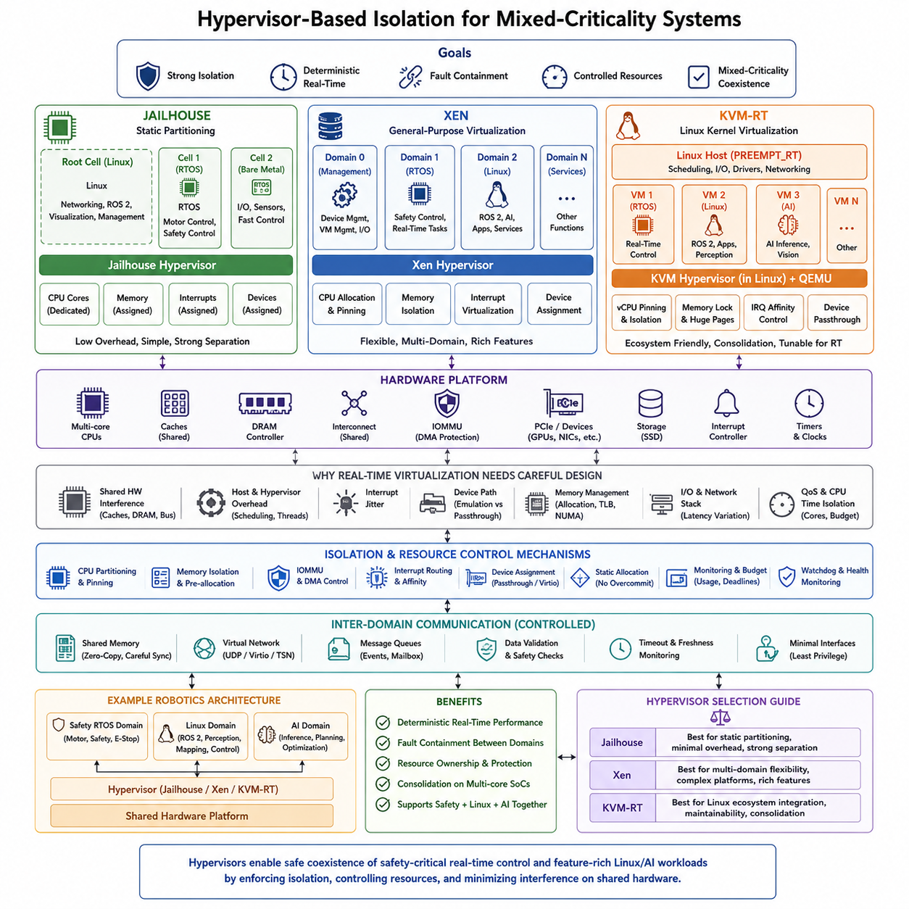{width="7.268055555555556in" height="7.268055555555556in"}

하이퍼바이저 기반 격리(Hypervisor-Based Isolation)는 서로 다른 타이밍(timing), 안전(safety), 기능 요구사항(functional requirements)을 가진 워크로드를 동일한 컴퓨팅 플랫폼에서 실행하기 위한 하드웨어 지원 방식이다. 혼합 중요도 시스템(Mixed-Criticality System)에서 하이퍼바이저(hypervisor)는 운영체제 또는 실행 영역 사이에 경계를 형성하여 범용 또는 QM 워크로드에서 발생한 결함이 안전 중요 실시간 영역(safety-critical real-time domain)으로 직접 전파되는 것을 방지한다. Jailhouse, Xen, KVM은 이러한 격리 문제에 대해 서로 다른 아키텍처 접근 방식을 제공한다.

하이퍼바이저(hypervisor)는 물리적 하드웨어와 하나 이상의 소프트웨어 영역 사이에서 동작하면서 CPU, 메모리, 인터럽트(interrupt), 주변장치(peripheral device)에 대한 접근을 제어한다. Intel VT-x, AMD-V, Arm 가상화 지원과 같은 하드웨어 가상화 확장(hardware virtualization extension)은 격리에 필요한 특권 소프트웨어(privileged software)의 개입을 줄인다. 메모리 가상화(memory virtualization)와 IOMMU 메커니즘은 허가되지 않은 메모리 및 DMA 접근을 방지하여 독립적인 소프트웨어 환경이 명확한 자원 소유권을 유지하면서 공존할 수 있도록 한다.

실시간 가상화(real-time virtualization)는 평균 처리량보다 제한 가능한 간섭(bounded interference)과 예측 가능한 지연시간(predictable latency)이 중요하다는 점에서 일반적인 서버 가상화와 다르다. 다른 가상 머신이 집중적인 연산, 네트워크 또는 저장장치 작업을 수행하더라도 안전 중요 태스크는 할당된 프로세서 시간을 유지해야 한다. 따라서 실시간 지향 구성에서는 일반적으로 CPU 코어를 전용으로 할당하고, 가상 CPU를 물리 CPU에 고정하며, 인터럽트 친화도(interrupt affinity)를 제어하고, 메모리를 사전 할당하며, 중요 동작 중 동적 자원 관리를 최소화한다.

Jailhouse는 정적 파티셔닝(static partitioning) 철학을 따르며 강력한 분리와 낮은 가상화 오버헤드가 필요한 경우 특히 적합하다. 일반적인 클라우드 하이퍼바이저처럼 가상 머신을 지속적으로 스케줄링하는 대신 Jailhouse는 실행 중인 멀티코어 시스템을 서로 격리된 셀(cell)로 분할할 수 있다. 일반적으로 Linux가 먼저 부팅되어 플랫폼을 구성한 후 선택된 CPU 코어, 메모리 영역, 인터럽트 및 장치가 Linux에서 분리되어 다른 셀에 독점적으로 할당된다.

이러한 아키텍처는 Linux 기반 애플리케이션과 높은 결정론적 특성을 요구하는 제어 소프트웨어를 결합하는 로봇 컨트롤러에 Jailhouse가 개념적으로 적합하도록 만든다. Linux는 루트 셀(root cell)에서 네트워킹, 진단, 시각화 또는 상위 수준 로봇 기능을 수행할 수 있으며, 다른 셀에서는 소형 실시간 운영체제(RTOS) 또는 베어메탈 컨트롤러(bare-metal controller)가 실행될 수 있다. 자원을 정적으로 할당함으로써 실시간 셀은 Linux 환경에서 발생하는 다양한 스케줄링 및 자원 경쟁의 영향을 줄일 수 있다.

그러나 Jailhouse 자체가 완전한 시간적 격리(temporal isolation)를 자동으로 보장하는 것은 아니다. CPU 코어가 전용으로 할당되어도 최종 단계 캐시(last-level cache), DRAM 컨트롤러, 인터커넥트(interconnect) 또는 다른 공유 하드웨어 자원은 셀 사이에서 공유될 수 있다. 따라서 높은 대역폭을 사용하는 Linux 또는 AI 워크로드가 실시간 셀의 메모리 접근 지연에 영향을 줄 수 있다. 시스템 설계자는 CPU와 주소 공간의 분리만으로 결정론적 동작이 보장된다고 가정하지 말고 전체 하드웨어 간섭 경로를 분석해야 한다.

Xen은 정교한 자원 관리 기능을 갖춘 여러 게스트 영역(guest domain)을 지원할 수 있는 보다 범용적인 가상화 아키텍처를 사용한다. 일반적으로 Domain 0이라고 불리는 특권 관리 영역(privileged management domain)이 장치와 게스트 생명주기(lifecycle)를 관리하며, 다른 영역에서는 게스트 운영체제가 실행된다. Xen은 여러 가상화 모드를 지원하며 복잡한 임베디드 및 통합 컴퓨팅 플랫폼에 필요한 CPU 할당, 메모리 분리, 인터럽트 처리, 장치 할당 및 영역 간 통신(inter-domain communication)을 제공할 수 있다.

실시간 사용을 위해 Xen은 결정론(determinism)을 향상시키도록 설계된 스케줄링 정책과 CPU 고정(CPU pinning) 전략을 적용할 수 있다. 중요 가상 CPU는 전용 물리 프로세서에 할당하고 낮은 중요도의 영역은 나머지 자원을 공유하도록 구성할 수 있다. 정적 메모리 할당(static memory allocation)과 직접 장치 할당(direct device assignment)을 사용하면 예측하기 어려운 간섭을 더욱 줄일 수 있다. 이러한 구조를 통해 하나의 멀티코어 컴퓨팅 시스템에서 RTOS 안전 영역, Linux 로봇 영역, 추가 서비스 영역을 함께 운영할 수 있다.

Xen의 유연성은 동시에 아키텍처 복잡성을 증가시킨다. 하이퍼바이저 스케줄링, Domain 0 활동, 가상화된 장치 경로, 인터럽트 라우팅(interrupt routing), 공유 백엔드 서비스(shared backend service)는 신중하게 설계하지 않으면 지연시간을 증가시킬 수 있다. 따라서 혼합 중요도 Xen 시스템에서는 중요 실행 경로가 공유 서비스에 의존하지 않도록 설계하는 것이 중요하다. 직접 하드웨어 할당, 전용 코어, 통제된 통신 채널, 관리 영역 활동에 대한 의존성 최소화는 타이밍 변동을 감소시키는 효과적인 방법이다.

KVM은 가상화 기능을 Linux 커널에 통합하는 다른 접근 방식을 사용한다. KVM에서는 Linux 자체가 핵심 가상화 인프라를 제공하며, 일반적으로 QEMU와 같은 사용자 공간 구성요소가 가상 머신의 장치 모델과 관리 기능을 제공한다. 이러한 아키텍처는 광범위한 Linux 생태계와 하드웨어 지원을 활용할 수 있기 때문에 시스템 통합(system consolidation), 유지보수성(maintainability), 호환성(compatibility), 기존 Linux 개발 도구 활용이 중요한 시스템에서 KVM이 유용하다.

실시간 KVM 구성(KVM-RT)은 일반적으로 KVM을 실시간 기능을 갖춘 호스트, 특히 PREEMPT_RT가 적용된 Linux와 결합하고 호스트와 게스트에 추가적인 튜닝을 적용한다. 가상 CPU를 격리된 물리 코어에 고정하고, 중요 CPU에서 호스트 태스크를 제외하며, 인터럽트 친화도를 제어하고, 메모리를 잠그거나 사전 할당할 수 있다. 대형 페이지(huge page)와 신중한 NUMA 배치를 적용하면 메모리 관리 및 주소 변환에서 발생하는 지연시간 변동을 추가로 감소시킬 수 있다.

KVM-RT의 주요 과제는 결정론적 실행이 게스트 운영체제만으로 결정되지 않는다는 것이다. 호스트 스케줄링, QEMU 스레드, 가상 인터럽트 전달, 장치 에뮬레이션(device emulation), 커널 활동 및 공유 하드웨어 자원이 모두 게스트의 지연시간에 영향을 줄 수 있다. 따라서 실시간 게스트 내부의 스케줄러가 결정론적이라는 이유만으로 해당 게스트가 격리되었다고 판단해서는 안 된다. 호스트에서 하드웨어까지 이어지는 전체 실행 경로를 실제 최악 조건의 워크로드에서 구성하고 측정해야 한다.

장치 가상화(device virtualization)는 혼합 중요도 시스템의 동작 특성에 큰 영향을 준다. 에뮬레이션 장치(emulated device)는 높은 유연성을 제공하지만 추가적인 소프트웨어 계층을 발생시키며, virtio와 같은 반가상화 인터페이스(paravirtualized interface)는 이러한 오버헤드를 줄일 수 있다. 중요도가 높은 장치에서는 PCI 패스스루(PCI passthrough)와 같은 직접 할당 방식을 사용하여 호스트가 중재하는 경로 대부분을 제거할 수 있다. DMA 기능을 가진 장치는 허가된 영역의 메모리에만 접근하도록 제한해야 하므로 IOMMU 구성 역시 필수적이다.

격리된 영역 사이의 통신은 성능과 결함 격리(containment)의 균형을 유지해야 한다. 공유 메모리(shared memory)는 매우 낮은 지연시간을 제공하지만 동기화 오류 또는 잘못 정의된 소유권은 격리 가정을 손상시킬 수 있다. 가상 네트워크 채널, 이벤트 메커니즘 또는 통제된 메시지 큐(message queue)를 대체 인터페이스로 사용할 수도 있다. 안전 중심 설계에서는 일반적으로 영역 간 인터페이스를 최소화하고, 명확한 메시지 형식을 정의하며, 입력 데이터를 검증하고, 수신 측 안전 경계에서 타임아웃과 최신성(freshness) 요구사항을 적용한다.

인터럽트 아키텍처(interrupt architecture) 역시 중요하다. 예상하지 못한 인터럽트 활동은 상당한 지터(jitter)를 발생시킬 수 있기 때문이다. 직접 할당된 장치의 인터럽트는 가능한 한 해당 장치가 속한 영역의 CPU로 전달하고, 관련 없는 호스트 또는 게스트 인터럽트는 실시간 코어에서 제외해야 한다. 따라서 예측 가능한 실시간 파티션을 구성할 때 MSI/MSI-X 설정, IRQ 친화도(IRQ affinity), CPU 격리(CPU isolation), 하이퍼바이저 인터럽트 처리를 함께 고려해야 한다.

실제 로봇 아키텍처에서는 결정론적 모터 제어, 비상 처리 또는 안전 감시를 전용 RTOS 파티션에 할당하고 Linux에서 ROS 2, 인지(perception), 매핑(mapping), 네트워킹 및 시스템 관리를 실행할 수 있다. 고성능 AI 처리는 별도의 CPU 또는 가속기 자원을 사용할 수 있다. 이때 하이퍼바이저는 소프트웨어 통합으로 인해 모든 구성요소가 하나의 통제되지 않은 고장 및 타이밍 영역으로 결합되는 것을 방지하는 아키텍처 경계 역할을 수행한다.

Jailhouse, Xen, KVM-RT 중 어떤 방식을 선택할지는 정적 결정론(static determinism)과 플랫폼 유연성(platform flexibility) 사이에서 요구되는 균형에 따라 결정된다. Jailhouse는 비교적 단순한 정적 하드웨어 파티셔닝을 강조하고, Xen은 보다 풍부한 다중 영역 가상화 및 스케줄링 기능을 제공하며, KVM-RT는 Linux 가상화 생태계와 자연스럽게 통합된다. 단순한 지연시간 벤치마크만으로 선택해서는 안 되며 아키텍처, 장치 소유권, 공유 자원 간섭, 유지보수성, 안전 증거(safety evidence), 결함 격리를 함께 평가해야 한다.

결국 하이퍼바이저 기반 격리(Hypervisor-Based Isolation)는 그 자체로 안전을 자동 보장하는 기술이 아니라 안전 시스템을 구현하기 위한 기반 메커니즘이다. 결정론과 혼합 중요도 보증은 CPU 파티셔닝, 메모리 보호, IOMMU 구성, 인터럽트 라우팅, 장치 할당, 통신 경계, 자원 감시 및 최악 조건 검증(worst-case verification)을 통합적으로 설계함으로써 확보된다. 이러한 메커니즘을 함께 구성하면 안전 중요 실시간 제어와 풍부한 기능을 가진 Linux 또는 AI 워크로드가 공유 멀티코어 하드웨어에서 명확한 격리 경계를 유지하면서 공존할 수 있다.

## 10.03 AUTOSAR Adaptive and Classic Mixed Platform Design

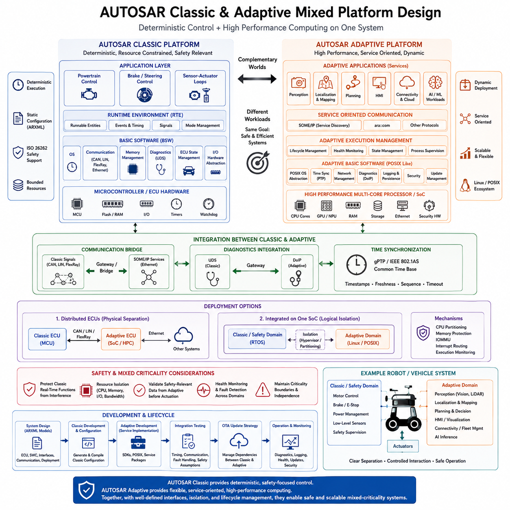{width="7.268055555555556in" height="7.268055555555556in"}

AUTOSAR 혼합 플랫폼 설계(mixed-platform design)는 결정론적 제어(deterministic control)와 고성능 소프트웨어(high-performance software)가 동일한 차량 또는 로봇 아키텍처 내에서 공존할 수 있도록 두 개의 상호 보완적인 실행 환경을 결합한다. 클래식 플랫폼(Classic Platform)은 깊이 내장된(deeply embedded), 자원이 제한된(resource-bounded) 실시간 기능에 중점을 두며, 어댑티브 플랫폼(Adaptive Platform)은 계산 집약적이고 동적으로 관리되는 애플리케이션을 지원한다. 두 플랫폼의 통합은 혼합 중요도 컴퓨팅(mixed-criticality computing)을 위한 구조화된 기반을 제공한다.

AUTOSAR 클래식 플랫폼(Classic Platform)은 예측 가능한 타이밍, 정적 구성(static configuration), 엄격하게 통제된 자원 사용이 필요한 마이크로컨트롤러 기반 전자제어장치(ECU)를 위해 설계되었다. 애플리케이션은 소프트웨어 컴포넌트(software component)로 구성되며, 실행 가능 엔티티(runnable entity)는 미리 정의된 이벤트와 타이밍 제약에 따라 실행된다. 런타임 환경(Runtime Environment)은 애플리케이션 소프트웨어와 기본 소프트웨어(Basic Software)를 분리하여 기능 컴포넌트가 하드웨어에 직접 의존하는 대신 표준화된 인터페이스를 통해 통신하도록 한다.

런타임 환경(Runtime Environment) 아래에서 클래식 기본 소프트웨어(Classic Basic Software)는 운영체제 기능, 통신, 메모리 관리, 진단, ECU 상태 관리 및 하드웨어 추상화를 위한 표준화된 서비스를 제공한다. 이러한 계층형 아키텍처(layered architecture)는 애플리케이션 로직을 마이크로컨트롤러별 드라이버에서 분리한다. 이 구조는 결정론적 실행과 통제된 구성을 지원하므로 제동, 조향, 모터 제어, 전력 관리 및 안전 감시(safety supervision)에 특히 유용하다.

AUTOSAR 어댑티브 플랫폼(Adaptive Platform)은 애플리케이션이 동적 배포(dynamic deployment), 서비스 지향 통신(service-oriented communication), 멀티코어 처리 및 보다 유연한 생명주기 관리(lifecycle management)를 요구하는 고성능 컴퓨팅 시스템을 대상으로 한다. 클래식의 매우 정적인 실행 모델과 달리 어댑티브 애플리케이션은 POSIX 지향 운영 환경에서 프로세스로 실행된다. 따라서 인지(perception), 위치 추정(localization), 계획(planning), 연결성(connectivity) 및 기타 복잡한 소프트웨어 워크로드를 지원하는 중앙집중형 컴퓨팅 노드에 적합하다.

서비스 지향 통신(service-oriented communication)은 어댑티브 플랫폼 아키텍처의 핵심 요소이다. 애플리케이션은 고정된 신호 지향 연결(signal-oriented connection)에 의존하는 대신 서비스를 제공하고 소비한다. SOME/IP는 서비스 탐색(service discovery)과 네트워크 통신을 지원할 수 있으며, ara::com은 표준화된 어댑티브 통신 인터페이스를 제공한다. 이러한 모델은 애플리케이션이 서비스를 동적으로 탐색하도록 하며, 컴퓨팅 기능이 고성능 프로세서로 통합될수록 소프트웨어 아키텍처가 더욱 유연하게 발전할 수 있도록 한다.

실행 관리(Execution Management)는 구성된 머신 및 프로세스 상태에 따라 어댑티브 애플리케이션의 시작, 종료 및 생명주기를 조정한다. 다른 플랫폼 서비스들은 진단, 로깅(logging), 영속성(persistence), 시간 동기화(time synchronization), 네트워크 관리, 암호화(cryptography), 소프트웨어 업데이트 지원 등의 기능을 제공한다. 이러한 메커니즘은 기존 임베디드 제어 소프트웨어보다 높은 복잡성과 생명주기 관리 요구사항을 가진 애플리케이션에 적합한 관리형 실행 환경(managed execution environment)을 형성한다.

따라서 클래식(Classic)과 어댑티브(Adaptive)는 서로 경쟁하는 플랫폼으로 해석해서는 안 된다. 두 플랫폼은 동일한 시스템 내부에서 서로 다른 계산 특성을 담당한다. 클래식은 결정론적 응답, 제한된 자원, 직접적인 제어 상호작용이 중요한 영역에 적합하며, 어댑티브는 높은 계산 성능, 동적 서비스, 복잡한 네트워킹 및 소프트웨어 유연성이 중요한 영역에 적합하다. 혼합 플랫폼 아키텍처는 모든 기능을 하나의 실행 모델에 강제로 통합하는 대신 이러한 장점을 의도적으로 유지한다.

일반적인 혼합 아키텍처에서는 액추에이터 관련 기능과 안전 관련 제어를 클래식 영역(Classic domain)에 배치하고, 어댑티브 영역(Adaptive domain)에서는 인지, 계획, 위치 추정, 사용자 인터페이스, 연결성 또는 고급 연산을 실행한다. 로봇에서는 클래식이 모터, 제동, 비상 정지(emergency stop), 저수준 센서-액추에이터 루프를 감독할 수 있으며, 어댑티브는 ROS 관련 통합, 환경 해석, 경로 계획, 플릿 연결(fleet connectivity) 또는 상위 수준 자율 기능을 담당할 수 있다.

두 영역 사이의 통신은 중요한 아키텍처 경계(architectural boundary)를 형성한다. 클래식 통신은 전통적으로 자동차 네트워크와 신호 지향 메커니즘을 사용하는 반면, 어댑티브 시스템에서는 이더넷(Ethernet)과 서비스 지향 통신이 점차 중요해지고 있다. SOME/IP는 이더넷 기반 아키텍처에서 공통 통합 메커니즘을 제공할 수 있다. CAN 기반 클래식 통신과 이더넷 기반 어댑티브 서비스가 공존하는 경우 게이트웨이(gateway)를 통해 두 통신 방식을 변환할 수 있다.

진단 통합(diagnostic integration)은 또 다른 플랫폼 간 요구사항이다. 클래식 ECU는 일반적으로 UDS와 관련된 진단 메커니즘을 사용하며, 이더넷 기반 시스템에서는 인터넷 프로토콜 기반 진단(Diagnostics over Internet Protocol, DoIP)을 사용할 수 있다. 따라서 중앙집중형 진단 아키텍처는 각 영역의 구현 특성을 유지하면서 기존 임베디드 컨트롤러와 고성능 어댑티브 노드를 연결할 수 있다. 로깅, 상태 감시(health monitoring), 시스템 상태 및 결함 보고에서도 유사한 조정이 필요하다.

시간 동기화(time synchronization)는 제어, 인지 및 계획 정보가 플랫폼 경계를 통과할 때 필수적이다. 어댑티브 애플리케이션에서 생성되거나 처리된 센서 관측 정보는 클래식 제어 기능에서 사용될 때도 시간적으로 의미 있는 상태를 유지해야 한다. 일반화 정밀 시간 프로토콜(generalized Precision Time Protocol, gPTP)과 같은 이더넷 기반 동기화 기술을 통해 공통 시간 기준을 설정할 수 있으며, 애플리케이션 인터페이스는 타임스탬프(timestamp), 최신성(freshness), 순서 일관성(sequence consistency), 타임아웃(timeout) 동작을 유지해야 한다.

클래식 안전 기능과 어댑티브 QM 또는 서로 다른 중요도 수준의 워크로드가 컴퓨팅 자원을 공유하면 혼합 플랫폼 설계는 혼합 중요도 문제(mixed-criticality problem)가 된다. 고성능 어댑티브 애플리케이션으로 인해 중요한 클래식 기능이 데드라인을 놓치거나 필요한 메모리와 장치에 접근하지 못해서는 안 된다. 따라서 CPU 파티셔닝(CPU partitioning), 메모리 보호, 인터럽트 라우팅, IOMMU 보호, 실행 감시 및 통제된 장치 소유권이 핵심적인 아키텍처 요구사항이 될 수 있다.

클래식과 어댑티브 환경은 이더넷으로 연결된 별도의 ECU에서 실행되어 두 영역 사이에 물리적 분리(physical separation)를 제공할 수 있다. 보다 통합된 시스템에서는 두 환경을 하나의 멀티코어 시스템 온 칩(SoC)에 배치할 수 있다. 이 경우 하드웨어 파티셔닝(hardware partitioning) 또는 하이퍼바이저(hypervisor)를 통해 프로세서, 메모리 영역, 인터럽트 및 장치를 서로 다른 실행 환경에 할당할 수 있다. 이러한 통합은 하드웨어 중복을 감소시키지만 공유 자원이 허용할 수 없는 간섭을 발생시키지 않는다는 더욱 강력한 증거를 요구한다.

이러한 아키텍처는 AUTOSAR 혼합 플랫폼 설계와 하이퍼바이저 기반 격리(hypervisor-based isolation)를 직접적으로 연결한다. 클래식 또는 안전 지향 RTOS 영역에는 전용 CPU와 장치 자원을 할당하고, Linux 또는 다른 POSIX 환경에서는 어댑티브 애플리케이션을 실행할 수 있다. Jailhouse 방식의 정적 파티셔닝(static partitioning)이나 다른 가상화 기술을 통해 두 환경 사이에 경계를 설정할 수 있지만, 결정론적 동작은 공유 캐시, DRAM 대역폭, 인터커넥트, 인터럽트 및 가속기 자원에 대한 통제에도 영향을 받는다.

어댑티브 애플리케이션에서 생성된 안전 관련 정보 역시 해당 정보의 보증 수준(assurance level)에 따라 처리해야 한다. 예를 들어 인지 또는 계획 소프트웨어가 장애물 분류나 목표 궤적(desired trajectory)을 생성할 수 있지만, 안전 지향 제어 영역은 명령 제한, 데이터 최신성, 운전 조건 및 액추에이터 제약을 독립적으로 검증할 수 있다. 이를 통해 상위 수준의 기능 지능(functional intelligence)과 검증된 안전 동작을 유지할 책임을 가진 안전 권한(safety authority)을 명확하게 구분할 수 있다.

소프트웨어 업데이트(software update)는 두 플랫폼 사이의 또 다른 중요한 차이를 만든다. 클래식 소프트웨어는 전통적으로 비교적 정적인 ECU 이미지 형태로 구성되고 배포되는 반면, 어댑티브 아키텍처는 보다 동적인 애플리케이션 및 플랫폼 생명주기 관리를 지원하도록 설계된다. 혼합 시스템에서는 어댑티브 소프트웨어 업데이트가 클래식 구성요소가 의존하는 인터페이스, 타이밍 가정, 통신 계약 또는 안전 메커니즘을 의도하지 않게 무효화하지 않도록 업데이트 의존성을 신중하게 관리해야 한다.

따라서 개발 과정에서는 두 플랫폼을 독립적으로 구현하는 것보다 시스템 수준의 인터페이스 정의(system-level interface definition)가 중요하다. ARXML 기반 설명과 플랫폼 구성을 통해 소프트웨어 컴포넌트, 서비스, 인터페이스, 통신 관계 및 배포 정보를 정의한다. 이후 통합 시험(integration testing)에서는 기능적 통신뿐 아니라 타이밍 동작, 시작 순서(startup sequencing), 고장 처리, 동기화, 자원 간섭 및 어느 한 플랫폼이 사용할 수 없거나 성능 저하 상태가 되었을 때의 복구 동작까지 검증해야 한다.

현대 로봇 및 자율 시스템에서 이러한 아키텍처는 결정론적 기계 제어(deterministic machine control)와 빠르게 발전하는 상위 수준 연산(high-level computation)을 효과적으로 분리한다. 클래식 방식의 제어 원칙은 제한된 액추에이터 및 안전 동작을 보호할 수 있으며, 어댑티브 방식의 컴퓨팅은 인지, 계획, 연결성 및 점점 더 AI 집약적으로 변화하는 애플리케이션에 필요한 유연성을 제공한다. 이러한 분리를 통해 모든 계산 기능을 가장 제한적인 실행 환경에 배치하지 않고도 고급 소프트웨어를 지속적으로 발전시킬 수 있다.

따라서 AUTOSAR 클래식과 어댑티브 혼합 플랫폼 설계(AUTOSAR Classic and Adaptive Mixed-Platform Design)는 본질적으로 아키텍처 통합 전략(architectural integration strategy)이다. 클래식은 결정론적 임베디드 제어를 제공하고, 어댑티브는 서비스 지향 고성능 컴퓨팅을 제공하며, 신중하게 정의된 통신 및 격리 메커니즘이 두 환경을 연결한다. 하드웨어 파티셔닝, 하이퍼바이저 격리, 동기화된 통신, 안전 검증 및 생명주기 관리와 결합하면 명확한 중요도 경계를 유지하면서 실시간 제어와 고급 컴퓨팅을 하나의 시스템으로 통합할 수 있다.

## 10.04 Safety-Critical Task Isolation and Monitoring [w/Code]

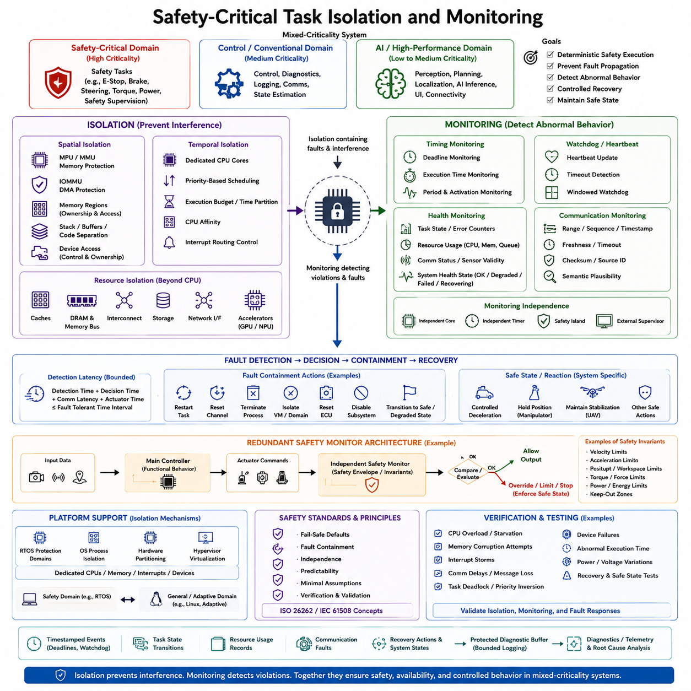{width="7.268055555555556in" height="7.268055555555556in"}

안전 중요 태스크 격리(Safety-Critical Task Isolation)는 로봇, 차량 또는 자율 기계의 안전을 담당하는 기능이 다른 소프트웨어의 오동작이나 과도한 자원 사용 상황에서도 예측 가능하게 실행되도록 보장한다. 혼합 중요도 시스템(Mixed-Criticality System)에서 격리(isolation)는 안전 태스크 주위에 명확한 경계를 설정하며, 모니터링(monitoring)은 실행 상태가 정의된 타이밍, 메모리, 통신 및 기능적 한계 내에 유지되는지를 지속적으로 확인한다.

안전 중요 태스크(safety-critical task)는 제동, 비상 정지, 조향 제한, 모터 토크, 전력 분배, 액추에이터 제약 또는 시스템 상태를 감독할 수 있다. 이러한 태스크의 고장은 기계가 안전 상태(safe state)를 유지하는 능력에 직접적인 영향을 줄 수 있다. 따라서 실행 환경은 일반적인 소프트웨어 결함뿐만 아니라 낮은 중요도의 제어, 통신, 인지(perception), 계획(planning) 또는 AI 워크로드에서 발생하는 간섭으로부터도 보호되어야 한다.

공간적 격리(spatial isolation)는 하나의 태스크 또는 소프트웨어 영역이 다른 태스크의 메모리를 손상시키거나 허가되지 않은 장치에 접근하는 것을 방지한다. MPU 또는 MMU 보호를 통해 서로 다른 주소 영역을 할당할 수 있으며, IOMMU는 이러한 보호를 DMA 기능을 가진 주변장치까지 확장한다. 스택 영역, 공유 버퍼, 장치 레지스터, 통신 메모리 및 실행 코드는 명확한 소유권과 접근 권한을 가져야 하며, 비정상적인 접근이 할당된 영역 내부에 제한되도록 해야 한다.

시간적 격리(temporal isolation)는 안전 중요 태스크가 필요로 하는 실행 시간을 보호한다. 낮은 우선순위 애플리케이션이 프로세서를 독점하거나 과도한 인터럽트를 발생시키거나 안전 태스크가 데드라인(deadline)을 만족하지 못하게 하는 스케줄링 조건을 만들어서는 안 된다. 전용 CPU 코어, 우선순위 기반 스케줄링(priority-based scheduling), 실행 예산(execution budget), CPU 친화도(CPU affinity), 시간 분할(time partitioning), 통제된 인터럽트 라우팅을 통해 가장 중요한 기능에 예측 가능한 처리 시간을 확보할 수 있다.

현대의 멀티코어 시스템에는 다양한 공유 구성요소가 존재하므로 자원 격리(resource isolation)는 CPU 스케줄링을 넘어 확장되어야 한다. 최종 단계 캐시(last-level cache), DRAM 컨트롤러, 메모리 버스, 인터커넥트(interconnect), 저장장치, 네트워크 인터페이스 및 가속기는 소프트웨어가 서로 다른 코어에서 실행되는 경우에도 간섭을 발생시킬 수 있다. 따라서 안전 분석에서는 공유 자원을 식별하고 이를 분할하거나 사용량을 제한하거나 실제 최악 조건의 워크로드에서 동작을 감시해야 한다.

태스크 모니터링(task monitoring)은 실행 동작이 예상 범위를 벗어나는 상황을 감지함으로써 격리를 보완한다. 데드라인 모니터(deadline monitor)는 주기적인 제어 태스크가 요구된 데드라인 이전에 완료되는지를 판단하며, 실행 시간 모니터링(execution-time monitoring)은 비정상적으로 긴 처리를 감지할 수 있다. 주기 및 활성화 모니터링(period and activation monitoring)은 누락되거나 중복되거나 예상보다 빈번한 실행을 식별한다. 이러한 메커니즘은 타이밍 가정을 관찰 가능한 런타임 조건으로 변환하여 통제된 고장 대응을 가능하게 한다.

워치독(watchdog)은 또 다른 독립적인 감시 계층을 제공한다. 태스크는 필요한 처리를 정상적으로 완료한 이후에만 주기적으로 워치독 또는 하트비트(heartbeat)를 갱신할 수 있다. 설정된 시간 구간 내에 예상된 갱신이 발생하지 않으면 감시 로직은 해당 태스크가 정지, 교착 상태(deadlock), 과부하 또는 기타 비정상 상태에 있다고 판단할 수 있다. 윈도우 워치독(windowed watchdog)은 지나치게 빠른 실행도 감지하여 비정상적인 스케줄링이나 제어되지 않은 반복 루프를 식별하는 데 도움을 줄 수 있다.

상태 모니터링(health monitoring)은 단순히 소프트웨어가 실행 중인지 여부보다 더 많은 정보를 평가한다. 감시기(supervisor)는 태스크 상태, 오류 카운터, 큐 사용량, 메모리 소비량, 통신 상태, 센서 유효성, CPU 부하 및 내부 진단 정보를 관찰할 수 있다. 이러한 관측 결과를 정상(normal), 성능 저하(degraded), 고장(failed), 복구 중(recovering) 등의 상태로 결합할 수 있다. 이러한 상태 모델을 통해 시스템은 감지된 문제의 심각성과 지속 시간에 비례하는 고장 대응을 선택할 수 있다.

안전 중요 태스크가 다른 영역의 데이터를 사용하는 경우 통신 모니터링(communication monitoring)이 필수적이다. 메시지의 유효 범위, 시퀀스 카운터(sequence counter), 타임스탬프(timestamp), 최신성(freshness), 타임아웃 조건, 체크섬(checksum), 송신자 식별 정보 및 의미적 타당성(semantic plausibility)을 검사할 수 있다. 속도, 장애물, 궤적 또는 액추에이터 명령을 수신하는 안전 컨트롤러는 통신에 성공했다는 이유만으로 상위 소프트웨어가 정확하다고 가정해서는 안 된다. 데이터의 유효성은 안전 경계(safety boundary)에서 확인되어야 한다.

결함 격리(fault containment)는 비정상적인 동작이 감지된 이후 어떤 조치를 수행할지를 결정한다. 고장은 전체 시스템으로 전파되는 대신 가능한 한 가장 작은 결함 격리 영역(fault containment region) 내부에 유지되어야 한다. 아키텍처와 고장의 심각도에 따라 개별 태스크 재시작, 통신 채널 재설정, 프로세스 종료, 가상 머신 격리, ECU 재설정, 서브시스템 비활성화 또는 사전에 정의된 안전 상태나 성능 저하 운전 상태로의 전환을 수행할 수 있다.

안전 상태(safe state)는 물리적 시스템에 따라 달라지며 항상 모든 기능을 단순히 정지시키는 것으로 해석할 수는 없다. 자율이동로봇(AMR)은 브레이크를 작동하기 전에 제어된 감속(controlled deceleration)이 필요할 수 있으며, 매니퓰레이터(manipulator)는 적재물을 놓지 않은 상태에서 움직임을 정지해야 할 수 있다. 무인항공기(UAV)는 상위 수준의 자율 기능이 고장난 이후에도 자세 안정화를 계속 수행해야 할 수 있다. 따라서 안전 모니터링은 감지된 고장을 시스템 특성에 맞는 대응과 연결하여 제어 가능성을 유지하고 물리적 위험을 최소화해야 한다.

중복 모니터링(redundant monitoring)은 하나의 소프트웨어 구성요소에 대한 의존성을 줄일 수 있다. 주 제어기(primary controller)가 정상적인 제어를 수행하는 동안 독립적인 안전 모니터(independent safety monitor)는 속도, 가속도, 위치, 토크 또는 운전 허용 범위(operating envelope)를 평가할 수 있다. 모니터가 전체 제어 알고리즘을 그대로 복제할 필요는 없으며, 대신 안전 불변조건(safety invariant)을 검증하고 출력이 허용된 경계를 벗어나는 경우 개입한다. 이러한 아키텍처는 복잡한 기능적 동작과 독립적인 안전 권한(safety authority)을 분리한다.

혼합 중요도 플랫폼은 일반적으로 RTOS 보호 영역(protection domain), 운영체제 프로세스 격리, 하드웨어 파티셔닝 또는 하이퍼바이저 기반 가상화(hypervisor-based virtualization)를 통해 이러한 경계를 구현한다. 안전 RTOS 파티션에는 전용 CPU, 메모리, 인터럽트 및 장치를 할당할 수 있으며, Linux 또는 어댑티브(Adaptive) 애플리케이션은 다른 영역에서 실행할 수 있다. 격리 메커니즘은 결함 전파를 감소시키며, 모니터링은 각 파티션이 시스템 안전 아키텍처의 기반이 되는 가정을 지속적으로 만족하는지 확인한다.

AI 워크로드는 입력의 복잡성과 시스템 부하에 따라 실행 시간과 출력이 크게 변할 수 있기 때문에 모니터링이 특히 중요하다. 인지(perception), 월드 모델(world model) 추론, 계획(planning) 또는 학습 기반 정책(learned policy)은 낮은 보증 수준의 영역에서 실행하고, 결정론적 안전 태스크가 그 결과로 생성된 명령을 독립적으로 감독할 수 있다. 타임아웃 검사, 신뢰도 또는 유효성 조건, 물리적 허용 범위, 속도 제한 및 비상 로직을 통해 가변적인 AI 동작이 액추에이터에 대한 무제한 제어 권한을 갖지 못하도록 할 수 있다.

모니터링 자체도 일반적인 진단 로깅(diagnostic logging)이 아니라 안전 메커니즘(safety mechanism)으로 설계되어야 한다. 감시 대상 태스크에 완전히 의존하는 모니터는 해당 태스크와 동시에 고장날 수 있다. 따라서 중요한 모니터는 실행 컨텍스트, 메모리, 타이밍 소스 또는 하드웨어 감시 측면에서 충분한 독립성을 가져야 한다. 하드웨어 워치독, 독립적인 타이머 소스, 별도의 코어, 안전 아일랜드(safety island) 또는 외부 컨트롤러를 사용하면 안전 개념에서 요구되는 경우 더욱 강력한 감시 구조를 구현할 수 있다.

고장 감지 지연시간(fault detection latency) 역시 제한되어야 한다. 제어 태스크의 고장을 데드라인 이후 수 초가 지나서 감지한다면 물리적 시스템이 수 밀리초 안에 위험 상태에 도달할 수 있는 경우 아무런 의미가 없을 수 있다. 설계자는 모니터링 주기와 타임아웃 임계값을 제어 시스템의 결함 허용 시간 간격(fault-tolerant time interval)과 연계해야 한다. 감지 시간, 판단 시간, 통신 지연시간 및 액추에이터 반응 시간이 결합되어 위험이 발생하기 전에 시스템이 안전 상태에 도달할 수 있는지를 결정한다.

검증(verification)은 격리와 모니터링 메커니즘 모두를 의도적으로 한계 상황에 노출시켜야 한다. 시험에서는 CPU 과부하, 메모리 손상 시도, 인터럽트 폭주(interrupt storm), 통신 지연, 메시지 손실, 태스크 교착 상태, 우선순위 역전(priority inversion), 장치 고장 및 비정상적인 실행 시간을 발생시킬 수 있다. 격리를 통해 장애가 제한될 것으로 예상되는 상황에서는 안전 태스크가 요구된 보장을 계속 만족해야 하며, 정의된 격리 능력을 초과하는 조건에서는 모니터가 이를 감지하여 의도된 대응을 시작해야 한다.

런타임 증거(runtime evidence)는 현장 진단(field diagnostics)과 근본 원인 분석(root-cause analysis)에도 활용할 수 있다. 타임스탬프가 포함된 데드라인 위반, 워치독 이벤트, 태스크 상태 전이, 자원 사용량, 통신 장애 및 복구 동작을 보호된 진단 버퍼에 기록할 수 있다. 로깅 자체가 중요 태스크의 실행을 방해하지 않도록 기록량과 실행 시간을 제한해야 한다. 이러한 추적 정보(trace)를 통해 운전 중 요구되는 결정론적 동작을 유지하면서 엔지니어가 고장 발생 과정을 재구성할 수 있다.

따라서 안전 중요 태스크 격리 및 모니터링(Safety-Critical Task Isolation and Monitoring)은 상호 보완적인 두 개의 보호 계층을 형성한다. 격리는 고장과 자원 간섭이 중요 기능에 도달하는 것을 방지하고, 모니터링은 격리만으로 방지할 수 없거나 중요 기능 내부에서 발생하는 위반을 감지한다. 제한된 고장 감지 시간, 통제된 복구, 독립적인 감시 및 시스템 특성에 맞는 안전 상태 로직과 결합하면 안전 제어, 일반 소프트웨어 및 고성능 AI 워크로드가 견고한 혼합 중요도 아키텍처 안에서 공존할 수 있다.

## 10.05 Mixed Criticality Communication Channel Design

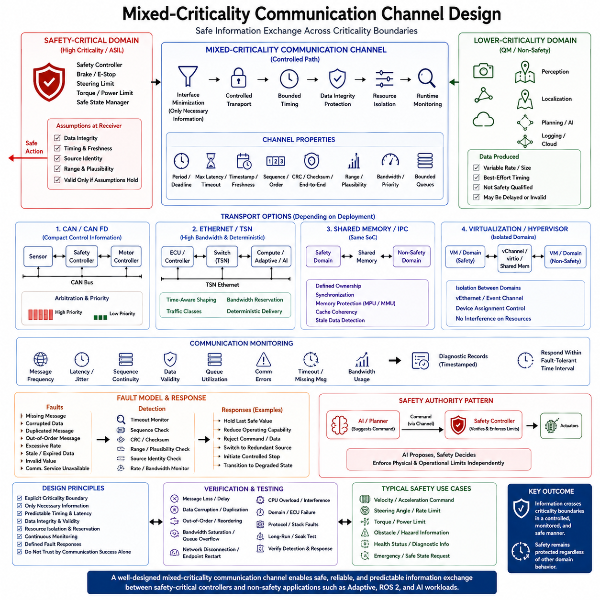{width="7.268055555555556in" height="7.268055555555556in"}

혼합 중요도 통신 채널(mixed-criticality communication channel)은 서로 다른 안전성, 타이밍 및 보증 수준(assurance requirements)을 가진 소프트웨어 기능 사이에서 정보를 교환하기 위한 통제된 경로를 제공한다. 로봇이나 차량에서는 안전 중요 컨트롤러(safety-critical controller)가 낮은 중요도의 인지(perception), 계획(planning) 또는 AI 서브시스템으로부터 정보를 받아야 할 수 있으며, 수신 기능은 유효하지 않거나 지연되거나 손상되었거나 과도하게 많은 데이터로부터 보호되어야 한다. 따라서 통신 채널은 단순한 소프트웨어 인터페이스가 아니라 안전 아키텍처(safety architecture)의 일부가 된다.

기본적인 설계 원칙은 통신이 서로 다른 중요도 영역 사이의 경계(criticality boundary)를 유지해야 한다는 것이다. QM 또는 비안전 애플리케이션이 생성한 메시지가 ASIL D 영역에 들어온다고 해서 자동으로 안전 적격(safety-qualified) 정보가 되는 것은 아니다. 수신 안전 기능은 데이터 무결성(integrity), 타이밍, 최신성(freshness), 송신원(source identity) 및 허용 가능한 값에 대한 명시적인 가정을 적용해야 한다. 따라서 채널은 어떤 정보가 경계를 통과할 수 있는지, 어떻게 전송되는지, 어떻게 검증되는지, 통신 가정이 위반되었을 때 무엇을 수행하는지를 정의해야 한다.

통신 아키텍처는 물리적 및 소프트웨어 배포 모델에 크게 의존한다. 안전 기능과 비안전 기능은 CAN, CAN FD 또는 Ethernet으로 연결된 서로 다른 ECU에서 실행될 수도 있고, 하나의 멀티코어 SoC에서 격리된 영역으로 실행될 수도 있다. 하나의 프로세서 내부에서는 공유 메모리(shared memory), 프로세스 간 통신(IPC), 가상 네트워킹(virtual networking) 또는 하이퍼바이저가 중재하는 채널을 사용할 수 있다. 서로 다른 ECU 사이에서는 네트워크 프로토콜과 게이트웨이(gateway)가 통신 경로를 제공한다. 모든 경우에 인터페이스는 수신 기능에 필요한 정보만 노출하도록 설계해야 한다.

타이밍 동작은 혼합 중요도 채널의 가장 중요한 특성 중 하나이다. 안전 컨트롤러는 임의로 지연된 메시지를 최신 측정값과 동일하게 취급해서는 안 된다. 따라서 각 안전 관련 메시지에는 전송 주기, 최대 지연시간, 데드라인 및 허용 가능한 데이터 연령(age)을 명확하게 정의해야 한다. 타임아웃 감시(timeout supervision)는 통신 누락을 감지할 수 있으며, 타임스탬프와 순서 정보(sequence information)를 통해 수신기는 데이터가 최신인지, 지연되었는지, 중복되었는지 또는 순서가 뒤바뀌었는지를 판단할 수 있다.

데이터 무결성(data integrity)은 통신 성공과 독립적으로 보호되어야 한다. 메시지가 목적지에 정상적으로 도착했더라도 손상되었거나 일관되지 않은 정보를 포함할 수 있다. CRC, 체크섬(checksum), 시퀀스 카운터(sequence counter), 종단 간 보호(end-to-end protection), 송신원 식별(source identification), 범위 검증(range validation) 등을 여러 보호 계층으로 사용할 수 있다. 안전 관련 값에 대해서는 수신기가 물리적 제약조건과 관련 신호를 기준으로 타당성 검사(plausibility check)를 수행해야 한다. 통신 확인 응답(acknowledgement)만으로 전송된 정보가 안전하게 사용될 수 있다는 증거로 간주해서는 안 된다.

대역폭과 큐 동작 역시 제한 가능해야 한다. AI 인지(perception)나 로깅(logging)과 같은 낮은 중요도의 애플리케이션은 대량의 가변적인 데이터를 생성할 수 있지만, 안전 기능에 필요한 통신 자원을 소비해서는 안 된다. 전용 채널, 대역폭 예약(bandwidth reservation), 우선순위 할당, 제한된 큐(bounded queue), 전송률 제한(rate limiting), 트래픽 셰이핑(traffic shaping)을 통해 비중요 트래픽이 중요 통신을 고갈시키는 것을 방지할 수 있다. 설계 목표는 단순히 전체 네트워크 처리량을 최대화하는 것이 아니라 예측 가능한 데이터 전달이다.

CAN 기반 통신은 소형 제어 정보를 전달하는 데 적합한 경우가 많으며, 중재(arbitration)와 우선순위 메커니즘을 통해 높은 우선순위 메시지의 예측 가능한 전송을 지원한다. 따라서 CAN 또는 CAN FD는 모터 컨트롤러, 안전 컨트롤러, 센서 및 기타 임베디드 노드를 연결할 수 있다. 그러나 애플리케이션 수준의 안전성을 확보하려면 메시지 최신성, 순서, 범위 및 유효성을 감시해야 한다. CAN 프레임이 정상적으로 전송되었다는 사실만으로 해당 제어 정보가 기능적으로 안전하다고 판단할 수는 없다.

Ethernet은 고성능 컴퓨팅과 분산 제어를 결합하는 혼합 중요도 시스템에서 점점 더 중요해지고 있다. 어댑티브 애플리케이션, 인지 시스템, 계획 모듈 및 AI 워크로드는 Ethernet을 통해 대량의 데이터를 교환할 수 있으며, 안전 관련 정보는 논리적으로 분리되거나 우선순위가 지정된 트래픽을 사용할 수 있다. 필요한 경우 TSN과 같은 기술을 사용하여 보다 결정론적인 트래픽 스케줄링을 제공할 수 있다. 그러나 네트워크 결정론(network determinism)은 엔드포인트 처리, 운영체제 스케줄링, 인터럽트 동작, 버퍼링 및 애플리케이션 수준의 타임아웃 요구사항과 함께 평가해야 한다.

공유 메모리 통신(shared-memory communication)은 안전 영역과 비안전 영역이 동일한 컴퓨팅 플랫폼에 있을 때 매우 낮은 지연시간을 제공할 수 있다. 그러나 공유 메모리는 소유권(ownership), 동기화(synchronization), 메모리 보호, 캐시 일관성(cache coherency) 및 오래된 데이터(stale data)와 관련된 추가적인 문제를 발생시킨다. 견고한 설계에서는 각 버퍼를 어느 영역이 소유하는지, 언제 데이터를 기록하거나 소비할 수 있는지, 수신기가 불완전하거나 오래된 데이터를 어떻게 감지하는지를 정의한다. IOMMU와 MPU/MMU 메커니즘을 통해 공유 통신 메모리에 대한 허가되지 않은 접근을 추가로 제한할 수 있다.

하이퍼바이저 기반 시스템에서는 가상 머신 또는 격리된 실행 영역 사이에 또 다른 통신 경계가 형성된다. 가상 Ethernet, 공유 메모리 메커니즘, 이벤트 채널(event channel), virtio 기반 인터페이스 또는 신중하게 통제된 장치 할당(device assignment)을 통해 영역을 연결하면서 자원 분리를 유지할 수 있다. 통신 메커니즘은 한 영역의 고장이 다른 영역의 메모리나 실행 자원을 손상시키지 못하도록 해야 한다. 중요 통신 채널은 비중요 관리 소프트웨어에 대한 의존성을 최소화하고 제한되지 않은 가상화 경로(unbounded virtualization path)를 피해야 한다.

통신 인터페이스는 명확한 고장 모델(failure model)을 정의해야 한다. 메시지 누락, 데이터 손상, 메시지 중복, 잘못된 순서 번호, 과도한 전송률, 오래된 정보, 유효하지 않은 값 및 통신 서비스 불가 상태는 각각 식별 가능한 대응을 가져야 한다. 기능에 따라 이전의 안전한 값을 유지하거나, 운전 능력을 축소하거나, 명령을 거부하거나, 중복 데이터 소스로 전환하거나, 제어된 정지를 시작하거나, 미리 정의된 성능 저하 상태(degraded state)로 전환할 수 있다.

로봇에서 특히 중요한 패턴은 기능적 지능(functional intelligence)과 안전 권한(safety authority)을 분리하는 것이다. AI 또는 계획 서브시스템은 목표 속도, 궤적, 조향 명령 또는 조작 목표를 생성할 수 있지만, 안전 컨트롤러는 해당 명령이 정의된 물리적 및 운용상의 한계 내에 있는지를 독립적으로 검증할 수 있다. 통신 채널은 제안된 명령을 전달하고, 수신 측 안전 계층은 그 명령을 허용할 수 있는지 판단한다. 이러한 아키텍처를 통해 고급 AI 기능을 발전시키면서도 AI 서브시스템에 안전 중요 액추에이터에 대한 무제한 권한을 부여하지 않을 수 있다.

따라서 통신 모니터링(communication monitoring)은 시스템 실행 중 지속적으로 수행되어야 한다. 모니터는 메시지 빈도, 지연시간, 순서 연속성(sequence continuity), 큐 사용량, 통신 오류 및 데이터 유효성을 추적할 수 있다. 진단 기록(diagnostic record)은 중요한 통신 고장을 타임스탬프와 관련 시스템 상태와 함께 저장해야 한다. 통신이 신뢰할 수 없게 되는 경우 시스템은 상위 수준 애플리케이션이 문제를 인식할 때까지 기다리는 것이 아니라 요구되는 결함 허용 시간 간격(fault-tolerant time interval) 내에서 대응해야 한다.

검증(verification)은 정상 조건과 비정상 조건 모두에서 통신 채널을 시험해야 한다. 시험에서는 메시지 손실, 손상, 중복, 순서 변경, 지연, 대역폭 포화, 큐 오버플로, 네트워크 연결 해제, 엔드포인트 재시작, CPU 과부하 및 영역 고장을 의도적으로 발생시킬 수 있다. 목표는 안전 중요 통신이 예상되는 간섭 조건에서도 타이밍 및 무결성 요구사항을 지속적으로 만족한다는 것을 입증하고, 위반이 발생하면 안전 개념(safety concept)에 따라 이를 감지하고 처리한다는 것을 입증하는 것이다.

잘 설계된 혼합 중요도 통신 채널은 인터페이스 최소화(interface minimization), 통제된 전송(controlled transport), 제한된 타이밍(bounded timing), 데이터 무결성 보호, 자원 격리(resource isolation), 런타임 모니터링(runtime monitoring) 및 명확하게 정의된 고장 대응(fault response)을 결합한다. 이를 통해 정보가 중요도 경계를 넘어 이동하면서도 수신 영역의 중요도가 송신 영역의 동작에 대해 맹목적으로 의존하지 않도록 하는 의도적인 경계를 형성한다. 이러한 원칙은 안전 컨트롤러, RTOS 영역, Linux 시스템, Adaptive 애플리케이션, ROS 2 구성요소 및 AI 워크로드를 하나의 로봇 또는 자율 시스템 아키텍처 안에서 통합할 때 필수적이다.

## 10.06 Time Partitioning Implementation

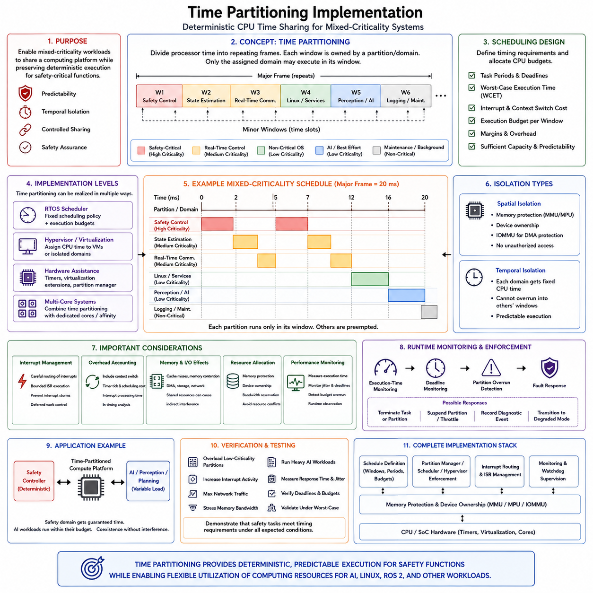{width="7.268055555555556in" height="7.268055555555556in"}

시간 분할(Time Partitioning)은 서로 다른 중요도 수준(criticality level)을 가진 소프트웨어 기능이 예측 가능한 실행을 유지하면서 하나의 컴퓨팅 플랫폼을 공유할 수 있도록 하는 핵심 메커니즘이다. 혼합 중요도 로봇이나 차량에서는 안전 중요 제어(safety-critical control)가 엄격한 타이밍 보장을 요구할 수 있는 반면, 인지(perception), 계획(planning), 진단(diagnostics) 또는 AI 워크로드는 실행 시간이 가변적일 수 있다. 시간 분할은 각 실행 영역에 프로세서 시간의 통제된 일부를 할당하여 비중요 워크로드가 중요 기능에 필요한 자원을 지속적으로 소비하지 못하도록 한다. 이 주제는 Chapter 10에서 혼합 중요도 시스템 설계를 위한 핵심 메커니즘으로 다루어진다.

기본 개념은 프로세서 실행 시간을 미리 정의된 시간 구간(time window)으로 나누고 각각의 구간을 특정 태스크, 파티션 또는 실행 영역에 연결하는 것이다. 반복되는 메이저 프레임(major frame)은 여러 개의 마이너 윈도우(minor window)를 포함할 수 있으며, 각 윈도우는 특정 워크로드가 실행될 수 있는 시간을 정의한다. 스케줄러(scheduler) 또는 파티션 관리자(partition manager)는 결정론적인 스케줄에 따라 이러한 윈도우 사이를 전환한다. 이 방식은 단순한 우선순위 스케줄링(priority scheduling)과 다르다. 순간적인 태스크 우선순위만으로 실행이 결정되는 것이 아니라 시간적 소유권(temporal ownership)이 사전에 명시적으로 설정되기 때문이다.

시간 분할 시스템(time-partitioned system)은 일반적으로 각 워크로드의 타이밍 요구사항을 정의하는 것에서 시작한다. 안전 중요 태스크는 데드라인 이내에 완료하기에 충분한 실행 능력을 필요로 하며, 낮은 중요도의 기능에는 남은 프로세서 예산이 할당된다. 파티션 스케줄은 태스크 주기(period), 최악 실행 시간(WCET), 데드라인, 인터럽트 오버헤드, 컨텍스트 스위치 비용(context-switch cost) 및 필요한 여유 시간(margin)을 고려해야 한다. 결과적으로 생성된 스케줄은 정상 동작에 충분한 처리 능력을 제공하면서 계산 요구량이 예상보다 증가하는 상황에서도 예측 가능한 동작을 유지해야 한다.

일반적인 혼합 중요도 스케줄은 안전 제어, 실시간 통신(real-time communication), 상태 추정(state estimation) 및 기타 결정론적 기능을 위한 반복적인 실행 윈도우를 예약하고, Linux 서비스, 인지, AI 추론, 로깅 또는 유지보수 기능에는 별도의 윈도우를 할당할 수 있다. 구체적인 할당은 시스템 요구사항에 따라 달라진다. 안전 파티션은 엄격한 데드라인을 가진 제어 루프를 위해 짧은 윈도우를 높은 빈도로 실행할 수 있으며, AI 워크로드는 더 큰 지연을 허용할 수 있기 때문에 더 낮은 빈도로 더 큰 윈도우를 사용할 수 있다. 이를 통해 반드시 별도의 프로세서를 사용하지 않고도 시간적 분리를 구현할 수 있다.

시간 분할은 여러 아키텍처 수준에서 구현할 수 있다. RTOS 스케줄러는 고정된 스케줄링 정책과 실행 예산(execution budget)을 사용할 수 있으며, 하이퍼바이저(hypervisor)는 가상 머신 또는 격리된 실행 영역에 CPU 시간을 할당할 수 있다. 하드웨어 지원 가상화(hardware-supported virtualization)는 영역 사이의 경계를 강화할 수 있으며, 멀티코어 시스템에서는 시간 분할을 CPU 친화도(CPU affinity) 또는 전용 코어와 결합할 수 있다. 따라서 통합된 로봇 컴퓨터에서는 하나의 영역이 결정론적인 안전 기능을 실행하고 다른 영역이 Linux, ROS 2, 인지 또는 AI 워크로드를 위해 통제된 프로세서 시간을 사용할 수 있다.

공간적 격리(spatial isolation)와 시간적 격리의 차이를 이해하는 것이 중요하다. 공간적 격리는 한 영역이 다른 영역의 메모리나 장치에 접근하는 것을 방지하는 반면, 시간적 격리는 한 영역이 허용된 실행 시간보다 더 많은 프로세서 시간을 소비하는 것을 방지한다. 견고한 혼합 중요도 시스템은 일반적으로 두 가지를 모두 필요로 한다. 메모리 영역이 완벽하게 보호되어 있더라도 비중요 태스크가 공유 CPU 자원을 독점할 수 있다면 충분하지 않으며, CPU 스케줄링이 완벽하더라도 결함이 있는 애플리케이션이 안전 중요 메모리를 덮어쓸 수 있다면 충분하지 않다.

구현을 위해서는 신뢰할 수 있는 스케줄링 기준(scheduling reference)과 파티션 경계를 강제하는 메커니즘이 필요하다. 스케줄러는 현재 활성화된 파티션을 결정하고, 허가된 태스크만 실행하도록 하며, 정의된 경계에서 실행 영역을 전환해야 한다. 타이머(timer) 또는 하드웨어 스케줄링 기능은 정밀한 타이밍 기준을 제공할 수 있다. 컨텍스트 스위치 오버헤드와 인터럽트 처리는 타이밍 분석에 포함되어야 한다. 이론적으로 올바른 파티션 스케줄이라도 구현 과정에서 고려되지 않은 실행 시간이 크게 발생하면 실제 데드라인을 위반할 수 있기 때문이다.

인터럽트 처리는 특히 주의해야 한다. 인터럽트는 명확하게 분리된 파티션 경계를 넘어 실행 시간에 영향을 줄 수 있기 때문이다. 낮은 중요도의 서브시스템에서 발생하는 고주파 장치 인터럽트 또는 인터럽트 폭주(interrupt storm)는 예상된 실행 예산을 초과하여 프로세서 시간을 소비할 수 있다. 따라서 중요 인터럽트는 신중하게 라우팅해야 하며, 인터럽트 서비스 루틴(ISR)은 실행 시간이 제한되고 적절한 소유 영역에 할당되어야 한다. 지연 처리(deferred processing) 역시 통제하여 백그라운드 작업이 안전 중요 태스크에 예약된 실행 윈도우를 예기치 않게 소비하지 않도록 해야 한다.

메모리와 I/O 활동도 시간 분할의 효과에 영향을 줄 수 있다. 하나의 파티션이 고정된 CPU 예산을 가지고 있더라도 캐시 미스(cache miss), 메모리 경쟁, DMA 활동, 저장장치 작업 또는 네트워크 처리 때문에 실제 실행 시간이 변할 수 있다. 멀티코어 SoC에서는 공유 캐시, DRAM 컨트롤러, 인터커넥트(interconnect) 및 가속기가 간접적인 간섭을 발생시킬 수 있다. 따라서 시간 분할은 독립적인 스케줄링 기법으로 취급하기보다 자원 할당, 메모리 보호, 장치 소유권 및 성능 모니터링과 함께 적용해야 한다.

런타임 모니터링(runtime monitoring)은 구현된 스케줄이 계속해서 설계 가정을 만족하는지를 확인한다. 실행 시간 모니터링(execution-time monitoring)은 태스크가 예상보다 많은 CPU 시간을 사용하는지를 감지할 수 있으며, 데드라인 모니터링(deadline monitoring)은 완료 시간이 초과되는지를 식별할 수 있다. 파티션 오버런(partition overrun) 감지는 특히 중요하다. 결함이 있거나 과부하된 워크로드가 다른 파티션에 예약된 시간 구간까지 조용히 실행되는 것을 방지해야 하기 때문이다. 오버런이 발생하면 시스템은 태스크를 종료하거나 파티션을 일시 중지하거나 진단 이벤트를 기록하거나 사전에 정의된 성능 저하 운전 모드(degraded operating mode)로 전환할 수 있다.

시간 분할은 AI와 안전 기능이 하나의 엣지 컴퓨터를 공유하는 경우 특히 유용하다. AI 추론은 모델, 입력, 가속기 상태 및 동시에 실행되는 워크로드에 따라 계산 요구량이 달라질 수 있다. 안전 컨트롤러는 AI 태스크가 자발적으로 프로세서를 양보하는 것에 의존해서는 안 된다. 대신 안전 영역에는 명시적으로 예약된 실행 기회를 제공하고 AI 처리는 별도의 시간 예산 내에서 실행해야 한다. 이를 통해 고급 인지, 월드 모델(world model) 추론, 계획 또는 VLA 계산을 결정론적 제어와 함께 실행하면서 가변적인 AI 실행이 프로세서를 지배하지 못하도록 할 수 있다.

시간 분할 아키텍처의 검증(verification)은 정상적인 스케줄링 동작과 최악 조건의 간섭 상황 모두를 입증해야 한다. 시험에서는 의도적으로 낮은 중요도 파티션에 과부하를 발생시키고, 인터럽트 활동을 증가시키며, 대량의 네트워크 트래픽을 생성하고, 메모리 대역폭에 부하를 가하고, 계산 집약적인 AI 워크로드를 실행하면서 안전 태스크의 타이밍을 측정해야 한다. 측정된 응답 시간(response time), 지터(jitter), 실행 예산 및 데드라인 동작을 정의된 타이밍 요구사항과 비교해야 한다. 목적은 현실적이고 비정상적인 동작 조건에서도 시간적 격리가 효과적으로 작동한다는 것을 입증하는 것이다.

따라서 완전한 시간 분할 구현은 이를 단순한 스케줄러 설정이 아니라 전체 안전 아키텍처의 일부로 취급해야 한다. CPU 예산, 파티션 주기, 실행 윈도우, 인터럽트 라우팅, 메모리 및 장치 소유권, 모니터링, 워치독 감시(watchdog supervision) 및 고장 대응(fault response)이 함께 동작해야 한다. 이러한 메커니즘이 올바르게 조정되면 혼합 중요도 플랫폼은 안전 기능에 결정론적인 실행을 제공하면서도 Linux, ROS 2, 인지, 계획, 진단 및 AI 워크로드와 컴퓨팅 자원을 효율적으로 공유할 수 있다. 이는 이후 혼합 중요도 인증, 안전 기능과 AI의 공존, 검증 활동을 위한 시간적 기반을 형성한다.

## 10.07 Mixed Criticality System Certification Strategy

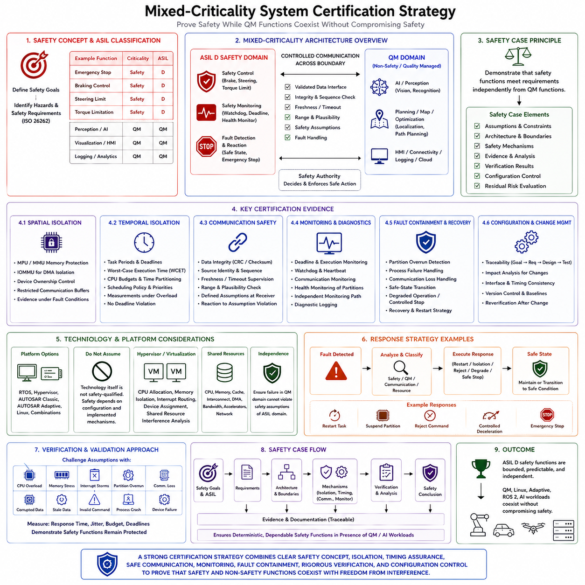{width="7.268055555555556in" height="7.268055555555556in"}

혼합 중요도 시스템(Mixed-Criticality System)의 인증(Certification)은 모든 소프트웨어 구성요소를 가장 높은 안전 수준으로 인증한다고 해서 달성되는 것이 아니다. 목표는 안전 중요 기능이 해당 안전 요구사항을 충족한다는 것을 입증하는 동시에, 낮은 중요도 또는 QM 기능이 안전 기능을 손상시키지 않고 공존할 수 있음을 입증하는 것이다. 따라서 인증 전략은 명확한 중요도 경계(criticality boundary), 안전 목표(safety goal), 아키텍처 가정(architectural assumption)에서 시작하며, 격리(isolation), 타이밍(timing), 통신(communication), 모니터링(monitoring), 결함 격리(fault containment) 메커니즘이 요구되는 안전 특성을 유지한다는 증거를 확보해야 한다.

첫 번째 단계는 안전 개념(safety concept)을 수립하고 어떤 기능이 안전 관련 기능(safety-related function)인지 식별하는 것이다. 자동차 시스템에서는 ISO 26262가 주요 기능 안전(functional safety) 프레임워크를 제공하며, ASIL 분류는 관련 안전 기능에 요구되는 엄격도를 결정한다. ASIL D 기능에는 비상 정지(emergency stop), 제동(braking), 조향 제한(steering limit), 토크 제한(torque limitation) 또는 안전 감독(safety supervision)이 포함될 수 있으며, 인지(perception), 시각화(visualization), 로깅(logging), 분석(analytics) 또는 기타 기능은 안전 분석이 이를 뒷받침하는 경우 QM으로 유지될 수 있다. 인증 논증(certification argument)은 각 기능에 해당 중요도가 할당된 이유를 명확하게 문서화해야 한다.

혼합 중요도 인증은 간섭으로부터의 자유(freedom from interference)에 크게 의존한다. ASIL D와 QM 기능이 프로세서, 메모리 시스템, 네트워크 또는 가속기를 공유하는 경우, QM 영역에서 발생한 고장이 ASIL D 영역의 안전 가정을 무효화할 수 없다는 것을 안전 케이스(safety case)를 통해 입증해야 한다. 따라서 공간적 격리(spatial isolation), 시간적 격리(temporal isolation), 통제된 통신(controlled communication), 자원 관리(resource management), 결함 격리(fault containment)는 단순한 구현 기능이 아니라 인증을 위한 증거가 된다. 아키텍처적 분리가 강력할수록 영역 사이의 독립성을 안전 논증을 통해 보다 명확하게 입증할 수 있다.

공간적 격리 증거(spatial isolation evidence)는 하나의 소프트웨어가 다른 중요도 영역에 속한 자원에 접근하거나 이를 손상시킬 수 없다는 것을 입증한다. MPU 또는 MMU를 통한 메모리 보호(memory protection), DMA를 위한 IOMMU 보호, 통제된 장치 소유권(device ownership), 제한된 통신 버퍼를 통해 이러한 경계를 설정할 수 있다. 인증 증거는 의도된 구성뿐만 아니라 고장 조건에서도 보호 메커니즘이 효과적으로 동작한다는 것을 보여주어야 한다. 허가되지 않은 메모리 접근, 잘못된 DMA 동작, 의도하지 않은 장치 접근은 검증 및 고장 주입(fault injection) 활동에서 고려해야 한다.

시간적 격리(temporal isolation)는 안전 중요 태스크가 충분하고 예측 가능한 실행 시간을 확보한다는 증거를 요구한다. 따라서 인증 전략에는 태스크 주기(task period), 데드라인(deadline), 최악 실행 시간(Worst-Case Execution Time, WCET), CPU 예산(CPU budget), 인터럽트 오버헤드(interrupt overhead), 스케줄링 정책(scheduling policy), 시간 분할 동작(time-partitioning behavior)을 문서화해야 한다. Linux, AI 또는 기타 가변 워크로드가 플랫폼을 공유하는 경우 이들의 실행으로 인해 안전 태스크가 타이밍 한계를 초과해서는 안 된다. 과부하 및 간섭 조건에서의 측정은 중요하다. 정상적인 타이밍 성능만으로는 결정론적 동작을 입증할 수 없기 때문이다.

중요도 경계를 가로지르는 통신(communication)은 자체적인 안전 논증을 필요로 한다. QM 또는 AI 서브시스템이 생성한 데이터는 성공적으로 전송되었다는 이유만으로 자동으로 안전 적격(safety-qualified) 데이터가 되는 것은 아니다. 안전 관련 메시지는 무결성(integrity), 송신원 식별(source identity), 순서(sequence), 최신성(freshness), 범위(range), 타당성(plausibility), 타임아웃(timeout) 조건에 대한 검사를 필요로 할 수 있다. 수신 안전 기능은 입력 정보에 대해 어떤 가정을 하는지와 이러한 가정이 위반되었을 때 어떤 대응을 수행하는지를 정의해야 한다. 이를 통해 기능적 지능(functional intelligence)과 안전 권한(safety authority) 사이에 명확하고 검토 가능한 인터페이스를 형성할 수 있다.

인증 전략은 모니터링(monitoring)이 안전 케이스에 어떻게 기여하는지도 정의해야 한다. 데드라인 모니터링(deadline monitoring), 실행 시간 모니터링(execution-time monitoring), 워치독(watchdog), 하트비트 감시(heartbeat supervision), 통신 모니터링(communication monitoring), 상태 모니터링(health monitoring)은 시스템이 안전 가정 내에서 계속 동작하고 있음을 보여주는 런타임 증거(runtime evidence)를 제공한다. 자신이 감시하는 소프트웨어에 전적으로 의존하는 모니터는 동일한 고장 모드를 공유할 수 있으므로 독립성이 약할 수 있다. 필요한 경우 독립 타이머(independent timer), 전용 코어(dedicated core), 하드웨어 워치독(hardware watchdog), 안전 아일랜드(safety island), 별도의 안전 컨트롤러(safety controller)를 사용하여 모니터링 논증을 강화할 수 있다.

결함 격리(fault containment)와 복구(recovery)는 안전 개념과 직접 연결되어야 한다. 인증 증거는 안전 태스크가 고장하거나, QM 애플리케이션이 충돌하거나, 통신이 사용할 수 없게 되거나, 파티션이 실행 예산을 초과하거나, 공유 자원이 비정상 상태가 되었을 때 시스템이 어떻게 대응하는지를 설명해야 한다. 가능한 대응에는 태스크 재시작(task restart), 파티션 격리(partition isolation), 잘못된 명령 거부(rejection of invalid commands), 성능 저하 운전(degraded operation), 제어된 감속(controlled deceleration), 비상 정지(emergency stop) 또는 시스템 특성에 맞는 다른 안전 상태(safe-state) 동작이 포함될 수 있다. 선택된 대응은 물리적 위험과 요구되는 결함 허용 시간 간격(fault-tolerant time interval)에 부합해야 한다.

혼합 중요도 플랫폼은 RTOS, 하이퍼바이저(hypervisor), AUTOSAR Classic, AUTOSAR Adaptive, Linux 또는 이들의 조합을 사용할 수 있다. 인증 전략에서는 특정 기술이 존재한다는 사실 자체가 안전 적격성을 자동으로 제공한다고 가정해서는 안 된다. 대신 안전 논증에서는 어떤 메커니즘에 의존하는지, 해당 메커니즘의 고장 가정은 무엇인지, 어떻게 구성되는지, 그 효과를 입증하는 검증 증거는 무엇인지를 식별해야 한다. 하이퍼바이저 기반 시스템에서는 CPU 할당, 메모리 격리, 인터럽트 라우팅, 장치 할당 및 공유 자원 간섭을 모두 다루어야 한다.

개발 증거(development evidence)는 안전 목표(safety goal)에서 요구사항(requirement), 아키텍처(architecture), 구현(implementation), 검증(verification), 최종 안전 증거(final safety evidence)까지의 추적성(traceability)을 중심으로 구성해야 한다. 안전 요구사항은 구체적인 아키텍처 메커니즘과 시험 사례(test case)에 연결되어야 하며, 검증 결과는 구현된 시스템이 해당 요구사항을 만족한다는 것을 입증해야 한다. 혼합 중요도 시스템에서는 구성 관리(configuration management)가 특히 중요하다. QM 또는 Adaptive 구성요소의 변경이 안전 소프트웨어 자체를 수정하지 않았더라도 인터페이스, 타이밍 가정, 자원 소비 또는 안전 가정에 영향을 줄 수 있기 때문이다.

따라서 인증 전략은 직접적으로 안전 중요 기능인 요소와 단순히 지원 인프라의 일부인 요소를 구분해야 한다. QM AI 모델은 그 고장이 안전 목표를 직접 위반하는 것을 아키텍처적으로 방지할 수 있다면 반드시 ASIL D 구성요소로 개발할 필요는 없다. 대신 안전 아키텍처는 AI 모델의 권한을 제한하고 그 출력을 독립적으로 검증할 수 있다. 이러한 접근법을 통해 고급 인지(perception), 계획(planning), 월드 모델 추론(world-model inference) 및 기타 계산 집약적 기능을 발전시키면서도 결정론적 제어(deterministic control)와 안전 감독(safety supervision) 주위에 통제된 안전 경계를 유지할 수 있다.

검증(verification)은 인증 논증의 기반이 되는 가정을 의도적으로 시험해야 한다. 시험에는 CPU 과부하, 과도한 메모리 트래픽, 인터럽트 폭주(interrupt storm), 파티션 오버런(partition overrun), 통신 손실, 손상된 메시지, 오래된 데이터(stale data), 유효하지 않은 명령, 프로세스 충돌, 장치 고장 및 장시간 운전이 포함되어야 한다. 목적은 개별 구성요소가 정상적으로 동작한다는 것을 단순히 입증하는 것이 아니라, 낮은 중요도의 구성요소가 잘못 동작하거나 예상된 운전 조건을 초과하더라도 전체 혼합 중요도 아키텍처가 안전 기능을 지속적으로 보호한다는 것을 입증하는 것이다.

최종 인증 증거는 서로 독립적인 시험 보고서의 집합이 아니라 일관된 안전 케이스(coherent safety case)를 형성해야 한다. 논증은 안전 목표와 ASIL 요구사항을 아키텍처 분해(architectural decomposition), 격리 메커니즘(isolation mechanism), 타이밍 보장(timing guarantee), 통제된 통신(controlled communication), 모니터링, 고장 감지(fault detection), 복구(recovery), 검증 및 구성 관리(configuration control)에 연결해야 한다. 혼합 중요도 로봇 또는 차량에서는 최종 증거가 안전 중요 기능이 제한된 범위 내에서 신뢰성 있게 동작하는 동시에 QM, Linux, Adaptive, ROS 2 및 AI 워크로드가 안전 영역의 독립성과 무결성을 손상시키지 않고 고급 기능을 제공한다는 것을 입증해야 한다.

## 10.08 Robot Safety Compute and AI Compute Coexistence

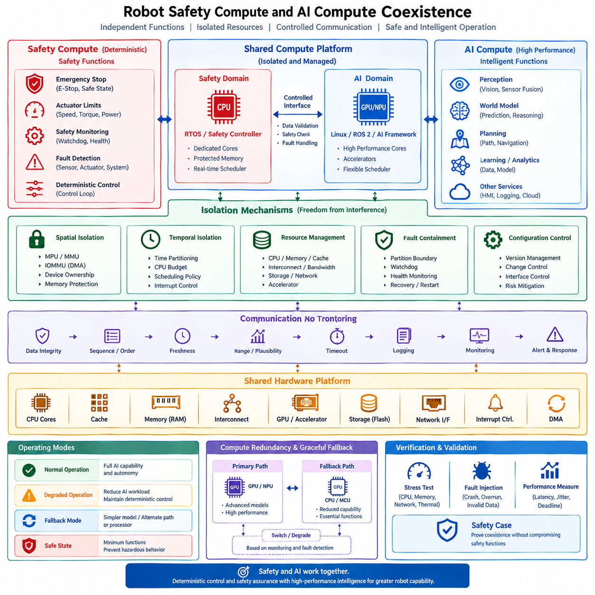{width="7.268055555555556in" height="7.268055555555556in"}

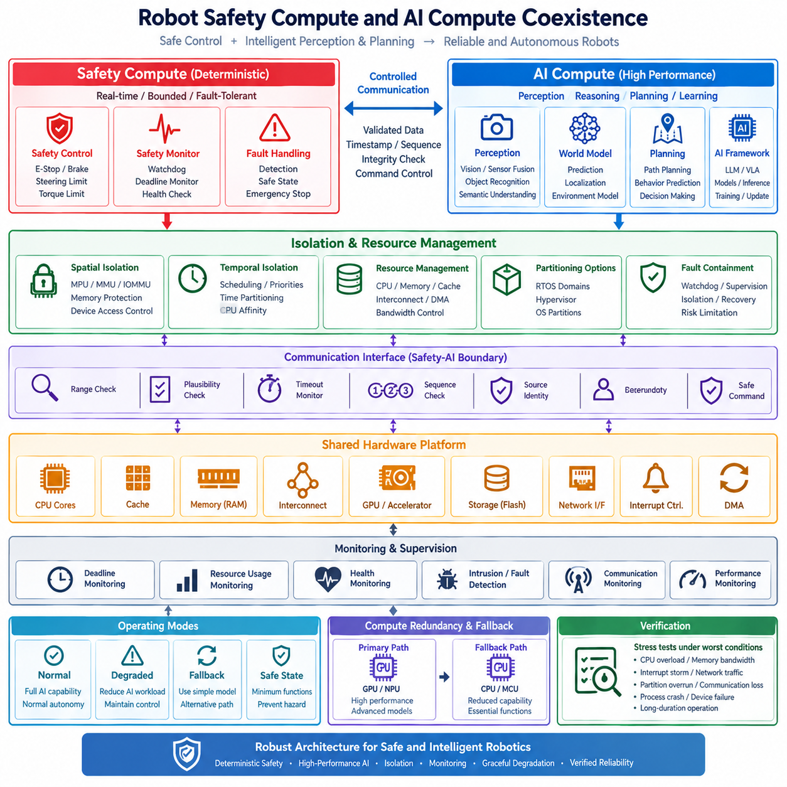{width="7.268055555555556in" height="7.268055555555556in"}

로봇 안전 컴퓨팅(safety compute)과 AI 컴퓨팅(AI compute)의 공존은 결정론적 안전 기능(deterministic safety function)과 고성능 지능 기능(high-performance intelligent function)을 동일한 계산 역할로 강제해서는 안 된다는 원칙에 기반한다. 안전 컴퓨팅은 제한된 지연시간, 예측 가능한 실행, 고장 감지 및 안전 상태(safe-state) 동작을 유지해야 하며, AI 컴퓨팅은 인지(perception), 월드 모델(world-model) 추론, 계획(planning) 및 기타 데이터 집약적인 워크로드에 필요한 처리량을 제공해야 한다. Chapter 10에서는 이 주제가 인증 전략(certification strategy)에 이어지며, 이후의 혼합 중요도 시험과 검증을 위한 아키텍처를 준비한다.

안전 컴퓨팅(safety compute)은 고장이 직접적으로 위험한 물리적 상태를 발생시킬 수 있는 기능을 담당한다. 일반적인 책임에는 비상 정지(emergency stop), 액추에이터 제한(actuator limit), 속도 및 가속도 제약, 토크 감시(torque supervision), 전력 보호(power protection), 워치독 동작(watchdog operation) 및 결정론적 제어 루프가 포함된다. 이러한 기능은 일반적으로 최대의 계산 성능보다 높은 예측 가능성을 요구한다. 따라서 전용 MCU, 안전 컨트롤러(safety controller), RTOS 영역 또는 보호된 프로세서(protected processor)를 사용하여 상위 수준의 컴퓨팅이 과부하되거나 사용할 수 없게 된 경우에도 유지되는 실행 경로를 제공할 수 있다.

AI 컴퓨팅(AI compute)은 근본적으로 다른 목적을 가진다. GPU, NPU, CPU 및 특수 가속기(specialized accelerator)는 인지, 객체 인식(object recognition), 의미적 이해(semantic understanding), 월드 모델 예측, 위치 추정(localization), 계획(planning) 및 학습 기반 정책(learned policy)을 높은 처리량으로 실행할 수 있다. 이러한 워크로드는 센서 입력, 모델 복잡도, 메모리 접근, 가속기 사용률 및 동시 프로세스에 따라 계산 요구량이 달라질 수 있기 때문에 실행 시간이 가변적일 수 있다. 따라서 AI 컴퓨팅의 가치는 최종 안전 대응을 직접 보장하는 것이 아니라 로봇의 기능과 능력을 확장하는 데 있다.

핵심 아키텍처 원칙은 AI 컴퓨팅이 행동을 제안하되 안전 컴퓨팅이 물리적 제약을 강제할 권한을 유지해야 한다는 것이다. AI 플래너(planner)는 궤적(trajectory)이나 목표 속도(desired velocity)를 생성할 수 있지만, 안전 계층(safety layer)은 명령이 제어 계층에 전달되기 전에 속도, 가속도, 작업공간(workspace), 충돌, 액추에이터 및 운용 범위(operating envelope) 제약을 독립적으로 평가한다. 이를 통해 지능과 안전 사이에 통제된 인터페이스(controlled interface)가 형성된다. 따라서 고급 AI가 발전하더라도 안전 중요 액추에이터에 대한 무제한 권한을 갖지 않도록 할 수 있다.

실제 로봇은 빠른 제어가 가장 낮은 수준에서 동작하고, 엣지 컴퓨팅(edge computing)이 상태 추정과 센서 융합을 수행하며, 고성능 AI 컴퓨팅이 인지와 계획을 수행하는 계층형 컴퓨팅 구조(hierarchical compute structure)를 사용할 수 있다. 서로 다른 계층은 서로 다른 시간 스케일에서 동작하며 이를 서로 혼동해서는 안 된다. 카메라는 초당 수십 프레임의 영상을 생성할 수 있고, AI 모델은 더 낮거나 가변적인 주기로 추론할 수 있으며, 모터 컨트롤러는 훨씬 높은 주파수에서 제어 루프를 실행할 수 있다. 따라서 각 계층은 자체적인 타이밍 계약(timing contract)을 필요로 한다.

안전 컴퓨팅과 AI 컴퓨팅 사이의 통신 경로는 이러한 계층 구조를 유지해야 한다. AI 출력은 타임스탬프(timestamp), 순서 정보(sequence information), 유효성 조건(validity condition) 및 타임아웃 요구사항(timeout requirement)을 포함하는 통제된 인터페이스를 통해 전달되어야 한다. 안전 측에서는 수신된 명령이 물리적으로 의미가 있고 충분히 최신 상태인지 검증한 후 사용해야 한다. AI 결과가 지연되거나, 누락되거나, 일관되지 않거나, 허용된 운용 범위를 벗어난 경우 안전 경로는 해당 명령을 무조건 실행하는 대신 거부하거나 제한하거나 대체하거나 안전한 성능 저하 상태(safe degraded state)로 전환해야 한다.

안전 및 AI 워크로드가 하나의 엣지 컴퓨터를 공유하는 경우 자원 격리(resource isolation)가 더욱 중요해진다. CPU 코어, 메모리, 캐시, DRAM 대역폭, 인터커넥트(interconnect), 저장장치, 네트워크 인터페이스 및 가속기는 모두 간섭(interference)의 원인이 될 수 있다. 대규모 AI 추론 워크로드는 안전 태스크가 별도의 CPU 코어에 할당되어 있더라도 상당한 메모리 대역폭이나 가속기 자원을 사용할 수 있다. 따라서 CPU 친화도(CPU affinity)와 스케줄링은 메모리 보호, 장치 소유권, 대역폭 제어, 인터럽트 관리 및 공유 자원 영향에 대한 모니터링과 함께 적용되어야 한다.

시간 분할(time partitioning)은 통제된 공존을 위한 또 하나의 메커니즘을 제공한다. 안전 태스크에는 보장된 실행 윈도우 또는 전용 프로세서 용량을 제공하고, AI 워크로드에는 남은 계산 예산을 사용할 수 있도록 한다. 정상 조건에서는 AI 컴퓨팅이 사용 가능한 자원을 활용하여 최대한의 기능을 제공할 수 있다. 과부하가 발생하면 시스템은 안전 타이밍 보장이 저하되기 전에 AI 추론 빈도를 낮추거나, 모델을 단순화하거나, 중요하지 않은 워크로드를 제거하거나, 다른 자원으로 계산을 이동해야 한다. 이를 통해 중요도(criticality)에 따른 점진적 성능 저하(graceful degradation)를 구현할 수 있다.

하이퍼바이저(hypervisor) 또는 운영체제 파티셔닝(operating-system partitioning)은 여러 실행 환경이 하나의 SoC를 공유할 때 더욱 강력한 분리를 제공할 수 있다. 안전 지향 RTOS 영역은 전용 CPU, 메모리 영역, 인터럽트 및 장치를 할당받고, Linux에서는 AI 프레임워크, ROS 2 구성요소, 인지 파이프라인 또는 계획 애플리케이션을 실행할 수 있다. 그러나 가상 경계(virtual boundary)는 그 자체로 충분하지 않으며, 해당 격리 메커니즘은 안전 분석에 포함되어야 한다. 실제 안전성은 구성과 고장 가정이 낮은 중요도의 소프트웨어가 안전 요구사항을 위반하지 못하도록 할 때 확보된다.

모니터링(monitoring)은 전체 아키텍처에 걸쳐 지속적인 감독 계층을 형성한다. 안전 모니터링은 태스크 데드라인, 실행 시간, 통신 최신성, 자원 사용량, 워치독 상태, 센서 유효성 및 액추에이터 상태를 관찰할 수 있다. AI 컴퓨팅은 모델 실행 실패, 과도한 지연시간, 가속기 과부하, 열적 한계(thermal limitation) 또는 비정상적인 자원 사용량에 대해서도 모니터링할 수 있다. 모니터링은 단순히 정보를 기록하는 것에 그쳐서는 안 되며, 모드 전환(mode switching), 워크로드 감소, 결함 격리 및 안전 또는 성능 저하 상태로의 전환을 수행할 수 있는 실행 가능한 조건을 제공해야 한다.

결과적으로 운전 모드(operating mode)는 명확하게 정의되어야 한다. 정상 운전(normal operation)에서는 완전한 AI 기능과 정상적인 자율성을 제공할 수 있다. 계산 또는 통신 자원이 제한되면 성능 저하 운전(degraded operation)으로 전환하여 결정론적 제어를 유지하면서 인지 주기, 계획 주기, 모델 복잡도 또는 중요하지 않은 서비스를 줄일 수 있다. 대체 모드(fallback mode)에서는 더 단순한 모델, 다른 프로세서 또는 독립적인 계산 경로로 전환할 수 있다. 필요한 경우 시스템은 위험한 동작을 방지하는 데 필요한 최소 기능만 활성화된 안전 상태(safe state)로 최종 전환한다.

이러한 아키텍처는 계산 중복(compute redundancy)과 점진적 대체(graceful fallback)도 가능하게 한다. 주 AI 경로는 고성능 GPU 또는 NPU를 사용하여 정교한 모델을 실행하고, 더 단순한 CPU 또는 MCU 경로는 주 경로가 고장났을 때 축소된 기능을 제공할 수 있다. 대체 경로는 주 시스템의 모든 기능을 재현할 필요가 없다. 그 목적은 필수적인 동작을 유지하거나 복구가 가능할 때까지 통제된 전환을 제공하는 것이다. 안전 컴퓨팅은 로봇이 기본적인 물리적 제어 능력을 상실하지 않도록 보장하는 독립적인 기반으로 계속 유지된다.

검증(verification)은 정상 운전뿐만 아니라 현실적인 최악 조건에서도 공존이 유지된다는 것을 입증해야 한다. 시스템에는 강력한 AI 추론, CPU 과부하, 메모리 대역폭 포화, 네트워크 트래픽, 가속기 사용률 증가, 열 제약, 통신 지연, 프로세스 충돌 및 파티션 고장을 가하여 시험할 수 있다. 엔지니어는 안전 태스크의 지연시간, 지터(jitter), 데드라인 준수, 자원 간섭, 모드 전환 시간 및 안전 상태 응답을 측정해야 한다. 목표는 AI 워크로드가 증가하더라도 안전 보장이 조용히 약화되지 않는다는 것을 입증하는 것이다.

따라서 전체 아키텍처는 안전 컴퓨팅과 AI 컴퓨팅을 경쟁하는 자원이 아니라 상호 보완적인 자원으로 취급한다. 안전 컴퓨팅은 결정론적 제어, 모니터링, 제약조건 강제 및 안전 상태에 대한 권한을 제공하며, AI 컴퓨팅은 인지, 예측, 추론(reasoning), 계획 및 상위 수준 자율성을 제공한다. 격리, 통제된 통신, 시간 분할, 자원 관리, 모니터링, 대체 경로 및 점진적 성능 저하가 이러한 영역을 연결한다. 그 결과 지능의 성능을 지속적으로 향상시키면서도 계산 복잡성이나 AI의 가변성이 결정론적인 물리적 안전성을 손상시키지 않는 로봇 아키텍처를 구현할 수 있다.

## 10.09 Mixed Criticality System Test and Verification

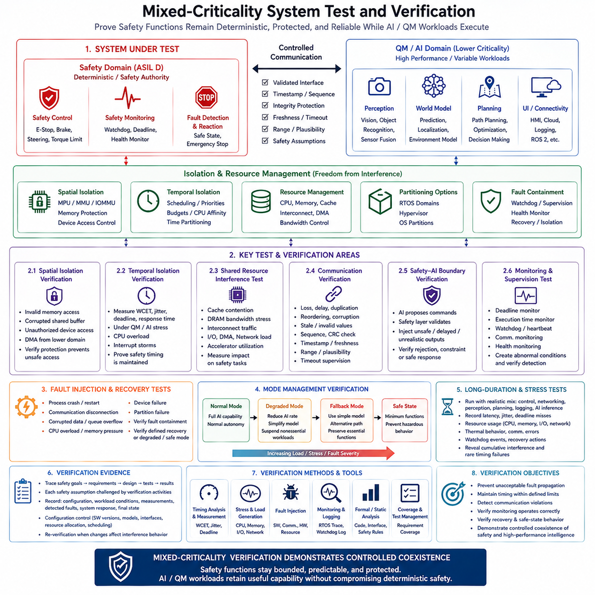{width="7.268055555555556in" height="7.268055555555556in"}

혼합 중요도 시스템 시험 및 검증(Mixed-Criticality System Testing and Verification)의 목적은 QM, Linux, Adaptive, ROS 2 및 AI 워크로드가 동일한 플랫폼에서 실행되는 동안에도 안전 중요 기능(safety-critical function)이 결정론적이고 보호되며 신뢰성 있게 유지된다는 것을 입증하는 것이다. 핵심 검증 목표는 각 구성요소가 독립적으로 동작한다는 것을 단순히 입증하는 것이 아니라, 전체 아키텍처에서 간섭으로부터의 자유(Freedom from Interference)가 확보된다는 것을 입증하는 것이다. 따라서 시험은 격리(isolation), 타이밍 보장(timing guarantee), 통제된 통신(controlled communication), 모니터링(monitoring), 결함 격리(fault containment) 및 안전 상태(safe-state) 동작을 하나의 시스템 수준 검증 프로세스로 연결한다.

검증 프로세스는 혼합 중요도 시스템에 대해 정의된 안전 가정(safety assumption)과 아키텍처 경계(architectural boundary)에서 시작한다. ASIL D 기능은 타이밍, 메모리, 통신, 자원 접근 및 고장 대응(fault response)에 대한 요구사항을 명확하게 정의해야 하며, QM 기능은 상대적으로 덜 엄격한 가정하에서 동작할 수 있다. 검증은 두 영역이 동시에 동작할 때 이러한 가정이 계속 유효하다는 것을 입증해야 한다. 따라서 시험 환경은 안전 기능만을 독립적이고 이상적인 실행 환경에서 평가하는 것이 아니라 실제 배포 조건을 현실적으로 표현해야 한다.

공간적 격리(spatial isolation)는 메모리 및 장치 경계를 의도적으로 침범하는 시험을 통해 검증한다. 잘못된 메모리 접근, 손상된 공유 버퍼(shared buffer), 허가되지 않은 장치 동작 및 낮은 중요도 소프트웨어에서 발생하는 DMA 활동 등을 시험에 포함할 수 있다. MPU, MMU 및 IOMMU 메커니즘은 이러한 동작이 보호된 자원에 도달하지 못하도록 해야 한다. 목표는 하나의 실행 영역에서 발생한 고장이 해당 영역 내부에 격리되고 안전 중요 코드, 데이터 또는 하드웨어 자원을 직접 손상시킬 수 없다는 것을 입증하는 것이다.

시간적 격리(temporal isolation)는 정상 조건과 스트레스 조건 모두에서 태스크 실행을 측정하여 검증한다. 안전 태스크는 QM 또는 AI 워크로드가 상당한 프로세서 부하를 발생시키는 상황에서 최악 실행 시간(Worst-Case Execution Time, WCET), 데드라인 준수(deadline compliance), 주기 안정성(period stability), 응답 시간(response time) 및 지터(jitter)를 기준으로 평가해야 한다. CPU 과부하, 과도한 스케줄링 활동 및 인터럽트 폭주(interrupt storm)를 의도적으로 발생시켜야 한다. 검증 결과는 안전 중요 태스크가 필요한 실행 기회를 지속적으로 확보하고 허용할 수 없는 타이밍 저하를 경험하지 않는다는 것을 보여주어야 한다.

공유 자원 간섭(shared-resource interference)도 검증해야 한다. CPU 격리만으로 완전한 시간적 독립성이 보장되는 것은 아니기 때문이다. 캐시 경쟁(cache contention), DRAM 대역폭 소비, 인터커넥트 트래픽(interconnect traffic), DMA 활동, 네트워크 처리, 저장장치 작업 및 가속기 사용률은 실행 지연시간에 영향을 줄 수 있다. 따라서 시험에서는 강력한 AI 추론과 고속 인지 처리(high-rate perception processing)를 안전 제어와 동시에 수행하면서 그에 따른 타이밍 동작을 측정해야 한다. 목적은 논리적 파티셔닝(logical partitioning)이 자동으로 모든 간섭을 제거한다고 가정하는 것이 아니라 실제 간섭의 범위를 설정하는 것이다.

통신 검증(communication verification)은 중요도 경계를 넘어 전달되는 정보가 유효하고 충분히 최신 상태인지를 평가한다. 메시지 손실, 지연, 중복, 순서 변경, 손상, 오래된 정보(stale information), 유효하지 않은 값 및 과도한 전송률을 시험해야 한다. 시퀀스 검사(sequence check), CRC 또는 체크섬(checksum) 보호, 타임스탬프(timestamp), 최신성 검사(freshness check), 범위 검증(range validation), 타당성 검사(plausibility check) 및 타임아웃 감시(timeout supervision)를 실제로 동작시켜야 한다. 수신 안전 기능은 유효하지 않거나 오래된 정보를 거부하거나 제한하거나 정의된 안전 대응(safety response)에 따라 처리한다는 것을 입증해야 한다.

특히 중요한 검증 패턴은 AI가 생성한 제안(AI-generated proposal)과 안전하게 승인된 동작(safety-authorized action)을 분리하는 것이다. AI 또는 계획 시스템(planning system)은 목표 궤적, 속도, 조향 명령 또는 액추에이터 요청을 생성할 수 있지만, 안전 계층(safety layer)은 실행 전에 물리적 및 운용상의 제약조건을 독립적으로 검증해야 한다. 시험에서는 의도적으로 비현실적이거나 지연되었거나 안전하지 않은 AI 출력을 제공하고, 안전 컨트롤러가 해당 출력으로 인해 위험한 액추에이터 동작이 발생하지 않도록 차단하는지를 확인해야 한다. 이를 통해 기능적 지능(functional intelligence)이 자동으로 안전 권한(safety authority)이 되는 것이 아니라는 것을 입증할 수 있다.

모니터링 및 감시(monitoring and supervision) 메커니즘은 런타임 고장 감지 계층(runtime detection layer)을 형성하므로 별도의 검증이 필요하다. 데드라인 모니터(deadline monitor), 실행 시간 모니터(execution-time monitor), 워치독(watchdog), 하트비트 감시(heartbeat supervision), 통신 모니터링(communication monitoring) 및 상태 모니터링(health monitoring)은 실제로 감지해야 하는 비정상 조건을 발생시켜 시험해야 한다. 실행 누락, 과도한 실행 시간, 통신 손실, 오래된 데이터, 비정상적인 자원 사용량 및 파티션 오버런(partition overrun)이 발생했을 때 요구된 결함 허용 시간 간격(fault-tolerant time interval) 내에서 정의된 진단 또는 보호 동작이 발생해야 한다.

고장 주입(fault injection)은 결함 격리와 복구를 입증하는 데 필수적이다. 개별 프로세스, 통신 채널, 파티션, 장치 및 컴퓨팅 자원에 의도적으로 고장을 발생시키면서 시스템의 나머지 부분은 계속 동작하도록 할 수 있다. 주요 시험에는 프로세스 충돌(process crash), 통신 연결 해제, 손상된 데이터, 큐 오버플로(queue overflow), CPU 과부하, 장치 고장 및 파티션 고장이 포함될 수 있다. 기대되는 결과는 반드시 전체 기능을 중단 없이 유지하는 것이 아니다. 대신 시스템은 고장을 격리하고 명확하게 정의된 성능 저하 운전 모드(degraded operating mode) 또는 안전 운전 모드(safe operating mode)로 전환해야 한다.

모드 관리 검증(mode-management verification)은 자원이 제한되는 상황에서도 시스템이 가장 높은 중요도의 기능을 유지하는지를 평가한다. 정상 운전에서는 AI 및 기타 고급 워크로드가 의도된 성능 수준에서 동작할 수 있다. 과부하 또는 고장 조건에서는 안전 타이밍이 손상되기 전에 시스템이 AI 추론 빈도를 낮추거나, 중요하지 않은 워크로드를 중단하거나, 더 단순한 모델을 선택하거나, 다른 계산 경로를 사용해야 한다. 고장이 충분히 심각해지면 시스템은 위험한 물리적 동작을 방지하는 안전 상태(safe state)로 전환해야 한다.

장시간 및 스트레스 시험(long-duration and stress testing)은 많은 혼합 중요도 시스템의 고장이 장시간 운전 후에야 발생할 수 있기 때문에 필요하다. 시스템은 안전 제어, 네트워킹, 인지, 계획, 로깅 및 AI 추론을 현실적으로 조합한 상태에서 실행되어야 하며, CPU, 메모리, I/O 및 통신 자원이 지속적으로 사용되는 조건을 포함해야 한다. 엔지니어는 지연시간, 지터, 데드라인 누락, 자원 사용률, 열적 동작, 통신 오류, 워치독 이벤트 및 복구 동작을 기록해야 한다. 이를 통해 짧은 정상 조건 시험에서는 발견하기 어려운 누적 간섭(cumulative interference)과 희귀한 타이밍 고장을 식별할 수 있다.

검증 증거(verification evidence)는 안전 목표와 요구사항에서 아키텍처 메커니즘 및 시험 결과까지의 추적성(traceability)을 유지해야 한다. 각각의 중요한 안전 가정은 해당 가정을 실제로 시험할 수 있는 검증 활동과 연결되어야 한다. 결과에는 구성(configuration), 워크로드 조건, 측정된 타이밍, 감지된 고장, 시스템 대응 및 최종 운전 상태를 기록해야 한다. 구성 관리(configuration control)는 특히 중요하다. AI 모델, 소프트웨어 버전, 인터페이스, 자원 할당 또는 스케줄링 정책의 변경이 전체 시스템의 간섭 특성을 변화시킬 수 있으며, 이에 따라 재검증(re-verification)이 필요할 수 있기 때문이다.

최종 검증 목표는 모든 측면에서 완벽한 격리를 달성하는 것이 아니라 통제된 공존(controlled coexistence)을 입증하는 것이다. 안전 중요 기능은 제한된 범위 내에서 실행되고 예측 가능하며 보호되어야 하는 동시에, 낮은 중요도의 워크로드는 유용한 계산 능력을 유지해야 한다. 검증 증거는 격리가 허용할 수 없는 고장 전파를 방지하고, 타이밍이 정의된 한계 내에 유지되며, 통신 위반이 감지되고, 모니터링이 정상적으로 동작하며, 복구 메커니즘이 의도된 성능 저하 또는 안전 동작을 수행한다는 것을 보여주어야 한다. 이러한 방식으로 혼합 중요도 시스템 시험은 안전 기능과 고성능 지능이 하나의 로봇 컴퓨팅 플랫폼에서 공존할 수 있다는 것을 보여주는 실질적인 증거가 된다.

## 10.10 Cargo UAV FCC Mixed Criticality Case Study

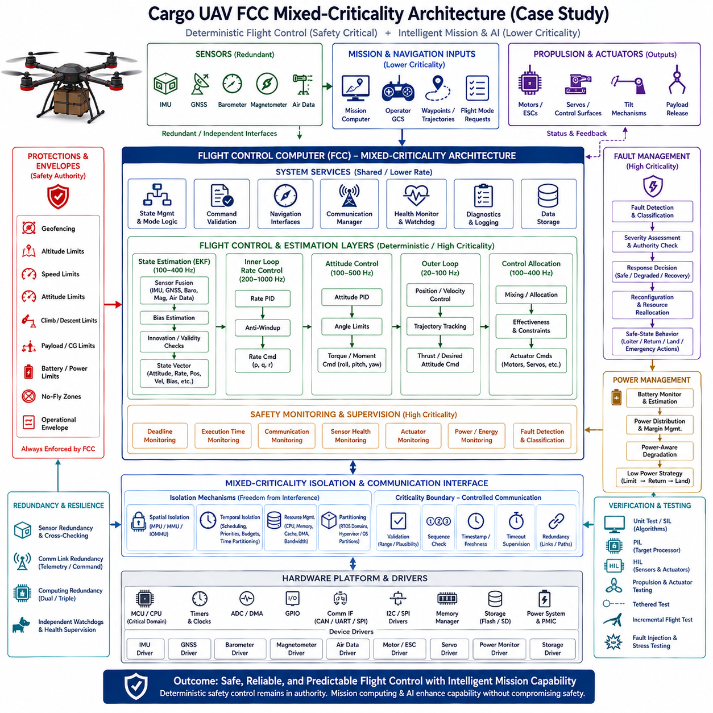{width="7.268055555555556in" height="7.268055555555556in"}

화물 UAV의 비행제어컴퓨터(Flight Control Computer, FCC)는 결정론적인 비행 제어(deterministic flight control)와 상위 수준의 임무 지능(higher-level mission intelligence)이 비행 안전을 손상시키지 않으면서 공존해야 하는 대표적인 혼합 중요도 아키텍처(mixed-criticality architecture)를 제공한다. FCC는 IMU, GNSS, 기압계(barometer), 자력계(magnetometer), 대기자료(air-data) 측정값과 같은 중복 센서 입력을 수신하는 동시에 임무 명령, 궤적(trajectory) 및 비행 모드 요청을 수신한다. 출력 측에서는 모터, ESC, 서보, 틸트 메커니즘(tilt mechanism) 및 화물 방출(payload-release) 기능을 제어한다. 따라서 FCC는 안전 중요 제어(safety-critical control)와 상위 수준 연산(higher-level computation) 사이의 자연스러운 경계를 형성한다.

FCC에서 가장 중요한 기능은 안정적이고 제어 가능한 비행을 유지하는 것과 관련된다. 상태 추정(state estimation), 내부 루프 속도 제어(inner-loop rate control), 자세 제어(attitude control), 제어 할당(control allocation), 액추에이터 제한(actuator limitation) 및 비상 대응(emergency response)은 결정론적인 실행과 제한된 지연시간을 요구한다. 따라서 아키텍처는 다중 주기 제어 계층(multi-rate control layers)을 사용하며, 내부 속도 루프(inner rate loop)는 약 200--1000 Hz, 자세 제어는 100--500 Hz, 위치 및 속도 제어는 20--100 Hz, 그리고 더 느린 항법, 임무, 상태 및 진단 기능은 더 낮은 주기에서 동작한다. 이러한 분리는 동일한 비행제어 시스템 내부에서도 서로 다른 타이밍 중요도를 반영한다.

안전 중요 영역(safety-critical domain)은 물리적인 비행 제약조건에 대해 독립적인 권한을 유지해야 한다. 지오펜싱(geofencing), 고도 제한, 속도 제한, 자세 제한, 상승 및 하강 제한, 화물 및 무게중심(center of gravity) 제약, 배터리 및 전력 제한, 비행 금지 구역(no-fly zone) 및 전체 운용 범위(operational envelope)는 임무 컴퓨터나 AI 플래너에 전적으로 의존해서는 안 된다. 상위 수준 시스템은 궤적이나 비행 모드를 제안할 수 있지만, FCC는 해당 명령이 제어 루프에 도달하기 전에 이를 검증해야 한다. 유효하지 않거나 오래되었거나 과도하거나 물리적으로 불가능한 명령은 거부하거나 제한하거나 사전에 정의된 안전 대응(safe response)으로 대체해야 한다.

상태 추정(state estimation)은 이후의 모든 제어 기능이 추정된 상태의 품질에 의존하기 때문에 또 다른 중요한 안전 경계를 형성한다. 센서 융합(sensor fusion)은 IMU, GNSS, 기압, 자기 및 대기자료 정보를 결합하며, 이후 바이어스 추정(bias estimation)과 혁신값(innovation) 또는 유효성 검사를 수행한다. 그 결과 생성되는 상태 벡터(state vector)는 자세(attitude), 각속도(angular rate), 위치, 속도 및 센서 바이어스와 같은 값을 포함한다. 센서 중복성과 독립적인 유효성 검사를 통해 FCC는 일관되지 않은 측정값이 자세, 위치 또는 액추에이터 명령으로 전달되기 전에 이를 감지할 수 있다.

FCC는 공간적 격리(spatial isolation)와 시간적 격리(temporal isolation)를 통해 높은 중요도의 비행제어 실행과 낮은 중요도의 임무 및 AI 연산을 분리해야 한다. 안전 지향 RTOS 또는 전용 비행제어 프로세서는 결정론적인 제어 루프를 실행하고, 고성능 컴퓨팅 영역은 임무 계획, 인지(perception), 매핑(mapping), 최적화 또는 AI 기능을 처리할 수 있다. 이러한 기능이 동일한 하드웨어를 공유한다면 메모리 보호(memory protection), CPU 친화도(CPU affinity), 시간 분할(time partitioning), 통제된 장치 접근(controlled device access) 및 자원 모니터링(resource monitoring)이 필수적이다. 임무 영역에서 발생하는 고장이나 과부하가 안전 영역이 안정적인 비행을 유지하는 것을 방해해서는 안 된다.

임무 컴퓨터와 FCC 사이의 통신은 혼합 중요도 통신(mixed-criticality communication) 원칙을 따라야 한다. 임무 명령, 웨이포인트(waypoint), 궤적 및 비행 모드 요청은 정의된 타이밍, 순서(sequence), 최신성(freshness), 범위(range) 및 타당성(plausibility) 요구사항을 가진 통제된 인터페이스를 통해 전달되어야 한다. FCC는 성공적인 통신이 유효한 비행 권한을 의미한다고 가정하지 말고 수신된 정보를 검증해야 한다. 통신이 손실되었을 때에는 운용 상황과 남아 있는 비행 권한에 따라 현재 상태를 일시적으로 유지하거나, 지정된 경로로 복귀하거나, 기지로 복귀(Return-to-Base, RTB)하거나, 제어된 하강(controlled descent) 또는 착륙과 같은 명확한 대응을 수행해야 한다.

제어 아키텍처 자체는 본질적으로 다중 주기(multi-rate) 구조이며 낮은 주기의 계산 가변성이 이에 영향을 주지 않도록 보호되어야 한다. 내부 속도 제어기는 항법, 임무 계획 또는 AI 추론이 지연되더라도 계속 동작해야 한다. 자세 제어기와 외부 루프 제어기(outer-loop controller)는 더 낮은 주파수에서 동작하면서도 필요한 데드라인을 유지할 수 있으며, 제어 할당(control allocation)은 원하는 힘 또는 모멘트를 액추에이터 명령으로 변환하면서 제어 효과와 물리적 제약조건을 준수한다. 이러한 계층 구조를 통해 상위 수준 지능이 일시적으로 손실되더라도 UAV가 비행을 안정화하고 제어하는 기본 능력을 즉시 상실하지 않도록 한다.

고장 관리(fault management)는 안전 영역과 비안전 영역 모두에서 발생하는 고장을 처리하기 위한 메커니즘을 제공한다. FCC는 고장을 감지하고 분류하며, 심각도와 남아 있는 제어 권한(control authority)을 평가하고, 적절한 대응을 결정하며, 가능한 경우 자원을 재구성하거나 재할당해야 한다. 고장은 센서, 액추에이터, 통신 링크, 전력 시스템, 소프트웨어 프로세스 또는 컴퓨팅 자원에서 발생할 수 있다. 대응은 항공기에 남아 있는 기능 수준에 비례해야 한다. 경미한 센서 이상은 중복 센서 선택을 유발할 수 있지만, 심각한 제어 또는 전력 고장은 사전에 정의된 비상 동작(emergency behavior)으로 즉시 전환해야 할 수 있다.

전력 관리(power management)는 남아 있는 에너지가 사용 가능한 비행 권한에 직접적인 영향을 미치기 때문에 화물 UAV에서 특히 중요하다. 따라서 배터리 모니터링, 전력 분배, 에너지 추정 및 전력 여유 관리(power-margin management)를 고장 관리 및 임무 관리와 통합해야 한다. 에너지 여유가 부족해지면 시스템은 안전 중요 제어에 영향을 주기 전에 중요하지 않은 연산이나 임무 기능을 점진적으로 제한할 수 있다. 저전력 전략은 성능 제한, 지정된 복귀 위치를 향한 복귀, 그리고 지속적인 비행이 더 이상 정당화되지 않을 때의 착륙과 같은 통제된 순서로 진행될 수 있다.

중복성(redundancy)은 개별 구성요소에 대한 의존성을 줄여 혼합 중요도 안전 아키텍처를 강화한다. 중복 센서는 상호 검증(cross-check)하거나 투표(voting)할 수 있으며, 중복 통신 링크는 대체 명령 또는 텔레메트리 경로를 제공할 수 있다. 이중 또는 삼중 컴퓨팅 자원은 또 다른 수준의 복원력(resilience)을 제공할 수 있으며, 독립적인 워치독(independent watchdog)은 실행 상태를 감시한다. 이러한 메커니즘은 단순히 하드웨어를 복제하는 것이 목적이 아니다. 중복성과 격리, 상호 검증, 고장 감지 및 통제된 안전 상태 동작을 결합할 때 그 가치가 발생한다.

FCC 소프트웨어 생명주기(software lifecycle)는 개발 및 배포 전 과정에서 안전 경계를 유지해야 한다. 보안 부팅(secure boot)과 인증(authentication)은 소프트웨어 무결성을 확립하며, 구성 관리(configuration management)는 비행 파라미터, 안전 제한값, 센서 매핑 및 하드웨어 변형을 통제한다. 버전 관리(versioning)와 호환성 관리(compatibility management)는 업데이트된 임무 또는 AI 구성요소가 안전 컨트롤러가 사용하는 가정을 무의식적으로 변경하지 않도록 한다. 업데이트 및 롤백(rollback) 메커니즘은 새로운 소프트웨어 버전이 예상하지 못한 동작을 발생시킬 경우 통제된 복구 경로를 제공해야 한다. 따라서 요구사항에서 구현 및 검증까지의 추적성(traceability)이 필수적이다.

검증(verification)은 소프트웨어 수준의 시험에서 시작하여 점점 더 현실적인 물리적 시험으로 진행되어야 한다. 단위 시험(unit testing)과 소프트웨어 인 더 루프(Software-in-the-Loop, SIL)는 알고리즘과 상태 전이를 검증할 수 있으며, 프로세서 인 더 루프(Processor-in-the-Loop, PIL)는 실제 대상 프로세서 환경에서의 동작을 평가한다. 하드웨어 인 더 루프(Hardware-in-the-Loop, HIL)는 실제적인 센서, 액추에이터 및 타이밍 상호작용을 도입하며, 이후 추진 시스템과 액추에이터 시험으로 이어진다. 테더 시험(tethered test)은 단계적인 비행 시험(incremental flight testing) 이전의 중간 단계로 활용할 수 있다. 고장 주입(fault injection)과 스트레스 시험(stress testing)은 통신, 센서, 컴퓨팅 자원, 전력 시스템 및 제어 루프에 의도적으로 문제를 발생시켜 비정상 조건에서도 안전 메커니즘이 효과적으로 유지되는지를 검증해야 한다.

화물 UAV FCC 사례는 실용적인 혼합 중요도 패턴을 보여준다. 결정론적인 저수준 비행 제어는 안전 권한(safety authority)을 유지하고, 임무 컴퓨팅과 고급 AI는 액추에이터에 대한 무제한 권한 없이 상위 수준의 기능을 제공한다. 다중 주기 실행(multi-rate execution), 공간적 및 시간적 격리, 통제된 통신, 중복성, 독립적인 모니터링, 고장 관리, 전력 인지형 성능 저하(power-aware degradation) 및 단계적 검증(staged verification)이 함께 이러한 경계를 유지한다. 그 결과 인지, 계획, 임무 적응 및 기타 지능 기능이 지속적으로 발전하는 동안에도 FCC는 제한되고 예측 가능하며 검증 가능한 비행 제어 동작을 보장할 수 있다.
