**Volume 03 Real Time Operating Systems**

# 11. RTOS for Motor Control

## 11.01 Motor Control RTOS Requirements: Period, Jitter, Priority

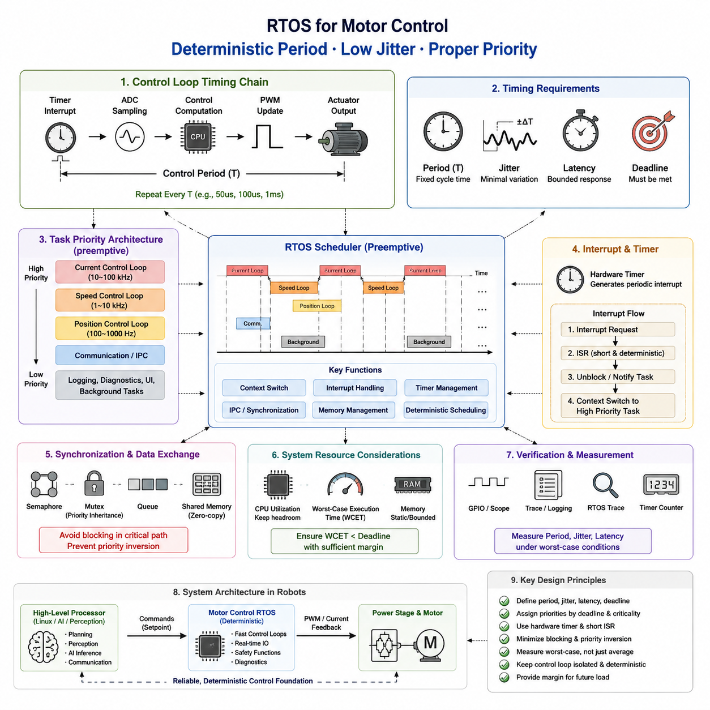{width="7.268055555555556in" height="7.268055555555556in"}

Motor control is one of the clearest applications where an RTOS must provide deterministic timing rather than simply high average performance. The motor-control software must repeatedly execute sensing, control computation, and actuator update operations within a defined control period. The essential requirements therefore include a predictable task period, bounded execution latency, low timing jitter, appropriate task priority, and reliable interrupt handling. These requirements determine whether the controller can maintain stable and accurate motor behavior under changing computational and system loads.

The control period defines how frequently the motor-control loop is executed. For a control loop with period T, each cycle must acquire the required feedback, execute the control algorithm, and update the actuator before the next cycle begins. A missed deadline is therefore more serious than an ordinary software delay because it changes the temporal behavior of the control system. The required period depends on the motor, mechanical dynamics, controller architecture, sensor bandwidth, and application. Fast current-control loops generally require much shorter periods than higher-level speed or position loops.

Period alone is insufficient because two control loops with the same nominal frequency can behave very differently when their execution times vary. Jitter represents the deviation between the expected execution time and the actual execution time of a periodic task or interrupt. Excessive jitter changes the effective sampling interval seen by the controller and can introduce phase variation, control error, torque ripple, or instability. Consequently, an RTOS motor-control design should specify not only the nominal period but also an acceptable jitter bound and a method for measuring worst-case timing behavior.

Latency must also be treated as a bounded quantity. The interval between a physical event, such as a sensor conversion or timer interrupt, and the corresponding control action determines how quickly the software responds to the motor state. Sources of latency include interrupt response, higher-priority task execution, context switching, synchronization mechanisms, cache effects, memory access, and communication processing. A system that provides low average latency but occasionally experiences a long delay can still violate real-time requirements. Motor-control validation should therefore focus on worst-case or high-percentile behavior rather than average timing alone.

Task priority establishes which activities receive processor time when multiple tasks compete for execution. The motor-control task should normally have higher priority than non-critical activities such as logging, diagnostics, user interfaces, or background data processing. However, priority assignment must consider the complete task set rather than simply assigning the highest priority to every control-related task. Excessive high-priority activity can prevent lower-priority functions from making progress, while poorly designed synchronization can introduce priority inversion. The priority architecture should therefore reflect control deadlines, execution periods, and criticality.

Timer interrupts provide an important timing reference for periodic motor control. A hardware timer can trigger the control sequence at a precise interval, reducing dependence on software delays and improving temporal determinism. The interrupt handler should remain short and predictable, while computationally larger operations can be delegated to an appropriately prioritized RTOS task when the architecture permits. For particularly demanding control loops, the timing relationship between PWM generation, ADC sampling, interrupt execution, and controller computation must be designed as a single deterministic chain rather than as independent software functions.

Motor-control systems commonly contain multiple nested loops with different timing requirements. A current loop may operate at a high frequency, while speed and position loops operate more slowly. This naturally leads to a multi-rate architecture in which each loop has its own period and priority. The faster loop must complete within its shorter deadline without being disturbed by slower activities. The RTOS scheduler therefore becomes part of the control architecture, because task periods, priorities, interrupt behavior, and CPU utilization collectively determine whether the nested loops can execute within their required timing constraints.

The relationship between PWM timing and control-loop execution is particularly important for digital motor control. PWM determines when switching commands are applied, while ADC sampling determines when motor current or other feedback signals are observed. If sampling and actuation are not temporally coordinated, the controller may operate on inconsistent measurements or introduce additional timing variation. A deterministic design therefore aligns timer events, ADC acquisition, control computation, and PWM update operations so that each control cycle follows a repeatable temporal sequence.

CPU utilization must be evaluated together with timing requirements. A motor-control task may have a nominal execution time that appears acceptable, yet additional communication, diagnostics, interrupt processing, or AI-related workloads can consume the remaining timing margin. Real-time design therefore requires sufficient headroom between worst-case execution time and the task deadline. As the system becomes more complex, measurement should verify actual execution-time distributions and worst-case behavior under representative peak loads rather than relying only on nominal benchmarks.

Synchronization mechanisms also affect motor-control determinism. Mutexes, semaphores, queues, and shared-memory operations can introduce blocking and scheduling dependencies. A high-priority control task that waits for a lower-priority task can experience unexpected latency, particularly when priority inversion occurs. Critical control paths should therefore minimize unnecessary blocking and use appropriate synchronization strategies. Where possible, time-critical data exchange should use bounded and predictable mechanisms so that communication does not compromise the control loop\'s temporal guarantees.

The RTOS must also separate time-critical motor functions from non-real-time processing. Telemetry, logging, configuration, network communication, and diagnostic functions are valuable but should not interfere with the deterministic control path. This separation becomes increasingly important in robots where an MCU may execute the motor-control layer while a higher-level processor performs navigation, perception, or AI inference. The motor controller should maintain its own real-time guarantees even when higher-level computation experiences variable latency or temporary overload.

Verification should measure the complete timing chain rather than only the scheduler. Hardware timestamps, GPIO instrumentation, trace facilities, timer counters, and RTOS tracing can reveal the actual period, execution time, interrupt latency, and jitter. Measurements should be performed under realistic worst-case conditions, including maximum communication traffic, concurrent interrupts, CPU load, and diagnostic activity. The objective is to demonstrate that the observed timing remains inside the specified limits, not merely that the controller operates correctly under normal conditions.

For practical robot systems, these requirements establish a clear boundary between high-level motion intelligence and low-level deterministic actuation. A higher-level controller may generate velocity, torque, or position commands at a comparatively modest rate, while the motor-control RTOS executes the actuator loop at a much higher and more deterministic rate. This separation allows perception, planning, and AI workloads to tolerate variable computation time without directly compromising motor stability. The motor-control layer therefore acts as a real-time execution foundation for the robot\'s physical behavior.

The resulting design principle is that motor-control RTOS selection should be driven by temporal guarantees rather than by feature count alone. Period, deadline, jitter, latency, priority, interrupt response, synchronization, CPU utilization, and measurement capability must be considered together. FreeRTOS, Zephyr, or another RTOS can be suitable when its configuration and hardware platform provide the required determinism. The appropriate architecture is ultimately the one that can demonstrate, through measurement and analysis, that every critical control cycle completes predictably within its required deadline.

## 11.02 FOC (Field Oriented Control) Real-Time Implementation [w/Code]

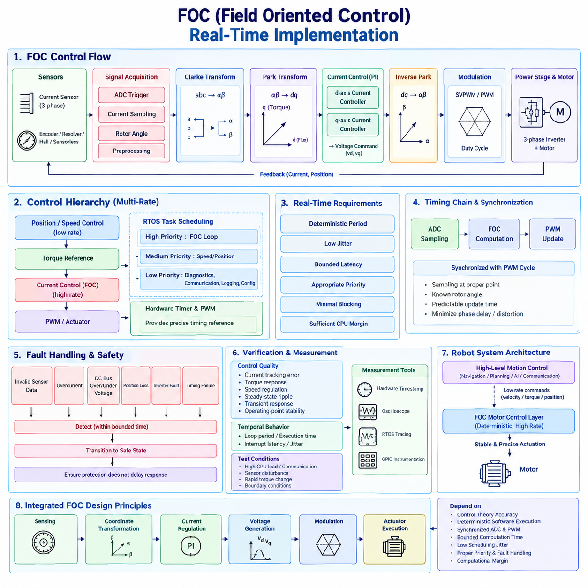{width="7.268055555555556in" height="7.268055555555556in"}

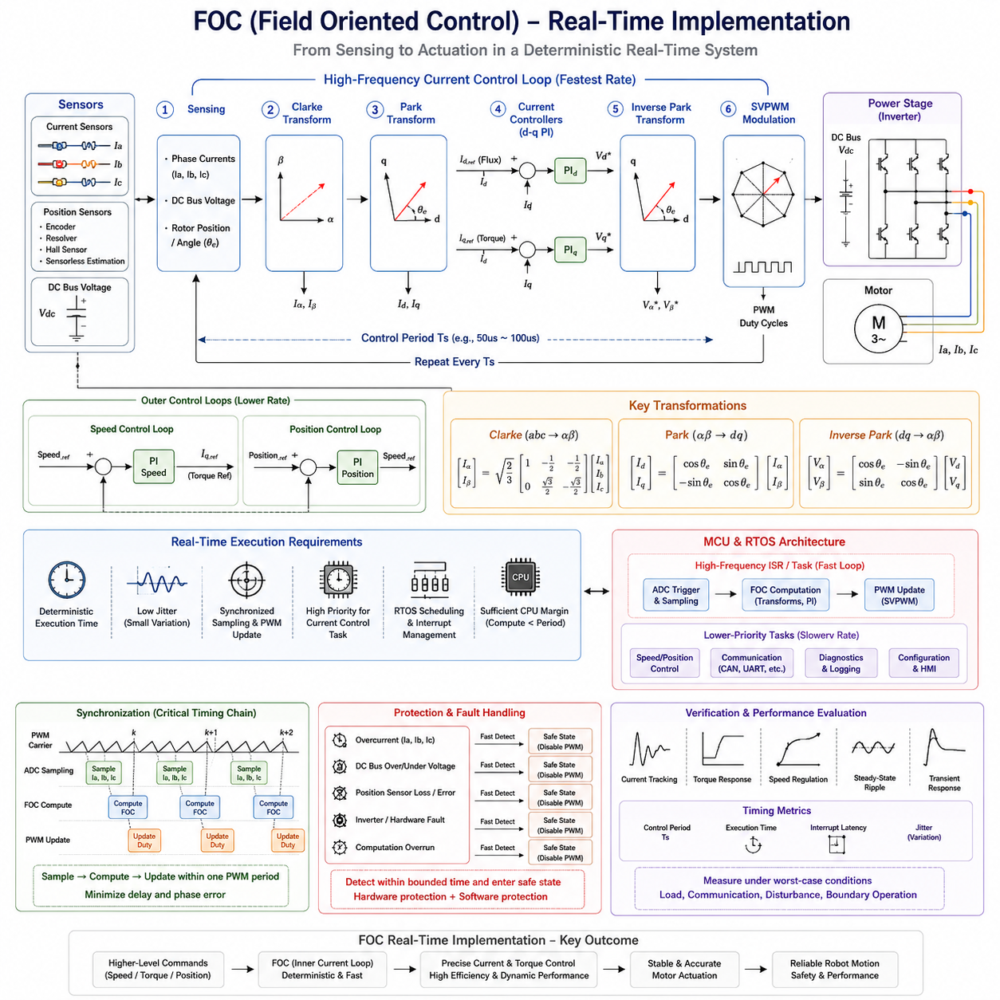{width="7.268055555555556in" height="7.268055555555556in"}

Field Oriented Control (FOC) is a real-time motor-control method that transforms the three-phase electrical behavior of a motor into rotating reference-frame components that can be controlled more independently. Instead of directly controlling the phase currents, FOC separates the current associated with magnetic flux from the current associated with torque production. This allows a controller to regulate motor torque and magnetic flux in a manner similar to separately excited DC motor control, while retaining the efficiency and dynamic performance of AC motors.

A typical FOC implementation begins with the acquisition of phase-current and rotor-position information. Current sensors measure the motor phase currents, while an encoder, resolver, Hall sensor, or sensorless estimation method provides the electrical rotor angle. These signals must be sampled at precisely controlled times because the accuracy of the coordinate transformations depends on the relationship between current measurements and rotor position. In an RTOS implementation, ADC triggering, sensor acquisition, angle processing, and control computation must therefore be organized as a deterministic real-time sequence.

The measured three-phase currents are first transformed into a stationary two-axis coordinate system using the Clarke transformation. The resulting α-axis and β-axis currents represent the three-phase current vector in a two-dimensional stationary reference frame. The controller then applies the Park transformation, which rotates this vector according to the estimated electrical rotor angle. The result is the d-axis and q-axis current representation. The d-axis component is primarily associated with magnetic flux, while the q-axis component is primarily associated with torque production.

The separation of d-axis and q-axis currents is one of the fundamental advantages of FOC. For many permanent-magnet motors, the desired operating condition can be achieved by regulating the d-axis current near an appropriate reference value while controlling the q-axis current according to the required torque. The outer speed or position controller generates a torque-related current reference, and the inner current controllers rapidly force the measured currents toward their references. This nested structure makes FOC particularly suitable for servo systems requiring fast torque response and precise motion control.

The current-control loop is normally the most time-critical part of the FOC algorithm. At each cycle, the controller obtains synchronized current measurements, determines the electrical angle, performs the coordinate transformations, calculates current errors, executes the d-axis and q-axis controllers, and generates voltage commands. These operations must complete within the defined control period. If the computation finishes too late, the resulting voltage command may be applied at an inappropriate point in the PWM cycle, increasing effective control delay and potentially degrading current regulation and motor stability.

The proportional-integral (PI) controllers in the d-q current loop convert current errors into voltage commands. Their gains must be selected according to the motor electrical parameters, sampling frequency, inverter characteristics, and desired dynamic response. The controller output is normally constrained by the available DC-bus voltage and inverter modulation range. Anti-windup behavior is therefore important because sustained saturation can otherwise cause the integral term to accumulate excessively and produce slow or unstable recovery when the operating condition returns to the controllable region.

After the voltage commands are calculated in the rotating d-q frame, the inverse Park transformation converts them back into the stationary α-β frame. A subsequent modulation stage converts the requested voltage vector into inverter switching commands, commonly using Space Vector PWM (SVPWM) or another PWM method. The final PWM duty cycles determine how the power-stage switches apply voltage to the motor phases. The timing relationship between ADC sampling, FOC computation, and PWM update is therefore a critical part of the complete real-time implementation.

Real-time execution introduces requirements that are different from those of an offline mathematical implementation. The FOC algorithm must execute periodically with a tightly bounded execution time, and the variation between successive executions must remain small. Excessive jitter changes the effective sampling interval and can introduce phase errors into the current-control loop. Interrupt latency, RTOS scheduling, cache behavior, communication activity, and competing tasks can all contribute to timing variation. The motor-control task should therefore receive an appropriate real-time priority and should be protected from unnecessary blocking and non-critical processing.

A practical RTOS architecture normally separates the high-frequency FOC loop from slower control and system-management functions. The current loop can operate at the highest control frequency, while speed control, position control, diagnostics, communication, logging, and configuration tasks operate at lower rates. Hardware timers and PWM peripherals should provide the primary timing reference, while the RTOS manages task execution and supporting activities. This multi-rate architecture prevents slower software functions from unnecessarily interfering with the deterministic execution of the most critical motor-control path.

Sensor and actuator synchronization is equally important. Current sampling should occur at a well-defined point within the PWM switching cycle so that switching transients and measurement noise are controlled. The sampled current values must correspond to a known electrical rotor angle, and the calculated voltage command must be transferred to the PWM hardware at a predictable update point. A small error in this timing chain can appear as additional phase delay or current distortion. Consequently, FOC performance depends not only on the mathematical controller but also on the temporal accuracy of the entire sensing, computation, and actuation pipeline.

FOC implementations must also account for abnormal operating conditions. Invalid sensor measurements, excessive current, DC-bus overvoltage or undervoltage, loss of rotor-position information, inverter faults, and computational timing failures can make continued operation unsafe. The real-time control layer should detect critical faults within bounded time and transition the motor to an appropriate safe state. Fault handling should be designed so that diagnostic or communication processing does not delay the protective response. This creates a direct relationship between FOC implementation, RTOS scheduling, hardware protection, and overall motor-system safety.

Verification should evaluate both control quality and temporal behavior. Current-tracking error, torque response, speed regulation, steady-state ripple, transient response, and operating-point stability should be measured together with control-loop period, execution time, interrupt latency, and jitter. Testing should include high CPU load, communication activity, sensor disturbances, rapid torque changes, and boundary operating conditions. Hardware timestamps, oscilloscope measurements, RTOS tracing, and GPIO instrumentation can provide evidence that the actual control cycle remains within its specified timing limits.

In a robot, the FOC layer forms the deterministic foundation beneath higher-level motion control. A navigation or motion-planning system may generate velocity, torque, or position commands at a relatively low rate, while the motor controller continuously regulates electrical current and motor torque at a much higher rate. This separation allows the robot\'s higher-level processors to perform perception, planning, AI inference, and communication without directly determining the precise timing of every inverter switching action. The FOC controller therefore converts higher-level motion intent into stable and precisely regulated physical actuation.

The complete real-time FOC design can consequently be understood as an integrated chain of sensing, coordinate transformation, current regulation, voltage generation, modulation, and actuator execution. Its effectiveness depends on both control-theoretic correctness and deterministic software execution. A well-designed implementation maintains synchronized ADC sampling and PWM operation, bounded computation time, low scheduling jitter, appropriate task priority, robust fault handling, and sufficient computational margin. The RTOS is therefore not merely an environment for running FOC code; it is part of the temporal architecture that determines whether the mathematical control strategy can be reliably realized on a physical motor.

## 11.03 EtherCAT Master Multi-Axis Synchronous Control [w/Code]

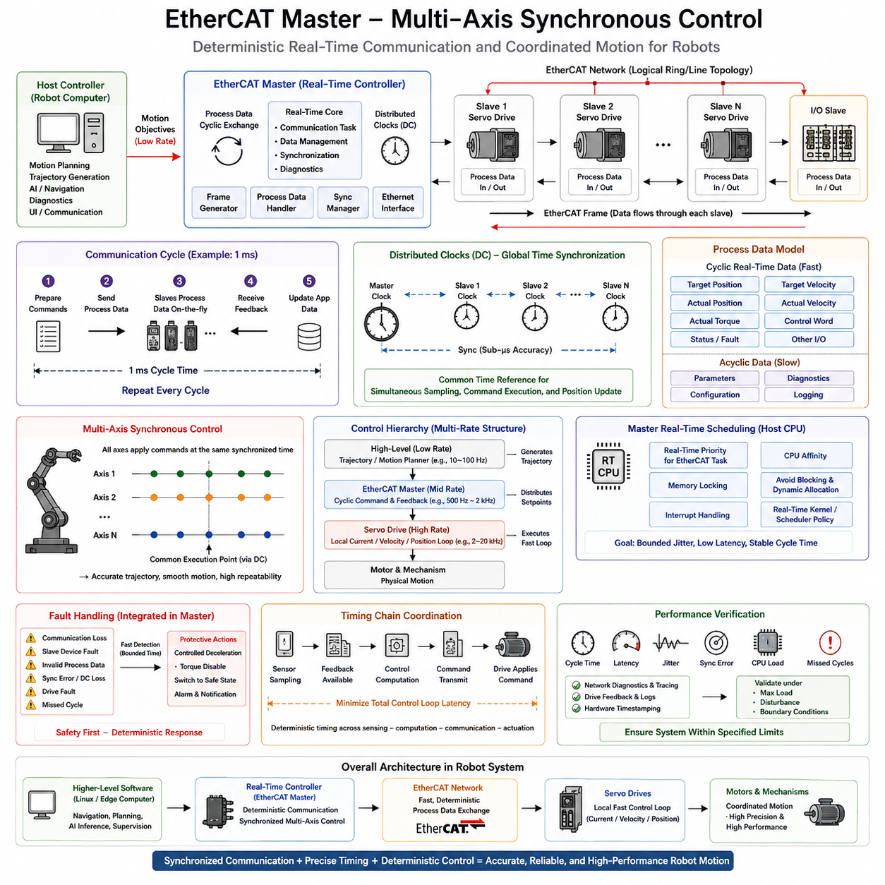{width="7.268055555555556in" height="7.268055555555556in"}

EtherCAT Master is a real-time communication and control architecture designed to coordinate multiple servo drives, motor controllers, and I/O devices with highly predictable timing. In a multi-axis robot, the master must distribute motion commands and collect feedback from many axes within a defined communication cycle. Unlike ordinary network communication, the objective is not simply high bandwidth but deterministic cycle time, bounded latency, precise synchronization, and consistent command application across all axes. This makes EtherCAT particularly suitable for coordinated robot motion and servo control.

An EtherCAT system normally consists of one master and multiple slave devices arranged in a logical communication topology. The master generates cyclic process-data frames containing commands such as target position, velocity, torque, or control words, while each slave inserts or extracts its process data as the frame passes through the device. This processing method avoids the need for each device to independently receive and retransmit complete frames. As a result, communication overhead can remain low while many axes exchange data within a tightly controlled real-time cycle.

The EtherCAT master operates according to a predefined communication period, such as 1 ms or another application-specific interval. At each cycle, the master prepares the next set of commands, transmits the process-data frame, receives updated feedback, and makes the information available to the control application. The required cycle time depends on the number of axes, controller computation, network topology, device response time, and motion-control requirements. The master must complete its processing before the next cycle so that command and feedback timing remains predictable.

Multi-axis synchronization is one of the most important reasons for using EtherCAT in robotic systems. Individual servo drives may have their own local clocks, but coordinated motion requires their control actions to correspond to a common temporal reference. EtherCAT Distributed Clocks provide a mechanism for synchronizing device timing with very high precision. The master can use this shared timing foundation to coordinate sampling, command execution, and position updates across multiple axes, reducing relative timing errors that could otherwise appear as motion distortion.

Distributed Clock synchronization is particularly important when several joints must move simultaneously according to a trajectory. If each axis applies its command at a slightly different time, the robot may experience synchronization errors even when the numerical commands are correct. With synchronized clocks, the controller can establish a common execution point for the axes. This improves trajectory consistency, coordinated acceleration and deceleration, and the repeatability of multi-axis motion. Timing synchronization therefore becomes part of the motion-control architecture rather than merely a communication feature.

The process-data model should be designed according to the real-time control requirements of the robot. Cyclic data normally contains time-critical values such as actual position, actual velocity, actual torque, target position, target velocity, control status, and fault information. Non-critical configuration or diagnostic information can be handled separately so that it does not unnecessarily consume the deterministic control path. A well-designed master therefore distinguishes cyclic real-time process data from slower parameter-management and diagnostic operations.

The EtherCAT master must also integrate communication timing with the robot controller\'s control-loop architecture. A high-level motion planner may generate trajectories at a relatively low frequency, while the EtherCAT master distributes updated setpoints to servo drives at a much higher rate. The servo drive then performs its own internal current, velocity, or position control at an even faster rate. This creates a hierarchical multi-rate structure in which trajectory generation, EtherCAT communication, and local servo control operate at different frequencies while remaining temporally coordinated.

Real-time scheduling is therefore essential on the host processor running the EtherCAT master. The communication thread should receive an appropriate real-time priority and should avoid unnecessary blocking, dynamic memory allocation, and unpredictable background processing. CPU affinity, interrupt handling, memory locking, and real-time scheduling policies may be required when the master is implemented on a real-time Linux platform. The objective is to ensure that network transmission and reception occur within predictable timing boundaries even when other robot software is executing concurrently.

The communication cycle must also be coordinated with sensor acquisition and actuator updates. The master may receive actual position and status data from all drives, process these values in the motion-control layer, and transmit the next set of commands within the same or a subsequent cycle. Any additional delay increases the effective control-loop latency. Therefore, the architecture should explicitly define when feedback becomes available, when new commands are calculated, and when each servo applies those commands. Deterministic timing across this chain is essential for stable and precise multi-axis control.

Fault handling must be integrated into the EtherCAT master rather than treated as an independent diagnostic function. Communication loss, slave-device faults, invalid process data, synchronization errors, drive faults, and missed communication cycles can all affect coordinated motion. The master should detect critical failures within bounded time and initiate an appropriate response, such as controlled deceleration, torque disable, or transition to a predefined safe state. The response must be prioritized according to system safety requirements so that logging or diagnostic activity cannot delay critical protective actions.

Performance verification should evaluate both network behavior and motion-control behavior. Communication cycle time, transmission latency, synchronization error, missed cycles, jitter, CPU utilization, and packet-processing time should be measured under realistic maximum-load conditions. At the same time, multi-axis position error, velocity consistency, trajectory tracking, settling behavior, and synchronization accuracy should be evaluated. Hardware timestamps, real-time tracing, network diagnostics, and drive feedback can provide evidence that the communication system remains within its specified timing limits.

In a robot architecture, EtherCAT commonly occupies the deterministic layer between the higher-level controller and the individual servo drives. Navigation, planning, AI inference, or supervisory software may execute on Linux or an edge computer and generate motion objectives, while the real-time controller converts those objectives into synchronized axis commands. EtherCAT then transports these commands and feedback values with predictable timing, while each motor controller executes its own fast local loop. This separation allows high-level computation to remain flexible without compromising low-level coordinated actuation.

The complete multi-axis EtherCAT architecture can therefore be understood as a synchronized chain connecting trajectory generation, real-time scheduling, cyclic process-data exchange, Distributed Clock synchronization, local servo control, and physical motion. Its value is not simply the ability to communicate with many motors, but the ability to make many independent actuators behave as one coordinated system. A robust implementation combines deterministic master scheduling, synchronized device clocks, bounded communication latency, appropriate process-data design, fault handling, and quantitative timing verification to provide a reliable foundation for high-performance robot motion control.

## 11.04 Current / Speed / Position Loop Real-Time Layer Design

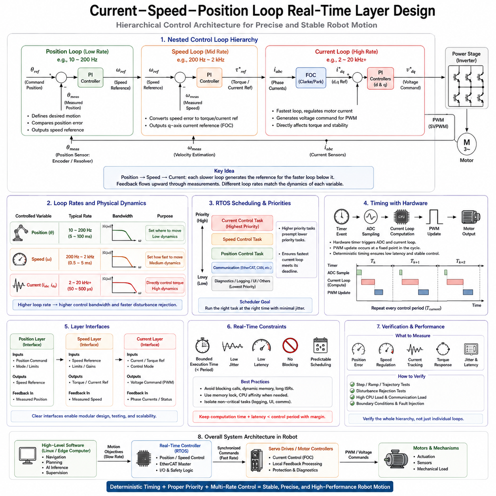{width="7.268055555555556in" height="7.268055555555556in"}

A robot motor-control system is typically organized as a hierarchy of nested real-time control loops in which position, speed, and current control operate at different rates. The position loop defines the desired motion, the speed loop converts motion error into a torque-related reference, and the current loop provides the fastest actuator-level regulation. This layered structure allows each controller to operate at a rate appropriate to its physical dynamics while maintaining a clear flow of references and feedback. The architecture is especially important for RTOS-based motor controllers.

The position loop normally operates at the lowest control rate because mechanical position changes relatively slowly compared with electrical current. It compares the commanded position with measured position and generates a speed reference for the next control layer. Depending on the application, the position controller may regulate joint position, wheel position, steering angle, or another mechanical state. Its execution does not need to match the high frequency of the current loop, but its timing must remain predictable so that the generated speed reference is updated consistently.

The speed loop operates at an intermediate rate and converts velocity error into a torque or current reference. It receives the speed reference from the position controller and compares it with measured motor or wheel velocity. A PI controller is commonly used to generate the required torque-related command, which can then become the q-axis current reference for a Field Oriented Control (FOC) implementation. Because the speed loop is faster than the position loop but slower than the current loop, its period and priority must be selected as part of the overall multi-rate control architecture.

The current loop is the fastest and most time-critical layer because motor electrical dynamics change much more rapidly than mechanical position or velocity. In an FOC system, the current controller processes phase-current feedback, performs coordinate transformations, regulates d-axis and q-axis currents, and generates voltage commands for PWM modulation. The loop may execute at several kilohertz or higher depending on the motor and inverter. Its execution period, latency, and jitter directly influence torque response, current tracking, and overall actuator stability.

The three loops should not be viewed as independent controllers. They form a nested hierarchy in which each slower layer provides a reference to the faster layer below it. Position control produces a speed reference, speed control produces a torque or current reference, and current control produces the voltage or PWM command that directly drives the motor. Feedback travels upward through the corresponding measurements. This hierarchy separates mechanical objectives from electrical actuation while allowing the complete system to behave as one closed-loop controller.

Different loop rates are necessary because each physical variable has a different dynamic bandwidth. Attempting to execute every controller at the same very high frequency can waste processor resources, while running a current loop too slowly can degrade motor regulation. A multi-rate design therefore allocates computational resources according to control importance and physical response. For example, a position loop may execute at tens or hundreds of hertz, a speed loop at hundreds of hertz to a few kilohertz, and the current loop at several kilohertz or more, depending on system requirements.

The RTOS scheduler provides the temporal foundation for this hierarchy. The fastest current-control task normally receives the highest real-time priority, while speed and position tasks receive progressively lower priorities. Communication, diagnostics, logging, configuration, and user-interface functions should normally remain below the control tasks. When a higher-priority control task becomes ready, the scheduler must allow it to execute without unnecessary interference. This priority structure ensures that the most time-critical control function receives processor time when it is required.

Hardware timers and PWM peripherals provide the precise timing reference for the fastest control layer. A timer event can trigger ADC sampling, initiate or notify the current-control computation, and coordinate the subsequent PWM update. The relationship between sampling, computation, and actuation should remain repeatable from one cycle to the next. If sampling occurs too late or the PWM update is delayed, the effective control-loop latency changes. The RTOS therefore needs to cooperate with hardware timing rather than attempting to replace precise peripheral timing with software delays.

The boundary between the current, speed, and position layers also defines useful interfaces for a robot controller. The position layer exchanges position references and measured position, the speed layer exchanges velocity references and measured velocity, and the current layer exchanges torque or current references with electrical feedback. These interfaces allow the layers to be developed and tested independently while preserving the overall control hierarchy. They also make it possible to place different functions on different processors when necessary, provided that communication latency and synchronization remain within the required limits.

Real-time constraints become increasingly strict as the control rate increases. The current loop must have a bounded execution time that remains below its control period with sufficient margin. The speed and position loops have more relaxed timing requirements, but their execution must still be periodic and predictable. Excessive scheduling jitter, blocking synchronization, dynamic memory allocation, or long interrupt handlers can propagate timing disturbances into the control hierarchy. Critical control paths should therefore minimize blocking and isolate diagnostics and communication from time-sensitive execution.

The multi-rate architecture also creates a natural relationship between motor control and higher-level robot software. A navigation, trajectory-planning, or motion-control system may generate relatively slow position or velocity commands, while the embedded controller continuously executes the faster speed and current loops. This means that an edge computer or high-level processor does not need to control every electrical cycle of the motor. Instead, it provides motion intent while the deterministic motor-control layer converts that intent into continuously regulated physical actuation.

Verification must evaluate the complete hierarchy rather than measuring only individual controllers. Position accuracy, speed regulation, current tracking, torque response, transient behavior, and steady-state stability should be evaluated together with loop period, execution time, latency, and jitter. Testing should include high processor load, communication activity, rapid reference changes, sensor disturbances, and boundary operating conditions. The objective is to confirm that every control layer maintains its required timing and that disturbances in slower software functions do not compromise the deterministic behavior of the fastest actuator loop.

A well-designed current-speed-position architecture therefore combines control theory, multi-rate scheduling, hardware timing, feedback processing, and RTOS execution into a single real-time system. Position control determines where the robot should move, speed control determines how fast it should move, and current control determines how the motor generates the required physical effort. The RTOS provides predictable execution for these layers, while hardware timers, PWM, and sensing maintain precise temporal coordination. This separation creates a scalable foundation for AMRs, manipulators, quadrupeds, humanoids, and other robotic systems requiring stable and precise actuation.

## 11.05 RTOS Interrupt-Based PWM Control Loop [w/Code]

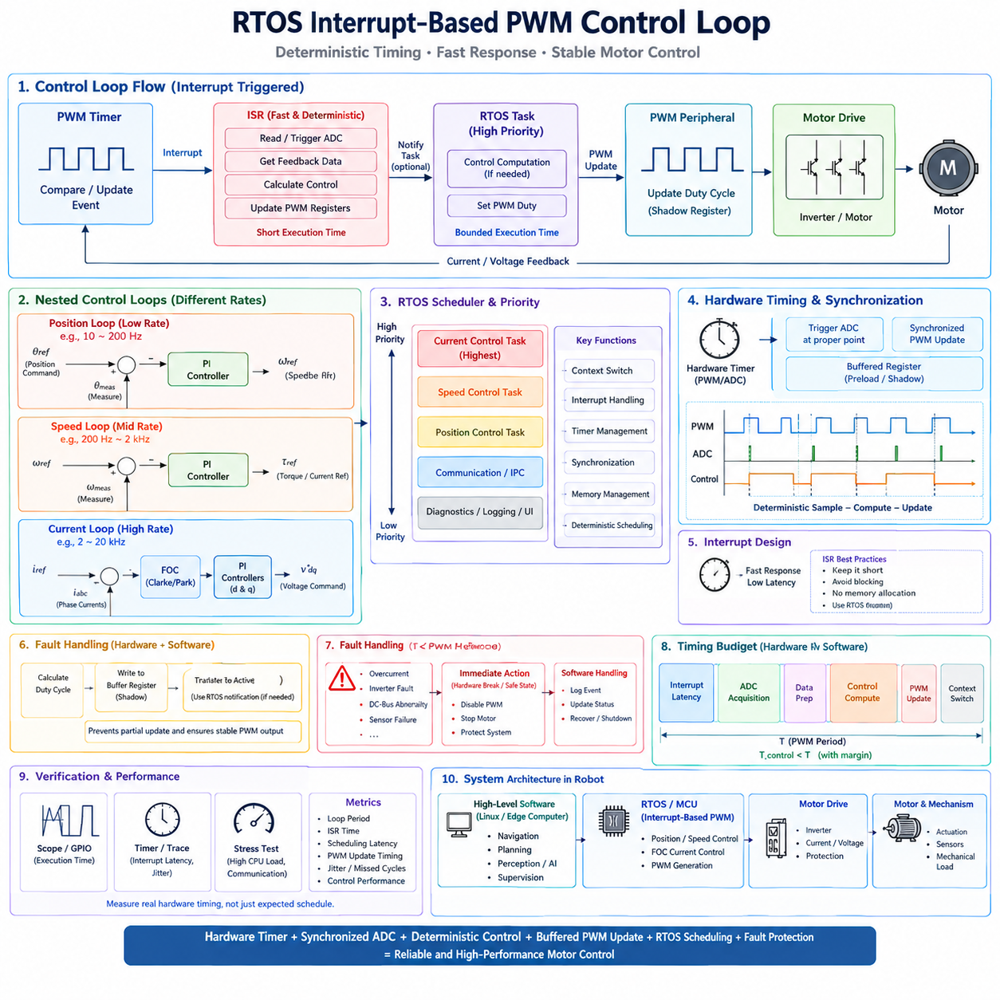{width="7.268055555555556in" height="7.268055555555556in"}

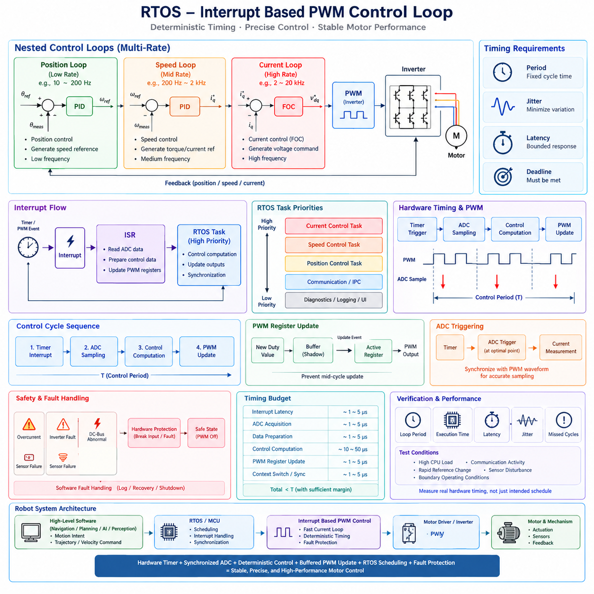{width="7.268055555555556in" height="7.268055555555556in"}

Interrupt-based PWM control is a fundamental real-time technique for executing motor-control algorithms at precise and repeatable intervals. Instead of allowing a general-purpose task to determine when the control loop runs, a hardware timer or PWM peripheral generates an interrupt at a predefined point in every PWM cycle. The interrupt establishes a deterministic timing reference for sensing, control computation, and actuator updates. In an RTOS-based motor controller, this approach connects hardware-level timing with software scheduling and provides a reliable foundation for fast closed-loop control.

A typical control cycle begins with a PWM timer reaching a predefined compare or update event. This hardware event triggers an interrupt, and the interrupt service routine (ISR) captures or initiates the required feedback acquisition. Depending on the microcontroller architecture, ADC conversion may already have been triggered by the timer, allowing the ISR to process a completed measurement. The control algorithm then calculates the next actuator command, and the resulting PWM duty values are transferred to the appropriate timer registers. The sequence repeats at every control period with minimal variation.

The relationship between PWM generation and control-loop timing is especially important because PWM is both an actuator command mechanism and a precise time base. The PWM carrier determines when switching actions occur, while synchronized ADC sampling determines when electrical feedback is observed. A well-designed system establishes a fixed relationship between the PWM waveform, ADC sampling instant, control computation, and duty-cycle update. This prevents unnecessary phase variation and makes the effective sampling interval predictable. Such synchronization is essential for stable current regulation and repeatable motor behavior.

The ISR should be designed as a short and deterministic execution path. Its primary responsibility is to respond quickly to the hardware event, capture or validate critical data, and initiate the time-sensitive control operation. Long calculations, logging, communication processing, memory allocation, and other non-critical activities should not normally be placed directly inside the ISR. If the control computation is sufficiently complex, the ISR can notify or unblock a high-priority RTOS task that performs the calculation. The appropriate architecture depends on the required control frequency, processor capability, and measured interrupt latency.

For very fast motor-control loops, executing the entire control algorithm directly within the interrupt context can reduce scheduling overhead and provide extremely predictable timing. This approach is commonly appropriate for compact FOC current loops when the computation can reliably complete within the available PWM period. However, the ISR execution time must remain bounded, because an excessively long interrupt can delay other interrupts and RTOS activities. The design must therefore establish a clear worst-case execution-time budget and verify that the complete interrupt path finishes before the next critical hardware event.

An alternative architecture uses the ISR primarily as a trigger mechanism for an RTOS task. The timer interrupt performs minimal processing and then signals a high-priority control task through an RTOS notification, semaphore, event, or similar mechanism. The scheduler immediately makes the control task runnable, and the task performs the larger computation before updating the PWM output. This design provides a cleaner separation between hardware event handling and application-level control logic, but it introduces scheduling latency. The latency and jitter must therefore be measured to ensure that the additional software layer remains compatible with the control period.

PWM register updates require careful attention to hardware behavior. Many motor-control timers provide preload or shadow registers so that a new duty-cycle value is not applied in the middle of an active PWM cycle. Instead, the calculated value can be written to a buffered register and transferred to the active compare register at a defined timer update event. This prevents partially updated duty cycles and creates a clean boundary between one control cycle and the next. Such hardware-assisted synchronization is preferable to relying on software timing alone because the peripheral can guarantee the update relationship independently of variable CPU execution.

ADC triggering should also be synchronized with the PWM waveform. In a switching inverter, electrical noise and transient currents can make some sampling points less suitable than others. The timer can therefore trigger the ADC at a carefully selected point in the PWM cycle, allowing the controller to acquire more representative phase-current measurements. The resulting data can then be processed by the FOC algorithm before the next appropriate PWM update. The complete sequence can be viewed as a deterministic sample--compute--update pipeline whose timing must remain consistent across consecutive cycles.

RTOS priority design determines how interrupt-driven control interacts with other software. The motor-control interrupt should normally have sufficient hardware priority to respond within its required latency, while the corresponding control task should receive a high RTOS priority when deferred execution is used. Lower-priority functions such as communication, diagnostics, logging, configuration, and user-interface processing must not consume the timing margin required by the control loop. Care must also be taken with interrupt nesting and critical sections because temporarily disabling interrupts or holding locks can create unexpected delays in the motor-control path.

Interrupt-driven PWM control must also consider failure conditions. An overcurrent event, inverter fault, DC-bus abnormality, sensor failure, or other dangerous condition may require PWM outputs to be disabled immediately. Hardware timer peripherals often provide break inputs or fault mechanisms that can force PWM outputs into a predefined safe state without waiting for normal software execution. Software fault handling can then record the event, update system state, and coordinate recovery or shutdown. Combining hardware protection with RTOS-level fault handling provides stronger guarantees than relying exclusively on a software task to detect and react to every failure.

The timing budget of the complete control cycle should include interrupt latency, ADC acquisition, data preparation, control computation, PWM register update, and any required context-switch or synchronization overhead. If the PWM period is T, the complete time from the triggering event to the required actuator update must remain comfortably below T. The remaining margin is important because execution time can increase under different operating conditions. A design that barely meets the deadline during nominal operation may fail when communication traffic, diagnostics, interrupts, cache effects, or other computational loads increase.

Verification should therefore measure the real hardware timing rather than assuming that the intended schedule is being followed. GPIO instrumentation can expose the beginning and end of the control computation on an oscilloscope, while hardware timers and trace systems can measure interrupt latency, execution time, and period variation. Tests should be performed under realistic maximum CPU load and communication activity, including rapid motor transients and boundary operating conditions. Important metrics include control-loop period, ISR execution time, scheduling latency, PWM update timing, jitter, missed cycles, and the resulting motor-control performance.

In a robot architecture, interrupt-based PWM control forms the lowest deterministic software layer connecting the RTOS or MCU control environment to the physical actuator. Higher-level position and speed controllers may generate references at slower rates, while the fast current-control layer responds to every PWM-related control event. This separation allows the robot\'s higher-level software to perform motion planning, communication, perception, or AI processing without directly controlling the precise switching timing of the motor inverter. The interrupt-driven layer continuously converts those higher-level references into stable electrical actuation.

The resulting architecture combines hardware timer precision, synchronized ADC acquisition, deterministic control computation, buffered PWM updates, RTOS scheduling, and hardware fault protection into one closed-loop execution model. Its primary objective is not simply to generate PWM signals, but to ensure that every control cycle begins, computes, and updates the actuator at a predictable time. When the interrupt path is short, the control computation is bounded, synchronization is maintained, and sufficient CPU margin is preserved, the system can achieve low jitter and stable real-time behavior. This makes interrupt-based PWM control a key implementation pattern for high-performance robotic motor controllers.

## 11.06 Motor Control Error Detection and Safe Stop Logic [w/Code]

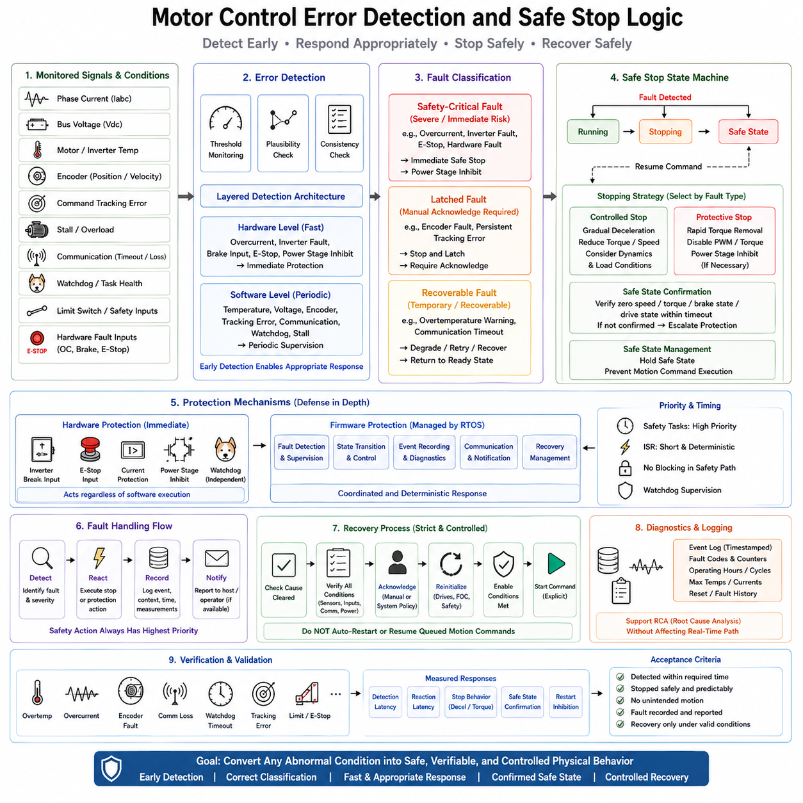{width="7.268055555555556in" height="7.268055555555556in"}

Motor-control error detection and safe-stop logic provide the protective layer that prevents abnormal actuator behavior from developing into uncontrolled motion or equipment damage. The controller continuously observes electrical, mechanical, communication, and software conditions while normal control loops execute. Typical monitored conditions include overcurrent, overtemperature, abnormal bus voltage, encoder faults, stall conditions, command-tracking errors, communication loss, and watchdog events. The purpose is not simply to detect an error, but to detect it early enough to select and execute an appropriate protective response.

Error detection should combine direct threshold monitoring with plausibility and consistency checks. Current, voltage, temperature, encoder position, velocity, and command values should remain within physically meaningful ranges. A signal that is numerically valid may still be inconsistent with other measurements or with the expected motor behavior. For example, an encoder may continue producing values while the measured position does not correspond to the commanded motion. The controller should therefore evaluate both individual signal limits and relationships among signals before declaring normal operation.

The detection path must operate with timing appropriate to the severity of the monitored condition. Fast electrical faults such as overcurrent or inverter abnormalities may require hardware-level protection because waiting for a normal RTOS task could be too slow. Slower conditions such as temperature rise, command-tracking deviation, or communication timeout can be evaluated by periodic software supervision. This creates a layered detection architecture in which hardware protection handles immediate hazards while firmware monitoring provides broader system awareness, diagnosis, and controlled response.

Once an abnormal condition is detected, the controller should classify the fault according to its severity and recovery requirements. A recoverable fault may allow the controller to reduce performance, retry communication, or return to a ready state after the cause disappears. A latched fault may require explicit acknowledgement before operation can resume. A safety-critical fault should force a protective transition and prevent normal control from continuing. This classification prevents every abnormal condition from being treated identically and allows the response to match the actual risk.

Safe-stop logic should be implemented as a state transition rather than as a single command that simply sets the motor output to zero. The controller may transition from Running to Stopping and then to a safe state, depending on the detected condition. A controlled stop can gradually reduce velocity or torque when immediate power removal is unnecessary, while a protective stop can rapidly remove hazardous actuator effort. For severe faults, torque may be disabled or the power stage may be inhibited immediately. The correct response depends on the fault type, robot dynamics, stored energy, and surrounding hazards.

The distinction between a commanded stop and a confirmed safe state is essential. Sending a zero-velocity or zero-torque command does not prove that the motor has actually stopped. The controller should observe feedback such as velocity, torque, brake status, drive state, or actuator response and confirm that the required condition has been achieved. If the expected transition does not occur within a defined timeout, the system should escalate to a stronger protective action. Safety therefore depends on feedback and state confirmation rather than on the assumption that a command was successfully executed.

The safe-stop sequence must also consider the physical behavior of the robot. An abrupt torque removal may not always be the safest response because a mobile robot can continue rolling, a manipulator can lose support for a payload, or an outdoor platform can remain exposed to terrain or traffic hazards. The controller should therefore select an appropriate stopping profile using speed, acceleration, braking capability, actuator state, and environmental constraints. The safe state represents a physically stable and controllable condition, not merely a software state in which commands have been disabled.

Hardware and firmware should cooperate in the protective path. Hardware mechanisms such as inverter break inputs, emergency-stop inputs, watchdogs, current protection, and power-stage inhibit functions can provide immediate protection independently of normal software execution. Firmware then manages fault classification, state transitions, event recording, communication, and recovery decisions. This separation creates defense in depth: hardware limits the immediate physical hazard, while the RTOS-based software maintains system-level awareness and coordinates the subsequent safe response.

The RTOS architecture must ensure that safety-related detection and response cannot be delayed by non-critical workloads. Fault-monitoring functions should have appropriate priority, and critical protective actions should not depend on long-running communication, logging, or diagnostic operations. Interrupt handlers for urgent hardware faults should remain short and deterministic, while larger fault-management operations can execute in a high-priority safety task. Watchdog supervision can provide another independent mechanism for detecting software failure, task starvation, or controller unresponsiveness.

Communication supervision is particularly important when higher-level commands are supplied through CAN, CANopen, EtherCAT, or another control interface. A motor controller should not continue indefinitely using stale motion commands when the command source has disappeared. Message validation can check identifiers, ranges, sequence information, and integrity fields, while timeout supervision determines whether commands are arriving within the expected interval. When communication becomes invalid or unavailable, the controller should transition according to its predefined safety policy rather than assuming that the last command remains valid.

Command-tracking errors provide another important protection mechanism. The controller should compare commanded motion with actual actuator behavior and determine whether the difference remains within an acceptable range. Persistent position error, excessive velocity deviation, unexpected torque behavior, or failure to respond can indicate mechanical obstruction, actuator degradation, sensor problems, or communication faults. Detection thresholds should account for normal transient behavior so that legitimate acceleration or load changes do not generate unnecessary stops, while persistent deviations must trigger an appropriate protective response.

Fault handling should follow a deterministic sequence such as Detect, React, Record, and Notify. Detection identifies the abnormal condition and establishes the corresponding fault code and severity. Reaction performs the required protective action, such as controlled deceleration, torque removal, power-stage inhibition, or safe-state transition. Recording stores the cause, timestamp, operating mode, and relevant measurements without delaying the safety response. Notification communicates the condition to higher-level software or an operator when communication remains available. Safety action must always take priority over logging and notification.

Recovery must be more restrictive than ordinary control resumption. After a fault, the system should first verify that the original cause has disappeared and that all relevant safety inputs, sensors, actuators, communication paths, and operating conditions are valid. Clearing a fault flag should not automatically restart the motor. Depending on the architecture, recovery may require explicit acknowledgement, controlled reinitialization, renewed enable conditions, and an explicit restart command. Queued motion commands should not automatically resume after a protective stop because doing so could recreate the original hazardous condition.

Verification and diagnostics should demonstrate that every important error condition leads to the intended response within its required time. Fault injection can be used to simulate sensor failures, communication loss, watchdog events, encoder errors, overcurrent conditions, command deviations, and delayed execution. The measured response should include detection latency, reaction latency, actuator stopping behavior, safe-state confirmation, and restart inhibition. Event logs and fault counters should support root-cause analysis while remaining non-interfering with the real-time protection path. The objective is to prove that the controller does not merely detect faults, but reliably converts them into safe and verifiable physical behavior.

## 11.07 Robot Joint Servo Controller MCU RTOS Case [w/Code]

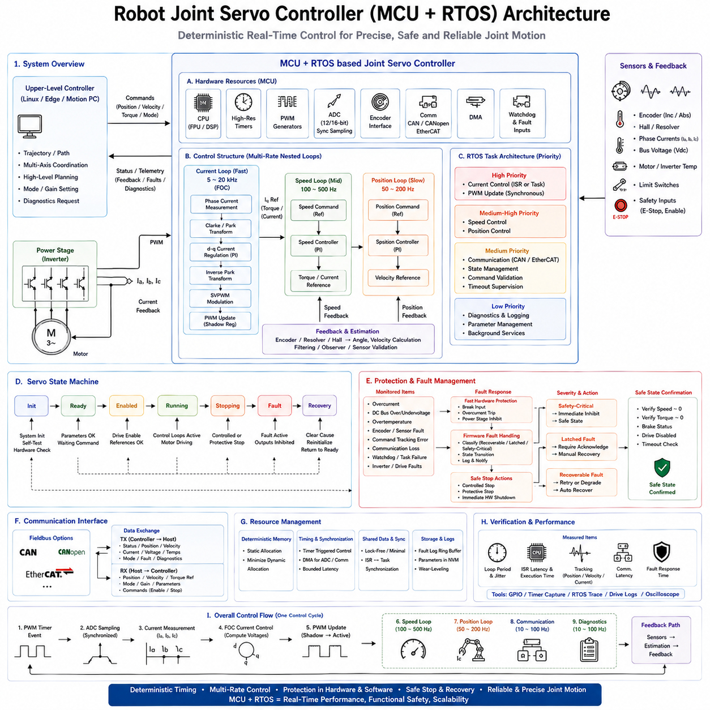{width="7.268055555555556in" height="7.268055555555556in"}

A robot joint servo controller based on an MCU and RTOS provides the deterministic actuator layer between high-level robot motion commands and the physical motor. The controller receives position, velocity, or torque references from an upper-level controller and executes the faster feedback loops required by the joint. Its responsibilities typically include sensor acquisition, current regulation, speed and position control, PWM generation, communication, diagnostics, and protection. The RTOS coordinates these functions while preserving the strict timing required by the motor-control path.

The MCU is selected to support real-time motor-control peripherals as well as sufficient computational performance. Typical hardware resources include high-resolution timers, PWM generators, synchronized ADC channels, encoder interfaces, communication peripherals, DMA, watchdogs, and hardware fault inputs. Floating-point or DSP capabilities can accelerate FOC calculations and filtering. The objective is not simply high processor speed, but a hardware architecture capable of synchronizing sensing, computation, communication, and actuator updates with predictable timing.

The fastest control layer is normally the current-control loop implemented using Field Oriented Control. PWM timer events provide the primary timing reference, while ADC sampling is synchronized with the inverter switching waveform. The controller measures phase currents, determines the electrical rotor angle, performs Clarke and Park transformations, executes d-axis and q-axis current regulation, and calculates voltage commands. Inverse transformation and PWM modulation then generate the duty cycles applied to the inverter. This complete sequence must finish within a tightly bounded control period.

The speed and position loops operate at slower rates above the current loop. The position controller compares commanded and measured joint position and produces a velocity reference, while the speed controller converts velocity error into a torque or current reference. The current loop then produces the electrical effort required to realize that command. This nested multi-rate architecture reflects the different mechanical and electrical dynamics of the joint and prevents unnecessary processor load by executing each control function only at the rate required by its bandwidth.

The RTOS scheduler maps these control layers to an explicit priority hierarchy. The high-frequency current-control function receives the highest control priority, followed by speed and position control. Communication, state management, diagnostics, logging, and background functions execute at lower priorities. Some implementations execute the current loop directly from a timer interrupt, while others use a short interrupt service routine to activate a high-priority control task. In either case, bounded latency and low jitter are more important than average execution performance.

A representative execution cycle begins when the PWM timer triggers synchronized ADC acquisition. Once the required current samples become available, the MCU executes the current-control algorithm and writes the newly calculated duty cycles into PWM shadow registers. The values become active at a defined timer update boundary, preventing mid-cycle modification. Meanwhile, slower RTOS tasks execute speed control, position control, communication, diagnostics, and state supervision according to their own periods. Hardware timing and RTOS scheduling therefore cooperate rather than compete for control of the actuator timeline.

Joint position feedback may be obtained from an incremental encoder, absolute encoder, resolver, Hall sensors, or another suitable sensing device. The controller converts raw measurements into position and velocity information and performs validity checks before using them in the feedback loops. Signal filtering must balance noise reduction against additional phase delay. Because servo performance depends strongly on feedback quality, sensor acquisition, timestamping, angle processing, and control computation should maintain a known temporal relationship rather than being treated as unrelated software operations.

Communication connects the joint controller to the robot\'s upper control layer. CAN, CANopen, EtherCAT, or another deterministic interface can transport target position, velocity, torque, operating mode, status, and diagnostic information. The communication task should validate incoming commands and monitor message timeouts so that stale commands are not executed indefinitely. Network processing must remain separated from the fastest motor-control path, allowing temporary communication load or higher-level computation variation to occur without directly disturbing current-loop timing.

The servo firmware can be organized around an explicit state machine such as initialization, ready, enabled, running, stopping, fault, and recovery. State transitions define when PWM outputs may be activated, when control integrators are initialized, when references become valid, and when the motor must be disabled. This prevents control behavior from depending on scattered conditional logic across multiple tasks. The RTOS tasks, interrupt handlers, communication interface, and protection functions can all reference the same controlled operating state.

Protection is a fundamental part of the joint controller rather than an additional diagnostic feature. The MCU should supervise phase current, DC-bus voltage, temperature, encoder validity, command tracking, communication health, watchdog status, and inverter faults. Fast electrical faults can activate hardware break or power-stage inhibit mechanisms without waiting for normal software execution. Firmware then records the event, classifies the fault, performs the required state transition, and communicates the condition to the upper controller when possible.

Safe-stop behavior must consider the mechanical function of the robot joint. Immediately removing torque may be appropriate for some electrical faults but dangerous for a gravity-loaded manipulator joint supporting a payload. Other faults may permit controlled deceleration before the drive is disabled or a mechanical brake is applied. The controller should therefore distinguish controlled stop, protective stop, and immediate hardware shutdown. Feedback should confirm that the joint has reached the intended safe condition before the system reports that the stop sequence is complete.

Resource management is important because MCU memory and processing capacity are limited. Static allocation can be preferred for critical RTOS objects, and dynamic allocation should be minimized in deterministic control paths. Shared data between interrupts and tasks requires carefully bounded synchronization, while large logging or communication buffers should not consume memory required by control functions. DMA can reduce CPU overhead for ADC or communication transfers, but its timing and shared-memory interactions must still be considered when establishing worst-case execution behavior.

Verification should measure the controller as a complete real-time actuator system. Important measurements include current-loop period, ISR latency, execution time, scheduling jitter, PWM update timing, communication latency, position error, velocity tracking, current tracking, and fault-response time. Tests should be repeated under high communication and CPU load and during rapid motion changes. GPIO instrumentation, timer capture, RTOS tracing, drive logs, and oscilloscope measurements can demonstrate whether the real hardware follows the intended timing architecture.

This MCU-RTOS servo architecture creates a clear boundary between robot intelligence and deterministic joint execution. A Linux, edge, or motion-control computer can generate trajectories and coordinated multi-axis objectives, while each joint controller maintains its own fast electrical and mechanical feedback loops. The local controller remains responsible for precise timing, actuator protection, and immediate fault response even when upper-level software experiences variable latency. The result is a scalable distributed architecture in which high-level computation defines motion intent and MCU-based real-time servo controllers convert that intent into stable, precise, and safe physical joint motion.

## 11.08 BLDC / PMSM / Linear Motor RTOS Control Comparison

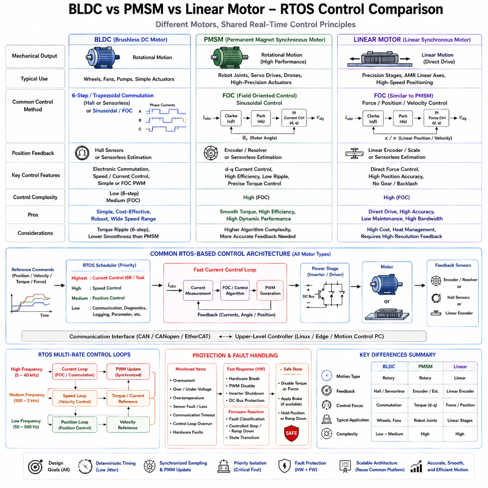{width="7.268055555555556in" height="7.268055555555556in"}

BLDC, PMSM, and linear motors can all be integrated into RTOS-based robotic control systems, but their electrical commutation, feedback requirements, control algorithms, and mechanical outputs create different real-time design priorities. The RTOS does not fundamentally change the electromagnetic behavior of the motor. Instead, it provides deterministic execution for sensing, control computation, PWM generation, communication, diagnostics, and protection. The appropriate architecture therefore depends on how each motor converts electrical commands into physical motion and how tightly that process must be controlled.

A Brushless DC Motor (BLDC) is commonly driven through a three-phase inverter using electronic commutation. Simpler implementations use six-step or trapezoidal commutation based on Hall-sensor or estimated rotor-position information. The controller determines the active phase combination and generates complementary PWM signals with appropriate dead time. Because commutation events must occur at the correct rotor position, the MCU must process position information and update the inverter state with bounded latency. An RTOS can coordinate these operations while separating fast commutation from slower communication and diagnostic functions.

BLDC control can also use sinusoidal control or Field Oriented Control when smoother torque and lower acoustic or mechanical ripple are required. In this case, its software architecture becomes increasingly similar to PMSM control. Phase-current acquisition, electrical-angle estimation, Clarke and Park transformations, current regulation, inverse transformation, and PWM modulation may all execute within a high-frequency control loop. The distinction between BLDC and PMSM control therefore depends not only on motor construction but also on the selected commutation and control strategy.

A Permanent Magnet Synchronous Motor (PMSM) is commonly associated with sinusoidal back-EMF and high-performance FOC. The RTOS implementation must maintain precise synchronization between phase-current sampling, rotor-angle acquisition, current-control computation, and PWM update. The d-axis and q-axis currents are regulated independently to control magnetic flux and torque. This requires more mathematical computation than basic six-step BLDC control, but modern MCUs with DSP or floating-point support can execute the algorithm efficiently within deterministic interrupt-driven control cycles.

PMSM control is especially suitable for robot joints and servo actuators requiring smooth torque, low ripple, high efficiency, and accurate dynamic response. A nested architecture typically places the FOC current loop at the highest frequency, the velocity loop at an intermediate frequency, and the position loop at a lower frequency. Hardware timers synchronize ADC sampling and PWM generation, while RTOS priorities protect the current-control path from communication, logging, parameter management, and other slower software activities. This architecture closely matches the hierarchical servo-control structure used in robotic joint controllers.

A linear motor differs mechanically because its electromagnetic force produces direct translational motion rather than rotary motion. The basic electromagnetic control principle can nevertheless resemble that of a rotary PMSM, particularly for permanent-magnet synchronous linear motors. Instead of regulating rotational torque and angular position, the controller regulates linear force, velocity, and position. The feedback device may therefore be a linear encoder rather than a rotary encoder, while the inverter, phase-current sensing, FOC calculations, and PWM generation can remain conceptually similar.

The direct-drive nature of a linear motor changes the mechanical control problem significantly. A rotary motor often drives a joint through a gearbox or reducer, whereas a linear motor can apply force directly to the moving stage. Mechanical backlash and transmission compliance may be reduced, but disturbances and control errors can act more directly on the load. High-resolution position feedback, accurate force regulation, and low control-loop jitter therefore become particularly important. The RTOS must preserve deterministic sensor-to-actuator timing so that the advantages of direct drive are not degraded by software timing variation.

From a real-time scheduling perspective, all three motor types benefit from a multi-rate control architecture. The fastest electrical loop should receive the highest priority, followed by velocity and position loops, while communication and diagnostics execute at lower priorities. However, the computational demand of the fastest loop differs with the control strategy. A six-step BLDC controller may require relatively simple commutation and PWM calculations, while FOC-based BLDC, PMSM, and synchronous linear-motor controllers require coordinate transformations, PI current regulators, modulation, and precise electrical-angle processing.

Sensor requirements also influence RTOS architecture. BLDC systems using Hall sensors may operate with relatively coarse rotor-position information, while high-performance PMSM systems commonly use encoders, resolvers, or advanced sensorless estimators. Linear servo systems may require high-resolution linear encoders to achieve precise translational positioning. Regardless of sensor type, acquisition should be timestamped or synchronized with the corresponding control cycle. The controller must also detect invalid measurements, implausible transitions, signal loss, and stale data before corrupted feedback propagates into actuator commands.

PWM generation remains a common deterministic foundation. BLDC six-step control requires correct phase commutation and complementary switching, while FOC-based systems require synchronized PWM duty-cycle updates derived from voltage-vector commands. Advanced timer functions such as complementary outputs, dead-time insertion, shadow registers, synchronized ADC triggers, and hardware break inputs reduce dependence on variable software timing. These hardware features allow the RTOS and MCU peripherals to cooperate in maintaining precise sample-compute-update behavior and immediate protection.

Fault handling is required for every motor type, although the mechanical consequences can differ. Overcurrent, inverter faults, abnormal DC-bus voltage, excessive temperature, sensor failure, communication timeout, and control-loop timing violations should be monitored. Hardware protection should respond immediately to dangerous electrical conditions, while firmware classifies faults and manages controlled stopping, state transitions, logging, and recovery. A linear axis may require braking or controlled force reduction, while a robot joint may require torque management or a mechanical brake to prevent uncontrolled load motion.

Communication requirements are largely determined by the robot architecture rather than the motor technology itself. CAN, CANopen, EtherCAT, or another deterministic interface may deliver position, velocity, torque, or force references to the local controller. The MCU should maintain its fast local control loops independently of normal variation in upper-level command timing. This allows a BLDC wheel drive, PMSM robot joint, or linear positioning axis to preserve electrical stability even when navigation, trajectory generation, multi-axis coordination, or AI computation executes at much slower rates.

The comparison therefore shows that RTOS design should follow the control method and application dynamics rather than simply the motor label. Basic BLDC commutation can use a comparatively lightweight real-time control path, while high-performance BLDC and PMSM drives commonly converge toward FOC-based architectures. Linear motors may reuse much of the same electrical-control structure but require translational feedback and direct-force-oriented mechanical control. In every case, deterministic timing, synchronized sensing and PWM, bounded latency, priority isolation, fault protection, and timing verification remain the common RTOS foundations.

A scalable robotic platform can consequently use a shared MCU-RTOS software architecture across several actuator technologies while replacing motor-specific sensing, commutation, parameterization, and mechanical-control components. Common services can include scheduling, communication, state management, diagnostics, watchdog supervision, PWM infrastructure, and safety handling. Motor-specific modules then implement BLDC commutation, PMSM FOC, or linear force and position control. This separation reduces architectural fragmentation while preserving the specialized real-time behavior required by each actuator, enabling one deterministic control framework to support wheels, robot joints, and precision linear mechanisms.

## 11.09 Control Loop Jitter Impact Analysis and Improvement

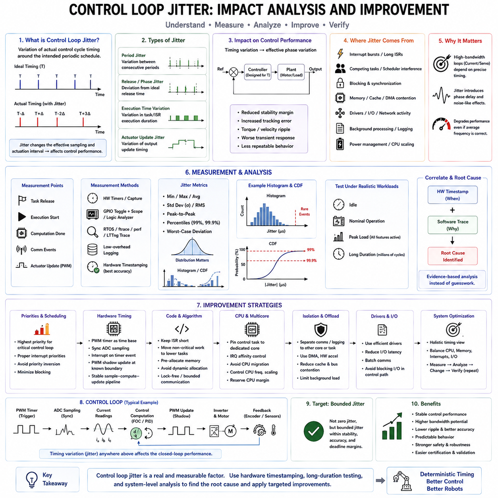{width="7.268055555555556in" height="7.268055555555556in"}

Control-loop jitter is the variation of actual control-cycle timing around its intended periodic schedule. If a motor-control loop is designed for a fixed period T, the ideal execution times occur at exact multiples of T, but real executions may start or complete slightly earlier or later. This deviation changes the effective sampling and actuation interval. In an RTOS motor controller, jitter is therefore not merely a scheduling statistic; it directly influences the temporal assumptions used by the feedback-control algorithm.

Jitter can be described from several timing perspectives. Period jitter represents variation between consecutive control-cycle intervals, while release or phase jitter describes deviation from the ideal scheduled activation time. Execution-time variation and actuator-update jitter may also contribute to the final timing uncertainty observed by the physical plant. Measuring only average loop frequency can hide these effects. A controller may average exactly 1 kHz while individual cycles vary significantly around the nominal 1 ms period.

The impact becomes particularly important in high-bandwidth current and servo loops because controller parameters are normally designed around an assumed sampling period. When the actual interval varies, sensor measurements are processed at inconsistent times and control outputs are applied with variable delay. This introduces effective phase variation into the closed loop. Small jitter may produce little visible degradation, but increasing variation can reduce stability margin, increase tracking error, create torque or velocity ripple, and make transient behavior less repeatable.

In Field Oriented Control, timing variation affects the relationship among current sampling, rotor-angle information, coordinate transformation, control computation, and PWM update. Phase-current values should correspond to a known electrical angle and a predictable PWM position. If computation or update timing varies, the calculated voltage vector may be applied later than expected. The result can appear as additional phase delay, current distortion, torque ripple, or degraded high-speed performance even when the mathematical FOC equations themselves are correct.

Jitter can originate from many parts of the real-time execution chain. Interrupt bursts may delay task activation, competing tasks may create scheduler interference, long interrupt service routines can postpone control processing, and synchronization primitives can introduce blocking. Memory events, cache effects, DMA contention, device drivers, network activity, and background processing can also create occasional timing excursions. Consequently, jitter analysis must examine the complete system rather than assuming that the control algorithm itself is responsible for every observed timing variation.

Priority configuration is one of the first areas to examine when excessive jitter appears. The fastest and most timing-critical motor-control function should normally receive higher priority than speed control, position control, communication, diagnostics, and logging. However, assigning a high priority alone does not guarantee deterministic execution. Interrupt priorities, critical sections, priority inversion, blocking synchronization, and kernel activity can still delay the control path. Priority design must therefore be evaluated together with the complete scheduling and interrupt architecture.

Hardware-triggered execution can significantly reduce dependence on variable software scheduling. A PWM timer can establish the primary control time base, trigger ADC sampling at a defined point, and generate the interrupt that starts the control calculation. PWM shadow registers can then apply the new duty values at a known update boundary. This creates a synchronized sample-compute-update pipeline. Hardware timing does not eliminate computation-time variation, but it provides stable reference points and reduces timing uncertainty caused by software-generated periodic delays.

The control path should also minimize operations with unpredictable execution time. Dynamic memory allocation, blocking I/O, console output, file operations, large logging activities, and unnecessary mutex acquisition should remain outside the high-frequency loop. Buffers and RTOS objects can be preallocated, and critical data exchange can use bounded or lock-free mechanisms where appropriate. Interrupt handlers should remain short, and non-critical work should be deferred to lower-priority tasks. The objective is to reduce both normal timing variation and rare long-tail latency events.

On multicore processors, CPU placement and interrupt routing can become additional improvement mechanisms. A real-time control thread can be assigned to a dedicated or isolated CPU, while non-critical processes execute elsewhere. IRQ affinity can prevent unrelated device interrupts from repeatedly disturbing the control core. CPU migration should be minimized when it causes cache or scheduler interference. Frequency scaling and power-management behavior should also be controlled where they introduce timing variability. Optimization must consider the processor, scheduler, interrupts, memory, and I/O as one timing system.

Jitter measurement should rely on actual timestamps rather than assumptions derived from task configuration. Hardware timers, timer capture peripherals, GPIO toggling with an oscilloscope or logic analyzer, and low-overhead tracing can reveal when control events actually occur. Useful measurement points include task release, execution start, computation completion, communication events, and actuator output. Hardware timestamping is particularly valuable because timestamps can be captured near the hardware boundary with less uncertainty from software logging overhead.

A useful analysis should examine the distribution rather than reporting only minimum, maximum, and average values. Standard deviation, RMS variation, peak-to-peak jitter, percentiles such as 99% and 99.9%, and worst-case deviation reveal different aspects of temporal behavior. Histograms and cumulative distribution functions can expose whether most cycles remain tightly grouped while rare events create large delays. These rare events are often the most important for real-time validation because a single extreme cycle may violate a deadline even when average performance appears excellent.

Long-duration testing is therefore essential. Interrupt bursts, scheduler interactions, memory events, communication activity, and driver operations may occur infrequently, so short measurements can produce an unrealistically optimistic result. The controller should be tested under idle, nominal, and realistic peak workloads while sensors, networking, storage, diagnostics, and other robot functions are active. Increasing the number of measured cycles improves the probability of capturing rare timing excursions and provides stronger evidence about the available real-time margin.

Tracing helps connect a measured timing anomaly with its software cause. RTOS tracing or Linux tools such as ftrace, perf, and LTTng can reveal scheduler activity, interrupts, kernel work, synchronization, and competing threads around the time of a jitter event. Hardware timestamps answer when the physical timing deviation occurred, while software tracing helps explain why it occurred. Correlating these two views transforms jitter reduction from trial-and-error tuning into evidence-based root-cause analysis.

Improvement should follow a repeated measure-analyze-change-verify process. After identifying the dominant source, the design may change task priorities, shorten an ISR, remove blocking operations, modify CPU or IRQ affinity, preallocate memory, adjust driver behavior, or isolate communication processing. The same workload and measurement method should then be repeated. A change should be accepted only when the measured jitter distribution and worst-case behavior improve without creating new deadline, safety, or resource problems elsewhere in the system.

The final objective is not zero jitter, which is generally unrealistic, but bounded jitter that remains compatible with the controller\'s stability, accuracy, and deadline requirements. A robust motor-control architecture establishes deterministic hardware timing, protects critical tasks through priority and isolation, minimizes unpredictable execution paths, preserves CPU margin, and verifies timing under realistic worst-case workloads. Control-loop jitter then becomes a measurable engineering parameter that can be budgeted, analyzed, reduced, and continuously regression-tested as the robotic software platform evolves.

## 11.10 Humanoid Multi-Joint Synchronous Control RTOS Case

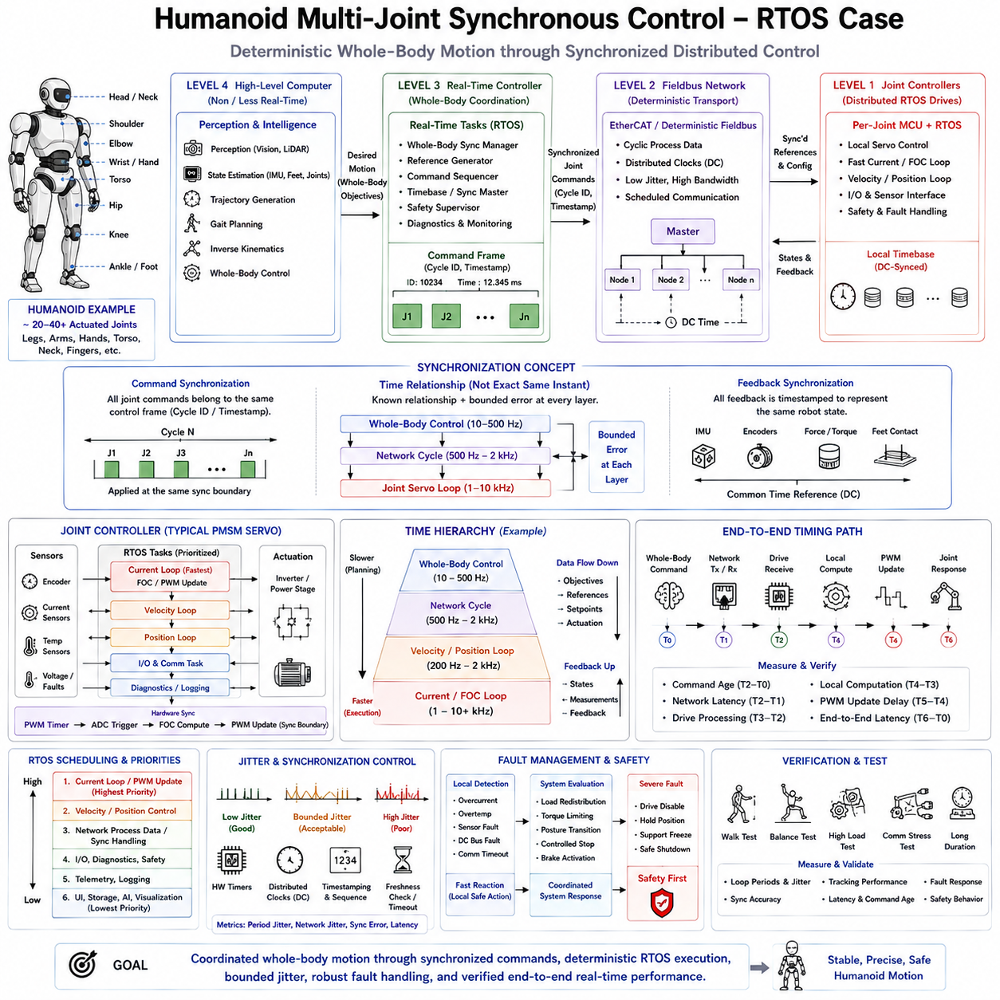{width="7.268055555555556in" height="7.268055555555556in"}

A humanoid robot requires deterministic coordination of many actuated joints distributed across the legs, torso, arms, hands, neck, and other mechanisms. Unlike a single servo axis, whole-body motion depends on multiple joints reaching commanded positions, velocities, or torques with controlled temporal relationships. The RTOS architecture therefore has two simultaneous responsibilities: maintaining deterministic local servo execution and preserving synchronization across the distributed actuator network so that the robot behaves as one coordinated mechanical system.

The control architecture can be organized hierarchically. A high-level computer performs perception, state estimation, trajectory generation, gait planning, inverse kinematics, and whole-body control, while real-time controllers translate these objectives into synchronized joint commands. Individual joint controllers then execute fast electrical and mechanical feedback loops. This separation allows computationally complex planning to operate at moderate rates while current, velocity, and position regulation continue locally at the deterministic rates required by each actuator.

Whole-body control generates references that are meaningful only when interpreted as a coordinated set. During walking, for example, hip, knee, ankle, torso, and arm motions must correspond to the same intended robot state and control instant. Applying some joint commands from one control frame and others from the next can distort the planned body configuration. Commands should therefore carry a cycle identifier, sequence number, timestamp, or equivalent temporal reference that allows distributed controllers to associate all joint targets with the correct synchronization frame.

A deterministic fieldbus such as EtherCAT can provide the communication backbone between the real-time master and distributed joint drives. Cyclic process data transfers joint position, velocity, torque, mode, and status information within a defined communication period. Distributed Clocks can establish a shared time reference among participating devices, reducing relative timing error between actuators. The objective is not merely low network latency, but predictable command delivery and tightly aligned actuation across many joints.

At each joint, an MCU-RTOS servo controller can maintain the fastest control functions independently of the central computer. A typical PMSM actuator executes synchronized current sampling, FOC computation, PWM generation, velocity regulation, and position control using hardware timers and prioritized RTOS tasks. The current loop may execute at several kilohertz or higher, while velocity and position loops run more slowly. This local hierarchy prevents fieldbus timing and high-level computation from directly determining the electrical control timing of every motor.

The complete humanoid therefore contains several nested time scales. Electrical current control occupies the fastest layer, local velocity and position control operate above it, network synchronization forms another periodic layer, and whole-body control generates coordinated objectives at a slower rate. Perception, planning, and AI functions may operate more slowly again. The architecture must explicitly define these rates and the data transitions between them so that slower computation can guide motion without introducing uncontrolled timing variation into the faster servo layers.

RTOS scheduling priorities should follow physical timing criticality. Current control and synchronized PWM updates receive the highest local priority, followed by velocity and position control. Network process-data handling and command validation must complete before their associated deadlines, while diagnostics, parameter management, telemetry, and logging remain lower priority. On the central real-time computer, the cyclic network master and whole-body control path should similarly be protected from non-real-time visualization, storage, user-interface, and AI workloads.

Synchronization does not require every operation in the humanoid to execute at exactly the same instant. Instead, each layer requires a known temporal relationship and bounded error. Joint drives may calculate local control outputs independently but activate newly received references at a shared synchronization boundary. Sensor measurements should likewise correspond to known sampling instants. This enables the central controller to reason about a coherent robot state rather than combining joint information collected at widely different and unknown times.

Feedback synchronization is especially important for balance and locomotion. Joint encoders, IMU measurements, force or torque sensors, and foot-contact information collectively describe the humanoid\'s physical state. If these measurements have inconsistent timestamps or excessive age differences, state estimation can represent a body configuration that never physically existed. Timestamping, synchronized acquisition, bounded communication latency, and freshness checking therefore become essential parts of the control architecture rather than optional networking features.

Jitter must be controlled at both local and distributed levels. Local control-loop jitter affects individual servo stability and tracking, while network-cycle or synchronization jitter creates relative timing errors among joints. A small error on one axis may be insignificant in isolation but can become important when many joints cooperate to maintain foot contact, center-of-mass motion, or manipulation accuracy. Timing analysis should therefore measure individual loop jitter, network-cycle variation, clock synchronization error, and end-to-end command-to-actuation latency.

Fault management becomes more complex because a humanoid is mechanically coupled through its body. A failure of one actuator can change the load and stability requirements of several other joints. Each local drive should detect electrical and sensor faults rapidly, while the central controller evaluates the whole-body consequence. Depending on severity and robot state, the response may include torque limitation, controlled posture transition, motion freezing, support redistribution, controlled stop, brake activation, or immediate drive inhibition.

Communication failures require similarly coordinated behavior. Joint controllers should reject stale commands using timestamps, sequence monitoring, and timeout supervision rather than continuing old references indefinitely. However, independently disabling a single joint may destabilize the robot. The local controller should therefore implement predefined safe behavior while reporting the condition to the supervisory layer, which coordinates the system-level response. Safety design must combine fast local autonomy with globally consistent humanoid behavior.

Verification should examine synchronization under realistic whole-body workloads rather than testing each servo only in isolation. Measurements should include joint-loop periods, PWM timing, network-cycle latency, distributed-clock alignment, command age, actuator update skew, tracking error, and fault-response time. Walking, standing balance, rapid posture changes, dual-arm motion, and simultaneous high-load communication provide useful stress conditions. Long-duration tests are necessary to expose rare scheduler, network, interrupt, and synchronization disturbances.

Hardware timestamps, GPIO instrumentation, EtherCAT diagnostics, RTOS tracing, and high-resolution logging can correlate events across the control hierarchy. Engineers can compare the intended whole-body command time with network transmission, drive reception, local computation, PWM activation, and measured joint response. This end-to-end view is more informative than CPU utilization alone because a system can have substantial unused processor capacity while still suffering from synchronization errors caused by scheduling, communication, or poorly aligned update boundaries.

The resulting architecture forms a distributed real-time control system in which high-level intelligence defines coordinated whole-body motion while deterministic RTOS and fieldbus layers preserve precise physical execution. Central computation does not need to generate every PWM edge, and local joint controllers do not need to understand the complete walking or manipulation task. By combining synchronized commands, shared timing, local multi-rate servo loops, bounded jitter, coordinated fault handling, and end-to-end verification, a humanoid can scale from individual motor control to stable and precise multi-joint physical behavior.
