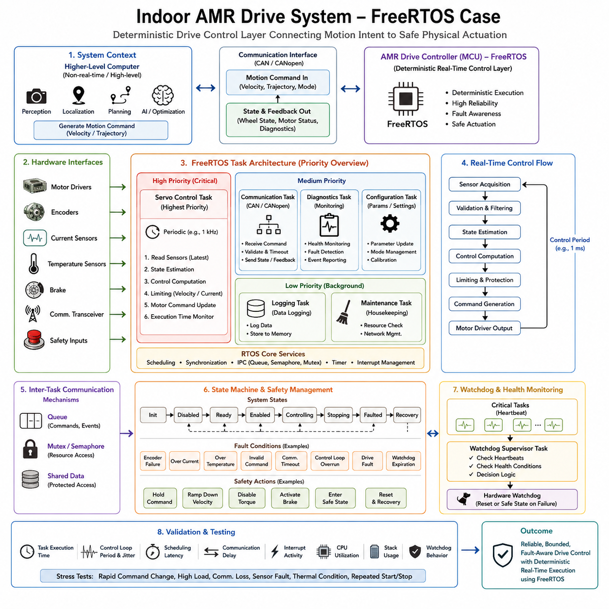
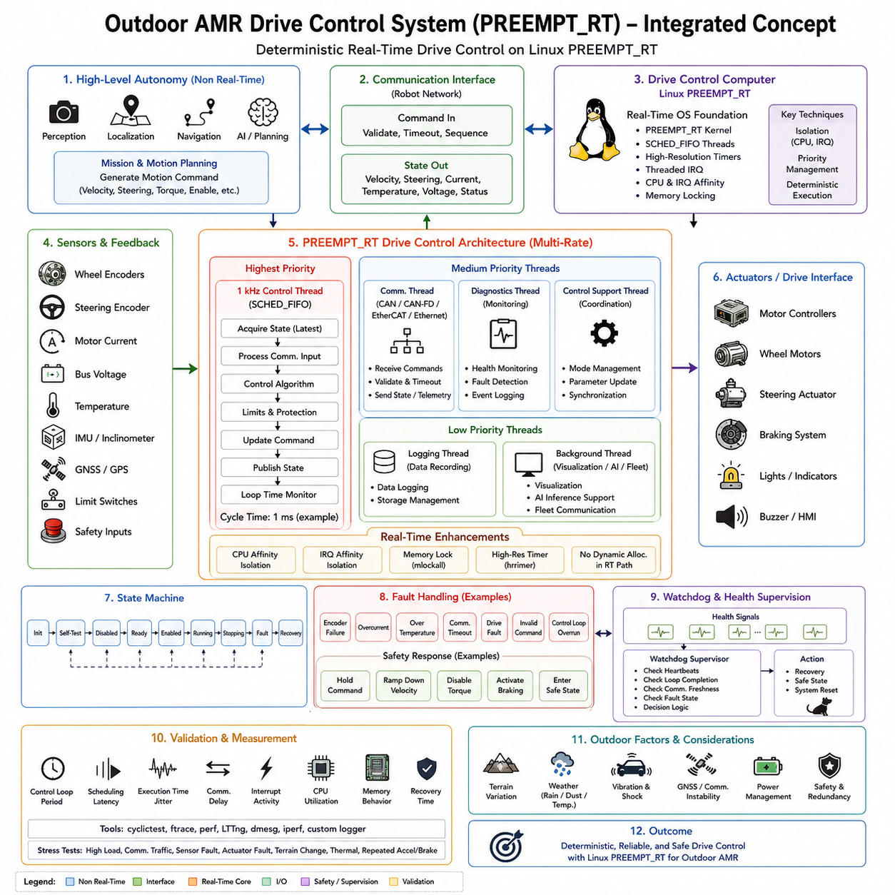
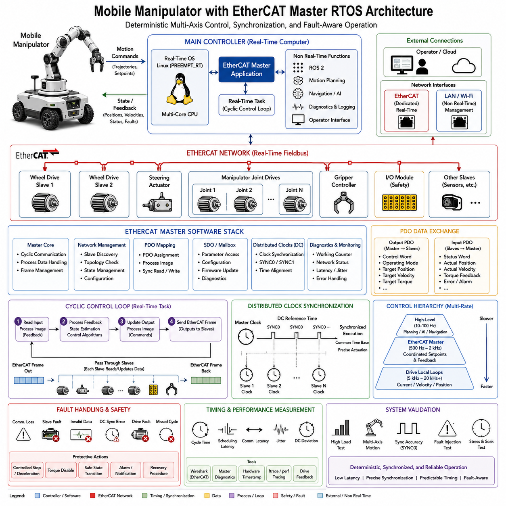
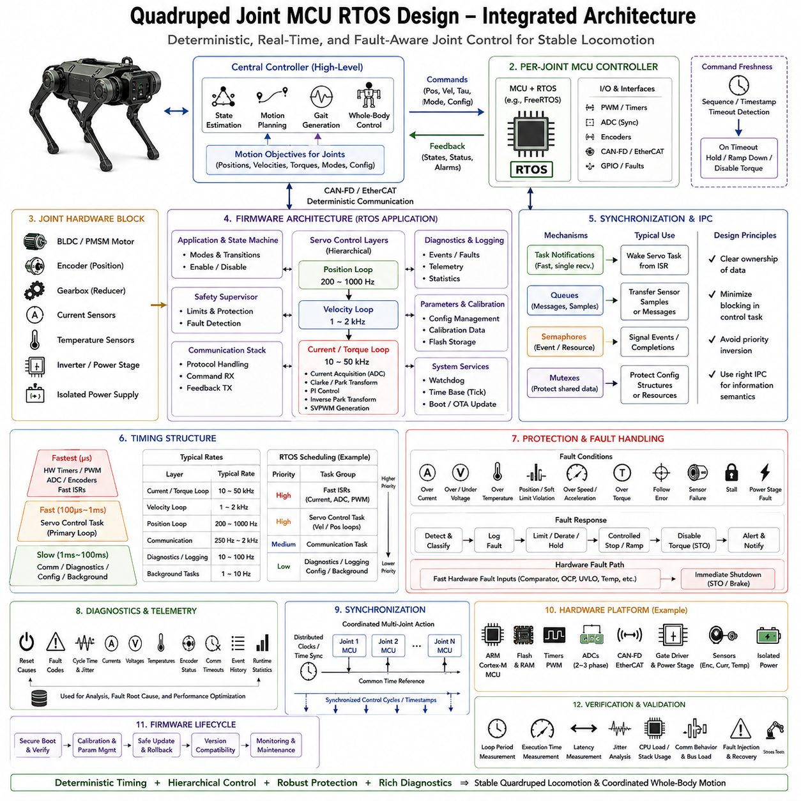
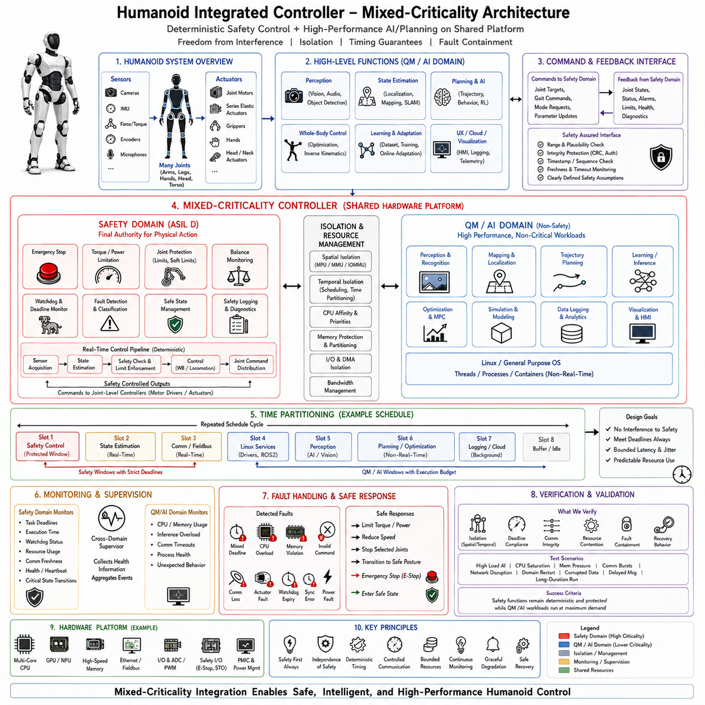
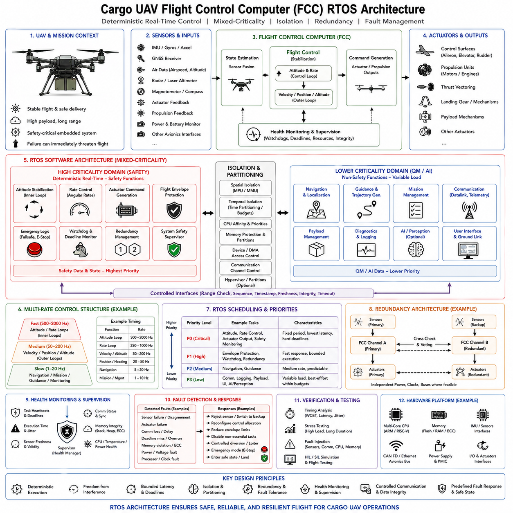
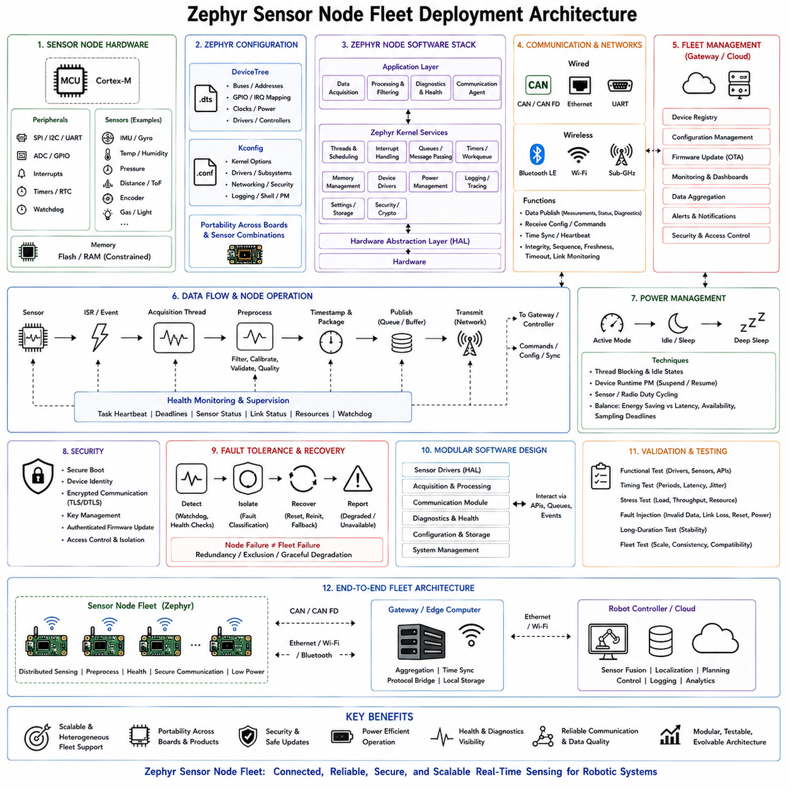
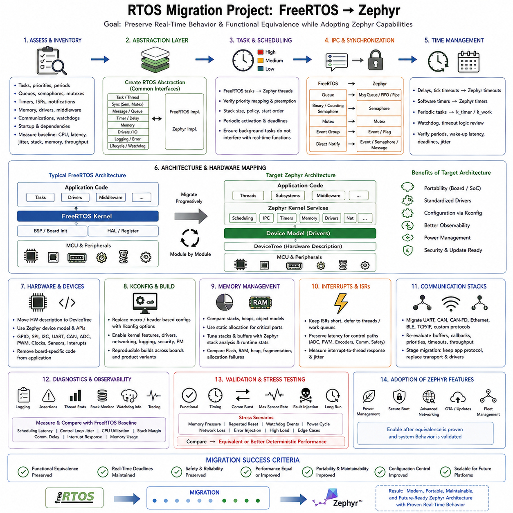
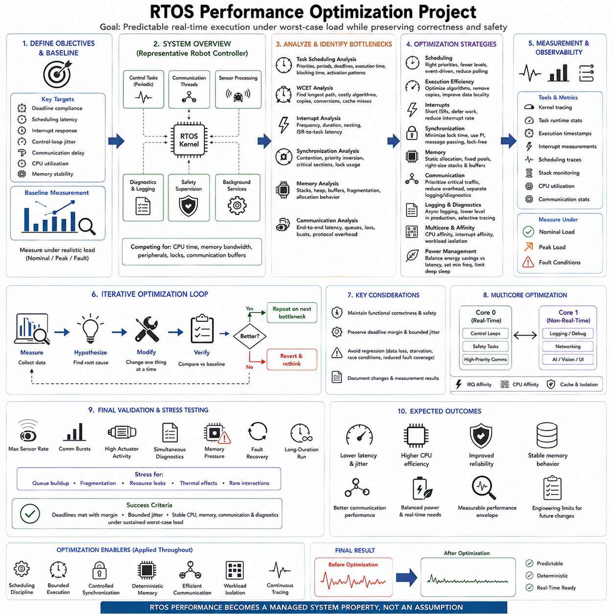
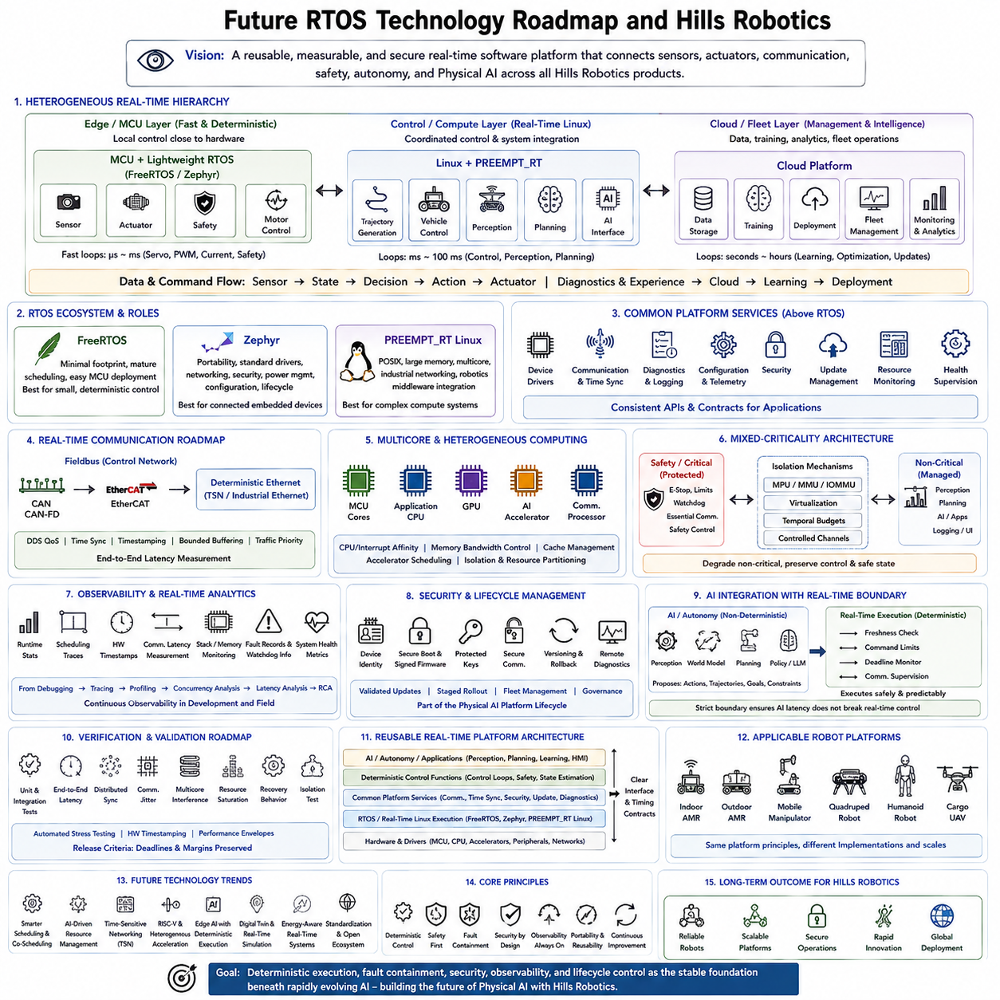

**Volume 03 Real Time Operating Systems**


# 12. RTOS Case Studies

##  

## 12.01 Indoor AMR Drive System: FreeRTOS Case

{width="7.268055555555556in" height="7.268055555555556in"}

An indoor Autonomous Mobile Robot (AMR) drive system is a representative application for demonstrating how FreeRTOS can provide deterministic control at the actuator and drive layer. The software architecture should separate high-frequency motor control from higher-level functions such as perception, localization, planning, and mission management. FreeRTOS is particularly suitable for the MCU-based controller because the drive subsystem has fixed hardware interfaces, constrained memory, and strict timing requirements. The case therefore focuses on deterministic execution, communication, feedback processing, fault handling, and safe motor operation.

The AMR drive controller receives motion commands from a higher-level computer and converts them into controlled wheel motion. Depending on the mechanical configuration, the controller may operate differential-drive, four-wheel, or other drive mechanisms, while the fundamental real-time structure remains similar. The controller interfaces with motor drivers, encoders, current sensors, temperature sensors, brakes, communication transceivers, and safety inputs. Its responsibility is not to perform global navigation or AI inference, but to execute the physical motion command reliably and report accurate state information to the supervisory computer.

The real-time control path begins with sensor acquisition and continues through validation, state estimation, control computation, limiting, and actuator command generation. Encoder feedback provides wheel position and velocity, while current and temperature measurements provide information about actuator loading and thermal conditions. Hardware interrupts should perform only the minimum work required to capture or acknowledge time-critical events and transfer data to appropriate FreeRTOS tasks. This structure prevents excessive interrupt execution from disturbing the periodic control loop and establishes a predictable execution model.

A dedicated servo control task should operate with the highest application priority because missed control deadlines can directly affect vehicle motion. The task executes periodically using a deterministic timing mechanism such as \`vTaskDelayUntil()\`, reads the latest validated sensor state, calculates the required control response, applies velocity and current limits, and updates the motor command. The exact control frequency depends on the motor and drive hardware, but the important design principle is that the period and execution budget are explicitly defined. Control computation must consistently finish before its deadline rather than merely achieving a high average frequency.

Other FreeRTOS tasks can handle communication, diagnostics, configuration, and background processing at lower priorities. A communication task exchanges commands and feedback with the supervisory controller through an appropriate robot communication interface such as CAN or CANopen, depending on the selected drive architecture. It validates received commands, checks freshness and timeout conditions, and publishes wheel state, motor status, and diagnostic information. Diagnostic and configuration tasks should not interfere with the critical control path. This priority hierarchy reflects the different deadlines and criticality of each function.

Inter-task communication should use FreeRTOS synchronization and IPC mechanisms according to the data characteristics. Queues are appropriate when discrete commands or events must be transferred between tasks, while mutexes and semaphores are useful for controlled access to shared resources and synchronization between activities. Time-critical sensor data should avoid unnecessary copying or blocking operations. Shared state must be protected carefully so that a low-priority task cannot create excessive blocking for the high-priority control task. Priority inversion should therefore be considered during resource design.

The drive controller should also implement a clear lifecycle and fault-management strategy. Typical operating states include initialization, disabled, ready, enabled, controlling, stopping, faulted, and recovery. Fault conditions can include encoder failure, excessive motor current, excessive temperature, invalid commands, communication timeout, control-loop overrun, drive faults, and watchdog expiration. Depending on the safety architecture, the response may involve holding the current command, ramping down velocity, disabling torque, activating a brake, or entering a defined safe state. FreeRTOS provides scheduling mechanisms, but the application defines the actual safety behavior.

A watchdog supervisor provides an additional layer of protection against software malfunction. Critical tasks can periodically provide heartbeat information to a supervisor task, which determines whether required activities remain healthy. The watchdog should be refreshed only when the required heartbeats and health conditions have been satisfied. This prevents a single functioning task from masking a failure elsewhere in the control architecture. Control-loop execution time, communication activity, sensor freshness, and critical state-machine conditions can therefore become part of an integrated health-monitoring strategy.

Communication between the AMR\'s higher-level computer and the drive controller should preserve a clear separation of responsibilities. The supervisory computer may generate velocity or trajectory commands using localization, navigation, perception, optimization, or AI functions, while the FreeRTOS controller executes the physical drive response. The communication interface transfers motion intent and returns measured state rather than attempting to move high-level autonomy into the MCU. This separation allows the computationally intensive software platform to evolve independently while preserving a stable deterministic control layer.

Memory management is another important consideration for an embedded AMR drive controller. Because the target environment normally has limited Flash and RAM compared with an edge computer, static allocation or controlled memory strategies are preferable for critical tasks. Dynamic allocation during normal real-time operation can introduce unpredictable execution time and fragmentation risks. Task stacks, queues, buffers, and control-state structures should therefore be dimensioned during system design and validated under representative worst-case workloads. The memory architecture should support deterministic execution rather than optimizing only for average resource utilization.

The final system should be validated as an integrated real-time control platform rather than by checking whether individual FreeRTOS tasks appear to function correctly. Measurements should examine task execution time, control-loop period, scheduling latency, communication delay, interrupt activity, CPU utilization, stack usage, and watchdog behavior under realistic drive loads. Stress testing should include rapid command changes, high motor load, communication loss, sensor faults, thermal conditions, and repeated start-stop operation. The resulting case demonstrates the central role of FreeRTOS in an indoor AMR: it forms the deterministic execution layer that connects supervisory motion intent to reliable, bounded, and fault-aware physical actuation.

실내 자율이동로봇(Autonomous Mobile Robot, AMR)의 구동 시스템(Drive System)은 FreeRTOS가 구동부의 액추에이터(Actuator)와 드라이브 계층(Drive Layer)에서 어떻게 결정론적 제어(Deterministic Control)를 제공할 수 있는지를 보여주는 대표적인 응용 사례이다. 소프트웨어 아키텍처(Software Architecture)는 고주파 모터 제어(High-Frequency Motor Control)와 인지(Perception), 위치 추정(Localization), 경로 계획(Planning), 미션 관리(Mission Management)와 같은 상위 기능을 분리해야 한다. FreeRTOS는 고정된 하드웨어 인터페이스(Hardware Interface), 제한된 메모리, 엄격한 시간 요구사항을 갖는 MCU 기반 제어기(MCU-Based Controller)에 특히 적합하다. 따라서 이 사례는 결정론적 실행(Deterministic Execution), 통신(Communication), 피드백 처리(Feedback Processing), 고장 처리(Fault Handling), 안전한 모터 동작(Safe Motor Operation)에 초점을 둔다.

AMR 구동 제어기(Drive Controller)는 상위 컴퓨터로부터 모션 명령(Motion Command)을 수신하고 이를 제어된 휠 동작(Wheel Motion)으로 변환한다. 기계적 구성에 따라 제어기는 차동 구동(Differential Drive), 4륜 구동(Four-Wheel Drive) 또는 기타 구동 메커니즘을 제어할 수 있지만, 기본적인 실시간 구조(Real-Time Structure)는 유사하다. 제어기는 모터 드라이버(Motor Driver), 엔코더(Encoder), 전류 센서(Current Sensor), 온도 센서(Temperature Sensor), 브레이크(Brake), 통신 트랜시버(Communication Transceiver), 안전 입력(Safety Input)과 인터페이스한다. 제어기의 책임은 전역 내비게이션(Global Navigation)이나 AI 추론(AI Inference)을 수행하는 것이 아니라, 물리적 모션 명령을 신뢰성 있게 실행하고 정확한 상태 정보를 상위 감독 컴퓨터(Supervisory Computer)에 전달하는 것이다.

실시간 제어 경로(Real-Time Control Path)는 센서 획득(Sensor Acquisition)에서 시작하여 검증(Validation), 상태 추정(State Estimation), 제어 계산(Control Computation), 제한(Limiting), 액추에이터 명령 생성(Actuator Command Generation)으로 이어진다. 엔코더 피드백(Encoder Feedback)은 휠 위치(Wheel Position)와 속도(Velocity)를 제공하고, 전류 및 온도 측정(Current and Temperature Measurement)은 액추에이터 부하(Actuator Load)와 열 상태(Thermal Condition)에 대한 정보를 제공한다. 하드웨어 인터럽트(Hardware Interrupt)는 시간에 민감한 이벤트(Time-Critical Event)를 캡처하거나 확인하고 데이터를 적절한 FreeRTOS 태스크(FreeRTOS Task)로 전달하는 데 필요한 최소한의 작업만 수행해야 한다. 이러한 구조는 과도한 인터럽트 실행이 주기적인 제어 루프(Periodic Control Loop)를 방해하는 것을 방지하고 예측 가능한 실행 모델(Predictable Execution Model)을 확립한다.

전용 서보 제어 태스크(Dedicated Servo Control Task)는 가장 높은 애플리케이션 우선순위(Application Priority)로 동작해야 한다. 제어 데드라인(Control Deadline)을 놓치는 것은 로봇의 실제 움직임에 직접적인 영향을 줄 수 있기 때문이다. 이 태스크는 \`vTaskDelayUntil()\`과 같은 결정론적 타이밍 메커니즘(Deterministic Timing Mechanism)을 사용하여 주기적으로 실행되고, 최신의 검증된 센서 상태(Validated Sensor State)를 읽으며, 필요한 제어 응답(Control Response)을 계산하고, 속도 및 전류 제한(Velocity and Current Limits)을 적용한 후 모터 명령(Motor Command)을 갱신한다. 정확한 제어 주파수(Control Frequency)는 모터와 구동 하드웨어에 따라 달라지지만, 중요한 설계 원칙은 주기(Period)와 실행 예산(Execution Budget)을 명확하게 정의하는 것이다. 제어 계산(Control Computation)은 단순히 평균적으로 높은 주파수를 달성하는 것이 아니라, 항상 데드라인 이전에 완료되어야 한다.

다른 FreeRTOS 태스크는 통신(Communication), 진단(Diagnostics), 구성(Configuration), 백그라운드 처리(Background Processing)를 더 낮은 우선순위로 처리할 수 있다. 통신 태스크(Communication Task)는 선택된 구동 아키텍처에 따라 CAN 또는 CANopen과 같은 적절한 로봇 통신 인터페이스(Robot Communication Interface)를 통해 상위 제어기와 명령 및 피드백을 교환한다. 이 태스크는 수신된 명령을 검증하고, 최신성(Timeout/Freshness) 조건을 확인하며, 휠 상태(Wheel State), 모터 상태(Motor Status), 진단 정보를 전달한다. 진단 및 구성 태스크는 중요한 제어 경로(Critical Control Path)를 방해해서는 안 된다. 이러한 우선순위 구조(Priority Hierarchy)는 각 기능의 서로 다른 데드라인과 중요도(Criticality)를 반영한다.

태스크 간 통신(Inter-Task Communication)은 데이터의 특성에 따라 FreeRTOS의 동기화(Synchronization) 및 IPC 메커니즘(IPC Mechanism)을 사용해야 한다. 큐(Queue)는 개별 명령이나 이벤트를 태스크 사이에서 전달할 때 적합하고, 뮤텍스(Mutex)와 세마포어(Semaphore)는 공유 자원(Shared Resource)에 대한 접근을 제어하거나 태스크 간 동기화에 사용할 수 있다. 시간에 민감한 센서 데이터(Time-Critical Sensor Data)는 불필요한 복사나 블로킹(Blocking)을 피해야 한다. 공유 상태(Shared State)는 낮은 우선순위 태스크가 높은 우선순위 제어 태스크를 과도하게 블로킹하지 않도록 신중하게 보호해야 한다. 따라서 자원 설계(Resource Design) 단계에서 우선순위 역전(Priority Inversion)을 고려해야 한다.

구동 제어기는 명확한 생명주기(Lifecycle)와 고장 관리 전략(Fault Management Strategy)도 구현해야 한다. 일반적인 동작 상태는 초기화(Initialization), 비활성(Disabled), 준비(Ready), 활성(Enabled), 제어 중(Controlling), 정지(Stopping), 고장(Faulted), 복구(Recovery) 등으로 구성될 수 있다. 고장 조건에는 엔코더 고장(Encoder Failure), 과전류(Excessive Motor Current), 과열(Excessive Temperature), 잘못된 명령(Invalid Command), 통신 타임아웃(Communication Timeout), 제어 루프 오버런(Control-Loop Overrun), 드라이브 고장(Drive Fault), 워치독 만료(Watchdog Expiration) 등이 포함될 수 있다. 안전 아키텍처(Safety Architecture)에 따라 대응은 현재 명령 유지, 속도 감소(Ramp-Down), 토크 비활성화(Torque Disable), 브레이크 활성화(Brake Activation), 정의된 안전 상태(Safe State) 진입 등의 방식으로 이루어질 수 있다. FreeRTOS는 스케줄링 메커니즘(Scheduling Mechanism)을 제공하지만 실제 안전 동작(Safety Behavior)은 애플리케이션이 정의한다.

워치독 감독기(Watchdog Supervisor)는 소프트웨어 오작동(Software Malfunction)에 대한 추가적인 보호 계층(Protection Layer)을 제공한다. 중요한 태스크는 주기적으로 하트비트(Heartbeat) 정보를 감독 태스크(Supervisor Task)에 전달하고, 감독 태스크는 필요한 활동이 정상적으로 유지되는지를 판단한다. 워치독(Watchdog)은 필요한 하트비트와 상태 조건이 모두 만족되었을 때에만 갱신되어야 한다. 이를 통해 하나의 정상적으로 동작하는 태스크가 시스템의 다른 고장을 은폐하는 것을 방지할 수 있다. 제어 루프 실행 시간(Control-Loop Execution Time), 통신 활동(Communication Activity), 센서 최신성(Sensor Freshness), 핵심 상태 머신 조건(Critical State-Machine Conditions)을 통합된 상태 감시 전략(Health-Monitoring Strategy)의 일부로 포함할 수 있다.

AMR의 상위 컴퓨터와 구동 제어기 사이의 통신은 명확한 책임 분리를 유지해야 한다. 감독 컴퓨터(Supervisory Computer)는 위치 추정(Localization), 내비게이션(Navigation), 인지(Perception), 최적화(Optimization), AI 기능 등을 이용하여 속도 또는 궤적 명령(Velocity or Trajectory Command)을 생성할 수 있으며, FreeRTOS 제어기는 실제 구동 응답(Physical Drive Response)을 실행한다. 통신 인터페이스는 고수준 자율성(High-Level Autonomy)을 MCU에 이전하려 하기보다는 모션 의도(Motion Intent)와 측정된 상태(Measured State)를 전달하는 역할을 수행한다. 이러한 분리를 통해 계산량이 큰 소프트웨어 플랫폼을 발전시키면서도 안정적이고 결정론적인 제어 계층(Deterministic Control Layer)은 독립적으로 유지할 수 있다.

메모리 관리(Memory Management) 역시 임베디드 AMR 구동 제어기에서 중요한 고려사항이다. 대상 환경은 일반적으로 엣지 컴퓨터(Edge Computer)에 비해 Flash와 RAM이 제한적이므로 중요한 태스크에는 정적 할당(Static Allocation) 또는 제어된 메모리 전략(Controlled Memory Strategy)이 선호된다. 정상적인 실시간 동작 중 동적 메모리 할당(Dynamic Memory Allocation)은 예측하기 어려운 실행 시간과 메모리 단편화(Memory Fragmentation) 위험을 발생시킬 수 있다. 따라서 태스크 스택(Task Stack), 큐(Queue), 버퍼(Buffer), 제어 상태 구조(Control-State Structure)는 시스템 설계 단계에서 크기를 결정하고 대표적인 최악 조건 부하(Worst-Case Workload)에서 검증해야 한다. 메모리 아키텍처(Memory Architecture)는 평균적인 자원 사용률만 최적화하기보다는 결정론적 실행(Deterministic Execution)을 지원해야 한다.

최종 시스템은 개별 FreeRTOS 태스크가 정상적으로 동작하는지를 확인하는 수준을 넘어, 통합된 실시간 제어 플랫폼(Integrated Real-Time Control Platform)으로 검증되어야 한다. 측정 항목에는 태스크 실행 시간(Task Execution Time), 제어 루프 주기(Control-Loop Period), 스케줄링 지연(Scheduling Latency), 통신 지연(Communication Delay), 인터럽트 활동(Interrupt Activity), CPU 사용률(CPU Utilization), 스택 사용량(Stack Usage), 워치독 동작(Watchdog Behavior) 등이 포함되어야 한다. 스트레스 테스트(Stress Testing)는 실제 구동 부하에서의 빠른 명령 변경, 높은 모터 부하, 통신 손실, 센서 고장, 열 조건, 반복적인 시작 및 정지 동작을 포함해야 한다. 이러한 사례는 실내 AMR에서 FreeRTOS의 핵심 역할을 보여준다. 즉, FreeRTOS는 상위 시스템의 감독적 모션 의도(Supervisory Motion Intent)를 신뢰성 있고 제한된 시간 내에 실행되며 고장에 대응할 수 있는 실제 물리적 구동(Physical Actuation)으로 연결하는 결정론적 실행 계층(Deterministic Execution Layer)을 형성한다.

##  

## 12.02 Outdoor AMR PREEMPT RT Drive Control Case

{width="7.268055555555556in" height="7.268055555555556in"}

An outdoor Autonomous Mobile Robot (AMR) drive-control system places stronger real-time demands on the computing platform than a typical indoor drive system because it must operate under variable terrain, vibration, temperature, communication conditions, and actuator loads. This case uses Linux with PREEMPT_RT as the real-time control platform for the drive-control layer. The architecture separates high-level autonomy from deterministic motion execution, allowing perception, localization, navigation, and AI workloads to coexist with time-sensitive control functions while preserving predictable control behavior.

The outdoor AMR receives motion commands from a higher-level computer responsible for perception, localization, navigation, planning, and mission execution. These commands may contain target velocity, steering, torque, enable state, or other motion parameters. The PREEMPT_RT control computer converts this motion intent into timely commands for the motor controllers and continuously receives feedback such as actual velocity, steering position, motor current, temperature, bus voltage, and drive status. This separation prevents high-level computation from directly determining actuator timing.

The real-time control architecture should use multiple control rates according to the physical dynamics of the system. Fast current or torque regulation is normally handled inside the motor drive or MCU, while the PREEMPT_RT computer performs a slower but still deterministic vehicle-level control loop. A control loop around 1 kHz can be used when the hardware and communication architecture require it, while velocity, steering, coordination, and supervisory functions can execute at lower rates. This multi-rate design prevents computationally expensive functions from unnecessarily entering the fastest control path.

PREEMPT_RT provides the kernel foundation required for deterministic execution on a general-purpose Linux platform. Real-time threads can use scheduling policies such as SCHED_FIFO, while high-resolution timers and threaded interrupt handling reduce uncontrolled scheduling latency. CPU affinity and IRQ affinity can isolate the most important control thread from unrelated processing. Memory locking and controlled allocation further reduce the possibility that paging, memory faults, or resource contention will introduce unexpected delays. The kernel provides the real-time mechanisms, but application architecture must establish the actual timing guarantees.

The main control thread should acquire the latest vehicle state, process communication input, execute the control algorithm, apply physical and safety limits, and transmit updated commands within a bounded execution window. For a 1 ms cycle, every operation required by that cycle must complete before the deadline, leaving sufficient margin for variation. The design should therefore avoid unnecessary blocking, uncontrolled dynamic allocation, long critical sections, and computationally unpredictable operations. Worst-case execution time is more important than average execution time when determining whether the architecture is genuinely real-time.

Outdoor operation makes sensor and actuator feedback particularly important. Wheel encoders, steering encoders, motor-current measurements, bus-voltage measurements, motor and inverter temperatures, limit switches, and safety inputs provide the information required to maintain controlled motion. Terrain variation can increase wheel slip and motor load, while slopes and payload changes can alter the required torque. The control layer must therefore validate incoming measurements, detect abnormal conditions, and prevent invalid sensor values from propagating into actuator commands.

Communication must also be treated as part of the real-time control chain. CAN, CAN-FD, EtherCAT, or industrial Ethernet may be used according to the drive architecture, with the selected interface carrying motion commands and returning status and telemetry. Message validation should include identifiers, range checks, sequence information, CRC where applicable, and timeout supervision. A communication failure must not leave the robot indefinitely executing an obsolete command. The control system should detect stale commands and transition toward a predefined safe response.

The drive-control software should contain an explicit state machine covering initialization, self-test, disabled, ready, enabled, running, stopping, fault, and recovery conditions. Transitions should be controlled by validated commands, safety inputs, feedback conditions, and fault logic rather than by individual application threads. Faults may include encoder failure, overcurrent, excessive temperature, invalid commands, communication timeout, drive faults, or control-loop overruns. Depending on the safety concept, the system can hold a command, ramp down velocity, disable torque, activate braking, or enter a defined safe state.

Watchdog supervision provides an additional protection mechanism for the real-time platform. Critical control activities should expose health information such as heartbeat status, loop completion, communication freshness, and fault state. A supervisor can determine whether the control system remains healthy and initiate recovery when required. The watchdog should not simply confirm that the operating system is alive; it should provide evidence that the critical control functions are actually progressing within their expected timing and operational conditions.

The outdoor AMR architecture must also account for the coexistence of real-time control with non-real-time workloads. Perception, AI inference, logging, visualization, fleet communication, diagnostics, and data recording may generate significant CPU, memory, storage, and network activity. PREEMPT_RT does not automatically make all such workloads deterministic. The architecture should therefore isolate critical threads, assign appropriate priorities, reserve computational resources, control interrupt placement, lock critical memory, and prevent background workloads from consuming the resources required by the control loop.

Validation must measure the complete timing chain rather than relying on nominal CPU utilization or average loop frequency. Important measurements include control-loop period, scheduling latency, execution-time variation, communication delay, interrupt activity, CPU utilization, memory behavior, and recovery response. Tools such as cyclictest, ftrace, perf, and LTTng can be used to investigate Linux real-time behavior and identify sources of jitter. Stress testing should include high computational load, communication traffic, sensor faults, actuator faults, terrain changes, thermal conditions, and repeated acceleration and braking.

The resulting architecture establishes PREEMPT_RT as a bridge between flexible Linux-based robotic computing and deterministic physical motion control. High-level autonomy can evolve independently through perception, localization, planning, AI, and fleet functions, while the real-time layer maintains bounded execution for vehicle control. The case demonstrates that deterministic behavior is not achieved simply by installing PREEMPT_RT; it emerges from the combined design of scheduling, CPU and IRQ affinity, memory management, communication, control timing, fault handling, and systematic validation. This makes PREEMPT_RT particularly suitable for an outdoor AMR platform requiring both computational flexibility and reliable real-time drive control.

실외 자율이동로봇(Autonomous Mobile Robot, AMR)의 구동 제어 시스템(Drive-Control System)은 일반적인 실내 구동 시스템보다 더 강한 실시간 요구사항(Real-Time Requirements)을 갖는다. 이는 다양한 지형(Terrain), 진동(Vibration), 온도(Temperature), 통신 조건(Communication Conditions), 액추에이터 부하(Actuator Loads)에서 동작해야 하기 때문이다. 이 사례에서는 Linux와 PREEMPT_RT를 구동 제어 계층(Drive-Control Layer)의 실시간 플랫폼(Real-Time Platform)으로 사용한다. 아키텍처는 상위 자율 기능(High-Level Autonomy)과 결정론적 모션 실행(Deterministic Motion Execution)을 분리하여, 인지(Perception), 위치 추정(Localization), 내비게이션(Navigation), AI 작업부하(AI Workload)가 시간 민감형 제어 기능(Time-Sensitive Control Functions)과 공존하면서도 예측 가능한 제어 동작을 유지하도록 한다.

실외 AMR은 인지(Perception), 위치 추정(Localization), 내비게이션(Navigation), 경로 계획(Planning), 미션 실행(Mission Execution)을 담당하는 상위 컴퓨터(High-Level Computer)로부터 모션 명령(Motion Command)을 수신한다. 이러한 명령에는 목표 속도(Target Velocity), 조향(Steering), 토크(Torque), 활성화 상태(Enable State) 또는 기타 모션 파라미터(Motion Parameters)가 포함될 수 있다. PREEMPT_RT 제어 컴퓨터(Control Computer)는 이러한 모션 의도(Motion Intent)를 모터 제어기(Motor Controller)에 전달할 적절한 명령으로 변환하고, 실제 속도(Actual Velocity), 조향 위치(Steering Position), 모터 전류(Motor Current), 온도(Temperature), 버스 전압(Bus Voltage), 드라이브 상태(Drive Status) 등의 피드백을 지속적으로 수신한다. 이러한 분리를 통해 상위 수준의 계산이 액추에이터 타이밍(Actuator Timing)을 직접 결정하는 것을 방지할 수 있다.

실시간 제어 아키텍처(Real-Time Control Architecture)는 시스템의 물리적 동역학(Physical Dynamics)에 따라 여러 제어 주기(Control Rate)를 사용해야 한다. 빠른 전류 또는 토크 제어(Current or Torque Regulation)는 일반적으로 모터 드라이브(Motor Drive) 또는 MCU 내부에서 처리하고, PREEMPT_RT 컴퓨터는 보다 느리지만 여전히 결정론적인 차량 수준 제어 루프(Vehicle-Level Control Loop)를 수행한다. 하드웨어와 통신 아키텍처가 요구하는 경우 약 1 kHz의 제어 루프를 사용할 수 있으며, 속도(Velocity), 조향(Steering), 협조 제어(Coordination), 감독 기능(Supervisory Functions)은 더 낮은 주파수에서 실행할 수 있다. 이러한 다중 주기 설계(Multi-Rate Design)는 계산량이 큰 기능이 가장 빠른 제어 경로에 불필요하게 포함되는 것을 방지한다.

PREEMPT_RT는 범용 Linux 플랫폼에서 결정론적 실행(Deterministic Execution)을 구현하는 데 필요한 커널 기반(Kernel Foundation)을 제공한다. 실시간 스레드(Real-Time Thread)는 SCHED_FIFO와 같은 스케줄링 정책(Scheduling Policy)을 사용할 수 있으며, 고해상도 타이머(High-Resolution Timer)와 스레드화된 인터럽트 처리(Threaded Interrupt Handling)는 제어되지 않는 스케줄링 지연(Scheduling Latency)을 감소시킨다. CPU 선호도(CPU Affinity)와 IRQ 선호도(IRQ Affinity)를 사용하면 가장 중요한 제어 스레드를 관련 없는 처리 작업으로부터 격리할 수 있다. 메모리 잠금(Memory Locking)과 제어된 메모리 할당(Controlled Allocation)은 페이징(Paging), 메모리 폴트(Memory Fault), 자원 경합(Resource Contention)이 예기치 않은 지연을 발생시키는 가능성을 추가로 줄인다. 커널은 실시간 메커니즘을 제공하지만 실제 시간 보장은 애플리케이션 아키텍처가 설정해야 한다.

주요 제어 스레드(Main Control Thread)는 최신 차량 상태(Vehicle State)를 획득하고, 통신 입력(Communication Input)을 처리하며, 제어 알고리즘(Control Algorithm)을 실행하고, 물리적 및 안전 제한(Physical and Safety Limits)을 적용한 후, 제한된 실행 시간 내에 갱신된 명령을 전송해야 한다. 1 ms 주기를 사용하는 경우 해당 주기에 필요한 모든 작업이 데드라인(Deadline) 이전에 완료되어야 하며, 실행 시간 변동(Execution-Time Variation)을 위한 충분한 여유도 확보해야 한다. 따라서 불필요한 블로킹(Blocking), 제어되지 않은 동적 메모리 할당(Dynamic Memory Allocation), 긴 임계 구역(Long Critical Section), 계산 시간이 예측하기 어려운 연산(Computationally Unpredictable Operation)을 피해야 한다. 아키텍처가 진정한 실시간 시스템인지를 판단할 때에는 평균 실행 시간보다 최악 실행 시간(Worst-Case Execution Time)이 더 중요하다.

실외 환경에서는 센서와 액추에이터 피드백(Sensor and Actuator Feedback)이 특히 중요하다. 휠 엔코더(Wheel Encoder), 조향 엔코더(Steering Encoder), 모터 전류 측정(Motor-Current Measurement), 버스 전압 측정(Bus-Voltage Measurement), 모터 및 인버터 온도(Motor and Inverter Temperature), 리미트 스위치(Limit Switch), 안전 입력(Safety Input)은 제어된 움직임을 유지하는 데 필요한 정보를 제공한다. 지형 변화(Terrain Variation)는 휠 슬립(Wheel Slip)과 모터 부하(Motor Load)를 증가시킬 수 있으며, 경사와 탑재 하중(Slope and Payload)은 필요한 토크를 변화시킬 수 있다. 따라서 제어 계층(Control Layer)은 입력 측정값을 검증하고, 비정상 조건을 감지하며, 잘못된 센서 값이 액추에이터 명령으로 전달되는 것을 방지해야 한다.

통신(Communication) 역시 실시간 제어 체인(Real-Time Control Chain)의 일부로 취급해야 한다. 구동 아키텍처에 따라 CAN, CAN-FD, EtherCAT 또는 산업용 이더넷(Industrial Ethernet)을 사용할 수 있으며, 선택된 인터페이스는 모션 명령을 전달하고 상태 및 텔레메트리(Telemetry)를 반환한다. 메시지 검증(Message Validation)에는 식별자(Identifier), 범위 검사(Range Check), 시퀀스 정보(Sequence Information), 필요한 경우 CRC, 그리고 타임아웃 감시(Timeout Supervision)가 포함되어야 한다. 통신 장애가 발생했을 때 로봇이 오래된 명령(Obsolete Command)을 무기한 실행하도록 해서는 안 된다. 제어 시스템은 오래되거나 유효하지 않은 명령을 감지하고 사전에 정의된 안전 응답(Safe Response)으로 전환해야 한다.

구동 제어 소프트웨어(Drive-Control Software)는 초기화(Initialization), 자체 테스트(Self-Test), 비활성(Disabled), 준비(Ready), 활성화(Enabled), 주행(Running), 정지(Stopping), 고장(Fault), 복구(Recovery) 조건을 포함하는 명시적인 상태 머신(State Machine)을 가져야 한다. 상태 전이는 개별 애플리케이션 스레드가 아니라 검증된 명령(Validated Command), 안전 입력(Safety Input), 피드백 조건(Feedback Condition), 고장 로직(Fault Logic)에 의해 제어되어야 한다. 고장에는 엔코더 고장(Encoder Failure), 과전류(Overcurrent), 과도한 온도(Excessive Temperature), 잘못된 명령(Invalid Command), 통신 타임아웃(Communication Timeout), 드라이브 고장(Drive Fault), 제어 루프 오버런(Control-Loop Overrun) 등이 포함될 수 있다. 안전 개념(Safety Concept)에 따라 시스템은 명령 유지(Hold Command), 속도 감소(Ramp Down Velocity), 토크 비활성화(Disable Torque), 제동 활성화(Activate Braking), 정의된 안전 상태(Safe State) 진입 등의 동작을 수행할 수 있다.

워치독 감독(Watchdog Supervision)은 실시간 플랫폼(Real-Time Platform)에 추가적인 보호 메커니즘(Protection Mechanism)을 제공한다. 중요한 제어 활동(Critical Control Activity)은 하트비트 상태(Heartbeat Status), 루프 완료(Loop Completion), 통신 최신성(Communication Freshness), 고장 상태(Fault State)와 같은 상태 정보를 제공해야 한다. 감독기는 제어 시스템이 정상 상태를 유지하는지를 판단하고 필요한 경우 복구(Recovery)를 시작할 수 있다. 워치독은 단순히 운영체제(Operating System)가 살아 있는지만 확인해서는 안 된다. 중요한 제어 기능이 예상된 시간과 동작 조건 내에서 실제로 진행되고 있다는 증거를 제공해야 한다.

실외 AMR 아키텍처는 실시간 제어(Real-Time Control)와 비실시간 작업부하(Non-Real-Time Workload)의 공존도 고려해야 한다. 인지(Perception), AI 추론(AI Inference), 로깅(Logging), 시각화(Visualization), 플릿 통신(Fleet Communication), 진단(Diagnostics), 데이터 기록(Data Recording)은 상당한 CPU, 메모리, 저장장치, 네트워크 자원을 사용할 수 있다. PREEMPT_RT가 이러한 모든 작업부하를 자동으로 결정론적으로 만들어 주는 것은 아니다. 따라서 아키텍처는 중요 스레드를 격리하고, 적절한 우선순위를 할당하며, 계산 자원을 예약하고, 인터럽트 배치를 제어하고, 중요한 메모리를 잠그며, 백그라운드 작업이 제어 루프에 필요한 자원을 소비하지 못하도록 해야 한다.

검증(Validation)은 평균적인 CPU 사용률이나 평균 루프 주파수에 의존하지 않고 전체 타이밍 체인(Complete Timing Chain)을 측정해야 한다. 중요한 측정 항목에는 제어 루프 주기(Control-Loop Period), 스케줄링 지연(Scheduling Latency), 실행 시간 변동(Execution-Time Variation), 통신 지연(Communication Delay), 인터럽트 활동(Interrupt Activity), CPU 사용률(CPU Utilization), 메모리 동작(Memory Behavior), 복구 응답(Recovery Response)이 포함된다. cyclictest, ftrace, perf, LTTng와 같은 도구를 사용하여 Linux 실시간 동작을 조사하고 지터(Jitter)의 원인을 분석할 수 있다. 스트레스 테스트(Stress Testing)는 높은 계산 부하, 통신 트래픽, 센서 고장, 액추에이터 고장, 지형 변화, 열 조건, 반복적인 가속 및 제동을 포함해야 한다.

이러한 아키텍처는 PREEMPT_RT를 유연한 Linux 기반 로봇 컴퓨팅(Flexible Linux-Based Robotic Computing)과 결정론적인 물리적 모션 제어(Deterministic Physical Motion Control) 사이를 연결하는 계층으로 확립한다. 상위 자율 기능은 인지, 위치 추정, 경로 계획, AI, 플릿 기능을 통해 독립적으로 발전할 수 있으며, 실시간 계층은 차량 제어를 위해 제한된 실행 시간을 유지한다. 이 사례는 결정론적 동작이 단순히 PREEMPT_RT를 설치한다고 달성되는 것이 아니라, 스케줄링(Scheduling), CPU 및 IRQ 선호도, 메모리 관리(Memory Management), 통신(Communication), 제어 타이밍(Control Timing), 고장 처리(Fault Handling), 체계적인 검증(Systematic Validation)을 통합적으로 설계함으로써 달성된다는 것을 보여준다. 이러한 특성은 계산 유연성과 신뢰성 높은 실시간 구동 제어를 동시에 요구하는 실외 AMR 플랫폼에 PREEMPT_RT가 적합하도록 만든다.

##  

## 12.03 Mobile Manipulator EtherCAT Master RTOS Case

{width="7.268055555555556in" height="7.268055555555556in"}

A mobile manipulator combines a mobile base with an articulated manipulator, creating a control problem in which locomotion and manipulation must operate as one coordinated physical system. An EtherCAT Master running on a real-time controller provides a suitable communication and synchronization layer for this architecture. The master can coordinate wheel drives, steering actuators, manipulator joint drives, gripper controllers, and safety I/O through deterministic cyclic process-data exchange. The case therefore focuses on real-time communication, multi-axis synchronization, control-cycle coordination, and fault-aware operation.

The main controller typically runs a real-time operating environment such as Linux with PREEMPT_RT and hosts the EtherCAT Master application. Higher-level functions such as motion planning, trajectory generation, AI, navigation, diagnostics, and operator interfaces remain above the real-time control layer. The EtherCAT Master receives motion objectives and converts them into coordinated setpoints for the distributed devices. Feedback from the drives and I/O devices is returned to the controller, allowing the application to maintain a consistent representation of wheel, steering, joint, gripper, and safety states.

The EtherCAT network connects multiple slave devices through a deterministic real-time fieldbus. Typical slaves in a mobile manipulator include wheel-drive servo amplifiers, steering actuators, manipulator joint drives, gripper controllers, safety I/O modules, and additional sensors. EtherCAT frames pass through the slaves while each device reads or modifies the process data intended for it. This on-the-fly processing reduces unnecessary communication overhead and allows many axes and I/O devices to participate in a common control cycle without requiring an independent communication transaction for every device.

The EtherCAT Master software is organized around several closely related functions. The master core manages network access and cyclic communication, while network management discovers and configures slaves and verifies the expected topology. PDO mapping defines which process variables are exchanged cyclically, while SDO or mailbox services support configuration, parameter access, and diagnostics. Distributed Clock management provides precise time synchronization, and diagnostic services monitor network conditions, counters, slave states, latency, and jitter. These functions together form the software foundation for deterministic multi-axis control.

Process Data Objects (PDOs) form the primary real-time data path between the master and the slaves. Output PDOs can contain control words, operating modes, target positions, target velocities, target torques, and other commands. Input PDOs can contain status words, actual positions, actual velocities, torque feedback, and error information. PDO mapping places these variables into the controller\'s process image so that the real-time task can read feedback and write commands efficiently. Careful mapping reduces frame size and network load while supporting predictable cycle execution.

The central execution mechanism is a cyclic real-time task that repeatedly performs the communication-control sequence. The controller first reads the latest input image, processes feedback, and executes the required control algorithms. It then updates the output image with new commands and initiates the EtherCAT communication cycle. The EtherCAT frame passes through the distributed slaves, collecting and updating process data before returning to the master. The next cycle reads the returned feedback and computes the following commands. This continuous loop establishes the timing relationship between computation, communication, and actuation.

Distributed Clocks (DC) are particularly important when the mobile base and manipulator must move together. Communication timing alone does not guarantee that individual devices apply their commands at exactly the same physical instant because propagation delays and local clock differences remain. EtherCAT DC synchronizes the clocks of the distributed devices to a common high-precision time base. Synchronization events such as SYNC0 can then define when outputs are applied, allowing multiple wheel and manipulator axes to execute coordinated commands at a common execution point.

The control hierarchy should remain multi-rate rather than forcing every function to operate at the EtherCAT cycle frequency. High-level trajectory and motion planning can operate at relatively low rates, while the EtherCAT Master executes cyclic command and feedback exchange at an intermediate real-time rate. Individual servo drives can perform their local current, velocity, and position loops at much higher rates. This hierarchy allows the master to distribute coordinated setpoints while leaving the fastest physical control loops close to the motors. Such separation reduces computational burden and preserves deterministic timing.

Real-time scheduling on the master controller must be coordinated with the EtherCAT cycle. The communication and control task should receive appropriate real-time priority and should avoid unnecessary blocking, uncontrolled dynamic memory allocation, and unpredictable operations. CPU affinity and memory locking can isolate critical processing, while appropriate interrupt handling reduces interference from unrelated workloads. The objective is bounded jitter, low communication latency, and stable cycle execution rather than simply achieving a high average CPU performance. The real-time operating system and EtherCAT architecture must therefore be designed as one timing system.

Fault handling must be integrated directly into the EtherCAT Master rather than treated as an external diagnostic function. Communication loss, slave-device faults, invalid process data, Distributed Clock synchronization errors, drive faults, and missed cycles can all affect coordinated motion. The master should detect these conditions within a bounded time and apply an appropriate protective response, such as controlled deceleration, torque disable, transition to a safe state, or alarm notification. Slave-state transitions should also be monitored so that the master does not assume that a device is operational simply because network communication remains available.

Performance verification must evaluate the complete timing chain from sensing and feedback availability through control computation, command transmission, and physical actuation. Important measurements include EtherCAT cycle time, scheduling latency, communication latency, control-loop jitter, Distributed Clock deviation, SYNC0 timing accuracy, Working Counter behavior, CPU load, and missed cycles. Hardware timestamping, network diagnostics, drive feedback, and tracing can provide evidence of actual system behavior. Validation should include high communication loads, multiple simultaneous axis movements, synchronization disturbances, drive faults, and repeated coordinated motion to verify deterministic performance under realistic conditions.

The resulting mobile-manipulator architecture establishes the EtherCAT Master as the deterministic coordination layer between high-level robot intelligence and distributed physical actuators. The mobile base and manipulator can retain their own local servo loops while receiving synchronized setpoints from a common real-time process-data cycle. Distributed Clocks provide a shared execution reference, PDOs provide efficient cyclic data exchange, and the real-time scheduler maintains bounded execution of the master task. Together, these mechanisms enable coordinated locomotion and manipulation with low latency, precise synchronization, predictable timing, and fault-aware operation.

이동형 매니퓰레이터(Mobile Manipulator)는 이동 플랫폼(Mobile Base)과 다관절 매니퓰레이터(Articulated Manipulator)를 결합한 시스템으로, 이동과 조작이 하나의 통합된 물리 시스템으로 동작해야 하는 제어 문제를 만든다. 실시간 제어기(Real-Time Controller)에서 실행되는 EtherCAT 마스터(EtherCAT Master)는 이러한 아키텍처에 적합한 통신 및 동기화 계층(Communication and Synchronization Layer)을 제공한다. 마스터는 결정론적인 주기적 프로세스 데이터 교환(Deterministic Cyclic Process-Data Exchange)을 통해 휠 드라이브(Wheel Drive), 조향 액추에이터(Steering Actuator), 매니퓰레이터 관절 드라이브(Manipulator Joint Drive), 그리퍼 제어기(Gripper Controller), 안전 I/O(Safety I/O)를 조정할 수 있다. 따라서 이 사례는 실시간 통신(Real-Time Communication), 다축 동기화(Multi-Axis Synchronization), 제어 주기 조정(Control-Cycle Coordination), 고장 인지 운용(Fault-Aware Operation)에 초점을 둔다.

주 제어기(Main Controller)는 일반적으로 PREEMPT_RT를 적용한 Linux와 같은 실시간 운영 환경(Real-Time Operating Environment)을 실행하며 EtherCAT 마스터 애플리케이션(EtherCAT Master Application)을 구동한다. 모션 계획(Motion Planning), 궤적 생성(Trajectory Generation), AI, 내비게이션(Navigation), 진단(Diagnostics), 운용자 인터페이스(Operator Interface)와 같은 상위 기능은 실시간 제어 계층(Real-Time Control Layer)보다 상위에 유지된다. EtherCAT 마스터는 모션 목표(Motion Objective)를 수신하고 이를 분산 장치(Distributed Device)에 대한 조정된 설정값(Coordinated Setpoint)으로 변환한다. 드라이브와 I/O 장치에서 전달되는 피드백은 제어기로 반환되며, 이를 통해 애플리케이션은 휠, 조향, 관절, 그리퍼 및 안전 상태에 대한 일관된 표현을 유지할 수 있다.

EtherCAT 네트워크는 결정론적인 실시간 필드버스(Deterministic Real-Time Fieldbus)를 통해 여러 슬레이브 장치(Slave Device)를 연결한다. 이동형 매니퓰레이터의 일반적인 슬레이브에는 휠 구동 서보 앰프(Wheel-Drive Servo Amplifier), 조향 액추에이터(Steering Actuator), 매니퓰레이터 관절 드라이브(Manipulator Joint Drive), 그리퍼 제어기(Gripper Controller), 안전 I/O 모듈(Safety I/O Module), 추가 센서(Additional Sensor)가 포함될 수 있다. EtherCAT 프레임은 각 슬레이브를 통과하면서 해당 장치가 자신에게 할당된 프로세스 데이터를 읽거나 수정한다. 이러한 온더플라이 처리(On-the-Fly Processing)는 불필요한 통신 오버헤드(Communication Overhead)를 줄이고, 각 장치와 별도의 통신 트랜잭션(Transaction)을 수행하지 않고도 많은 축과 I/O 장치가 공통 제어 주기에 참여할 수 있도록 한다.

EtherCAT 마스터 소프트웨어(EtherCAT Master Software)는 서로 밀접하게 연관된 여러 기능으로 구성된다. 마스터 코어(Master Core)는 네트워크 접근과 주기적 통신(Cyclic Communication)을 관리하고, 네트워크 관리(Network Management)는 슬레이브를 검색하고 구성하며 예상되는 네트워크 토폴로지(Network Topology)를 확인한다. PDO 매핑(PDO Mapping)은 어떤 프로세스 변수가 주기적으로 교환될지를 정의하며, SDO 또는 메일박스 서비스(Mailbox Service)는 구성(Configuration), 파라미터 접근(Parameter Access), 진단(Diagnostics)을 지원한다. 분산 클록(Distributed Clock, DC) 관리는 정밀한 시간 동기화(Time Synchronization)를 제공하고, 진단 서비스(Diagnostic Service)는 네트워크 상태, 카운터(Counter), 슬레이브 상태, 지연시간(Latency), 지터(Jitter)를 감시한다. 이러한 기능들이 함께 결정론적인 다축 제어(Deterministic Multi-Axis Control)를 위한 소프트웨어 기반을 형성한다.

프로세스 데이터 객체(Process Data Object, PDO)는 마스터와 슬레이브 사이의 주요 실시간 데이터 경로(Real-Time Data Path)를 구성한다. 출력 PDO(Output PDO)에는 제어 워드(Control Word), 동작 모드(Operating Mode), 목표 위치(Target Position), 목표 속도(Target Velocity), 목표 토크(Target Torque) 및 기타 명령이 포함될 수 있다. 입력 PDO(Input PDO)에는 상태 워드(Status Word), 실제 위치(Actual Position), 실제 속도(Actual Velocity), 토크 피드백(Torque Feedback), 오류 정보(Error Information)가 포함될 수 있다. PDO 매핑은 이러한 변수를 제어기의 프로세스 이미지(Process Image)에 배치하여 실시간 태스크(Real-Time Task)가 피드백을 효율적으로 읽고 명령을 기록할 수 있도록 한다. 신중한 매핑은 프레임 크기(Frame Size)와 네트워크 부하(Network Load)를 줄이면서 예측 가능한 주기 실행을 지원한다.

핵심 실행 메커니즘(Core Execution Mechanism)은 통신과 제어 시퀀스를 반복적으로 수행하는 주기적 실시간 태스크(Cyclic Real-Time Task)이다. 제어기는 먼저 최신 입력 이미지(Input Image)를 읽고 피드백을 처리한 후 필요한 제어 알고리즘(Control Algorithm)을 실행한다. 이후 새로운 명령으로 출력 이미지를 갱신하고 EtherCAT 통신 주기(EtherCAT Communication Cycle)를 시작한다. EtherCAT 프레임은 분산된 슬레이브를 통과하면서 프로세스 데이터를 수집하고 갱신한 후 마스터로 돌아온다. 다음 주기에서는 반환된 피드백을 읽고 다음 명령을 계산한다. 이러한 연속적인 루프는 계산(Computation), 통신(Communication), 액추에이션(Actuation) 사이의 시간 관계를 형성한다.

분산 클록(Distributed Clock, DC)은 이동 플랫폼과 매니퓰레이터가 함께 움직여야 할 때 특히 중요하다. 통신 타이밍만으로는 개별 장치가 정확히 동일한 물리적 순간에 명령을 적용하도록 보장할 수 없다. 전파 지연(Propagation Delay)과 각 장치의 로컬 클록 차이(Local Clock Difference)가 존재하기 때문이다. EtherCAT DC는 분산 장치의 클록을 하나의 고정밀 시간 기준(High-Precision Time Base)에 동기화한다. 이후 SYNC0과 같은 동기화 이벤트(Synchronization Event)를 통해 출력이 적용되는 시점을 정의할 수 있으며, 여러 휠 축과 매니퓰레이터 축이 공통 실행 시점(Common Execution Point)에서 조정된 명령을 수행하도록 할 수 있다.

제어 계층(Control Hierarchy)은 모든 기능을 EtherCAT 주파수에서 동작시키기보다는 다중 주기(Multi-Rate) 구조를 유지해야 한다. 상위 궤적 및 모션 계획(Trajectory and Motion Planning)은 상대적으로 낮은 주기에서 동작할 수 있으며, EtherCAT 마스터는 중간 수준의 실시간 주기에서 명령 및 피드백을 주기적으로 교환한다. 개별 서보 드라이브(Servo Drive)는 훨씬 높은 주파수에서 자체 전류, 속도, 위치 루프(Current, Velocity, Position Loop)를 수행할 수 있다. 이러한 계층 구조를 통해 마스터는 조정된 설정값을 분배하면서 가장 빠른 물리적 제어 루프는 모터에 가까운 위치에서 수행할 수 있다. 이러한 분리는 계산 부담을 줄이고 결정론적인 타이밍을 유지한다.

마스터 제어기의 실시간 스케줄링(Real-Time Scheduling)은 EtherCAT 주기와 긴밀하게 조정되어야 한다. 통신 및 제어 태스크는 적절한 실시간 우선순위(Real-Time Priority)를 가져야 하며 불필요한 블로킹(Blocking), 제어되지 않은 동적 메모리 할당(Uncontrolled Dynamic Memory Allocation), 예측하기 어려운 연산(Unpredictable Operation)을 피해야 한다. CPU 선호도(CPU Affinity)와 메모리 잠금(Memory Locking)은 핵심 처리를 격리할 수 있으며, 적절한 인터럽트 처리(Interrupt Handling)는 관련 없는 작업부하가 제어 루프에 미치는 영향을 줄일 수 있다. 목표는 단순히 높은 평균 CPU 성능을 달성하는 것이 아니라 제한된 지터(Bounded Jitter), 낮은 통신 지연(Low Communication Latency), 안정적인 주기 실행(Stable Cycle Execution)을 확보하는 것이다. 따라서 실시간 운영체제(Real-Time Operating System)와 EtherCAT 아키텍처는 하나의 통합된 타이밍 시스템으로 설계되어야 한다.

고장 처리(Fault Handling)는 외부 진단 기능(External Diagnostic Function)으로 취급하기보다는 EtherCAT 마스터에 직접 통합해야 한다. 통신 손실(Communication Loss), 슬레이브 장치 고장(Slave-Device Fault), 잘못된 프로세스 데이터(Invalid Process Data), 분산 클록 동기화 오류(Distributed Clock Synchronization Error), 드라이브 고장(Drive Fault), 주기 누락(Missed Cycle)은 모두 조정된 움직임에 영향을 줄 수 있다. 마스터는 이러한 조건을 제한된 시간 내에 감지하고 제어된 감속(Controlled Deceleration), 토크 비활성화(Torque Disable), 안전 상태(Safe State) 전환, 경보 통지(Alarm Notification)와 같은 적절한 보호 응답(Protective Response)을 수행해야 한다. 또한 슬레이브 상태 전이(Slave-State Transition)를 감시하여 네트워크 통신이 유지된다는 이유만으로 장치가 정상적으로 동작한다고 가정해서는 안 된다.

성능 검증(Performance Verification)은 센싱 및 피드백 가용성(Sensing and Feedback Availability)에서 제어 계산(Control Computation), 명령 전송(Command Transmission), 물리적 액추에이션(Physical Actuation)에 이르는 전체 타이밍 체인(Complete Timing Chain)을 평가해야 한다. 중요한 측정 항목에는 EtherCAT 주기 시간(EtherCAT Cycle Time), 스케줄링 지연(Scheduling Latency), 통신 지연(Communication Latency), 제어 루프 지터(Control-Loop Jitter), 분산 클록 편차(Distributed Clock Deviation), SYNC0 타이밍 정확도(SYNC0 Timing Accuracy), 워킹 카운터(Working Counter) 동작, CPU 부하(CPU Load), 주기 누락(Missed Cycle)이 포함된다. 하드웨어 타임스탬프(Hardware Timestamp), 네트워크 진단(Network Diagnostics), 드라이브 피드백(Drive Feedback), 트레이싱(Tracing)을 통해 실제 시스템 동작에 대한 근거를 확보할 수 있다. 검증에는 높은 통신 부하, 여러 축의 동시 움직임, 동기화 교란(Synchronization Disturbance), 드라이브 고장, 반복적인 협조 동작을 포함하여 실제 환경에서 결정론적 성능을 확인해야 한다.

최종적인 이동형 매니퓰레이터 아키텍처는 EtherCAT 마스터를 상위 로봇 지능(Robot Intelligence)과 분산된 물리적 액추에이터(Distributed Physical Actuator) 사이의 결정론적 조정 계층(Deterministic Coordination Layer)으로 확립한다. 이동 플랫폼과 매니퓰레이터는 각각의 로컬 서보 루프(Local Servo Loop)를 유지하면서 공통의 실시간 프로세스 데이터 주기(Common Real-Time Process-Data Cycle)로부터 동기화된 설정값을 받을 수 있다. 분산 클록은 공통 실행 기준(Common Execution Reference)을 제공하고, PDO는 효율적인 주기적 데이터 교환(Efficient Cyclic Data Exchange)을 제공하며, 실시간 스케줄러(Real-Time Scheduler)는 마스터 태스크의 제한된 실행 시간을 유지한다. 이러한 메커니즘을 함께 사용하면 낮은 지연시간(Low Latency), 정밀한 동기화(Precise Synchronization), 예측 가능한 타이밍(Predictable Timing), 고장 인지 운용(Fault-Aware Operation)을 갖춘 이동과 조작의 통합 제어(Coordinated Locomotion and Manipulation)가 가능해진다.

##  

## 12.04 Quadruped Joint MCU RTOS Design Case

{width="7.268055555555556in" height="7.268055555555556in"}

A quadruped robot requires each leg joint to generate precise and rapidly changing torque while maintaining stable coordination across all four legs. A dedicated joint MCU running an RTOS provides the deterministic execution layer between the central controller and the physical actuator. The MCU receives position, velocity, torque, stiffness, damping, mode, and enable commands, while returning joint states, status, and alarms. The architecture therefore focuses on deterministic timing, hierarchical servo control, hardware abstraction, protection, diagnostics, synchronization, and safe fault response.

The central controller performs higher-level functions such as state estimation, motion planning, gait generation, and whole-body control. These functions produce motion objectives for individual joints rather than directly controlling the power stage at the fastest physical rate. A deterministic communication interface such as CAN-FD or EtherCAT transfers commands from the central controller to each joint MCU and returns feedback and telemetry. This separation allows computationally complex locomotion algorithms to evolve independently while the MCU maintains bounded and predictable actuator control.

The joint hardware typically combines a BLDC or PMSM motor, encoder, mechanical reducer, current sensors, temperature sensors, and an inverter power stage. The MCU interfaces with these components through synchronized ADC acquisition, high-resolution timers, PWM generation, DMA, GPIO, and communication peripherals. The hardware abstraction layer isolates the application and control algorithms from processor-specific peripheral details. This structure makes it possible to maintain consistent control software while adapting the implementation to different ARM Cortex-M devices, timer architectures, ADCs, communication interfaces, or power-stage designs.

The firmware is organized into several functional modules around the real-time control layers. The application and state machine manage operating modes and transitions, while the safety supervisor evaluates limits and fault conditions. The communication stack handles command and feedback exchange, diagnostics and logging record runtime behavior, and parameter and calibration functions maintain configuration data. These modules should not interfere with the highest-frequency control operations. Critical control paths must remain short, predictable, and independent from non-critical configuration, logging, or maintenance activities.

The servo architecture follows a hierarchical control structure in which position, velocity, and current or torque loops operate at different rates. The position loop may operate around 200--1000 Hz and produces velocity references, while the velocity loop may operate around 1--2 kHz and produces torque or Iq references. The current or torque loop operates at the highest rate, typically around 10--50 kHz, using current acquisition, Clarke and Park transformations, PI control, inverse Park transformation, and SVPWM generation. This hierarchy keeps the fastest control close to the motor and distributes computational work according to physical dynamics.

The RTOS scheduling model must preserve these timing relationships. The fastest activities can be driven by hardware timers, PWM events, ADC completion, encoder capture, and fast interrupt service routines. The primary servo task executes at a lower but still deterministic rate, while communication, diagnostics, configuration, and background activities operate more slowly. Fixed execution periods, bounded execution time, minimized jitter, and continuous measurement are essential design principles. The objective is not simply high CPU utilization or high control frequency, but reliable completion of every critical control operation before its deadline.

Inter-process and inter-task communication must match the semantics of the information being transferred. Task notifications are useful for rapidly waking a specific servo task from an interrupt, while queues can transfer sensor samples or discrete messages. Semaphores can represent events or synchronize resources, and mutexes can protect configuration structures or shared data. Clear ownership of shared information is important because unnecessary locking can delay critical control tasks. The design should minimize blocking and prevent priority inversion so that lower-priority activities cannot introduce unbounded delays into the joint-control path.

Memory management must also support deterministic behavior. Critical RTOS objects such as task stacks, queues, control structures, and communication buffers should preferably use static allocation. If dynamic allocation is required, it should normally be completed during a controlled initialization phase rather than during normal real-time operation. Runtime creation and deletion of objects can introduce unpredictable execution time and fragmentation. Stack high-water marks, available heap, minimum free memory, allocation failures, and stress-test margins should therefore be monitored to confirm that the MCU maintains sufficient memory resources under worst-case operating conditions.

Protection and fault handling are integrated directly into the joint controller. The system must detect conditions such as overcurrent, overvoltage or undervoltage, overtemperature, position or soft-limit violations, excessive velocity or acceleration, excessive torque, following error, sensor failure, stall conditions, and power-stage faults. A detected fault can be classified and logged before torque is limited or derated, the joint is brought to a controlled stop, and torque is inhibited through a safe mechanism such as STO. Fast hardware fault inputs should provide an additional shutdown path when software response alone is not sufficiently fast.

Diagnostics provide the information required to understand both normal operation and abnormal behavior. The controller can record reset causes, fault codes, cycle time and jitter, currents, voltages, temperatures, encoder status, communication timeouts, event history, and runtime statistics. These measurements make it possible to distinguish a control-algorithm problem from a sensor, communication, timing, or power-stage problem. Pre-fault and post-fault event information is particularly useful for reconstructing transient failures that may disappear before a conventional diagnostic interface can inspect the system.

Synchronization becomes essential when multiple joints contribute simultaneously to a gait. Distributed clocks, synchronized control cycles, timestamps, or equivalent timing mechanisms can provide a common temporal reference for coordinated multi-joint action. The joint MCU should therefore treat synchronization information as part of the control architecture rather than as an optional communication feature. When the central controller commands several joints to change posture, generate a step, absorb an impact, or recover balance, predictable timing between the individual joint controllers helps preserve the intended whole-body behavior.

The hardware platform should provide sufficient timing and peripheral capability for the selected control rates. An ARM Cortex-M MCU with Flash and RAM, high-resolution timers, synchronized ADCs, DMA, CAN or EtherCAT, PWM outputs, gate drivers, motor sensors, and an isolated power supply forms a representative implementation. The firmware lifecycle should additionally include secure boot and verification, calibration and parameter management, safe update and rollback, version compatibility, monitoring, and maintenance. Verification should measure loop period, execution time, latency, jitter, CPU load, stack usage, and communication behavior under maximum sensor rates, communication bursts, rapid commands, limit conditions, fault injection, bus loss, and simultaneous diagnostics. The resulting design provides a deterministic and fault-aware joint-control foundation for stable quadruped locomotion and coordinated whole-body motion.

4족 보행 로봇(Quadruped Robot)은 네 개의 다리에서 각각의 관절이 정밀하고 빠르게 변화하는 토크(Torque)를 생성하는 동시에 네 다리 사이의 안정적인 협조 제어(Coordination)를 유지해야 한다. 전용 관절 MCU(Joint MCU)에서 실행되는 RTOS는 중앙 제어기(Central Controller)와 실제 액추에이터(Physical Actuator) 사이에서 결정론적인 실행 계층(Deterministic Execution Layer)을 제공한다. MCU는 위치(Position), 속도(Velocity), 토크(Torque), 강성(Stiffness), 감쇠(Damping), 모드(Mode), 활성화(Enable) 명령을 수신하고 관절 상태(Joint State), 상태 정보(Status), 경보(Alarm)를 반환한다. 따라서 이 아키텍처는 결정론적 타이밍(Deterministic Timing), 계층형 서보 제어(Hierarchical Servo Control), 하드웨어 추상화(Hardware Abstraction), 보호(Protection), 진단(Diagnostics), 동기화(Synchronization), 안전한 고장 대응(Safe Fault Response)에 초점을 둔다.

중앙 제어기(Central Controller)는 상태 추정(State Estimation), 모션 계획(Motion Planning), 보행 생성(Gait Generation), 전신 제어(Whole-Body Control)와 같은 상위 기능을 수행한다. 이러한 기능은 가장 빠른 물리 제어 주기에서 전력단(Power Stage)을 직접 제어하는 대신 개별 관절에 대한 모션 목표(Motion Objective)를 생성한다. CAN-FD 또는 EtherCAT과 같은 결정론적인 통신 인터페이스(Deterministic Communication Interface)는 중앙 제어기에서 각 관절 MCU로 명령을 전달하고 피드백(Feedback)과 텔레메트리(Telemetry)를 반환한다. 이러한 분리를 통해 계산량이 많은 보행 알고리즘은 독립적으로 발전할 수 있으며, MCU는 제한되고 예측 가능한 액추에이터 제어를 유지할 수 있다.

관절 하드웨어(Joint Hardware)는 일반적으로 BLDC 또는 PMSM 모터, 엔코더(Encoder), 기계식 감속기(Mechanical Reducer), 전류 센서(Current Sensor), 온도 센서(Temperature Sensor), 인버터 전력단(Inverter Power Stage)을 결합한다. MCU는 동기화된 ADC 획득(Synchronized ADC Acquisition), 고해상도 타이머(High-Resolution Timer), PWM 생성(PWM Generation), DMA, GPIO 및 통신 주변장치(Communication Peripheral)를 통해 이러한 구성요소와 인터페이스한다. 하드웨어 추상화 계층(Hardware Abstraction Layer)은 프로세서에 종속된 주변장치 세부사항을 애플리케이션 및 제어 알고리즘으로부터 분리한다. 이러한 구조를 사용하면 다양한 ARM Cortex-M 장치, 타이머 구조, ADC, 통신 인터페이스 또는 전력단 설계에 맞추어 구현을 변경하면서도 일관된 제어 소프트웨어를 유지할 수 있다.

펌웨어(Firmware)는 실시간 제어 계층(Real-Time Control Layer)을 중심으로 여러 기능 모듈로 구성된다. 애플리케이션 및 상태 머신(Application and State Machine)은 동작 모드(Operating Mode)와 상태 전이를 관리하고, 안전 감독기(Safety Supervisor)는 제한 조건(Limit Condition)과 고장 조건(Fault Condition)을 평가한다. 통신 스택(Communication Stack)은 명령과 피드백 교환을 담당하며, 진단 및 로깅(Diagnostics and Logging)은 실행 중 발생하는 동작을 기록하고, 파라미터 및 캘리브레이션(Parameter and Calibration) 기능은 구성 데이터를 관리한다. 이러한 모듈은 가장 높은 주파수의 제어 동작을 방해해서는 안 된다. 중요한 제어 경로(Critical Control Path)는 짧고 예측 가능하며 비중요 구성, 로깅 또는 유지보수 작업과 독립적으로 유지되어야 한다.

서보 아키텍처(Servo Architecture)는 위치(Position), 속도(Velocity), 전류 또는 토크(Current or Torque) 루프가 서로 다른 주기로 동작하는 계층형 제어 구조(Hierarchical Control Structure)를 따른다. 위치 루프(Position Loop)는 약 200\~1000 Hz에서 동작하면서 속도 기준값(Velocity Reference)을 생성할 수 있고, 속도 루프(Velocity Loop)는 약 1\~2 kHz에서 동작하면서 토크 또는 Iq 기준값(Torque or Iq Reference)을 생성할 수 있다. 전류 또는 토크 루프(Current or Torque Loop)는 가장 높은 주파수인 일반적으로 약 10\~50 kHz에서 동작하며, 전류 획득(Current Acquisition), Clarke 변환(Clarke Transformation), Park 변환(Park Transformation), PI 제어, 역 Park 변환(Inverse Park Transformation), SVPWM 생성을 사용한다. 이러한 계층 구조는 가장 빠른 제어를 모터 가까이에서 수행하도록 하고, 물리적 동역학(Physical Dynamics)에 따라 계산 작업을 분배한다.

RTOS 스케줄링 모델(Scheduling Model)은 이러한 시간 관계를 유지해야 한다. 가장 빠른 동작은 하드웨어 타이머(Hardware Timer), PWM 이벤트(PWM Event), ADC 완료(ADC Completion), 엔코더 캡처(Encoder Capture), 빠른 인터럽트 서비스 루틴(Fast Interrupt Service Routine)에 의해 구동될 수 있다. 주요 서보 태스크(Primary Servo Task)는 더 낮지만 여전히 결정론적인 주기에서 실행되고, 통신, 진단, 구성 및 백그라운드 작업은 더 느린 주기로 동작한다. 고정된 실행 주기(Fixed Execution Period), 제한된 실행 시간(Bounded Execution Time), 최소화된 지터(Minimized Jitter), 지속적인 측정(Continuous Measurement)은 핵심 설계 원칙이다. 목표는 단순히 높은 CPU 사용률이나 높은 제어 주파수를 얻는 것이 아니라, 모든 중요한 제어 작업이 데드라인 이전에 안정적으로 완료되도록 하는 것이다.

프로세스 간 및 태스크 간 통신(Inter-Process and Inter-Task Communication)은 전달되는 정보의 의미에 맞추어 설계해야 한다. 태스크 알림(Task Notification)은 인터럽트에서 특정 서보 태스크를 빠르게 깨우는 데 유용하고, 큐(Queue)는 센서 샘플이나 개별 메시지를 전달하는 데 사용할 수 있다. 세마포어(Semaphore)는 이벤트를 나타내거나 자원을 동기화할 수 있으며, 뮤텍스(Mutex)는 구성 구조체(Configuration Structure)나 공유 데이터를 보호하는 데 사용할 수 있다. 공유 정보에 대한 명확한 소유권(Clear Ownership)은 중요하다. 불필요한 잠금(Locking)은 중요한 제어 태스크를 지연시킬 수 있기 때문이다. 따라서 설계에서는 블로킹(Blocking)을 최소화하고 낮은 우선순위 작업이 관절 제어 경로에 제한 없는 지연을 발생시키지 않도록 우선순위 역전(Priority Inversion)을 방지해야 한다.

메모리 관리(Memory Management) 역시 결정론적 동작(Deterministic Behavior)을 지원해야 한다. 태스크 스택(Task Stack), 큐(Queue), 제어 구조(Control Structure), 통신 버퍼(Communication Buffer)와 같은 중요한 RTOS 객체는 가급적 정적 할당(Static Allocation)을 사용하는 것이 바람직하다. 동적 할당(Dynamic Allocation)이 필요한 경우에도 일반적으로 정상적인 실시간 동작 중이 아니라 제어된 초기화 단계(Controlled Initialization Phase)에서 완료해야 한다. 실행 중 객체를 생성하거나 삭제하면 예측하기 어려운 실행 시간과 메모리 단편화(Fragmentation)가 발생할 수 있다. 따라서 스택 하이워터 마크(Stack High-Water Mark), 사용 가능한 힙(Available Heap), 최소 여유 메모리(Minimum Free Memory), 할당 실패(Allocation Failure), 스트레스 테스트 여유도(Stress-Test Margin)를 감시하여 최악의 동작 조건에서도 MCU가 충분한 메모리 자원을 유지하는지 확인해야 한다.

보호(Protection)와 고장 처리(Fault Handling)는 관절 제어기에 직접 통합된다. 시스템은 과전류(Overcurrent), 과전압 또는 저전압(Overvoltage or Undervoltage), 과온(Overtemperature), 위치 또는 소프트 리밋 위반(Position or Soft-Limit Violation), 과도한 속도 또는 가속도(Excessive Velocity or Acceleration), 과도한 토크(Excessive Torque), 추종 오차(Following Error), 센서 고장(Sensor Failure), 스톨(Stall), 전력단 고장(Power-Stage Fault)과 같은 조건을 감지해야 한다. 고장이 감지되면 해당 고장을 분류하고 기록한 후 토크를 제한하거나 감소시키고, 관절을 제어된 정지(Controlled Stop) 상태로 전환하며, STO(Safe Torque Off)와 같은 안전 메커니즘을 통해 토크를 차단할 수 있다. 빠른 하드웨어 고장 입력(Fast Hardware Fault Input)은 소프트웨어 응답만으로 충분히 빠르지 않은 경우 추가적인 차단 경로(Shutdown Path)를 제공해야 한다.

진단(Diagnostics)은 정상 동작과 비정상 동작을 모두 이해하는 데 필요한 정보를 제공한다. 제어기는 리셋 원인(Reset Cause), 고장 코드(Fault Code), 주기 시간(Cycle Time)과 지터(Jitter), 전류(Current), 전압(Voltage), 온도(Temperature), 엔코더 상태(Encoder Status), 통신 타임아웃(Communication Timeout), 이벤트 이력(Event History), 실행 시간 통계(Runtime Statistics)를 기록할 수 있다. 이러한 측정값을 사용하면 제어 알고리즘 문제를 센서, 통신, 타이밍 또는 전력단 문제와 구분할 수 있다. 특히 고장 직전 및 직후의 이벤트 정보(Pre-Fault and Post-Fault Event Information)는 일반적인 진단 인터페이스가 시스템을 확인하기 전에 사라질 수 있는 일시적인 고장을 재구성하는 데 유용하다.

여러 관절이 동시에 보행 동작에 참여할 때 동기화(Synchronization)는 필수적이다. 분산 클록(Distributed Clock), 동기화된 제어 주기(Synchronized Control Cycle), 타임스탬프(Timestamp) 또는 이에 상응하는 타이밍 메커니즘은 협조된 다관절 동작(Coordinated Multi-Joint Action)을 위한 공통 시간 기준(Common Temporal Reference)을 제공할 수 있다. 따라서 관절 MCU는 동기화 정보를 선택적인 통신 기능이 아니라 제어 아키텍처의 일부로 취급해야 한다. 중앙 제어기가 여러 관절에 자세 변경(Posture Change), 보행 동작(Step), 충격 흡수(Impact Absorption), 균형 회복(Balance Recovery)을 동시에 명령할 때 개별 관절 제어기 사이의 예측 가능한 타이밍은 의도된 전신 동작(Whole-Body Behavior)을 유지하는 데 도움을 준다.

하드웨어 플랫폼(Hardware Platform)은 선택된 제어 주기를 지원하기에 충분한 타이밍 및 주변장치 기능을 제공해야 한다. Flash와 RAM, 고해상도 타이머, 동기화된 ADC, DMA, CAN 또는 EtherCAT, PWM 출력, 게이트 드라이버(Gate Driver), 모터 센서, 절연 전원 공급장치(Isolated Power Supply)를 갖춘 ARM Cortex-M MCU는 대표적인 구현 구성을 형성한다. 펌웨어 생명주기(Firmware Lifecycle)에는 보안 부트 및 검증(Secure Boot and Verification), 캘리브레이션 및 파라미터 관리(Calibration and Parameter Management), 안전한 업데이트 및 롤백(Safe Update and Rollback), 버전 호환성(Version Compatibility), 모니터링(Monitoring), 유지보수(Maintenance)도 포함되어야 한다. 검증 과정에서는 최대 센서 주파수, 통신 버스트, 빠른 명령, 리밋 조건, 고장 주입(Fault Injection), 버스 손실(Bus Loss), 동시 진단 상황에서 루프 주기, 실행 시간, 지연시간(Latency), 지터, CPU 부하, 스택 사용량, 통신 동작을 측정해야 한다. 이러한 설계는 안정적인 4족 보행(Quadruped Locomotion)과 협조된 전신 동작(Coordinated Whole-Body Motion)을 위한 결정론적이고 고장 인지적인 관절 제어 기반(Deterministic and Fault-Aware Joint-Control Foundation)을 제공한다.

##  

## 12.05 Humanoid Integrated Controller Mixed Criticality Case

{width="7.268055555555556in" height="7.268055555555556in"}

A humanoid robot requires an integrated controller capable of coordinating many joints while simultaneously maintaining balance, posture, locomotion, manipulation, and safety functions. The controller must therefore combine deterministic real-time computation with high-performance workloads such as perception, state estimation, planning, and AI inference. A mixed-criticality architecture provides a structured way to allow these functions to coexist while preventing lower-criticality workloads from interfering with safety-critical control. The fundamental principle is that safety authority remains deterministic and independently enforceable.

The integrated controller can be divided into a high-criticality safety domain and a lower-criticality QM or AI domain. The safety domain contains functions such as emergency stop, torque limitation, joint protection, balance constraints, watchdog supervision, deadline monitoring, and safe-state management. The QM or AI domain contains perception, world modeling, localization, motion planning, optimization, learning, visualization, and other computationally intensive functions. Both domains may use the same physical computing platform, but their timing, memory, device access, and failure behavior must be controlled according to their different criticality levels.

The safety controller should remain the final authority over physical actions even when commands originate from AI or high-level planning functions. An AI planner may propose a joint trajectory, locomotion command, posture adjustment, or manipulation action, but the safety domain must independently verify whether the requested action satisfies predefined limits. These limits can include joint position, velocity, acceleration, torque, temperature, power, balance, workspace, and operational-envelope constraints. If an AI component produces an invalid or unsafe command, the safety controller must be capable of rejecting, limiting, or replacing it without depending on the correctness of the AI software.

Isolation is the central mechanism for achieving freedom from interference between the criticality domains. Spatial isolation can use MPU, MMU, or IOMMU mechanisms to protect memory and control device access, while temporal isolation can use scheduling priorities, CPU affinity, execution budgets, or time partitioning. Resource management must also consider shared CPU cores, memory, cache, interconnects, DMA, accelerators, and network bandwidth. Depending on the platform, RTOS domains, hypervisors, or operating-system partitions can establish stronger boundaries between safety control and high-performance workloads.

Time partitioning provides a useful mechanism when safety and AI workloads must share processor resources. Processor time can be divided into repeating execution windows in which specific domains receive controlled access to CPU resources. Safety control may receive protected windows with strict deadlines, while state estimation, real-time communication, Linux services, perception, AI inference, and logging receive separate execution opportunities. A lower-criticality domain must not overrun its assigned budget and consume time reserved for safety functions. This approach provides temporal predictability even when computational demand changes dynamically.

The real-time control path should use a hierarchical structure that reflects the physical dynamics of the humanoid robot. Fast joint and actuator control remains close to the motor controllers, while higher-level whole-body control, balance control, gait generation, and coordinated motion operate at appropriate real-time rates. The integrated controller receives joint feedback and sensor information, performs state estimation and safety checks, calculates coordinated commands, and distributes them to the joint-level controllers. This multi-rate architecture prevents AI inference or complex planning operations from entering the fastest actuator-control path.

Communication across the criticality boundary must be explicitly controlled rather than being treated as ordinary data exchange. Information transferred from the QM or AI domain should pass through defined interfaces with range and plausibility checks, integrity protection, timestamp or sequence validation, freshness and timeout monitoring, and clearly defined safety assumptions. Communication success alone must not be considered evidence that the received information is safe. If data are delayed, corrupted, duplicated, reordered, or outside an acceptable range, the safety domain must be able to reject the information and continue using an independent safe response.

Monitoring and supervision provide continuous evidence that the mixed-criticality system remains within its intended operating conditions. The safety domain should monitor task deadlines, execution time, watchdog status, resource usage, communication freshness, health information, and critical state transitions. The QM or AI domain can be monitored for excessive CPU or memory consumption, unexpected behavior, inference overload, or communication problems. Fault containment ensures that a failure in an AI model, Linux service, communication stack, or non-safety process does not automatically propagate into the safety control domain.

A humanoid controller must define explicit responses for faults and degraded operating modes. Potential failures include missed deadlines, CPU overload, memory violations, invalid commands, sensor failures, communication loss, actuator faults, watchdog expiration, and synchronization errors. Depending on the fault and available redundancy, the controller may limit torque, reduce motion speed, stop selected joints, transition to a controlled posture, activate an emergency stop, or enter a predefined safe state. Recovery should be controlled by the safety architecture rather than allowing a failed lower-criticality component to determine its own recovery behavior.

Verification of the integrated controller must demonstrate both deterministic safety behavior and successful coexistence with computationally demanding workloads. Tests should examine spatial isolation, temporal isolation, communication integrity, deadline compliance, resource contention, interrupt behavior, memory protection, watchdog response, and fault containment. Stress conditions should include high AI inference load, CPU saturation, memory pressure, communication bursts, network disruption, domain restart, corrupted data, delayed messages, and long-duration operation. The important question is not whether the AI workload operates correctly in isolation, but whether safety functions remain deterministic and protected while that workload operates at maximum demand.

The resulting architecture establishes mixed criticality as an integration principle for humanoid control rather than simply a scheduling technique. Deterministic safety control, real-time whole-body coordination, and high-performance AI can share a common computing platform when their execution, memory, communication, and resources are explicitly separated and continuously supervised. The safety domain retains independent authority over physical limits and safe-state transitions, while the QM or AI domain provides perception, prediction, planning, optimization, and learning capabilities. This enables a humanoid controller to combine reliable real-time physical control with flexible intelligent computation without allowing higher computational complexity to compromise fundamental safety behavior.

휴머노이드 로봇(Humanoid Robot)은 많은 관절을 동시에 제어하면서 균형(Balance), 자세(Posture), 보행(Locomotion), 조작(Manipulation), 안전 기능(Safety Function)을 함께 유지할 수 있는 통합 제어기(Integrated Controller)를 필요로 한다. 따라서 제어기는 결정론적 실시간 계산(Deterministic Real-Time Computation)과 인지(Perception), 상태 추정(State Estimation), 계획(Planning), AI 추론(AI Inference)과 같은 고성능 작업부하(High-Performance Workload)를 동시에 처리해야 한다. 혼합 중요도 아키텍처(Mixed-Criticality Architecture)는 이러한 기능들이 공존하면서도 낮은 중요도의 작업부하가 안전 중요 제어(Safety-Critical Control)에 영향을 주지 않도록 하는 구조적인 방법을 제공한다. 핵심 원칙은 안전 권한(Safety Authority)이 결정론적으로 유지되고 독립적으로 강제될 수 있어야 한다는 것이다.

통합 제어기는 높은 중요도 안전 도메인(High-Criticality Safety Domain)과 낮은 중요도의 QM 또는 AI 도메인(Lower-Criticality QM or AI Domain)으로 구분할 수 있다. 안전 도메인에는 비상 정지(Emergency Stop), 토크 제한(Torque Limitation), 관절 보호(Joint Protection), 균형 제약(Balance Constraint), 워치독 감독(Watchdog Supervision), 데드라인 감시(Deadline Monitoring), 안전 상태 관리(Safe-State Management)와 같은 기능이 포함된다. QM 또는 AI 도메인에는 인지(Perception), 월드 모델링(World Modeling), 위치 추정(Localization), 모션 계획(Motion Planning), 최적화(Optimization), 학습(Learning), 시각화(Visualization) 및 기타 계산 집약적 기능이 포함된다. 두 도메인은 동일한 물리적 컴퓨팅 플랫폼을 사용할 수도 있지만, 서로 다른 중요도 수준에 따라 타이밍, 메모리, 장치 접근(Device Access), 고장 동작(Failure Behavior)을 제어해야 한다.

안전 제어기(Safety Controller)는 AI 또는 상위 계획 기능에서 명령이 전달되더라도 물리적 동작(Physical Action)에 대한 최종 권한(Final Authority)을 유지해야 한다. AI 플래너(AI Planner)는 관절 궤적(Joint Trajectory), 보행 명령(Locomotion Command), 자세 조정(Posture Adjustment) 또는 조작 동작(Manipulation Action)을 제안할 수 있지만, 안전 도메인은 요청된 동작이 사전에 정의된 제한 조건을 만족하는지를 독립적으로 검증해야 한다. 이러한 제한에는 관절 위치(Joint Position), 속도(Velocity), 가속도(Acceleration), 토크(Torque), 온도(Temperature), 전력(Power), 균형(Balance), 작업공간(Workspace), 동작 범위(Operational Envelope) 등이 포함될 수 있다. AI 구성요소가 잘못되었거나 안전하지 않은 명령을 생성하더라도 안전 제어기는 AI 소프트웨어의 정확성에 의존하지 않고 이를 거부(Reject), 제한(Limit), 또는 대체(Replace)할 수 있어야 한다.

격리(Isolation)는 서로 다른 중요도 도메인 사이의 간섭으로부터 자유로움을 확보하기 위한 핵심 메커니즘이다. 공간적 격리(Spatial Isolation)는 MPU, MMU 또는 IOMMU를 사용하여 메모리를 보호하고 장치 접근을 제어할 수 있으며, 시간적 격리(Temporal Isolation)는 스케줄링 우선순위(Scheduling Priority), CPU 선호도(CPU Affinity), 실행 예산(Execution Budget), 시간 분할(Time Partitioning)을 사용할 수 있다. 자원 관리(Resource Management)는 공유 CPU 코어, 메모리, 캐시(Cache), 인터커넥트(Interconnect), DMA, 가속기(Accelerator), 네트워크 대역폭(Network Bandwidth)도 고려해야 한다. 플랫폼에 따라 RTOS 도메인, 하이퍼바이저(Hypervisor), 운영체제 파티션(OS Partition)을 사용하여 안전 제어와 고성능 작업부하 사이에 더욱 강력한 경계를 설정할 수 있다.

시간 분할(Time Partitioning)은 안전 기능과 AI 작업부하가 프로세서 자원을 공유해야 할 때 유용한 메커니즘을 제공한다. 프로세서 시간(Processor Time)을 반복되는 실행 구간(Execution Window)으로 나누어 특정 도메인이 CPU 자원에 제한적으로 접근하도록 할 수 있다. 안전 제어에는 엄격한 데드라인을 갖는 보호된 실행 구간을 할당하고, 상태 추정(State Estimation), 실시간 통신(Real-Time Communication), Linux 서비스, 인지(Perception), AI 추론(AI Inference), 로깅(Logging)에는 별도의 실행 기회를 제공할 수 있다. 낮은 중요도의 도메인은 할당된 실행 예산을 초과하여 안전 기능에 예약된 시간을 사용할 수 없어야 한다. 이러한 방식은 계산 요구량이 동적으로 변화하더라도 시간적 예측 가능성(Temporal Predictability)을 제공한다.

실시간 제어 경로(Real-Time Control Path)는 휴머노이드 로봇의 물리적 동역학(Physical Dynamics)을 반영하는 계층적 구조(Hierarchical Structure)를 사용해야 한다. 빠른 관절 및 액추에이터 제어(Joint and Actuator Control)는 모터 제어기에 가까운 곳에서 수행하고, 상위 수준의 전신 제어(Whole-Body Control), 균형 제어(Balance Control), 보행 생성(Gait Generation), 협조 동작(Coordinated Motion)은 적절한 실시간 주기에서 수행한다. 통합 제어기는 관절 피드백(Joint Feedback)과 센서 정보를 수신하고, 상태 추정과 안전 검사를 수행하며, 협조된 명령(Coordinated Command)을 계산하고 이를 관절 수준 제어기(Joint-Level Controller)로 전달한다. 이러한 다중 주기 아키텍처(Multi-Rate Architecture)는 AI 추론이나 복잡한 계획 작업이 가장 빠른 액추에이터 제어 경로에 포함되는 것을 방지한다.

중요도 경계(Criticality Boundary)를 가로지르는 통신(Communication)은 일반적인 데이터 교환으로 취급하지 않고 명시적으로 제어해야 한다. QM 또는 AI 도메인에서 전달되는 정보는 범위 및 타당성 검사(Range and Plausibility Check), 무결성 보호(Integrity Protection), 타임스탬프 또는 시퀀스 검증(Timestamp or Sequence Validation), 최신성 및 타임아웃 감시(Freshness and Timeout Monitoring), 명확하게 정의된 안전 가정(Safety Assumption)을 포함하는 정의된 인터페이스를 통해 전달되어야 한다. 통신이 성공했다는 사실만으로 수신된 정보가 안전하다고 판단해서는 안 된다. 데이터가 지연되거나, 손상되거나, 중복되거나, 순서가 뒤바뀌거나, 허용 범위를 벗어난 경우 안전 도메인은 해당 정보를 거부하고 독립적인 안전 응답(Safe Response)을 계속 수행할 수 있어야 한다.

모니터링과 감독(Monitoring and Supervision)은 혼합 중요도 시스템이 의도된 동작 조건 내에서 유지되고 있다는 지속적인 근거를 제공한다. 안전 도메인은 태스크 데드라인(Task Deadline), 실행 시간(Execution Time), 워치독 상태(Watchdog Status), 자원 사용량(Resource Usage), 통신 최신성(Communication Freshness), 상태 정보(Health Information), 핵심 상태 전이(Critical State Transition)를 감시해야 한다. QM 또는 AI 도메인 역시 과도한 CPU 또는 메모리 사용, 예상하지 못한 동작, 추론 과부하(Inference Overload), 통신 문제를 감시할 수 있다. 고장 격리(Fault Containment)는 AI 모델, Linux 서비스, 통신 스택(Communication Stack), 비안전 프로세스(Non-Safety Process)의 고장이 안전 제어 도메인으로 자동 전파되지 않도록 한다.

휴머노이드 제어기는 고장 및 성능 저하 동작(Degraded Operating Mode)에 대한 명시적인 대응 방법을 정의해야 한다. 잠재적인 고장에는 데드라인 누락(Missed Deadline), CPU 과부하(CPU Overload), 메모리 위반(Memory Violation), 잘못된 명령(Invalid Command), 센서 고장(Sensor Failure), 통신 손실(Communication Loss), 액추에이터 고장(Actuator Fault), 워치독 만료(Watchdog Expiration), 동기화 오류(Synchronization Error)가 포함된다. 고장 종류와 사용 가능한 이중화(Redundancy)에 따라 제어기는 토크를 제한하고, 동작 속도를 감소시키며, 특정 관절을 정지시키고, 제어된 자세(Controlled Posture)로 전환하거나, 비상 정지(Emergency Stop)를 활성화하거나, 사전에 정의된 안전 상태(Safe State)로 진입할 수 있다. 복구(Recovery)는 고장난 낮은 중요도 구성요소가 자체적으로 복구 동작을 결정하도록 허용하기보다는 안전 아키텍처(Safety Architecture)에 의해 제어되어야 한다.

통합 제어기의 검증(Verification)은 결정론적인 안전 동작과 계산량이 큰 작업부하의 성공적인 공존을 모두 입증해야 한다. 시험에서는 공간적 격리(Spatial Isolation), 시간적 격리(Temporal Isolation), 통신 무결성(Communication Integrity), 데드라인 준수(Deadline Compliance), 자원 경합(Resource Contention), 인터럽트 동작(Interrupt Behavior), 메모리 보호(Memory Protection), 워치독 응답(Watchdog Response), 고장 격리(Fault Containment)를 검증해야 한다. 스트레스 조건에는 높은 AI 추론 부하, CPU 포화(CPU Saturation), 메모리 압박(Memory Pressure), 통신 버스트, 네트워크 장애, 도메인 재시작(Domain Restart), 손상된 데이터, 지연된 메시지, 장시간 동작(Long-Duration Operation)이 포함되어야 한다. 중요한 질문은 AI 작업부하가 독립적으로 정상 동작하는지가 아니라, AI 작업부하가 최대 부하에서 동작하는 동안에도 안전 기능이 결정론적으로 보호된 상태를 유지하는지 여부이다.

최종 아키텍처는 혼합 중요도(Mixed Criticality)를 단순한 스케줄링 기법(Scheduling Technique)이 아니라 휴머노이드 제어를 위한 통합 원칙(Integration Principle)으로 확립한다. 결정론적인 안전 제어(Deterministic Safety Control), 실시간 전신 협조 제어(Real-Time Whole-Body Coordination), 고성능 AI(High-Performance AI)는 실행, 메모리, 통신, 자원이 명시적으로 분리되고 지속적으로 감독될 때 하나의 컴퓨팅 플랫폼을 공유할 수 있다. 안전 도메인은 물리적 제한(Physical Limit)과 안전 상태 전이(Safe-State Transition)에 대한 독립적인 권한을 유지하고, QM 또는 AI 도메인은 인지(Perception), 예측(Prediction), 계획(Planning), 최적화(Optimization), 학습(Learning) 기능을 제공한다. 이를 통해 휴머노이드 제어기는 계산 복잡성이 증가하더라도 기본적인 안전 동작을 저해하지 않으면서 신뢰성 높은 실시간 물리 제어(Real-Time Physical Control)와 유연한 지능형 계산(Intelligent Computation)을 결합할 수 있다.

##  

## 12.06 Cargo UAV FCC RTOS Architecture Case

{width="7.268055555555556in" height="7.268055555555556in"}

A cargo Unmanned Aerial Vehicle (UAV) Flight Control Computer (FCC) is a safety-critical embedded platform responsible for maintaining stable flight while coordinating propulsion, navigation, guidance, actuator control, and fault management. Unlike ground robots, a major control failure can immediately threaten continued flight. The FCC RTOS architecture must therefore prioritize deterministic execution, bounded latency, fault containment, redundancy, health monitoring, and controlled transition to degraded or safe operating modes.

The FCC receives information from inertial measurement units, GNSS receivers, air-data sensors, radar or laser altimeters, actuator feedback, propulsion systems, power monitors, and other avionics interfaces. These measurements are transformed into reliable vehicle-state information for flight control. The controller then generates commands for control surfaces, propulsion units, thrust-vectoring devices, or other actuators according to the aircraft configuration. Every critical sensing-to-actuation path must operate within explicitly defined timing and integrity requirements.

The software architecture should separate functions according to their criticality and timing characteristics. High-criticality functions include attitude stabilization, rate control, actuator command generation, flight-envelope protection, emergency logic, and watchdog supervision. Navigation, guidance, trajectory generation, communication, payload management, diagnostics, and mission functions can operate at different priorities and periods. Computationally intensive AI or perception functions should remain outside the fastest safety-critical flight-control path so that their execution variability cannot directly disturb fundamental aircraft stabilization.

Flight control naturally follows a multi-rate architecture. Fast inner loops regulate angular rates and attitude, while slower outer loops manage velocity, position, altitude, heading, and trajectory objectives. Navigation and mission-management functions operate at still lower rates. The exact frequencies depend on aircraft dynamics and hardware, but each loop must have an explicit period, priority, deadline, and execution budget. This hierarchy ensures that rapidly changing vehicle dynamics receive immediate control attention while slower supervisory functions consume resources only when their timing requirements permit.

RTOS scheduling must preserve the precedence of safety-critical flight functions under both normal and overloaded conditions. Fixed-priority preemptive scheduling can assign the highest priorities to critical control tasks, while less critical communication, diagnostics, logging, and payload activities execute below them. Interrupt service routines should perform only time-sensitive hardware operations before deferring longer processing to scheduled tasks. Worst-case execution time, response time, context-switch overhead, and interrupt interference must be analyzed rather than relying on average processor utilization.

Mixed-criticality design becomes particularly important when safety flight software shares computing resources with advanced autonomy or mission applications. Spatial isolation can protect memory through MPU or MMU mechanisms, while temporal isolation can reserve execution budgets or processor windows for critical functions. Device access, DMA, communication channels, memory bandwidth, and shared accelerators must also be controlled. Hypervisor or partition-based architectures can provide stronger separation when multiple operating environments coexist on the FCC computing platform.

Communication between partitions or processors should use explicitly controlled interfaces. Flight commands, navigation states, actuator data, health information, and mission requests require range checking, sequence validation, timestamps, freshness monitoring, integrity checks, and timeout handling. A valid communication frame does not automatically represent a valid flight command. Safety-critical software must independently determine whether received information is physically plausible and operationally permitted before allowing it to influence actuator outputs.

Redundancy increases tolerance to failures that cannot be safely handled by a single computing channel. A cargo UAV may employ redundant sensors, communication paths, power supplies, FCC channels, or actuator interfaces according to its safety objectives. Independent channels can compare state estimates and control outputs, while voting or supervisory logic determines which information remains trustworthy. Redundancy is effective only when common-cause failures are considered, so duplicated hardware should not blindly share every power, clock, communication, and software dependency.

Health monitoring must continuously determine whether the FCC is executing correctly rather than merely checking whether the processor remains active. Watchdog supervision can monitor task heartbeats, control-loop completion, deadline compliance, sensor freshness, communication status, synchronization, memory integrity, and processor health. Fault information should be classified according to severity and persistence. The supervisor can then decide whether continued normal operation is possible or whether the aircraft must enter a degraded control configuration.

Fault responses should be predefined and deterministic. Sensor disagreement, actuator failure, communication loss, excessive execution time, memory violations, power faults, synchronization errors, or processor failures may require different responses. The FCC may reject a sensor, switch to a redundant channel, reduce flight-envelope limits, disable nonessential workloads, reconfigure actuator allocation, command a controlled diversion, or enter an emergency flight mode. Recovery authority must remain within trusted safety logic so that a failed lower-criticality application cannot independently restore unsafe functionality.

Memory management should avoid introducing unpredictable behavior into critical flight tasks. Safety-critical stacks, buffers, queues, control structures, and communication objects should preferably be allocated statically or during controlled initialization. Runtime allocation can introduce fragmentation and variable execution time that complicate timing guarantees. Memory protection should prevent one task or partition from corrupting another, while stack monitoring, bounds checking, error detection, and persistent diagnostic records provide evidence for both runtime supervision and post-flight failure analysis.

Verification must demonstrate deterministic behavior under worst-case operational and computational conditions. Measurements should include control-loop periods, scheduling latency, execution-time jitter, interrupt response, communication delay, synchronization accuracy, CPU and memory utilization, deadline misses, and watchdog response. Tests should inject sensor faults, communication loss, actuator failures, processor overload, corrupted data, memory violations, power disturbances, and timing faults while simultaneously exercising demanding mission workloads. Long-duration stress testing is necessary to expose rare timing and resource-interaction problems.

The resulting FCC architecture treats the RTOS as the deterministic execution foundation of the cargo UAV rather than simply an embedded task scheduler. Flight stabilization and safety functions receive protected timing and resources, while navigation, mission management, communication, payload functions, and advanced autonomy operate through controlled interfaces and defined criticality boundaries. Combined scheduling, isolation, redundancy, monitoring, deterministic communication, and fault management allow the aircraft to preserve safe flight behavior even when individual components or lower-criticality functions fail.

화물 무인항공기(Unmanned Aerial Vehicle, UAV)의 비행 제어 컴퓨터(Flight Control Computer, FCC)는 안정적인 비행을 유지하면서 추진(Propulsion), 항법(Navigation), 유도(Guidance), 액추에이터 제어(Actuator Control), 고장 관리(Fault Management)를 조정하는 안전 중요 임베디드 플랫폼(Safety-Critical Embedded Platform)이다. 지상 로봇과 달리 중대한 제어 고장은 즉시 지속적인 비행을 위협할 수 있다. 따라서 FCC의 RTOS 아키텍처는 결정론적 실행(Deterministic Execution), 제한된 지연시간(Bounded Latency), 고장 격리(Fault Containment), 이중화(Redundancy), 상태 감시(Health Monitoring), 성능 저하 또는 안전 운용 모드(Degraded or Safe Operating Mode)로의 제어된 전환을 우선적으로 고려해야 한다.

FCC는 관성 측정 장치(Inertial Measurement Unit, IMU), GNSS 수신기(GNSS Receiver), 대기 데이터 센서(Air-Data Sensor), 레이더 또는 레이저 고도계(Radar or Laser Altimeter), 액추에이터 피드백(Actuator Feedback), 추진 시스템(Propulsion System), 전력 모니터(Power Monitor), 기타 항공전자 인터페이스(Avionics Interface)로부터 정보를 수신한다. 이러한 측정값은 비행 제어에 필요한 신뢰성 높은 기체 상태 정보(Vehicle-State Information)로 변환된다. 이후 제어기는 항공기 구성에 따라 조종면(Control Surface), 추진 장치(Propulsion Unit), 추력 벡터링 장치(Thrust-Vectoring Device) 또는 기타 액추에이터에 대한 명령을 생성한다. 모든 중요 센싱-액추에이션 경로(Sensing-to-Actuation Path)는 명확하게 정의된 타이밍 및 무결성 요구사항(Timing and Integrity Requirements) 내에서 동작해야 한다.

소프트웨어 아키텍처(Software Architecture)는 기능을 중요도(Criticality)와 타이밍 특성(Timing Characteristics)에 따라 분리해야 한다. 높은 중요도의 기능에는 자세 안정화(Attitude Stabilization), 각속도 제어(Rate Control), 액추에이터 명령 생성(Actuator Command Generation), 비행 영역 보호(Flight-Envelope Protection), 비상 로직(Emergency Logic), 워치독 감독(Watchdog Supervision)이 포함된다. 항법, 유도, 궤적 생성(Trajectory Generation), 통신, 페이로드 관리(Payload Management), 진단(Diagnostics), 임무 기능(Mission Function)은 서로 다른 우선순위와 주기로 동작할 수 있다. 계산량이 많은 AI 또는 인지 기능(Perception Function)은 실행 시간의 변동이 기본적인 항공기 안정화를 직접 방해하지 않도록 가장 빠른 안전 중요 비행 제어 경로 외부에 유지해야 한다.

비행 제어(Flight Control)는 본질적으로 다중 주기 아키텍처(Multi-Rate Architecture)를 따른다. 빠른 내부 루프(Inner Loop)는 각속도와 자세를 제어하고, 상대적으로 느린 외부 루프(Outer Loop)는 속도, 위치, 고도, 방향 및 궤적 목표를 관리한다. 항법 및 임무 관리 기능은 이보다 더 낮은 주기에서 동작한다. 정확한 주파수는 항공기의 동역학(Aircraft Dynamics)과 하드웨어에 따라 달라지지만, 각 루프는 명확한 주기(Period), 우선순위(Priority), 데드라인(Deadline), 실행 예산(Execution Budget)을 가져야 한다. 이러한 계층 구조는 빠르게 변화하는 기체 동역학에 즉각적인 제어 우선권을 제공하면서 느린 감독 기능(Supervisory Function)은 타이밍 요구사항이 허용하는 범위에서만 자원을 사용하도록 한다.

RTOS 스케줄링(RTOS Scheduling)은 정상 상태뿐만 아니라 과부하 상태에서도 안전 중요 비행 기능의 우선 실행을 보장해야 한다. 고정 우선순위 선점형 스케줄링(Fixed-Priority Preemptive Scheduling)은 중요한 제어 태스크에 가장 높은 우선순위를 할당하고, 상대적으로 중요도가 낮은 통신, 진단, 로깅(Logging), 페이로드 작업은 그보다 낮은 우선순위에서 실행하도록 할 수 있다. 인터럽트 서비스 루틴(Interrupt Service Routine, ISR)은 시간에 민감한 하드웨어 동작만 수행한 후 긴 처리 작업을 예약된 태스크로 넘겨야 한다. 평균 프로세서 사용률에 의존하기보다는 최악 실행 시간(Worst-Case Execution Time), 응답 시간(Response Time), 문맥 전환 오버헤드(Context-Switch Overhead), 인터럽트 간섭(Interrupt Interference)을 분석해야 한다.

안전 비행 소프트웨어가 고급 자율 기능(Advanced Autonomy) 또는 임무 애플리케이션과 컴퓨팅 자원을 공유할 때 혼합 중요도 설계(Mixed-Criticality Design)는 특히 중요해진다. 공간적 격리(Spatial Isolation)는 MPU 또는 MMU 메커니즘을 통해 메모리를 보호할 수 있고, 시간적 격리(Temporal Isolation)는 중요한 기능을 위해 실행 예산이나 프로세서 실행 구간(Processor Window)을 예약할 수 있다. 장치 접근(Device Access), DMA, 통신 채널, 메모리 대역폭(Memory Bandwidth), 공유 가속기(Shared Accelerator) 역시 제어되어야 한다. 여러 운영 환경이 FCC 컴퓨팅 플랫폼에서 공존하는 경우 하이퍼바이저(Hypervisor) 또는 파티션 기반 아키텍처(Partition-Based Architecture)를 통해 더 강력한 분리를 구현할 수 있다.

파티션 또는 프로세서 사이의 통신은 명시적으로 제어된 인터페이스(Controlled Interface)를 사용해야 한다. 비행 명령(Flight Command), 항법 상태(Navigation State), 액추에이터 데이터, 상태 정보(Health Information), 임무 요청(Mission Request)은 범위 검사(Range Checking), 시퀀스 검증(Sequence Validation), 타임스탬프(Timestamp), 최신성 감시(Freshness Monitoring), 무결성 검사(Integrity Check), 타임아웃 처리(Timeout Handling)를 필요로 한다. 유효한 통신 프레임이 반드시 유효한 비행 명령을 의미하는 것은 아니다. 안전 중요 소프트웨어는 수신된 정보가 액추에이터 출력에 영향을 주도록 허용하기 전에 해당 정보가 물리적으로 타당하고 운용상 허용되는지를 독립적으로 판단해야 한다.

이중화(Redundancy)는 하나의 컴퓨팅 채널만으로 안전하게 처리할 수 없는 고장에 대한 내결함성(Fault Tolerance)을 향상시킨다. 화물 UAV는 안전 목표에 따라 이중화된 센서, 통신 경로, 전원 공급장치, FCC 채널 또는 액추에이터 인터페이스를 사용할 수 있다. 독립적인 채널은 상태 추정값(State Estimate)과 제어 출력을 서로 비교할 수 있으며, 투표 로직(Voting Logic) 또는 감독 로직(Supervisory Logic)은 어떤 정보를 계속 신뢰할 수 있는지를 판단한다. 이중화는 공통 원인 고장(Common-Cause Failure)을 고려할 때에만 효과적이므로, 복제된 하드웨어가 모든 전원, 클록, 통신 및 소프트웨어 종속성을 무조건 공유하도록 설계해서는 안 된다.

상태 감시(Health Monitoring)는 단순히 프로세서가 동작하고 있는지를 확인하는 것이 아니라 FCC가 올바르게 실행되고 있는지를 지속적으로 판단해야 한다. 워치독 감독(Watchdog Supervision)은 태스크 하트비트(Task Heartbeat), 제어 루프 완료(Control-Loop Completion), 데드라인 준수(Deadline Compliance), 센서 최신성(Sensor Freshness), 통신 상태(Communication Status), 동기화(Synchronization), 메모리 무결성(Memory Integrity), 프로세서 상태(Processor Health)를 감시할 수 있다. 고장 정보는 심각도(Severity)와 지속성(Persistence)에 따라 분류되어야 한다. 이후 감독기(Supervisor)는 정상 운용을 계속할 수 있는지 또는 항공기가 성능 저하 제어 구성(Degraded Control Configuration)으로 전환해야 하는지를 판단할 수 있다.

고장 대응(Fault Response)은 사전에 정의되고 결정론적이어야 한다. 센서 불일치(Sensor Disagreement), 액추에이터 고장(Actuator Failure), 통신 손실(Communication Loss), 과도한 실행 시간(Excessive Execution Time), 메모리 위반(Memory Violation), 전원 고장(Power Fault), 동기화 오류(Synchronization Error), 프로세서 고장(Processor Failure)은 서로 다른 대응을 필요로 할 수 있다. FCC는 문제가 발생한 센서를 배제하고, 이중화 채널로 전환하며, 비행 영역 제한(Flight-Envelope Limit)을 축소하고, 비필수 작업부하를 비활성화하며, 액추에이터 할당(Actuator Allocation)을 재구성하거나, 제어된 우회 비행(Controlled Diversion)을 명령하거나, 비상 비행 모드(Emergency Flight Mode)로 진입할 수 있다. 복구 권한(Recovery Authority)은 신뢰할 수 있는 안전 로직 내부에 유지되어야 하며, 고장난 낮은 중요도의 애플리케이션이 안전하지 않은 기능을 독립적으로 복구하도록 허용해서는 안 된다.

메모리 관리(Memory Management)는 중요한 비행 태스크에 예측할 수 없는 동작을 유발하지 않도록 설계해야 한다. 안전 중요 스택(Stack), 버퍼(Buffer), 큐(Queue), 제어 구조(Control Structure), 통신 객체(Communication Object)는 가급적 정적으로 할당하거나 제어된 초기화 과정에서 할당해야 한다. 실행 중 메모리 할당(Runtime Allocation)은 단편화(Fragmentation)와 가변적인 실행 시간을 발생시켜 타이밍 보장을 어렵게 만들 수 있다. 메모리 보호(Memory Protection)는 하나의 태스크 또는 파티션이 다른 영역을 손상시키는 것을 방지해야 하며, 스택 감시(Stack Monitoring), 경계 검사(Bounds Checking), 오류 검출(Error Detection), 영구 진단 기록(Persistent Diagnostic Record)은 실행 중 감독과 비행 후 고장 분석(Post-Flight Failure Analysis)을 위한 근거를 제공한다.

검증(Verification)은 최악의 운용 및 계산 조건(Worst-Case Operational and Computational Conditions)에서도 결정론적 동작이 유지됨을 입증해야 한다. 측정 항목에는 제어 루프 주기(Control-Loop Period), 스케줄링 지연(Scheduling Latency), 실행 시간 지터(Execution-Time Jitter), 인터럽트 응답(Interrupt Response), 통신 지연(Communication Delay), 동기화 정확도(Synchronization Accuracy), CPU 및 메모리 사용률, 데드라인 누락(Deadline Miss), 워치독 응답(Watchdog Response)이 포함되어야 한다. 시험에서는 높은 임무 작업부하를 동시에 실행하면서 센서 고장, 통신 손실, 액추에이터 고장, 프로세서 과부하, 손상된 데이터, 메모리 위반, 전원 이상(Power Disturbance), 타이밍 고장(Timing Fault)을 주입해야 한다. 장시간 스트레스 시험(Long-Duration Stress Testing)은 드물게 발생하는 타이밍 및 자원 상호작용 문제를 발견하기 위해 필요하다.

최종 FCC 아키텍처는 RTOS를 단순한 임베디드 태스크 스케줄러(Embedded Task Scheduler)가 아니라 화물 UAV의 결정론적 실행 기반(Deterministic Execution Foundation)으로 취급한다. 비행 안정화(Flight Stabilization)와 안전 기능에는 보호된 타이밍과 자원이 제공되고, 항법, 임무 관리, 통신, 페이로드 기능 및 고급 자율 기능은 제어된 인터페이스와 정의된 중요도 경계(Criticality Boundary)를 통해 동작한다. 스케줄링(Scheduling), 격리(Isolation), 이중화(Redundancy), 모니터링(Monitoring), 결정론적 통신(Deterministic Communication), 고장 관리(Fault Management)를 통합하면 개별 구성요소 또는 낮은 중요도의 기능이 고장나더라도 항공기가 안전한 비행 동작(Safe Flight Behavior)을 유지할 수 있다.

##  

## 12.07 Zephyr Sensor Node Fleet Deployment Case

{width="7.268055555555556in" height="7.268055555555556in"}

A Zephyr-based sensor node fleet provides a scalable architecture for distributing sensing, preprocessing, communication, diagnostics, and device-management functions across robots or industrial systems. Instead of connecting every sensor directly to a central computer, dedicated MCU nodes acquire local measurements and expose validated information through standardized network interfaces. Zephyr is well suited to this role because its driver model, networking, security, power management, configuration system, and hardware portability support connected sensor nodes that must evolve across a product family.

Each sensor node can use an Arm Cortex-M class MCU connected to devices such as an IMU, temperature sensor, pressure sensor, distance sensor, encoder, or other environmental and robot sensors. SPI, I2C, UART, ADC, GPIO, interrupts, timers, RTC, and watchdog peripherals provide the hardware interfaces required for acquisition and supervision. Communication can use CAN or CAN-FD, Ethernet, Bluetooth LE, or another interface according to bandwidth, power, range, and topology requirements. Flash and RAM remain constrained resources, so node functionality must be designed with embedded limits in mind.

Zephyr separates hardware description from application behavior through DeviceTree and Kconfig. DeviceTree describes buses, device addresses, GPIO assignments, interrupts, clocks, power relationships, and communication controllers, while Kconfig selects drivers, kernel capabilities, networking protocols, logging, shell functions, power management, and security options. This configuration model becomes particularly valuable for fleet deployment because the same application architecture can be adapted to different MCU boards, sensor combinations, communication interfaces, and product variants without embedding every hardware dependency directly into application logic.

During initialization, the node boots the Zephyr kernel, initializes configured drivers and subsystems, obtains device references, and verifies that required devices are ready. A missing or failed sensor should not silently enter normal operation. The node can record diagnostic information, retry initialization where appropriate, report a degraded state, or prevent dependent functions from starting. This explicit initialization sequence establishes the operational baseline for the node and ensures that fleet-management software receives meaningful health information rather than assuming that every deployed device is fully functional.

Sensor acquisition should be organized around periodic threads, event-driven processing, or a combination of both. Periodic sensors can be sampled according to defined timing requirements, while interrupt-driven devices can notify the MCU when new information becomes available. Interrupt service routines should remain short and defer longer work to threads or work items. Acquired measurements are timestamped, packaged, and transferred through queues or other kernel communication mechanisms to processing functions. This separation keeps hardware servicing predictable while allowing filtering, calibration, validation, aggregation, and communication to execute independently.

The node should treat measurement quality as part of the data rather than transmitting raw values without context. Processing can perform range checks, plausibility checks, filtering, calibration compensation, timestamp validation, and quality assessment before information is published. Validity flags, quality indicators, diagnostic state, and status information can accompany sensor measurements. The robot controller can then distinguish a healthy measurement from stale, degraded, unavailable, or suspicious data. This becomes increasingly important when hundreds of distributed sensors contribute to perception, localization, monitoring, or control functions.

Communication connects each Zephyr node to the distributed robot architecture. The node sends measurements, status, and diagnostics toward a robot controller, gateway, or edge computer while receiving configuration, synchronization information, and commands in the opposite direction. CAN or CAN-FD can support deterministic embedded communication, Ethernet can provide higher bandwidth, and Bluetooth LE can support wireless or low-power applications. The communication layer should monitor connection state, message integrity, sequence, freshness, timeout conditions, and buffer utilization so that network problems become visible system states rather than hidden data losses.

Power management is especially valuable for battery-powered or intermittently active sensor nodes. Threads should block when no work is available so that the kernel can enter appropriate idle or low-power states. Sensors and communication peripherals that are not continuously required can be suspended and resumed according to system activity. Zephyr system power management, device power management, and runtime power management provide mechanisms for coordinating these transitions. Energy savings must always be balanced against wake-up latency, communication availability, sampling deadlines, and the time required for sensors to return to a valid operating state.

Security becomes a fleet-level requirement because a deployed node may receive configuration changes and firmware updates over a network. Secure boot can establish firmware authenticity at startup, cryptographic services can protect keys and communication, and authenticated update mechanisms can prevent unauthorized firmware replacement. Hardware protection and software isolation can restrict access to sensitive resources. A compromised or corrupted sensor node should not become an unrestricted path into the wider robot network, so security must be considered together with communication architecture and lifecycle management.

Fault tolerance and recovery should allow individual nodes to fail without destabilizing the complete fleet. Hardware watchdogs can reset a node that stops making progress, while health monitoring checks task activity, sensor state, communication status, and internal resource conditions. Recovery should be controlled so that persistent faults do not create endless restart loops. When a node cannot restore normal operation, it should report an unavailable or degraded state to the robot controller. The larger system can then exclude its measurements, use redundant information, or request maintenance while continuing operation where permitted.

Fleet deployment also requires modular software ownership. Hardware interface, acquisition, processing, communication, diagnostics, configuration, and system-management modules should interact through queues, events, and defined APIs instead of uncontrolled global state. This modularity improves testability because sensor drivers, processing functions, and communication paths can be evaluated independently. It also supports product evolution because a new sensor, board, or network interface can be introduced without redesigning the complete node application. Zephyr therefore provides value not only as an RTOS kernel but as a scalable embedded software platform.

Validation must cover both an individual sensor node and the behavior of the deployed population. Functional tests verify drivers, sensors, communication, and APIs, while timing tests measure sampling periods, latency, and interrupt behavior. Stress tests evaluate throughput, queues, CPU load, RAM usage, and communication bursts. Fault injection can introduce invalid measurements, link failures, delays, resets, and power cycles, while long-duration testing verifies stability. Fleet testing should additionally confirm configuration consistency, version compatibility, recovery behavior, and communication performance when many nodes operate simultaneously.

The resulting architecture positions the Zephyr sensor node between the physical world and the robot or edge controller. Local nodes acquire, preprocess, timestamp, validate, diagnose, and communicate physical measurements, while higher-level computers perform fusion, localization, planning, control, and logging. Standardized configuration, modular drivers, networking, power management, security, diagnostics, and update-oriented lifecycle capabilities allow the same architecture to scale from a single sensor module to heterogeneous fleets of connected robots. This makes Zephyr particularly appropriate when portability, connectivity, security, power awareness, and long-term fleet evolution are as important as deterministic embedded execution.

Zephyr 기반 센서 노드 플릿(Zephyr-Based Sensor Node Fleet)은 로봇 또는 산업 시스템 전체에 센싱(Sensing), 전처리(Preprocessing), 통신(Communication), 진단(Diagnostics), 장치 관리(Device Management) 기능을 분산시키기 위한 확장 가능한 아키텍처(Scalable Architecture)를 제공한다. 모든 센서를 중앙 컴퓨터에 직접 연결하는 대신 전용 MCU 노드(Dedicated MCU Node)가 로컬 측정값을 획득하고 표준화된 네트워크 인터페이스(Standardized Network Interface)를 통해 검증된 정보를 제공한다. Zephyr는 드라이버 모델(Driver Model), 네트워킹(Networking), 보안(Security), 전력 관리(Power Management), 구성 시스템(Configuration System), 하드웨어 이식성(Hardware Portability)을 제공하므로 제품군 전체에서 지속적으로 발전해야 하는 연결형 센서 노드(Connected Sensor Node)에 적합하다.

각 센서 노드는 IMU, 온도 센서(Temperature Sensor), 압력 센서(Pressure Sensor), 거리 센서(Distance Sensor), 엔코더(Encoder), 기타 환경 및 로봇 센서에 연결된 Arm Cortex-M 계열 MCU를 사용할 수 있다. SPI, I2C, UART, ADC, GPIO, 인터럽트(Interrupt), 타이머(Timer), RTC, 워치독(Watchdog) 주변장치는 데이터 획득과 감독에 필요한 하드웨어 인터페이스를 제공한다. 통신은 대역폭(Bandwidth), 전력(Power), 거리(Range), 토폴로지(Topology) 요구사항에 따라 CAN 또는 CAN-FD, Ethernet, Bluetooth LE 또는 다른 인터페이스를 사용할 수 있다. Flash와 RAM은 여전히 제한된 자원이므로 노드 기능은 임베디드 시스템의 자원 제약(Embedded Resource Constraints)을 고려하여 설계해야 한다.

Zephyr는 디바이스 트리(DeviceTree)와 Kconfig를 통해 하드웨어 기술(Hardware Description)과 애플리케이션 동작(Application Behavior)을 분리한다. DeviceTree는 버스(Bus), 장치 주소(Device Address), GPIO 할당(GPIO Assignment), 인터럽트, 클록(Clock), 전원 관계(Power Relationship), 통신 제어기(Communication Controller)를 정의하고, Kconfig는 드라이버, 커널 기능(Kernel Capability), 네트워크 프로토콜(Network Protocol), 로깅(Logging), 셸 기능(Shell Function), 전력 관리, 보안 옵션을 선택한다. 이러한 구성 모델(Configuration Model)은 동일한 애플리케이션 아키텍처를 다양한 MCU 보드, 센서 조합, 통신 인터페이스, 제품 변형(Product Variant)에 적용할 수 있기 때문에 플릿 배포(Fleet Deployment)에서 특히 유용하다. 이를 통해 모든 하드웨어 종속성을 애플리케이션 로직에 직접 포함하지 않아도 된다.

초기화(Initialization) 과정에서 노드는 Zephyr 커널을 부팅하고, 구성된 드라이버와 서브시스템(Subsystem)을 초기화하며, 장치 참조(Device Reference)를 획득하고 필요한 장치가 준비되었는지를 확인한다. 누락되거나 고장난 센서가 아무런 확인 없이 정상 동작 상태로 진입해서는 안 된다. 노드는 진단 정보를 기록하고, 필요한 경우 초기화를 다시 시도하거나, 성능 저하 상태(Degraded State)를 보고하거나, 해당 센서에 의존하는 기능의 시작을 차단할 수 있다. 이러한 명시적인 초기화 시퀀스(Initialization Sequence)는 노드의 운용 기준 상태(Operational Baseline)를 설정하고, 플릿 관리 소프트웨어가 배포된 모든 장치가 완전히 정상이라고 가정하는 대신 의미 있는 상태 정보(Health Information)를 수신하도록 한다.

센서 획득(Sensor Acquisition)은 주기적 스레드(Periodic Thread), 이벤트 구동 처리(Event-Driven Processing) 또는 이 두 방식을 결합하여 구성해야 한다. 주기형 센서(Periodic Sensor)는 정의된 타이밍 요구사항에 따라 샘플링할 수 있으며, 인터럽트 구동 장치(Interrupt-Driven Device)는 새로운 정보가 사용 가능해질 때 MCU에 알릴 수 있다. 인터럽트 서비스 루틴(Interrupt Service Routine, ISR)은 짧게 유지하고 긴 처리 작업은 스레드 또는 작업 항목(Work Item)으로 넘겨야 한다. 획득된 측정값은 타임스탬프(Timestamp)를 부여하고 패키징한 후 큐(Queue) 또는 다른 커널 통신 메커니즘을 통해 처리 기능으로 전달한다. 이러한 분리는 하드웨어 처리를 예측 가능하게 유지하면서 필터링(Filtering), 캘리브레이션(Calibration), 검증(Validation), 집계(Aggregation), 통신을 독립적으로 수행할 수 있도록 한다.

센서 노드는 원시 측정값(Raw Value)을 아무런 부가 정보 없이 전송하기보다는 측정 품질(Measurement Quality)을 데이터의 일부로 취급해야 한다. 처리 과정에서는 정보가 발행되기 전에 범위 검사(Range Check), 타당성 검사(Plausibility Check), 필터링, 캘리브레이션 보상(Calibration Compensation), 타임스탬프 검증(Timestamp Validation), 품질 평가(Quality Assessment)를 수행할 수 있다. 유효성 플래그(Validity Flag), 품질 지표(Quality Indicator), 진단 상태(Diagnostic State), 상태 정보가 센서 측정값과 함께 전달될 수 있다. 이를 통해 로봇 제어기는 정상 측정값과 오래된 데이터(Stale Data), 성능 저하 데이터(Degraded Data), 사용 불가능하거나 의심스러운 데이터를 구분할 수 있다. 수백 개의 분산 센서가 인지(Perception), 위치 추정(Localization), 모니터링(Monitoring), 제어(Control)에 참여할수록 이러한 기능의 중요성은 더욱 커진다.

통신(Communication)은 각각의 Zephyr 노드를 분산 로봇 아키텍처(Distributed Robot Architecture)에 연결한다. 노드는 측정값, 상태 및 진단 정보를 로봇 제어기(Robot Controller), 게이트웨이(Gateway), 엣지 컴퓨터(Edge Computer)로 전송하고 반대 방향으로 구성 정보(Configuration), 동기화 정보(Synchronization Information), 명령(Command)을 수신한다. CAN 또는 CAN-FD는 결정론적 임베디드 통신(Deterministic Embedded Communication)을 지원할 수 있고, Ethernet은 더 높은 대역폭을 제공하며, Bluetooth LE는 무선 또는 저전력 애플리케이션을 지원할 수 있다. 통신 계층은 연결 상태(Connection State), 메시지 무결성(Message Integrity), 시퀀스(Sequence), 최신성(Freshness), 타임아웃 조건(Timeout Condition), 버퍼 사용량(Buffer Utilization)을 감시하여 네트워크 문제가 숨겨진 데이터 손실이 아니라 시스템이 인식할 수 있는 상태로 나타나도록 해야 한다.

전력 관리(Power Management)는 배터리로 구동되거나 간헐적으로 활성화되는 센서 노드에서 특히 중요하다. 수행할 작업이 없을 때 스레드는 블로킹(Blocking) 상태로 전환되어 커널이 적절한 유휴 상태(Idle State) 또는 저전력 상태(Low-Power State)로 진입할 수 있도록 해야 한다. 지속적으로 필요하지 않은 센서와 통신 주변장치는 시스템 활동에 따라 일시 중지(Suspend) 및 재개(Resume)할 수 있다. Zephyr의 시스템 전력 관리(System Power Management), 장치 전력 관리(Device Power Management), 런타임 전력 관리(Runtime Power Management)는 이러한 상태 전환을 조정하기 위한 메커니즘을 제공한다. 에너지 절감(Energy Saving)은 항상 웨이크업 지연(Wake-Up Latency), 통신 가용성(Communication Availability), 샘플링 데드라인(Sampling Deadline), 센서가 유효한 동작 상태로 복귀하는 데 필요한 시간과 균형을 이루어야 한다.

보안(Security)은 배포된 노드가 네트워크를 통해 구성 변경(Configuration Change)과 펌웨어 업데이트(Firmware Update)를 받을 수 있기 때문에 플릿 수준 요구사항(Fleet-Level Requirement)이 된다. 보안 부트(Secure Boot)는 시작 단계에서 펌웨어의 진위성(Firmware Authenticity)을 확립할 수 있고, 암호화 서비스(Cryptographic Service)는 키와 통신을 보호할 수 있으며, 인증된 업데이트 메커니즘(Authenticated Update Mechanism)은 승인되지 않은 펌웨어 교체를 방지할 수 있다. 하드웨어 보호(Hardware Protection)와 소프트웨어 격리(Software Isolation)를 통해 민감한 자원에 대한 접근을 제한할 수도 있다. 침해되거나 손상된 센서 노드가 전체 로봇 네트워크에 대한 무제한 접근 경로가 되어서는 안 되므로 보안은 통신 아키텍처 및 생명주기 관리(Lifecycle Management)와 함께 고려해야 한다.

내결함성(Fault Tolerance)과 복구(Recovery)는 개별 노드의 고장이 전체 플릿을 불안정하게 만들지 않도록 설계해야 한다. 하드웨어 워치독(Hardware Watchdog)은 진행이 중단된 노드를 재설정할 수 있으며, 상태 감시(Health Monitoring)는 태스크 활동(Task Activity), 센서 상태(Sensor State), 통신 상태, 내부 자원 상태(Internal Resource Condition)를 확인한다. 지속적인 고장이 무한 재시작 루프(Endless Restart Loop)를 발생시키지 않도록 복구 과정은 제어되어야 한다. 노드가 정상 상태를 복구할 수 없는 경우 로봇 제어기에 사용 불가 상태(Unavailable State) 또는 성능 저하 상태를 보고해야 한다. 이후 상위 시스템은 해당 측정값을 제외하거나, 이중화 정보(Redundant Information)를 사용하거나, 허용되는 범위에서 운용을 계속하면서 유지보수(Maintenance)를 요청할 수 있다.

플릿 배포(Fleet Deployment)는 모듈화된 소프트웨어 소유권(Modular Software Ownership)도 요구한다. 하드웨어 인터페이스(Hardware Interface), 데이터 획득(Acquisition), 처리(Processing), 통신, 진단, 구성(Configuration), 시스템 관리(System Management) 모듈은 제어되지 않은 전역 상태(Global State)를 공유하기보다 큐, 이벤트(Event), 정의된 API를 통해 상호작용해야 한다. 이러한 모듈성(Modularity)은 센서 드라이버, 처리 기능, 통신 경로를 독립적으로 평가할 수 있기 때문에 테스트 가능성(Testability)을 향상시킨다. 또한 새로운 센서, 보드 또는 네트워크 인터페이스를 전체 노드 애플리케이션을 다시 설계하지 않고 도입할 수 있어 제품 발전(Product Evolution)을 지원한다. 따라서 Zephyr는 단순한 RTOS 커널뿐만 아니라 확장 가능한 임베디드 소프트웨어 플랫폼(Scalable Embedded Software Platform)으로서 가치를 제공한다.

검증(Validation)은 개별 센서 노드뿐만 아니라 배포된 전체 노드 집단의 동작까지 포함해야 한다. 기능 시험(Functional Test)은 드라이버, 센서, 통신, API를 검증하고, 타이밍 시험(Timing Test)은 샘플링 주기(Sampling Period), 지연시간(Latency), 인터럽트 동작을 측정한다. 스트레스 시험(Stress Test)은 처리량(Throughput), 큐, CPU 부하, RAM 사용량, 통신 버스트(Communication Burst)를 평가한다. 고장 주입(Fault Injection)을 통해 잘못된 측정값, 링크 고장(Link Failure), 지연(Delay), 리셋(Reset), 전원 주기(Power Cycle)를 발생시킬 수 있으며, 장시간 시험(Long-Duration Testing)을 통해 안정성을 검증할 수 있다. 플릿 시험(Fleet Testing)은 많은 노드가 동시에 동작할 때 구성 일관성(Configuration Consistency), 버전 호환성(Version Compatibility), 복구 동작, 통신 성능도 추가적으로 확인해야 한다.

최종 아키텍처는 Zephyr 센서 노드를 물리적 세계(Physical World)와 로봇 또는 엣지 제어기(Robot or Edge Controller) 사이에 위치시킨다. 로컬 노드는 물리적 측정값을 획득(Acquire), 전처리(Preprocess), 타임스탬프 부여(Timestamp), 검증(Validate), 진단(Diagnose), 통신(Communicate)하고, 상위 컴퓨터는 센서 융합(Sensor Fusion), 위치 추정(Localization), 계획(Planning), 제어(Control), 로깅(Logging)을 수행한다. 표준화된 구성(Standardized Configuration), 모듈형 드라이버(Modular Driver), 네트워킹, 전력 관리, 보안, 진단 및 업데이트 중심의 생명주기 기능(Update-Oriented Lifecycle Capability)을 통해 동일한 아키텍처를 단일 센서 모듈에서 이기종 연결 로봇 플릿(Heterogeneous Fleet of Connected Robots)까지 확장할 수 있다. 이러한 특성으로 인해 Zephyr는 결정론적 임베디드 실행뿐만 아니라 이식성(Portability), 연결성(Connectivity), 보안(Security), 전력 인지(Power Awareness), 장기적인 플릿 발전(Long-Term Fleet Evolution)이 중요한 시스템에 특히 적합하다.

##  

## 12.08 RTOS Migration Project: FreeRTOS to Zephyr

{width="7.268055555555556in" height="7.268055555555556in"}

Migrating an embedded product from FreeRTOS to Zephyr is not simply a kernel replacement. The project changes the way tasks, synchronization, hardware configuration, drivers, networking, memory, diagnostics, build configuration, and lifecycle services are represented. A successful migration therefore begins by preserving application behavior and real-time requirements while progressively replacing FreeRTOS-specific dependencies with Zephyr mechanisms. The objective is functional equivalence first, followed by controlled adoption of Zephyr capabilities.

The first phase is an inventory of the existing FreeRTOS architecture. Every task, priority, period, deadline, queue, semaphore, mutex, software timer, interrupt, memory allocation, driver, communication interface, watchdog, and startup dependency should be documented. Timing-sensitive paths require particular attention because an apparently equivalent API does not guarantee equivalent runtime behavior. Baseline measurements of CPU load, stack usage, latency, jitter, communication throughput, and memory consumption provide reference values for later comparison.

Application code should then be separated from direct RTOS dependencies through a controlled abstraction boundary. Task creation, synchronization, timing, messaging, memory, communication, device access, logging, error handling, and lifecycle operations can be represented through common interfaces. The existing FreeRTOS implementation remains behind one side of this abstraction while equivalent Zephyr services are introduced behind the other. This approach reduces large-scale source changes and allows migration to proceed module by module rather than requiring an immediate rewrite of the complete firmware.

FreeRTOS tasks are conceptually migrated to Zephyr threads, but task parameters must be reconsidered rather than mechanically copied. Stack sizes, priorities, scheduling policies, startup order, blocking behavior, periodic activation, and execution budgets should be verified in the Zephyr environment. Differences in priority conventions and kernel behavior can alter preemption relationships. Periodic control tasks must therefore be tested for equivalent deadlines and jitter, while background processing should remain unable to interfere with higher-priority real-time functions.

Inter-task communication requires similar semantic mapping. FreeRTOS queues can generally be represented using Zephyr message queues, FIFOs, pipes, or other kernel objects depending on the actual data-flow requirement. Binary and counting semaphores can be mapped to appropriate Zephyr synchronization primitives, while mutex-protected shared resources must preserve ownership and priority behavior. Direct task notifications may require redesign using semaphores, events, polling mechanisms, or message-based communication. The migration should preserve information ownership and blocking semantics rather than attempting a purely API-by-API translation.

Time management must preserve the temporal behavior of the original product. FreeRTOS delay functions, periodic task patterns, software timers, and tick-based timeout logic should be reviewed against Zephyr timers, kernel timeouts, sleep functions, work queues, and uptime services. Conversion errors between ticks and absolute time can create subtle timing regressions. Control loops should use clearly defined periods and measured wake-up behavior. Timeout and watchdog logic must also be checked because changes in timer resolution, scheduling latency, or callback execution context can alter fault-detection timing.

Hardware migration introduces one of the largest architectural differences. A FreeRTOS project may contain board-specific initialization and vendor HAL calls directly inside application code, whereas Zephyr encourages hardware representation through DeviceTree and its device-driver model. GPIO, SPI, I2C, UART, CAN, ADC, PWM, interrupts, clocks, and sensor devices should progressively move behind Zephyr device interfaces. DeviceTree describes the hardware relationships, while application code obtains configured devices without embedding board-specific addresses and pin assignments throughout the software.

Kconfig becomes another important part of the migrated architecture. Features that were previously selected through header files, compiler definitions, vendor configuration tools, or manually edited source can be represented through Zephyr configuration options. Kernel capabilities, drivers, networking, logging, debugging, power management, and security services can therefore be enabled according to the target product configuration. This improves reproducibility across boards and variants, but configuration ownership must remain disciplined so that different builds do not silently acquire inconsistent runtime behavior.

Memory behavior must be compared carefully because both kernels have different object models, stack requirements, and subsystem overheads. Existing FreeRTOS static and dynamic allocation policies should be documented before migration. Critical threads, stacks, communication objects, and buffers should continue to use predictable allocation strategies where deterministic behavior is required. Zephyr stack analysis and runtime statistics can then be used to tune memory sizes. Flash, RAM, heap usage, stack margins, fragmentation risk, and allocation failure behavior should be compared against the original firmware under equivalent workloads.

Interrupt migration requires preservation of latency and execution semantics. Existing FreeRTOS interrupt service routines may use ISR-specific APIs to wake tasks, release semaphores, or place data into queues. In Zephyr, interrupt handlers should similarly remain short and defer longer processing to threads or work queues. Hardware-triggered control paths involving ADC completion, PWM timing, encoder capture, communication reception, or safety inputs require direct latency measurement after migration. Functional correctness alone is insufficient if the new interrupt-to-thread response violates the original real-time deadline.

Communication stacks should be migrated as independent subsystems whenever possible. UART, CAN, CAN-FD, Ethernet, Bluetooth, TCP/IP, or application protocols may rely on FreeRTOS-specific drivers or network libraries in the original product. Zephyr provides its own networking and communication infrastructure, so buffer ownership, callback context, thread priorities, timeout handling, throughput, and memory requirements must be reevaluated. A staged migration can initially preserve application-level message formats while replacing only the underlying transport and driver implementation.

Diagnostics and observability should be improved during migration rather than postponed until completion. Logging, assertions, thread runtime statistics, stack monitoring, watchdog information, fault records, and tracing provide evidence that the Zephyr implementation behaves like the FreeRTOS baseline. Measurements should compare scheduling latency, control-loop jitter, CPU utilization, stack margins, communication delay, interrupt response, and memory consumption. Any difference should be understood before optimization because performance tuning performed too early can conceal behavioral incompatibilities.

The final migration phase is regression and stress validation on representative hardware. Existing functional tests should run unchanged wherever possible, followed by timing tests, communication bursts, maximum sensor rates, memory pressure, fault injection, repeated resets, watchdog events, and long-duration operation. The FreeRTOS implementation remains the behavioral reference until the Zephyr version demonstrates equivalent or improved deterministic performance. Only after this equivalence is established should optional Zephyr features such as advanced power management, secure boot, richer networking, or fleet-oriented update mechanisms become part of the production architecture.

The completed migration transforms the firmware from a FreeRTOS-dependent implementation into a more explicitly configured and portable Zephyr architecture while preserving the original real-time control intent. Application logic remains separated from kernel and hardware details, DeviceTree represents hardware, Kconfig manages software capabilities, and Zephyr kernel services provide scheduling, communication, timing, drivers, diagnostics, networking, and lifecycle support. The migration is successful when functional behavior, timing, safety, and reliability are preserved while portability, maintainability, configuration control, and future platform scalability are improved.

임베디드 제품(Embedded Product)을 FreeRTOS에서 Zephyr로 마이그레이션(Migration)하는 것은 단순한 커널 교체(Kernel Replacement)가 아니다. 이 프로젝트에서는 태스크(Task), 동기화(Synchronization), 하드웨어 구성(Hardware Configuration), 드라이버(Driver), 네트워킹(Networking), 메모리(Memory), 진단(Diagnostics), 빌드 구성(Build Configuration), 생명주기 서비스(Lifecycle Service)를 표현하는 방식이 변화한다. 따라서 성공적인 마이그레이션은 애플리케이션 동작(Application Behavior)과 실시간 요구사항(Real-Time Requirements)을 보존하면서 FreeRTOS에 종속된 요소를 점진적으로 Zephyr 메커니즘으로 대체하는 것에서 시작한다. 우선적인 목표는 기능적 동등성(Functional Equivalence)을 확보하는 것이며, 이후 Zephyr의 기능을 통제된 방식으로 도입해야 한다.

첫 번째 단계는 기존 FreeRTOS 아키텍처에 대한 인벤토리(Inventory)를 작성하는 것이다. 모든 태스크, 우선순위(Priority), 주기(Period), 데드라인(Deadline), 큐(Queue), 세마포어(Semaphore), 뮤텍스(Mutex), 소프트웨어 타이머(Software Timer), 인터럽트(Interrupt), 메모리 할당(Memory Allocation), 드라이버, 통신 인터페이스(Communication Interface), 워치독(Watchdog), 시작 의존성(Startup Dependency)을 문서화해야 한다. 특히 시간에 민감한 경로(Timing-Sensitive Path)는 겉으로 보기에 동등한 API가 동일한 런타임 동작(Runtime Behavior)을 보장하지 않으므로 특별한 주의가 필요하다. CPU 부하, 스택 사용량(Stack Usage), 지연시간(Latency), 지터(Jitter), 통신 처리량(Communication Throughput), 메모리 사용량에 대한 기준 측정값(Baseline Measurement)은 이후 비교를 위한 기준을 제공한다.

애플리케이션 코드는 제어된 추상화 경계(Controlled Abstraction Boundary)를 통해 RTOS에 대한 직접적인 종속성에서 분리해야 한다. 태스크 생성(Task Creation), 동기화, 타이밍(Timing), 메시징(Messaging), 메모리, 통신, 장치 접근(Device Access), 로깅(Logging), 오류 처리(Error Handling), 생명주기 동작(Lifecycle Operation)을 공통 인터페이스(Common Interface)를 통해 표현할 수 있다. 기존 FreeRTOS 구현은 이러한 추상화의 한쪽에 유지하고, 이에 대응하는 Zephyr 서비스를 다른 쪽에 도입한다. 이러한 접근법은 대규모 소스 코드 변경을 줄이고 전체 펌웨어(Firmware)를 즉시 다시 작성하는 대신 모듈 단위로 마이그레이션을 진행할 수 있도록 한다.

FreeRTOS 태스크는 개념적으로 Zephyr 스레드(Zephyr Thread)로 마이그레이션할 수 있지만, 태스크 파라미터를 기계적으로 복사하기보다는 다시 검토해야 한다. 스택 크기(Stack Size), 우선순위, 스케줄링 정책(Scheduling Policy), 시작 순서(Startup Order), 블로킹 동작(Blocking Behavior), 주기적 활성화(Periodic Activation), 실행 예산(Execution Budget)을 Zephyr 환경에서 검증해야 한다. 우선순위 규칙(Priority Convention)과 커널 동작의 차이는 선점 관계(Preemption Relationship)를 변화시킬 수 있다. 따라서 주기적 제어 태스크는 동일한 데드라인과 지터를 유지하는지 시험해야 하며, 백그라운드 처리(Background Processing)가 높은 우선순위의 실시간 기능을 방해하지 않도록 해야 한다.

태스크 간 통신(Inter-Task Communication)도 유사하게 의미론적 매핑(Semantic Mapping)이 필요하다. FreeRTOS 큐는 실제 데이터 흐름 요구사항에 따라 Zephyr 메시지 큐(Message Queue), FIFO, 파이프(Pipe) 또는 기타 커널 객체(Kernel Object)를 사용하여 표현할 수 있다. 바이너리 및 카운팅 세마포어(Binary and Counting Semaphore)는 적절한 Zephyr 동기화 프리미티브(Synchronization Primitive)에 매핑할 수 있으며, 뮤텍스로 보호되는 공유 자원(Shared Resource)은 기존의 소유권(Ownership)과 우선순위 동작을 유지해야 한다. 직접 태스크 알림(Direct Task Notification)은 세마포어, 이벤트(Event), 폴링 메커니즘(Polling Mechanism), 메시지 기반 통신(Message-Based Communication)을 사용하여 재설계해야 할 수 있다. 마이그레이션에서는 단순한 API 대 API 변환보다 정보의 소유권과 블로킹 의미론(Blocking Semantics)을 보존하는 것이 중요하다.

시간 관리(Time Management)는 기존 제품의 시간적 동작(Temporal Behavior)을 보존해야 한다. FreeRTOS 지연 함수(Delay Function), 주기적 태스크 패턴(Periodic Task Pattern), 소프트웨어 타이머, 틱 기반 타임아웃 로직(Tick-Based Timeout Logic)은 Zephyr 타이머, 커널 타임아웃(Kernel Timeout), 슬립 함수(Sleep Function), 워크 큐(Work Queue), 업타임 서비스(Uptime Service)와 비교하여 검토해야 한다. 틱(Tick)과 절대 시간(Absolute Time) 사이의 변환 오류는 미묘한 타이밍 회귀(Timing Regression)를 발생시킬 수 있다. 제어 루프(Control Loop)는 명확하게 정의된 주기와 측정된 웨이크업 동작(Wake-Up Behavior)을 사용해야 한다. 타이머 해상도(Timer Resolution), 스케줄링 지연 또는 콜백 실행 컨텍스트(Callback Execution Context)의 변화가 고장 검출 시간(Fault-Detection Timing)에 영향을 줄 수 있으므로 타임아웃과 워치독 로직도 확인해야 한다.

하드웨어 마이그레이션(Hardware Migration)은 두 아키텍처 사이에서 가장 큰 차이 중 하나를 발생시킨다. FreeRTOS 프로젝트에서는 보드 종속 초기화(Board-Specific Initialization)와 공급업체 HAL(Vendor HAL) 호출이 애플리케이션 코드 내부에 직접 포함될 수 있지만, Zephyr는 디바이스 트리(DeviceTree)와 장치 드라이버 모델(Device-Driver Model)을 통한 하드웨어 표현을 권장한다. GPIO, SPI, I2C, UART, CAN, ADC, PWM, 인터럽트, 클록(Clock), 센서 장치는 점진적으로 Zephyr 장치 인터페이스(Device Interface) 뒤로 이동해야 한다. DeviceTree는 하드웨어 관계를 기술하며, 애플리케이션 코드는 보드별 주소와 핀 할당(Pin Assignment)을 소프트웨어 전체에 직접 포함하지 않고 구성된 장치에 접근한다.

Kconfig는 마이그레이션된 아키텍처에서 또 하나의 중요한 구성요소가 된다. 이전에는 헤더 파일(Header File), 컴파일러 정의(Compiler Definition), 공급업체 구성 도구(Vendor Configuration Tool), 수동으로 수정된 소스 코드를 통해 선택했던 기능을 Zephyr 구성 옵션(Configuration Option)을 통해 표현할 수 있다. 따라서 커널 기능(Kernel Capability), 드라이버, 네트워킹, 로깅, 디버깅(Debugging), 전력 관리(Power Management), 보안 서비스(Security Service)를 대상 제품 구성에 따라 활성화할 수 있다. 이는 보드 및 제품 변형 간의 재현성(Reproducibility)을 향상시키지만, 서로 다른 빌드가 인식하지 못한 상태에서 서로 다른 런타임 동작을 갖지 않도록 구성 소유권(Configuration Ownership)을 엄격하게 관리해야 한다.

두 커널은 서로 다른 객체 모델(Object Model), 스택 요구사항(Stack Requirement), 서브시스템 오버헤드(Subsystem Overhead)를 갖기 때문에 메모리 동작(Memory Behavior)을 신중하게 비교해야 한다. 마이그레이션 전에 기존 FreeRTOS의 정적 및 동적 할당 정책(Static and Dynamic Allocation Policy)을 문서화해야 한다. 결정론적 동작이 필요한 중요한 스레드, 스택, 통신 객체, 버퍼에는 계속해서 예측 가능한 할당 전략(Predictable Allocation Strategy)을 적용해야 한다. 이후 Zephyr의 스택 분석(Stack Analysis)과 런타임 통계(Runtime Statistics)를 이용하여 메모리 크기를 조정할 수 있다. 동일한 작업부하에서 Flash, RAM, 힙(Heap) 사용량, 스택 여유(Stack Margin), 단편화 위험(Fragmentation Risk), 할당 실패 동작(Allocation Failure Behavior)을 기존 펌웨어와 비교해야 한다.

인터럽트 마이그레이션(Interrupt Migration)은 기존의 지연시간 및 실행 의미론(Execution Semantics)을 유지해야 한다. 기존 FreeRTOS 인터럽트 서비스 루틴(Interrupt Service Routine, ISR)은 ISR 전용 API를 사용하여 태스크를 깨우거나, 세마포어를 해제하거나, 데이터를 큐에 삽입할 수 있다. Zephyr에서도 마찬가지로 인터럽트 핸들러(Interrupt Handler)는 짧게 유지하고 긴 처리 작업을 스레드 또는 워크 큐로 넘겨야 한다. ADC 완료(ADC Completion), PWM 타이밍(PWM Timing), 엔코더 캡처(Encoder Capture), 통신 수신(Communication Reception), 안전 입력(Safety Input)과 관련된 하드웨어 트리거 제어 경로(Hardware-Triggered Control Path)는 마이그레이션 이후 직접적인 지연시간 측정이 필요하다. 새로운 인터럽트-스레드 응답(Interrupt-to-Thread Response)이 기존 실시간 데드라인을 위반한다면 기능적으로 올바르게 동작하는 것만으로는 충분하지 않다.

통신 스택(Communication Stack)은 가능한 경우 독립적인 서브시스템으로 마이그레이션해야 한다. UART, CAN, CAN-FD, Ethernet, Bluetooth, TCP/IP 또는 애플리케이션 프로토콜(Application Protocol)은 기존 제품에서 FreeRTOS 전용 드라이버 또는 네트워크 라이브러리(Network Library)에 의존할 수 있다. Zephyr는 자체적인 네트워킹 및 통신 인프라(Networking and Communication Infrastructure)를 제공하므로 버퍼 소유권(Buffer Ownership), 콜백 컨텍스트(Callback Context), 스레드 우선순위(Thread Priority), 타임아웃 처리, 처리량(Throughput), 메모리 요구사항을 다시 평가해야 한다. 단계적 마이그레이션(Staged Migration)은 초기에는 애플리케이션 수준의 메시지 형식(Message Format)을 유지하면서 기반 전송 계층(Transport Layer)과 드라이버 구현만 교체하는 방식으로 진행할 수 있다.

진단(Diagnostics)과 관측 가능성(Observability)은 마이그레이션이 완료될 때까지 미루기보다는 마이그레이션 과정에서 향상시켜야 한다. 로깅, 어설션(Assertion), 스레드 런타임 통계(Thread Runtime Statistics), 스택 감시(Stack Monitoring), 워치독 정보(Watchdog Information), 고장 기록(Fault Record), 트레이싱(Tracing)은 Zephyr 구현이 FreeRTOS 기준선(FreeRTOS Baseline)과 동일하게 동작한다는 근거를 제공한다. 측정에서는 스케줄링 지연(Scheduling Latency), 제어 루프 지터(Control-Loop Jitter), CPU 사용률(CPU Utilization), 스택 여유, 통신 지연(Communication Delay), 인터럽트 응답, 메모리 사용량을 비교해야 한다. 성능 최적화(Performance Optimization)를 너무 일찍 수행하면 동작상의 비호환성(Behavioral Incompatibility)을 숨길 수 있으므로 최적화 전에 모든 차이를 이해해야 한다.

최종 마이그레이션 단계는 대표적인 하드웨어(Representative Hardware)에서 수행하는 회귀 검증 및 스트레스 검증(Regression and Stress Validation)이다. 가능한 경우 기존 기능 시험(Functional Test)을 변경하지 않고 실행하고, 이후 타이밍 시험(Timing Test), 통신 버스트(Communication Burst), 최대 센서 주기(Maximum Sensor Rate), 메모리 압박(Memory Pressure), 고장 주입(Fault Injection), 반복적인 리셋(Repeated Reset), 워치독 이벤트(Watchdog Event), 장시간 동작(Long-Duration Operation)을 검증해야 한다. Zephyr 버전이 동등하거나 향상된 결정론적 성능(Deterministic Performance)을 입증할 때까지 FreeRTOS 구현을 동작 기준(Behavioral Reference)으로 유지해야 한다. 이러한 동등성이 확보된 이후에만 고급 전력 관리(Advanced Power Management), 보안 부트(Secure Boot), 확장된 네트워킹(Richer Networking), 플릿 중심 업데이트 메커니즘(Fleet-Oriented Update Mechanism)과 같은 선택적인 Zephyr 기능을 생산 아키텍처(Production Architecture)에 포함해야 한다.

완료된 마이그레이션은 기존의 실시간 제어 의도(Real-Time Control Intent)를 유지하면서 펌웨어를 FreeRTOS 종속 구현에서 보다 명시적으로 구성되고 이식성이 높은 Zephyr 아키텍처로 전환한다. 애플리케이션 로직(Application Logic)은 커널 및 하드웨어 세부사항과 분리되고, DeviceTree는 하드웨어를 표현하며, Kconfig는 소프트웨어 기능을 관리하고, Zephyr 커널 서비스(Kernel Service)는 스케줄링, 통신, 타이밍, 드라이버, 진단, 네트워킹, 생명주기 지원을 제공한다. 기능적 동작, 타이밍, 안전성(Safety), 신뢰성(Reliability)을 보존하면서 이식성(Portability), 유지보수성(Maintainability), 구성 제어(Configuration Control), 향후 플랫폼 확장성(Platform Scalability)이 향상될 때 마이그레이션은 성공한 것으로 평가할 수 있다.

##  

## 12.09 RTOS Performance Optimization Project Case

{width="7.268055555555556in" height="7.268055555555556in"}

An RTOS performance optimization project begins by defining measurable real-time objectives rather than attempting to make every software component faster. The critical targets are usually deadline compliance, scheduling latency, interrupt response, control-loop jitter, communication delay, CPU utilization, and memory stability. Optimization must preserve functional correctness and safety while reducing timing variation. The primary objective is therefore predictable execution under worst-case operating conditions, not maximum average throughput.

A representative robot controller contains periodic control tasks, communication threads, sensor processing, diagnostics, logging, safety supervision, and background services executing concurrently. Performance problems emerge when these workloads compete for processor time, memory bandwidth, shared peripherals, locks, or communication buffers. Before modifying the implementation, engineers should establish a baseline under realistic load and identify which execution paths directly affect hard or firm real-time deadlines.

Task scheduling is examined by recording task priorities, periods, deadlines, execution times, blocking times, and activation patterns. High-priority tasks should correspond to genuinely time-critical functions rather than historical design choices. Excessive priority levels complicate analysis, while incorrect priorities allow background processing to delay control functions. Periodic tasks should execute at intentional rates, and unnecessary polling should be replaced by blocking or event-driven mechanisms where appropriate. Response-time measurements verify whether the revised schedule provides sufficient deadline margin.

Worst-case execution time is more important than average execution time for critical control paths. A task that normally completes quickly but occasionally experiences a long execution spike can still destabilize a real-time system. Profiling should identify expensive algorithms, repeated conversions, unnecessary copying, inefficient loops, cache-sensitive operations, and unexpectedly slow library calls. Optimization focuses first on the longest deterministic path and major sources of execution-time variation while retaining adequate timing margin for exceptional operating conditions.

Interrupt behavior is another major optimization target because excessive interrupt activity can disturb task scheduling. Interrupt service routines should perform only time-critical hardware servicing and defer longer processing to threads, work queues, or deferred handlers. Interrupt frequency, nesting, execution duration, and interrupt-to-task wake-up latency should be measured. High-rate ADC, encoder, timer, CAN, Ethernet, or sensor interrupts require particular attention because individually short handlers can collectively consume substantial processor time.

Synchronization analysis identifies mutex contention, semaphore delays, priority inversion, and unnecessarily large critical sections. Shared resources should be protected for the shortest practical duration, and blocking operations should not be performed while holding locks unless the design explicitly requires them. Priority inheritance or suitable synchronization policies can protect high-priority tasks from uncontrolled inversion. Where practical, message passing, double buffering, ownership transfer, or lock-free data exchange can reduce contention between real-time and background workloads.

Memory optimization addresses both capacity and temporal predictability. Critical tasks should avoid uncontrolled dynamic allocation during time-sensitive operation because allocation latency and fragmentation can become increasingly unpredictable. Stack usage should be measured under stress rather than estimated only from normal operation. Buffers should be sized from observed peak demand with appropriate margin, while unnecessary copies should be removed. Static allocation, fixed-size pools, bounded queues, and controlled object lifetimes improve deterministic memory behavior.

Communication performance must be optimized as part of the complete real-time path rather than as an isolated network benchmark. CAN, CAN-FD, EtherCAT, Ethernet, UART, or other interfaces introduce buffering, driver processing, interrupts, protocol overhead, and scheduling delays. Engineers should measure sensor-to-task and task-to-actuator latency, queue occupancy, packet loss, timeout behavior, and burst response. Priority-sensitive traffic should be separated from diagnostics and bulk logging so that noncritical communication cannot consume resources required by control messages.

Logging and diagnostics frequently become hidden sources of real-time degradation. Formatted strings, console output, storage writes, network telemetry, and excessive tracing can consume CPU time and introduce unpredictable blocking. Critical execution paths should therefore use bounded and preferably asynchronous diagnostic mechanisms. Runtime logging levels can be reduced for production while essential fault records remain available. Tracing should be enabled selectively during analysis so that the measurement system itself does not significantly change the timing behavior being investigated.

On multicore processors, optimization extends to CPU affinity, interrupt affinity, cache behavior, and workload isolation. Critical control threads can be assigned to dedicated or carefully selected cores while non-real-time logging, networking, visualization, or AI workloads execute elsewhere. Interrupt routing should support rather than conflict with this partitioning. Migration between cores can introduce cache penalties and timing variation, so affinity policies should be evaluated through measurement instead of assuming that distributing every thread automatically improves performance.

Power management must also be considered because aggressive clock scaling or deep idle states can conflict with deterministic response. Dynamic voltage and frequency scaling, peripheral suspension, and low-power states can reduce energy consumption but may introduce wake-up latency or alter execution time. Real-time operating modes may therefore require minimum processor frequencies or restrictions on selected sleep states. Optimization should balance energy efficiency with the response-time guarantees required by control and safety functions.

Performance measurement requires appropriate observability tools. Kernel tracing, task runtime statistics, execution timestamps, interrupt measurements, scheduling traces, stack monitoring, CPU utilization counters, and communication statistics reveal interactions that source-code inspection alone cannot identify. Measurements should be collected under nominal, peak, and fault conditions. Histograms and maximum values are more useful than averages for real-time analysis because rare latency spikes often determine whether the system satisfies its deadline requirements.

Optimization should proceed iteratively through measurement, hypothesis, modification, and verification. Changing several scheduling, memory, driver, and communication parameters simultaneously makes it difficult to determine which modification improved or degraded the system. Each significant change should therefore be compared against the established baseline. Regression testing must confirm that improved latency or CPU utilization has not introduced data loss, starvation, race conditions, reduced fault coverage, or unexpected behavior elsewhere in the controller.

Final validation reproduces worst-case system conditions including maximum sensor rates, communication bursts, high actuator activity, simultaneous diagnostics, memory pressure, and fault recovery. Long-duration stress testing is required because queue accumulation, fragmentation, resource leakage, thermal effects, and rare scheduling interactions may appear only after extended operation. The optimized RTOS is successful when critical deadlines remain satisfied with measurable margin and bounded jitter while CPU, memory, communication, and diagnostic resources remain stable under sustained worst-case load.

The completed optimization project produces more than a faster embedded controller. It establishes a measurable real-time performance envelope describing task execution, scheduling latency, interrupt response, communication timing, memory margins, and system load. These measurements become engineering limits for future software changes and hardware upgrades. By combining scheduling discipline, bounded execution, controlled synchronization, deterministic memory, efficient communication, workload isolation, and continuous tracing, RTOS performance becomes a managed system property rather than an assumption.

RTOS 성능 최적화 프로젝트(RTOS Performance Optimization Project)는 모든 소프트웨어 구성요소를 단순히 더 빠르게 만드는 것이 아니라 측정 가능한 실시간 목표(Real-Time Objective)를 정의하는 것에서 시작한다. 핵심 목표는 일반적으로 데드라인 준수(Deadline Compliance), 스케줄링 지연시간(Scheduling Latency), 인터럽트 응답(Interrupt Response), 제어 루프 지터(Control-Loop Jitter), 통신 지연(Communication Delay), CPU 사용률(CPU Utilization), 메모리 안정성(Memory Stability)이다. 최적화는 기능적 정확성(Functional Correctness)과 안전성(Safety)을 유지하면서 타이밍 변동(Timing Variation)을 줄여야 한다. 따라서 핵심 목표는 최대 평균 처리량(Maximum Average Throughput)이 아니라 최악 조건(Worst-Case Condition)에서도 예측 가능한 실행(Predictable Execution)을 확보하는 것이다.

대표적인 로봇 제어기(Robot Controller)에서는 주기적 제어 태스크(Periodic Control Task), 통신 스레드(Communication Thread), 센서 처리(Sensor Processing), 진단(Diagnostics), 로깅(Logging), 안전 감독(Safety Supervision), 백그라운드 서비스(Background Service)가 동시에 실행된다. 이러한 작업부하가 프로세서 시간(Processor Time), 메모리 대역폭(Memory Bandwidth), 공유 주변장치(Shared Peripheral), 락(Lock), 통신 버퍼(Communication Buffer)를 놓고 경쟁할 때 성능 문제가 발생한다. 구현을 변경하기 전에 실제 운용과 유사한 부하에서 기준 성능(Baseline)을 설정하고 어떤 실행 경로가 하드 또는 펌 실시간 데드라인(Hard or Firm Real-Time Deadline)에 직접적인 영향을 미치는지 식별해야 한다.

태스크 스케줄링(Task Scheduling)은 태스크 우선순위(Task Priority), 주기(Period), 데드라인(Deadline), 실행 시간(Execution Time), 블로킹 시간(Blocking Time), 활성화 패턴(Activation Pattern)을 기록하여 분석한다. 높은 우선순위는 과거 설계의 관행이 아니라 실제로 시간에 민감한 기능에 부여해야 한다. 지나치게 많은 우선순위 단계는 분석을 복잡하게 만들며, 잘못된 우선순위는 백그라운드 처리가 제어 기능을 지연시키게 할 수 있다. 주기적 태스크는 의도된 주기로 실행되어야 하며, 불필요한 폴링(Polling)은 가능한 경우 블로킹(Blocking) 또는 이벤트 구동 메커니즘(Event-Driven Mechanism)으로 대체해야 한다. 응답시간 측정(Response-Time Measurement)을 통해 수정된 스케줄이 충분한 데드라인 여유(Deadline Margin)를 제공하는지 검증한다.

중요한 제어 경로(Critical Control Path)에서는 평균 실행 시간(Average Execution Time)보다 최악 실행 시간(Worst-Case Execution Time, WCET)이 더 중요하다. 일반적으로 빠르게 완료되는 태스크라도 간헐적으로 긴 실행시간 스파이크(Execution-Time Spike)가 발생하면 실시간 시스템을 불안정하게 만들 수 있다. 프로파일링(Profiling)을 통해 비용이 큰 알고리즘, 반복적인 변환, 불필요한 데이터 복사, 비효율적인 루프, 캐시에 민감한 연산(Cache-Sensitive Operation), 예상보다 느린 라이브러리 호출(Library Call)을 식별해야 한다. 최적화는 예외적인 운용 조건을 위한 충분한 타이밍 여유를 유지하면서 가장 긴 결정론적 실행 경로(Deterministic Execution Path)와 실행시간 변동의 주요 원인부터 개선해야 한다.

과도한 인터럽트 활동(Interrupt Activity)은 태스크 스케줄링을 방해할 수 있으므로 인터럽트 동작(Interrupt Behavior) 역시 주요 최적화 대상이다. 인터럽트 서비스 루틴(Interrupt Service Routine, ISR)은 시간에 민감한 하드웨어 처리만 수행하고 더 긴 처리는 스레드(Thread), 워크 큐(Work Queue), 지연 처리 핸들러(Deferred Handler)로 넘겨야 한다. 인터럽트 빈도(Interrupt Frequency), 중첩(Nesting), 실행 시간, 인터럽트-태스크 웨이크업 지연(Interrupt-to-Task Wake-Up Latency)을 측정해야 한다. 고속 ADC, 엔코더(Encoder), 타이머(Timer), CAN, Ethernet 또는 센서 인터럽트는 각각의 핸들러가 짧더라도 전체적으로 상당한 프로세서 시간을 사용할 수 있으므로 특별한 주의가 필요하다.

동기화 분석(Synchronization Analysis)은 뮤텍스 경합(Mutex Contention), 세마포어 지연(Semaphore Delay), 우선순위 역전(Priority Inversion), 불필요하게 긴 임계 구역(Critical Section)을 식별한다. 공유 자원(Shared Resource)은 가능한 가장 짧은 시간 동안만 보호해야 하며, 설계에서 명시적으로 요구하지 않는 한 락을 보유한 상태에서 블로킹 연산(Blocking Operation)을 수행해서는 안 된다. 우선순위 상속(Priority Inheritance) 또는 적절한 동기화 정책(Synchronization Policy)을 사용하면 높은 우선순위 태스크를 제어되지 않은 우선순위 역전으로부터 보호할 수 있다. 가능한 경우 메시지 패싱(Message Passing), 더블 버퍼링(Double Buffering), 소유권 이전(Ownership Transfer), 락 프리 데이터 교환(Lock-Free Data Exchange)을 사용하여 실시간 작업과 백그라운드 작업 사이의 경합을 줄일 수 있다.

메모리 최적화(Memory Optimization)는 용량(Capacity)과 시간적 예측 가능성(Temporal Predictability)을 모두 다룬다. 중요한 태스크는 시간에 민감한 동작 중 제어되지 않은 동적 할당(Dynamic Allocation)을 피해야 하는데, 할당 지연(Allocation Latency)과 단편화(Fragmentation)가 점차 예측하기 어려워질 수 있기 때문이다. 스택 사용량(Stack Usage)은 정상 동작만을 기준으로 추정하지 말고 스트레스 조건에서 측정해야 한다. 버퍼(Buffer)는 측정된 최대 요구량에 적절한 여유를 추가하여 크기를 설정하고 불필요한 데이터 복사는 제거해야 한다. 정적 할당(Static Allocation), 고정 크기 메모리 풀(Fixed-Size Pool), 제한된 큐(Bounded Queue), 제어된 객체 수명(Controlled Object Lifetime)은 결정론적인 메모리 동작(Deterministic Memory Behavior)을 향상시킨다.

통신 성능(Communication Performance)은 독립적인 네트워크 벤치마크(Network Benchmark)가 아니라 전체 실시간 경로(Real-Time Path)의 일부로 최적화해야 한다. CAN, CAN-FD, EtherCAT, Ethernet, UART 또는 기타 인터페이스는 버퍼링(Buffering), 드라이버 처리(Driver Processing), 인터럽트, 프로토콜 오버헤드(Protocol Overhead), 스케줄링 지연을 발생시킨다. 센서-태스크 지연(Sensor-to-Task Latency), 태스크-액추에이터 지연(Task-to-Actuator Latency), 큐 점유율(Queue Occupancy), 패킷 손실(Packet Loss), 타임아웃 동작(Timeout Behavior), 버스트 응답(Burst Response)을 측정해야 한다. 우선순위가 높은 트래픽(Priority-Sensitive Traffic)은 진단 및 대용량 로깅(Bulk Logging)과 분리하여 비중요 통신이 제어 메시지에 필요한 자원을 소비하지 않도록 해야 한다.

로깅(Logging)과 진단(Diagnostics)은 실시간 성능 저하의 숨겨진 원인이 되는 경우가 많다. 형식화된 문자열(Formatted String), 콘솔 출력(Console Output), 저장장치 쓰기(Storage Write), 네트워크 텔레메트리(Network Telemetry), 과도한 트레이싱(Tracing)은 CPU 시간을 소비하고 예측하기 어려운 블로킹을 발생시킬 수 있다. 따라서 중요한 실행 경로에서는 제한되고 가능하면 비동기적인 진단 메커니즘(Bounded and Asynchronous Diagnostic Mechanism)을 사용해야 한다. 생산 환경(Production)에서는 런타임 로깅 수준(Runtime Logging Level)을 낮추면서 필수적인 고장 기록(Fault Record)은 유지할 수 있다. 분석 과정에서는 측정 시스템 자체가 조사 대상의 타이밍 동작을 크게 변화시키지 않도록 트레이싱을 선택적으로 활성화해야 한다.

멀티코어 프로세서(Multicore Processor)에서는 최적화 범위가 CPU 어피니티(CPU Affinity), 인터럽트 어피니티(Interrupt Affinity), 캐시 동작(Cache Behavior), 작업부하 격리(Workload Isolation)까지 확장된다. 중요한 제어 스레드(Critical Control Thread)는 전용 또는 신중하게 선택된 코어(Core)에 할당하고, 비실시간 로깅, 네트워킹, 시각화(Visualization), AI 작업부하는 다른 코어에서 실행할 수 있다. 인터럽트 라우팅(Interrupt Routing)은 이러한 분할을 방해하지 않고 지원해야 한다. 코어 사이의 마이그레이션(Core Migration)은 캐시 페널티(Cache Penalty)와 타이밍 변동을 발생시킬 수 있으므로 모든 스레드를 분산시키면 자동으로 성능이 향상된다고 가정하지 말고 실제 측정을 통해 어피니티 정책(Affinity Policy)을 평가해야 한다.

전력 관리(Power Management) 역시 고려해야 하는데, 공격적인 클록 스케일링(Clock Scaling)이나 깊은 유휴 상태(Deep Idle State)가 결정론적 응답(Deterministic Response)과 충돌할 수 있기 때문이다. 동적 전압 및 주파수 스케일링(Dynamic Voltage and Frequency Scaling, DVFS), 주변장치 일시 중지(Peripheral Suspension), 저전력 상태(Low-Power State)는 에너지 소비를 줄일 수 있지만 웨이크업 지연(Wake-Up Latency)을 발생시키거나 실행 시간을 변화시킬 수 있다. 따라서 실시간 운용 모드(Real-Time Operating Mode)에서는 최소 프로세서 주파수(Minimum Processor Frequency)를 지정하거나 특정 슬립 상태(Sleep State)를 제한해야 할 수 있다. 최적화는 에너지 효율(Energy Efficiency)과 제어 및 안전 기능이 요구하는 응답시간 보장(Response-Time Guarantee)의 균형을 맞춰야 한다.

성능 측정(Performance Measurement)을 위해서는 적절한 관측 도구(Observability Tool)가 필요하다. 커널 트레이싱(Kernel Tracing), 태스크 런타임 통계(Task Runtime Statistics), 실행 타임스탬프(Execution Timestamp), 인터럽트 측정(Interrupt Measurement), 스케줄링 트레이스(Scheduling Trace), 스택 감시(Stack Monitoring), CPU 사용률 카운터(CPU Utilization Counter), 통신 통계(Communication Statistics)는 소스 코드 검사만으로는 파악하기 어려운 상호작용을 보여준다. 측정은 정상(Nominal), 최대 부하(Peak), 고장(Fault) 조건에서 수행해야 한다. 실시간 분석에서는 드물게 발생하는 지연시간 스파이크(Latency Spike)가 시스템의 데드라인 만족 여부를 결정하는 경우가 많으므로 평균값보다 히스토그램(Histogram)과 최대값(Maximum Value)이 더 중요하다.

최적화는 측정(Measurement), 가설(Hypothesis), 수정(Modification), 검증(Verification)의 반복적인 과정으로 진행해야 한다. 여러 스케줄링, 메모리, 드라이버, 통신 파라미터를 동시에 변경하면 어떤 변경이 시스템을 개선하거나 악화시켰는지 판단하기 어렵다. 따라서 중요한 변경 사항은 각각 기존 기준 성능(Baseline)과 비교해야 한다. 회귀 시험(Regression Testing)을 통해 향상된 지연시간이나 CPU 사용률이 데이터 손실(Data Loss), 기아 상태(Starvation), 경쟁 조건(Race Condition), 고장 검출 범위 감소(Reduced Fault Coverage), 제어기 다른 영역의 예상하지 못한 동작을 발생시키지 않았는지 확인해야 한다.

최종 검증(Final Validation)은 최대 센서 주기(Maximum Sensor Rate), 통신 버스트(Communication Burst), 높은 액추에이터 활동(High Actuator Activity), 동시 진단(Simultaneous Diagnostics), 메모리 압박(Memory Pressure), 고장 복구(Fault Recovery)를 포함한 최악의 시스템 조건을 재현한다. 큐 누적(Queue Accumulation), 단편화, 자원 누수(Resource Leakage), 열 영향(Thermal Effect), 드물게 발생하는 스케줄링 상호작용은 장시간 운용 후에만 나타날 수 있으므로 장시간 스트레스 시험(Long-Duration Stress Testing)이 필요하다. 중요한 데드라인이 측정 가능한 여유(Measurable Margin)와 제한된 지터(Bounded Jitter)를 유지하면서 CPU, 메모리, 통신, 진단 자원이 지속적인 최악 부하에서도 안정적으로 유지될 때 최적화된 RTOS는 성공한 것으로 평가할 수 있다.

완료된 최적화 프로젝트는 단순히 더 빠른 임베디드 제어기(Embedded Controller)를 만드는 것 이상의 결과를 제공한다. 태스크 실행(Task Execution), 스케줄링 지연, 인터럽트 응답, 통신 타이밍(Communication Timing), 메모리 여유(Memory Margin), 시스템 부하(System Load)를 정의하는 측정 가능한 실시간 성능 영역(Real-Time Performance Envelope)을 확립한다. 이러한 측정값은 향후 소프트웨어 변경 및 하드웨어 업그레이드(Hardware Upgrade)를 위한 엔지니어링 한계(Engineering Limit)가 된다. 스케줄링 규율(Scheduling Discipline), 제한된 실행(Bounded Execution), 제어된 동기화(Controlled Synchronization), 결정론적 메모리(Deterministic Memory), 효율적인 통신(Efficient Communication), 작업부하 격리, 지속적인 트레이싱을 결합함으로써 RTOS 성능은 단순한 가정이 아니라 관리 가능한 시스템 속성(Managed System Property)이 된다.

##  

## 12.10 Future RTOS Technology Roadmap and Hills Robotics

{width="7.268055555555556in" height="7.268055555555556in"}

The future RTOS roadmap for Hills Robotics should treat real-time software as a common execution foundation across increasingly diverse robot platforms rather than as firmware selected independently for each product. The RTOS volume already spans FreeRTOS, Zephyr, PREEMPT_RT, scheduling, IPC, memory, networking, debugging, mixed criticality, and motor control, ending with cases for AMRs, manipulators, quadrupeds, humanoids, and cargo UAVs. The roadmap therefore evolves these technologies into a reusable platform architecture.

The near-term foundation should preserve a heterogeneous real-time hierarchy. Small MCUs can execute deterministic sensor, actuator, safety, and motor-control functions using lightweight RTOS environments, while Linux with PREEMPT_RT can operate on higher-performance processors for coordinated control, networking, and system integration. These layers should not compete for the same timing responsibility. Fast local servo loops remain close to hardware, while trajectory generation, vehicle control, perception, planning, and AI execute at progressively slower rates on more capable computers.

FreeRTOS remains useful where minimal footprint, mature deterministic scheduling, and straightforward MCU deployment are primary requirements. Zephyr becomes increasingly attractive where hardware portability, standardized drivers, networking, security, power management, configuration, and software lifecycle capabilities are important. PREEMPT_RT provides the Linux-side real-time foundation for workloads requiring POSIX software, large memory, multicore processing, industrial networking, and integration with robotics middleware. The strategic objective is therefore coexistence with defined platform roles rather than forcing every controller onto one operating system.

A common hardware abstraction and platform-services architecture should gradually sit above these execution environments. Device drivers, communication, time synchronization, diagnostics, configuration, security, update management, logging, resource monitoring, and health supervision should expose consistent interfaces wherever practical. Application functions then depend on platform contracts instead of individual boards or RTOS APIs. This separation allows Hills Robotics to reuse embedded software across indoor AMRs, outdoor AMRs, manipulators, specialized robots, and future platforms while retaining hardware-specific optimization below the abstraction boundary.

Real-time communication will become increasingly important as robot architectures become distributed. CAN and CAN-FD can continue serving embedded control networks, while EtherCAT supports tightly synchronized motion systems and deterministic Ethernet technologies can connect higher-level controllers. The RTOS roadmap should also prepare for TSN, optimized Ethernet, DDS quality-of-service control, and heterogeneous processor communication. Time synchronization, timestamping, bounded buffering, traffic prioritization, and end-to-end latency measurement must become platform services rather than project-specific tuning activities.

Multicore and heterogeneous computing will change scheduling from a task-priority problem into a resource-partitioning problem. Future robot controllers may combine MCU cores, application CPUs, GPUs, AI accelerators, and communication processors. Critical control tasks require predictable CPU access and bounded interference, while perception and AI may generate highly variable workloads. CPU affinity, interrupt affinity, memory-bandwidth control, cache behavior, accelerator scheduling, and communication paths must therefore be considered together. The objective is deterministic control beside computationally intensive AI, not deterministic execution of every AI workload.

Mixed-criticality architecture becomes essential as autonomous robots gain more authority and physical capability. Safety-related control, emergency handling, watchdogs, actuator limits, and essential communication should remain protected from failures or overloads in perception, planning, user applications, and AI. Spatial isolation through MPU, MMU, IOMMU, or virtualization can be combined with temporal budgets and controlled communication channels. The RTOS platform must make degradation intentional: nonessential workloads may be restricted or disabled while the robot preserves the functions required to stop, stabilize, or reach a defined safe state.

Observability should evolve into a permanent architectural capability rather than a development-only debugging function. Runtime statistics, scheduling traces, hardware timestamps, communication latency measurements, stack and memory monitoring, fault records, watchdog information, and system health metrics should remain accessible throughout deployment. Field failures can then be reconstructed from evidence instead of speculation. The existing progression from low-level debugging toward tracing, profiling, concurrency analysis, latency measurement, and root-cause analysis provides the foundation for fleet-level real-time observability.

Security and lifecycle management must also move closer to the RTOS layer. Future robot controllers should support device identity, authenticated boot, signed firmware, protected keys, controlled configuration, secure communication, version tracking, rollback, and remote diagnostics. Updates should be validated before deployment and introduced through staged rollout rather than immediately applied across an entire fleet. The broader Hills Robotics platform already places deployment, fleet management, monitoring, security, governance, and continual improvement around robot execution, making RTOS lifecycle management part of the complete Physical AI platform rather than an isolated firmware concern.

AI integration should preserve a strict boundary between probabilistic intelligence and deterministic execution. Perception, world models, learned policies, foundation models, and planning systems may propose actions, trajectories, goals, or constraints, but time-critical actuator execution must remain governed by bounded control paths. An AI workload that misses its expected processing window should not directly cause an uncontrolled motor command. The real-time layer therefore becomes an execution contract that validates freshness, limits commands, monitors deadlines, supervises communication, and converts higher-level decisions into predictable physical behavior.

This separation is particularly important for the broader Physical AI direction at Hills Robotics. The available platform architecture describes robots generating sensor, state, action, diagnostic, and experience data that flows through communication infrastructure into centralized data, training, deployment, fleet management, monitoring, and continual-learning processes. RTOS-based controllers form the physical execution endpoint of that loop. Better models may change what the robot decides, but deterministic embedded software determines how safely, accurately, and consistently those decisions become physical actions.

Verification must consequently evolve from individual controller testing toward platform-level timing assurance. Unit and integration tests remain necessary, but future validation should also measure end-to-end sensor-to-actuator latency, distributed synchronization, communication jitter, multicore interference, resource saturation, recovery behavior, and mixed-criticality isolation. Automated stress tests and hardware timestamp measurements can define performance envelopes for each platform. These envelopes should become release criteria so that firmware, middleware, communication, or AI updates cannot silently consume timing margins required by control and safety functions.

The roadmap should ultimately converge on a reusable real-time platform with clear layers: hardware and drivers at the bottom, RTOS or real-time Linux execution above them, common platform services for communication and lifecycle management, deterministic control functions above those services, and AI or autonomy at higher computational layers. Different robot products can select different implementations inside each layer while preserving common interfaces and timing contracts. This approach reduces duplicated engineering while allowing an MCU joint controller, an AMR drive computer, and a future integrated controller to share architectural principles.

For Hills Robotics, the long-term value of RTOS technology is therefore not the selection of FreeRTOS, Zephyr, PREEMPT_RT, or another kernel by itself. The strategic asset is a measurable and reusable real-time execution architecture connecting sensors, actuators, communication, safety, autonomy, and Physical AI across multiple robot embodiments. As robots become more distributed, intelligent, connected, and continuously updated, deterministic execution, fault containment, security, observability, and lifecycle control become the stable foundation beneath rapidly evolving AI. The future RTOS platform should make that foundation portable across generations of Hills Robotics systems.

Hills Robotics의 미래 RTOS 로드맵(Future RTOS Roadmap)은 실시간 소프트웨어(Real-Time Software)를 각 제품별로 독립적으로 선택하는 펌웨어(Firmware)가 아니라 점점 다양해지는 로봇 플랫폼 전반에 적용되는 공통 실행 기반(Common Execution Foundation)으로 다루어야 한다. RTOS 볼륨은 이미 FreeRTOS, Zephyr, PREEMPT_RT, 스케줄링(Scheduling), 프로세스 간 통신(IPC), 메모리(Memory), 네트워킹(Networking), 디버깅(Debugging), 혼합 중요도(Mixed Criticality), 모터 제어(Motor Control)를 포함하며, AMR, 매니퓰레이터(Manipulator), 사족보행 로봇(Quadruped), 휴머노이드(Humanoid), 화물 UAV(Cargo UAV) 사례까지 확장된다. 따라서 로드맵은 이러한 기술들을 재사용 가능한 플랫폼 아키텍처(Reusable Platform Architecture)로 발전시키는 방향으로 구성해야 한다.

단기적인 기반은 이기종 실시간 계층(Heterogeneous Real-Time Hierarchy)을 유지해야 한다. 소형 MCU는 경량 RTOS 환경을 사용하여 결정론적인 센서, 액추에이터(Actuator), 안전(Safety), 모터 제어 기능을 실행하고, PREEMPT_RT가 적용된 Linux는 고성능 프로세서에서 협조 제어(Coordinated Control), 네트워킹, 시스템 통합(System Integration)을 담당할 수 있다. 이러한 계층이 동일한 타이밍 책임(Timing Responsibility)을 놓고 경쟁해서는 안 된다. 빠른 로컬 서보 루프(Local Servo Loop)는 하드웨어 가까이에 유지하고, 궤적 생성(Trajectory Generation), 차량 제어(Vehicle Control), 인지(Perception), 계획(Planning), AI는 점차 낮은 주기로 보다 높은 성능의 컴퓨터에서 실행해야 한다.

FreeRTOS는 최소한의 메모리 풋프린트(Minimal Footprint), 성숙한 결정론적 스케줄링(Deterministic Scheduling), 간단한 MCU 배포가 주요 요구사항인 환경에서 계속 유용하다. Zephyr는 하드웨어 이식성(Hardware Portability), 표준화된 드라이버(Standardized Driver), 네트워킹, 보안(Security), 전력 관리(Power Management), 구성(Configuration), 소프트웨어 생명주기(Software Lifecycle) 기능이 중요한 경우 점점 더 매력적인 선택이 된다. PREEMPT_RT는 POSIX 소프트웨어, 대용량 메모리, 멀티코어 처리(Multicore Processing), 산업용 네트워킹(Industrial Networking), 로보틱스 미들웨어(Robotics Middleware) 통합이 필요한 작업을 위한 Linux 측 실시간 기반을 제공한다. 따라서 전략적 목표는 모든 제어기를 하나의 운영체제로 통일하는 것이 아니라 명확하게 정의된 플랫폼 역할(Platform Role)을 기반으로 이들을 공존시키는 것이다.

공통 하드웨어 추상화(Common Hardware Abstraction)와 플랫폼 서비스 아키텍처(Platform-Services Architecture)는 이러한 실행 환경의 상위 계층에 점진적으로 구축해야 한다. 장치 드라이버(Device Driver), 통신(Communication), 시간 동기화(Time Synchronization), 진단(Diagnostics), 구성, 보안, 업데이트 관리(Update Management), 로깅(Logging), 자원 모니터링(Resource Monitoring), 상태 감독(Health Supervision)은 가능한 범위에서 일관된 인터페이스(Consistent Interface)를 제공해야 한다. 그러면 애플리케이션 기능(Application Function)은 개별 보드나 RTOS API가 아니라 플랫폼 계약(Platform Contract)에 의존할 수 있다. 이러한 분리를 통해 Hills Robotics는 실내 AMR, 실외 AMR, 매니퓰레이터, 특수 목적 로봇, 미래 플랫폼에 임베디드 소프트웨어(Embedded Software)를 재사용하면서 추상화 경계 아래에서는 하드웨어별 최적화를 유지할 수 있다.

로봇 아키텍처가 더욱 분산됨에 따라 실시간 통신(Real-Time Communication)의 중요성은 더욱 커질 것이다. CAN과 CAN-FD는 임베디드 제어 네트워크(Embedded Control Network)에 계속 사용할 수 있으며, EtherCAT은 정밀하게 동기화된 모션 시스템(Motion System)을 지원하고 결정론적 Ethernet(Deterministic Ethernet) 기술은 상위 제어기를 연결할 수 있다. RTOS 로드맵은 TSN, 최적화된 Ethernet, DDS 서비스 품질 제어(Quality-of-Service Control), 이기종 프로세서 통신(Heterogeneous Processor Communication)에도 대비해야 한다. 시간 동기화, 타임스탬핑(Timestamping), 제한된 버퍼링(Bounded Buffering), 트래픽 우선순위화(Traffic Prioritization), 종단 간 지연시간 측정(End-to-End Latency Measurement)은 프로젝트별 튜닝 활동이 아니라 플랫폼 서비스가 되어야 한다.

멀티코어 및 이기종 컴퓨팅(Heterogeneous Computing)은 스케줄링을 단순한 태스크 우선순위 문제에서 자원 분할(Resource Partitioning) 문제로 변화시킬 것이다. 미래의 로봇 제어기는 MCU 코어, 애플리케이션 CPU(Application CPU), GPU, AI 가속기(AI Accelerator), 통신 프로세서(Communication Processor)를 결합할 수 있다. 중요한 제어 태스크는 예측 가능한 CPU 접근과 제한된 간섭(Bounded Interference)을 필요로 하지만, 인지 및 AI 작업부하는 매우 가변적일 수 있다. 따라서 CPU 어피니티(CPU Affinity), 인터럽트 어피니티(Interrupt Affinity), 메모리 대역폭 제어(Memory-Bandwidth Control), 캐시 동작(Cache Behavior), 가속기 스케줄링(Accelerator Scheduling), 통신 경로를 함께 고려해야 한다. 목표는 모든 AI 작업부하를 결정론적으로 실행하는 것이 아니라 계산 집약적인 AI와 함께 결정론적 제어(Deterministic Control)를 유지하는 것이다.

자율 로봇(Autonomous Robot)의 권한과 물리적 능력이 증가함에 따라 혼합 중요도 아키텍처(Mixed-Criticality Architecture)는 필수적이 된다. 안전 관련 제어(Safety-Related Control), 비상 처리(Emergency Handling), 워치독(Watchdog), 액추에이터 제한(Actuator Limit), 필수 통신(Essential Communication)은 인지, 계획, 사용자 애플리케이션(User Application), AI에서 발생하는 고장이나 과부하로부터 보호되어야 한다. MPU, MMU, IOMMU 또는 가상화(Virtualization)를 통한 공간적 격리(Spatial Isolation)는 시간 예산(Temporal Budget) 및 제어된 통신 채널(Controlled Communication Channel)과 결합할 수 있다. RTOS 플랫폼은 성능 저하(Degradation)가 의도적으로 이루어지도록 설계해야 한다. 비필수 작업부하는 제한하거나 비활성화할 수 있지만 로봇은 정지, 안정화(Stabilization), 정의된 안전 상태(Safe State) 도달에 필요한 기능을 유지해야 한다.

관측 가능성(Observability)은 개발 단계에서만 사용하는 디버깅 기능이 아니라 영구적인 아키텍처 기능(Permanent Architectural Capability)으로 발전해야 한다. 런타임 통계(Runtime Statistics), 스케줄링 트레이스(Scheduling Trace), 하드웨어 타임스탬프(Hardware Timestamp), 통신 지연시간 측정, 스택 및 메모리 모니터링(Stack and Memory Monitoring), 고장 기록(Fault Record), 워치독 정보, 시스템 상태 지표(System Health Metric)는 실제 배포 이후에도 접근할 수 있어야 한다. 이를 통해 현장 고장(Field Failure)을 추측이 아니라 증거를 기반으로 재구성할 수 있다. 저수준 디버깅(Low-Level Debugging)에서 트레이싱(Tracing), 프로파일링(Profiling), 동시성 분석(Concurrency Analysis), 지연시간 측정, 근본 원인 분석(Root-Cause Analysis)으로 발전하는 기존 구조는 플릿 수준 실시간 관측 가능성(Fleet-Level Real-Time Observability)의 기반을 제공한다.

보안(Security)과 생명주기 관리(Lifecycle Management) 역시 RTOS 계층에 더욱 가까워져야 한다. 미래의 로봇 제어기는 장치 식별(Device Identity), 인증 부트(Authenticated Boot), 서명된 펌웨어(Signed Firmware), 보호된 키(Protected Key), 제어된 구성(Controlled Configuration), 보안 통신(Secure Communication), 버전 추적(Version Tracking), 롤백(Rollback), 원격 진단(Remote Diagnostics)을 지원해야 한다. 업데이트는 배포 전에 검증하고 전체 플릿에 즉시 적용하기보다는 단계적 롤아웃(Staged Rollout)을 통해 도입해야 한다. Hills Robotics의 보다 넓은 플랫폼 아키텍처는 이미 로봇 실행 주변에 배포(Deployment), 플릿 관리(Fleet Management), 모니터링, 보안, 거버넌스(Governance), 지속적 개선(Continual Improvement)을 배치하고 있으므로 RTOS 생명주기 관리는 독립적인 펌웨어 기능이 아니라 전체 피지컬 AI 플랫폼(Physical AI Platform)의 일부가 되어야 한다.

AI 통합(AI Integration)은 확률적 지능(Probabilistic Intelligence)과 결정론적 실행(Deterministic Execution) 사이에 엄격한 경계를 유지해야 한다. 인지, 월드 모델(World Model), 학습 정책(Learned Policy), 파운데이션 모델(Foundation Model), 계획 시스템(Planning System)은 동작(Action), 궤적(Trajectory), 목표(Goal), 제약조건(Constraint)을 제안할 수 있지만 시간에 민감한 액추에이터 실행(Time-Critical Actuator Execution)은 제한된 제어 경로(Bounded Control Path)에 의해 관리되어야 한다. AI 작업부하가 예상된 처리 시간 범위를 초과하더라도 제어되지 않은 모터 명령(Uncontrolled Motor Command)이 직접 발생해서는 안 된다. 따라서 실시간 계층은 데이터 최신성(Freshness)을 검증하고, 명령을 제한하며, 데드라인을 감시하고, 통신을 감독하며, 상위 의사결정을 예측 가능한 물리적 동작으로 변환하는 실행 계약(Execution Contract)이 된다.

이러한 분리는 Hills Robotics의 보다 광범위한 피지컬 AI(Physical AI) 방향에서 특히 중요하다. 플랫폼 아키텍처에서 로봇은 센서 데이터(Sensor Data), 상태 데이터(State Data), 행동 데이터(Action Data), 진단 데이터(Diagnostic Data), 경험 데이터(Experience Data)를 생성하며, 이러한 데이터는 통신 인프라(Communication Infrastructure)를 통해 중앙 데이터 시스템, 학습(Training), 배포, 플릿 관리, 모니터링, 지속 학습(Continual Learning) 프로세스로 전달된다. RTOS 기반 제어기(RTOS-Based Controller)는 이러한 루프의 물리적 실행 종단점(Physical Execution Endpoint)을 형성한다. 향상된 모델은 로봇이 무엇을 결정하는지를 변화시킬 수 있지만, 결정론적인 임베디드 소프트웨어는 이러한 결정이 얼마나 안전하고 정확하며 일관되게 물리적 행동으로 변환되는지를 결정한다.

따라서 검증(Verification)은 개별 제어기 시험(Controller Testing)에서 플랫폼 수준 타이밍 보증(Platform-Level Timing Assurance)으로 발전해야 한다. 단위 시험(Unit Test)과 통합 시험(Integration Test)은 계속 필요하지만, 미래의 검증은 종단 간 센서-액추에이터 지연시간(End-to-End Sensor-to-Actuator Latency), 분산 동기화(Distributed Synchronization), 통신 지터(Communication Jitter), 멀티코어 간섭(Multicore Interference), 자원 포화(Resource Saturation), 복구 동작(Recovery Behavior), 혼합 중요도 격리(Mixed-Criticality Isolation)까지 측정해야 한다. 자동화된 스트레스 시험(Automated Stress Test)과 하드웨어 타임스탬프 측정을 통해 각 플랫폼의 성능 영역(Performance Envelope)을 정의할 수 있다. 이러한 성능 영역은 펌웨어, 미들웨어(Middleware), 통신 또는 AI 업데이트가 제어 및 안전 기능에 필요한 타이밍 여유(Timing Margin)를 조용히 소모하지 못하도록 릴리스 기준(Release Criteria)이 되어야 한다.

로드맵은 궁극적으로 명확한 계층을 갖는 재사용 가능한 실시간 플랫폼(Reusable Real-Time Platform)으로 수렴해야 한다. 최하위에는 하드웨어와 드라이버(Hardware and Drivers), 그 위에는 RTOS 또는 실시간 Linux(Real-Time Linux) 실행 환경, 그 위에는 통신과 생명주기 관리를 위한 공통 플랫폼 서비스(Common Platform Services), 다시 그 위에는 결정론적 제어 기능(Deterministic Control Function), 그리고 상위 계산 계층에는 AI 또는 자율 기능(Autonomy)이 위치한다. 서로 다른 로봇 제품은 각 계층 내부에서 서로 다른 구현을 선택하면서도 공통 인터페이스와 타이밍 계약(Timing Contract)을 유지할 수 있다. 이러한 접근법은 중복된 엔지니어링(Duplicated Engineering)을 줄이는 동시에 MCU 관절 제어기(Joint Controller), AMR 주행 컴퓨터(Drive Computer), 미래의 통합 제어기(Integrated Controller)가 동일한 아키텍처 원칙(Architectural Principle)을 공유할 수 있도록 한다.

Hills Robotics에서 RTOS 기술의 장기적인 가치는 FreeRTOS, Zephyr, PREEMPT_RT 또는 다른 커널 자체를 선택하는 데 있지 않다. 전략적 자산(Strategic Asset)은 여러 로봇 형태(Robot Embodiment)에 걸쳐 센서, 액추에이터, 통신, 안전, 자율 기능, 피지컬 AI를 연결하는 측정 가능하고 재사용 가능한 실시간 실행 아키텍처(Measurable and Reusable Real-Time Execution Architecture)에 있다. 로봇이 더욱 분산되고 지능화되며 연결되고 지속적으로 업데이트될수록 결정론적 실행, 고장 격리(Fault Containment), 보안, 관측 가능성, 생명주기 제어(Lifecycle Control)는 빠르게 발전하는 AI 아래에서 변하지 않는 안정적인 기반이 된다. 미래 RTOS 플랫폼은 이러한 기반을 여러 세대의 Hills Robotics 시스템에 걸쳐 이식 가능(Portable)하도록 만들어야 한다.
